cola Report for Consensus Partitioning
==================

**Date**: 2019-12-06 20:27:58 CET, **cola version**: 1.3.2

----------------------------------------------------------------

<style type='text/css'>

body, td, th {
   font-family: Arial,Helvetica,sans-serif;
   background-color: white;
   font-size: 13px;
  max-width: 800px;
  margin: auto;
  margin-left:210px;
  padding: 0px 10px 0px 10px;
  border-left: 1px solid #EEEEEE;
  line-height: 150%;
}

tt, code, pre {
   font-family: 'DejaVu Sans Mono', 'Droid Sans Mono', 'Lucida Console', Consolas, Monaco, 

monospace;
}

h1 {
   font-size:2.2em;
}

h2 {
   font-size:1.8em;
}

h3 {
   font-size:1.4em;
}

h4 {
   font-size:1.0em;
}

h5 {
   font-size:0.9em;
}

h6 {
   font-size:0.8em;
}

a {
  text-decoration: none;
  color: #0366d6;
}

a:hover {
  text-decoration: underline;
}

a:visited {
   color: #0366d6;
}

pre, img {
  max-width: 100%;
}
pre {
  overflow-x: auto;
}
pre code {
   display: block; padding: 0.5em;
}

code {
  font-size: 92%;
  border: 1px solid #ccc;
}

code[class] {
  background-color: #F8F8F8;
}

table, td, th {
  border: 1px solid #ccc;
}

blockquote {
   color:#666666;
   margin:0;
   padding-left: 1em;
   border-left: 0.5em #EEE solid;
}

hr {
   height: 0px;
   border-bottom: none;
   border-top-width: thin;
   border-top-style: dotted;
   border-top-color: #999999;
}

@media print {
   * {
      background: transparent !important;
      color: black !important;
      filter:none !important;
      -ms-filter: none !important;
   }

   body {
      font-size:12pt;
      max-width:100%;
   }

   a, a:visited {
      text-decoration: underline;
   }

   hr {
      visibility: hidden;
      page-break-before: always;
   }

   pre, blockquote {
      padding-right: 1em;
      page-break-inside: avoid;
   }

   tr, img {
      page-break-inside: avoid;
   }

   img {
      max-width: 100% !important;
   }

   @page :left {
      margin: 15mm 20mm 15mm 10mm;
   }

   @page :right {
      margin: 15mm 10mm 15mm 20mm;
   }

   p, h2, h3 {
      orphans: 3; widows: 3;
   }

   h2, h3 {
      page-break-after: avoid;
   }
}
</style>


## Summary


All available functions which can be applied to this `res_list` object:


```r
res_list
```

```
#> A 'ConsensusPartitionList' object with 24 methods.
#>   On a matrix with 15627 rows and 187 columns.
#>   Top rows are extracted by 'SD, CV, MAD, ATC' methods.
#>   Subgroups are detected by 'hclust, kmeans, skmeans, pam, mclust, NMF' method.
#>   Number of partitions are tried for k = 2, 3, 4, 5, 6.
#>   Performed in total 30000 partitions by row resampling.
#> 
#> Following methods can be applied to this 'ConsensusPartitionList' object:
#>  [1] "cola_report"           "collect_classes"       "collect_plots"         "collect_stats"        
#>  [5] "colnames"              "functional_enrichment" "get_anno_col"          "get_anno"             
#>  [9] "get_classes"           "get_matrix"            "get_membership"        "get_stats"            
#> [13] "is_best_k"             "is_stable_k"           "ncol"                  "nrow"                 
#> [17] "rownames"              "show"                  "suggest_best_k"        "test_to_known_factors"
#> [21] "top_rows_heatmap"      "top_rows_overlap"     
#> 
#> You can get result for a single method by, e.g. object["SD", "hclust"] or object["SD:hclust"]
#> or a subset of methods by object[c("SD", "CV")], c("hclust", "kmeans")]
```

The call of `run_all_consensus_partition_methods()` was:


```
#> run_all_consensus_partition_methods(data = mat, mc.cores = 4)
```

Dimension of the input matrix:


```r
mat = get_matrix(res_list)
dim(mat)
```

```
#> [1] 15627   187
```

### Density distribution

The density distribution for each sample is visualized as in one column in the
following heatmap. The clustering is based on the distance which is the
Kolmogorov-Smirnov statistic between two distributions.


```r
library(ComplexHeatmap)
densityHeatmap(mat, ylab = "value", cluster_columns = TRUE, show_column_names = FALSE,
    mc.cores = 4)
```

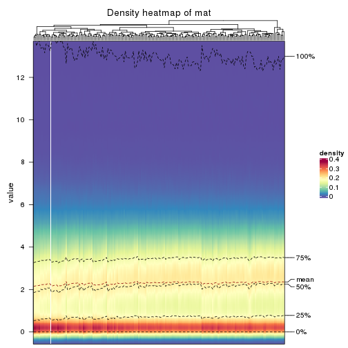


### Suggest the best k


Folowing table shows the best `k` (number of partitions) for each combination
of top-value methods and partition methods. Clicking on the method name in
the table goes to the section for a single combination of methods.

[The cola vignette](http://bioconductor.org/packages/devel/bioc/vignettes/cola/inst/doc/cola.html#toc_13)
explains the definition of the metrics used for determining the best
number of partitions.


```r
suggest_best_k(res_list)
```


|                            | The best k| 1-PAC| Mean silhouette| Concordance|   |Optional k |
|:---------------------------|----------:|-----:|---------------:|-----------:|:--|:----------|
|[SD:skmeans](#SD-skmeans)   |          2| 1.000|           0.975|       0.989|** |           |
|[MAD:skmeans](#MAD-skmeans) |          2| 1.000|           0.974|       0.990|** |           |
|[ATC:pam](#ATC-pam)         |          4| 1.000|           0.973|       0.990|** |2,3        |
|[ATC:skmeans](#ATC-skmeans) |          3| 0.998|           0.964|       0.979|** |2          |
|[ATC:NMF](#ATC-NMF)         |          2| 0.989|           0.936|       0.977|** |           |
|[MAD:kmeans](#MAD-kmeans)   |          3| 0.953|           0.938|       0.974|** |2          |
|[SD:kmeans](#SD-kmeans)     |          3| 0.939|           0.929|       0.970|*  |2          |
|[ATC:kmeans](#ATC-kmeans)   |          3| 0.939|           0.922|       0.970|*  |2          |
|[SD:NMF](#SD-NMF)           |          2| 0.923|           0.926|       0.970|*  |           |
|[CV:skmeans](#CV-skmeans)   |          2| 0.922|           0.938|       0.974|*  |           |
|[CV:kmeans](#CV-kmeans)     |          2| 0.912|           0.923|       0.968|*  |           |
|[CV:NMF](#CV-NMF)           |          2| 0.901|           0.935|       0.973|*  |           |
|[MAD:NMF](#MAD-NMF)         |          2| 0.892|           0.928|       0.970|   |           |
|[MAD:mclust](#MAD-mclust)   |          4| 0.873|           0.892|       0.942|   |           |
|[MAD:pam](#MAD-pam)         |          2| 0.872|           0.937|       0.969|   |           |
|[SD:pam](#SD-pam)           |          2| 0.862|           0.927|       0.967|   |           |
|[SD:mclust](#SD-mclust)     |          4| 0.809|           0.877|       0.917|   |           |
|[ATC:mclust](#ATC-mclust)   |          2| 0.762|           0.940|       0.953|   |           |
|[ATC:hclust](#ATC-hclust)   |          2| 0.584|           0.841|       0.919|   |           |
|[CV:pam](#CV-pam)           |          2| 0.583|           0.861|       0.922|   |           |
|[MAD:hclust](#MAD-hclust)   |          3| 0.574|           0.757|       0.875|   |           |
|[SD:hclust](#SD-hclust)     |          3| 0.546|           0.733|       0.869|   |           |
|[CV:hclust](#CV-hclust)     |          3| 0.223|           0.543|       0.697|   |           |
|[CV:mclust](#CV-mclust)     |          2| 0.201|           0.719|       0.832|   |           |

\*\*: 1-PAC > 0.95, \*: 1-PAC > 0.9


### CDF of consensus matrices

Cumulative distribution function curves of consensus matrix for all methods.


```r
collect_plots(res_list, fun = plot_ecdf)
```

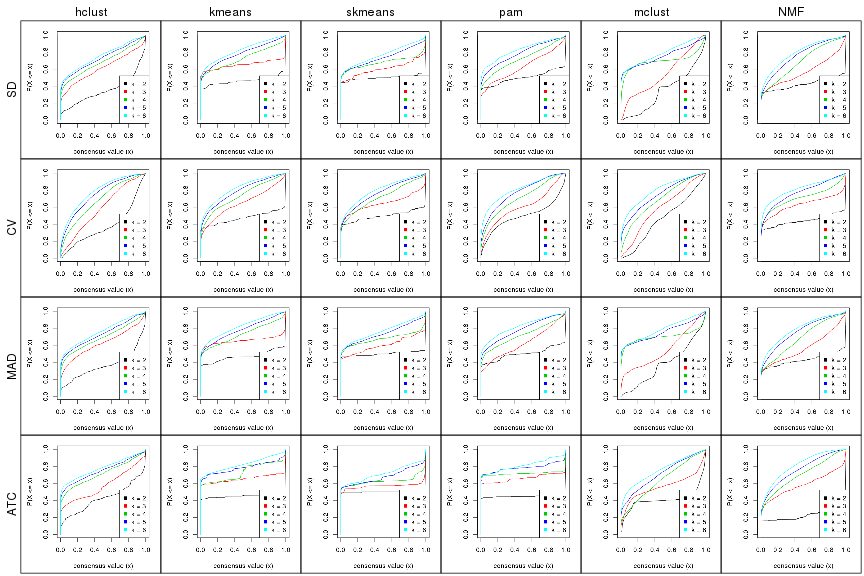


### Consensus heatmap

Consensus heatmaps for all methods. ([What is a consensus heatmap?](http://bioconductor.org/packages/devel/bioc/vignettes/cola/inst/doc/cola.html#toc_9))


<style type='text/css'>


.ui-helper-hidden {
	display: none;
}
.ui-helper-hidden-accessible {
	border: 0;
	clip: rect(0 0 0 0);
	height: 1px;
	margin: -1px;
	overflow: hidden;
	padding: 0;
	position: absolute;
	width: 1px;
}
.ui-helper-reset {
	margin: 0;
	padding: 0;
	border: 0;
	outline: 0;
	line-height: 1.3;
	text-decoration: none;
	font-size: 100%;
	list-style: none;
}
.ui-helper-clearfix:before,
.ui-helper-clearfix:after {
	content: "";
	display: table;
	border-collapse: collapse;
}
.ui-helper-clearfix:after {
	clear: both;
}
.ui-helper-zfix {
	width: 100%;
	height: 100%;
	top: 0;
	left: 0;
	position: absolute;
	opacity: 0;
	filter:Alpha(Opacity=0); 
}

.ui-front {
	z-index: 100;
}


.ui-state-disabled {
	cursor: default !important;
	pointer-events: none;
}


.ui-icon {
	display: inline-block;
	vertical-align: middle;
	margin-top: -.25em;
	position: relative;
	text-indent: -99999px;
	overflow: hidden;
	background-repeat: no-repeat;
}

.ui-widget-icon-block {
	left: 50%;
	margin-left: -8px;
	display: block;
}


.ui-widget-overlay {
	position: fixed;
	top: 0;
	left: 0;
	width: 100%;
	height: 100%;
}
.ui-accordion .ui-accordion-header {
	display: block;
	cursor: pointer;
	position: relative;
	margin: 2px 0 0 0;
	padding: .5em .5em .5em .7em;
	font-size: 100%;
}
.ui-accordion .ui-accordion-content {
	padding: 1em 2.2em;
	border-top: 0;
	overflow: auto;
}
.ui-autocomplete {
	position: absolute;
	top: 0;
	left: 0;
	cursor: default;
}
.ui-menu {
	list-style: none;
	padding: 0;
	margin: 0;
	display: block;
	outline: 0;
}
.ui-menu .ui-menu {
	position: absolute;
}
.ui-menu .ui-menu-item {
	margin: 0;
	cursor: pointer;
	
	list-style-image: url("data:image/gif;base64,R0lGODlhAQABAIAAAAAAAP///yH5BAEAAAAALAAAAAABAAEAAAIBRAA7");
}
.ui-menu .ui-menu-item-wrapper {
	position: relative;
	padding: 3px 1em 3px .4em;
}
.ui-menu .ui-menu-divider {
	margin: 5px 0;
	height: 0;
	font-size: 0;
	line-height: 0;
	border-width: 1px 0 0 0;
}
.ui-menu .ui-state-focus,
.ui-menu .ui-state-active {
	margin: -1px;
}


.ui-menu-icons {
	position: relative;
}
.ui-menu-icons .ui-menu-item-wrapper {
	padding-left: 2em;
}


.ui-menu .ui-icon {
	position: absolute;
	top: 0;
	bottom: 0;
	left: .2em;
	margin: auto 0;
}


.ui-menu .ui-menu-icon {
	left: auto;
	right: 0;
}
.ui-button {
	padding: .4em 1em;
	display: inline-block;
	position: relative;
	line-height: normal;
	margin-right: .1em;
	cursor: pointer;
	vertical-align: middle;
	text-align: center;
	-webkit-user-select: none;
	-moz-user-select: none;
	-ms-user-select: none;
	user-select: none;

	
	overflow: visible;
}

.ui-button,
.ui-button:link,
.ui-button:visited,
.ui-button:hover,
.ui-button:active {
	text-decoration: none;
}


.ui-button-icon-only {
	width: 2em;
	box-sizing: border-box;
	text-indent: -9999px;
	white-space: nowrap;
}


input.ui-button.ui-button-icon-only {
	text-indent: 0;
}


.ui-button-icon-only .ui-icon {
	position: absolute;
	top: 50%;
	left: 50%;
	margin-top: -8px;
	margin-left: -8px;
}

.ui-button.ui-icon-notext .ui-icon {
	padding: 0;
	width: 2.1em;
	height: 2.1em;
	text-indent: -9999px;
	white-space: nowrap;

}

input.ui-button.ui-icon-notext .ui-icon {
	width: auto;
	height: auto;
	text-indent: 0;
	white-space: normal;
	padding: .4em 1em;
}


input.ui-button::-moz-focus-inner,
button.ui-button::-moz-focus-inner {
	border: 0;
	padding: 0;
}
.ui-controlgroup {
	vertical-align: middle;
	display: inline-block;
}
.ui-controlgroup > .ui-controlgroup-item {
	float: left;
	margin-left: 0;
	margin-right: 0;
}
.ui-controlgroup > .ui-controlgroup-item:focus,
.ui-controlgroup > .ui-controlgroup-item.ui-visual-focus {
	z-index: 9999;
}
.ui-controlgroup-vertical > .ui-controlgroup-item {
	display: block;
	float: none;
	width: 100%;
	margin-top: 0;
	margin-bottom: 0;
	text-align: left;
}
.ui-controlgroup-vertical .ui-controlgroup-item {
	box-sizing: border-box;
}
.ui-controlgroup .ui-controlgroup-label {
	padding: .4em 1em;
}
.ui-controlgroup .ui-controlgroup-label span {
	font-size: 80%;
}
.ui-controlgroup-horizontal .ui-controlgroup-label + .ui-controlgroup-item {
	border-left: none;
}
.ui-controlgroup-vertical .ui-controlgroup-label + .ui-controlgroup-item {
	border-top: none;
}
.ui-controlgroup-horizontal .ui-controlgroup-label.ui-widget-content {
	border-right: none;
}
.ui-controlgroup-vertical .ui-controlgroup-label.ui-widget-content {
	border-bottom: none;
}


.ui-controlgroup-vertical .ui-spinner-input {

	
	width: 75%;
	width: calc( 100% - 2.4em );
}
.ui-controlgroup-vertical .ui-spinner .ui-spinner-up {
	border-top-style: solid;
}

.ui-checkboxradio-label .ui-icon-background {
	box-shadow: inset 1px 1px 1px #ccc;
	border-radius: .12em;
	border: none;
}
.ui-checkboxradio-radio-label .ui-icon-background {
	width: 16px;
	height: 16px;
	border-radius: 1em;
	overflow: visible;
	border: none;
}
.ui-checkboxradio-radio-label.ui-checkboxradio-checked .ui-icon,
.ui-checkboxradio-radio-label.ui-checkboxradio-checked:hover .ui-icon {
	background-image: none;
	width: 8px;
	height: 8px;
	border-width: 4px;
	border-style: solid;
}
.ui-checkboxradio-disabled {
	pointer-events: none;
}
.ui-datepicker {
	width: 17em;
	padding: .2em .2em 0;
	display: none;
}
.ui-datepicker .ui-datepicker-header {
	position: relative;
	padding: .2em 0;
}
.ui-datepicker .ui-datepicker-prev,
.ui-datepicker .ui-datepicker-next {
	position: absolute;
	top: 2px;
	width: 1.8em;
	height: 1.8em;
}
.ui-datepicker .ui-datepicker-prev-hover,
.ui-datepicker .ui-datepicker-next-hover {
	top: 1px;
}
.ui-datepicker .ui-datepicker-prev {
	left: 2px;
}
.ui-datepicker .ui-datepicker-next {
	right: 2px;
}
.ui-datepicker .ui-datepicker-prev-hover {
	left: 1px;
}
.ui-datepicker .ui-datepicker-next-hover {
	right: 1px;
}
.ui-datepicker .ui-datepicker-prev span,
.ui-datepicker .ui-datepicker-next span {
	display: block;
	position: absolute;
	left: 50%;
	margin-left: -8px;
	top: 50%;
	margin-top: -8px;
}
.ui-datepicker .ui-datepicker-title {
	margin: 0 2.3em;
	line-height: 1.8em;
	text-align: center;
}
.ui-datepicker .ui-datepicker-title select {
	font-size: 1em;
	margin: 1px 0;
}
.ui-datepicker select.ui-datepicker-month,
.ui-datepicker select.ui-datepicker-year {
	width: 45%;
}
.ui-datepicker table {
	width: 100%;
	font-size: .9em;
	border-collapse: collapse;
	margin: 0 0 .4em;
}
.ui-datepicker th {
	padding: .7em .3em;
	text-align: center;
	font-weight: bold;
	border: 0;
}
.ui-datepicker td {
	border: 0;
	padding: 1px;
}
.ui-datepicker td span,
.ui-datepicker td a {
	display: block;
	padding: .2em;
	text-align: right;
	text-decoration: none;
}
.ui-datepicker .ui-datepicker-buttonpane {
	background-image: none;
	margin: .7em 0 0 0;
	padding: 0 .2em;
	border-left: 0;
	border-right: 0;
	border-bottom: 0;
}
.ui-datepicker .ui-datepicker-buttonpane button {
	float: right;
	margin: .5em .2em .4em;
	cursor: pointer;
	padding: .2em .6em .3em .6em;
	width: auto;
	overflow: visible;
}
.ui-datepicker .ui-datepicker-buttonpane button.ui-datepicker-current {
	float: left;
}


.ui-datepicker.ui-datepicker-multi {
	width: auto;
}
.ui-datepicker-multi .ui-datepicker-group {
	float: left;
}
.ui-datepicker-multi .ui-datepicker-group table {
	width: 95%;
	margin: 0 auto .4em;
}
.ui-datepicker-multi-2 .ui-datepicker-group {
	width: 50%;
}
.ui-datepicker-multi-3 .ui-datepicker-group {
	width: 33.3%;
}
.ui-datepicker-multi-4 .ui-datepicker-group {
	width: 25%;
}
.ui-datepicker-multi .ui-datepicker-group-last .ui-datepicker-header,
.ui-datepicker-multi .ui-datepicker-group-middle .ui-datepicker-header {
	border-left-width: 0;
}
.ui-datepicker-multi .ui-datepicker-buttonpane {
	clear: left;
}
.ui-datepicker-row-break {
	clear: both;
	width: 100%;
	font-size: 0;
}


.ui-datepicker-rtl {
	direction: rtl;
}
.ui-datepicker-rtl .ui-datepicker-prev {
	right: 2px;
	left: auto;
}
.ui-datepicker-rtl .ui-datepicker-next {
	left: 2px;
	right: auto;
}
.ui-datepicker-rtl .ui-datepicker-prev:hover {
	right: 1px;
	left: auto;
}
.ui-datepicker-rtl .ui-datepicker-next:hover {
	left: 1px;
	right: auto;
}
.ui-datepicker-rtl .ui-datepicker-buttonpane {
	clear: right;
}
.ui-datepicker-rtl .ui-datepicker-buttonpane button {
	float: left;
}
.ui-datepicker-rtl .ui-datepicker-buttonpane button.ui-datepicker-current,
.ui-datepicker-rtl .ui-datepicker-group {
	float: right;
}
.ui-datepicker-rtl .ui-datepicker-group-last .ui-datepicker-header,
.ui-datepicker-rtl .ui-datepicker-group-middle .ui-datepicker-header {
	border-right-width: 0;
	border-left-width: 1px;
}


.ui-datepicker .ui-icon {
	display: block;
	text-indent: -99999px;
	overflow: hidden;
	background-repeat: no-repeat;
	left: .5em;
	top: .3em;
}
.ui-dialog {
	position: absolute;
	top: 0;
	left: 0;
	padding: .2em;
	outline: 0;
}
.ui-dialog .ui-dialog-titlebar {
	padding: .4em 1em;
	position: relative;
}
.ui-dialog .ui-dialog-title {
	float: left;
	margin: .1em 0;
	white-space: nowrap;
	width: 90%;
	overflow: hidden;
	text-overflow: ellipsis;
}
.ui-dialog .ui-dialog-titlebar-close {
	position: absolute;
	right: .3em;
	top: 50%;
	width: 20px;
	margin: -10px 0 0 0;
	padding: 1px;
	height: 20px;
}
.ui-dialog .ui-dialog-content {
	position: relative;
	border: 0;
	padding: .5em 1em;
	background: none;
	overflow: auto;
}
.ui-dialog .ui-dialog-buttonpane {
	text-align: left;
	border-width: 1px 0 0 0;
	background-image: none;
	margin-top: .5em;
	padding: .3em 1em .5em .4em;
}
.ui-dialog .ui-dialog-buttonpane .ui-dialog-buttonset {
	float: right;
}
.ui-dialog .ui-dialog-buttonpane button {
	margin: .5em .4em .5em 0;
	cursor: pointer;
}
.ui-dialog .ui-resizable-n {
	height: 2px;
	top: 0;
}
.ui-dialog .ui-resizable-e {
	width: 2px;
	right: 0;
}
.ui-dialog .ui-resizable-s {
	height: 2px;
	bottom: 0;
}
.ui-dialog .ui-resizable-w {
	width: 2px;
	left: 0;
}
.ui-dialog .ui-resizable-se,
.ui-dialog .ui-resizable-sw,
.ui-dialog .ui-resizable-ne,
.ui-dialog .ui-resizable-nw {
	width: 7px;
	height: 7px;
}
.ui-dialog .ui-resizable-se {
	right: 0;
	bottom: 0;
}
.ui-dialog .ui-resizable-sw {
	left: 0;
	bottom: 0;
}
.ui-dialog .ui-resizable-ne {
	right: 0;
	top: 0;
}
.ui-dialog .ui-resizable-nw {
	left: 0;
	top: 0;
}
.ui-draggable .ui-dialog-titlebar {
	cursor: move;
}
.ui-draggable-handle {
	-ms-touch-action: none;
	touch-action: none;
}
.ui-resizable {
	position: relative;
}
.ui-resizable-handle {
	position: absolute;
	font-size: 0.1px;
	display: block;
	-ms-touch-action: none;
	touch-action: none;
}
.ui-resizable-disabled .ui-resizable-handle,
.ui-resizable-autohide .ui-resizable-handle {
	display: none;
}
.ui-resizable-n {
	cursor: n-resize;
	height: 7px;
	width: 100%;
	top: -5px;
	left: 0;
}
.ui-resizable-s {
	cursor: s-resize;
	height: 7px;
	width: 100%;
	bottom: -5px;
	left: 0;
}
.ui-resizable-e {
	cursor: e-resize;
	width: 7px;
	right: -5px;
	top: 0;
	height: 100%;
}
.ui-resizable-w {
	cursor: w-resize;
	width: 7px;
	left: -5px;
	top: 0;
	height: 100%;
}
.ui-resizable-se {
	cursor: se-resize;
	width: 12px;
	height: 12px;
	right: 1px;
	bottom: 1px;
}
.ui-resizable-sw {
	cursor: sw-resize;
	width: 9px;
	height: 9px;
	left: -5px;
	bottom: -5px;
}
.ui-resizable-nw {
	cursor: nw-resize;
	width: 9px;
	height: 9px;
	left: -5px;
	top: -5px;
}
.ui-resizable-ne {
	cursor: ne-resize;
	width: 9px;
	height: 9px;
	right: -5px;
	top: -5px;
}
.ui-progressbar {
	height: 2em;
	text-align: left;
	overflow: hidden;
}
.ui-progressbar .ui-progressbar-value {
	margin: -1px;
	height: 100%;
}
.ui-progressbar .ui-progressbar-overlay {
	background: url("");
	height: 100%;
	filter: alpha(opacity=25); 
	opacity: 0.25;
}
.ui-progressbar-indeterminate .ui-progressbar-value {
	background-image: none;
}
.ui-selectable {
	-ms-touch-action: none;
	touch-action: none;
}
.ui-selectable-helper {
	position: absolute;
	z-index: 100;
	border: 1px dotted black;
}
.ui-selectmenu-menu {
	padding: 0;
	margin: 0;
	position: absolute;
	top: 0;
	left: 0;
	display: none;
}
.ui-selectmenu-menu .ui-menu {
	overflow: auto;
	overflow-x: hidden;
	padding-bottom: 1px;
}
.ui-selectmenu-menu .ui-menu .ui-selectmenu-optgroup {
	font-size: 1em;
	font-weight: bold;
	line-height: 1.5;
	padding: 2px 0.4em;
	margin: 0.5em 0 0 0;
	height: auto;
	border: 0;
}
.ui-selectmenu-open {
	display: block;
}
.ui-selectmenu-text {
	display: block;
	margin-right: 20px;
	overflow: hidden;
	text-overflow: ellipsis;
}
.ui-selectmenu-button.ui-button {
	text-align: left;
	white-space: nowrap;
	width: 14em;
}
.ui-selectmenu-icon.ui-icon {
	float: right;
	margin-top: 0;
}
.ui-slider {
	position: relative;
	text-align: left;
}
.ui-slider .ui-slider-handle {
	position: absolute;
	z-index: 2;
	width: 1.2em;
	height: 1.2em;
	cursor: default;
	-ms-touch-action: none;
	touch-action: none;
}
.ui-slider .ui-slider-range {
	position: absolute;
	z-index: 1;
	font-size: .7em;
	display: block;
	border: 0;
	background-position: 0 0;
}


.ui-slider.ui-state-disabled .ui-slider-handle,
.ui-slider.ui-state-disabled .ui-slider-range {
	filter: inherit;
}

.ui-slider-horizontal {
	height: .8em;
}
.ui-slider-horizontal .ui-slider-handle {
	top: -.3em;
	margin-left: -.6em;
}
.ui-slider-horizontal .ui-slider-range {
	top: 0;
	height: 100%;
}
.ui-slider-horizontal .ui-slider-range-min {
	left: 0;
}
.ui-slider-horizontal .ui-slider-range-max {
	right: 0;
}

.ui-slider-vertical {
	width: .8em;
	height: 100px;
}
.ui-slider-vertical .ui-slider-handle {
	left: -.3em;
	margin-left: 0;
	margin-bottom: -.6em;
}
.ui-slider-vertical .ui-slider-range {
	left: 0;
	width: 100%;
}
.ui-slider-vertical .ui-slider-range-min {
	bottom: 0;
}
.ui-slider-vertical .ui-slider-range-max {
	top: 0;
}
.ui-sortable-handle {
	-ms-touch-action: none;
	touch-action: none;
}
.ui-spinner {
	position: relative;
	display: inline-block;
	overflow: hidden;
	padding: 0;
	vertical-align: middle;
}
.ui-spinner-input {
	border: none;
	background: none;
	color: inherit;
	padding: .222em 0;
	margin: .2em 0;
	vertical-align: middle;
	margin-left: .4em;
	margin-right: 2em;
}
.ui-spinner-button {
	width: 1.6em;
	height: 50%;
	font-size: .5em;
	padding: 0;
	margin: 0;
	text-align: center;
	position: absolute;
	cursor: default;
	display: block;
	overflow: hidden;
	right: 0;
}

.ui-spinner a.ui-spinner-button {
	border-top-style: none;
	border-bottom-style: none;
	border-right-style: none;
}
.ui-spinner-up {
	top: 0;
}
.ui-spinner-down {
	bottom: 0;
}
.ui-tabs {
	position: relative;
	padding: .2em;
}
.ui-tabs .ui-tabs-nav {
	margin: 0;
	padding: .2em .2em 0;
}
.ui-tabs .ui-tabs-nav li {
	list-style: none;
	float: left;
	position: relative;
	top: 0;
	margin: 1px .2em 0 0;
	border-bottom-width: 0;
	padding: 0;
	white-space: nowrap;
}
.ui-tabs .ui-tabs-nav .ui-tabs-anchor {
	float: left;
	padding: .5em 1em;
	text-decoration: none;
}
.ui-tabs .ui-tabs-nav li.ui-tabs-active {
	margin-bottom: -1px;
	padding-bottom: 1px;
}
.ui-tabs .ui-tabs-nav li.ui-tabs-active .ui-tabs-anchor,
.ui-tabs .ui-tabs-nav li.ui-state-disabled .ui-tabs-anchor,
.ui-tabs .ui-tabs-nav li.ui-tabs-loading .ui-tabs-anchor {
	cursor: text;
}
.ui-tabs-collapsible .ui-tabs-nav li.ui-tabs-active .ui-tabs-anchor {
	cursor: pointer;
}
.ui-tabs .ui-tabs-panel {
	display: block;
	border-width: 0;
	padding: 1em 1.4em;
	background: none;
}
.ui-tooltip {
	padding: 8px;
	position: absolute;
	z-index: 9999;
	max-width: 300px;
}
body .ui-tooltip {
	border-width: 2px;
}

.ui-widget {
	font-family: Arial,Helvetica,sans-serif;
	font-size: 1em;
}
.ui-widget .ui-widget {
	font-size: 1em;
}
.ui-widget input,
.ui-widget select,
.ui-widget textarea,
.ui-widget button {
	font-family: Arial,Helvetica,sans-serif;
	font-size: 1em;
}
.ui-widget.ui-widget-content {
	border: 1px solid #c5c5c5;
}
.ui-widget-content {
	border: 1px solid #dddddd;
	background: #ffffff;
	color: #333333;
}
.ui-widget-content a {
	color: #333333;
}
.ui-widget-header {
	border: 1px solid #dddddd;
	background: #e9e9e9;
	color: #333333;
	font-weight: bold;
}
.ui-widget-header a {
	color: #333333;
}


.ui-state-default,
.ui-widget-content .ui-state-default,
.ui-widget-header .ui-state-default,
.ui-button,


html .ui-button.ui-state-disabled:hover,
html .ui-button.ui-state-disabled:active {
	border: 1px solid #c5c5c5;
	background: #f6f6f6;
	font-weight: normal;
	color: #454545;
}
.ui-state-default a,
.ui-state-default a:link,
.ui-state-default a:visited,
a.ui-button,
a:link.ui-button,
a:visited.ui-button,
.ui-button {
	color: #454545;
	text-decoration: none;
}
.ui-state-hover,
.ui-widget-content .ui-state-hover,
.ui-widget-header .ui-state-hover,
.ui-state-focus,
.ui-widget-content .ui-state-focus,
.ui-widget-header .ui-state-focus,
.ui-button:hover,
.ui-button:focus {
	border: 1px solid #cccccc;
	background: #ededed;
	font-weight: normal;
	color: #2b2b2b;
}
.ui-state-hover a,
.ui-state-hover a:hover,
.ui-state-hover a:link,
.ui-state-hover a:visited,
.ui-state-focus a,
.ui-state-focus a:hover,
.ui-state-focus a:link,
.ui-state-focus a:visited,
a.ui-button:hover,
a.ui-button:focus {
	color: #2b2b2b;
	text-decoration: none;
}

.ui-visual-focus {
	box-shadow: 0 0 3px 1px rgb(94, 158, 214);
}
.ui-state-active,
.ui-widget-content .ui-state-active,
.ui-widget-header .ui-state-active,
a.ui-button:active,
.ui-button:active,
.ui-button.ui-state-active:hover {
	border: 1px solid #003eff;
	background: #007fff;
	font-weight: normal;
	color: #ffffff;
}
.ui-icon-background,
.ui-state-active .ui-icon-background {
	border: #003eff;
	background-color: #ffffff;
}
.ui-state-active a,
.ui-state-active a:link,
.ui-state-active a:visited {
	color: #ffffff;
	text-decoration: none;
}


.ui-state-highlight,
.ui-widget-content .ui-state-highlight,
.ui-widget-header .ui-state-highlight {
	border: 1px solid #dad55e;
	background: #fffa90;
	color: #777620;
}
.ui-state-checked {
	border: 1px solid #dad55e;
	background: #fffa90;
}
.ui-state-highlight a,
.ui-widget-content .ui-state-highlight a,
.ui-widget-header .ui-state-highlight a {
	color: #777620;
}
.ui-state-error,
.ui-widget-content .ui-state-error,
.ui-widget-header .ui-state-error {
	border: 1px solid #f1a899;
	background: #fddfdf;
	color: #5f3f3f;
}
.ui-state-error a,
.ui-widget-content .ui-state-error a,
.ui-widget-header .ui-state-error a {
	color: #5f3f3f;
}
.ui-state-error-text,
.ui-widget-content .ui-state-error-text,
.ui-widget-header .ui-state-error-text {
	color: #5f3f3f;
}
.ui-priority-primary,
.ui-widget-content .ui-priority-primary,
.ui-widget-header .ui-priority-primary {
	font-weight: bold;
}
.ui-priority-secondary,
.ui-widget-content .ui-priority-secondary,
.ui-widget-header .ui-priority-secondary {
	opacity: .7;
	filter:Alpha(Opacity=70); 
	font-weight: normal;
}
.ui-state-disabled,
.ui-widget-content .ui-state-disabled,
.ui-widget-header .ui-state-disabled {
	opacity: .35;
	filter:Alpha(Opacity=35); 
	background-image: none;
}
.ui-state-disabled .ui-icon {
	filter:Alpha(Opacity=35); 
}


.ui-icon {
	width: 16px;
	height: 16px;
}
.ui-icon,
.ui-widget-content .ui-icon {
	background-image: url("images/ui-icons_444444_256x240.png");
}
.ui-widget-header .ui-icon {
	background-image: url("images/ui-icons_444444_256x240.png");
}
.ui-state-hover .ui-icon,
.ui-state-focus .ui-icon,
.ui-button:hover .ui-icon,
.ui-button:focus .ui-icon {
	background-image: url("images/ui-icons_555555_256x240.png");
}
.ui-state-active .ui-icon,
.ui-button:active .ui-icon {
	background-image: url("images/ui-icons_ffffff_256x240.png");
}
.ui-state-highlight .ui-icon,
.ui-button .ui-state-highlight.ui-icon {
	background-image: url("images/ui-icons_777620_256x240.png");
}
.ui-state-error .ui-icon,
.ui-state-error-text .ui-icon {
	background-image: url("images/ui-icons_cc0000_256x240.png");
}
.ui-button .ui-icon {
	background-image: url("images/ui-icons_777777_256x240.png");
}


.ui-icon-blank { background-position: 16px 16px; }
.ui-icon-caret-1-n { background-position: 0 0; }
.ui-icon-caret-1-ne { background-position: -16px 0; }
.ui-icon-caret-1-e { background-position: -32px 0; }
.ui-icon-caret-1-se { background-position: -48px 0; }
.ui-icon-caret-1-s { background-position: -65px 0; }
.ui-icon-caret-1-sw { background-position: -80px 0; }
.ui-icon-caret-1-w { background-position: -96px 0; }
.ui-icon-caret-1-nw { background-position: -112px 0; }
.ui-icon-caret-2-n-s { background-position: -128px 0; }
.ui-icon-caret-2-e-w { background-position: -144px 0; }
.ui-icon-triangle-1-n { background-position: 0 -16px; }
.ui-icon-triangle-1-ne { background-position: -16px -16px; }
.ui-icon-triangle-1-e { background-position: -32px -16px; }
.ui-icon-triangle-1-se { background-position: -48px -16px; }
.ui-icon-triangle-1-s { background-position: -65px -16px; }
.ui-icon-triangle-1-sw { background-position: -80px -16px; }
.ui-icon-triangle-1-w { background-position: -96px -16px; }
.ui-icon-triangle-1-nw { background-position: -112px -16px; }
.ui-icon-triangle-2-n-s { background-position: -128px -16px; }
.ui-icon-triangle-2-e-w { background-position: -144px -16px; }
.ui-icon-arrow-1-n { background-position: 0 -32px; }
.ui-icon-arrow-1-ne { background-position: -16px -32px; }
.ui-icon-arrow-1-e { background-position: -32px -32px; }
.ui-icon-arrow-1-se { background-position: -48px -32px; }
.ui-icon-arrow-1-s { background-position: -65px -32px; }
.ui-icon-arrow-1-sw { background-position: -80px -32px; }
.ui-icon-arrow-1-w { background-position: -96px -32px; }
.ui-icon-arrow-1-nw { background-position: -112px -32px; }
.ui-icon-arrow-2-n-s { background-position: -128px -32px; }
.ui-icon-arrow-2-ne-sw { background-position: -144px -32px; }
.ui-icon-arrow-2-e-w { background-position: -160px -32px; }
.ui-icon-arrow-2-se-nw { background-position: -176px -32px; }
.ui-icon-arrowstop-1-n { background-position: -192px -32px; }
.ui-icon-arrowstop-1-e { background-position: -208px -32px; }
.ui-icon-arrowstop-1-s { background-position: -224px -32px; }
.ui-icon-arrowstop-1-w { background-position: -240px -32px; }
.ui-icon-arrowthick-1-n { background-position: 1px -48px; }
.ui-icon-arrowthick-1-ne { background-position: -16px -48px; }
.ui-icon-arrowthick-1-e { background-position: -32px -48px; }
.ui-icon-arrowthick-1-se { background-position: -48px -48px; }
.ui-icon-arrowthick-1-s { background-position: -64px -48px; }
.ui-icon-arrowthick-1-sw { background-position: -80px -48px; }
.ui-icon-arrowthick-1-w { background-position: -96px -48px; }
.ui-icon-arrowthick-1-nw { background-position: -112px -48px; }
.ui-icon-arrowthick-2-n-s { background-position: -128px -48px; }
.ui-icon-arrowthick-2-ne-sw { background-position: -144px -48px; }
.ui-icon-arrowthick-2-e-w { background-position: -160px -48px; }
.ui-icon-arrowthick-2-se-nw { background-position: -176px -48px; }
.ui-icon-arrowthickstop-1-n { background-position: -192px -48px; }
.ui-icon-arrowthickstop-1-e { background-position: -208px -48px; }
.ui-icon-arrowthickstop-1-s { background-position: -224px -48px; }
.ui-icon-arrowthickstop-1-w { background-position: -240px -48px; }
.ui-icon-arrowreturnthick-1-w { background-position: 0 -64px; }
.ui-icon-arrowreturnthick-1-n { background-position: -16px -64px; }
.ui-icon-arrowreturnthick-1-e { background-position: -32px -64px; }
.ui-icon-arrowreturnthick-1-s { background-position: -48px -64px; }
.ui-icon-arrowreturn-1-w { background-position: -64px -64px; }
.ui-icon-arrowreturn-1-n { background-position: -80px -64px; }
.ui-icon-arrowreturn-1-e { background-position: -96px -64px; }
.ui-icon-arrowreturn-1-s { background-position: -112px -64px; }
.ui-icon-arrowrefresh-1-w { background-position: -128px -64px; }
.ui-icon-arrowrefresh-1-n { background-position: -144px -64px; }
.ui-icon-arrowrefresh-1-e { background-position: -160px -64px; }
.ui-icon-arrowrefresh-1-s { background-position: -176px -64px; }
.ui-icon-arrow-4 { background-position: 0 -80px; }
.ui-icon-arrow-4-diag { background-position: -16px -80px; }
.ui-icon-extlink { background-position: -32px -80px; }
.ui-icon-newwin { background-position: -48px -80px; }
.ui-icon-refresh { background-position: -64px -80px; }
.ui-icon-shuffle { background-position: -80px -80px; }
.ui-icon-transfer-e-w { background-position: -96px -80px; }
.ui-icon-transferthick-e-w { background-position: -112px -80px; }
.ui-icon-folder-collapsed { background-position: 0 -96px; }
.ui-icon-folder-open { background-position: -16px -96px; }
.ui-icon-document { background-position: -32px -96px; }
.ui-icon-document-b { background-position: -48px -96px; }
.ui-icon-note { background-position: -64px -96px; }
.ui-icon-mail-closed { background-position: -80px -96px; }
.ui-icon-mail-open { background-position: -96px -96px; }
.ui-icon-suitcase { background-position: -112px -96px; }
.ui-icon-comment { background-position: -128px -96px; }
.ui-icon-person { background-position: -144px -96px; }
.ui-icon-print { background-position: -160px -96px; }
.ui-icon-trash { background-position: -176px -96px; }
.ui-icon-locked { background-position: -192px -96px; }
.ui-icon-unlocked { background-position: -208px -96px; }
.ui-icon-bookmark { background-position: -224px -96px; }
.ui-icon-tag { background-position: -240px -96px; }
.ui-icon-home { background-position: 0 -112px; }
.ui-icon-flag { background-position: -16px -112px; }
.ui-icon-calendar { background-position: -32px -112px; }
.ui-icon-cart { background-position: -48px -112px; }
.ui-icon-pencil { background-position: -64px -112px; }
.ui-icon-clock { background-position: -80px -112px; }
.ui-icon-disk { background-position: -96px -112px; }
.ui-icon-calculator { background-position: -112px -112px; }
.ui-icon-zoomin { background-position: -128px -112px; }
.ui-icon-zoomout { background-position: -144px -112px; }
.ui-icon-search { background-position: -160px -112px; }
.ui-icon-wrench { background-position: -176px -112px; }
.ui-icon-gear { background-position: -192px -112px; }
.ui-icon-heart { background-position: -208px -112px; }
.ui-icon-star { background-position: -224px -112px; }
.ui-icon-link { background-position: -240px -112px; }
.ui-icon-cancel { background-position: 0 -128px; }
.ui-icon-plus { background-position: -16px -128px; }
.ui-icon-plusthick { background-position: -32px -128px; }
.ui-icon-minus { background-position: -48px -128px; }
.ui-icon-minusthick { background-position: -64px -128px; }
.ui-icon-close { background-position: -80px -128px; }
.ui-icon-closethick { background-position: -96px -128px; }
.ui-icon-key { background-position: -112px -128px; }
.ui-icon-lightbulb { background-position: -128px -128px; }
.ui-icon-scissors { background-position: -144px -128px; }
.ui-icon-clipboard { background-position: -160px -128px; }
.ui-icon-copy { background-position: -176px -128px; }
.ui-icon-contact { background-position: -192px -128px; }
.ui-icon-image { background-position: -208px -128px; }
.ui-icon-video { background-position: -224px -128px; }
.ui-icon-script { background-position: -240px -128px; }
.ui-icon-alert { background-position: 0 -144px; }
.ui-icon-info { background-position: -16px -144px; }
.ui-icon-notice { background-position: -32px -144px; }
.ui-icon-help { background-position: -48px -144px; }
.ui-icon-check { background-position: -64px -144px; }
.ui-icon-bullet { background-position: -80px -144px; }
.ui-icon-radio-on { background-position: -96px -144px; }
.ui-icon-radio-off { background-position: -112px -144px; }
.ui-icon-pin-w { background-position: -128px -144px; }
.ui-icon-pin-s { background-position: -144px -144px; }
.ui-icon-play { background-position: 0 -160px; }
.ui-icon-pause { background-position: -16px -160px; }
.ui-icon-seek-next { background-position: -32px -160px; }
.ui-icon-seek-prev { background-position: -48px -160px; }
.ui-icon-seek-end { background-position: -64px -160px; }
.ui-icon-seek-start { background-position: -80px -160px; }

.ui-icon-seek-first { background-position: -80px -160px; }
.ui-icon-stop { background-position: -96px -160px; }
.ui-icon-eject { background-position: -112px -160px; }
.ui-icon-volume-off { background-position: -128px -160px; }
.ui-icon-volume-on { background-position: -144px -160px; }
.ui-icon-power { background-position: 0 -176px; }
.ui-icon-signal-diag { background-position: -16px -176px; }
.ui-icon-signal { background-position: -32px -176px; }
.ui-icon-battery-0 { background-position: -48px -176px; }
.ui-icon-battery-1 { background-position: -64px -176px; }
.ui-icon-battery-2 { background-position: -80px -176px; }
.ui-icon-battery-3 { background-position: -96px -176px; }
.ui-icon-circle-plus { background-position: 0 -192px; }
.ui-icon-circle-minus { background-position: -16px -192px; }
.ui-icon-circle-close { background-position: -32px -192px; }
.ui-icon-circle-triangle-e { background-position: -48px -192px; }
.ui-icon-circle-triangle-s { background-position: -64px -192px; }
.ui-icon-circle-triangle-w { background-position: -80px -192px; }
.ui-icon-circle-triangle-n { background-position: -96px -192px; }
.ui-icon-circle-arrow-e { background-position: -112px -192px; }
.ui-icon-circle-arrow-s { background-position: -128px -192px; }
.ui-icon-circle-arrow-w { background-position: -144px -192px; }
.ui-icon-circle-arrow-n { background-position: -160px -192px; }
.ui-icon-circle-zoomin { background-position: -176px -192px; }
.ui-icon-circle-zoomout { background-position: -192px -192px; }
.ui-icon-circle-check { background-position: -208px -192px; }
.ui-icon-circlesmall-plus { background-position: 0 -208px; }
.ui-icon-circlesmall-minus { background-position: -16px -208px; }
.ui-icon-circlesmall-close { background-position: -32px -208px; }
.ui-icon-squaresmall-plus { background-position: -48px -208px; }
.ui-icon-squaresmall-minus { background-position: -64px -208px; }
.ui-icon-squaresmall-close { background-position: -80px -208px; }
.ui-icon-grip-dotted-vertical { background-position: 0 -224px; }
.ui-icon-grip-dotted-horizontal { background-position: -16px -224px; }
.ui-icon-grip-solid-vertical { background-position: -32px -224px; }
.ui-icon-grip-solid-horizontal { background-position: -48px -224px; }
.ui-icon-gripsmall-diagonal-se { background-position: -64px -224px; }
.ui-icon-grip-diagonal-se { background-position: -80px -224px; }


.ui-corner-all,
.ui-corner-top,
.ui-corner-left,
.ui-corner-tl {
	border-top-left-radius: 3px;
}
.ui-corner-all,
.ui-corner-top,
.ui-corner-right,
.ui-corner-tr {
	border-top-right-radius: 3px;
}
.ui-corner-all,
.ui-corner-bottom,
.ui-corner-left,
.ui-corner-bl {
	border-bottom-left-radius: 3px;
}
.ui-corner-all,
.ui-corner-bottom,
.ui-corner-right,
.ui-corner-br {
	border-bottom-right-radius: 3px;
}


.ui-widget-overlay {
	background: #aaaaaa;
	opacity: .3;
	filter: Alpha(Opacity=30); 
}
.ui-widget-shadow {
	-webkit-box-shadow: 0px 0px 5px #666666;
	box-shadow: 0px 0px 5px #666666;
} 
</style>
<script src='js/jquery-1.12.4.js'></script>
<script src='js/jquery-ui.js'></script>

<script>
$( function() {
	$( '#tabs-collect-consensus-heatmap' ).tabs();
} );
</script>
<div id='tabs-collect-consensus-heatmap'>
<ul>
<li><a href='#tab-collect-consensus-heatmap-1'>k = 2</a></li>
<li><a href='#tab-collect-consensus-heatmap-2'>k = 3</a></li>
<li><a href='#tab-collect-consensus-heatmap-3'>k = 4</a></li>
<li><a href='#tab-collect-consensus-heatmap-4'>k = 5</a></li>
<li><a href='#tab-collect-consensus-heatmap-5'>k = 6</a></li>
</ul>
<div id='tab-collect-consensus-heatmap-1'>
<pre><code class="r">collect_plots(res_list, k = 2, fun = consensus_heatmap, mc.cores = 4)
</code></pre>

<p>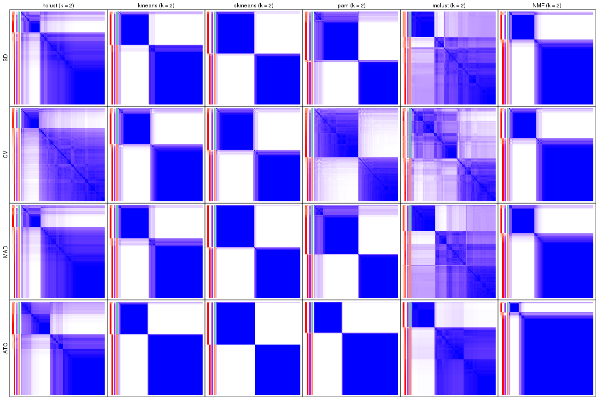</p>

</div>
<div id='tab-collect-consensus-heatmap-2'>
<pre><code class="r">collect_plots(res_list, k = 3, fun = consensus_heatmap, mc.cores = 4)
</code></pre>

<p>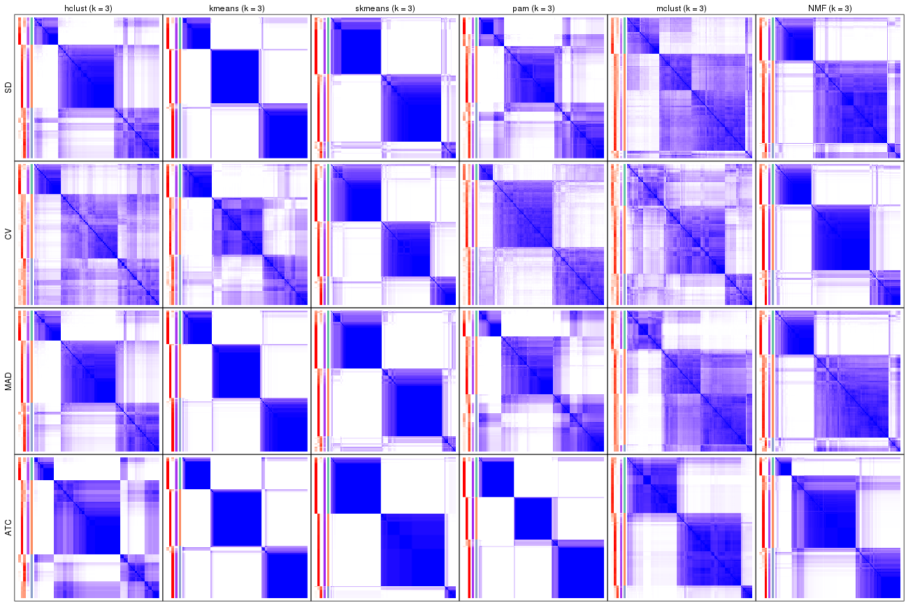</p>

</div>
<div id='tab-collect-consensus-heatmap-3'>
<pre><code class="r">collect_plots(res_list, k = 4, fun = consensus_heatmap, mc.cores = 4)
</code></pre>

<p>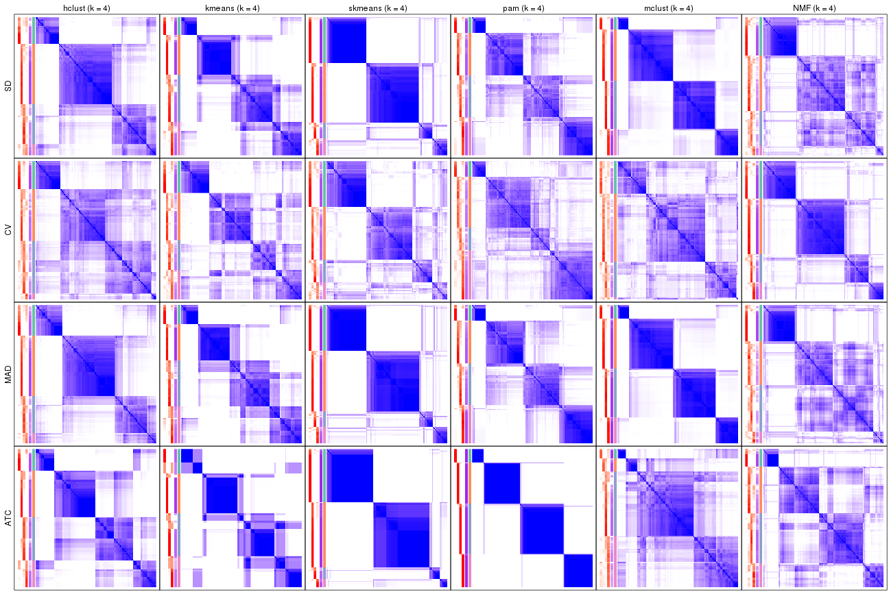</p>

</div>
<div id='tab-collect-consensus-heatmap-4'>
<pre><code class="r">collect_plots(res_list, k = 5, fun = consensus_heatmap, mc.cores = 4)
</code></pre>

<p>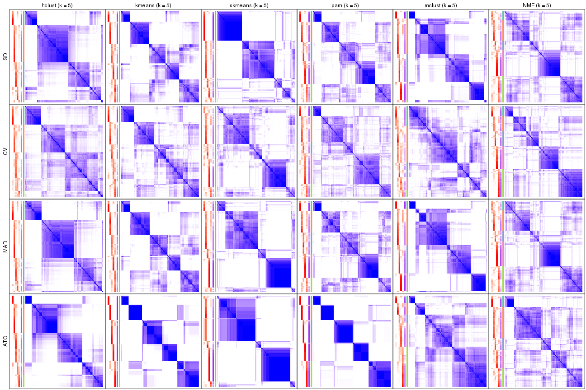</p>

</div>
<div id='tab-collect-consensus-heatmap-5'>
<pre><code class="r">collect_plots(res_list, k = 6, fun = consensus_heatmap, mc.cores = 4)
</code></pre>

<p>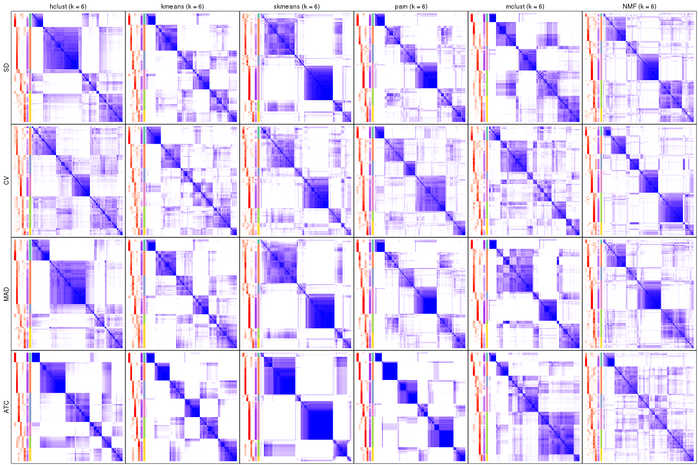</p>

</div>
</div>


### Membership heatmap

Membership heatmaps for all methods. ([What is a membership heatmap?](http://bioconductor.org/packages/devel/bioc/vignettes/cola/inst/doc/cola.html#toc_12))


<script>
$( function() {
	$( '#tabs-collect-membership-heatmap' ).tabs();
} );
</script>
<div id='tabs-collect-membership-heatmap'>
<ul>
<li><a href='#tab-collect-membership-heatmap-1'>k = 2</a></li>
<li><a href='#tab-collect-membership-heatmap-2'>k = 3</a></li>
<li><a href='#tab-collect-membership-heatmap-3'>k = 4</a></li>
<li><a href='#tab-collect-membership-heatmap-4'>k = 5</a></li>
<li><a href='#tab-collect-membership-heatmap-5'>k = 6</a></li>
</ul>
<div id='tab-collect-membership-heatmap-1'>
<pre><code class="r">collect_plots(res_list, k = 2, fun = membership_heatmap, mc.cores = 4)
</code></pre>

<p>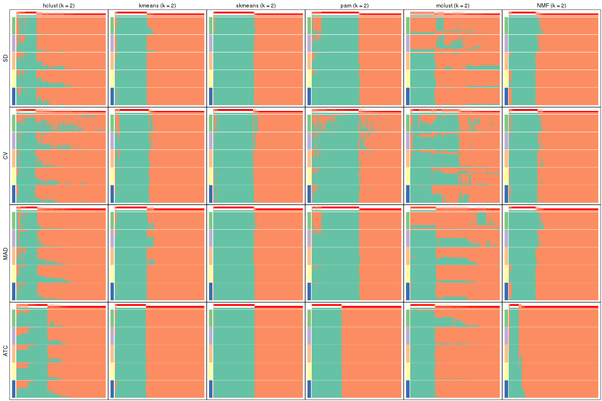</p>

</div>
<div id='tab-collect-membership-heatmap-2'>
<pre><code class="r">collect_plots(res_list, k = 3, fun = membership_heatmap, mc.cores = 4)
</code></pre>

<p>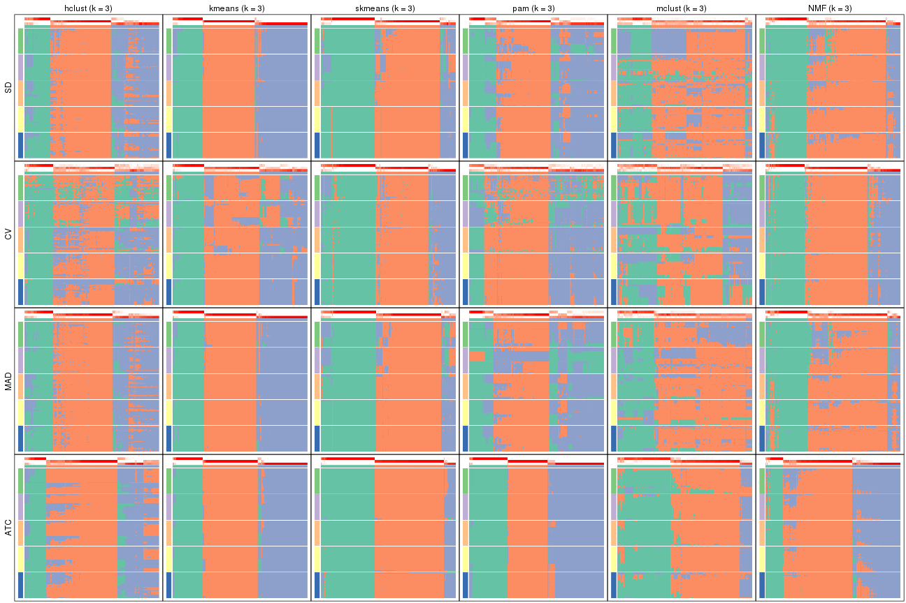</p>

</div>
<div id='tab-collect-membership-heatmap-3'>
<pre><code class="r">collect_plots(res_list, k = 4, fun = membership_heatmap, mc.cores = 4)
</code></pre>

<p>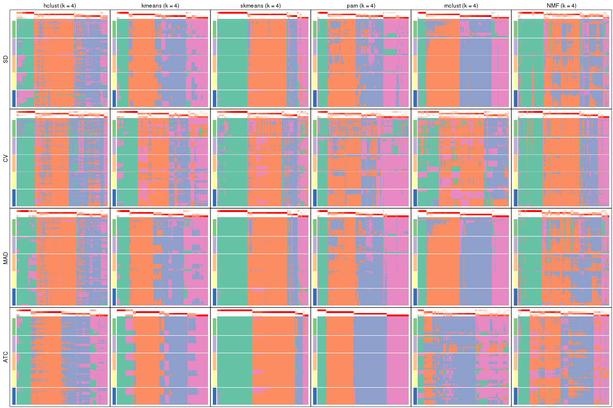</p>

</div>
<div id='tab-collect-membership-heatmap-4'>
<pre><code class="r">collect_plots(res_list, k = 5, fun = membership_heatmap, mc.cores = 4)
</code></pre>

<p>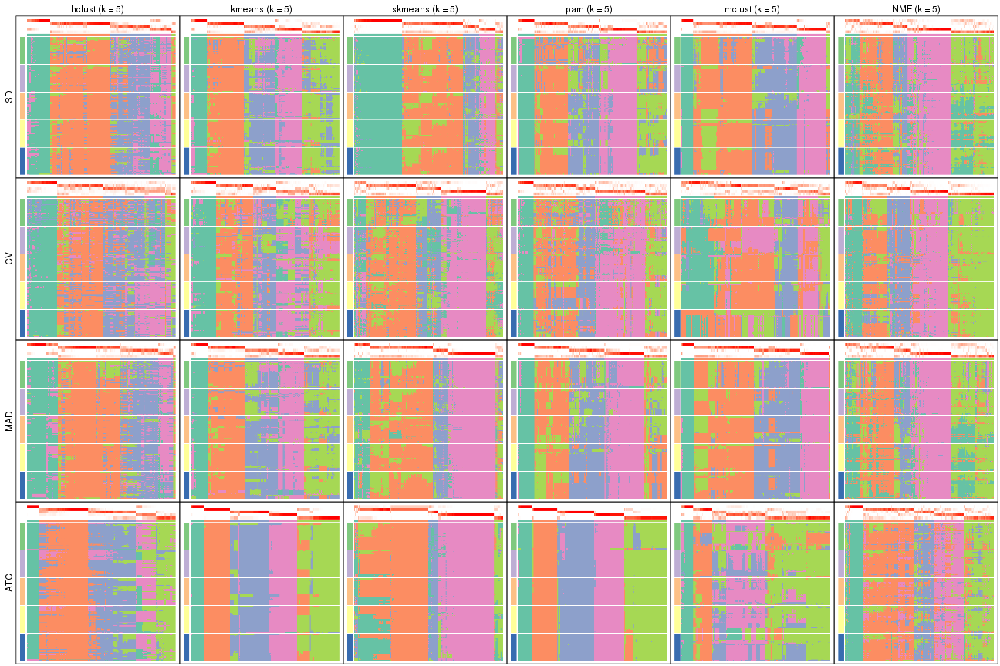</p>

</div>
<div id='tab-collect-membership-heatmap-5'>
<pre><code class="r">collect_plots(res_list, k = 6, fun = membership_heatmap, mc.cores = 4)
</code></pre>

<p>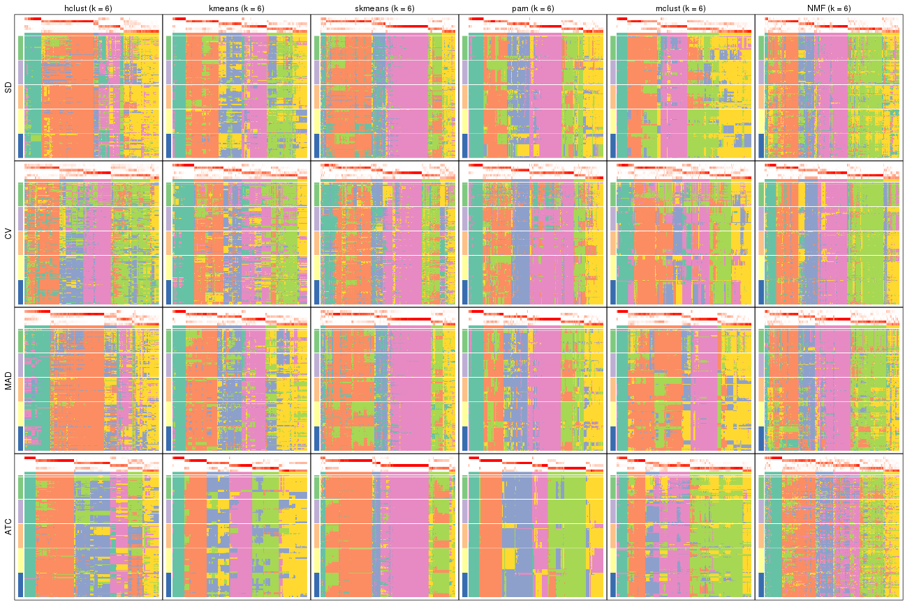</p>

</div>
</div>


### Signature heatmap

Signature heatmaps for all methods. ([What is a signature heatmap?](http://bioconductor.org/packages/devel/bioc/vignettes/cola/inst/doc/cola.html#toc_22))


Note in following heatmaps, rows are scaled.


<script>
$( function() {
	$( '#tabs-collect-get-signatures' ).tabs();
} );
</script>
<div id='tabs-collect-get-signatures'>
<ul>
<li><a href='#tab-collect-get-signatures-1'>k = 2</a></li>
<li><a href='#tab-collect-get-signatures-2'>k = 3</a></li>
<li><a href='#tab-collect-get-signatures-3'>k = 4</a></li>
<li><a href='#tab-collect-get-signatures-4'>k = 5</a></li>
<li><a href='#tab-collect-get-signatures-5'>k = 6</a></li>
</ul>
<div id='tab-collect-get-signatures-1'>
<pre><code class="r">collect_plots(res_list, k = 2, fun = get_signatures, mc.cores = 4)
</code></pre>

<p>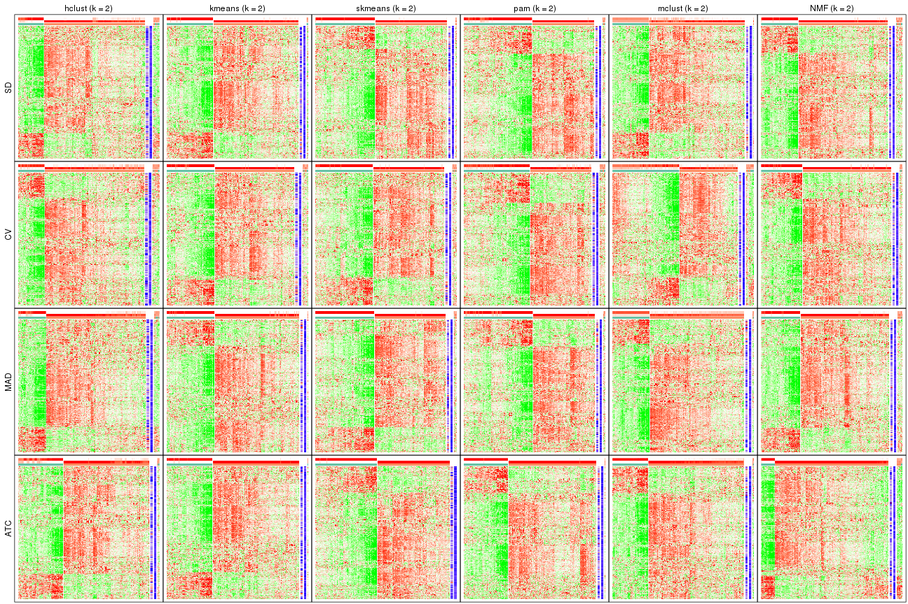</p>

</div>
<div id='tab-collect-get-signatures-2'>
<pre><code class="r">collect_plots(res_list, k = 3, fun = get_signatures, mc.cores = 4)
</code></pre>

<p>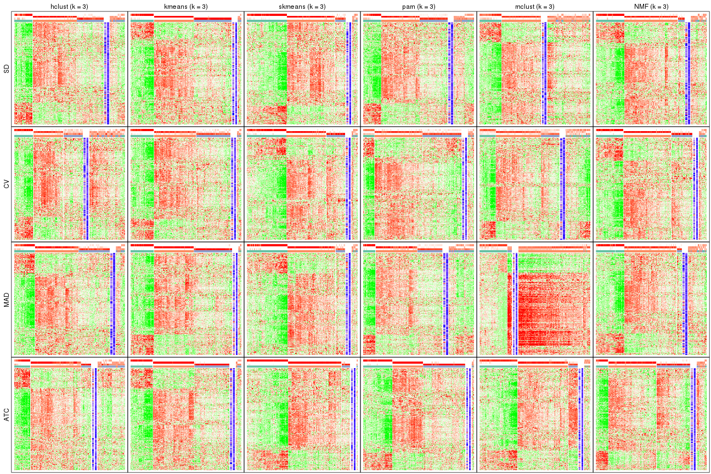</p>

</div>
<div id='tab-collect-get-signatures-3'>
<pre><code class="r">collect_plots(res_list, k = 4, fun = get_signatures, mc.cores = 4)
</code></pre>

<p>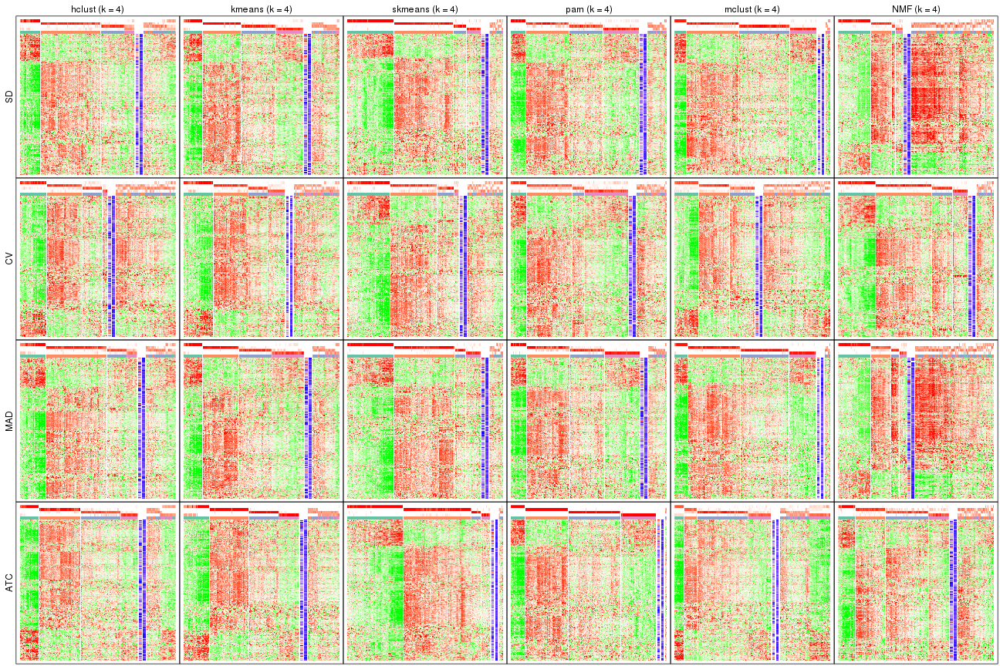</p>

</div>
<div id='tab-collect-get-signatures-4'>
<pre><code class="r">collect_plots(res_list, k = 5, fun = get_signatures, mc.cores = 4)
</code></pre>

<p>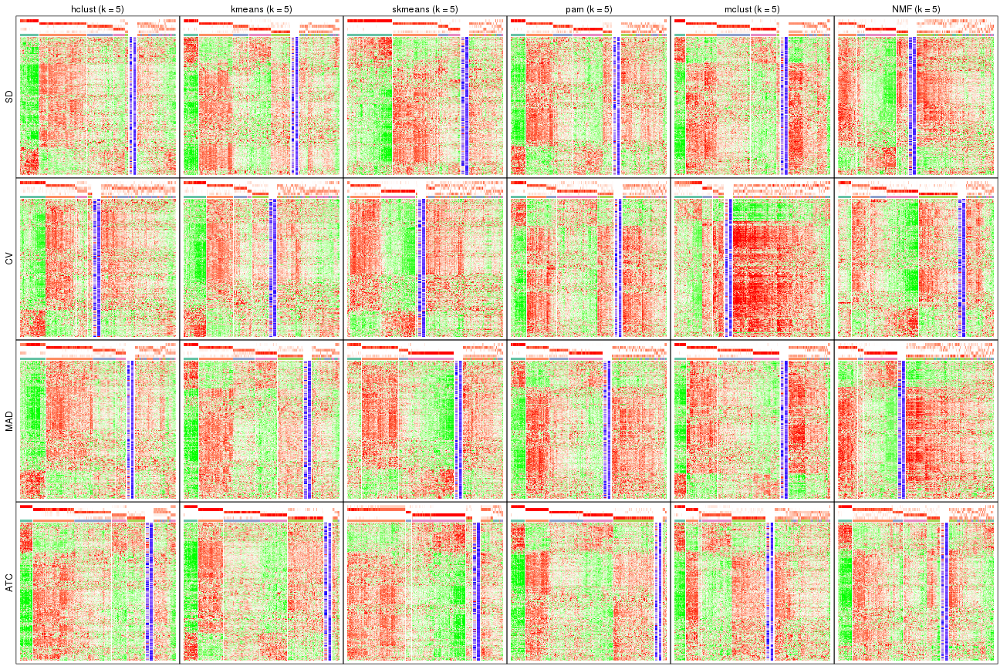</p>

</div>
<div id='tab-collect-get-signatures-5'>
<pre><code class="r">collect_plots(res_list, k = 6, fun = get_signatures, mc.cores = 4)
</code></pre>

<p>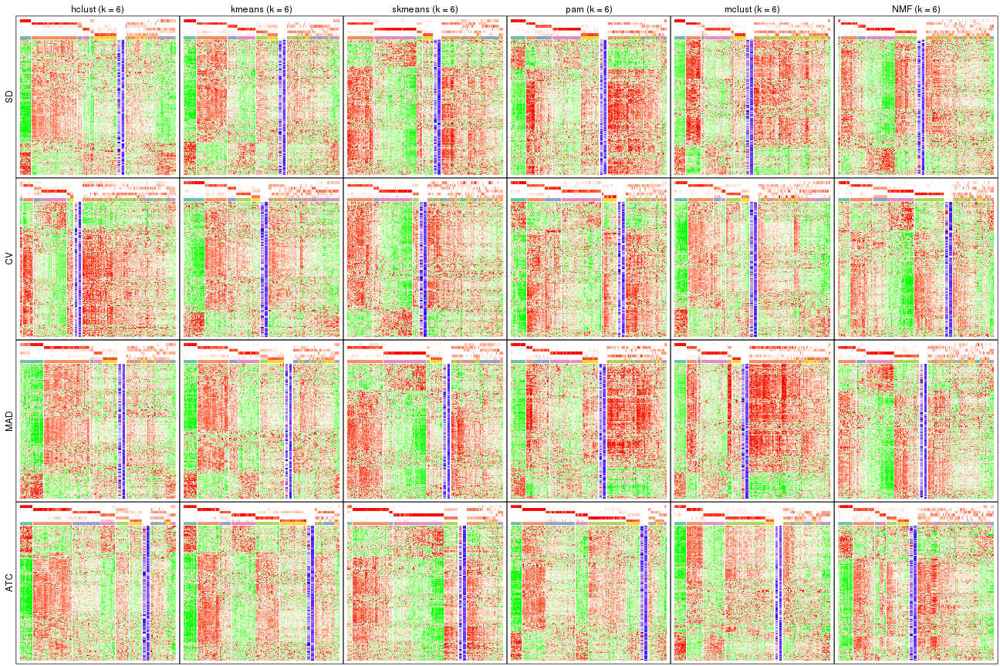</p>

</div>
</div>


### Statistics table

The statistics used for measuring the stability of consensus partitioning.
([How are they
defined?](http://bioconductor.org/packages/devel/bioc/vignettes/cola/inst/doc/cola.html#toc_13))


<script>
$( function() {
	$( '#tabs-get-stats-from-consensus-partition-list' ).tabs();
} );
</script>
<div id='tabs-get-stats-from-consensus-partition-list'>
<ul>
<li><a href='#tab-get-stats-from-consensus-partition-list-1'>k = 2</a></li>
<li><a href='#tab-get-stats-from-consensus-partition-list-2'>k = 3</a></li>
<li><a href='#tab-get-stats-from-consensus-partition-list-3'>k = 4</a></li>
<li><a href='#tab-get-stats-from-consensus-partition-list-4'>k = 5</a></li>
<li><a href='#tab-get-stats-from-consensus-partition-list-5'>k = 6</a></li>
</ul>
<div id='tab-get-stats-from-consensus-partition-list-1'>
<pre><code class="r">get_stats(res_list, k = 2)
</code></pre>

<pre><code>#&gt;             k 1-PAC mean_silhouette concordance area_increased  Rand Jaccard
#&gt; SD:NMF      2 0.923           0.926       0.970          0.425 0.578   0.578
#&gt; CV:NMF      2 0.901           0.935       0.973          0.442 0.562   0.562
#&gt; MAD:NMF     2 0.892           0.928       0.970          0.429 0.578   0.578
#&gt; ATC:NMF     2 0.989           0.936       0.977          0.218 0.800   0.800
#&gt; SD:skmeans  2 1.000           0.975       0.989          0.498 0.503   0.503
#&gt; CV:skmeans  2 0.922           0.938       0.974          0.497 0.504   0.504
#&gt; MAD:skmeans 2 1.000           0.974       0.990          0.499 0.503   0.503
#&gt; ATC:skmeans 2 1.000           0.994       0.997          0.500 0.501   0.501
#&gt; SD:mclust   2 0.326           0.837       0.810          0.347 0.601   0.601
#&gt; CV:mclust   2 0.201           0.719       0.832          0.461 0.500   0.500
#&gt; MAD:mclust  2 0.292           0.817       0.822          0.381 0.592   0.592
#&gt; ATC:mclust  2 0.762           0.940       0.953          0.408 0.601   0.601
#&gt; SD:kmeans   2 0.999           0.960       0.982          0.460 0.538   0.538
#&gt; CV:kmeans   2 0.912           0.923       0.968          0.472 0.526   0.526
#&gt; MAD:kmeans  2 0.901           0.947       0.976          0.468 0.538   0.538
#&gt; ATC:kmeans  2 1.000           0.980       0.992          0.453 0.544   0.544
#&gt; SD:pam      2 0.862           0.927       0.967          0.500 0.498   0.498
#&gt; CV:pam      2 0.583           0.861       0.922          0.496 0.498   0.498
#&gt; MAD:pam     2 0.872           0.937       0.969          0.500 0.499   0.499
#&gt; ATC:pam     2 1.000           0.991       0.996          0.448 0.554   0.554
#&gt; SD:hclust   2 0.570           0.835       0.917          0.351 0.650   0.650
#&gt; CV:hclust   2 0.330           0.806       0.872          0.377 0.662   0.662
#&gt; MAD:hclust  2 0.597           0.855       0.925          0.363 0.638   0.638
#&gt; ATC:hclust  2 0.584           0.841       0.919          0.426 0.544   0.544
</code></pre>

</div>
<div id='tab-get-stats-from-consensus-partition-list-2'>
<pre><code class="r">get_stats(res_list, k = 3)
</code></pre>

<pre><code>#&gt;             k 1-PAC mean_silhouette concordance area_increased  Rand Jaccard
#&gt; SD:NMF      3 0.604           0.729       0.876          0.345 0.846   0.740
#&gt; CV:NMF      3 0.781           0.848       0.928          0.427 0.758   0.582
#&gt; MAD:NMF     3 0.548           0.680       0.853          0.333 0.841   0.733
#&gt; ATC:NMF     3 0.669           0.802       0.914          1.672 0.571   0.475
#&gt; SD:skmeans  3 0.793           0.855       0.931          0.215 0.887   0.778
#&gt; CV:skmeans  3 0.771           0.847       0.930          0.301 0.812   0.641
#&gt; MAD:skmeans 3 0.773           0.826       0.917          0.206 0.887   0.780
#&gt; ATC:skmeans 3 0.998           0.964       0.979          0.140 0.922   0.845
#&gt; SD:mclust   3 0.330           0.491       0.742          0.567 0.939   0.898
#&gt; CV:mclust   3 0.175           0.573       0.700          0.277 0.828   0.670
#&gt; MAD:mclust  3 0.379           0.362       0.745          0.446 0.915   0.860
#&gt; ATC:mclust  3 0.685           0.830       0.904          0.380 0.689   0.535
#&gt; SD:kmeans   3 0.939           0.929       0.970          0.413 0.672   0.459
#&gt; CV:kmeans   3 0.534           0.752       0.844          0.377 0.695   0.481
#&gt; MAD:kmeans  3 0.953           0.938       0.974          0.396 0.680   0.467
#&gt; ATC:kmeans  3 0.939           0.922       0.970          0.438 0.683   0.475
#&gt; SD:pam      3 0.559           0.662       0.848          0.260 0.760   0.561
#&gt; CV:pam      3 0.427           0.769       0.814          0.223 0.888   0.780
#&gt; MAD:pam     3 0.506           0.609       0.761          0.249 0.783   0.598
#&gt; ATC:pam     3 0.954           0.933       0.972          0.475 0.715   0.516
#&gt; SD:hclust   3 0.546           0.733       0.869          0.752 0.672   0.511
#&gt; CV:hclust   3 0.223           0.543       0.697          0.558 0.697   0.542
#&gt; MAD:hclust  3 0.574           0.757       0.875          0.724 0.689   0.523
#&gt; ATC:hclust  3 0.529           0.587       0.833          0.356 0.762   0.598
</code></pre>

</div>
<div id='tab-get-stats-from-consensus-partition-list-3'>
<pre><code class="r">get_stats(res_list, k = 4)
</code></pre>

<pre><code>#&gt;             k 1-PAC mean_silhouette concordance area_increased  Rand Jaccard
#&gt; SD:NMF      4 0.441           0.438       0.736         0.2112 0.746   0.494
#&gt; CV:NMF      4 0.680           0.758       0.878         0.1294 0.873   0.670
#&gt; MAD:NMF     4 0.449           0.453       0.735         0.2053 0.721   0.453
#&gt; ATC:NMF     4 0.466           0.582       0.769         0.2094 0.744   0.461
#&gt; SD:skmeans  4 0.868           0.835       0.930         0.1208 0.903   0.763
#&gt; CV:skmeans  4 0.562           0.606       0.792         0.1137 0.862   0.649
#&gt; MAD:skmeans 4 0.867           0.837       0.929         0.1242 0.897   0.755
#&gt; ATC:skmeans 4 0.891           0.910       0.961         0.1034 0.946   0.874
#&gt; SD:mclust   4 0.809           0.877       0.917         0.2814 0.697   0.471
#&gt; CV:mclust   4 0.384           0.416       0.668         0.1767 0.889   0.736
#&gt; MAD:mclust  4 0.873           0.892       0.942         0.2765 0.692   0.460
#&gt; ATC:mclust  4 0.352           0.568       0.750         0.1333 0.826   0.640
#&gt; SD:kmeans   4 0.700           0.684       0.865         0.1176 0.772   0.462
#&gt; CV:kmeans   4 0.541           0.559       0.742         0.1312 0.862   0.627
#&gt; MAD:kmeans  4 0.689           0.708       0.861         0.1176 0.752   0.421
#&gt; ATC:kmeans  4 0.772           0.649       0.855         0.1197 0.784   0.474
#&gt; SD:pam      4 0.572           0.702       0.839         0.1493 0.772   0.467
#&gt; CV:pam      4 0.454           0.613       0.736         0.1719 0.862   0.672
#&gt; MAD:pam     4 0.651           0.728       0.864         0.1552 0.768   0.466
#&gt; ATC:pam     4 1.000           0.973       0.990         0.0837 0.905   0.735
#&gt; SD:hclust   4 0.561           0.631       0.784         0.1157 0.940   0.837
#&gt; CV:hclust   4 0.355           0.539       0.741         0.1633 0.856   0.651
#&gt; MAD:hclust  4 0.586           0.658       0.809         0.1081 0.954   0.871
#&gt; ATC:hclust  4 0.601           0.666       0.836         0.2407 0.772   0.492
</code></pre>

</div>
<div id='tab-get-stats-from-consensus-partition-list-4'>
<pre><code class="r">get_stats(res_list, k = 5)
</code></pre>

<pre><code>#&gt;             k 1-PAC mean_silhouette concordance area_increased  Rand Jaccard
#&gt; SD:NMF      5 0.516           0.446       0.685         0.1024 0.765   0.390
#&gt; CV:NMF      5 0.601           0.627       0.785         0.0885 0.866   0.584
#&gt; MAD:NMF     5 0.526           0.433       0.695         0.1032 0.749   0.341
#&gt; ATC:NMF     5 0.512           0.534       0.742         0.0856 0.782   0.404
#&gt; SD:skmeans  5 0.724           0.638       0.821         0.0860 0.958   0.873
#&gt; CV:skmeans  5 0.585           0.474       0.680         0.0670 0.891   0.665
#&gt; MAD:skmeans 5 0.717           0.638       0.806         0.0930 0.967   0.900
#&gt; ATC:skmeans 5 0.774           0.716       0.849         0.0830 0.978   0.942
#&gt; SD:mclust   5 0.700           0.589       0.813         0.0829 0.935   0.801
#&gt; CV:mclust   5 0.464           0.340       0.619         0.0813 0.803   0.516
#&gt; MAD:mclust  5 0.701           0.563       0.819         0.0745 0.924   0.774
#&gt; ATC:mclust  5 0.487           0.462       0.715         0.1138 0.845   0.618
#&gt; SD:kmeans   5 0.653           0.600       0.785         0.0805 0.849   0.520
#&gt; CV:kmeans   5 0.587           0.507       0.687         0.0713 0.840   0.483
#&gt; MAD:kmeans  5 0.639           0.658       0.775         0.0705 0.871   0.570
#&gt; ATC:kmeans  5 0.875           0.837       0.915         0.0725 0.780   0.367
#&gt; SD:pam      5 0.641           0.587       0.762         0.0880 0.875   0.585
#&gt; CV:pam      5 0.489           0.543       0.709         0.0880 0.890   0.660
#&gt; MAD:pam     5 0.638           0.544       0.731         0.0881 0.902   0.662
#&gt; ATC:pam     5 0.890           0.901       0.953         0.0957 0.820   0.472
#&gt; SD:hclust   5 0.573           0.560       0.785         0.0660 0.925   0.777
#&gt; CV:hclust   5 0.415           0.470       0.664         0.0989 0.846   0.569
#&gt; MAD:hclust  5 0.580           0.552       0.774         0.0590 0.962   0.882
#&gt; ATC:hclust  5 0.662           0.679       0.798         0.0498 0.944   0.805
</code></pre>

</div>
<div id='tab-get-stats-from-consensus-partition-list-5'>
<pre><code class="r">get_stats(res_list, k = 6)
</code></pre>

<pre><code>#&gt;             k 1-PAC mean_silhouette concordance area_increased  Rand Jaccard
#&gt; SD:NMF      6 0.578           0.473       0.718         0.0422 0.916   0.676
#&gt; CV:NMF      6 0.699           0.561       0.769         0.0521 0.894   0.585
#&gt; MAD:NMF     6 0.593           0.484       0.714         0.0413 0.891   0.599
#&gt; ATC:NMF     6 0.538           0.450       0.673         0.0608 0.888   0.564
#&gt; SD:skmeans  6 0.681           0.531       0.746         0.0447 0.902   0.692
#&gt; CV:skmeans  6 0.596           0.463       0.683         0.0434 0.895   0.621
#&gt; MAD:skmeans 6 0.692           0.547       0.750         0.0393 0.927   0.770
#&gt; ATC:skmeans 6 0.758           0.687       0.846         0.0522 0.890   0.708
#&gt; SD:mclust   6 0.649           0.491       0.731         0.0421 0.867   0.575
#&gt; CV:mclust   6 0.556           0.410       0.681         0.0666 0.818   0.420
#&gt; MAD:mclust  6 0.647           0.404       0.733         0.0414 0.902   0.699
#&gt; ATC:mclust  6 0.577           0.558       0.755         0.0630 0.897   0.674
#&gt; SD:kmeans   6 0.683           0.536       0.712         0.0473 0.916   0.641
#&gt; CV:kmeans   6 0.620           0.486       0.684         0.0429 0.920   0.654
#&gt; MAD:kmeans  6 0.675           0.574       0.717         0.0495 0.934   0.709
#&gt; ATC:kmeans  6 0.785           0.674       0.808         0.0516 0.901   0.595
#&gt; SD:pam      6 0.696           0.554       0.766         0.0479 0.868   0.483
#&gt; CV:pam      6 0.619           0.599       0.746         0.0459 0.925   0.710
#&gt; MAD:pam     6 0.694           0.560       0.780         0.0482 0.866   0.483
#&gt; ATC:pam     6 0.805           0.741       0.871         0.0358 0.956   0.805
#&gt; SD:hclust   6 0.572           0.507       0.733         0.0332 0.972   0.902
#&gt; CV:hclust   6 0.471           0.404       0.637         0.0454 0.927   0.722
#&gt; MAD:hclust  6 0.592           0.519       0.708         0.0412 0.948   0.824
#&gt; ATC:hclust  6 0.686           0.655       0.738         0.0382 0.929   0.726
</code></pre>

</div>
</div>

Following heatmap plots the partition for each combination of methods and the
lightness correspond to the silhouette scores for samples in each method. On
top the consensus subgroup is inferred from all methods by taking the mean
silhouette scores as weight.


<script>
$( function() {
	$( '#tabs-collect-stats-from-consensus-partition-list' ).tabs();
} );
</script>
<div id='tabs-collect-stats-from-consensus-partition-list'>
<ul>
<li><a href='#tab-collect-stats-from-consensus-partition-list-1'>k = 2</a></li>
<li><a href='#tab-collect-stats-from-consensus-partition-list-2'>k = 3</a></li>
<li><a href='#tab-collect-stats-from-consensus-partition-list-3'>k = 4</a></li>
<li><a href='#tab-collect-stats-from-consensus-partition-list-4'>k = 5</a></li>
<li><a href='#tab-collect-stats-from-consensus-partition-list-5'>k = 6</a></li>
</ul>
<div id='tab-collect-stats-from-consensus-partition-list-1'>
<pre><code class="r">collect_stats(res_list, k = 2)
</code></pre>

<p>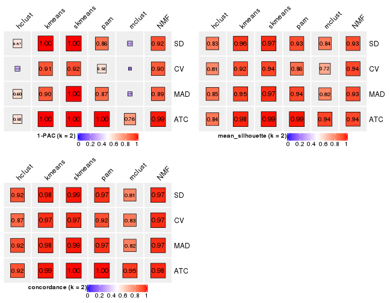</p>

</div>
<div id='tab-collect-stats-from-consensus-partition-list-2'>
<pre><code class="r">collect_stats(res_list, k = 3)
</code></pre>

<p>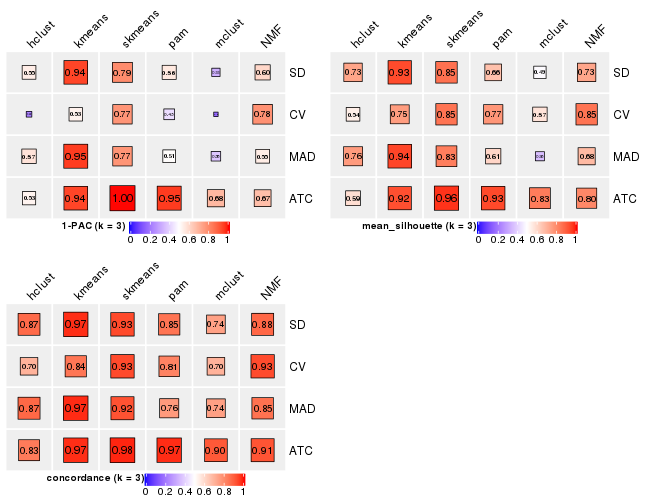</p>

</div>
<div id='tab-collect-stats-from-consensus-partition-list-3'>
<pre><code class="r">collect_stats(res_list, k = 4)
</code></pre>

<p>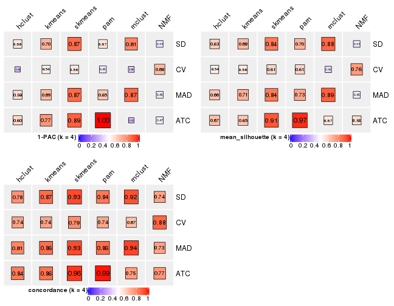</p>

</div>
<div id='tab-collect-stats-from-consensus-partition-list-4'>
<pre><code class="r">collect_stats(res_list, k = 5)
</code></pre>

<p>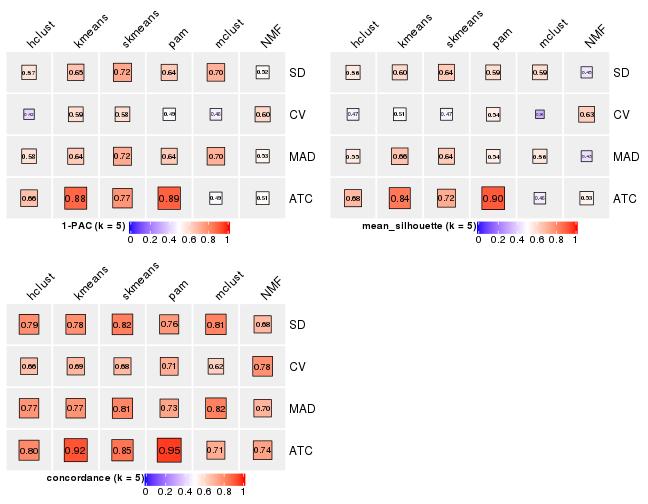</p>

</div>
<div id='tab-collect-stats-from-consensus-partition-list-5'>
<pre><code class="r">collect_stats(res_list, k = 6)
</code></pre>

<p>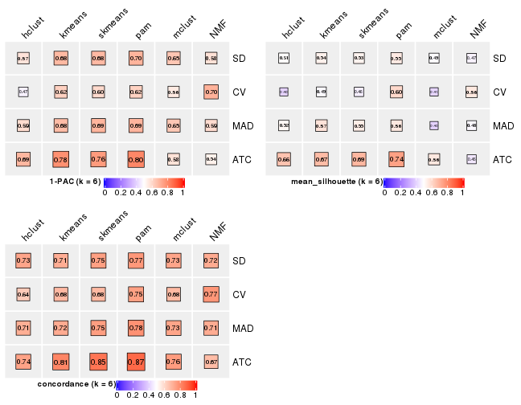</p>

</div>
</div>

### Partition from all methods


Collect partitions from all methods:


<script>
$( function() {
	$( '#tabs-collect-classes-from-consensus-partition-list' ).tabs();
} );
</script>
<div id='tabs-collect-classes-from-consensus-partition-list'>
<ul>
<li><a href='#tab-collect-classes-from-consensus-partition-list-1'>k = 2</a></li>
<li><a href='#tab-collect-classes-from-consensus-partition-list-2'>k = 3</a></li>
<li><a href='#tab-collect-classes-from-consensus-partition-list-3'>k = 4</a></li>
<li><a href='#tab-collect-classes-from-consensus-partition-list-4'>k = 5</a></li>
<li><a href='#tab-collect-classes-from-consensus-partition-list-5'>k = 6</a></li>
</ul>
<div id='tab-collect-classes-from-consensus-partition-list-1'>
<pre><code class="r">collect_classes(res_list, k = 2)
</code></pre>

<p>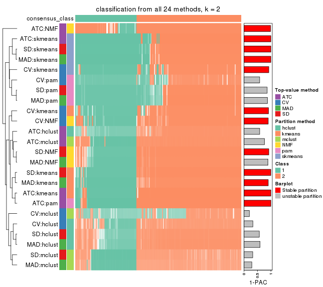</p>

</div>
<div id='tab-collect-classes-from-consensus-partition-list-2'>
<pre><code class="r">collect_classes(res_list, k = 3)
</code></pre>

<p>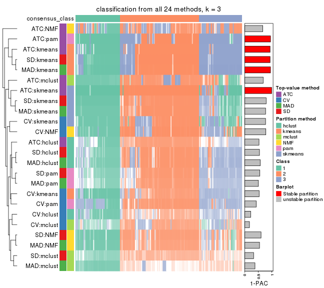</p>

</div>
<div id='tab-collect-classes-from-consensus-partition-list-3'>
<pre><code class="r">collect_classes(res_list, k = 4)
</code></pre>

<p>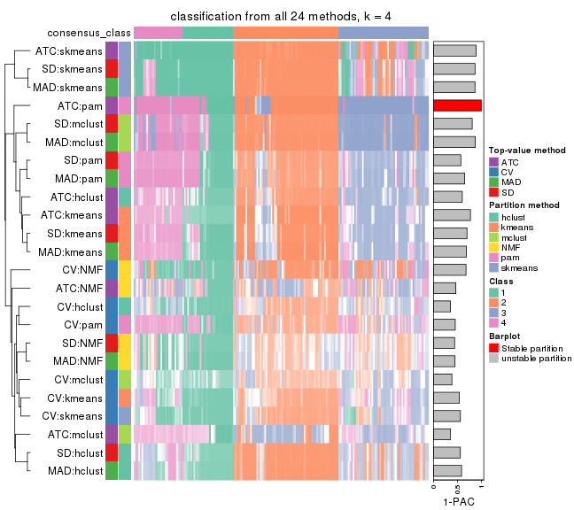</p>

</div>
<div id='tab-collect-classes-from-consensus-partition-list-4'>
<pre><code class="r">collect_classes(res_list, k = 5)
</code></pre>

<p>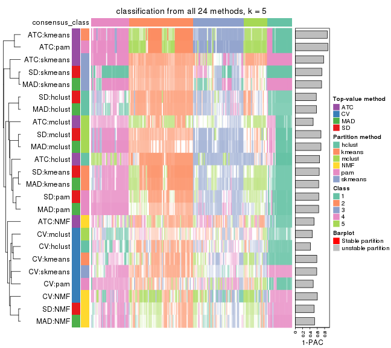</p>

</div>
<div id='tab-collect-classes-from-consensus-partition-list-5'>
<pre><code class="r">collect_classes(res_list, k = 6)
</code></pre>

<p>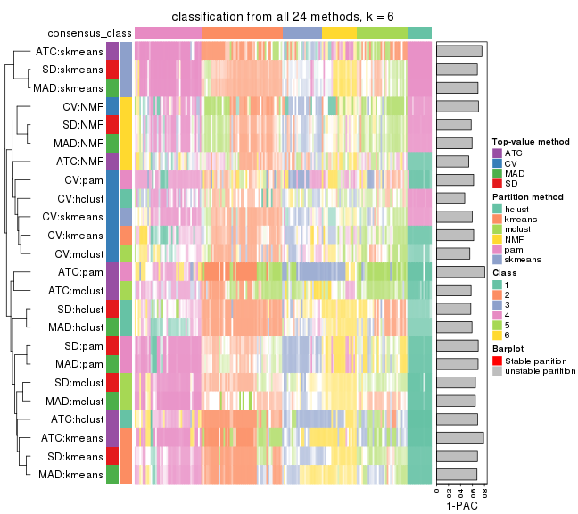</p>

</div>
</div>


### Top rows overlap


Overlap of top rows from different top-row methods:


<script>
$( function() {
	$( '#tabs-top-rows-overlap-by-euler' ).tabs();
} );
</script>
<div id='tabs-top-rows-overlap-by-euler'>
<ul>
<li><a href='#tab-top-rows-overlap-by-euler-1'>top_n = 1000</a></li>
<li><a href='#tab-top-rows-overlap-by-euler-2'>top_n = 2000</a></li>
<li><a href='#tab-top-rows-overlap-by-euler-3'>top_n = 3000</a></li>
<li><a href='#tab-top-rows-overlap-by-euler-4'>top_n = 4000</a></li>
<li><a href='#tab-top-rows-overlap-by-euler-5'>top_n = 5000</a></li>
</ul>
<div id='tab-top-rows-overlap-by-euler-1'>
<pre><code class="r">top_rows_overlap(res_list, top_n = 1000, method = &quot;euler&quot;)
</code></pre>

<p>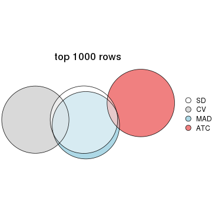</p>

</div>
<div id='tab-top-rows-overlap-by-euler-2'>
<pre><code class="r">top_rows_overlap(res_list, top_n = 2000, method = &quot;euler&quot;)
</code></pre>

<p>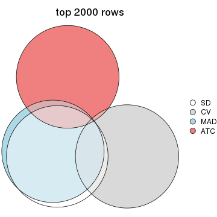</p>

</div>
<div id='tab-top-rows-overlap-by-euler-3'>
<pre><code class="r">top_rows_overlap(res_list, top_n = 3000, method = &quot;euler&quot;)
</code></pre>

<p>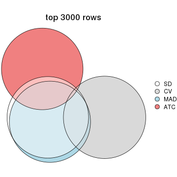</p>

</div>
<div id='tab-top-rows-overlap-by-euler-4'>
<pre><code class="r">top_rows_overlap(res_list, top_n = 4000, method = &quot;euler&quot;)
</code></pre>

<p>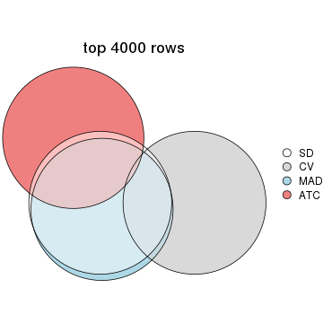</p>

</div>
<div id='tab-top-rows-overlap-by-euler-5'>
<pre><code class="r">top_rows_overlap(res_list, top_n = 5000, method = &quot;euler&quot;)
</code></pre>

<p>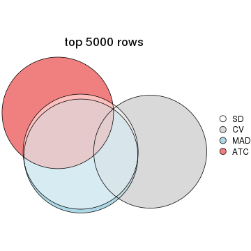</p>

</div>
</div>

Also visualize the correspondance of rankings between different top-row methods:


<script>
$( function() {
	$( '#tabs-top-rows-overlap-by-correspondance' ).tabs();
} );
</script>
<div id='tabs-top-rows-overlap-by-correspondance'>
<ul>
<li><a href='#tab-top-rows-overlap-by-correspondance-1'>top_n = 1000</a></li>
<li><a href='#tab-top-rows-overlap-by-correspondance-2'>top_n = 2000</a></li>
<li><a href='#tab-top-rows-overlap-by-correspondance-3'>top_n = 3000</a></li>
<li><a href='#tab-top-rows-overlap-by-correspondance-4'>top_n = 4000</a></li>
<li><a href='#tab-top-rows-overlap-by-correspondance-5'>top_n = 5000</a></li>
</ul>
<div id='tab-top-rows-overlap-by-correspondance-1'>
<pre><code class="r">top_rows_overlap(res_list, top_n = 1000, method = &quot;correspondance&quot;)
</code></pre>

<p>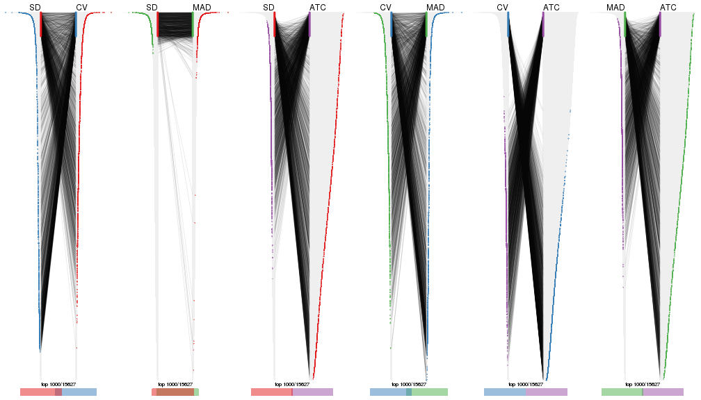</p>

</div>
<div id='tab-top-rows-overlap-by-correspondance-2'>
<pre><code class="r">top_rows_overlap(res_list, top_n = 2000, method = &quot;correspondance&quot;)
</code></pre>

<p>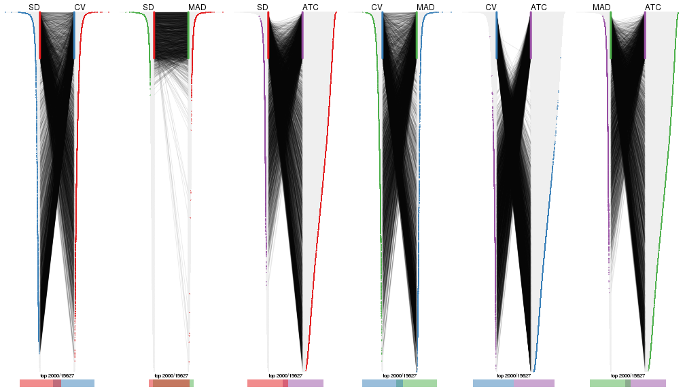</p>

</div>
<div id='tab-top-rows-overlap-by-correspondance-3'>
<pre><code class="r">top_rows_overlap(res_list, top_n = 3000, method = &quot;correspondance&quot;)
</code></pre>

<p>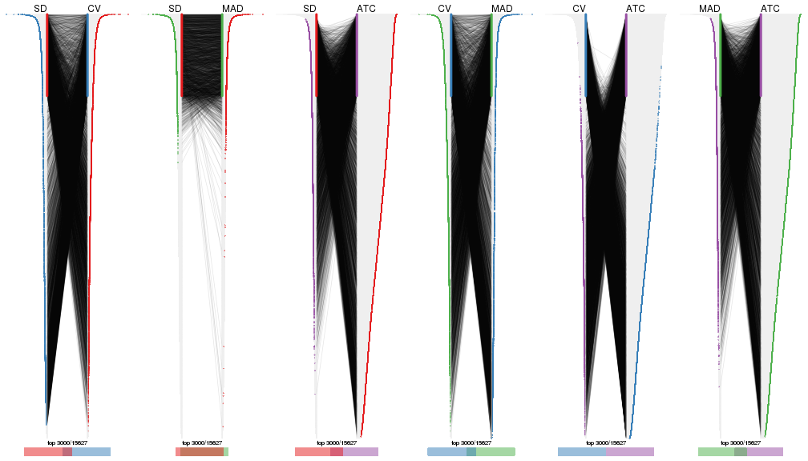</p>

</div>
<div id='tab-top-rows-overlap-by-correspondance-4'>
<pre><code class="r">top_rows_overlap(res_list, top_n = 4000, method = &quot;correspondance&quot;)
</code></pre>

<p>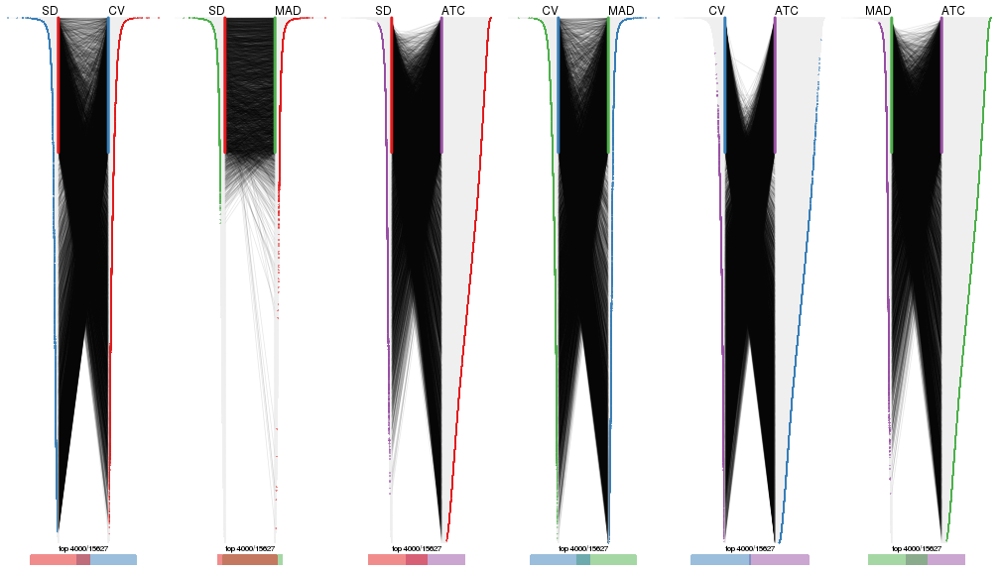</p>

</div>
<div id='tab-top-rows-overlap-by-correspondance-5'>
<pre><code class="r">top_rows_overlap(res_list, top_n = 5000, method = &quot;correspondance&quot;)
</code></pre>

<p>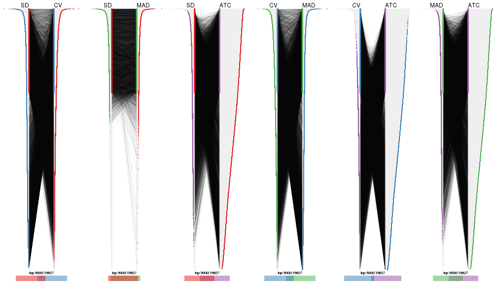</p>

</div>
</div>


Heatmaps of the top rows:


<script>
$( function() {
	$( '#tabs-top-rows-heatmap' ).tabs();
} );
</script>
<div id='tabs-top-rows-heatmap'>
<ul>
<li><a href='#tab-top-rows-heatmap-1'>top_n = 1000</a></li>
<li><a href='#tab-top-rows-heatmap-2'>top_n = 2000</a></li>
<li><a href='#tab-top-rows-heatmap-3'>top_n = 3000</a></li>
<li><a href='#tab-top-rows-heatmap-4'>top_n = 4000</a></li>
<li><a href='#tab-top-rows-heatmap-5'>top_n = 5000</a></li>
</ul>
<div id='tab-top-rows-heatmap-1'>
<pre><code class="r">top_rows_heatmap(res_list, top_n = 1000)
</code></pre>

<p>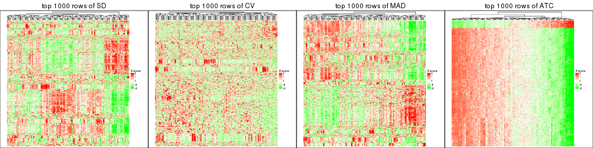</p>

</div>
<div id='tab-top-rows-heatmap-2'>
<pre><code class="r">top_rows_heatmap(res_list, top_n = 2000)
</code></pre>

<p>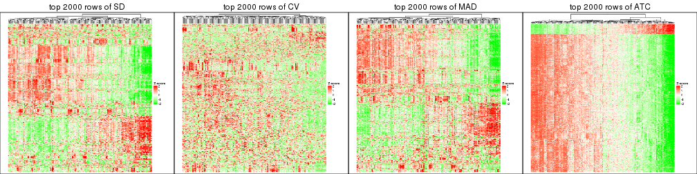</p>

</div>
<div id='tab-top-rows-heatmap-3'>
<pre><code class="r">top_rows_heatmap(res_list, top_n = 3000)
</code></pre>

<p>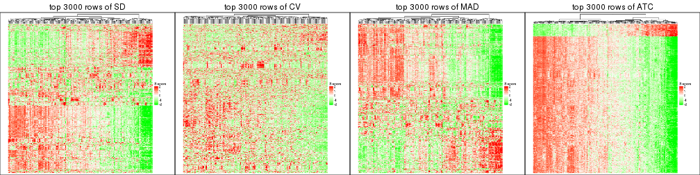</p>

</div>
<div id='tab-top-rows-heatmap-4'>
<pre><code class="r">top_rows_heatmap(res_list, top_n = 4000)
</code></pre>

<p>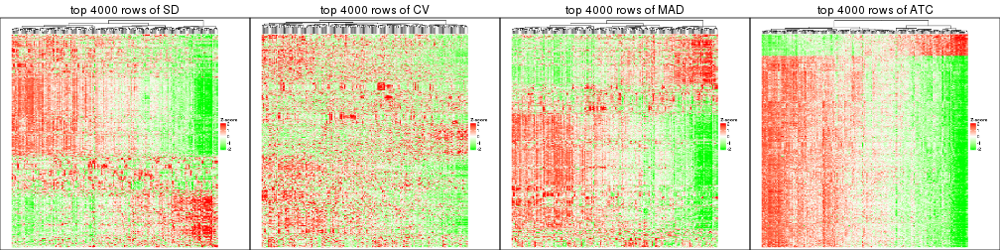</p>

</div>
<div id='tab-top-rows-heatmap-5'>
<pre><code class="r">top_rows_heatmap(res_list, top_n = 5000)
</code></pre>

<p>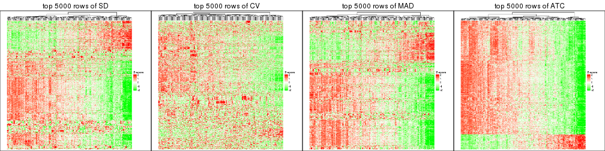</p>

</div>
</div>


 
## Results for each method


---------------------------------------------------


### SD:hclust


The object with results only for a single top-value method and a single partition method 
can be extracted as:

```r
res = res_list["SD", "hclust"]
# you can also extract it by
# res = res_list["SD:hclust"]
```

A summary of `res` and all the functions that can be applied to it:

```r
res
```

```
#> A 'ConsensusPartition' object with k = 2, 3, 4, 5, 6.
#>   On a matrix with 15627 rows and 187 columns.
#>   Top rows (1000, 2000, 3000, 4000, 5000) are extracted by 'SD' method.
#>   Subgroups are detected by 'hclust' method.
#>   Performed in total 1250 partitions by row resampling.
#>   Best k for subgroups seems to be 3.
#> 
#> Following methods can be applied to this 'ConsensusPartition' object:
#>  [1] "cola_report"             "collect_classes"         "collect_plots"          
#>  [4] "collect_stats"           "colnames"                "compare_signatures"     
#>  [7] "consensus_heatmap"       "dimension_reduction"     "functional_enrichment"  
#> [10] "get_anno_col"            "get_anno"                "get_classes"            
#> [13] "get_consensus"           "get_matrix"              "get_membership"         
#> [16] "get_param"               "get_signatures"          "get_stats"              
#> [19] "is_best_k"               "is_stable_k"             "membership_heatmap"     
#> [22] "ncol"                    "nrow"                    "plot_ecdf"              
#> [25] "rownames"                "select_partition_number" "show"                   
#> [28] "suggest_best_k"          "test_to_known_factors"
```

`collect_plots()` function collects all the plots made from `res` for all `k` (number of partitions)
into one single page to provide an easy and fast comparison between different `k`.

```r
collect_plots(res)
```

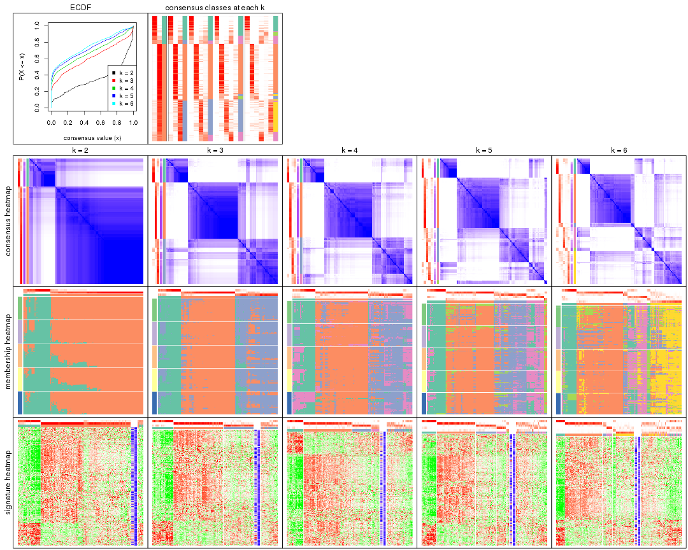

The plots are:

- The first row: a plot of the ECDF (Empirical cumulative distribution
  function) curves of the consensus matrix for each `k` and the heatmap of
  predicted classes for each `k`.
- The second row: heatmaps of the consensus matrix for each `k`.
- The third row: heatmaps of the membership matrix for each `k`.
- The fouth row: heatmaps of the signatures for each `k`.

All the plots in panels can be made by individual functions and they are
plotted later in this section.

`select_partition_number()` produces several plots showing different
statistics for choosing "optimized" `k`. There are following statistics:

- ECDF curves of the consensus matrix for each `k`;
- 1-PAC. [The PAC
  score](https://en.wikipedia.org/wiki/Consensus_clustering#Over-interpretation_potential_of_consensus_clustering)
  measures the proportion of the ambiguous subgrouping.
- Mean silhouette score.
- Concordance. The mean probability of fiting the consensus class ids in all
  partitions.
- Area increased. Denote $A_k$ as the area under the ECDF curve for current
  `k`, the area increased is defined as $A_k - A_{k-1}$.
- Rand index. The percent of pairs of samples that are both in a same cluster
  or both are not in a same cluster in the partition of k and k-1.
- Jaccard index. The ratio of pairs of samples are both in a same cluster in
  the partition of k and k-1 and the pairs of samples are both in a same
  cluster in the partition k or k-1.

The detailed explanations of these statistics can be found in [the cola
vignette](http://bioconductor.org/packages/devel/bioc/vignettes/cola/inst/doc/cola.html#toc_13).

Generally speaking, lower PAC score, higher mean silhouette score or higher
concordance corresponds to better partition. Rand index and Jaccard index
measure how similar the current partition is compared to partition with `k-1`.
If they are too similar, we won't accept `k` is better than `k-1`.

```r
select_partition_number(res)
```

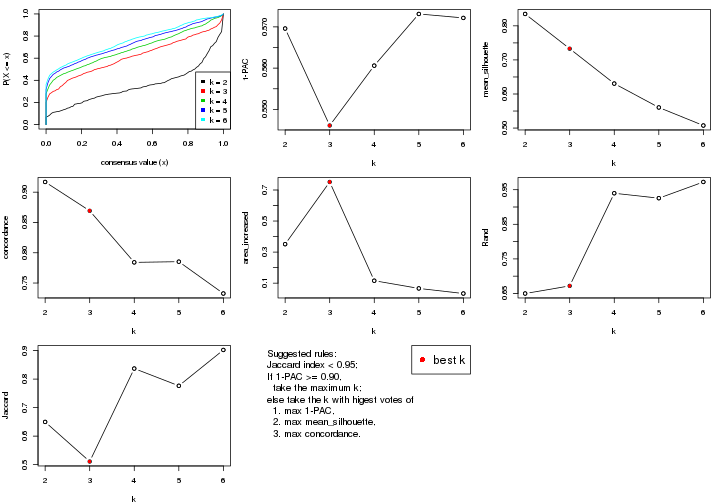

The numeric values for all these statistics can be obtained by `get_stats()`.

```r
get_stats(res)
```

```
#>   k 1-PAC mean_silhouette concordance area_increased  Rand Jaccard
#> 2 2 0.570           0.835       0.917         0.3510 0.650   0.650
#> 3 3 0.546           0.733       0.869         0.7517 0.672   0.511
#> 4 4 0.561           0.631       0.784         0.1157 0.940   0.837
#> 5 5 0.573           0.560       0.785         0.0660 0.925   0.777
#> 6 6 0.572           0.507       0.733         0.0332 0.972   0.902
```

`suggest_best_k()` suggests the best $k$ based on these statistics. The rules are as follows:

- All $k$ with Jaccard index larger than 0.95 are removed because the increase of
  the partition number does not provides enough extra information. If all $k$ are removed,
  the best $k$ is assigned by `NA`.
- For $k$ with 1-PAC larger than 0.9, the maximal $k$ is taken as the "best k". Other $k$ is called "optional k".
- If it does not fit the second rule. The $k$ with the highest vote of highest
  1-PAC, mean silhouette and concordance is taken as the "best k".

```r
suggest_best_k(res)
```

```
#> [1] 3
```


Following shows the table of the partitions (You need to click the **show/hide
code output** link to see it). The membership matrix (columns with name `p*`)
is inferred by
[`clue::cl_consensus()`](https://www.rdocumentation.org/link/cl_consensus?package=clue)
function with the `SE` method. Basically the value in the membership matrix
represents the probability to belong to a certain group. The finall class
label for an item is determined with the group with highest probability it
belongs to.

In `get_classes()` function, the entropy is calculated from the membership
matrix and the silhouette score is calculated from the consensus matrix.


<script>
$( function() {
	$( '#tabs-SD-hclust-get-classes' ).tabs();
} );
</script>
<div id='tabs-SD-hclust-get-classes'>
<ul>
<li><a href='#tab-SD-hclust-get-classes-1'>k = 2</a></li>
<li><a href='#tab-SD-hclust-get-classes-2'>k = 3</a></li>
<li><a href='#tab-SD-hclust-get-classes-3'>k = 4</a></li>
<li><a href='#tab-SD-hclust-get-classes-4'>k = 5</a></li>
<li><a href='#tab-SD-hclust-get-classes-5'>k = 6</a></li>
</ul>

<div id='tab-SD-hclust-get-classes-1'>
<p><a id='tab-SD-hclust-get-classes-1-a' style='color:#0366d6' href='#'>show/hide code output</a></p>
<pre><code class="r">cbind(get_classes(res, k = 2), get_membership(res, k = 2))
</code></pre>

<pre><code>#&gt;            class entropy silhouette    p1    p2
#&gt; SRR1747213     2  0.9286      0.512 0.344 0.656
#&gt; SRR1747214     1  0.6148      0.782 0.848 0.152
#&gt; SRR1747215     2  0.0000      0.918 0.000 1.000
#&gt; SRR1747216     2  0.0000      0.918 0.000 1.000
#&gt; SRR1747217     2  0.3274      0.904 0.060 0.940
#&gt; SRR1747218     2  0.3274      0.904 0.060 0.940
#&gt; SRR1747219     2  0.7602      0.754 0.220 0.780
#&gt; SRR1747220     2  0.7602      0.754 0.220 0.780
#&gt; SRR1747221     1  0.9944      0.229 0.544 0.456
#&gt; SRR1747222     1  0.9866      0.309 0.568 0.432
#&gt; SRR1747223     2  0.6343      0.832 0.160 0.840
#&gt; SRR1747224     2  0.5737      0.857 0.136 0.864
#&gt; SRR1747225     2  0.0000      0.918 0.000 1.000
#&gt; SRR1747226     2  0.0000      0.918 0.000 1.000
#&gt; SRR1747227     2  0.0000      0.918 0.000 1.000
#&gt; SRR1747228     2  0.0376      0.918 0.004 0.996
#&gt; SRR1747229     2  0.0000      0.918 0.000 1.000
#&gt; SRR1747230     1  0.0000      0.846 1.000 0.000
#&gt; SRR1747231     1  0.8267      0.677 0.740 0.260
#&gt; SRR1747232     1  0.0000      0.846 1.000 0.000
#&gt; SRR1747233     1  0.9963      0.192 0.536 0.464
#&gt; SRR1747234     2  0.3733      0.900 0.072 0.928
#&gt; SRR1747235     1  0.0000      0.846 1.000 0.000
#&gt; SRR1747236     2  0.0000      0.918 0.000 1.000
#&gt; SRR1747237     2  0.0000      0.918 0.000 1.000
#&gt; SRR1747238     2  0.0000      0.918 0.000 1.000
#&gt; SRR1747239     2  0.0000      0.918 0.000 1.000
#&gt; SRR1747240     1  0.0000      0.846 1.000 0.000
#&gt; SRR1747241     2  0.0000      0.918 0.000 1.000
#&gt; SRR1747242     1  0.0000      0.846 1.000 0.000
#&gt; SRR1747243     2  0.5629      0.860 0.132 0.868
#&gt; SRR1747244     2  0.5629      0.860 0.132 0.868
#&gt; SRR1747245     2  0.0376      0.918 0.004 0.996
#&gt; SRR1747246     2  0.0000      0.918 0.000 1.000
#&gt; SRR1747247     1  0.0000      0.846 1.000 0.000
#&gt; SRR1747248     1  0.0000      0.846 1.000 0.000
#&gt; SRR1747249     1  0.9866      0.297 0.568 0.432
#&gt; SRR1747250     2  0.4022      0.897 0.080 0.920
#&gt; SRR1747252     2  0.9963      0.119 0.464 0.536
#&gt; SRR1747253     1  0.9970      0.166 0.532 0.468
#&gt; SRR1747254     2  0.0000      0.918 0.000 1.000
#&gt; SRR1747255     1  0.8555      0.656 0.720 0.280
#&gt; SRR1747256     1  0.8555      0.656 0.720 0.280
#&gt; SRR1747257     2  0.0000      0.918 0.000 1.000
#&gt; SRR1747258     2  0.0938      0.917 0.012 0.988
#&gt; SRR1747259     2  0.0000      0.918 0.000 1.000
#&gt; SRR1747260     2  0.0000      0.918 0.000 1.000
#&gt; SRR1747261     2  0.1633      0.915 0.024 0.976
#&gt; SRR1747262     2  0.1633      0.915 0.024 0.976
#&gt; SRR1747263     2  0.0000      0.918 0.000 1.000
#&gt; SRR1747264     1  0.0938      0.846 0.988 0.012
#&gt; SRR1747265     2  0.7219      0.781 0.200 0.800
#&gt; SRR1747266     2  0.2423      0.911 0.040 0.960
#&gt; SRR1747267     2  0.7299      0.776 0.204 0.796
#&gt; SRR1747268     2  0.5059      0.876 0.112 0.888
#&gt; SRR1747269     2  0.0000      0.918 0.000 1.000
#&gt; SRR1747270     2  0.0000      0.918 0.000 1.000
#&gt; SRR1747271     2  0.4431      0.888 0.092 0.908
#&gt; SRR1747272     2  0.4431      0.888 0.092 0.908
#&gt; SRR1747273     1  0.1633      0.844 0.976 0.024
#&gt; SRR1747274     2  0.2423      0.911 0.040 0.960
#&gt; SRR1747275     1  0.7883      0.717 0.764 0.236
#&gt; SRR1747276     1  0.7883      0.717 0.764 0.236
#&gt; SRR1747277     2  0.0000      0.918 0.000 1.000
#&gt; SRR1747278     2  0.4939      0.878 0.108 0.892
#&gt; SRR1747280     1  0.0000      0.846 1.000 0.000
#&gt; SRR1747279     1  0.7299      0.753 0.796 0.204
#&gt; SRR1747281     2  0.0000      0.918 0.000 1.000
#&gt; SRR1747282     1  0.1414      0.844 0.980 0.020
#&gt; SRR1747283     2  0.8144      0.700 0.252 0.748
#&gt; SRR1747284     2  0.9635      0.388 0.388 0.612
#&gt; SRR1747285     2  0.4298      0.891 0.088 0.912
#&gt; SRR1747286     2  0.0000      0.918 0.000 1.000
#&gt; SRR1747287     2  0.0000      0.918 0.000 1.000
#&gt; SRR1747288     2  0.8909      0.592 0.308 0.692
#&gt; SRR1747290     2  0.0000      0.918 0.000 1.000
#&gt; SRR1747289     2  0.0000      0.918 0.000 1.000
#&gt; SRR1747291     2  0.1633      0.915 0.024 0.976
#&gt; SRR1747293     2  0.0000      0.918 0.000 1.000
#&gt; SRR1747294     2  0.0000      0.918 0.000 1.000
#&gt; SRR1747292     1  0.9815      0.348 0.580 0.420
#&gt; SRR1747295     2  0.0000      0.918 0.000 1.000
#&gt; SRR1747296     2  0.0000      0.918 0.000 1.000
#&gt; SRR1747297     2  0.0000      0.918 0.000 1.000
#&gt; SRR1747298     2  0.0000      0.918 0.000 1.000
#&gt; SRR1747299     2  0.0000      0.918 0.000 1.000
#&gt; SRR1747300     2  0.0000      0.918 0.000 1.000
#&gt; SRR1747301     2  0.0000      0.918 0.000 1.000
#&gt; SRR1747302     2  0.0000      0.918 0.000 1.000
#&gt; SRR1747303     2  0.0000      0.918 0.000 1.000
#&gt; SRR1747304     1  0.0000      0.846 1.000 0.000
#&gt; SRR1747305     2  0.0000      0.918 0.000 1.000
#&gt; SRR1747306     2  0.0000      0.918 0.000 1.000
#&gt; SRR1747307     2  0.4161      0.893 0.084 0.916
#&gt; SRR1747308     2  0.4161      0.893 0.084 0.916
#&gt; SRR1747309     2  0.9866      0.239 0.432 0.568
#&gt; SRR1747310     1  0.0000      0.846 1.000 0.000
#&gt; SRR1747311     2  0.5519      0.863 0.128 0.872
#&gt; SRR1747313     2  0.6623      0.818 0.172 0.828
#&gt; SRR1747312     1  0.0000      0.846 1.000 0.000
#&gt; SRR1747314     1  0.0000      0.846 1.000 0.000
#&gt; SRR1747315     2  0.0672      0.918 0.008 0.992
#&gt; SRR1747316     2  0.0672      0.918 0.008 0.992
#&gt; SRR1747318     2  0.5294      0.870 0.120 0.880
#&gt; SRR1747317     2  0.5294      0.870 0.120 0.880
#&gt; SRR1747319     2  0.9044      0.566 0.320 0.680
#&gt; SRR1747320     2  0.9044      0.566 0.320 0.680
#&gt; SRR1747322     1  0.0000      0.846 1.000 0.000
#&gt; SRR1747321     1  0.5629      0.802 0.868 0.132
#&gt; SRR1747323     2  0.0000      0.918 0.000 1.000
#&gt; SRR1747324     2  0.0000      0.918 0.000 1.000
#&gt; SRR1747326     2  0.0000      0.918 0.000 1.000
#&gt; SRR1747325     2  0.0000      0.918 0.000 1.000
#&gt; SRR1747327     2  0.0000      0.918 0.000 1.000
#&gt; SRR1747328     2  0.4022      0.896 0.080 0.920
#&gt; SRR1747330     2  0.5178      0.872 0.116 0.884
#&gt; SRR1747329     2  0.5178      0.872 0.116 0.884
#&gt; SRR1747332     2  0.4815      0.881 0.104 0.896
#&gt; SRR1747331     2  0.4815      0.881 0.104 0.896
#&gt; SRR1747333     2  0.0000      0.918 0.000 1.000
#&gt; SRR1747334     2  0.0000      0.918 0.000 1.000
#&gt; SRR1747335     2  0.7139      0.787 0.196 0.804
#&gt; SRR1747336     1  0.0000      0.846 1.000 0.000
#&gt; SRR1747337     2  0.0000      0.918 0.000 1.000
#&gt; SRR1747338     2  0.0000      0.918 0.000 1.000
#&gt; SRR1747339     2  0.4690      0.884 0.100 0.900
#&gt; SRR1747340     2  0.4690      0.884 0.100 0.900
#&gt; SRR1747341     2  0.0000      0.918 0.000 1.000
#&gt; SRR1747342     2  0.0000      0.918 0.000 1.000
#&gt; SRR1747343     2  0.0000      0.918 0.000 1.000
#&gt; SRR1747344     2  0.0000      0.918 0.000 1.000
#&gt; SRR1747345     2  0.5059      0.875 0.112 0.888
#&gt; SRR1747346     2  0.5946      0.847 0.144 0.856
#&gt; SRR1747347     2  0.0000      0.918 0.000 1.000
#&gt; SRR1747348     1  0.0000      0.846 1.000 0.000
#&gt; SRR1747349     1  0.7299      0.753 0.796 0.204
#&gt; SRR1747351     2  0.0000      0.918 0.000 1.000
#&gt; SRR1747350     2  0.0938      0.917 0.012 0.988
#&gt; SRR1747352     1  0.0000      0.846 1.000 0.000
#&gt; SRR1747353     2  0.2423      0.911 0.040 0.960
#&gt; SRR1747354     2  0.2423      0.911 0.040 0.960
#&gt; SRR1747355     2  0.9087      0.559 0.324 0.676
#&gt; SRR1747356     2  0.2603      0.910 0.044 0.956
#&gt; SRR1747357     2  0.4022      0.897 0.080 0.920
#&gt; SRR1747358     2  0.4022      0.897 0.080 0.920
#&gt; SRR1747359     1  0.6247      0.789 0.844 0.156
#&gt; SRR1747360     2  0.0000      0.918 0.000 1.000
#&gt; SRR1747361     2  0.6531      0.822 0.168 0.832
#&gt; SRR1747362     2  0.1414      0.916 0.020 0.980
#&gt; SRR1747363     2  0.8763      0.620 0.296 0.704
#&gt; SRR1747364     2  0.9170      0.539 0.332 0.668
#&gt; SRR1747365     2  0.4161      0.895 0.084 0.916
#&gt; SRR1747366     2  0.2043      0.914 0.032 0.968
#&gt; SRR1747367     2  0.8763      0.620 0.296 0.704
#&gt; SRR1747369     2  0.0000      0.918 0.000 1.000
#&gt; SRR1747368     2  0.6623      0.818 0.172 0.828
#&gt; SRR1747370     2  0.4562      0.886 0.096 0.904
#&gt; SRR1747372     1  0.0000      0.846 1.000 0.000
#&gt; SRR1747371     1  0.7299      0.753 0.796 0.204
#&gt; SRR1747373     2  0.0000      0.918 0.000 1.000
#&gt; SRR1747374     2  0.0000      0.918 0.000 1.000
#&gt; SRR1747375     2  0.6148      0.840 0.152 0.848
#&gt; SRR1747376     2  0.0000      0.918 0.000 1.000
#&gt; SRR1747377     2  0.0000      0.918 0.000 1.000
#&gt; SRR1747378     2  0.0376      0.918 0.004 0.996
#&gt; SRR1747379     2  0.1633      0.915 0.024 0.976
#&gt; SRR1747380     2  0.5946      0.847 0.144 0.856
#&gt; SRR1747381     1  0.1843      0.843 0.972 0.028
#&gt; SRR1747382     1  0.1843      0.843 0.972 0.028
#&gt; SRR1747383     2  0.0376      0.918 0.004 0.996
#&gt; SRR1747384     2  0.4161      0.895 0.084 0.916
#&gt; SRR1747385     2  0.5178      0.872 0.116 0.884
#&gt; SRR1747386     1  0.0000      0.846 1.000 0.000
#&gt; SRR1747387     2  0.0000      0.918 0.000 1.000
#&gt; SRR1747388     2  0.0000      0.918 0.000 1.000
#&gt; SRR1747390     2  0.2423      0.911 0.040 0.960
#&gt; SRR1747389     2  0.2423      0.911 0.040 0.960
#&gt; SRR1747391     2  0.0000      0.918 0.000 1.000
#&gt; SRR1747392     2  0.0000      0.918 0.000 1.000
#&gt; SRR1747393     2  0.2778      0.909 0.048 0.952
#&gt; SRR1747394     2  0.5519      0.863 0.128 0.872
#&gt; SRR1747395     2  0.0672      0.917 0.008 0.992
#&gt; SRR1747396     2  0.0000      0.918 0.000 1.000
#&gt; SRR1747398     2  0.0000      0.918 0.000 1.000
#&gt; SRR1747397     2  0.5737      0.856 0.136 0.864
#&gt; SRR1747399     1  0.6247      0.784 0.844 0.156
#&gt; SRR1747400     1  0.6247      0.784 0.844 0.156
</code></pre>

<script>
$('#tab-SD-hclust-get-classes-1-a').parent().next().next().hide();
$('#tab-SD-hclust-get-classes-1-a').click(function(){
  $('#tab-SD-hclust-get-classes-1-a').parent().next().next().toggle();
  return(false);
});
</script>
</div>

<div id='tab-SD-hclust-get-classes-2'>
<p><a id='tab-SD-hclust-get-classes-2-a' style='color:#0366d6' href='#'>show/hide code output</a></p>
<pre><code class="r">cbind(get_classes(res, k = 3), get_membership(res, k = 3))
</code></pre>

<pre><code>#&gt;            class entropy silhouette    p1    p2    p3
#&gt; SRR1747213     3  0.3816     0.6115 0.148 0.000 0.852
#&gt; SRR1747214     1  0.4605     0.7353 0.796 0.000 0.204
#&gt; SRR1747215     2  0.0000     0.9163 0.000 1.000 0.000
#&gt; SRR1747216     2  0.0000     0.9163 0.000 1.000 0.000
#&gt; SRR1747217     3  0.6192     0.4087 0.000 0.420 0.580
#&gt; SRR1747218     3  0.6192     0.4087 0.000 0.420 0.580
#&gt; SRR1747219     3  0.0892     0.7047 0.020 0.000 0.980
#&gt; SRR1747220     3  0.0892     0.7047 0.020 0.000 0.980
#&gt; SRR1747221     3  0.6228     0.1794 0.372 0.004 0.624
#&gt; SRR1747222     3  0.6095     0.1077 0.392 0.000 0.608
#&gt; SRR1747223     3  0.2384     0.7508 0.008 0.056 0.936
#&gt; SRR1747224     3  0.2860     0.7633 0.004 0.084 0.912
#&gt; SRR1747225     2  0.0424     0.9152 0.000 0.992 0.008
#&gt; SRR1747226     2  0.0424     0.9152 0.000 0.992 0.008
#&gt; SRR1747227     2  0.1289     0.9070 0.000 0.968 0.032
#&gt; SRR1747228     2  0.3551     0.8214 0.000 0.868 0.132
#&gt; SRR1747229     2  0.0237     0.9161 0.000 0.996 0.004
#&gt; SRR1747230     1  0.0000     0.8407 1.000 0.000 0.000
#&gt; SRR1747231     1  0.6225     0.4304 0.568 0.000 0.432
#&gt; SRR1747232     1  0.0747     0.8398 0.984 0.000 0.016
#&gt; SRR1747233     3  0.5988     0.1914 0.368 0.000 0.632
#&gt; SRR1747234     3  0.6553     0.4122 0.008 0.412 0.580
#&gt; SRR1747235     1  0.1860     0.8352 0.948 0.000 0.052
#&gt; SRR1747236     2  0.0237     0.9163 0.000 0.996 0.004
#&gt; SRR1747237     2  0.0892     0.9133 0.000 0.980 0.020
#&gt; SRR1747238     2  0.0892     0.9133 0.000 0.980 0.020
#&gt; SRR1747239     2  0.0000     0.9163 0.000 1.000 0.000
#&gt; SRR1747240     1  0.0000     0.8407 1.000 0.000 0.000
#&gt; SRR1747241     2  0.0892     0.9123 0.000 0.980 0.020
#&gt; SRR1747242     1  0.0000     0.8407 1.000 0.000 0.000
#&gt; SRR1747243     3  0.2772     0.7610 0.004 0.080 0.916
#&gt; SRR1747244     3  0.2772     0.7610 0.004 0.080 0.916
#&gt; SRR1747245     2  0.3412     0.8308 0.000 0.876 0.124
#&gt; SRR1747246     2  0.0747     0.9137 0.000 0.984 0.016
#&gt; SRR1747247     1  0.0000     0.8407 1.000 0.000 0.000
#&gt; SRR1747248     1  0.0000     0.8407 1.000 0.000 0.000
#&gt; SRR1747249     3  0.6154     0.0610 0.408 0.000 0.592
#&gt; SRR1747250     3  0.4883     0.7275 0.004 0.208 0.788
#&gt; SRR1747252     3  0.5327     0.4175 0.272 0.000 0.728
#&gt; SRR1747253     3  0.6252     0.2647 0.344 0.008 0.648
#&gt; SRR1747254     2  0.0000     0.9163 0.000 1.000 0.000
#&gt; SRR1747255     1  0.6274     0.3909 0.544 0.000 0.456
#&gt; SRR1747256     1  0.6274     0.3909 0.544 0.000 0.456
#&gt; SRR1747257     2  0.1411     0.9043 0.000 0.964 0.036
#&gt; SRR1747258     2  0.3879     0.7921 0.000 0.848 0.152
#&gt; SRR1747259     2  0.0892     0.9123 0.000 0.980 0.020
#&gt; SRR1747260     2  0.0892     0.9123 0.000 0.980 0.020
#&gt; SRR1747261     2  0.4605     0.7121 0.000 0.796 0.204
#&gt; SRR1747262     2  0.4605     0.7121 0.000 0.796 0.204
#&gt; SRR1747263     2  0.1031     0.9109 0.000 0.976 0.024
#&gt; SRR1747264     1  0.1753     0.8372 0.952 0.000 0.048
#&gt; SRR1747265     3  0.0424     0.7169 0.000 0.008 0.992
#&gt; SRR1747266     3  0.6140     0.4291 0.000 0.404 0.596
#&gt; SRR1747267     3  0.0475     0.7126 0.004 0.004 0.992
#&gt; SRR1747268     3  0.4062     0.7506 0.000 0.164 0.836
#&gt; SRR1747269     2  0.0424     0.9162 0.000 0.992 0.008
#&gt; SRR1747270     2  0.0424     0.9162 0.000 0.992 0.008
#&gt; SRR1747271     3  0.4702     0.7279 0.000 0.212 0.788
#&gt; SRR1747272     3  0.4702     0.7279 0.000 0.212 0.788
#&gt; SRR1747273     1  0.2448     0.8317 0.924 0.000 0.076
#&gt; SRR1747274     2  0.6180     0.1820 0.000 0.584 0.416
#&gt; SRR1747275     1  0.6140     0.5014 0.596 0.000 0.404
#&gt; SRR1747276     1  0.6140     0.5014 0.596 0.000 0.404
#&gt; SRR1747277     2  0.0892     0.9123 0.000 0.980 0.020
#&gt; SRR1747278     3  0.3116     0.7638 0.000 0.108 0.892
#&gt; SRR1747280     1  0.0000     0.8407 1.000 0.000 0.000
#&gt; SRR1747279     1  0.6008     0.5646 0.628 0.000 0.372
#&gt; SRR1747281     2  0.1031     0.9114 0.000 0.976 0.024
#&gt; SRR1747282     1  0.2165     0.8331 0.936 0.000 0.064
#&gt; SRR1747283     3  0.5165     0.7060 0.096 0.072 0.832
#&gt; SRR1747284     3  0.4555     0.5396 0.200 0.000 0.800
#&gt; SRR1747285     3  0.5882     0.5829 0.000 0.348 0.652
#&gt; SRR1747286     2  0.2261     0.8833 0.000 0.932 0.068
#&gt; SRR1747287     2  0.4654     0.7113 0.000 0.792 0.208
#&gt; SRR1747288     3  0.3695     0.6539 0.108 0.012 0.880
#&gt; SRR1747290     2  0.0237     0.9163 0.000 0.996 0.004
#&gt; SRR1747289     2  0.0237     0.9163 0.000 0.996 0.004
#&gt; SRR1747291     2  0.5926     0.3993 0.000 0.644 0.356
#&gt; SRR1747293     2  0.0000     0.9163 0.000 1.000 0.000
#&gt; SRR1747294     2  0.0000     0.9163 0.000 1.000 0.000
#&gt; SRR1747292     3  0.6553     0.0449 0.412 0.008 0.580
#&gt; SRR1747295     2  0.1411     0.9045 0.000 0.964 0.036
#&gt; SRR1747296     2  0.1411     0.9045 0.000 0.964 0.036
#&gt; SRR1747297     2  0.0892     0.9125 0.000 0.980 0.020
#&gt; SRR1747298     2  0.0892     0.9125 0.000 0.980 0.020
#&gt; SRR1747299     2  0.0000     0.9163 0.000 1.000 0.000
#&gt; SRR1747300     2  0.0000     0.9163 0.000 1.000 0.000
#&gt; SRR1747301     2  0.0000     0.9163 0.000 1.000 0.000
#&gt; SRR1747302     2  0.0000     0.9163 0.000 1.000 0.000
#&gt; SRR1747303     2  0.2537     0.8698 0.000 0.920 0.080
#&gt; SRR1747304     1  0.0000     0.8407 1.000 0.000 0.000
#&gt; SRR1747305     2  0.0000     0.9163 0.000 1.000 0.000
#&gt; SRR1747306     2  0.0000     0.9163 0.000 1.000 0.000
#&gt; SRR1747307     3  0.5291     0.6883 0.000 0.268 0.732
#&gt; SRR1747308     3  0.5291     0.6883 0.000 0.268 0.732
#&gt; SRR1747309     3  0.6632     0.4551 0.272 0.036 0.692
#&gt; SRR1747310     1  0.0892     0.8400 0.980 0.000 0.020
#&gt; SRR1747311     3  0.2537     0.7608 0.000 0.080 0.920
#&gt; SRR1747313     3  0.2651     0.7512 0.012 0.060 0.928
#&gt; SRR1747312     1  0.0000     0.8407 1.000 0.000 0.000
#&gt; SRR1747314     1  0.0000     0.8407 1.000 0.000 0.000
#&gt; SRR1747315     2  0.2066     0.8887 0.000 0.940 0.060
#&gt; SRR1747316     2  0.2066     0.8887 0.000 0.940 0.060
#&gt; SRR1747318     3  0.3038     0.7645 0.000 0.104 0.896
#&gt; SRR1747317     3  0.3038     0.7645 0.000 0.104 0.896
#&gt; SRR1747319     3  0.3340     0.6319 0.120 0.000 0.880
#&gt; SRR1747320     3  0.3340     0.6319 0.120 0.000 0.880
#&gt; SRR1747322     1  0.0000     0.8407 1.000 0.000 0.000
#&gt; SRR1747321     1  0.5465     0.6726 0.712 0.000 0.288
#&gt; SRR1747323     2  0.0000     0.9163 0.000 1.000 0.000
#&gt; SRR1747324     2  0.0000     0.9163 0.000 1.000 0.000
#&gt; SRR1747326     2  0.0000     0.9163 0.000 1.000 0.000
#&gt; SRR1747325     2  0.0000     0.9163 0.000 1.000 0.000
#&gt; SRR1747327     2  0.4654     0.7143 0.000 0.792 0.208
#&gt; SRR1747328     3  0.5882     0.5558 0.000 0.348 0.652
#&gt; SRR1747330     3  0.2878     0.7631 0.000 0.096 0.904
#&gt; SRR1747329     3  0.2878     0.7631 0.000 0.096 0.904
#&gt; SRR1747332     3  0.3192     0.7628 0.000 0.112 0.888
#&gt; SRR1747331     3  0.3192     0.7628 0.000 0.112 0.888
#&gt; SRR1747333     2  0.0424     0.9152 0.000 0.992 0.008
#&gt; SRR1747334     2  0.0424     0.9152 0.000 0.992 0.008
#&gt; SRR1747335     3  0.0983     0.7229 0.004 0.016 0.980
#&gt; SRR1747336     1  0.0000     0.8407 1.000 0.000 0.000
#&gt; SRR1747337     2  0.0000     0.9163 0.000 1.000 0.000
#&gt; SRR1747338     2  0.0000     0.9163 0.000 1.000 0.000
#&gt; SRR1747339     3  0.4291     0.7445 0.000 0.180 0.820
#&gt; SRR1747340     3  0.4291     0.7445 0.000 0.180 0.820
#&gt; SRR1747341     2  0.0000     0.9163 0.000 1.000 0.000
#&gt; SRR1747342     2  0.0000     0.9163 0.000 1.000 0.000
#&gt; SRR1747343     2  0.0000     0.9163 0.000 1.000 0.000
#&gt; SRR1747344     2  0.0000     0.9163 0.000 1.000 0.000
#&gt; SRR1747345     3  0.3038     0.7644 0.000 0.104 0.896
#&gt; SRR1747346     3  0.2448     0.7592 0.000 0.076 0.924
#&gt; SRR1747347     2  0.0000     0.9163 0.000 1.000 0.000
#&gt; SRR1747348     1  0.0000     0.8407 1.000 0.000 0.000
#&gt; SRR1747349     1  0.6008     0.5646 0.628 0.000 0.372
#&gt; SRR1747351     2  0.0000     0.9163 0.000 1.000 0.000
#&gt; SRR1747350     2  0.4235     0.7581 0.000 0.824 0.176
#&gt; SRR1747352     1  0.3412     0.8020 0.876 0.000 0.124
#&gt; SRR1747353     2  0.6286    -0.0218 0.000 0.536 0.464
#&gt; SRR1747354     2  0.6286    -0.0218 0.000 0.536 0.464
#&gt; SRR1747355     3  0.3482     0.6320 0.128 0.000 0.872
#&gt; SRR1747356     3  0.6330     0.4419 0.004 0.396 0.600
#&gt; SRR1747357     3  0.6045     0.4994 0.000 0.380 0.620
#&gt; SRR1747358     3  0.6045     0.4994 0.000 0.380 0.620
#&gt; SRR1747359     1  0.5678     0.6431 0.684 0.000 0.316
#&gt; SRR1747360     2  0.0892     0.9134 0.000 0.980 0.020
#&gt; SRR1747361     3  0.2096     0.7482 0.004 0.052 0.944
#&gt; SRR1747362     3  0.6302     0.2097 0.000 0.480 0.520
#&gt; SRR1747363     3  0.2959     0.6563 0.100 0.000 0.900
#&gt; SRR1747364     3  0.3619     0.6181 0.136 0.000 0.864
#&gt; SRR1747365     3  0.6204     0.3873 0.000 0.424 0.576
#&gt; SRR1747366     2  0.6111     0.2494 0.000 0.604 0.396
#&gt; SRR1747367     3  0.2959     0.6563 0.100 0.000 0.900
#&gt; SRR1747369     2  0.0000     0.9163 0.000 1.000 0.000
#&gt; SRR1747368     3  0.1878     0.7439 0.004 0.044 0.952
#&gt; SRR1747370     3  0.5178     0.7050 0.000 0.256 0.744
#&gt; SRR1747372     1  0.0000     0.8407 1.000 0.000 0.000
#&gt; SRR1747371     1  0.6026     0.5597 0.624 0.000 0.376
#&gt; SRR1747373     2  0.0000     0.9163 0.000 1.000 0.000
#&gt; SRR1747374     2  0.0000     0.9163 0.000 1.000 0.000
#&gt; SRR1747375     3  0.3425     0.7588 0.004 0.112 0.884
#&gt; SRR1747376     2  0.3482     0.8177 0.000 0.872 0.128
#&gt; SRR1747377     2  0.0000     0.9163 0.000 1.000 0.000
#&gt; SRR1747378     2  0.1411     0.9048 0.000 0.964 0.036
#&gt; SRR1747379     2  0.5291     0.6044 0.000 0.732 0.268
#&gt; SRR1747380     3  0.2448     0.7592 0.000 0.076 0.924
#&gt; SRR1747381     1  0.2537     0.8295 0.920 0.000 0.080
#&gt; SRR1747382     1  0.2537     0.8295 0.920 0.000 0.080
#&gt; SRR1747383     2  0.4974     0.6561 0.000 0.764 0.236
#&gt; SRR1747384     3  0.6062     0.4943 0.000 0.384 0.616
#&gt; SRR1747385     3  0.3752     0.7573 0.000 0.144 0.856
#&gt; SRR1747386     1  0.0000     0.8407 1.000 0.000 0.000
#&gt; SRR1747387     2  0.0000     0.9163 0.000 1.000 0.000
#&gt; SRR1747388     2  0.0000     0.9163 0.000 1.000 0.000
#&gt; SRR1747390     2  0.5465     0.5469 0.000 0.712 0.288
#&gt; SRR1747389     2  0.5465     0.5469 0.000 0.712 0.288
#&gt; SRR1747391     2  0.0892     0.9125 0.000 0.980 0.020
#&gt; SRR1747392     2  0.0892     0.9125 0.000 0.980 0.020
#&gt; SRR1747393     3  0.6495     0.2688 0.004 0.460 0.536
#&gt; SRR1747394     3  0.2537     0.7608 0.000 0.080 0.920
#&gt; SRR1747395     2  0.4235     0.7632 0.000 0.824 0.176
#&gt; SRR1747396     2  0.1163     0.9099 0.000 0.972 0.028
#&gt; SRR1747398     2  0.0000     0.9163 0.000 1.000 0.000
#&gt; SRR1747397     3  0.2682     0.7602 0.004 0.076 0.920
#&gt; SRR1747399     1  0.5497     0.6702 0.708 0.000 0.292
#&gt; SRR1747400     1  0.5497     0.6702 0.708 0.000 0.292
</code></pre>

<script>
$('#tab-SD-hclust-get-classes-2-a').parent().next().next().hide();
$('#tab-SD-hclust-get-classes-2-a').click(function(){
  $('#tab-SD-hclust-get-classes-2-a').parent().next().next().toggle();
  return(false);
});
</script>
</div>

<div id='tab-SD-hclust-get-classes-3'>
<p><a id='tab-SD-hclust-get-classes-3-a' style='color:#0366d6' href='#'>show/hide code output</a></p>
<pre><code class="r">cbind(get_classes(res, k = 4), get_membership(res, k = 4))
</code></pre>

<pre><code>#&gt;            class entropy silhouette    p1    p2    p3    p4
#&gt; SRR1747213     4  0.6079    0.72547 0.048 0.000 0.408 0.544
#&gt; SRR1747214     1  0.5420    0.58713 0.684 0.000 0.044 0.272
#&gt; SRR1747215     2  0.1118    0.88161 0.000 0.964 0.000 0.036
#&gt; SRR1747216     2  0.1118    0.88161 0.000 0.964 0.000 0.036
#&gt; SRR1747217     3  0.6158    0.47452 0.000 0.292 0.628 0.080
#&gt; SRR1747218     3  0.6158    0.47452 0.000 0.292 0.628 0.080
#&gt; SRR1747219     3  0.5125   -0.19859 0.008 0.000 0.604 0.388
#&gt; SRR1747220     3  0.5125   -0.19859 0.008 0.000 0.604 0.388
#&gt; SRR1747221     4  0.7747    0.60804 0.252 0.000 0.316 0.432
#&gt; SRR1747222     4  0.7732    0.57162 0.268 0.000 0.288 0.444
#&gt; SRR1747223     3  0.2593    0.50570 0.004 0.000 0.892 0.104
#&gt; SRR1747224     3  0.2198    0.55650 0.000 0.008 0.920 0.072
#&gt; SRR1747225     2  0.1284    0.88112 0.000 0.964 0.012 0.024
#&gt; SRR1747226     2  0.1284    0.88112 0.000 0.964 0.012 0.024
#&gt; SRR1747227     2  0.2214    0.87172 0.000 0.928 0.044 0.028
#&gt; SRR1747228     2  0.4004    0.77950 0.000 0.812 0.164 0.024
#&gt; SRR1747229     2  0.1489    0.88342 0.000 0.952 0.004 0.044
#&gt; SRR1747230     1  0.0000    0.76186 1.000 0.000 0.000 0.000
#&gt; SRR1747231     1  0.7313    0.10527 0.464 0.000 0.156 0.380
#&gt; SRR1747232     1  0.1474    0.75864 0.948 0.000 0.000 0.052
#&gt; SRR1747233     4  0.7556    0.58978 0.248 0.000 0.264 0.488
#&gt; SRR1747234     3  0.7654    0.27351 0.000 0.284 0.464 0.252
#&gt; SRR1747235     1  0.3172    0.73234 0.840 0.000 0.000 0.160
#&gt; SRR1747236     2  0.2281    0.87217 0.000 0.904 0.000 0.096
#&gt; SRR1747237     2  0.2521    0.87080 0.000 0.912 0.024 0.064
#&gt; SRR1747238     2  0.2521    0.87080 0.000 0.912 0.024 0.064
#&gt; SRR1747239     2  0.1474    0.88101 0.000 0.948 0.000 0.052
#&gt; SRR1747240     1  0.0000    0.76186 1.000 0.000 0.000 0.000
#&gt; SRR1747241     2  0.4638    0.77985 0.000 0.776 0.044 0.180
#&gt; SRR1747242     1  0.0000    0.76186 1.000 0.000 0.000 0.000
#&gt; SRR1747243     3  0.1474    0.55551 0.000 0.000 0.948 0.052
#&gt; SRR1747244     3  0.1474    0.55551 0.000 0.000 0.948 0.052
#&gt; SRR1747245     2  0.4004    0.77921 0.000 0.812 0.164 0.024
#&gt; SRR1747246     2  0.1520    0.87703 0.000 0.956 0.024 0.020
#&gt; SRR1747247     1  0.0000    0.76186 1.000 0.000 0.000 0.000
#&gt; SRR1747248     1  0.0000    0.76186 1.000 0.000 0.000 0.000
#&gt; SRR1747249     4  0.7601    0.46195 0.296 0.000 0.232 0.472
#&gt; SRR1747250     3  0.6344    0.41106 0.000 0.128 0.648 0.224
#&gt; SRR1747252     4  0.7218    0.69282 0.164 0.000 0.316 0.520
#&gt; SRR1747253     3  0.7796   -0.59089 0.248 0.000 0.392 0.360
#&gt; SRR1747254     2  0.1474    0.88101 0.000 0.948 0.000 0.052
#&gt; SRR1747255     1  0.7475   -0.06039 0.420 0.000 0.176 0.404
#&gt; SRR1747256     1  0.7475   -0.06039 0.420 0.000 0.176 0.404
#&gt; SRR1747257     2  0.2660    0.87152 0.000 0.908 0.036 0.056
#&gt; SRR1747258     2  0.5050    0.72110 0.000 0.756 0.176 0.068
#&gt; SRR1747259     2  0.4716    0.77308 0.000 0.764 0.040 0.196
#&gt; SRR1747260     2  0.4716    0.77308 0.000 0.764 0.040 0.196
#&gt; SRR1747261     2  0.5170    0.64993 0.000 0.724 0.228 0.048
#&gt; SRR1747262     2  0.5170    0.64993 0.000 0.724 0.228 0.048
#&gt; SRR1747263     2  0.2036    0.87789 0.000 0.936 0.032 0.032
#&gt; SRR1747264     1  0.2342    0.75382 0.912 0.000 0.008 0.080
#&gt; SRR1747265     3  0.4304    0.18150 0.000 0.000 0.716 0.284
#&gt; SRR1747266     3  0.5883    0.45921 0.000 0.300 0.640 0.060
#&gt; SRR1747267     3  0.4605    0.00558 0.000 0.000 0.664 0.336
#&gt; SRR1747268     3  0.2660    0.59582 0.000 0.056 0.908 0.036
#&gt; SRR1747269     2  0.1890    0.87786 0.000 0.936 0.008 0.056
#&gt; SRR1747270     2  0.1890    0.87786 0.000 0.936 0.008 0.056
#&gt; SRR1747271     3  0.3693    0.59147 0.000 0.072 0.856 0.072
#&gt; SRR1747272     3  0.3693    0.59147 0.000 0.072 0.856 0.072
#&gt; SRR1747273     1  0.3764    0.72389 0.816 0.000 0.012 0.172
#&gt; SRR1747274     2  0.6445   -0.00438 0.000 0.488 0.444 0.068
#&gt; SRR1747275     1  0.7332    0.15070 0.480 0.000 0.164 0.356
#&gt; SRR1747276     1  0.7332    0.15070 0.480 0.000 0.164 0.356
#&gt; SRR1747277     2  0.4638    0.77985 0.000 0.776 0.044 0.180
#&gt; SRR1747278     3  0.1520    0.58193 0.000 0.020 0.956 0.024
#&gt; SRR1747280     1  0.0000    0.76186 1.000 0.000 0.000 0.000
#&gt; SRR1747279     1  0.7158    0.26418 0.512 0.000 0.148 0.340
#&gt; SRR1747281     2  0.1733    0.87546 0.000 0.948 0.028 0.024
#&gt; SRR1747282     1  0.2861    0.74749 0.888 0.000 0.016 0.096
#&gt; SRR1747283     4  0.5885    0.52281 0.008 0.020 0.452 0.520
#&gt; SRR1747284     4  0.6203    0.74255 0.068 0.000 0.340 0.592
#&gt; SRR1747285     3  0.5633    0.53321 0.000 0.184 0.716 0.100
#&gt; SRR1747286     2  0.5712    0.56734 0.000 0.584 0.032 0.384
#&gt; SRR1747287     2  0.4669    0.72115 0.000 0.764 0.200 0.036
#&gt; SRR1747288     3  0.4996   -0.54128 0.000 0.000 0.516 0.484
#&gt; SRR1747290     2  0.2345    0.87133 0.000 0.900 0.000 0.100
#&gt; SRR1747289     2  0.2345    0.87133 0.000 0.900 0.000 0.100
#&gt; SRR1747291     2  0.5686    0.35851 0.000 0.592 0.376 0.032
#&gt; SRR1747293     2  0.1109    0.88273 0.000 0.968 0.004 0.028
#&gt; SRR1747294     2  0.1109    0.88273 0.000 0.968 0.004 0.028
#&gt; SRR1747292     4  0.7900    0.49213 0.296 0.000 0.344 0.360
#&gt; SRR1747295     2  0.4562    0.79663 0.000 0.792 0.056 0.152
#&gt; SRR1747296     2  0.4562    0.79663 0.000 0.792 0.056 0.152
#&gt; SRR1747297     2  0.1837    0.87670 0.000 0.944 0.028 0.028
#&gt; SRR1747298     2  0.1837    0.87670 0.000 0.944 0.028 0.028
#&gt; SRR1747299     2  0.0707    0.88428 0.000 0.980 0.000 0.020
#&gt; SRR1747300     2  0.0707    0.88428 0.000 0.980 0.000 0.020
#&gt; SRR1747301     2  0.1022    0.88220 0.000 0.968 0.000 0.032
#&gt; SRR1747302     2  0.1022    0.88220 0.000 0.968 0.000 0.032
#&gt; SRR1747303     2  0.3013    0.84581 0.000 0.888 0.080 0.032
#&gt; SRR1747304     1  0.0188    0.76185 0.996 0.000 0.000 0.004
#&gt; SRR1747305     2  0.1118    0.88161 0.000 0.964 0.000 0.036
#&gt; SRR1747306     2  0.1118    0.88161 0.000 0.964 0.000 0.036
#&gt; SRR1747307     3  0.4458    0.57950 0.000 0.116 0.808 0.076
#&gt; SRR1747308     3  0.4458    0.57950 0.000 0.116 0.808 0.076
#&gt; SRR1747309     3  0.6897   -0.17595 0.256 0.000 0.584 0.160
#&gt; SRR1747310     1  0.1637    0.75878 0.940 0.000 0.000 0.060
#&gt; SRR1747311     3  0.1792    0.54239 0.000 0.000 0.932 0.068
#&gt; SRR1747313     3  0.3498    0.43966 0.000 0.008 0.832 0.160
#&gt; SRR1747312     1  0.0000    0.76186 1.000 0.000 0.000 0.000
#&gt; SRR1747314     1  0.0000    0.76186 1.000 0.000 0.000 0.000
#&gt; SRR1747315     2  0.2813    0.85160 0.000 0.896 0.080 0.024
#&gt; SRR1747316     2  0.2813    0.85160 0.000 0.896 0.080 0.024
#&gt; SRR1747318     3  0.1888    0.57890 0.000 0.016 0.940 0.044
#&gt; SRR1747317     3  0.1888    0.57890 0.000 0.016 0.940 0.044
#&gt; SRR1747319     4  0.5039    0.72587 0.004 0.000 0.404 0.592
#&gt; SRR1747320     4  0.5039    0.72587 0.004 0.000 0.404 0.592
#&gt; SRR1747322     1  0.0000    0.76186 1.000 0.000 0.000 0.000
#&gt; SRR1747321     1  0.6430    0.46124 0.596 0.000 0.092 0.312
#&gt; SRR1747323     2  0.0707    0.88346 0.000 0.980 0.000 0.020
#&gt; SRR1747324     2  0.0707    0.88346 0.000 0.980 0.000 0.020
#&gt; SRR1747326     2  0.1022    0.88220 0.000 0.968 0.000 0.032
#&gt; SRR1747325     2  0.1022    0.88220 0.000 0.968 0.000 0.032
#&gt; SRR1747327     2  0.4994    0.70282 0.000 0.744 0.208 0.048
#&gt; SRR1747328     3  0.5343    0.50279 0.000 0.240 0.708 0.052
#&gt; SRR1747330     3  0.1488    0.57490 0.000 0.012 0.956 0.032
#&gt; SRR1747329     3  0.1488    0.57490 0.000 0.012 0.956 0.032
#&gt; SRR1747332     3  0.1938    0.58129 0.000 0.012 0.936 0.052
#&gt; SRR1747331     3  0.1938    0.58129 0.000 0.012 0.936 0.052
#&gt; SRR1747333     2  0.0937    0.88287 0.000 0.976 0.012 0.012
#&gt; SRR1747334     2  0.0937    0.88287 0.000 0.976 0.012 0.012
#&gt; SRR1747335     3  0.4072    0.27508 0.000 0.000 0.748 0.252
#&gt; SRR1747336     1  0.0000    0.76186 1.000 0.000 0.000 0.000
#&gt; SRR1747337     2  0.1389    0.88128 0.000 0.952 0.000 0.048
#&gt; SRR1747338     2  0.1389    0.88128 0.000 0.952 0.000 0.048
#&gt; SRR1747339     3  0.2660    0.59731 0.000 0.056 0.908 0.036
#&gt; SRR1747340     3  0.2660    0.59731 0.000 0.056 0.908 0.036
#&gt; SRR1747341     2  0.1118    0.88161 0.000 0.964 0.000 0.036
#&gt; SRR1747342     2  0.1118    0.88161 0.000 0.964 0.000 0.036
#&gt; SRR1747343     2  0.0707    0.88346 0.000 0.980 0.000 0.020
#&gt; SRR1747344     2  0.0707    0.88346 0.000 0.980 0.000 0.020
#&gt; SRR1747345     3  0.1854    0.56789 0.000 0.012 0.940 0.048
#&gt; SRR1747346     3  0.3542    0.51318 0.000 0.028 0.852 0.120
#&gt; SRR1747347     2  0.1022    0.88220 0.000 0.968 0.000 0.032
#&gt; SRR1747348     1  0.0000    0.76186 1.000 0.000 0.000 0.000
#&gt; SRR1747349     1  0.7158    0.26418 0.512 0.000 0.148 0.340
#&gt; SRR1747351     2  0.1022    0.88220 0.000 0.968 0.000 0.032
#&gt; SRR1747350     2  0.5147    0.69661 0.000 0.740 0.200 0.060
#&gt; SRR1747352     1  0.3982    0.68491 0.776 0.000 0.004 0.220
#&gt; SRR1747353     3  0.6265    0.17321 0.000 0.444 0.500 0.056
#&gt; SRR1747354     3  0.6265    0.17321 0.000 0.444 0.500 0.056
#&gt; SRR1747355     4  0.5808    0.71162 0.032 0.000 0.424 0.544
#&gt; SRR1747356     3  0.7121    0.39851 0.000 0.300 0.540 0.160
#&gt; SRR1747357     3  0.6495    0.48846 0.000 0.252 0.624 0.124
#&gt; SRR1747358     3  0.6495    0.48846 0.000 0.252 0.624 0.124
#&gt; SRR1747359     1  0.6685    0.41297 0.568 0.000 0.108 0.324
#&gt; SRR1747360     2  0.1820    0.87909 0.000 0.944 0.020 0.036
#&gt; SRR1747361     3  0.4307    0.42325 0.000 0.024 0.784 0.192
#&gt; SRR1747362     3  0.5942    0.27252 0.000 0.412 0.548 0.040
#&gt; SRR1747363     4  0.5097    0.68897 0.004 0.000 0.428 0.568
#&gt; SRR1747364     4  0.5352    0.73503 0.016 0.000 0.388 0.596
#&gt; SRR1747365     3  0.6711    0.45162 0.000 0.308 0.576 0.116
#&gt; SRR1747366     2  0.6425    0.07307 0.000 0.508 0.424 0.068
#&gt; SRR1747367     4  0.5097    0.68897 0.004 0.000 0.428 0.568
#&gt; SRR1747369     2  0.1389    0.88128 0.000 0.952 0.000 0.048
#&gt; SRR1747368     3  0.4927    0.28610 0.000 0.024 0.712 0.264
#&gt; SRR1747370     3  0.3856    0.58027 0.000 0.136 0.832 0.032
#&gt; SRR1747372     1  0.0000    0.76186 1.000 0.000 0.000 0.000
#&gt; SRR1747371     1  0.7169    0.25288 0.508 0.000 0.148 0.344
#&gt; SRR1747373     2  0.1118    0.88161 0.000 0.964 0.000 0.036
#&gt; SRR1747374     2  0.1118    0.88161 0.000 0.964 0.000 0.036
#&gt; SRR1747375     3  0.3999    0.51093 0.000 0.036 0.824 0.140
#&gt; SRR1747376     2  0.3760    0.80114 0.000 0.836 0.136 0.028
#&gt; SRR1747377     2  0.1022    0.88272 0.000 0.968 0.000 0.032
#&gt; SRR1747378     2  0.2124    0.87720 0.000 0.932 0.040 0.028
#&gt; SRR1747379     2  0.5546    0.54353 0.000 0.664 0.292 0.044
#&gt; SRR1747380     3  0.3542    0.51318 0.000 0.028 0.852 0.120
#&gt; SRR1747381     1  0.3725    0.72062 0.812 0.000 0.008 0.180
#&gt; SRR1747382     1  0.3725    0.72062 0.812 0.000 0.008 0.180
#&gt; SRR1747383     2  0.5358    0.62176 0.000 0.700 0.252 0.048
#&gt; SRR1747384     3  0.6140    0.50272 0.000 0.252 0.652 0.096
#&gt; SRR1747385     3  0.2385    0.59335 0.000 0.052 0.920 0.028
#&gt; SRR1747386     1  0.0000    0.76186 1.000 0.000 0.000 0.000
#&gt; SRR1747387     2  0.1118    0.88161 0.000 0.964 0.000 0.036
#&gt; SRR1747388     2  0.1118    0.88161 0.000 0.964 0.000 0.036
#&gt; SRR1747390     2  0.6160    0.43536 0.000 0.612 0.316 0.072
#&gt; SRR1747389     2  0.6160    0.43536 0.000 0.612 0.316 0.072
#&gt; SRR1747391     2  0.1837    0.87670 0.000 0.944 0.028 0.028
#&gt; SRR1747392     2  0.1837    0.87670 0.000 0.944 0.028 0.028
#&gt; SRR1747393     3  0.6212    0.34652 0.000 0.380 0.560 0.060
#&gt; SRR1747394     3  0.1792    0.54239 0.000 0.000 0.932 0.068
#&gt; SRR1747395     2  0.5067    0.69277 0.000 0.736 0.216 0.048
#&gt; SRR1747396     2  0.2500    0.87444 0.000 0.916 0.040 0.044
#&gt; SRR1747398     2  0.1389    0.88241 0.000 0.952 0.000 0.048
#&gt; SRR1747397     3  0.2216    0.52748 0.000 0.000 0.908 0.092
#&gt; SRR1747399     1  0.6340    0.50150 0.620 0.000 0.096 0.284
#&gt; SRR1747400     1  0.6340    0.50150 0.620 0.000 0.096 0.284
</code></pre>

<script>
$('#tab-SD-hclust-get-classes-3-a').parent().next().next().hide();
$('#tab-SD-hclust-get-classes-3-a').click(function(){
  $('#tab-SD-hclust-get-classes-3-a').parent().next().next().toggle();
  return(false);
});
</script>
</div>

<div id='tab-SD-hclust-get-classes-4'>
<p><a id='tab-SD-hclust-get-classes-4-a' style='color:#0366d6' href='#'>show/hide code output</a></p>
<pre><code class="r">cbind(get_classes(res, k = 5), get_membership(res, k = 5))
</code></pre>

<pre><code>#&gt;            class entropy silhouette    p1    p2    p3    p4    p5
#&gt; SRR1747213     4  0.3395     0.6472 0.028 0.000 0.108 0.848 0.016
#&gt; SRR1747214     1  0.4539     0.5271 0.660 0.000 0.008 0.320 0.012
#&gt; SRR1747215     2  0.0404     0.7588 0.000 0.988 0.000 0.000 0.012
#&gt; SRR1747216     2  0.0404     0.7588 0.000 0.988 0.000 0.000 0.012
#&gt; SRR1747217     3  0.6325     0.4817 0.000 0.168 0.604 0.024 0.204
#&gt; SRR1747218     3  0.6325     0.4817 0.000 0.168 0.604 0.024 0.204
#&gt; SRR1747219     4  0.4613     0.1933 0.000 0.000 0.360 0.620 0.020
#&gt; SRR1747220     4  0.4613     0.1933 0.000 0.000 0.360 0.620 0.020
#&gt; SRR1747221     4  0.5013     0.5463 0.240 0.000 0.080 0.680 0.000
#&gt; SRR1747222     4  0.4547     0.5314 0.252 0.000 0.044 0.704 0.000
#&gt; SRR1747223     3  0.3647     0.5721 0.004 0.000 0.764 0.228 0.004
#&gt; SRR1747224     3  0.3224     0.6357 0.000 0.000 0.824 0.160 0.016
#&gt; SRR1747225     2  0.2505     0.7462 0.000 0.888 0.020 0.000 0.092
#&gt; SRR1747226     2  0.2505     0.7462 0.000 0.888 0.020 0.000 0.092
#&gt; SRR1747227     2  0.2726     0.7382 0.000 0.884 0.052 0.000 0.064
#&gt; SRR1747228     2  0.4651     0.5548 0.000 0.748 0.156 0.004 0.092
#&gt; SRR1747229     2  0.1410     0.7536 0.000 0.940 0.000 0.000 0.060
#&gt; SRR1747230     1  0.0000     0.8249 1.000 0.000 0.000 0.000 0.000
#&gt; SRR1747231     4  0.4981     0.0794 0.448 0.000 0.016 0.528 0.008
#&gt; SRR1747232     1  0.1544     0.8079 0.932 0.000 0.000 0.068 0.000
#&gt; SRR1747233     4  0.4827     0.5392 0.232 0.000 0.060 0.704 0.004
#&gt; SRR1747234     3  0.8434     0.1328 0.000 0.176 0.336 0.272 0.216
#&gt; SRR1747235     1  0.3171     0.7496 0.816 0.000 0.000 0.176 0.008
#&gt; SRR1747236     2  0.3642     0.5829 0.000 0.760 0.008 0.000 0.232
#&gt; SRR1747237     2  0.3845     0.6008 0.000 0.768 0.024 0.000 0.208
#&gt; SRR1747238     2  0.3845     0.6008 0.000 0.768 0.024 0.000 0.208
#&gt; SRR1747239     2  0.1270     0.7523 0.000 0.948 0.000 0.000 0.052
#&gt; SRR1747240     1  0.0000     0.8249 1.000 0.000 0.000 0.000 0.000
#&gt; SRR1747241     5  0.4696     0.6854 0.000 0.428 0.016 0.000 0.556
#&gt; SRR1747242     1  0.0000     0.8249 1.000 0.000 0.000 0.000 0.000
#&gt; SRR1747243     3  0.2439     0.6489 0.000 0.000 0.876 0.120 0.004
#&gt; SRR1747244     3  0.2439     0.6489 0.000 0.000 0.876 0.120 0.004
#&gt; SRR1747245     2  0.4393     0.5562 0.000 0.756 0.168 0.000 0.076
#&gt; SRR1747246     2  0.2409     0.7482 0.000 0.900 0.032 0.000 0.068
#&gt; SRR1747247     1  0.0000     0.8249 1.000 0.000 0.000 0.000 0.000
#&gt; SRR1747248     1  0.0000     0.8249 1.000 0.000 0.000 0.000 0.000
#&gt; SRR1747249     4  0.4967     0.4942 0.280 0.000 0.060 0.660 0.000
#&gt; SRR1747250     3  0.7184     0.3856 0.000 0.080 0.464 0.356 0.100
#&gt; SRR1747252     4  0.4665     0.6040 0.156 0.000 0.084 0.752 0.008
#&gt; SRR1747253     4  0.6155     0.5002 0.228 0.000 0.212 0.560 0.000
#&gt; SRR1747254     2  0.1270     0.7523 0.000 0.948 0.000 0.000 0.052
#&gt; SRR1747255     4  0.4885     0.2746 0.400 0.000 0.028 0.572 0.000
#&gt; SRR1747256     4  0.4885     0.2746 0.400 0.000 0.028 0.572 0.000
#&gt; SRR1747257     2  0.3723     0.6694 0.000 0.804 0.044 0.000 0.152
#&gt; SRR1747258     2  0.5816     0.1977 0.000 0.608 0.164 0.000 0.228
#&gt; SRR1747259     5  0.4641     0.6936 0.000 0.456 0.012 0.000 0.532
#&gt; SRR1747260     5  0.4641     0.6936 0.000 0.456 0.012 0.000 0.532
#&gt; SRR1747261     2  0.5656     0.2660 0.000 0.624 0.236 0.000 0.140
#&gt; SRR1747262     2  0.5656     0.2660 0.000 0.624 0.236 0.000 0.140
#&gt; SRR1747263     2  0.2300     0.7517 0.000 0.908 0.040 0.000 0.052
#&gt; SRR1747264     1  0.2074     0.7942 0.896 0.000 0.000 0.104 0.000
#&gt; SRR1747265     3  0.4824     0.1397 0.000 0.000 0.512 0.468 0.020
#&gt; SRR1747266     3  0.6230     0.4341 0.000 0.232 0.612 0.028 0.128
#&gt; SRR1747267     4  0.4689     0.0303 0.000 0.000 0.424 0.560 0.016
#&gt; SRR1747268     3  0.3225     0.6845 0.000 0.028 0.872 0.048 0.052
#&gt; SRR1747269     2  0.3427     0.6508 0.000 0.796 0.012 0.000 0.192
#&gt; SRR1747270     2  0.3427     0.6508 0.000 0.796 0.012 0.000 0.192
#&gt; SRR1747271     3  0.3364     0.6789 0.000 0.020 0.848 0.020 0.112
#&gt; SRR1747272     3  0.3364     0.6789 0.000 0.020 0.848 0.020 0.112
#&gt; SRR1747273     1  0.3388     0.7347 0.792 0.000 0.000 0.200 0.008
#&gt; SRR1747274     3  0.7020    -0.0245 0.000 0.372 0.424 0.024 0.180
#&gt; SRR1747275     4  0.4644     0.0966 0.460 0.000 0.012 0.528 0.000
#&gt; SRR1747276     4  0.4644     0.0966 0.460 0.000 0.012 0.528 0.000
#&gt; SRR1747277     5  0.4696     0.6854 0.000 0.428 0.016 0.000 0.556
#&gt; SRR1747278     3  0.1978     0.6689 0.000 0.004 0.928 0.044 0.024
#&gt; SRR1747280     1  0.0000     0.8249 1.000 0.000 0.000 0.000 0.000
#&gt; SRR1747279     1  0.4562    -0.0381 0.496 0.000 0.008 0.496 0.000
#&gt; SRR1747281     2  0.2504     0.7474 0.000 0.896 0.040 0.000 0.064
#&gt; SRR1747282     1  0.2377     0.7822 0.872 0.000 0.000 0.128 0.000
#&gt; SRR1747283     4  0.4113     0.5317 0.000 0.000 0.140 0.784 0.076
#&gt; SRR1747284     4  0.2100     0.6309 0.048 0.000 0.012 0.924 0.016
#&gt; SRR1747285     3  0.5216     0.6271 0.000 0.064 0.696 0.020 0.220
#&gt; SRR1747286     5  0.1831     0.2775 0.000 0.076 0.000 0.004 0.920
#&gt; SRR1747287     2  0.4618     0.5190 0.000 0.748 0.192 0.024 0.036
#&gt; SRR1747288     4  0.3750     0.5271 0.000 0.000 0.232 0.756 0.012
#&gt; SRR1747290     2  0.3582     0.5904 0.000 0.768 0.008 0.000 0.224
#&gt; SRR1747289     2  0.3582     0.5904 0.000 0.768 0.008 0.000 0.224
#&gt; SRR1747291     2  0.6066     0.0796 0.000 0.548 0.356 0.024 0.072
#&gt; SRR1747293     2  0.2189     0.7545 0.000 0.904 0.012 0.000 0.084
#&gt; SRR1747294     2  0.2189     0.7545 0.000 0.904 0.012 0.000 0.084
#&gt; SRR1747292     4  0.6319     0.4547 0.280 0.000 0.176 0.540 0.004
#&gt; SRR1747295     2  0.5112    -0.5724 0.000 0.496 0.036 0.000 0.468
#&gt; SRR1747296     2  0.5112    -0.5724 0.000 0.496 0.036 0.000 0.468
#&gt; SRR1747297     2  0.2221     0.7502 0.000 0.912 0.036 0.000 0.052
#&gt; SRR1747298     2  0.2221     0.7502 0.000 0.912 0.036 0.000 0.052
#&gt; SRR1747299     2  0.1121     0.7628 0.000 0.956 0.000 0.000 0.044
#&gt; SRR1747300     2  0.1121     0.7628 0.000 0.956 0.000 0.000 0.044
#&gt; SRR1747301     2  0.0290     0.7606 0.000 0.992 0.000 0.000 0.008
#&gt; SRR1747302     2  0.0290     0.7606 0.000 0.992 0.000 0.000 0.008
#&gt; SRR1747303     2  0.3559     0.7008 0.000 0.836 0.096 0.004 0.064
#&gt; SRR1747304     1  0.0162     0.8243 0.996 0.000 0.000 0.004 0.000
#&gt; SRR1747305     2  0.0404     0.7588 0.000 0.988 0.000 0.000 0.012
#&gt; SRR1747306     2  0.0404     0.7588 0.000 0.988 0.000 0.000 0.012
#&gt; SRR1747307     3  0.3842     0.6710 0.000 0.028 0.804 0.012 0.156
#&gt; SRR1747308     3  0.3842     0.6710 0.000 0.028 0.804 0.012 0.156
#&gt; SRR1747309     3  0.6583    -0.0315 0.256 0.000 0.468 0.276 0.000
#&gt; SRR1747310     1  0.1671     0.8066 0.924 0.000 0.000 0.076 0.000
#&gt; SRR1747311     3  0.3132     0.6176 0.000 0.000 0.820 0.172 0.008
#&gt; SRR1747313     3  0.4015     0.5112 0.000 0.004 0.708 0.284 0.004
#&gt; SRR1747312     1  0.0000     0.8249 1.000 0.000 0.000 0.000 0.000
#&gt; SRR1747314     1  0.0000     0.8249 1.000 0.000 0.000 0.000 0.000
#&gt; SRR1747315     2  0.3535     0.6950 0.000 0.832 0.080 0.000 0.088
#&gt; SRR1747316     2  0.3535     0.6950 0.000 0.832 0.080 0.000 0.088
#&gt; SRR1747318     3  0.2339     0.6615 0.000 0.004 0.892 0.100 0.004
#&gt; SRR1747317     3  0.2339     0.6615 0.000 0.004 0.892 0.100 0.004
#&gt; SRR1747319     4  0.1638     0.6546 0.000 0.000 0.064 0.932 0.004
#&gt; SRR1747320     4  0.1638     0.6546 0.000 0.000 0.064 0.932 0.004
#&gt; SRR1747322     1  0.0000     0.8249 1.000 0.000 0.000 0.000 0.000
#&gt; SRR1747321     1  0.4367     0.2569 0.580 0.000 0.004 0.416 0.000
#&gt; SRR1747323     2  0.0510     0.7641 0.000 0.984 0.000 0.000 0.016
#&gt; SRR1747324     2  0.0510     0.7641 0.000 0.984 0.000 0.000 0.016
#&gt; SRR1747326     2  0.0290     0.7606 0.000 0.992 0.000 0.000 0.008
#&gt; SRR1747325     2  0.0290     0.7606 0.000 0.992 0.000 0.000 0.008
#&gt; SRR1747327     2  0.4697     0.4832 0.000 0.720 0.224 0.008 0.048
#&gt; SRR1747328     3  0.5472     0.5311 0.000 0.196 0.696 0.036 0.072
#&gt; SRR1747330     3  0.1430     0.6619 0.000 0.000 0.944 0.052 0.004
#&gt; SRR1747329     3  0.1430     0.6619 0.000 0.000 0.944 0.052 0.004
#&gt; SRR1747332     3  0.2370     0.6709 0.000 0.000 0.904 0.056 0.040
#&gt; SRR1747331     3  0.2370     0.6709 0.000 0.000 0.904 0.056 0.040
#&gt; SRR1747333     2  0.2079     0.7568 0.000 0.916 0.020 0.000 0.064
#&gt; SRR1747334     2  0.2079     0.7568 0.000 0.916 0.020 0.000 0.064
#&gt; SRR1747335     3  0.4574     0.2943 0.000 0.000 0.576 0.412 0.012
#&gt; SRR1747336     1  0.0000     0.8249 1.000 0.000 0.000 0.000 0.000
#&gt; SRR1747337     2  0.0880     0.7567 0.000 0.968 0.000 0.000 0.032
#&gt; SRR1747338     2  0.0880     0.7567 0.000 0.968 0.000 0.000 0.032
#&gt; SRR1747339     3  0.2833     0.6850 0.000 0.024 0.888 0.020 0.068
#&gt; SRR1747340     3  0.2833     0.6850 0.000 0.024 0.888 0.020 0.068
#&gt; SRR1747341     2  0.0404     0.7588 0.000 0.988 0.000 0.000 0.012
#&gt; SRR1747342     2  0.0404     0.7588 0.000 0.988 0.000 0.000 0.012
#&gt; SRR1747343     2  0.0510     0.7641 0.000 0.984 0.000 0.000 0.016
#&gt; SRR1747344     2  0.0510     0.7641 0.000 0.984 0.000 0.000 0.016
#&gt; SRR1747345     3  0.3218     0.6454 0.000 0.004 0.844 0.128 0.024
#&gt; SRR1747346     3  0.4275     0.5828 0.000 0.008 0.740 0.228 0.024
#&gt; SRR1747347     2  0.0290     0.7606 0.000 0.992 0.000 0.000 0.008
#&gt; SRR1747348     1  0.0000     0.8249 1.000 0.000 0.000 0.000 0.000
#&gt; SRR1747349     4  0.4562    -0.0334 0.496 0.000 0.008 0.496 0.000
#&gt; SRR1747351     2  0.0290     0.7606 0.000 0.992 0.000 0.000 0.008
#&gt; SRR1747350     2  0.5925     0.1916 0.000 0.596 0.188 0.000 0.216
#&gt; SRR1747352     1  0.3424     0.6515 0.760 0.000 0.000 0.240 0.000
#&gt; SRR1747353     3  0.6602     0.1576 0.000 0.324 0.488 0.008 0.180
#&gt; SRR1747354     3  0.6602     0.1576 0.000 0.324 0.488 0.008 0.180
#&gt; SRR1747355     4  0.3070     0.6362 0.016 0.000 0.112 0.860 0.012
#&gt; SRR1747356     3  0.7822     0.3442 0.000 0.232 0.468 0.176 0.124
#&gt; SRR1747357     3  0.6832     0.5187 0.000 0.152 0.596 0.080 0.172
#&gt; SRR1747358     3  0.6832     0.5187 0.000 0.152 0.596 0.080 0.172
#&gt; SRR1747359     1  0.4528     0.1661 0.548 0.000 0.008 0.444 0.000
#&gt; SRR1747360     2  0.3326     0.6968 0.000 0.824 0.024 0.000 0.152
#&gt; SRR1747361     3  0.4630     0.4757 0.000 0.008 0.672 0.300 0.020
#&gt; SRR1747362     3  0.6354     0.1587 0.000 0.344 0.532 0.024 0.100
#&gt; SRR1747363     4  0.2448     0.6354 0.000 0.000 0.088 0.892 0.020
#&gt; SRR1747364     4  0.2243     0.6522 0.012 0.000 0.056 0.916 0.016
#&gt; SRR1747365     3  0.7443     0.4313 0.000 0.204 0.520 0.096 0.180
#&gt; SRR1747366     3  0.6816    -0.0705 0.000 0.392 0.412 0.012 0.184
#&gt; SRR1747367     4  0.2448     0.6354 0.000 0.000 0.088 0.892 0.020
#&gt; SRR1747369     2  0.0880     0.7567 0.000 0.968 0.000 0.000 0.032
#&gt; SRR1747368     3  0.5087     0.2479 0.000 0.012 0.516 0.456 0.016
#&gt; SRR1747370     3  0.3750     0.6651 0.000 0.084 0.824 0.004 0.088
#&gt; SRR1747372     1  0.0000     0.8249 1.000 0.000 0.000 0.000 0.000
#&gt; SRR1747371     4  0.4659    -0.0227 0.492 0.000 0.012 0.496 0.000
#&gt; SRR1747373     2  0.0404     0.7588 0.000 0.988 0.000 0.000 0.012
#&gt; SRR1747374     2  0.0404     0.7588 0.000 0.988 0.000 0.000 0.012
#&gt; SRR1747375     3  0.4379     0.5785 0.000 0.008 0.740 0.220 0.032
#&gt; SRR1747376     2  0.4138     0.6225 0.000 0.780 0.148 0.000 0.072
#&gt; SRR1747377     2  0.0404     0.7626 0.000 0.988 0.000 0.000 0.012
#&gt; SRR1747378     2  0.2554     0.7289 0.000 0.892 0.036 0.000 0.072
#&gt; SRR1747379     2  0.5913     0.1755 0.000 0.576 0.304 0.004 0.116
#&gt; SRR1747380     3  0.4275     0.5828 0.000 0.008 0.740 0.228 0.024
#&gt; SRR1747381     1  0.3388     0.7297 0.792 0.000 0.000 0.200 0.008
#&gt; SRR1747382     1  0.3388     0.7297 0.792 0.000 0.000 0.200 0.008
#&gt; SRR1747383     2  0.5558     0.2773 0.000 0.620 0.268 0.000 0.112
#&gt; SRR1747384     3  0.6581     0.5433 0.000 0.144 0.616 0.064 0.176
#&gt; SRR1747385     3  0.2249     0.6763 0.000 0.020 0.920 0.040 0.020
#&gt; SRR1747386     1  0.0000     0.8249 1.000 0.000 0.000 0.000 0.000
#&gt; SRR1747387     2  0.0703     0.7564 0.000 0.976 0.000 0.000 0.024
#&gt; SRR1747388     2  0.0703     0.7564 0.000 0.976 0.000 0.000 0.024
#&gt; SRR1747390     2  0.6533    -0.1559 0.000 0.472 0.304 0.000 0.224
#&gt; SRR1747389     2  0.6533    -0.1559 0.000 0.472 0.304 0.000 0.224
#&gt; SRR1747391     2  0.2221     0.7502 0.000 0.912 0.036 0.000 0.052
#&gt; SRR1747392     2  0.2221     0.7502 0.000 0.912 0.036 0.000 0.052
#&gt; SRR1747393     3  0.7015     0.2692 0.000 0.300 0.512 0.052 0.136
#&gt; SRR1747394     3  0.3132     0.6176 0.000 0.000 0.820 0.172 0.008
#&gt; SRR1747395     2  0.5608     0.3032 0.000 0.652 0.224 0.008 0.116
#&gt; SRR1747396     2  0.3506     0.7036 0.000 0.824 0.044 0.000 0.132
#&gt; SRR1747398     2  0.1671     0.7477 0.000 0.924 0.000 0.000 0.076
#&gt; SRR1747397     3  0.3353     0.6142 0.000 0.000 0.796 0.196 0.008
#&gt; SRR1747399     1  0.4299     0.3954 0.608 0.000 0.000 0.388 0.004
#&gt; SRR1747400     1  0.4299     0.3954 0.608 0.000 0.000 0.388 0.004
</code></pre>

<script>
$('#tab-SD-hclust-get-classes-4-a').parent().next().next().hide();
$('#tab-SD-hclust-get-classes-4-a').click(function(){
  $('#tab-SD-hclust-get-classes-4-a').parent().next().next().toggle();
  return(false);
});
</script>
</div>

<div id='tab-SD-hclust-get-classes-5'>
<p><a id='tab-SD-hclust-get-classes-5-a' style='color:#0366d6' href='#'>show/hide code output</a></p>
<pre><code class="r">cbind(get_classes(res, k = 6), get_membership(res, k = 6))
</code></pre>

<pre><code>#&gt;            class entropy silhouette    p1    p2    p3    p4    p5    p6
#&gt; SRR1747213     4  0.3626     0.5326 0.008 0.000 0.000 0.808 0.096 0.088
#&gt; SRR1747214     5  0.5671     0.6895 0.260 0.000 0.000 0.188 0.548 0.004
#&gt; SRR1747215     2  0.0520     0.7435 0.000 0.984 0.008 0.000 0.008 0.000
#&gt; SRR1747216     2  0.0520     0.7435 0.000 0.984 0.008 0.000 0.008 0.000
#&gt; SRR1747217     6  0.6553     0.4457 0.000 0.132 0.232 0.024 0.052 0.560
#&gt; SRR1747218     6  0.6553     0.4457 0.000 0.132 0.232 0.024 0.052 0.560
#&gt; SRR1747219     4  0.4363     0.2227 0.000 0.000 0.000 0.636 0.040 0.324
#&gt; SRR1747220     4  0.4363     0.2227 0.000 0.000 0.000 0.636 0.040 0.324
#&gt; SRR1747221     4  0.5414     0.4235 0.220 0.000 0.000 0.648 0.080 0.052
#&gt; SRR1747222     4  0.5036     0.4163 0.220 0.000 0.000 0.672 0.080 0.028
#&gt; SRR1747223     6  0.4443     0.5193 0.004 0.000 0.000 0.216 0.076 0.704
#&gt; SRR1747224     6  0.3730     0.5923 0.000 0.000 0.008 0.160 0.048 0.784
#&gt; SRR1747225     2  0.2798     0.7248 0.000 0.860 0.108 0.000 0.012 0.020
#&gt; SRR1747226     2  0.2798     0.7248 0.000 0.860 0.108 0.000 0.012 0.020
#&gt; SRR1747227     2  0.3465     0.6936 0.000 0.820 0.120 0.000 0.016 0.044
#&gt; SRR1747228     2  0.5255     0.4889 0.000 0.684 0.128 0.004 0.032 0.152
#&gt; SRR1747229     2  0.1429     0.7399 0.000 0.940 0.052 0.000 0.004 0.004
#&gt; SRR1747230     1  0.0146     0.6936 0.996 0.000 0.000 0.000 0.004 0.000
#&gt; SRR1747231     4  0.5731    -0.0457 0.376 0.000 0.000 0.496 0.112 0.016
#&gt; SRR1747232     1  0.3511     0.3948 0.760 0.000 0.000 0.024 0.216 0.000
#&gt; SRR1747233     4  0.5548     0.3872 0.172 0.000 0.000 0.644 0.144 0.040
#&gt; SRR1747234     6  0.8147     0.1151 0.000 0.164 0.204 0.272 0.036 0.324
#&gt; SRR1747235     5  0.4815     0.8426 0.384 0.000 0.000 0.060 0.556 0.000
#&gt; SRR1747236     2  0.3878     0.5614 0.000 0.736 0.228 0.000 0.032 0.004
#&gt; SRR1747237     2  0.3738     0.5575 0.000 0.740 0.236 0.000 0.012 0.012
#&gt; SRR1747238     2  0.3738     0.5575 0.000 0.740 0.236 0.000 0.012 0.012
#&gt; SRR1747239     2  0.1265     0.7390 0.000 0.948 0.044 0.000 0.008 0.000
#&gt; SRR1747240     1  0.0146     0.6947 0.996 0.000 0.000 0.000 0.004 0.000
#&gt; SRR1747241     3  0.4721     0.7232 0.000 0.364 0.592 0.000 0.020 0.024
#&gt; SRR1747242     1  0.1141     0.6587 0.948 0.000 0.000 0.000 0.052 0.000
#&gt; SRR1747243     6  0.3235     0.6015 0.000 0.000 0.000 0.128 0.052 0.820
#&gt; SRR1747244     6  0.3235     0.6015 0.000 0.000 0.000 0.128 0.052 0.820
#&gt; SRR1747245     2  0.5035     0.4934 0.000 0.696 0.116 0.000 0.032 0.156
#&gt; SRR1747246     2  0.3062     0.7110 0.000 0.844 0.116 0.000 0.016 0.024
#&gt; SRR1747247     1  0.0000     0.6946 1.000 0.000 0.000 0.000 0.000 0.000
#&gt; SRR1747248     1  0.0000     0.6946 1.000 0.000 0.000 0.000 0.000 0.000
#&gt; SRR1747249     4  0.5763     0.3443 0.144 0.000 0.000 0.612 0.204 0.040
#&gt; SRR1747250     6  0.6639     0.3251 0.000 0.072 0.092 0.376 0.012 0.448
#&gt; SRR1747252     4  0.4548     0.4632 0.128 0.000 0.000 0.752 0.064 0.056
#&gt; SRR1747253     4  0.6856     0.3524 0.164 0.000 0.000 0.512 0.152 0.172
#&gt; SRR1747254     2  0.1265     0.7390 0.000 0.948 0.044 0.000 0.008 0.000
#&gt; SRR1747255     4  0.6173     0.1836 0.252 0.000 0.000 0.504 0.224 0.020
#&gt; SRR1747256     4  0.6173     0.1836 0.252 0.000 0.000 0.504 0.224 0.020
#&gt; SRR1747257     2  0.3865     0.6316 0.000 0.768 0.184 0.000 0.020 0.028
#&gt; SRR1747258     2  0.5946     0.1030 0.000 0.568 0.244 0.000 0.032 0.156
#&gt; SRR1747259     3  0.4502     0.7381 0.000 0.404 0.568 0.000 0.012 0.016
#&gt; SRR1747260     3  0.4502     0.7381 0.000 0.404 0.568 0.000 0.012 0.016
#&gt; SRR1747261     2  0.5818     0.1806 0.000 0.572 0.176 0.000 0.020 0.232
#&gt; SRR1747262     2  0.5818     0.1806 0.000 0.572 0.176 0.000 0.020 0.232
#&gt; SRR1747263     2  0.2807     0.7295 0.000 0.868 0.088 0.000 0.016 0.028
#&gt; SRR1747264     1  0.3551     0.4854 0.792 0.000 0.000 0.060 0.148 0.000
#&gt; SRR1747265     4  0.5636    -0.0275 0.000 0.000 0.016 0.476 0.096 0.412
#&gt; SRR1747266     6  0.7047     0.3754 0.000 0.196 0.152 0.024 0.100 0.528
#&gt; SRR1747267     4  0.4891     0.1380 0.000 0.000 0.004 0.576 0.060 0.360
#&gt; SRR1747268     6  0.3445     0.6488 0.000 0.024 0.028 0.052 0.044 0.852
#&gt; SRR1747269     2  0.3459     0.6180 0.000 0.768 0.212 0.000 0.016 0.004
#&gt; SRR1747270     2  0.3459     0.6180 0.000 0.768 0.212 0.000 0.016 0.004
#&gt; SRR1747271     6  0.3256     0.6453 0.000 0.008 0.112 0.012 0.028 0.840
#&gt; SRR1747272     6  0.3256     0.6453 0.000 0.008 0.112 0.012 0.028 0.840
#&gt; SRR1747273     5  0.5045     0.8638 0.364 0.000 0.000 0.084 0.552 0.000
#&gt; SRR1747274     6  0.7024    -0.0587 0.000 0.332 0.208 0.024 0.032 0.404
#&gt; SRR1747275     4  0.5894     0.0991 0.380 0.000 0.000 0.464 0.144 0.012
#&gt; SRR1747276     4  0.5894     0.0991 0.380 0.000 0.000 0.464 0.144 0.012
#&gt; SRR1747277     3  0.4721     0.7232 0.000 0.364 0.592 0.000 0.020 0.024
#&gt; SRR1747278     6  0.2356     0.6308 0.000 0.004 0.004 0.048 0.044 0.900
#&gt; SRR1747280     1  0.0937     0.6768 0.960 0.000 0.000 0.000 0.040 0.000
#&gt; SRR1747279     4  0.5944     0.0140 0.392 0.000 0.000 0.420 0.184 0.004
#&gt; SRR1747281     2  0.3230     0.7066 0.000 0.836 0.116 0.000 0.024 0.024
#&gt; SRR1747282     1  0.3834     0.4606 0.772 0.000 0.000 0.084 0.144 0.000
#&gt; SRR1747283     4  0.4234     0.4949 0.000 0.000 0.048 0.772 0.048 0.132
#&gt; SRR1747284     4  0.1806     0.5040 0.004 0.000 0.000 0.908 0.088 0.000
#&gt; SRR1747285     6  0.5064     0.6161 0.000 0.040 0.212 0.016 0.040 0.692
#&gt; SRR1747286     3  0.2901     0.0403 0.000 0.032 0.840 0.000 0.128 0.000
#&gt; SRR1747287     2  0.5291     0.5151 0.000 0.720 0.076 0.020 0.080 0.104
#&gt; SRR1747288     4  0.4286     0.5074 0.000 0.000 0.024 0.764 0.088 0.124
#&gt; SRR1747290     2  0.3780     0.5703 0.000 0.744 0.224 0.000 0.028 0.004
#&gt; SRR1747289     2  0.3780     0.5703 0.000 0.744 0.224 0.000 0.028 0.004
#&gt; SRR1747291     2  0.6291    -0.0129 0.000 0.504 0.096 0.024 0.028 0.348
#&gt; SRR1747293     2  0.2588     0.7255 0.000 0.860 0.124 0.000 0.004 0.012
#&gt; SRR1747294     2  0.2588     0.7255 0.000 0.860 0.124 0.000 0.004 0.012
#&gt; SRR1747292     4  0.7032     0.3187 0.216 0.000 0.000 0.476 0.144 0.164
#&gt; SRR1747295     3  0.4899     0.6462 0.000 0.448 0.504 0.000 0.012 0.036
#&gt; SRR1747296     3  0.4899     0.6462 0.000 0.448 0.504 0.000 0.012 0.036
#&gt; SRR1747297     2  0.2964     0.7140 0.000 0.856 0.100 0.000 0.020 0.024
#&gt; SRR1747298     2  0.2964     0.7140 0.000 0.856 0.100 0.000 0.020 0.024
#&gt; SRR1747299     2  0.1398     0.7475 0.000 0.940 0.052 0.000 0.008 0.000
#&gt; SRR1747300     2  0.1398     0.7475 0.000 0.940 0.052 0.000 0.008 0.000
#&gt; SRR1747301     2  0.0405     0.7455 0.000 0.988 0.008 0.000 0.004 0.000
#&gt; SRR1747302     2  0.0405     0.7455 0.000 0.988 0.008 0.000 0.004 0.000
#&gt; SRR1747303     2  0.4181     0.6670 0.000 0.784 0.108 0.004 0.028 0.076
#&gt; SRR1747304     1  0.1010     0.6706 0.960 0.000 0.000 0.004 0.036 0.000
#&gt; SRR1747305     2  0.0520     0.7435 0.000 0.984 0.008 0.000 0.008 0.000
#&gt; SRR1747306     2  0.0520     0.7435 0.000 0.984 0.008 0.000 0.008 0.000
#&gt; SRR1747307     6  0.4328     0.6356 0.000 0.012 0.164 0.012 0.056 0.756
#&gt; SRR1747308     6  0.4328     0.6356 0.000 0.012 0.164 0.012 0.056 0.756
#&gt; SRR1747309     6  0.7064    -0.0219 0.236 0.000 0.000 0.252 0.088 0.424
#&gt; SRR1747310     1  0.3566     0.3857 0.752 0.000 0.000 0.024 0.224 0.000
#&gt; SRR1747311     6  0.3996     0.5633 0.000 0.000 0.000 0.168 0.080 0.752
#&gt; SRR1747313     6  0.4849     0.4480 0.000 0.004 0.004 0.272 0.072 0.648
#&gt; SRR1747312     1  0.0146     0.6936 0.996 0.000 0.000 0.000 0.004 0.000
#&gt; SRR1747314     1  0.0146     0.6936 0.996 0.000 0.000 0.000 0.004 0.000
#&gt; SRR1747315     2  0.4227     0.6424 0.000 0.768 0.128 0.000 0.024 0.080
#&gt; SRR1747316     2  0.4227     0.6424 0.000 0.768 0.128 0.000 0.024 0.080
#&gt; SRR1747318     6  0.3206     0.6194 0.000 0.000 0.008 0.108 0.048 0.836
#&gt; SRR1747317     6  0.3206     0.6194 0.000 0.000 0.008 0.108 0.048 0.836
#&gt; SRR1747319     4  0.1225     0.5492 0.000 0.000 0.000 0.952 0.012 0.036
#&gt; SRR1747320     4  0.1225     0.5492 0.000 0.000 0.000 0.952 0.012 0.036
#&gt; SRR1747322     1  0.0547     0.6894 0.980 0.000 0.000 0.000 0.020 0.000
#&gt; SRR1747321     1  0.6020    -0.1545 0.408 0.000 0.000 0.344 0.248 0.000
#&gt; SRR1747323     2  0.0603     0.7492 0.000 0.980 0.016 0.000 0.004 0.000
#&gt; SRR1747324     2  0.0603     0.7492 0.000 0.980 0.016 0.000 0.004 0.000
#&gt; SRR1747326     2  0.0405     0.7455 0.000 0.988 0.008 0.000 0.004 0.000
#&gt; SRR1747325     2  0.0405     0.7455 0.000 0.988 0.008 0.000 0.004 0.000
#&gt; SRR1747327     2  0.5698     0.4282 0.000 0.656 0.108 0.000 0.112 0.124
#&gt; SRR1747328     6  0.6769     0.4886 0.000 0.132 0.116 0.032 0.136 0.584
#&gt; SRR1747330     6  0.2451     0.6209 0.000 0.000 0.000 0.060 0.056 0.884
#&gt; SRR1747329     6  0.2451     0.6209 0.000 0.000 0.000 0.060 0.056 0.884
#&gt; SRR1747332     6  0.3649     0.6210 0.000 0.000 0.016 0.036 0.152 0.796
#&gt; SRR1747331     6  0.3649     0.6210 0.000 0.000 0.016 0.036 0.152 0.796
#&gt; SRR1747333     2  0.2151     0.7404 0.000 0.904 0.072 0.000 0.008 0.016
#&gt; SRR1747334     2  0.2151     0.7404 0.000 0.904 0.072 0.000 0.008 0.016
#&gt; SRR1747335     6  0.5321     0.1764 0.000 0.000 0.008 0.416 0.080 0.496
#&gt; SRR1747336     1  0.0146     0.6947 0.996 0.000 0.000 0.000 0.004 0.000
#&gt; SRR1747337     2  0.0972     0.7418 0.000 0.964 0.028 0.000 0.008 0.000
#&gt; SRR1747338     2  0.0972     0.7418 0.000 0.964 0.028 0.000 0.008 0.000
#&gt; SRR1747339     6  0.2364     0.6524 0.000 0.016 0.044 0.016 0.016 0.908
#&gt; SRR1747340     6  0.2364     0.6524 0.000 0.016 0.044 0.016 0.016 0.908
#&gt; SRR1747341     2  0.0520     0.7435 0.000 0.984 0.008 0.000 0.008 0.000
#&gt; SRR1747342     2  0.0520     0.7435 0.000 0.984 0.008 0.000 0.008 0.000
#&gt; SRR1747343     2  0.0603     0.7492 0.000 0.980 0.016 0.000 0.004 0.000
#&gt; SRR1747344     2  0.0603     0.7492 0.000 0.980 0.016 0.000 0.004 0.000
#&gt; SRR1747345     6  0.3522     0.6001 0.000 0.000 0.012 0.128 0.048 0.812
#&gt; SRR1747346     6  0.4133     0.5317 0.000 0.000 0.024 0.232 0.020 0.724
#&gt; SRR1747347     2  0.0405     0.7455 0.000 0.988 0.008 0.000 0.004 0.000
#&gt; SRR1747348     1  0.0146     0.6936 0.996 0.000 0.000 0.000 0.004 0.000
#&gt; SRR1747349     4  0.5961     0.0141 0.388 0.000 0.000 0.420 0.188 0.004
#&gt; SRR1747351     2  0.0405     0.7455 0.000 0.988 0.008 0.000 0.004 0.000
#&gt; SRR1747350     2  0.6092     0.0954 0.000 0.552 0.244 0.000 0.036 0.168
#&gt; SRR1747352     1  0.5471    -0.1723 0.560 0.000 0.000 0.172 0.268 0.000
#&gt; SRR1747353     6  0.6867     0.1149 0.000 0.284 0.212 0.008 0.048 0.448
#&gt; SRR1747354     6  0.6867     0.1149 0.000 0.284 0.212 0.008 0.048 0.448
#&gt; SRR1747355     4  0.3112     0.5439 0.000 0.000 0.000 0.836 0.068 0.096
#&gt; SRR1747356     6  0.7572     0.3395 0.000 0.196 0.136 0.180 0.028 0.460
#&gt; SRR1747357     6  0.7215     0.4776 0.000 0.124 0.196 0.096 0.052 0.532
#&gt; SRR1747358     6  0.7215     0.4776 0.000 0.124 0.196 0.096 0.052 0.532
#&gt; SRR1747359     1  0.6053    -0.1800 0.376 0.000 0.000 0.368 0.256 0.000
#&gt; SRR1747360     2  0.3586     0.6714 0.000 0.796 0.160 0.000 0.020 0.024
#&gt; SRR1747361     6  0.5424     0.3837 0.000 0.000 0.032 0.304 0.072 0.592
#&gt; SRR1747362     6  0.6855     0.0526 0.000 0.328 0.112 0.016 0.076 0.468
#&gt; SRR1747363     4  0.2376     0.5483 0.000 0.000 0.000 0.888 0.044 0.068
#&gt; SRR1747364     4  0.2001     0.5425 0.000 0.000 0.000 0.912 0.048 0.040
#&gt; SRR1747365     6  0.7682     0.3886 0.000 0.160 0.220 0.096 0.060 0.464
#&gt; SRR1747366     6  0.7210    -0.1315 0.000 0.344 0.224 0.012 0.060 0.360
#&gt; SRR1747367     4  0.2376     0.5483 0.000 0.000 0.000 0.888 0.044 0.068
#&gt; SRR1747369     2  0.0972     0.7418 0.000 0.964 0.028 0.000 0.008 0.000
#&gt; SRR1747368     4  0.5559    -0.1743 0.000 0.004 0.024 0.472 0.060 0.440
#&gt; SRR1747370     6  0.3386     0.6498 0.000 0.076 0.068 0.000 0.020 0.836
#&gt; SRR1747372     1  0.0547     0.6894 0.980 0.000 0.000 0.000 0.020 0.000
#&gt; SRR1747371     4  0.5961     0.0197 0.388 0.000 0.000 0.420 0.188 0.004
#&gt; SRR1747373     2  0.0520     0.7435 0.000 0.984 0.008 0.000 0.008 0.000
#&gt; SRR1747374     2  0.0520     0.7435 0.000 0.984 0.008 0.000 0.008 0.000
#&gt; SRR1747375     6  0.5123     0.5253 0.000 0.008 0.032 0.208 0.068 0.684
#&gt; SRR1747376     2  0.4314     0.6157 0.000 0.756 0.084 0.000 0.020 0.140
#&gt; SRR1747377     2  0.0508     0.7477 0.000 0.984 0.012 0.000 0.004 0.000
#&gt; SRR1747378     2  0.2867     0.7123 0.000 0.868 0.076 0.000 0.016 0.040
#&gt; SRR1747379     2  0.6275     0.0841 0.000 0.524 0.152 0.004 0.036 0.284
#&gt; SRR1747380     6  0.4133     0.5317 0.000 0.000 0.024 0.232 0.020 0.724
#&gt; SRR1747381     5  0.5063     0.8739 0.372 0.000 0.000 0.084 0.544 0.000
#&gt; SRR1747382     5  0.5063     0.8739 0.372 0.000 0.000 0.084 0.544 0.000
#&gt; SRR1747383     2  0.5921     0.2189 0.000 0.580 0.152 0.000 0.036 0.232
#&gt; SRR1747384     6  0.6567     0.5225 0.000 0.104 0.196 0.068 0.040 0.592
#&gt; SRR1747385     6  0.3135     0.6383 0.000 0.016 0.024 0.044 0.048 0.868
#&gt; SRR1747386     1  0.0146     0.6945 0.996 0.000 0.000 0.000 0.004 0.000
#&gt; SRR1747387     2  0.0806     0.7407 0.000 0.972 0.020 0.000 0.008 0.000
#&gt; SRR1747388     2  0.0806     0.7407 0.000 0.972 0.020 0.000 0.008 0.000
#&gt; SRR1747390     2  0.6543    -0.2252 0.000 0.440 0.240 0.000 0.032 0.288
#&gt; SRR1747389     2  0.6543    -0.2252 0.000 0.440 0.240 0.000 0.032 0.288
#&gt; SRR1747391     2  0.2964     0.7140 0.000 0.856 0.100 0.000 0.020 0.024
#&gt; SRR1747392     2  0.2964     0.7140 0.000 0.856 0.100 0.000 0.020 0.024
#&gt; SRR1747393     6  0.7384     0.2401 0.000 0.264 0.152 0.052 0.064 0.468
#&gt; SRR1747394     6  0.3996     0.5633 0.000 0.000 0.000 0.168 0.080 0.752
#&gt; SRR1747395     2  0.5981     0.2331 0.000 0.612 0.144 0.012 0.036 0.196
#&gt; SRR1747396     2  0.3789     0.6679 0.000 0.784 0.160 0.000 0.016 0.040
#&gt; SRR1747398     2  0.1643     0.7332 0.000 0.924 0.068 0.000 0.008 0.000
#&gt; SRR1747397     6  0.4125     0.5627 0.000 0.000 0.000 0.184 0.080 0.736
#&gt; SRR1747399     1  0.5618    -0.1361 0.480 0.000 0.000 0.368 0.152 0.000
#&gt; SRR1747400     1  0.5618    -0.1361 0.480 0.000 0.000 0.368 0.152 0.000
</code></pre>

<script>
$('#tab-SD-hclust-get-classes-5-a').parent().next().next().hide();
$('#tab-SD-hclust-get-classes-5-a').click(function(){
  $('#tab-SD-hclust-get-classes-5-a').parent().next().next().toggle();
  return(false);
});
</script>
</div>
</div>

Heatmaps for the consensus matrix. It visualizes the probability of two
samples to be in a same group.


<script>
$( function() {
	$( '#tabs-SD-hclust-consensus-heatmap' ).tabs();
} );
</script>
<div id='tabs-SD-hclust-consensus-heatmap'>
<ul>
<li><a href='#tab-SD-hclust-consensus-heatmap-1'>k = 2</a></li>
<li><a href='#tab-SD-hclust-consensus-heatmap-2'>k = 3</a></li>
<li><a href='#tab-SD-hclust-consensus-heatmap-3'>k = 4</a></li>
<li><a href='#tab-SD-hclust-consensus-heatmap-4'>k = 5</a></li>
<li><a href='#tab-SD-hclust-consensus-heatmap-5'>k = 6</a></li>
</ul>
<div id='tab-SD-hclust-consensus-heatmap-1'>
<pre><code class="r">consensus_heatmap(res, k = 2)
</code></pre>

<p>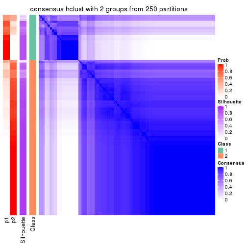</p>

</div>
<div id='tab-SD-hclust-consensus-heatmap-2'>
<pre><code class="r">consensus_heatmap(res, k = 3)
</code></pre>

<p>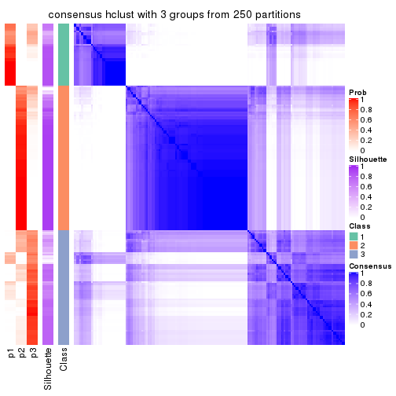</p>

</div>
<div id='tab-SD-hclust-consensus-heatmap-3'>
<pre><code class="r">consensus_heatmap(res, k = 4)
</code></pre>

<p>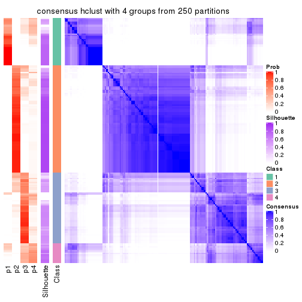</p>

</div>
<div id='tab-SD-hclust-consensus-heatmap-4'>
<pre><code class="r">consensus_heatmap(res, k = 5)
</code></pre>

<p>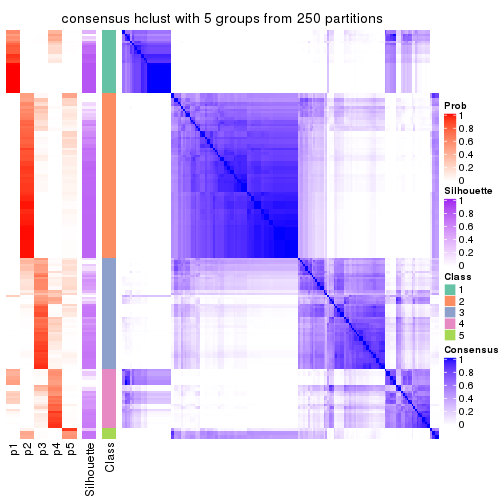</p>

</div>
<div id='tab-SD-hclust-consensus-heatmap-5'>
<pre><code class="r">consensus_heatmap(res, k = 6)
</code></pre>

<p>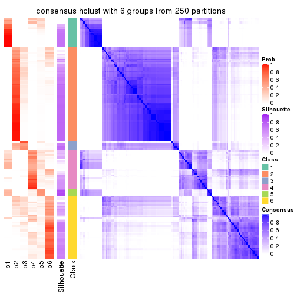</p>

</div>
</div>

Heatmaps for the membership of samples in all partitions to see how consistent they are:


<script>
$( function() {
	$( '#tabs-SD-hclust-membership-heatmap' ).tabs();
} );
</script>
<div id='tabs-SD-hclust-membership-heatmap'>
<ul>
<li><a href='#tab-SD-hclust-membership-heatmap-1'>k = 2</a></li>
<li><a href='#tab-SD-hclust-membership-heatmap-2'>k = 3</a></li>
<li><a href='#tab-SD-hclust-membership-heatmap-3'>k = 4</a></li>
<li><a href='#tab-SD-hclust-membership-heatmap-4'>k = 5</a></li>
<li><a href='#tab-SD-hclust-membership-heatmap-5'>k = 6</a></li>
</ul>
<div id='tab-SD-hclust-membership-heatmap-1'>
<pre><code class="r">membership_heatmap(res, k = 2)
</code></pre>

<p>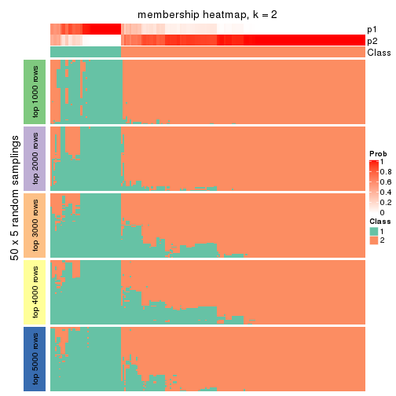</p>

</div>
<div id='tab-SD-hclust-membership-heatmap-2'>
<pre><code class="r">membership_heatmap(res, k = 3)
</code></pre>

<p>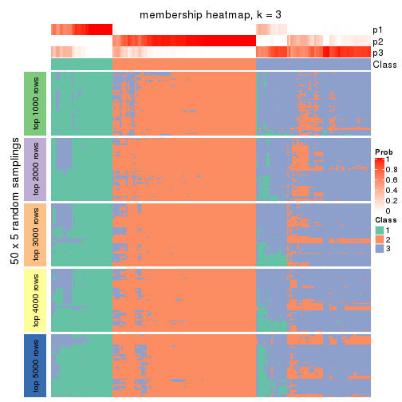</p>

</div>
<div id='tab-SD-hclust-membership-heatmap-3'>
<pre><code class="r">membership_heatmap(res, k = 4)
</code></pre>

<p>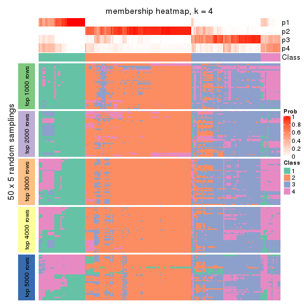</p>

</div>
<div id='tab-SD-hclust-membership-heatmap-4'>
<pre><code class="r">membership_heatmap(res, k = 5)
</code></pre>

<p>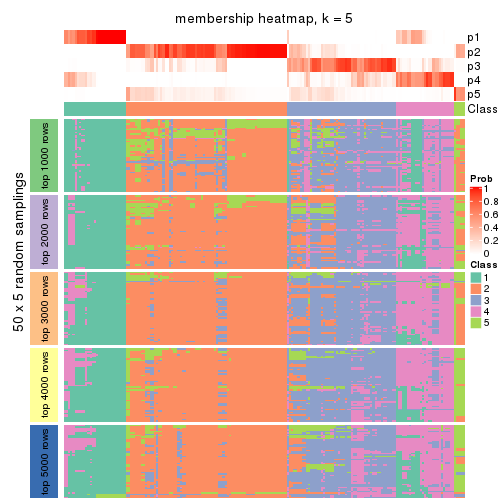</p>

</div>
<div id='tab-SD-hclust-membership-heatmap-5'>
<pre><code class="r">membership_heatmap(res, k = 6)
</code></pre>

<p>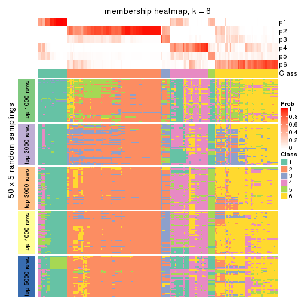</p>

</div>
</div>

As soon as we have had the classes for columns, we can look for signatures
which are significantly different between classes which can be candidate marks
for certain classes. Following are the heatmaps for signatures.


Signature heatmaps where rows are scaled:


<script>
$( function() {
	$( '#tabs-SD-hclust-get-signatures' ).tabs();
} );
</script>
<div id='tabs-SD-hclust-get-signatures'>
<ul>
<li><a href='#tab-SD-hclust-get-signatures-1'>k = 2</a></li>
<li><a href='#tab-SD-hclust-get-signatures-2'>k = 3</a></li>
<li><a href='#tab-SD-hclust-get-signatures-3'>k = 4</a></li>
<li><a href='#tab-SD-hclust-get-signatures-4'>k = 5</a></li>
<li><a href='#tab-SD-hclust-get-signatures-5'>k = 6</a></li>
</ul>
<div id='tab-SD-hclust-get-signatures-1'>
<pre><code class="r">get_signatures(res, k = 2)
</code></pre>

<p>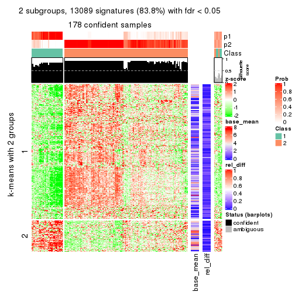</p>

</div>
<div id='tab-SD-hclust-get-signatures-2'>
<pre><code class="r">get_signatures(res, k = 3)
</code></pre>

<p>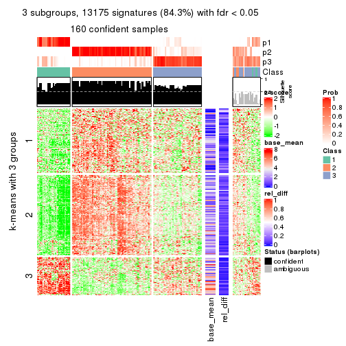</p>

</div>
<div id='tab-SD-hclust-get-signatures-3'>
<pre><code class="r">get_signatures(res, k = 4)
</code></pre>

<p>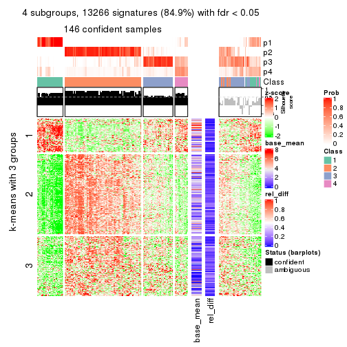</p>

</div>
<div id='tab-SD-hclust-get-signatures-4'>
<pre><code class="r">get_signatures(res, k = 5)
</code></pre>

<p>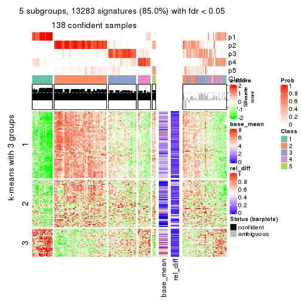</p>

</div>
<div id='tab-SD-hclust-get-signatures-5'>
<pre><code class="r">get_signatures(res, k = 6)
</code></pre>

<p>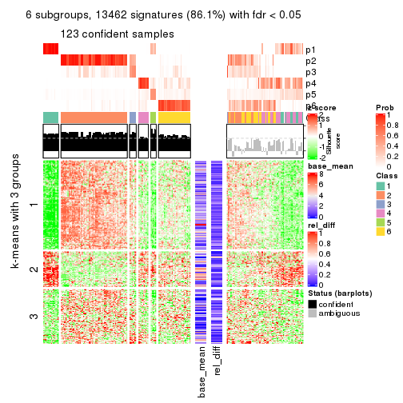</p>

</div>
</div>


Signature heatmaps where rows are not scaled:


<script>
$( function() {
	$( '#tabs-SD-hclust-get-signatures-no-scale' ).tabs();
} );
</script>
<div id='tabs-SD-hclust-get-signatures-no-scale'>
<ul>
<li><a href='#tab-SD-hclust-get-signatures-no-scale-1'>k = 2</a></li>
<li><a href='#tab-SD-hclust-get-signatures-no-scale-2'>k = 3</a></li>
<li><a href='#tab-SD-hclust-get-signatures-no-scale-3'>k = 4</a></li>
<li><a href='#tab-SD-hclust-get-signatures-no-scale-4'>k = 5</a></li>
<li><a href='#tab-SD-hclust-get-signatures-no-scale-5'>k = 6</a></li>
</ul>
<div id='tab-SD-hclust-get-signatures-no-scale-1'>
<pre><code class="r">get_signatures(res, k = 2, scale_rows = FALSE)
</code></pre>

<p>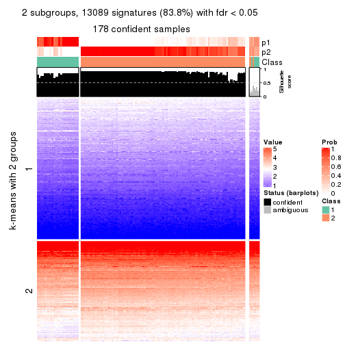</p>

</div>
<div id='tab-SD-hclust-get-signatures-no-scale-2'>
<pre><code class="r">get_signatures(res, k = 3, scale_rows = FALSE)
</code></pre>

<p>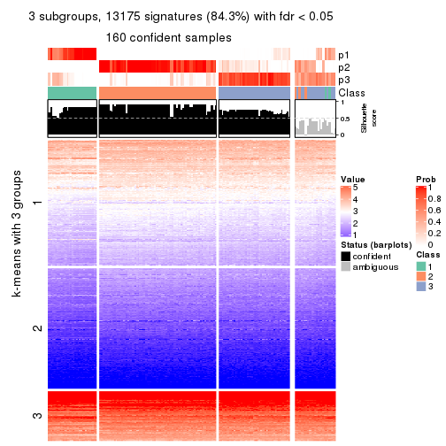</p>

</div>
<div id='tab-SD-hclust-get-signatures-no-scale-3'>
<pre><code class="r">get_signatures(res, k = 4, scale_rows = FALSE)
</code></pre>

<p>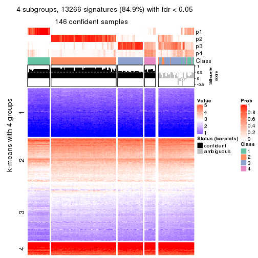</p>

</div>
<div id='tab-SD-hclust-get-signatures-no-scale-4'>
<pre><code class="r">get_signatures(res, k = 5, scale_rows = FALSE)
</code></pre>

<p>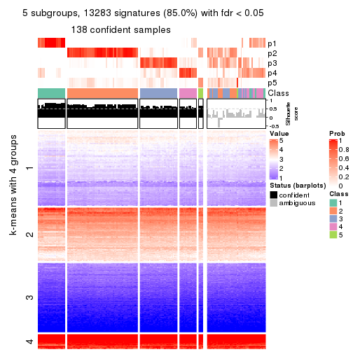</p>

</div>
<div id='tab-SD-hclust-get-signatures-no-scale-5'>
<pre><code class="r">get_signatures(res, k = 6, scale_rows = FALSE)
</code></pre>

<p>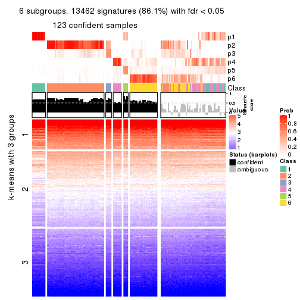</p>

</div>
</div>


Compare the overlap of signatures from different k:

```r
compare_signatures(res)
```

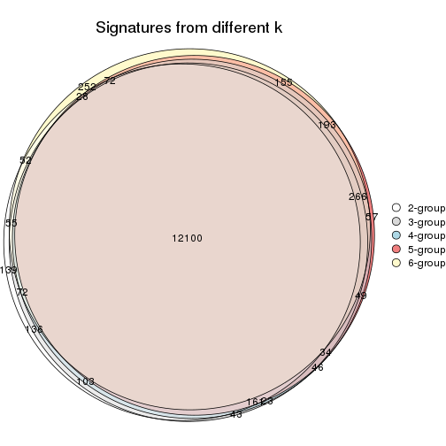

`get_signature()` returns a data frame invisibly. TO get the list of signatures, the function
call should be assigned to a variable explicitly. In following code, if `plot` argument is set
to `FALSE`, no heatmap is plotted while only the differential analysis is performed.

```r
# code only for demonstration
tb = get_signature(res, k = ..., plot = FALSE)
```

An example of the output of `tb` is:

```
#>   which_row         fdr    mean_1    mean_2 scaled_mean_1 scaled_mean_2 km
#> 1        38 0.042760348  8.373488  9.131774    -0.5533452     0.5164555  1
#> 2        40 0.018707592  7.106213  8.469186    -0.6173731     0.5762149  1
#> 3        55 0.019134737 10.221463 11.207825    -0.6159697     0.5749050  1
#> 4        59 0.006059896  5.921854  7.869574    -0.6899429     0.6439467  1
#> 5        60 0.018055526  8.928898 10.211722    -0.6204761     0.5791110  1
#> 6        98 0.009384629 15.714769 14.887706     0.6635654    -0.6193277  2
...
```

The columns in `tb` are:

1. `which_row`: row indices corresponding to the input matrix.
2. `fdr`: FDR for the differential test. 
3. `mean_x`: The mean value in group x.
4. `scaled_mean_x`: The mean value in group x after rows are scaled.
5. `km`: Row groups if k-means clustering is applied to rows.


UMAP plot which shows how samples are separated.


<script>
$( function() {
	$( '#tabs-SD-hclust-dimension-reduction' ).tabs();
} );
</script>
<div id='tabs-SD-hclust-dimension-reduction'>
<ul>
<li><a href='#tab-SD-hclust-dimension-reduction-1'>k = 2</a></li>
<li><a href='#tab-SD-hclust-dimension-reduction-2'>k = 3</a></li>
<li><a href='#tab-SD-hclust-dimension-reduction-3'>k = 4</a></li>
<li><a href='#tab-SD-hclust-dimension-reduction-4'>k = 5</a></li>
<li><a href='#tab-SD-hclust-dimension-reduction-5'>k = 6</a></li>
</ul>
<div id='tab-SD-hclust-dimension-reduction-1'>
<pre><code class="r">dimension_reduction(res, k = 2, method = &quot;UMAP&quot;)
</code></pre>

<p>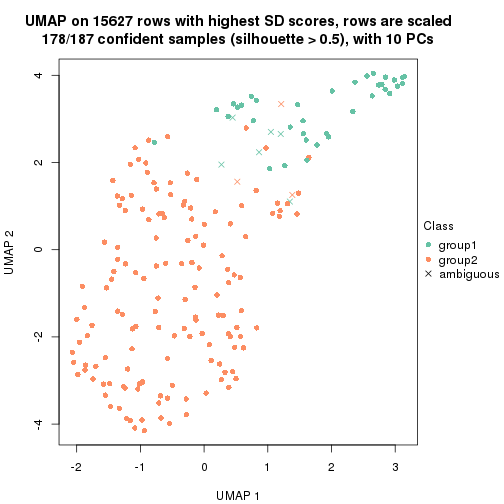</p>

</div>
<div id='tab-SD-hclust-dimension-reduction-2'>
<pre><code class="r">dimension_reduction(res, k = 3, method = &quot;UMAP&quot;)
</code></pre>

<p>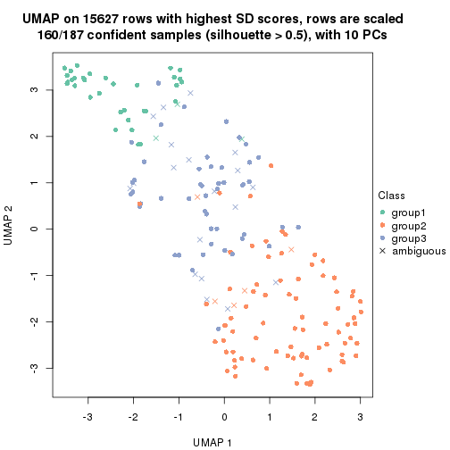</p>

</div>
<div id='tab-SD-hclust-dimension-reduction-3'>
<pre><code class="r">dimension_reduction(res, k = 4, method = &quot;UMAP&quot;)
</code></pre>

<p>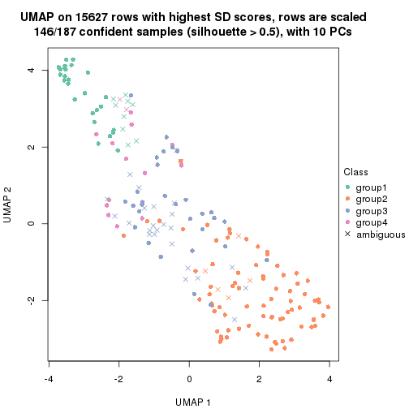</p>

</div>
<div id='tab-SD-hclust-dimension-reduction-4'>
<pre><code class="r">dimension_reduction(res, k = 5, method = &quot;UMAP&quot;)
</code></pre>

<p>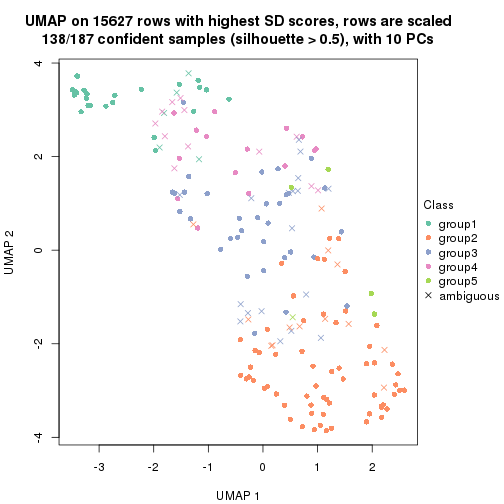</p>

</div>
<div id='tab-SD-hclust-dimension-reduction-5'>
<pre><code class="r">dimension_reduction(res, k = 6, method = &quot;UMAP&quot;)
</code></pre>

<p>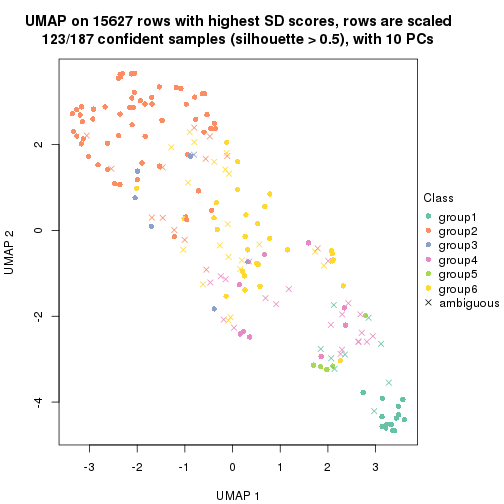</p>

</div>
</div>


Following heatmap shows how subgroups are split when increasing `k`:

```r
collect_classes(res)
```

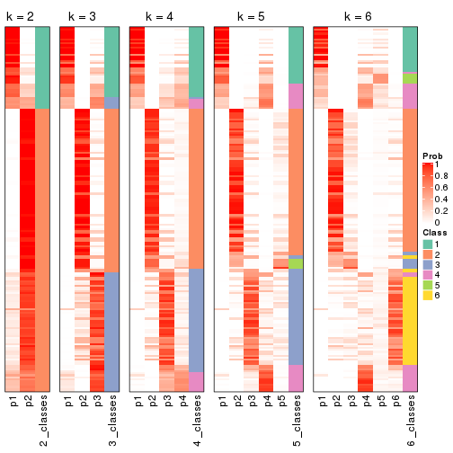


If matrix rows can be associated to genes, consider to use `GO_Enrichment(res,
...)` to perform function enrichment for the signature genes.


 

---------------------------------------------------


### SD:kmeans*


The object with results only for a single top-value method and a single partition method 
can be extracted as:

```r
res = res_list["SD", "kmeans"]
# you can also extract it by
# res = res_list["SD:kmeans"]
```

A summary of `res` and all the functions that can be applied to it:

```r
res
```

```
#> A 'ConsensusPartition' object with k = 2, 3, 4, 5, 6.
#>   On a matrix with 15627 rows and 187 columns.
#>   Top rows (1000, 2000, 3000, 4000, 5000) are extracted by 'SD' method.
#>   Subgroups are detected by 'kmeans' method.
#>   Performed in total 1250 partitions by row resampling.
#>   Best k for subgroups seems to be 3.
#> 
#> Following methods can be applied to this 'ConsensusPartition' object:
#>  [1] "cola_report"             "collect_classes"         "collect_plots"          
#>  [4] "collect_stats"           "colnames"                "compare_signatures"     
#>  [7] "consensus_heatmap"       "dimension_reduction"     "functional_enrichment"  
#> [10] "get_anno_col"            "get_anno"                "get_classes"            
#> [13] "get_consensus"           "get_matrix"              "get_membership"         
#> [16] "get_param"               "get_signatures"          "get_stats"              
#> [19] "is_best_k"               "is_stable_k"             "membership_heatmap"     
#> [22] "ncol"                    "nrow"                    "plot_ecdf"              
#> [25] "rownames"                "select_partition_number" "show"                   
#> [28] "suggest_best_k"          "test_to_known_factors"
```

`collect_plots()` function collects all the plots made from `res` for all `k` (number of partitions)
into one single page to provide an easy and fast comparison between different `k`.

```r
collect_plots(res)
```

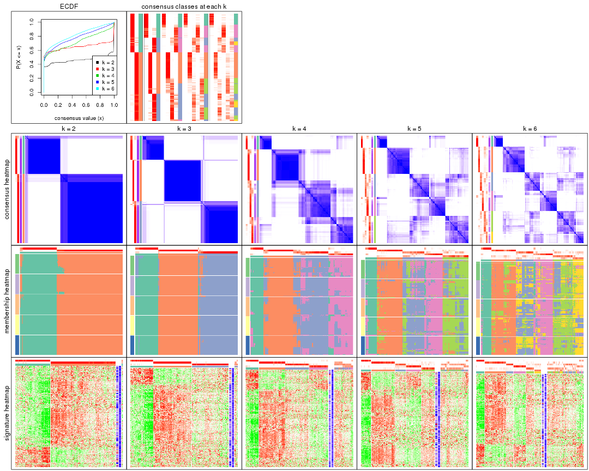

The plots are:

- The first row: a plot of the ECDF (Empirical cumulative distribution
  function) curves of the consensus matrix for each `k` and the heatmap of
  predicted classes for each `k`.
- The second row: heatmaps of the consensus matrix for each `k`.
- The third row: heatmaps of the membership matrix for each `k`.
- The fouth row: heatmaps of the signatures for each `k`.

All the plots in panels can be made by individual functions and they are
plotted later in this section.

`select_partition_number()` produces several plots showing different
statistics for choosing "optimized" `k`. There are following statistics:

- ECDF curves of the consensus matrix for each `k`;
- 1-PAC. [The PAC
  score](https://en.wikipedia.org/wiki/Consensus_clustering#Over-interpretation_potential_of_consensus_clustering)
  measures the proportion of the ambiguous subgrouping.
- Mean silhouette score.
- Concordance. The mean probability of fiting the consensus class ids in all
  partitions.
- Area increased. Denote $A_k$ as the area under the ECDF curve for current
  `k`, the area increased is defined as $A_k - A_{k-1}$.
- Rand index. The percent of pairs of samples that are both in a same cluster
  or both are not in a same cluster in the partition of k and k-1.
- Jaccard index. The ratio of pairs of samples are both in a same cluster in
  the partition of k and k-1 and the pairs of samples are both in a same
  cluster in the partition k or k-1.

The detailed explanations of these statistics can be found in [the cola
vignette](http://bioconductor.org/packages/devel/bioc/vignettes/cola/inst/doc/cola.html#toc_13).

Generally speaking, lower PAC score, higher mean silhouette score or higher
concordance corresponds to better partition. Rand index and Jaccard index
measure how similar the current partition is compared to partition with `k-1`.
If they are too similar, we won't accept `k` is better than `k-1`.

```r
select_partition_number(res)
```

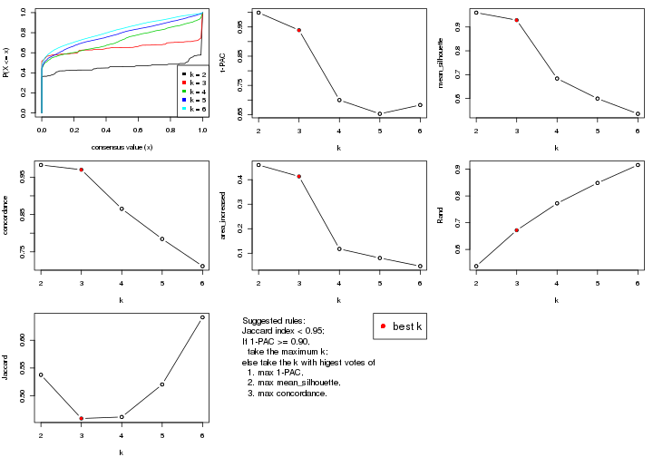

The numeric values for all these statistics can be obtained by `get_stats()`.

```r
get_stats(res)
```

```
#>   k 1-PAC mean_silhouette concordance area_increased  Rand Jaccard
#> 2 2 0.999           0.960       0.982         0.4601 0.538   0.538
#> 3 3 0.939           0.929       0.970         0.4134 0.672   0.459
#> 4 4 0.700           0.684       0.865         0.1176 0.772   0.462
#> 5 5 0.653           0.600       0.785         0.0805 0.849   0.520
#> 6 6 0.683           0.536       0.712         0.0473 0.916   0.641
```

`suggest_best_k()` suggests the best $k$ based on these statistics. The rules are as follows:

- All $k$ with Jaccard index larger than 0.95 are removed because the increase of
  the partition number does not provides enough extra information. If all $k$ are removed,
  the best $k$ is assigned by `NA`.
- For $k$ with 1-PAC larger than 0.9, the maximal $k$ is taken as the "best k". Other $k$ is called "optional k".
- If it does not fit the second rule. The $k$ with the highest vote of highest
  1-PAC, mean silhouette and concordance is taken as the "best k".

```r
suggest_best_k(res)
```

```
#> [1] 3
#> attr(,"optional")
#> [1] 2
```

There is also optional best $k$ = 2 that is worth to check.

Following shows the table of the partitions (You need to click the **show/hide
code output** link to see it). The membership matrix (columns with name `p*`)
is inferred by
[`clue::cl_consensus()`](https://www.rdocumentation.org/link/cl_consensus?package=clue)
function with the `SE` method. Basically the value in the membership matrix
represents the probability to belong to a certain group. The finall class
label for an item is determined with the group with highest probability it
belongs to.

In `get_classes()` function, the entropy is calculated from the membership
matrix and the silhouette score is calculated from the consensus matrix.


<script>
$( function() {
	$( '#tabs-SD-kmeans-get-classes' ).tabs();
} );
</script>
<div id='tabs-SD-kmeans-get-classes'>
<ul>
<li><a href='#tab-SD-kmeans-get-classes-1'>k = 2</a></li>
<li><a href='#tab-SD-kmeans-get-classes-2'>k = 3</a></li>
<li><a href='#tab-SD-kmeans-get-classes-3'>k = 4</a></li>
<li><a href='#tab-SD-kmeans-get-classes-4'>k = 5</a></li>
<li><a href='#tab-SD-kmeans-get-classes-5'>k = 6</a></li>
</ul>

<div id='tab-SD-kmeans-get-classes-1'>
<p><a id='tab-SD-kmeans-get-classes-1-a' style='color:#0366d6' href='#'>show/hide code output</a></p>
<pre><code class="r">cbind(get_classes(res, k = 2), get_membership(res, k = 2))
</code></pre>

<pre><code>#&gt;            class entropy silhouette    p1    p2
#&gt; SRR1747213     1  0.0000      0.970 1.000 0.000
#&gt; SRR1747214     1  0.0000      0.970 1.000 0.000
#&gt; SRR1747215     2  0.0000      0.988 0.000 1.000
#&gt; SRR1747216     2  0.0000      0.988 0.000 1.000
#&gt; SRR1747217     2  0.0000      0.988 0.000 1.000
#&gt; SRR1747218     2  0.0000      0.988 0.000 1.000
#&gt; SRR1747219     2  0.4298      0.908 0.088 0.912
#&gt; SRR1747220     1  0.0000      0.970 1.000 0.000
#&gt; SRR1747221     1  0.0000      0.970 1.000 0.000
#&gt; SRR1747222     1  0.0000      0.970 1.000 0.000
#&gt; SRR1747223     1  0.0000      0.970 1.000 0.000
#&gt; SRR1747224     2  0.0000      0.988 0.000 1.000
#&gt; SRR1747225     2  0.0000      0.988 0.000 1.000
#&gt; SRR1747226     2  0.0000      0.988 0.000 1.000
#&gt; SRR1747227     2  0.0000      0.988 0.000 1.000
#&gt; SRR1747228     2  0.0000      0.988 0.000 1.000
#&gt; SRR1747229     2  0.0000      0.988 0.000 1.000
#&gt; SRR1747230     1  0.0000      0.970 1.000 0.000
#&gt; SRR1747231     1  0.0000      0.970 1.000 0.000
#&gt; SRR1747232     1  0.0000      0.970 1.000 0.000
#&gt; SRR1747233     1  0.0000      0.970 1.000 0.000
#&gt; SRR1747234     2  0.0000      0.988 0.000 1.000
#&gt; SRR1747235     1  0.0000      0.970 1.000 0.000
#&gt; SRR1747236     2  0.0000      0.988 0.000 1.000
#&gt; SRR1747237     2  0.0000      0.988 0.000 1.000
#&gt; SRR1747238     2  0.0000      0.988 0.000 1.000
#&gt; SRR1747239     2  0.0000      0.988 0.000 1.000
#&gt; SRR1747240     1  0.0000      0.970 1.000 0.000
#&gt; SRR1747241     2  0.0000      0.988 0.000 1.000
#&gt; SRR1747242     1  0.0000      0.970 1.000 0.000
#&gt; SRR1747243     1  0.0000      0.970 1.000 0.000
#&gt; SRR1747244     2  0.0000      0.988 0.000 1.000
#&gt; SRR1747245     2  0.0000      0.988 0.000 1.000
#&gt; SRR1747246     2  0.0000      0.988 0.000 1.000
#&gt; SRR1747247     1  0.0000      0.970 1.000 0.000
#&gt; SRR1747248     1  0.0000      0.970 1.000 0.000
#&gt; SRR1747249     1  0.0000      0.970 1.000 0.000
#&gt; SRR1747250     2  0.0000      0.988 0.000 1.000
#&gt; SRR1747252     1  0.0000      0.970 1.000 0.000
#&gt; SRR1747253     1  0.0000      0.970 1.000 0.000
#&gt; SRR1747254     2  0.0000      0.988 0.000 1.000
#&gt; SRR1747255     1  0.0000      0.970 1.000 0.000
#&gt; SRR1747256     1  0.0000      0.970 1.000 0.000
#&gt; SRR1747257     2  0.0000      0.988 0.000 1.000
#&gt; SRR1747258     2  0.0000      0.988 0.000 1.000
#&gt; SRR1747259     2  0.0000      0.988 0.000 1.000
#&gt; SRR1747260     2  0.0000      0.988 0.000 1.000
#&gt; SRR1747261     2  0.0000      0.988 0.000 1.000
#&gt; SRR1747262     2  0.0000      0.988 0.000 1.000
#&gt; SRR1747263     2  0.0000      0.988 0.000 1.000
#&gt; SRR1747264     1  0.0000      0.970 1.000 0.000
#&gt; SRR1747265     2  0.3584      0.928 0.068 0.932
#&gt; SRR1747266     2  0.0000      0.988 0.000 1.000
#&gt; SRR1747267     2  0.5946      0.841 0.144 0.856
#&gt; SRR1747268     2  0.4815      0.890 0.104 0.896
#&gt; SRR1747269     2  0.0000      0.988 0.000 1.000
#&gt; SRR1747270     2  0.0000      0.988 0.000 1.000
#&gt; SRR1747271     2  0.0000      0.988 0.000 1.000
#&gt; SRR1747272     1  0.0672      0.963 0.992 0.008
#&gt; SRR1747273     1  0.0000      0.970 1.000 0.000
#&gt; SRR1747274     2  0.0000      0.988 0.000 1.000
#&gt; SRR1747275     1  0.0000      0.970 1.000 0.000
#&gt; SRR1747276     1  0.0000      0.970 1.000 0.000
#&gt; SRR1747277     2  0.0000      0.988 0.000 1.000
#&gt; SRR1747278     2  0.4161      0.913 0.084 0.916
#&gt; SRR1747280     1  0.0000      0.970 1.000 0.000
#&gt; SRR1747279     1  0.0000      0.970 1.000 0.000
#&gt; SRR1747281     2  0.0000      0.988 0.000 1.000
#&gt; SRR1747282     1  0.0000      0.970 1.000 0.000
#&gt; SRR1747283     2  0.3114      0.940 0.056 0.944
#&gt; SRR1747284     1  0.0000      0.970 1.000 0.000
#&gt; SRR1747285     2  0.0000      0.988 0.000 1.000
#&gt; SRR1747286     2  0.0000      0.988 0.000 1.000
#&gt; SRR1747287     2  0.0000      0.988 0.000 1.000
#&gt; SRR1747288     1  0.0000      0.970 1.000 0.000
#&gt; SRR1747290     2  0.0000      0.988 0.000 1.000
#&gt; SRR1747289     2  0.0000      0.988 0.000 1.000
#&gt; SRR1747291     2  0.0000      0.988 0.000 1.000
#&gt; SRR1747293     2  0.0000      0.988 0.000 1.000
#&gt; SRR1747294     2  0.0000      0.988 0.000 1.000
#&gt; SRR1747292     1  0.0000      0.970 1.000 0.000
#&gt; SRR1747295     2  0.0000      0.988 0.000 1.000
#&gt; SRR1747296     2  0.0000      0.988 0.000 1.000
#&gt; SRR1747297     2  0.0000      0.988 0.000 1.000
#&gt; SRR1747298     2  0.0000      0.988 0.000 1.000
#&gt; SRR1747299     2  0.0000      0.988 0.000 1.000
#&gt; SRR1747300     2  0.0000      0.988 0.000 1.000
#&gt; SRR1747301     2  0.0000      0.988 0.000 1.000
#&gt; SRR1747302     2  0.0000      0.988 0.000 1.000
#&gt; SRR1747303     2  0.0000      0.988 0.000 1.000
#&gt; SRR1747304     1  0.0000      0.970 1.000 0.000
#&gt; SRR1747305     2  0.0000      0.988 0.000 1.000
#&gt; SRR1747306     2  0.0000      0.988 0.000 1.000
#&gt; SRR1747307     1  0.3733      0.902 0.928 0.072
#&gt; SRR1747308     2  0.0000      0.988 0.000 1.000
#&gt; SRR1747309     1  0.0000      0.970 1.000 0.000
#&gt; SRR1747310     1  0.0000      0.970 1.000 0.000
#&gt; SRR1747311     1  0.9833      0.280 0.576 0.424
#&gt; SRR1747313     1  0.9209      0.507 0.664 0.336
#&gt; SRR1747312     1  0.0000      0.970 1.000 0.000
#&gt; SRR1747314     1  0.0000      0.970 1.000 0.000
#&gt; SRR1747315     2  0.0000      0.988 0.000 1.000
#&gt; SRR1747316     2  0.0000      0.988 0.000 1.000
#&gt; SRR1747318     2  0.3274      0.936 0.060 0.940
#&gt; SRR1747317     2  0.0000      0.988 0.000 1.000
#&gt; SRR1747319     1  0.9795      0.327 0.584 0.416
#&gt; SRR1747320     1  0.0000      0.970 1.000 0.000
#&gt; SRR1747322     1  0.0000      0.970 1.000 0.000
#&gt; SRR1747321     1  0.0000      0.970 1.000 0.000
#&gt; SRR1747323     2  0.0000      0.988 0.000 1.000
#&gt; SRR1747324     2  0.0000      0.988 0.000 1.000
#&gt; SRR1747326     2  0.0000      0.988 0.000 1.000
#&gt; SRR1747325     2  0.0000      0.988 0.000 1.000
#&gt; SRR1747327     2  0.0000      0.988 0.000 1.000
#&gt; SRR1747328     2  0.7528      0.735 0.216 0.784
#&gt; SRR1747330     1  0.2043      0.942 0.968 0.032
#&gt; SRR1747329     2  0.0000      0.988 0.000 1.000
#&gt; SRR1747332     1  0.0000      0.970 1.000 0.000
#&gt; SRR1747331     2  0.0000      0.988 0.000 1.000
#&gt; SRR1747333     2  0.0000      0.988 0.000 1.000
#&gt; SRR1747334     2  0.0000      0.988 0.000 1.000
#&gt; SRR1747335     1  0.9044      0.530 0.680 0.320
#&gt; SRR1747336     1  0.0000      0.970 1.000 0.000
#&gt; SRR1747337     2  0.0000      0.988 0.000 1.000
#&gt; SRR1747338     2  0.0000      0.988 0.000 1.000
#&gt; SRR1747339     2  0.4562      0.899 0.096 0.904
#&gt; SRR1747340     2  0.0000      0.988 0.000 1.000
#&gt; SRR1747341     2  0.0000      0.988 0.000 1.000
#&gt; SRR1747342     2  0.0000      0.988 0.000 1.000
#&gt; SRR1747343     2  0.0000      0.988 0.000 1.000
#&gt; SRR1747344     2  0.0000      0.988 0.000 1.000
#&gt; SRR1747345     2  0.4815      0.890 0.104 0.896
#&gt; SRR1747346     2  0.4298      0.908 0.088 0.912
#&gt; SRR1747347     2  0.0000      0.988 0.000 1.000
#&gt; SRR1747348     1  0.0000      0.970 1.000 0.000
#&gt; SRR1747349     1  0.0000      0.970 1.000 0.000
#&gt; SRR1747351     2  0.0000      0.988 0.000 1.000
#&gt; SRR1747350     2  0.0000      0.988 0.000 1.000
#&gt; SRR1747352     1  0.0000      0.970 1.000 0.000
#&gt; SRR1747353     2  0.0000      0.988 0.000 1.000
#&gt; SRR1747354     2  0.0000      0.988 0.000 1.000
#&gt; SRR1747355     1  0.0000      0.970 1.000 0.000
#&gt; SRR1747356     2  0.0000      0.988 0.000 1.000
#&gt; SRR1747357     2  0.0000      0.988 0.000 1.000
#&gt; SRR1747358     2  0.0000      0.988 0.000 1.000
#&gt; SRR1747359     1  0.0000      0.970 1.000 0.000
#&gt; SRR1747360     2  0.0000      0.988 0.000 1.000
#&gt; SRR1747361     1  0.0000      0.970 1.000 0.000
#&gt; SRR1747362     2  0.0000      0.988 0.000 1.000
#&gt; SRR1747363     1  0.0000      0.970 1.000 0.000
#&gt; SRR1747364     1  0.0000      0.970 1.000 0.000
#&gt; SRR1747365     2  0.0000      0.988 0.000 1.000
#&gt; SRR1747366     2  0.0000      0.988 0.000 1.000
#&gt; SRR1747367     1  0.0000      0.970 1.000 0.000
#&gt; SRR1747369     2  0.0000      0.988 0.000 1.000
#&gt; SRR1747368     2  0.3733      0.924 0.072 0.928
#&gt; SRR1747370     2  0.0000      0.988 0.000 1.000
#&gt; SRR1747372     1  0.0000      0.970 1.000 0.000
#&gt; SRR1747371     1  0.0000      0.970 1.000 0.000
#&gt; SRR1747373     2  0.0000      0.988 0.000 1.000
#&gt; SRR1747374     2  0.0000      0.988 0.000 1.000
#&gt; SRR1747375     1  0.0000      0.970 1.000 0.000
#&gt; SRR1747376     2  0.0000      0.988 0.000 1.000
#&gt; SRR1747377     2  0.0000      0.988 0.000 1.000
#&gt; SRR1747378     2  0.0000      0.988 0.000 1.000
#&gt; SRR1747379     2  0.0000      0.988 0.000 1.000
#&gt; SRR1747380     2  0.4298      0.908 0.088 0.912
#&gt; SRR1747381     1  0.0000      0.970 1.000 0.000
#&gt; SRR1747382     1  0.0000      0.970 1.000 0.000
#&gt; SRR1747383     2  0.0000      0.988 0.000 1.000
#&gt; SRR1747384     2  0.4298      0.908 0.088 0.912
#&gt; SRR1747385     2  0.0000      0.988 0.000 1.000
#&gt; SRR1747386     1  0.0000      0.970 1.000 0.000
#&gt; SRR1747387     2  0.0000      0.988 0.000 1.000
#&gt; SRR1747388     2  0.0000      0.988 0.000 1.000
#&gt; SRR1747390     2  0.0000      0.988 0.000 1.000
#&gt; SRR1747389     2  0.0000      0.988 0.000 1.000
#&gt; SRR1747391     2  0.0000      0.988 0.000 1.000
#&gt; SRR1747392     2  0.0000      0.988 0.000 1.000
#&gt; SRR1747393     2  0.0000      0.988 0.000 1.000
#&gt; SRR1747394     1  0.0000      0.970 1.000 0.000
#&gt; SRR1747395     2  0.0000      0.988 0.000 1.000
#&gt; SRR1747396     2  0.0000      0.988 0.000 1.000
#&gt; SRR1747398     2  0.0000      0.988 0.000 1.000
#&gt; SRR1747397     1  0.9000      0.551 0.684 0.316
#&gt; SRR1747399     1  0.0000      0.970 1.000 0.000
#&gt; SRR1747400     1  0.0000      0.970 1.000 0.000
</code></pre>

<script>
$('#tab-SD-kmeans-get-classes-1-a').parent().next().next().hide();
$('#tab-SD-kmeans-get-classes-1-a').click(function(){
  $('#tab-SD-kmeans-get-classes-1-a').parent().next().next().toggle();
  return(false);
});
</script>
</div>

<div id='tab-SD-kmeans-get-classes-2'>
<p><a id='tab-SD-kmeans-get-classes-2-a' style='color:#0366d6' href='#'>show/hide code output</a></p>
<pre><code class="r">cbind(get_classes(res, k = 3), get_membership(res, k = 3))
</code></pre>

<pre><code>#&gt;            class entropy silhouette    p1    p2    p3
#&gt; SRR1747213     3  0.0000      0.949 0.000 0.000 1.000
#&gt; SRR1747214     1  0.0237      0.951 0.996 0.000 0.004
#&gt; SRR1747215     2  0.0000      0.990 0.000 1.000 0.000
#&gt; SRR1747216     2  0.0000      0.990 0.000 1.000 0.000
#&gt; SRR1747217     3  0.0000      0.949 0.000 0.000 1.000
#&gt; SRR1747218     3  0.5706      0.553 0.000 0.320 0.680
#&gt; SRR1747219     3  0.0000      0.949 0.000 0.000 1.000
#&gt; SRR1747220     3  0.6111      0.312 0.396 0.000 0.604
#&gt; SRR1747221     3  0.0000      0.949 0.000 0.000 1.000
#&gt; SRR1747222     1  0.4931      0.747 0.768 0.000 0.232
#&gt; SRR1747223     3  0.0000      0.949 0.000 0.000 1.000
#&gt; SRR1747224     3  0.0000      0.949 0.000 0.000 1.000
#&gt; SRR1747225     3  0.1964      0.900 0.000 0.056 0.944
#&gt; SRR1747226     2  0.0000      0.990 0.000 1.000 0.000
#&gt; SRR1747227     2  0.0000      0.990 0.000 1.000 0.000
#&gt; SRR1747228     3  0.0000      0.949 0.000 0.000 1.000
#&gt; SRR1747229     2  0.0000      0.990 0.000 1.000 0.000
#&gt; SRR1747230     1  0.0000      0.953 1.000 0.000 0.000
#&gt; SRR1747231     1  0.4931      0.712 0.768 0.000 0.232
#&gt; SRR1747232     1  0.0000      0.953 1.000 0.000 0.000
#&gt; SRR1747233     1  0.4931      0.747 0.768 0.000 0.232
#&gt; SRR1747234     3  0.0424      0.943 0.000 0.008 0.992
#&gt; SRR1747235     1  0.0000      0.953 1.000 0.000 0.000
#&gt; SRR1747236     2  0.0000      0.990 0.000 1.000 0.000
#&gt; SRR1747237     2  0.0000      0.990 0.000 1.000 0.000
#&gt; SRR1747238     2  0.0000      0.990 0.000 1.000 0.000
#&gt; SRR1747239     2  0.0000      0.990 0.000 1.000 0.000
#&gt; SRR1747240     1  0.0000      0.953 1.000 0.000 0.000
#&gt; SRR1747241     3  0.4291      0.762 0.000 0.180 0.820
#&gt; SRR1747242     1  0.0000      0.953 1.000 0.000 0.000
#&gt; SRR1747243     3  0.0000      0.949 0.000 0.000 1.000
#&gt; SRR1747244     3  0.0000      0.949 0.000 0.000 1.000
#&gt; SRR1747245     3  0.6045      0.404 0.000 0.380 0.620
#&gt; SRR1747246     2  0.0000      0.990 0.000 1.000 0.000
#&gt; SRR1747247     1  0.0000      0.953 1.000 0.000 0.000
#&gt; SRR1747248     1  0.0000      0.953 1.000 0.000 0.000
#&gt; SRR1747249     1  0.4931      0.747 0.768 0.000 0.232
#&gt; SRR1747250     3  0.0000      0.949 0.000 0.000 1.000
#&gt; SRR1747252     3  0.0000      0.949 0.000 0.000 1.000
#&gt; SRR1747253     3  0.6192      0.182 0.420 0.000 0.580
#&gt; SRR1747254     2  0.0000      0.990 0.000 1.000 0.000
#&gt; SRR1747255     1  0.4842      0.758 0.776 0.000 0.224
#&gt; SRR1747256     1  0.1289      0.939 0.968 0.000 0.032
#&gt; SRR1747257     2  0.0000      0.990 0.000 1.000 0.000
#&gt; SRR1747258     3  0.0000      0.949 0.000 0.000 1.000
#&gt; SRR1747259     2  0.0000      0.990 0.000 1.000 0.000
#&gt; SRR1747260     3  0.0000      0.949 0.000 0.000 1.000
#&gt; SRR1747261     3  0.1031      0.929 0.000 0.024 0.976
#&gt; SRR1747262     2  0.0000      0.990 0.000 1.000 0.000
#&gt; SRR1747263     2  0.0000      0.990 0.000 1.000 0.000
#&gt; SRR1747264     1  0.0000      0.953 1.000 0.000 0.000
#&gt; SRR1747265     3  0.0000      0.949 0.000 0.000 1.000
#&gt; SRR1747266     3  0.0000      0.949 0.000 0.000 1.000
#&gt; SRR1747267     3  0.0000      0.949 0.000 0.000 1.000
#&gt; SRR1747268     3  0.0000      0.949 0.000 0.000 1.000
#&gt; SRR1747269     2  0.0000      0.990 0.000 1.000 0.000
#&gt; SRR1747270     2  0.0000      0.990 0.000 1.000 0.000
#&gt; SRR1747271     2  0.0000      0.990 0.000 1.000 0.000
#&gt; SRR1747272     3  0.0000      0.949 0.000 0.000 1.000
#&gt; SRR1747273     1  0.1643      0.931 0.956 0.000 0.044
#&gt; SRR1747274     3  0.0892      0.933 0.000 0.020 0.980
#&gt; SRR1747275     1  0.1163      0.941 0.972 0.000 0.028
#&gt; SRR1747276     1  0.4842      0.758 0.776 0.000 0.224
#&gt; SRR1747277     2  0.0000      0.990 0.000 1.000 0.000
#&gt; SRR1747278     3  0.0000      0.949 0.000 0.000 1.000
#&gt; SRR1747280     1  0.0000      0.953 1.000 0.000 0.000
#&gt; SRR1747279     1  0.1163      0.941 0.972 0.000 0.028
#&gt; SRR1747281     2  0.0000      0.990 0.000 1.000 0.000
#&gt; SRR1747282     1  0.0000      0.953 1.000 0.000 0.000
#&gt; SRR1747283     3  0.0000      0.949 0.000 0.000 1.000
#&gt; SRR1747284     1  0.0000      0.953 1.000 0.000 0.000
#&gt; SRR1747285     3  0.0000      0.949 0.000 0.000 1.000
#&gt; SRR1747286     3  0.6126      0.371 0.000 0.400 0.600
#&gt; SRR1747287     2  0.0000      0.990 0.000 1.000 0.000
#&gt; SRR1747288     3  0.0000      0.949 0.000 0.000 1.000
#&gt; SRR1747290     2  0.0000      0.990 0.000 1.000 0.000
#&gt; SRR1747289     2  0.0000      0.990 0.000 1.000 0.000
#&gt; SRR1747291     2  0.0000      0.990 0.000 1.000 0.000
#&gt; SRR1747293     3  0.1163      0.926 0.000 0.028 0.972
#&gt; SRR1747294     2  0.0000      0.990 0.000 1.000 0.000
#&gt; SRR1747292     1  0.1031      0.943 0.976 0.000 0.024
#&gt; SRR1747295     2  0.0000      0.990 0.000 1.000 0.000
#&gt; SRR1747296     2  0.0000      0.990 0.000 1.000 0.000
#&gt; SRR1747297     2  0.0000      0.990 0.000 1.000 0.000
#&gt; SRR1747298     2  0.0000      0.990 0.000 1.000 0.000
#&gt; SRR1747299     2  0.0000      0.990 0.000 1.000 0.000
#&gt; SRR1747300     2  0.0000      0.990 0.000 1.000 0.000
#&gt; SRR1747301     2  0.0000      0.990 0.000 1.000 0.000
#&gt; SRR1747302     2  0.0000      0.990 0.000 1.000 0.000
#&gt; SRR1747303     2  0.0000      0.990 0.000 1.000 0.000
#&gt; SRR1747304     1  0.0000      0.953 1.000 0.000 0.000
#&gt; SRR1747305     2  0.0000      0.990 0.000 1.000 0.000
#&gt; SRR1747306     2  0.0000      0.990 0.000 1.000 0.000
#&gt; SRR1747307     3  0.0000      0.949 0.000 0.000 1.000
#&gt; SRR1747308     3  0.5058      0.684 0.000 0.244 0.756
#&gt; SRR1747309     3  0.0000      0.949 0.000 0.000 1.000
#&gt; SRR1747310     1  0.0000      0.953 1.000 0.000 0.000
#&gt; SRR1747311     3  0.0000      0.949 0.000 0.000 1.000
#&gt; SRR1747313     3  0.0000      0.949 0.000 0.000 1.000
#&gt; SRR1747312     1  0.0000      0.953 1.000 0.000 0.000
#&gt; SRR1747314     1  0.0000      0.953 1.000 0.000 0.000
#&gt; SRR1747315     2  0.0000      0.990 0.000 1.000 0.000
#&gt; SRR1747316     3  0.3340      0.832 0.000 0.120 0.880
#&gt; SRR1747318     3  0.0000      0.949 0.000 0.000 1.000
#&gt; SRR1747317     3  0.0000      0.949 0.000 0.000 1.000
#&gt; SRR1747319     3  0.0000      0.949 0.000 0.000 1.000
#&gt; SRR1747320     1  0.4796      0.763 0.780 0.000 0.220
#&gt; SRR1747322     1  0.0000      0.953 1.000 0.000 0.000
#&gt; SRR1747321     1  0.0000      0.953 1.000 0.000 0.000
#&gt; SRR1747323     2  0.0000      0.990 0.000 1.000 0.000
#&gt; SRR1747324     2  0.0000      0.990 0.000 1.000 0.000
#&gt; SRR1747326     2  0.0000      0.990 0.000 1.000 0.000
#&gt; SRR1747325     2  0.0000      0.990 0.000 1.000 0.000
#&gt; SRR1747327     2  0.0000      0.990 0.000 1.000 0.000
#&gt; SRR1747328     3  0.0000      0.949 0.000 0.000 1.000
#&gt; SRR1747330     3  0.0000      0.949 0.000 0.000 1.000
#&gt; SRR1747329     3  0.0747      0.936 0.000 0.016 0.984
#&gt; SRR1747332     3  0.0000      0.949 0.000 0.000 1.000
#&gt; SRR1747331     2  0.4931      0.682 0.000 0.768 0.232
#&gt; SRR1747333     2  0.6079      0.339 0.000 0.612 0.388
#&gt; SRR1747334     2  0.0000      0.990 0.000 1.000 0.000
#&gt; SRR1747335     3  0.0000      0.949 0.000 0.000 1.000
#&gt; SRR1747336     1  0.0000      0.953 1.000 0.000 0.000
#&gt; SRR1747337     2  0.0000      0.990 0.000 1.000 0.000
#&gt; SRR1747338     2  0.0000      0.990 0.000 1.000 0.000
#&gt; SRR1747339     3  0.0000      0.949 0.000 0.000 1.000
#&gt; SRR1747340     3  0.0000      0.949 0.000 0.000 1.000
#&gt; SRR1747341     2  0.0000      0.990 0.000 1.000 0.000
#&gt; SRR1747342     2  0.0000      0.990 0.000 1.000 0.000
#&gt; SRR1747343     2  0.0000      0.990 0.000 1.000 0.000
#&gt; SRR1747344     2  0.0000      0.990 0.000 1.000 0.000
#&gt; SRR1747345     3  0.0000      0.949 0.000 0.000 1.000
#&gt; SRR1747346     3  0.0000      0.949 0.000 0.000 1.000
#&gt; SRR1747347     2  0.0000      0.990 0.000 1.000 0.000
#&gt; SRR1747348     1  0.0000      0.953 1.000 0.000 0.000
#&gt; SRR1747349     1  0.0000      0.953 1.000 0.000 0.000
#&gt; SRR1747351     2  0.0000      0.990 0.000 1.000 0.000
#&gt; SRR1747350     2  0.0000      0.990 0.000 1.000 0.000
#&gt; SRR1747352     1  0.0000      0.953 1.000 0.000 0.000
#&gt; SRR1747353     2  0.0000      0.990 0.000 1.000 0.000
#&gt; SRR1747354     3  0.0000      0.949 0.000 0.000 1.000
#&gt; SRR1747355     3  0.0000      0.949 0.000 0.000 1.000
#&gt; SRR1747356     3  0.0000      0.949 0.000 0.000 1.000
#&gt; SRR1747357     3  0.0000      0.949 0.000 0.000 1.000
#&gt; SRR1747358     3  0.0000      0.949 0.000 0.000 1.000
#&gt; SRR1747359     1  0.1163      0.941 0.972 0.000 0.028
#&gt; SRR1747360     2  0.0000      0.990 0.000 1.000 0.000
#&gt; SRR1747361     3  0.0000      0.949 0.000 0.000 1.000
#&gt; SRR1747362     2  0.0000      0.990 0.000 1.000 0.000
#&gt; SRR1747363     3  0.0000      0.949 0.000 0.000 1.000
#&gt; SRR1747364     1  0.3116      0.879 0.892 0.000 0.108
#&gt; SRR1747365     3  0.0000      0.949 0.000 0.000 1.000
#&gt; SRR1747366     2  0.0000      0.990 0.000 1.000 0.000
#&gt; SRR1747367     3  0.0000      0.949 0.000 0.000 1.000
#&gt; SRR1747369     2  0.0000      0.990 0.000 1.000 0.000
#&gt; SRR1747368     3  0.0000      0.949 0.000 0.000 1.000
#&gt; SRR1747370     3  0.0000      0.949 0.000 0.000 1.000
#&gt; SRR1747372     1  0.0000      0.953 1.000 0.000 0.000
#&gt; SRR1747371     3  0.0000      0.949 0.000 0.000 1.000
#&gt; SRR1747373     2  0.0000      0.990 0.000 1.000 0.000
#&gt; SRR1747374     2  0.0000      0.990 0.000 1.000 0.000
#&gt; SRR1747375     3  0.0000      0.949 0.000 0.000 1.000
#&gt; SRR1747376     2  0.0000      0.990 0.000 1.000 0.000
#&gt; SRR1747377     2  0.0000      0.990 0.000 1.000 0.000
#&gt; SRR1747378     2  0.0000      0.990 0.000 1.000 0.000
#&gt; SRR1747379     3  0.2165      0.892 0.000 0.064 0.936
#&gt; SRR1747380     3  0.0000      0.949 0.000 0.000 1.000
#&gt; SRR1747381     1  0.0000      0.953 1.000 0.000 0.000
#&gt; SRR1747382     1  0.0424      0.950 0.992 0.000 0.008
#&gt; SRR1747383     2  0.0000      0.990 0.000 1.000 0.000
#&gt; SRR1747384     3  0.0000      0.949 0.000 0.000 1.000
#&gt; SRR1747385     3  0.0747      0.936 0.000 0.016 0.984
#&gt; SRR1747386     1  0.0000      0.953 1.000 0.000 0.000
#&gt; SRR1747387     2  0.0000      0.990 0.000 1.000 0.000
#&gt; SRR1747388     2  0.0000      0.990 0.000 1.000 0.000
#&gt; SRR1747390     3  0.6225      0.280 0.000 0.432 0.568
#&gt; SRR1747389     2  0.0000      0.990 0.000 1.000 0.000
#&gt; SRR1747391     2  0.0000      0.990 0.000 1.000 0.000
#&gt; SRR1747392     2  0.0000      0.990 0.000 1.000 0.000
#&gt; SRR1747393     3  0.0000      0.949 0.000 0.000 1.000
#&gt; SRR1747394     3  0.0000      0.949 0.000 0.000 1.000
#&gt; SRR1747395     3  0.0000      0.949 0.000 0.000 1.000
#&gt; SRR1747396     2  0.0000      0.990 0.000 1.000 0.000
#&gt; SRR1747398     2  0.0000      0.990 0.000 1.000 0.000
#&gt; SRR1747397     3  0.0000      0.949 0.000 0.000 1.000
#&gt; SRR1747399     1  0.0000      0.953 1.000 0.000 0.000
#&gt; SRR1747400     1  0.0000      0.953 1.000 0.000 0.000
</code></pre>

<script>
$('#tab-SD-kmeans-get-classes-2-a').parent().next().next().hide();
$('#tab-SD-kmeans-get-classes-2-a').click(function(){
  $('#tab-SD-kmeans-get-classes-2-a').parent().next().next().toggle();
  return(false);
});
</script>
</div>

<div id='tab-SD-kmeans-get-classes-3'>
<p><a id='tab-SD-kmeans-get-classes-3-a' style='color:#0366d6' href='#'>show/hide code output</a></p>
<pre><code class="r">cbind(get_classes(res, k = 4), get_membership(res, k = 4))
</code></pre>

<pre><code>#&gt;            class entropy silhouette    p1    p2    p3    p4
#&gt; SRR1747213     4  0.0921    0.77482 0.000 0.000 0.028 0.972
#&gt; SRR1747214     4  0.4889    0.27918 0.360 0.000 0.004 0.636
#&gt; SRR1747215     2  0.0000    0.92524 0.000 1.000 0.000 0.000
#&gt; SRR1747216     2  0.0000    0.92524 0.000 1.000 0.000 0.000
#&gt; SRR1747217     3  0.3311    0.63726 0.000 0.000 0.828 0.172
#&gt; SRR1747218     3  0.1209    0.75157 0.000 0.032 0.964 0.004
#&gt; SRR1747219     3  0.2921    0.68134 0.000 0.000 0.860 0.140
#&gt; SRR1747220     4  0.1820    0.76496 0.036 0.000 0.020 0.944
#&gt; SRR1747221     4  0.0592    0.77378 0.000 0.000 0.016 0.984
#&gt; SRR1747222     4  0.1209    0.76947 0.032 0.000 0.004 0.964
#&gt; SRR1747223     4  0.0592    0.77378 0.000 0.000 0.016 0.984
#&gt; SRR1747224     3  0.3764    0.62519 0.000 0.000 0.784 0.216
#&gt; SRR1747225     3  0.2844    0.73900 0.000 0.052 0.900 0.048
#&gt; SRR1747226     2  0.0188    0.92531 0.000 0.996 0.000 0.004
#&gt; SRR1747227     2  0.0000    0.92524 0.000 1.000 0.000 0.000
#&gt; SRR1747228     3  0.2408    0.72133 0.000 0.000 0.896 0.104
#&gt; SRR1747229     2  0.3494    0.74965 0.000 0.824 0.172 0.004
#&gt; SRR1747230     1  0.0000    0.92971 1.000 0.000 0.000 0.000
#&gt; SRR1747231     4  0.3249    0.68274 0.140 0.000 0.008 0.852
#&gt; SRR1747232     1  0.0000    0.92971 1.000 0.000 0.000 0.000
#&gt; SRR1747233     4  0.2593    0.72729 0.104 0.000 0.004 0.892
#&gt; SRR1747234     3  0.0779    0.75255 0.000 0.004 0.980 0.016
#&gt; SRR1747235     1  0.0707    0.92218 0.980 0.000 0.000 0.020
#&gt; SRR1747236     2  0.4560    0.57799 0.000 0.700 0.296 0.004
#&gt; SRR1747237     2  0.0336    0.92184 0.000 0.992 0.008 0.000
#&gt; SRR1747238     3  0.2466    0.72599 0.000 0.096 0.900 0.004
#&gt; SRR1747239     2  0.0188    0.92531 0.000 0.996 0.000 0.004
#&gt; SRR1747240     1  0.0000    0.92971 1.000 0.000 0.000 0.000
#&gt; SRR1747241     3  0.0657    0.75268 0.000 0.004 0.984 0.012
#&gt; SRR1747242     1  0.0000    0.92971 1.000 0.000 0.000 0.000
#&gt; SRR1747243     4  0.0592    0.77378 0.000 0.000 0.016 0.984
#&gt; SRR1747244     3  0.2704    0.70877 0.000 0.000 0.876 0.124
#&gt; SRR1747245     3  0.2830    0.73818 0.000 0.040 0.900 0.060
#&gt; SRR1747246     2  0.0188    0.92531 0.000 0.996 0.000 0.004
#&gt; SRR1747247     1  0.0000    0.92971 1.000 0.000 0.000 0.000
#&gt; SRR1747248     1  0.0000    0.92971 1.000 0.000 0.000 0.000
#&gt; SRR1747249     4  0.2867    0.72724 0.104 0.000 0.012 0.884
#&gt; SRR1747250     3  0.1022    0.75133 0.000 0.000 0.968 0.032
#&gt; SRR1747252     4  0.0817    0.77499 0.000 0.000 0.024 0.976
#&gt; SRR1747253     4  0.1042    0.77474 0.008 0.000 0.020 0.972
#&gt; SRR1747254     2  0.0188    0.92531 0.000 0.996 0.000 0.004
#&gt; SRR1747255     4  0.0707    0.77227 0.020 0.000 0.000 0.980
#&gt; SRR1747256     4  0.1743    0.75959 0.056 0.000 0.004 0.940
#&gt; SRR1747257     2  0.0000    0.92524 0.000 1.000 0.000 0.000
#&gt; SRR1747258     3  0.0469    0.75294 0.000 0.000 0.988 0.012
#&gt; SRR1747259     2  0.0657    0.91875 0.000 0.984 0.012 0.004
#&gt; SRR1747260     3  0.1004    0.75263 0.000 0.004 0.972 0.024
#&gt; SRR1747261     3  0.0188    0.75345 0.000 0.004 0.996 0.000
#&gt; SRR1747262     3  0.4730    0.36381 0.000 0.364 0.636 0.000
#&gt; SRR1747263     2  0.0336    0.92161 0.000 0.992 0.008 0.000
#&gt; SRR1747264     1  0.1557    0.90226 0.944 0.000 0.000 0.056
#&gt; SRR1747265     3  0.1118    0.75015 0.000 0.000 0.964 0.036
#&gt; SRR1747266     3  0.0707    0.75222 0.000 0.000 0.980 0.020
#&gt; SRR1747267     3  0.4989   -0.00905 0.000 0.000 0.528 0.472
#&gt; SRR1747268     3  0.5000   -0.08195 0.000 0.000 0.500 0.500
#&gt; SRR1747269     3  0.5168   -0.10421 0.000 0.496 0.500 0.004
#&gt; SRR1747270     2  0.5161    0.15901 0.000 0.520 0.476 0.004
#&gt; SRR1747271     3  0.4283    0.58924 0.000 0.256 0.740 0.004
#&gt; SRR1747272     4  0.4967    0.18734 0.000 0.000 0.452 0.548
#&gt; SRR1747273     4  0.2965    0.73754 0.072 0.000 0.036 0.892
#&gt; SRR1747274     3  0.0336    0.75301 0.000 0.000 0.992 0.008
#&gt; SRR1747275     4  0.2647    0.71401 0.120 0.000 0.000 0.880
#&gt; SRR1747276     4  0.1118    0.76793 0.036 0.000 0.000 0.964
#&gt; SRR1747277     2  0.5151    0.18918 0.000 0.532 0.464 0.004
#&gt; SRR1747278     3  0.4643    0.38414 0.000 0.000 0.656 0.344
#&gt; SRR1747280     1  0.0000    0.92971 1.000 0.000 0.000 0.000
#&gt; SRR1747279     4  0.3052    0.69912 0.136 0.000 0.004 0.860
#&gt; SRR1747281     2  0.0469    0.91985 0.000 0.988 0.012 0.000
#&gt; SRR1747282     1  0.3873    0.75159 0.772 0.000 0.000 0.228
#&gt; SRR1747283     3  0.2814    0.68598 0.000 0.000 0.868 0.132
#&gt; SRR1747284     1  0.3907    0.74715 0.768 0.000 0.000 0.232
#&gt; SRR1747285     3  0.0707    0.75311 0.000 0.000 0.980 0.020
#&gt; SRR1747286     3  0.2101    0.74078 0.000 0.060 0.928 0.012
#&gt; SRR1747287     2  0.4543    0.52758 0.000 0.676 0.324 0.000
#&gt; SRR1747288     4  0.3726    0.67021 0.000 0.000 0.212 0.788
#&gt; SRR1747290     2  0.5143    0.21288 0.000 0.540 0.456 0.004
#&gt; SRR1747289     2  0.0376    0.92365 0.000 0.992 0.004 0.004
#&gt; SRR1747291     3  0.3873    0.63448 0.000 0.228 0.772 0.000
#&gt; SRR1747293     3  0.0817    0.75156 0.000 0.000 0.976 0.024
#&gt; SRR1747294     2  0.1474    0.88793 0.000 0.948 0.052 0.000
#&gt; SRR1747292     4  0.2868    0.69872 0.136 0.000 0.000 0.864
#&gt; SRR1747295     3  0.4155    0.57440 0.000 0.240 0.756 0.004
#&gt; SRR1747296     3  0.1489    0.74773 0.000 0.044 0.952 0.004
#&gt; SRR1747297     2  0.0336    0.92161 0.000 0.992 0.008 0.000
#&gt; SRR1747298     2  0.0707    0.91467 0.000 0.980 0.020 0.000
#&gt; SRR1747299     2  0.0000    0.92524 0.000 1.000 0.000 0.000
#&gt; SRR1747300     2  0.0188    0.92531 0.000 0.996 0.000 0.004
#&gt; SRR1747301     2  0.3982    0.67932 0.000 0.776 0.220 0.004
#&gt; SRR1747302     2  0.0188    0.92531 0.000 0.996 0.000 0.004
#&gt; SRR1747303     2  0.4950    0.39452 0.000 0.620 0.376 0.004
#&gt; SRR1747304     1  0.0000    0.92971 1.000 0.000 0.000 0.000
#&gt; SRR1747305     2  0.0000    0.92524 0.000 1.000 0.000 0.000
#&gt; SRR1747306     2  0.0000    0.92524 0.000 1.000 0.000 0.000
#&gt; SRR1747307     4  0.4989    0.18199 0.000 0.000 0.472 0.528
#&gt; SRR1747308     3  0.0895    0.75310 0.000 0.020 0.976 0.004
#&gt; SRR1747309     4  0.0592    0.77460 0.000 0.000 0.016 0.984
#&gt; SRR1747310     1  0.1211    0.91265 0.960 0.000 0.000 0.040
#&gt; SRR1747311     4  0.4843    0.34532 0.000 0.000 0.396 0.604
#&gt; SRR1747313     4  0.4331    0.55861 0.000 0.000 0.288 0.712
#&gt; SRR1747312     1  0.0000    0.92971 1.000 0.000 0.000 0.000
#&gt; SRR1747314     1  0.0000    0.92971 1.000 0.000 0.000 0.000
#&gt; SRR1747315     3  0.4994    0.02494 0.000 0.480 0.520 0.000
#&gt; SRR1747316     3  0.0524    0.75416 0.000 0.008 0.988 0.004
#&gt; SRR1747318     4  0.5000    0.04079 0.000 0.000 0.500 0.500
#&gt; SRR1747317     3  0.4999   -0.05738 0.000 0.000 0.508 0.492
#&gt; SRR1747319     3  0.4925    0.08214 0.000 0.000 0.572 0.428
#&gt; SRR1747320     4  0.1677    0.76710 0.040 0.000 0.012 0.948
#&gt; SRR1747322     1  0.0000    0.92971 1.000 0.000 0.000 0.000
#&gt; SRR1747321     4  0.3942    0.56231 0.236 0.000 0.000 0.764
#&gt; SRR1747323     2  0.0188    0.92531 0.000 0.996 0.000 0.004
#&gt; SRR1747324     3  0.5016    0.32008 0.000 0.396 0.600 0.004
#&gt; SRR1747326     2  0.0188    0.92355 0.000 0.996 0.004 0.000
#&gt; SRR1747325     2  0.0000    0.92524 0.000 1.000 0.000 0.000
#&gt; SRR1747327     2  0.0336    0.92161 0.000 0.992 0.008 0.000
#&gt; SRR1747328     3  0.4522    0.41715 0.000 0.000 0.680 0.320
#&gt; SRR1747330     4  0.4164    0.59245 0.000 0.000 0.264 0.736
#&gt; SRR1747329     3  0.2704    0.70877 0.000 0.000 0.876 0.124
#&gt; SRR1747332     4  0.2760    0.74769 0.000 0.000 0.128 0.872
#&gt; SRR1747331     3  0.2048    0.73925 0.000 0.064 0.928 0.008
#&gt; SRR1747333     3  0.2844    0.73930 0.000 0.048 0.900 0.052
#&gt; SRR1747334     2  0.0188    0.92531 0.000 0.996 0.000 0.004
#&gt; SRR1747335     4  0.4967    0.22464 0.000 0.000 0.452 0.548
#&gt; SRR1747336     1  0.0000    0.92971 1.000 0.000 0.000 0.000
#&gt; SRR1747337     2  0.0188    0.92531 0.000 0.996 0.000 0.004
#&gt; SRR1747338     2  0.0188    0.92531 0.000 0.996 0.000 0.004
#&gt; SRR1747339     4  0.4996    0.09912 0.000 0.000 0.484 0.516
#&gt; SRR1747340     3  0.2469    0.71995 0.000 0.000 0.892 0.108
#&gt; SRR1747341     2  0.0000    0.92524 0.000 1.000 0.000 0.000
#&gt; SRR1747342     2  0.0000    0.92524 0.000 1.000 0.000 0.000
#&gt; SRR1747343     2  0.0188    0.92531 0.000 0.996 0.000 0.004
#&gt; SRR1747344     3  0.5016    0.32008 0.000 0.396 0.600 0.004
#&gt; SRR1747345     4  0.4994    0.11864 0.000 0.000 0.480 0.520
#&gt; SRR1747346     3  0.4998   -0.03032 0.000 0.000 0.512 0.488
#&gt; SRR1747347     2  0.0188    0.92531 0.000 0.996 0.000 0.004
#&gt; SRR1747348     1  0.0000    0.92971 1.000 0.000 0.000 0.000
#&gt; SRR1747349     4  0.4916    0.07654 0.424 0.000 0.000 0.576
#&gt; SRR1747351     2  0.0000    0.92524 0.000 1.000 0.000 0.000
#&gt; SRR1747350     3  0.4985    0.00498 0.000 0.468 0.532 0.000
#&gt; SRR1747352     1  0.1557    0.90378 0.944 0.000 0.000 0.056
#&gt; SRR1747353     3  0.4907    0.17912 0.000 0.420 0.580 0.000
#&gt; SRR1747354     3  0.1022    0.75192 0.000 0.000 0.968 0.032
#&gt; SRR1747355     4  0.0707    0.77522 0.000 0.000 0.020 0.980
#&gt; SRR1747356     3  0.1022    0.75157 0.000 0.000 0.968 0.032
#&gt; SRR1747357     3  0.1022    0.75097 0.000 0.000 0.968 0.032
#&gt; SRR1747358     3  0.0707    0.75185 0.000 0.000 0.980 0.020
#&gt; SRR1747359     4  0.2814    0.70345 0.132 0.000 0.000 0.868
#&gt; SRR1747360     3  0.5137    0.05925 0.000 0.452 0.544 0.004
#&gt; SRR1747361     4  0.3907    0.63497 0.000 0.000 0.232 0.768
#&gt; SRR1747362     2  0.4992    0.15258 0.000 0.524 0.476 0.000
#&gt; SRR1747363     4  0.1637    0.77162 0.000 0.000 0.060 0.940
#&gt; SRR1747364     4  0.2101    0.75434 0.060 0.000 0.012 0.928
#&gt; SRR1747365     3  0.3486    0.62350 0.000 0.000 0.812 0.188
#&gt; SRR1747366     3  0.4992   -0.01463 0.000 0.476 0.524 0.000
#&gt; SRR1747367     4  0.2216    0.76067 0.000 0.000 0.092 0.908
#&gt; SRR1747369     2  0.0188    0.92531 0.000 0.996 0.000 0.004
#&gt; SRR1747368     3  0.3837    0.60006 0.000 0.000 0.776 0.224
#&gt; SRR1747370     3  0.1211    0.75055 0.000 0.000 0.960 0.040
#&gt; SRR1747372     1  0.0000    0.92971 1.000 0.000 0.000 0.000
#&gt; SRR1747371     4  0.0779    0.77511 0.004 0.000 0.016 0.980
#&gt; SRR1747373     2  0.0188    0.92531 0.000 0.996 0.000 0.004
#&gt; SRR1747374     2  0.0000    0.92524 0.000 1.000 0.000 0.000
#&gt; SRR1747375     4  0.1637    0.76929 0.000 0.000 0.060 0.940
#&gt; SRR1747376     2  0.0188    0.92531 0.000 0.996 0.000 0.004
#&gt; SRR1747377     2  0.0188    0.92531 0.000 0.996 0.000 0.004
#&gt; SRR1747378     3  0.4792    0.48338 0.000 0.312 0.680 0.008
#&gt; SRR1747379     3  0.1474    0.74609 0.000 0.000 0.948 0.052
#&gt; SRR1747380     3  0.4998   -0.03032 0.000 0.000 0.512 0.488
#&gt; SRR1747381     1  0.4382    0.65906 0.704 0.000 0.000 0.296
#&gt; SRR1747382     4  0.4741    0.36135 0.328 0.000 0.004 0.668
#&gt; SRR1747383     2  0.0000    0.92524 0.000 1.000 0.000 0.000
#&gt; SRR1747384     3  0.4999   -0.08323 0.000 0.000 0.508 0.492
#&gt; SRR1747385     3  0.2704    0.70877 0.000 0.000 0.876 0.124
#&gt; SRR1747386     1  0.0000    0.92971 1.000 0.000 0.000 0.000
#&gt; SRR1747387     2  0.0000    0.92524 0.000 1.000 0.000 0.000
#&gt; SRR1747388     2  0.0000    0.92524 0.000 1.000 0.000 0.000
#&gt; SRR1747390     3  0.0657    0.75357 0.000 0.012 0.984 0.004
#&gt; SRR1747389     3  0.2281    0.72343 0.000 0.096 0.904 0.000
#&gt; SRR1747391     2  0.0336    0.92161 0.000 0.992 0.008 0.000
#&gt; SRR1747392     2  0.0336    0.92161 0.000 0.992 0.008 0.000
#&gt; SRR1747393     3  0.0469    0.75325 0.000 0.000 0.988 0.012
#&gt; SRR1747394     4  0.2921    0.73205 0.000 0.000 0.140 0.860
#&gt; SRR1747395     3  0.4454    0.47891 0.000 0.000 0.692 0.308
#&gt; SRR1747396     2  0.0188    0.92531 0.000 0.996 0.000 0.004
#&gt; SRR1747398     2  0.0188    0.92531 0.000 0.996 0.000 0.004
#&gt; SRR1747397     4  0.4222    0.58374 0.000 0.000 0.272 0.728
#&gt; SRR1747399     1  0.3907    0.74715 0.768 0.000 0.000 0.232
#&gt; SRR1747400     1  0.4804    0.50010 0.616 0.000 0.000 0.384
</code></pre>

<script>
$('#tab-SD-kmeans-get-classes-3-a').parent().next().next().hide();
$('#tab-SD-kmeans-get-classes-3-a').click(function(){
  $('#tab-SD-kmeans-get-classes-3-a').parent().next().next().toggle();
  return(false);
});
</script>
</div>

<div id='tab-SD-kmeans-get-classes-4'>
<p><a id='tab-SD-kmeans-get-classes-4-a' style='color:#0366d6' href='#'>show/hide code output</a></p>
<pre><code class="r">cbind(get_classes(res, k = 5), get_membership(res, k = 5))
</code></pre>

<pre><code>#&gt;            class entropy silhouette    p1    p2    p3    p4    p5
#&gt; SRR1747213     4  0.0865    0.82357 0.000 0.000 0.024 0.972 0.004
#&gt; SRR1747214     4  0.3069    0.75868 0.104 0.000 0.016 0.864 0.016
#&gt; SRR1747215     2  0.0290    0.90496 0.000 0.992 0.008 0.000 0.000
#&gt; SRR1747216     2  0.0566    0.90451 0.000 0.984 0.012 0.000 0.004
#&gt; SRR1747217     3  0.5447    0.34781 0.000 0.000 0.536 0.064 0.400
#&gt; SRR1747218     5  0.0794    0.60487 0.000 0.000 0.028 0.000 0.972
#&gt; SRR1747219     3  0.5276    0.28506 0.000 0.000 0.516 0.048 0.436
#&gt; SRR1747220     4  0.1386    0.81973 0.000 0.000 0.032 0.952 0.016
#&gt; SRR1747221     4  0.2471    0.74899 0.000 0.000 0.136 0.864 0.000
#&gt; SRR1747222     4  0.0798    0.82816 0.008 0.000 0.016 0.976 0.000
#&gt; SRR1747223     4  0.3210    0.66614 0.000 0.000 0.212 0.788 0.000
#&gt; SRR1747224     3  0.3479    0.60873 0.000 0.000 0.836 0.084 0.080
#&gt; SRR1747225     3  0.4300   -0.28013 0.000 0.000 0.524 0.000 0.476
#&gt; SRR1747226     2  0.1211    0.90254 0.000 0.960 0.016 0.000 0.024
#&gt; SRR1747227     2  0.2540    0.86856 0.000 0.888 0.088 0.000 0.024
#&gt; SRR1747228     3  0.4341   -0.15011 0.000 0.000 0.592 0.004 0.404
#&gt; SRR1747229     5  0.5178   -0.00891 0.000 0.476 0.040 0.000 0.484
#&gt; SRR1747230     1  0.0000    0.89017 1.000 0.000 0.000 0.000 0.000
#&gt; SRR1747231     4  0.2256    0.81145 0.032 0.000 0.032 0.920 0.016
#&gt; SRR1747232     1  0.0000    0.89017 1.000 0.000 0.000 0.000 0.000
#&gt; SRR1747233     4  0.1469    0.82677 0.036 0.000 0.016 0.948 0.000
#&gt; SRR1747234     5  0.4524    0.18100 0.000 0.000 0.336 0.020 0.644
#&gt; SRR1747235     1  0.4080    0.70343 0.760 0.000 0.012 0.212 0.016
#&gt; SRR1747236     5  0.4065    0.53124 0.000 0.264 0.016 0.000 0.720
#&gt; SRR1747237     2  0.1485    0.89647 0.000 0.948 0.020 0.000 0.032
#&gt; SRR1747238     5  0.1168    0.60433 0.000 0.008 0.032 0.000 0.960
#&gt; SRR1747239     2  0.0912    0.90509 0.000 0.972 0.016 0.000 0.012
#&gt; SRR1747240     1  0.0000    0.89017 1.000 0.000 0.000 0.000 0.000
#&gt; SRR1747241     5  0.2629    0.54765 0.000 0.000 0.136 0.004 0.860
#&gt; SRR1747242     1  0.0162    0.88855 0.996 0.000 0.004 0.000 0.000
#&gt; SRR1747243     4  0.2966    0.70157 0.000 0.000 0.184 0.816 0.000
#&gt; SRR1747244     3  0.4424    0.33679 0.000 0.000 0.728 0.048 0.224
#&gt; SRR1747245     3  0.4446   -0.30576 0.000 0.004 0.520 0.000 0.476
#&gt; SRR1747246     2  0.0912    0.90509 0.000 0.972 0.016 0.000 0.012
#&gt; SRR1747247     1  0.0000    0.89017 1.000 0.000 0.000 0.000 0.000
#&gt; SRR1747248     1  0.0000    0.89017 1.000 0.000 0.000 0.000 0.000
#&gt; SRR1747249     4  0.1124    0.82725 0.036 0.000 0.004 0.960 0.000
#&gt; SRR1747250     5  0.4974   -0.14539 0.000 0.000 0.464 0.028 0.508
#&gt; SRR1747252     4  0.3789    0.58889 0.000 0.000 0.224 0.760 0.016
#&gt; SRR1747253     4  0.0703    0.82207 0.000 0.000 0.024 0.976 0.000
#&gt; SRR1747254     2  0.0912    0.90509 0.000 0.972 0.016 0.000 0.012
#&gt; SRR1747255     4  0.0671    0.82785 0.004 0.000 0.016 0.980 0.000
#&gt; SRR1747256     4  0.1251    0.82711 0.036 0.000 0.008 0.956 0.000
#&gt; SRR1747257     2  0.0798    0.90411 0.000 0.976 0.016 0.000 0.008
#&gt; SRR1747258     5  0.3967    0.43048 0.000 0.000 0.264 0.012 0.724
#&gt; SRR1747259     2  0.3779    0.73511 0.000 0.776 0.024 0.000 0.200
#&gt; SRR1747260     5  0.5009   -0.09569 0.000 0.000 0.428 0.032 0.540
#&gt; SRR1747261     5  0.3861    0.49344 0.000 0.000 0.264 0.008 0.728
#&gt; SRR1747262     5  0.4357    0.61289 0.000 0.128 0.104 0.000 0.768
#&gt; SRR1747263     2  0.2616    0.86145 0.000 0.880 0.100 0.000 0.020
#&gt; SRR1747264     1  0.3395    0.68008 0.764 0.000 0.000 0.236 0.000
#&gt; SRR1747265     5  0.5112   -0.18618 0.000 0.000 0.468 0.036 0.496
#&gt; SRR1747266     5  0.4546    0.20335 0.000 0.000 0.460 0.008 0.532
#&gt; SRR1747267     3  0.5256    0.62640 0.000 0.000 0.672 0.212 0.116
#&gt; SRR1747268     3  0.2953    0.63351 0.000 0.000 0.844 0.144 0.012
#&gt; SRR1747269     5  0.2439    0.61858 0.000 0.120 0.004 0.000 0.876
#&gt; SRR1747270     5  0.2798    0.61485 0.000 0.140 0.008 0.000 0.852
#&gt; SRR1747271     5  0.5066    0.56255 0.000 0.084 0.240 0.000 0.676
#&gt; SRR1747272     3  0.3877    0.64376 0.000 0.000 0.764 0.212 0.024
#&gt; SRR1747273     4  0.2152    0.80942 0.012 0.000 0.032 0.924 0.032
#&gt; SRR1747274     5  0.3582    0.55269 0.000 0.000 0.224 0.008 0.768
#&gt; SRR1747275     4  0.1469    0.82677 0.036 0.000 0.016 0.948 0.000
#&gt; SRR1747276     4  0.1211    0.82873 0.024 0.000 0.016 0.960 0.000
#&gt; SRR1747277     5  0.3759    0.61120 0.000 0.136 0.056 0.000 0.808
#&gt; SRR1747278     3  0.3003    0.60110 0.000 0.000 0.864 0.092 0.044
#&gt; SRR1747280     1  0.0740    0.88073 0.980 0.000 0.008 0.004 0.008
#&gt; SRR1747279     4  0.1331    0.82603 0.040 0.000 0.008 0.952 0.000
#&gt; SRR1747281     2  0.4953    0.68661 0.000 0.712 0.164 0.000 0.124
#&gt; SRR1747282     1  0.4415    0.28059 0.552 0.000 0.004 0.444 0.000
#&gt; SRR1747283     5  0.5401   -0.21677 0.000 0.000 0.452 0.056 0.492
#&gt; SRR1747284     4  0.5099   -0.18172 0.484 0.000 0.012 0.488 0.016
#&gt; SRR1747285     5  0.4736   -0.00321 0.000 0.000 0.404 0.020 0.576
#&gt; SRR1747286     5  0.3093    0.48347 0.000 0.008 0.168 0.000 0.824
#&gt; SRR1747287     5  0.5232    0.49070 0.000 0.268 0.084 0.000 0.648
#&gt; SRR1747288     3  0.5439    0.36227 0.000 0.000 0.508 0.432 0.060
#&gt; SRR1747290     5  0.2488    0.61688 0.000 0.124 0.004 0.000 0.872
#&gt; SRR1747289     2  0.2046    0.88425 0.000 0.916 0.016 0.000 0.068
#&gt; SRR1747291     5  0.5429    0.47141 0.000 0.068 0.368 0.000 0.564
#&gt; SRR1747293     5  0.4302    0.34211 0.000 0.000 0.480 0.000 0.520
#&gt; SRR1747294     2  0.5671    0.40293 0.000 0.568 0.096 0.000 0.336
#&gt; SRR1747292     4  0.1331    0.82603 0.040 0.000 0.008 0.952 0.000
#&gt; SRR1747295     5  0.1310    0.61051 0.000 0.020 0.024 0.000 0.956
#&gt; SRR1747296     5  0.1408    0.60523 0.000 0.008 0.044 0.000 0.948
#&gt; SRR1747297     2  0.1809    0.88659 0.000 0.928 0.060 0.000 0.012
#&gt; SRR1747298     2  0.4801    0.70739 0.000 0.728 0.148 0.000 0.124
#&gt; SRR1747299     2  0.1012    0.90345 0.000 0.968 0.020 0.000 0.012
#&gt; SRR1747300     2  0.2777    0.85021 0.000 0.864 0.016 0.000 0.120
#&gt; SRR1747301     2  0.6315   -0.04514 0.000 0.448 0.156 0.000 0.396
#&gt; SRR1747302     2  0.0912    0.90509 0.000 0.972 0.016 0.000 0.012
#&gt; SRR1747303     5  0.6444    0.45477 0.000 0.204 0.308 0.000 0.488
#&gt; SRR1747304     1  0.0000    0.89017 1.000 0.000 0.000 0.000 0.000
#&gt; SRR1747305     2  0.0566    0.90451 0.000 0.984 0.012 0.000 0.004
#&gt; SRR1747306     2  0.0566    0.90451 0.000 0.984 0.012 0.000 0.004
#&gt; SRR1747307     3  0.5931    0.58215 0.000 0.000 0.588 0.248 0.164
#&gt; SRR1747308     5  0.2293    0.59217 0.000 0.016 0.084 0.000 0.900
#&gt; SRR1747309     4  0.3039    0.68681 0.000 0.000 0.192 0.808 0.000
#&gt; SRR1747310     1  0.3740    0.72621 0.784 0.000 0.012 0.196 0.008
#&gt; SRR1747311     3  0.3628    0.63506 0.000 0.000 0.772 0.216 0.012
#&gt; SRR1747313     3  0.3642    0.62128 0.000 0.000 0.760 0.232 0.008
#&gt; SRR1747312     1  0.0000    0.89017 1.000 0.000 0.000 0.000 0.000
#&gt; SRR1747314     1  0.0000    0.89017 1.000 0.000 0.000 0.000 0.000
#&gt; SRR1747315     5  0.6223    0.46509 0.000 0.160 0.328 0.000 0.512
#&gt; SRR1747316     5  0.4142    0.52659 0.000 0.004 0.308 0.004 0.684
#&gt; SRR1747318     3  0.3953    0.64845 0.000 0.000 0.784 0.168 0.048
#&gt; SRR1747317     3  0.3236    0.64166 0.000 0.000 0.828 0.152 0.020
#&gt; SRR1747319     3  0.5874    0.39753 0.000 0.000 0.528 0.108 0.364
#&gt; SRR1747320     4  0.0992    0.82959 0.024 0.000 0.008 0.968 0.000
#&gt; SRR1747322     1  0.0000    0.89017 1.000 0.000 0.000 0.000 0.000
#&gt; SRR1747321     4  0.1830    0.80824 0.068 0.000 0.008 0.924 0.000
#&gt; SRR1747323     2  0.0807    0.90553 0.000 0.976 0.012 0.000 0.012
#&gt; SRR1747324     5  0.5752    0.53346 0.000 0.208 0.172 0.000 0.620
#&gt; SRR1747326     2  0.2729    0.86700 0.000 0.884 0.056 0.000 0.060
#&gt; SRR1747325     2  0.0290    0.90496 0.000 0.992 0.008 0.000 0.000
#&gt; SRR1747327     2  0.1877    0.88530 0.000 0.924 0.064 0.000 0.012
#&gt; SRR1747328     3  0.4038    0.61118 0.000 0.000 0.792 0.128 0.080
#&gt; SRR1747330     3  0.3266    0.63112 0.000 0.000 0.796 0.200 0.004
#&gt; SRR1747329     3  0.4510   -0.22471 0.000 0.000 0.560 0.008 0.432
#&gt; SRR1747332     3  0.5286    0.29409 0.000 0.000 0.504 0.448 0.048
#&gt; SRR1747331     5  0.3277    0.59809 0.000 0.012 0.148 0.008 0.832
#&gt; SRR1747333     5  0.4307    0.31692 0.000 0.000 0.500 0.000 0.500
#&gt; SRR1747334     2  0.2825    0.84869 0.000 0.860 0.016 0.000 0.124
#&gt; SRR1747335     3  0.5684    0.51651 0.000 0.000 0.564 0.340 0.096
#&gt; SRR1747336     1  0.0000    0.89017 1.000 0.000 0.000 0.000 0.000
#&gt; SRR1747337     2  0.0798    0.90565 0.000 0.976 0.016 0.000 0.008
#&gt; SRR1747338     2  0.0798    0.90565 0.000 0.976 0.016 0.000 0.008
#&gt; SRR1747339     3  0.3132    0.64359 0.000 0.000 0.820 0.172 0.008
#&gt; SRR1747340     3  0.4481   -0.17589 0.000 0.000 0.576 0.008 0.416
#&gt; SRR1747341     2  0.0162    0.90529 0.000 0.996 0.004 0.000 0.000
#&gt; SRR1747342     2  0.0162    0.90529 0.000 0.996 0.004 0.000 0.000
#&gt; SRR1747343     2  0.0807    0.90553 0.000 0.976 0.012 0.000 0.012
#&gt; SRR1747344     5  0.5784    0.53210 0.000 0.208 0.176 0.000 0.616
#&gt; SRR1747345     3  0.3081    0.63811 0.000 0.000 0.832 0.156 0.012
#&gt; SRR1747346     3  0.4872    0.63335 0.000 0.000 0.720 0.160 0.120
#&gt; SRR1747347     2  0.0693    0.90653 0.000 0.980 0.008 0.000 0.012
#&gt; SRR1747348     1  0.0000    0.89017 1.000 0.000 0.000 0.000 0.000
#&gt; SRR1747349     4  0.2930    0.69795 0.164 0.000 0.004 0.832 0.000
#&gt; SRR1747351     2  0.0566    0.90451 0.000 0.984 0.012 0.000 0.004
#&gt; SRR1747350     5  0.3085    0.62452 0.000 0.116 0.032 0.000 0.852
#&gt; SRR1747352     1  0.4101    0.53994 0.664 0.000 0.004 0.332 0.000
#&gt; SRR1747353     5  0.4936    0.60066 0.000 0.116 0.172 0.000 0.712
#&gt; SRR1747354     3  0.5048    0.14010 0.000 0.000 0.492 0.032 0.476
#&gt; SRR1747355     4  0.3890    0.50081 0.000 0.000 0.252 0.736 0.012
#&gt; SRR1747356     3  0.4907    0.11275 0.000 0.000 0.488 0.024 0.488
#&gt; SRR1747357     5  0.5049   -0.17207 0.000 0.000 0.480 0.032 0.488
#&gt; SRR1747358     5  0.4757    0.05787 0.000 0.000 0.380 0.024 0.596
#&gt; SRR1747359     4  0.1331    0.82603 0.040 0.000 0.008 0.952 0.000
#&gt; SRR1747360     5  0.4454    0.61413 0.000 0.112 0.128 0.000 0.760
#&gt; SRR1747361     3  0.4489    0.38395 0.000 0.000 0.572 0.420 0.008
#&gt; SRR1747362     5  0.4805    0.59631 0.000 0.144 0.128 0.000 0.728
#&gt; SRR1747363     4  0.4329    0.38239 0.000 0.000 0.312 0.672 0.016
#&gt; SRR1747364     4  0.1806    0.82082 0.016 0.000 0.028 0.940 0.016
#&gt; SRR1747365     3  0.5405    0.24448 0.000 0.000 0.484 0.056 0.460
#&gt; SRR1747366     5  0.2179    0.62298 0.000 0.100 0.004 0.000 0.896
#&gt; SRR1747367     4  0.4656   -0.17173 0.000 0.000 0.480 0.508 0.012
#&gt; SRR1747369     2  0.0912    0.90509 0.000 0.972 0.016 0.000 0.012
#&gt; SRR1747368     3  0.5538    0.44723 0.000 0.000 0.588 0.088 0.324
#&gt; SRR1747370     3  0.3906    0.42133 0.000 0.000 0.744 0.016 0.240
#&gt; SRR1747372     1  0.0000    0.89017 1.000 0.000 0.000 0.000 0.000
#&gt; SRR1747371     4  0.0290    0.82714 0.000 0.000 0.008 0.992 0.000
#&gt; SRR1747373     2  0.0912    0.90509 0.000 0.972 0.016 0.000 0.012
#&gt; SRR1747374     2  0.0451    0.90640 0.000 0.988 0.008 0.000 0.004
#&gt; SRR1747375     3  0.4210    0.35438 0.000 0.000 0.588 0.412 0.000
#&gt; SRR1747376     2  0.3810    0.78506 0.000 0.792 0.040 0.000 0.168
#&gt; SRR1747377     2  0.0807    0.90553 0.000 0.976 0.012 0.000 0.012
#&gt; SRR1747378     5  0.5434    0.49123 0.000 0.076 0.336 0.000 0.588
#&gt; SRR1747379     5  0.4302    0.32904 0.000 0.000 0.480 0.000 0.520
#&gt; SRR1747380     3  0.4872    0.63335 0.000 0.000 0.720 0.160 0.120
#&gt; SRR1747381     4  0.4624    0.41635 0.296 0.000 0.012 0.676 0.016
#&gt; SRR1747382     4  0.2962    0.76689 0.096 0.000 0.016 0.872 0.016
#&gt; SRR1747383     2  0.3579    0.82780 0.000 0.828 0.072 0.000 0.100
#&gt; SRR1747384     3  0.5819    0.58603 0.000 0.000 0.612 0.200 0.188
#&gt; SRR1747385     3  0.4504   -0.21039 0.000 0.000 0.564 0.008 0.428
#&gt; SRR1747386     1  0.0000    0.89017 1.000 0.000 0.000 0.000 0.000
#&gt; SRR1747387     2  0.0566    0.90451 0.000 0.984 0.012 0.000 0.004
#&gt; SRR1747388     2  0.2079    0.88996 0.000 0.916 0.020 0.000 0.064
#&gt; SRR1747390     5  0.1522    0.59769 0.000 0.000 0.044 0.012 0.944
#&gt; SRR1747389     5  0.1281    0.61089 0.000 0.012 0.032 0.000 0.956
#&gt; SRR1747391     2  0.4595    0.72918 0.000 0.740 0.172 0.000 0.088
#&gt; SRR1747392     2  0.3593    0.82714 0.000 0.828 0.088 0.000 0.084
#&gt; SRR1747393     5  0.4557    0.20039 0.000 0.000 0.404 0.012 0.584
#&gt; SRR1747394     3  0.4455    0.41900 0.000 0.000 0.588 0.404 0.008
#&gt; SRR1747395     3  0.2491    0.58160 0.000 0.000 0.896 0.068 0.036
#&gt; SRR1747396     2  0.2777    0.85021 0.000 0.864 0.016 0.000 0.120
#&gt; SRR1747398     2  0.2110    0.88033 0.000 0.912 0.016 0.000 0.072
#&gt; SRR1747397     3  0.3455    0.63871 0.000 0.000 0.784 0.208 0.008
#&gt; SRR1747399     1  0.5087    0.21640 0.516 0.000 0.012 0.456 0.016
#&gt; SRR1747400     4  0.5099   -0.19013 0.484 0.000 0.012 0.488 0.016
</code></pre>

<script>
$('#tab-SD-kmeans-get-classes-4-a').parent().next().next().hide();
$('#tab-SD-kmeans-get-classes-4-a').click(function(){
  $('#tab-SD-kmeans-get-classes-4-a').parent().next().next().toggle();
  return(false);
});
</script>
</div>

<div id='tab-SD-kmeans-get-classes-5'>
<p><a id='tab-SD-kmeans-get-classes-5-a' style='color:#0366d6' href='#'>show/hide code output</a></p>
<pre><code class="r">cbind(get_classes(res, k = 6), get_membership(res, k = 6))
</code></pre>

<pre><code>#&gt;            class entropy silhouette    p1    p2    p3    p4    p5    p6
#&gt; SRR1747213     4  0.2838    0.73164 0.000 0.000 0.116 0.852 0.004 0.028
#&gt; SRR1747214     4  0.3671    0.71888 0.016 0.000 0.032 0.828 0.028 0.096
#&gt; SRR1747215     2  0.0820    0.80669 0.000 0.972 0.000 0.000 0.016 0.012
#&gt; SRR1747216     2  0.1391    0.80256 0.000 0.944 0.000 0.000 0.040 0.016
#&gt; SRR1747217     3  0.3150    0.53499 0.000 0.000 0.840 0.012 0.036 0.112
#&gt; SRR1747218     5  0.4018    0.36061 0.000 0.000 0.412 0.000 0.580 0.008
#&gt; SRR1747219     3  0.2146    0.55719 0.000 0.000 0.908 0.008 0.024 0.060
#&gt; SRR1747220     4  0.4048    0.71269 0.000 0.000 0.080 0.788 0.028 0.104
#&gt; SRR1747221     4  0.4083    0.47221 0.000 0.000 0.028 0.668 0.000 0.304
#&gt; SRR1747222     4  0.0935    0.75992 0.004 0.000 0.000 0.964 0.000 0.032
#&gt; SRR1747223     4  0.4537    0.23897 0.000 0.000 0.036 0.552 0.000 0.412
#&gt; SRR1747224     6  0.4513    0.59683 0.000 0.000 0.328 0.004 0.040 0.628
#&gt; SRR1747225     5  0.4788    0.40045 0.000 0.000 0.056 0.000 0.548 0.396
#&gt; SRR1747226     2  0.2957    0.79218 0.000 0.844 0.000 0.004 0.120 0.032
#&gt; SRR1747227     2  0.4108    0.68361 0.000 0.744 0.000 0.000 0.164 0.092
#&gt; SRR1747228     5  0.5404    0.34271 0.000 0.004 0.100 0.000 0.488 0.408
#&gt; SRR1747229     5  0.4808    0.15816 0.000 0.368 0.004 0.000 0.576 0.052
#&gt; SRR1747230     1  0.0000    0.90338 1.000 0.000 0.000 0.000 0.000 0.000
#&gt; SRR1747231     4  0.3988    0.71616 0.012 0.000 0.068 0.804 0.020 0.096
#&gt; SRR1747232     1  0.0000    0.90338 1.000 0.000 0.000 0.000 0.000 0.000
#&gt; SRR1747233     4  0.0935    0.75992 0.004 0.000 0.000 0.964 0.000 0.032
#&gt; SRR1747234     3  0.3023    0.46589 0.000 0.000 0.784 0.000 0.212 0.004
#&gt; SRR1747235     1  0.5563    0.49984 0.620 0.000 0.008 0.252 0.024 0.096
#&gt; SRR1747236     5  0.5690    0.43035 0.000 0.204 0.120 0.004 0.632 0.040
#&gt; SRR1747237     2  0.3256    0.75713 0.000 0.836 0.032 0.000 0.112 0.020
#&gt; SRR1747238     5  0.4032    0.34105 0.000 0.000 0.420 0.000 0.572 0.008
#&gt; SRR1747239     2  0.2554    0.80146 0.000 0.876 0.000 0.004 0.092 0.028
#&gt; SRR1747240     1  0.0146    0.90272 0.996 0.000 0.000 0.000 0.004 0.000
#&gt; SRR1747241     3  0.4330    0.17660 0.000 0.000 0.632 0.000 0.332 0.036
#&gt; SRR1747242     1  0.0653    0.89464 0.980 0.000 0.000 0.012 0.004 0.004
#&gt; SRR1747243     4  0.3986    0.45884 0.000 0.000 0.020 0.664 0.000 0.316
#&gt; SRR1747244     6  0.4962    0.37983 0.000 0.000 0.104 0.012 0.216 0.668
#&gt; SRR1747245     5  0.5025    0.36291 0.000 0.000 0.072 0.000 0.492 0.436
#&gt; SRR1747246     2  0.2728    0.79992 0.000 0.864 0.000 0.004 0.100 0.032
#&gt; SRR1747247     1  0.0000    0.90338 1.000 0.000 0.000 0.000 0.000 0.000
#&gt; SRR1747248     1  0.0000    0.90338 1.000 0.000 0.000 0.000 0.000 0.000
#&gt; SRR1747249     4  0.1015    0.76116 0.004 0.000 0.012 0.968 0.004 0.012
#&gt; SRR1747250     3  0.2753    0.56848 0.000 0.000 0.872 0.008 0.048 0.072
#&gt; SRR1747252     4  0.6276    0.21272 0.000 0.000 0.236 0.456 0.016 0.292
#&gt; SRR1747253     4  0.3065    0.70919 0.000 0.000 0.052 0.844 0.004 0.100
#&gt; SRR1747254     2  0.2630    0.80115 0.000 0.872 0.000 0.004 0.092 0.032
#&gt; SRR1747255     4  0.0632    0.76045 0.000 0.000 0.000 0.976 0.000 0.024
#&gt; SRR1747256     4  0.1526    0.75923 0.004 0.000 0.008 0.944 0.008 0.036
#&gt; SRR1747257     2  0.2069    0.79345 0.000 0.908 0.004 0.000 0.068 0.020
#&gt; SRR1747258     3  0.4992   -0.14763 0.000 0.000 0.468 0.000 0.464 0.068
#&gt; SRR1747259     2  0.5510    0.54771 0.000 0.624 0.096 0.004 0.248 0.028
#&gt; SRR1747260     3  0.2450    0.56404 0.000 0.000 0.868 0.000 0.116 0.016
#&gt; SRR1747261     3  0.5016    0.04158 0.000 0.000 0.532 0.000 0.392 0.076
#&gt; SRR1747262     5  0.3744    0.61622 0.000 0.032 0.100 0.000 0.812 0.056
#&gt; SRR1747263     2  0.4319    0.66268 0.000 0.724 0.000 0.000 0.168 0.108
#&gt; SRR1747264     1  0.3742    0.45747 0.648 0.000 0.004 0.348 0.000 0.000
#&gt; SRR1747265     3  0.2251    0.56621 0.000 0.000 0.904 0.008 0.036 0.052
#&gt; SRR1747266     5  0.6119    0.16602 0.000 0.000 0.292 0.004 0.436 0.268
#&gt; SRR1747267     3  0.4344    0.11718 0.000 0.000 0.652 0.044 0.000 0.304
#&gt; SRR1747268     6  0.4342    0.63843 0.000 0.000 0.224 0.044 0.016 0.716
#&gt; SRR1747269     5  0.4061    0.46565 0.000 0.012 0.316 0.000 0.664 0.008
#&gt; SRR1747270     5  0.4096    0.51248 0.000 0.020 0.268 0.000 0.700 0.012
#&gt; SRR1747271     5  0.3946    0.61953 0.000 0.020 0.088 0.000 0.792 0.100
#&gt; SRR1747272     6  0.4769    0.55843 0.000 0.000 0.364 0.060 0.000 0.576
#&gt; SRR1747273     4  0.4126    0.70660 0.000 0.000 0.084 0.784 0.032 0.100
#&gt; SRR1747274     5  0.4905    0.48439 0.000 0.000 0.284 0.000 0.620 0.096
#&gt; SRR1747275     4  0.0935    0.75992 0.004 0.000 0.000 0.964 0.000 0.032
#&gt; SRR1747276     4  0.0935    0.75992 0.004 0.000 0.000 0.964 0.000 0.032
#&gt; SRR1747277     5  0.4789    0.52108 0.000 0.044 0.248 0.000 0.676 0.032
#&gt; SRR1747278     6  0.4516    0.62313 0.000 0.000 0.188 0.052 0.032 0.728
#&gt; SRR1747280     1  0.1180    0.88326 0.960 0.000 0.000 0.012 0.012 0.016
#&gt; SRR1747279     4  0.0551    0.76076 0.004 0.000 0.004 0.984 0.000 0.008
#&gt; SRR1747281     2  0.5543    0.26538 0.000 0.488 0.000 0.000 0.372 0.140
#&gt; SRR1747282     4  0.4787   -0.01859 0.456 0.000 0.004 0.504 0.004 0.032
#&gt; SRR1747283     3  0.1781    0.57097 0.000 0.000 0.924 0.008 0.060 0.008
#&gt; SRR1747284     4  0.6036    0.19999 0.348 0.000 0.012 0.516 0.024 0.100
#&gt; SRR1747285     3  0.3139    0.54455 0.000 0.000 0.812 0.000 0.160 0.028
#&gt; SRR1747286     3  0.3830    0.15651 0.000 0.000 0.620 0.000 0.376 0.004
#&gt; SRR1747287     5  0.4451    0.56108 0.000 0.136 0.092 0.000 0.748 0.024
#&gt; SRR1747288     3  0.5733   -0.02509 0.000 0.000 0.540 0.208 0.004 0.248
#&gt; SRR1747290     5  0.4618    0.45866 0.000 0.020 0.312 0.000 0.640 0.028
#&gt; SRR1747289     2  0.3628    0.75064 0.000 0.776 0.000 0.004 0.184 0.036
#&gt; SRR1747291     5  0.4810    0.48828 0.000 0.012 0.040 0.000 0.588 0.360
#&gt; SRR1747293     5  0.4774    0.40384 0.000 0.000 0.052 0.000 0.528 0.420
#&gt; SRR1747294     2  0.6010    0.34992 0.000 0.524 0.064 0.000 0.336 0.076
#&gt; SRR1747292     4  0.0603    0.75957 0.004 0.000 0.000 0.980 0.000 0.016
#&gt; SRR1747295     5  0.3890    0.37803 0.000 0.000 0.400 0.000 0.596 0.004
#&gt; SRR1747296     3  0.4372   -0.09838 0.000 0.000 0.544 0.000 0.432 0.024
#&gt; SRR1747297     2  0.3134    0.74447 0.000 0.820 0.000 0.000 0.144 0.036
#&gt; SRR1747298     2  0.5571    0.25771 0.000 0.484 0.000 0.000 0.372 0.144
#&gt; SRR1747299     2  0.2420    0.80924 0.000 0.884 0.000 0.000 0.076 0.040
#&gt; SRR1747300     2  0.4183    0.68331 0.000 0.692 0.000 0.004 0.268 0.036
#&gt; SRR1747301     5  0.5451    0.21170 0.000 0.328 0.000 0.000 0.532 0.140
#&gt; SRR1747302     2  0.2630    0.80091 0.000 0.872 0.000 0.004 0.092 0.032
#&gt; SRR1747303     5  0.5473    0.52125 0.000 0.140 0.012 0.000 0.600 0.248
#&gt; SRR1747304     1  0.0291    0.90213 0.992 0.000 0.004 0.000 0.004 0.000
#&gt; SRR1747305     2  0.1297    0.80177 0.000 0.948 0.000 0.000 0.040 0.012
#&gt; SRR1747306     2  0.1408    0.80451 0.000 0.944 0.000 0.000 0.036 0.020
#&gt; SRR1747307     3  0.3956    0.26199 0.000 0.000 0.712 0.036 0.000 0.252
#&gt; SRR1747308     3  0.4788   -0.09040 0.000 0.008 0.532 0.000 0.424 0.036
#&gt; SRR1747309     4  0.4808    0.22331 0.000 0.000 0.056 0.536 0.000 0.408
#&gt; SRR1747310     1  0.5176    0.54318 0.652 0.000 0.004 0.236 0.016 0.092
#&gt; SRR1747311     6  0.4637    0.61657 0.000 0.000 0.308 0.064 0.000 0.628
#&gt; SRR1747313     6  0.5125    0.62085 0.000 0.000 0.276 0.108 0.004 0.612
#&gt; SRR1747312     1  0.0146    0.90266 0.996 0.000 0.004 0.000 0.000 0.000
#&gt; SRR1747314     1  0.0000    0.90338 1.000 0.000 0.000 0.000 0.000 0.000
#&gt; SRR1747315     5  0.5503    0.51208 0.000 0.112 0.020 0.000 0.596 0.272
#&gt; SRR1747316     5  0.5948    0.50745 0.000 0.016 0.204 0.000 0.540 0.240
#&gt; SRR1747318     6  0.4563    0.55272 0.000 0.000 0.368 0.044 0.000 0.588
#&gt; SRR1747317     6  0.4600    0.63282 0.000 0.000 0.300 0.040 0.012 0.648
#&gt; SRR1747319     3  0.2594    0.53180 0.000 0.000 0.884 0.028 0.016 0.072
#&gt; SRR1747320     4  0.1204    0.76107 0.004 0.000 0.016 0.960 0.004 0.016
#&gt; SRR1747322     1  0.0146    0.90266 0.996 0.000 0.004 0.000 0.000 0.000
#&gt; SRR1747321     4  0.0951    0.75501 0.020 0.000 0.004 0.968 0.000 0.008
#&gt; SRR1747323     2  0.1615    0.80863 0.000 0.928 0.000 0.004 0.064 0.004
#&gt; SRR1747324     5  0.4051    0.60450 0.000 0.112 0.032 0.000 0.788 0.068
#&gt; SRR1747326     2  0.3175    0.74300 0.000 0.808 0.000 0.000 0.164 0.028
#&gt; SRR1747325     2  0.1003    0.80598 0.000 0.964 0.000 0.000 0.020 0.016
#&gt; SRR1747327     2  0.3278    0.73480 0.000 0.808 0.000 0.000 0.152 0.040
#&gt; SRR1747328     6  0.5671    0.28231 0.000 0.000 0.412 0.032 0.072 0.484
#&gt; SRR1747330     6  0.4687    0.58171 0.000 0.000 0.120 0.168 0.008 0.704
#&gt; SRR1747329     6  0.4823   -0.15861 0.000 0.000 0.060 0.000 0.388 0.552
#&gt; SRR1747332     3  0.6133   -0.10161 0.000 0.000 0.480 0.228 0.012 0.280
#&gt; SRR1747331     5  0.5026    0.49570 0.000 0.000 0.252 0.000 0.624 0.124
#&gt; SRR1747333     5  0.4456    0.38714 0.000 0.000 0.028 0.000 0.524 0.448
#&gt; SRR1747334     2  0.4347    0.65643 0.000 0.668 0.000 0.004 0.288 0.040
#&gt; SRR1747335     3  0.5137    0.16047 0.000 0.000 0.632 0.136 0.004 0.228
#&gt; SRR1747336     1  0.0146    0.90272 0.996 0.000 0.000 0.000 0.004 0.000
#&gt; SRR1747337     2  0.2579    0.80205 0.000 0.876 0.000 0.004 0.088 0.032
#&gt; SRR1747338     2  0.2579    0.80205 0.000 0.876 0.000 0.004 0.088 0.032
#&gt; SRR1747339     6  0.4684    0.63348 0.000 0.000 0.300 0.052 0.008 0.640
#&gt; SRR1747340     6  0.4780   -0.12608 0.000 0.000 0.056 0.000 0.392 0.552
#&gt; SRR1747341     2  0.0363    0.80880 0.000 0.988 0.000 0.000 0.000 0.012
#&gt; SRR1747342     2  0.0363    0.80880 0.000 0.988 0.000 0.000 0.000 0.012
#&gt; SRR1747343     2  0.1615    0.80863 0.000 0.928 0.000 0.004 0.064 0.004
#&gt; SRR1747344     5  0.4051    0.60450 0.000 0.112 0.032 0.000 0.788 0.068
#&gt; SRR1747345     6  0.4573    0.64110 0.000 0.000 0.288 0.048 0.008 0.656
#&gt; SRR1747346     3  0.4482   -0.15916 0.000 0.000 0.552 0.032 0.000 0.416
#&gt; SRR1747347     2  0.1265    0.81039 0.000 0.948 0.000 0.000 0.044 0.008
#&gt; SRR1747348     1  0.0146    0.90266 0.996 0.000 0.004 0.000 0.000 0.000
#&gt; SRR1747349     4  0.2006    0.71155 0.104 0.000 0.004 0.892 0.000 0.000
#&gt; SRR1747351     2  0.1074    0.80441 0.000 0.960 0.000 0.000 0.028 0.012
#&gt; SRR1747350     5  0.3890    0.56741 0.000 0.036 0.204 0.000 0.752 0.008
#&gt; SRR1747352     1  0.5175    0.23966 0.540 0.000 0.004 0.384 0.004 0.068
#&gt; SRR1747353     5  0.4837    0.61708 0.000 0.048 0.084 0.000 0.724 0.144
#&gt; SRR1747354     3  0.3655    0.54538 0.000 0.000 0.800 0.004 0.088 0.108
#&gt; SRR1747355     4  0.4873    0.37043 0.000 0.000 0.320 0.600 0.000 0.080
#&gt; SRR1747356     3  0.4364    0.51566 0.000 0.000 0.740 0.008 0.112 0.140
#&gt; SRR1747357     3  0.3579    0.54814 0.000 0.000 0.808 0.008 0.064 0.120
#&gt; SRR1747358     3  0.2695    0.54604 0.000 0.000 0.844 0.004 0.144 0.008
#&gt; SRR1747359     4  0.0837    0.76029 0.004 0.000 0.004 0.972 0.000 0.020
#&gt; SRR1747360     5  0.3448    0.61360 0.000 0.016 0.092 0.000 0.828 0.064
#&gt; SRR1747361     3  0.6009   -0.27749 0.000 0.000 0.412 0.244 0.000 0.344
#&gt; SRR1747362     5  0.4107    0.61709 0.000 0.064 0.056 0.000 0.792 0.088
#&gt; SRR1747363     4  0.5112    0.22762 0.000 0.000 0.400 0.516 0.000 0.084
#&gt; SRR1747364     4  0.3465    0.72712 0.000 0.000 0.056 0.828 0.020 0.096
#&gt; SRR1747365     3  0.1820    0.57212 0.000 0.000 0.924 0.012 0.056 0.008
#&gt; SRR1747366     5  0.4139    0.45852 0.000 0.012 0.336 0.000 0.644 0.008
#&gt; SRR1747367     4  0.6078   -0.14818 0.000 0.000 0.320 0.396 0.000 0.284
#&gt; SRR1747369     2  0.2630    0.80091 0.000 0.872 0.000 0.004 0.092 0.032
#&gt; SRR1747368     3  0.3386    0.43576 0.000 0.000 0.788 0.008 0.016 0.188
#&gt; SRR1747370     3  0.5633   -0.15858 0.000 0.000 0.468 0.000 0.152 0.380
#&gt; SRR1747372     1  0.0000    0.90338 1.000 0.000 0.000 0.000 0.000 0.000
#&gt; SRR1747371     4  0.0725    0.76129 0.000 0.000 0.012 0.976 0.000 0.012
#&gt; SRR1747373     2  0.2474    0.80378 0.000 0.884 0.000 0.004 0.080 0.032
#&gt; SRR1747374     2  0.2128    0.80934 0.000 0.908 0.000 0.004 0.056 0.032
#&gt; SRR1747375     6  0.5734    0.49012 0.000 0.000 0.196 0.264 0.004 0.536
#&gt; SRR1747376     2  0.4832    0.38201 0.000 0.492 0.000 0.004 0.460 0.044
#&gt; SRR1747377     2  0.2039    0.80666 0.000 0.908 0.000 0.004 0.072 0.016
#&gt; SRR1747378     5  0.4199    0.53882 0.000 0.008 0.024 0.000 0.676 0.292
#&gt; SRR1747379     5  0.4736    0.43447 0.000 0.000 0.052 0.000 0.552 0.396
#&gt; SRR1747380     3  0.4482   -0.15916 0.000 0.000 0.552 0.032 0.000 0.416
#&gt; SRR1747381     4  0.4632    0.64036 0.108 0.000 0.012 0.756 0.028 0.096
#&gt; SRR1747382     4  0.3579    0.72115 0.012 0.000 0.032 0.832 0.028 0.096
#&gt; SRR1747383     2  0.4156    0.66715 0.000 0.732 0.000 0.000 0.188 0.080
#&gt; SRR1747384     3  0.4045    0.26132 0.000 0.000 0.700 0.028 0.004 0.268
#&gt; SRR1747385     6  0.4530   -0.04265 0.000 0.000 0.044 0.000 0.356 0.600
#&gt; SRR1747386     1  0.0000    0.90338 1.000 0.000 0.000 0.000 0.000 0.000
#&gt; SRR1747387     2  0.1225    0.80267 0.000 0.952 0.000 0.000 0.036 0.012
#&gt; SRR1747388     2  0.3987    0.75678 0.000 0.748 0.004 0.004 0.204 0.040
#&gt; SRR1747390     5  0.4093    0.23007 0.000 0.000 0.476 0.000 0.516 0.008
#&gt; SRR1747389     5  0.4047    0.41006 0.000 0.000 0.384 0.000 0.604 0.012
#&gt; SRR1747391     2  0.5721    0.27430 0.000 0.480 0.000 0.000 0.344 0.176
#&gt; SRR1747392     2  0.5016    0.51218 0.000 0.584 0.000 0.000 0.324 0.092
#&gt; SRR1747393     3  0.5700    0.26012 0.000 0.000 0.516 0.004 0.320 0.160
#&gt; SRR1747394     6  0.5779    0.37799 0.000 0.000 0.368 0.180 0.000 0.452
#&gt; SRR1747395     6  0.4788    0.60943 0.000 0.000 0.224 0.024 0.064 0.688
#&gt; SRR1747396     2  0.4347    0.65643 0.000 0.668 0.000 0.004 0.288 0.040
#&gt; SRR1747398     2  0.3781    0.73492 0.000 0.756 0.000 0.004 0.204 0.036
#&gt; SRR1747397     6  0.5040    0.62219 0.000 0.000 0.284 0.096 0.004 0.616
#&gt; SRR1747399     4  0.5906   -0.00502 0.424 0.000 0.008 0.456 0.020 0.092
#&gt; SRR1747400     4  0.6387   -0.01393 0.420 0.000 0.036 0.432 0.020 0.092
</code></pre>

<script>
$('#tab-SD-kmeans-get-classes-5-a').parent().next().next().hide();
$('#tab-SD-kmeans-get-classes-5-a').click(function(){
  $('#tab-SD-kmeans-get-classes-5-a').parent().next().next().toggle();
  return(false);
});
</script>
</div>
</div>

Heatmaps for the consensus matrix. It visualizes the probability of two
samples to be in a same group.


<script>
$( function() {
	$( '#tabs-SD-kmeans-consensus-heatmap' ).tabs();
} );
</script>
<div id='tabs-SD-kmeans-consensus-heatmap'>
<ul>
<li><a href='#tab-SD-kmeans-consensus-heatmap-1'>k = 2</a></li>
<li><a href='#tab-SD-kmeans-consensus-heatmap-2'>k = 3</a></li>
<li><a href='#tab-SD-kmeans-consensus-heatmap-3'>k = 4</a></li>
<li><a href='#tab-SD-kmeans-consensus-heatmap-4'>k = 5</a></li>
<li><a href='#tab-SD-kmeans-consensus-heatmap-5'>k = 6</a></li>
</ul>
<div id='tab-SD-kmeans-consensus-heatmap-1'>
<pre><code class="r">consensus_heatmap(res, k = 2)
</code></pre>

<p>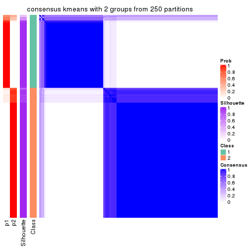</p>

</div>
<div id='tab-SD-kmeans-consensus-heatmap-2'>
<pre><code class="r">consensus_heatmap(res, k = 3)
</code></pre>

<p>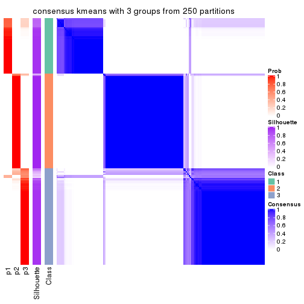</p>

</div>
<div id='tab-SD-kmeans-consensus-heatmap-3'>
<pre><code class="r">consensus_heatmap(res, k = 4)
</code></pre>

<p>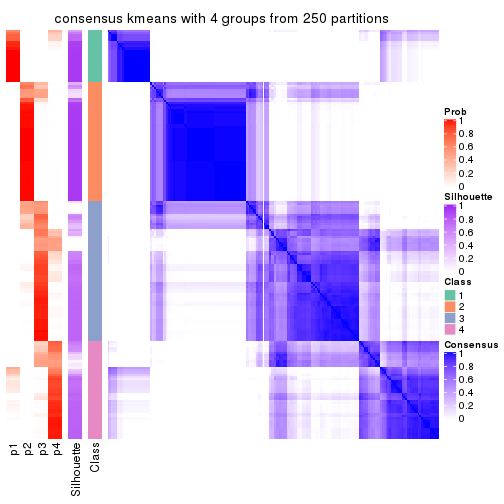</p>

</div>
<div id='tab-SD-kmeans-consensus-heatmap-4'>
<pre><code class="r">consensus_heatmap(res, k = 5)
</code></pre>

<p>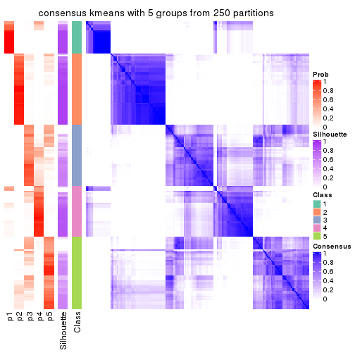</p>

</div>
<div id='tab-SD-kmeans-consensus-heatmap-5'>
<pre><code class="r">consensus_heatmap(res, k = 6)
</code></pre>

<p>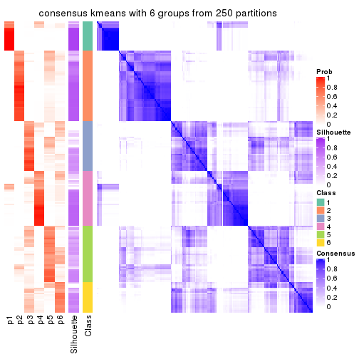</p>

</div>
</div>

Heatmaps for the membership of samples in all partitions to see how consistent they are:


<script>
$( function() {
	$( '#tabs-SD-kmeans-membership-heatmap' ).tabs();
} );
</script>
<div id='tabs-SD-kmeans-membership-heatmap'>
<ul>
<li><a href='#tab-SD-kmeans-membership-heatmap-1'>k = 2</a></li>
<li><a href='#tab-SD-kmeans-membership-heatmap-2'>k = 3</a></li>
<li><a href='#tab-SD-kmeans-membership-heatmap-3'>k = 4</a></li>
<li><a href='#tab-SD-kmeans-membership-heatmap-4'>k = 5</a></li>
<li><a href='#tab-SD-kmeans-membership-heatmap-5'>k = 6</a></li>
</ul>
<div id='tab-SD-kmeans-membership-heatmap-1'>
<pre><code class="r">membership_heatmap(res, k = 2)
</code></pre>

<p>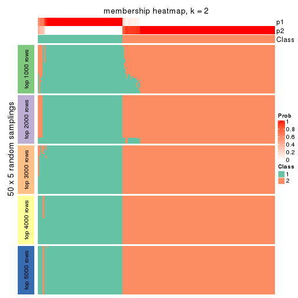</p>

</div>
<div id='tab-SD-kmeans-membership-heatmap-2'>
<pre><code class="r">membership_heatmap(res, k = 3)
</code></pre>

<p>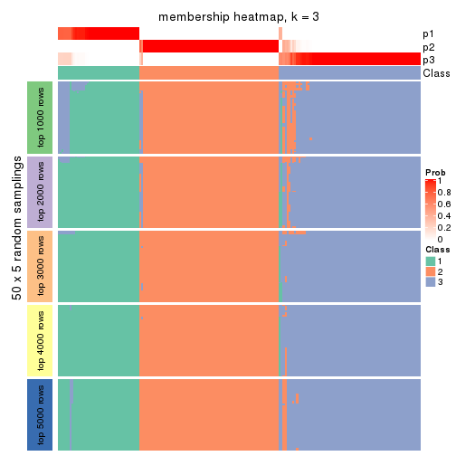</p>

</div>
<div id='tab-SD-kmeans-membership-heatmap-3'>
<pre><code class="r">membership_heatmap(res, k = 4)
</code></pre>

<p>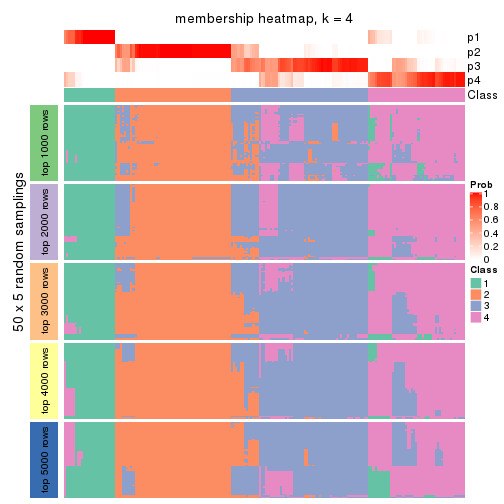</p>

</div>
<div id='tab-SD-kmeans-membership-heatmap-4'>
<pre><code class="r">membership_heatmap(res, k = 5)
</code></pre>

<p>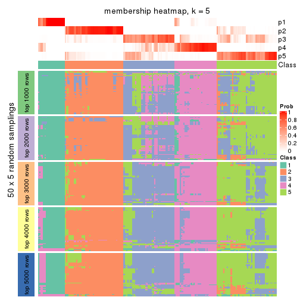</p>

</div>
<div id='tab-SD-kmeans-membership-heatmap-5'>
<pre><code class="r">membership_heatmap(res, k = 6)
</code></pre>

<p>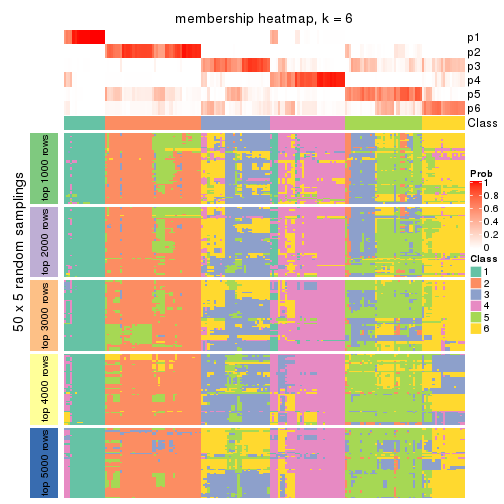</p>

</div>
</div>

As soon as we have had the classes for columns, we can look for signatures
which are significantly different between classes which can be candidate marks
for certain classes. Following are the heatmaps for signatures.


Signature heatmaps where rows are scaled:


<script>
$( function() {
	$( '#tabs-SD-kmeans-get-signatures' ).tabs();
} );
</script>
<div id='tabs-SD-kmeans-get-signatures'>
<ul>
<li><a href='#tab-SD-kmeans-get-signatures-1'>k = 2</a></li>
<li><a href='#tab-SD-kmeans-get-signatures-2'>k = 3</a></li>
<li><a href='#tab-SD-kmeans-get-signatures-3'>k = 4</a></li>
<li><a href='#tab-SD-kmeans-get-signatures-4'>k = 5</a></li>
<li><a href='#tab-SD-kmeans-get-signatures-5'>k = 6</a></li>
</ul>
<div id='tab-SD-kmeans-get-signatures-1'>
<pre><code class="r">get_signatures(res, k = 2)
</code></pre>

<p>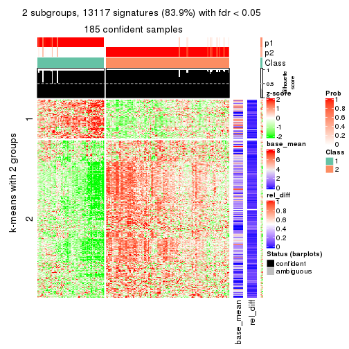</p>

</div>
<div id='tab-SD-kmeans-get-signatures-2'>
<pre><code class="r">get_signatures(res, k = 3)
</code></pre>

<p>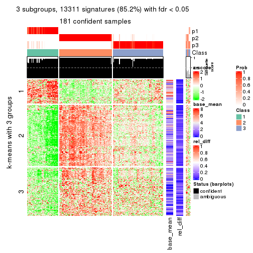</p>

</div>
<div id='tab-SD-kmeans-get-signatures-3'>
<pre><code class="r">get_signatures(res, k = 4)
</code></pre>

<p>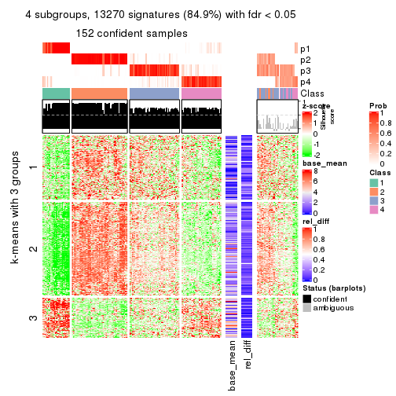</p>

</div>
<div id='tab-SD-kmeans-get-signatures-4'>
<pre><code class="r">get_signatures(res, k = 5)
</code></pre>

<p>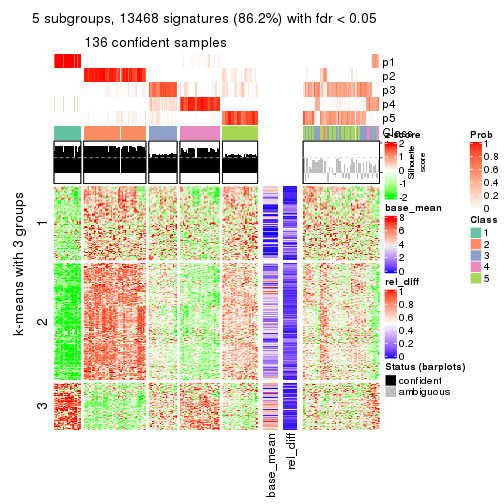</p>

</div>
<div id='tab-SD-kmeans-get-signatures-5'>
<pre><code class="r">get_signatures(res, k = 6)
</code></pre>

<p>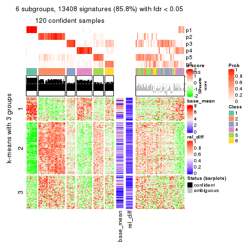</p>

</div>
</div>


Signature heatmaps where rows are not scaled:


<script>
$( function() {
	$( '#tabs-SD-kmeans-get-signatures-no-scale' ).tabs();
} );
</script>
<div id='tabs-SD-kmeans-get-signatures-no-scale'>
<ul>
<li><a href='#tab-SD-kmeans-get-signatures-no-scale-1'>k = 2</a></li>
<li><a href='#tab-SD-kmeans-get-signatures-no-scale-2'>k = 3</a></li>
<li><a href='#tab-SD-kmeans-get-signatures-no-scale-3'>k = 4</a></li>
<li><a href='#tab-SD-kmeans-get-signatures-no-scale-4'>k = 5</a></li>
<li><a href='#tab-SD-kmeans-get-signatures-no-scale-5'>k = 6</a></li>
</ul>
<div id='tab-SD-kmeans-get-signatures-no-scale-1'>
<pre><code class="r">get_signatures(res, k = 2, scale_rows = FALSE)
</code></pre>

<p>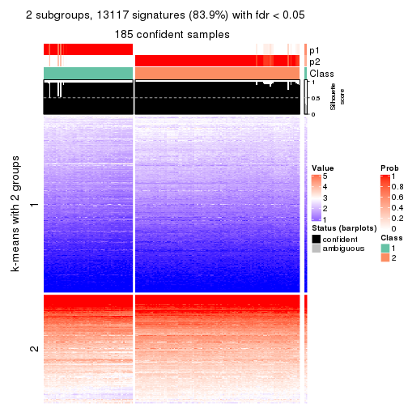</p>

</div>
<div id='tab-SD-kmeans-get-signatures-no-scale-2'>
<pre><code class="r">get_signatures(res, k = 3, scale_rows = FALSE)
</code></pre>

<p>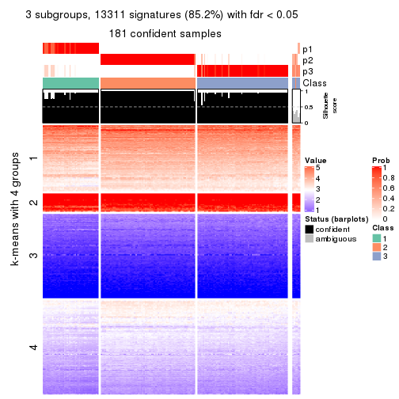</p>

</div>
<div id='tab-SD-kmeans-get-signatures-no-scale-3'>
<pre><code class="r">get_signatures(res, k = 4, scale_rows = FALSE)
</code></pre>

<p>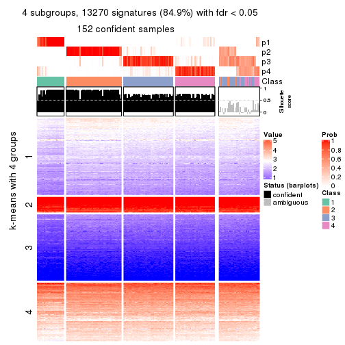</p>

</div>
<div id='tab-SD-kmeans-get-signatures-no-scale-4'>
<pre><code class="r">get_signatures(res, k = 5, scale_rows = FALSE)
</code></pre>

<p>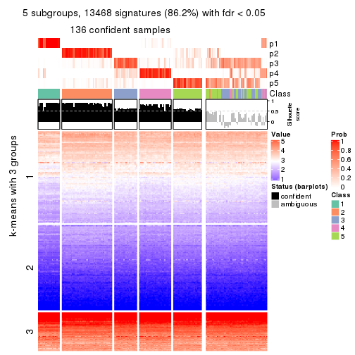</p>

</div>
<div id='tab-SD-kmeans-get-signatures-no-scale-5'>
<pre><code class="r">get_signatures(res, k = 6, scale_rows = FALSE)
</code></pre>

<p>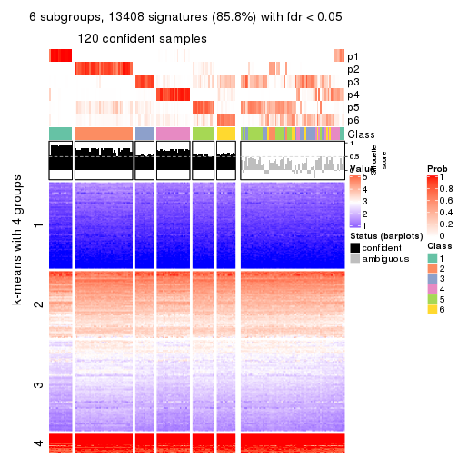</p>

</div>
</div>


Compare the overlap of signatures from different k:

```r
compare_signatures(res)
```

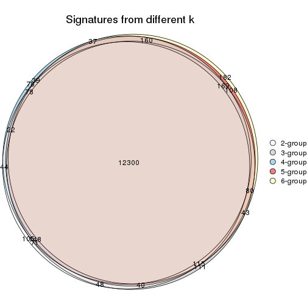

`get_signature()` returns a data frame invisibly. TO get the list of signatures, the function
call should be assigned to a variable explicitly. In following code, if `plot` argument is set
to `FALSE`, no heatmap is plotted while only the differential analysis is performed.

```r
# code only for demonstration
tb = get_signature(res, k = ..., plot = FALSE)
```

An example of the output of `tb` is:

```
#>   which_row         fdr    mean_1    mean_2 scaled_mean_1 scaled_mean_2 km
#> 1        38 0.042760348  8.373488  9.131774    -0.5533452     0.5164555  1
#> 2        40 0.018707592  7.106213  8.469186    -0.6173731     0.5762149  1
#> 3        55 0.019134737 10.221463 11.207825    -0.6159697     0.5749050  1
#> 4        59 0.006059896  5.921854  7.869574    -0.6899429     0.6439467  1
#> 5        60 0.018055526  8.928898 10.211722    -0.6204761     0.5791110  1
#> 6        98 0.009384629 15.714769 14.887706     0.6635654    -0.6193277  2
...
```

The columns in `tb` are:

1. `which_row`: row indices corresponding to the input matrix.
2. `fdr`: FDR for the differential test. 
3. `mean_x`: The mean value in group x.
4. `scaled_mean_x`: The mean value in group x after rows are scaled.
5. `km`: Row groups if k-means clustering is applied to rows.


UMAP plot which shows how samples are separated.


<script>
$( function() {
	$( '#tabs-SD-kmeans-dimension-reduction' ).tabs();
} );
</script>
<div id='tabs-SD-kmeans-dimension-reduction'>
<ul>
<li><a href='#tab-SD-kmeans-dimension-reduction-1'>k = 2</a></li>
<li><a href='#tab-SD-kmeans-dimension-reduction-2'>k = 3</a></li>
<li><a href='#tab-SD-kmeans-dimension-reduction-3'>k = 4</a></li>
<li><a href='#tab-SD-kmeans-dimension-reduction-4'>k = 5</a></li>
<li><a href='#tab-SD-kmeans-dimension-reduction-5'>k = 6</a></li>
</ul>
<div id='tab-SD-kmeans-dimension-reduction-1'>
<pre><code class="r">dimension_reduction(res, k = 2, method = &quot;UMAP&quot;)
</code></pre>

<p>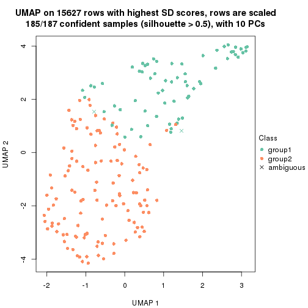</p>

</div>
<div id='tab-SD-kmeans-dimension-reduction-2'>
<pre><code class="r">dimension_reduction(res, k = 3, method = &quot;UMAP&quot;)
</code></pre>

<p>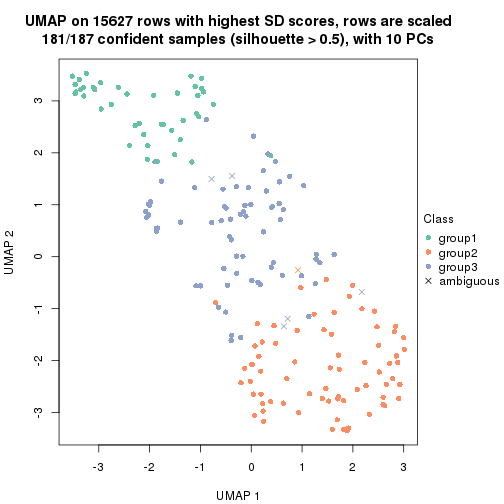</p>

</div>
<div id='tab-SD-kmeans-dimension-reduction-3'>
<pre><code class="r">dimension_reduction(res, k = 4, method = &quot;UMAP&quot;)
</code></pre>

<p>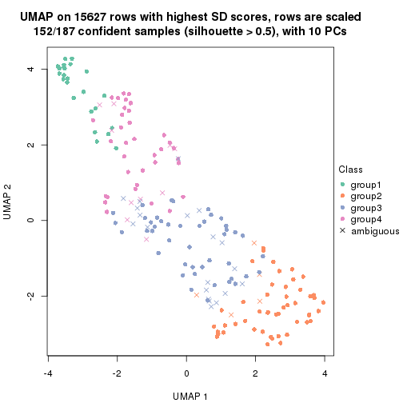</p>

</div>
<div id='tab-SD-kmeans-dimension-reduction-4'>
<pre><code class="r">dimension_reduction(res, k = 5, method = &quot;UMAP&quot;)
</code></pre>

<p>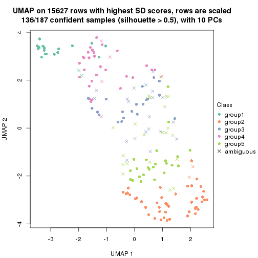</p>

</div>
<div id='tab-SD-kmeans-dimension-reduction-5'>
<pre><code class="r">dimension_reduction(res, k = 6, method = &quot;UMAP&quot;)
</code></pre>

<p>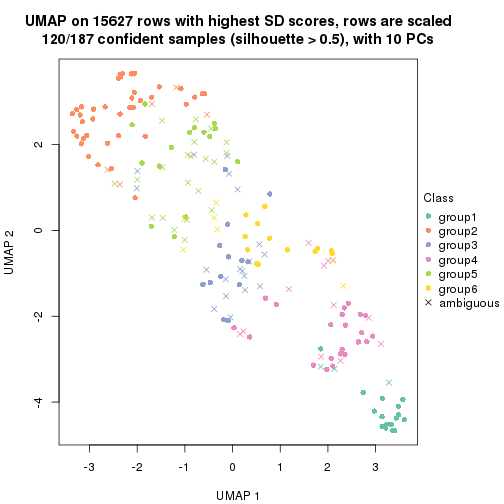</p>

</div>
</div>


Following heatmap shows how subgroups are split when increasing `k`:

```r
collect_classes(res)
```

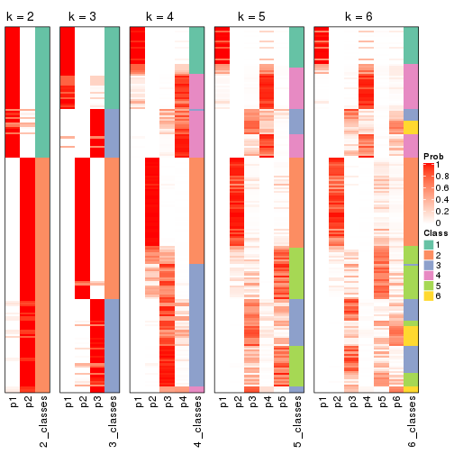


If matrix rows can be associated to genes, consider to use `GO_Enrichment(res,
...)` to perform function enrichment for the signature genes.


 

---------------------------------------------------


### SD:skmeans**


The object with results only for a single top-value method and a single partition method 
can be extracted as:

```r
res = res_list["SD", "skmeans"]
# you can also extract it by
# res = res_list["SD:skmeans"]
```

A summary of `res` and all the functions that can be applied to it:

```r
res
```

```
#> A 'ConsensusPartition' object with k = 2, 3, 4, 5, 6.
#>   On a matrix with 15627 rows and 187 columns.
#>   Top rows (1000, 2000, 3000, 4000, 5000) are extracted by 'SD' method.
#>   Subgroups are detected by 'skmeans' method.
#>   Performed in total 1250 partitions by row resampling.
#>   Best k for subgroups seems to be 2.
#> 
#> Following methods can be applied to this 'ConsensusPartition' object:
#>  [1] "cola_report"             "collect_classes"         "collect_plots"          
#>  [4] "collect_stats"           "colnames"                "compare_signatures"     
#>  [7] "consensus_heatmap"       "dimension_reduction"     "functional_enrichment"  
#> [10] "get_anno_col"            "get_anno"                "get_classes"            
#> [13] "get_consensus"           "get_matrix"              "get_membership"         
#> [16] "get_param"               "get_signatures"          "get_stats"              
#> [19] "is_best_k"               "is_stable_k"             "membership_heatmap"     
#> [22] "ncol"                    "nrow"                    "plot_ecdf"              
#> [25] "rownames"                "select_partition_number" "show"                   
#> [28] "suggest_best_k"          "test_to_known_factors"
```

`collect_plots()` function collects all the plots made from `res` for all `k` (number of partitions)
into one single page to provide an easy and fast comparison between different `k`.

```r
collect_plots(res)
```

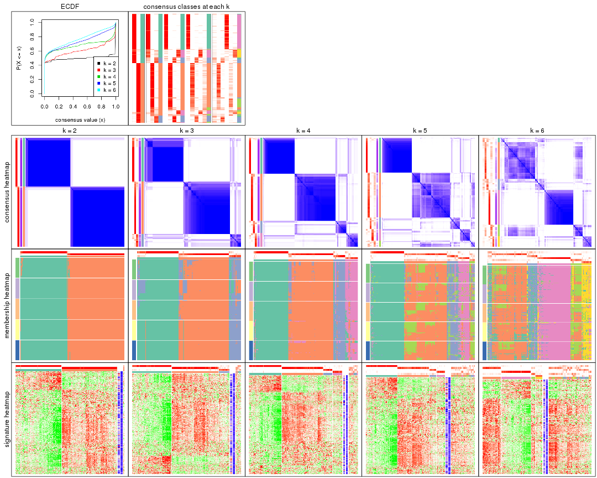

The plots are:

- The first row: a plot of the ECDF (Empirical cumulative distribution
  function) curves of the consensus matrix for each `k` and the heatmap of
  predicted classes for each `k`.
- The second row: heatmaps of the consensus matrix for each `k`.
- The third row: heatmaps of the membership matrix for each `k`.
- The fouth row: heatmaps of the signatures for each `k`.

All the plots in panels can be made by individual functions and they are
plotted later in this section.

`select_partition_number()` produces several plots showing different
statistics for choosing "optimized" `k`. There are following statistics:

- ECDF curves of the consensus matrix for each `k`;
- 1-PAC. [The PAC
  score](https://en.wikipedia.org/wiki/Consensus_clustering#Over-interpretation_potential_of_consensus_clustering)
  measures the proportion of the ambiguous subgrouping.
- Mean silhouette score.
- Concordance. The mean probability of fiting the consensus class ids in all
  partitions.
- Area increased. Denote $A_k$ as the area under the ECDF curve for current
  `k`, the area increased is defined as $A_k - A_{k-1}$.
- Rand index. The percent of pairs of samples that are both in a same cluster
  or both are not in a same cluster in the partition of k and k-1.
- Jaccard index. The ratio of pairs of samples are both in a same cluster in
  the partition of k and k-1 and the pairs of samples are both in a same
  cluster in the partition k or k-1.

The detailed explanations of these statistics can be found in [the cola
vignette](http://bioconductor.org/packages/devel/bioc/vignettes/cola/inst/doc/cola.html#toc_13).

Generally speaking, lower PAC score, higher mean silhouette score or higher
concordance corresponds to better partition. Rand index and Jaccard index
measure how similar the current partition is compared to partition with `k-1`.
If they are too similar, we won't accept `k` is better than `k-1`.

```r
select_partition_number(res)
```

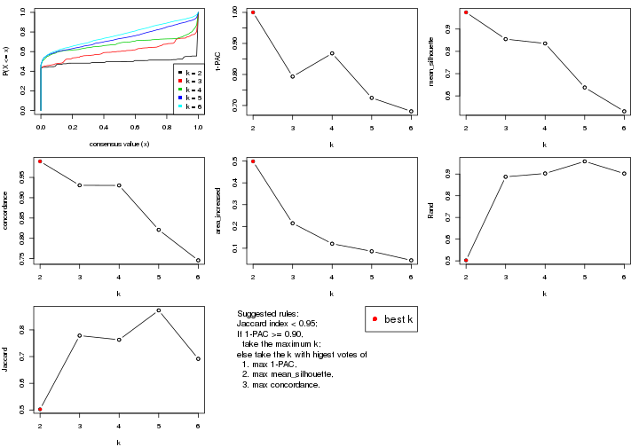

The numeric values for all these statistics can be obtained by `get_stats()`.

```r
get_stats(res)
```

```
#>   k 1-PAC mean_silhouette concordance area_increased  Rand Jaccard
#> 2 2 1.000           0.975       0.989         0.4984 0.503   0.503
#> 3 3 0.793           0.855       0.931         0.2147 0.887   0.778
#> 4 4 0.868           0.835       0.930         0.1208 0.903   0.763
#> 5 5 0.724           0.638       0.821         0.0860 0.958   0.873
#> 6 6 0.681           0.531       0.746         0.0447 0.902   0.692
```

`suggest_best_k()` suggests the best $k$ based on these statistics. The rules are as follows:

- All $k$ with Jaccard index larger than 0.95 are removed because the increase of
  the partition number does not provides enough extra information. If all $k$ are removed,
  the best $k$ is assigned by `NA`.
- For $k$ with 1-PAC larger than 0.9, the maximal $k$ is taken as the "best k". Other $k$ is called "optional k".
- If it does not fit the second rule. The $k$ with the highest vote of highest
  1-PAC, mean silhouette and concordance is taken as the "best k".

```r
suggest_best_k(res)
```

```
#> [1] 2
```


Following shows the table of the partitions (You need to click the **show/hide
code output** link to see it). The membership matrix (columns with name `p*`)
is inferred by
[`clue::cl_consensus()`](https://www.rdocumentation.org/link/cl_consensus?package=clue)
function with the `SE` method. Basically the value in the membership matrix
represents the probability to belong to a certain group. The finall class
label for an item is determined with the group with highest probability it
belongs to.

In `get_classes()` function, the entropy is calculated from the membership
matrix and the silhouette score is calculated from the consensus matrix.


<script>
$( function() {
	$( '#tabs-SD-skmeans-get-classes' ).tabs();
} );
</script>
<div id='tabs-SD-skmeans-get-classes'>
<ul>
<li><a href='#tab-SD-skmeans-get-classes-1'>k = 2</a></li>
<li><a href='#tab-SD-skmeans-get-classes-2'>k = 3</a></li>
<li><a href='#tab-SD-skmeans-get-classes-3'>k = 4</a></li>
<li><a href='#tab-SD-skmeans-get-classes-4'>k = 5</a></li>
<li><a href='#tab-SD-skmeans-get-classes-5'>k = 6</a></li>
</ul>

<div id='tab-SD-skmeans-get-classes-1'>
<p><a id='tab-SD-skmeans-get-classes-1-a' style='color:#0366d6' href='#'>show/hide code output</a></p>
<pre><code class="r">cbind(get_classes(res, k = 2), get_membership(res, k = 2))
</code></pre>

<pre><code>#&gt;            class entropy silhouette    p1    p2
#&gt; SRR1747213     1  0.0000      0.991 1.000 0.000
#&gt; SRR1747214     1  0.0000      0.991 1.000 0.000
#&gt; SRR1747215     2  0.0000      0.988 0.000 1.000
#&gt; SRR1747216     2  0.0000      0.988 0.000 1.000
#&gt; SRR1747217     1  0.4690      0.888 0.900 0.100
#&gt; SRR1747218     2  0.0000      0.988 0.000 1.000
#&gt; SRR1747219     1  0.0000      0.991 1.000 0.000
#&gt; SRR1747220     1  0.0000      0.991 1.000 0.000
#&gt; SRR1747221     1  0.0000      0.991 1.000 0.000
#&gt; SRR1747222     1  0.0000      0.991 1.000 0.000
#&gt; SRR1747223     1  0.0000      0.991 1.000 0.000
#&gt; SRR1747224     1  0.6438      0.806 0.836 0.164
#&gt; SRR1747225     2  0.0000      0.988 0.000 1.000
#&gt; SRR1747226     2  0.0000      0.988 0.000 1.000
#&gt; SRR1747227     2  0.0000      0.988 0.000 1.000
#&gt; SRR1747228     2  0.0000      0.988 0.000 1.000
#&gt; SRR1747229     2  0.0000      0.988 0.000 1.000
#&gt; SRR1747230     1  0.0000      0.991 1.000 0.000
#&gt; SRR1747231     1  0.0000      0.991 1.000 0.000
#&gt; SRR1747232     1  0.0000      0.991 1.000 0.000
#&gt; SRR1747233     1  0.0000      0.991 1.000 0.000
#&gt; SRR1747234     2  0.0000      0.988 0.000 1.000
#&gt; SRR1747235     1  0.0000      0.991 1.000 0.000
#&gt; SRR1747236     2  0.0000      0.988 0.000 1.000
#&gt; SRR1747237     2  0.0000      0.988 0.000 1.000
#&gt; SRR1747238     2  0.0000      0.988 0.000 1.000
#&gt; SRR1747239     2  0.0000      0.988 0.000 1.000
#&gt; SRR1747240     1  0.0000      0.991 1.000 0.000
#&gt; SRR1747241     2  0.0000      0.988 0.000 1.000
#&gt; SRR1747242     1  0.0000      0.991 1.000 0.000
#&gt; SRR1747243     1  0.0000      0.991 1.000 0.000
#&gt; SRR1747244     2  0.4562      0.890 0.096 0.904
#&gt; SRR1747245     2  0.0000      0.988 0.000 1.000
#&gt; SRR1747246     2  0.0000      0.988 0.000 1.000
#&gt; SRR1747247     1  0.0000      0.991 1.000 0.000
#&gt; SRR1747248     1  0.0000      0.991 1.000 0.000
#&gt; SRR1747249     1  0.0000      0.991 1.000 0.000
#&gt; SRR1747250     2  0.0000      0.988 0.000 1.000
#&gt; SRR1747252     1  0.0000      0.991 1.000 0.000
#&gt; SRR1747253     1  0.0000      0.991 1.000 0.000
#&gt; SRR1747254     2  0.0000      0.988 0.000 1.000
#&gt; SRR1747255     1  0.0000      0.991 1.000 0.000
#&gt; SRR1747256     1  0.0000      0.991 1.000 0.000
#&gt; SRR1747257     2  0.0000      0.988 0.000 1.000
#&gt; SRR1747258     2  0.0000      0.988 0.000 1.000
#&gt; SRR1747259     2  0.0000      0.988 0.000 1.000
#&gt; SRR1747260     2  0.4161      0.902 0.084 0.916
#&gt; SRR1747261     2  0.0000      0.988 0.000 1.000
#&gt; SRR1747262     2  0.0000      0.988 0.000 1.000
#&gt; SRR1747263     2  0.0000      0.988 0.000 1.000
#&gt; SRR1747264     1  0.0000      0.991 1.000 0.000
#&gt; SRR1747265     1  0.0000      0.991 1.000 0.000
#&gt; SRR1747266     2  0.0000      0.988 0.000 1.000
#&gt; SRR1747267     1  0.0000      0.991 1.000 0.000
#&gt; SRR1747268     1  0.0000      0.991 1.000 0.000
#&gt; SRR1747269     2  0.0000      0.988 0.000 1.000
#&gt; SRR1747270     2  0.0000      0.988 0.000 1.000
#&gt; SRR1747271     2  0.0000      0.988 0.000 1.000
#&gt; SRR1747272     1  0.0000      0.991 1.000 0.000
#&gt; SRR1747273     1  0.0000      0.991 1.000 0.000
#&gt; SRR1747274     2  0.0000      0.988 0.000 1.000
#&gt; SRR1747275     1  0.0000      0.991 1.000 0.000
#&gt; SRR1747276     1  0.0000      0.991 1.000 0.000
#&gt; SRR1747277     2  0.0000      0.988 0.000 1.000
#&gt; SRR1747278     2  0.9754      0.317 0.408 0.592
#&gt; SRR1747280     1  0.0000      0.991 1.000 0.000
#&gt; SRR1747279     1  0.0000      0.991 1.000 0.000
#&gt; SRR1747281     2  0.0000      0.988 0.000 1.000
#&gt; SRR1747282     1  0.0000      0.991 1.000 0.000
#&gt; SRR1747283     1  0.0000      0.991 1.000 0.000
#&gt; SRR1747284     1  0.0000      0.991 1.000 0.000
#&gt; SRR1747285     2  0.0000      0.988 0.000 1.000
#&gt; SRR1747286     2  0.0000      0.988 0.000 1.000
#&gt; SRR1747287     2  0.0000      0.988 0.000 1.000
#&gt; SRR1747288     1  0.0000      0.991 1.000 0.000
#&gt; SRR1747290     2  0.0000      0.988 0.000 1.000
#&gt; SRR1747289     2  0.0000      0.988 0.000 1.000
#&gt; SRR1747291     2  0.0000      0.988 0.000 1.000
#&gt; SRR1747293     2  0.0000      0.988 0.000 1.000
#&gt; SRR1747294     2  0.0000      0.988 0.000 1.000
#&gt; SRR1747292     1  0.0000      0.991 1.000 0.000
#&gt; SRR1747295     2  0.0000      0.988 0.000 1.000
#&gt; SRR1747296     2  0.0000      0.988 0.000 1.000
#&gt; SRR1747297     2  0.0000      0.988 0.000 1.000
#&gt; SRR1747298     2  0.0000      0.988 0.000 1.000
#&gt; SRR1747299     2  0.0000      0.988 0.000 1.000
#&gt; SRR1747300     2  0.0000      0.988 0.000 1.000
#&gt; SRR1747301     2  0.0000      0.988 0.000 1.000
#&gt; SRR1747302     2  0.0000      0.988 0.000 1.000
#&gt; SRR1747303     2  0.0000      0.988 0.000 1.000
#&gt; SRR1747304     1  0.0000      0.991 1.000 0.000
#&gt; SRR1747305     2  0.0000      0.988 0.000 1.000
#&gt; SRR1747306     2  0.0000      0.988 0.000 1.000
#&gt; SRR1747307     1  0.0000      0.991 1.000 0.000
#&gt; SRR1747308     2  0.0000      0.988 0.000 1.000
#&gt; SRR1747309     1  0.0000      0.991 1.000 0.000
#&gt; SRR1747310     1  0.0000      0.991 1.000 0.000
#&gt; SRR1747311     1  0.0000      0.991 1.000 0.000
#&gt; SRR1747313     1  0.0000      0.991 1.000 0.000
#&gt; SRR1747312     1  0.0000      0.991 1.000 0.000
#&gt; SRR1747314     1  0.0000      0.991 1.000 0.000
#&gt; SRR1747315     2  0.0000      0.988 0.000 1.000
#&gt; SRR1747316     2  0.0000      0.988 0.000 1.000
#&gt; SRR1747318     1  0.0000      0.991 1.000 0.000
#&gt; SRR1747317     1  0.5737      0.843 0.864 0.136
#&gt; SRR1747319     1  0.0376      0.987 0.996 0.004
#&gt; SRR1747320     1  0.0000      0.991 1.000 0.000
#&gt; SRR1747322     1  0.0000      0.991 1.000 0.000
#&gt; SRR1747321     1  0.0000      0.991 1.000 0.000
#&gt; SRR1747323     2  0.0000      0.988 0.000 1.000
#&gt; SRR1747324     2  0.0000      0.988 0.000 1.000
#&gt; SRR1747326     2  0.0000      0.988 0.000 1.000
#&gt; SRR1747325     2  0.0000      0.988 0.000 1.000
#&gt; SRR1747327     2  0.0000      0.988 0.000 1.000
#&gt; SRR1747328     1  0.9000      0.532 0.684 0.316
#&gt; SRR1747330     1  0.0000      0.991 1.000 0.000
#&gt; SRR1747329     2  0.0000      0.988 0.000 1.000
#&gt; SRR1747332     1  0.0000      0.991 1.000 0.000
#&gt; SRR1747331     2  0.0000      0.988 0.000 1.000
#&gt; SRR1747333     2  0.0000      0.988 0.000 1.000
#&gt; SRR1747334     2  0.0000      0.988 0.000 1.000
#&gt; SRR1747335     1  0.0000      0.991 1.000 0.000
#&gt; SRR1747336     1  0.0000      0.991 1.000 0.000
#&gt; SRR1747337     2  0.0000      0.988 0.000 1.000
#&gt; SRR1747338     2  0.0000      0.988 0.000 1.000
#&gt; SRR1747339     1  0.0000      0.991 1.000 0.000
#&gt; SRR1747340     2  0.0000      0.988 0.000 1.000
#&gt; SRR1747341     2  0.0000      0.988 0.000 1.000
#&gt; SRR1747342     2  0.0000      0.988 0.000 1.000
#&gt; SRR1747343     2  0.0000      0.988 0.000 1.000
#&gt; SRR1747344     2  0.0000      0.988 0.000 1.000
#&gt; SRR1747345     1  0.0000      0.991 1.000 0.000
#&gt; SRR1747346     1  0.0000      0.991 1.000 0.000
#&gt; SRR1747347     2  0.0000      0.988 0.000 1.000
#&gt; SRR1747348     1  0.0000      0.991 1.000 0.000
#&gt; SRR1747349     1  0.0000      0.991 1.000 0.000
#&gt; SRR1747351     2  0.0000      0.988 0.000 1.000
#&gt; SRR1747350     2  0.0000      0.988 0.000 1.000
#&gt; SRR1747352     1  0.0000      0.991 1.000 0.000
#&gt; SRR1747353     2  0.0000      0.988 0.000 1.000
#&gt; SRR1747354     2  0.0000      0.988 0.000 1.000
#&gt; SRR1747355     1  0.0000      0.991 1.000 0.000
#&gt; SRR1747356     2  0.0672      0.981 0.008 0.992
#&gt; SRR1747357     2  0.4562      0.890 0.096 0.904
#&gt; SRR1747358     2  0.4562      0.890 0.096 0.904
#&gt; SRR1747359     1  0.0000      0.991 1.000 0.000
#&gt; SRR1747360     2  0.0000      0.988 0.000 1.000
#&gt; SRR1747361     1  0.0000      0.991 1.000 0.000
#&gt; SRR1747362     2  0.0000      0.988 0.000 1.000
#&gt; SRR1747363     1  0.0000      0.991 1.000 0.000
#&gt; SRR1747364     1  0.0000      0.991 1.000 0.000
#&gt; SRR1747365     1  0.2603      0.948 0.956 0.044
#&gt; SRR1747366     2  0.0000      0.988 0.000 1.000
#&gt; SRR1747367     1  0.0000      0.991 1.000 0.000
#&gt; SRR1747369     2  0.0000      0.988 0.000 1.000
#&gt; SRR1747368     1  0.0000      0.991 1.000 0.000
#&gt; SRR1747370     2  0.0000      0.988 0.000 1.000
#&gt; SRR1747372     1  0.0000      0.991 1.000 0.000
#&gt; SRR1747371     1  0.0000      0.991 1.000 0.000
#&gt; SRR1747373     2  0.0000      0.988 0.000 1.000
#&gt; SRR1747374     2  0.0000      0.988 0.000 1.000
#&gt; SRR1747375     1  0.0000      0.991 1.000 0.000
#&gt; SRR1747376     2  0.0000      0.988 0.000 1.000
#&gt; SRR1747377     2  0.0000      0.988 0.000 1.000
#&gt; SRR1747378     2  0.0000      0.988 0.000 1.000
#&gt; SRR1747379     2  0.0000      0.988 0.000 1.000
#&gt; SRR1747380     1  0.0000      0.991 1.000 0.000
#&gt; SRR1747381     1  0.0000      0.991 1.000 0.000
#&gt; SRR1747382     1  0.0000      0.991 1.000 0.000
#&gt; SRR1747383     2  0.0000      0.988 0.000 1.000
#&gt; SRR1747384     1  0.0000      0.991 1.000 0.000
#&gt; SRR1747385     2  0.0000      0.988 0.000 1.000
#&gt; SRR1747386     1  0.0000      0.991 1.000 0.000
#&gt; SRR1747387     2  0.0000      0.988 0.000 1.000
#&gt; SRR1747388     2  0.0000      0.988 0.000 1.000
#&gt; SRR1747390     2  0.0000      0.988 0.000 1.000
#&gt; SRR1747389     2  0.0000      0.988 0.000 1.000
#&gt; SRR1747391     2  0.0000      0.988 0.000 1.000
#&gt; SRR1747392     2  0.0000      0.988 0.000 1.000
#&gt; SRR1747393     2  0.0000      0.988 0.000 1.000
#&gt; SRR1747394     1  0.0000      0.991 1.000 0.000
#&gt; SRR1747395     2  0.9775      0.293 0.412 0.588
#&gt; SRR1747396     2  0.0000      0.988 0.000 1.000
#&gt; SRR1747398     2  0.0000      0.988 0.000 1.000
#&gt; SRR1747397     1  0.0000      0.991 1.000 0.000
#&gt; SRR1747399     1  0.0000      0.991 1.000 0.000
#&gt; SRR1747400     1  0.0000      0.991 1.000 0.000
</code></pre>

<script>
$('#tab-SD-skmeans-get-classes-1-a').parent().next().next().hide();
$('#tab-SD-skmeans-get-classes-1-a').click(function(){
  $('#tab-SD-skmeans-get-classes-1-a').parent().next().next().toggle();
  return(false);
});
</script>
</div>

<div id='tab-SD-skmeans-get-classes-2'>
<p><a id='tab-SD-skmeans-get-classes-2-a' style='color:#0366d6' href='#'>show/hide code output</a></p>
<pre><code class="r">cbind(get_classes(res, k = 3), get_membership(res, k = 3))
</code></pre>

<pre><code>#&gt;            class entropy silhouette    p1    p2    p3
#&gt; SRR1747213     1  0.0000     0.9442 1.000 0.000 0.000
#&gt; SRR1747214     1  0.0000     0.9442 1.000 0.000 0.000
#&gt; SRR1747215     2  0.0000     0.9368 0.000 1.000 0.000
#&gt; SRR1747216     2  0.0000     0.9368 0.000 1.000 0.000
#&gt; SRR1747217     1  0.5292     0.6367 0.764 0.008 0.228
#&gt; SRR1747218     2  0.1860     0.9040 0.000 0.948 0.052
#&gt; SRR1747219     3  0.3941     0.7551 0.156 0.000 0.844
#&gt; SRR1747220     1  0.0000     0.9442 1.000 0.000 0.000
#&gt; SRR1747221     1  0.0892     0.9293 0.980 0.000 0.020
#&gt; SRR1747222     1  0.0000     0.9442 1.000 0.000 0.000
#&gt; SRR1747223     1  0.3752     0.8220 0.856 0.000 0.144
#&gt; SRR1747224     1  0.7329     0.2708 0.544 0.032 0.424
#&gt; SRR1747225     2  0.0237     0.9348 0.000 0.996 0.004
#&gt; SRR1747226     2  0.0000     0.9368 0.000 1.000 0.000
#&gt; SRR1747227     2  0.0000     0.9368 0.000 1.000 0.000
#&gt; SRR1747228     2  0.0237     0.9348 0.000 0.996 0.004
#&gt; SRR1747229     2  0.0237     0.9353 0.000 0.996 0.004
#&gt; SRR1747230     1  0.0000     0.9442 1.000 0.000 0.000
#&gt; SRR1747231     1  0.0000     0.9442 1.000 0.000 0.000
#&gt; SRR1747232     1  0.0000     0.9442 1.000 0.000 0.000
#&gt; SRR1747233     1  0.0000     0.9442 1.000 0.000 0.000
#&gt; SRR1747234     3  0.3816     0.7816 0.000 0.148 0.852
#&gt; SRR1747235     1  0.0000     0.9442 1.000 0.000 0.000
#&gt; SRR1747236     2  0.1753     0.9064 0.000 0.952 0.048
#&gt; SRR1747237     2  0.0747     0.9294 0.000 0.984 0.016
#&gt; SRR1747238     2  0.5178     0.6516 0.000 0.744 0.256
#&gt; SRR1747239     2  0.0000     0.9368 0.000 1.000 0.000
#&gt; SRR1747240     1  0.0000     0.9442 1.000 0.000 0.000
#&gt; SRR1747241     3  0.5678     0.5861 0.000 0.316 0.684
#&gt; SRR1747242     1  0.0000     0.9442 1.000 0.000 0.000
#&gt; SRR1747243     1  0.3340     0.8451 0.880 0.000 0.120
#&gt; SRR1747244     2  0.6252     0.6889 0.084 0.772 0.144
#&gt; SRR1747245     2  0.0424     0.9324 0.000 0.992 0.008
#&gt; SRR1747246     2  0.0000     0.9368 0.000 1.000 0.000
#&gt; SRR1747247     1  0.0000     0.9442 1.000 0.000 0.000
#&gt; SRR1747248     1  0.0000     0.9442 1.000 0.000 0.000
#&gt; SRR1747249     1  0.0000     0.9442 1.000 0.000 0.000
#&gt; SRR1747250     3  0.3752     0.7836 0.000 0.144 0.856
#&gt; SRR1747252     1  0.0000     0.9442 1.000 0.000 0.000
#&gt; SRR1747253     1  0.0000     0.9442 1.000 0.000 0.000
#&gt; SRR1747254     2  0.0237     0.9353 0.000 0.996 0.004
#&gt; SRR1747255     1  0.0000     0.9442 1.000 0.000 0.000
#&gt; SRR1747256     1  0.0000     0.9442 1.000 0.000 0.000
#&gt; SRR1747257     2  0.0237     0.9353 0.000 0.996 0.004
#&gt; SRR1747258     2  0.6111     0.3375 0.000 0.604 0.396
#&gt; SRR1747259     2  0.1163     0.9220 0.000 0.972 0.028
#&gt; SRR1747260     3  0.3752     0.7836 0.000 0.144 0.856
#&gt; SRR1747261     2  0.0592     0.9302 0.000 0.988 0.012
#&gt; SRR1747262     2  0.0000     0.9368 0.000 1.000 0.000
#&gt; SRR1747263     2  0.0000     0.9368 0.000 1.000 0.000
#&gt; SRR1747264     1  0.0000     0.9442 1.000 0.000 0.000
#&gt; SRR1747265     3  0.3752     0.7595 0.144 0.000 0.856
#&gt; SRR1747266     2  0.6308     0.1689 0.000 0.508 0.492
#&gt; SRR1747267     3  0.6079     0.4589 0.388 0.000 0.612
#&gt; SRR1747268     1  0.3816     0.8185 0.852 0.000 0.148
#&gt; SRR1747269     2  0.2448     0.8839 0.000 0.924 0.076
#&gt; SRR1747270     2  0.2448     0.8839 0.000 0.924 0.076
#&gt; SRR1747271     2  0.0000     0.9368 0.000 1.000 0.000
#&gt; SRR1747272     1  0.0000     0.9442 1.000 0.000 0.000
#&gt; SRR1747273     1  0.0000     0.9442 1.000 0.000 0.000
#&gt; SRR1747274     2  0.0237     0.9353 0.000 0.996 0.004
#&gt; SRR1747275     1  0.0000     0.9442 1.000 0.000 0.000
#&gt; SRR1747276     1  0.0000     0.9442 1.000 0.000 0.000
#&gt; SRR1747277     2  0.0592     0.9315 0.000 0.988 0.012
#&gt; SRR1747278     2  0.8645     0.3151 0.268 0.584 0.148
#&gt; SRR1747280     1  0.0000     0.9442 1.000 0.000 0.000
#&gt; SRR1747279     1  0.0000     0.9442 1.000 0.000 0.000
#&gt; SRR1747281     2  0.0000     0.9368 0.000 1.000 0.000
#&gt; SRR1747282     1  0.0000     0.9442 1.000 0.000 0.000
#&gt; SRR1747283     3  0.5835     0.5610 0.340 0.000 0.660
#&gt; SRR1747284     1  0.0000     0.9442 1.000 0.000 0.000
#&gt; SRR1747285     3  0.6026     0.4729 0.000 0.376 0.624
#&gt; SRR1747286     3  0.3816     0.7816 0.000 0.148 0.852
#&gt; SRR1747287     2  0.0592     0.9316 0.000 0.988 0.012
#&gt; SRR1747288     1  0.4842     0.6682 0.776 0.000 0.224
#&gt; SRR1747290     2  0.1753     0.9064 0.000 0.952 0.048
#&gt; SRR1747289     2  0.1753     0.9064 0.000 0.952 0.048
#&gt; SRR1747291     2  0.0000     0.9368 0.000 1.000 0.000
#&gt; SRR1747293     2  0.4931     0.7091 0.000 0.768 0.232
#&gt; SRR1747294     2  0.0000     0.9368 0.000 1.000 0.000
#&gt; SRR1747292     1  0.0000     0.9442 1.000 0.000 0.000
#&gt; SRR1747295     3  0.5138     0.6702 0.000 0.252 0.748
#&gt; SRR1747296     3  0.3941     0.7758 0.000 0.156 0.844
#&gt; SRR1747297     2  0.0000     0.9368 0.000 1.000 0.000
#&gt; SRR1747298     2  0.0000     0.9368 0.000 1.000 0.000
#&gt; SRR1747299     2  0.0000     0.9368 0.000 1.000 0.000
#&gt; SRR1747300     2  0.0000     0.9368 0.000 1.000 0.000
#&gt; SRR1747301     2  0.0000     0.9368 0.000 1.000 0.000
#&gt; SRR1747302     2  0.0000     0.9368 0.000 1.000 0.000
#&gt; SRR1747303     2  0.0000     0.9368 0.000 1.000 0.000
#&gt; SRR1747304     1  0.0000     0.9442 1.000 0.000 0.000
#&gt; SRR1747305     2  0.0000     0.9368 0.000 1.000 0.000
#&gt; SRR1747306     2  0.0000     0.9368 0.000 1.000 0.000
#&gt; SRR1747307     1  0.0000     0.9442 1.000 0.000 0.000
#&gt; SRR1747308     2  0.1964     0.9003 0.000 0.944 0.056
#&gt; SRR1747309     1  0.0000     0.9442 1.000 0.000 0.000
#&gt; SRR1747310     1  0.0000     0.9442 1.000 0.000 0.000
#&gt; SRR1747311     1  0.3941     0.8111 0.844 0.000 0.156
#&gt; SRR1747313     1  0.3619     0.8301 0.864 0.000 0.136
#&gt; SRR1747312     1  0.0000     0.9442 1.000 0.000 0.000
#&gt; SRR1747314     1  0.0000     0.9442 1.000 0.000 0.000
#&gt; SRR1747315     2  0.0000     0.9368 0.000 1.000 0.000
#&gt; SRR1747316     2  0.0000     0.9368 0.000 1.000 0.000
#&gt; SRR1747318     1  0.5926     0.5118 0.644 0.000 0.356
#&gt; SRR1747317     1  0.8160     0.4391 0.608 0.104 0.288
#&gt; SRR1747319     3  0.6305     0.1714 0.484 0.000 0.516
#&gt; SRR1747320     1  0.0000     0.9442 1.000 0.000 0.000
#&gt; SRR1747322     1  0.0000     0.9442 1.000 0.000 0.000
#&gt; SRR1747321     1  0.0000     0.9442 1.000 0.000 0.000
#&gt; SRR1747323     2  0.0000     0.9368 0.000 1.000 0.000
#&gt; SRR1747324     2  0.0000     0.9368 0.000 1.000 0.000
#&gt; SRR1747326     2  0.0000     0.9368 0.000 1.000 0.000
#&gt; SRR1747325     2  0.0000     0.9368 0.000 1.000 0.000
#&gt; SRR1747327     2  0.0000     0.9368 0.000 1.000 0.000
#&gt; SRR1747328     1  0.6062     0.2089 0.616 0.384 0.000
#&gt; SRR1747330     1  0.3816     0.8185 0.852 0.000 0.148
#&gt; SRR1747329     2  0.3752     0.7965 0.000 0.856 0.144
#&gt; SRR1747332     1  0.0000     0.9442 1.000 0.000 0.000
#&gt; SRR1747331     2  0.1163     0.9214 0.000 0.972 0.028
#&gt; SRR1747333     2  0.3752     0.7965 0.000 0.856 0.144
#&gt; SRR1747334     2  0.0000     0.9368 0.000 1.000 0.000
#&gt; SRR1747335     1  0.0000     0.9442 1.000 0.000 0.000
#&gt; SRR1747336     1  0.0000     0.9442 1.000 0.000 0.000
#&gt; SRR1747337     2  0.0000     0.9368 0.000 1.000 0.000
#&gt; SRR1747338     2  0.0000     0.9368 0.000 1.000 0.000
#&gt; SRR1747339     1  0.3816     0.8185 0.852 0.000 0.148
#&gt; SRR1747340     2  0.3816     0.7920 0.000 0.852 0.148
#&gt; SRR1747341     2  0.0000     0.9368 0.000 1.000 0.000
#&gt; SRR1747342     2  0.0000     0.9368 0.000 1.000 0.000
#&gt; SRR1747343     2  0.0000     0.9368 0.000 1.000 0.000
#&gt; SRR1747344     2  0.0000     0.9368 0.000 1.000 0.000
#&gt; SRR1747345     1  0.3941     0.8111 0.844 0.000 0.156
#&gt; SRR1747346     3  0.5098     0.5989 0.248 0.000 0.752
#&gt; SRR1747347     2  0.0000     0.9368 0.000 1.000 0.000
#&gt; SRR1747348     1  0.0000     0.9442 1.000 0.000 0.000
#&gt; SRR1747349     1  0.0000     0.9442 1.000 0.000 0.000
#&gt; SRR1747351     2  0.0000     0.9368 0.000 1.000 0.000
#&gt; SRR1747350     2  0.2537     0.8804 0.000 0.920 0.080
#&gt; SRR1747352     1  0.0000     0.9442 1.000 0.000 0.000
#&gt; SRR1747353     2  0.2448     0.8803 0.000 0.924 0.076
#&gt; SRR1747354     3  0.3686     0.7848 0.000 0.140 0.860
#&gt; SRR1747355     1  0.0000     0.9442 1.000 0.000 0.000
#&gt; SRR1747356     3  0.0892     0.7726 0.000 0.020 0.980
#&gt; SRR1747357     3  0.0424     0.7631 0.008 0.000 0.992
#&gt; SRR1747358     3  0.4737     0.7992 0.064 0.084 0.852
#&gt; SRR1747359     1  0.0000     0.9442 1.000 0.000 0.000
#&gt; SRR1747360     2  0.0424     0.9336 0.000 0.992 0.008
#&gt; SRR1747361     1  0.0000     0.9442 1.000 0.000 0.000
#&gt; SRR1747362     2  0.0000     0.9368 0.000 1.000 0.000
#&gt; SRR1747363     1  0.0000     0.9442 1.000 0.000 0.000
#&gt; SRR1747364     1  0.0000     0.9442 1.000 0.000 0.000
#&gt; SRR1747365     3  0.4002     0.7532 0.160 0.000 0.840
#&gt; SRR1747366     2  0.5138     0.6594 0.000 0.748 0.252
#&gt; SRR1747367     1  0.0000     0.9442 1.000 0.000 0.000
#&gt; SRR1747369     2  0.0000     0.9368 0.000 1.000 0.000
#&gt; SRR1747368     3  0.4504     0.7266 0.196 0.000 0.804
#&gt; SRR1747370     3  0.4504     0.6855 0.000 0.196 0.804
#&gt; SRR1747372     1  0.0000     0.9442 1.000 0.000 0.000
#&gt; SRR1747371     1  0.0000     0.9442 1.000 0.000 0.000
#&gt; SRR1747373     2  0.0000     0.9368 0.000 1.000 0.000
#&gt; SRR1747374     2  0.0000     0.9368 0.000 1.000 0.000
#&gt; SRR1747375     1  0.3686     0.8261 0.860 0.000 0.140
#&gt; SRR1747376     2  0.0000     0.9368 0.000 1.000 0.000
#&gt; SRR1747377     2  0.0000     0.9368 0.000 1.000 0.000
#&gt; SRR1747378     2  0.0000     0.9368 0.000 1.000 0.000
#&gt; SRR1747379     2  0.0237     0.9348 0.000 0.996 0.004
#&gt; SRR1747380     3  0.5098     0.5989 0.248 0.000 0.752
#&gt; SRR1747381     1  0.0000     0.9442 1.000 0.000 0.000
#&gt; SRR1747382     1  0.0000     0.9442 1.000 0.000 0.000
#&gt; SRR1747383     2  0.0000     0.9368 0.000 1.000 0.000
#&gt; SRR1747384     1  0.0000     0.9442 1.000 0.000 0.000
#&gt; SRR1747385     2  0.3752     0.7965 0.000 0.856 0.144
#&gt; SRR1747386     1  0.0000     0.9442 1.000 0.000 0.000
#&gt; SRR1747387     2  0.0000     0.9368 0.000 1.000 0.000
#&gt; SRR1747388     2  0.0747     0.9294 0.000 0.984 0.016
#&gt; SRR1747390     2  0.5706     0.5287 0.000 0.680 0.320
#&gt; SRR1747389     2  0.5216     0.6458 0.000 0.740 0.260
#&gt; SRR1747391     2  0.0000     0.9368 0.000 1.000 0.000
#&gt; SRR1747392     2  0.0000     0.9368 0.000 1.000 0.000
#&gt; SRR1747393     2  0.4504     0.7450 0.000 0.804 0.196
#&gt; SRR1747394     1  0.0000     0.9442 1.000 0.000 0.000
#&gt; SRR1747395     2  0.9177    -0.0516 0.400 0.452 0.148
#&gt; SRR1747396     2  0.0000     0.9368 0.000 1.000 0.000
#&gt; SRR1747398     2  0.0237     0.9353 0.000 0.996 0.004
#&gt; SRR1747397     1  0.3816     0.8185 0.852 0.000 0.148
#&gt; SRR1747399     1  0.0000     0.9442 1.000 0.000 0.000
#&gt; SRR1747400     1  0.0000     0.9442 1.000 0.000 0.000
</code></pre>

<script>
$('#tab-SD-skmeans-get-classes-2-a').parent().next().next().hide();
$('#tab-SD-skmeans-get-classes-2-a').click(function(){
  $('#tab-SD-skmeans-get-classes-2-a').parent().next().next().toggle();
  return(false);
});
</script>
</div>

<div id='tab-SD-skmeans-get-classes-3'>
<p><a id='tab-SD-skmeans-get-classes-3-a' style='color:#0366d6' href='#'>show/hide code output</a></p>
<pre><code class="r">cbind(get_classes(res, k = 4), get_membership(res, k = 4))
</code></pre>

<pre><code>#&gt;            class entropy silhouette    p1    p2    p3    p4
#&gt; SRR1747213     1  0.0000     0.9733 1.000 0.000 0.000 0.000
#&gt; SRR1747214     1  0.0000     0.9733 1.000 0.000 0.000 0.000
#&gt; SRR1747215     2  0.0000     0.9455 0.000 1.000 0.000 0.000
#&gt; SRR1747216     2  0.0000     0.9455 0.000 1.000 0.000 0.000
#&gt; SRR1747217     1  0.6176     0.2223 0.572 0.000 0.368 0.060
#&gt; SRR1747218     2  0.2742     0.8893 0.000 0.900 0.076 0.024
#&gt; SRR1747219     3  0.0336     0.7736 0.008 0.000 0.992 0.000
#&gt; SRR1747220     1  0.0000     0.9733 1.000 0.000 0.000 0.000
#&gt; SRR1747221     1  0.4406     0.5306 0.700 0.000 0.000 0.300
#&gt; SRR1747222     1  0.0000     0.9733 1.000 0.000 0.000 0.000
#&gt; SRR1747223     4  0.3569     0.6387 0.196 0.000 0.000 0.804
#&gt; SRR1747224     4  0.1256     0.7329 0.028 0.000 0.008 0.964
#&gt; SRR1747225     2  0.1867     0.9129 0.000 0.928 0.000 0.072
#&gt; SRR1747226     2  0.0707     0.9407 0.000 0.980 0.000 0.020
#&gt; SRR1747227     2  0.0000     0.9455 0.000 1.000 0.000 0.000
#&gt; SRR1747228     2  0.2281     0.8690 0.000 0.904 0.000 0.096
#&gt; SRR1747229     2  0.0000     0.9455 0.000 1.000 0.000 0.000
#&gt; SRR1747230     1  0.0000     0.9733 1.000 0.000 0.000 0.000
#&gt; SRR1747231     1  0.0000     0.9733 1.000 0.000 0.000 0.000
#&gt; SRR1747232     1  0.0000     0.9733 1.000 0.000 0.000 0.000
#&gt; SRR1747233     1  0.0000     0.9733 1.000 0.000 0.000 0.000
#&gt; SRR1747234     3  0.0336     0.7739 0.000 0.008 0.992 0.000
#&gt; SRR1747235     1  0.0000     0.9733 1.000 0.000 0.000 0.000
#&gt; SRR1747236     2  0.1929     0.9206 0.000 0.940 0.036 0.024
#&gt; SRR1747237     2  0.0188     0.9450 0.000 0.996 0.004 0.000
#&gt; SRR1747238     2  0.5696     0.1133 0.000 0.496 0.480 0.024
#&gt; SRR1747239     2  0.0000     0.9455 0.000 1.000 0.000 0.000
#&gt; SRR1747240     1  0.0000     0.9733 1.000 0.000 0.000 0.000
#&gt; SRR1747241     3  0.2647     0.6806 0.000 0.120 0.880 0.000
#&gt; SRR1747242     1  0.0000     0.9733 1.000 0.000 0.000 0.000
#&gt; SRR1747243     4  0.4522     0.5031 0.320 0.000 0.000 0.680
#&gt; SRR1747244     4  0.2281     0.6915 0.000 0.096 0.000 0.904
#&gt; SRR1747245     2  0.2011     0.8880 0.000 0.920 0.000 0.080
#&gt; SRR1747246     2  0.0000     0.9455 0.000 1.000 0.000 0.000
#&gt; SRR1747247     1  0.0000     0.9733 1.000 0.000 0.000 0.000
#&gt; SRR1747248     1  0.0000     0.9733 1.000 0.000 0.000 0.000
#&gt; SRR1747249     1  0.0000     0.9733 1.000 0.000 0.000 0.000
#&gt; SRR1747250     3  0.0000     0.7743 0.000 0.000 1.000 0.000
#&gt; SRR1747252     1  0.0188     0.9698 0.996 0.000 0.004 0.000
#&gt; SRR1747253     1  0.0000     0.9733 1.000 0.000 0.000 0.000
#&gt; SRR1747254     2  0.0000     0.9455 0.000 1.000 0.000 0.000
#&gt; SRR1747255     1  0.0000     0.9733 1.000 0.000 0.000 0.000
#&gt; SRR1747256     1  0.0000     0.9733 1.000 0.000 0.000 0.000
#&gt; SRR1747257     2  0.0000     0.9455 0.000 1.000 0.000 0.000
#&gt; SRR1747258     2  0.5938     0.0935 0.000 0.488 0.476 0.036
#&gt; SRR1747259     2  0.1474     0.9197 0.000 0.948 0.052 0.000
#&gt; SRR1747260     3  0.0000     0.7743 0.000 0.000 1.000 0.000
#&gt; SRR1747261     2  0.1022     0.9322 0.000 0.968 0.032 0.000
#&gt; SRR1747262     2  0.0817     0.9391 0.000 0.976 0.000 0.024
#&gt; SRR1747263     2  0.0188     0.9445 0.000 0.996 0.000 0.004
#&gt; SRR1747264     1  0.0000     0.9733 1.000 0.000 0.000 0.000
#&gt; SRR1747265     3  0.0188     0.7737 0.000 0.000 0.996 0.004
#&gt; SRR1747266     4  0.7924    -0.0430 0.000 0.328 0.332 0.340
#&gt; SRR1747267     3  0.5163     0.0869 0.480 0.000 0.516 0.004
#&gt; SRR1747268     4  0.0817     0.7322 0.024 0.000 0.000 0.976
#&gt; SRR1747269     2  0.3143     0.8657 0.000 0.876 0.100 0.024
#&gt; SRR1747270     2  0.2149     0.8893 0.000 0.912 0.088 0.000
#&gt; SRR1747271     2  0.0000     0.9455 0.000 1.000 0.000 0.000
#&gt; SRR1747272     1  0.2345     0.8689 0.900 0.000 0.000 0.100
#&gt; SRR1747273     1  0.0000     0.9733 1.000 0.000 0.000 0.000
#&gt; SRR1747274     2  0.1118     0.9353 0.000 0.964 0.000 0.036
#&gt; SRR1747275     1  0.0000     0.9733 1.000 0.000 0.000 0.000
#&gt; SRR1747276     1  0.0000     0.9733 1.000 0.000 0.000 0.000
#&gt; SRR1747277     2  0.0817     0.9374 0.000 0.976 0.024 0.000
#&gt; SRR1747278     4  0.0895     0.7215 0.004 0.020 0.000 0.976
#&gt; SRR1747280     1  0.0000     0.9733 1.000 0.000 0.000 0.000
#&gt; SRR1747279     1  0.0000     0.9733 1.000 0.000 0.000 0.000
#&gt; SRR1747281     2  0.0336     0.9432 0.000 0.992 0.000 0.008
#&gt; SRR1747282     1  0.0000     0.9733 1.000 0.000 0.000 0.000
#&gt; SRR1747283     3  0.4103     0.5378 0.256 0.000 0.744 0.000
#&gt; SRR1747284     1  0.0000     0.9733 1.000 0.000 0.000 0.000
#&gt; SRR1747285     3  0.5051     0.5117 0.004 0.244 0.724 0.028
#&gt; SRR1747286     3  0.1042     0.7698 0.000 0.008 0.972 0.020
#&gt; SRR1747287     2  0.0188     0.9451 0.000 0.996 0.004 0.000
#&gt; SRR1747288     1  0.2704     0.8366 0.876 0.000 0.124 0.000
#&gt; SRR1747290     2  0.1929     0.9206 0.000 0.940 0.036 0.024
#&gt; SRR1747289     2  0.1929     0.9206 0.000 0.940 0.036 0.024
#&gt; SRR1747291     2  0.0188     0.9445 0.000 0.996 0.000 0.004
#&gt; SRR1747293     4  0.6602     0.1791 0.000 0.436 0.080 0.484
#&gt; SRR1747294     2  0.0188     0.9450 0.000 0.996 0.004 0.000
#&gt; SRR1747292     1  0.0000     0.9733 1.000 0.000 0.000 0.000
#&gt; SRR1747295     3  0.4983     0.4500 0.000 0.272 0.704 0.024
#&gt; SRR1747296     3  0.0817     0.7680 0.000 0.024 0.976 0.000
#&gt; SRR1747297     2  0.0188     0.9445 0.000 0.996 0.000 0.004
#&gt; SRR1747298     2  0.0188     0.9445 0.000 0.996 0.000 0.004
#&gt; SRR1747299     2  0.0188     0.9451 0.000 0.996 0.000 0.004
#&gt; SRR1747300     2  0.0817     0.9391 0.000 0.976 0.000 0.024
#&gt; SRR1747301     2  0.0000     0.9455 0.000 1.000 0.000 0.000
#&gt; SRR1747302     2  0.0000     0.9455 0.000 1.000 0.000 0.000
#&gt; SRR1747303     2  0.0336     0.9432 0.000 0.992 0.000 0.008
#&gt; SRR1747304     1  0.0000     0.9733 1.000 0.000 0.000 0.000
#&gt; SRR1747305     2  0.0000     0.9455 0.000 1.000 0.000 0.000
#&gt; SRR1747306     2  0.0000     0.9455 0.000 1.000 0.000 0.000
#&gt; SRR1747307     1  0.0000     0.9733 1.000 0.000 0.000 0.000
#&gt; SRR1747308     2  0.1637     0.9139 0.000 0.940 0.060 0.000
#&gt; SRR1747309     1  0.0592     0.9596 0.984 0.000 0.000 0.016
#&gt; SRR1747310     1  0.0000     0.9733 1.000 0.000 0.000 0.000
#&gt; SRR1747311     4  0.2999     0.6918 0.132 0.000 0.004 0.864
#&gt; SRR1747313     4  0.4331     0.5397 0.288 0.000 0.000 0.712
#&gt; SRR1747312     1  0.0000     0.9733 1.000 0.000 0.000 0.000
#&gt; SRR1747314     1  0.0000     0.9733 1.000 0.000 0.000 0.000
#&gt; SRR1747315     2  0.0469     0.9420 0.000 0.988 0.000 0.012
#&gt; SRR1747316     2  0.0804     0.9407 0.000 0.980 0.012 0.008
#&gt; SRR1747318     4  0.2124     0.7280 0.068 0.000 0.008 0.924
#&gt; SRR1747317     4  0.1305     0.7360 0.036 0.000 0.004 0.960
#&gt; SRR1747319     3  0.4804     0.3707 0.384 0.000 0.616 0.000
#&gt; SRR1747320     1  0.0000     0.9733 1.000 0.000 0.000 0.000
#&gt; SRR1747322     1  0.0000     0.9733 1.000 0.000 0.000 0.000
#&gt; SRR1747321     1  0.0000     0.9733 1.000 0.000 0.000 0.000
#&gt; SRR1747323     2  0.0000     0.9455 0.000 1.000 0.000 0.000
#&gt; SRR1747324     2  0.0817     0.9391 0.000 0.976 0.000 0.024
#&gt; SRR1747326     2  0.0336     0.9437 0.000 0.992 0.000 0.008
#&gt; SRR1747325     2  0.0000     0.9455 0.000 1.000 0.000 0.000
#&gt; SRR1747327     2  0.0000     0.9455 0.000 1.000 0.000 0.000
#&gt; SRR1747328     1  0.6731     0.3115 0.604 0.248 0.000 0.148
#&gt; SRR1747330     4  0.1211     0.7371 0.040 0.000 0.000 0.960
#&gt; SRR1747329     4  0.2345     0.6881 0.000 0.100 0.000 0.900
#&gt; SRR1747332     1  0.0000     0.9733 1.000 0.000 0.000 0.000
#&gt; SRR1747331     2  0.1510     0.9317 0.000 0.956 0.016 0.028
#&gt; SRR1747333     4  0.4855     0.3389 0.000 0.400 0.000 0.600
#&gt; SRR1747334     2  0.0921     0.9385 0.000 0.972 0.000 0.028
#&gt; SRR1747335     1  0.0707     0.9537 0.980 0.000 0.020 0.000
#&gt; SRR1747336     1  0.0000     0.9733 1.000 0.000 0.000 0.000
#&gt; SRR1747337     2  0.0000     0.9455 0.000 1.000 0.000 0.000
#&gt; SRR1747338     2  0.0188     0.9451 0.000 0.996 0.000 0.004
#&gt; SRR1747339     4  0.1398     0.7366 0.040 0.000 0.004 0.956
#&gt; SRR1747340     4  0.1389     0.7113 0.000 0.048 0.000 0.952
#&gt; SRR1747341     2  0.0000     0.9455 0.000 1.000 0.000 0.000
#&gt; SRR1747342     2  0.0000     0.9455 0.000 1.000 0.000 0.000
#&gt; SRR1747343     2  0.0000     0.9455 0.000 1.000 0.000 0.000
#&gt; SRR1747344     2  0.0000     0.9455 0.000 1.000 0.000 0.000
#&gt; SRR1747345     4  0.1807     0.7328 0.052 0.000 0.008 0.940
#&gt; SRR1747346     3  0.5288     0.0424 0.008 0.000 0.520 0.472
#&gt; SRR1747347     2  0.0000     0.9455 0.000 1.000 0.000 0.000
#&gt; SRR1747348     1  0.0000     0.9733 1.000 0.000 0.000 0.000
#&gt; SRR1747349     1  0.0000     0.9733 1.000 0.000 0.000 0.000
#&gt; SRR1747351     2  0.0000     0.9455 0.000 1.000 0.000 0.000
#&gt; SRR1747350     2  0.3266     0.8575 0.000 0.868 0.108 0.024
#&gt; SRR1747352     1  0.0000     0.9733 1.000 0.000 0.000 0.000
#&gt; SRR1747353     2  0.1716     0.9081 0.000 0.936 0.064 0.000
#&gt; SRR1747354     3  0.0336     0.7736 0.000 0.000 0.992 0.008
#&gt; SRR1747355     1  0.0000     0.9733 1.000 0.000 0.000 0.000
#&gt; SRR1747356     3  0.2611     0.7314 0.000 0.008 0.896 0.096
#&gt; SRR1747357     3  0.1118     0.7671 0.000 0.000 0.964 0.036
#&gt; SRR1747358     3  0.0000     0.7743 0.000 0.000 1.000 0.000
#&gt; SRR1747359     1  0.0000     0.9733 1.000 0.000 0.000 0.000
#&gt; SRR1747360     2  0.1356     0.9344 0.000 0.960 0.008 0.032
#&gt; SRR1747361     1  0.0000     0.9733 1.000 0.000 0.000 0.000
#&gt; SRR1747362     2  0.0707     0.9419 0.000 0.980 0.000 0.020
#&gt; SRR1747363     1  0.0000     0.9733 1.000 0.000 0.000 0.000
#&gt; SRR1747364     1  0.0000     0.9733 1.000 0.000 0.000 0.000
#&gt; SRR1747365     3  0.2469     0.7027 0.108 0.000 0.892 0.000
#&gt; SRR1747366     2  0.5496     0.4240 0.000 0.604 0.372 0.024
#&gt; SRR1747367     1  0.0469     0.9632 0.988 0.000 0.000 0.012
#&gt; SRR1747369     2  0.0469     0.9433 0.000 0.988 0.000 0.012
#&gt; SRR1747368     3  0.1888     0.7476 0.016 0.000 0.940 0.044
#&gt; SRR1747370     4  0.5767     0.3787 0.000 0.060 0.280 0.660
#&gt; SRR1747372     1  0.0000     0.9733 1.000 0.000 0.000 0.000
#&gt; SRR1747371     1  0.0000     0.9733 1.000 0.000 0.000 0.000
#&gt; SRR1747373     2  0.0000     0.9455 0.000 1.000 0.000 0.000
#&gt; SRR1747374     2  0.0000     0.9455 0.000 1.000 0.000 0.000
#&gt; SRR1747375     4  0.4992     0.1849 0.476 0.000 0.000 0.524
#&gt; SRR1747376     2  0.0817     0.9391 0.000 0.976 0.000 0.024
#&gt; SRR1747377     2  0.0000     0.9455 0.000 1.000 0.000 0.000
#&gt; SRR1747378     2  0.1302     0.9330 0.000 0.956 0.000 0.044
#&gt; SRR1747379     2  0.1211     0.9247 0.000 0.960 0.000 0.040
#&gt; SRR1747380     3  0.5288     0.0424 0.008 0.000 0.520 0.472
#&gt; SRR1747381     1  0.0000     0.9733 1.000 0.000 0.000 0.000
#&gt; SRR1747382     1  0.0000     0.9733 1.000 0.000 0.000 0.000
#&gt; SRR1747383     2  0.0000     0.9455 0.000 1.000 0.000 0.000
#&gt; SRR1747384     1  0.0000     0.9733 1.000 0.000 0.000 0.000
#&gt; SRR1747385     4  0.2281     0.6924 0.000 0.096 0.000 0.904
#&gt; SRR1747386     1  0.0000     0.9733 1.000 0.000 0.000 0.000
#&gt; SRR1747387     2  0.0000     0.9455 0.000 1.000 0.000 0.000
#&gt; SRR1747388     2  0.0817     0.9391 0.000 0.976 0.000 0.024
#&gt; SRR1747390     2  0.5294     0.1254 0.000 0.508 0.484 0.008
#&gt; SRR1747389     2  0.5183     0.3516 0.000 0.584 0.408 0.008
#&gt; SRR1747391     2  0.0469     0.9420 0.000 0.988 0.000 0.012
#&gt; SRR1747392     2  0.0707     0.9419 0.000 0.980 0.000 0.020
#&gt; SRR1747393     2  0.4635     0.7142 0.000 0.756 0.216 0.028
#&gt; SRR1747394     1  0.1305     0.9370 0.960 0.000 0.004 0.036
#&gt; SRR1747395     4  0.0921     0.7343 0.028 0.000 0.000 0.972
#&gt; SRR1747396     2  0.1022     0.9371 0.000 0.968 0.000 0.032
#&gt; SRR1747398     2  0.0817     0.9391 0.000 0.976 0.000 0.024
#&gt; SRR1747397     4  0.3052     0.6903 0.136 0.000 0.004 0.860
#&gt; SRR1747399     1  0.0000     0.9733 1.000 0.000 0.000 0.000
#&gt; SRR1747400     1  0.0000     0.9733 1.000 0.000 0.000 0.000
</code></pre>

<script>
$('#tab-SD-skmeans-get-classes-3-a').parent().next().next().hide();
$('#tab-SD-skmeans-get-classes-3-a').click(function(){
  $('#tab-SD-skmeans-get-classes-3-a').parent().next().next().toggle();
  return(false);
});
</script>
</div>

<div id='tab-SD-skmeans-get-classes-4'>
<p><a id='tab-SD-skmeans-get-classes-4-a' style='color:#0366d6' href='#'>show/hide code output</a></p>
<pre><code class="r">cbind(get_classes(res, k = 5), get_membership(res, k = 5))
</code></pre>

<pre><code>#&gt;            class entropy silhouette    p1    p2    p3    p4    p5
#&gt; SRR1747213     1  0.0566    0.95563 0.984 0.000 0.012 0.000 0.004
#&gt; SRR1747214     1  0.0000    0.96391 1.000 0.000 0.000 0.000 0.000
#&gt; SRR1747215     2  0.1851    0.68944 0.000 0.912 0.000 0.000 0.088
#&gt; SRR1747216     2  0.1732    0.70111 0.000 0.920 0.000 0.000 0.080
#&gt; SRR1747217     1  0.6403   -0.07156 0.468 0.020 0.436 0.060 0.016
#&gt; SRR1747218     2  0.6439   -0.01802 0.000 0.504 0.236 0.000 0.260
#&gt; SRR1747219     3  0.1970    0.64345 0.012 0.000 0.924 0.004 0.060
#&gt; SRR1747220     1  0.0290    0.95967 0.992 0.000 0.008 0.000 0.000
#&gt; SRR1747221     4  0.4562    0.08930 0.492 0.000 0.000 0.500 0.008
#&gt; SRR1747222     1  0.0000    0.96391 1.000 0.000 0.000 0.000 0.000
#&gt; SRR1747223     4  0.2563    0.69626 0.120 0.000 0.000 0.872 0.008
#&gt; SRR1747224     4  0.1928    0.72940 0.004 0.000 0.004 0.920 0.072
#&gt; SRR1747225     2  0.4744    0.38308 0.000 0.572 0.000 0.020 0.408
#&gt; SRR1747226     2  0.3274    0.55931 0.000 0.780 0.000 0.000 0.220
#&gt; SRR1747227     2  0.3143    0.61924 0.000 0.796 0.000 0.000 0.204
#&gt; SRR1747228     2  0.5470    0.36043 0.000 0.588 0.000 0.080 0.332
#&gt; SRR1747229     2  0.1768    0.70045 0.000 0.924 0.004 0.000 0.072
#&gt; SRR1747230     1  0.0000    0.96391 1.000 0.000 0.000 0.000 0.000
#&gt; SRR1747231     1  0.0404    0.95734 0.988 0.000 0.012 0.000 0.000
#&gt; SRR1747232     1  0.0000    0.96391 1.000 0.000 0.000 0.000 0.000
#&gt; SRR1747233     1  0.0000    0.96391 1.000 0.000 0.000 0.000 0.000
#&gt; SRR1747234     3  0.1638    0.64009 0.000 0.004 0.932 0.000 0.064
#&gt; SRR1747235     1  0.0510    0.95559 0.984 0.000 0.016 0.000 0.000
#&gt; SRR1747236     2  0.5289    0.29121 0.000 0.616 0.072 0.000 0.312
#&gt; SRR1747237     2  0.2685    0.68754 0.000 0.880 0.028 0.000 0.092
#&gt; SRR1747238     5  0.6807    0.33368 0.000 0.336 0.300 0.000 0.364
#&gt; SRR1747239     2  0.1197    0.69550 0.000 0.952 0.000 0.000 0.048
#&gt; SRR1747240     1  0.0000    0.96391 1.000 0.000 0.000 0.000 0.000
#&gt; SRR1747241     3  0.2653    0.53671 0.000 0.096 0.880 0.000 0.024
#&gt; SRR1747242     1  0.0000    0.96391 1.000 0.000 0.000 0.000 0.000
#&gt; SRR1747243     4  0.4435    0.46721 0.336 0.000 0.000 0.648 0.016
#&gt; SRR1747244     4  0.4959    0.53899 0.000 0.128 0.000 0.712 0.160
#&gt; SRR1747245     2  0.5104    0.42890 0.000 0.632 0.000 0.060 0.308
#&gt; SRR1747246     2  0.1478    0.69073 0.000 0.936 0.000 0.000 0.064
#&gt; SRR1747247     1  0.0000    0.96391 1.000 0.000 0.000 0.000 0.000
#&gt; SRR1747248     1  0.0000    0.96391 1.000 0.000 0.000 0.000 0.000
#&gt; SRR1747249     1  0.0162    0.96201 0.996 0.000 0.000 0.000 0.004
#&gt; SRR1747250     3  0.3534    0.62789 0.000 0.000 0.744 0.000 0.256
#&gt; SRR1747252     1  0.0671    0.95255 0.980 0.000 0.004 0.000 0.016
#&gt; SRR1747253     1  0.0290    0.95985 0.992 0.000 0.000 0.000 0.008
#&gt; SRR1747254     2  0.1768    0.68988 0.000 0.924 0.004 0.000 0.072
#&gt; SRR1747255     1  0.0000    0.96391 1.000 0.000 0.000 0.000 0.000
#&gt; SRR1747256     1  0.0000    0.96391 1.000 0.000 0.000 0.000 0.000
#&gt; SRR1747257     2  0.1952    0.69121 0.000 0.912 0.004 0.000 0.084
#&gt; SRR1747258     5  0.5575    0.26786 0.000 0.168 0.188 0.000 0.644
#&gt; SRR1747259     2  0.3297    0.65646 0.000 0.848 0.084 0.000 0.068
#&gt; SRR1747260     3  0.3274    0.63898 0.000 0.000 0.780 0.000 0.220
#&gt; SRR1747261     2  0.4548    0.61176 0.000 0.748 0.096 0.000 0.156
#&gt; SRR1747262     2  0.3837    0.52338 0.000 0.692 0.000 0.000 0.308
#&gt; SRR1747263     2  0.3774    0.53494 0.000 0.704 0.000 0.000 0.296
#&gt; SRR1747264     1  0.0000    0.96391 1.000 0.000 0.000 0.000 0.000
#&gt; SRR1747265     3  0.2561    0.64541 0.000 0.000 0.856 0.000 0.144
#&gt; SRR1747266     5  0.6280    0.17048 0.000 0.116 0.180 0.060 0.644
#&gt; SRR1747267     3  0.6810    0.40409 0.268 0.000 0.528 0.028 0.176
#&gt; SRR1747268     4  0.1282    0.73615 0.004 0.000 0.000 0.952 0.044
#&gt; SRR1747269     2  0.6009    0.11126 0.000 0.544 0.136 0.000 0.320
#&gt; SRR1747270     2  0.3176    0.65238 0.000 0.856 0.064 0.000 0.080
#&gt; SRR1747271     2  0.1557    0.69721 0.000 0.940 0.008 0.000 0.052
#&gt; SRR1747272     1  0.3812    0.69258 0.772 0.000 0.000 0.204 0.024
#&gt; SRR1747273     1  0.1671    0.90495 0.924 0.000 0.076 0.000 0.000
#&gt; SRR1747274     2  0.4893    0.25241 0.000 0.568 0.028 0.000 0.404
#&gt; SRR1747275     1  0.0000    0.96391 1.000 0.000 0.000 0.000 0.000
#&gt; SRR1747276     1  0.0000    0.96391 1.000 0.000 0.000 0.000 0.000
#&gt; SRR1747277     2  0.3835    0.58501 0.000 0.796 0.156 0.000 0.048
#&gt; SRR1747278     4  0.0963    0.73646 0.000 0.000 0.000 0.964 0.036
#&gt; SRR1747280     1  0.0000    0.96391 1.000 0.000 0.000 0.000 0.000
#&gt; SRR1747279     1  0.0000    0.96391 1.000 0.000 0.000 0.000 0.000
#&gt; SRR1747281     2  0.3884    0.54739 0.000 0.708 0.000 0.004 0.288
#&gt; SRR1747282     1  0.0000    0.96391 1.000 0.000 0.000 0.000 0.000
#&gt; SRR1747283     3  0.3160    0.51274 0.188 0.000 0.808 0.000 0.004
#&gt; SRR1747284     1  0.0000    0.96391 1.000 0.000 0.000 0.000 0.000
#&gt; SRR1747285     3  0.6680   -0.24937 0.000 0.252 0.428 0.000 0.320
#&gt; SRR1747286     3  0.3579    0.55058 0.000 0.004 0.756 0.000 0.240
#&gt; SRR1747287     2  0.2136    0.70241 0.000 0.904 0.008 0.000 0.088
#&gt; SRR1747288     1  0.5694    0.43415 0.636 0.000 0.136 0.004 0.224
#&gt; SRR1747290     2  0.5200    0.31517 0.000 0.628 0.068 0.000 0.304
#&gt; SRR1747289     2  0.5027    0.33929 0.000 0.640 0.056 0.000 0.304
#&gt; SRR1747291     2  0.3300    0.61066 0.000 0.792 0.000 0.004 0.204
#&gt; SRR1747293     5  0.6885   -0.01755 0.000 0.376 0.012 0.200 0.412
#&gt; SRR1747294     2  0.3180    0.67398 0.000 0.856 0.068 0.000 0.076
#&gt; SRR1747292     1  0.0000    0.96391 1.000 0.000 0.000 0.000 0.000
#&gt; SRR1747295     3  0.6518   -0.24161 0.000 0.192 0.412 0.000 0.396
#&gt; SRR1747296     3  0.3409    0.62113 0.000 0.032 0.824 0.000 0.144
#&gt; SRR1747297     2  0.3636    0.56048 0.000 0.728 0.000 0.000 0.272
#&gt; SRR1747298     2  0.3684    0.55237 0.000 0.720 0.000 0.000 0.280
#&gt; SRR1747299     2  0.2377    0.68873 0.000 0.872 0.000 0.000 0.128
#&gt; SRR1747300     2  0.3480    0.52466 0.000 0.752 0.000 0.000 0.248
#&gt; SRR1747301     2  0.1197    0.69781 0.000 0.952 0.000 0.000 0.048
#&gt; SRR1747302     2  0.1732    0.68391 0.000 0.920 0.000 0.000 0.080
#&gt; SRR1747303     2  0.3684    0.55237 0.000 0.720 0.000 0.000 0.280
#&gt; SRR1747304     1  0.0000    0.96391 1.000 0.000 0.000 0.000 0.000
#&gt; SRR1747305     2  0.1908    0.68858 0.000 0.908 0.000 0.000 0.092
#&gt; SRR1747306     2  0.1851    0.70011 0.000 0.912 0.000 0.000 0.088
#&gt; SRR1747307     1  0.1461    0.93301 0.952 0.000 0.028 0.004 0.016
#&gt; SRR1747308     2  0.3862    0.62530 0.000 0.808 0.104 0.000 0.088
#&gt; SRR1747309     1  0.2806    0.79577 0.844 0.000 0.000 0.152 0.004
#&gt; SRR1747310     1  0.0000    0.96391 1.000 0.000 0.000 0.000 0.000
#&gt; SRR1747311     4  0.3165    0.70578 0.036 0.000 0.000 0.848 0.116
#&gt; SRR1747313     4  0.3783    0.60348 0.216 0.000 0.004 0.768 0.012
#&gt; SRR1747312     1  0.0000    0.96391 1.000 0.000 0.000 0.000 0.000
#&gt; SRR1747314     1  0.0000    0.96391 1.000 0.000 0.000 0.000 0.000
#&gt; SRR1747315     2  0.4288    0.48687 0.000 0.664 0.000 0.012 0.324
#&gt; SRR1747316     2  0.4775    0.45786 0.000 0.640 0.020 0.008 0.332
#&gt; SRR1747318     4  0.1914    0.72683 0.008 0.000 0.008 0.928 0.056
#&gt; SRR1747317     4  0.0609    0.73711 0.000 0.000 0.000 0.980 0.020
#&gt; SRR1747319     3  0.5799    0.36858 0.324 0.000 0.564 0.000 0.112
#&gt; SRR1747320     1  0.0162    0.96201 0.996 0.000 0.000 0.000 0.004
#&gt; SRR1747322     1  0.0000    0.96391 1.000 0.000 0.000 0.000 0.000
#&gt; SRR1747321     1  0.0000    0.96391 1.000 0.000 0.000 0.000 0.000
#&gt; SRR1747323     2  0.0794    0.70091 0.000 0.972 0.000 0.000 0.028
#&gt; SRR1747324     2  0.3534    0.51316 0.000 0.744 0.000 0.000 0.256
#&gt; SRR1747326     2  0.1671    0.69668 0.000 0.924 0.000 0.000 0.076
#&gt; SRR1747325     2  0.1732    0.69172 0.000 0.920 0.000 0.000 0.080
#&gt; SRR1747327     2  0.3661    0.55779 0.000 0.724 0.000 0.000 0.276
#&gt; SRR1747328     5  0.8937    0.00977 0.272 0.244 0.052 0.092 0.340
#&gt; SRR1747330     4  0.0771    0.74007 0.004 0.000 0.000 0.976 0.020
#&gt; SRR1747329     4  0.5876    0.37966 0.000 0.204 0.000 0.604 0.192
#&gt; SRR1747332     1  0.0960    0.94801 0.972 0.000 0.008 0.004 0.016
#&gt; SRR1747331     5  0.4559   -0.16948 0.000 0.480 0.008 0.000 0.512
#&gt; SRR1747333     2  0.6588   -0.10698 0.000 0.396 0.000 0.396 0.208
#&gt; SRR1747334     2  0.3480    0.52466 0.000 0.752 0.000 0.000 0.248
#&gt; SRR1747335     1  0.2940    0.85636 0.876 0.000 0.072 0.004 0.048
#&gt; SRR1747336     1  0.0000    0.96391 1.000 0.000 0.000 0.000 0.000
#&gt; SRR1747337     2  0.1608    0.68724 0.000 0.928 0.000 0.000 0.072
#&gt; SRR1747338     2  0.1908    0.67735 0.000 0.908 0.000 0.000 0.092
#&gt; SRR1747339     4  0.0771    0.74077 0.004 0.000 0.000 0.976 0.020
#&gt; SRR1747340     4  0.3906    0.63276 0.000 0.068 0.000 0.800 0.132
#&gt; SRR1747341     2  0.1341    0.69652 0.000 0.944 0.000 0.000 0.056
#&gt; SRR1747342     2  0.0510    0.70385 0.000 0.984 0.000 0.000 0.016
#&gt; SRR1747343     2  0.1270    0.70071 0.000 0.948 0.000 0.000 0.052
#&gt; SRR1747344     2  0.1792    0.68463 0.000 0.916 0.000 0.000 0.084
#&gt; SRR1747345     4  0.2408    0.72071 0.016 0.000 0.000 0.892 0.092
#&gt; SRR1747346     3  0.5989    0.13285 0.000 0.000 0.476 0.412 0.112
#&gt; SRR1747347     2  0.1270    0.69792 0.000 0.948 0.000 0.000 0.052
#&gt; SRR1747348     1  0.0000    0.96391 1.000 0.000 0.000 0.000 0.000
#&gt; SRR1747349     1  0.0000    0.96391 1.000 0.000 0.000 0.000 0.000
#&gt; SRR1747351     2  0.1544    0.69709 0.000 0.932 0.000 0.000 0.068
#&gt; SRR1747350     2  0.5171    0.46417 0.000 0.648 0.076 0.000 0.276
#&gt; SRR1747352     1  0.0000    0.96391 1.000 0.000 0.000 0.000 0.000
#&gt; SRR1747353     2  0.4769    0.49207 0.000 0.688 0.056 0.000 0.256
#&gt; SRR1747354     3  0.4196    0.58245 0.000 0.000 0.640 0.004 0.356
#&gt; SRR1747355     1  0.0404    0.95734 0.988 0.000 0.012 0.000 0.000
#&gt; SRR1747356     5  0.5218   -0.23547 0.000 0.024 0.352 0.020 0.604
#&gt; SRR1747357     3  0.4182    0.45164 0.000 0.000 0.644 0.004 0.352
#&gt; SRR1747358     3  0.1544    0.64443 0.000 0.000 0.932 0.000 0.068
#&gt; SRR1747359     1  0.0000    0.96391 1.000 0.000 0.000 0.000 0.000
#&gt; SRR1747360     2  0.4151    0.35126 0.000 0.652 0.004 0.000 0.344
#&gt; SRR1747361     1  0.0290    0.96014 0.992 0.000 0.000 0.000 0.008
#&gt; SRR1747362     2  0.2773    0.67646 0.000 0.836 0.000 0.000 0.164
#&gt; SRR1747363     1  0.1043    0.93830 0.960 0.000 0.040 0.000 0.000
#&gt; SRR1747364     1  0.0000    0.96391 1.000 0.000 0.000 0.000 0.000
#&gt; SRR1747365     3  0.3309    0.64499 0.036 0.000 0.836 0.000 0.128
#&gt; SRR1747366     5  0.6425    0.36325 0.000 0.336 0.188 0.000 0.476
#&gt; SRR1747367     1  0.1948    0.91178 0.932 0.000 0.024 0.036 0.008
#&gt; SRR1747369     2  0.2561    0.64233 0.000 0.856 0.000 0.000 0.144
#&gt; SRR1747368     3  0.3999    0.62714 0.000 0.000 0.740 0.020 0.240
#&gt; SRR1747370     5  0.6101   -0.03097 0.000 0.028 0.068 0.360 0.544
#&gt; SRR1747372     1  0.0000    0.96391 1.000 0.000 0.000 0.000 0.000
#&gt; SRR1747371     1  0.0000    0.96391 1.000 0.000 0.000 0.000 0.000
#&gt; SRR1747373     2  0.1270    0.69518 0.000 0.948 0.000 0.000 0.052
#&gt; SRR1747374     2  0.0794    0.70149 0.000 0.972 0.000 0.000 0.028
#&gt; SRR1747375     4  0.4135    0.47024 0.340 0.000 0.000 0.656 0.004
#&gt; SRR1747376     2  0.3452    0.53029 0.000 0.756 0.000 0.000 0.244
#&gt; SRR1747377     2  0.1121    0.69656 0.000 0.956 0.000 0.000 0.044
#&gt; SRR1747378     2  0.3838    0.52129 0.000 0.716 0.000 0.004 0.280
#&gt; SRR1747379     2  0.4714    0.46095 0.000 0.644 0.000 0.032 0.324
#&gt; SRR1747380     3  0.5989    0.13285 0.000 0.000 0.476 0.412 0.112
#&gt; SRR1747381     1  0.0000    0.96391 1.000 0.000 0.000 0.000 0.000
#&gt; SRR1747382     1  0.0000    0.96391 1.000 0.000 0.000 0.000 0.000
#&gt; SRR1747383     2  0.1478    0.69520 0.000 0.936 0.000 0.000 0.064
#&gt; SRR1747384     1  0.0932    0.94759 0.972 0.000 0.020 0.004 0.004
#&gt; SRR1747385     4  0.5692    0.43046 0.000 0.168 0.000 0.628 0.204
#&gt; SRR1747386     1  0.0000    0.96391 1.000 0.000 0.000 0.000 0.000
#&gt; SRR1747387     2  0.1908    0.68811 0.000 0.908 0.000 0.000 0.092
#&gt; SRR1747388     2  0.3720    0.58448 0.000 0.760 0.012 0.000 0.228
#&gt; SRR1747390     2  0.6812   -0.40284 0.000 0.364 0.312 0.000 0.324
#&gt; SRR1747389     2  0.6626   -0.29429 0.000 0.432 0.228 0.000 0.340
#&gt; SRR1747391     2  0.4088    0.52372 0.000 0.688 0.000 0.008 0.304
#&gt; SRR1747392     2  0.3816    0.57177 0.000 0.696 0.000 0.000 0.304
#&gt; SRR1747393     5  0.5812    0.23291 0.000 0.432 0.092 0.000 0.476
#&gt; SRR1747394     1  0.3772    0.73180 0.792 0.000 0.000 0.172 0.036
#&gt; SRR1747395     4  0.0771    0.74149 0.004 0.000 0.000 0.976 0.020
#&gt; SRR1747396     2  0.3480    0.52466 0.000 0.752 0.000 0.000 0.248
#&gt; SRR1747398     2  0.3990    0.42462 0.000 0.688 0.004 0.000 0.308
#&gt; SRR1747397     4  0.2597    0.71315 0.092 0.000 0.000 0.884 0.024
#&gt; SRR1747399     1  0.0000    0.96391 1.000 0.000 0.000 0.000 0.000
#&gt; SRR1747400     1  0.0000    0.96391 1.000 0.000 0.000 0.000 0.000
</code></pre>

<script>
$('#tab-SD-skmeans-get-classes-4-a').parent().next().next().hide();
$('#tab-SD-skmeans-get-classes-4-a').click(function(){
  $('#tab-SD-skmeans-get-classes-4-a').parent().next().next().toggle();
  return(false);
});
</script>
</div>

<div id='tab-SD-skmeans-get-classes-5'>
<p><a id='tab-SD-skmeans-get-classes-5-a' style='color:#0366d6' href='#'>show/hide code output</a></p>
<pre><code class="r">cbind(get_classes(res, k = 6), get_membership(res, k = 6))
</code></pre>

<pre><code>#&gt;            class entropy silhouette    p1    p2    p3    p4    p5    p6
#&gt; SRR1747213     4  0.2432    0.87133 0.072 0.000 0.020 0.892 0.016 0.000
#&gt; SRR1747214     4  0.0790    0.92161 0.032 0.000 0.000 0.968 0.000 0.000
#&gt; SRR1747215     2  0.3927    0.34983 0.012 0.644 0.000 0.000 0.344 0.000
#&gt; SRR1747216     2  0.3690    0.40931 0.008 0.684 0.000 0.000 0.308 0.000
#&gt; SRR1747217     1  0.7721    0.17653 0.396 0.024 0.200 0.304 0.024 0.052
#&gt; SRR1747218     2  0.5439    0.36997 0.288 0.604 0.068 0.000 0.040 0.000
#&gt; SRR1747219     1  0.4423    0.15421 0.544 0.000 0.436 0.008 0.008 0.004
#&gt; SRR1747220     4  0.1643    0.89681 0.068 0.000 0.000 0.924 0.008 0.000
#&gt; SRR1747221     6  0.4335    0.15479 0.020 0.000 0.000 0.472 0.000 0.508
#&gt; SRR1747222     4  0.0405    0.92807 0.008 0.000 0.000 0.988 0.004 0.000
#&gt; SRR1747223     6  0.3377    0.61762 0.028 0.000 0.000 0.148 0.012 0.812
#&gt; SRR1747224     6  0.3141    0.64308 0.064 0.000 0.028 0.000 0.052 0.856
#&gt; SRR1747225     2  0.5304    0.34703 0.096 0.632 0.000 0.000 0.248 0.024
#&gt; SRR1747226     2  0.1930    0.62275 0.048 0.916 0.000 0.000 0.036 0.000
#&gt; SRR1747227     5  0.4226    0.43508 0.012 0.404 0.004 0.000 0.580 0.000
#&gt; SRR1747228     5  0.3118    0.54620 0.012 0.156 0.000 0.000 0.820 0.012
#&gt; SRR1747229     2  0.2737    0.58892 0.004 0.832 0.004 0.000 0.160 0.000
#&gt; SRR1747230     4  0.0000    0.93083 0.000 0.000 0.000 1.000 0.000 0.000
#&gt; SRR1747231     4  0.1462    0.90039 0.056 0.000 0.000 0.936 0.008 0.000
#&gt; SRR1747232     4  0.0146    0.93019 0.000 0.000 0.000 0.996 0.004 0.000
#&gt; SRR1747233     4  0.0363    0.92756 0.012 0.000 0.000 0.988 0.000 0.000
#&gt; SRR1747234     3  0.3534    0.03164 0.276 0.000 0.716 0.000 0.008 0.000
#&gt; SRR1747235     4  0.1701    0.89405 0.072 0.000 0.000 0.920 0.008 0.000
#&gt; SRR1747236     2  0.3803    0.56011 0.100 0.808 0.032 0.000 0.060 0.000
#&gt; SRR1747237     2  0.4711    0.23579 0.016 0.568 0.024 0.000 0.392 0.000
#&gt; SRR1747238     2  0.6486   -0.01478 0.192 0.468 0.300 0.000 0.040 0.000
#&gt; SRR1747239     2  0.1970    0.62315 0.008 0.900 0.000 0.000 0.092 0.000
#&gt; SRR1747240     4  0.0146    0.93019 0.000 0.000 0.000 0.996 0.004 0.000
#&gt; SRR1747241     1  0.5714    0.14915 0.484 0.048 0.412 0.000 0.056 0.000
#&gt; SRR1747242     4  0.0000    0.93083 0.000 0.000 0.000 1.000 0.000 0.000
#&gt; SRR1747243     6  0.5973    0.39442 0.032 0.000 0.000 0.328 0.120 0.520
#&gt; SRR1747244     6  0.5270    0.42109 0.044 0.028 0.000 0.000 0.412 0.516
#&gt; SRR1747245     5  0.4260    0.57009 0.016 0.268 0.000 0.000 0.692 0.024
#&gt; SRR1747246     2  0.1075    0.63962 0.000 0.952 0.000 0.000 0.048 0.000
#&gt; SRR1747247     4  0.0000    0.93083 0.000 0.000 0.000 1.000 0.000 0.000
#&gt; SRR1747248     4  0.0000    0.93083 0.000 0.000 0.000 1.000 0.000 0.000
#&gt; SRR1747249     4  0.0000    0.93083 0.000 0.000 0.000 1.000 0.000 0.000
#&gt; SRR1747250     3  0.1914    0.23674 0.056 0.000 0.920 0.000 0.016 0.008
#&gt; SRR1747252     4  0.1124    0.91699 0.036 0.000 0.000 0.956 0.008 0.000
#&gt; SRR1747253     4  0.0717    0.92339 0.016 0.000 0.000 0.976 0.008 0.000
#&gt; SRR1747254     2  0.1843    0.63648 0.004 0.912 0.004 0.000 0.080 0.000
#&gt; SRR1747255     4  0.0000    0.93083 0.000 0.000 0.000 1.000 0.000 0.000
#&gt; SRR1747256     4  0.0000    0.93083 0.000 0.000 0.000 1.000 0.000 0.000
#&gt; SRR1747257     2  0.4558    0.31242 0.016 0.604 0.020 0.000 0.360 0.000
#&gt; SRR1747258     3  0.7570    0.15482 0.276 0.148 0.408 0.000 0.152 0.016
#&gt; SRR1747259     2  0.5143    0.48408 0.056 0.680 0.064 0.000 0.200 0.000
#&gt; SRR1747260     3  0.1410    0.22720 0.044 0.000 0.944 0.000 0.008 0.004
#&gt; SRR1747261     5  0.5873    0.13922 0.092 0.424 0.032 0.000 0.452 0.000
#&gt; SRR1747262     2  0.4654    0.47401 0.080 0.652 0.000 0.000 0.268 0.000
#&gt; SRR1747263     5  0.3847    0.53292 0.008 0.348 0.000 0.000 0.644 0.000
#&gt; SRR1747264     4  0.0000    0.93083 0.000 0.000 0.000 1.000 0.000 0.000
#&gt; SRR1747265     3  0.3971   -0.12810 0.448 0.000 0.548 0.000 0.000 0.004
#&gt; SRR1747266     3  0.7564    0.15949 0.288 0.140 0.436 0.000 0.088 0.048
#&gt; SRR1747267     1  0.7159    0.12949 0.400 0.000 0.384 0.116 0.044 0.056
#&gt; SRR1747268     6  0.3487    0.64474 0.044 0.000 0.000 0.000 0.168 0.788
#&gt; SRR1747269     2  0.4766    0.50429 0.152 0.728 0.068 0.000 0.052 0.000
#&gt; SRR1747270     2  0.3593    0.61509 0.028 0.808 0.028 0.000 0.136 0.000
#&gt; SRR1747271     2  0.1779    0.64281 0.016 0.920 0.000 0.000 0.064 0.000
#&gt; SRR1747272     4  0.5818    0.40061 0.096 0.000 0.012 0.612 0.036 0.244
#&gt; SRR1747273     4  0.3791    0.58088 0.300 0.000 0.008 0.688 0.004 0.000
#&gt; SRR1747274     2  0.5812    0.34480 0.212 0.556 0.012 0.000 0.220 0.000
#&gt; SRR1747275     4  0.0260    0.92883 0.008 0.000 0.000 0.992 0.000 0.000
#&gt; SRR1747276     4  0.0260    0.92883 0.008 0.000 0.000 0.992 0.000 0.000
#&gt; SRR1747277     2  0.6365    0.31616 0.172 0.556 0.072 0.000 0.200 0.000
#&gt; SRR1747278     6  0.4278    0.61665 0.076 0.000 0.000 0.000 0.212 0.712
#&gt; SRR1747280     4  0.0405    0.92858 0.008 0.000 0.000 0.988 0.004 0.000
#&gt; SRR1747279     4  0.0000    0.93083 0.000 0.000 0.000 1.000 0.000 0.000
#&gt; SRR1747281     5  0.3797    0.43436 0.000 0.420 0.000 0.000 0.580 0.000
#&gt; SRR1747282     4  0.0000    0.93083 0.000 0.000 0.000 1.000 0.000 0.000
#&gt; SRR1747283     1  0.5751    0.24368 0.500 0.000 0.368 0.116 0.016 0.000
#&gt; SRR1747284     4  0.1049    0.91748 0.032 0.000 0.000 0.960 0.008 0.000
#&gt; SRR1747285     1  0.6908    0.00813 0.420 0.264 0.272 0.000 0.020 0.024
#&gt; SRR1747286     3  0.4158    0.12045 0.252 0.028 0.708 0.000 0.012 0.000
#&gt; SRR1747287     2  0.3915    0.46238 0.008 0.696 0.012 0.000 0.284 0.000
#&gt; SRR1747288     4  0.5575    0.12873 0.080 0.000 0.372 0.528 0.012 0.008
#&gt; SRR1747290     2  0.3350    0.58873 0.100 0.836 0.032 0.000 0.032 0.000
#&gt; SRR1747289     2  0.2911    0.60052 0.072 0.868 0.024 0.000 0.036 0.000
#&gt; SRR1747291     5  0.3998    0.26143 0.004 0.492 0.000 0.000 0.504 0.000
#&gt; SRR1747293     5  0.4798    0.43813 0.036 0.092 0.024 0.000 0.756 0.092
#&gt; SRR1747294     2  0.5283    0.21229 0.064 0.560 0.020 0.000 0.356 0.000
#&gt; SRR1747292     4  0.0000    0.93083 0.000 0.000 0.000 1.000 0.000 0.000
#&gt; SRR1747295     3  0.6031    0.13880 0.136 0.304 0.528 0.000 0.032 0.000
#&gt; SRR1747296     3  0.3814    0.20396 0.096 0.032 0.808 0.000 0.064 0.000
#&gt; SRR1747297     5  0.3833    0.38684 0.000 0.444 0.000 0.000 0.556 0.000
#&gt; SRR1747298     5  0.3810    0.42476 0.000 0.428 0.000 0.000 0.572 0.000
#&gt; SRR1747299     2  0.3003    0.56762 0.016 0.812 0.000 0.000 0.172 0.000
#&gt; SRR1747300     2  0.2265    0.61791 0.052 0.896 0.000 0.000 0.052 0.000
#&gt; SRR1747301     2  0.3043    0.53340 0.008 0.792 0.000 0.000 0.200 0.000
#&gt; SRR1747302     2  0.0632    0.64176 0.000 0.976 0.000 0.000 0.024 0.000
#&gt; SRR1747303     5  0.3823    0.40839 0.000 0.436 0.000 0.000 0.564 0.000
#&gt; SRR1747304     4  0.0000    0.93083 0.000 0.000 0.000 1.000 0.000 0.000
#&gt; SRR1747305     2  0.3979    0.30937 0.012 0.628 0.000 0.000 0.360 0.000
#&gt; SRR1747306     2  0.3349    0.49509 0.008 0.748 0.000 0.000 0.244 0.000
#&gt; SRR1747307     4  0.3317    0.78904 0.168 0.000 0.000 0.804 0.016 0.012
#&gt; SRR1747308     2  0.5243    0.49350 0.056 0.692 0.064 0.000 0.180 0.008
#&gt; SRR1747309     4  0.4572    0.41020 0.040 0.000 0.000 0.636 0.008 0.316
#&gt; SRR1747310     4  0.0405    0.92858 0.008 0.000 0.000 0.988 0.004 0.000
#&gt; SRR1747311     6  0.4250    0.57892 0.160 0.000 0.008 0.048 0.020 0.764
#&gt; SRR1747313     6  0.3802    0.54981 0.044 0.000 0.000 0.208 0.000 0.748
#&gt; SRR1747312     4  0.0000    0.93083 0.000 0.000 0.000 1.000 0.000 0.000
#&gt; SRR1747314     4  0.0000    0.93083 0.000 0.000 0.000 1.000 0.000 0.000
#&gt; SRR1747315     5  0.3371    0.57117 0.000 0.292 0.000 0.000 0.708 0.000
#&gt; SRR1747316     5  0.3950    0.57267 0.000 0.276 0.028 0.000 0.696 0.000
#&gt; SRR1747318     6  0.5088    0.55825 0.096 0.000 0.112 0.004 0.068 0.720
#&gt; SRR1747317     6  0.3777    0.63223 0.068 0.000 0.036 0.004 0.072 0.820
#&gt; SRR1747319     3  0.5964   -0.17859 0.200 0.000 0.496 0.296 0.008 0.000
#&gt; SRR1747320     4  0.0405    0.92785 0.008 0.000 0.000 0.988 0.004 0.000
#&gt; SRR1747322     4  0.0000    0.93083 0.000 0.000 0.000 1.000 0.000 0.000
#&gt; SRR1747321     4  0.0000    0.93083 0.000 0.000 0.000 1.000 0.000 0.000
#&gt; SRR1747323     2  0.2191    0.61181 0.004 0.876 0.000 0.000 0.120 0.000
#&gt; SRR1747324     2  0.2856    0.60409 0.068 0.856 0.000 0.000 0.076 0.000
#&gt; SRR1747326     2  0.3290    0.49385 0.004 0.744 0.000 0.000 0.252 0.000
#&gt; SRR1747325     2  0.3912    0.35296 0.012 0.648 0.000 0.000 0.340 0.000
#&gt; SRR1747327     5  0.3862    0.47879 0.004 0.388 0.000 0.000 0.608 0.000
#&gt; SRR1747328     5  0.6322   -0.02913 0.112 0.024 0.024 0.188 0.624 0.028
#&gt; SRR1747330     6  0.4024    0.63352 0.064 0.000 0.000 0.004 0.180 0.752
#&gt; SRR1747329     5  0.5536   -0.35831 0.064 0.028 0.000 0.000 0.476 0.432
#&gt; SRR1747332     4  0.2505    0.86177 0.092 0.000 0.008 0.880 0.020 0.000
#&gt; SRR1747331     2  0.6559    0.18886 0.196 0.460 0.044 0.000 0.300 0.000
#&gt; SRR1747333     5  0.6013   -0.03295 0.044 0.112 0.000 0.000 0.540 0.304
#&gt; SRR1747334     2  0.2448    0.60517 0.064 0.884 0.000 0.000 0.052 0.000
#&gt; SRR1747335     4  0.4922    0.64850 0.168 0.000 0.084 0.712 0.032 0.004
#&gt; SRR1747336     4  0.0146    0.93019 0.000 0.000 0.000 0.996 0.004 0.000
#&gt; SRR1747337     2  0.1007    0.64145 0.000 0.956 0.000 0.000 0.044 0.000
#&gt; SRR1747338     2  0.0547    0.64234 0.000 0.980 0.000 0.000 0.020 0.000
#&gt; SRR1747339     6  0.3099    0.66207 0.044 0.000 0.000 0.012 0.096 0.848
#&gt; SRR1747340     6  0.6001    0.49556 0.104 0.060 0.000 0.000 0.264 0.572
#&gt; SRR1747341     2  0.3421    0.48604 0.008 0.736 0.000 0.000 0.256 0.000
#&gt; SRR1747342     2  0.2778    0.58332 0.008 0.824 0.000 0.000 0.168 0.000
#&gt; SRR1747343     2  0.2320    0.60545 0.004 0.864 0.000 0.000 0.132 0.000
#&gt; SRR1747344     2  0.2784    0.63362 0.028 0.848 0.000 0.000 0.124 0.000
#&gt; SRR1747345     6  0.3735    0.59461 0.120 0.000 0.008 0.020 0.040 0.812
#&gt; SRR1747346     3  0.7000   -0.08139 0.268 0.000 0.344 0.008 0.040 0.340
#&gt; SRR1747347     2  0.3183    0.53608 0.008 0.788 0.004 0.000 0.200 0.000
#&gt; SRR1747348     4  0.0000    0.93083 0.000 0.000 0.000 1.000 0.000 0.000
#&gt; SRR1747349     4  0.0146    0.93019 0.000 0.000 0.000 0.996 0.004 0.000
#&gt; SRR1747351     2  0.3784    0.41290 0.012 0.680 0.000 0.000 0.308 0.000
#&gt; SRR1747350     2  0.5273    0.48722 0.080 0.660 0.044 0.000 0.216 0.000
#&gt; SRR1747352     4  0.0146    0.93019 0.000 0.000 0.000 0.996 0.004 0.000
#&gt; SRR1747353     2  0.6379   -0.02918 0.048 0.456 0.136 0.000 0.360 0.000
#&gt; SRR1747354     3  0.3739    0.22879 0.192 0.004 0.772 0.000 0.020 0.012
#&gt; SRR1747355     4  0.1719    0.89318 0.060 0.000 0.000 0.924 0.016 0.000
#&gt; SRR1747356     3  0.6307    0.19666 0.292 0.068 0.556 0.000 0.056 0.028
#&gt; SRR1747357     1  0.5092   -0.04918 0.560 0.000 0.376 0.000 0.028 0.036
#&gt; SRR1747358     3  0.3998   -0.16872 0.492 0.000 0.504 0.000 0.004 0.000
#&gt; SRR1747359     4  0.0000    0.93083 0.000 0.000 0.000 1.000 0.000 0.000
#&gt; SRR1747360     2  0.4074    0.54375 0.116 0.780 0.020 0.000 0.084 0.000
#&gt; SRR1747361     4  0.1148    0.91578 0.016 0.000 0.000 0.960 0.020 0.004
#&gt; SRR1747362     2  0.4026    0.46570 0.032 0.712 0.004 0.000 0.252 0.000
#&gt; SRR1747363     4  0.3066    0.80757 0.148 0.000 0.004 0.828 0.016 0.004
#&gt; SRR1747364     4  0.0777    0.92357 0.024 0.000 0.000 0.972 0.004 0.000
#&gt; SRR1747365     3  0.4375    0.00920 0.276 0.000 0.680 0.028 0.016 0.000
#&gt; SRR1747366     2  0.6988   -0.05108 0.116 0.392 0.360 0.000 0.132 0.000
#&gt; SRR1747367     4  0.3589    0.77681 0.072 0.000 0.004 0.812 0.004 0.108
#&gt; SRR1747369     2  0.0964    0.63877 0.016 0.968 0.004 0.000 0.012 0.000
#&gt; SRR1747368     3  0.4166    0.10902 0.216 0.000 0.736 0.004 0.020 0.024
#&gt; SRR1747370     1  0.8555   -0.06777 0.308 0.132 0.164 0.000 0.116 0.280
#&gt; SRR1747372     4  0.0000    0.93083 0.000 0.000 0.000 1.000 0.000 0.000
#&gt; SRR1747371     4  0.0000    0.93083 0.000 0.000 0.000 1.000 0.000 0.000
#&gt; SRR1747373     2  0.1285    0.63975 0.000 0.944 0.004 0.000 0.052 0.000
#&gt; SRR1747374     2  0.1610    0.63376 0.000 0.916 0.000 0.000 0.084 0.000
#&gt; SRR1747375     6  0.4170    0.42453 0.020 0.000 0.000 0.328 0.004 0.648
#&gt; SRR1747376     2  0.2685    0.61297 0.060 0.868 0.000 0.000 0.072 0.000
#&gt; SRR1747377     2  0.1908    0.61984 0.004 0.900 0.000 0.000 0.096 0.000
#&gt; SRR1747378     2  0.3680    0.56815 0.072 0.784 0.000 0.000 0.144 0.000
#&gt; SRR1747379     5  0.3468    0.57596 0.000 0.264 0.000 0.000 0.728 0.008
#&gt; SRR1747380     3  0.7000   -0.08139 0.268 0.000 0.344 0.008 0.040 0.340
#&gt; SRR1747381     4  0.0713    0.92205 0.028 0.000 0.000 0.972 0.000 0.000
#&gt; SRR1747382     4  0.0713    0.92321 0.028 0.000 0.000 0.972 0.000 0.000
#&gt; SRR1747383     2  0.3741    0.38865 0.008 0.672 0.000 0.000 0.320 0.000
#&gt; SRR1747384     4  0.2848    0.83378 0.124 0.000 0.004 0.848 0.024 0.000
#&gt; SRR1747385     5  0.5596   -0.35153 0.064 0.032 0.000 0.000 0.476 0.428
#&gt; SRR1747386     4  0.0000    0.93083 0.000 0.000 0.000 1.000 0.000 0.000
#&gt; SRR1747387     2  0.4115    0.31048 0.012 0.624 0.004 0.000 0.360 0.000
#&gt; SRR1747388     2  0.3886    0.60204 0.048 0.796 0.032 0.000 0.124 0.000
#&gt; SRR1747390     3  0.6729    0.14558 0.096 0.276 0.488 0.000 0.140 0.000
#&gt; SRR1747389     3  0.6876    0.10460 0.084 0.336 0.420 0.000 0.160 0.000
#&gt; SRR1747391     5  0.3684    0.50939 0.000 0.372 0.000 0.000 0.628 0.000
#&gt; SRR1747392     2  0.4234   -0.07231 0.016 0.544 0.000 0.000 0.440 0.000
#&gt; SRR1747393     2  0.6333    0.26762 0.176 0.572 0.184 0.000 0.064 0.004
#&gt; SRR1747394     4  0.5575    0.23708 0.092 0.000 0.000 0.560 0.024 0.324
#&gt; SRR1747395     6  0.2893    0.65881 0.048 0.004 0.000 0.004 0.080 0.864
#&gt; SRR1747396     2  0.2512    0.60823 0.060 0.880 0.000 0.000 0.060 0.000
#&gt; SRR1747398     2  0.2771    0.59719 0.068 0.868 0.004 0.000 0.060 0.000
#&gt; SRR1747397     6  0.2979    0.63383 0.044 0.000 0.000 0.116 0.000 0.840
#&gt; SRR1747399     4  0.0291    0.92968 0.004 0.000 0.000 0.992 0.004 0.000
#&gt; SRR1747400     4  0.0405    0.92858 0.008 0.000 0.000 0.988 0.004 0.000
</code></pre>

<script>
$('#tab-SD-skmeans-get-classes-5-a').parent().next().next().hide();
$('#tab-SD-skmeans-get-classes-5-a').click(function(){
  $('#tab-SD-skmeans-get-classes-5-a').parent().next().next().toggle();
  return(false);
});
</script>
</div>
</div>

Heatmaps for the consensus matrix. It visualizes the probability of two
samples to be in a same group.


<script>
$( function() {
	$( '#tabs-SD-skmeans-consensus-heatmap' ).tabs();
} );
</script>
<div id='tabs-SD-skmeans-consensus-heatmap'>
<ul>
<li><a href='#tab-SD-skmeans-consensus-heatmap-1'>k = 2</a></li>
<li><a href='#tab-SD-skmeans-consensus-heatmap-2'>k = 3</a></li>
<li><a href='#tab-SD-skmeans-consensus-heatmap-3'>k = 4</a></li>
<li><a href='#tab-SD-skmeans-consensus-heatmap-4'>k = 5</a></li>
<li><a href='#tab-SD-skmeans-consensus-heatmap-5'>k = 6</a></li>
</ul>
<div id='tab-SD-skmeans-consensus-heatmap-1'>
<pre><code class="r">consensus_heatmap(res, k = 2)
</code></pre>

<p>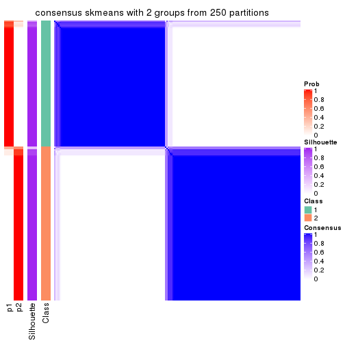</p>

</div>
<div id='tab-SD-skmeans-consensus-heatmap-2'>
<pre><code class="r">consensus_heatmap(res, k = 3)
</code></pre>

<p>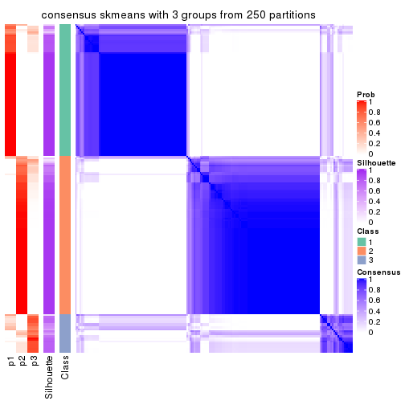</p>

</div>
<div id='tab-SD-skmeans-consensus-heatmap-3'>
<pre><code class="r">consensus_heatmap(res, k = 4)
</code></pre>

<p>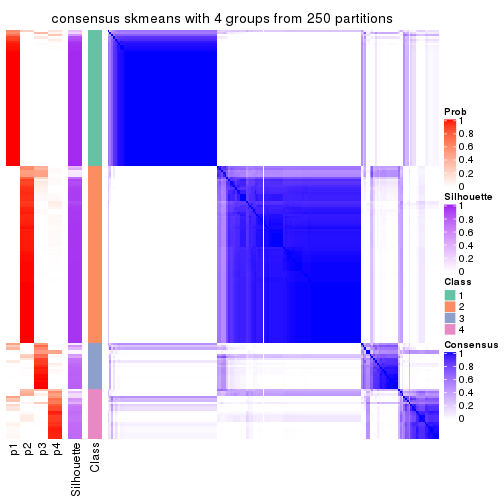</p>

</div>
<div id='tab-SD-skmeans-consensus-heatmap-4'>
<pre><code class="r">consensus_heatmap(res, k = 5)
</code></pre>

<p>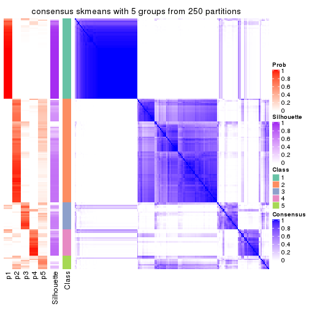</p>

</div>
<div id='tab-SD-skmeans-consensus-heatmap-5'>
<pre><code class="r">consensus_heatmap(res, k = 6)
</code></pre>

<p>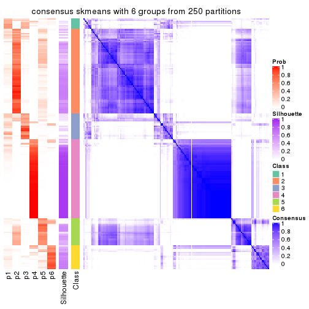</p>

</div>
</div>

Heatmaps for the membership of samples in all partitions to see how consistent they are:


<script>
$( function() {
	$( '#tabs-SD-skmeans-membership-heatmap' ).tabs();
} );
</script>
<div id='tabs-SD-skmeans-membership-heatmap'>
<ul>
<li><a href='#tab-SD-skmeans-membership-heatmap-1'>k = 2</a></li>
<li><a href='#tab-SD-skmeans-membership-heatmap-2'>k = 3</a></li>
<li><a href='#tab-SD-skmeans-membership-heatmap-3'>k = 4</a></li>
<li><a href='#tab-SD-skmeans-membership-heatmap-4'>k = 5</a></li>
<li><a href='#tab-SD-skmeans-membership-heatmap-5'>k = 6</a></li>
</ul>
<div id='tab-SD-skmeans-membership-heatmap-1'>
<pre><code class="r">membership_heatmap(res, k = 2)
</code></pre>

<p>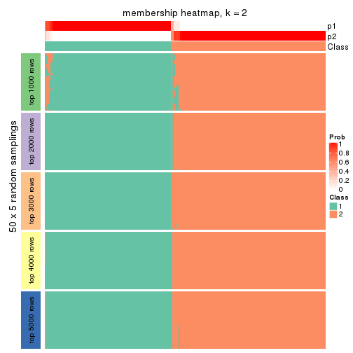</p>

</div>
<div id='tab-SD-skmeans-membership-heatmap-2'>
<pre><code class="r">membership_heatmap(res, k = 3)
</code></pre>

<p>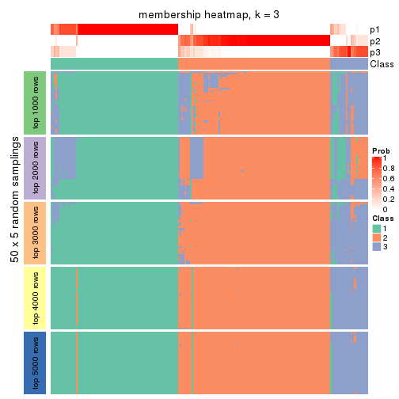</p>

</div>
<div id='tab-SD-skmeans-membership-heatmap-3'>
<pre><code class="r">membership_heatmap(res, k = 4)
</code></pre>

<p>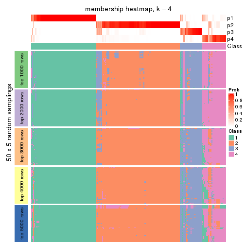</p>

</div>
<div id='tab-SD-skmeans-membership-heatmap-4'>
<pre><code class="r">membership_heatmap(res, k = 5)
</code></pre>

<p>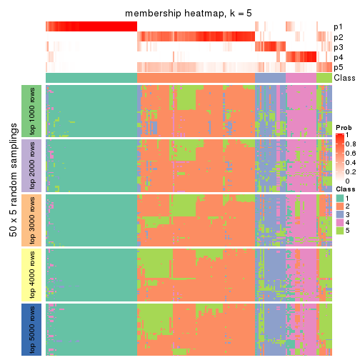</p>

</div>
<div id='tab-SD-skmeans-membership-heatmap-5'>
<pre><code class="r">membership_heatmap(res, k = 6)
</code></pre>

<p>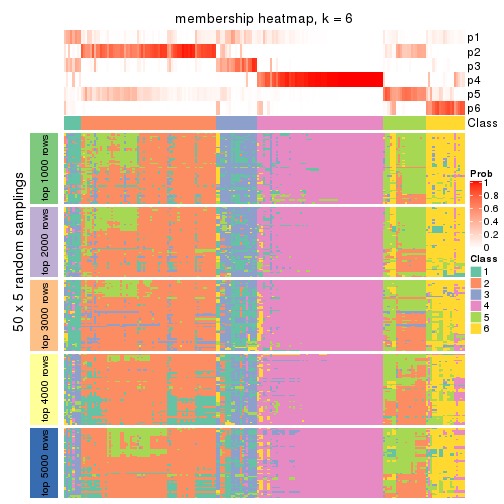</p>

</div>
</div>

As soon as we have had the classes for columns, we can look for signatures
which are significantly different between classes which can be candidate marks
for certain classes. Following are the heatmaps for signatures.


Signature heatmaps where rows are scaled:


<script>
$( function() {
	$( '#tabs-SD-skmeans-get-signatures' ).tabs();
} );
</script>
<div id='tabs-SD-skmeans-get-signatures'>
<ul>
<li><a href='#tab-SD-skmeans-get-signatures-1'>k = 2</a></li>
<li><a href='#tab-SD-skmeans-get-signatures-2'>k = 3</a></li>
<li><a href='#tab-SD-skmeans-get-signatures-3'>k = 4</a></li>
<li><a href='#tab-SD-skmeans-get-signatures-4'>k = 5</a></li>
<li><a href='#tab-SD-skmeans-get-signatures-5'>k = 6</a></li>
</ul>
<div id='tab-SD-skmeans-get-signatures-1'>
<pre><code class="r">get_signatures(res, k = 2)
</code></pre>

<p>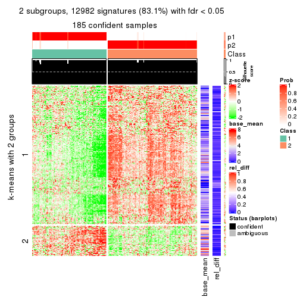</p>

</div>
<div id='tab-SD-skmeans-get-signatures-2'>
<pre><code class="r">get_signatures(res, k = 3)
</code></pre>

<p>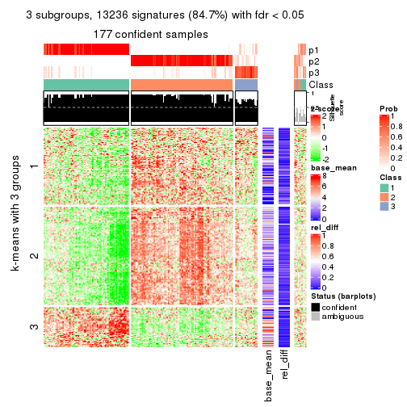</p>

</div>
<div id='tab-SD-skmeans-get-signatures-3'>
<pre><code class="r">get_signatures(res, k = 4)
</code></pre>

<p>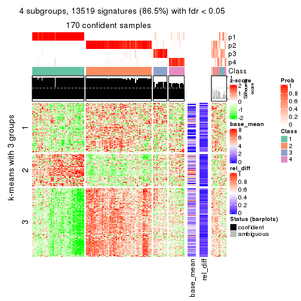</p>

</div>
<div id='tab-SD-skmeans-get-signatures-4'>
<pre><code class="r">get_signatures(res, k = 5)
</code></pre>

<p>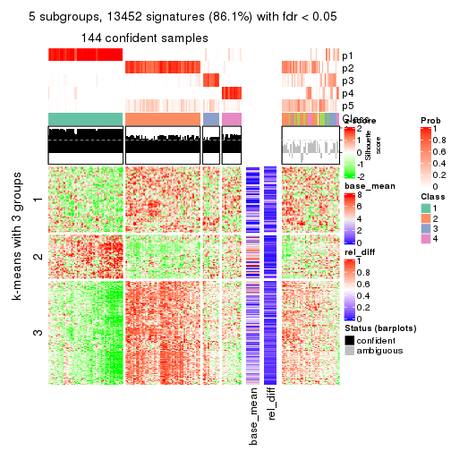</p>

</div>
<div id='tab-SD-skmeans-get-signatures-5'>
<pre><code class="r">get_signatures(res, k = 6)
</code></pre>

<p>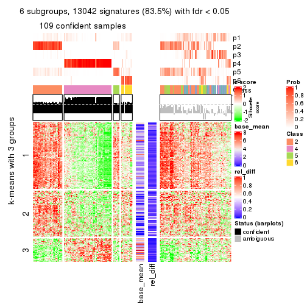</p>

</div>
</div>


Signature heatmaps where rows are not scaled:


<script>
$( function() {
	$( '#tabs-SD-skmeans-get-signatures-no-scale' ).tabs();
} );
</script>
<div id='tabs-SD-skmeans-get-signatures-no-scale'>
<ul>
<li><a href='#tab-SD-skmeans-get-signatures-no-scale-1'>k = 2</a></li>
<li><a href='#tab-SD-skmeans-get-signatures-no-scale-2'>k = 3</a></li>
<li><a href='#tab-SD-skmeans-get-signatures-no-scale-3'>k = 4</a></li>
<li><a href='#tab-SD-skmeans-get-signatures-no-scale-4'>k = 5</a></li>
<li><a href='#tab-SD-skmeans-get-signatures-no-scale-5'>k = 6</a></li>
</ul>
<div id='tab-SD-skmeans-get-signatures-no-scale-1'>
<pre><code class="r">get_signatures(res, k = 2, scale_rows = FALSE)
</code></pre>

<p>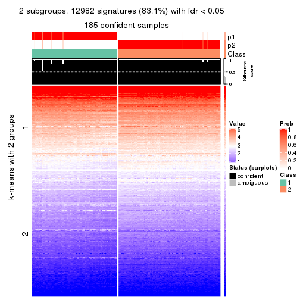</p>

</div>
<div id='tab-SD-skmeans-get-signatures-no-scale-2'>
<pre><code class="r">get_signatures(res, k = 3, scale_rows = FALSE)
</code></pre>

<p>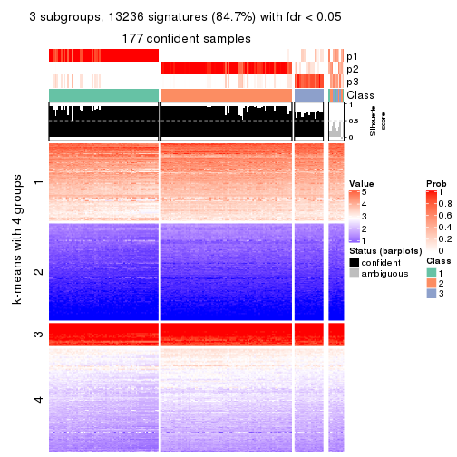</p>

</div>
<div id='tab-SD-skmeans-get-signatures-no-scale-3'>
<pre><code class="r">get_signatures(res, k = 4, scale_rows = FALSE)
</code></pre>

<p>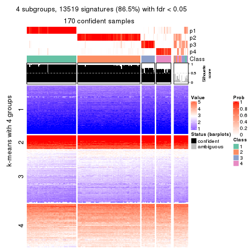</p>

</div>
<div id='tab-SD-skmeans-get-signatures-no-scale-4'>
<pre><code class="r">get_signatures(res, k = 5, scale_rows = FALSE)
</code></pre>

<p>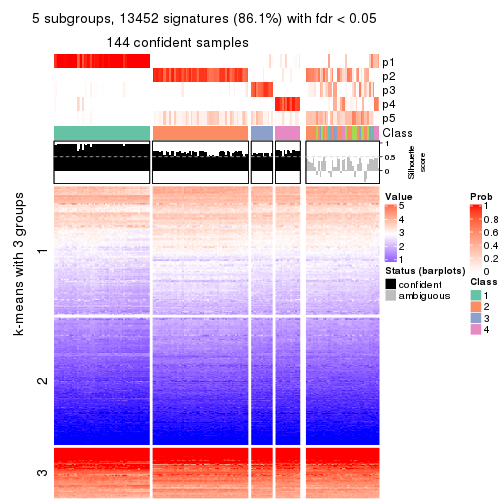</p>

</div>
<div id='tab-SD-skmeans-get-signatures-no-scale-5'>
<pre><code class="r">get_signatures(res, k = 6, scale_rows = FALSE)
</code></pre>

<p>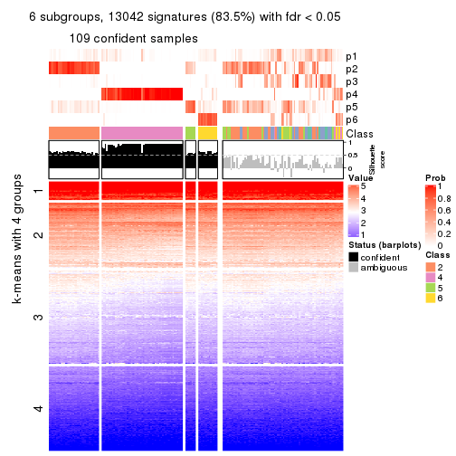</p>

</div>
</div>


Compare the overlap of signatures from different k:

```r
compare_signatures(res)
```

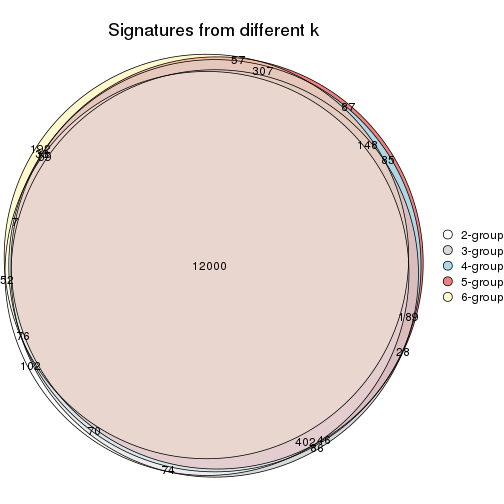

`get_signature()` returns a data frame invisibly. TO get the list of signatures, the function
call should be assigned to a variable explicitly. In following code, if `plot` argument is set
to `FALSE`, no heatmap is plotted while only the differential analysis is performed.

```r
# code only for demonstration
tb = get_signature(res, k = ..., plot = FALSE)
```

An example of the output of `tb` is:

```
#>   which_row         fdr    mean_1    mean_2 scaled_mean_1 scaled_mean_2 km
#> 1        38 0.042760348  8.373488  9.131774    -0.5533452     0.5164555  1
#> 2        40 0.018707592  7.106213  8.469186    -0.6173731     0.5762149  1
#> 3        55 0.019134737 10.221463 11.207825    -0.6159697     0.5749050  1
#> 4        59 0.006059896  5.921854  7.869574    -0.6899429     0.6439467  1
#> 5        60 0.018055526  8.928898 10.211722    -0.6204761     0.5791110  1
#> 6        98 0.009384629 15.714769 14.887706     0.6635654    -0.6193277  2
...
```

The columns in `tb` are:

1. `which_row`: row indices corresponding to the input matrix.
2. `fdr`: FDR for the differential test. 
3. `mean_x`: The mean value in group x.
4. `scaled_mean_x`: The mean value in group x after rows are scaled.
5. `km`: Row groups if k-means clustering is applied to rows.


UMAP plot which shows how samples are separated.


<script>
$( function() {
	$( '#tabs-SD-skmeans-dimension-reduction' ).tabs();
} );
</script>
<div id='tabs-SD-skmeans-dimension-reduction'>
<ul>
<li><a href='#tab-SD-skmeans-dimension-reduction-1'>k = 2</a></li>
<li><a href='#tab-SD-skmeans-dimension-reduction-2'>k = 3</a></li>
<li><a href='#tab-SD-skmeans-dimension-reduction-3'>k = 4</a></li>
<li><a href='#tab-SD-skmeans-dimension-reduction-4'>k = 5</a></li>
<li><a href='#tab-SD-skmeans-dimension-reduction-5'>k = 6</a></li>
</ul>
<div id='tab-SD-skmeans-dimension-reduction-1'>
<pre><code class="r">dimension_reduction(res, k = 2, method = &quot;UMAP&quot;)
</code></pre>

<p>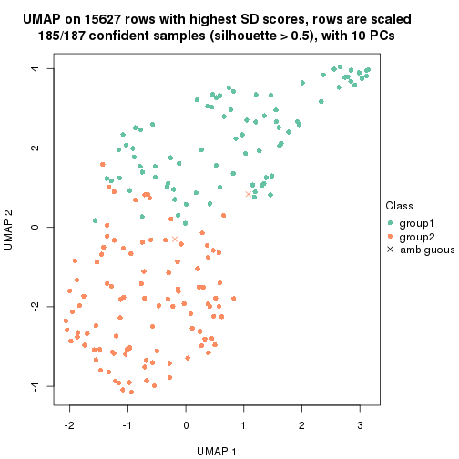</p>

</div>
<div id='tab-SD-skmeans-dimension-reduction-2'>
<pre><code class="r">dimension_reduction(res, k = 3, method = &quot;UMAP&quot;)
</code></pre>

<p>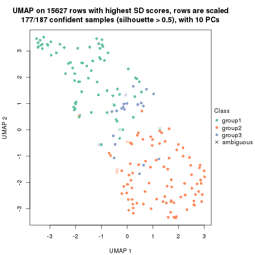</p>

</div>
<div id='tab-SD-skmeans-dimension-reduction-3'>
<pre><code class="r">dimension_reduction(res, k = 4, method = &quot;UMAP&quot;)
</code></pre>

<p>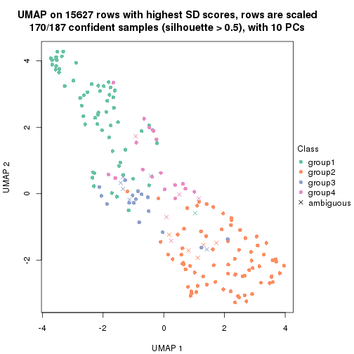</p>

</div>
<div id='tab-SD-skmeans-dimension-reduction-4'>
<pre><code class="r">dimension_reduction(res, k = 5, method = &quot;UMAP&quot;)
</code></pre>

<p>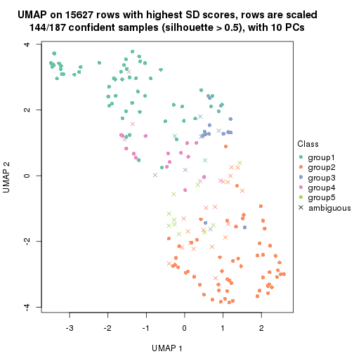</p>

</div>
<div id='tab-SD-skmeans-dimension-reduction-5'>
<pre><code class="r">dimension_reduction(res, k = 6, method = &quot;UMAP&quot;)
</code></pre>

<p>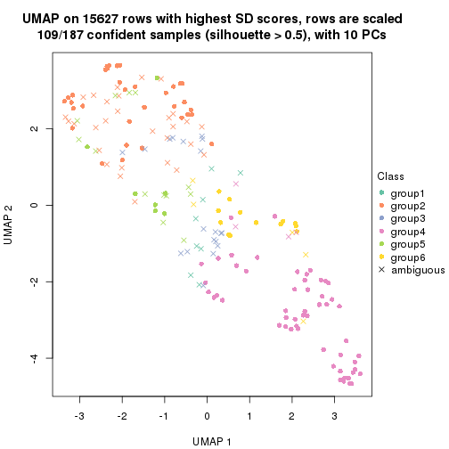</p>

</div>
</div>


Following heatmap shows how subgroups are split when increasing `k`:

```r
collect_classes(res)
```

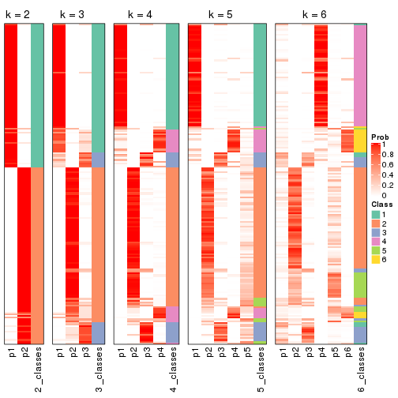


If matrix rows can be associated to genes, consider to use `GO_Enrichment(res,
...)` to perform function enrichment for the signature genes.


 

---------------------------------------------------


### SD:pam


The object with results only for a single top-value method and a single partition method 
can be extracted as:

```r
res = res_list["SD", "pam"]
# you can also extract it by
# res = res_list["SD:pam"]
```

A summary of `res` and all the functions that can be applied to it:

```r
res
```

```
#> A 'ConsensusPartition' object with k = 2, 3, 4, 5, 6.
#>   On a matrix with 15627 rows and 187 columns.
#>   Top rows (1000, 2000, 3000, 4000, 5000) are extracted by 'SD' method.
#>   Subgroups are detected by 'pam' method.
#>   Performed in total 1250 partitions by row resampling.
#>   Best k for subgroups seems to be 2.
#> 
#> Following methods can be applied to this 'ConsensusPartition' object:
#>  [1] "cola_report"             "collect_classes"         "collect_plots"          
#>  [4] "collect_stats"           "colnames"                "compare_signatures"     
#>  [7] "consensus_heatmap"       "dimension_reduction"     "functional_enrichment"  
#> [10] "get_anno_col"            "get_anno"                "get_classes"            
#> [13] "get_consensus"           "get_matrix"              "get_membership"         
#> [16] "get_param"               "get_signatures"          "get_stats"              
#> [19] "is_best_k"               "is_stable_k"             "membership_heatmap"     
#> [22] "ncol"                    "nrow"                    "plot_ecdf"              
#> [25] "rownames"                "select_partition_number" "show"                   
#> [28] "suggest_best_k"          "test_to_known_factors"
```

`collect_plots()` function collects all the plots made from `res` for all `k` (number of partitions)
into one single page to provide an easy and fast comparison between different `k`.

```r
collect_plots(res)
```

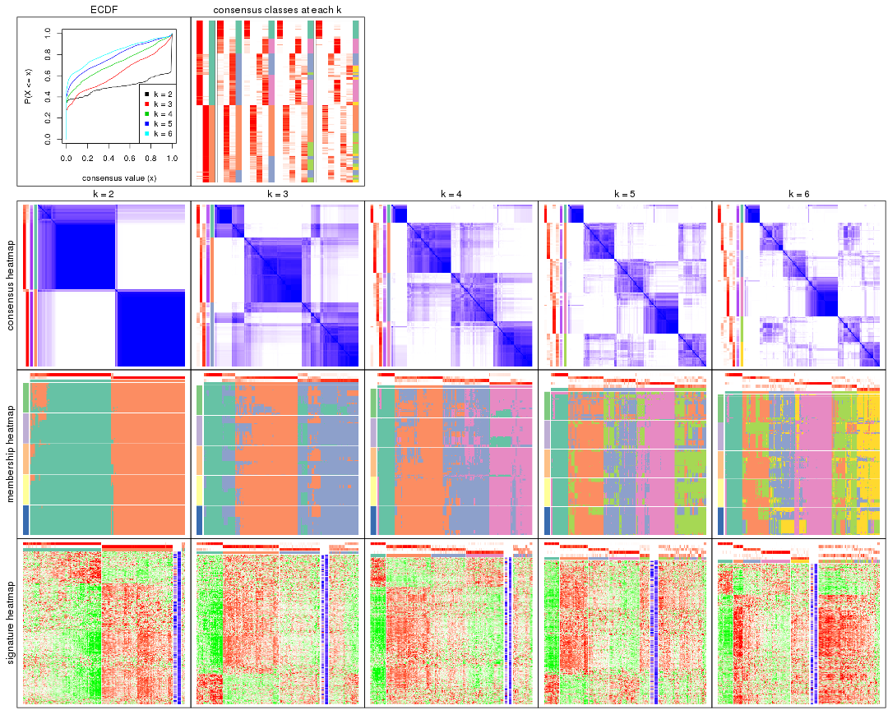

The plots are:

- The first row: a plot of the ECDF (Empirical cumulative distribution
  function) curves of the consensus matrix for each `k` and the heatmap of
  predicted classes for each `k`.
- The second row: heatmaps of the consensus matrix for each `k`.
- The third row: heatmaps of the membership matrix for each `k`.
- The fouth row: heatmaps of the signatures for each `k`.

All the plots in panels can be made by individual functions and they are
plotted later in this section.

`select_partition_number()` produces several plots showing different
statistics for choosing "optimized" `k`. There are following statistics:

- ECDF curves of the consensus matrix for each `k`;
- 1-PAC. [The PAC
  score](https://en.wikipedia.org/wiki/Consensus_clustering#Over-interpretation_potential_of_consensus_clustering)
  measures the proportion of the ambiguous subgrouping.
- Mean silhouette score.
- Concordance. The mean probability of fiting the consensus class ids in all
  partitions.
- Area increased. Denote $A_k$ as the area under the ECDF curve for current
  `k`, the area increased is defined as $A_k - A_{k-1}$.
- Rand index. The percent of pairs of samples that are both in a same cluster
  or both are not in a same cluster in the partition of k and k-1.
- Jaccard index. The ratio of pairs of samples are both in a same cluster in
  the partition of k and k-1 and the pairs of samples are both in a same
  cluster in the partition k or k-1.

The detailed explanations of these statistics can be found in [the cola
vignette](http://bioconductor.org/packages/devel/bioc/vignettes/cola/inst/doc/cola.html#toc_13).

Generally speaking, lower PAC score, higher mean silhouette score or higher
concordance corresponds to better partition. Rand index and Jaccard index
measure how similar the current partition is compared to partition with `k-1`.
If they are too similar, we won't accept `k` is better than `k-1`.

```r
select_partition_number(res)
```

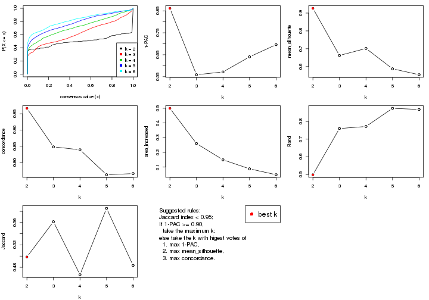

The numeric values for all these statistics can be obtained by `get_stats()`.

```r
get_stats(res)
```

```
#>   k 1-PAC mean_silhouette concordance area_increased  Rand Jaccard
#> 2 2 0.862           0.927       0.967         0.4998 0.498   0.498
#> 3 3 0.559           0.662       0.848         0.2602 0.760   0.561
#> 4 4 0.572           0.702       0.839         0.1493 0.772   0.467
#> 5 5 0.641           0.587       0.762         0.0880 0.875   0.585
#> 6 6 0.696           0.554       0.766         0.0479 0.868   0.483
```

`suggest_best_k()` suggests the best $k$ based on these statistics. The rules are as follows:

- All $k$ with Jaccard index larger than 0.95 are removed because the increase of
  the partition number does not provides enough extra information. If all $k$ are removed,
  the best $k$ is assigned by `NA`.
- For $k$ with 1-PAC larger than 0.9, the maximal $k$ is taken as the "best k". Other $k$ is called "optional k".
- If it does not fit the second rule. The $k$ with the highest vote of highest
  1-PAC, mean silhouette and concordance is taken as the "best k".

```r
suggest_best_k(res)
```

```
#> [1] 2
```


Following shows the table of the partitions (You need to click the **show/hide
code output** link to see it). The membership matrix (columns with name `p*`)
is inferred by
[`clue::cl_consensus()`](https://www.rdocumentation.org/link/cl_consensus?package=clue)
function with the `SE` method. Basically the value in the membership matrix
represents the probability to belong to a certain group. The finall class
label for an item is determined with the group with highest probability it
belongs to.

In `get_classes()` function, the entropy is calculated from the membership
matrix and the silhouette score is calculated from the consensus matrix.


<script>
$( function() {
	$( '#tabs-SD-pam-get-classes' ).tabs();
} );
</script>
<div id='tabs-SD-pam-get-classes'>
<ul>
<li><a href='#tab-SD-pam-get-classes-1'>k = 2</a></li>
<li><a href='#tab-SD-pam-get-classes-2'>k = 3</a></li>
<li><a href='#tab-SD-pam-get-classes-3'>k = 4</a></li>
<li><a href='#tab-SD-pam-get-classes-4'>k = 5</a></li>
<li><a href='#tab-SD-pam-get-classes-5'>k = 6</a></li>
</ul>

<div id='tab-SD-pam-get-classes-1'>
<p><a id='tab-SD-pam-get-classes-1-a' style='color:#0366d6' href='#'>show/hide code output</a></p>
<pre><code class="r">cbind(get_classes(res, k = 2), get_membership(res, k = 2))
</code></pre>

<pre><code>#&gt;            class entropy silhouette    p1    p2
#&gt; SRR1747213     1  0.0000      0.946 1.000 0.000
#&gt; SRR1747214     1  0.0000      0.946 1.000 0.000
#&gt; SRR1747215     2  0.0000      0.986 0.000 1.000
#&gt; SRR1747216     2  0.0000      0.986 0.000 1.000
#&gt; SRR1747217     1  0.5294      0.857 0.880 0.120
#&gt; SRR1747218     2  0.0000      0.986 0.000 1.000
#&gt; SRR1747219     1  0.2236      0.923 0.964 0.036
#&gt; SRR1747220     1  0.0000      0.946 1.000 0.000
#&gt; SRR1747221     1  0.0000      0.946 1.000 0.000
#&gt; SRR1747222     1  0.0000      0.946 1.000 0.000
#&gt; SRR1747223     1  0.0000      0.946 1.000 0.000
#&gt; SRR1747224     1  0.7674      0.748 0.776 0.224
#&gt; SRR1747225     2  0.0000      0.986 0.000 1.000
#&gt; SRR1747226     2  0.0000      0.986 0.000 1.000
#&gt; SRR1747227     2  0.0000      0.986 0.000 1.000
#&gt; SRR1747228     2  0.7815      0.664 0.232 0.768
#&gt; SRR1747229     2  0.0000      0.986 0.000 1.000
#&gt; SRR1747230     1  0.0000      0.946 1.000 0.000
#&gt; SRR1747231     1  0.0000      0.946 1.000 0.000
#&gt; SRR1747232     1  0.0000      0.946 1.000 0.000
#&gt; SRR1747233     1  0.0000      0.946 1.000 0.000
#&gt; SRR1747234     1  0.9580      0.468 0.620 0.380
#&gt; SRR1747235     1  0.0000      0.946 1.000 0.000
#&gt; SRR1747236     2  0.0000      0.986 0.000 1.000
#&gt; SRR1747237     2  0.0000      0.986 0.000 1.000
#&gt; SRR1747238     2  0.0000      0.986 0.000 1.000
#&gt; SRR1747239     2  0.0000      0.986 0.000 1.000
#&gt; SRR1747240     1  0.0000      0.946 1.000 0.000
#&gt; SRR1747241     2  0.0000      0.986 0.000 1.000
#&gt; SRR1747242     1  0.0000      0.946 1.000 0.000
#&gt; SRR1747243     1  0.0000      0.946 1.000 0.000
#&gt; SRR1747244     1  0.9170      0.572 0.668 0.332
#&gt; SRR1747245     2  0.0000      0.986 0.000 1.000
#&gt; SRR1747246     2  0.0000      0.986 0.000 1.000
#&gt; SRR1747247     1  0.0000      0.946 1.000 0.000
#&gt; SRR1747248     1  0.0000      0.946 1.000 0.000
#&gt; SRR1747249     1  0.0000      0.946 1.000 0.000
#&gt; SRR1747250     1  0.7815      0.737 0.768 0.232
#&gt; SRR1747252     1  0.0000      0.946 1.000 0.000
#&gt; SRR1747253     1  0.0000      0.946 1.000 0.000
#&gt; SRR1747254     2  0.0000      0.986 0.000 1.000
#&gt; SRR1747255     1  0.0000      0.946 1.000 0.000
#&gt; SRR1747256     1  0.0000      0.946 1.000 0.000
#&gt; SRR1747257     2  0.0000      0.986 0.000 1.000
#&gt; SRR1747258     2  0.9732      0.238 0.404 0.596
#&gt; SRR1747259     2  0.0000      0.986 0.000 1.000
#&gt; SRR1747260     1  0.8081      0.717 0.752 0.248
#&gt; SRR1747261     2  0.9866      0.140 0.432 0.568
#&gt; SRR1747262     2  0.0000      0.986 0.000 1.000
#&gt; SRR1747263     2  0.0000      0.986 0.000 1.000
#&gt; SRR1747264     1  0.0000      0.946 1.000 0.000
#&gt; SRR1747265     1  0.7376      0.766 0.792 0.208
#&gt; SRR1747266     2  0.1414      0.966 0.020 0.980
#&gt; SRR1747267     1  0.0000      0.946 1.000 0.000
#&gt; SRR1747268     1  0.0000      0.946 1.000 0.000
#&gt; SRR1747269     2  0.0000      0.986 0.000 1.000
#&gt; SRR1747270     2  0.0000      0.986 0.000 1.000
#&gt; SRR1747271     2  0.0000      0.986 0.000 1.000
#&gt; SRR1747272     1  0.0000      0.946 1.000 0.000
#&gt; SRR1747273     1  0.0000      0.946 1.000 0.000
#&gt; SRR1747274     2  0.0376      0.982 0.004 0.996
#&gt; SRR1747275     1  0.0000      0.946 1.000 0.000
#&gt; SRR1747276     1  0.0000      0.946 1.000 0.000
#&gt; SRR1747277     2  0.0000      0.986 0.000 1.000
#&gt; SRR1747278     1  0.0000      0.946 1.000 0.000
#&gt; SRR1747280     1  0.0000      0.946 1.000 0.000
#&gt; SRR1747279     1  0.0000      0.946 1.000 0.000
#&gt; SRR1747281     2  0.0000      0.986 0.000 1.000
#&gt; SRR1747282     1  0.0000      0.946 1.000 0.000
#&gt; SRR1747283     1  0.4022      0.892 0.920 0.080
#&gt; SRR1747284     1  0.0000      0.946 1.000 0.000
#&gt; SRR1747285     1  0.8499      0.674 0.724 0.276
#&gt; SRR1747286     2  0.0672      0.978 0.008 0.992
#&gt; SRR1747287     2  0.0000      0.986 0.000 1.000
#&gt; SRR1747288     1  0.0000      0.946 1.000 0.000
#&gt; SRR1747290     2  0.0000      0.986 0.000 1.000
#&gt; SRR1747289     2  0.0000      0.986 0.000 1.000
#&gt; SRR1747291     2  0.0000      0.986 0.000 1.000
#&gt; SRR1747293     2  0.0000      0.986 0.000 1.000
#&gt; SRR1747294     2  0.0000      0.986 0.000 1.000
#&gt; SRR1747292     1  0.0000      0.946 1.000 0.000
#&gt; SRR1747295     2  0.0000      0.986 0.000 1.000
#&gt; SRR1747296     2  0.0000      0.986 0.000 1.000
#&gt; SRR1747297     2  0.0000      0.986 0.000 1.000
#&gt; SRR1747298     2  0.0000      0.986 0.000 1.000
#&gt; SRR1747299     2  0.0000      0.986 0.000 1.000
#&gt; SRR1747300     2  0.0000      0.986 0.000 1.000
#&gt; SRR1747301     2  0.0000      0.986 0.000 1.000
#&gt; SRR1747302     2  0.0000      0.986 0.000 1.000
#&gt; SRR1747303     2  0.0000      0.986 0.000 1.000
#&gt; SRR1747304     1  0.0000      0.946 1.000 0.000
#&gt; SRR1747305     2  0.0000      0.986 0.000 1.000
#&gt; SRR1747306     2  0.0000      0.986 0.000 1.000
#&gt; SRR1747307     1  0.0000      0.946 1.000 0.000
#&gt; SRR1747308     2  0.0376      0.982 0.004 0.996
#&gt; SRR1747309     1  0.0000      0.946 1.000 0.000
#&gt; SRR1747310     1  0.0000      0.946 1.000 0.000
#&gt; SRR1747311     1  0.0000      0.946 1.000 0.000
#&gt; SRR1747313     1  0.0000      0.946 1.000 0.000
#&gt; SRR1747312     1  0.0000      0.946 1.000 0.000
#&gt; SRR1747314     1  0.0000      0.946 1.000 0.000
#&gt; SRR1747315     2  0.0000      0.986 0.000 1.000
#&gt; SRR1747316     2  0.0000      0.986 0.000 1.000
#&gt; SRR1747318     1  0.0000      0.946 1.000 0.000
#&gt; SRR1747317     1  0.0000      0.946 1.000 0.000
#&gt; SRR1747319     1  0.6438      0.815 0.836 0.164
#&gt; SRR1747320     1  0.0000      0.946 1.000 0.000
#&gt; SRR1747322     1  0.0000      0.946 1.000 0.000
#&gt; SRR1747321     1  0.0000      0.946 1.000 0.000
#&gt; SRR1747323     2  0.0000      0.986 0.000 1.000
#&gt; SRR1747324     2  0.0000      0.986 0.000 1.000
#&gt; SRR1747326     2  0.0000      0.986 0.000 1.000
#&gt; SRR1747325     2  0.0000      0.986 0.000 1.000
#&gt; SRR1747327     2  0.0000      0.986 0.000 1.000
#&gt; SRR1747328     1  0.0376      0.944 0.996 0.004
#&gt; SRR1747330     1  0.0000      0.946 1.000 0.000
#&gt; SRR1747329     2  0.0376      0.982 0.004 0.996
#&gt; SRR1747332     1  0.0000      0.946 1.000 0.000
#&gt; SRR1747331     2  0.0000      0.986 0.000 1.000
#&gt; SRR1747333     2  0.0000      0.986 0.000 1.000
#&gt; SRR1747334     2  0.0000      0.986 0.000 1.000
#&gt; SRR1747335     1  0.0000      0.946 1.000 0.000
#&gt; SRR1747336     1  0.0000      0.946 1.000 0.000
#&gt; SRR1747337     2  0.0000      0.986 0.000 1.000
#&gt; SRR1747338     2  0.0000      0.986 0.000 1.000
#&gt; SRR1747339     1  0.0000      0.946 1.000 0.000
#&gt; SRR1747340     2  0.0938      0.974 0.012 0.988
#&gt; SRR1747341     2  0.0000      0.986 0.000 1.000
#&gt; SRR1747342     2  0.0000      0.986 0.000 1.000
#&gt; SRR1747343     2  0.0000      0.986 0.000 1.000
#&gt; SRR1747344     2  0.0000      0.986 0.000 1.000
#&gt; SRR1747345     1  0.0000      0.946 1.000 0.000
#&gt; SRR1747346     1  0.0000      0.946 1.000 0.000
#&gt; SRR1747347     2  0.0000      0.986 0.000 1.000
#&gt; SRR1747348     1  0.0000      0.946 1.000 0.000
#&gt; SRR1747349     1  0.0000      0.946 1.000 0.000
#&gt; SRR1747351     2  0.0000      0.986 0.000 1.000
#&gt; SRR1747350     2  0.0000      0.986 0.000 1.000
#&gt; SRR1747352     1  0.0000      0.946 1.000 0.000
#&gt; SRR1747353     2  0.0000      0.986 0.000 1.000
#&gt; SRR1747354     1  0.8016      0.722 0.756 0.244
#&gt; SRR1747355     1  0.0000      0.946 1.000 0.000
#&gt; SRR1747356     1  0.1843      0.929 0.972 0.028
#&gt; SRR1747357     1  0.7376      0.766 0.792 0.208
#&gt; SRR1747358     1  0.8443      0.679 0.728 0.272
#&gt; SRR1747359     1  0.0000      0.946 1.000 0.000
#&gt; SRR1747360     2  0.0000      0.986 0.000 1.000
#&gt; SRR1747361     1  0.7376      0.766 0.792 0.208
#&gt; SRR1747362     2  0.0000      0.986 0.000 1.000
#&gt; SRR1747363     1  0.0000      0.946 1.000 0.000
#&gt; SRR1747364     1  0.0000      0.946 1.000 0.000
#&gt; SRR1747365     1  0.6531      0.811 0.832 0.168
#&gt; SRR1747366     2  0.0000      0.986 0.000 1.000
#&gt; SRR1747367     1  0.0000      0.946 1.000 0.000
#&gt; SRR1747369     2  0.0000      0.986 0.000 1.000
#&gt; SRR1747368     1  0.5059      0.865 0.888 0.112
#&gt; SRR1747370     1  0.7815      0.738 0.768 0.232
#&gt; SRR1747372     1  0.0000      0.946 1.000 0.000
#&gt; SRR1747371     1  0.0000      0.946 1.000 0.000
#&gt; SRR1747373     2  0.0000      0.986 0.000 1.000
#&gt; SRR1747374     2  0.0000      0.986 0.000 1.000
#&gt; SRR1747375     1  0.0000      0.946 1.000 0.000
#&gt; SRR1747376     2  0.0000      0.986 0.000 1.000
#&gt; SRR1747377     2  0.0000      0.986 0.000 1.000
#&gt; SRR1747378     2  0.0000      0.986 0.000 1.000
#&gt; SRR1747379     2  0.0000      0.986 0.000 1.000
#&gt; SRR1747380     1  0.0000      0.946 1.000 0.000
#&gt; SRR1747381     1  0.0000      0.946 1.000 0.000
#&gt; SRR1747382     1  0.0000      0.946 1.000 0.000
#&gt; SRR1747383     2  0.0000      0.986 0.000 1.000
#&gt; SRR1747384     1  0.6343      0.807 0.840 0.160
#&gt; SRR1747385     1  0.9988      0.160 0.520 0.480
#&gt; SRR1747386     1  0.0000      0.946 1.000 0.000
#&gt; SRR1747387     2  0.0000      0.986 0.000 1.000
#&gt; SRR1747388     2  0.0000      0.986 0.000 1.000
#&gt; SRR1747390     2  0.0000      0.986 0.000 1.000
#&gt; SRR1747389     2  0.0000      0.986 0.000 1.000
#&gt; SRR1747391     2  0.0000      0.986 0.000 1.000
#&gt; SRR1747392     2  0.0000      0.986 0.000 1.000
#&gt; SRR1747393     1  0.9248      0.556 0.660 0.340
#&gt; SRR1747394     1  0.0000      0.946 1.000 0.000
#&gt; SRR1747395     1  0.9044      0.584 0.680 0.320
#&gt; SRR1747396     2  0.0000      0.986 0.000 1.000
#&gt; SRR1747398     2  0.0000      0.986 0.000 1.000
#&gt; SRR1747397     1  0.0000      0.946 1.000 0.000
#&gt; SRR1747399     1  0.0000      0.946 1.000 0.000
#&gt; SRR1747400     1  0.0000      0.946 1.000 0.000
</code></pre>

<script>
$('#tab-SD-pam-get-classes-1-a').parent().next().next().hide();
$('#tab-SD-pam-get-classes-1-a').click(function(){
  $('#tab-SD-pam-get-classes-1-a').parent().next().next().toggle();
  return(false);
});
</script>
</div>

<div id='tab-SD-pam-get-classes-2'>
<p><a id='tab-SD-pam-get-classes-2-a' style='color:#0366d6' href='#'>show/hide code output</a></p>
<pre><code class="r">cbind(get_classes(res, k = 3), get_membership(res, k = 3))
</code></pre>

<pre><code>#&gt;            class entropy silhouette    p1    p2    p3
#&gt; SRR1747213     3  0.4796     0.5277 0.220 0.000 0.780
#&gt; SRR1747214     1  0.5591     0.6822 0.696 0.000 0.304
#&gt; SRR1747215     2  0.0000     0.8953 0.000 1.000 0.000
#&gt; SRR1747216     2  0.1163     0.8965 0.000 0.972 0.028
#&gt; SRR1747217     3  0.2564     0.7195 0.036 0.028 0.936
#&gt; SRR1747218     3  0.6244     0.0814 0.000 0.440 0.560
#&gt; SRR1747219     3  0.2446     0.7170 0.052 0.012 0.936
#&gt; SRR1747220     3  0.6252    -0.1357 0.444 0.000 0.556
#&gt; SRR1747221     3  0.6307    -0.2987 0.488 0.000 0.512
#&gt; SRR1747222     3  0.6307    -0.3029 0.488 0.000 0.512
#&gt; SRR1747223     3  0.3267     0.6754 0.116 0.000 0.884
#&gt; SRR1747224     3  0.1753     0.7127 0.000 0.048 0.952
#&gt; SRR1747225     2  0.6225     0.2301 0.000 0.568 0.432
#&gt; SRR1747226     2  0.0000     0.8953 0.000 1.000 0.000
#&gt; SRR1747227     2  0.1860     0.8938 0.000 0.948 0.052
#&gt; SRR1747228     3  0.6062     0.2917 0.000 0.384 0.616
#&gt; SRR1747229     2  0.1411     0.8907 0.000 0.964 0.036
#&gt; SRR1747230     1  0.0000     0.7788 1.000 0.000 0.000
#&gt; SRR1747231     1  0.6244     0.4653 0.560 0.000 0.440
#&gt; SRR1747232     1  0.0000     0.7788 1.000 0.000 0.000
#&gt; SRR1747233     1  0.6308     0.3440 0.508 0.000 0.492
#&gt; SRR1747234     3  0.3349     0.6841 0.004 0.108 0.888
#&gt; SRR1747235     1  0.0000     0.7788 1.000 0.000 0.000
#&gt; SRR1747236     2  0.0237     0.8959 0.000 0.996 0.004
#&gt; SRR1747237     2  0.2165     0.8916 0.000 0.936 0.064
#&gt; SRR1747238     3  0.6309    -0.1703 0.000 0.500 0.500
#&gt; SRR1747239     2  0.0424     0.8954 0.000 0.992 0.008
#&gt; SRR1747240     1  0.0000     0.7788 1.000 0.000 0.000
#&gt; SRR1747241     3  0.6280     0.0043 0.000 0.460 0.540
#&gt; SRR1747242     1  0.0000     0.7788 1.000 0.000 0.000
#&gt; SRR1747243     3  0.2625     0.7046 0.084 0.000 0.916
#&gt; SRR1747244     3  0.3886     0.6972 0.024 0.096 0.880
#&gt; SRR1747245     2  0.5621     0.5894 0.000 0.692 0.308
#&gt; SRR1747246     2  0.0000     0.8953 0.000 1.000 0.000
#&gt; SRR1747247     1  0.1031     0.7773 0.976 0.000 0.024
#&gt; SRR1747248     1  0.0000     0.7788 1.000 0.000 0.000
#&gt; SRR1747249     3  0.5968     0.1670 0.364 0.000 0.636
#&gt; SRR1747250     3  0.1964     0.7110 0.000 0.056 0.944
#&gt; SRR1747252     3  0.5560     0.3650 0.300 0.000 0.700
#&gt; SRR1747253     3  0.6308    -0.3148 0.492 0.000 0.508
#&gt; SRR1747254     2  0.0424     0.8948 0.000 0.992 0.008
#&gt; SRR1747255     3  0.5835     0.2363 0.340 0.000 0.660
#&gt; SRR1747256     3  0.6291    -0.2405 0.468 0.000 0.532
#&gt; SRR1747257     2  0.2261     0.8902 0.000 0.932 0.068
#&gt; SRR1747258     3  0.5497     0.5033 0.000 0.292 0.708
#&gt; SRR1747259     2  0.1289     0.8940 0.000 0.968 0.032
#&gt; SRR1747260     3  0.2066     0.7097 0.000 0.060 0.940
#&gt; SRR1747261     3  0.5678     0.4771 0.000 0.316 0.684
#&gt; SRR1747262     2  0.2625     0.8832 0.000 0.916 0.084
#&gt; SRR1747263     2  0.1964     0.8924 0.000 0.944 0.056
#&gt; SRR1747264     1  0.1529     0.7752 0.960 0.000 0.040
#&gt; SRR1747265     3  0.2280     0.7133 0.008 0.052 0.940
#&gt; SRR1747266     3  0.5760     0.3751 0.000 0.328 0.672
#&gt; SRR1747267     3  0.2625     0.7046 0.084 0.000 0.916
#&gt; SRR1747268     3  0.2625     0.7046 0.084 0.000 0.916
#&gt; SRR1747269     2  0.3879     0.8418 0.000 0.848 0.152
#&gt; SRR1747270     2  0.3038     0.8527 0.000 0.896 0.104
#&gt; SRR1747271     2  0.6079     0.4660 0.000 0.612 0.388
#&gt; SRR1747272     3  0.2625     0.7046 0.084 0.000 0.916
#&gt; SRR1747273     1  0.6305     0.3765 0.516 0.000 0.484
#&gt; SRR1747274     3  0.6305    -0.0844 0.000 0.484 0.516
#&gt; SRR1747275     1  0.5926     0.6267 0.644 0.000 0.356
#&gt; SRR1747276     3  0.6307    -0.3088 0.488 0.000 0.512
#&gt; SRR1747277     2  0.2165     0.8903 0.000 0.936 0.064
#&gt; SRR1747278     3  0.2537     0.7066 0.080 0.000 0.920
#&gt; SRR1747280     1  0.0000     0.7788 1.000 0.000 0.000
#&gt; SRR1747279     1  0.6008     0.6001 0.628 0.000 0.372
#&gt; SRR1747281     2  0.2165     0.8914 0.000 0.936 0.064
#&gt; SRR1747282     1  0.4002     0.7454 0.840 0.000 0.160
#&gt; SRR1747283     3  0.3678     0.6979 0.028 0.080 0.892
#&gt; SRR1747284     1  0.4796     0.7221 0.780 0.000 0.220
#&gt; SRR1747285     3  0.4062     0.6542 0.000 0.164 0.836
#&gt; SRR1747286     2  0.6252     0.2993 0.000 0.556 0.444
#&gt; SRR1747287     2  0.1753     0.8945 0.000 0.952 0.048
#&gt; SRR1747288     3  0.2959     0.6913 0.100 0.000 0.900
#&gt; SRR1747290     2  0.2066     0.8912 0.000 0.940 0.060
#&gt; SRR1747289     2  0.0000     0.8953 0.000 1.000 0.000
#&gt; SRR1747291     2  0.4796     0.7726 0.000 0.780 0.220
#&gt; SRR1747293     3  0.6244     0.0205 0.000 0.440 0.560
#&gt; SRR1747294     2  0.2165     0.8903 0.000 0.936 0.064
#&gt; SRR1747292     1  0.5785     0.6548 0.668 0.000 0.332
#&gt; SRR1747295     2  0.4974     0.7083 0.000 0.764 0.236
#&gt; SRR1747296     3  0.6126     0.1857 0.000 0.400 0.600
#&gt; SRR1747297     2  0.1031     0.8973 0.000 0.976 0.024
#&gt; SRR1747298     2  0.1643     0.8944 0.000 0.956 0.044
#&gt; SRR1747299     2  0.2066     0.8912 0.000 0.940 0.060
#&gt; SRR1747300     2  0.1753     0.8951 0.000 0.952 0.048
#&gt; SRR1747301     2  0.3340     0.8213 0.000 0.880 0.120
#&gt; SRR1747302     2  0.0000     0.8953 0.000 1.000 0.000
#&gt; SRR1747303     2  0.5016     0.7467 0.000 0.760 0.240
#&gt; SRR1747304     1  0.0000     0.7788 1.000 0.000 0.000
#&gt; SRR1747305     2  0.0892     0.8974 0.000 0.980 0.020
#&gt; SRR1747306     2  0.0237     0.8961 0.000 0.996 0.004
#&gt; SRR1747307     3  0.2537     0.7063 0.080 0.000 0.920
#&gt; SRR1747308     2  0.6308     0.0624 0.000 0.508 0.492
#&gt; SRR1747309     3  0.2711     0.7012 0.088 0.000 0.912
#&gt; SRR1747310     1  0.0000     0.7788 1.000 0.000 0.000
#&gt; SRR1747311     3  0.2261     0.7109 0.068 0.000 0.932
#&gt; SRR1747313     3  0.2165     0.7117 0.064 0.000 0.936
#&gt; SRR1747312     1  0.0000     0.7788 1.000 0.000 0.000
#&gt; SRR1747314     1  0.0000     0.7788 1.000 0.000 0.000
#&gt; SRR1747315     2  0.4750     0.7803 0.000 0.784 0.216
#&gt; SRR1747316     3  0.5706     0.3773 0.000 0.320 0.680
#&gt; SRR1747318     3  0.2625     0.7046 0.084 0.000 0.916
#&gt; SRR1747317     3  0.1964     0.7132 0.056 0.000 0.944
#&gt; SRR1747319     3  0.1878     0.7151 0.004 0.044 0.952
#&gt; SRR1747320     1  0.6260     0.4600 0.552 0.000 0.448
#&gt; SRR1747322     1  0.0000     0.7788 1.000 0.000 0.000
#&gt; SRR1747321     1  0.5650     0.6765 0.688 0.000 0.312
#&gt; SRR1747323     2  0.0237     0.8959 0.000 0.996 0.004
#&gt; SRR1747324     2  0.2878     0.8576 0.000 0.904 0.096
#&gt; SRR1747326     2  0.1643     0.8944 0.000 0.956 0.044
#&gt; SRR1747325     2  0.0000     0.8953 0.000 1.000 0.000
#&gt; SRR1747327     2  0.0424     0.8954 0.000 0.992 0.008
#&gt; SRR1747328     3  0.2772     0.7087 0.080 0.004 0.916
#&gt; SRR1747330     3  0.2625     0.7046 0.084 0.000 0.916
#&gt; SRR1747329     3  0.6305    -0.1447 0.000 0.484 0.516
#&gt; SRR1747332     3  0.5650     0.3337 0.312 0.000 0.688
#&gt; SRR1747331     2  0.6008     0.5117 0.000 0.628 0.372
#&gt; SRR1747333     2  0.5835     0.5693 0.000 0.660 0.340
#&gt; SRR1747334     2  0.0237     0.8959 0.000 0.996 0.004
#&gt; SRR1747335     3  0.2711     0.7022 0.088 0.000 0.912
#&gt; SRR1747336     1  0.0000     0.7788 1.000 0.000 0.000
#&gt; SRR1747337     2  0.0000     0.8953 0.000 1.000 0.000
#&gt; SRR1747338     2  0.0000     0.8953 0.000 1.000 0.000
#&gt; SRR1747339     3  0.1964     0.7133 0.056 0.000 0.944
#&gt; SRR1747340     3  0.6026     0.2645 0.000 0.376 0.624
#&gt; SRR1747341     2  0.0000     0.8953 0.000 1.000 0.000
#&gt; SRR1747342     2  0.0000     0.8953 0.000 1.000 0.000
#&gt; SRR1747343     2  0.0237     0.8959 0.000 0.996 0.004
#&gt; SRR1747344     2  0.2796     0.8580 0.000 0.908 0.092
#&gt; SRR1747345     3  0.2625     0.7046 0.084 0.000 0.916
#&gt; SRR1747346     3  0.2165     0.7117 0.064 0.000 0.936
#&gt; SRR1747347     2  0.0000     0.8953 0.000 1.000 0.000
#&gt; SRR1747348     1  0.0000     0.7788 1.000 0.000 0.000
#&gt; SRR1747349     1  0.5591     0.6822 0.696 0.000 0.304
#&gt; SRR1747351     2  0.1643     0.8944 0.000 0.956 0.044
#&gt; SRR1747350     2  0.3412     0.8560 0.000 0.876 0.124
#&gt; SRR1747352     1  0.0000     0.7788 1.000 0.000 0.000
#&gt; SRR1747353     2  0.4291     0.8214 0.000 0.820 0.180
#&gt; SRR1747354     3  0.1753     0.7127 0.000 0.048 0.952
#&gt; SRR1747355     3  0.5529     0.3759 0.296 0.000 0.704
#&gt; SRR1747356     3  0.2384     0.7157 0.056 0.008 0.936
#&gt; SRR1747357     3  0.2200     0.7124 0.004 0.056 0.940
#&gt; SRR1747358     3  0.2682     0.7035 0.004 0.076 0.920
#&gt; SRR1747359     1  0.5835     0.6451 0.660 0.000 0.340
#&gt; SRR1747360     2  0.2537     0.8724 0.000 0.920 0.080
#&gt; SRR1747361     3  0.3472     0.7169 0.040 0.056 0.904
#&gt; SRR1747362     2  0.4346     0.8108 0.000 0.816 0.184
#&gt; SRR1747363     3  0.2448     0.7080 0.076 0.000 0.924
#&gt; SRR1747364     1  0.6235     0.4738 0.564 0.000 0.436
#&gt; SRR1747365     3  0.2096     0.7143 0.004 0.052 0.944
#&gt; SRR1747366     2  0.2878     0.8814 0.000 0.904 0.096
#&gt; SRR1747367     3  0.2625     0.7046 0.084 0.000 0.916
#&gt; SRR1747369     2  0.0000     0.8953 0.000 1.000 0.000
#&gt; SRR1747368     3  0.1482     0.7175 0.012 0.020 0.968
#&gt; SRR1747370     3  0.2066     0.7137 0.000 0.060 0.940
#&gt; SRR1747372     1  0.1411     0.7758 0.964 0.000 0.036
#&gt; SRR1747371     1  0.6291     0.3974 0.532 0.000 0.468
#&gt; SRR1747373     2  0.0000     0.8953 0.000 1.000 0.000
#&gt; SRR1747374     2  0.0000     0.8953 0.000 1.000 0.000
#&gt; SRR1747375     3  0.2625     0.7046 0.084 0.000 0.916
#&gt; SRR1747376     2  0.0237     0.8959 0.000 0.996 0.004
#&gt; SRR1747377     2  0.0424     0.8954 0.000 0.992 0.008
#&gt; SRR1747378     2  0.3941     0.8258 0.000 0.844 0.156
#&gt; SRR1747379     2  0.6225     0.3889 0.000 0.568 0.432
#&gt; SRR1747380     3  0.2165     0.7117 0.064 0.000 0.936
#&gt; SRR1747381     1  0.4291     0.7389 0.820 0.000 0.180
#&gt; SRR1747382     1  0.5650     0.6754 0.688 0.000 0.312
#&gt; SRR1747383     2  0.1753     0.8940 0.000 0.952 0.048
#&gt; SRR1747384     3  0.4095     0.7130 0.064 0.056 0.880
#&gt; SRR1747385     3  0.5660     0.6253 0.028 0.200 0.772
#&gt; SRR1747386     1  0.0000     0.7788 1.000 0.000 0.000
#&gt; SRR1747387     2  0.0424     0.8954 0.000 0.992 0.008
#&gt; SRR1747388     2  0.1860     0.8940 0.000 0.948 0.052
#&gt; SRR1747390     3  0.5905     0.2938 0.000 0.352 0.648
#&gt; SRR1747389     2  0.6299     0.2220 0.000 0.524 0.476
#&gt; SRR1747391     2  0.4121     0.8212 0.000 0.832 0.168
#&gt; SRR1747392     2  0.1753     0.8945 0.000 0.952 0.048
#&gt; SRR1747393     3  0.3805     0.7017 0.024 0.092 0.884
#&gt; SRR1747394     3  0.2625     0.7046 0.084 0.000 0.916
#&gt; SRR1747395     3  0.4015     0.7058 0.028 0.096 0.876
#&gt; SRR1747396     2  0.0237     0.8959 0.000 0.996 0.004
#&gt; SRR1747398     2  0.0592     0.8946 0.000 0.988 0.012
#&gt; SRR1747397     3  0.2625     0.7046 0.084 0.000 0.916
#&gt; SRR1747399     1  0.5591     0.6822 0.696 0.000 0.304
#&gt; SRR1747400     1  0.6154     0.5296 0.592 0.000 0.408
</code></pre>

<script>
$('#tab-SD-pam-get-classes-2-a').parent().next().next().hide();
$('#tab-SD-pam-get-classes-2-a').click(function(){
  $('#tab-SD-pam-get-classes-2-a').parent().next().next().toggle();
  return(false);
});
</script>
</div>

<div id='tab-SD-pam-get-classes-3'>
<p><a id='tab-SD-pam-get-classes-3-a' style='color:#0366d6' href='#'>show/hide code output</a></p>
<pre><code class="r">cbind(get_classes(res, k = 4), get_membership(res, k = 4))
</code></pre>

<pre><code>#&gt;            class entropy silhouette    p1    p2    p3    p4
#&gt; SRR1747213     4  0.2859    0.79503 0.008 0.000 0.112 0.880
#&gt; SRR1747214     4  0.2921    0.81300 0.140 0.000 0.000 0.860
#&gt; SRR1747215     2  0.0000    0.82909 0.000 1.000 0.000 0.000
#&gt; SRR1747216     2  0.1867    0.82992 0.000 0.928 0.072 0.000
#&gt; SRR1747217     3  0.4941    0.38879 0.000 0.000 0.564 0.436
#&gt; SRR1747218     3  0.4513    0.71769 0.000 0.120 0.804 0.076
#&gt; SRR1747219     3  0.4331    0.51060 0.000 0.000 0.712 0.288
#&gt; SRR1747220     4  0.2999    0.81762 0.132 0.000 0.004 0.864
#&gt; SRR1747221     4  0.2345    0.83104 0.100 0.000 0.000 0.900
#&gt; SRR1747222     4  0.2345    0.83038 0.100 0.000 0.000 0.900
#&gt; SRR1747223     4  0.0469    0.82117 0.000 0.000 0.012 0.988
#&gt; SRR1747224     3  0.3172    0.74275 0.000 0.000 0.840 0.160
#&gt; SRR1747225     3  0.5767    0.61296 0.000 0.280 0.660 0.060
#&gt; SRR1747226     2  0.0000    0.82909 0.000 1.000 0.000 0.000
#&gt; SRR1747227     2  0.2921    0.80680 0.000 0.860 0.140 0.000
#&gt; SRR1747228     3  0.4856    0.70273 0.000 0.136 0.780 0.084
#&gt; SRR1747229     2  0.4776    0.40734 0.000 0.624 0.376 0.000
#&gt; SRR1747230     1  0.0000    0.92772 1.000 0.000 0.000 0.000
#&gt; SRR1747231     4  0.2868    0.81583 0.136 0.000 0.000 0.864
#&gt; SRR1747232     1  0.0000    0.92772 1.000 0.000 0.000 0.000
#&gt; SRR1747233     4  0.1557    0.83167 0.056 0.000 0.000 0.944
#&gt; SRR1747234     3  0.1716    0.74693 0.000 0.000 0.936 0.064
#&gt; SRR1747235     1  0.0000    0.92772 1.000 0.000 0.000 0.000
#&gt; SRR1747236     2  0.1716    0.82622 0.000 0.936 0.064 0.000
#&gt; SRR1747237     2  0.4103    0.74194 0.000 0.744 0.256 0.000
#&gt; SRR1747238     3  0.1174    0.73328 0.000 0.020 0.968 0.012
#&gt; SRR1747239     2  0.0707    0.82945 0.000 0.980 0.020 0.000
#&gt; SRR1747240     1  0.0000    0.92772 1.000 0.000 0.000 0.000
#&gt; SRR1747241     3  0.2699    0.73390 0.000 0.068 0.904 0.028
#&gt; SRR1747242     1  0.0000    0.92772 1.000 0.000 0.000 0.000
#&gt; SRR1747243     4  0.0469    0.82117 0.000 0.000 0.012 0.988
#&gt; SRR1747244     3  0.3400    0.73725 0.000 0.000 0.820 0.180
#&gt; SRR1747245     3  0.6773    0.56315 0.000 0.284 0.584 0.132
#&gt; SRR1747246     2  0.0592    0.83319 0.000 0.984 0.016 0.000
#&gt; SRR1747247     1  0.2216    0.84696 0.908 0.000 0.000 0.092
#&gt; SRR1747248     1  0.0000    0.92772 1.000 0.000 0.000 0.000
#&gt; SRR1747249     4  0.1174    0.82768 0.012 0.000 0.020 0.968
#&gt; SRR1747250     3  0.0336    0.73371 0.000 0.000 0.992 0.008
#&gt; SRR1747252     4  0.2530    0.82777 0.112 0.000 0.000 0.888
#&gt; SRR1747253     4  0.2281    0.83161 0.096 0.000 0.000 0.904
#&gt; SRR1747254     2  0.1637    0.81237 0.000 0.940 0.060 0.000
#&gt; SRR1747255     4  0.0469    0.82617 0.012 0.000 0.000 0.988
#&gt; SRR1747256     4  0.2216    0.83122 0.092 0.000 0.000 0.908
#&gt; SRR1747257     2  0.3266    0.79417 0.000 0.832 0.168 0.000
#&gt; SRR1747258     3  0.1256    0.73711 0.000 0.028 0.964 0.008
#&gt; SRR1747259     2  0.4941    0.30456 0.000 0.564 0.436 0.000
#&gt; SRR1747260     3  0.0469    0.73507 0.000 0.000 0.988 0.012
#&gt; SRR1747261     3  0.2867    0.72325 0.000 0.104 0.884 0.012
#&gt; SRR1747262     3  0.4250    0.53656 0.000 0.276 0.724 0.000
#&gt; SRR1747263     2  0.2973    0.80198 0.000 0.856 0.144 0.000
#&gt; SRR1747264     1  0.3024    0.78149 0.852 0.000 0.000 0.148
#&gt; SRR1747265     3  0.2466    0.73114 0.004 0.000 0.900 0.096
#&gt; SRR1747266     3  0.4599    0.53588 0.000 0.212 0.760 0.028
#&gt; SRR1747267     4  0.4948    0.01596 0.000 0.000 0.440 0.560
#&gt; SRR1747268     4  0.0921    0.81606 0.000 0.000 0.028 0.972
#&gt; SRR1747269     3  0.4406    0.35318 0.000 0.300 0.700 0.000
#&gt; SRR1747270     2  0.4431    0.65050 0.000 0.696 0.304 0.000
#&gt; SRR1747271     3  0.5599    0.60307 0.000 0.228 0.700 0.072
#&gt; SRR1747272     4  0.0592    0.82018 0.000 0.000 0.016 0.984
#&gt; SRR1747273     4  0.3390    0.81757 0.132 0.000 0.016 0.852
#&gt; SRR1747274     3  0.4389    0.71401 0.000 0.116 0.812 0.072
#&gt; SRR1747275     4  0.2760    0.82056 0.128 0.000 0.000 0.872
#&gt; SRR1747276     4  0.2216    0.83141 0.092 0.000 0.000 0.908
#&gt; SRR1747277     2  0.4193    0.72097 0.000 0.732 0.268 0.000
#&gt; SRR1747278     4  0.4955   -0.03904 0.000 0.000 0.444 0.556
#&gt; SRR1747280     1  0.0000    0.92772 1.000 0.000 0.000 0.000
#&gt; SRR1747279     4  0.2814    0.81848 0.132 0.000 0.000 0.868
#&gt; SRR1747281     2  0.4382    0.68945 0.000 0.704 0.296 0.000
#&gt; SRR1747282     1  0.4866    0.26783 0.596 0.000 0.000 0.404
#&gt; SRR1747283     3  0.4944    0.60455 0.004 0.032 0.744 0.220
#&gt; SRR1747284     4  0.4985    0.16827 0.468 0.000 0.000 0.532
#&gt; SRR1747285     3  0.6027    0.66332 0.000 0.088 0.660 0.252
#&gt; SRR1747286     3  0.0657    0.73148 0.000 0.012 0.984 0.004
#&gt; SRR1747287     2  0.4500    0.67623 0.000 0.684 0.316 0.000
#&gt; SRR1747288     4  0.3539    0.74042 0.004 0.000 0.176 0.820
#&gt; SRR1747290     2  0.4624    0.52918 0.000 0.660 0.340 0.000
#&gt; SRR1747289     2  0.0592    0.83252 0.000 0.984 0.016 0.000
#&gt; SRR1747291     3  0.5723    0.60516 0.000 0.220 0.696 0.084
#&gt; SRR1747293     3  0.2831    0.74272 0.000 0.004 0.876 0.120
#&gt; SRR1747294     2  0.4008    0.74246 0.000 0.756 0.244 0.000
#&gt; SRR1747292     4  0.2814    0.81848 0.132 0.000 0.000 0.868
#&gt; SRR1747295     3  0.5112   -0.01248 0.000 0.436 0.560 0.004
#&gt; SRR1747296     3  0.3751    0.58868 0.000 0.196 0.800 0.004
#&gt; SRR1747297     2  0.1716    0.83371 0.000 0.936 0.064 0.000
#&gt; SRR1747298     2  0.3610    0.77836 0.000 0.800 0.200 0.000
#&gt; SRR1747299     2  0.3172    0.79769 0.000 0.840 0.160 0.000
#&gt; SRR1747300     2  0.3486    0.79041 0.000 0.812 0.188 0.000
#&gt; SRR1747301     2  0.1975    0.80836 0.000 0.936 0.016 0.048
#&gt; SRR1747302     2  0.0000    0.82909 0.000 1.000 0.000 0.000
#&gt; SRR1747303     2  0.6620    0.51927 0.000 0.576 0.320 0.104
#&gt; SRR1747304     1  0.0000    0.92772 1.000 0.000 0.000 0.000
#&gt; SRR1747305     2  0.1716    0.83335 0.000 0.936 0.064 0.000
#&gt; SRR1747306     2  0.1211    0.83433 0.000 0.960 0.040 0.000
#&gt; SRR1747307     4  0.5080    0.30430 0.004 0.000 0.420 0.576
#&gt; SRR1747308     3  0.4574    0.62937 0.000 0.220 0.756 0.024
#&gt; SRR1747309     4  0.0000    0.82346 0.000 0.000 0.000 1.000
#&gt; SRR1747310     1  0.0000    0.92772 1.000 0.000 0.000 0.000
#&gt; SRR1747311     4  0.1940    0.78511 0.000 0.000 0.076 0.924
#&gt; SRR1747313     4  0.3356    0.65545 0.000 0.000 0.176 0.824
#&gt; SRR1747312     1  0.0000    0.92772 1.000 0.000 0.000 0.000
#&gt; SRR1747314     1  0.0000    0.92772 1.000 0.000 0.000 0.000
#&gt; SRR1747315     3  0.6100    0.51977 0.000 0.272 0.644 0.084
#&gt; SRR1747316     3  0.3080    0.74461 0.000 0.024 0.880 0.096
#&gt; SRR1747318     4  0.1211    0.81030 0.000 0.000 0.040 0.960
#&gt; SRR1747317     4  0.4916    0.03698 0.000 0.000 0.424 0.576
#&gt; SRR1747319     3  0.3764    0.61534 0.000 0.000 0.784 0.216
#&gt; SRR1747320     4  0.2345    0.83036 0.100 0.000 0.000 0.900
#&gt; SRR1747322     1  0.0000    0.92772 1.000 0.000 0.000 0.000
#&gt; SRR1747321     4  0.2921    0.81392 0.140 0.000 0.000 0.860
#&gt; SRR1747323     2  0.1211    0.82874 0.000 0.960 0.040 0.000
#&gt; SRR1747324     2  0.5031    0.68504 0.000 0.740 0.212 0.048
#&gt; SRR1747326     2  0.3311    0.79529 0.000 0.828 0.172 0.000
#&gt; SRR1747325     2  0.0000    0.82909 0.000 1.000 0.000 0.000
#&gt; SRR1747327     2  0.1022    0.83151 0.000 0.968 0.032 0.000
#&gt; SRR1747328     3  0.4925    0.36767 0.000 0.000 0.572 0.428
#&gt; SRR1747330     4  0.0817    0.81642 0.000 0.000 0.024 0.976
#&gt; SRR1747329     3  0.5217    0.70707 0.000 0.108 0.756 0.136
#&gt; SRR1747332     4  0.3335    0.82186 0.128 0.000 0.016 0.856
#&gt; SRR1747331     3  0.3444    0.59877 0.000 0.184 0.816 0.000
#&gt; SRR1747333     3  0.7113    0.21109 0.000 0.384 0.484 0.132
#&gt; SRR1747334     2  0.2868    0.80334 0.000 0.864 0.136 0.000
#&gt; SRR1747335     4  0.4836    0.55337 0.008 0.000 0.320 0.672
#&gt; SRR1747336     1  0.0000    0.92772 1.000 0.000 0.000 0.000
#&gt; SRR1747337     2  0.0000    0.82909 0.000 1.000 0.000 0.000
#&gt; SRR1747338     2  0.0000    0.82909 0.000 1.000 0.000 0.000
#&gt; SRR1747339     3  0.4967    0.30704 0.000 0.000 0.548 0.452
#&gt; SRR1747340     3  0.4541    0.73323 0.000 0.060 0.796 0.144
#&gt; SRR1747341     2  0.0000    0.82909 0.000 1.000 0.000 0.000
#&gt; SRR1747342     2  0.0000    0.82909 0.000 1.000 0.000 0.000
#&gt; SRR1747343     2  0.1211    0.82874 0.000 0.960 0.040 0.000
#&gt; SRR1747344     2  0.5459    0.22549 0.000 0.552 0.432 0.016
#&gt; SRR1747345     4  0.1211    0.81030 0.000 0.000 0.040 0.960
#&gt; SRR1747346     3  0.4948    0.32266 0.000 0.000 0.560 0.440
#&gt; SRR1747347     2  0.0188    0.82922 0.000 0.996 0.004 0.000
#&gt; SRR1747348     1  0.0000    0.92772 1.000 0.000 0.000 0.000
#&gt; SRR1747349     4  0.2921    0.81300 0.140 0.000 0.000 0.860
#&gt; SRR1747351     2  0.2647    0.81059 0.000 0.880 0.120 0.000
#&gt; SRR1747350     2  0.4877    0.56113 0.000 0.592 0.408 0.000
#&gt; SRR1747352     1  0.0000    0.92772 1.000 0.000 0.000 0.000
#&gt; SRR1747353     3  0.4677    0.26269 0.000 0.316 0.680 0.004
#&gt; SRR1747354     3  0.0921    0.73858 0.000 0.000 0.972 0.028
#&gt; SRR1747355     4  0.3037    0.82692 0.100 0.000 0.020 0.880
#&gt; SRR1747356     3  0.4585    0.42515 0.000 0.000 0.668 0.332
#&gt; SRR1747357     3  0.1557    0.74398 0.000 0.000 0.944 0.056
#&gt; SRR1747358     3  0.1211    0.74254 0.000 0.000 0.960 0.040
#&gt; SRR1747359     4  0.2814    0.81881 0.132 0.000 0.000 0.868
#&gt; SRR1747360     2  0.4428    0.68856 0.000 0.720 0.276 0.004
#&gt; SRR1747361     4  0.3982    0.55868 0.004 0.000 0.220 0.776
#&gt; SRR1747362     3  0.6168    0.20038 0.000 0.388 0.556 0.056
#&gt; SRR1747363     4  0.3105    0.70353 0.000 0.004 0.140 0.856
#&gt; SRR1747364     4  0.2921    0.81300 0.140 0.000 0.000 0.860
#&gt; SRR1747365     3  0.3528    0.64268 0.000 0.000 0.808 0.192
#&gt; SRR1747366     3  0.4776    0.05102 0.000 0.376 0.624 0.000
#&gt; SRR1747367     4  0.0000    0.82346 0.000 0.000 0.000 1.000
#&gt; SRR1747369     2  0.0000    0.82909 0.000 1.000 0.000 0.000
#&gt; SRR1747368     3  0.3583    0.65771 0.000 0.004 0.816 0.180
#&gt; SRR1747370     3  0.3946    0.73572 0.000 0.020 0.812 0.168
#&gt; SRR1747372     1  0.2973    0.78725 0.856 0.000 0.000 0.144
#&gt; SRR1747371     4  0.2814    0.81848 0.132 0.000 0.000 0.868
#&gt; SRR1747373     2  0.0000    0.82909 0.000 1.000 0.000 0.000
#&gt; SRR1747374     2  0.0000    0.82909 0.000 1.000 0.000 0.000
#&gt; SRR1747375     4  0.0469    0.82117 0.000 0.000 0.012 0.988
#&gt; SRR1747376     2  0.3123    0.78868 0.000 0.844 0.156 0.000
#&gt; SRR1747377     2  0.0592    0.82912 0.000 0.984 0.016 0.000
#&gt; SRR1747378     2  0.6121    0.54035 0.000 0.620 0.308 0.072
#&gt; SRR1747379     3  0.4535    0.72239 0.000 0.084 0.804 0.112
#&gt; SRR1747380     3  0.4955    0.31244 0.000 0.000 0.556 0.444
#&gt; SRR1747381     1  0.4933    0.17412 0.568 0.000 0.000 0.432
#&gt; SRR1747382     4  0.2921    0.81300 0.140 0.000 0.000 0.860
#&gt; SRR1747383     2  0.3907    0.75141 0.000 0.768 0.232 0.000
#&gt; SRR1747384     4  0.4916    0.00706 0.000 0.000 0.424 0.576
#&gt; SRR1747385     3  0.5508    0.68277 0.000 0.056 0.692 0.252
#&gt; SRR1747386     1  0.0000    0.92772 1.000 0.000 0.000 0.000
#&gt; SRR1747387     2  0.0817    0.83213 0.000 0.976 0.024 0.000
#&gt; SRR1747388     2  0.3975    0.75396 0.000 0.760 0.240 0.000
#&gt; SRR1747390     3  0.0779    0.73097 0.000 0.016 0.980 0.004
#&gt; SRR1747389     3  0.3306    0.63238 0.000 0.156 0.840 0.004
#&gt; SRR1747391     2  0.5878    0.58548 0.000 0.632 0.312 0.056
#&gt; SRR1747392     2  0.4164    0.72546 0.000 0.736 0.264 0.000
#&gt; SRR1747393     3  0.2647    0.75094 0.000 0.000 0.880 0.120
#&gt; SRR1747394     4  0.0188    0.82406 0.000 0.000 0.004 0.996
#&gt; SRR1747395     3  0.6170    0.42224 0.000 0.052 0.528 0.420
#&gt; SRR1747396     2  0.2149    0.82055 0.000 0.912 0.088 0.000
#&gt; SRR1747398     2  0.1716    0.80987 0.000 0.936 0.064 0.000
#&gt; SRR1747397     4  0.0336    0.82219 0.000 0.000 0.008 0.992
#&gt; SRR1747399     4  0.2921    0.81300 0.140 0.000 0.000 0.860
#&gt; SRR1747400     4  0.2921    0.81300 0.140 0.000 0.000 0.860
</code></pre>

<script>
$('#tab-SD-pam-get-classes-3-a').parent().next().next().hide();
$('#tab-SD-pam-get-classes-3-a').click(function(){
  $('#tab-SD-pam-get-classes-3-a').parent().next().next().toggle();
  return(false);
});
</script>
</div>

<div id='tab-SD-pam-get-classes-4'>
<p><a id='tab-SD-pam-get-classes-4-a' style='color:#0366d6' href='#'>show/hide code output</a></p>
<pre><code class="r">cbind(get_classes(res, k = 5), get_membership(res, k = 5))
</code></pre>

<pre><code>#&gt;            class entropy silhouette    p1    p2    p3    p4    p5
#&gt; SRR1747213     4  0.1965    0.78145 0.000 0.000 0.096 0.904 0.000
#&gt; SRR1747214     4  0.0794    0.83178 0.028 0.000 0.000 0.972 0.000
#&gt; SRR1747215     2  0.0000    0.77054 0.000 1.000 0.000 0.000 0.000
#&gt; SRR1747216     2  0.3639    0.75951 0.000 0.792 0.024 0.000 0.184
#&gt; SRR1747217     3  0.5459    0.41709 0.000 0.000 0.568 0.360 0.072
#&gt; SRR1747218     3  0.5863    0.21071 0.000 0.116 0.588 0.004 0.292
#&gt; SRR1747219     3  0.1943    0.63727 0.000 0.000 0.924 0.056 0.020
#&gt; SRR1747220     4  0.0794    0.83178 0.028 0.000 0.000 0.972 0.000
#&gt; SRR1747221     4  0.0510    0.83354 0.016 0.000 0.000 0.984 0.000
#&gt; SRR1747222     4  0.0290    0.83348 0.008 0.000 0.000 0.992 0.000
#&gt; SRR1747223     4  0.3727    0.65948 0.000 0.000 0.016 0.768 0.216
#&gt; SRR1747224     3  0.4722    0.54817 0.000 0.000 0.608 0.024 0.368
#&gt; SRR1747225     3  0.6266    0.31596 0.000 0.152 0.472 0.000 0.376
#&gt; SRR1747226     2  0.1965    0.78153 0.000 0.904 0.000 0.000 0.096
#&gt; SRR1747227     2  0.3365    0.74693 0.000 0.836 0.044 0.000 0.120
#&gt; SRR1747228     5  0.5685    0.48151 0.000 0.108 0.272 0.004 0.616
#&gt; SRR1747229     2  0.6284    0.10056 0.000 0.524 0.288 0.000 0.188
#&gt; SRR1747230     1  0.0000    0.92005 1.000 0.000 0.000 0.000 0.000
#&gt; SRR1747231     4  0.0794    0.83178 0.028 0.000 0.000 0.972 0.000
#&gt; SRR1747232     1  0.0162    0.91921 0.996 0.000 0.000 0.004 0.000
#&gt; SRR1747233     4  0.0324    0.83199 0.004 0.000 0.004 0.992 0.000
#&gt; SRR1747234     3  0.1331    0.61708 0.000 0.000 0.952 0.008 0.040
#&gt; SRR1747235     1  0.0162    0.91921 0.996 0.000 0.000 0.004 0.000
#&gt; SRR1747236     2  0.4026    0.68586 0.000 0.736 0.020 0.000 0.244
#&gt; SRR1747237     2  0.4676    0.65827 0.000 0.740 0.140 0.000 0.120
#&gt; SRR1747238     5  0.4448    0.36599 0.000 0.004 0.480 0.000 0.516
#&gt; SRR1747239     2  0.0609    0.76396 0.000 0.980 0.000 0.000 0.020
#&gt; SRR1747240     1  0.0000    0.92005 1.000 0.000 0.000 0.000 0.000
#&gt; SRR1747241     3  0.3655    0.53510 0.000 0.036 0.804 0.000 0.160
#&gt; SRR1747242     1  0.0000    0.92005 1.000 0.000 0.000 0.000 0.000
#&gt; SRR1747243     4  0.3596    0.66845 0.000 0.000 0.012 0.776 0.212
#&gt; SRR1747244     5  0.3871    0.42161 0.000 0.004 0.132 0.056 0.808
#&gt; SRR1747245     5  0.5625    0.21172 0.000 0.068 0.248 0.028 0.656
#&gt; SRR1747246     2  0.2230    0.78258 0.000 0.884 0.000 0.000 0.116
#&gt; SRR1747247     1  0.2230    0.83259 0.884 0.000 0.000 0.116 0.000
#&gt; SRR1747248     1  0.0000    0.92005 1.000 0.000 0.000 0.000 0.000
#&gt; SRR1747249     4  0.0162    0.83192 0.000 0.000 0.004 0.996 0.000
#&gt; SRR1747250     3  0.1544    0.60372 0.000 0.000 0.932 0.000 0.068
#&gt; SRR1747252     4  0.2054    0.80999 0.028 0.000 0.052 0.920 0.000
#&gt; SRR1747253     4  0.0404    0.83370 0.012 0.000 0.000 0.988 0.000
#&gt; SRR1747254     2  0.2144    0.72143 0.000 0.912 0.068 0.000 0.020
#&gt; SRR1747255     4  0.0000    0.83146 0.000 0.000 0.000 1.000 0.000
#&gt; SRR1747256     4  0.0324    0.83319 0.004 0.000 0.004 0.992 0.000
#&gt; SRR1747257     2  0.4495    0.71832 0.000 0.736 0.064 0.000 0.200
#&gt; SRR1747258     3  0.3628    0.59799 0.000 0.012 0.772 0.000 0.216
#&gt; SRR1747259     2  0.6254   -0.11160 0.000 0.500 0.160 0.000 0.340
#&gt; SRR1747260     3  0.0290    0.62193 0.000 0.000 0.992 0.000 0.008
#&gt; SRR1747261     3  0.5373    0.46088 0.000 0.092 0.632 0.000 0.276
#&gt; SRR1747262     5  0.5752    0.57485 0.000 0.148 0.240 0.000 0.612
#&gt; SRR1747263     2  0.3804    0.72963 0.000 0.796 0.044 0.000 0.160
#&gt; SRR1747264     1  0.2891    0.76701 0.824 0.000 0.000 0.176 0.000
#&gt; SRR1747265     3  0.2124    0.63994 0.000 0.000 0.900 0.004 0.096
#&gt; SRR1747266     3  0.4806    0.53060 0.000 0.016 0.572 0.004 0.408
#&gt; SRR1747267     3  0.4538    0.38804 0.000 0.000 0.620 0.364 0.016
#&gt; SRR1747268     4  0.4251    0.53460 0.000 0.000 0.012 0.672 0.316
#&gt; SRR1747269     5  0.5359    0.42500 0.000 0.056 0.412 0.000 0.532
#&gt; SRR1747270     2  0.6121    0.22084 0.000 0.528 0.324 0.000 0.148
#&gt; SRR1747271     5  0.4859    0.58119 0.000 0.112 0.152 0.004 0.732
#&gt; SRR1747272     4  0.4283    0.40144 0.000 0.000 0.348 0.644 0.008
#&gt; SRR1747273     4  0.0955    0.83141 0.028 0.000 0.004 0.968 0.000
#&gt; SRR1747274     5  0.5630    0.54547 0.000 0.096 0.288 0.004 0.612
#&gt; SRR1747275     4  0.0955    0.83223 0.028 0.000 0.004 0.968 0.000
#&gt; SRR1747276     4  0.0451    0.83318 0.008 0.000 0.004 0.988 0.000
#&gt; SRR1747277     2  0.5291    0.01150 0.000 0.496 0.048 0.000 0.456
#&gt; SRR1747278     3  0.6089    0.46705 0.000 0.000 0.468 0.124 0.408
#&gt; SRR1747280     1  0.0162    0.91921 0.996 0.000 0.000 0.004 0.000
#&gt; SRR1747279     4  0.0794    0.83178 0.028 0.000 0.000 0.972 0.000
#&gt; SRR1747281     5  0.3710    0.57180 0.000 0.144 0.048 0.000 0.808
#&gt; SRR1747282     1  0.4192    0.29916 0.596 0.000 0.000 0.404 0.000
#&gt; SRR1747283     3  0.1915    0.62591 0.000 0.000 0.928 0.032 0.040
#&gt; SRR1747284     4  0.4278    0.13398 0.452 0.000 0.000 0.548 0.000
#&gt; SRR1747285     3  0.6875    0.36643 0.000 0.072 0.476 0.076 0.376
#&gt; SRR1747286     3  0.2011    0.58727 0.000 0.004 0.908 0.000 0.088
#&gt; SRR1747287     5  0.5631    0.52331 0.000 0.164 0.200 0.000 0.636
#&gt; SRR1747288     4  0.4451    0.01748 0.000 0.000 0.492 0.504 0.004
#&gt; SRR1747290     2  0.5519    0.31154 0.000 0.520 0.068 0.000 0.412
#&gt; SRR1747289     2  0.3656    0.76987 0.000 0.800 0.032 0.000 0.168
#&gt; SRR1747291     5  0.5188    0.56483 0.000 0.108 0.168 0.012 0.712
#&gt; SRR1747293     5  0.4454    0.36876 0.000 0.004 0.260 0.028 0.708
#&gt; SRR1747294     2  0.5223   -0.05208 0.000 0.512 0.044 0.000 0.444
#&gt; SRR1747292     4  0.0794    0.83178 0.028 0.000 0.000 0.972 0.000
#&gt; SRR1747295     3  0.5484   -0.21415 0.000 0.068 0.540 0.000 0.392
#&gt; SRR1747296     3  0.1444    0.61101 0.000 0.012 0.948 0.000 0.040
#&gt; SRR1747297     2  0.3152    0.77974 0.000 0.840 0.024 0.000 0.136
#&gt; SRR1747298     2  0.4805    0.59634 0.000 0.648 0.040 0.000 0.312
#&gt; SRR1747299     2  0.4237    0.72838 0.000 0.752 0.048 0.000 0.200
#&gt; SRR1747300     5  0.4866    0.14443 0.000 0.392 0.028 0.000 0.580
#&gt; SRR1747301     2  0.3171    0.74028 0.000 0.816 0.000 0.008 0.176
#&gt; SRR1747302     2  0.1671    0.78194 0.000 0.924 0.000 0.000 0.076
#&gt; SRR1747303     5  0.2409    0.56052 0.000 0.056 0.008 0.028 0.908
#&gt; SRR1747304     1  0.0000    0.92005 1.000 0.000 0.000 0.000 0.000
#&gt; SRR1747305     2  0.3146    0.78055 0.000 0.844 0.028 0.000 0.128
#&gt; SRR1747306     2  0.3535    0.76895 0.000 0.808 0.028 0.000 0.164
#&gt; SRR1747307     4  0.4449    0.03976 0.000 0.000 0.484 0.512 0.004
#&gt; SRR1747308     3  0.4630    0.48061 0.000 0.116 0.744 0.000 0.140
#&gt; SRR1747309     4  0.0451    0.82765 0.000 0.000 0.004 0.988 0.008
#&gt; SRR1747310     1  0.0162    0.91921 0.996 0.000 0.000 0.004 0.000
#&gt; SRR1747311     4  0.5899    0.42147 0.000 0.000 0.160 0.592 0.248
#&gt; SRR1747313     4  0.4866    0.52414 0.000 0.000 0.052 0.664 0.284
#&gt; SRR1747312     1  0.0000    0.92005 1.000 0.000 0.000 0.000 0.000
#&gt; SRR1747314     1  0.0000    0.92005 1.000 0.000 0.000 0.000 0.000
#&gt; SRR1747315     5  0.5017    0.51815 0.000 0.112 0.156 0.008 0.724
#&gt; SRR1747316     3  0.5562    0.05193 0.000 0.056 0.624 0.020 0.300
#&gt; SRR1747318     3  0.6785    0.28689 0.000 0.000 0.388 0.308 0.304
#&gt; SRR1747317     3  0.5949    0.51022 0.000 0.000 0.532 0.120 0.348
#&gt; SRR1747319     3  0.2864    0.61777 0.000 0.000 0.864 0.112 0.024
#&gt; SRR1747320     4  0.0451    0.83381 0.008 0.000 0.004 0.988 0.000
#&gt; SRR1747322     1  0.0000    0.92005 1.000 0.000 0.000 0.000 0.000
#&gt; SRR1747321     4  0.0963    0.82963 0.036 0.000 0.000 0.964 0.000
#&gt; SRR1747323     2  0.2377    0.69171 0.000 0.872 0.000 0.000 0.128
#&gt; SRR1747324     5  0.6036    0.49333 0.000 0.308 0.144 0.000 0.548
#&gt; SRR1747326     5  0.5112   -0.14282 0.000 0.468 0.036 0.000 0.496
#&gt; SRR1747325     2  0.0404    0.77119 0.000 0.988 0.000 0.000 0.012
#&gt; SRR1747327     2  0.2110    0.78890 0.000 0.912 0.016 0.000 0.072
#&gt; SRR1747328     3  0.5430    0.58836 0.000 0.000 0.660 0.192 0.148
#&gt; SRR1747330     4  0.4366    0.52531 0.000 0.000 0.016 0.664 0.320
#&gt; SRR1747329     5  0.3774    0.43640 0.000 0.016 0.140 0.028 0.816
#&gt; SRR1747332     4  0.3961    0.63197 0.028 0.000 0.212 0.760 0.000
#&gt; SRR1747331     5  0.4482    0.47336 0.000 0.012 0.376 0.000 0.612
#&gt; SRR1747333     5  0.4380    0.46505 0.000 0.068 0.108 0.028 0.796
#&gt; SRR1747334     5  0.4648    0.17646 0.000 0.464 0.012 0.000 0.524
#&gt; SRR1747335     3  0.4304   -0.00565 0.000 0.000 0.516 0.484 0.000
#&gt; SRR1747336     1  0.0000    0.92005 1.000 0.000 0.000 0.000 0.000
#&gt; SRR1747337     2  0.1410    0.77531 0.000 0.940 0.000 0.000 0.060
#&gt; SRR1747338     2  0.2424    0.78381 0.000 0.868 0.000 0.000 0.132
#&gt; SRR1747339     3  0.5902    0.53069 0.000 0.000 0.556 0.124 0.320
#&gt; SRR1747340     5  0.4024    0.36127 0.000 0.000 0.220 0.028 0.752
#&gt; SRR1747341     2  0.1197    0.77783 0.000 0.952 0.000 0.000 0.048
#&gt; SRR1747342     2  0.2020    0.78244 0.000 0.900 0.000 0.000 0.100
#&gt; SRR1747343     2  0.2377    0.69171 0.000 0.872 0.000 0.000 0.128
#&gt; SRR1747344     5  0.6544    0.43915 0.000 0.356 0.204 0.000 0.440
#&gt; SRR1747345     4  0.6796   -0.12181 0.000 0.000 0.296 0.376 0.328
#&gt; SRR1747346     3  0.4714    0.55953 0.000 0.000 0.644 0.032 0.324
#&gt; SRR1747347     2  0.0404    0.76701 0.000 0.988 0.000 0.000 0.012
#&gt; SRR1747348     1  0.0000    0.92005 1.000 0.000 0.000 0.000 0.000
#&gt; SRR1747349     4  0.0794    0.83178 0.028 0.000 0.000 0.972 0.000
#&gt; SRR1747351     2  0.3608    0.74640 0.000 0.812 0.040 0.000 0.148
#&gt; SRR1747350     5  0.6177    0.47244 0.000 0.212 0.232 0.000 0.556
#&gt; SRR1747352     1  0.0162    0.91921 0.996 0.000 0.000 0.004 0.000
#&gt; SRR1747353     5  0.4708    0.33491 0.000 0.016 0.436 0.000 0.548
#&gt; SRR1747354     3  0.1478    0.63559 0.000 0.000 0.936 0.000 0.064
#&gt; SRR1747355     4  0.0865    0.83222 0.024 0.000 0.004 0.972 0.000
#&gt; SRR1747356     3  0.2669    0.61447 0.000 0.000 0.876 0.104 0.020
#&gt; SRR1747357     3  0.4030    0.56835 0.000 0.000 0.648 0.000 0.352
#&gt; SRR1747358     3  0.1831    0.60583 0.000 0.000 0.920 0.004 0.076
#&gt; SRR1747359     4  0.0794    0.83178 0.028 0.000 0.000 0.972 0.000
#&gt; SRR1747360     5  0.3562    0.54741 0.000 0.196 0.016 0.000 0.788
#&gt; SRR1747361     4  0.4969    0.20087 0.000 0.000 0.036 0.588 0.376
#&gt; SRR1747362     5  0.5083    0.56605 0.000 0.120 0.184 0.000 0.696
#&gt; SRR1747363     4  0.4088    0.46972 0.000 0.000 0.304 0.688 0.008
#&gt; SRR1747364     4  0.0794    0.83178 0.028 0.000 0.000 0.972 0.000
#&gt; SRR1747365     3  0.2074    0.61756 0.000 0.000 0.920 0.044 0.036
#&gt; SRR1747366     5  0.4283    0.38889 0.000 0.000 0.456 0.000 0.544
#&gt; SRR1747367     4  0.0162    0.83027 0.000 0.000 0.004 0.996 0.000
#&gt; SRR1747369     2  0.1121    0.78256 0.000 0.956 0.000 0.000 0.044
#&gt; SRR1747368     3  0.1608    0.63811 0.000 0.000 0.928 0.000 0.072
#&gt; SRR1747370     3  0.4592    0.55627 0.000 0.000 0.644 0.024 0.332
#&gt; SRR1747372     1  0.2852    0.77218 0.828 0.000 0.000 0.172 0.000
#&gt; SRR1747371     4  0.0794    0.83178 0.028 0.000 0.000 0.972 0.000
#&gt; SRR1747373     2  0.2605    0.77952 0.000 0.852 0.000 0.000 0.148
#&gt; SRR1747374     2  0.2020    0.78190 0.000 0.900 0.000 0.000 0.100
#&gt; SRR1747375     4  0.2707    0.74720 0.000 0.000 0.008 0.860 0.132
#&gt; SRR1747376     5  0.4787    0.19766 0.000 0.432 0.020 0.000 0.548
#&gt; SRR1747377     2  0.0324    0.76939 0.000 0.992 0.004 0.000 0.004
#&gt; SRR1747378     5  0.1670    0.55739 0.000 0.052 0.012 0.000 0.936
#&gt; SRR1747379     5  0.3399    0.42723 0.000 0.000 0.168 0.020 0.812
#&gt; SRR1747380     3  0.4697    0.56033 0.000 0.000 0.648 0.032 0.320
#&gt; SRR1747381     1  0.4256    0.21134 0.564 0.000 0.000 0.436 0.000
#&gt; SRR1747382     4  0.0794    0.83178 0.028 0.000 0.000 0.972 0.000
#&gt; SRR1747383     2  0.5114   -0.05616 0.000 0.488 0.036 0.000 0.476
#&gt; SRR1747384     4  0.4390    0.12455 0.000 0.000 0.428 0.568 0.004
#&gt; SRR1747385     5  0.3692    0.42626 0.000 0.000 0.136 0.052 0.812
#&gt; SRR1747386     1  0.0000    0.92005 1.000 0.000 0.000 0.000 0.000
#&gt; SRR1747387     2  0.1741    0.77824 0.000 0.936 0.024 0.000 0.040
#&gt; SRR1747388     5  0.5359    0.07243 0.000 0.412 0.056 0.000 0.532
#&gt; SRR1747390     3  0.3876    0.09035 0.000 0.000 0.684 0.000 0.316
#&gt; SRR1747389     5  0.4517    0.42223 0.000 0.008 0.436 0.000 0.556
#&gt; SRR1747391     5  0.3551    0.57815 0.000 0.136 0.044 0.000 0.820
#&gt; SRR1747392     5  0.4905    0.27285 0.000 0.336 0.040 0.000 0.624
#&gt; SRR1747393     5  0.5230    0.34739 0.000 0.000 0.452 0.044 0.504
#&gt; SRR1747394     4  0.0162    0.83027 0.000 0.000 0.004 0.996 0.000
#&gt; SRR1747395     3  0.6144    0.47656 0.000 0.008 0.496 0.104 0.392
#&gt; SRR1747396     5  0.4644    0.18941 0.000 0.460 0.012 0.000 0.528
#&gt; SRR1747398     2  0.3767    0.73450 0.000 0.812 0.068 0.000 0.120
#&gt; SRR1747397     4  0.2338    0.76621 0.000 0.000 0.004 0.884 0.112
#&gt; SRR1747399     4  0.0794    0.83178 0.028 0.000 0.000 0.972 0.000
#&gt; SRR1747400     4  0.0794    0.83178 0.028 0.000 0.000 0.972 0.000
</code></pre>

<script>
$('#tab-SD-pam-get-classes-4-a').parent().next().next().hide();
$('#tab-SD-pam-get-classes-4-a').click(function(){
  $('#tab-SD-pam-get-classes-4-a').parent().next().next().toggle();
  return(false);
});
</script>
</div>

<div id='tab-SD-pam-get-classes-5'>
<p><a id='tab-SD-pam-get-classes-5-a' style='color:#0366d6' href='#'>show/hide code output</a></p>
<pre><code class="r">cbind(get_classes(res, k = 6), get_membership(res, k = 6))
</code></pre>

<pre><code>#&gt;            class entropy silhouette    p1    p2    p3    p4    p5    p6
#&gt; SRR1747213     4  0.1141    0.84754 0.000 0.000 0.052 0.948 0.000 0.000
#&gt; SRR1747214     4  0.0000    0.87241 0.000 0.000 0.000 1.000 0.000 0.000
#&gt; SRR1747215     2  0.0000    0.57545 0.000 1.000 0.000 0.000 0.000 0.000
#&gt; SRR1747216     5  0.3828   -0.10587 0.000 0.440 0.000 0.000 0.560 0.000
#&gt; SRR1747217     4  0.6378   -0.02204 0.000 0.000 0.280 0.424 0.016 0.280
#&gt; SRR1747218     5  0.5789    0.16562 0.000 0.004 0.336 0.000 0.492 0.168
#&gt; SRR1747219     3  0.4196    0.68486 0.000 0.000 0.752 0.028 0.040 0.180
#&gt; SRR1747220     4  0.0000    0.87241 0.000 0.000 0.000 1.000 0.000 0.000
#&gt; SRR1747221     4  0.0260    0.87138 0.000 0.000 0.000 0.992 0.000 0.008
#&gt; SRR1747222     4  0.0405    0.87059 0.000 0.000 0.004 0.988 0.000 0.008
#&gt; SRR1747223     4  0.3515    0.49008 0.000 0.000 0.000 0.676 0.000 0.324
#&gt; SRR1747224     6  0.1010    0.71855 0.000 0.000 0.036 0.000 0.004 0.960
#&gt; SRR1747225     6  0.6090    0.18618 0.000 0.028 0.140 0.000 0.340 0.492
#&gt; SRR1747226     2  0.3747    0.36526 0.000 0.604 0.000 0.000 0.396 0.000
#&gt; SRR1747227     2  0.3578    0.37974 0.000 0.660 0.000 0.000 0.340 0.000
#&gt; SRR1747228     5  0.5937   -0.00846 0.000 0.000 0.224 0.000 0.436 0.340
#&gt; SRR1747229     3  0.4875    0.06439 0.000 0.460 0.492 0.000 0.040 0.008
#&gt; SRR1747230     1  0.0000    0.90868 1.000 0.000 0.000 0.000 0.000 0.000
#&gt; SRR1747231     4  0.0000    0.87241 0.000 0.000 0.000 1.000 0.000 0.000
#&gt; SRR1747232     1  0.0363    0.90613 0.988 0.000 0.000 0.012 0.000 0.000
#&gt; SRR1747233     4  0.0260    0.87109 0.000 0.000 0.000 0.992 0.000 0.008
#&gt; SRR1747234     3  0.3312    0.69976 0.000 0.000 0.792 0.000 0.028 0.180
#&gt; SRR1747235     1  0.0363    0.90613 0.988 0.000 0.000 0.012 0.000 0.000
#&gt; SRR1747236     5  0.5487    0.25781 0.000 0.192 0.128 0.000 0.644 0.036
#&gt; SRR1747237     2  0.4887    0.37204 0.000 0.660 0.184 0.000 0.156 0.000
#&gt; SRR1747238     3  0.2871    0.64408 0.000 0.000 0.804 0.000 0.192 0.004
#&gt; SRR1747239     2  0.0000    0.57545 0.000 1.000 0.000 0.000 0.000 0.000
#&gt; SRR1747240     1  0.0000    0.90868 1.000 0.000 0.000 0.000 0.000 0.000
#&gt; SRR1747241     3  0.5227    0.63788 0.000 0.000 0.612 0.000 0.200 0.188
#&gt; SRR1747242     1  0.0000    0.90868 1.000 0.000 0.000 0.000 0.000 0.000
#&gt; SRR1747243     4  0.3531    0.49580 0.000 0.000 0.000 0.672 0.000 0.328
#&gt; SRR1747244     6  0.3023    0.70298 0.000 0.000 0.008 0.004 0.180 0.808
#&gt; SRR1747245     6  0.3196    0.68343 0.000 0.020 0.156 0.000 0.008 0.816
#&gt; SRR1747246     2  0.3684    0.39602 0.000 0.628 0.000 0.000 0.372 0.000
#&gt; SRR1747247     1  0.2135    0.80912 0.872 0.000 0.000 0.128 0.000 0.000
#&gt; SRR1747248     1  0.0000    0.90868 1.000 0.000 0.000 0.000 0.000 0.000
#&gt; SRR1747249     4  0.0146    0.87165 0.000 0.000 0.004 0.996 0.000 0.000
#&gt; SRR1747250     3  0.3108    0.70436 0.000 0.000 0.828 0.000 0.044 0.128
#&gt; SRR1747252     4  0.0508    0.86780 0.000 0.000 0.012 0.984 0.000 0.004
#&gt; SRR1747253     4  0.0000    0.87241 0.000 0.000 0.000 1.000 0.000 0.000
#&gt; SRR1747254     2  0.0000    0.57545 0.000 1.000 0.000 0.000 0.000 0.000
#&gt; SRR1747255     4  0.0000    0.87241 0.000 0.000 0.000 1.000 0.000 0.000
#&gt; SRR1747256     4  0.0000    0.87241 0.000 0.000 0.000 1.000 0.000 0.000
#&gt; SRR1747257     5  0.4116   -0.06277 0.000 0.416 0.012 0.000 0.572 0.000
#&gt; SRR1747258     3  0.5995    0.31501 0.000 0.000 0.408 0.000 0.236 0.356
#&gt; SRR1747259     2  0.3460    0.34748 0.000 0.760 0.020 0.000 0.220 0.000
#&gt; SRR1747260     3  0.2300    0.69134 0.000 0.000 0.856 0.000 0.000 0.144
#&gt; SRR1747261     5  0.6116   -0.11974 0.000 0.000 0.340 0.000 0.360 0.300
#&gt; SRR1747262     5  0.1003    0.48064 0.000 0.000 0.016 0.000 0.964 0.020
#&gt; SRR1747263     2  0.3810    0.27330 0.000 0.572 0.000 0.000 0.428 0.000
#&gt; SRR1747264     1  0.2730    0.73878 0.808 0.000 0.000 0.192 0.000 0.000
#&gt; SRR1747265     3  0.4043    0.59412 0.000 0.000 0.696 0.008 0.020 0.276
#&gt; SRR1747266     6  0.3076    0.52825 0.000 0.000 0.240 0.000 0.000 0.760
#&gt; SRR1747267     4  0.5763    0.09330 0.000 0.000 0.356 0.464 0.000 0.180
#&gt; SRR1747268     6  0.2883    0.64446 0.000 0.000 0.000 0.212 0.000 0.788
#&gt; SRR1747269     3  0.6480    0.34898 0.000 0.044 0.432 0.000 0.364 0.160
#&gt; SRR1747270     3  0.5624    0.42496 0.000 0.192 0.628 0.000 0.144 0.036
#&gt; SRR1747271     5  0.4154    0.25310 0.000 0.012 0.016 0.000 0.676 0.296
#&gt; SRR1747272     4  0.3874    0.69068 0.000 0.000 0.068 0.760 0.000 0.172
#&gt; SRR1747273     4  0.1327    0.83544 0.000 0.000 0.064 0.936 0.000 0.000
#&gt; SRR1747274     5  0.5685    0.27021 0.000 0.000 0.240 0.000 0.528 0.232
#&gt; SRR1747275     4  0.0260    0.87109 0.000 0.000 0.000 0.992 0.000 0.008
#&gt; SRR1747276     4  0.0405    0.87059 0.000 0.000 0.004 0.988 0.000 0.008
#&gt; SRR1747277     5  0.4655    0.26162 0.000 0.300 0.068 0.000 0.632 0.000
#&gt; SRR1747278     6  0.0964    0.72070 0.000 0.000 0.016 0.012 0.004 0.968
#&gt; SRR1747280     1  0.0363    0.90613 0.988 0.000 0.000 0.012 0.000 0.000
#&gt; SRR1747279     4  0.0000    0.87241 0.000 0.000 0.000 1.000 0.000 0.000
#&gt; SRR1747281     5  0.0551    0.48061 0.000 0.008 0.004 0.000 0.984 0.004
#&gt; SRR1747282     1  0.3765    0.32004 0.596 0.000 0.000 0.404 0.000 0.000
#&gt; SRR1747283     3  0.3343    0.69605 0.000 0.000 0.796 0.004 0.024 0.176
#&gt; SRR1747284     4  0.3833    0.13345 0.444 0.000 0.000 0.556 0.000 0.000
#&gt; SRR1747285     6  0.4969    0.50930 0.000 0.000 0.052 0.040 0.236 0.672
#&gt; SRR1747286     3  0.3412    0.70590 0.000 0.000 0.808 0.000 0.064 0.128
#&gt; SRR1747287     5  0.0806    0.48231 0.000 0.008 0.020 0.000 0.972 0.000
#&gt; SRR1747288     4  0.5150    0.40314 0.000 0.000 0.256 0.608 0.000 0.136
#&gt; SRR1747290     5  0.3081    0.33153 0.000 0.220 0.004 0.000 0.776 0.000
#&gt; SRR1747289     5  0.4565   -0.11591 0.000 0.432 0.036 0.000 0.532 0.000
#&gt; SRR1747291     5  0.5357    0.27835 0.000 0.004 0.132 0.000 0.584 0.280
#&gt; SRR1747293     6  0.3201    0.68388 0.000 0.000 0.012 0.000 0.208 0.780
#&gt; SRR1747294     2  0.3915    0.17839 0.000 0.584 0.004 0.000 0.412 0.000
#&gt; SRR1747292     4  0.0000    0.87241 0.000 0.000 0.000 1.000 0.000 0.000
#&gt; SRR1747295     3  0.3171    0.65811 0.000 0.012 0.784 0.000 0.204 0.000
#&gt; SRR1747296     3  0.1780    0.70535 0.000 0.000 0.924 0.000 0.028 0.048
#&gt; SRR1747297     2  0.3797    0.32916 0.000 0.580 0.000 0.000 0.420 0.000
#&gt; SRR1747298     5  0.3634    0.09211 0.000 0.356 0.000 0.000 0.644 0.000
#&gt; SRR1747299     5  0.3659    0.06623 0.000 0.364 0.000 0.000 0.636 0.000
#&gt; SRR1747300     5  0.1713    0.46343 0.000 0.044 0.000 0.000 0.928 0.028
#&gt; SRR1747301     2  0.5303    0.35987 0.000 0.584 0.012 0.000 0.312 0.092
#&gt; SRR1747302     2  0.2300    0.55398 0.000 0.856 0.000 0.000 0.144 0.000
#&gt; SRR1747303     5  0.4074    0.14500 0.000 0.008 0.008 0.000 0.640 0.344
#&gt; SRR1747304     1  0.0000    0.90868 1.000 0.000 0.000 0.000 0.000 0.000
#&gt; SRR1747305     2  0.3789    0.33615 0.000 0.584 0.000 0.000 0.416 0.000
#&gt; SRR1747306     5  0.3966   -0.11801 0.000 0.444 0.004 0.000 0.552 0.000
#&gt; SRR1747307     4  0.5513    0.04793 0.000 0.000 0.392 0.476 0.000 0.132
#&gt; SRR1747308     3  0.5333    0.49576 0.000 0.052 0.664 0.000 0.084 0.200
#&gt; SRR1747309     4  0.0458    0.86864 0.000 0.000 0.000 0.984 0.000 0.016
#&gt; SRR1747310     1  0.0363    0.90613 0.988 0.000 0.000 0.012 0.000 0.000
#&gt; SRR1747311     4  0.4176    0.30989 0.000 0.000 0.016 0.580 0.000 0.404
#&gt; SRR1747313     6  0.3482    0.52242 0.000 0.000 0.000 0.316 0.000 0.684
#&gt; SRR1747312     1  0.0000    0.90868 1.000 0.000 0.000 0.000 0.000 0.000
#&gt; SRR1747314     1  0.0000    0.90868 1.000 0.000 0.000 0.000 0.000 0.000
#&gt; SRR1747315     6  0.3987    0.65226 0.000 0.024 0.012 0.000 0.236 0.728
#&gt; SRR1747316     3  0.4431    0.53984 0.000 0.000 0.692 0.000 0.228 0.080
#&gt; SRR1747318     6  0.3439    0.63291 0.000 0.000 0.072 0.120 0.000 0.808
#&gt; SRR1747317     6  0.1531    0.70163 0.000 0.000 0.068 0.004 0.000 0.928
#&gt; SRR1747319     3  0.5563    0.50526 0.000 0.000 0.592 0.256 0.016 0.136
#&gt; SRR1747320     4  0.0000    0.87241 0.000 0.000 0.000 1.000 0.000 0.000
#&gt; SRR1747322     1  0.0000    0.90868 1.000 0.000 0.000 0.000 0.000 0.000
#&gt; SRR1747321     4  0.0458    0.86760 0.016 0.000 0.000 0.984 0.000 0.000
#&gt; SRR1747323     2  0.5374    0.26866 0.000 0.660 0.128 0.000 0.176 0.036
#&gt; SRR1747324     2  0.6148    0.06372 0.000 0.484 0.128 0.000 0.352 0.036
#&gt; SRR1747326     5  0.3398    0.27717 0.000 0.252 0.000 0.000 0.740 0.008
#&gt; SRR1747325     2  0.0146    0.57621 0.000 0.996 0.000 0.000 0.004 0.000
#&gt; SRR1747327     2  0.3807    0.39480 0.000 0.628 0.004 0.000 0.368 0.000
#&gt; SRR1747328     3  0.6294    0.15881 0.000 0.000 0.504 0.196 0.032 0.268
#&gt; SRR1747330     6  0.2793    0.65169 0.000 0.000 0.000 0.200 0.000 0.800
#&gt; SRR1747329     6  0.2772    0.70305 0.000 0.000 0.004 0.000 0.180 0.816
#&gt; SRR1747332     4  0.2312    0.78404 0.000 0.000 0.012 0.876 0.000 0.112
#&gt; SRR1747331     3  0.4587    0.34293 0.000 0.004 0.588 0.000 0.372 0.036
#&gt; SRR1747333     6  0.3424    0.70995 0.000 0.008 0.092 0.000 0.076 0.824
#&gt; SRR1747334     5  0.4429    0.01360 0.000 0.424 0.000 0.000 0.548 0.028
#&gt; SRR1747335     3  0.5390    0.39795 0.000 0.000 0.532 0.340 0.000 0.128
#&gt; SRR1747336     1  0.0000    0.90868 1.000 0.000 0.000 0.000 0.000 0.000
#&gt; SRR1747337     2  0.2491    0.51780 0.000 0.836 0.000 0.000 0.164 0.000
#&gt; SRR1747338     2  0.3607    0.43877 0.000 0.652 0.000 0.000 0.348 0.000
#&gt; SRR1747339     6  0.1863    0.71656 0.000 0.000 0.044 0.036 0.000 0.920
#&gt; SRR1747340     6  0.3003    0.70621 0.000 0.000 0.016 0.000 0.172 0.812
#&gt; SRR1747341     2  0.2664    0.53646 0.000 0.816 0.000 0.000 0.184 0.000
#&gt; SRR1747342     2  0.3684    0.39628 0.000 0.628 0.000 0.000 0.372 0.000
#&gt; SRR1747343     2  0.5250    0.28238 0.000 0.676 0.128 0.000 0.160 0.036
#&gt; SRR1747344     2  0.5894    0.15005 0.000 0.576 0.136 0.000 0.252 0.036
#&gt; SRR1747345     6  0.2263    0.71070 0.000 0.000 0.048 0.056 0.000 0.896
#&gt; SRR1747346     6  0.3266    0.48057 0.000 0.000 0.272 0.000 0.000 0.728
#&gt; SRR1747347     2  0.0000    0.57545 0.000 1.000 0.000 0.000 0.000 0.000
#&gt; SRR1747348     1  0.0000    0.90868 1.000 0.000 0.000 0.000 0.000 0.000
#&gt; SRR1747349     4  0.0000    0.87241 0.000 0.000 0.000 1.000 0.000 0.000
#&gt; SRR1747351     2  0.3937    0.30609 0.000 0.572 0.004 0.000 0.424 0.000
#&gt; SRR1747350     5  0.7066   -0.04342 0.000 0.076 0.304 0.000 0.384 0.236
#&gt; SRR1747352     1  0.0363    0.90613 0.988 0.000 0.000 0.012 0.000 0.000
#&gt; SRR1747353     3  0.5465    0.49140 0.000 0.008 0.604 0.000 0.188 0.200
#&gt; SRR1747354     3  0.3046    0.68923 0.000 0.000 0.800 0.000 0.012 0.188
#&gt; SRR1747355     4  0.0000    0.87241 0.000 0.000 0.000 1.000 0.000 0.000
#&gt; SRR1747356     3  0.3932    0.68903 0.000 0.000 0.760 0.024 0.024 0.192
#&gt; SRR1747357     6  0.4118    0.32208 0.000 0.000 0.352 0.000 0.020 0.628
#&gt; SRR1747358     3  0.3596    0.70556 0.000 0.000 0.784 0.004 0.040 0.172
#&gt; SRR1747359     4  0.0000    0.87241 0.000 0.000 0.000 1.000 0.000 0.000
#&gt; SRR1747360     6  0.5900    0.13194 0.000 0.164 0.008 0.000 0.356 0.472
#&gt; SRR1747361     4  0.3213    0.67905 0.000 0.000 0.004 0.784 0.204 0.008
#&gt; SRR1747362     5  0.2019    0.47387 0.000 0.000 0.088 0.000 0.900 0.012
#&gt; SRR1747363     4  0.3341    0.74585 0.000 0.000 0.068 0.816 0.000 0.116
#&gt; SRR1747364     4  0.0000    0.87241 0.000 0.000 0.000 1.000 0.000 0.000
#&gt; SRR1747365     3  0.3428    0.70252 0.000 0.000 0.820 0.020 0.032 0.128
#&gt; SRR1747366     3  0.3482    0.58264 0.000 0.000 0.684 0.000 0.316 0.000
#&gt; SRR1747367     4  0.0405    0.87059 0.000 0.000 0.004 0.988 0.000 0.008
#&gt; SRR1747369     2  0.2048    0.57112 0.000 0.880 0.000 0.000 0.120 0.000
#&gt; SRR1747368     3  0.2793    0.67282 0.000 0.000 0.800 0.000 0.000 0.200
#&gt; SRR1747370     6  0.1411    0.71102 0.000 0.000 0.060 0.000 0.004 0.936
#&gt; SRR1747372     1  0.2697    0.74323 0.812 0.000 0.000 0.188 0.000 0.000
#&gt; SRR1747371     4  0.0000    0.87241 0.000 0.000 0.000 1.000 0.000 0.000
#&gt; SRR1747373     2  0.3727    0.38611 0.000 0.612 0.000 0.000 0.388 0.000
#&gt; SRR1747374     2  0.3672    0.39887 0.000 0.632 0.000 0.000 0.368 0.000
#&gt; SRR1747375     4  0.2912    0.67818 0.000 0.000 0.000 0.784 0.000 0.216
#&gt; SRR1747376     5  0.5344    0.28473 0.000 0.172 0.128 0.000 0.664 0.036
#&gt; SRR1747377     2  0.0000    0.57545 0.000 1.000 0.000 0.000 0.000 0.000
#&gt; SRR1747378     6  0.3163    0.66942 0.000 0.000 0.004 0.000 0.232 0.764
#&gt; SRR1747379     6  0.4906    0.51939 0.000 0.000 0.136 0.000 0.212 0.652
#&gt; SRR1747380     6  0.3468    0.45838 0.000 0.000 0.284 0.004 0.000 0.712
#&gt; SRR1747381     1  0.3833    0.21757 0.556 0.000 0.000 0.444 0.000 0.000
#&gt; SRR1747382     4  0.0000    0.87241 0.000 0.000 0.000 1.000 0.000 0.000
#&gt; SRR1747383     5  0.3547    0.23968 0.000 0.332 0.000 0.000 0.668 0.000
#&gt; SRR1747384     4  0.2911    0.74966 0.000 0.000 0.024 0.832 0.000 0.144
#&gt; SRR1747385     6  0.3087    0.70249 0.000 0.000 0.012 0.004 0.176 0.808
#&gt; SRR1747386     1  0.0000    0.90868 1.000 0.000 0.000 0.000 0.000 0.000
#&gt; SRR1747387     2  0.2609    0.55879 0.000 0.868 0.036 0.000 0.096 0.000
#&gt; SRR1747388     5  0.4270    0.27051 0.000 0.264 0.052 0.000 0.684 0.000
#&gt; SRR1747390     3  0.1204    0.68809 0.000 0.000 0.944 0.000 0.056 0.000
#&gt; SRR1747389     3  0.3966    0.38474 0.000 0.000 0.552 0.000 0.444 0.004
#&gt; SRR1747391     5  0.2772    0.44997 0.000 0.000 0.004 0.000 0.816 0.180
#&gt; SRR1747392     5  0.1866    0.45505 0.000 0.084 0.008 0.000 0.908 0.000
#&gt; SRR1747393     3  0.5785    0.56620 0.000 0.000 0.580 0.032 0.264 0.124
#&gt; SRR1747394     4  0.0405    0.87059 0.000 0.000 0.004 0.988 0.000 0.008
#&gt; SRR1747395     6  0.1082    0.71364 0.000 0.000 0.040 0.004 0.000 0.956
#&gt; SRR1747396     5  0.4787    0.16482 0.000 0.336 0.000 0.000 0.596 0.068
#&gt; SRR1747398     2  0.3076    0.50206 0.000 0.760 0.000 0.000 0.240 0.000
#&gt; SRR1747397     4  0.2562    0.73307 0.000 0.000 0.000 0.828 0.000 0.172
#&gt; SRR1747399     4  0.0000    0.87241 0.000 0.000 0.000 1.000 0.000 0.000
#&gt; SRR1747400     4  0.0000    0.87241 0.000 0.000 0.000 1.000 0.000 0.000
</code></pre>

<script>
$('#tab-SD-pam-get-classes-5-a').parent().next().next().hide();
$('#tab-SD-pam-get-classes-5-a').click(function(){
  $('#tab-SD-pam-get-classes-5-a').parent().next().next().toggle();
  return(false);
});
</script>
</div>
</div>

Heatmaps for the consensus matrix. It visualizes the probability of two
samples to be in a same group.


<script>
$( function() {
	$( '#tabs-SD-pam-consensus-heatmap' ).tabs();
} );
</script>
<div id='tabs-SD-pam-consensus-heatmap'>
<ul>
<li><a href='#tab-SD-pam-consensus-heatmap-1'>k = 2</a></li>
<li><a href='#tab-SD-pam-consensus-heatmap-2'>k = 3</a></li>
<li><a href='#tab-SD-pam-consensus-heatmap-3'>k = 4</a></li>
<li><a href='#tab-SD-pam-consensus-heatmap-4'>k = 5</a></li>
<li><a href='#tab-SD-pam-consensus-heatmap-5'>k = 6</a></li>
</ul>
<div id='tab-SD-pam-consensus-heatmap-1'>
<pre><code class="r">consensus_heatmap(res, k = 2)
</code></pre>

<p>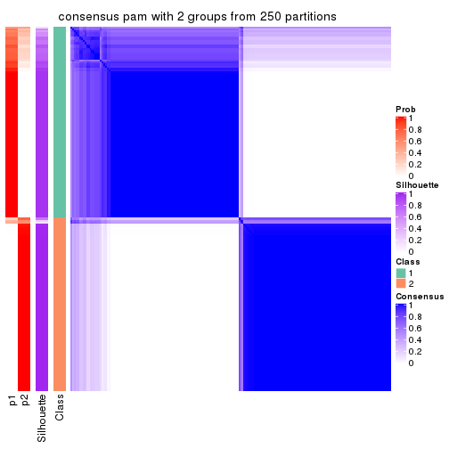</p>

</div>
<div id='tab-SD-pam-consensus-heatmap-2'>
<pre><code class="r">consensus_heatmap(res, k = 3)
</code></pre>

<p>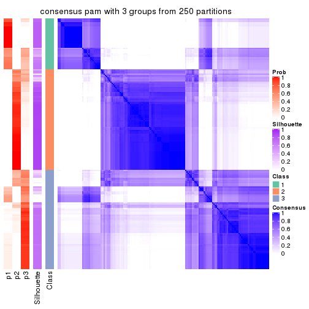</p>

</div>
<div id='tab-SD-pam-consensus-heatmap-3'>
<pre><code class="r">consensus_heatmap(res, k = 4)
</code></pre>

<p>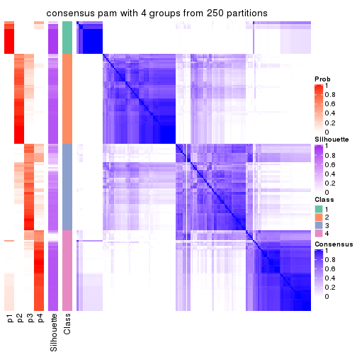</p>

</div>
<div id='tab-SD-pam-consensus-heatmap-4'>
<pre><code class="r">consensus_heatmap(res, k = 5)
</code></pre>

<p>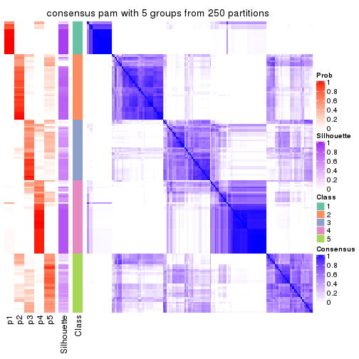</p>

</div>
<div id='tab-SD-pam-consensus-heatmap-5'>
<pre><code class="r">consensus_heatmap(res, k = 6)
</code></pre>

<p>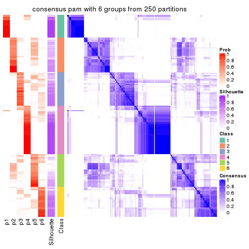</p>

</div>
</div>

Heatmaps for the membership of samples in all partitions to see how consistent they are:


<script>
$( function() {
	$( '#tabs-SD-pam-membership-heatmap' ).tabs();
} );
</script>
<div id='tabs-SD-pam-membership-heatmap'>
<ul>
<li><a href='#tab-SD-pam-membership-heatmap-1'>k = 2</a></li>
<li><a href='#tab-SD-pam-membership-heatmap-2'>k = 3</a></li>
<li><a href='#tab-SD-pam-membership-heatmap-3'>k = 4</a></li>
<li><a href='#tab-SD-pam-membership-heatmap-4'>k = 5</a></li>
<li><a href='#tab-SD-pam-membership-heatmap-5'>k = 6</a></li>
</ul>
<div id='tab-SD-pam-membership-heatmap-1'>
<pre><code class="r">membership_heatmap(res, k = 2)
</code></pre>

<p>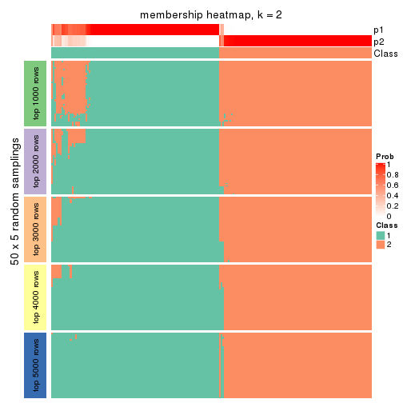</p>

</div>
<div id='tab-SD-pam-membership-heatmap-2'>
<pre><code class="r">membership_heatmap(res, k = 3)
</code></pre>

<p>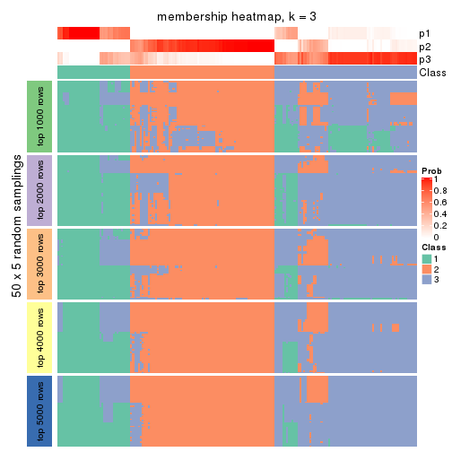</p>

</div>
<div id='tab-SD-pam-membership-heatmap-3'>
<pre><code class="r">membership_heatmap(res, k = 4)
</code></pre>

<p>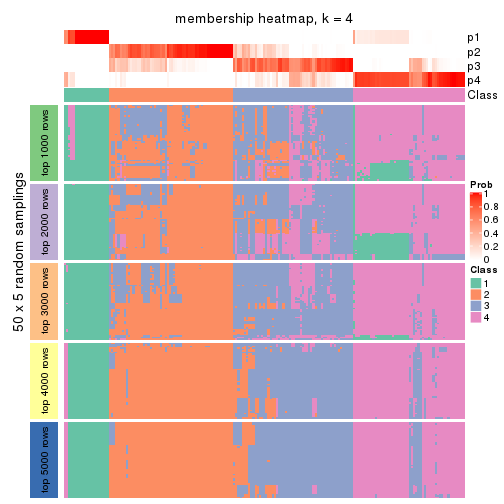</p>

</div>
<div id='tab-SD-pam-membership-heatmap-4'>
<pre><code class="r">membership_heatmap(res, k = 5)
</code></pre>

<p>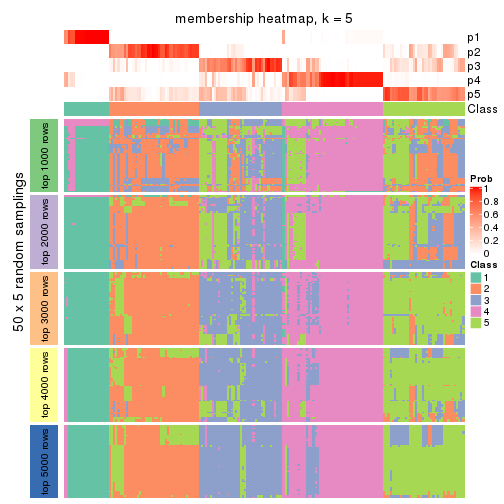</p>

</div>
<div id='tab-SD-pam-membership-heatmap-5'>
<pre><code class="r">membership_heatmap(res, k = 6)
</code></pre>

<p>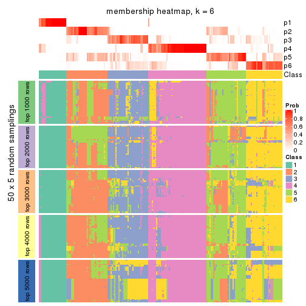</p>

</div>
</div>

As soon as we have had the classes for columns, we can look for signatures
which are significantly different between classes which can be candidate marks
for certain classes. Following are the heatmaps for signatures.


Signature heatmaps where rows are scaled:


<script>
$( function() {
	$( '#tabs-SD-pam-get-signatures' ).tabs();
} );
</script>
<div id='tabs-SD-pam-get-signatures'>
<ul>
<li><a href='#tab-SD-pam-get-signatures-1'>k = 2</a></li>
<li><a href='#tab-SD-pam-get-signatures-2'>k = 3</a></li>
<li><a href='#tab-SD-pam-get-signatures-3'>k = 4</a></li>
<li><a href='#tab-SD-pam-get-signatures-4'>k = 5</a></li>
<li><a href='#tab-SD-pam-get-signatures-5'>k = 6</a></li>
</ul>
<div id='tab-SD-pam-get-signatures-1'>
<pre><code class="r">get_signatures(res, k = 2)
</code></pre>

<p>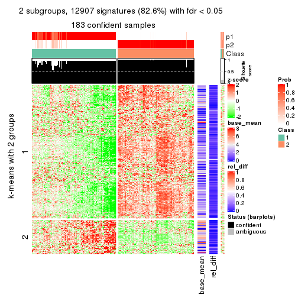</p>

</div>
<div id='tab-SD-pam-get-signatures-2'>
<pre><code class="r">get_signatures(res, k = 3)
</code></pre>

<p>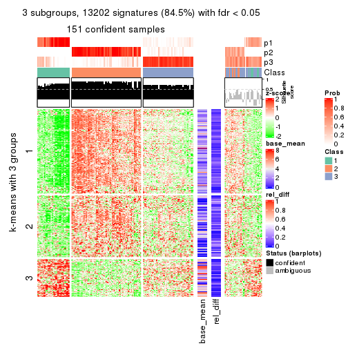</p>

</div>
<div id='tab-SD-pam-get-signatures-3'>
<pre><code class="r">get_signatures(res, k = 4)
</code></pre>

<p>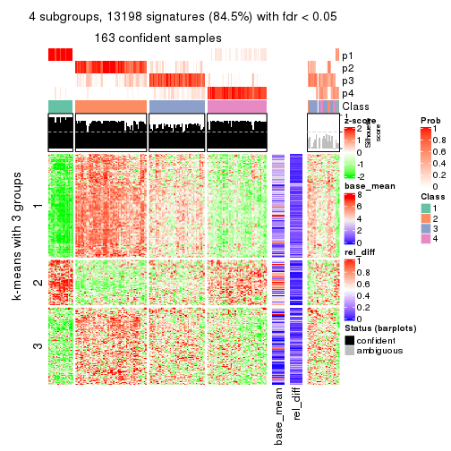</p>

</div>
<div id='tab-SD-pam-get-signatures-4'>
<pre><code class="r">get_signatures(res, k = 5)
</code></pre>

<p>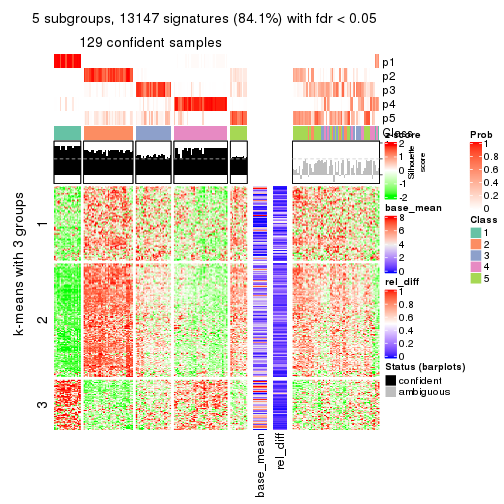</p>

</div>
<div id='tab-SD-pam-get-signatures-5'>
<pre><code class="r">get_signatures(res, k = 6)
</code></pre>

<p>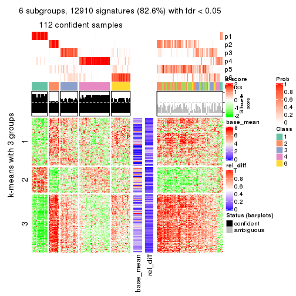</p>

</div>
</div>


Signature heatmaps where rows are not scaled:


<script>
$( function() {
	$( '#tabs-SD-pam-get-signatures-no-scale' ).tabs();
} );
</script>
<div id='tabs-SD-pam-get-signatures-no-scale'>
<ul>
<li><a href='#tab-SD-pam-get-signatures-no-scale-1'>k = 2</a></li>
<li><a href='#tab-SD-pam-get-signatures-no-scale-2'>k = 3</a></li>
<li><a href='#tab-SD-pam-get-signatures-no-scale-3'>k = 4</a></li>
<li><a href='#tab-SD-pam-get-signatures-no-scale-4'>k = 5</a></li>
<li><a href='#tab-SD-pam-get-signatures-no-scale-5'>k = 6</a></li>
</ul>
<div id='tab-SD-pam-get-signatures-no-scale-1'>
<pre><code class="r">get_signatures(res, k = 2, scale_rows = FALSE)
</code></pre>

<p>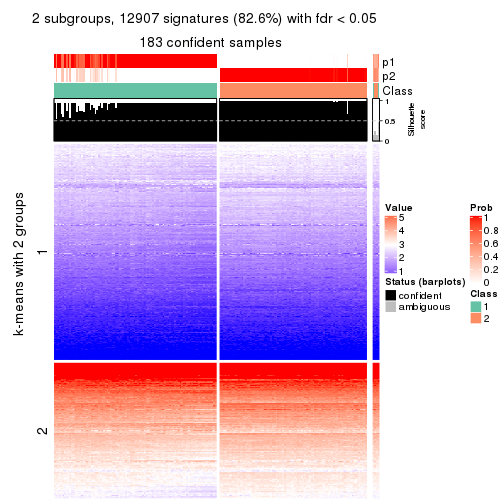</p>

</div>
<div id='tab-SD-pam-get-signatures-no-scale-2'>
<pre><code class="r">get_signatures(res, k = 3, scale_rows = FALSE)
</code></pre>

<p>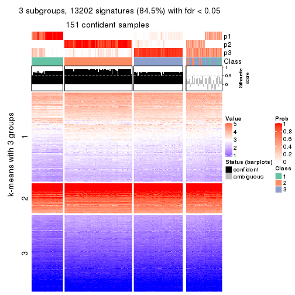</p>

</div>
<div id='tab-SD-pam-get-signatures-no-scale-3'>
<pre><code class="r">get_signatures(res, k = 4, scale_rows = FALSE)
</code></pre>

<p>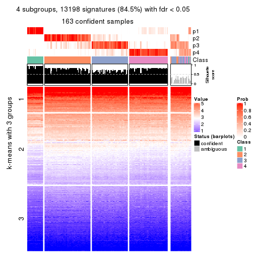</p>

</div>
<div id='tab-SD-pam-get-signatures-no-scale-4'>
<pre><code class="r">get_signatures(res, k = 5, scale_rows = FALSE)
</code></pre>

<p>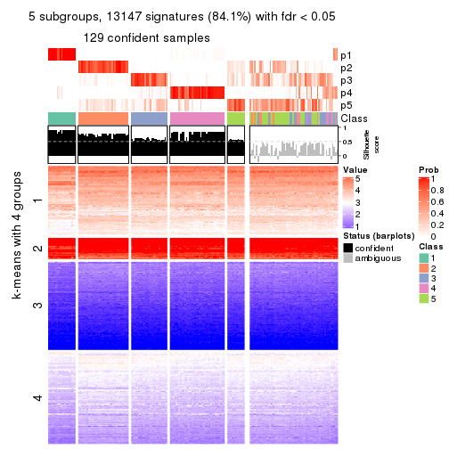</p>

</div>
<div id='tab-SD-pam-get-signatures-no-scale-5'>
<pre><code class="r">get_signatures(res, k = 6, scale_rows = FALSE)
</code></pre>

<p>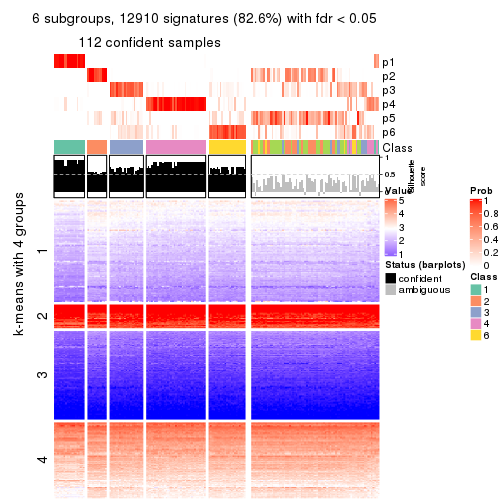</p>

</div>
</div>


Compare the overlap of signatures from different k:

```r
compare_signatures(res)
```

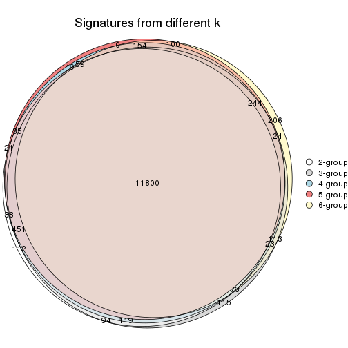

`get_signature()` returns a data frame invisibly. TO get the list of signatures, the function
call should be assigned to a variable explicitly. In following code, if `plot` argument is set
to `FALSE`, no heatmap is plotted while only the differential analysis is performed.

```r
# code only for demonstration
tb = get_signature(res, k = ..., plot = FALSE)
```

An example of the output of `tb` is:

```
#>   which_row         fdr    mean_1    mean_2 scaled_mean_1 scaled_mean_2 km
#> 1        38 0.042760348  8.373488  9.131774    -0.5533452     0.5164555  1
#> 2        40 0.018707592  7.106213  8.469186    -0.6173731     0.5762149  1
#> 3        55 0.019134737 10.221463 11.207825    -0.6159697     0.5749050  1
#> 4        59 0.006059896  5.921854  7.869574    -0.6899429     0.6439467  1
#> 5        60 0.018055526  8.928898 10.211722    -0.6204761     0.5791110  1
#> 6        98 0.009384629 15.714769 14.887706     0.6635654    -0.6193277  2
...
```

The columns in `tb` are:

1. `which_row`: row indices corresponding to the input matrix.
2. `fdr`: FDR for the differential test. 
3. `mean_x`: The mean value in group x.
4. `scaled_mean_x`: The mean value in group x after rows are scaled.
5. `km`: Row groups if k-means clustering is applied to rows.


UMAP plot which shows how samples are separated.


<script>
$( function() {
	$( '#tabs-SD-pam-dimension-reduction' ).tabs();
} );
</script>
<div id='tabs-SD-pam-dimension-reduction'>
<ul>
<li><a href='#tab-SD-pam-dimension-reduction-1'>k = 2</a></li>
<li><a href='#tab-SD-pam-dimension-reduction-2'>k = 3</a></li>
<li><a href='#tab-SD-pam-dimension-reduction-3'>k = 4</a></li>
<li><a href='#tab-SD-pam-dimension-reduction-4'>k = 5</a></li>
<li><a href='#tab-SD-pam-dimension-reduction-5'>k = 6</a></li>
</ul>
<div id='tab-SD-pam-dimension-reduction-1'>
<pre><code class="r">dimension_reduction(res, k = 2, method = &quot;UMAP&quot;)
</code></pre>

<p>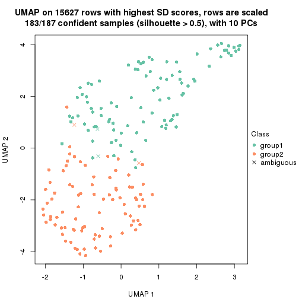</p>

</div>
<div id='tab-SD-pam-dimension-reduction-2'>
<pre><code class="r">dimension_reduction(res, k = 3, method = &quot;UMAP&quot;)
</code></pre>

<p>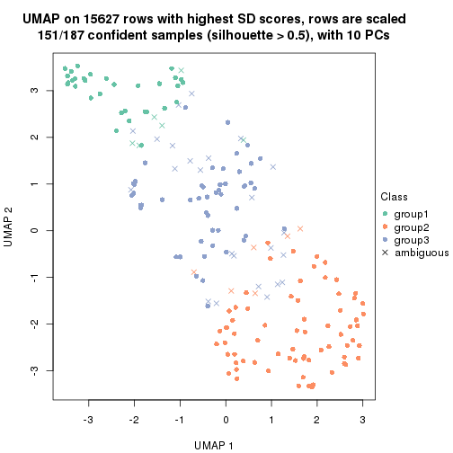</p>

</div>
<div id='tab-SD-pam-dimension-reduction-3'>
<pre><code class="r">dimension_reduction(res, k = 4, method = &quot;UMAP&quot;)
</code></pre>

<p>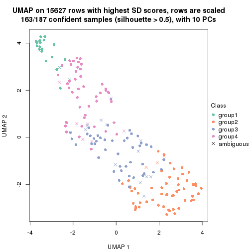</p>

</div>
<div id='tab-SD-pam-dimension-reduction-4'>
<pre><code class="r">dimension_reduction(res, k = 5, method = &quot;UMAP&quot;)
</code></pre>

<p>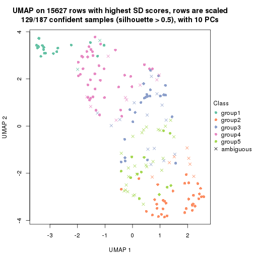</p>

</div>
<div id='tab-SD-pam-dimension-reduction-5'>
<pre><code class="r">dimension_reduction(res, k = 6, method = &quot;UMAP&quot;)
</code></pre>

<p>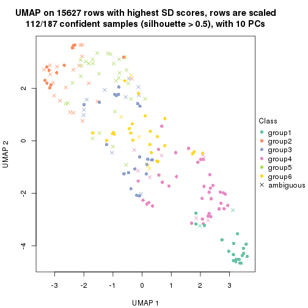</p>

</div>
</div>


Following heatmap shows how subgroups are split when increasing `k`:

```r
collect_classes(res)
```

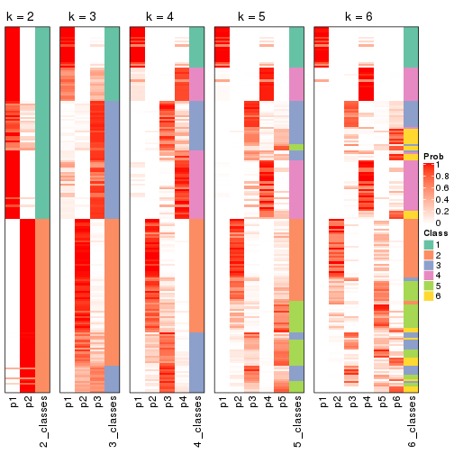


If matrix rows can be associated to genes, consider to use `GO_Enrichment(res,
...)` to perform function enrichment for the signature genes.


 

---------------------------------------------------


### SD:mclust


The object with results only for a single top-value method and a single partition method 
can be extracted as:

```r
res = res_list["SD", "mclust"]
# you can also extract it by
# res = res_list["SD:mclust"]
```

A summary of `res` and all the functions that can be applied to it:

```r
res
```

```
#> A 'ConsensusPartition' object with k = 2, 3, 4, 5, 6.
#>   On a matrix with 15627 rows and 187 columns.
#>   Top rows (1000, 2000, 3000, 4000, 5000) are extracted by 'SD' method.
#>   Subgroups are detected by 'mclust' method.
#>   Performed in total 1250 partitions by row resampling.
#>   Best k for subgroups seems to be 4.
#> 
#> Following methods can be applied to this 'ConsensusPartition' object:
#>  [1] "cola_report"             "collect_classes"         "collect_plots"          
#>  [4] "collect_stats"           "colnames"                "compare_signatures"     
#>  [7] "consensus_heatmap"       "dimension_reduction"     "functional_enrichment"  
#> [10] "get_anno_col"            "get_anno"                "get_classes"            
#> [13] "get_consensus"           "get_matrix"              "get_membership"         
#> [16] "get_param"               "get_signatures"          "get_stats"              
#> [19] "is_best_k"               "is_stable_k"             "membership_heatmap"     
#> [22] "ncol"                    "nrow"                    "plot_ecdf"              
#> [25] "rownames"                "select_partition_number" "show"                   
#> [28] "suggest_best_k"          "test_to_known_factors"
```

`collect_plots()` function collects all the plots made from `res` for all `k` (number of partitions)
into one single page to provide an easy and fast comparison between different `k`.

```r
collect_plots(res)
```

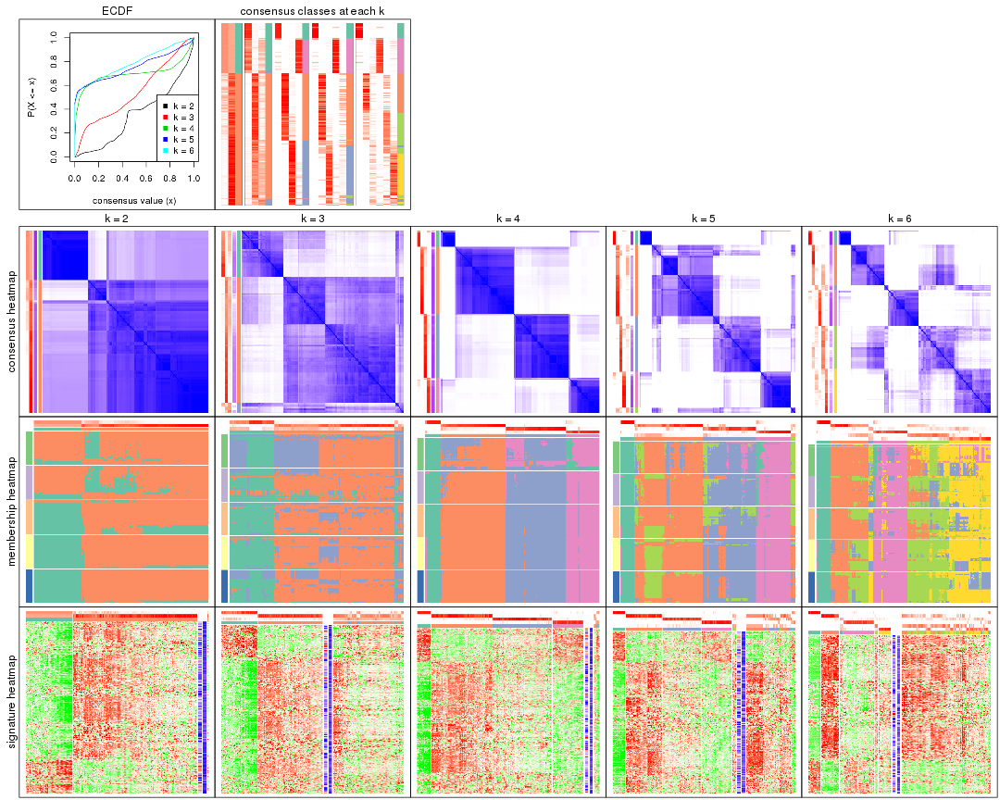

The plots are:

- The first row: a plot of the ECDF (Empirical cumulative distribution
  function) curves of the consensus matrix for each `k` and the heatmap of
  predicted classes for each `k`.
- The second row: heatmaps of the consensus matrix for each `k`.
- The third row: heatmaps of the membership matrix for each `k`.
- The fouth row: heatmaps of the signatures for each `k`.

All the plots in panels can be made by individual functions and they are
plotted later in this section.

`select_partition_number()` produces several plots showing different
statistics for choosing "optimized" `k`. There are following statistics:

- ECDF curves of the consensus matrix for each `k`;
- 1-PAC. [The PAC
  score](https://en.wikipedia.org/wiki/Consensus_clustering#Over-interpretation_potential_of_consensus_clustering)
  measures the proportion of the ambiguous subgrouping.
- Mean silhouette score.
- Concordance. The mean probability of fiting the consensus class ids in all
  partitions.
- Area increased. Denote $A_k$ as the area under the ECDF curve for current
  `k`, the area increased is defined as $A_k - A_{k-1}$.
- Rand index. The percent of pairs of samples that are both in a same cluster
  or both are not in a same cluster in the partition of k and k-1.
- Jaccard index. The ratio of pairs of samples are both in a same cluster in
  the partition of k and k-1 and the pairs of samples are both in a same
  cluster in the partition k or k-1.

The detailed explanations of these statistics can be found in [the cola
vignette](http://bioconductor.org/packages/devel/bioc/vignettes/cola/inst/doc/cola.html#toc_13).

Generally speaking, lower PAC score, higher mean silhouette score or higher
concordance corresponds to better partition. Rand index and Jaccard index
measure how similar the current partition is compared to partition with `k-1`.
If they are too similar, we won't accept `k` is better than `k-1`.

```r
select_partition_number(res)
```

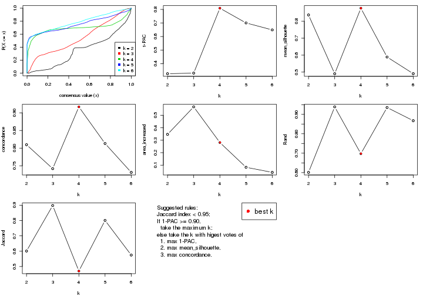

The numeric values for all these statistics can be obtained by `get_stats()`.

```r
get_stats(res)
```

```
#>   k 1-PAC mean_silhouette concordance area_increased  Rand Jaccard
#> 2 2 0.326           0.837       0.810         0.3469 0.601   0.601
#> 3 3 0.330           0.491       0.742         0.5673 0.939   0.898
#> 4 4 0.809           0.877       0.917         0.2814 0.697   0.471
#> 5 5 0.700           0.589       0.813         0.0829 0.935   0.801
#> 6 6 0.649           0.491       0.731         0.0421 0.867   0.575
```

`suggest_best_k()` suggests the best $k$ based on these statistics. The rules are as follows:

- All $k$ with Jaccard index larger than 0.95 are removed because the increase of
  the partition number does not provides enough extra information. If all $k$ are removed,
  the best $k$ is assigned by `NA`.
- For $k$ with 1-PAC larger than 0.9, the maximal $k$ is taken as the "best k". Other $k$ is called "optional k".
- If it does not fit the second rule. The $k$ with the highest vote of highest
  1-PAC, mean silhouette and concordance is taken as the "best k".

```r
suggest_best_k(res)
```

```
#> [1] 4
```


Following shows the table of the partitions (You need to click the **show/hide
code output** link to see it). The membership matrix (columns with name `p*`)
is inferred by
[`clue::cl_consensus()`](https://www.rdocumentation.org/link/cl_consensus?package=clue)
function with the `SE` method. Basically the value in the membership matrix
represents the probability to belong to a certain group. The finall class
label for an item is determined with the group with highest probability it
belongs to.

In `get_classes()` function, the entropy is calculated from the membership
matrix and the silhouette score is calculated from the consensus matrix.


<script>
$( function() {
	$( '#tabs-SD-mclust-get-classes' ).tabs();
} );
</script>
<div id='tabs-SD-mclust-get-classes'>
<ul>
<li><a href='#tab-SD-mclust-get-classes-1'>k = 2</a></li>
<li><a href='#tab-SD-mclust-get-classes-2'>k = 3</a></li>
<li><a href='#tab-SD-mclust-get-classes-3'>k = 4</a></li>
<li><a href='#tab-SD-mclust-get-classes-4'>k = 5</a></li>
<li><a href='#tab-SD-mclust-get-classes-5'>k = 6</a></li>
</ul>

<div id='tab-SD-mclust-get-classes-1'>
<p><a id='tab-SD-mclust-get-classes-1-a' style='color:#0366d6' href='#'>show/hide code output</a></p>
<pre><code class="r">cbind(get_classes(res, k = 2), get_membership(res, k = 2))
</code></pre>

<pre><code>#&gt;            class entropy silhouette    p1    p2
#&gt; SRR1747213     1  0.9909      0.941 0.556 0.444
#&gt; SRR1747214     1  0.9909      0.990 0.556 0.444
#&gt; SRR1747215     2  0.7219      0.779 0.200 0.800
#&gt; SRR1747216     2  0.7815      0.761 0.232 0.768
#&gt; SRR1747217     2  0.0000      0.825 0.000 1.000
#&gt; SRR1747218     2  0.2043      0.837 0.032 0.968
#&gt; SRR1747219     2  0.1633      0.825 0.024 0.976
#&gt; SRR1747220     1  0.9815      0.959 0.580 0.420
#&gt; SRR1747221     1  0.9909      0.990 0.556 0.444
#&gt; SRR1747222     1  0.9909      0.990 0.556 0.444
#&gt; SRR1747223     1  0.9909      0.990 0.556 0.444
#&gt; SRR1747224     2  0.2603      0.838 0.044 0.956
#&gt; SRR1747225     2  0.2778      0.837 0.048 0.952
#&gt; SRR1747226     2  0.9580      0.589 0.380 0.620
#&gt; SRR1747227     2  0.6048      0.797 0.148 0.852
#&gt; SRR1747228     2  0.1843      0.824 0.028 0.972
#&gt; SRR1747229     2  0.8386      0.714 0.268 0.732
#&gt; SRR1747230     1  0.9909      0.990 0.556 0.444
#&gt; SRR1747231     1  0.9833      0.964 0.576 0.424
#&gt; SRR1747232     1  0.9896      0.987 0.560 0.440
#&gt; SRR1747233     1  0.9909      0.990 0.556 0.444
#&gt; SRR1747234     2  0.0000      0.825 0.000 1.000
#&gt; SRR1747235     1  0.9922      0.987 0.552 0.448
#&gt; SRR1747236     2  0.0672      0.830 0.008 0.992
#&gt; SRR1747237     2  0.4562      0.829 0.096 0.904
#&gt; SRR1747238     2  0.0376      0.828 0.004 0.996
#&gt; SRR1747239     2  0.7883      0.744 0.236 0.764
#&gt; SRR1747240     1  0.9881      0.984 0.564 0.436
#&gt; SRR1747241     2  0.0000      0.825 0.000 1.000
#&gt; SRR1747242     1  0.9909      0.990 0.556 0.444
#&gt; SRR1747243     1  0.9963      0.962 0.536 0.464
#&gt; SRR1747244     2  0.0672      0.830 0.008 0.992
#&gt; SRR1747245     2  0.1633      0.836 0.024 0.976
#&gt; SRR1747246     2  0.9661      0.580 0.392 0.608
#&gt; SRR1747247     1  0.9909      0.990 0.556 0.444
#&gt; SRR1747248     1  0.9909      0.990 0.556 0.444
#&gt; SRR1747249     1  0.9896      0.987 0.560 0.440
#&gt; SRR1747250     2  0.1843      0.824 0.028 0.972
#&gt; SRR1747252     1  0.9866      0.968 0.568 0.432
#&gt; SRR1747253     1  0.9909      0.990 0.556 0.444
#&gt; SRR1747254     2  0.6531      0.798 0.168 0.832
#&gt; SRR1747255     1  0.9909      0.990 0.556 0.444
#&gt; SRR1747256     1  0.9909      0.990 0.556 0.444
#&gt; SRR1747257     2  0.6247      0.803 0.156 0.844
#&gt; SRR1747258     2  0.2236      0.829 0.036 0.964
#&gt; SRR1747259     2  0.3114      0.835 0.056 0.944
#&gt; SRR1747260     2  0.0000      0.825 0.000 1.000
#&gt; SRR1747261     2  0.2043      0.837 0.032 0.968
#&gt; SRR1747262     2  0.4939      0.830 0.108 0.892
#&gt; SRR1747263     2  0.4298      0.828 0.088 0.912
#&gt; SRR1747264     1  0.9909      0.990 0.556 0.444
#&gt; SRR1747265     2  0.1843      0.824 0.028 0.972
#&gt; SRR1747266     2  0.2236      0.832 0.036 0.964
#&gt; SRR1747267     2  0.1843      0.824 0.028 0.972
#&gt; SRR1747268     2  0.0672      0.824 0.008 0.992
#&gt; SRR1747269     2  0.1633      0.836 0.024 0.976
#&gt; SRR1747270     2  0.5059      0.829 0.112 0.888
#&gt; SRR1747271     2  0.4161      0.835 0.084 0.916
#&gt; SRR1747272     2  0.0000      0.825 0.000 1.000
#&gt; SRR1747273     1  0.9922      0.987 0.552 0.448
#&gt; SRR1747274     2  0.2603      0.838 0.044 0.956
#&gt; SRR1747275     1  0.9909      0.990 0.556 0.444
#&gt; SRR1747276     1  0.9909      0.990 0.556 0.444
#&gt; SRR1747277     2  0.1184      0.833 0.016 0.984
#&gt; SRR1747278     2  0.0376      0.823 0.004 0.996
#&gt; SRR1747280     1  0.9909      0.990 0.556 0.444
#&gt; SRR1747279     1  0.9866      0.979 0.568 0.432
#&gt; SRR1747281     2  0.6887      0.797 0.184 0.816
#&gt; SRR1747282     1  0.9909      0.990 0.556 0.444
#&gt; SRR1747283     2  0.0000      0.825 0.000 1.000
#&gt; SRR1747284     1  0.9922      0.987 0.552 0.448
#&gt; SRR1747285     2  0.1414      0.835 0.020 0.980
#&gt; SRR1747286     2  0.0000      0.825 0.000 1.000
#&gt; SRR1747287     2  0.6887      0.796 0.184 0.816
#&gt; SRR1747288     2  0.1843      0.824 0.028 0.972
#&gt; SRR1747290     2  0.3114      0.837 0.056 0.944
#&gt; SRR1747289     2  0.1633      0.836 0.024 0.976
#&gt; SRR1747291     2  0.4815      0.829 0.104 0.896
#&gt; SRR1747293     2  0.2236      0.829 0.036 0.964
#&gt; SRR1747294     2  0.4022      0.829 0.080 0.920
#&gt; SRR1747292     1  0.9909      0.990 0.556 0.444
#&gt; SRR1747295     2  0.2043      0.838 0.032 0.968
#&gt; SRR1747296     2  0.0672      0.829 0.008 0.992
#&gt; SRR1747297     2  0.7139      0.789 0.196 0.804
#&gt; SRR1747298     2  0.7376      0.776 0.208 0.792
#&gt; SRR1747299     2  0.9087      0.653 0.324 0.676
#&gt; SRR1747300     2  0.9775      0.556 0.412 0.588
#&gt; SRR1747301     2  0.8909      0.661 0.308 0.692
#&gt; SRR1747302     2  0.9795      0.552 0.416 0.584
#&gt; SRR1747303     2  0.7219      0.782 0.200 0.800
#&gt; SRR1747304     1  0.9909      0.990 0.556 0.444
#&gt; SRR1747305     2  0.7602      0.770 0.220 0.780
#&gt; SRR1747306     2  0.7376      0.775 0.208 0.792
#&gt; SRR1747307     2  0.0000      0.825 0.000 1.000
#&gt; SRR1747308     2  0.2778      0.838 0.048 0.952
#&gt; SRR1747309     1  0.9944      0.956 0.544 0.456
#&gt; SRR1747310     1  0.9850      0.975 0.572 0.428
#&gt; SRR1747311     2  0.1184      0.825 0.016 0.984
#&gt; SRR1747313     2  0.0376      0.823 0.004 0.996
#&gt; SRR1747312     1  0.9909      0.990 0.556 0.444
#&gt; SRR1747314     1  0.9909      0.990 0.556 0.444
#&gt; SRR1747315     2  0.4562      0.834 0.096 0.904
#&gt; SRR1747316     2  0.2603      0.832 0.044 0.956
#&gt; SRR1747318     2  0.0672      0.826 0.008 0.992
#&gt; SRR1747317     2  0.0376      0.823 0.004 0.996
#&gt; SRR1747319     2  0.0376      0.826 0.004 0.996
#&gt; SRR1747320     1  0.9909      0.990 0.556 0.444
#&gt; SRR1747322     1  0.9909      0.990 0.556 0.444
#&gt; SRR1747321     1  0.9909      0.990 0.556 0.444
#&gt; SRR1747323     2  0.9732      0.566 0.404 0.596
#&gt; SRR1747324     2  0.5294      0.823 0.120 0.880
#&gt; SRR1747326     2  0.4022      0.836 0.080 0.920
#&gt; SRR1747325     2  0.6623      0.792 0.172 0.828
#&gt; SRR1747327     2  0.7453      0.776 0.212 0.788
#&gt; SRR1747328     2  0.1843      0.824 0.028 0.972
#&gt; SRR1747330     2  0.4939      0.637 0.108 0.892
#&gt; SRR1747329     2  0.0000      0.825 0.000 1.000
#&gt; SRR1747332     2  0.3114      0.794 0.056 0.944
#&gt; SRR1747331     2  0.2603      0.832 0.044 0.956
#&gt; SRR1747333     2  0.0376      0.828 0.004 0.996
#&gt; SRR1747334     2  0.9393      0.612 0.356 0.644
#&gt; SRR1747335     2  0.1843      0.824 0.028 0.972
#&gt; SRR1747336     1  0.9833      0.970 0.576 0.424
#&gt; SRR1747337     2  0.9775      0.557 0.412 0.588
#&gt; SRR1747338     2  0.9795      0.552 0.416 0.584
#&gt; SRR1747339     2  0.0000      0.825 0.000 1.000
#&gt; SRR1747340     2  0.1414      0.835 0.020 0.980
#&gt; SRR1747341     2  0.8861      0.670 0.304 0.696
#&gt; SRR1747342     2  0.7950      0.739 0.240 0.760
#&gt; SRR1747343     2  0.9686      0.575 0.396 0.604
#&gt; SRR1747344     2  0.6148      0.806 0.152 0.848
#&gt; SRR1747345     2  0.0938      0.826 0.012 0.988
#&gt; SRR1747346     2  0.0000      0.825 0.000 1.000
#&gt; SRR1747347     2  0.5178      0.814 0.116 0.884
#&gt; SRR1747348     1  0.9909      0.990 0.556 0.444
#&gt; SRR1747349     1  0.9881      0.984 0.564 0.436
#&gt; SRR1747351     2  0.8267      0.721 0.260 0.740
#&gt; SRR1747350     2  0.6887      0.796 0.184 0.816
#&gt; SRR1747352     1  0.9896      0.987 0.560 0.440
#&gt; SRR1747353     2  0.6801      0.797 0.180 0.820
#&gt; SRR1747354     2  0.3733      0.834 0.072 0.928
#&gt; SRR1747355     2  0.6712      0.519 0.176 0.824
#&gt; SRR1747356     2  0.2236      0.829 0.036 0.964
#&gt; SRR1747357     2  0.1633      0.828 0.024 0.976
#&gt; SRR1747358     2  0.0000      0.825 0.000 1.000
#&gt; SRR1747359     1  0.9881      0.984 0.564 0.436
#&gt; SRR1747360     2  0.6247      0.813 0.156 0.844
#&gt; SRR1747361     2  0.1843      0.824 0.028 0.972
#&gt; SRR1747362     2  0.7056      0.786 0.192 0.808
#&gt; SRR1747363     2  0.0000      0.825 0.000 1.000
#&gt; SRR1747364     1  0.9933      0.982 0.548 0.452
#&gt; SRR1747365     2  0.0000      0.825 0.000 1.000
#&gt; SRR1747366     2  0.4562      0.833 0.096 0.904
#&gt; SRR1747367     2  0.0000      0.825 0.000 1.000
#&gt; SRR1747369     2  0.7299      0.772 0.204 0.796
#&gt; SRR1747368     2  0.0000      0.825 0.000 1.000
#&gt; SRR1747370     2  0.2236      0.838 0.036 0.964
#&gt; SRR1747372     1  0.9909      0.990 0.556 0.444
#&gt; SRR1747371     1  0.9909      0.990 0.556 0.444
#&gt; SRR1747373     2  0.9775      0.557 0.412 0.588
#&gt; SRR1747374     2  0.8608      0.696 0.284 0.716
#&gt; SRR1747375     2  0.7674      0.218 0.224 0.776
#&gt; SRR1747376     2  0.7056      0.782 0.192 0.808
#&gt; SRR1747377     2  0.9661      0.581 0.392 0.608
#&gt; SRR1747378     2  0.4161      0.833 0.084 0.916
#&gt; SRR1747379     2  0.4022      0.836 0.080 0.920
#&gt; SRR1747380     2  0.0000      0.825 0.000 1.000
#&gt; SRR1747381     1  0.9909      0.990 0.556 0.444
#&gt; SRR1747382     1  0.9922      0.987 0.552 0.448
#&gt; SRR1747383     2  0.9427      0.611 0.360 0.640
#&gt; SRR1747384     2  0.0000      0.825 0.000 1.000
#&gt; SRR1747385     2  0.0376      0.823 0.004 0.996
#&gt; SRR1747386     1  0.9909      0.990 0.556 0.444
#&gt; SRR1747387     2  0.6887      0.792 0.184 0.816
#&gt; SRR1747388     2  0.7056      0.779 0.192 0.808
#&gt; SRR1747390     2  0.3114      0.836 0.056 0.944
#&gt; SRR1747389     2  0.4815      0.831 0.104 0.896
#&gt; SRR1747391     2  0.0000      0.825 0.000 1.000
#&gt; SRR1747392     2  0.4939      0.827 0.108 0.892
#&gt; SRR1747393     2  0.2778      0.838 0.048 0.952
#&gt; SRR1747394     2  0.0672      0.826 0.008 0.992
#&gt; SRR1747395     2  0.0376      0.823 0.004 0.996
#&gt; SRR1747396     2  0.9460      0.604 0.364 0.636
#&gt; SRR1747398     2  0.5408      0.815 0.124 0.876
#&gt; SRR1747397     2  0.0376      0.823 0.004 0.996
#&gt; SRR1747399     1  0.9909      0.990 0.556 0.444
#&gt; SRR1747400     1  0.9850      0.964 0.572 0.428
</code></pre>

<script>
$('#tab-SD-mclust-get-classes-1-a').parent().next().next().hide();
$('#tab-SD-mclust-get-classes-1-a').click(function(){
  $('#tab-SD-mclust-get-classes-1-a').parent().next().next().toggle();
  return(false);
});
</script>
</div>

<div id='tab-SD-mclust-get-classes-2'>
<p><a id='tab-SD-mclust-get-classes-2-a' style='color:#0366d6' href='#'>show/hide code output</a></p>
<pre><code class="r">cbind(get_classes(res, k = 3), get_membership(res, k = 3))
</code></pre>

<pre><code>#&gt;            class entropy silhouette    p1    p2    p3
#&gt; SRR1747213     3   0.913     0.0469 0.356 0.152 0.492
#&gt; SRR1747214     1   0.660     0.5635 0.604 0.012 0.384
#&gt; SRR1747215     2   0.497     0.4737 0.000 0.764 0.236
#&gt; SRR1747216     2   0.141     0.6507 0.000 0.964 0.036
#&gt; SRR1747217     2   0.760     0.2382 0.048 0.568 0.384
#&gt; SRR1747218     2   0.313     0.6491 0.032 0.916 0.052
#&gt; SRR1747219     2   0.764     0.1034 0.044 0.520 0.436
#&gt; SRR1747220     3   0.791    -0.3660 0.444 0.056 0.500
#&gt; SRR1747221     1   0.841     0.3389 0.544 0.096 0.360
#&gt; SRR1747222     1   0.738     0.5733 0.628 0.052 0.320
#&gt; SRR1747223     1   0.752     0.4702 0.588 0.048 0.364
#&gt; SRR1747224     2   0.718     0.2967 0.032 0.592 0.376
#&gt; SRR1747225     2   0.300     0.6503 0.016 0.916 0.068
#&gt; SRR1747226     2   0.196     0.6428 0.000 0.944 0.056
#&gt; SRR1747227     2   0.708     0.3509 0.044 0.652 0.304
#&gt; SRR1747228     2   0.764     0.3533 0.052 0.576 0.372
#&gt; SRR1747229     2   0.364     0.6358 0.004 0.872 0.124
#&gt; SRR1747230     1   0.206     0.6924 0.948 0.044 0.008
#&gt; SRR1747231     1   0.758     0.5520 0.572 0.048 0.380
#&gt; SRR1747232     1   0.212     0.6934 0.948 0.040 0.012
#&gt; SRR1747233     1   0.691     0.5571 0.628 0.028 0.344
#&gt; SRR1747234     3   0.767     0.0107 0.044 0.472 0.484
#&gt; SRR1747235     1   0.649     0.5797 0.628 0.012 0.360
#&gt; SRR1747236     2   0.406     0.6437 0.044 0.880 0.076
#&gt; SRR1747237     2   0.599     0.4096 0.012 0.704 0.284
#&gt; SRR1747238     2   0.441     0.6401 0.036 0.860 0.104
#&gt; SRR1747239     2   0.186     0.6507 0.000 0.948 0.052
#&gt; SRR1747240     1   0.212     0.6920 0.948 0.040 0.012
#&gt; SRR1747241     3   0.756     0.1752 0.044 0.400 0.556
#&gt; SRR1747242     1   0.255     0.6827 0.932 0.012 0.056
#&gt; SRR1747243     1   0.816     0.3192 0.516 0.072 0.412
#&gt; SRR1747244     2   0.699     0.4598 0.056 0.688 0.256
#&gt; SRR1747245     2   0.761     0.3079 0.052 0.584 0.364
#&gt; SRR1747246     2   0.175     0.6460 0.000 0.952 0.048
#&gt; SRR1747247     1   0.281     0.7063 0.928 0.040 0.032
#&gt; SRR1747248     1   0.188     0.6944 0.952 0.044 0.004
#&gt; SRR1747249     1   0.780     0.4687 0.552 0.056 0.392
#&gt; SRR1747250     2   0.685     0.3729 0.020 0.600 0.380
#&gt; SRR1747252     1   0.991    -0.2763 0.372 0.268 0.360
#&gt; SRR1747253     1   0.800     0.4737 0.580 0.076 0.344
#&gt; SRR1747254     2   0.271     0.6380 0.000 0.912 0.088
#&gt; SRR1747255     1   0.680     0.5579 0.632 0.024 0.344
#&gt; SRR1747256     1   0.738     0.5638 0.628 0.052 0.320
#&gt; SRR1747257     2   0.400     0.5694 0.000 0.840 0.160
#&gt; SRR1747258     2   0.628     0.4613 0.016 0.680 0.304
#&gt; SRR1747259     2   0.679     0.3382 0.028 0.648 0.324
#&gt; SRR1747260     2   0.575     0.5507 0.040 0.780 0.180
#&gt; SRR1747261     2   0.350     0.6462 0.020 0.896 0.084
#&gt; SRR1747262     2   0.175     0.6561 0.000 0.952 0.048
#&gt; SRR1747263     2   0.706     0.3937 0.052 0.672 0.276
#&gt; SRR1747264     1   0.455     0.7122 0.840 0.020 0.140
#&gt; SRR1747265     3   0.749    -0.0451 0.036 0.480 0.484
#&gt; SRR1747266     2   0.619     0.4758 0.016 0.692 0.292
#&gt; SRR1747267     2   0.716     0.2882 0.032 0.596 0.372
#&gt; SRR1747268     2   0.820     0.1944 0.076 0.524 0.400
#&gt; SRR1747269     2   0.311     0.6536 0.028 0.916 0.056
#&gt; SRR1747270     2   0.277     0.6452 0.004 0.916 0.080
#&gt; SRR1747271     2   0.300     0.6542 0.016 0.916 0.068
#&gt; SRR1747272     2   0.767     0.2605 0.052 0.568 0.380
#&gt; SRR1747273     3   0.708    -0.3689 0.412 0.024 0.564
#&gt; SRR1747274     2   0.606     0.4887 0.016 0.708 0.276
#&gt; SRR1747275     1   0.663     0.5805 0.644 0.020 0.336
#&gt; SRR1747276     1   0.674     0.5485 0.624 0.020 0.356
#&gt; SRR1747277     2   0.711     0.3336 0.036 0.624 0.340
#&gt; SRR1747278     2   0.830     0.2042 0.084 0.532 0.384
#&gt; SRR1747280     1   0.392     0.7023 0.868 0.012 0.120
#&gt; SRR1747279     1   0.652     0.5761 0.644 0.016 0.340
#&gt; SRR1747281     2   0.175     0.6552 0.012 0.960 0.028
#&gt; SRR1747282     1   0.461     0.7156 0.844 0.028 0.128
#&gt; SRR1747283     3   0.676     0.4713 0.048 0.252 0.700
#&gt; SRR1747284     1   0.611     0.6959 0.760 0.048 0.192
#&gt; SRR1747285     2   0.663     0.4722 0.040 0.700 0.260
#&gt; SRR1747286     2   0.661     0.5009 0.048 0.716 0.236
#&gt; SRR1747287     2   0.140     0.6530 0.004 0.968 0.028
#&gt; SRR1747288     2   0.748     0.2472 0.040 0.556 0.404
#&gt; SRR1747290     2   0.264     0.6534 0.020 0.932 0.048
#&gt; SRR1747289     2   0.288     0.6532 0.024 0.924 0.052
#&gt; SRR1747291     2   0.413     0.6306 0.012 0.856 0.132
#&gt; SRR1747293     2   0.471     0.6391 0.044 0.848 0.108
#&gt; SRR1747294     2   0.654     0.3842 0.024 0.672 0.304
#&gt; SRR1747292     1   0.653     0.5869 0.660 0.020 0.320
#&gt; SRR1747295     2   0.293     0.6546 0.036 0.924 0.040
#&gt; SRR1747296     2   0.733     0.2894 0.040 0.596 0.364
#&gt; SRR1747297     2   0.255     0.6502 0.012 0.932 0.056
#&gt; SRR1747298     2   0.285     0.6405 0.012 0.920 0.068
#&gt; SRR1747299     2   0.141     0.6504 0.000 0.964 0.036
#&gt; SRR1747300     2   0.288     0.6303 0.000 0.904 0.096
#&gt; SRR1747301     2   0.435     0.5742 0.000 0.816 0.184
#&gt; SRR1747302     2   0.254     0.6334 0.000 0.920 0.080
#&gt; SRR1747303     2   0.140     0.6552 0.004 0.968 0.028
#&gt; SRR1747304     1   0.206     0.6969 0.948 0.044 0.008
#&gt; SRR1747305     2   0.375     0.5867 0.000 0.856 0.144
#&gt; SRR1747306     2   0.103     0.6507 0.000 0.976 0.024
#&gt; SRR1747307     2   0.752     0.2564 0.044 0.568 0.388
#&gt; SRR1747308     2   0.541     0.5725 0.020 0.780 0.200
#&gt; SRR1747309     1   0.895     0.2499 0.496 0.132 0.372
#&gt; SRR1747310     1   0.500     0.7147 0.832 0.044 0.124
#&gt; SRR1747311     2   0.748     0.2450 0.040 0.556 0.404
#&gt; SRR1747313     2   0.768     0.2683 0.056 0.584 0.360
#&gt; SRR1747312     1   0.164     0.6949 0.956 0.044 0.000
#&gt; SRR1747314     1   0.188     0.6966 0.952 0.044 0.004
#&gt; SRR1747315     2   0.433     0.6394 0.036 0.864 0.100
#&gt; SRR1747316     2   0.605     0.5069 0.020 0.720 0.260
#&gt; SRR1747318     2   0.748     0.2892 0.048 0.596 0.356
#&gt; SRR1747317     2   0.809     0.2457 0.080 0.572 0.348
#&gt; SRR1747319     2   0.766     0.0602 0.044 0.508 0.448
#&gt; SRR1747320     1   0.756     0.5455 0.628 0.064 0.308
#&gt; SRR1747322     1   0.117     0.6868 0.976 0.016 0.008
#&gt; SRR1747321     1   0.582     0.6804 0.744 0.020 0.236
#&gt; SRR1747323     2   0.382     0.6013 0.000 0.852 0.148
#&gt; SRR1747324     2   0.254     0.6522 0.000 0.920 0.080
#&gt; SRR1747326     2   0.379     0.6466 0.060 0.892 0.048
#&gt; SRR1747325     2   0.599     0.4279 0.016 0.716 0.268
#&gt; SRR1747327     2   0.478     0.5329 0.004 0.796 0.200
#&gt; SRR1747328     2   0.729     0.3853 0.048 0.632 0.320
#&gt; SRR1747330     2   0.849     0.0953 0.092 0.496 0.412
#&gt; SRR1747329     2   0.802     0.2847 0.068 0.544 0.388
#&gt; SRR1747332     2   0.815     0.1654 0.072 0.520 0.408
#&gt; SRR1747331     2   0.613     0.5050 0.020 0.712 0.268
#&gt; SRR1747333     2   0.484     0.6360 0.072 0.848 0.080
#&gt; SRR1747334     2   0.319     0.6210 0.000 0.888 0.112
#&gt; SRR1747335     2   0.767     0.0373 0.044 0.500 0.456
#&gt; SRR1747336     1   0.212     0.6920 0.948 0.040 0.012
#&gt; SRR1747337     2   0.280     0.6292 0.000 0.908 0.092
#&gt; SRR1747338     2   0.271     0.6313 0.000 0.912 0.088
#&gt; SRR1747339     2   0.794     0.2554 0.068 0.568 0.364
#&gt; SRR1747340     2   0.727     0.4657 0.064 0.668 0.268
#&gt; SRR1747341     2   0.514     0.4736 0.000 0.748 0.252
#&gt; SRR1747342     2   0.369     0.5964 0.000 0.860 0.140
#&gt; SRR1747343     2   0.465     0.5397 0.000 0.792 0.208
#&gt; SRR1747344     2   0.195     0.6576 0.008 0.952 0.040
#&gt; SRR1747345     2   0.797     0.2182 0.064 0.540 0.396
#&gt; SRR1747346     2   0.747     0.2979 0.052 0.612 0.336
#&gt; SRR1747347     2   0.674     0.3591 0.028 0.656 0.316
#&gt; SRR1747348     1   0.188     0.6929 0.952 0.044 0.004
#&gt; SRR1747349     1   0.520     0.7138 0.820 0.044 0.136
#&gt; SRR1747351     2   0.334     0.6158 0.000 0.880 0.120
#&gt; SRR1747350     2   0.188     0.6554 0.004 0.952 0.044
#&gt; SRR1747352     1   0.468     0.7171 0.848 0.040 0.112
#&gt; SRR1747353     2   0.164     0.6565 0.000 0.956 0.044
#&gt; SRR1747354     2   0.580     0.4896 0.008 0.712 0.280
#&gt; SRR1747355     3   0.968     0.3105 0.320 0.232 0.448
#&gt; SRR1747356     2   0.637     0.4495 0.016 0.668 0.316
#&gt; SRR1747357     2   0.650     0.4170 0.016 0.648 0.336
#&gt; SRR1747358     2   0.764     0.2631 0.052 0.576 0.372
#&gt; SRR1747359     1   0.541     0.6978 0.780 0.020 0.200
#&gt; SRR1747360     2   0.295     0.6444 0.004 0.908 0.088
#&gt; SRR1747361     2   0.812     0.2084 0.076 0.552 0.372
#&gt; SRR1747362     2   0.129     0.6555 0.000 0.968 0.032
#&gt; SRR1747363     3   0.809     0.3937 0.084 0.332 0.584
#&gt; SRR1747364     1   0.817     0.4549 0.552 0.080 0.368
#&gt; SRR1747365     3   0.709     0.4037 0.048 0.292 0.660
#&gt; SRR1747366     2   0.240     0.6538 0.004 0.932 0.064
#&gt; SRR1747367     2   0.768     0.2489 0.052 0.564 0.384
#&gt; SRR1747369     2   0.230     0.6450 0.004 0.936 0.060
#&gt; SRR1747368     2   0.750     0.2667 0.044 0.572 0.384
#&gt; SRR1747370     2   0.674     0.4284 0.028 0.656 0.316
#&gt; SRR1747372     1   0.212     0.6920 0.948 0.040 0.012
#&gt; SRR1747371     1   0.802     0.4812 0.576 0.076 0.348
#&gt; SRR1747373     2   0.280     0.6299 0.000 0.908 0.092
#&gt; SRR1747374     2   0.186     0.6444 0.000 0.948 0.052
#&gt; SRR1747375     2   0.952    -0.1945 0.192 0.440 0.368
#&gt; SRR1747376     2   0.164     0.6526 0.000 0.956 0.044
#&gt; SRR1747377     2   0.405     0.6024 0.004 0.848 0.148
#&gt; SRR1747378     2   0.300     0.6519 0.016 0.916 0.068
#&gt; SRR1747379     2   0.558     0.5249 0.012 0.748 0.240
#&gt; SRR1747380     2   0.758     0.2887 0.056 0.604 0.340
#&gt; SRR1747381     1   0.602     0.6658 0.724 0.020 0.256
#&gt; SRR1747382     1   0.554     0.7066 0.776 0.024 0.200
#&gt; SRR1747383     2   0.468     0.5637 0.004 0.804 0.192
#&gt; SRR1747384     2   0.750     0.2612 0.048 0.592 0.360
#&gt; SRR1747385     2   0.800     0.3920 0.084 0.600 0.316
#&gt; SRR1747386     1   0.145     0.6900 0.968 0.024 0.008
#&gt; SRR1747387     2   0.491     0.5481 0.012 0.804 0.184
#&gt; SRR1747388     2   0.127     0.6545 0.004 0.972 0.024
#&gt; SRR1747390     2   0.369     0.6492 0.016 0.884 0.100
#&gt; SRR1747389     2   0.230     0.6553 0.004 0.936 0.060
#&gt; SRR1747391     2   0.448     0.6453 0.064 0.864 0.072
#&gt; SRR1747392     2   0.281     0.6547 0.036 0.928 0.036
#&gt; SRR1747393     2   0.616     0.4905 0.020 0.708 0.272
#&gt; SRR1747394     2   0.777     0.2144 0.052 0.536 0.412
#&gt; SRR1747395     2   0.814     0.2648 0.084 0.572 0.344
#&gt; SRR1747396     2   0.343     0.6233 0.004 0.884 0.112
#&gt; SRR1747398     2   0.362     0.6324 0.012 0.884 0.104
#&gt; SRR1747397     2   0.755     0.2414 0.044 0.560 0.396
#&gt; SRR1747399     1   0.504     0.7131 0.832 0.048 0.120
#&gt; SRR1747400     1   0.651     0.6744 0.748 0.072 0.180
</code></pre>

<script>
$('#tab-SD-mclust-get-classes-2-a').parent().next().next().hide();
$('#tab-SD-mclust-get-classes-2-a').click(function(){
  $('#tab-SD-mclust-get-classes-2-a').parent().next().next().toggle();
  return(false);
});
</script>
</div>

<div id='tab-SD-mclust-get-classes-3'>
<p><a id='tab-SD-mclust-get-classes-3-a' style='color:#0366d6' href='#'>show/hide code output</a></p>
<pre><code class="r">cbind(get_classes(res, k = 4), get_membership(res, k = 4))
</code></pre>

<pre><code>#&gt;            class entropy silhouette    p1    p2    p3    p4
#&gt; SRR1747213     4  0.1637      0.885 0.000 0.000 0.060 0.940
#&gt; SRR1747214     4  0.1211      0.878 0.040 0.000 0.000 0.960
#&gt; SRR1747215     2  0.1022      0.919 0.000 0.968 0.032 0.000
#&gt; SRR1747216     2  0.1022      0.919 0.000 0.968 0.032 0.000
#&gt; SRR1747217     3  0.0000      0.931 0.000 0.000 1.000 0.000
#&gt; SRR1747218     3  0.1305      0.909 0.004 0.036 0.960 0.000
#&gt; SRR1747219     3  0.0707      0.930 0.000 0.000 0.980 0.020
#&gt; SRR1747220     4  0.1302      0.899 0.000 0.000 0.044 0.956
#&gt; SRR1747221     4  0.1489      0.893 0.000 0.004 0.044 0.952
#&gt; SRR1747222     4  0.1209      0.901 0.004 0.000 0.032 0.964
#&gt; SRR1747223     4  0.1576      0.889 0.000 0.004 0.048 0.948
#&gt; SRR1747224     3  0.0524      0.932 0.000 0.004 0.988 0.008
#&gt; SRR1747225     3  0.1398      0.910 0.000 0.040 0.956 0.004
#&gt; SRR1747226     2  0.0000      0.906 0.000 1.000 0.000 0.000
#&gt; SRR1747227     2  0.1474      0.923 0.000 0.948 0.052 0.000
#&gt; SRR1747228     3  0.0524      0.932 0.000 0.004 0.988 0.008
#&gt; SRR1747229     2  0.1302      0.922 0.000 0.956 0.044 0.000
#&gt; SRR1747230     1  0.0817      0.942 0.976 0.000 0.000 0.024
#&gt; SRR1747231     4  0.1388      0.888 0.028 0.000 0.012 0.960
#&gt; SRR1747232     1  0.0895      0.941 0.976 0.000 0.004 0.020
#&gt; SRR1747233     4  0.1209      0.901 0.004 0.000 0.032 0.964
#&gt; SRR1747234     3  0.1833      0.907 0.024 0.000 0.944 0.032
#&gt; SRR1747235     1  0.4661      0.482 0.652 0.000 0.000 0.348
#&gt; SRR1747236     2  0.2596      0.919 0.024 0.908 0.068 0.000
#&gt; SRR1747237     2  0.2149      0.919 0.000 0.912 0.088 0.000
#&gt; SRR1747238     3  0.2643      0.895 0.024 0.028 0.920 0.028
#&gt; SRR1747239     2  0.0707      0.915 0.000 0.980 0.020 0.000
#&gt; SRR1747240     1  0.0895      0.941 0.976 0.000 0.004 0.020
#&gt; SRR1747241     3  0.1833      0.907 0.024 0.000 0.944 0.032
#&gt; SRR1747242     1  0.1211      0.934 0.960 0.000 0.000 0.040
#&gt; SRR1747243     4  0.1743      0.881 0.000 0.004 0.056 0.940
#&gt; SRR1747244     3  0.0657      0.932 0.000 0.004 0.984 0.012
#&gt; SRR1747245     3  0.1109      0.922 0.000 0.028 0.968 0.004
#&gt; SRR1747246     2  0.0000      0.906 0.000 1.000 0.000 0.000
#&gt; SRR1747247     1  0.1211      0.934 0.960 0.000 0.000 0.040
#&gt; SRR1747248     1  0.0817      0.942 0.976 0.000 0.000 0.024
#&gt; SRR1747249     4  0.1474      0.893 0.000 0.000 0.052 0.948
#&gt; SRR1747250     3  0.0000      0.931 0.000 0.000 1.000 0.000
#&gt; SRR1747252     4  0.1474      0.893 0.000 0.000 0.052 0.948
#&gt; SRR1747253     4  0.1305      0.900 0.000 0.004 0.036 0.960
#&gt; SRR1747254     2  0.0592      0.914 0.000 0.984 0.016 0.000
#&gt; SRR1747255     4  0.1209      0.900 0.000 0.004 0.032 0.964
#&gt; SRR1747256     4  0.1305      0.901 0.004 0.000 0.036 0.960
#&gt; SRR1747257     2  0.1867      0.922 0.000 0.928 0.072 0.000
#&gt; SRR1747258     3  0.0000      0.931 0.000 0.000 1.000 0.000
#&gt; SRR1747259     2  0.2282      0.920 0.024 0.924 0.052 0.000
#&gt; SRR1747260     3  0.0921      0.920 0.000 0.000 0.972 0.028
#&gt; SRR1747261     3  0.0336      0.928 0.000 0.008 0.992 0.000
#&gt; SRR1747262     2  0.3444      0.858 0.000 0.816 0.184 0.000
#&gt; SRR1747263     2  0.2011      0.920 0.000 0.920 0.080 0.000
#&gt; SRR1747264     4  0.3448      0.762 0.168 0.000 0.004 0.828
#&gt; SRR1747265     3  0.1118      0.926 0.000 0.000 0.964 0.036
#&gt; SRR1747266     3  0.0188      0.931 0.000 0.004 0.996 0.000
#&gt; SRR1747267     3  0.2149      0.902 0.000 0.000 0.912 0.088
#&gt; SRR1747268     3  0.2530      0.897 0.000 0.004 0.896 0.100
#&gt; SRR1747269     2  0.2706      0.918 0.024 0.908 0.064 0.004
#&gt; SRR1747270     2  0.3172      0.883 0.000 0.840 0.160 0.000
#&gt; SRR1747271     2  0.5088      0.402 0.000 0.572 0.424 0.004
#&gt; SRR1747272     3  0.3208      0.858 0.000 0.004 0.848 0.148
#&gt; SRR1747273     4  0.1109      0.898 0.004 0.000 0.028 0.968
#&gt; SRR1747274     3  0.0188      0.931 0.000 0.004 0.996 0.000
#&gt; SRR1747275     4  0.1209      0.901 0.004 0.000 0.032 0.964
#&gt; SRR1747276     4  0.1209      0.901 0.004 0.000 0.032 0.964
#&gt; SRR1747277     2  0.2521      0.919 0.024 0.912 0.064 0.000
#&gt; SRR1747278     3  0.3105      0.866 0.000 0.004 0.856 0.140
#&gt; SRR1747280     1  0.1211      0.934 0.960 0.000 0.000 0.040
#&gt; SRR1747279     4  0.1305      0.901 0.004 0.000 0.036 0.960
#&gt; SRR1747281     2  0.2589      0.907 0.000 0.884 0.116 0.000
#&gt; SRR1747282     4  0.3539      0.752 0.176 0.000 0.004 0.820
#&gt; SRR1747283     3  0.1151      0.929 0.008 0.000 0.968 0.024
#&gt; SRR1747284     4  0.3208      0.780 0.148 0.000 0.004 0.848
#&gt; SRR1747285     3  0.0188      0.931 0.004 0.000 0.996 0.000
#&gt; SRR1747286     3  0.2841      0.892 0.024 0.032 0.912 0.032
#&gt; SRR1747287     2  0.2921      0.895 0.000 0.860 0.140 0.000
#&gt; SRR1747288     3  0.3311      0.830 0.000 0.000 0.828 0.172
#&gt; SRR1747290     2  0.4477      0.707 0.000 0.688 0.312 0.000
#&gt; SRR1747289     2  0.2489      0.920 0.020 0.912 0.068 0.000
#&gt; SRR1747291     2  0.4103      0.768 0.000 0.744 0.256 0.000
#&gt; SRR1747293     3  0.0921      0.917 0.000 0.028 0.972 0.000
#&gt; SRR1747294     2  0.2271      0.921 0.008 0.916 0.076 0.000
#&gt; SRR1747292     4  0.1209      0.901 0.004 0.000 0.032 0.964
#&gt; SRR1747295     2  0.2775      0.916 0.020 0.896 0.084 0.000
#&gt; SRR1747296     2  0.4851      0.804 0.004 0.748 0.220 0.028
#&gt; SRR1747297     2  0.2011      0.920 0.000 0.920 0.080 0.000
#&gt; SRR1747298     2  0.3024      0.888 0.000 0.852 0.148 0.000
#&gt; SRR1747299     2  0.1474      0.922 0.000 0.948 0.052 0.000
#&gt; SRR1747300     2  0.1118      0.919 0.000 0.964 0.036 0.000
#&gt; SRR1747301     2  0.1716      0.922 0.000 0.936 0.064 0.000
#&gt; SRR1747302     2  0.0000      0.906 0.000 1.000 0.000 0.000
#&gt; SRR1747303     2  0.3266      0.874 0.000 0.832 0.168 0.000
#&gt; SRR1747304     1  0.0817      0.942 0.976 0.000 0.000 0.024
#&gt; SRR1747305     2  0.1118      0.920 0.000 0.964 0.036 0.000
#&gt; SRR1747306     2  0.1022      0.919 0.000 0.968 0.032 0.000
#&gt; SRR1747307     3  0.2408      0.892 0.000 0.000 0.896 0.104
#&gt; SRR1747308     3  0.1118      0.911 0.000 0.036 0.964 0.000
#&gt; SRR1747309     4  0.1824      0.880 0.000 0.004 0.060 0.936
#&gt; SRR1747310     1  0.5236      0.214 0.560 0.000 0.008 0.432
#&gt; SRR1747311     3  0.2530      0.895 0.000 0.004 0.896 0.100
#&gt; SRR1747313     3  0.2466      0.899 0.000 0.004 0.900 0.096
#&gt; SRR1747312     1  0.0817      0.942 0.976 0.000 0.000 0.024
#&gt; SRR1747314     1  0.0817      0.942 0.976 0.000 0.000 0.024
#&gt; SRR1747315     2  0.3172      0.879 0.000 0.840 0.160 0.000
#&gt; SRR1747316     3  0.1022      0.913 0.000 0.032 0.968 0.000
#&gt; SRR1747318     3  0.1209      0.928 0.000 0.004 0.964 0.032
#&gt; SRR1747317     3  0.0657      0.932 0.000 0.004 0.984 0.012
#&gt; SRR1747319     3  0.0000      0.931 0.000 0.000 1.000 0.000
#&gt; SRR1747320     4  0.1211      0.901 0.000 0.000 0.040 0.960
#&gt; SRR1747322     1  0.0817      0.942 0.976 0.000 0.000 0.024
#&gt; SRR1747321     4  0.1284      0.892 0.024 0.000 0.012 0.964
#&gt; SRR1747323     2  0.0000      0.906 0.000 1.000 0.000 0.000
#&gt; SRR1747324     2  0.2973      0.891 0.000 0.856 0.144 0.000
#&gt; SRR1747326     2  0.2125      0.921 0.000 0.920 0.076 0.004
#&gt; SRR1747325     2  0.1022      0.919 0.000 0.968 0.032 0.000
#&gt; SRR1747327     2  0.2011      0.920 0.000 0.920 0.080 0.000
#&gt; SRR1747328     3  0.2944      0.874 0.000 0.004 0.868 0.128
#&gt; SRR1747330     3  0.3306      0.851 0.000 0.004 0.840 0.156
#&gt; SRR1747329     3  0.0672      0.932 0.000 0.008 0.984 0.008
#&gt; SRR1747332     3  0.4677      0.600 0.000 0.004 0.680 0.316
#&gt; SRR1747331     3  0.1022      0.917 0.000 0.032 0.968 0.000
#&gt; SRR1747333     3  0.4188      0.614 0.000 0.244 0.752 0.004
#&gt; SRR1747334     2  0.0188      0.909 0.000 0.996 0.004 0.000
#&gt; SRR1747335     3  0.2944      0.873 0.000 0.004 0.868 0.128
#&gt; SRR1747336     1  0.0895      0.941 0.976 0.000 0.004 0.020
#&gt; SRR1747337     2  0.0000      0.906 0.000 1.000 0.000 0.000
#&gt; SRR1747338     2  0.0000      0.906 0.000 1.000 0.000 0.000
#&gt; SRR1747339     3  0.2714      0.888 0.000 0.004 0.884 0.112
#&gt; SRR1747340     3  0.0657      0.932 0.000 0.004 0.984 0.012
#&gt; SRR1747341     2  0.0188      0.909 0.000 0.996 0.004 0.000
#&gt; SRR1747342     2  0.0469      0.912 0.000 0.988 0.012 0.000
#&gt; SRR1747343     2  0.0000      0.906 0.000 1.000 0.000 0.000
#&gt; SRR1747344     2  0.3726      0.828 0.000 0.788 0.212 0.000
#&gt; SRR1747345     3  0.2888      0.879 0.000 0.004 0.872 0.124
#&gt; SRR1747346     3  0.1398      0.926 0.000 0.004 0.956 0.040
#&gt; SRR1747347     2  0.0524      0.912 0.000 0.988 0.008 0.004
#&gt; SRR1747348     1  0.0817      0.942 0.976 0.000 0.000 0.024
#&gt; SRR1747349     4  0.2271      0.855 0.076 0.000 0.008 0.916
#&gt; SRR1747351     2  0.0707      0.916 0.000 0.980 0.020 0.000
#&gt; SRR1747350     2  0.3356      0.870 0.000 0.824 0.176 0.000
#&gt; SRR1747352     4  0.5055      0.393 0.368 0.000 0.008 0.624
#&gt; SRR1747353     2  0.3123      0.882 0.000 0.844 0.156 0.000
#&gt; SRR1747354     3  0.0188      0.931 0.000 0.004 0.996 0.000
#&gt; SRR1747355     4  0.4250      0.582 0.000 0.000 0.276 0.724
#&gt; SRR1747356     3  0.0000      0.931 0.000 0.000 1.000 0.000
#&gt; SRR1747357     3  0.0000      0.931 0.000 0.000 1.000 0.000
#&gt; SRR1747358     3  0.1109      0.919 0.004 0.000 0.968 0.028
#&gt; SRR1747359     4  0.1284      0.892 0.024 0.000 0.012 0.964
#&gt; SRR1747360     2  0.2760      0.899 0.000 0.872 0.128 0.000
#&gt; SRR1747361     3  0.3448      0.836 0.000 0.004 0.828 0.168
#&gt; SRR1747362     2  0.2530      0.909 0.000 0.888 0.112 0.000
#&gt; SRR1747363     3  0.3266      0.839 0.000 0.000 0.832 0.168
#&gt; SRR1747364     4  0.1305      0.901 0.004 0.000 0.036 0.960
#&gt; SRR1747365     3  0.0188      0.930 0.000 0.000 0.996 0.004
#&gt; SRR1747366     2  0.3219      0.880 0.000 0.836 0.164 0.000
#&gt; SRR1747367     3  0.3024      0.858 0.000 0.000 0.852 0.148
#&gt; SRR1747369     2  0.0336      0.910 0.000 0.992 0.008 0.000
#&gt; SRR1747368     3  0.1118      0.927 0.000 0.000 0.964 0.036
#&gt; SRR1747370     3  0.0188      0.931 0.000 0.004 0.996 0.000
#&gt; SRR1747372     1  0.0895      0.941 0.976 0.000 0.004 0.020
#&gt; SRR1747371     4  0.1305      0.901 0.004 0.000 0.036 0.960
#&gt; SRR1747373     2  0.0000      0.906 0.000 1.000 0.000 0.000
#&gt; SRR1747374     2  0.0336      0.910 0.000 0.992 0.008 0.000
#&gt; SRR1747375     4  0.5161     -0.010 0.000 0.004 0.476 0.520
#&gt; SRR1747376     2  0.2011      0.920 0.000 0.920 0.080 0.000
#&gt; SRR1747377     2  0.0000      0.906 0.000 1.000 0.000 0.000
#&gt; SRR1747378     2  0.5137      0.366 0.000 0.544 0.452 0.004
#&gt; SRR1747379     3  0.0469      0.929 0.000 0.012 0.988 0.000
#&gt; SRR1747380     3  0.1398      0.926 0.000 0.004 0.956 0.040
#&gt; SRR1747381     4  0.3448      0.754 0.168 0.000 0.004 0.828
#&gt; SRR1747382     4  0.1211      0.878 0.040 0.000 0.000 0.960
#&gt; SRR1747383     2  0.1557      0.922 0.000 0.944 0.056 0.000
#&gt; SRR1747384     3  0.1716      0.914 0.000 0.000 0.936 0.064
#&gt; SRR1747385     3  0.0657      0.932 0.000 0.004 0.984 0.012
#&gt; SRR1747386     1  0.0817      0.942 0.976 0.000 0.000 0.024
#&gt; SRR1747387     2  0.1022      0.919 0.000 0.968 0.032 0.000
#&gt; SRR1747388     2  0.1118      0.919 0.000 0.964 0.036 0.000
#&gt; SRR1747390     3  0.0921      0.920 0.000 0.000 0.972 0.028
#&gt; SRR1747389     2  0.4283      0.782 0.000 0.740 0.256 0.004
#&gt; SRR1747391     2  0.2266      0.919 0.000 0.912 0.084 0.004
#&gt; SRR1747392     2  0.2197      0.919 0.000 0.916 0.080 0.004
#&gt; SRR1747393     3  0.0188      0.931 0.000 0.004 0.996 0.000
#&gt; SRR1747394     3  0.3626      0.816 0.000 0.004 0.812 0.184
#&gt; SRR1747395     3  0.0657      0.932 0.000 0.004 0.984 0.012
#&gt; SRR1747396     2  0.0000      0.906 0.000 1.000 0.000 0.000
#&gt; SRR1747398     2  0.0469      0.913 0.000 0.988 0.012 0.000
#&gt; SRR1747397     3  0.2197      0.909 0.000 0.004 0.916 0.080
#&gt; SRR1747399     4  0.3636      0.757 0.172 0.000 0.008 0.820
#&gt; SRR1747400     4  0.3718      0.763 0.168 0.000 0.012 0.820
</code></pre>

<script>
$('#tab-SD-mclust-get-classes-3-a').parent().next().next().hide();
$('#tab-SD-mclust-get-classes-3-a').click(function(){
  $('#tab-SD-mclust-get-classes-3-a').parent().next().next().toggle();
  return(false);
});
</script>
</div>

<div id='tab-SD-mclust-get-classes-4'>
<p><a id='tab-SD-mclust-get-classes-4-a' style='color:#0366d6' href='#'>show/hide code output</a></p>
<pre><code class="r">cbind(get_classes(res, k = 5), get_membership(res, k = 5))
</code></pre>

<pre><code>#&gt;            class entropy silhouette    p1    p2    p3    p4    p5
#&gt; SRR1747213     4  0.0290    0.90614 0.000 0.000 0.008 0.992 0.000
#&gt; SRR1747214     4  0.0451    0.90526 0.000 0.000 0.004 0.988 0.008
#&gt; SRR1747215     2  0.4256    0.47125 0.000 0.564 0.000 0.000 0.436
#&gt; SRR1747216     2  0.4227    0.48145 0.000 0.580 0.000 0.000 0.420
#&gt; SRR1747217     3  0.1484    0.72757 0.000 0.000 0.944 0.008 0.048
#&gt; SRR1747218     5  0.6834    0.72040 0.000 0.328 0.252 0.004 0.416
#&gt; SRR1747219     3  0.3455    0.62918 0.000 0.000 0.784 0.008 0.208
#&gt; SRR1747220     4  0.0324    0.90586 0.000 0.000 0.004 0.992 0.004
#&gt; SRR1747221     4  0.1830    0.87413 0.000 0.000 0.028 0.932 0.040
#&gt; SRR1747222     4  0.0510    0.90510 0.000 0.000 0.016 0.984 0.000
#&gt; SRR1747223     4  0.1907    0.87068 0.000 0.000 0.044 0.928 0.028
#&gt; SRR1747224     3  0.1205    0.72933 0.000 0.000 0.956 0.004 0.040
#&gt; SRR1747225     3  0.5014   -0.12507 0.000 0.368 0.592 0.000 0.040
#&gt; SRR1747226     2  0.0703    0.64798 0.000 0.976 0.000 0.000 0.024
#&gt; SRR1747227     2  0.1043    0.64521 0.000 0.960 0.000 0.000 0.040
#&gt; SRR1747228     3  0.3449    0.52028 0.000 0.164 0.812 0.000 0.024
#&gt; SRR1747229     2  0.0404    0.64509 0.000 0.988 0.000 0.000 0.012
#&gt; SRR1747230     1  0.0000    0.96791 1.000 0.000 0.000 0.000 0.000
#&gt; SRR1747231     4  0.0162    0.90610 0.000 0.000 0.004 0.996 0.000
#&gt; SRR1747232     1  0.0000    0.96791 1.000 0.000 0.000 0.000 0.000
#&gt; SRR1747233     4  0.0404    0.90603 0.000 0.000 0.012 0.988 0.000
#&gt; SRR1747234     3  0.5790   -0.01171 0.000 0.076 0.476 0.004 0.444
#&gt; SRR1747235     4  0.4403    0.39544 0.384 0.000 0.000 0.608 0.008
#&gt; SRR1747236     2  0.3814    0.25628 0.000 0.720 0.000 0.004 0.276
#&gt; SRR1747237     2  0.1041    0.64548 0.000 0.964 0.000 0.004 0.032
#&gt; SRR1747238     5  0.6055    0.71449 0.000 0.408 0.104 0.004 0.484
#&gt; SRR1747239     2  0.4219    0.48389 0.000 0.584 0.000 0.000 0.416
#&gt; SRR1747240     1  0.0000    0.96791 1.000 0.000 0.000 0.000 0.000
#&gt; SRR1747241     5  0.6535    0.76679 0.000 0.356 0.176 0.004 0.464
#&gt; SRR1747242     1  0.0404    0.95890 0.988 0.000 0.000 0.012 0.000
#&gt; SRR1747243     4  0.2540    0.83020 0.000 0.000 0.088 0.888 0.024
#&gt; SRR1747244     3  0.0955    0.72859 0.000 0.000 0.968 0.004 0.028
#&gt; SRR1747245     2  0.5044   -0.33108 0.000 0.504 0.464 0.000 0.032
#&gt; SRR1747246     2  0.1197    0.64476 0.000 0.952 0.000 0.000 0.048
#&gt; SRR1747247     1  0.4030    0.37210 0.648 0.000 0.000 0.352 0.000
#&gt; SRR1747248     1  0.0000    0.96791 1.000 0.000 0.000 0.000 0.000
#&gt; SRR1747249     4  0.0162    0.90610 0.000 0.000 0.004 0.996 0.000
#&gt; SRR1747250     3  0.3577    0.64255 0.000 0.032 0.808 0.000 0.160
#&gt; SRR1747252     4  0.0404    0.90550 0.000 0.000 0.012 0.988 0.000
#&gt; SRR1747253     4  0.0609    0.90345 0.000 0.000 0.020 0.980 0.000
#&gt; SRR1747254     2  0.4210    0.48421 0.000 0.588 0.000 0.000 0.412
#&gt; SRR1747255     4  0.0404    0.90603 0.000 0.000 0.012 0.988 0.000
#&gt; SRR1747256     4  0.0324    0.90589 0.004 0.000 0.004 0.992 0.000
#&gt; SRR1747257     2  0.0510    0.64748 0.000 0.984 0.000 0.000 0.016
#&gt; SRR1747258     3  0.3283    0.66159 0.000 0.028 0.832 0.000 0.140
#&gt; SRR1747259     2  0.0671    0.64724 0.000 0.980 0.000 0.004 0.016
#&gt; SRR1747260     3  0.4973    0.31619 0.000 0.028 0.592 0.004 0.376
#&gt; SRR1747261     3  0.3321    0.66103 0.000 0.032 0.832 0.000 0.136
#&gt; SRR1747262     2  0.3359    0.51271 0.000 0.844 0.084 0.000 0.072
#&gt; SRR1747263     2  0.1251    0.64481 0.000 0.956 0.008 0.000 0.036
#&gt; SRR1747264     4  0.2561    0.80245 0.144 0.000 0.000 0.856 0.000
#&gt; SRR1747265     3  0.3656    0.63615 0.000 0.000 0.784 0.020 0.196
#&gt; SRR1747266     3  0.4642    0.07317 0.000 0.308 0.660 0.000 0.032
#&gt; SRR1747267     3  0.2153    0.72896 0.000 0.000 0.916 0.040 0.044
#&gt; SRR1747268     3  0.1830    0.72444 0.000 0.000 0.924 0.008 0.068
#&gt; SRR1747269     2  0.3741    0.29288 0.000 0.732 0.000 0.004 0.264
#&gt; SRR1747270     2  0.2228    0.58807 0.000 0.908 0.012 0.004 0.076
#&gt; SRR1747271     2  0.2797    0.55367 0.000 0.880 0.060 0.000 0.060
#&gt; SRR1747272     3  0.3622    0.65990 0.000 0.000 0.816 0.136 0.048
#&gt; SRR1747273     4  0.0451    0.90526 0.000 0.000 0.004 0.988 0.008
#&gt; SRR1747274     3  0.2984    0.68042 0.000 0.032 0.860 0.000 0.108
#&gt; SRR1747275     4  0.0404    0.90603 0.000 0.000 0.012 0.988 0.000
#&gt; SRR1747276     4  0.0404    0.90603 0.000 0.000 0.012 0.988 0.000
#&gt; SRR1747277     2  0.2848    0.50503 0.000 0.840 0.000 0.004 0.156
#&gt; SRR1747278     3  0.1830    0.72444 0.000 0.000 0.924 0.008 0.068
#&gt; SRR1747280     1  0.0404    0.95890 0.988 0.000 0.000 0.012 0.000
#&gt; SRR1747279     4  0.0162    0.90610 0.000 0.000 0.004 0.996 0.000
#&gt; SRR1747281     2  0.2127    0.56504 0.000 0.892 0.108 0.000 0.000
#&gt; SRR1747282     4  0.3109    0.73598 0.200 0.000 0.000 0.800 0.000
#&gt; SRR1747283     3  0.4607    0.39249 0.000 0.008 0.620 0.008 0.364
#&gt; SRR1747284     4  0.1628    0.87250 0.056 0.000 0.000 0.936 0.008
#&gt; SRR1747285     3  0.2570    0.70596 0.000 0.004 0.880 0.008 0.108
#&gt; SRR1747286     5  0.6499    0.34405 0.000 0.168 0.364 0.004 0.464
#&gt; SRR1747287     2  0.0833    0.63833 0.000 0.976 0.016 0.004 0.004
#&gt; SRR1747288     3  0.4204    0.61550 0.000 0.000 0.756 0.196 0.048
#&gt; SRR1747290     2  0.5854   -0.46629 0.000 0.540 0.092 0.004 0.364
#&gt; SRR1747289     2  0.0451    0.64403 0.000 0.988 0.000 0.004 0.008
#&gt; SRR1747291     2  0.3460    0.48779 0.000 0.828 0.128 0.000 0.044
#&gt; SRR1747293     3  0.5243   -0.22492 0.000 0.412 0.540 0.000 0.048
#&gt; SRR1747294     2  0.0566    0.64699 0.000 0.984 0.000 0.004 0.012
#&gt; SRR1747292     4  0.0404    0.90603 0.000 0.000 0.012 0.988 0.000
#&gt; SRR1747295     2  0.4403   -0.03326 0.000 0.648 0.008 0.004 0.340
#&gt; SRR1747296     5  0.5547    0.61660 0.000 0.456 0.056 0.004 0.484
#&gt; SRR1747297     2  0.4350    0.48392 0.000 0.588 0.004 0.000 0.408
#&gt; SRR1747298     2  0.2338    0.56215 0.000 0.884 0.112 0.000 0.004
#&gt; SRR1747299     2  0.0579    0.64696 0.000 0.984 0.008 0.000 0.008
#&gt; SRR1747300     2  0.0290    0.64626 0.000 0.992 0.000 0.000 0.008
#&gt; SRR1747301     2  0.0404    0.64397 0.000 0.988 0.012 0.000 0.000
#&gt; SRR1747302     2  0.4235    0.48051 0.000 0.576 0.000 0.000 0.424
#&gt; SRR1747303     2  0.3160    0.42736 0.000 0.808 0.188 0.000 0.004
#&gt; SRR1747304     1  0.0000    0.96791 1.000 0.000 0.000 0.000 0.000
#&gt; SRR1747305     2  0.4249    0.47418 0.000 0.568 0.000 0.000 0.432
#&gt; SRR1747306     2  0.4227    0.48145 0.000 0.580 0.000 0.000 0.420
#&gt; SRR1747307     3  0.3116    0.70919 0.000 0.000 0.860 0.076 0.064
#&gt; SRR1747308     2  0.6893   -0.63871 0.000 0.396 0.324 0.004 0.276
#&gt; SRR1747309     4  0.1670    0.87546 0.000 0.000 0.052 0.936 0.012
#&gt; SRR1747310     4  0.4307    0.06775 0.500 0.000 0.000 0.500 0.000
#&gt; SRR1747311     3  0.1877    0.72543 0.000 0.000 0.924 0.012 0.064
#&gt; SRR1747313     3  0.1877    0.72543 0.000 0.000 0.924 0.012 0.064
#&gt; SRR1747312     1  0.0000    0.96791 1.000 0.000 0.000 0.000 0.000
#&gt; SRR1747314     1  0.0000    0.96791 1.000 0.000 0.000 0.000 0.000
#&gt; SRR1747315     2  0.2763    0.50367 0.000 0.848 0.148 0.000 0.004
#&gt; SRR1747316     3  0.6344   -0.40119 0.000 0.400 0.440 0.000 0.160
#&gt; SRR1747318     3  0.1557    0.72797 0.000 0.000 0.940 0.008 0.052
#&gt; SRR1747317     3  0.1638    0.72507 0.000 0.000 0.932 0.004 0.064
#&gt; SRR1747319     3  0.2513    0.70244 0.000 0.000 0.876 0.008 0.116
#&gt; SRR1747320     4  0.0290    0.90635 0.000 0.000 0.008 0.992 0.000
#&gt; SRR1747322     1  0.0000    0.96791 1.000 0.000 0.000 0.000 0.000
#&gt; SRR1747321     4  0.0404    0.90603 0.000 0.000 0.012 0.988 0.000
#&gt; SRR1747323     2  0.4242    0.47834 0.000 0.572 0.000 0.000 0.428
#&gt; SRR1747324     2  0.3090    0.54788 0.000 0.860 0.088 0.000 0.052
#&gt; SRR1747326     2  0.0451    0.64531 0.000 0.988 0.008 0.000 0.004
#&gt; SRR1747325     2  0.3730    0.54356 0.000 0.712 0.000 0.000 0.288
#&gt; SRR1747327     2  0.4310    0.49241 0.000 0.604 0.004 0.000 0.392
#&gt; SRR1747328     3  0.1106    0.73118 0.000 0.000 0.964 0.012 0.024
#&gt; SRR1747330     3  0.3670    0.67436 0.000 0.000 0.820 0.112 0.068
#&gt; SRR1747329     3  0.4949   -0.14772 0.000 0.396 0.572 0.000 0.032
#&gt; SRR1747332     3  0.4805    0.47890 0.000 0.000 0.648 0.312 0.040
#&gt; SRR1747331     2  0.6368   -0.49507 0.000 0.436 0.400 0.000 0.164
#&gt; SRR1747333     2  0.5059   -0.24203 0.000 0.548 0.416 0.000 0.036
#&gt; SRR1747334     2  0.0404    0.64659 0.000 0.988 0.000 0.000 0.012
#&gt; SRR1747335     3  0.2171    0.72477 0.000 0.000 0.912 0.064 0.024
#&gt; SRR1747336     1  0.0000    0.96791 1.000 0.000 0.000 0.000 0.000
#&gt; SRR1747337     2  0.4219    0.48389 0.000 0.584 0.000 0.000 0.416
#&gt; SRR1747338     2  0.2179    0.62503 0.000 0.888 0.000 0.000 0.112
#&gt; SRR1747339     3  0.1764    0.72546 0.000 0.000 0.928 0.008 0.064
#&gt; SRR1747340     3  0.4703    0.01832 0.000 0.340 0.632 0.000 0.028
#&gt; SRR1747341     2  0.4256    0.47125 0.000 0.564 0.000 0.000 0.436
#&gt; SRR1747342     2  0.4235    0.47928 0.000 0.576 0.000 0.000 0.424
#&gt; SRR1747343     2  0.4256    0.47320 0.000 0.564 0.000 0.000 0.436
#&gt; SRR1747344     2  0.3477    0.50298 0.000 0.832 0.112 0.000 0.056
#&gt; SRR1747345     3  0.1830    0.72444 0.000 0.000 0.924 0.008 0.068
#&gt; SRR1747346     3  0.1082    0.73005 0.000 0.000 0.964 0.008 0.028
#&gt; SRR1747347     2  0.1121    0.64507 0.000 0.956 0.000 0.000 0.044
#&gt; SRR1747348     1  0.0000    0.96791 1.000 0.000 0.000 0.000 0.000
#&gt; SRR1747349     4  0.0609    0.89774 0.020 0.000 0.000 0.980 0.000
#&gt; SRR1747351     2  0.2280    0.62092 0.000 0.880 0.000 0.000 0.120
#&gt; SRR1747350     2  0.4150    0.40812 0.000 0.788 0.140 0.004 0.068
#&gt; SRR1747352     4  0.4150    0.40573 0.388 0.000 0.000 0.612 0.000
#&gt; SRR1747353     2  0.2677    0.54097 0.000 0.872 0.112 0.000 0.016
#&gt; SRR1747354     3  0.2612    0.68981 0.000 0.008 0.868 0.000 0.124
#&gt; SRR1747355     4  0.4886    0.00115 0.000 0.000 0.448 0.528 0.024
#&gt; SRR1747356     3  0.1502    0.72325 0.000 0.004 0.940 0.000 0.056
#&gt; SRR1747357     3  0.1952    0.71573 0.000 0.000 0.912 0.004 0.084
#&gt; SRR1747358     3  0.5083    0.22015 0.000 0.028 0.540 0.004 0.428
#&gt; SRR1747359     4  0.0162    0.90610 0.000 0.000 0.004 0.996 0.000
#&gt; SRR1747360     2  0.1399    0.62712 0.000 0.952 0.020 0.000 0.028
#&gt; SRR1747361     3  0.3798    0.66379 0.000 0.000 0.808 0.128 0.064
#&gt; SRR1747362     2  0.1012    0.63324 0.000 0.968 0.012 0.000 0.020
#&gt; SRR1747363     3  0.4805    0.47026 0.000 0.000 0.648 0.312 0.040
#&gt; SRR1747364     4  0.0162    0.90610 0.000 0.000 0.004 0.996 0.000
#&gt; SRR1747365     3  0.4336    0.52060 0.000 0.012 0.700 0.008 0.280
#&gt; SRR1747366     2  0.3421    0.46330 0.000 0.816 0.016 0.004 0.164
#&gt; SRR1747367     3  0.3649    0.65152 0.000 0.000 0.808 0.152 0.040
#&gt; SRR1747369     2  0.4219    0.48389 0.000 0.584 0.000 0.000 0.416
#&gt; SRR1747368     3  0.2077    0.71720 0.000 0.000 0.908 0.008 0.084
#&gt; SRR1747370     3  0.0898    0.72747 0.000 0.008 0.972 0.000 0.020
#&gt; SRR1747372     1  0.0000    0.96791 1.000 0.000 0.000 0.000 0.000
#&gt; SRR1747371     4  0.0703    0.90024 0.000 0.000 0.024 0.976 0.000
#&gt; SRR1747373     2  0.3109    0.58574 0.000 0.800 0.000 0.000 0.200
#&gt; SRR1747374     2  0.4235    0.48051 0.000 0.576 0.000 0.000 0.424
#&gt; SRR1747375     3  0.4527    0.58723 0.000 0.000 0.732 0.204 0.064
#&gt; SRR1747376     2  0.0451    0.64455 0.000 0.988 0.008 0.000 0.004
#&gt; SRR1747377     2  0.4249    0.47588 0.000 0.568 0.000 0.000 0.432
#&gt; SRR1747378     2  0.4728    0.05760 0.000 0.664 0.296 0.000 0.040
#&gt; SRR1747379     3  0.5313   -0.22364 0.000 0.388 0.556 0.000 0.056
#&gt; SRR1747380     3  0.0992    0.73051 0.000 0.000 0.968 0.008 0.024
#&gt; SRR1747381     4  0.2843    0.79348 0.144 0.000 0.000 0.848 0.008
#&gt; SRR1747382     4  0.0451    0.90526 0.000 0.000 0.004 0.988 0.008
#&gt; SRR1747383     2  0.0451    0.64531 0.000 0.988 0.008 0.000 0.004
#&gt; SRR1747384     3  0.1117    0.73213 0.000 0.000 0.964 0.016 0.020
#&gt; SRR1747385     3  0.5058   -0.10214 0.000 0.384 0.576 0.000 0.040
#&gt; SRR1747386     1  0.0000    0.96791 1.000 0.000 0.000 0.000 0.000
#&gt; SRR1747387     2  0.4256    0.47125 0.000 0.564 0.000 0.000 0.436
#&gt; SRR1747388     2  0.0794    0.64764 0.000 0.972 0.000 0.000 0.028
#&gt; SRR1747390     2  0.6819   -0.72000 0.000 0.396 0.236 0.004 0.364
#&gt; SRR1747389     2  0.5296    0.12607 0.000 0.688 0.132 0.004 0.176
#&gt; SRR1747391     2  0.1671    0.60100 0.000 0.924 0.076 0.000 0.000
#&gt; SRR1747392     2  0.0290    0.64401 0.000 0.992 0.008 0.000 0.000
#&gt; SRR1747393     3  0.1864    0.71878 0.000 0.004 0.924 0.004 0.068
#&gt; SRR1747394     3  0.4204    0.60253 0.000 0.000 0.756 0.196 0.048
#&gt; SRR1747395     3  0.2095    0.72571 0.000 0.012 0.920 0.008 0.060
#&gt; SRR1747396     2  0.0404    0.64659 0.000 0.988 0.000 0.000 0.012
#&gt; SRR1747398     2  0.0510    0.64730 0.000 0.984 0.000 0.000 0.016
#&gt; SRR1747397     3  0.1830    0.72444 0.000 0.000 0.924 0.008 0.068
#&gt; SRR1747399     4  0.2488    0.81677 0.124 0.000 0.000 0.872 0.004
#&gt; SRR1747400     4  0.2068    0.84668 0.092 0.000 0.000 0.904 0.004
</code></pre>

<script>
$('#tab-SD-mclust-get-classes-4-a').parent().next().next().hide();
$('#tab-SD-mclust-get-classes-4-a').click(function(){
  $('#tab-SD-mclust-get-classes-4-a').parent().next().next().toggle();
  return(false);
});
</script>
</div>

<div id='tab-SD-mclust-get-classes-5'>
<p><a id='tab-SD-mclust-get-classes-5-a' style='color:#0366d6' href='#'>show/hide code output</a></p>
<pre><code class="r">cbind(get_classes(res, k = 6), get_membership(res, k = 6))
</code></pre>

<pre><code>#&gt;            class entropy silhouette    p1    p2    p3    p4    p5    p6
#&gt; SRR1747213     4  0.2308    0.84906 0.000 0.000 0.040 0.892 0.000 0.068
#&gt; SRR1747214     4  0.2615    0.82829 0.000 0.000 0.136 0.852 0.004 0.008
#&gt; SRR1747215     2  0.3231    0.56809 0.000 0.800 0.180 0.008 0.012 0.000
#&gt; SRR1747216     2  0.0717    0.61100 0.000 0.976 0.000 0.008 0.016 0.000
#&gt; SRR1747217     6  0.4247    0.33615 0.000 0.000 0.296 0.000 0.040 0.664
#&gt; SRR1747218     5  0.4769    0.08093 0.000 0.000 0.164 0.000 0.676 0.160
#&gt; SRR1747219     6  0.4853   -0.27141 0.000 0.000 0.456 0.000 0.056 0.488
#&gt; SRR1747220     4  0.2673    0.83312 0.000 0.000 0.132 0.852 0.004 0.012
#&gt; SRR1747221     4  0.3551    0.75246 0.000 0.000 0.036 0.772 0.000 0.192
#&gt; SRR1747222     4  0.1765    0.85540 0.000 0.000 0.024 0.924 0.000 0.052
#&gt; SRR1747223     4  0.3821    0.72036 0.000 0.000 0.040 0.740 0.000 0.220
#&gt; SRR1747224     6  0.1984    0.54525 0.000 0.000 0.056 0.000 0.032 0.912
#&gt; SRR1747225     5  0.4721    0.41230 0.000 0.016 0.032 0.000 0.608 0.344
#&gt; SRR1747226     2  0.3828    0.31705 0.000 0.560 0.000 0.000 0.440 0.000
#&gt; SRR1747227     2  0.5620    0.35865 0.000 0.512 0.168 0.000 0.320 0.000
#&gt; SRR1747228     6  0.5215    0.11949 0.000 0.000 0.096 0.004 0.332 0.568
#&gt; SRR1747229     2  0.4336    0.18511 0.000 0.504 0.020 0.000 0.476 0.000
#&gt; SRR1747230     1  0.0000    0.95839 1.000 0.000 0.000 0.000 0.000 0.000
#&gt; SRR1747231     4  0.2544    0.83742 0.000 0.000 0.120 0.864 0.004 0.012
#&gt; SRR1747232     1  0.0000    0.95839 1.000 0.000 0.000 0.000 0.000 0.000
#&gt; SRR1747233     4  0.1633    0.85460 0.000 0.000 0.024 0.932 0.000 0.044
#&gt; SRR1747234     3  0.5955    0.63750 0.000 0.000 0.404 0.000 0.376 0.220
#&gt; SRR1747235     4  0.4763    0.67220 0.172 0.000 0.136 0.688 0.004 0.000
#&gt; SRR1747236     5  0.3956    0.42604 0.000 0.152 0.088 0.000 0.760 0.000
#&gt; SRR1747237     2  0.5313    0.39009 0.000 0.552 0.124 0.000 0.324 0.000
#&gt; SRR1747238     5  0.3409    0.38959 0.000 0.000 0.192 0.000 0.780 0.028
#&gt; SRR1747239     2  0.0520    0.61003 0.000 0.984 0.000 0.008 0.008 0.000
#&gt; SRR1747240     1  0.0000    0.95839 1.000 0.000 0.000 0.000 0.000 0.000
#&gt; SRR1747241     5  0.5169   -0.14829 0.000 0.000 0.292 0.000 0.588 0.120
#&gt; SRR1747242     1  0.1257    0.92957 0.952 0.000 0.028 0.020 0.000 0.000
#&gt; SRR1747243     4  0.4223    0.68086 0.000 0.000 0.060 0.704 0.000 0.236
#&gt; SRR1747244     6  0.3447    0.43870 0.000 0.000 0.044 0.004 0.148 0.804
#&gt; SRR1747245     5  0.5628    0.49582 0.000 0.028 0.120 0.000 0.600 0.252
#&gt; SRR1747246     2  0.3659    0.41991 0.000 0.636 0.000 0.000 0.364 0.000
#&gt; SRR1747247     1  0.3807    0.25733 0.628 0.000 0.004 0.368 0.000 0.000
#&gt; SRR1747248     1  0.0000    0.95839 1.000 0.000 0.000 0.000 0.000 0.000
#&gt; SRR1747249     4  0.1088    0.85794 0.000 0.000 0.016 0.960 0.000 0.024
#&gt; SRR1747250     6  0.5221   -0.24203 0.000 0.000 0.432 0.000 0.092 0.476
#&gt; SRR1747252     4  0.2798    0.83179 0.000 0.000 0.036 0.852 0.000 0.112
#&gt; SRR1747253     4  0.1950    0.85403 0.000 0.000 0.024 0.912 0.000 0.064
#&gt; SRR1747254     2  0.0767    0.61126 0.000 0.976 0.004 0.008 0.012 0.000
#&gt; SRR1747255     4  0.1633    0.85460 0.000 0.000 0.024 0.932 0.000 0.044
#&gt; SRR1747256     4  0.1511    0.85988 0.004 0.000 0.012 0.940 0.000 0.044
#&gt; SRR1747257     2  0.4361    0.32381 0.000 0.552 0.024 0.000 0.424 0.000
#&gt; SRR1747258     6  0.5784   -0.04953 0.000 0.000 0.192 0.000 0.332 0.476
#&gt; SRR1747259     2  0.4609    0.31929 0.000 0.540 0.040 0.000 0.420 0.000
#&gt; SRR1747260     3  0.5879    0.74226 0.000 0.000 0.460 0.000 0.216 0.324
#&gt; SRR1747261     6  0.5729   -0.06629 0.000 0.008 0.324 0.000 0.148 0.520
#&gt; SRR1747262     5  0.4329    0.44181 0.000 0.252 0.008 0.000 0.696 0.044
#&gt; SRR1747263     2  0.5737    0.34975 0.000 0.500 0.196 0.000 0.304 0.000
#&gt; SRR1747264     4  0.2178    0.80552 0.132 0.000 0.000 0.868 0.000 0.000
#&gt; SRR1747265     6  0.4992   -0.33211 0.000 0.000 0.460 0.000 0.068 0.472
#&gt; SRR1747266     5  0.5451   -0.07724 0.000 0.000 0.120 0.000 0.448 0.432
#&gt; SRR1747267     6  0.4289    0.28559 0.000 0.000 0.340 0.004 0.024 0.632
#&gt; SRR1747268     6  0.0951    0.54484 0.000 0.000 0.020 0.008 0.004 0.968
#&gt; SRR1747269     5  0.4083    0.43954 0.000 0.132 0.116 0.000 0.752 0.000
#&gt; SRR1747270     5  0.5210    0.28547 0.000 0.348 0.036 0.000 0.576 0.040
#&gt; SRR1747271     5  0.4096    0.35160 0.000 0.304 0.008 0.000 0.672 0.016
#&gt; SRR1747272     6  0.2724    0.49490 0.000 0.000 0.052 0.084 0.000 0.864
#&gt; SRR1747273     4  0.2615    0.82829 0.000 0.000 0.136 0.852 0.004 0.008
#&gt; SRR1747274     6  0.5694    0.04059 0.000 0.004 0.168 0.000 0.300 0.528
#&gt; SRR1747275     4  0.1633    0.85460 0.000 0.000 0.024 0.932 0.000 0.044
#&gt; SRR1747276     4  0.1633    0.85460 0.000 0.000 0.024 0.932 0.000 0.044
#&gt; SRR1747277     5  0.4954    0.33785 0.000 0.232 0.128 0.000 0.640 0.000
#&gt; SRR1747278     6  0.2849    0.47796 0.000 0.000 0.084 0.044 0.008 0.864
#&gt; SRR1747280     1  0.1921    0.90212 0.916 0.000 0.052 0.032 0.000 0.000
#&gt; SRR1747279     4  0.1080    0.85835 0.004 0.000 0.004 0.960 0.000 0.032
#&gt; SRR1747281     5  0.4914    0.21634 0.000 0.368 0.016 0.000 0.576 0.040
#&gt; SRR1747282     4  0.2823    0.73304 0.204 0.000 0.000 0.796 0.000 0.000
#&gt; SRR1747283     3  0.5887    0.70075 0.000 0.000 0.432 0.000 0.204 0.364
#&gt; SRR1747284     4  0.2673    0.82351 0.012 0.000 0.132 0.852 0.004 0.000
#&gt; SRR1747285     6  0.4650    0.25093 0.000 0.000 0.220 0.000 0.104 0.676
#&gt; SRR1747286     5  0.5595   -0.39396 0.000 0.000 0.268 0.000 0.540 0.192
#&gt; SRR1747287     5  0.4326    0.11196 0.000 0.404 0.000 0.000 0.572 0.024
#&gt; SRR1747288     6  0.2942    0.51569 0.000 0.000 0.132 0.032 0.000 0.836
#&gt; SRR1747290     5  0.3960    0.47197 0.000 0.072 0.128 0.000 0.784 0.016
#&gt; SRR1747289     5  0.3869   -0.24365 0.000 0.500 0.000 0.000 0.500 0.000
#&gt; SRR1747291     5  0.5036    0.37796 0.000 0.288 0.052 0.000 0.632 0.028
#&gt; SRR1747293     5  0.5519    0.47900 0.000 0.020 0.144 0.000 0.616 0.220
#&gt; SRR1747294     2  0.4561    0.30365 0.000 0.536 0.036 0.000 0.428 0.000
#&gt; SRR1747292     4  0.1564    0.85523 0.000 0.000 0.024 0.936 0.000 0.040
#&gt; SRR1747295     5  0.4040    0.44697 0.000 0.112 0.132 0.000 0.756 0.000
#&gt; SRR1747296     5  0.3301    0.40698 0.000 0.008 0.216 0.000 0.772 0.004
#&gt; SRR1747297     2  0.0632    0.60975 0.000 0.976 0.000 0.000 0.024 0.000
#&gt; SRR1747298     5  0.5159    0.24227 0.000 0.360 0.024 0.000 0.568 0.048
#&gt; SRR1747299     2  0.3838    0.31954 0.000 0.552 0.000 0.000 0.448 0.000
#&gt; SRR1747300     2  0.3847    0.28212 0.000 0.544 0.000 0.000 0.456 0.000
#&gt; SRR1747301     5  0.5000    0.04941 0.000 0.416 0.052 0.000 0.524 0.008
#&gt; SRR1747302     2  0.0146    0.60988 0.000 0.996 0.000 0.000 0.004 0.000
#&gt; SRR1747303     5  0.5658    0.43407 0.000 0.240 0.020 0.000 0.592 0.148
#&gt; SRR1747304     1  0.0000    0.95839 1.000 0.000 0.000 0.000 0.000 0.000
#&gt; SRR1747305     2  0.0622    0.60984 0.000 0.980 0.000 0.008 0.012 0.000
#&gt; SRR1747306     2  0.0767    0.60869 0.000 0.976 0.004 0.008 0.012 0.000
#&gt; SRR1747307     6  0.4687    0.31283 0.000 0.000 0.316 0.036 0.016 0.632
#&gt; SRR1747308     5  0.5881    0.37192 0.000 0.048 0.172 0.000 0.608 0.172
#&gt; SRR1747309     4  0.3529    0.74493 0.000 0.000 0.028 0.764 0.000 0.208
#&gt; SRR1747310     4  0.5047    0.30329 0.416 0.000 0.064 0.516 0.004 0.000
#&gt; SRR1747311     6  0.1333    0.55115 0.000 0.000 0.048 0.008 0.000 0.944
#&gt; SRR1747313     6  0.1003    0.54295 0.000 0.000 0.016 0.020 0.000 0.964
#&gt; SRR1747312     1  0.0000    0.95839 1.000 0.000 0.000 0.000 0.000 0.000
#&gt; SRR1747314     1  0.0000    0.95839 1.000 0.000 0.000 0.000 0.000 0.000
#&gt; SRR1747315     5  0.5650    0.39345 0.000 0.288 0.048 0.000 0.588 0.076
#&gt; SRR1747316     5  0.5377    0.35108 0.000 0.008 0.168 0.000 0.616 0.208
#&gt; SRR1747318     6  0.2163    0.53938 0.000 0.000 0.092 0.000 0.016 0.892
#&gt; SRR1747317     6  0.1708    0.52860 0.000 0.000 0.040 0.004 0.024 0.932
#&gt; SRR1747319     6  0.4561   -0.02145 0.000 0.000 0.428 0.000 0.036 0.536
#&gt; SRR1747320     4  0.1713    0.85895 0.000 0.000 0.028 0.928 0.000 0.044
#&gt; SRR1747322     1  0.0000    0.95839 1.000 0.000 0.000 0.000 0.000 0.000
#&gt; SRR1747321     4  0.1564    0.85523 0.000 0.000 0.024 0.936 0.000 0.040
#&gt; SRR1747323     2  0.0000    0.60851 0.000 1.000 0.000 0.000 0.000 0.000
#&gt; SRR1747324     5  0.4425    0.39241 0.000 0.296 0.008 0.000 0.660 0.036
#&gt; SRR1747326     2  0.4472    0.20738 0.000 0.496 0.028 0.000 0.476 0.000
#&gt; SRR1747325     2  0.3897    0.56609 0.000 0.756 0.196 0.008 0.040 0.000
#&gt; SRR1747327     2  0.3552    0.58391 0.000 0.800 0.116 0.000 0.084 0.000
#&gt; SRR1747328     6  0.3277    0.52815 0.000 0.000 0.128 0.020 0.024 0.828
#&gt; SRR1747330     6  0.3514    0.41354 0.000 0.000 0.088 0.108 0.000 0.804
#&gt; SRR1747329     5  0.5673    0.23637 0.000 0.000 0.140 0.004 0.484 0.372
#&gt; SRR1747332     6  0.4527    0.32828 0.000 0.000 0.084 0.236 0.000 0.680
#&gt; SRR1747331     5  0.4959    0.51390 0.000 0.016 0.140 0.000 0.688 0.156
#&gt; SRR1747333     5  0.5608    0.50524 0.000 0.036 0.108 0.000 0.612 0.244
#&gt; SRR1747334     2  0.3847    0.28212 0.000 0.544 0.000 0.000 0.456 0.000
#&gt; SRR1747335     6  0.4407    0.33884 0.000 0.000 0.316 0.020 0.016 0.648
#&gt; SRR1747336     1  0.0000    0.95839 1.000 0.000 0.000 0.000 0.000 0.000
#&gt; SRR1747337     2  0.0146    0.60988 0.000 0.996 0.000 0.000 0.004 0.000
#&gt; SRR1747338     2  0.3515    0.46537 0.000 0.676 0.000 0.000 0.324 0.000
#&gt; SRR1747339     6  0.0725    0.54694 0.000 0.000 0.012 0.012 0.000 0.976
#&gt; SRR1747340     6  0.5093    0.00531 0.000 0.004 0.068 0.000 0.416 0.512
#&gt; SRR1747341     2  0.3264    0.56646 0.000 0.796 0.184 0.008 0.012 0.000
#&gt; SRR1747342     2  0.0622    0.60984 0.000 0.980 0.000 0.008 0.012 0.000
#&gt; SRR1747343     2  0.1267    0.60227 0.000 0.940 0.060 0.000 0.000 0.000
#&gt; SRR1747344     5  0.4455    0.43093 0.000 0.264 0.008 0.000 0.680 0.048
#&gt; SRR1747345     6  0.0909    0.54394 0.000 0.000 0.020 0.012 0.000 0.968
#&gt; SRR1747346     6  0.3794    0.38544 0.000 0.000 0.248 0.000 0.028 0.724
#&gt; SRR1747347     2  0.5563    0.41456 0.000 0.544 0.184 0.000 0.272 0.000
#&gt; SRR1747348     1  0.0000    0.95839 1.000 0.000 0.000 0.000 0.000 0.000
#&gt; SRR1747349     4  0.1453    0.85129 0.040 0.000 0.008 0.944 0.000 0.008
#&gt; SRR1747351     2  0.3409    0.49883 0.000 0.700 0.000 0.000 0.300 0.000
#&gt; SRR1747350     5  0.5602    0.47002 0.000 0.216 0.080 0.000 0.636 0.068
#&gt; SRR1747352     4  0.3899    0.41652 0.404 0.000 0.004 0.592 0.000 0.000
#&gt; SRR1747353     5  0.4720    0.40501 0.000 0.284 0.004 0.000 0.644 0.068
#&gt; SRR1747354     6  0.4903    0.09397 0.000 0.000 0.380 0.000 0.068 0.552
#&gt; SRR1747355     4  0.4768    0.13280 0.000 0.000 0.052 0.532 0.000 0.416
#&gt; SRR1747356     6  0.4166    0.43332 0.000 0.000 0.196 0.000 0.076 0.728
#&gt; SRR1747357     6  0.4147    0.40445 0.000 0.000 0.224 0.000 0.060 0.716
#&gt; SRR1747358     3  0.5901    0.74672 0.000 0.000 0.472 0.000 0.256 0.272
#&gt; SRR1747359     4  0.1515    0.85655 0.008 0.000 0.020 0.944 0.000 0.028
#&gt; SRR1747360     5  0.4189    0.23719 0.000 0.376 0.000 0.000 0.604 0.020
#&gt; SRR1747361     6  0.2480    0.50360 0.000 0.000 0.024 0.104 0.000 0.872
#&gt; SRR1747362     5  0.3874    0.24547 0.000 0.356 0.000 0.000 0.636 0.008
#&gt; SRR1747363     6  0.5990    0.16961 0.000 0.000 0.212 0.240 0.016 0.532
#&gt; SRR1747364     4  0.2760    0.83998 0.000 0.000 0.116 0.856 0.004 0.024
#&gt; SRR1747365     3  0.5326    0.39165 0.000 0.000 0.464 0.000 0.104 0.432
#&gt; SRR1747366     5  0.5253    0.45058 0.000 0.224 0.104 0.000 0.648 0.024
#&gt; SRR1747367     6  0.3078    0.47603 0.000 0.000 0.056 0.108 0.000 0.836
#&gt; SRR1747369     2  0.0603    0.60985 0.000 0.980 0.004 0.000 0.016 0.000
#&gt; SRR1747368     6  0.4432    0.20302 0.000 0.000 0.364 0.000 0.036 0.600
#&gt; SRR1747370     6  0.3227    0.50901 0.000 0.000 0.116 0.000 0.060 0.824
#&gt; SRR1747372     1  0.0000    0.95839 1.000 0.000 0.000 0.000 0.000 0.000
#&gt; SRR1747371     4  0.1908    0.85403 0.000 0.000 0.028 0.916 0.000 0.056
#&gt; SRR1747373     2  0.2562    0.56793 0.000 0.828 0.000 0.000 0.172 0.000
#&gt; SRR1747374     2  0.0146    0.60988 0.000 0.996 0.000 0.000 0.004 0.000
#&gt; SRR1747375     6  0.2331    0.49142 0.000 0.000 0.032 0.080 0.000 0.888
#&gt; SRR1747376     2  0.4097    0.17240 0.000 0.500 0.008 0.000 0.492 0.000
#&gt; SRR1747377     2  0.0405    0.60668 0.000 0.988 0.004 0.008 0.000 0.000
#&gt; SRR1747378     5  0.5174    0.50732 0.000 0.140 0.016 0.000 0.660 0.184
#&gt; SRR1747379     5  0.4807    0.47974 0.000 0.008 0.068 0.000 0.644 0.280
#&gt; SRR1747380     6  0.3695    0.39475 0.000 0.000 0.244 0.000 0.024 0.732
#&gt; SRR1747381     4  0.3264    0.80571 0.040 0.000 0.136 0.820 0.004 0.000
#&gt; SRR1747382     4  0.2615    0.82829 0.000 0.000 0.136 0.852 0.004 0.008
#&gt; SRR1747383     2  0.4578    0.26464 0.000 0.520 0.036 0.000 0.444 0.000
#&gt; SRR1747384     6  0.4035    0.38254 0.000 0.000 0.272 0.012 0.016 0.700
#&gt; SRR1747385     5  0.5550    0.16264 0.000 0.000 0.116 0.004 0.444 0.436
#&gt; SRR1747386     1  0.0000    0.95839 1.000 0.000 0.000 0.000 0.000 0.000
#&gt; SRR1747387     2  0.2944    0.57806 0.000 0.832 0.148 0.008 0.012 0.000
#&gt; SRR1747388     2  0.3847    0.31613 0.000 0.544 0.000 0.000 0.456 0.000
#&gt; SRR1747390     5  0.5135    0.36187 0.000 0.000 0.260 0.000 0.608 0.132
#&gt; SRR1747389     5  0.5590    0.52214 0.000 0.124 0.144 0.000 0.660 0.072
#&gt; SRR1747391     5  0.5415    0.20209 0.000 0.360 0.048 0.000 0.552 0.040
#&gt; SRR1747392     5  0.4264   -0.20351 0.000 0.484 0.016 0.000 0.500 0.000
#&gt; SRR1747393     6  0.5088    0.26178 0.000 0.000 0.168 0.000 0.200 0.632
#&gt; SRR1747394     6  0.3254    0.45999 0.000 0.000 0.048 0.136 0.000 0.816
#&gt; SRR1747395     6  0.2333    0.50814 0.000 0.000 0.060 0.004 0.040 0.896
#&gt; SRR1747396     2  0.3847    0.28212 0.000 0.544 0.000 0.000 0.456 0.000
#&gt; SRR1747398     2  0.4214    0.27524 0.000 0.528 0.004 0.008 0.460 0.000
#&gt; SRR1747397     6  0.1003    0.54290 0.000 0.000 0.020 0.016 0.000 0.964
#&gt; SRR1747399     4  0.3395    0.80732 0.056 0.000 0.124 0.816 0.004 0.000
#&gt; SRR1747400     4  0.3229    0.81644 0.048 0.000 0.120 0.828 0.004 0.000
</code></pre>

<script>
$('#tab-SD-mclust-get-classes-5-a').parent().next().next().hide();
$('#tab-SD-mclust-get-classes-5-a').click(function(){
  $('#tab-SD-mclust-get-classes-5-a').parent().next().next().toggle();
  return(false);
});
</script>
</div>
</div>

Heatmaps for the consensus matrix. It visualizes the probability of two
samples to be in a same group.


<script>
$( function() {
	$( '#tabs-SD-mclust-consensus-heatmap' ).tabs();
} );
</script>
<div id='tabs-SD-mclust-consensus-heatmap'>
<ul>
<li><a href='#tab-SD-mclust-consensus-heatmap-1'>k = 2</a></li>
<li><a href='#tab-SD-mclust-consensus-heatmap-2'>k = 3</a></li>
<li><a href='#tab-SD-mclust-consensus-heatmap-3'>k = 4</a></li>
<li><a href='#tab-SD-mclust-consensus-heatmap-4'>k = 5</a></li>
<li><a href='#tab-SD-mclust-consensus-heatmap-5'>k = 6</a></li>
</ul>
<div id='tab-SD-mclust-consensus-heatmap-1'>
<pre><code class="r">consensus_heatmap(res, k = 2)
</code></pre>

<p>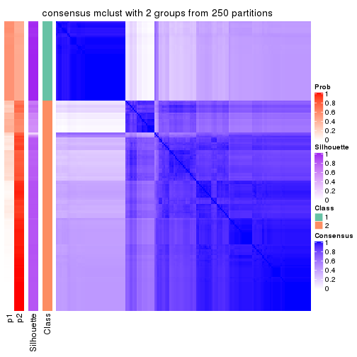</p>

</div>
<div id='tab-SD-mclust-consensus-heatmap-2'>
<pre><code class="r">consensus_heatmap(res, k = 3)
</code></pre>

<p>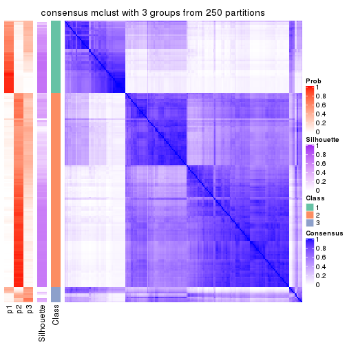</p>

</div>
<div id='tab-SD-mclust-consensus-heatmap-3'>
<pre><code class="r">consensus_heatmap(res, k = 4)
</code></pre>

<p>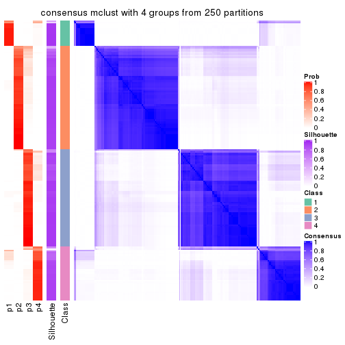</p>

</div>
<div id='tab-SD-mclust-consensus-heatmap-4'>
<pre><code class="r">consensus_heatmap(res, k = 5)
</code></pre>

<p>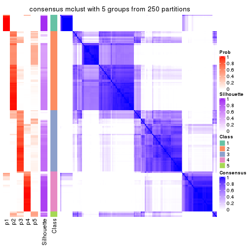</p>

</div>
<div id='tab-SD-mclust-consensus-heatmap-5'>
<pre><code class="r">consensus_heatmap(res, k = 6)
</code></pre>

<p>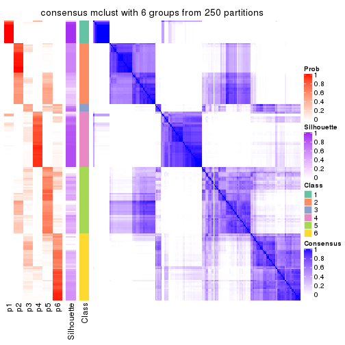</p>

</div>
</div>

Heatmaps for the membership of samples in all partitions to see how consistent they are:


<script>
$( function() {
	$( '#tabs-SD-mclust-membership-heatmap' ).tabs();
} );
</script>
<div id='tabs-SD-mclust-membership-heatmap'>
<ul>
<li><a href='#tab-SD-mclust-membership-heatmap-1'>k = 2</a></li>
<li><a href='#tab-SD-mclust-membership-heatmap-2'>k = 3</a></li>
<li><a href='#tab-SD-mclust-membership-heatmap-3'>k = 4</a></li>
<li><a href='#tab-SD-mclust-membership-heatmap-4'>k = 5</a></li>
<li><a href='#tab-SD-mclust-membership-heatmap-5'>k = 6</a></li>
</ul>
<div id='tab-SD-mclust-membership-heatmap-1'>
<pre><code class="r">membership_heatmap(res, k = 2)
</code></pre>

<p>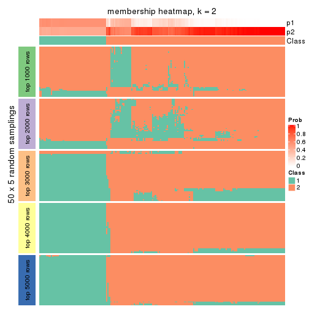</p>

</div>
<div id='tab-SD-mclust-membership-heatmap-2'>
<pre><code class="r">membership_heatmap(res, k = 3)
</code></pre>

<p>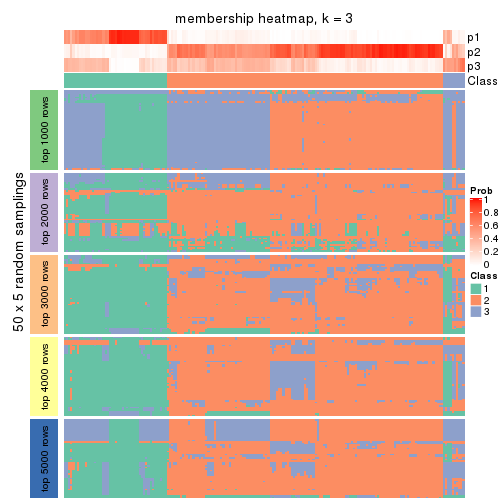</p>

</div>
<div id='tab-SD-mclust-membership-heatmap-3'>
<pre><code class="r">membership_heatmap(res, k = 4)
</code></pre>

<p>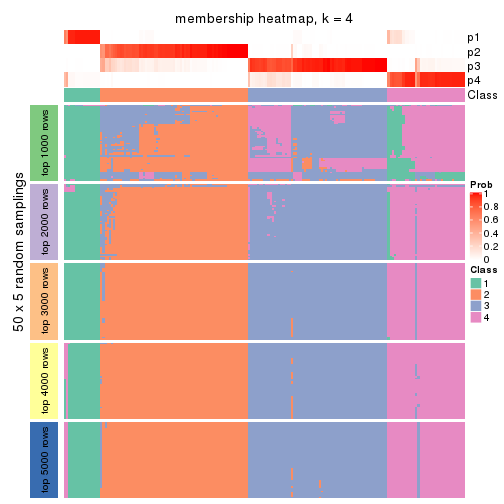</p>

</div>
<div id='tab-SD-mclust-membership-heatmap-4'>
<pre><code class="r">membership_heatmap(res, k = 5)
</code></pre>

<p>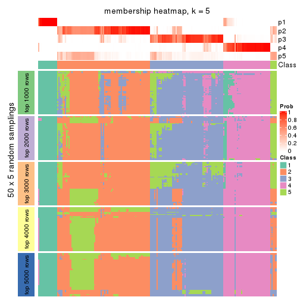</p>

</div>
<div id='tab-SD-mclust-membership-heatmap-5'>
<pre><code class="r">membership_heatmap(res, k = 6)
</code></pre>

<p>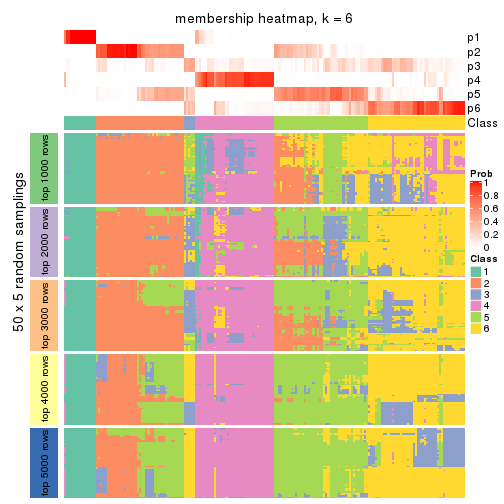</p>

</div>
</div>

As soon as we have had the classes for columns, we can look for signatures
which are significantly different between classes which can be candidate marks
for certain classes. Following are the heatmaps for signatures.


Signature heatmaps where rows are scaled:


<script>
$( function() {
	$( '#tabs-SD-mclust-get-signatures' ).tabs();
} );
</script>
<div id='tabs-SD-mclust-get-signatures'>
<ul>
<li><a href='#tab-SD-mclust-get-signatures-1'>k = 2</a></li>
<li><a href='#tab-SD-mclust-get-signatures-2'>k = 3</a></li>
<li><a href='#tab-SD-mclust-get-signatures-3'>k = 4</a></li>
<li><a href='#tab-SD-mclust-get-signatures-4'>k = 5</a></li>
<li><a href='#tab-SD-mclust-get-signatures-5'>k = 6</a></li>
</ul>
<div id='tab-SD-mclust-get-signatures-1'>
<pre><code class="r">get_signatures(res, k = 2)
</code></pre>

<p>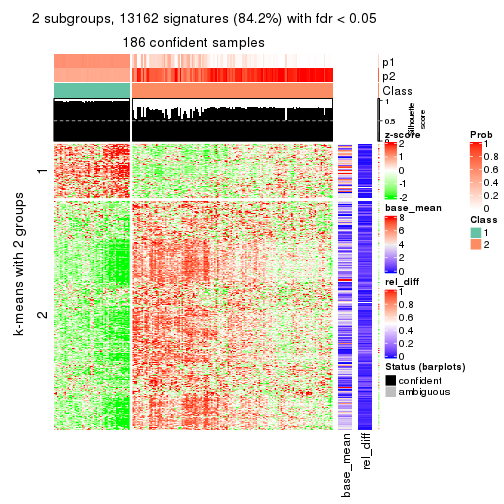</p>

</div>
<div id='tab-SD-mclust-get-signatures-2'>
<pre><code class="r">get_signatures(res, k = 3)
</code></pre>

<p>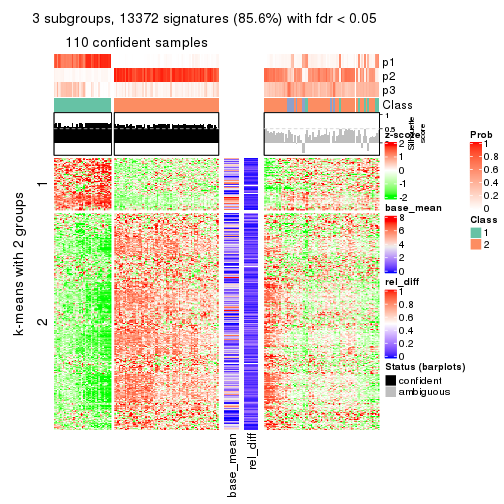</p>

</div>
<div id='tab-SD-mclust-get-signatures-3'>
<pre><code class="r">get_signatures(res, k = 4)
</code></pre>

<p>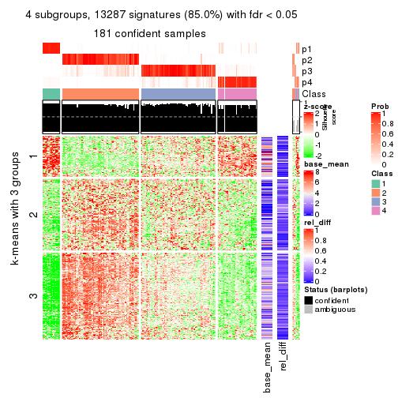</p>

</div>
<div id='tab-SD-mclust-get-signatures-4'>
<pre><code class="r">get_signatures(res, k = 5)
</code></pre>

<p>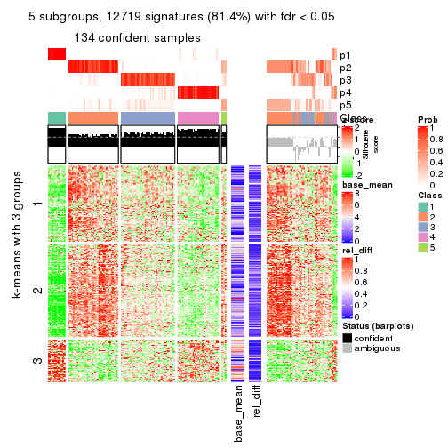</p>

</div>
<div id='tab-SD-mclust-get-signatures-5'>
<pre><code class="r">get_signatures(res, k = 6)
</code></pre>

<p>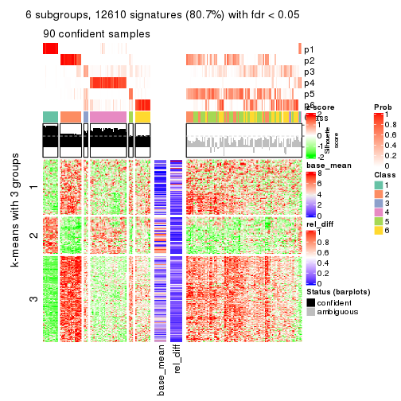</p>

</div>
</div>


Signature heatmaps where rows are not scaled:


<script>
$( function() {
	$( '#tabs-SD-mclust-get-signatures-no-scale' ).tabs();
} );
</script>
<div id='tabs-SD-mclust-get-signatures-no-scale'>
<ul>
<li><a href='#tab-SD-mclust-get-signatures-no-scale-1'>k = 2</a></li>
<li><a href='#tab-SD-mclust-get-signatures-no-scale-2'>k = 3</a></li>
<li><a href='#tab-SD-mclust-get-signatures-no-scale-3'>k = 4</a></li>
<li><a href='#tab-SD-mclust-get-signatures-no-scale-4'>k = 5</a></li>
<li><a href='#tab-SD-mclust-get-signatures-no-scale-5'>k = 6</a></li>
</ul>
<div id='tab-SD-mclust-get-signatures-no-scale-1'>
<pre><code class="r">get_signatures(res, k = 2, scale_rows = FALSE)
</code></pre>

<p>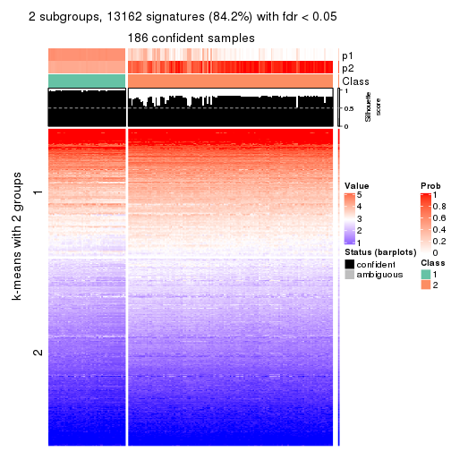</p>

</div>
<div id='tab-SD-mclust-get-signatures-no-scale-2'>
<pre><code class="r">get_signatures(res, k = 3, scale_rows = FALSE)
</code></pre>

<p>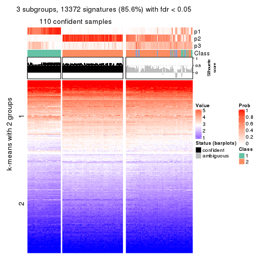</p>

</div>
<div id='tab-SD-mclust-get-signatures-no-scale-3'>
<pre><code class="r">get_signatures(res, k = 4, scale_rows = FALSE)
</code></pre>

<p>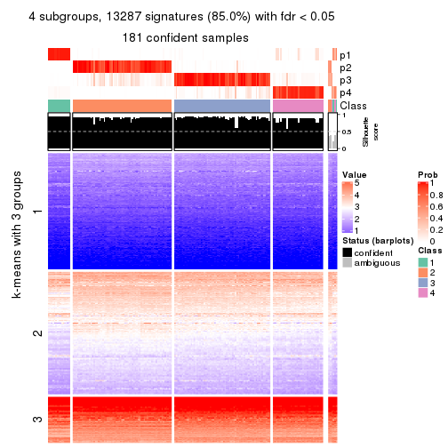</p>

</div>
<div id='tab-SD-mclust-get-signatures-no-scale-4'>
<pre><code class="r">get_signatures(res, k = 5, scale_rows = FALSE)
</code></pre>

<p>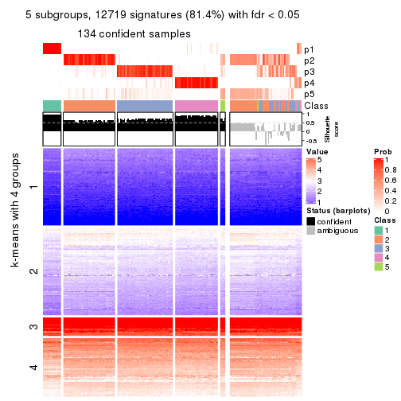</p>

</div>
<div id='tab-SD-mclust-get-signatures-no-scale-5'>
<pre><code class="r">get_signatures(res, k = 6, scale_rows = FALSE)
</code></pre>

<p>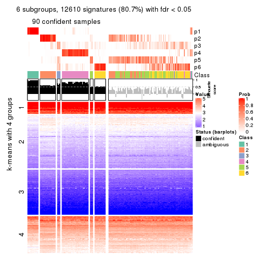</p>

</div>
</div>


Compare the overlap of signatures from different k:

```r
compare_signatures(res)
```

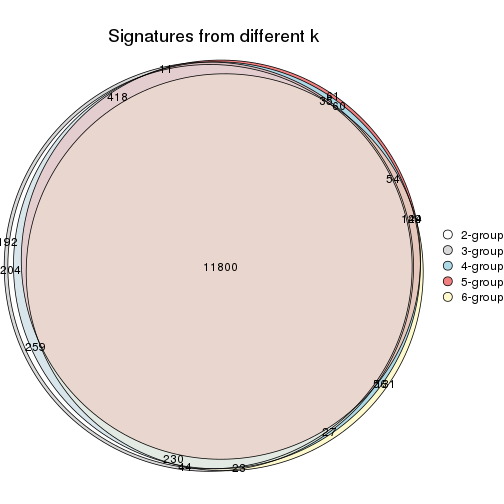

`get_signature()` returns a data frame invisibly. TO get the list of signatures, the function
call should be assigned to a variable explicitly. In following code, if `plot` argument is set
to `FALSE`, no heatmap is plotted while only the differential analysis is performed.

```r
# code only for demonstration
tb = get_signature(res, k = ..., plot = FALSE)
```

An example of the output of `tb` is:

```
#>   which_row         fdr    mean_1    mean_2 scaled_mean_1 scaled_mean_2 km
#> 1        38 0.042760348  8.373488  9.131774    -0.5533452     0.5164555  1
#> 2        40 0.018707592  7.106213  8.469186    -0.6173731     0.5762149  1
#> 3        55 0.019134737 10.221463 11.207825    -0.6159697     0.5749050  1
#> 4        59 0.006059896  5.921854  7.869574    -0.6899429     0.6439467  1
#> 5        60 0.018055526  8.928898 10.211722    -0.6204761     0.5791110  1
#> 6        98 0.009384629 15.714769 14.887706     0.6635654    -0.6193277  2
...
```

The columns in `tb` are:

1. `which_row`: row indices corresponding to the input matrix.
2. `fdr`: FDR for the differential test. 
3. `mean_x`: The mean value in group x.
4. `scaled_mean_x`: The mean value in group x after rows are scaled.
5. `km`: Row groups if k-means clustering is applied to rows.


UMAP plot which shows how samples are separated.


<script>
$( function() {
	$( '#tabs-SD-mclust-dimension-reduction' ).tabs();
} );
</script>
<div id='tabs-SD-mclust-dimension-reduction'>
<ul>
<li><a href='#tab-SD-mclust-dimension-reduction-1'>k = 2</a></li>
<li><a href='#tab-SD-mclust-dimension-reduction-2'>k = 3</a></li>
<li><a href='#tab-SD-mclust-dimension-reduction-3'>k = 4</a></li>
<li><a href='#tab-SD-mclust-dimension-reduction-4'>k = 5</a></li>
<li><a href='#tab-SD-mclust-dimension-reduction-5'>k = 6</a></li>
</ul>
<div id='tab-SD-mclust-dimension-reduction-1'>
<pre><code class="r">dimension_reduction(res, k = 2, method = &quot;UMAP&quot;)
</code></pre>

<p>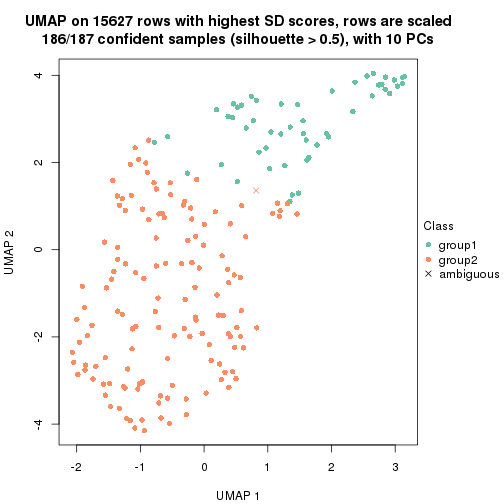</p>

</div>
<div id='tab-SD-mclust-dimension-reduction-2'>
<pre><code class="r">dimension_reduction(res, k = 3, method = &quot;UMAP&quot;)
</code></pre>

<p>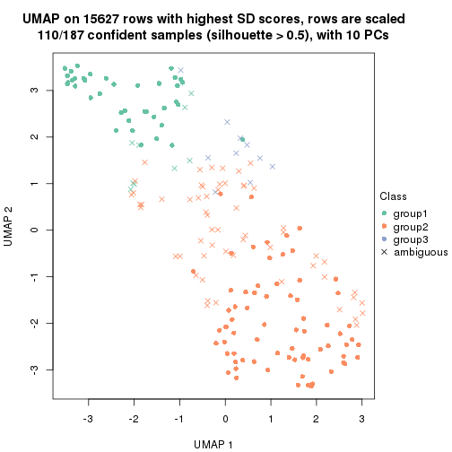</p>

</div>
<div id='tab-SD-mclust-dimension-reduction-3'>
<pre><code class="r">dimension_reduction(res, k = 4, method = &quot;UMAP&quot;)
</code></pre>

<p>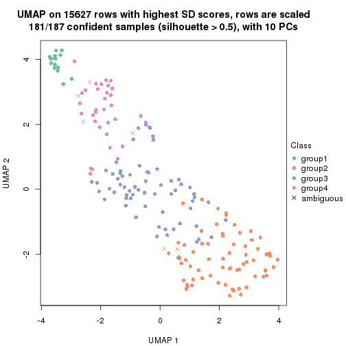</p>

</div>
<div id='tab-SD-mclust-dimension-reduction-4'>
<pre><code class="r">dimension_reduction(res, k = 5, method = &quot;UMAP&quot;)
</code></pre>

<p>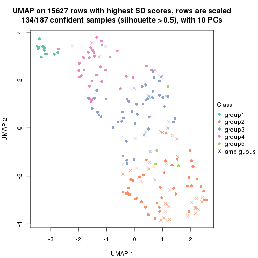</p>

</div>
<div id='tab-SD-mclust-dimension-reduction-5'>
<pre><code class="r">dimension_reduction(res, k = 6, method = &quot;UMAP&quot;)
</code></pre>

<p>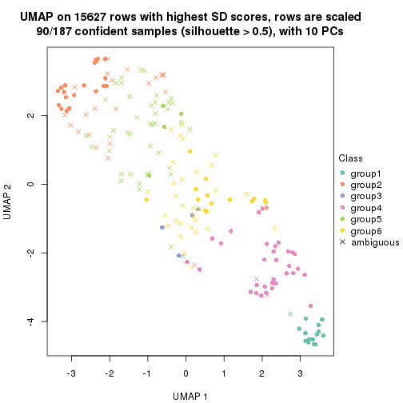</p>

</div>
</div>


Following heatmap shows how subgroups are split when increasing `k`:

```r
collect_classes(res)
```

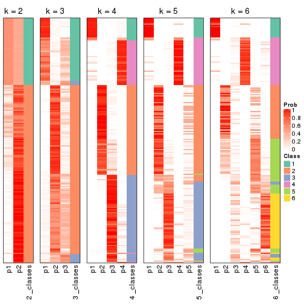


If matrix rows can be associated to genes, consider to use `GO_Enrichment(res,
...)` to perform function enrichment for the signature genes.


 

---------------------------------------------------


### SD:NMF*


The object with results only for a single top-value method and a single partition method 
can be extracted as:

```r
res = res_list["SD", "NMF"]
# you can also extract it by
# res = res_list["SD:NMF"]
```

A summary of `res` and all the functions that can be applied to it:

```r
res
```

```
#> A 'ConsensusPartition' object with k = 2, 3, 4, 5, 6.
#>   On a matrix with 15627 rows and 187 columns.
#>   Top rows (1000, 2000, 3000, 4000, 5000) are extracted by 'SD' method.
#>   Subgroups are detected by 'NMF' method.
#>   Performed in total 1250 partitions by row resampling.
#>   Best k for subgroups seems to be 2.
#> 
#> Following methods can be applied to this 'ConsensusPartition' object:
#>  [1] "cola_report"             "collect_classes"         "collect_plots"          
#>  [4] "collect_stats"           "colnames"                "compare_signatures"     
#>  [7] "consensus_heatmap"       "dimension_reduction"     "functional_enrichment"  
#> [10] "get_anno_col"            "get_anno"                "get_classes"            
#> [13] "get_consensus"           "get_matrix"              "get_membership"         
#> [16] "get_param"               "get_signatures"          "get_stats"              
#> [19] "is_best_k"               "is_stable_k"             "membership_heatmap"     
#> [22] "ncol"                    "nrow"                    "plot_ecdf"              
#> [25] "rownames"                "select_partition_number" "show"                   
#> [28] "suggest_best_k"          "test_to_known_factors"
```

`collect_plots()` function collects all the plots made from `res` for all `k` (number of partitions)
into one single page to provide an easy and fast comparison between different `k`.

```r
collect_plots(res)
```

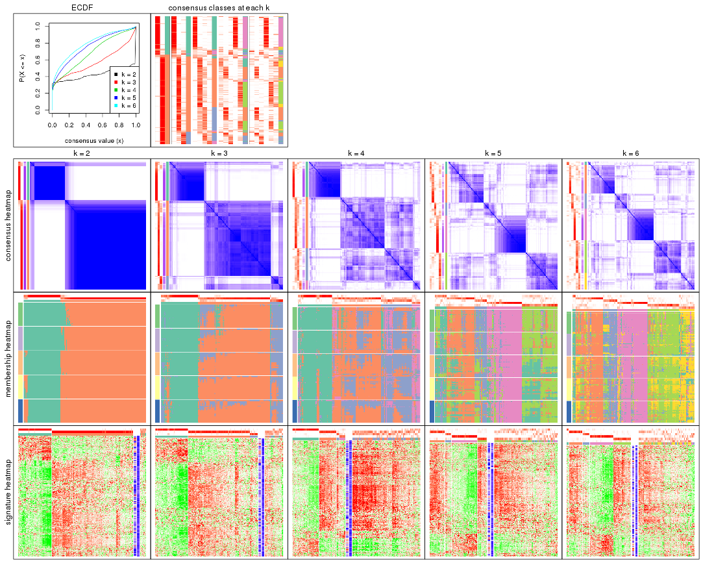

The plots are:

- The first row: a plot of the ECDF (Empirical cumulative distribution
  function) curves of the consensus matrix for each `k` and the heatmap of
  predicted classes for each `k`.
- The second row: heatmaps of the consensus matrix for each `k`.
- The third row: heatmaps of the membership matrix for each `k`.
- The fouth row: heatmaps of the signatures for each `k`.

All the plots in panels can be made by individual functions and they are
plotted later in this section.

`select_partition_number()` produces several plots showing different
statistics for choosing "optimized" `k`. There are following statistics:

- ECDF curves of the consensus matrix for each `k`;
- 1-PAC. [The PAC
  score](https://en.wikipedia.org/wiki/Consensus_clustering#Over-interpretation_potential_of_consensus_clustering)
  measures the proportion of the ambiguous subgrouping.
- Mean silhouette score.
- Concordance. The mean probability of fiting the consensus class ids in all
  partitions.
- Area increased. Denote $A_k$ as the area under the ECDF curve for current
  `k`, the area increased is defined as $A_k - A_{k-1}$.
- Rand index. The percent of pairs of samples that are both in a same cluster
  or both are not in a same cluster in the partition of k and k-1.
- Jaccard index. The ratio of pairs of samples are both in a same cluster in
  the partition of k and k-1 and the pairs of samples are both in a same
  cluster in the partition k or k-1.

The detailed explanations of these statistics can be found in [the cola
vignette](http://bioconductor.org/packages/devel/bioc/vignettes/cola/inst/doc/cola.html#toc_13).

Generally speaking, lower PAC score, higher mean silhouette score or higher
concordance corresponds to better partition. Rand index and Jaccard index
measure how similar the current partition is compared to partition with `k-1`.
If they are too similar, we won't accept `k` is better than `k-1`.

```r
select_partition_number(res)
```

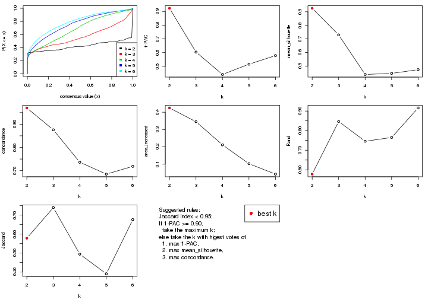

The numeric values for all these statistics can be obtained by `get_stats()`.

```r
get_stats(res)
```

```
#>   k 1-PAC mean_silhouette concordance area_increased  Rand Jaccard
#> 2 2 0.923           0.926       0.970         0.4246 0.578   0.578
#> 3 3 0.604           0.729       0.876         0.3451 0.846   0.740
#> 4 4 0.441           0.438       0.736         0.2112 0.746   0.494
#> 5 5 0.516           0.446       0.685         0.1024 0.765   0.390
#> 6 6 0.578           0.473       0.718         0.0422 0.916   0.676
```

`suggest_best_k()` suggests the best $k$ based on these statistics. The rules are as follows:

- All $k$ with Jaccard index larger than 0.95 are removed because the increase of
  the partition number does not provides enough extra information. If all $k$ are removed,
  the best $k$ is assigned by `NA`.
- For $k$ with 1-PAC larger than 0.9, the maximal $k$ is taken as the "best k". Other $k$ is called "optional k".
- If it does not fit the second rule. The $k$ with the highest vote of highest
  1-PAC, mean silhouette and concordance is taken as the "best k".

```r
suggest_best_k(res)
```

```
#> [1] 2
```


Following shows the table of the partitions (You need to click the **show/hide
code output** link to see it). The membership matrix (columns with name `p*`)
is inferred by
[`clue::cl_consensus()`](https://www.rdocumentation.org/link/cl_consensus?package=clue)
function with the `SE` method. Basically the value in the membership matrix
represents the probability to belong to a certain group. The finall class
label for an item is determined with the group with highest probability it
belongs to.

In `get_classes()` function, the entropy is calculated from the membership
matrix and the silhouette score is calculated from the consensus matrix.


<script>
$( function() {
	$( '#tabs-SD-NMF-get-classes' ).tabs();
} );
</script>
<div id='tabs-SD-NMF-get-classes'>
<ul>
<li><a href='#tab-SD-NMF-get-classes-1'>k = 2</a></li>
<li><a href='#tab-SD-NMF-get-classes-2'>k = 3</a></li>
<li><a href='#tab-SD-NMF-get-classes-3'>k = 4</a></li>
<li><a href='#tab-SD-NMF-get-classes-4'>k = 5</a></li>
<li><a href='#tab-SD-NMF-get-classes-5'>k = 6</a></li>
</ul>

<div id='tab-SD-NMF-get-classes-1'>
<p><a id='tab-SD-NMF-get-classes-1-a' style='color:#0366d6' href='#'>show/hide code output</a></p>
<pre><code class="r">cbind(get_classes(res, k = 2), get_membership(res, k = 2))
</code></pre>

<pre><code>#&gt;            class entropy silhouette    p1    p2
#&gt; SRR1747213     1  0.6148      0.802 0.848 0.152
#&gt; SRR1747214     1  0.0000      0.957 1.000 0.000
#&gt; SRR1747215     2  0.0000      0.973 0.000 1.000
#&gt; SRR1747216     2  0.0000      0.973 0.000 1.000
#&gt; SRR1747217     2  0.0000      0.973 0.000 1.000
#&gt; SRR1747218     2  0.0000      0.973 0.000 1.000
#&gt; SRR1747219     2  0.0672      0.966 0.008 0.992
#&gt; SRR1747220     1  0.0000      0.957 1.000 0.000
#&gt; SRR1747221     1  0.0000      0.957 1.000 0.000
#&gt; SRR1747222     1  0.0000      0.957 1.000 0.000
#&gt; SRR1747223     1  0.0000      0.957 1.000 0.000
#&gt; SRR1747224     2  0.0000      0.973 0.000 1.000
#&gt; SRR1747225     2  0.0000      0.973 0.000 1.000
#&gt; SRR1747226     2  0.0000      0.973 0.000 1.000
#&gt; SRR1747227     2  0.0000      0.973 0.000 1.000
#&gt; SRR1747228     2  0.0000      0.973 0.000 1.000
#&gt; SRR1747229     2  0.0000      0.973 0.000 1.000
#&gt; SRR1747230     1  0.0000      0.957 1.000 0.000
#&gt; SRR1747231     1  0.0000      0.957 1.000 0.000
#&gt; SRR1747232     1  0.0000      0.957 1.000 0.000
#&gt; SRR1747233     1  0.0000      0.957 1.000 0.000
#&gt; SRR1747234     2  0.0000      0.973 0.000 1.000
#&gt; SRR1747235     1  0.0000      0.957 1.000 0.000
#&gt; SRR1747236     2  0.0000      0.973 0.000 1.000
#&gt; SRR1747237     2  0.0000      0.973 0.000 1.000
#&gt; SRR1747238     2  0.0000      0.973 0.000 1.000
#&gt; SRR1747239     2  0.0000      0.973 0.000 1.000
#&gt; SRR1747240     1  0.0000      0.957 1.000 0.000
#&gt; SRR1747241     2  0.0000      0.973 0.000 1.000
#&gt; SRR1747242     1  0.0000      0.957 1.000 0.000
#&gt; SRR1747243     1  0.9248      0.497 0.660 0.340
#&gt; SRR1747244     2  0.0000      0.973 0.000 1.000
#&gt; SRR1747245     2  0.0000      0.973 0.000 1.000
#&gt; SRR1747246     2  0.0000      0.973 0.000 1.000
#&gt; SRR1747247     1  0.0000      0.957 1.000 0.000
#&gt; SRR1747248     1  0.0000      0.957 1.000 0.000
#&gt; SRR1747249     1  0.0000      0.957 1.000 0.000
#&gt; SRR1747250     2  0.0000      0.973 0.000 1.000
#&gt; SRR1747252     1  0.0000      0.957 1.000 0.000
#&gt; SRR1747253     1  0.0000      0.957 1.000 0.000
#&gt; SRR1747254     2  0.0000      0.973 0.000 1.000
#&gt; SRR1747255     1  0.0000      0.957 1.000 0.000
#&gt; SRR1747256     1  0.0000      0.957 1.000 0.000
#&gt; SRR1747257     2  0.0000      0.973 0.000 1.000
#&gt; SRR1747258     2  0.0000      0.973 0.000 1.000
#&gt; SRR1747259     2  0.0000      0.973 0.000 1.000
#&gt; SRR1747260     2  0.0000      0.973 0.000 1.000
#&gt; SRR1747261     2  0.0000      0.973 0.000 1.000
#&gt; SRR1747262     2  0.0000      0.973 0.000 1.000
#&gt; SRR1747263     2  0.0000      0.973 0.000 1.000
#&gt; SRR1747264     1  0.0000      0.957 1.000 0.000
#&gt; SRR1747265     2  0.0672      0.966 0.008 0.992
#&gt; SRR1747266     2  0.0000      0.973 0.000 1.000
#&gt; SRR1747267     2  0.5629      0.837 0.132 0.868
#&gt; SRR1747268     2  0.3879      0.902 0.076 0.924
#&gt; SRR1747269     2  0.0000      0.973 0.000 1.000
#&gt; SRR1747270     2  0.0000      0.973 0.000 1.000
#&gt; SRR1747271     2  0.0000      0.973 0.000 1.000
#&gt; SRR1747272     2  0.9323      0.462 0.348 0.652
#&gt; SRR1747273     1  0.0000      0.957 1.000 0.000
#&gt; SRR1747274     2  0.0000      0.973 0.000 1.000
#&gt; SRR1747275     1  0.0000      0.957 1.000 0.000
#&gt; SRR1747276     1  0.0000      0.957 1.000 0.000
#&gt; SRR1747277     2  0.0000      0.973 0.000 1.000
#&gt; SRR1747278     2  0.3584      0.910 0.068 0.932
#&gt; SRR1747280     1  0.0000      0.957 1.000 0.000
#&gt; SRR1747279     1  0.0000      0.957 1.000 0.000
#&gt; SRR1747281     2  0.0000      0.973 0.000 1.000
#&gt; SRR1747282     1  0.0000      0.957 1.000 0.000
#&gt; SRR1747283     2  0.0000      0.973 0.000 1.000
#&gt; SRR1747284     1  0.0000      0.957 1.000 0.000
#&gt; SRR1747285     2  0.0000      0.973 0.000 1.000
#&gt; SRR1747286     2  0.0000      0.973 0.000 1.000
#&gt; SRR1747287     2  0.0000      0.973 0.000 1.000
#&gt; SRR1747288     1  0.9522      0.422 0.628 0.372
#&gt; SRR1747290     2  0.0000      0.973 0.000 1.000
#&gt; SRR1747289     2  0.0000      0.973 0.000 1.000
#&gt; SRR1747291     2  0.0000      0.973 0.000 1.000
#&gt; SRR1747293     2  0.0000      0.973 0.000 1.000
#&gt; SRR1747294     2  0.0000      0.973 0.000 1.000
#&gt; SRR1747292     1  0.0000      0.957 1.000 0.000
#&gt; SRR1747295     2  0.0000      0.973 0.000 1.000
#&gt; SRR1747296     2  0.0000      0.973 0.000 1.000
#&gt; SRR1747297     2  0.0000      0.973 0.000 1.000
#&gt; SRR1747298     2  0.0000      0.973 0.000 1.000
#&gt; SRR1747299     2  0.0000      0.973 0.000 1.000
#&gt; SRR1747300     2  0.0000      0.973 0.000 1.000
#&gt; SRR1747301     2  0.0000      0.973 0.000 1.000
#&gt; SRR1747302     2  0.0000      0.973 0.000 1.000
#&gt; SRR1747303     2  0.0000      0.973 0.000 1.000
#&gt; SRR1747304     1  0.0000      0.957 1.000 0.000
#&gt; SRR1747305     2  0.0000      0.973 0.000 1.000
#&gt; SRR1747306     2  0.0000      0.973 0.000 1.000
#&gt; SRR1747307     2  0.9491      0.413 0.368 0.632
#&gt; SRR1747308     2  0.0000      0.973 0.000 1.000
#&gt; SRR1747309     1  0.0000      0.957 1.000 0.000
#&gt; SRR1747310     1  0.0000      0.957 1.000 0.000
#&gt; SRR1747311     2  0.3274      0.918 0.060 0.940
#&gt; SRR1747313     2  0.2603      0.934 0.044 0.956
#&gt; SRR1747312     1  0.0000      0.957 1.000 0.000
#&gt; SRR1747314     1  0.0000      0.957 1.000 0.000
#&gt; SRR1747315     2  0.0000      0.973 0.000 1.000
#&gt; SRR1747316     2  0.0000      0.973 0.000 1.000
#&gt; SRR1747318     2  0.0000      0.973 0.000 1.000
#&gt; SRR1747317     2  0.0000      0.973 0.000 1.000
#&gt; SRR1747319     2  0.0000      0.973 0.000 1.000
#&gt; SRR1747320     1  0.0000      0.957 1.000 0.000
#&gt; SRR1747322     1  0.0000      0.957 1.000 0.000
#&gt; SRR1747321     1  0.0000      0.957 1.000 0.000
#&gt; SRR1747323     2  0.0000      0.973 0.000 1.000
#&gt; SRR1747324     2  0.0000      0.973 0.000 1.000
#&gt; SRR1747326     2  0.0000      0.973 0.000 1.000
#&gt; SRR1747325     2  0.0000      0.973 0.000 1.000
#&gt; SRR1747327     2  0.0000      0.973 0.000 1.000
#&gt; SRR1747328     2  0.6531      0.789 0.168 0.832
#&gt; SRR1747330     2  0.9129      0.508 0.328 0.672
#&gt; SRR1747329     2  0.0000      0.973 0.000 1.000
#&gt; SRR1747332     1  0.8327      0.642 0.736 0.264
#&gt; SRR1747331     2  0.0000      0.973 0.000 1.000
#&gt; SRR1747333     2  0.0000      0.973 0.000 1.000
#&gt; SRR1747334     2  0.0000      0.973 0.000 1.000
#&gt; SRR1747335     2  0.7950      0.678 0.240 0.760
#&gt; SRR1747336     1  0.0000      0.957 1.000 0.000
#&gt; SRR1747337     2  0.0000      0.973 0.000 1.000
#&gt; SRR1747338     2  0.0000      0.973 0.000 1.000
#&gt; SRR1747339     2  0.4161      0.893 0.084 0.916
#&gt; SRR1747340     2  0.0000      0.973 0.000 1.000
#&gt; SRR1747341     2  0.0000      0.973 0.000 1.000
#&gt; SRR1747342     2  0.0000      0.973 0.000 1.000
#&gt; SRR1747343     2  0.0000      0.973 0.000 1.000
#&gt; SRR1747344     2  0.0000      0.973 0.000 1.000
#&gt; SRR1747345     2  0.0672      0.966 0.008 0.992
#&gt; SRR1747346     2  0.0000      0.973 0.000 1.000
#&gt; SRR1747347     2  0.0000      0.973 0.000 1.000
#&gt; SRR1747348     1  0.0000      0.957 1.000 0.000
#&gt; SRR1747349     1  0.0000      0.957 1.000 0.000
#&gt; SRR1747351     2  0.0000      0.973 0.000 1.000
#&gt; SRR1747350     2  0.0000      0.973 0.000 1.000
#&gt; SRR1747352     1  0.0000      0.957 1.000 0.000
#&gt; SRR1747353     2  0.0000      0.973 0.000 1.000
#&gt; SRR1747354     2  0.0000      0.973 0.000 1.000
#&gt; SRR1747355     1  0.9881      0.238 0.564 0.436
#&gt; SRR1747356     2  0.0000      0.973 0.000 1.000
#&gt; SRR1747357     2  0.0000      0.973 0.000 1.000
#&gt; SRR1747358     2  0.0000      0.973 0.000 1.000
#&gt; SRR1747359     1  0.0000      0.957 1.000 0.000
#&gt; SRR1747360     2  0.0000      0.973 0.000 1.000
#&gt; SRR1747361     2  0.9710      0.327 0.400 0.600
#&gt; SRR1747362     2  0.0000      0.973 0.000 1.000
#&gt; SRR1747363     2  0.9775      0.292 0.412 0.588
#&gt; SRR1747364     1  0.0000      0.957 1.000 0.000
#&gt; SRR1747365     2  0.0000      0.973 0.000 1.000
#&gt; SRR1747366     2  0.0000      0.973 0.000 1.000
#&gt; SRR1747367     2  0.9944      0.147 0.456 0.544
#&gt; SRR1747369     2  0.0000      0.973 0.000 1.000
#&gt; SRR1747368     2  0.0000      0.973 0.000 1.000
#&gt; SRR1747370     2  0.0000      0.973 0.000 1.000
#&gt; SRR1747372     1  0.0000      0.957 1.000 0.000
#&gt; SRR1747371     1  0.0000      0.957 1.000 0.000
#&gt; SRR1747373     2  0.0000      0.973 0.000 1.000
#&gt; SRR1747374     2  0.0000      0.973 0.000 1.000
#&gt; SRR1747375     1  0.8861      0.571 0.696 0.304
#&gt; SRR1747376     2  0.0000      0.973 0.000 1.000
#&gt; SRR1747377     2  0.0000      0.973 0.000 1.000
#&gt; SRR1747378     2  0.0000      0.973 0.000 1.000
#&gt; SRR1747379     2  0.0000      0.973 0.000 1.000
#&gt; SRR1747380     2  0.0000      0.973 0.000 1.000
#&gt; SRR1747381     1  0.0000      0.957 1.000 0.000
#&gt; SRR1747382     1  0.0000      0.957 1.000 0.000
#&gt; SRR1747383     2  0.0000      0.973 0.000 1.000
#&gt; SRR1747384     2  0.1414      0.956 0.020 0.980
#&gt; SRR1747385     2  0.0000      0.973 0.000 1.000
#&gt; SRR1747386     1  0.0000      0.957 1.000 0.000
#&gt; SRR1747387     2  0.0000      0.973 0.000 1.000
#&gt; SRR1747388     2  0.0000      0.973 0.000 1.000
#&gt; SRR1747390     2  0.0000      0.973 0.000 1.000
#&gt; SRR1747389     2  0.0000      0.973 0.000 1.000
#&gt; SRR1747391     2  0.0000      0.973 0.000 1.000
#&gt; SRR1747392     2  0.0000      0.973 0.000 1.000
#&gt; SRR1747393     2  0.0000      0.973 0.000 1.000
#&gt; SRR1747394     1  0.9522      0.422 0.628 0.372
#&gt; SRR1747395     2  0.0000      0.973 0.000 1.000
#&gt; SRR1747396     2  0.0000      0.973 0.000 1.000
#&gt; SRR1747398     2  0.0000      0.973 0.000 1.000
#&gt; SRR1747397     2  0.5519      0.841 0.128 0.872
#&gt; SRR1747399     1  0.0000      0.957 1.000 0.000
#&gt; SRR1747400     1  0.0000      0.957 1.000 0.000
</code></pre>

<script>
$('#tab-SD-NMF-get-classes-1-a').parent().next().next().hide();
$('#tab-SD-NMF-get-classes-1-a').click(function(){
  $('#tab-SD-NMF-get-classes-1-a').parent().next().next().toggle();
  return(false);
});
</script>
</div>

<div id='tab-SD-NMF-get-classes-2'>
<p><a id='tab-SD-NMF-get-classes-2-a' style='color:#0366d6' href='#'>show/hide code output</a></p>
<pre><code class="r">cbind(get_classes(res, k = 3), get_membership(res, k = 3))
</code></pre>

<pre><code>#&gt;            class entropy silhouette    p1    p2    p3
#&gt; SRR1747213     1  0.5816    0.67212 0.752 0.024 0.224
#&gt; SRR1747214     1  0.1860    0.86426 0.948 0.000 0.052
#&gt; SRR1747215     2  0.1289    0.84514 0.000 0.968 0.032
#&gt; SRR1747216     2  0.0424    0.84816 0.000 0.992 0.008
#&gt; SRR1747217     2  0.4848    0.77864 0.036 0.836 0.128
#&gt; SRR1747218     2  0.4346    0.74177 0.000 0.816 0.184
#&gt; SRR1747219     3  0.1832    0.67742 0.008 0.036 0.956
#&gt; SRR1747220     1  0.6008    0.53882 0.628 0.000 0.372
#&gt; SRR1747221     1  0.3039    0.84192 0.920 0.044 0.036
#&gt; SRR1747222     1  0.0000    0.89398 1.000 0.000 0.000
#&gt; SRR1747223     1  0.2689    0.85186 0.932 0.036 0.032
#&gt; SRR1747224     2  0.1289    0.84153 0.000 0.968 0.032
#&gt; SRR1747225     2  0.1163    0.84298 0.000 0.972 0.028
#&gt; SRR1747226     2  0.1289    0.84644 0.000 0.968 0.032
#&gt; SRR1747227     2  0.2165    0.83897 0.000 0.936 0.064
#&gt; SRR1747228     2  0.1964    0.84218 0.000 0.944 0.056
#&gt; SRR1747229     2  0.2066    0.84112 0.000 0.940 0.060
#&gt; SRR1747230     1  0.0000    0.89398 1.000 0.000 0.000
#&gt; SRR1747231     1  0.5678    0.61703 0.684 0.000 0.316
#&gt; SRR1747232     1  0.0000    0.89398 1.000 0.000 0.000
#&gt; SRR1747233     1  0.0592    0.88935 0.988 0.000 0.012
#&gt; SRR1747234     3  0.6111    0.44308 0.000 0.396 0.604
#&gt; SRR1747235     3  0.6225   -0.16221 0.432 0.000 0.568
#&gt; SRR1747236     3  0.3551    0.69489 0.000 0.132 0.868
#&gt; SRR1747237     2  0.4974    0.67641 0.000 0.764 0.236
#&gt; SRR1747238     3  0.6235    0.33986 0.000 0.436 0.564
#&gt; SRR1747239     2  0.0747    0.84925 0.000 0.984 0.016
#&gt; SRR1747240     1  0.0000    0.89398 1.000 0.000 0.000
#&gt; SRR1747241     3  0.1643    0.68661 0.000 0.044 0.956
#&gt; SRR1747242     1  0.0000    0.89398 1.000 0.000 0.000
#&gt; SRR1747243     1  0.6836    0.52113 0.704 0.240 0.056
#&gt; SRR1747244     2  0.1411    0.84475 0.000 0.964 0.036
#&gt; SRR1747245     2  0.2165    0.84017 0.000 0.936 0.064
#&gt; SRR1747246     2  0.0747    0.84781 0.000 0.984 0.016
#&gt; SRR1747247     1  0.0000    0.89398 1.000 0.000 0.000
#&gt; SRR1747248     1  0.0000    0.89398 1.000 0.000 0.000
#&gt; SRR1747249     1  0.0424    0.89071 0.992 0.000 0.008
#&gt; SRR1747250     2  0.5905    0.45439 0.000 0.648 0.352
#&gt; SRR1747252     1  0.1315    0.88262 0.972 0.008 0.020
#&gt; SRR1747253     1  0.0000    0.89398 1.000 0.000 0.000
#&gt; SRR1747254     2  0.4654    0.71392 0.000 0.792 0.208
#&gt; SRR1747255     1  0.0592    0.88935 0.988 0.000 0.012
#&gt; SRR1747256     1  0.0000    0.89398 1.000 0.000 0.000
#&gt; SRR1747257     2  0.4399    0.74041 0.000 0.812 0.188
#&gt; SRR1747258     2  0.5327    0.59472 0.000 0.728 0.272
#&gt; SRR1747259     2  0.5431    0.59314 0.000 0.716 0.284
#&gt; SRR1747260     3  0.4235    0.69118 0.000 0.176 0.824
#&gt; SRR1747261     2  0.2261    0.83671 0.000 0.932 0.068
#&gt; SRR1747262     2  0.1860    0.84076 0.000 0.948 0.052
#&gt; SRR1747263     2  0.2165    0.84017 0.000 0.936 0.064
#&gt; SRR1747264     1  0.0000    0.89398 1.000 0.000 0.000
#&gt; SRR1747265     3  0.2152    0.67191 0.016 0.036 0.948
#&gt; SRR1747266     2  0.1031    0.84733 0.000 0.976 0.024
#&gt; SRR1747267     2  0.9408    0.00941 0.200 0.492 0.308
#&gt; SRR1747268     2  0.5295    0.69023 0.156 0.808 0.036
#&gt; SRR1747269     3  0.6204    0.42047 0.000 0.424 0.576
#&gt; SRR1747270     2  0.5810    0.49057 0.000 0.664 0.336
#&gt; SRR1747271     2  0.0592    0.84918 0.000 0.988 0.012
#&gt; SRR1747272     2  0.7074    0.08218 0.480 0.500 0.020
#&gt; SRR1747273     3  0.2165    0.61700 0.064 0.000 0.936
#&gt; SRR1747274     2  0.2959    0.81634 0.000 0.900 0.100
#&gt; SRR1747275     1  0.0592    0.88935 0.988 0.000 0.012
#&gt; SRR1747276     1  0.0424    0.89120 0.992 0.000 0.008
#&gt; SRR1747277     3  0.6299    0.20970 0.000 0.476 0.524
#&gt; SRR1747278     2  0.3832    0.78548 0.076 0.888 0.036
#&gt; SRR1747280     1  0.0000    0.89398 1.000 0.000 0.000
#&gt; SRR1747279     1  0.0237    0.89267 0.996 0.000 0.004
#&gt; SRR1747281     2  0.1411    0.83969 0.000 0.964 0.036
#&gt; SRR1747282     1  0.0000    0.89398 1.000 0.000 0.000
#&gt; SRR1747283     3  0.1529    0.68441 0.000 0.040 0.960
#&gt; SRR1747284     1  0.6140    0.48595 0.596 0.000 0.404
#&gt; SRR1747285     2  0.4110    0.75813 0.004 0.844 0.152
#&gt; SRR1747286     3  0.1411    0.68064 0.000 0.036 0.964
#&gt; SRR1747287     2  0.4346    0.74512 0.000 0.816 0.184
#&gt; SRR1747288     1  0.7276    0.60288 0.704 0.104 0.192
#&gt; SRR1747290     2  0.5733    0.47535 0.000 0.676 0.324
#&gt; SRR1747289     2  0.6260    0.03044 0.000 0.552 0.448
#&gt; SRR1747291     2  0.1860    0.84333 0.000 0.948 0.052
#&gt; SRR1747293     2  0.1411    0.83969 0.000 0.964 0.036
#&gt; SRR1747294     2  0.2356    0.83564 0.000 0.928 0.072
#&gt; SRR1747292     1  0.0000    0.89398 1.000 0.000 0.000
#&gt; SRR1747295     2  0.6244    0.12348 0.000 0.560 0.440
#&gt; SRR1747296     3  0.5968    0.50065 0.000 0.364 0.636
#&gt; SRR1747297     2  0.0892    0.84550 0.000 0.980 0.020
#&gt; SRR1747298     2  0.1289    0.84664 0.000 0.968 0.032
#&gt; SRR1747299     2  0.0592    0.84755 0.000 0.988 0.012
#&gt; SRR1747300     2  0.0892    0.84732 0.000 0.980 0.020
#&gt; SRR1747301     2  0.1643    0.84588 0.000 0.956 0.044
#&gt; SRR1747302     2  0.0747    0.84781 0.000 0.984 0.016
#&gt; SRR1747303     2  0.0592    0.84760 0.000 0.988 0.012
#&gt; SRR1747304     1  0.0000    0.89398 1.000 0.000 0.000
#&gt; SRR1747305     2  0.1964    0.84084 0.000 0.944 0.056
#&gt; SRR1747306     2  0.1289    0.84645 0.000 0.968 0.032
#&gt; SRR1747307     3  0.5371    0.56487 0.140 0.048 0.812
#&gt; SRR1747308     2  0.4346    0.74617 0.000 0.816 0.184
#&gt; SRR1747309     1  0.0424    0.89120 0.992 0.000 0.008
#&gt; SRR1747310     1  0.0000    0.89398 1.000 0.000 0.000
#&gt; SRR1747311     2  0.5402    0.67078 0.180 0.792 0.028
#&gt; SRR1747313     2  0.5633    0.63030 0.208 0.768 0.024
#&gt; SRR1747312     1  0.0000    0.89398 1.000 0.000 0.000
#&gt; SRR1747314     1  0.0000    0.89398 1.000 0.000 0.000
#&gt; SRR1747315     2  0.1031    0.84369 0.000 0.976 0.024
#&gt; SRR1747316     2  0.2356    0.83469 0.000 0.928 0.072
#&gt; SRR1747318     2  0.4449    0.78386 0.100 0.860 0.040
#&gt; SRR1747317     2  0.1643    0.84428 0.000 0.956 0.044
#&gt; SRR1747319     3  0.4605    0.67320 0.000 0.204 0.796
#&gt; SRR1747320     1  0.0000    0.89398 1.000 0.000 0.000
#&gt; SRR1747322     1  0.0000    0.89398 1.000 0.000 0.000
#&gt; SRR1747321     1  0.0747    0.88859 0.984 0.000 0.016
#&gt; SRR1747323     2  0.0747    0.84674 0.000 0.984 0.016
#&gt; SRR1747324     2  0.0892    0.84735 0.000 0.980 0.020
#&gt; SRR1747326     2  0.1289    0.84085 0.000 0.968 0.032
#&gt; SRR1747325     2  0.1753    0.84333 0.000 0.952 0.048
#&gt; SRR1747327     2  0.2066    0.83977 0.000 0.940 0.060
#&gt; SRR1747328     2  0.6203    0.64616 0.184 0.760 0.056
#&gt; SRR1747330     2  0.5967    0.58027 0.216 0.752 0.032
#&gt; SRR1747329     2  0.1860    0.84309 0.000 0.948 0.052
#&gt; SRR1747332     1  0.7276    0.44141 0.564 0.032 0.404
#&gt; SRR1747331     3  0.6267    0.32743 0.000 0.452 0.548
#&gt; SRR1747333     2  0.1163    0.84235 0.000 0.972 0.028
#&gt; SRR1747334     2  0.1031    0.84416 0.000 0.976 0.024
#&gt; SRR1747335     2  0.8486    0.23073 0.348 0.548 0.104
#&gt; SRR1747336     1  0.0000    0.89398 1.000 0.000 0.000
#&gt; SRR1747337     2  0.0747    0.84953 0.000 0.984 0.016
#&gt; SRR1747338     2  0.0892    0.84732 0.000 0.980 0.020
#&gt; SRR1747339     2  0.4519    0.74696 0.116 0.852 0.032
#&gt; SRR1747340     2  0.1411    0.83969 0.000 0.964 0.036
#&gt; SRR1747341     2  0.1964    0.84137 0.000 0.944 0.056
#&gt; SRR1747342     2  0.1860    0.84345 0.000 0.948 0.052
#&gt; SRR1747343     2  0.1643    0.84558 0.000 0.956 0.044
#&gt; SRR1747344     2  0.1163    0.84714 0.000 0.972 0.028
#&gt; SRR1747345     2  0.2810    0.82202 0.036 0.928 0.036
#&gt; SRR1747346     2  0.4249    0.79843 0.028 0.864 0.108
#&gt; SRR1747347     2  0.2537    0.83070 0.000 0.920 0.080
#&gt; SRR1747348     1  0.0000    0.89398 1.000 0.000 0.000
#&gt; SRR1747349     1  0.0000    0.89398 1.000 0.000 0.000
#&gt; SRR1747351     2  0.1289    0.84814 0.000 0.968 0.032
#&gt; SRR1747350     2  0.4235    0.73917 0.000 0.824 0.176
#&gt; SRR1747352     1  0.0000    0.89398 1.000 0.000 0.000
#&gt; SRR1747353     2  0.0592    0.84930 0.000 0.988 0.012
#&gt; SRR1747354     2  0.6079    0.29517 0.000 0.612 0.388
#&gt; SRR1747355     1  0.7318    0.40660 0.668 0.264 0.068
#&gt; SRR1747356     2  0.5621    0.52943 0.000 0.692 0.308
#&gt; SRR1747357     2  0.6079    0.30320 0.000 0.612 0.388
#&gt; SRR1747358     3  0.1411    0.68126 0.000 0.036 0.964
#&gt; SRR1747359     1  0.0237    0.89253 0.996 0.000 0.004
#&gt; SRR1747360     2  0.1643    0.84411 0.000 0.956 0.044
#&gt; SRR1747361     1  0.7491   -0.05909 0.492 0.472 0.036
#&gt; SRR1747362     2  0.0592    0.84844 0.000 0.988 0.012
#&gt; SRR1747363     1  0.8227    0.09160 0.536 0.384 0.080
#&gt; SRR1747364     1  0.1031    0.88393 0.976 0.000 0.024
#&gt; SRR1747365     3  0.6154    0.41667 0.000 0.408 0.592
#&gt; SRR1747366     2  0.6154    0.22552 0.000 0.592 0.408
#&gt; SRR1747367     1  0.6521    0.34095 0.644 0.340 0.016
#&gt; SRR1747369     2  0.2625    0.82120 0.000 0.916 0.084
#&gt; SRR1747368     2  0.7616    0.39583 0.072 0.636 0.292
#&gt; SRR1747370     2  0.1163    0.84754 0.000 0.972 0.028
#&gt; SRR1747372     1  0.0000    0.89398 1.000 0.000 0.000
#&gt; SRR1747371     1  0.0000    0.89398 1.000 0.000 0.000
#&gt; SRR1747373     2  0.1163    0.84758 0.000 0.972 0.028
#&gt; SRR1747374     2  0.0592    0.84755 0.000 0.988 0.012
#&gt; SRR1747375     1  0.3846    0.77967 0.876 0.108 0.016
#&gt; SRR1747376     2  0.0747    0.84686 0.000 0.984 0.016
#&gt; SRR1747377     2  0.1163    0.84772 0.000 0.972 0.028
#&gt; SRR1747378     2  0.1411    0.83969 0.000 0.964 0.036
#&gt; SRR1747379     2  0.1643    0.84428 0.000 0.956 0.044
#&gt; SRR1747380     2  0.4818    0.78407 0.048 0.844 0.108
#&gt; SRR1747381     1  0.0747    0.88628 0.984 0.000 0.016
#&gt; SRR1747382     1  0.0424    0.89107 0.992 0.000 0.008
#&gt; SRR1747383     2  0.1643    0.84497 0.000 0.956 0.044
#&gt; SRR1747384     2  0.7031    0.58557 0.196 0.716 0.088
#&gt; SRR1747385     2  0.1643    0.84398 0.000 0.956 0.044
#&gt; SRR1747386     1  0.0000    0.89398 1.000 0.000 0.000
#&gt; SRR1747387     2  0.1529    0.84576 0.000 0.960 0.040
#&gt; SRR1747388     2  0.3619    0.78070 0.000 0.864 0.136
#&gt; SRR1747390     3  0.6180    0.39572 0.000 0.416 0.584
#&gt; SRR1747389     2  0.6008    0.36134 0.000 0.628 0.372
#&gt; SRR1747391     2  0.1411    0.83969 0.000 0.964 0.036
#&gt; SRR1747392     2  0.1411    0.83969 0.000 0.964 0.036
#&gt; SRR1747393     2  0.2496    0.83200 0.004 0.928 0.068
#&gt; SRR1747394     1  0.4277    0.74168 0.852 0.132 0.016
#&gt; SRR1747395     2  0.1411    0.83969 0.000 0.964 0.036
#&gt; SRR1747396     2  0.1411    0.83969 0.000 0.964 0.036
#&gt; SRR1747398     2  0.3619    0.78447 0.000 0.864 0.136
#&gt; SRR1747397     2  0.7067    0.29016 0.376 0.596 0.028
#&gt; SRR1747399     1  0.0000    0.89398 1.000 0.000 0.000
#&gt; SRR1747400     1  0.6298    0.50987 0.608 0.004 0.388
</code></pre>

<script>
$('#tab-SD-NMF-get-classes-2-a').parent().next().next().hide();
$('#tab-SD-NMF-get-classes-2-a').click(function(){
  $('#tab-SD-NMF-get-classes-2-a').parent().next().next().toggle();
  return(false);
});
</script>
</div>

<div id='tab-SD-NMF-get-classes-3'>
<p><a id='tab-SD-NMF-get-classes-3-a' style='color:#0366d6' href='#'>show/hide code output</a></p>
<pre><code class="r">cbind(get_classes(res, k = 4), get_membership(res, k = 4))
</code></pre>

<pre><code>#&gt;            class entropy silhouette    p1    p2    p3    p4
#&gt; SRR1747213     3  0.7576   -0.33368 0.204 0.000 0.452 0.344
#&gt; SRR1747214     1  0.4206    0.68256 0.816 0.000 0.136 0.048
#&gt; SRR1747215     3  0.5000    0.09981 0.000 0.500 0.500 0.000
#&gt; SRR1747216     2  0.2704    0.56506 0.000 0.876 0.124 0.000
#&gt; SRR1747217     3  0.4604    0.50534 0.040 0.168 0.788 0.004
#&gt; SRR1747218     3  0.5298    0.26856 0.000 0.372 0.612 0.016
#&gt; SRR1747219     4  0.3400    0.66475 0.000 0.000 0.180 0.820
#&gt; SRR1747220     4  0.6513    0.63542 0.176 0.000 0.184 0.640
#&gt; SRR1747221     1  0.5112    0.38785 0.648 0.340 0.004 0.008
#&gt; SRR1747222     1  0.0000    0.84241 1.000 0.000 0.000 0.000
#&gt; SRR1747223     1  0.4695    0.54155 0.732 0.252 0.004 0.012
#&gt; SRR1747224     2  0.1509    0.58848 0.008 0.960 0.012 0.020
#&gt; SRR1747225     2  0.0376    0.58595 0.000 0.992 0.004 0.004
#&gt; SRR1747226     2  0.5039    0.19576 0.000 0.592 0.404 0.004
#&gt; SRR1747227     3  0.4950    0.32282 0.000 0.376 0.620 0.004
#&gt; SRR1747228     2  0.5085    0.17170 0.000 0.616 0.376 0.008
#&gt; SRR1747229     3  0.4356    0.41220 0.000 0.292 0.708 0.000
#&gt; SRR1747230     1  0.0188    0.84257 0.996 0.000 0.000 0.004
#&gt; SRR1747231     1  0.7172    0.15458 0.532 0.000 0.304 0.164
#&gt; SRR1747232     1  0.0336    0.84158 0.992 0.000 0.000 0.008
#&gt; SRR1747233     1  0.0927    0.83598 0.976 0.000 0.016 0.008
#&gt; SRR1747234     3  0.2944    0.33680 0.000 0.004 0.868 0.128
#&gt; SRR1747235     4  0.6432    0.58521 0.236 0.000 0.128 0.636
#&gt; SRR1747236     3  0.7676    0.08954 0.000 0.308 0.452 0.240
#&gt; SRR1747237     3  0.6100    0.43295 0.000 0.272 0.644 0.084
#&gt; SRR1747238     3  0.4378    0.48026 0.000 0.164 0.796 0.040
#&gt; SRR1747239     2  0.3837    0.48787 0.000 0.776 0.224 0.000
#&gt; SRR1747240     1  0.0188    0.84257 0.996 0.000 0.000 0.004
#&gt; SRR1747241     3  0.4564    0.00119 0.000 0.000 0.672 0.328
#&gt; SRR1747242     1  0.0188    0.84257 0.996 0.000 0.000 0.004
#&gt; SRR1747243     1  0.6412    0.27111 0.584 0.060 0.348 0.008
#&gt; SRR1747244     2  0.4444    0.49699 0.020 0.788 0.184 0.008
#&gt; SRR1747245     2  0.4855    0.10286 0.000 0.600 0.400 0.000
#&gt; SRR1747246     2  0.4250    0.43957 0.000 0.724 0.276 0.000
#&gt; SRR1747247     1  0.0188    0.84257 0.996 0.000 0.000 0.004
#&gt; SRR1747248     1  0.0188    0.84257 0.996 0.000 0.000 0.004
#&gt; SRR1747249     1  0.3208    0.70824 0.848 0.000 0.148 0.004
#&gt; SRR1747250     3  0.7050    0.37463 0.000 0.252 0.568 0.180
#&gt; SRR1747252     1  0.7623    0.05446 0.484 0.196 0.004 0.316
#&gt; SRR1747253     1  0.1022    0.83115 0.968 0.000 0.000 0.032
#&gt; SRR1747254     3  0.4769    0.38817 0.000 0.308 0.684 0.008
#&gt; SRR1747255     1  0.0672    0.83892 0.984 0.000 0.008 0.008
#&gt; SRR1747256     1  0.0188    0.84257 0.996 0.000 0.000 0.004
#&gt; SRR1747257     3  0.4836    0.41277 0.000 0.320 0.672 0.008
#&gt; SRR1747258     2  0.4599    0.45998 0.000 0.736 0.016 0.248
#&gt; SRR1747259     3  0.3143    0.51250 0.000 0.100 0.876 0.024
#&gt; SRR1747260     4  0.5543    0.49255 0.000 0.028 0.360 0.612
#&gt; SRR1747261     3  0.5250    0.21042 0.000 0.440 0.552 0.008
#&gt; SRR1747262     2  0.2124    0.58135 0.000 0.924 0.068 0.008
#&gt; SRR1747263     3  0.5000    0.09405 0.000 0.496 0.504 0.000
#&gt; SRR1747264     1  0.0336    0.84074 0.992 0.000 0.000 0.008
#&gt; SRR1747265     4  0.4018    0.65529 0.000 0.004 0.224 0.772
#&gt; SRR1747266     2  0.3249    0.51723 0.000 0.852 0.008 0.140
#&gt; SRR1747267     4  0.8174    0.17349 0.008 0.320 0.304 0.368
#&gt; SRR1747268     2  0.2553    0.57482 0.060 0.916 0.016 0.008
#&gt; SRR1747269     2  0.7782   -0.01752 0.000 0.424 0.312 0.264
#&gt; SRR1747270     3  0.7211    0.43253 0.000 0.248 0.548 0.204
#&gt; SRR1747271     3  0.4985    0.03644 0.000 0.468 0.532 0.000
#&gt; SRR1747272     1  0.6112    0.08275 0.500 0.464 0.016 0.020
#&gt; SRR1747273     4  0.5008    0.67022 0.040 0.000 0.228 0.732
#&gt; SRR1747274     2  0.3301    0.57578 0.000 0.876 0.076 0.048
#&gt; SRR1747275     1  0.0336    0.84074 0.992 0.000 0.000 0.008
#&gt; SRR1747276     1  0.0524    0.83952 0.988 0.004 0.000 0.008
#&gt; SRR1747277     3  0.4158    0.18404 0.000 0.008 0.768 0.224
#&gt; SRR1747278     2  0.5330    0.29899 0.332 0.648 0.012 0.008
#&gt; SRR1747280     1  0.0707    0.83745 0.980 0.000 0.000 0.020
#&gt; SRR1747279     1  0.0657    0.83999 0.984 0.000 0.004 0.012
#&gt; SRR1747281     2  0.1302    0.58535 0.000 0.956 0.044 0.000
#&gt; SRR1747282     1  0.0188    0.84184 0.996 0.000 0.000 0.004
#&gt; SRR1747283     3  0.2216    0.33422 0.000 0.000 0.908 0.092
#&gt; SRR1747284     1  0.6462    0.25310 0.580 0.000 0.088 0.332
#&gt; SRR1747285     3  0.5512   -0.00537 0.000 0.488 0.496 0.016
#&gt; SRR1747286     3  0.5764   -0.31395 0.000 0.028 0.520 0.452
#&gt; SRR1747287     2  0.5599    0.18955 0.000 0.616 0.352 0.032
#&gt; SRR1747288     4  0.7817    0.47003 0.196 0.256 0.020 0.528
#&gt; SRR1747290     3  0.5906    0.10442 0.000 0.436 0.528 0.036
#&gt; SRR1747289     3  0.6140    0.04765 0.000 0.452 0.500 0.048
#&gt; SRR1747291     2  0.4250    0.37561 0.000 0.724 0.276 0.000
#&gt; SRR1747293     2  0.2124    0.57983 0.000 0.924 0.068 0.008
#&gt; SRR1747294     3  0.3751    0.49676 0.000 0.196 0.800 0.004
#&gt; SRR1747292     1  0.0336    0.84074 0.992 0.000 0.000 0.008
#&gt; SRR1747295     3  0.5995    0.37087 0.000 0.256 0.660 0.084
#&gt; SRR1747296     3  0.4313    0.16522 0.000 0.004 0.736 0.260
#&gt; SRR1747297     2  0.2011    0.57721 0.000 0.920 0.080 0.000
#&gt; SRR1747298     2  0.3764    0.47125 0.000 0.784 0.216 0.000
#&gt; SRR1747299     2  0.3801    0.49660 0.000 0.780 0.220 0.000
#&gt; SRR1747300     2  0.4973    0.29750 0.000 0.644 0.348 0.008
#&gt; SRR1747301     3  0.4193    0.44771 0.000 0.268 0.732 0.000
#&gt; SRR1747302     2  0.4866    0.22037 0.000 0.596 0.404 0.000
#&gt; SRR1747303     2  0.2216    0.57186 0.000 0.908 0.092 0.000
#&gt; SRR1747304     1  0.0000    0.84241 1.000 0.000 0.000 0.000
#&gt; SRR1747305     2  0.4746    0.21336 0.000 0.632 0.368 0.000
#&gt; SRR1747306     2  0.4049    0.48950 0.000 0.780 0.212 0.008
#&gt; SRR1747307     4  0.6881    0.62948 0.136 0.024 0.188 0.652
#&gt; SRR1747308     3  0.3539    0.50150 0.000 0.176 0.820 0.004
#&gt; SRR1747309     1  0.3697    0.72062 0.852 0.100 0.000 0.048
#&gt; SRR1747310     1  0.1022    0.83192 0.968 0.000 0.000 0.032
#&gt; SRR1747311     2  0.6174    0.39136 0.140 0.696 0.008 0.156
#&gt; SRR1747313     1  0.5588    0.02394 0.508 0.476 0.008 0.008
#&gt; SRR1747312     1  0.0000    0.84241 1.000 0.000 0.000 0.000
#&gt; SRR1747314     1  0.0188    0.84257 0.996 0.000 0.000 0.004
#&gt; SRR1747315     2  0.2530    0.56753 0.000 0.896 0.100 0.004
#&gt; SRR1747316     2  0.5070    0.06949 0.000 0.580 0.416 0.004
#&gt; SRR1747318     2  0.7496    0.06823 0.160 0.512 0.320 0.008
#&gt; SRR1747317     2  0.6356    0.29024 0.068 0.636 0.284 0.012
#&gt; SRR1747319     3  0.4781    0.03637 0.000 0.004 0.660 0.336
#&gt; SRR1747320     1  0.0376    0.84178 0.992 0.000 0.004 0.004
#&gt; SRR1747322     1  0.0000    0.84241 1.000 0.000 0.000 0.000
#&gt; SRR1747321     1  0.2271    0.78869 0.916 0.000 0.076 0.008
#&gt; SRR1747323     2  0.4996    0.05059 0.000 0.516 0.484 0.000
#&gt; SRR1747324     2  0.3351    0.53804 0.000 0.844 0.148 0.008
#&gt; SRR1747326     2  0.4049    0.50575 0.000 0.780 0.212 0.008
#&gt; SRR1747325     3  0.4961    0.21798 0.000 0.448 0.552 0.000
#&gt; SRR1747327     2  0.4830    0.12303 0.000 0.608 0.392 0.000
#&gt; SRR1747328     2  0.6228    0.19353 0.008 0.604 0.336 0.052
#&gt; SRR1747330     2  0.5160    0.47174 0.184 0.756 0.052 0.008
#&gt; SRR1747329     2  0.4792    0.27617 0.000 0.680 0.312 0.008
#&gt; SRR1747332     4  0.6240    0.56822 0.196 0.124 0.004 0.676
#&gt; SRR1747331     2  0.5300    0.18555 0.000 0.580 0.012 0.408
#&gt; SRR1747333     2  0.2796    0.57007 0.004 0.892 0.096 0.008
#&gt; SRR1747334     2  0.4228    0.46434 0.000 0.760 0.232 0.008
#&gt; SRR1747335     3  0.7789    0.11044 0.016 0.384 0.448 0.152
#&gt; SRR1747336     1  0.0592    0.83943 0.984 0.000 0.000 0.016
#&gt; SRR1747337     3  0.4996   -0.00543 0.000 0.484 0.516 0.000
#&gt; SRR1747338     2  0.4933    0.13102 0.000 0.568 0.432 0.000
#&gt; SRR1747339     2  0.4113    0.53704 0.124 0.832 0.036 0.008
#&gt; SRR1747340     2  0.0804    0.58687 0.000 0.980 0.012 0.008
#&gt; SRR1747341     3  0.4040    0.46039 0.000 0.248 0.752 0.000
#&gt; SRR1747342     3  0.4950    0.28942 0.000 0.376 0.620 0.004
#&gt; SRR1747343     3  0.4830    0.26807 0.000 0.392 0.608 0.000
#&gt; SRR1747344     2  0.4776    0.27136 0.000 0.624 0.376 0.000
#&gt; SRR1747345     2  0.2731    0.54308 0.008 0.896 0.004 0.092
#&gt; SRR1747346     3  0.8009    0.25132 0.216 0.328 0.444 0.012
#&gt; SRR1747347     3  0.3172    0.50351 0.000 0.160 0.840 0.000
#&gt; SRR1747348     1  0.0000    0.84241 1.000 0.000 0.000 0.000
#&gt; SRR1747349     1  0.0336    0.84074 0.992 0.000 0.000 0.008
#&gt; SRR1747351     3  0.4907    0.22509 0.000 0.420 0.580 0.000
#&gt; SRR1747350     2  0.2796    0.57170 0.000 0.892 0.016 0.092
#&gt; SRR1747352     1  0.0188    0.84257 0.996 0.000 0.000 0.004
#&gt; SRR1747353     2  0.3831    0.48771 0.000 0.792 0.204 0.004
#&gt; SRR1747354     2  0.6409    0.24566 0.000 0.560 0.076 0.364
#&gt; SRR1747355     1  0.7135    0.07477 0.488 0.116 0.392 0.004
#&gt; SRR1747356     2  0.4955    0.35776 0.000 0.648 0.008 0.344
#&gt; SRR1747357     2  0.5387    0.26037 0.000 0.584 0.016 0.400
#&gt; SRR1747358     4  0.3908    0.65628 0.000 0.004 0.212 0.784
#&gt; SRR1747359     1  0.1576    0.81522 0.948 0.000 0.048 0.004
#&gt; SRR1747360     2  0.2610    0.54966 0.000 0.900 0.012 0.088
#&gt; SRR1747361     2  0.8171   -0.00395 0.344 0.396 0.248 0.012
#&gt; SRR1747362     2  0.1637    0.58732 0.000 0.940 0.060 0.000
#&gt; SRR1747363     3  0.5831    0.06515 0.348 0.024 0.616 0.012
#&gt; SRR1747364     1  0.1576    0.82136 0.948 0.004 0.000 0.048
#&gt; SRR1747365     3  0.3982    0.23909 0.000 0.004 0.776 0.220
#&gt; SRR1747366     2  0.7472    0.10019 0.000 0.504 0.264 0.232
#&gt; SRR1747367     1  0.6486    0.23290 0.556 0.372 0.004 0.068
#&gt; SRR1747369     2  0.5296   -0.01718 0.000 0.496 0.496 0.008
#&gt; SRR1747368     4  0.8383    0.23568 0.108 0.360 0.076 0.456
#&gt; SRR1747370     2  0.2542    0.55145 0.000 0.904 0.012 0.084
#&gt; SRR1747372     1  0.0188    0.84257 0.996 0.000 0.000 0.004
#&gt; SRR1747371     1  0.0188    0.84257 0.996 0.000 0.000 0.004
#&gt; SRR1747373     2  0.4992    0.06565 0.000 0.524 0.476 0.000
#&gt; SRR1747374     2  0.4222    0.44826 0.000 0.728 0.272 0.000
#&gt; SRR1747375     1  0.1256    0.82259 0.964 0.028 0.000 0.008
#&gt; SRR1747376     2  0.0927    0.58585 0.000 0.976 0.016 0.008
#&gt; SRR1747377     3  0.4967    0.12428 0.000 0.452 0.548 0.000
#&gt; SRR1747378     2  0.1004    0.58755 0.000 0.972 0.024 0.004
#&gt; SRR1747379     2  0.3400    0.49519 0.000 0.820 0.180 0.000
#&gt; SRR1747380     3  0.8201    0.26324 0.260 0.288 0.436 0.016
#&gt; SRR1747381     1  0.2722    0.77720 0.904 0.000 0.064 0.032
#&gt; SRR1747382     1  0.2329    0.78703 0.916 0.000 0.012 0.072
#&gt; SRR1747383     3  0.4866    0.27597 0.000 0.404 0.596 0.000
#&gt; SRR1747384     3  0.7513    0.35262 0.260 0.180 0.548 0.012
#&gt; SRR1747385     2  0.6616    0.33302 0.092 0.612 0.288 0.008
#&gt; SRR1747386     1  0.0188    0.84257 0.996 0.000 0.000 0.004
#&gt; SRR1747387     2  0.4994   -0.06256 0.000 0.520 0.480 0.000
#&gt; SRR1747388     2  0.5204    0.22538 0.000 0.612 0.376 0.012
#&gt; SRR1747390     3  0.6583    0.15153 0.000 0.084 0.528 0.388
#&gt; SRR1747389     2  0.7497    0.14033 0.000 0.500 0.260 0.240
#&gt; SRR1747391     2  0.2198    0.58411 0.000 0.920 0.072 0.008
#&gt; SRR1747392     2  0.0927    0.58740 0.000 0.976 0.016 0.008
#&gt; SRR1747393     2  0.6037    0.47777 0.024 0.720 0.172 0.084
#&gt; SRR1747394     2  0.7557   -0.08174 0.400 0.432 0.004 0.164
#&gt; SRR1747395     2  0.6454    0.24388 0.060 0.572 0.360 0.008
#&gt; SRR1747396     2  0.2918    0.56175 0.000 0.876 0.116 0.008
#&gt; SRR1747398     2  0.6407    0.20217 0.000 0.544 0.384 0.072
#&gt; SRR1747397     1  0.6071    0.11061 0.500 0.464 0.008 0.028
#&gt; SRR1747399     1  0.0336    0.84158 0.992 0.000 0.000 0.008
#&gt; SRR1747400     4  0.4886    0.54401 0.244 0.016 0.008 0.732
</code></pre>

<script>
$('#tab-SD-NMF-get-classes-3-a').parent().next().next().hide();
$('#tab-SD-NMF-get-classes-3-a').click(function(){
  $('#tab-SD-NMF-get-classes-3-a').parent().next().next().toggle();
  return(false);
});
</script>
</div>

<div id='tab-SD-NMF-get-classes-4'>
<p><a id='tab-SD-NMF-get-classes-4-a' style='color:#0366d6' href='#'>show/hide code output</a></p>
<pre><code class="r">cbind(get_classes(res, k = 5), get_membership(res, k = 5))
</code></pre>

<pre><code>#&gt;            class entropy silhouette    p1    p2    p3    p4    p5
#&gt; SRR1747213     3  0.5662    0.55467 0.016 0.004 0.576 0.044 0.360
#&gt; SRR1747214     4  0.4490    0.32978 0.000 0.004 0.404 0.588 0.004
#&gt; SRR1747215     5  0.3450    0.51846 0.008 0.176 0.008 0.000 0.808
#&gt; SRR1747216     5  0.5434    0.42644 0.208 0.136 0.000 0.000 0.656
#&gt; SRR1747217     2  0.6512    0.41599 0.000 0.616 0.060 0.124 0.200
#&gt; SRR1747218     2  0.1018    0.65559 0.000 0.968 0.016 0.000 0.016
#&gt; SRR1747219     3  0.1990    0.58000 0.068 0.004 0.920 0.000 0.008
#&gt; SRR1747220     3  0.3800    0.60051 0.052 0.000 0.836 0.028 0.084
#&gt; SRR1747221     4  0.5611    0.32783 0.328 0.012 0.000 0.596 0.064
#&gt; SRR1747222     4  0.0000    0.80946 0.000 0.000 0.000 1.000 0.000
#&gt; SRR1747223     4  0.5829    0.39876 0.284 0.012 0.000 0.608 0.096
#&gt; SRR1747224     5  0.5071    0.08511 0.424 0.036 0.000 0.000 0.540
#&gt; SRR1747225     5  0.5692   -0.04542 0.448 0.080 0.000 0.000 0.472
#&gt; SRR1747226     2  0.4461    0.56023 0.220 0.728 0.000 0.000 0.052
#&gt; SRR1747227     5  0.3814    0.48980 0.000 0.124 0.068 0.000 0.808
#&gt; SRR1747228     5  0.1285    0.53357 0.004 0.036 0.004 0.000 0.956
#&gt; SRR1747229     2  0.1612    0.65870 0.012 0.948 0.016 0.000 0.024
#&gt; SRR1747230     4  0.0000    0.80946 0.000 0.000 0.000 1.000 0.000
#&gt; SRR1747231     4  0.7441   -0.08311 0.040 0.000 0.340 0.396 0.224
#&gt; SRR1747232     4  0.0671    0.80688 0.016 0.000 0.004 0.980 0.000
#&gt; SRR1747233     4  0.0290    0.80881 0.000 0.000 0.000 0.992 0.008
#&gt; SRR1747234     3  0.5818    0.17717 0.000 0.444 0.464 0.000 0.092
#&gt; SRR1747235     3  0.4254    0.48119 0.064 0.004 0.776 0.156 0.000
#&gt; SRR1747236     2  0.1768    0.64230 0.072 0.924 0.004 0.000 0.000
#&gt; SRR1747237     5  0.5447    0.29711 0.000 0.168 0.172 0.000 0.660
#&gt; SRR1747238     2  0.2124    0.63403 0.000 0.916 0.056 0.000 0.028
#&gt; SRR1747239     2  0.6525    0.18887 0.264 0.484 0.000 0.000 0.252
#&gt; SRR1747240     4  0.0671    0.80741 0.016 0.000 0.004 0.980 0.000
#&gt; SRR1747241     3  0.4522    0.62550 0.000 0.044 0.708 0.000 0.248
#&gt; SRR1747242     4  0.0404    0.80803 0.000 0.000 0.012 0.988 0.000
#&gt; SRR1747243     4  0.4888    0.21130 0.004 0.000 0.016 0.508 0.472
#&gt; SRR1747244     5  0.5232    0.48513 0.144 0.056 0.000 0.064 0.736
#&gt; SRR1747245     5  0.2581    0.50848 0.048 0.020 0.028 0.000 0.904
#&gt; SRR1747246     2  0.6071    0.29639 0.284 0.556 0.000 0.000 0.160
#&gt; SRR1747247     4  0.0000    0.80946 0.000 0.000 0.000 1.000 0.000
#&gt; SRR1747248     4  0.0451    0.80797 0.008 0.000 0.004 0.988 0.000
#&gt; SRR1747249     4  0.3664    0.70776 0.004 0.000 0.120 0.824 0.052
#&gt; SRR1747250     5  0.5176   -0.21765 0.004 0.036 0.400 0.000 0.560
#&gt; SRR1747252     1  0.6451    0.22968 0.604 0.016 0.124 0.240 0.016
#&gt; SRR1747253     4  0.3266    0.67618 0.200 0.004 0.000 0.796 0.000
#&gt; SRR1747254     2  0.1646    0.65882 0.020 0.944 0.004 0.000 0.032
#&gt; SRR1747255     4  0.1408    0.79546 0.008 0.000 0.000 0.948 0.044
#&gt; SRR1747256     4  0.0000    0.80946 0.000 0.000 0.000 1.000 0.000
#&gt; SRR1747257     5  0.5149    0.41362 0.000 0.216 0.104 0.000 0.680
#&gt; SRR1747258     1  0.6827    0.41374 0.572 0.088 0.092 0.000 0.248
#&gt; SRR1747259     2  0.6164   -0.06644 0.000 0.492 0.368 0.000 0.140
#&gt; SRR1747260     3  0.4777    0.27507 0.008 0.436 0.548 0.000 0.008
#&gt; SRR1747261     5  0.4134    0.42940 0.008 0.264 0.008 0.000 0.720
#&gt; SRR1747262     5  0.5915    0.25738 0.324 0.124 0.000 0.000 0.552
#&gt; SRR1747263     5  0.2653    0.53129 0.000 0.096 0.024 0.000 0.880
#&gt; SRR1747264     4  0.0000    0.80946 0.000 0.000 0.000 1.000 0.000
#&gt; SRR1747265     3  0.2819    0.59917 0.052 0.004 0.884 0.000 0.060
#&gt; SRR1747266     1  0.5252    0.38939 0.616 0.068 0.000 0.000 0.316
#&gt; SRR1747267     5  0.5626   -0.00108 0.092 0.000 0.336 0.000 0.572
#&gt; SRR1747268     5  0.5886    0.24344 0.316 0.044 0.000 0.044 0.596
#&gt; SRR1747269     2  0.5039    0.52715 0.116 0.700 0.184 0.000 0.000
#&gt; SRR1747270     2  0.7504    0.28022 0.188 0.456 0.064 0.000 0.292
#&gt; SRR1747271     2  0.1836    0.67816 0.032 0.932 0.000 0.000 0.036
#&gt; SRR1747272     4  0.6853   -0.06160 0.276 0.300 0.000 0.420 0.004
#&gt; SRR1747273     3  0.1764    0.59044 0.036 0.012 0.940 0.012 0.000
#&gt; SRR1747274     1  0.5685    0.39165 0.640 0.116 0.008 0.000 0.236
#&gt; SRR1747275     4  0.0162    0.80928 0.000 0.000 0.000 0.996 0.004
#&gt; SRR1747276     4  0.0162    0.80928 0.000 0.000 0.000 0.996 0.004
#&gt; SRR1747277     3  0.5556    0.60255 0.000 0.108 0.616 0.000 0.276
#&gt; SRR1747278     4  0.8040   -0.26641 0.304 0.112 0.000 0.388 0.196
#&gt; SRR1747280     4  0.1670    0.78992 0.012 0.000 0.052 0.936 0.000
#&gt; SRR1747279     4  0.1082    0.80118 0.008 0.000 0.000 0.964 0.028
#&gt; SRR1747281     5  0.4687    0.35975 0.288 0.040 0.000 0.000 0.672
#&gt; SRR1747282     4  0.0162    0.80918 0.004 0.000 0.000 0.996 0.000
#&gt; SRR1747283     3  0.6468    0.27989 0.000 0.360 0.452 0.000 0.188
#&gt; SRR1747284     4  0.5498    0.34176 0.060 0.004 0.380 0.556 0.000
#&gt; SRR1747285     2  0.0898    0.66412 0.020 0.972 0.008 0.000 0.000
#&gt; SRR1747286     2  0.4679    0.21420 0.032 0.652 0.316 0.000 0.000
#&gt; SRR1747287     5  0.3593    0.54675 0.052 0.096 0.012 0.000 0.840
#&gt; SRR1747288     3  0.7636    0.27227 0.228 0.016 0.492 0.216 0.048
#&gt; SRR1747290     2  0.1569    0.67001 0.012 0.948 0.008 0.000 0.032
#&gt; SRR1747289     2  0.0960    0.66045 0.016 0.972 0.004 0.000 0.008
#&gt; SRR1747291     5  0.3966    0.52452 0.132 0.072 0.000 0.000 0.796
#&gt; SRR1747293     5  0.4197    0.40089 0.244 0.028 0.000 0.000 0.728
#&gt; SRR1747294     5  0.6157    0.02416 0.000 0.364 0.140 0.000 0.496
#&gt; SRR1747292     4  0.0000    0.80946 0.000 0.000 0.000 1.000 0.000
#&gt; SRR1747295     2  0.4130    0.32503 0.000 0.696 0.292 0.000 0.012
#&gt; SRR1747296     3  0.5852    0.57278 0.000 0.136 0.584 0.000 0.280
#&gt; SRR1747297     5  0.4453    0.44350 0.228 0.048 0.000 0.000 0.724
#&gt; SRR1747298     5  0.3980    0.52857 0.128 0.076 0.000 0.000 0.796
#&gt; SRR1747299     5  0.6752    0.11881 0.264 0.352 0.000 0.000 0.384
#&gt; SRR1747300     2  0.4843    0.43030 0.292 0.660 0.000 0.000 0.048
#&gt; SRR1747301     2  0.5225    0.34786 0.016 0.576 0.024 0.000 0.384
#&gt; SRR1747302     2  0.3909    0.56185 0.216 0.760 0.000 0.000 0.024
#&gt; SRR1747303     5  0.4240    0.45244 0.228 0.036 0.000 0.000 0.736
#&gt; SRR1747304     4  0.0162    0.80918 0.004 0.000 0.000 0.996 0.000
#&gt; SRR1747305     5  0.3410    0.54644 0.068 0.092 0.000 0.000 0.840
#&gt; SRR1747306     5  0.6201    0.32657 0.216 0.232 0.000 0.000 0.552
#&gt; SRR1747307     1  0.6612   -0.23082 0.484 0.144 0.356 0.016 0.000
#&gt; SRR1747308     2  0.3795    0.58852 0.036 0.840 0.064 0.000 0.060
#&gt; SRR1747309     4  0.4203    0.66624 0.188 0.000 0.000 0.760 0.052
#&gt; SRR1747310     4  0.1997    0.78923 0.036 0.000 0.040 0.924 0.000
#&gt; SRR1747311     1  0.4059    0.50550 0.808 0.068 0.000 0.012 0.112
#&gt; SRR1747313     4  0.4372    0.63525 0.100 0.120 0.000 0.776 0.004
#&gt; SRR1747312     4  0.0000    0.80946 0.000 0.000 0.000 1.000 0.000
#&gt; SRR1747314     4  0.0000    0.80946 0.000 0.000 0.000 1.000 0.000
#&gt; SRR1747315     5  0.3527    0.48516 0.172 0.024 0.000 0.000 0.804
#&gt; SRR1747316     5  0.1205    0.51103 0.000 0.004 0.040 0.000 0.956
#&gt; SRR1747318     4  0.7611    0.06657 0.092 0.048 0.040 0.420 0.400
#&gt; SRR1747317     4  0.7937   -0.03845 0.140 0.136 0.000 0.404 0.320
#&gt; SRR1747319     3  0.6216    0.60958 0.032 0.128 0.640 0.004 0.196
#&gt; SRR1747320     4  0.0290    0.80862 0.000 0.000 0.008 0.992 0.000
#&gt; SRR1747322     4  0.0000    0.80946 0.000 0.000 0.000 1.000 0.000
#&gt; SRR1747321     4  0.2848    0.73493 0.000 0.000 0.028 0.868 0.104
#&gt; SRR1747323     2  0.2830    0.67302 0.044 0.876 0.000 0.000 0.080
#&gt; SRR1747324     2  0.5761    0.15025 0.420 0.492 0.000 0.000 0.088
#&gt; SRR1747326     5  0.6495    0.24447 0.204 0.328 0.000 0.000 0.468
#&gt; SRR1747325     5  0.3848    0.49907 0.000 0.172 0.040 0.000 0.788
#&gt; SRR1747327     5  0.1251    0.53625 0.008 0.036 0.000 0.000 0.956
#&gt; SRR1747328     5  0.2043    0.52147 0.048 0.012 0.008 0.004 0.928
#&gt; SRR1747330     5  0.6247    0.24464 0.240 0.016 0.000 0.152 0.592
#&gt; SRR1747329     5  0.2012    0.51430 0.060 0.020 0.000 0.000 0.920
#&gt; SRR1747332     1  0.5527   -0.06642 0.592 0.004 0.352 0.028 0.024
#&gt; SRR1747331     1  0.3664    0.49461 0.840 0.024 0.040 0.000 0.096
#&gt; SRR1747333     5  0.5126    0.34808 0.300 0.064 0.000 0.000 0.636
#&gt; SRR1747334     2  0.5095    0.25596 0.400 0.560 0.000 0.000 0.040
#&gt; SRR1747335     5  0.5677    0.21093 0.212 0.004 0.116 0.008 0.660
#&gt; SRR1747336     4  0.1571    0.78779 0.060 0.000 0.004 0.936 0.000
#&gt; SRR1747337     2  0.1399    0.67355 0.028 0.952 0.000 0.000 0.020
#&gt; SRR1747338     2  0.2293    0.66415 0.084 0.900 0.000 0.000 0.016
#&gt; SRR1747339     5  0.6871    0.01595 0.336 0.024 0.000 0.164 0.476
#&gt; SRR1747340     5  0.5432    0.09680 0.392 0.064 0.000 0.000 0.544
#&gt; SRR1747341     5  0.4816   -0.14230 0.008 0.488 0.008 0.000 0.496
#&gt; SRR1747342     2  0.4380    0.54837 0.032 0.708 0.000 0.000 0.260
#&gt; SRR1747343     2  0.2964    0.66723 0.024 0.856 0.000 0.000 0.120
#&gt; SRR1747344     2  0.5949    0.46470 0.172 0.588 0.000 0.000 0.240
#&gt; SRR1747345     1  0.5227    0.15029 0.508 0.044 0.000 0.000 0.448
#&gt; SRR1747346     5  0.9573   -0.11088 0.132 0.216 0.120 0.200 0.332
#&gt; SRR1747347     2  0.5233    0.39887 0.000 0.636 0.076 0.000 0.288
#&gt; SRR1747348     4  0.0000    0.80946 0.000 0.000 0.000 1.000 0.000
#&gt; SRR1747349     4  0.0451    0.80918 0.004 0.000 0.000 0.988 0.008
#&gt; SRR1747351     2  0.4405    0.52022 0.020 0.696 0.004 0.000 0.280
#&gt; SRR1747350     5  0.5750    0.24005 0.332 0.060 0.020 0.000 0.588
#&gt; SRR1747352     4  0.0671    0.80829 0.016 0.000 0.000 0.980 0.004
#&gt; SRR1747353     5  0.4364    0.51252 0.148 0.088 0.000 0.000 0.764
#&gt; SRR1747354     3  0.6192    0.15026 0.108 0.012 0.532 0.000 0.348
#&gt; SRR1747355     5  0.5160    0.15624 0.004 0.000 0.060 0.288 0.648
#&gt; SRR1747356     1  0.5663    0.49506 0.704 0.064 0.080 0.000 0.152
#&gt; SRR1747357     1  0.6475    0.47111 0.616 0.048 0.152 0.000 0.184
#&gt; SRR1747358     3  0.1444    0.58913 0.040 0.012 0.948 0.000 0.000
#&gt; SRR1747359     4  0.3519    0.71790 0.028 0.000 0.008 0.828 0.136
#&gt; SRR1747360     1  0.5626    0.33784 0.572 0.092 0.000 0.000 0.336
#&gt; SRR1747361     5  0.2891    0.46727 0.004 0.004 0.012 0.112 0.868
#&gt; SRR1747362     5  0.5606    0.31307 0.296 0.104 0.000 0.000 0.600
#&gt; SRR1747363     4  0.7618   -0.13028 0.000 0.056 0.216 0.392 0.336
#&gt; SRR1747364     4  0.2438    0.78185 0.032 0.008 0.044 0.912 0.004
#&gt; SRR1747365     3  0.6480    0.46806 0.016 0.124 0.488 0.000 0.372
#&gt; SRR1747366     2  0.8191    0.20635 0.164 0.412 0.196 0.000 0.228
#&gt; SRR1747367     4  0.6043    0.26226 0.308 0.128 0.000 0.560 0.004
#&gt; SRR1747369     2  0.0727    0.66534 0.012 0.980 0.004 0.000 0.004
#&gt; SRR1747368     3  0.5887    0.46642 0.140 0.036 0.716 0.044 0.064
#&gt; SRR1747370     1  0.5441    0.35836 0.596 0.080 0.000 0.000 0.324
#&gt; SRR1747372     4  0.0451    0.80797 0.008 0.000 0.004 0.988 0.000
#&gt; SRR1747371     4  0.0000    0.80946 0.000 0.000 0.000 1.000 0.000
#&gt; SRR1747373     2  0.1981    0.67747 0.048 0.924 0.000 0.000 0.028
#&gt; SRR1747374     2  0.6417    0.20016 0.280 0.504 0.000 0.000 0.216
#&gt; SRR1747375     4  0.2053    0.78609 0.040 0.016 0.000 0.928 0.016
#&gt; SRR1747376     1  0.6718    0.14492 0.412 0.260 0.000 0.000 0.328
#&gt; SRR1747377     2  0.1597    0.67476 0.012 0.940 0.000 0.000 0.048
#&gt; SRR1747378     1  0.6619    0.01505 0.392 0.216 0.000 0.000 0.392
#&gt; SRR1747379     5  0.3284    0.51322 0.148 0.024 0.000 0.000 0.828
#&gt; SRR1747380     5  0.9631   -0.16214 0.132 0.248 0.108 0.240 0.272
#&gt; SRR1747381     4  0.4088    0.57166 0.004 0.000 0.276 0.712 0.008
#&gt; SRR1747382     4  0.4375    0.30316 0.004 0.000 0.420 0.576 0.000
#&gt; SRR1747383     5  0.4737    0.19233 0.016 0.380 0.004 0.000 0.600
#&gt; SRR1747384     2  0.8049    0.10005 0.020 0.376 0.052 0.212 0.340
#&gt; SRR1747385     5  0.5549    0.51576 0.104 0.112 0.000 0.064 0.720
#&gt; SRR1747386     4  0.0000    0.80946 0.000 0.000 0.000 1.000 0.000
#&gt; SRR1747387     5  0.4673    0.46014 0.020 0.288 0.012 0.000 0.680
#&gt; SRR1747388     2  0.6356    0.53555 0.076 0.648 0.148 0.000 0.128
#&gt; SRR1747390     3  0.8117    0.46431 0.184 0.132 0.388 0.000 0.296
#&gt; SRR1747389     5  0.7872    0.29114 0.184 0.136 0.212 0.000 0.468
#&gt; SRR1747391     5  0.5082    0.38207 0.260 0.076 0.000 0.000 0.664
#&gt; SRR1747392     5  0.5644    0.22934 0.328 0.096 0.000 0.000 0.576
#&gt; SRR1747393     1  0.6237    0.03907 0.516 0.376 0.012 0.004 0.092
#&gt; SRR1747394     1  0.4847    0.42735 0.732 0.036 0.000 0.200 0.032
#&gt; SRR1747395     2  0.6267    0.42034 0.248 0.612 0.000 0.096 0.044
#&gt; SRR1747396     2  0.6296   -0.05665 0.408 0.440 0.000 0.000 0.152
#&gt; SRR1747398     2  0.3910    0.52658 0.272 0.720 0.000 0.000 0.008
#&gt; SRR1747397     4  0.6176    0.21229 0.356 0.088 0.000 0.536 0.020
#&gt; SRR1747399     4  0.0693    0.80634 0.008 0.000 0.012 0.980 0.000
#&gt; SRR1747400     1  0.6281   -0.21617 0.456 0.008 0.420 0.116 0.000
</code></pre>

<script>
$('#tab-SD-NMF-get-classes-4-a').parent().next().next().hide();
$('#tab-SD-NMF-get-classes-4-a').click(function(){
  $('#tab-SD-NMF-get-classes-4-a').parent().next().next().toggle();
  return(false);
});
</script>
</div>

<div id='tab-SD-NMF-get-classes-5'>
<p><a id='tab-SD-NMF-get-classes-5-a' style='color:#0366d6' href='#'>show/hide code output</a></p>
<pre><code class="r">cbind(get_classes(res, k = 6), get_membership(res, k = 6))
</code></pre>

<pre><code>#&gt;            class entropy silhouette    p1    p2    p3    p4    p5    p6
#&gt; SRR1747213     3  0.6145    0.48965 0.012 0.004 0.532 0.024 0.324 0.104
#&gt; SRR1747214     3  0.3452    0.43260 0.004 0.000 0.736 0.256 0.000 0.004
#&gt; SRR1747215     5  0.2425    0.59966 0.000 0.100 0.012 0.000 0.880 0.008
#&gt; SRR1747216     5  0.3714    0.57395 0.000 0.044 0.000 0.000 0.760 0.196
#&gt; SRR1747217     2  0.6083    0.46872 0.000 0.608 0.092 0.136 0.164 0.000
#&gt; SRR1747218     2  0.0862    0.65783 0.000 0.972 0.016 0.000 0.008 0.004
#&gt; SRR1747219     3  0.1738    0.57141 0.052 0.000 0.928 0.000 0.004 0.016
#&gt; SRR1747220     3  0.2249    0.58016 0.064 0.000 0.900 0.000 0.032 0.004
#&gt; SRR1747221     6  0.4315   -0.00723 0.004 0.000 0.000 0.488 0.012 0.496
#&gt; SRR1747222     4  0.1296    0.82727 0.012 0.004 0.000 0.952 0.000 0.032
#&gt; SRR1747223     6  0.5106    0.29531 0.052 0.000 0.000 0.324 0.024 0.600
#&gt; SRR1747224     6  0.4622    0.41840 0.064 0.000 0.004 0.004 0.248 0.680
#&gt; SRR1747225     6  0.5945    0.02609 0.064 0.060 0.000 0.000 0.404 0.472
#&gt; SRR1747226     2  0.2328    0.65655 0.000 0.892 0.000 0.000 0.056 0.052
#&gt; SRR1747227     5  0.3605    0.54894 0.000 0.060 0.096 0.000 0.820 0.024
#&gt; SRR1747228     5  0.0692    0.61950 0.000 0.004 0.000 0.000 0.976 0.020
#&gt; SRR1747229     2  0.1536    0.65265 0.000 0.940 0.040 0.000 0.004 0.016
#&gt; SRR1747230     4  0.0146    0.83938 0.004 0.000 0.000 0.996 0.000 0.000
#&gt; SRR1747231     4  0.7921   -0.11333 0.192 0.004 0.224 0.364 0.204 0.012
#&gt; SRR1747232     4  0.0603    0.83771 0.016 0.000 0.004 0.980 0.000 0.000
#&gt; SRR1747233     4  0.0551    0.83838 0.004 0.000 0.004 0.984 0.000 0.008
#&gt; SRR1747234     3  0.3836    0.54836 0.000 0.176 0.772 0.000 0.040 0.012
#&gt; SRR1747235     3  0.4680    0.35221 0.200 0.000 0.680 0.120 0.000 0.000
#&gt; SRR1747236     2  0.0717    0.65326 0.016 0.976 0.000 0.000 0.000 0.008
#&gt; SRR1747237     5  0.4324    0.50419 0.000 0.076 0.128 0.000 0.764 0.032
#&gt; SRR1747238     2  0.1003    0.65377 0.000 0.964 0.028 0.000 0.004 0.004
#&gt; SRR1747239     2  0.5471    0.47688 0.004 0.608 0.004 0.000 0.188 0.196
#&gt; SRR1747240     4  0.1285    0.82877 0.052 0.000 0.000 0.944 0.000 0.004
#&gt; SRR1747241     3  0.3292    0.59168 0.012 0.036 0.836 0.000 0.112 0.004
#&gt; SRR1747242     4  0.0972    0.83181 0.008 0.000 0.028 0.964 0.000 0.000
#&gt; SRR1747243     4  0.5768    0.27840 0.000 0.000 0.068 0.528 0.356 0.048
#&gt; SRR1747244     5  0.5079    0.49932 0.000 0.012 0.008 0.116 0.684 0.180
#&gt; SRR1747245     5  0.3859    0.51958 0.004 0.016 0.088 0.000 0.804 0.088
#&gt; SRR1747246     2  0.5630    0.33069 0.000 0.540 0.000 0.000 0.232 0.228
#&gt; SRR1747247     4  0.0260    0.83992 0.008 0.000 0.000 0.992 0.000 0.000
#&gt; SRR1747248     4  0.0363    0.83843 0.012 0.000 0.000 0.988 0.000 0.000
#&gt; SRR1747249     4  0.5564    0.39749 0.008 0.000 0.296 0.600 0.048 0.048
#&gt; SRR1747250     3  0.5430    0.44627 0.004 0.000 0.512 0.000 0.376 0.108
#&gt; SRR1747252     6  0.6549   -0.02763 0.340 0.000 0.076 0.120 0.000 0.464
#&gt; SRR1747253     4  0.4418    0.60791 0.228 0.012 0.004 0.712 0.000 0.044
#&gt; SRR1747254     2  0.0837    0.65708 0.000 0.972 0.020 0.000 0.004 0.004
#&gt; SRR1747255     4  0.1508    0.82756 0.004 0.000 0.012 0.948 0.016 0.020
#&gt; SRR1747256     4  0.0000    0.83944 0.000 0.000 0.000 1.000 0.000 0.000
#&gt; SRR1747257     5  0.4041    0.56083 0.000 0.088 0.048 0.000 0.796 0.068
#&gt; SRR1747258     6  0.7047    0.03416 0.292 0.024 0.028 0.000 0.252 0.404
#&gt; SRR1747259     3  0.4839    0.43162 0.004 0.304 0.628 0.000 0.060 0.004
#&gt; SRR1747260     3  0.4836    0.52373 0.012 0.184 0.700 0.000 0.004 0.100
#&gt; SRR1747261     5  0.4344    0.53517 0.000 0.212 0.020 0.000 0.724 0.044
#&gt; SRR1747262     5  0.5031    0.47475 0.032 0.044 0.004 0.000 0.652 0.268
#&gt; SRR1747263     5  0.1401    0.60981 0.000 0.028 0.020 0.000 0.948 0.004
#&gt; SRR1747264     4  0.0146    0.83931 0.004 0.000 0.000 0.996 0.000 0.000
#&gt; SRR1747265     3  0.1976    0.57504 0.060 0.000 0.916 0.000 0.016 0.008
#&gt; SRR1747266     6  0.5309    0.36977 0.132 0.024 0.004 0.000 0.172 0.668
#&gt; SRR1747267     5  0.6585   -0.27044 0.064 0.000 0.388 0.000 0.412 0.136
#&gt; SRR1747268     5  0.4323    0.43217 0.004 0.000 0.000 0.032 0.652 0.312
#&gt; SRR1747269     2  0.6000    0.24340 0.012 0.500 0.300 0.000 0.000 0.188
#&gt; SRR1747270     2  0.7166    0.24492 0.192 0.404 0.068 0.000 0.324 0.012
#&gt; SRR1747271     2  0.1167    0.66335 0.000 0.960 0.012 0.000 0.008 0.020
#&gt; SRR1747272     2  0.6668    0.05334 0.036 0.420 0.004 0.340 0.000 0.200
#&gt; SRR1747273     3  0.2821    0.50048 0.152 0.000 0.832 0.016 0.000 0.000
#&gt; SRR1747274     1  0.7145   -0.08396 0.408 0.060 0.004 0.004 0.272 0.252
#&gt; SRR1747275     4  0.0291    0.83971 0.004 0.000 0.000 0.992 0.000 0.004
#&gt; SRR1747276     4  0.0937    0.82466 0.000 0.000 0.000 0.960 0.000 0.040
#&gt; SRR1747277     3  0.2170    0.60152 0.000 0.012 0.888 0.000 0.100 0.000
#&gt; SRR1747278     4  0.6903   -0.34424 0.008 0.032 0.000 0.368 0.284 0.308
#&gt; SRR1747280     4  0.2480    0.77692 0.024 0.000 0.104 0.872 0.000 0.000
#&gt; SRR1747279     4  0.1313    0.82959 0.004 0.000 0.016 0.952 0.000 0.028
#&gt; SRR1747281     5  0.3290    0.53417 0.000 0.004 0.000 0.000 0.744 0.252
#&gt; SRR1747282     4  0.0260    0.83893 0.008 0.000 0.000 0.992 0.000 0.000
#&gt; SRR1747283     2  0.6711    0.13537 0.036 0.448 0.320 0.004 0.188 0.004
#&gt; SRR1747284     4  0.4756    0.54520 0.224 0.000 0.112 0.664 0.000 0.000
#&gt; SRR1747285     2  0.0893    0.65883 0.000 0.972 0.004 0.004 0.004 0.016
#&gt; SRR1747286     2  0.4777    0.34688 0.000 0.660 0.248 0.000 0.004 0.088
#&gt; SRR1747287     5  0.2056    0.63049 0.000 0.012 0.004 0.000 0.904 0.080
#&gt; SRR1747288     3  0.7882    0.22049 0.136 0.000 0.408 0.208 0.036 0.212
#&gt; SRR1747290     2  0.1398    0.66627 0.000 0.940 0.000 0.000 0.052 0.008
#&gt; SRR1747289     2  0.0405    0.65908 0.000 0.988 0.004 0.000 0.008 0.000
#&gt; SRR1747291     5  0.4598    0.53602 0.000 0.040 0.036 0.000 0.708 0.216
#&gt; SRR1747293     5  0.4482    0.28634 0.000 0.000 0.036 0.000 0.580 0.384
#&gt; SRR1747294     5  0.6609    0.15610 0.000 0.192 0.308 0.000 0.452 0.048
#&gt; SRR1747292     4  0.0146    0.83978 0.000 0.000 0.004 0.996 0.000 0.000
#&gt; SRR1747295     2  0.5529   -0.04500 0.000 0.488 0.400 0.000 0.008 0.104
#&gt; SRR1747296     3  0.5863    0.54577 0.004 0.056 0.616 0.000 0.220 0.104
#&gt; SRR1747297     5  0.2778    0.59911 0.000 0.008 0.000 0.000 0.824 0.168
#&gt; SRR1747298     5  0.2531    0.61787 0.000 0.012 0.000 0.000 0.856 0.132
#&gt; SRR1747299     5  0.5811    0.38353 0.004 0.252 0.000 0.000 0.524 0.220
#&gt; SRR1747300     2  0.5316    0.43228 0.012 0.620 0.000 0.000 0.124 0.244
#&gt; SRR1747301     2  0.5617    0.38970 0.000 0.544 0.084 0.000 0.344 0.028
#&gt; SRR1747302     2  0.2288    0.65635 0.000 0.896 0.004 0.000 0.028 0.072
#&gt; SRR1747303     5  0.2948    0.59059 0.000 0.008 0.000 0.000 0.804 0.188
#&gt; SRR1747304     4  0.0260    0.83893 0.008 0.000 0.000 0.992 0.000 0.000
#&gt; SRR1747305     5  0.2536    0.62725 0.000 0.020 0.000 0.000 0.864 0.116
#&gt; SRR1747306     5  0.5118    0.51180 0.004 0.148 0.000 0.000 0.640 0.208
#&gt; SRR1747307     1  0.5737    0.45248 0.676 0.060 0.132 0.008 0.008 0.116
#&gt; SRR1747308     2  0.5268    0.54914 0.020 0.712 0.144 0.000 0.064 0.060
#&gt; SRR1747309     4  0.5384    0.08666 0.064 0.000 0.004 0.480 0.012 0.440
#&gt; SRR1747310     4  0.1991    0.82063 0.044 0.000 0.024 0.920 0.000 0.012
#&gt; SRR1747311     6  0.3306    0.30310 0.136 0.000 0.000 0.036 0.008 0.820
#&gt; SRR1747313     4  0.5092    0.39107 0.004 0.072 0.004 0.620 0.004 0.296
#&gt; SRR1747312     4  0.0000    0.83944 0.000 0.000 0.000 1.000 0.000 0.000
#&gt; SRR1747314     4  0.0000    0.83944 0.000 0.000 0.000 1.000 0.000 0.000
#&gt; SRR1747315     5  0.2762    0.58156 0.000 0.000 0.000 0.000 0.804 0.196
#&gt; SRR1747316     5  0.2581    0.53105 0.000 0.000 0.128 0.000 0.856 0.016
#&gt; SRR1747318     6  0.7865    0.14231 0.080 0.000 0.140 0.192 0.124 0.464
#&gt; SRR1747317     6  0.7524    0.18955 0.084 0.044 0.036 0.184 0.108 0.544
#&gt; SRR1747319     3  0.6330    0.54022 0.056 0.044 0.620 0.000 0.180 0.100
#&gt; SRR1747320     4  0.0508    0.83854 0.000 0.000 0.012 0.984 0.000 0.004
#&gt; SRR1747322     4  0.0622    0.83667 0.008 0.000 0.000 0.980 0.000 0.012
#&gt; SRR1747321     4  0.3523    0.74231 0.008 0.000 0.076 0.836 0.060 0.020
#&gt; SRR1747323     2  0.1913    0.66154 0.000 0.908 0.000 0.000 0.080 0.012
#&gt; SRR1747324     2  0.6210    0.32469 0.040 0.532 0.000 0.000 0.164 0.264
#&gt; SRR1747326     5  0.5793    0.36657 0.000 0.268 0.004 0.000 0.524 0.204
#&gt; SRR1747325     5  0.3620    0.55098 0.000 0.120 0.060 0.000 0.808 0.012
#&gt; SRR1747327     5  0.0551    0.61025 0.000 0.004 0.008 0.000 0.984 0.004
#&gt; SRR1747328     5  0.0912    0.60939 0.004 0.000 0.008 0.004 0.972 0.012
#&gt; SRR1747330     5  0.6314   -0.10335 0.020 0.000 0.004 0.168 0.424 0.384
#&gt; SRR1747329     5  0.5232    0.29058 0.012 0.000 0.084 0.000 0.588 0.316
#&gt; SRR1747332     1  0.2706    0.57852 0.876 0.000 0.084 0.008 0.004 0.028
#&gt; SRR1747331     1  0.3468    0.53650 0.804 0.000 0.000 0.000 0.068 0.128
#&gt; SRR1747333     6  0.5231    0.17928 0.036 0.016 0.012 0.000 0.392 0.544
#&gt; SRR1747334     2  0.5169    0.18376 0.024 0.504 0.000 0.000 0.040 0.432
#&gt; SRR1747335     5  0.5184    0.23509 0.292 0.004 0.076 0.000 0.616 0.012
#&gt; SRR1747336     4  0.1643    0.81428 0.068 0.000 0.000 0.924 0.000 0.008
#&gt; SRR1747337     2  0.0692    0.66206 0.000 0.976 0.000 0.000 0.020 0.004
#&gt; SRR1747338     2  0.1789    0.66151 0.000 0.924 0.000 0.000 0.032 0.044
#&gt; SRR1747339     6  0.6241    0.35859 0.028 0.000 0.004 0.260 0.180 0.528
#&gt; SRR1747340     6  0.4045    0.29553 0.008 0.008 0.000 0.000 0.336 0.648
#&gt; SRR1747341     5  0.3795    0.21820 0.000 0.364 0.004 0.000 0.632 0.000
#&gt; SRR1747342     2  0.4157    0.22202 0.000 0.544 0.000 0.000 0.444 0.012
#&gt; SRR1747343     2  0.2500    0.65040 0.000 0.868 0.012 0.000 0.116 0.004
#&gt; SRR1747344     2  0.4601    0.56212 0.004 0.672 0.004 0.000 0.264 0.056
#&gt; SRR1747345     6  0.4363    0.39643 0.040 0.004 0.000 0.004 0.264 0.688
#&gt; SRR1747346     6  0.8659    0.05491 0.060 0.136 0.172 0.044 0.176 0.412
#&gt; SRR1747347     2  0.5106    0.46851 0.000 0.640 0.116 0.000 0.236 0.008
#&gt; SRR1747348     4  0.0291    0.83919 0.004 0.000 0.000 0.992 0.000 0.004
#&gt; SRR1747349     4  0.0146    0.83938 0.004 0.000 0.000 0.996 0.000 0.000
#&gt; SRR1747351     2  0.4944    0.06113 0.000 0.488 0.000 0.000 0.448 0.064
#&gt; SRR1747350     5  0.4180    0.41099 0.000 0.008 0.012 0.000 0.632 0.348
#&gt; SRR1747352     4  0.0665    0.83850 0.008 0.000 0.004 0.980 0.000 0.008
#&gt; SRR1747353     5  0.3073    0.62152 0.000 0.016 0.008 0.000 0.824 0.152
#&gt; SRR1747354     3  0.7264    0.24486 0.220 0.000 0.412 0.000 0.244 0.124
#&gt; SRR1747355     5  0.5100    0.30984 0.012 0.004 0.060 0.232 0.676 0.016
#&gt; SRR1747356     6  0.6927   -0.09856 0.364 0.028 0.056 0.000 0.116 0.436
#&gt; SRR1747357     6  0.6184    0.21082 0.208 0.008 0.108 0.000 0.076 0.600
#&gt; SRR1747358     3  0.1610    0.55668 0.084 0.000 0.916 0.000 0.000 0.000
#&gt; SRR1747359     4  0.5555    0.60565 0.032 0.000 0.100 0.692 0.040 0.136
#&gt; SRR1747360     6  0.4708    0.41989 0.068 0.032 0.000 0.000 0.184 0.716
#&gt; SRR1747361     5  0.2772    0.60133 0.000 0.000 0.016 0.060 0.876 0.048
#&gt; SRR1747362     5  0.3819    0.46608 0.000 0.012 0.000 0.000 0.672 0.316
#&gt; SRR1747363     4  0.6797    0.11525 0.004 0.044 0.220 0.472 0.256 0.004
#&gt; SRR1747364     4  0.2007    0.81410 0.036 0.000 0.044 0.916 0.000 0.004
#&gt; SRR1747365     3  0.6386    0.47960 0.012 0.032 0.516 0.008 0.328 0.104
#&gt; SRR1747366     5  0.7937    0.20627 0.068 0.208 0.084 0.000 0.408 0.232
#&gt; SRR1747367     4  0.5540    0.35792 0.028 0.072 0.008 0.628 0.004 0.260
#&gt; SRR1747369     2  0.0767    0.65594 0.000 0.976 0.012 0.000 0.004 0.008
#&gt; SRR1747368     3  0.6876    0.29019 0.208 0.008 0.516 0.048 0.012 0.208
#&gt; SRR1747370     6  0.5354    0.40871 0.072 0.048 0.000 0.000 0.236 0.644
#&gt; SRR1747372     4  0.0260    0.83893 0.008 0.000 0.000 0.992 0.000 0.000
#&gt; SRR1747371     4  0.0000    0.83944 0.000 0.000 0.000 1.000 0.000 0.000
#&gt; SRR1747373     2  0.1682    0.66632 0.000 0.928 0.000 0.000 0.052 0.020
#&gt; SRR1747374     2  0.6003    0.20484 0.000 0.476 0.004 0.000 0.268 0.252
#&gt; SRR1747375     4  0.3543    0.64631 0.016 0.000 0.004 0.756 0.000 0.224
#&gt; SRR1747376     6  0.6828   -0.01754 0.044 0.264 0.000 0.000 0.344 0.348
#&gt; SRR1747377     2  0.1275    0.66300 0.000 0.956 0.012 0.000 0.016 0.016
#&gt; SRR1747378     5  0.6370    0.08492 0.028 0.180 0.000 0.000 0.416 0.376
#&gt; SRR1747379     5  0.2402    0.61510 0.000 0.004 0.000 0.000 0.856 0.140
#&gt; SRR1747380     6  0.8830    0.04969 0.064 0.148 0.172 0.064 0.144 0.408
#&gt; SRR1747381     4  0.4056    0.29956 0.004 0.000 0.416 0.576 0.004 0.000
#&gt; SRR1747382     3  0.4134    0.32983 0.028 0.000 0.656 0.316 0.000 0.000
#&gt; SRR1747383     5  0.4074    0.28687 0.000 0.344 0.008 0.000 0.640 0.008
#&gt; SRR1747384     2  0.8024    0.13055 0.028 0.340 0.112 0.204 0.308 0.008
#&gt; SRR1747385     5  0.4500    0.59141 0.000 0.028 0.008 0.076 0.760 0.128
#&gt; SRR1747386     4  0.0291    0.83920 0.004 0.000 0.000 0.992 0.000 0.004
#&gt; SRR1747387     5  0.3871    0.59558 0.000 0.148 0.000 0.000 0.768 0.084
#&gt; SRR1747388     2  0.7156    0.23264 0.008 0.456 0.136 0.000 0.124 0.276
#&gt; SRR1747390     3  0.8082    0.27470 0.204 0.064 0.336 0.000 0.304 0.092
#&gt; SRR1747389     5  0.6943    0.32402 0.032 0.040 0.184 0.000 0.496 0.248
#&gt; SRR1747391     5  0.3468    0.50051 0.000 0.004 0.000 0.000 0.712 0.284
#&gt; SRR1747392     5  0.4345    0.39567 0.012 0.016 0.000 0.000 0.628 0.344
#&gt; SRR1747393     2  0.7191    0.17634 0.268 0.424 0.000 0.000 0.128 0.180
#&gt; SRR1747394     6  0.4774    0.28696 0.160 0.000 0.000 0.148 0.004 0.688
#&gt; SRR1747395     2  0.6165    0.20462 0.012 0.496 0.008 0.060 0.040 0.384
#&gt; SRR1747396     6  0.6023    0.10571 0.032 0.368 0.000 0.000 0.116 0.484
#&gt; SRR1747398     2  0.2623    0.61556 0.016 0.852 0.000 0.000 0.000 0.132
#&gt; SRR1747397     6  0.5092    0.21709 0.024 0.040 0.000 0.380 0.000 0.556
#&gt; SRR1747399     4  0.0713    0.83613 0.028 0.000 0.000 0.972 0.000 0.000
#&gt; SRR1747400     1  0.3805    0.53433 0.804 0.000 0.104 0.076 0.004 0.012
</code></pre>

<script>
$('#tab-SD-NMF-get-classes-5-a').parent().next().next().hide();
$('#tab-SD-NMF-get-classes-5-a').click(function(){
  $('#tab-SD-NMF-get-classes-5-a').parent().next().next().toggle();
  return(false);
});
</script>
</div>
</div>

Heatmaps for the consensus matrix. It visualizes the probability of two
samples to be in a same group.


<script>
$( function() {
	$( '#tabs-SD-NMF-consensus-heatmap' ).tabs();
} );
</script>
<div id='tabs-SD-NMF-consensus-heatmap'>
<ul>
<li><a href='#tab-SD-NMF-consensus-heatmap-1'>k = 2</a></li>
<li><a href='#tab-SD-NMF-consensus-heatmap-2'>k = 3</a></li>
<li><a href='#tab-SD-NMF-consensus-heatmap-3'>k = 4</a></li>
<li><a href='#tab-SD-NMF-consensus-heatmap-4'>k = 5</a></li>
<li><a href='#tab-SD-NMF-consensus-heatmap-5'>k = 6</a></li>
</ul>
<div id='tab-SD-NMF-consensus-heatmap-1'>
<pre><code class="r">consensus_heatmap(res, k = 2)
</code></pre>

<p>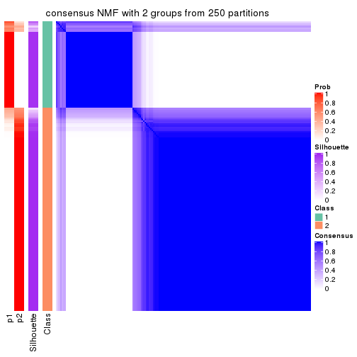</p>

</div>
<div id='tab-SD-NMF-consensus-heatmap-2'>
<pre><code class="r">consensus_heatmap(res, k = 3)
</code></pre>

<p>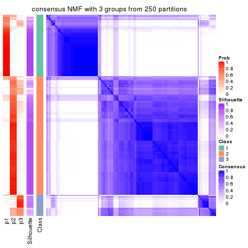</p>

</div>
<div id='tab-SD-NMF-consensus-heatmap-3'>
<pre><code class="r">consensus_heatmap(res, k = 4)
</code></pre>

<p>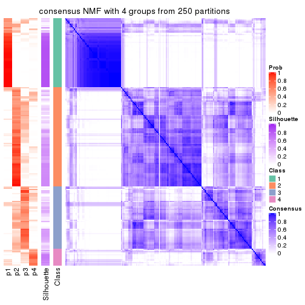</p>

</div>
<div id='tab-SD-NMF-consensus-heatmap-4'>
<pre><code class="r">consensus_heatmap(res, k = 5)
</code></pre>

<p>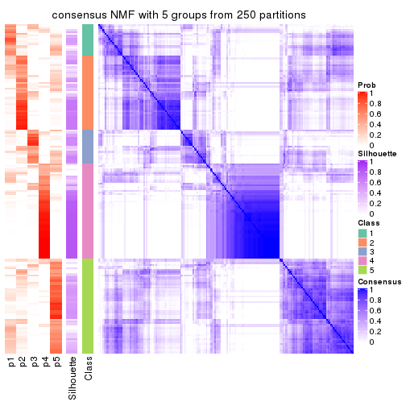</p>

</div>
<div id='tab-SD-NMF-consensus-heatmap-5'>
<pre><code class="r">consensus_heatmap(res, k = 6)
</code></pre>

<p>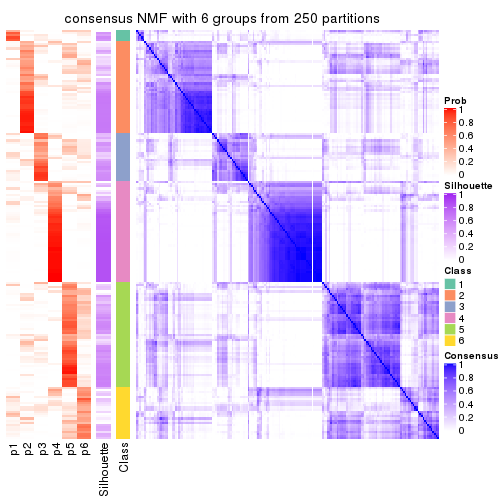</p>

</div>
</div>

Heatmaps for the membership of samples in all partitions to see how consistent they are:


<script>
$( function() {
	$( '#tabs-SD-NMF-membership-heatmap' ).tabs();
} );
</script>
<div id='tabs-SD-NMF-membership-heatmap'>
<ul>
<li><a href='#tab-SD-NMF-membership-heatmap-1'>k = 2</a></li>
<li><a href='#tab-SD-NMF-membership-heatmap-2'>k = 3</a></li>
<li><a href='#tab-SD-NMF-membership-heatmap-3'>k = 4</a></li>
<li><a href='#tab-SD-NMF-membership-heatmap-4'>k = 5</a></li>
<li><a href='#tab-SD-NMF-membership-heatmap-5'>k = 6</a></li>
</ul>
<div id='tab-SD-NMF-membership-heatmap-1'>
<pre><code class="r">membership_heatmap(res, k = 2)
</code></pre>

<p>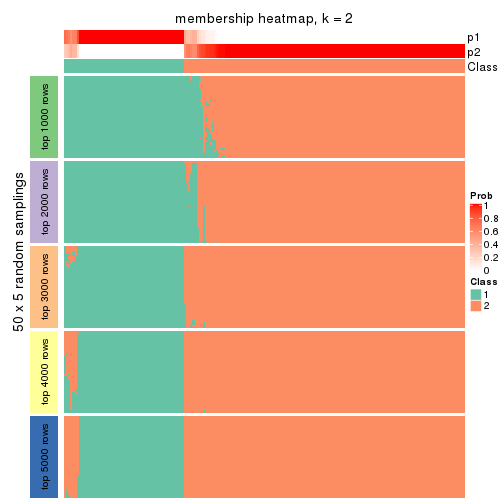</p>

</div>
<div id='tab-SD-NMF-membership-heatmap-2'>
<pre><code class="r">membership_heatmap(res, k = 3)
</code></pre>

<p>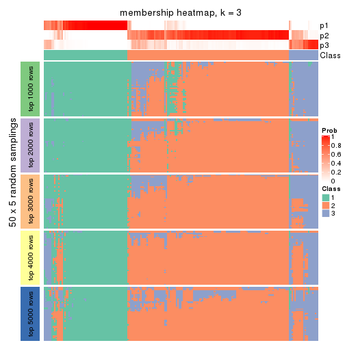</p>

</div>
<div id='tab-SD-NMF-membership-heatmap-3'>
<pre><code class="r">membership_heatmap(res, k = 4)
</code></pre>

<p>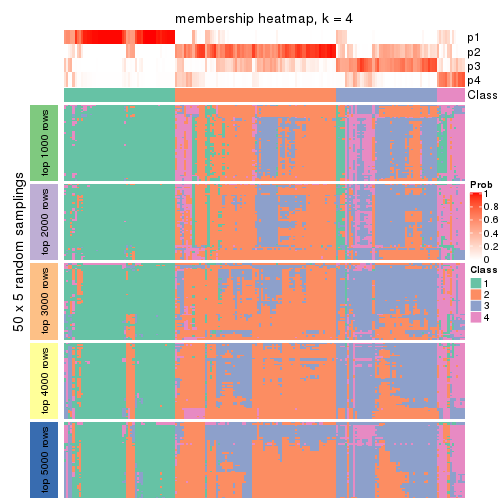</p>

</div>
<div id='tab-SD-NMF-membership-heatmap-4'>
<pre><code class="r">membership_heatmap(res, k = 5)
</code></pre>

<p>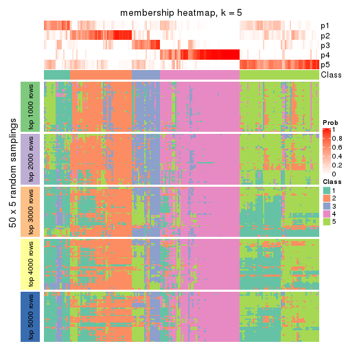</p>

</div>
<div id='tab-SD-NMF-membership-heatmap-5'>
<pre><code class="r">membership_heatmap(res, k = 6)
</code></pre>

<p>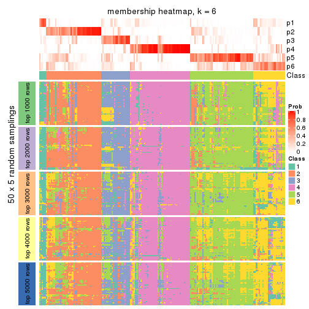</p>

</div>
</div>

As soon as we have had the classes for columns, we can look for signatures
which are significantly different between classes which can be candidate marks
for certain classes. Following are the heatmaps for signatures.


Signature heatmaps where rows are scaled:


<script>
$( function() {
	$( '#tabs-SD-NMF-get-signatures' ).tabs();
} );
</script>
<div id='tabs-SD-NMF-get-signatures'>
<ul>
<li><a href='#tab-SD-NMF-get-signatures-1'>k = 2</a></li>
<li><a href='#tab-SD-NMF-get-signatures-2'>k = 3</a></li>
<li><a href='#tab-SD-NMF-get-signatures-3'>k = 4</a></li>
<li><a href='#tab-SD-NMF-get-signatures-4'>k = 5</a></li>
<li><a href='#tab-SD-NMF-get-signatures-5'>k = 6</a></li>
</ul>
<div id='tab-SD-NMF-get-signatures-1'>
<pre><code class="r">get_signatures(res, k = 2)
</code></pre>

<p>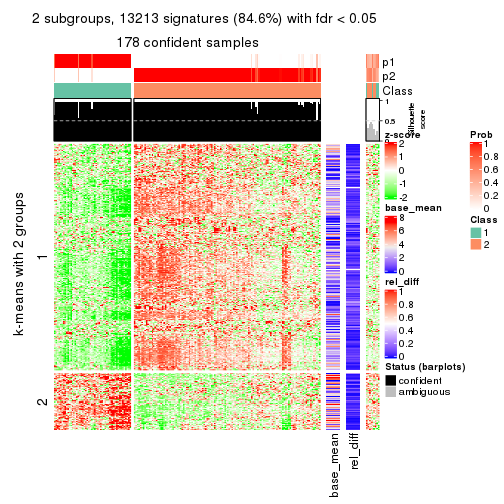</p>

</div>
<div id='tab-SD-NMF-get-signatures-2'>
<pre><code class="r">get_signatures(res, k = 3)
</code></pre>

<p>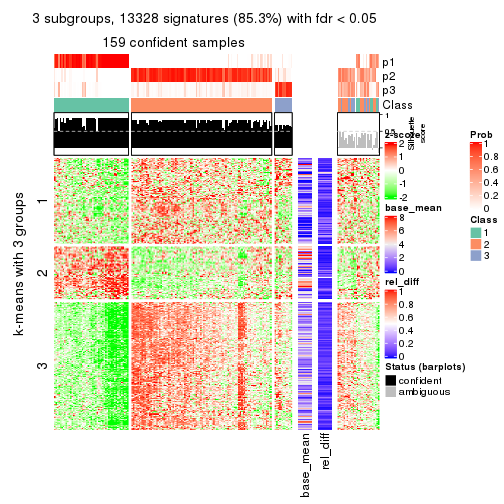</p>

</div>
<div id='tab-SD-NMF-get-signatures-3'>
<pre><code class="r">get_signatures(res, k = 4)
</code></pre>

<p>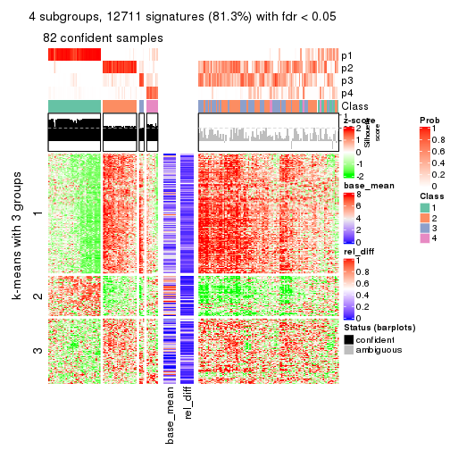</p>

</div>
<div id='tab-SD-NMF-get-signatures-4'>
<pre><code class="r">get_signatures(res, k = 5)
</code></pre>

<p>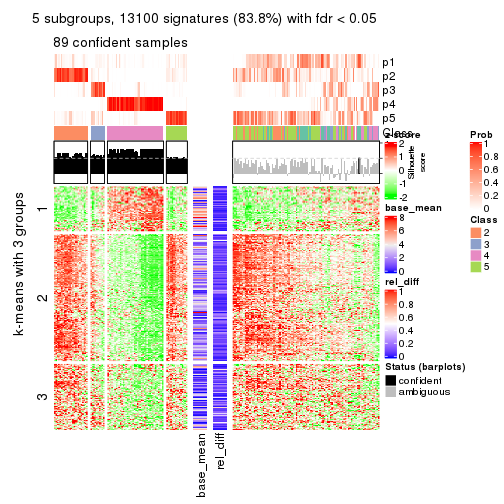</p>

</div>
<div id='tab-SD-NMF-get-signatures-5'>
<pre><code class="r">get_signatures(res, k = 6)
</code></pre>

<p>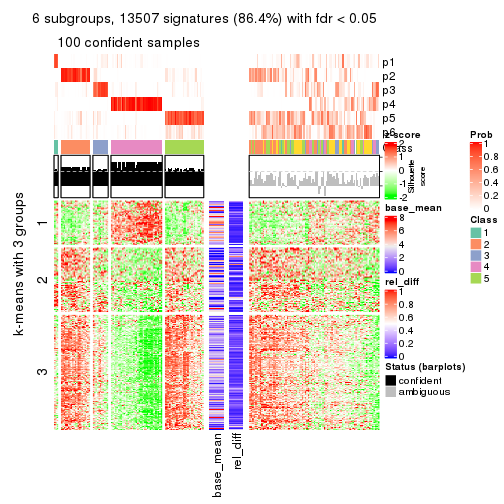</p>

</div>
</div>


Signature heatmaps where rows are not scaled:


<script>
$( function() {
	$( '#tabs-SD-NMF-get-signatures-no-scale' ).tabs();
} );
</script>
<div id='tabs-SD-NMF-get-signatures-no-scale'>
<ul>
<li><a href='#tab-SD-NMF-get-signatures-no-scale-1'>k = 2</a></li>
<li><a href='#tab-SD-NMF-get-signatures-no-scale-2'>k = 3</a></li>
<li><a href='#tab-SD-NMF-get-signatures-no-scale-3'>k = 4</a></li>
<li><a href='#tab-SD-NMF-get-signatures-no-scale-4'>k = 5</a></li>
<li><a href='#tab-SD-NMF-get-signatures-no-scale-5'>k = 6</a></li>
</ul>
<div id='tab-SD-NMF-get-signatures-no-scale-1'>
<pre><code class="r">get_signatures(res, k = 2, scale_rows = FALSE)
</code></pre>

<p>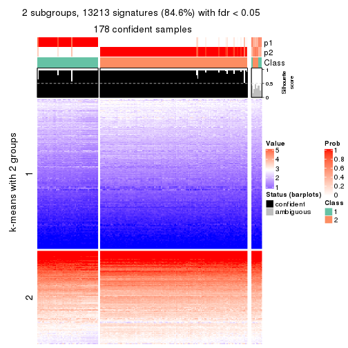</p>

</div>
<div id='tab-SD-NMF-get-signatures-no-scale-2'>
<pre><code class="r">get_signatures(res, k = 3, scale_rows = FALSE)
</code></pre>

<p>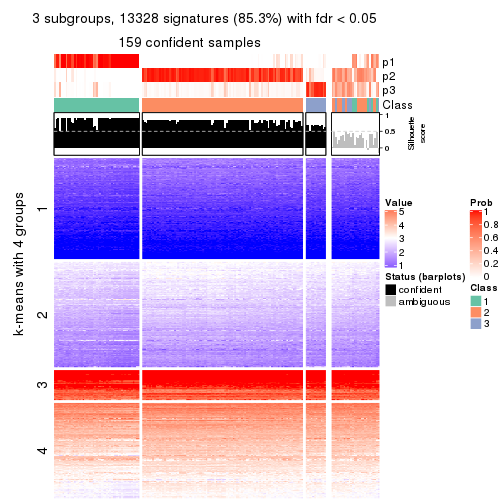</p>

</div>
<div id='tab-SD-NMF-get-signatures-no-scale-3'>
<pre><code class="r">get_signatures(res, k = 4, scale_rows = FALSE)
</code></pre>

<p>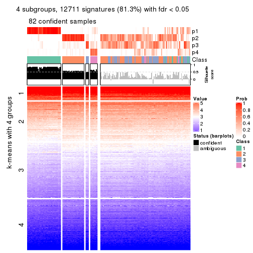</p>

</div>
<div id='tab-SD-NMF-get-signatures-no-scale-4'>
<pre><code class="r">get_signatures(res, k = 5, scale_rows = FALSE)
</code></pre>

<p>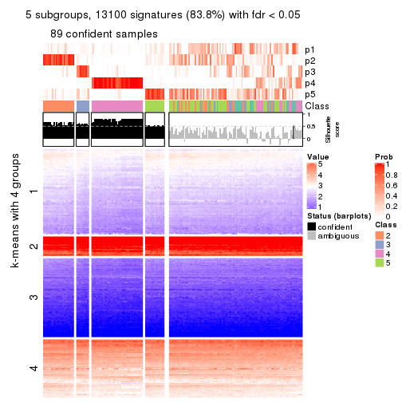</p>

</div>
<div id='tab-SD-NMF-get-signatures-no-scale-5'>
<pre><code class="r">get_signatures(res, k = 6, scale_rows = FALSE)
</code></pre>

<p>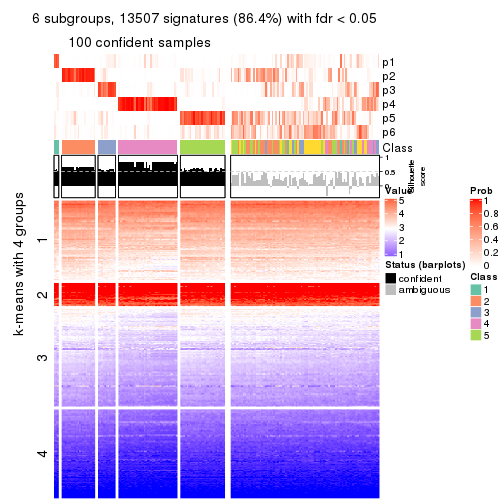</p>

</div>
</div>


Compare the overlap of signatures from different k:

```r
compare_signatures(res)
```

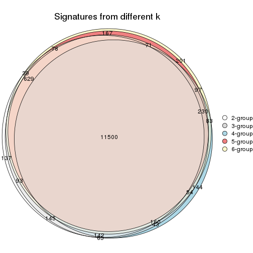

`get_signature()` returns a data frame invisibly. TO get the list of signatures, the function
call should be assigned to a variable explicitly. In following code, if `plot` argument is set
to `FALSE`, no heatmap is plotted while only the differential analysis is performed.

```r
# code only for demonstration
tb = get_signature(res, k = ..., plot = FALSE)
```

An example of the output of `tb` is:

```
#>   which_row         fdr    mean_1    mean_2 scaled_mean_1 scaled_mean_2 km
#> 1        38 0.042760348  8.373488  9.131774    -0.5533452     0.5164555  1
#> 2        40 0.018707592  7.106213  8.469186    -0.6173731     0.5762149  1
#> 3        55 0.019134737 10.221463 11.207825    -0.6159697     0.5749050  1
#> 4        59 0.006059896  5.921854  7.869574    -0.6899429     0.6439467  1
#> 5        60 0.018055526  8.928898 10.211722    -0.6204761     0.5791110  1
#> 6        98 0.009384629 15.714769 14.887706     0.6635654    -0.6193277  2
...
```

The columns in `tb` are:

1. `which_row`: row indices corresponding to the input matrix.
2. `fdr`: FDR for the differential test. 
3. `mean_x`: The mean value in group x.
4. `scaled_mean_x`: The mean value in group x after rows are scaled.
5. `km`: Row groups if k-means clustering is applied to rows.


UMAP plot which shows how samples are separated.


<script>
$( function() {
	$( '#tabs-SD-NMF-dimension-reduction' ).tabs();
} );
</script>
<div id='tabs-SD-NMF-dimension-reduction'>
<ul>
<li><a href='#tab-SD-NMF-dimension-reduction-1'>k = 2</a></li>
<li><a href='#tab-SD-NMF-dimension-reduction-2'>k = 3</a></li>
<li><a href='#tab-SD-NMF-dimension-reduction-3'>k = 4</a></li>
<li><a href='#tab-SD-NMF-dimension-reduction-4'>k = 5</a></li>
<li><a href='#tab-SD-NMF-dimension-reduction-5'>k = 6</a></li>
</ul>
<div id='tab-SD-NMF-dimension-reduction-1'>
<pre><code class="r">dimension_reduction(res, k = 2, method = &quot;UMAP&quot;)
</code></pre>

<p>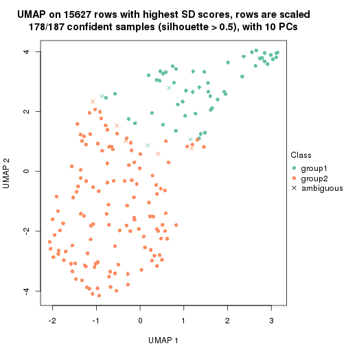</p>

</div>
<div id='tab-SD-NMF-dimension-reduction-2'>
<pre><code class="r">dimension_reduction(res, k = 3, method = &quot;UMAP&quot;)
</code></pre>

<p>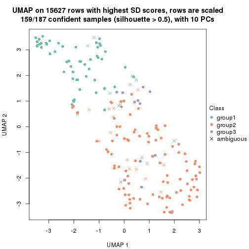</p>

</div>
<div id='tab-SD-NMF-dimension-reduction-3'>
<pre><code class="r">dimension_reduction(res, k = 4, method = &quot;UMAP&quot;)
</code></pre>

<p>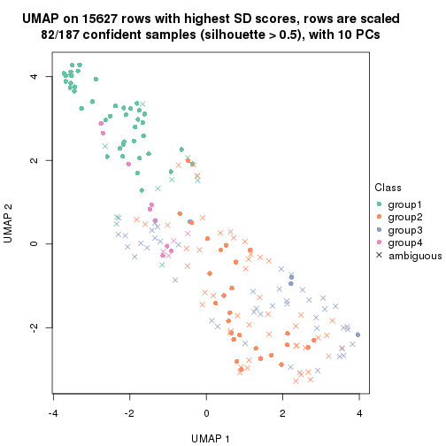</p>

</div>
<div id='tab-SD-NMF-dimension-reduction-4'>
<pre><code class="r">dimension_reduction(res, k = 5, method = &quot;UMAP&quot;)
</code></pre>

<p>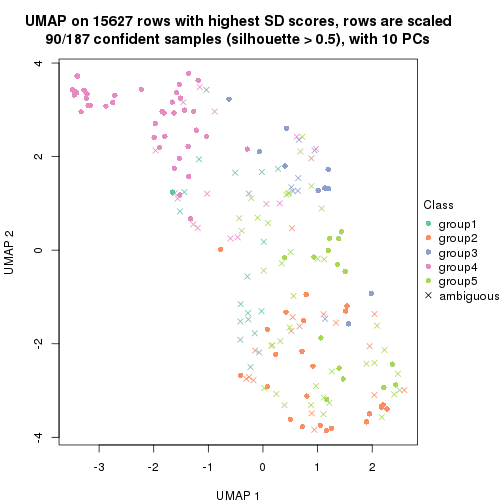</p>

</div>
<div id='tab-SD-NMF-dimension-reduction-5'>
<pre><code class="r">dimension_reduction(res, k = 6, method = &quot;UMAP&quot;)
</code></pre>

<p>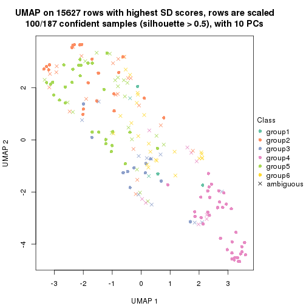</p>

</div>
</div>


Following heatmap shows how subgroups are split when increasing `k`:

```r
collect_classes(res)
```

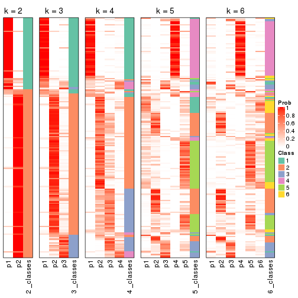


If matrix rows can be associated to genes, consider to use `GO_Enrichment(res,
...)` to perform function enrichment for the signature genes.


 

---------------------------------------------------


### CV:hclust


The object with results only for a single top-value method and a single partition method 
can be extracted as:

```r
res = res_list["CV", "hclust"]
# you can also extract it by
# res = res_list["CV:hclust"]
```

A summary of `res` and all the functions that can be applied to it:

```r
res
```

```
#> A 'ConsensusPartition' object with k = 2, 3, 4, 5, 6.
#>   On a matrix with 15627 rows and 187 columns.
#>   Top rows (1000, 2000, 3000, 4000, 5000) are extracted by 'CV' method.
#>   Subgroups are detected by 'hclust' method.
#>   Performed in total 1250 partitions by row resampling.
#>   Best k for subgroups seems to be 3.
#> 
#> Following methods can be applied to this 'ConsensusPartition' object:
#>  [1] "cola_report"             "collect_classes"         "collect_plots"          
#>  [4] "collect_stats"           "colnames"                "compare_signatures"     
#>  [7] "consensus_heatmap"       "dimension_reduction"     "functional_enrichment"  
#> [10] "get_anno_col"            "get_anno"                "get_classes"            
#> [13] "get_consensus"           "get_matrix"              "get_membership"         
#> [16] "get_param"               "get_signatures"          "get_stats"              
#> [19] "is_best_k"               "is_stable_k"             "membership_heatmap"     
#> [22] "ncol"                    "nrow"                    "plot_ecdf"              
#> [25] "rownames"                "select_partition_number" "show"                   
#> [28] "suggest_best_k"          "test_to_known_factors"
```

`collect_plots()` function collects all the plots made from `res` for all `k` (number of partitions)
into one single page to provide an easy and fast comparison between different `k`.

```r
collect_plots(res)
```

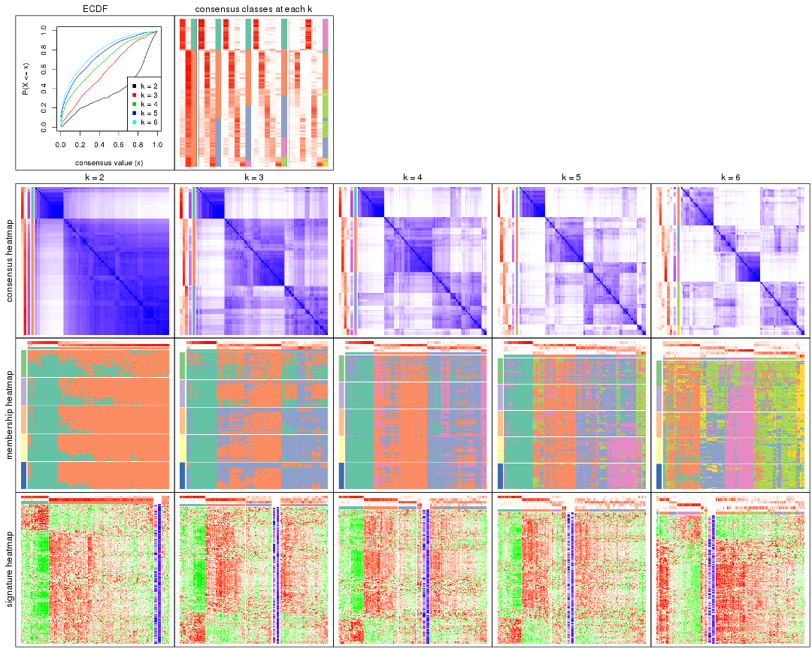

The plots are:

- The first row: a plot of the ECDF (Empirical cumulative distribution
  function) curves of the consensus matrix for each `k` and the heatmap of
  predicted classes for each `k`.
- The second row: heatmaps of the consensus matrix for each `k`.
- The third row: heatmaps of the membership matrix for each `k`.
- The fouth row: heatmaps of the signatures for each `k`.

All the plots in panels can be made by individual functions and they are
plotted later in this section.

`select_partition_number()` produces several plots showing different
statistics for choosing "optimized" `k`. There are following statistics:

- ECDF curves of the consensus matrix for each `k`;
- 1-PAC. [The PAC
  score](https://en.wikipedia.org/wiki/Consensus_clustering#Over-interpretation_potential_of_consensus_clustering)
  measures the proportion of the ambiguous subgrouping.
- Mean silhouette score.
- Concordance. The mean probability of fiting the consensus class ids in all
  partitions.
- Area increased. Denote $A_k$ as the area under the ECDF curve for current
  `k`, the area increased is defined as $A_k - A_{k-1}$.
- Rand index. The percent of pairs of samples that are both in a same cluster
  or both are not in a same cluster in the partition of k and k-1.
- Jaccard index. The ratio of pairs of samples are both in a same cluster in
  the partition of k and k-1 and the pairs of samples are both in a same
  cluster in the partition k or k-1.

The detailed explanations of these statistics can be found in [the cola
vignette](http://bioconductor.org/packages/devel/bioc/vignettes/cola/inst/doc/cola.html#toc_13).

Generally speaking, lower PAC score, higher mean silhouette score or higher
concordance corresponds to better partition. Rand index and Jaccard index
measure how similar the current partition is compared to partition with `k-1`.
If they are too similar, we won't accept `k` is better than `k-1`.

```r
select_partition_number(res)
```

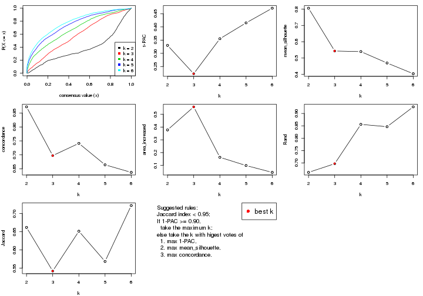

The numeric values for all these statistics can be obtained by `get_stats()`.

```r
get_stats(res)
```

```
#>   k 1-PAC mean_silhouette concordance area_increased  Rand Jaccard
#> 2 2 0.330           0.806       0.872         0.3774 0.662   0.662
#> 3 3 0.223           0.543       0.697         0.5579 0.697   0.542
#> 4 4 0.355           0.539       0.741         0.1633 0.856   0.651
#> 5 5 0.415           0.470       0.664         0.0989 0.846   0.569
#> 6 6 0.471           0.404       0.637         0.0454 0.927   0.722
```

`suggest_best_k()` suggests the best $k$ based on these statistics. The rules are as follows:

- All $k$ with Jaccard index larger than 0.95 are removed because the increase of
  the partition number does not provides enough extra information. If all $k$ are removed,
  the best $k$ is assigned by `NA`.
- For $k$ with 1-PAC larger than 0.9, the maximal $k$ is taken as the "best k". Other $k$ is called "optional k".
- If it does not fit the second rule. The $k$ with the highest vote of highest
  1-PAC, mean silhouette and concordance is taken as the "best k".

```r
suggest_best_k(res)
```

```
#> [1] 3
```


Following shows the table of the partitions (You need to click the **show/hide
code output** link to see it). The membership matrix (columns with name `p*`)
is inferred by
[`clue::cl_consensus()`](https://www.rdocumentation.org/link/cl_consensus?package=clue)
function with the `SE` method. Basically the value in the membership matrix
represents the probability to belong to a certain group. The finall class
label for an item is determined with the group with highest probability it
belongs to.

In `get_classes()` function, the entropy is calculated from the membership
matrix and the silhouette score is calculated from the consensus matrix.


<script>
$( function() {
	$( '#tabs-CV-hclust-get-classes' ).tabs();
} );
</script>
<div id='tabs-CV-hclust-get-classes'>
<ul>
<li><a href='#tab-CV-hclust-get-classes-1'>k = 2</a></li>
<li><a href='#tab-CV-hclust-get-classes-2'>k = 3</a></li>
<li><a href='#tab-CV-hclust-get-classes-3'>k = 4</a></li>
<li><a href='#tab-CV-hclust-get-classes-4'>k = 5</a></li>
<li><a href='#tab-CV-hclust-get-classes-5'>k = 6</a></li>
</ul>

<div id='tab-CV-hclust-get-classes-1'>
<p><a id='tab-CV-hclust-get-classes-1-a' style='color:#0366d6' href='#'>show/hide code output</a></p>
<pre><code class="r">cbind(get_classes(res, k = 2), get_membership(res, k = 2))
</code></pre>

<pre><code>#&gt;            class entropy silhouette    p1    p2
#&gt; SRR1747213     1  0.5294      0.874 0.880 0.120
#&gt; SRR1747214     1  0.5294      0.874 0.880 0.120
#&gt; SRR1747215     2  0.0672      0.862 0.008 0.992
#&gt; SRR1747216     2  0.0672      0.862 0.008 0.992
#&gt; SRR1747217     2  0.3584      0.873 0.068 0.932
#&gt; SRR1747218     2  0.3584      0.873 0.068 0.932
#&gt; SRR1747219     2  0.9286      0.649 0.344 0.656
#&gt; SRR1747220     2  0.9286      0.649 0.344 0.656
#&gt; SRR1747221     2  0.9732      0.502 0.404 0.596
#&gt; SRR1747222     2  0.8909      0.681 0.308 0.692
#&gt; SRR1747223     2  0.9580      0.562 0.380 0.620
#&gt; SRR1747224     2  0.9580      0.562 0.380 0.620
#&gt; SRR1747225     2  0.1184      0.865 0.016 0.984
#&gt; SRR1747226     2  0.1184      0.865 0.016 0.984
#&gt; SRR1747227     2  0.5519      0.859 0.128 0.872
#&gt; SRR1747228     2  0.5519      0.859 0.128 0.872
#&gt; SRR1747229     2  0.1414      0.856 0.020 0.980
#&gt; SRR1747230     1  0.2236      0.907 0.964 0.036
#&gt; SRR1747231     1  0.2236      0.907 0.964 0.036
#&gt; SRR1747232     1  0.2236      0.907 0.964 0.036
#&gt; SRR1747233     2  0.8144      0.747 0.252 0.748
#&gt; SRR1747234     2  0.6343      0.840 0.160 0.840
#&gt; SRR1747235     1  0.4022      0.897 0.920 0.080
#&gt; SRR1747236     2  0.4298      0.873 0.088 0.912
#&gt; SRR1747237     2  0.1414      0.854 0.020 0.980
#&gt; SRR1747238     2  0.1414      0.854 0.020 0.980
#&gt; SRR1747239     2  0.1184      0.853 0.016 0.984
#&gt; SRR1747240     1  0.2236      0.907 0.964 0.036
#&gt; SRR1747241     2  0.9983      0.280 0.476 0.524
#&gt; SRR1747242     1  0.4161      0.895 0.916 0.084
#&gt; SRR1747243     2  0.4431      0.869 0.092 0.908
#&gt; SRR1747244     2  0.4431      0.869 0.092 0.908
#&gt; SRR1747245     2  0.2778      0.872 0.048 0.952
#&gt; SRR1747246     2  0.2778      0.872 0.048 0.952
#&gt; SRR1747247     1  0.2236      0.907 0.964 0.036
#&gt; SRR1747248     1  0.2236      0.907 0.964 0.036
#&gt; SRR1747249     2  0.8016      0.769 0.244 0.756
#&gt; SRR1747250     2  0.8016      0.769 0.244 0.756
#&gt; SRR1747252     2  0.9323      0.643 0.348 0.652
#&gt; SRR1747253     2  0.6247      0.832 0.156 0.844
#&gt; SRR1747254     2  0.2948      0.871 0.052 0.948
#&gt; SRR1747255     1  0.8608      0.595 0.716 0.284
#&gt; SRR1747256     1  0.8608      0.595 0.716 0.284
#&gt; SRR1747257     2  0.5629      0.860 0.132 0.868
#&gt; SRR1747258     2  0.5629      0.860 0.132 0.868
#&gt; SRR1747259     2  0.3274      0.848 0.060 0.940
#&gt; SRR1747260     2  0.3274      0.848 0.060 0.940
#&gt; SRR1747261     2  0.5294      0.862 0.120 0.880
#&gt; SRR1747262     2  0.5294      0.862 0.120 0.880
#&gt; SRR1747263     2  0.4298      0.871 0.088 0.912
#&gt; SRR1747264     1  0.4939      0.884 0.892 0.108
#&gt; SRR1747265     2  0.7528      0.801 0.216 0.784
#&gt; SRR1747266     2  0.7528      0.801 0.216 0.784
#&gt; SRR1747267     2  0.8144      0.769 0.252 0.748
#&gt; SRR1747268     2  0.6343      0.843 0.160 0.840
#&gt; SRR1747269     2  0.4161      0.871 0.084 0.916
#&gt; SRR1747270     2  0.4161      0.871 0.084 0.916
#&gt; SRR1747271     2  0.3879      0.860 0.076 0.924
#&gt; SRR1747272     2  0.3879      0.860 0.076 0.924
#&gt; SRR1747273     1  0.7528      0.738 0.784 0.216
#&gt; SRR1747274     2  0.8207      0.764 0.256 0.744
#&gt; SRR1747275     1  0.5737      0.854 0.864 0.136
#&gt; SRR1747276     1  0.5737      0.854 0.864 0.136
#&gt; SRR1747277     2  0.1633      0.867 0.024 0.976
#&gt; SRR1747278     2  0.1633      0.867 0.024 0.976
#&gt; SRR1747280     1  0.2236      0.907 0.964 0.036
#&gt; SRR1747279     1  0.2423      0.907 0.960 0.040
#&gt; SRR1747281     2  0.5178      0.864 0.116 0.884
#&gt; SRR1747282     1  0.4939      0.880 0.892 0.108
#&gt; SRR1747283     1  0.9815      0.145 0.580 0.420
#&gt; SRR1747284     1  0.9815      0.145 0.580 0.420
#&gt; SRR1747285     2  0.4939      0.843 0.108 0.892
#&gt; SRR1747286     2  0.4939      0.843 0.108 0.892
#&gt; SRR1747287     2  0.5629      0.860 0.132 0.868
#&gt; SRR1747288     2  0.5629      0.860 0.132 0.868
#&gt; SRR1747290     2  0.2423      0.863 0.040 0.960
#&gt; SRR1747289     2  0.2423      0.863 0.040 0.960
#&gt; SRR1747291     2  0.7528      0.797 0.216 0.784
#&gt; SRR1747293     2  0.2043      0.871 0.032 0.968
#&gt; SRR1747294     2  0.2043      0.871 0.032 0.968
#&gt; SRR1747292     2  0.7528      0.797 0.216 0.784
#&gt; SRR1747295     2  0.3274      0.848 0.060 0.940
#&gt; SRR1747296     2  0.3274      0.848 0.060 0.940
#&gt; SRR1747297     2  0.2948      0.871 0.052 0.948
#&gt; SRR1747298     2  0.2948      0.871 0.052 0.948
#&gt; SRR1747299     2  0.2948      0.872 0.052 0.948
#&gt; SRR1747300     2  0.2948      0.872 0.052 0.948
#&gt; SRR1747301     2  0.1414      0.856 0.020 0.980
#&gt; SRR1747302     2  0.1414      0.856 0.020 0.980
#&gt; SRR1747303     2  0.4815      0.868 0.104 0.896
#&gt; SRR1747304     1  0.2236      0.907 0.964 0.036
#&gt; SRR1747305     2  0.0672      0.862 0.008 0.992
#&gt; SRR1747306     2  0.0672      0.862 0.008 0.992
#&gt; SRR1747307     2  0.5946      0.840 0.144 0.856
#&gt; SRR1747308     2  0.5946      0.840 0.144 0.856
#&gt; SRR1747309     1  0.2948      0.907 0.948 0.052
#&gt; SRR1747310     1  0.2778      0.907 0.952 0.048
#&gt; SRR1747311     2  0.9522      0.582 0.372 0.628
#&gt; SRR1747313     2  0.8267      0.748 0.260 0.740
#&gt; SRR1747312     1  0.2423      0.908 0.960 0.040
#&gt; SRR1747314     1  0.4161      0.894 0.916 0.084
#&gt; SRR1747315     2  0.3733      0.872 0.072 0.928
#&gt; SRR1747316     2  0.3733      0.872 0.072 0.928
#&gt; SRR1747318     2  0.4161      0.859 0.084 0.916
#&gt; SRR1747317     2  0.4161      0.859 0.084 0.916
#&gt; SRR1747319     2  1.0000      0.179 0.496 0.504
#&gt; SRR1747320     2  1.0000      0.179 0.496 0.504
#&gt; SRR1747322     1  0.2236      0.907 0.964 0.036
#&gt; SRR1747321     1  0.2236      0.907 0.964 0.036
#&gt; SRR1747323     2  0.0938      0.864 0.012 0.988
#&gt; SRR1747324     2  0.0938      0.864 0.012 0.988
#&gt; SRR1747326     2  0.0000      0.860 0.000 1.000
#&gt; SRR1747325     2  0.0000      0.860 0.000 1.000
#&gt; SRR1747327     2  0.6148      0.848 0.152 0.848
#&gt; SRR1747328     2  0.6148      0.848 0.152 0.848
#&gt; SRR1747330     2  0.2948      0.873 0.052 0.948
#&gt; SRR1747329     2  0.2948      0.873 0.052 0.948
#&gt; SRR1747332     2  0.9552      0.601 0.376 0.624
#&gt; SRR1747331     2  0.9552      0.601 0.376 0.624
#&gt; SRR1747333     2  0.2423      0.871 0.040 0.960
#&gt; SRR1747334     2  0.2423      0.871 0.040 0.960
#&gt; SRR1747335     2  0.9983      0.335 0.476 0.524
#&gt; SRR1747336     1  0.2236      0.907 0.964 0.036
#&gt; SRR1747337     2  0.1184      0.853 0.016 0.984
#&gt; SRR1747338     2  0.1184      0.853 0.016 0.984
#&gt; SRR1747339     2  0.6343      0.843 0.160 0.840
#&gt; SRR1747340     2  0.6343      0.843 0.160 0.840
#&gt; SRR1747341     2  0.1414      0.856 0.020 0.980
#&gt; SRR1747342     2  0.1414      0.856 0.020 0.980
#&gt; SRR1747343     2  0.0938      0.864 0.012 0.988
#&gt; SRR1747344     2  0.0938      0.864 0.012 0.988
#&gt; SRR1747345     2  0.8499      0.705 0.276 0.724
#&gt; SRR1747346     2  0.5946      0.846 0.144 0.856
#&gt; SRR1747347     2  0.0376      0.858 0.004 0.996
#&gt; SRR1747348     1  0.2236      0.907 0.964 0.036
#&gt; SRR1747349     1  0.9286      0.434 0.656 0.344
#&gt; SRR1747351     2  0.4022      0.872 0.080 0.920
#&gt; SRR1747350     2  0.8081      0.776 0.248 0.752
#&gt; SRR1747352     1  0.2236      0.907 0.964 0.036
#&gt; SRR1747353     2  0.5737      0.859 0.136 0.864
#&gt; SRR1747354     2  0.5737      0.859 0.136 0.864
#&gt; SRR1747355     2  0.8267      0.754 0.260 0.740
#&gt; SRR1747356     2  0.8267      0.754 0.260 0.740
#&gt; SRR1747357     2  0.8813      0.712 0.300 0.700
#&gt; SRR1747358     2  0.8813      0.712 0.300 0.700
#&gt; SRR1747359     1  0.8955      0.600 0.688 0.312
#&gt; SRR1747360     2  0.4939      0.864 0.108 0.892
#&gt; SRR1747361     2  0.5737      0.858 0.136 0.864
#&gt; SRR1747362     2  0.5737      0.858 0.136 0.864
#&gt; SRR1747363     2  0.9970      0.317 0.468 0.532
#&gt; SRR1747364     2  0.9970      0.317 0.468 0.532
#&gt; SRR1747365     2  0.5629      0.857 0.132 0.868
#&gt; SRR1747366     2  0.5629      0.857 0.132 0.868
#&gt; SRR1747367     2  0.9970      0.317 0.468 0.532
#&gt; SRR1747369     2  0.2236      0.841 0.036 0.964
#&gt; SRR1747368     2  0.7950      0.772 0.240 0.760
#&gt; SRR1747370     2  0.5946      0.852 0.144 0.856
#&gt; SRR1747372     1  0.2948      0.906 0.948 0.052
#&gt; SRR1747371     1  0.2948      0.906 0.948 0.052
#&gt; SRR1747373     2  0.0672      0.857 0.008 0.992
#&gt; SRR1747374     2  0.0672      0.857 0.008 0.992
#&gt; SRR1747375     2  0.2236      0.870 0.036 0.964
#&gt; SRR1747376     2  0.2236      0.870 0.036 0.964
#&gt; SRR1747377     2  0.1184      0.853 0.016 0.984
#&gt; SRR1747378     2  0.1184      0.853 0.016 0.984
#&gt; SRR1747379     2  0.4939      0.866 0.108 0.892
#&gt; SRR1747380     2  0.5946      0.846 0.144 0.856
#&gt; SRR1747381     1  0.3879      0.899 0.924 0.076
#&gt; SRR1747382     1  0.3879      0.899 0.924 0.076
#&gt; SRR1747383     2  0.5294      0.866 0.120 0.880
#&gt; SRR1747384     2  0.5294      0.866 0.120 0.880
#&gt; SRR1747385     2  0.4431      0.870 0.092 0.908
#&gt; SRR1747386     1  0.2236      0.907 0.964 0.036
#&gt; SRR1747387     2  0.2043      0.843 0.032 0.968
#&gt; SRR1747388     2  0.2043      0.843 0.032 0.968
#&gt; SRR1747390     2  0.5842      0.856 0.140 0.860
#&gt; SRR1747389     2  0.5842      0.856 0.140 0.860
#&gt; SRR1747391     2  0.1633      0.868 0.024 0.976
#&gt; SRR1747392     2  0.1633      0.868 0.024 0.976
#&gt; SRR1747393     2  0.7219      0.815 0.200 0.800
#&gt; SRR1747394     2  0.9522      0.582 0.372 0.628
#&gt; SRR1747395     2  0.0938      0.862 0.012 0.988
#&gt; SRR1747396     2  0.0938      0.862 0.012 0.988
#&gt; SRR1747398     2  0.1184      0.853 0.016 0.984
#&gt; SRR1747397     2  0.1843      0.858 0.028 0.972
#&gt; SRR1747399     1  0.2236      0.907 0.964 0.036
#&gt; SRR1747400     1  0.2236      0.907 0.964 0.036
</code></pre>

<script>
$('#tab-CV-hclust-get-classes-1-a').parent().next().next().hide();
$('#tab-CV-hclust-get-classes-1-a').click(function(){
  $('#tab-CV-hclust-get-classes-1-a').parent().next().next().toggle();
  return(false);
});
</script>
</div>

<div id='tab-CV-hclust-get-classes-2'>
<p><a id='tab-CV-hclust-get-classes-2-a' style='color:#0366d6' href='#'>show/hide code output</a></p>
<pre><code class="r">cbind(get_classes(res, k = 3), get_membership(res, k = 3))
</code></pre>

<pre><code>#&gt;            class entropy silhouette    p1    p2    p3
#&gt; SRR1747213     1  0.4095     0.8359 0.880 0.064 0.056
#&gt; SRR1747214     1  0.4095     0.8359 0.880 0.064 0.056
#&gt; SRR1747215     2  0.0829     0.6775 0.004 0.984 0.012
#&gt; SRR1747216     2  0.0829     0.6775 0.004 0.984 0.012
#&gt; SRR1747217     2  0.7658     0.3331 0.056 0.588 0.356
#&gt; SRR1747218     2  0.7658     0.3331 0.056 0.588 0.356
#&gt; SRR1747219     3  0.9137     0.6361 0.276 0.188 0.536
#&gt; SRR1747220     3  0.9137     0.6361 0.276 0.188 0.536
#&gt; SRR1747221     3  0.9292     0.6108 0.332 0.176 0.492
#&gt; SRR1747222     3  0.8576     0.6230 0.240 0.160 0.600
#&gt; SRR1747223     3  0.9339     0.6133 0.316 0.188 0.496
#&gt; SRR1747224     3  0.9339     0.6133 0.316 0.188 0.496
#&gt; SRR1747225     2  0.1999     0.6843 0.012 0.952 0.036
#&gt; SRR1747226     2  0.1999     0.6843 0.012 0.952 0.036
#&gt; SRR1747227     2  0.6981     0.5604 0.136 0.732 0.132
#&gt; SRR1747228     2  0.6981     0.5604 0.136 0.732 0.132
#&gt; SRR1747229     2  0.5325     0.6212 0.004 0.748 0.248
#&gt; SRR1747230     1  0.0237     0.8803 0.996 0.004 0.000
#&gt; SRR1747231     1  0.0237     0.8803 0.996 0.004 0.000
#&gt; SRR1747232     1  0.0237     0.8803 0.996 0.004 0.000
#&gt; SRR1747233     3  0.7829     0.5911 0.164 0.164 0.672
#&gt; SRR1747234     3  0.6318     0.5771 0.068 0.172 0.760
#&gt; SRR1747235     1  0.3155     0.8586 0.916 0.044 0.040
#&gt; SRR1747236     2  0.7903     0.4087 0.068 0.576 0.356
#&gt; SRR1747237     2  0.6672     0.2772 0.008 0.520 0.472
#&gt; SRR1747238     2  0.6672     0.2772 0.008 0.520 0.472
#&gt; SRR1747239     2  0.2537     0.6761 0.000 0.920 0.080
#&gt; SRR1747240     1  0.0237     0.8803 0.996 0.004 0.000
#&gt; SRR1747241     3  0.9009     0.4521 0.404 0.132 0.464
#&gt; SRR1747242     1  0.3039     0.8596 0.920 0.044 0.036
#&gt; SRR1747243     2  0.7911     0.3905 0.096 0.632 0.272
#&gt; SRR1747244     2  0.7911     0.3905 0.096 0.632 0.272
#&gt; SRR1747245     2  0.3155     0.6810 0.040 0.916 0.044
#&gt; SRR1747246     2  0.3155     0.6810 0.040 0.916 0.044
#&gt; SRR1747247     1  0.0237     0.8803 0.996 0.004 0.000
#&gt; SRR1747248     1  0.0237     0.8803 0.996 0.004 0.000
#&gt; SRR1747249     3  0.8603     0.6227 0.168 0.232 0.600
#&gt; SRR1747250     3  0.8603     0.6227 0.168 0.232 0.600
#&gt; SRR1747252     3  0.9083     0.6376 0.280 0.180 0.540
#&gt; SRR1747253     3  0.4165     0.5254 0.076 0.048 0.876
#&gt; SRR1747254     3  0.7513     0.0472 0.052 0.344 0.604
#&gt; SRR1747255     1  0.7128     0.4642 0.684 0.064 0.252
#&gt; SRR1747256     1  0.7128     0.4642 0.684 0.064 0.252
#&gt; SRR1747257     3  0.8843     0.2439 0.116 0.436 0.448
#&gt; SRR1747258     3  0.8843     0.2439 0.116 0.436 0.448
#&gt; SRR1747259     3  0.3941     0.3926 0.000 0.156 0.844
#&gt; SRR1747260     3  0.3941     0.3926 0.000 0.156 0.844
#&gt; SRR1747261     2  0.8754     0.0740 0.124 0.532 0.344
#&gt; SRR1747262     2  0.8754     0.0740 0.124 0.532 0.344
#&gt; SRR1747263     2  0.4868     0.6507 0.100 0.844 0.056
#&gt; SRR1747264     1  0.3415     0.8399 0.900 0.080 0.020
#&gt; SRR1747265     3  0.9072     0.5436 0.168 0.300 0.532
#&gt; SRR1747266     3  0.9072     0.5436 0.168 0.300 0.532
#&gt; SRR1747267     3  0.8925     0.6169 0.180 0.256 0.564
#&gt; SRR1747268     2  0.9172    -0.1889 0.148 0.456 0.396
#&gt; SRR1747269     2  0.8202     0.3564 0.080 0.544 0.376
#&gt; SRR1747270     2  0.8202     0.3564 0.080 0.544 0.376
#&gt; SRR1747271     3  0.5551     0.4919 0.016 0.224 0.760
#&gt; SRR1747272     3  0.5551     0.4919 0.016 0.224 0.760
#&gt; SRR1747273     1  0.5835     0.6678 0.784 0.052 0.164
#&gt; SRR1747274     3  0.9872     0.3598 0.256 0.372 0.372
#&gt; SRR1747275     1  0.4015     0.8020 0.876 0.096 0.028
#&gt; SRR1747276     1  0.4015     0.8020 0.876 0.096 0.028
#&gt; SRR1747277     2  0.4634     0.6353 0.012 0.824 0.164
#&gt; SRR1747278     2  0.4634     0.6353 0.012 0.824 0.164
#&gt; SRR1747280     1  0.0424     0.8810 0.992 0.008 0.000
#&gt; SRR1747279     1  0.0848     0.8803 0.984 0.008 0.008
#&gt; SRR1747281     2  0.6063     0.6088 0.132 0.784 0.084
#&gt; SRR1747282     1  0.3272     0.8341 0.904 0.080 0.016
#&gt; SRR1747283     1  0.7948    -0.1381 0.520 0.060 0.420
#&gt; SRR1747284     1  0.7948    -0.1381 0.520 0.060 0.420
#&gt; SRR1747285     3  0.1643     0.4644 0.000 0.044 0.956
#&gt; SRR1747286     3  0.1643     0.4644 0.000 0.044 0.956
#&gt; SRR1747287     2  0.8963    -0.1085 0.128 0.468 0.404
#&gt; SRR1747288     2  0.8963    -0.1085 0.128 0.468 0.404
#&gt; SRR1747290     2  0.6896     0.4200 0.020 0.588 0.392
#&gt; SRR1747289     2  0.6896     0.4200 0.020 0.588 0.392
#&gt; SRR1747291     3  0.9120     0.5232 0.156 0.340 0.504
#&gt; SRR1747293     2  0.6935     0.3027 0.024 0.604 0.372
#&gt; SRR1747294     2  0.6935     0.3027 0.024 0.604 0.372
#&gt; SRR1747292     3  0.9120     0.5232 0.156 0.340 0.504
#&gt; SRR1747295     3  0.3941     0.3926 0.000 0.156 0.844
#&gt; SRR1747296     3  0.3941     0.3926 0.000 0.156 0.844
#&gt; SRR1747297     2  0.3009     0.6729 0.052 0.920 0.028
#&gt; SRR1747298     2  0.3009     0.6729 0.052 0.920 0.028
#&gt; SRR1747299     2  0.2982     0.6782 0.056 0.920 0.024
#&gt; SRR1747300     2  0.2982     0.6782 0.056 0.920 0.024
#&gt; SRR1747301     2  0.2384     0.6762 0.008 0.936 0.056
#&gt; SRR1747302     2  0.2384     0.6762 0.008 0.936 0.056
#&gt; SRR1747303     2  0.6583     0.6002 0.108 0.756 0.136
#&gt; SRR1747304     1  0.0424     0.8810 0.992 0.008 0.000
#&gt; SRR1747305     2  0.0829     0.6775 0.004 0.984 0.012
#&gt; SRR1747306     2  0.0829     0.6775 0.004 0.984 0.012
#&gt; SRR1747307     3  0.4475     0.5407 0.064 0.072 0.864
#&gt; SRR1747308     3  0.4475     0.5407 0.064 0.072 0.864
#&gt; SRR1747309     1  0.1781     0.8769 0.960 0.020 0.020
#&gt; SRR1747310     1  0.1636     0.8781 0.964 0.020 0.016
#&gt; SRR1747311     3  0.9286     0.6180 0.312 0.184 0.504
#&gt; SRR1747313     3  0.9485     0.5598 0.212 0.304 0.484
#&gt; SRR1747312     1  0.0424     0.8810 0.992 0.008 0.000
#&gt; SRR1747314     1  0.2446     0.8583 0.936 0.052 0.012
#&gt; SRR1747315     2  0.6933     0.5444 0.076 0.716 0.208
#&gt; SRR1747316     2  0.6933     0.5444 0.076 0.716 0.208
#&gt; SRR1747318     3  0.5726     0.5126 0.024 0.216 0.760
#&gt; SRR1747317     3  0.5726     0.5126 0.024 0.216 0.760
#&gt; SRR1747319     3  0.8935     0.3884 0.424 0.124 0.452
#&gt; SRR1747320     3  0.8935     0.3884 0.424 0.124 0.452
#&gt; SRR1747322     1  0.0237     0.8803 0.996 0.004 0.000
#&gt; SRR1747321     1  0.0237     0.8803 0.996 0.004 0.000
#&gt; SRR1747323     2  0.1453     0.6819 0.008 0.968 0.024
#&gt; SRR1747324     2  0.1453     0.6819 0.008 0.968 0.024
#&gt; SRR1747326     2  0.1163     0.6766 0.000 0.972 0.028
#&gt; SRR1747325     2  0.1163     0.6766 0.000 0.972 0.028
#&gt; SRR1747327     2  0.8616     0.2924 0.148 0.588 0.264
#&gt; SRR1747328     2  0.8616     0.2924 0.148 0.588 0.264
#&gt; SRR1747330     2  0.6465     0.5233 0.044 0.724 0.232
#&gt; SRR1747329     2  0.6465     0.5233 0.044 0.724 0.232
#&gt; SRR1747332     3  0.8872     0.6290 0.324 0.140 0.536
#&gt; SRR1747331     3  0.8872     0.6290 0.324 0.140 0.536
#&gt; SRR1747333     2  0.3921     0.6732 0.036 0.884 0.080
#&gt; SRR1747334     2  0.3921     0.6732 0.036 0.884 0.080
#&gt; SRR1747335     3  0.7793     0.4557 0.424 0.052 0.524
#&gt; SRR1747336     1  0.0475     0.8801 0.992 0.004 0.004
#&gt; SRR1747337     2  0.5058     0.5987 0.000 0.756 0.244
#&gt; SRR1747338     2  0.5058     0.5987 0.000 0.756 0.244
#&gt; SRR1747339     2  0.9172    -0.1889 0.148 0.456 0.396
#&gt; SRR1747340     2  0.9172    -0.1889 0.148 0.456 0.396
#&gt; SRR1747341     2  0.3030     0.6551 0.004 0.904 0.092
#&gt; SRR1747342     2  0.3030     0.6551 0.004 0.904 0.092
#&gt; SRR1747343     2  0.1453     0.6819 0.008 0.968 0.024
#&gt; SRR1747344     2  0.1453     0.6819 0.008 0.968 0.024
#&gt; SRR1747345     3  0.9268     0.5993 0.188 0.300 0.512
#&gt; SRR1747346     3  0.7775     0.5527 0.076 0.304 0.620
#&gt; SRR1747347     2  0.6215     0.3488 0.000 0.572 0.428
#&gt; SRR1747348     1  0.0237     0.8803 0.996 0.004 0.000
#&gt; SRR1747349     1  0.7980     0.3049 0.660 0.172 0.168
#&gt; SRR1747351     2  0.7599     0.4761 0.084 0.656 0.260
#&gt; SRR1747350     2  0.9836    -0.2824 0.252 0.404 0.344
#&gt; SRR1747352     1  0.0661     0.8797 0.988 0.004 0.008
#&gt; SRR1747353     3  0.8889     0.2403 0.120 0.428 0.452
#&gt; SRR1747354     3  0.8889     0.2403 0.120 0.428 0.452
#&gt; SRR1747355     3  0.8711     0.6296 0.184 0.224 0.592
#&gt; SRR1747356     3  0.8711     0.6296 0.184 0.224 0.592
#&gt; SRR1747357     3  0.9106     0.6336 0.244 0.208 0.548
#&gt; SRR1747358     3  0.9106     0.6336 0.244 0.208 0.548
#&gt; SRR1747359     1  0.7421     0.4755 0.676 0.240 0.084
#&gt; SRR1747360     2  0.6309     0.5977 0.100 0.772 0.128
#&gt; SRR1747361     2  0.9014    -0.1511 0.132 0.460 0.408
#&gt; SRR1747362     2  0.9014    -0.1511 0.132 0.460 0.408
#&gt; SRR1747363     3  0.9136     0.4830 0.400 0.144 0.456
#&gt; SRR1747364     3  0.9136     0.4830 0.400 0.144 0.456
#&gt; SRR1747365     3  0.8865     0.3383 0.120 0.404 0.476
#&gt; SRR1747366     3  0.8865     0.3383 0.120 0.404 0.476
#&gt; SRR1747367     3  0.9136     0.4830 0.400 0.144 0.456
#&gt; SRR1747369     2  0.6111     0.4411 0.000 0.604 0.396
#&gt; SRR1747368     3  0.8576     0.6209 0.160 0.240 0.600
#&gt; SRR1747370     2  0.9014    -0.2009 0.132 0.460 0.408
#&gt; SRR1747372     1  0.1170     0.8792 0.976 0.016 0.008
#&gt; SRR1747371     1  0.1170     0.8792 0.976 0.016 0.008
#&gt; SRR1747373     2  0.3030     0.6628 0.004 0.904 0.092
#&gt; SRR1747374     2  0.3030     0.6628 0.004 0.904 0.092
#&gt; SRR1747375     2  0.6988     0.3878 0.036 0.644 0.320
#&gt; SRR1747376     2  0.6988     0.3878 0.036 0.644 0.320
#&gt; SRR1747377     2  0.2537     0.6705 0.000 0.920 0.080
#&gt; SRR1747378     2  0.2537     0.6705 0.000 0.920 0.080
#&gt; SRR1747379     2  0.7345     0.5281 0.108 0.700 0.192
#&gt; SRR1747380     3  0.7775     0.5527 0.076 0.304 0.620
#&gt; SRR1747381     1  0.2383     0.8669 0.940 0.044 0.016
#&gt; SRR1747382     1  0.2383     0.8669 0.940 0.044 0.016
#&gt; SRR1747383     3  0.8737     0.1949 0.108 0.428 0.464
#&gt; SRR1747384     3  0.8737     0.1949 0.108 0.428 0.464
#&gt; SRR1747385     2  0.6250     0.6258 0.104 0.776 0.120
#&gt; SRR1747386     1  0.0237     0.8803 0.996 0.004 0.000
#&gt; SRR1747387     2  0.1989     0.6595 0.004 0.948 0.048
#&gt; SRR1747388     2  0.1989     0.6595 0.004 0.948 0.048
#&gt; SRR1747390     3  0.8844     0.3388 0.120 0.392 0.488
#&gt; SRR1747389     3  0.8844     0.3388 0.120 0.392 0.488
#&gt; SRR1747391     2  0.1905     0.6801 0.016 0.956 0.028
#&gt; SRR1747392     2  0.1905     0.6801 0.016 0.956 0.028
#&gt; SRR1747393     3  0.7692     0.6018 0.136 0.184 0.680
#&gt; SRR1747394     3  0.9286     0.6180 0.312 0.184 0.504
#&gt; SRR1747395     2  0.1525     0.6785 0.004 0.964 0.032
#&gt; SRR1747396     2  0.1525     0.6785 0.004 0.964 0.032
#&gt; SRR1747398     2  0.5254     0.5799 0.000 0.736 0.264
#&gt; SRR1747397     2  0.5785     0.5191 0.000 0.668 0.332
#&gt; SRR1747399     1  0.0237     0.8803 0.996 0.004 0.000
#&gt; SRR1747400     1  0.0237     0.8803 0.996 0.004 0.000
</code></pre>

<script>
$('#tab-CV-hclust-get-classes-2-a').parent().next().next().hide();
$('#tab-CV-hclust-get-classes-2-a').click(function(){
  $('#tab-CV-hclust-get-classes-2-a').parent().next().next().toggle();
  return(false);
});
</script>
</div>

<div id='tab-CV-hclust-get-classes-3'>
<p><a id='tab-CV-hclust-get-classes-3-a' style='color:#0366d6' href='#'>show/hide code output</a></p>
<pre><code class="r">cbind(get_classes(res, k = 4), get_membership(res, k = 4))
</code></pre>

<pre><code>#&gt;            class entropy silhouette    p1    p2    p3    p4
#&gt; SRR1747213     1  0.4148     0.8234 0.816 0.012 0.156 0.016
#&gt; SRR1747214     1  0.4148     0.8234 0.816 0.012 0.156 0.016
#&gt; SRR1747215     2  0.1398     0.7183 0.000 0.956 0.040 0.004
#&gt; SRR1747216     2  0.1398     0.7183 0.000 0.956 0.040 0.004
#&gt; SRR1747217     2  0.7104     0.1025 0.012 0.468 0.432 0.088
#&gt; SRR1747218     2  0.7104     0.1025 0.012 0.468 0.432 0.088
#&gt; SRR1747219     3  0.4052     0.5637 0.124 0.012 0.836 0.028
#&gt; SRR1747220     3  0.4052     0.5637 0.124 0.012 0.836 0.028
#&gt; SRR1747221     3  0.4882     0.5446 0.208 0.028 0.756 0.008
#&gt; SRR1747222     3  0.7867     0.3887 0.160 0.056 0.584 0.200
#&gt; SRR1747223     3  0.4335     0.5608 0.184 0.016 0.792 0.008
#&gt; SRR1747224     3  0.4335     0.5608 0.184 0.016 0.792 0.008
#&gt; SRR1747225     2  0.2797     0.7230 0.000 0.900 0.068 0.032
#&gt; SRR1747226     2  0.2797     0.7230 0.000 0.900 0.068 0.032
#&gt; SRR1747227     2  0.6393     0.3912 0.048 0.572 0.368 0.012
#&gt; SRR1747228     2  0.6393     0.3912 0.048 0.572 0.368 0.012
#&gt; SRR1747229     2  0.5646     0.6168 0.000 0.708 0.204 0.088
#&gt; SRR1747230     1  0.0336     0.8754 0.992 0.000 0.008 0.000
#&gt; SRR1747231     1  0.0469     0.8760 0.988 0.000 0.012 0.000
#&gt; SRR1747232     1  0.0469     0.8760 0.988 0.000 0.012 0.000
#&gt; SRR1747233     3  0.7900     0.2811 0.108 0.072 0.572 0.248
#&gt; SRR1747234     3  0.6762     0.2353 0.012 0.084 0.588 0.316
#&gt; SRR1747235     1  0.3626     0.8427 0.844 0.004 0.136 0.016
#&gt; SRR1747236     2  0.7270     0.3047 0.012 0.536 0.120 0.332
#&gt; SRR1747237     2  0.7450     0.1466 0.004 0.488 0.160 0.348
#&gt; SRR1747238     2  0.7450     0.1466 0.004 0.488 0.160 0.348
#&gt; SRR1747239     2  0.2483     0.7040 0.000 0.916 0.032 0.052
#&gt; SRR1747240     1  0.0336     0.8754 0.992 0.000 0.008 0.000
#&gt; SRR1747241     3  0.6456     0.4094 0.320 0.036 0.612 0.032
#&gt; SRR1747242     1  0.3161     0.8500 0.864 0.000 0.124 0.012
#&gt; SRR1747243     3  0.6384    -0.0919 0.028 0.472 0.480 0.020
#&gt; SRR1747244     3  0.6384    -0.0919 0.028 0.472 0.480 0.020
#&gt; SRR1747245     2  0.3544     0.7161 0.008 0.852 0.128 0.012
#&gt; SRR1747246     2  0.3544     0.7161 0.008 0.852 0.128 0.012
#&gt; SRR1747247     1  0.0336     0.8754 0.992 0.000 0.008 0.000
#&gt; SRR1747248     1  0.0336     0.8754 0.992 0.000 0.008 0.000
#&gt; SRR1747249     3  0.2719     0.5752 0.020 0.024 0.916 0.040
#&gt; SRR1747250     3  0.2719     0.5752 0.020 0.024 0.916 0.040
#&gt; SRR1747252     3  0.3965     0.5585 0.120 0.008 0.840 0.032
#&gt; SRR1747253     4  0.6103     0.1829 0.016 0.020 0.452 0.512
#&gt; SRR1747254     4  0.6187     0.4171 0.008 0.312 0.056 0.624
#&gt; SRR1747255     1  0.4991     0.4221 0.608 0.004 0.388 0.000
#&gt; SRR1747256     1  0.4991     0.4221 0.608 0.004 0.388 0.000
#&gt; SRR1747257     3  0.7691     0.3767 0.012 0.260 0.524 0.204
#&gt; SRR1747258     3  0.7691     0.3767 0.012 0.260 0.524 0.204
#&gt; SRR1747259     4  0.5812     0.7390 0.000 0.156 0.136 0.708
#&gt; SRR1747260     4  0.5812     0.7390 0.000 0.156 0.136 0.708
#&gt; SRR1747261     3  0.6357     0.3508 0.028 0.336 0.604 0.032
#&gt; SRR1747262     3  0.6357     0.3508 0.028 0.336 0.604 0.032
#&gt; SRR1747263     2  0.5285     0.6669 0.052 0.752 0.184 0.012
#&gt; SRR1747264     1  0.3497     0.8402 0.852 0.024 0.124 0.000
#&gt; SRR1747265     3  0.4140     0.5910 0.032 0.088 0.848 0.032
#&gt; SRR1747266     3  0.4140     0.5910 0.032 0.088 0.848 0.032
#&gt; SRR1747267     3  0.4401     0.5935 0.060 0.080 0.836 0.024
#&gt; SRR1747268     3  0.6041     0.4979 0.048 0.256 0.676 0.020
#&gt; SRR1747269     2  0.8106     0.2985 0.020 0.480 0.248 0.252
#&gt; SRR1747270     2  0.8106     0.2985 0.020 0.480 0.248 0.252
#&gt; SRR1747271     3  0.7474    -0.1303 0.000 0.176 0.424 0.400
#&gt; SRR1747272     3  0.7474    -0.1303 0.000 0.176 0.424 0.400
#&gt; SRR1747273     1  0.5012     0.5798 0.668 0.008 0.320 0.004
#&gt; SRR1747274     3  0.7233     0.5347 0.128 0.220 0.620 0.032
#&gt; SRR1747275     1  0.3836     0.8022 0.816 0.016 0.168 0.000
#&gt; SRR1747276     1  0.3836     0.8022 0.816 0.016 0.168 0.000
#&gt; SRR1747277     2  0.4857     0.6230 0.004 0.740 0.232 0.024
#&gt; SRR1747278     2  0.4857     0.6230 0.004 0.740 0.232 0.024
#&gt; SRR1747280     1  0.0817     0.8792 0.976 0.000 0.024 0.000
#&gt; SRR1747279     1  0.1022     0.8796 0.968 0.000 0.032 0.000
#&gt; SRR1747281     2  0.6380     0.5212 0.060 0.632 0.292 0.016
#&gt; SRR1747282     1  0.3479     0.8226 0.840 0.012 0.148 0.000
#&gt; SRR1747283     3  0.5706     0.1503 0.420 0.004 0.556 0.020
#&gt; SRR1747284     3  0.5706     0.1503 0.420 0.004 0.556 0.020
#&gt; SRR1747285     4  0.2207     0.6774 0.004 0.040 0.024 0.932
#&gt; SRR1747286     4  0.2207     0.6774 0.004 0.040 0.024 0.932
#&gt; SRR1747287     3  0.6445     0.4438 0.016 0.260 0.648 0.076
#&gt; SRR1747288     3  0.6445     0.4438 0.016 0.260 0.648 0.076
#&gt; SRR1747290     2  0.5756     0.2598 0.000 0.568 0.032 0.400
#&gt; SRR1747289     2  0.5756     0.2598 0.000 0.568 0.032 0.400
#&gt; SRR1747291     3  0.4982     0.5859 0.044 0.160 0.780 0.016
#&gt; SRR1747293     2  0.6666     0.1572 0.000 0.508 0.404 0.088
#&gt; SRR1747294     2  0.6666     0.1572 0.000 0.508 0.404 0.088
#&gt; SRR1747292     3  0.4982     0.5859 0.044 0.160 0.780 0.016
#&gt; SRR1747295     4  0.5714     0.7446 0.000 0.156 0.128 0.716
#&gt; SRR1747296     4  0.5714     0.7446 0.000 0.156 0.128 0.716
#&gt; SRR1747297     2  0.3606     0.7115 0.020 0.872 0.080 0.028
#&gt; SRR1747298     2  0.3606     0.7115 0.020 0.872 0.080 0.028
#&gt; SRR1747299     2  0.3445     0.7191 0.012 0.864 0.112 0.012
#&gt; SRR1747300     2  0.3445     0.7191 0.012 0.864 0.112 0.012
#&gt; SRR1747301     2  0.2032     0.7070 0.000 0.936 0.028 0.036
#&gt; SRR1747302     2  0.2032     0.7070 0.000 0.936 0.028 0.036
#&gt; SRR1747303     2  0.6223     0.5516 0.052 0.656 0.272 0.020
#&gt; SRR1747304     1  0.0817     0.8796 0.976 0.000 0.024 0.000
#&gt; SRR1747305     2  0.1398     0.7183 0.000 0.956 0.040 0.004
#&gt; SRR1747306     2  0.1398     0.7183 0.000 0.956 0.040 0.004
#&gt; SRR1747307     3  0.5899    -0.1646 0.008 0.020 0.500 0.472
#&gt; SRR1747308     3  0.5899    -0.1646 0.008 0.020 0.500 0.472
#&gt; SRR1747309     1  0.2593     0.8609 0.892 0.004 0.104 0.000
#&gt; SRR1747310     1  0.2530     0.8630 0.896 0.004 0.100 0.000
#&gt; SRR1747311     3  0.4088     0.5643 0.172 0.012 0.808 0.008
#&gt; SRR1747313     3  0.6315     0.5456 0.128 0.184 0.680 0.008
#&gt; SRR1747312     1  0.0469     0.8764 0.988 0.000 0.012 0.000
#&gt; SRR1747314     1  0.2888     0.8421 0.872 0.004 0.124 0.000
#&gt; SRR1747315     2  0.5787     0.3686 0.016 0.580 0.392 0.012
#&gt; SRR1747316     2  0.5787     0.3686 0.016 0.580 0.392 0.012
#&gt; SRR1747318     3  0.7319    -0.0410 0.000 0.156 0.460 0.384
#&gt; SRR1747317     3  0.7319    -0.0410 0.000 0.156 0.460 0.384
#&gt; SRR1747319     3  0.5954     0.3882 0.312 0.016 0.640 0.032
#&gt; SRR1747320     3  0.5954     0.3882 0.312 0.016 0.640 0.032
#&gt; SRR1747322     1  0.0336     0.8754 0.992 0.000 0.008 0.000
#&gt; SRR1747321     1  0.0336     0.8754 0.992 0.000 0.008 0.000
#&gt; SRR1747323     2  0.2101     0.7211 0.000 0.928 0.060 0.012
#&gt; SRR1747324     2  0.2101     0.7211 0.000 0.928 0.060 0.012
#&gt; SRR1747326     2  0.2021     0.7132 0.000 0.936 0.040 0.024
#&gt; SRR1747325     2  0.2021     0.7132 0.000 0.936 0.040 0.024
#&gt; SRR1747327     3  0.6562     0.1924 0.044 0.380 0.556 0.020
#&gt; SRR1747328     3  0.6562     0.1924 0.044 0.380 0.556 0.020
#&gt; SRR1747330     2  0.5536     0.3642 0.000 0.592 0.384 0.024
#&gt; SRR1747329     2  0.5536     0.3642 0.000 0.592 0.384 0.024
#&gt; SRR1747332     3  0.4434     0.5060 0.208 0.004 0.772 0.016
#&gt; SRR1747331     3  0.4434     0.5060 0.208 0.004 0.772 0.016
#&gt; SRR1747333     2  0.4232     0.6942 0.004 0.804 0.168 0.024
#&gt; SRR1747334     2  0.4232     0.6942 0.004 0.804 0.168 0.024
#&gt; SRR1747335     3  0.5175     0.4237 0.328 0.004 0.656 0.012
#&gt; SRR1747336     1  0.1978     0.8656 0.928 0.000 0.068 0.004
#&gt; SRR1747337     2  0.4434     0.5521 0.000 0.756 0.016 0.228
#&gt; SRR1747338     2  0.4434     0.5521 0.000 0.756 0.016 0.228
#&gt; SRR1747339     3  0.6041     0.4979 0.048 0.256 0.676 0.020
#&gt; SRR1747340     3  0.6041     0.4979 0.048 0.256 0.676 0.020
#&gt; SRR1747341     2  0.2450     0.6934 0.000 0.912 0.016 0.072
#&gt; SRR1747342     2  0.2450     0.6934 0.000 0.912 0.016 0.072
#&gt; SRR1747343     2  0.2101     0.7211 0.000 0.928 0.060 0.012
#&gt; SRR1747344     2  0.2101     0.7211 0.000 0.928 0.060 0.012
#&gt; SRR1747345     3  0.5095     0.5723 0.084 0.120 0.784 0.012
#&gt; SRR1747346     3  0.6732     0.3872 0.000 0.168 0.612 0.220
#&gt; SRR1747347     2  0.6031     0.1257 0.000 0.536 0.044 0.420
#&gt; SRR1747348     1  0.0336     0.8754 0.992 0.000 0.008 0.000
#&gt; SRR1747349     1  0.5703     0.1723 0.500 0.008 0.480 0.012
#&gt; SRR1747351     2  0.7172     0.4943 0.012 0.572 0.288 0.128
#&gt; SRR1747350     3  0.7260     0.4951 0.092 0.232 0.624 0.052
#&gt; SRR1747352     1  0.2125     0.8619 0.920 0.000 0.076 0.004
#&gt; SRR1747353     3  0.7630     0.4070 0.016 0.240 0.548 0.196
#&gt; SRR1747354     3  0.7630     0.4070 0.016 0.240 0.548 0.196
#&gt; SRR1747355     3  0.2828     0.5780 0.036 0.020 0.912 0.032
#&gt; SRR1747356     3  0.2828     0.5780 0.036 0.020 0.912 0.032
#&gt; SRR1747357     3  0.4423     0.5797 0.100 0.032 0.832 0.036
#&gt; SRR1747358     3  0.4423     0.5797 0.100 0.032 0.832 0.036
#&gt; SRR1747359     1  0.6555     0.4351 0.576 0.080 0.340 0.004
#&gt; SRR1747360     2  0.5487     0.4002 0.000 0.580 0.400 0.020
#&gt; SRR1747361     3  0.7248     0.4006 0.044 0.304 0.580 0.072
#&gt; SRR1747362     3  0.7248     0.4006 0.044 0.304 0.580 0.072
#&gt; SRR1747363     3  0.5252     0.4621 0.280 0.008 0.692 0.020
#&gt; SRR1747364     3  0.5252     0.4621 0.280 0.008 0.692 0.020
#&gt; SRR1747365     3  0.7356     0.4211 0.016 0.200 0.588 0.196
#&gt; SRR1747366     3  0.7356     0.4211 0.016 0.200 0.588 0.196
#&gt; SRR1747367     3  0.5252     0.4621 0.280 0.008 0.692 0.020
#&gt; SRR1747369     2  0.5313     0.3032 0.000 0.608 0.016 0.376
#&gt; SRR1747368     3  0.2901     0.5768 0.016 0.036 0.908 0.040
#&gt; SRR1747370     3  0.5750     0.4969 0.028 0.260 0.688 0.024
#&gt; SRR1747372     1  0.1389     0.8782 0.952 0.000 0.048 0.000
#&gt; SRR1747371     1  0.1389     0.8782 0.952 0.000 0.048 0.000
#&gt; SRR1747373     2  0.2670     0.6884 0.000 0.904 0.024 0.072
#&gt; SRR1747374     2  0.2670     0.6884 0.000 0.904 0.024 0.072
#&gt; SRR1747375     2  0.6200     0.2011 0.008 0.524 0.432 0.036
#&gt; SRR1747376     2  0.6200     0.2011 0.008 0.524 0.432 0.036
#&gt; SRR1747377     2  0.2282     0.6975 0.000 0.924 0.024 0.052
#&gt; SRR1747378     2  0.2282     0.6975 0.000 0.924 0.024 0.052
#&gt; SRR1747379     2  0.6511     0.2728 0.032 0.524 0.420 0.024
#&gt; SRR1747380     3  0.6732     0.3872 0.000 0.168 0.612 0.220
#&gt; SRR1747381     1  0.2542     0.8667 0.904 0.012 0.084 0.000
#&gt; SRR1747382     1  0.2542     0.8667 0.904 0.012 0.084 0.000
#&gt; SRR1747383     3  0.7978     0.3859 0.044 0.284 0.532 0.140
#&gt; SRR1747384     3  0.7978     0.3859 0.044 0.284 0.532 0.140
#&gt; SRR1747385     2  0.6174     0.6169 0.056 0.688 0.228 0.028
#&gt; SRR1747386     1  0.0336     0.8754 0.992 0.000 0.008 0.000
#&gt; SRR1747387     2  0.1833     0.7057 0.000 0.944 0.024 0.032
#&gt; SRR1747388     2  0.1833     0.7057 0.000 0.944 0.024 0.032
#&gt; SRR1747390     3  0.7768     0.3593 0.020 0.228 0.540 0.212
#&gt; SRR1747389     3  0.7768     0.3593 0.020 0.228 0.540 0.212
#&gt; SRR1747391     2  0.2981     0.7209 0.004 0.888 0.092 0.016
#&gt; SRR1747392     2  0.2981     0.7209 0.004 0.888 0.092 0.016
#&gt; SRR1747393     3  0.6346     0.3744 0.020 0.072 0.668 0.240
#&gt; SRR1747394     3  0.4088     0.5643 0.172 0.012 0.808 0.008
#&gt; SRR1747395     2  0.2214     0.7185 0.000 0.928 0.044 0.028
#&gt; SRR1747396     2  0.2214     0.7185 0.000 0.928 0.044 0.028
#&gt; SRR1747398     2  0.4567     0.5313 0.000 0.740 0.016 0.244
#&gt; SRR1747397     2  0.6231     0.5024 0.000 0.668 0.184 0.148
#&gt; SRR1747399     1  0.0469     0.8760 0.988 0.000 0.012 0.000
#&gt; SRR1747400     1  0.0469     0.8760 0.988 0.000 0.012 0.000
</code></pre>

<script>
$('#tab-CV-hclust-get-classes-3-a').parent().next().next().hide();
$('#tab-CV-hclust-get-classes-3-a').click(function(){
  $('#tab-CV-hclust-get-classes-3-a').parent().next().next().toggle();
  return(false);
});
</script>
</div>

<div id='tab-CV-hclust-get-classes-4'>
<p><a id='tab-CV-hclust-get-classes-4-a' style='color:#0366d6' href='#'>show/hide code output</a></p>
<pre><code class="r">cbind(get_classes(res, k = 5), get_membership(res, k = 5))
</code></pre>

<pre><code>#&gt;            class entropy silhouette    p1    p2    p3    p4    p5
#&gt; SRR1747213     1  0.4351     0.7787 0.784 0.000 0.104 0.104 0.008
#&gt; SRR1747214     1  0.4351     0.7787 0.784 0.000 0.104 0.104 0.008
#&gt; SRR1747215     2  0.1960     0.7129 0.000 0.928 0.048 0.020 0.004
#&gt; SRR1747216     2  0.1960     0.7129 0.000 0.928 0.048 0.020 0.004
#&gt; SRR1747217     3  0.6415     0.4274 0.008 0.248 0.616 0.076 0.052
#&gt; SRR1747218     3  0.6415     0.4274 0.008 0.248 0.616 0.076 0.052
#&gt; SRR1747219     4  0.6074     0.4552 0.064 0.004 0.428 0.488 0.016
#&gt; SRR1747220     4  0.6074     0.4552 0.064 0.004 0.428 0.488 0.016
#&gt; SRR1747221     4  0.6746     0.5770 0.152 0.008 0.360 0.472 0.008
#&gt; SRR1747222     4  0.8458     0.4224 0.136 0.012 0.276 0.388 0.188
#&gt; SRR1747223     4  0.6480     0.5456 0.124 0.004 0.404 0.460 0.008
#&gt; SRR1747224     4  0.6480     0.5456 0.124 0.004 0.404 0.460 0.008
#&gt; SRR1747225     2  0.3869     0.7064 0.000 0.832 0.084 0.056 0.028
#&gt; SRR1747226     2  0.3869     0.7064 0.000 0.832 0.084 0.056 0.028
#&gt; SRR1747227     3  0.6049     0.2007 0.040 0.368 0.544 0.048 0.000
#&gt; SRR1747228     3  0.6049     0.2007 0.040 0.368 0.544 0.048 0.000
#&gt; SRR1747229     2  0.6294     0.4442 0.000 0.572 0.308 0.040 0.080
#&gt; SRR1747230     1  0.0162     0.8504 0.996 0.000 0.004 0.000 0.000
#&gt; SRR1747231     1  0.0579     0.8496 0.984 0.000 0.008 0.008 0.000
#&gt; SRR1747232     1  0.0579     0.8496 0.984 0.000 0.008 0.008 0.000
#&gt; SRR1747233     4  0.8714     0.2379 0.096 0.036 0.268 0.372 0.228
#&gt; SRR1747234     4  0.7695     0.0621 0.004 0.040 0.292 0.368 0.296
#&gt; SRR1747235     1  0.4887     0.7494 0.740 0.004 0.068 0.176 0.012
#&gt; SRR1747236     2  0.7530     0.3272 0.004 0.464 0.088 0.120 0.324
#&gt; SRR1747237     2  0.7466     0.0259 0.000 0.372 0.252 0.036 0.340
#&gt; SRR1747238     2  0.7466     0.0259 0.000 0.372 0.252 0.036 0.340
#&gt; SRR1747239     2  0.3175     0.7031 0.000 0.872 0.044 0.020 0.064
#&gt; SRR1747240     1  0.0162     0.8504 0.996 0.000 0.004 0.000 0.000
#&gt; SRR1747241     4  0.7373     0.5007 0.220 0.008 0.312 0.436 0.024
#&gt; SRR1747242     1  0.4123     0.7811 0.796 0.000 0.092 0.108 0.004
#&gt; SRR1747243     3  0.5302     0.4793 0.024 0.220 0.692 0.064 0.000
#&gt; SRR1747244     3  0.5302     0.4793 0.024 0.220 0.692 0.064 0.000
#&gt; SRR1747245     2  0.5090     0.5711 0.004 0.668 0.264 0.064 0.000
#&gt; SRR1747246     2  0.5090     0.5711 0.004 0.668 0.264 0.064 0.000
#&gt; SRR1747247     1  0.0162     0.8504 0.996 0.000 0.004 0.000 0.000
#&gt; SRR1747248     1  0.0162     0.8504 0.996 0.000 0.004 0.000 0.000
#&gt; SRR1747249     3  0.5297    -0.3181 0.008 0.000 0.552 0.404 0.036
#&gt; SRR1747250     3  0.5297    -0.3181 0.008 0.000 0.552 0.404 0.036
#&gt; SRR1747252     4  0.6222     0.4675 0.064 0.004 0.416 0.492 0.024
#&gt; SRR1747253     5  0.6237     0.2378 0.008 0.008 0.084 0.440 0.460
#&gt; SRR1747254     5  0.6497     0.2059 0.000 0.276 0.032 0.124 0.568
#&gt; SRR1747255     1  0.6114     0.1741 0.536 0.000 0.152 0.312 0.000
#&gt; SRR1747256     1  0.6114     0.1741 0.536 0.000 0.152 0.312 0.000
#&gt; SRR1747257     3  0.5610     0.4595 0.004 0.096 0.692 0.024 0.184
#&gt; SRR1747258     3  0.5610     0.4595 0.004 0.096 0.692 0.024 0.184
#&gt; SRR1747259     5  0.4820     0.5569 0.000 0.052 0.232 0.008 0.708
#&gt; SRR1747260     5  0.4820     0.5569 0.000 0.052 0.232 0.008 0.708
#&gt; SRR1747261     3  0.4082     0.5011 0.020 0.124 0.812 0.040 0.004
#&gt; SRR1747262     3  0.4082     0.5011 0.020 0.124 0.812 0.040 0.004
#&gt; SRR1747263     2  0.6569     0.3850 0.040 0.516 0.352 0.092 0.000
#&gt; SRR1747264     1  0.3400     0.8025 0.840 0.004 0.116 0.040 0.000
#&gt; SRR1747265     3  0.5072     0.0463 0.016 0.012 0.688 0.260 0.024
#&gt; SRR1747266     3  0.5072     0.0463 0.016 0.012 0.688 0.260 0.024
#&gt; SRR1747267     3  0.6602    -0.3348 0.040 0.044 0.472 0.424 0.020
#&gt; SRR1747268     3  0.5113     0.4282 0.036 0.092 0.764 0.096 0.012
#&gt; SRR1747269     2  0.8302     0.0586 0.008 0.340 0.336 0.104 0.212
#&gt; SRR1747270     2  0.8302     0.0586 0.008 0.340 0.336 0.104 0.212
#&gt; SRR1747271     5  0.8096     0.3866 0.000 0.112 0.212 0.300 0.376
#&gt; SRR1747272     5  0.8096     0.3866 0.000 0.112 0.212 0.300 0.376
#&gt; SRR1747273     1  0.6158     0.4007 0.580 0.000 0.204 0.212 0.004
#&gt; SRR1747274     3  0.5728     0.3034 0.092 0.044 0.700 0.160 0.004
#&gt; SRR1747275     1  0.4086     0.7488 0.788 0.004 0.152 0.056 0.000
#&gt; SRR1747276     1  0.4086     0.7488 0.788 0.004 0.152 0.056 0.000
#&gt; SRR1747277     2  0.6322     0.2421 0.004 0.500 0.368 0.124 0.004
#&gt; SRR1747278     2  0.6322     0.2421 0.004 0.500 0.368 0.124 0.004
#&gt; SRR1747280     1  0.0807     0.8516 0.976 0.000 0.012 0.012 0.000
#&gt; SRR1747279     1  0.1018     0.8516 0.968 0.000 0.016 0.016 0.000
#&gt; SRR1747281     2  0.6271     0.1680 0.048 0.456 0.448 0.048 0.000
#&gt; SRR1747282     1  0.3236     0.7729 0.828 0.000 0.152 0.020 0.000
#&gt; SRR1747283     4  0.6731     0.5207 0.304 0.000 0.180 0.500 0.016
#&gt; SRR1747284     4  0.6731     0.5207 0.304 0.000 0.180 0.500 0.016
#&gt; SRR1747285     5  0.1815     0.5424 0.000 0.020 0.024 0.016 0.940
#&gt; SRR1747286     5  0.1815     0.5424 0.000 0.020 0.024 0.016 0.940
#&gt; SRR1747287     3  0.3585     0.4886 0.004 0.064 0.856 0.028 0.048
#&gt; SRR1747288     3  0.3585     0.4886 0.004 0.064 0.856 0.028 0.048
#&gt; SRR1747290     2  0.6561     0.3070 0.000 0.476 0.028 0.104 0.392
#&gt; SRR1747289     2  0.6561     0.3070 0.000 0.476 0.028 0.104 0.392
#&gt; SRR1747291     3  0.6469    -0.0638 0.020 0.092 0.528 0.352 0.008
#&gt; SRR1747293     3  0.6803     0.3311 0.000 0.296 0.544 0.088 0.072
#&gt; SRR1747294     3  0.6803     0.3311 0.000 0.296 0.544 0.088 0.072
#&gt; SRR1747292     3  0.6469    -0.0638 0.020 0.092 0.528 0.352 0.008
#&gt; SRR1747295     5  0.4764     0.5610 0.000 0.052 0.224 0.008 0.716
#&gt; SRR1747296     5  0.4764     0.5610 0.000 0.052 0.224 0.008 0.716
#&gt; SRR1747297     2  0.4700     0.6709 0.008 0.760 0.144 0.084 0.004
#&gt; SRR1747298     2  0.4700     0.6709 0.008 0.760 0.144 0.084 0.004
#&gt; SRR1747299     2  0.3595     0.6926 0.008 0.836 0.124 0.020 0.012
#&gt; SRR1747300     2  0.3595     0.6926 0.008 0.836 0.124 0.020 0.012
#&gt; SRR1747301     2  0.2673     0.7079 0.000 0.900 0.036 0.020 0.044
#&gt; SRR1747302     2  0.2673     0.7079 0.000 0.900 0.036 0.020 0.044
#&gt; SRR1747303     2  0.6399     0.1654 0.040 0.472 0.428 0.056 0.004
#&gt; SRR1747304     1  0.0912     0.8525 0.972 0.000 0.016 0.012 0.000
#&gt; SRR1747305     2  0.2125     0.7138 0.000 0.920 0.052 0.024 0.004
#&gt; SRR1747306     2  0.2125     0.7138 0.000 0.920 0.052 0.024 0.004
#&gt; SRR1747307     4  0.6596    -0.3029 0.000 0.008 0.160 0.416 0.416
#&gt; SRR1747308     5  0.6596     0.2146 0.000 0.008 0.160 0.416 0.416
#&gt; SRR1747309     1  0.3386     0.8030 0.832 0.000 0.040 0.128 0.000
#&gt; SRR1747310     1  0.3339     0.8055 0.836 0.000 0.040 0.124 0.000
#&gt; SRR1747311     4  0.6241     0.5352 0.112 0.000 0.412 0.468 0.008
#&gt; SRR1747313     4  0.7683     0.3237 0.080 0.128 0.368 0.416 0.008
#&gt; SRR1747312     1  0.0451     0.8515 0.988 0.000 0.008 0.004 0.000
#&gt; SRR1747314     1  0.2900     0.7982 0.864 0.000 0.108 0.028 0.000
#&gt; SRR1747315     3  0.5611     0.3289 0.012 0.328 0.596 0.064 0.000
#&gt; SRR1747316     3  0.5611     0.3289 0.012 0.328 0.596 0.064 0.000
#&gt; SRR1747318     5  0.8082     0.3379 0.000 0.100 0.236 0.304 0.360
#&gt; SRR1747317     5  0.8082     0.3379 0.000 0.100 0.236 0.304 0.360
#&gt; SRR1747319     4  0.7305     0.5735 0.220 0.008 0.264 0.480 0.028
#&gt; SRR1747320     4  0.7305     0.5735 0.220 0.008 0.264 0.480 0.028
#&gt; SRR1747322     1  0.0566     0.8511 0.984 0.000 0.004 0.012 0.000
#&gt; SRR1747321     1  0.0566     0.8511 0.984 0.000 0.004 0.012 0.000
#&gt; SRR1747323     2  0.2476     0.7124 0.000 0.904 0.064 0.020 0.012
#&gt; SRR1747324     2  0.2476     0.7124 0.000 0.904 0.064 0.020 0.012
#&gt; SRR1747326     2  0.3698     0.7021 0.000 0.844 0.064 0.064 0.028
#&gt; SRR1747325     2  0.3698     0.7021 0.000 0.844 0.064 0.064 0.028
#&gt; SRR1747327     3  0.4561     0.4898 0.036 0.176 0.760 0.028 0.000
#&gt; SRR1747328     3  0.4561     0.4898 0.036 0.176 0.760 0.028 0.000
#&gt; SRR1747330     3  0.5806     0.2678 0.000 0.332 0.568 0.096 0.004
#&gt; SRR1747329     3  0.5806     0.2678 0.000 0.332 0.568 0.096 0.004
#&gt; SRR1747332     4  0.6519     0.4810 0.152 0.000 0.328 0.508 0.012
#&gt; SRR1747331     4  0.6519     0.4810 0.152 0.000 0.328 0.508 0.012
#&gt; SRR1747333     2  0.5249     0.5603 0.000 0.676 0.244 0.068 0.012
#&gt; SRR1747334     2  0.5249     0.5603 0.000 0.676 0.244 0.068 0.012
#&gt; SRR1747335     4  0.6731     0.4956 0.280 0.000 0.228 0.484 0.008
#&gt; SRR1747336     1  0.2505     0.8122 0.888 0.000 0.020 0.092 0.000
#&gt; SRR1747337     2  0.5270     0.5707 0.000 0.684 0.028 0.048 0.240
#&gt; SRR1747338     2  0.5270     0.5707 0.000 0.684 0.028 0.048 0.240
#&gt; SRR1747339     3  0.5113     0.4282 0.036 0.092 0.764 0.096 0.012
#&gt; SRR1747340     3  0.5113     0.4282 0.036 0.092 0.764 0.096 0.012
#&gt; SRR1747341     2  0.3339     0.6967 0.000 0.860 0.024 0.032 0.084
#&gt; SRR1747342     2  0.3339     0.6967 0.000 0.860 0.024 0.032 0.084
#&gt; SRR1747343     2  0.2476     0.7124 0.000 0.904 0.064 0.020 0.012
#&gt; SRR1747344     2  0.2476     0.7124 0.000 0.904 0.064 0.020 0.012
#&gt; SRR1747345     4  0.6948     0.4066 0.040 0.088 0.392 0.468 0.012
#&gt; SRR1747346     3  0.7858    -0.0965 0.000 0.088 0.396 0.320 0.196
#&gt; SRR1747347     2  0.6451     0.1854 0.000 0.480 0.044 0.068 0.408
#&gt; SRR1747348     1  0.0162     0.8504 0.996 0.000 0.004 0.000 0.000
#&gt; SRR1747349     1  0.6740    -0.0248 0.452 0.004 0.352 0.188 0.004
#&gt; SRR1747351     2  0.6618     0.1687 0.000 0.432 0.428 0.024 0.116
#&gt; SRR1747350     3  0.6744     0.3231 0.044 0.104 0.620 0.208 0.024
#&gt; SRR1747352     1  0.2824     0.8009 0.864 0.000 0.020 0.116 0.000
#&gt; SRR1747353     3  0.5291     0.4558 0.004 0.076 0.724 0.028 0.168
#&gt; SRR1747354     3  0.5291     0.4558 0.004 0.076 0.724 0.028 0.168
#&gt; SRR1747355     3  0.5423    -0.3300 0.020 0.000 0.552 0.400 0.028
#&gt; SRR1747356     3  0.5423    -0.3300 0.020 0.000 0.552 0.400 0.028
#&gt; SRR1747357     3  0.5840    -0.4068 0.052 0.004 0.484 0.448 0.012
#&gt; SRR1747358     3  0.5840    -0.4068 0.052 0.004 0.484 0.448 0.012
#&gt; SRR1747359     1  0.6525     0.3479 0.560 0.056 0.304 0.080 0.000
#&gt; SRR1747360     2  0.5996     0.0830 0.000 0.468 0.432 0.096 0.004
#&gt; SRR1747361     3  0.6074     0.4610 0.040 0.084 0.708 0.124 0.044
#&gt; SRR1747362     3  0.6074     0.4610 0.040 0.084 0.708 0.124 0.044
#&gt; SRR1747363     4  0.6876     0.5889 0.184 0.004 0.296 0.500 0.016
#&gt; SRR1747364     4  0.6876     0.5889 0.184 0.004 0.296 0.500 0.016
#&gt; SRR1747365     3  0.5164     0.4341 0.004 0.044 0.732 0.044 0.176
#&gt; SRR1747366     3  0.5164     0.4341 0.004 0.044 0.732 0.044 0.176
#&gt; SRR1747367     4  0.6876     0.5889 0.184 0.004 0.296 0.500 0.016
#&gt; SRR1747369     2  0.5750     0.4002 0.000 0.544 0.024 0.044 0.388
#&gt; SRR1747368     3  0.5839    -0.3220 0.012 0.016 0.536 0.400 0.036
#&gt; SRR1747370     3  0.5185     0.4280 0.020 0.104 0.752 0.108 0.016
#&gt; SRR1747372     1  0.1648     0.8456 0.940 0.000 0.040 0.020 0.000
#&gt; SRR1747371     1  0.1648     0.8456 0.940 0.000 0.040 0.020 0.000
#&gt; SRR1747373     2  0.3641     0.6899 0.000 0.844 0.020 0.060 0.076
#&gt; SRR1747374     2  0.3641     0.6899 0.000 0.844 0.020 0.060 0.076
#&gt; SRR1747375     3  0.5350     0.4048 0.000 0.292 0.632 0.072 0.004
#&gt; SRR1747376     3  0.5350     0.4048 0.000 0.292 0.632 0.072 0.004
#&gt; SRR1747377     2  0.2857     0.6970 0.000 0.888 0.028 0.020 0.064
#&gt; SRR1747378     2  0.2857     0.6970 0.000 0.888 0.028 0.020 0.064
#&gt; SRR1747379     3  0.5724     0.3272 0.024 0.328 0.600 0.044 0.004
#&gt; SRR1747380     3  0.7858    -0.0965 0.000 0.088 0.396 0.320 0.196
#&gt; SRR1747381     1  0.2853     0.8316 0.876 0.000 0.072 0.052 0.000
#&gt; SRR1747382     1  0.2853     0.8316 0.876 0.000 0.072 0.052 0.000
#&gt; SRR1747383     3  0.6879     0.4518 0.032 0.100 0.648 0.112 0.108
#&gt; SRR1747384     3  0.6879     0.4518 0.032 0.100 0.648 0.112 0.108
#&gt; SRR1747385     2  0.6936     0.3496 0.044 0.492 0.352 0.108 0.004
#&gt; SRR1747386     1  0.0162     0.8504 0.996 0.000 0.004 0.000 0.000
#&gt; SRR1747387     2  0.3821     0.6898 0.000 0.836 0.044 0.084 0.036
#&gt; SRR1747388     2  0.3821     0.6898 0.000 0.836 0.044 0.084 0.036
#&gt; SRR1747390     3  0.6221     0.4020 0.004 0.060 0.656 0.092 0.188
#&gt; SRR1747389     3  0.6221     0.4020 0.004 0.060 0.656 0.092 0.188
#&gt; SRR1747391     2  0.4935     0.6343 0.004 0.724 0.188 0.080 0.004
#&gt; SRR1747392     2  0.4935     0.6343 0.004 0.724 0.188 0.080 0.004
#&gt; SRR1747393     4  0.7548     0.2432 0.008 0.036 0.360 0.396 0.200
#&gt; SRR1747394     4  0.6241     0.5352 0.112 0.000 0.412 0.468 0.008
#&gt; SRR1747395     2  0.3691     0.7095 0.000 0.844 0.056 0.072 0.028
#&gt; SRR1747396     2  0.3691     0.7095 0.000 0.844 0.056 0.072 0.028
#&gt; SRR1747398     2  0.5599     0.5455 0.000 0.660 0.036 0.056 0.248
#&gt; SRR1747397     2  0.7430     0.3993 0.000 0.536 0.180 0.128 0.156
#&gt; SRR1747399     1  0.0579     0.8496 0.984 0.000 0.008 0.008 0.000
#&gt; SRR1747400     1  0.0579     0.8496 0.984 0.000 0.008 0.008 0.000
</code></pre>

<script>
$('#tab-CV-hclust-get-classes-4-a').parent().next().next().hide();
$('#tab-CV-hclust-get-classes-4-a').click(function(){
  $('#tab-CV-hclust-get-classes-4-a').parent().next().next().toggle();
  return(false);
});
</script>
</div>

<div id='tab-CV-hclust-get-classes-5'>
<p><a id='tab-CV-hclust-get-classes-5-a' style='color:#0366d6' href='#'>show/hide code output</a></p>
<pre><code class="r">cbind(get_classes(res, k = 6), get_membership(res, k = 6))
</code></pre>

<pre><code>#&gt;            class entropy silhouette    p1    p2    p3    p4    p5    p6
#&gt; SRR1747213     4  0.4689    0.76374 0.036 0.000 0.144 0.744 0.068 0.008
#&gt; SRR1747214     4  0.4689    0.76374 0.036 0.000 0.144 0.744 0.068 0.008
#&gt; SRR1747215     2  0.2070    0.57496 0.048 0.908 0.000 0.000 0.044 0.000
#&gt; SRR1747216     2  0.2070    0.57496 0.048 0.908 0.000 0.000 0.044 0.000
#&gt; SRR1747217     5  0.6457    0.39708 0.096 0.216 0.048 0.008 0.600 0.032
#&gt; SRR1747218     5  0.6457    0.39708 0.096 0.216 0.048 0.008 0.600 0.032
#&gt; SRR1747219     3  0.4946    0.49946 0.012 0.004 0.632 0.036 0.308 0.008
#&gt; SRR1747220     3  0.4946    0.49946 0.012 0.004 0.632 0.036 0.308 0.008
#&gt; SRR1747221     3  0.6745    0.54097 0.108 0.008 0.524 0.112 0.248 0.000
#&gt; SRR1747222     3  0.7895    0.44586 0.040 0.012 0.452 0.104 0.204 0.188
#&gt; SRR1747223     3  0.6748    0.51738 0.108 0.008 0.500 0.096 0.288 0.000
#&gt; SRR1747224     3  0.6748    0.51738 0.108 0.008 0.500 0.096 0.288 0.000
#&gt; SRR1747225     2  0.4680    0.44196 0.200 0.700 0.000 0.000 0.088 0.012
#&gt; SRR1747226     2  0.4680    0.44196 0.200 0.700 0.000 0.000 0.088 0.012
#&gt; SRR1747227     5  0.6430    0.35199 0.108 0.272 0.024 0.036 0.556 0.004
#&gt; SRR1747228     5  0.6430    0.35199 0.108 0.272 0.024 0.036 0.556 0.004
#&gt; SRR1747229     2  0.6494    0.14901 0.108 0.520 0.012 0.000 0.300 0.060
#&gt; SRR1747230     4  0.0000    0.83753 0.000 0.000 0.000 1.000 0.000 0.000
#&gt; SRR1747231     4  0.0508    0.83624 0.000 0.000 0.012 0.984 0.004 0.000
#&gt; SRR1747232     4  0.0508    0.83624 0.000 0.000 0.012 0.984 0.004 0.000
#&gt; SRR1747233     3  0.8441    0.28024 0.068 0.032 0.404 0.080 0.188 0.228
#&gt; SRR1747234     3  0.7484    0.17547 0.064 0.032 0.400 0.000 0.212 0.292
#&gt; SRR1747235     4  0.5750    0.65810 0.148 0.000 0.180 0.632 0.032 0.008
#&gt; SRR1747236     1  0.7601    0.82106 0.352 0.312 0.060 0.000 0.036 0.240
#&gt; SRR1747237     6  0.7438    0.05244 0.056 0.324 0.024 0.000 0.260 0.336
#&gt; SRR1747238     6  0.7438    0.05244 0.056 0.324 0.024 0.000 0.260 0.336
#&gt; SRR1747239     2  0.3408    0.49358 0.072 0.844 0.004 0.000 0.032 0.048
#&gt; SRR1747240     4  0.0000    0.83753 0.000 0.000 0.000 1.000 0.000 0.000
#&gt; SRR1747241     3  0.7320    0.44965 0.140 0.004 0.488 0.112 0.236 0.020
#&gt; SRR1747242     4  0.5011    0.72725 0.084 0.000 0.144 0.712 0.060 0.000
#&gt; SRR1747243     5  0.5653    0.48927 0.088 0.184 0.044 0.020 0.664 0.000
#&gt; SRR1747244     5  0.5653    0.48927 0.088 0.184 0.044 0.020 0.664 0.000
#&gt; SRR1747245     2  0.5670    0.45414 0.148 0.572 0.008 0.004 0.268 0.000
#&gt; SRR1747246     2  0.5670    0.45414 0.148 0.572 0.008 0.004 0.268 0.000
#&gt; SRR1747247     4  0.0000    0.83753 0.000 0.000 0.000 1.000 0.000 0.000
#&gt; SRR1747248     4  0.0000    0.83753 0.000 0.000 0.000 1.000 0.000 0.000
#&gt; SRR1747249     5  0.5113   -0.35788 0.016 0.000 0.456 0.004 0.488 0.036
#&gt; SRR1747250     5  0.5113   -0.35788 0.016 0.000 0.456 0.004 0.488 0.036
#&gt; SRR1747252     3  0.5549    0.49858 0.048 0.004 0.612 0.040 0.288 0.008
#&gt; SRR1747253     3  0.6350   -0.02208 0.112 0.008 0.452 0.008 0.024 0.396
#&gt; SRR1747254     6  0.6886   -0.31277 0.264 0.168 0.084 0.000 0.004 0.480
#&gt; SRR1747255     4  0.6227    0.14470 0.040 0.000 0.348 0.480 0.132 0.000
#&gt; SRR1747256     4  0.6227    0.14470 0.040 0.000 0.348 0.480 0.132 0.000
#&gt; SRR1747257     5  0.5258    0.44492 0.036 0.064 0.016 0.004 0.700 0.180
#&gt; SRR1747258     5  0.5258    0.44492 0.036 0.064 0.016 0.004 0.700 0.180
#&gt; SRR1747259     6  0.4380    0.51200 0.004 0.040 0.012 0.000 0.232 0.712
#&gt; SRR1747260     6  0.4380    0.51200 0.004 0.040 0.012 0.000 0.232 0.712
#&gt; SRR1747261     5  0.3952    0.50277 0.032 0.084 0.048 0.020 0.816 0.000
#&gt; SRR1747262     5  0.3952    0.50277 0.032 0.084 0.048 0.020 0.816 0.000
#&gt; SRR1747263     2  0.7354    0.17508 0.176 0.396 0.048 0.032 0.344 0.004
#&gt; SRR1747264     4  0.3485    0.78836 0.008 0.004 0.060 0.824 0.104 0.000
#&gt; SRR1747265     5  0.4848    0.05534 0.040 0.000 0.288 0.004 0.648 0.020
#&gt; SRR1747266     5  0.4848    0.05534 0.040 0.000 0.288 0.004 0.648 0.020
#&gt; SRR1747267     3  0.6088    0.36286 0.020 0.036 0.484 0.032 0.412 0.016
#&gt; SRR1747268     5  0.4853    0.43652 0.060 0.052 0.104 0.028 0.756 0.000
#&gt; SRR1747269     5  0.8294   -0.17111 0.112 0.300 0.088 0.000 0.332 0.168
#&gt; SRR1747270     5  0.8294   -0.17111 0.112 0.300 0.088 0.000 0.332 0.168
#&gt; SRR1747271     6  0.7886    0.16743 0.056 0.096 0.328 0.000 0.160 0.360
#&gt; SRR1747272     6  0.7886    0.16743 0.056 0.096 0.328 0.000 0.160 0.360
#&gt; SRR1747273     4  0.6604    0.33505 0.052 0.000 0.264 0.512 0.164 0.008
#&gt; SRR1747274     5  0.5443    0.27479 0.016 0.020 0.212 0.084 0.664 0.004
#&gt; SRR1747275     4  0.4346    0.71748 0.004 0.004 0.104 0.744 0.144 0.000
#&gt; SRR1747276     4  0.4346    0.71748 0.004 0.004 0.104 0.744 0.144 0.000
#&gt; SRR1747277     2  0.6538    0.08006 0.256 0.384 0.016 0.000 0.340 0.004
#&gt; SRR1747278     2  0.6538    0.08006 0.256 0.384 0.016 0.000 0.340 0.004
#&gt; SRR1747280     4  0.0806    0.83944 0.000 0.000 0.020 0.972 0.008 0.000
#&gt; SRR1747279     4  0.1116    0.83952 0.004 0.000 0.028 0.960 0.008 0.000
#&gt; SRR1747281     5  0.6724   -0.00976 0.124 0.380 0.020 0.044 0.432 0.000
#&gt; SRR1747282     4  0.3309    0.75492 0.004 0.004 0.028 0.816 0.148 0.000
#&gt; SRR1747283     3  0.6867    0.48705 0.084 0.000 0.532 0.228 0.136 0.020
#&gt; SRR1747284     3  0.6867    0.48705 0.084 0.000 0.532 0.228 0.136 0.020
#&gt; SRR1747285     6  0.1508    0.31427 0.016 0.012 0.004 0.000 0.020 0.948
#&gt; SRR1747286     6  0.1508    0.31427 0.016 0.012 0.004 0.000 0.020 0.948
#&gt; SRR1747287     5  0.3456    0.48369 0.028 0.028 0.032 0.004 0.856 0.052
#&gt; SRR1747288     5  0.3456    0.48369 0.028 0.028 0.032 0.004 0.856 0.052
#&gt; SRR1747290     1  0.6890    0.91216 0.336 0.324 0.036 0.000 0.004 0.300
#&gt; SRR1747289     1  0.6890    0.91216 0.336 0.324 0.036 0.000 0.004 0.300
#&gt; SRR1747291     5  0.6758   -0.14146 0.072 0.084 0.364 0.016 0.460 0.004
#&gt; SRR1747293     5  0.6863    0.31238 0.092 0.232 0.052 0.000 0.552 0.072
#&gt; SRR1747294     5  0.6863    0.31238 0.092 0.232 0.052 0.000 0.552 0.072
#&gt; SRR1747292     5  0.6758   -0.14146 0.072 0.084 0.364 0.016 0.460 0.004
#&gt; SRR1747295     6  0.4259    0.50971 0.004 0.040 0.008 0.000 0.228 0.720
#&gt; SRR1747296     6  0.4259    0.50971 0.004 0.040 0.008 0.000 0.228 0.720
#&gt; SRR1747297     2  0.5522    0.49818 0.192 0.640 0.024 0.000 0.140 0.004
#&gt; SRR1747298     2  0.5522    0.49818 0.192 0.640 0.024 0.000 0.140 0.004
#&gt; SRR1747299     2  0.3189    0.54871 0.020 0.844 0.016 0.008 0.112 0.000
#&gt; SRR1747300     2  0.3189    0.54871 0.020 0.844 0.016 0.008 0.112 0.000
#&gt; SRR1747301     2  0.2972    0.49995 0.108 0.852 0.000 0.000 0.024 0.016
#&gt; SRR1747302     2  0.2972    0.49995 0.108 0.852 0.000 0.000 0.024 0.016
#&gt; SRR1747303     5  0.6816    0.00499 0.124 0.388 0.024 0.036 0.424 0.004
#&gt; SRR1747304     4  0.1148    0.83890 0.004 0.000 0.016 0.960 0.020 0.000
#&gt; SRR1747305     2  0.2070    0.57262 0.048 0.908 0.000 0.000 0.044 0.000
#&gt; SRR1747306     2  0.2070    0.57262 0.048 0.908 0.000 0.000 0.044 0.000
#&gt; SRR1747307     3  0.6859    0.00187 0.108 0.008 0.432 0.000 0.092 0.360
#&gt; SRR1747308     3  0.6859    0.00187 0.108 0.008 0.432 0.000 0.092 0.360
#&gt; SRR1747309     4  0.3537    0.78215 0.016 0.000 0.164 0.796 0.024 0.000
#&gt; SRR1747310     4  0.3502    0.78472 0.016 0.000 0.160 0.800 0.024 0.000
#&gt; SRR1747311     3  0.6601    0.51436 0.104 0.004 0.504 0.092 0.296 0.000
#&gt; SRR1747313     3  0.7916    0.36175 0.136 0.104 0.408 0.072 0.280 0.000
#&gt; SRR1747312     4  0.0363    0.83931 0.000 0.000 0.012 0.988 0.000 0.000
#&gt; SRR1747314     4  0.2776    0.78431 0.000 0.004 0.032 0.860 0.104 0.000
#&gt; SRR1747315     5  0.5819    0.42294 0.112 0.244 0.032 0.008 0.604 0.000
#&gt; SRR1747316     5  0.5819    0.42294 0.112 0.244 0.032 0.008 0.604 0.000
#&gt; SRR1747318     3  0.7735   -0.19838 0.044 0.084 0.348 0.000 0.176 0.348
#&gt; SRR1747317     6  0.7735    0.09818 0.044 0.084 0.348 0.000 0.176 0.348
#&gt; SRR1747319     3  0.7308    0.52284 0.076 0.004 0.496 0.164 0.228 0.032
#&gt; SRR1747320     3  0.7308    0.52284 0.076 0.004 0.496 0.164 0.228 0.032
#&gt; SRR1747322     4  0.0717    0.83886 0.008 0.000 0.016 0.976 0.000 0.000
#&gt; SRR1747321     4  0.0717    0.83886 0.008 0.000 0.016 0.976 0.000 0.000
#&gt; SRR1747323     2  0.2189    0.56143 0.032 0.904 0.004 0.000 0.060 0.000
#&gt; SRR1747324     2  0.2189    0.56143 0.032 0.904 0.004 0.000 0.060 0.000
#&gt; SRR1747326     2  0.4546    0.53314 0.156 0.748 0.008 0.000 0.060 0.028
#&gt; SRR1747325     2  0.4546    0.53314 0.156 0.748 0.008 0.000 0.060 0.028
#&gt; SRR1747327     5  0.4647    0.50116 0.048 0.112 0.036 0.028 0.772 0.004
#&gt; SRR1747328     5  0.4647    0.50116 0.048 0.112 0.036 0.028 0.772 0.004
#&gt; SRR1747330     5  0.6065    0.32307 0.156 0.272 0.024 0.000 0.544 0.004
#&gt; SRR1747329     5  0.6065    0.32307 0.156 0.272 0.024 0.000 0.544 0.004
#&gt; SRR1747332     3  0.5340    0.49271 0.024 0.000 0.652 0.104 0.216 0.004
#&gt; SRR1747331     3  0.5340    0.49271 0.024 0.000 0.652 0.104 0.216 0.004
#&gt; SRR1747333     2  0.5754    0.32374 0.200 0.552 0.008 0.000 0.240 0.000
#&gt; SRR1747334     2  0.5754    0.32374 0.200 0.552 0.008 0.000 0.240 0.000
#&gt; SRR1747335     3  0.5625    0.46831 0.024 0.000 0.616 0.232 0.124 0.004
#&gt; SRR1747336     4  0.2734    0.78163 0.008 0.000 0.148 0.840 0.004 0.000
#&gt; SRR1747337     2  0.6197   -0.41720 0.244 0.540 0.012 0.000 0.016 0.188
#&gt; SRR1747338     2  0.6197   -0.41720 0.244 0.540 0.012 0.000 0.016 0.188
#&gt; SRR1747339     5  0.4853    0.43652 0.060 0.052 0.104 0.028 0.756 0.000
#&gt; SRR1747340     5  0.4853    0.43652 0.060 0.052 0.104 0.028 0.756 0.000
#&gt; SRR1747341     2  0.3659    0.47841 0.116 0.812 0.004 0.000 0.012 0.056
#&gt; SRR1747342     2  0.3659    0.47841 0.116 0.812 0.004 0.000 0.012 0.056
#&gt; SRR1747343     2  0.2189    0.56143 0.032 0.904 0.004 0.000 0.060 0.000
#&gt; SRR1747344     2  0.2189    0.56143 0.032 0.904 0.004 0.000 0.060 0.000
#&gt; SRR1747345     3  0.7288    0.44449 0.128 0.080 0.460 0.028 0.300 0.004
#&gt; SRR1747346     5  0.7772   -0.20266 0.044 0.080 0.340 0.000 0.340 0.196
#&gt; SRR1747347     2  0.6992   -0.37419 0.156 0.404 0.040 0.000 0.028 0.372
#&gt; SRR1747348     4  0.0000    0.83753 0.000 0.000 0.000 1.000 0.000 0.000
#&gt; SRR1747349     4  0.6427    0.03198 0.012 0.004 0.288 0.424 0.272 0.000
#&gt; SRR1747351     5  0.6695    0.03351 0.072 0.388 0.008 0.000 0.424 0.108
#&gt; SRR1747350     5  0.6288    0.25655 0.024 0.080 0.308 0.020 0.552 0.016
#&gt; SRR1747352     4  0.2955    0.76923 0.008 0.000 0.172 0.816 0.004 0.000
#&gt; SRR1747353     5  0.4950    0.45192 0.032 0.048 0.020 0.004 0.728 0.168
#&gt; SRR1747354     5  0.4950    0.45192 0.032 0.048 0.020 0.004 0.728 0.168
#&gt; SRR1747355     5  0.5178   -0.36294 0.016 0.000 0.460 0.012 0.484 0.028
#&gt; SRR1747356     5  0.5178   -0.36294 0.016 0.000 0.460 0.012 0.484 0.028
#&gt; SRR1747357     3  0.5028    0.46375 0.008 0.004 0.584 0.036 0.360 0.008
#&gt; SRR1747358     3  0.5028    0.46375 0.008 0.004 0.584 0.036 0.360 0.008
#&gt; SRR1747359     4  0.6395    0.39093 0.040 0.052 0.064 0.552 0.292 0.000
#&gt; SRR1747360     5  0.6640    0.02462 0.172 0.364 0.052 0.000 0.412 0.000
#&gt; SRR1747361     5  0.5950    0.45068 0.056 0.052 0.132 0.028 0.692 0.040
#&gt; SRR1747362     5  0.5950    0.45068 0.056 0.052 0.132 0.028 0.692 0.040
#&gt; SRR1747363     3  0.6804    0.53011 0.084 0.000 0.524 0.124 0.252 0.016
#&gt; SRR1747364     3  0.6804    0.53011 0.084 0.000 0.524 0.124 0.252 0.016
#&gt; SRR1747365     5  0.4906    0.43642 0.012 0.032 0.048 0.004 0.720 0.184
#&gt; SRR1747366     5  0.4906    0.43642 0.012 0.032 0.048 0.004 0.720 0.184
#&gt; SRR1747367     3  0.6804    0.53011 0.084 0.000 0.524 0.124 0.252 0.016
#&gt; SRR1747369     2  0.5992   -0.48138 0.164 0.464 0.000 0.000 0.012 0.360
#&gt; SRR1747368     3  0.5440    0.33703 0.008 0.016 0.468 0.008 0.464 0.036
#&gt; SRR1747370     5  0.5020    0.43437 0.056 0.072 0.108 0.016 0.744 0.004
#&gt; SRR1747372     4  0.1789    0.83046 0.000 0.000 0.044 0.924 0.032 0.000
#&gt; SRR1747371     4  0.1789    0.83046 0.000 0.000 0.044 0.924 0.032 0.000
#&gt; SRR1747373     2  0.4041    0.42646 0.156 0.776 0.012 0.000 0.008 0.048
#&gt; SRR1747374     2  0.4041    0.42646 0.156 0.776 0.012 0.000 0.008 0.048
#&gt; SRR1747375     5  0.5479    0.42573 0.108 0.232 0.032 0.000 0.628 0.000
#&gt; SRR1747376     5  0.5479    0.42573 0.108 0.232 0.032 0.000 0.628 0.000
#&gt; SRR1747377     2  0.3130    0.48021 0.080 0.856 0.004 0.000 0.016 0.044
#&gt; SRR1747378     2  0.3130    0.48021 0.080 0.856 0.004 0.000 0.016 0.044
#&gt; SRR1747379     5  0.6008    0.42836 0.112 0.232 0.024 0.020 0.608 0.004
#&gt; SRR1747380     5  0.7772   -0.20266 0.044 0.080 0.340 0.000 0.340 0.196
#&gt; SRR1747381     4  0.2880    0.82090 0.024 0.000 0.048 0.872 0.056 0.000
#&gt; SRR1747382     4  0.2880    0.82090 0.024 0.000 0.048 0.872 0.056 0.000
#&gt; SRR1747383     5  0.6726    0.43530 0.052 0.068 0.124 0.024 0.632 0.100
#&gt; SRR1747384     5  0.6726    0.43530 0.052 0.068 0.124 0.024 0.632 0.100
#&gt; SRR1747385     2  0.7378    0.19089 0.160 0.404 0.052 0.036 0.344 0.004
#&gt; SRR1747386     4  0.0000    0.83753 0.000 0.000 0.000 1.000 0.000 0.000
#&gt; SRR1747387     2  0.4522    0.48475 0.236 0.704 0.004 0.000 0.028 0.028
#&gt; SRR1747388     2  0.4522    0.48475 0.236 0.704 0.004 0.000 0.028 0.028
#&gt; SRR1747390     5  0.5911    0.37745 0.016 0.048 0.104 0.000 0.632 0.200
#&gt; SRR1747389     5  0.5911    0.37745 0.016 0.048 0.104 0.000 0.632 0.200
#&gt; SRR1747391     2  0.5473    0.50135 0.184 0.624 0.004 0.004 0.180 0.004
#&gt; SRR1747392     2  0.5473    0.50135 0.184 0.624 0.004 0.004 0.180 0.004
#&gt; SRR1747393     3  0.7365    0.31827 0.088 0.024 0.432 0.000 0.296 0.160
#&gt; SRR1747394     3  0.6601    0.51436 0.104 0.004 0.504 0.092 0.296 0.000
#&gt; SRR1747395     2  0.4500    0.43591 0.228 0.704 0.004 0.000 0.056 0.008
#&gt; SRR1747396     2  0.4500    0.43591 0.228 0.704 0.004 0.000 0.056 0.008
#&gt; SRR1747398     2  0.6281   -0.54676 0.288 0.500 0.012 0.000 0.012 0.188
#&gt; SRR1747397     2  0.7968   -0.32244 0.236 0.424 0.072 0.000 0.160 0.108
#&gt; SRR1747399     4  0.0508    0.83624 0.000 0.000 0.012 0.984 0.004 0.000
#&gt; SRR1747400     4  0.0508    0.83624 0.000 0.000 0.012 0.984 0.004 0.000
</code></pre>

<script>
$('#tab-CV-hclust-get-classes-5-a').parent().next().next().hide();
$('#tab-CV-hclust-get-classes-5-a').click(function(){
  $('#tab-CV-hclust-get-classes-5-a').parent().next().next().toggle();
  return(false);
});
</script>
</div>
</div>

Heatmaps for the consensus matrix. It visualizes the probability of two
samples to be in a same group.


<script>
$( function() {
	$( '#tabs-CV-hclust-consensus-heatmap' ).tabs();
} );
</script>
<div id='tabs-CV-hclust-consensus-heatmap'>
<ul>
<li><a href='#tab-CV-hclust-consensus-heatmap-1'>k = 2</a></li>
<li><a href='#tab-CV-hclust-consensus-heatmap-2'>k = 3</a></li>
<li><a href='#tab-CV-hclust-consensus-heatmap-3'>k = 4</a></li>
<li><a href='#tab-CV-hclust-consensus-heatmap-4'>k = 5</a></li>
<li><a href='#tab-CV-hclust-consensus-heatmap-5'>k = 6</a></li>
</ul>
<div id='tab-CV-hclust-consensus-heatmap-1'>
<pre><code class="r">consensus_heatmap(res, k = 2)
</code></pre>

<p>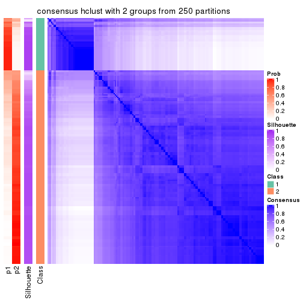</p>

</div>
<div id='tab-CV-hclust-consensus-heatmap-2'>
<pre><code class="r">consensus_heatmap(res, k = 3)
</code></pre>

<p>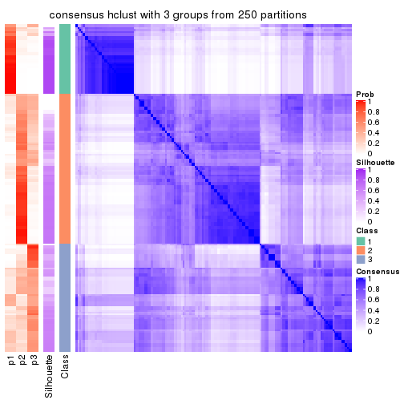</p>

</div>
<div id='tab-CV-hclust-consensus-heatmap-3'>
<pre><code class="r">consensus_heatmap(res, k = 4)
</code></pre>

<p>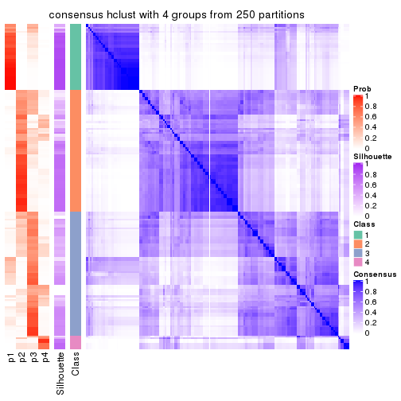</p>

</div>
<div id='tab-CV-hclust-consensus-heatmap-4'>
<pre><code class="r">consensus_heatmap(res, k = 5)
</code></pre>

<p>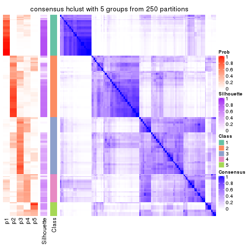</p>

</div>
<div id='tab-CV-hclust-consensus-heatmap-5'>
<pre><code class="r">consensus_heatmap(res, k = 6)
</code></pre>

<p>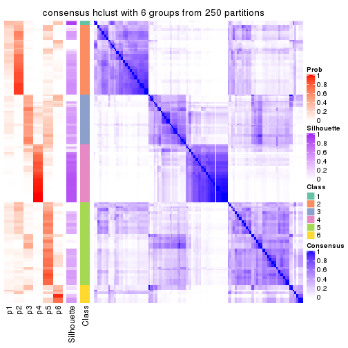</p>

</div>
</div>

Heatmaps for the membership of samples in all partitions to see how consistent they are:


<script>
$( function() {
	$( '#tabs-CV-hclust-membership-heatmap' ).tabs();
} );
</script>
<div id='tabs-CV-hclust-membership-heatmap'>
<ul>
<li><a href='#tab-CV-hclust-membership-heatmap-1'>k = 2</a></li>
<li><a href='#tab-CV-hclust-membership-heatmap-2'>k = 3</a></li>
<li><a href='#tab-CV-hclust-membership-heatmap-3'>k = 4</a></li>
<li><a href='#tab-CV-hclust-membership-heatmap-4'>k = 5</a></li>
<li><a href='#tab-CV-hclust-membership-heatmap-5'>k = 6</a></li>
</ul>
<div id='tab-CV-hclust-membership-heatmap-1'>
<pre><code class="r">membership_heatmap(res, k = 2)
</code></pre>

<p>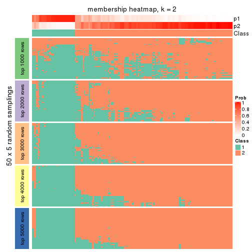</p>

</div>
<div id='tab-CV-hclust-membership-heatmap-2'>
<pre><code class="r">membership_heatmap(res, k = 3)
</code></pre>

<p>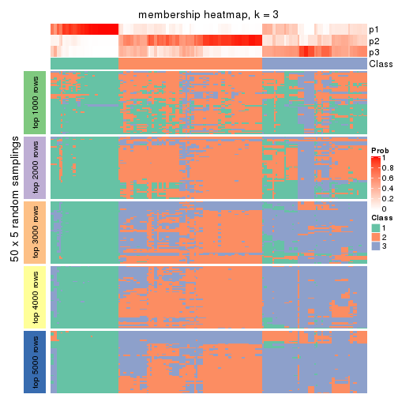</p>

</div>
<div id='tab-CV-hclust-membership-heatmap-3'>
<pre><code class="r">membership_heatmap(res, k = 4)
</code></pre>

<p>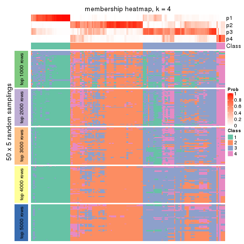</p>

</div>
<div id='tab-CV-hclust-membership-heatmap-4'>
<pre><code class="r">membership_heatmap(res, k = 5)
</code></pre>

<p>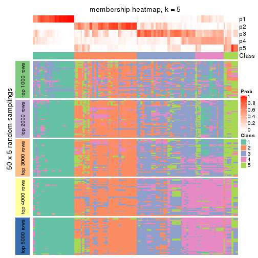</p>

</div>
<div id='tab-CV-hclust-membership-heatmap-5'>
<pre><code class="r">membership_heatmap(res, k = 6)
</code></pre>

<p>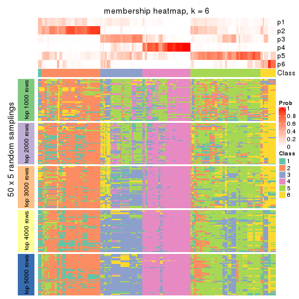</p>

</div>
</div>

As soon as we have had the classes for columns, we can look for signatures
which are significantly different between classes which can be candidate marks
for certain classes. Following are the heatmaps for signatures.


Signature heatmaps where rows are scaled:


<script>
$( function() {
	$( '#tabs-CV-hclust-get-signatures' ).tabs();
} );
</script>
<div id='tabs-CV-hclust-get-signatures'>
<ul>
<li><a href='#tab-CV-hclust-get-signatures-1'>k = 2</a></li>
<li><a href='#tab-CV-hclust-get-signatures-2'>k = 3</a></li>
<li><a href='#tab-CV-hclust-get-signatures-3'>k = 4</a></li>
<li><a href='#tab-CV-hclust-get-signatures-4'>k = 5</a></li>
<li><a href='#tab-CV-hclust-get-signatures-5'>k = 6</a></li>
</ul>
<div id='tab-CV-hclust-get-signatures-1'>
<pre><code class="r">get_signatures(res, k = 2)
</code></pre>

<p>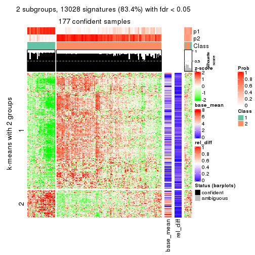</p>

</div>
<div id='tab-CV-hclust-get-signatures-2'>
<pre><code class="r">get_signatures(res, k = 3)
</code></pre>

<p>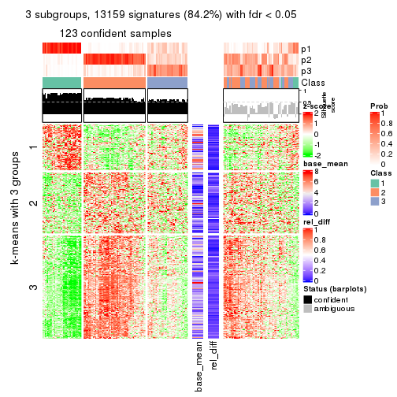</p>

</div>
<div id='tab-CV-hclust-get-signatures-3'>
<pre><code class="r">get_signatures(res, k = 4)
</code></pre>

<p>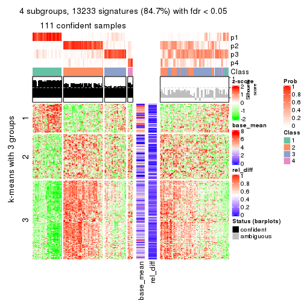</p>

</div>
<div id='tab-CV-hclust-get-signatures-4'>
<pre><code class="r">get_signatures(res, k = 5)
</code></pre>

<p>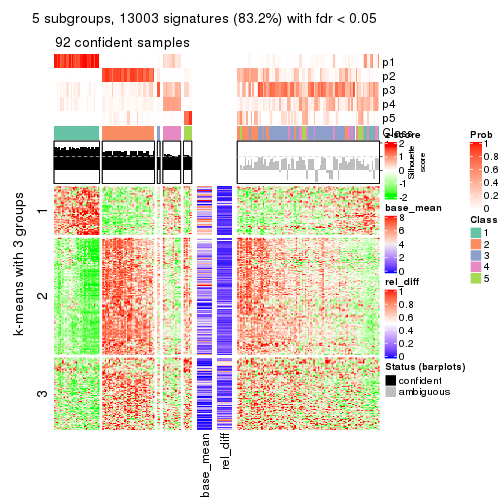</p>

</div>
<div id='tab-CV-hclust-get-signatures-5'>
<pre><code class="r">get_signatures(res, k = 6)
</code></pre>

<p>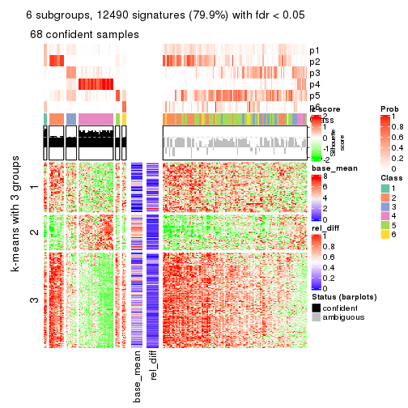</p>

</div>
</div>


Signature heatmaps where rows are not scaled:


<script>
$( function() {
	$( '#tabs-CV-hclust-get-signatures-no-scale' ).tabs();
} );
</script>
<div id='tabs-CV-hclust-get-signatures-no-scale'>
<ul>
<li><a href='#tab-CV-hclust-get-signatures-no-scale-1'>k = 2</a></li>
<li><a href='#tab-CV-hclust-get-signatures-no-scale-2'>k = 3</a></li>
<li><a href='#tab-CV-hclust-get-signatures-no-scale-3'>k = 4</a></li>
<li><a href='#tab-CV-hclust-get-signatures-no-scale-4'>k = 5</a></li>
<li><a href='#tab-CV-hclust-get-signatures-no-scale-5'>k = 6</a></li>
</ul>
<div id='tab-CV-hclust-get-signatures-no-scale-1'>
<pre><code class="r">get_signatures(res, k = 2, scale_rows = FALSE)
</code></pre>

<p>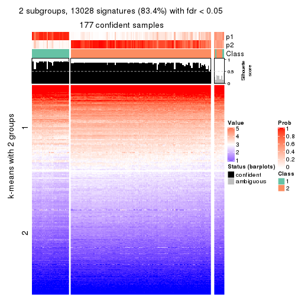</p>

</div>
<div id='tab-CV-hclust-get-signatures-no-scale-2'>
<pre><code class="r">get_signatures(res, k = 3, scale_rows = FALSE)
</code></pre>

<p>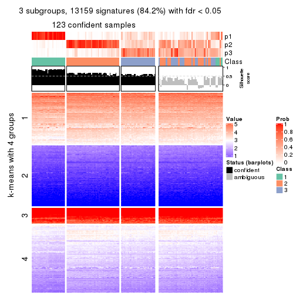</p>

</div>
<div id='tab-CV-hclust-get-signatures-no-scale-3'>
<pre><code class="r">get_signatures(res, k = 4, scale_rows = FALSE)
</code></pre>

<p>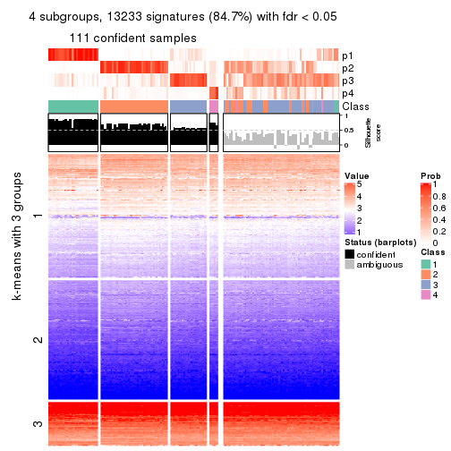</p>

</div>
<div id='tab-CV-hclust-get-signatures-no-scale-4'>
<pre><code class="r">get_signatures(res, k = 5, scale_rows = FALSE)
</code></pre>

<p>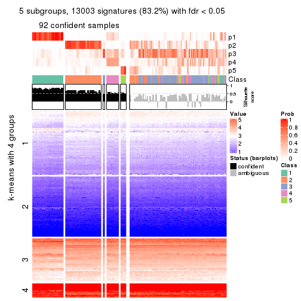</p>

</div>
<div id='tab-CV-hclust-get-signatures-no-scale-5'>
<pre><code class="r">get_signatures(res, k = 6, scale_rows = FALSE)
</code></pre>

<p>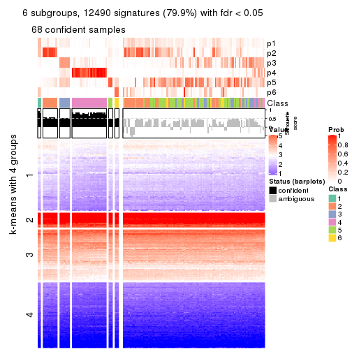</p>

</div>
</div>


Compare the overlap of signatures from different k:

```r
compare_signatures(res)
```

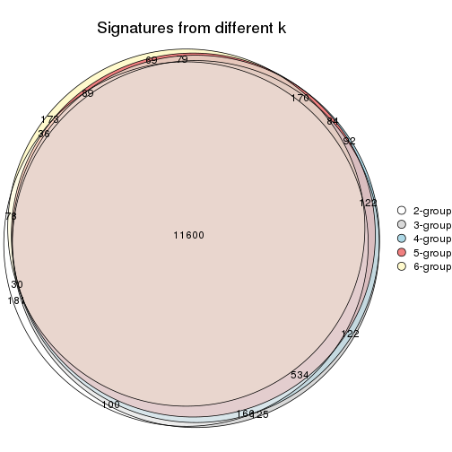

`get_signature()` returns a data frame invisibly. TO get the list of signatures, the function
call should be assigned to a variable explicitly. In following code, if `plot` argument is set
to `FALSE`, no heatmap is plotted while only the differential analysis is performed.

```r
# code only for demonstration
tb = get_signature(res, k = ..., plot = FALSE)
```

An example of the output of `tb` is:

```
#>   which_row         fdr    mean_1    mean_2 scaled_mean_1 scaled_mean_2 km
#> 1        38 0.042760348  8.373488  9.131774    -0.5533452     0.5164555  1
#> 2        40 0.018707592  7.106213  8.469186    -0.6173731     0.5762149  1
#> 3        55 0.019134737 10.221463 11.207825    -0.6159697     0.5749050  1
#> 4        59 0.006059896  5.921854  7.869574    -0.6899429     0.6439467  1
#> 5        60 0.018055526  8.928898 10.211722    -0.6204761     0.5791110  1
#> 6        98 0.009384629 15.714769 14.887706     0.6635654    -0.6193277  2
...
```

The columns in `tb` are:

1. `which_row`: row indices corresponding to the input matrix.
2. `fdr`: FDR for the differential test. 
3. `mean_x`: The mean value in group x.
4. `scaled_mean_x`: The mean value in group x after rows are scaled.
5. `km`: Row groups if k-means clustering is applied to rows.


UMAP plot which shows how samples are separated.


<script>
$( function() {
	$( '#tabs-CV-hclust-dimension-reduction' ).tabs();
} );
</script>
<div id='tabs-CV-hclust-dimension-reduction'>
<ul>
<li><a href='#tab-CV-hclust-dimension-reduction-1'>k = 2</a></li>
<li><a href='#tab-CV-hclust-dimension-reduction-2'>k = 3</a></li>
<li><a href='#tab-CV-hclust-dimension-reduction-3'>k = 4</a></li>
<li><a href='#tab-CV-hclust-dimension-reduction-4'>k = 5</a></li>
<li><a href='#tab-CV-hclust-dimension-reduction-5'>k = 6</a></li>
</ul>
<div id='tab-CV-hclust-dimension-reduction-1'>
<pre><code class="r">dimension_reduction(res, k = 2, method = &quot;UMAP&quot;)
</code></pre>

<p>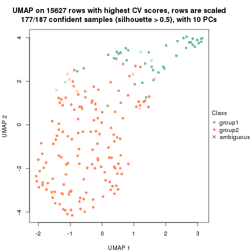</p>

</div>
<div id='tab-CV-hclust-dimension-reduction-2'>
<pre><code class="r">dimension_reduction(res, k = 3, method = &quot;UMAP&quot;)
</code></pre>

<p>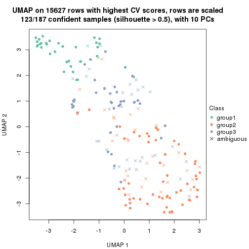</p>

</div>
<div id='tab-CV-hclust-dimension-reduction-3'>
<pre><code class="r">dimension_reduction(res, k = 4, method = &quot;UMAP&quot;)
</code></pre>

<p>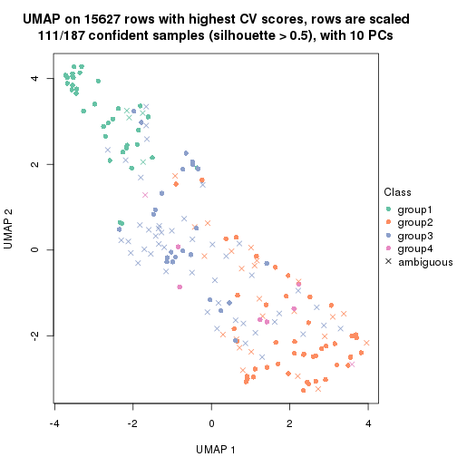</p>

</div>
<div id='tab-CV-hclust-dimension-reduction-4'>
<pre><code class="r">dimension_reduction(res, k = 5, method = &quot;UMAP&quot;)
</code></pre>

<p>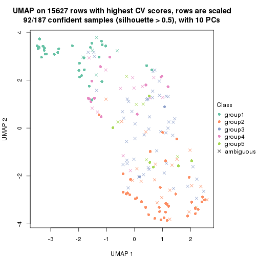</p>

</div>
<div id='tab-CV-hclust-dimension-reduction-5'>
<pre><code class="r">dimension_reduction(res, k = 6, method = &quot;UMAP&quot;)
</code></pre>

<p>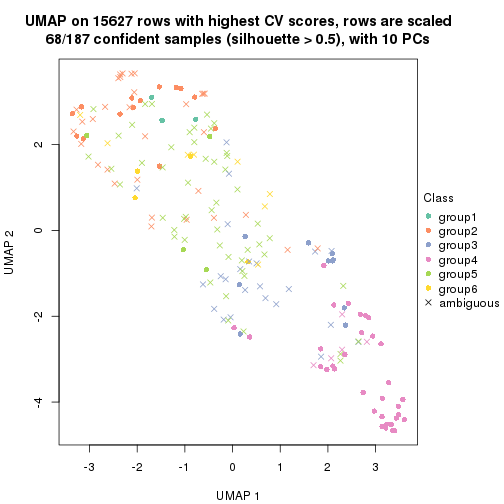</p>

</div>
</div>


Following heatmap shows how subgroups are split when increasing `k`:

```r
collect_classes(res)
```

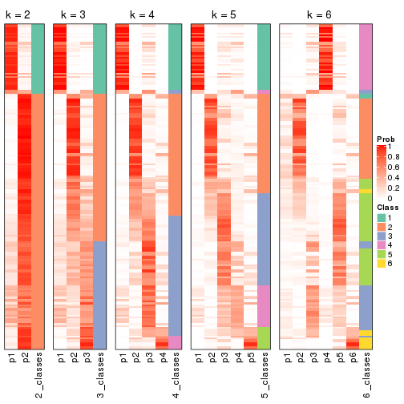


If matrix rows can be associated to genes, consider to use `GO_Enrichment(res,
...)` to perform function enrichment for the signature genes.


 

---------------------------------------------------


### CV:kmeans*


The object with results only for a single top-value method and a single partition method 
can be extracted as:

```r
res = res_list["CV", "kmeans"]
# you can also extract it by
# res = res_list["CV:kmeans"]
```

A summary of `res` and all the functions that can be applied to it:

```r
res
```

```
#> A 'ConsensusPartition' object with k = 2, 3, 4, 5, 6.
#>   On a matrix with 15627 rows and 187 columns.
#>   Top rows (1000, 2000, 3000, 4000, 5000) are extracted by 'CV' method.
#>   Subgroups are detected by 'kmeans' method.
#>   Performed in total 1250 partitions by row resampling.
#>   Best k for subgroups seems to be 2.
#> 
#> Following methods can be applied to this 'ConsensusPartition' object:
#>  [1] "cola_report"             "collect_classes"         "collect_plots"          
#>  [4] "collect_stats"           "colnames"                "compare_signatures"     
#>  [7] "consensus_heatmap"       "dimension_reduction"     "functional_enrichment"  
#> [10] "get_anno_col"            "get_anno"                "get_classes"            
#> [13] "get_consensus"           "get_matrix"              "get_membership"         
#> [16] "get_param"               "get_signatures"          "get_stats"              
#> [19] "is_best_k"               "is_stable_k"             "membership_heatmap"     
#> [22] "ncol"                    "nrow"                    "plot_ecdf"              
#> [25] "rownames"                "select_partition_number" "show"                   
#> [28] "suggest_best_k"          "test_to_known_factors"
```

`collect_plots()` function collects all the plots made from `res` for all `k` (number of partitions)
into one single page to provide an easy and fast comparison between different `k`.

```r
collect_plots(res)
```

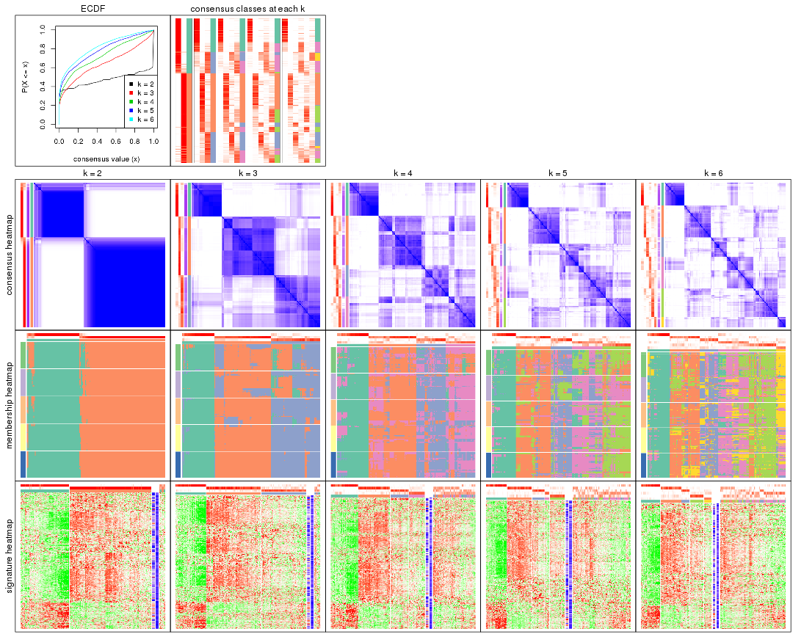

The plots are:

- The first row: a plot of the ECDF (Empirical cumulative distribution
  function) curves of the consensus matrix for each `k` and the heatmap of
  predicted classes for each `k`.
- The second row: heatmaps of the consensus matrix for each `k`.
- The third row: heatmaps of the membership matrix for each `k`.
- The fouth row: heatmaps of the signatures for each `k`.

All the plots in panels can be made by individual functions and they are
plotted later in this section.

`select_partition_number()` produces several plots showing different
statistics for choosing "optimized" `k`. There are following statistics:

- ECDF curves of the consensus matrix for each `k`;
- 1-PAC. [The PAC
  score](https://en.wikipedia.org/wiki/Consensus_clustering#Over-interpretation_potential_of_consensus_clustering)
  measures the proportion of the ambiguous subgrouping.
- Mean silhouette score.
- Concordance. The mean probability of fiting the consensus class ids in all
  partitions.
- Area increased. Denote $A_k$ as the area under the ECDF curve for current
  `k`, the area increased is defined as $A_k - A_{k-1}$.
- Rand index. The percent of pairs of samples that are both in a same cluster
  or both are not in a same cluster in the partition of k and k-1.
- Jaccard index. The ratio of pairs of samples are both in a same cluster in
  the partition of k and k-1 and the pairs of samples are both in a same
  cluster in the partition k or k-1.

The detailed explanations of these statistics can be found in [the cola
vignette](http://bioconductor.org/packages/devel/bioc/vignettes/cola/inst/doc/cola.html#toc_13).

Generally speaking, lower PAC score, higher mean silhouette score or higher
concordance corresponds to better partition. Rand index and Jaccard index
measure how similar the current partition is compared to partition with `k-1`.
If they are too similar, we won't accept `k` is better than `k-1`.

```r
select_partition_number(res)
```

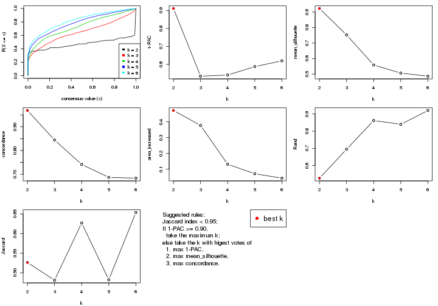

The numeric values for all these statistics can be obtained by `get_stats()`.

```r
get_stats(res)
```

```
#>   k 1-PAC mean_silhouette concordance area_increased  Rand Jaccard
#> 2 2 0.912           0.923       0.968         0.4722 0.526   0.526
#> 3 3 0.534           0.752       0.844         0.3774 0.695   0.481
#> 4 4 0.541           0.559       0.742         0.1312 0.862   0.627
#> 5 5 0.587           0.507       0.687         0.0713 0.840   0.483
#> 6 6 0.620           0.486       0.684         0.0429 0.920   0.654
```

`suggest_best_k()` suggests the best $k$ based on these statistics. The rules are as follows:

- All $k$ with Jaccard index larger than 0.95 are removed because the increase of
  the partition number does not provides enough extra information. If all $k$ are removed,
  the best $k$ is assigned by `NA`.
- For $k$ with 1-PAC larger than 0.9, the maximal $k$ is taken as the "best k". Other $k$ is called "optional k".
- If it does not fit the second rule. The $k$ with the highest vote of highest
  1-PAC, mean silhouette and concordance is taken as the "best k".

```r
suggest_best_k(res)
```

```
#> [1] 2
```


Following shows the table of the partitions (You need to click the **show/hide
code output** link to see it). The membership matrix (columns with name `p*`)
is inferred by
[`clue::cl_consensus()`](https://www.rdocumentation.org/link/cl_consensus?package=clue)
function with the `SE` method. Basically the value in the membership matrix
represents the probability to belong to a certain group. The finall class
label for an item is determined with the group with highest probability it
belongs to.

In `get_classes()` function, the entropy is calculated from the membership
matrix and the silhouette score is calculated from the consensus matrix.


<script>
$( function() {
	$( '#tabs-CV-kmeans-get-classes' ).tabs();
} );
</script>
<div id='tabs-CV-kmeans-get-classes'>
<ul>
<li><a href='#tab-CV-kmeans-get-classes-1'>k = 2</a></li>
<li><a href='#tab-CV-kmeans-get-classes-2'>k = 3</a></li>
<li><a href='#tab-CV-kmeans-get-classes-3'>k = 4</a></li>
<li><a href='#tab-CV-kmeans-get-classes-4'>k = 5</a></li>
<li><a href='#tab-CV-kmeans-get-classes-5'>k = 6</a></li>
</ul>

<div id='tab-CV-kmeans-get-classes-1'>
<p><a id='tab-CV-kmeans-get-classes-1-a' style='color:#0366d6' href='#'>show/hide code output</a></p>
<pre><code class="r">cbind(get_classes(res, k = 2), get_membership(res, k = 2))
</code></pre>

<pre><code>#&gt;            class entropy silhouette    p1    p2
#&gt; SRR1747213     1  0.0000      0.953 1.000 0.000
#&gt; SRR1747214     1  0.0000      0.953 1.000 0.000
#&gt; SRR1747215     2  0.0000      0.975 0.000 1.000
#&gt; SRR1747216     2  0.0000      0.975 0.000 1.000
#&gt; SRR1747217     2  0.0938      0.965 0.012 0.988
#&gt; SRR1747218     2  0.0000      0.975 0.000 1.000
#&gt; SRR1747219     1  0.0000      0.953 1.000 0.000
#&gt; SRR1747220     1  0.0000      0.953 1.000 0.000
#&gt; SRR1747221     1  0.0000      0.953 1.000 0.000
#&gt; SRR1747222     1  0.6801      0.779 0.820 0.180
#&gt; SRR1747223     1  0.0000      0.953 1.000 0.000
#&gt; SRR1747224     2  0.0000      0.975 0.000 1.000
#&gt; SRR1747225     2  0.0000      0.975 0.000 1.000
#&gt; SRR1747226     2  0.0000      0.975 0.000 1.000
#&gt; SRR1747227     2  0.0000      0.975 0.000 1.000
#&gt; SRR1747228     2  0.8499      0.619 0.276 0.724
#&gt; SRR1747229     2  0.0000      0.975 0.000 1.000
#&gt; SRR1747230     1  0.0000      0.953 1.000 0.000
#&gt; SRR1747231     1  0.0000      0.953 1.000 0.000
#&gt; SRR1747232     1  0.0000      0.953 1.000 0.000
#&gt; SRR1747233     1  0.0000      0.953 1.000 0.000
#&gt; SRR1747234     2  0.0000      0.975 0.000 1.000
#&gt; SRR1747235     1  0.0000      0.953 1.000 0.000
#&gt; SRR1747236     2  0.0000      0.975 0.000 1.000
#&gt; SRR1747237     2  0.0000      0.975 0.000 1.000
#&gt; SRR1747238     2  0.0000      0.975 0.000 1.000
#&gt; SRR1747239     2  0.0000      0.975 0.000 1.000
#&gt; SRR1747240     1  0.0000      0.953 1.000 0.000
#&gt; SRR1747241     2  0.2603      0.934 0.044 0.956
#&gt; SRR1747242     1  0.0000      0.953 1.000 0.000
#&gt; SRR1747243     1  0.9963      0.137 0.536 0.464
#&gt; SRR1747244     2  0.0000      0.975 0.000 1.000
#&gt; SRR1747245     2  0.0000      0.975 0.000 1.000
#&gt; SRR1747246     2  0.0000      0.975 0.000 1.000
#&gt; SRR1747247     1  0.0000      0.953 1.000 0.000
#&gt; SRR1747248     1  0.0000      0.953 1.000 0.000
#&gt; SRR1747249     1  0.0000      0.953 1.000 0.000
#&gt; SRR1747250     2  0.0000      0.975 0.000 1.000
#&gt; SRR1747252     1  0.0000      0.953 1.000 0.000
#&gt; SRR1747253     1  0.0000      0.953 1.000 0.000
#&gt; SRR1747254     2  0.0000      0.975 0.000 1.000
#&gt; SRR1747255     1  0.0000      0.953 1.000 0.000
#&gt; SRR1747256     1  0.0000      0.953 1.000 0.000
#&gt; SRR1747257     2  0.0000      0.975 0.000 1.000
#&gt; SRR1747258     2  0.0000      0.975 0.000 1.000
#&gt; SRR1747259     2  0.0000      0.975 0.000 1.000
#&gt; SRR1747260     2  0.0000      0.975 0.000 1.000
#&gt; SRR1747261     2  0.4562      0.878 0.096 0.904
#&gt; SRR1747262     2  0.0000      0.975 0.000 1.000
#&gt; SRR1747263     2  0.0000      0.975 0.000 1.000
#&gt; SRR1747264     1  0.0000      0.953 1.000 0.000
#&gt; SRR1747265     1  0.0000      0.953 1.000 0.000
#&gt; SRR1747266     2  0.0672      0.969 0.008 0.992
#&gt; SRR1747267     2  0.9209      0.477 0.336 0.664
#&gt; SRR1747268     2  0.6438      0.794 0.164 0.836
#&gt; SRR1747269     2  0.0000      0.975 0.000 1.000
#&gt; SRR1747270     2  0.0000      0.975 0.000 1.000
#&gt; SRR1747271     2  0.0000      0.975 0.000 1.000
#&gt; SRR1747272     2  0.0000      0.975 0.000 1.000
#&gt; SRR1747273     1  0.0000      0.953 1.000 0.000
#&gt; SRR1747274     2  0.2423      0.939 0.040 0.960
#&gt; SRR1747275     1  0.0000      0.953 1.000 0.000
#&gt; SRR1747276     1  0.0000      0.953 1.000 0.000
#&gt; SRR1747277     2  0.0000      0.975 0.000 1.000
#&gt; SRR1747278     2  0.0938      0.965 0.012 0.988
#&gt; SRR1747280     1  0.0000      0.953 1.000 0.000
#&gt; SRR1747279     1  0.0000      0.953 1.000 0.000
#&gt; SRR1747281     2  0.0000      0.975 0.000 1.000
#&gt; SRR1747282     1  0.0000      0.953 1.000 0.000
#&gt; SRR1747283     1  0.0376      0.950 0.996 0.004
#&gt; SRR1747284     1  0.0000      0.953 1.000 0.000
#&gt; SRR1747285     2  0.0000      0.975 0.000 1.000
#&gt; SRR1747286     2  0.0000      0.975 0.000 1.000
#&gt; SRR1747287     2  0.0000      0.975 0.000 1.000
#&gt; SRR1747288     1  0.9635      0.414 0.612 0.388
#&gt; SRR1747290     2  0.0000      0.975 0.000 1.000
#&gt; SRR1747289     2  0.0000      0.975 0.000 1.000
#&gt; SRR1747291     2  0.0000      0.975 0.000 1.000
#&gt; SRR1747293     2  0.0000      0.975 0.000 1.000
#&gt; SRR1747294     2  0.0000      0.975 0.000 1.000
#&gt; SRR1747292     1  0.0000      0.953 1.000 0.000
#&gt; SRR1747295     2  0.0000      0.975 0.000 1.000
#&gt; SRR1747296     2  0.0000      0.975 0.000 1.000
#&gt; SRR1747297     2  0.0000      0.975 0.000 1.000
#&gt; SRR1747298     2  0.0000      0.975 0.000 1.000
#&gt; SRR1747299     2  0.0000      0.975 0.000 1.000
#&gt; SRR1747300     2  0.0000      0.975 0.000 1.000
#&gt; SRR1747301     2  0.0000      0.975 0.000 1.000
#&gt; SRR1747302     2  0.0000      0.975 0.000 1.000
#&gt; SRR1747303     2  0.0000      0.975 0.000 1.000
#&gt; SRR1747304     1  0.0000      0.953 1.000 0.000
#&gt; SRR1747305     2  0.0000      0.975 0.000 1.000
#&gt; SRR1747306     2  0.0000      0.975 0.000 1.000
#&gt; SRR1747307     1  0.0000      0.953 1.000 0.000
#&gt; SRR1747308     2  0.0000      0.975 0.000 1.000
#&gt; SRR1747309     1  0.0000      0.953 1.000 0.000
#&gt; SRR1747310     1  0.0000      0.953 1.000 0.000
#&gt; SRR1747311     1  0.0000      0.953 1.000 0.000
#&gt; SRR1747313     2  0.0000      0.975 0.000 1.000
#&gt; SRR1747312     1  0.0000      0.953 1.000 0.000
#&gt; SRR1747314     1  0.0000      0.953 1.000 0.000
#&gt; SRR1747315     2  0.0000      0.975 0.000 1.000
#&gt; SRR1747316     2  0.0000      0.975 0.000 1.000
#&gt; SRR1747318     2  0.0000      0.975 0.000 1.000
#&gt; SRR1747317     2  0.0000      0.975 0.000 1.000
#&gt; SRR1747319     1  0.7139      0.759 0.804 0.196
#&gt; SRR1747320     1  0.6623      0.788 0.828 0.172
#&gt; SRR1747322     1  0.0000      0.953 1.000 0.000
#&gt; SRR1747321     1  0.0000      0.953 1.000 0.000
#&gt; SRR1747323     2  0.0000      0.975 0.000 1.000
#&gt; SRR1747324     2  0.0000      0.975 0.000 1.000
#&gt; SRR1747326     2  0.0000      0.975 0.000 1.000
#&gt; SRR1747325     2  0.0000      0.975 0.000 1.000
#&gt; SRR1747327     2  0.0000      0.975 0.000 1.000
#&gt; SRR1747328     2  0.9954      0.145 0.460 0.540
#&gt; SRR1747330     2  0.0000      0.975 0.000 1.000
#&gt; SRR1747329     2  0.0000      0.975 0.000 1.000
#&gt; SRR1747332     1  0.0000      0.953 1.000 0.000
#&gt; SRR1747331     2  0.7219      0.742 0.200 0.800
#&gt; SRR1747333     2  0.1184      0.962 0.016 0.984
#&gt; SRR1747334     2  0.0000      0.975 0.000 1.000
#&gt; SRR1747335     1  0.0000      0.953 1.000 0.000
#&gt; SRR1747336     1  0.0000      0.953 1.000 0.000
#&gt; SRR1747337     2  0.0000      0.975 0.000 1.000
#&gt; SRR1747338     2  0.0000      0.975 0.000 1.000
#&gt; SRR1747339     1  0.9866      0.256 0.568 0.432
#&gt; SRR1747340     2  0.0000      0.975 0.000 1.000
#&gt; SRR1747341     2  0.0000      0.975 0.000 1.000
#&gt; SRR1747342     2  0.0000      0.975 0.000 1.000
#&gt; SRR1747343     2  0.0000      0.975 0.000 1.000
#&gt; SRR1747344     2  0.0000      0.975 0.000 1.000
#&gt; SRR1747345     1  0.4161      0.881 0.916 0.084
#&gt; SRR1747346     2  0.0000      0.975 0.000 1.000
#&gt; SRR1747347     2  0.0000      0.975 0.000 1.000
#&gt; SRR1747348     1  0.0000      0.953 1.000 0.000
#&gt; SRR1747349     1  0.0000      0.953 1.000 0.000
#&gt; SRR1747351     2  0.0000      0.975 0.000 1.000
#&gt; SRR1747350     2  0.0000      0.975 0.000 1.000
#&gt; SRR1747352     1  0.0000      0.953 1.000 0.000
#&gt; SRR1747353     2  0.0000      0.975 0.000 1.000
#&gt; SRR1747354     2  0.0000      0.975 0.000 1.000
#&gt; SRR1747355     1  0.0000      0.953 1.000 0.000
#&gt; SRR1747356     2  0.6148      0.810 0.152 0.848
#&gt; SRR1747357     2  0.9427      0.438 0.360 0.640
#&gt; SRR1747358     2  0.4022      0.899 0.080 0.920
#&gt; SRR1747359     1  0.0000      0.953 1.000 0.000
#&gt; SRR1747360     2  0.0000      0.975 0.000 1.000
#&gt; SRR1747361     1  0.2236      0.924 0.964 0.036
#&gt; SRR1747362     2  0.0000      0.975 0.000 1.000
#&gt; SRR1747363     1  0.9087      0.556 0.676 0.324
#&gt; SRR1747364     1  0.0000      0.953 1.000 0.000
#&gt; SRR1747365     1  0.7219      0.754 0.800 0.200
#&gt; SRR1747366     2  0.0000      0.975 0.000 1.000
#&gt; SRR1747367     1  0.9754      0.363 0.592 0.408
#&gt; SRR1747369     2  0.0000      0.975 0.000 1.000
#&gt; SRR1747368     2  0.9922      0.125 0.448 0.552
#&gt; SRR1747370     2  0.0000      0.975 0.000 1.000
#&gt; SRR1747372     1  0.0000      0.953 1.000 0.000
#&gt; SRR1747371     1  0.0000      0.953 1.000 0.000
#&gt; SRR1747373     2  0.0000      0.975 0.000 1.000
#&gt; SRR1747374     2  0.0000      0.975 0.000 1.000
#&gt; SRR1747375     1  0.0000      0.953 1.000 0.000
#&gt; SRR1747376     2  0.0000      0.975 0.000 1.000
#&gt; SRR1747377     2  0.0000      0.975 0.000 1.000
#&gt; SRR1747378     2  0.0000      0.975 0.000 1.000
#&gt; SRR1747379     2  0.0000      0.975 0.000 1.000
#&gt; SRR1747380     2  0.0000      0.975 0.000 1.000
#&gt; SRR1747381     1  0.0000      0.953 1.000 0.000
#&gt; SRR1747382     1  0.0000      0.953 1.000 0.000
#&gt; SRR1747383     2  0.0000      0.975 0.000 1.000
#&gt; SRR1747384     1  0.0376      0.950 0.996 0.004
#&gt; SRR1747385     2  0.0000      0.975 0.000 1.000
#&gt; SRR1747386     1  0.0000      0.953 1.000 0.000
#&gt; SRR1747387     2  0.0000      0.975 0.000 1.000
#&gt; SRR1747388     2  0.0000      0.975 0.000 1.000
#&gt; SRR1747390     2  0.0000      0.975 0.000 1.000
#&gt; SRR1747389     2  0.0000      0.975 0.000 1.000
#&gt; SRR1747391     2  0.0000      0.975 0.000 1.000
#&gt; SRR1747392     2  0.0000      0.975 0.000 1.000
#&gt; SRR1747393     2  0.0376      0.972 0.004 0.996
#&gt; SRR1747394     1  0.0000      0.953 1.000 0.000
#&gt; SRR1747395     2  0.0000      0.975 0.000 1.000
#&gt; SRR1747396     2  0.0000      0.975 0.000 1.000
#&gt; SRR1747398     2  0.0000      0.975 0.000 1.000
#&gt; SRR1747397     1  0.8955      0.580 0.688 0.312
#&gt; SRR1747399     1  0.0000      0.953 1.000 0.000
#&gt; SRR1747400     1  0.0000      0.953 1.000 0.000
</code></pre>

<script>
$('#tab-CV-kmeans-get-classes-1-a').parent().next().next().hide();
$('#tab-CV-kmeans-get-classes-1-a').click(function(){
  $('#tab-CV-kmeans-get-classes-1-a').parent().next().next().toggle();
  return(false);
});
</script>
</div>

<div id='tab-CV-kmeans-get-classes-2'>
<p><a id='tab-CV-kmeans-get-classes-2-a' style='color:#0366d6' href='#'>show/hide code output</a></p>
<pre><code class="r">cbind(get_classes(res, k = 3), get_membership(res, k = 3))
</code></pre>

<pre><code>#&gt;            class entropy silhouette    p1    p2    p3
#&gt; SRR1747213     1  0.3412     0.8490 0.876 0.000 0.124
#&gt; SRR1747214     1  0.3482     0.8230 0.872 0.000 0.128
#&gt; SRR1747215     2  0.0237     0.8495 0.000 0.996 0.004
#&gt; SRR1747216     2  0.2165     0.8393 0.000 0.936 0.064
#&gt; SRR1747217     3  0.5517     0.6561 0.004 0.268 0.728
#&gt; SRR1747218     2  0.3482     0.8141 0.000 0.872 0.128
#&gt; SRR1747219     3  0.3816     0.7012 0.148 0.000 0.852
#&gt; SRR1747220     3  0.5016     0.6062 0.240 0.000 0.760
#&gt; SRR1747221     3  0.6205     0.4866 0.336 0.008 0.656
#&gt; SRR1747222     3  0.4865     0.6773 0.136 0.032 0.832
#&gt; SRR1747223     3  0.6322     0.5732 0.276 0.024 0.700
#&gt; SRR1747224     3  0.5588     0.6485 0.004 0.276 0.720
#&gt; SRR1747225     2  0.4351     0.7826 0.004 0.828 0.168
#&gt; SRR1747226     2  0.0424     0.8495 0.000 0.992 0.008
#&gt; SRR1747227     2  0.3116     0.8224 0.000 0.892 0.108
#&gt; SRR1747228     2  0.5737     0.6524 0.012 0.732 0.256
#&gt; SRR1747229     2  0.1031     0.8492 0.000 0.976 0.024
#&gt; SRR1747230     1  0.0237     0.9371 0.996 0.000 0.004
#&gt; SRR1747231     1  0.0424     0.9335 0.992 0.000 0.008
#&gt; SRR1747232     1  0.0424     0.9335 0.992 0.000 0.008
#&gt; SRR1747233     1  0.2200     0.9083 0.940 0.004 0.056
#&gt; SRR1747234     3  0.4178     0.6859 0.000 0.172 0.828
#&gt; SRR1747235     1  0.0237     0.9371 0.996 0.000 0.004
#&gt; SRR1747236     2  0.1860     0.8322 0.000 0.948 0.052
#&gt; SRR1747237     2  0.5465     0.5911 0.000 0.712 0.288
#&gt; SRR1747238     3  0.6225     0.2033 0.000 0.432 0.568
#&gt; SRR1747239     2  0.0237     0.8489 0.000 0.996 0.004
#&gt; SRR1747240     1  0.0000     0.9363 1.000 0.000 0.000
#&gt; SRR1747241     3  0.2796     0.7444 0.000 0.092 0.908
#&gt; SRR1747242     1  0.0237     0.9371 0.996 0.000 0.004
#&gt; SRR1747243     3  0.6217     0.6551 0.024 0.264 0.712
#&gt; SRR1747244     2  0.4178     0.7816 0.000 0.828 0.172
#&gt; SRR1747245     2  0.3879     0.7965 0.000 0.848 0.152
#&gt; SRR1747246     2  0.1163     0.8485 0.000 0.972 0.028
#&gt; SRR1747247     1  0.0424     0.9335 0.992 0.000 0.008
#&gt; SRR1747248     1  0.0237     0.9371 0.996 0.000 0.004
#&gt; SRR1747249     1  0.4099     0.8250 0.852 0.008 0.140
#&gt; SRR1747250     3  0.2625     0.7339 0.000 0.084 0.916
#&gt; SRR1747252     3  0.3879     0.6966 0.152 0.000 0.848
#&gt; SRR1747253     3  0.4121     0.6741 0.168 0.000 0.832
#&gt; SRR1747254     2  0.5058     0.6431 0.000 0.756 0.244
#&gt; SRR1747255     1  0.3192     0.8648 0.888 0.000 0.112
#&gt; SRR1747256     1  0.6490     0.3767 0.628 0.012 0.360
#&gt; SRR1747257     2  0.0424     0.8486 0.000 0.992 0.008
#&gt; SRR1747258     3  0.5397     0.6463 0.000 0.280 0.720
#&gt; SRR1747259     2  0.5431     0.5964 0.000 0.716 0.284
#&gt; SRR1747260     3  0.3412     0.7185 0.000 0.124 0.876
#&gt; SRR1747261     3  0.5797     0.6427 0.008 0.280 0.712
#&gt; SRR1747262     2  0.4521     0.7694 0.004 0.816 0.180
#&gt; SRR1747263     2  0.1753     0.8377 0.000 0.952 0.048
#&gt; SRR1747264     1  0.0000     0.9363 1.000 0.000 0.000
#&gt; SRR1747265     3  0.6326     0.5663 0.292 0.020 0.688
#&gt; SRR1747266     3  0.5754     0.6260 0.004 0.296 0.700
#&gt; SRR1747267     3  0.3349     0.7424 0.004 0.108 0.888
#&gt; SRR1747268     3  0.5797     0.6427 0.008 0.280 0.712
#&gt; SRR1747269     2  0.5363     0.6119 0.000 0.724 0.276
#&gt; SRR1747270     2  0.5254     0.6201 0.000 0.736 0.264
#&gt; SRR1747271     2  0.5254     0.6222 0.000 0.736 0.264
#&gt; SRR1747272     3  0.3752     0.7030 0.000 0.144 0.856
#&gt; SRR1747273     1  0.0237     0.9371 0.996 0.000 0.004
#&gt; SRR1747274     3  0.5690     0.6356 0.004 0.288 0.708
#&gt; SRR1747275     1  0.1964     0.9110 0.944 0.000 0.056
#&gt; SRR1747276     1  0.2261     0.9029 0.932 0.000 0.068
#&gt; SRR1747277     2  0.2356     0.8367 0.000 0.928 0.072
#&gt; SRR1747278     2  0.4589     0.7762 0.008 0.820 0.172
#&gt; SRR1747280     1  0.0237     0.9371 0.996 0.000 0.004
#&gt; SRR1747279     1  0.0892     0.9312 0.980 0.000 0.020
#&gt; SRR1747281     2  0.4047     0.7959 0.004 0.848 0.148
#&gt; SRR1747282     1  0.0237     0.9371 0.996 0.000 0.004
#&gt; SRR1747283     3  0.7896     0.5117 0.324 0.076 0.600
#&gt; SRR1747284     1  0.0237     0.9371 0.996 0.000 0.004
#&gt; SRR1747285     3  0.4178     0.6859 0.000 0.172 0.828
#&gt; SRR1747286     3  0.4178     0.6859 0.000 0.172 0.828
#&gt; SRR1747287     2  0.1031     0.8497 0.000 0.976 0.024
#&gt; SRR1747288     3  0.4409     0.7181 0.004 0.172 0.824
#&gt; SRR1747290     2  0.5397     0.5987 0.000 0.720 0.280
#&gt; SRR1747289     2  0.5465     0.5897 0.000 0.712 0.288
#&gt; SRR1747291     2  0.4178     0.7817 0.000 0.828 0.172
#&gt; SRR1747293     3  0.5926     0.5300 0.000 0.356 0.644
#&gt; SRR1747294     2  0.5397     0.6014 0.000 0.720 0.280
#&gt; SRR1747292     1  0.1411     0.9203 0.964 0.000 0.036
#&gt; SRR1747295     3  0.5016     0.6173 0.000 0.240 0.760
#&gt; SRR1747296     3  0.4931     0.6277 0.000 0.232 0.768
#&gt; SRR1747297     2  0.1289     0.8480 0.000 0.968 0.032
#&gt; SRR1747298     2  0.1289     0.8480 0.000 0.968 0.032
#&gt; SRR1747299     2  0.2066     0.8407 0.000 0.940 0.060
#&gt; SRR1747300     2  0.1964     0.8418 0.000 0.944 0.056
#&gt; SRR1747301     2  0.1753     0.8327 0.000 0.952 0.048
#&gt; SRR1747302     2  0.1753     0.8327 0.000 0.952 0.048
#&gt; SRR1747303     2  0.3879     0.7965 0.000 0.848 0.152
#&gt; SRR1747304     1  0.0000     0.9363 1.000 0.000 0.000
#&gt; SRR1747305     2  0.1753     0.8447 0.000 0.952 0.048
#&gt; SRR1747306     2  0.0000     0.8493 0.000 1.000 0.000
#&gt; SRR1747307     3  0.4235     0.6711 0.176 0.000 0.824
#&gt; SRR1747308     3  0.4931     0.6227 0.000 0.232 0.768
#&gt; SRR1747309     3  0.6008     0.4967 0.332 0.004 0.664
#&gt; SRR1747310     1  0.3340     0.8316 0.880 0.000 0.120
#&gt; SRR1747311     3  0.6521     0.6077 0.248 0.040 0.712
#&gt; SRR1747313     3  0.5690     0.6356 0.004 0.288 0.708
#&gt; SRR1747312     1  0.0000     0.9363 1.000 0.000 0.000
#&gt; SRR1747314     1  0.0237     0.9371 0.996 0.000 0.004
#&gt; SRR1747315     2  0.4235     0.7775 0.000 0.824 0.176
#&gt; SRR1747316     3  0.2356     0.7428 0.000 0.072 0.928
#&gt; SRR1747318     3  0.3482     0.7126 0.000 0.128 0.872
#&gt; SRR1747317     3  0.3482     0.7126 0.000 0.128 0.872
#&gt; SRR1747319     3  0.8436     0.6299 0.224 0.160 0.616
#&gt; SRR1747320     1  0.8973     0.0510 0.500 0.136 0.364
#&gt; SRR1747322     1  0.0237     0.9371 0.996 0.000 0.004
#&gt; SRR1747321     1  0.0892     0.9291 0.980 0.000 0.020
#&gt; SRR1747323     2  0.0424     0.8483 0.000 0.992 0.008
#&gt; SRR1747324     2  0.4002     0.7926 0.000 0.840 0.160
#&gt; SRR1747326     2  0.0000     0.8493 0.000 1.000 0.000
#&gt; SRR1747325     2  0.2448     0.8153 0.000 0.924 0.076
#&gt; SRR1747327     2  0.2796     0.8298 0.000 0.908 0.092
#&gt; SRR1747328     3  0.7216     0.6714 0.176 0.112 0.712
#&gt; SRR1747330     3  0.6104     0.5399 0.004 0.348 0.648
#&gt; SRR1747329     2  0.4121     0.7850 0.000 0.832 0.168
#&gt; SRR1747332     3  0.4842     0.6362 0.224 0.000 0.776
#&gt; SRR1747331     3  0.2703     0.7426 0.056 0.016 0.928
#&gt; SRR1747333     2  0.4700     0.7666 0.008 0.812 0.180
#&gt; SRR1747334     2  0.3340     0.8148 0.000 0.880 0.120
#&gt; SRR1747335     3  0.3879     0.6988 0.152 0.000 0.848
#&gt; SRR1747336     1  0.0424     0.9335 0.992 0.000 0.008
#&gt; SRR1747337     2  0.1860     0.8305 0.000 0.948 0.052
#&gt; SRR1747338     2  0.1031     0.8439 0.000 0.976 0.024
#&gt; SRR1747339     3  0.6217     0.6548 0.024 0.264 0.712
#&gt; SRR1747340     2  0.4465     0.7741 0.004 0.820 0.176
#&gt; SRR1747341     2  0.1411     0.8381 0.000 0.964 0.036
#&gt; SRR1747342     2  0.1411     0.8381 0.000 0.964 0.036
#&gt; SRR1747343     2  0.0424     0.8483 0.000 0.992 0.008
#&gt; SRR1747344     2  0.4002     0.7926 0.000 0.840 0.160
#&gt; SRR1747345     3  0.6521     0.6641 0.040 0.248 0.712
#&gt; SRR1747346     3  0.3619     0.7100 0.000 0.136 0.864
#&gt; SRR1747347     2  0.5363     0.6067 0.000 0.724 0.276
#&gt; SRR1747348     1  0.0000     0.9363 1.000 0.000 0.000
#&gt; SRR1747349     1  0.0424     0.9335 0.992 0.000 0.008
#&gt; SRR1747351     2  0.0424     0.8486 0.000 0.992 0.008
#&gt; SRR1747350     3  0.6421     0.0563 0.004 0.424 0.572
#&gt; SRR1747352     1  0.0424     0.9335 0.992 0.000 0.008
#&gt; SRR1747353     2  0.5465     0.6190 0.000 0.712 0.288
#&gt; SRR1747354     3  0.5363     0.6503 0.000 0.276 0.724
#&gt; SRR1747355     1  0.5560     0.5362 0.700 0.000 0.300
#&gt; SRR1747356     3  0.2749     0.7510 0.012 0.064 0.924
#&gt; SRR1747357     3  0.4725     0.7480 0.060 0.088 0.852
#&gt; SRR1747358     3  0.2384     0.7508 0.008 0.056 0.936
#&gt; SRR1747359     1  0.1411     0.9230 0.964 0.000 0.036
#&gt; SRR1747360     2  0.3412     0.8169 0.000 0.876 0.124
#&gt; SRR1747361     3  0.3112     0.7220 0.096 0.004 0.900
#&gt; SRR1747362     2  0.3551     0.8254 0.000 0.868 0.132
#&gt; SRR1747363     3  0.6452     0.6621 0.036 0.252 0.712
#&gt; SRR1747364     1  0.4920     0.8122 0.840 0.052 0.108
#&gt; SRR1747365     3  0.4281     0.7548 0.056 0.072 0.872
#&gt; SRR1747366     3  0.6225     0.2287 0.000 0.432 0.568
#&gt; SRR1747367     3  0.6301     0.6575 0.028 0.260 0.712
#&gt; SRR1747369     2  0.5291     0.6169 0.000 0.732 0.268
#&gt; SRR1747368     3  0.1964     0.7504 0.000 0.056 0.944
#&gt; SRR1747370     3  0.5656     0.6399 0.004 0.284 0.712
#&gt; SRR1747372     1  0.0237     0.9371 0.996 0.000 0.004
#&gt; SRR1747371     1  0.2625     0.8829 0.916 0.000 0.084
#&gt; SRR1747373     2  0.1964     0.8281 0.000 0.944 0.056
#&gt; SRR1747374     2  0.5216     0.6276 0.000 0.740 0.260
#&gt; SRR1747375     3  0.7157     0.6863 0.100 0.188 0.712
#&gt; SRR1747376     2  0.3412     0.8130 0.000 0.876 0.124
#&gt; SRR1747377     2  0.0237     0.8489 0.000 0.996 0.004
#&gt; SRR1747378     2  0.3686     0.8040 0.000 0.860 0.140
#&gt; SRR1747379     2  0.4291     0.7733 0.000 0.820 0.180
#&gt; SRR1747380     3  0.3619     0.7100 0.000 0.136 0.864
#&gt; SRR1747381     1  0.0237     0.9371 0.996 0.000 0.004
#&gt; SRR1747382     1  0.0237     0.9371 0.996 0.000 0.004
#&gt; SRR1747383     2  0.0237     0.8491 0.000 0.996 0.004
#&gt; SRR1747384     3  0.4293     0.6789 0.164 0.004 0.832
#&gt; SRR1747385     2  0.3941     0.8002 0.000 0.844 0.156
#&gt; SRR1747386     1  0.0237     0.9348 0.996 0.000 0.004
#&gt; SRR1747387     2  0.0747     0.8463 0.000 0.984 0.016
#&gt; SRR1747388     2  0.0747     0.8463 0.000 0.984 0.016
#&gt; SRR1747390     3  0.2625     0.7426 0.000 0.084 0.916
#&gt; SRR1747389     3  0.4974     0.6190 0.000 0.236 0.764
#&gt; SRR1747391     2  0.2261     0.8379 0.000 0.932 0.068
#&gt; SRR1747392     2  0.1643     0.8456 0.000 0.956 0.044
#&gt; SRR1747393     3  0.2496     0.7454 0.004 0.068 0.928
#&gt; SRR1747394     3  0.3879     0.6985 0.152 0.000 0.848
#&gt; SRR1747395     2  0.5948     0.1853 0.000 0.640 0.360
#&gt; SRR1747396     2  0.0424     0.8483 0.000 0.992 0.008
#&gt; SRR1747398     2  0.1031     0.8437 0.000 0.976 0.024
#&gt; SRR1747397     3  0.5992     0.6543 0.016 0.268 0.716
#&gt; SRR1747399     1  0.0424     0.9335 0.992 0.000 0.008
#&gt; SRR1747400     1  0.0000     0.9363 1.000 0.000 0.000
</code></pre>

<script>
$('#tab-CV-kmeans-get-classes-2-a').parent().next().next().hide();
$('#tab-CV-kmeans-get-classes-2-a').click(function(){
  $('#tab-CV-kmeans-get-classes-2-a').parent().next().next().toggle();
  return(false);
});
</script>
</div>

<div id='tab-CV-kmeans-get-classes-3'>
<p><a id='tab-CV-kmeans-get-classes-3-a' style='color:#0366d6' href='#'>show/hide code output</a></p>
<pre><code class="r">cbind(get_classes(res, k = 4), get_membership(res, k = 4))
</code></pre>

<pre><code>#&gt;            class entropy silhouette    p1    p2    p3    p4
#&gt; SRR1747213     1  0.5964    0.40770 0.536 0.000 0.040 0.424
#&gt; SRR1747214     1  0.4586    0.72189 0.796 0.000 0.136 0.068
#&gt; SRR1747215     2  0.1151    0.74430 0.000 0.968 0.008 0.024
#&gt; SRR1747216     2  0.1474    0.73732 0.000 0.948 0.000 0.052
#&gt; SRR1747217     4  0.4784    0.63647 0.000 0.112 0.100 0.788
#&gt; SRR1747218     2  0.6383    0.36635 0.000 0.568 0.076 0.356
#&gt; SRR1747219     3  0.5917    0.41332 0.036 0.000 0.520 0.444
#&gt; SRR1747220     3  0.6727    0.45540 0.096 0.000 0.520 0.384
#&gt; SRR1747221     4  0.4844    0.56449 0.148 0.004 0.064 0.784
#&gt; SRR1747222     3  0.3539    0.65089 0.004 0.000 0.820 0.176
#&gt; SRR1747223     4  0.4984    0.57821 0.132 0.012 0.068 0.788
#&gt; SRR1747224     4  0.4424    0.64515 0.000 0.100 0.088 0.812
#&gt; SRR1747225     2  0.6207    0.22321 0.000 0.496 0.052 0.452
#&gt; SRR1747226     2  0.1635    0.74328 0.000 0.948 0.044 0.008
#&gt; SRR1747227     2  0.4535    0.54794 0.000 0.704 0.004 0.292
#&gt; SRR1747228     4  0.5427    0.51280 0.028 0.244 0.016 0.712
#&gt; SRR1747229     2  0.3667    0.72893 0.000 0.856 0.088 0.056
#&gt; SRR1747230     1  0.0000    0.84724 1.000 0.000 0.000 0.000
#&gt; SRR1747231     1  0.1743    0.83476 0.940 0.000 0.004 0.056
#&gt; SRR1747232     1  0.1209    0.83379 0.964 0.000 0.004 0.032
#&gt; SRR1747233     1  0.4699    0.61902 0.676 0.000 0.004 0.320
#&gt; SRR1747234     3  0.1938    0.67935 0.000 0.012 0.936 0.052
#&gt; SRR1747235     1  0.0000    0.84724 1.000 0.000 0.000 0.000
#&gt; SRR1747236     2  0.3999    0.68142 0.000 0.824 0.140 0.036
#&gt; SRR1747237     3  0.5698    0.25942 0.000 0.356 0.608 0.036
#&gt; SRR1747238     3  0.4700    0.60896 0.000 0.124 0.792 0.084
#&gt; SRR1747239     2  0.1635    0.74328 0.000 0.948 0.044 0.008
#&gt; SRR1747240     1  0.0000    0.84724 1.000 0.000 0.000 0.000
#&gt; SRR1747241     3  0.6488    0.55094 0.000 0.128 0.628 0.244
#&gt; SRR1747242     1  0.0000    0.84724 1.000 0.000 0.000 0.000
#&gt; SRR1747243     4  0.4265    0.64537 0.032 0.116 0.020 0.832
#&gt; SRR1747244     2  0.5776    0.18220 0.000 0.504 0.028 0.468
#&gt; SRR1747245     2  0.5643    0.28031 0.000 0.548 0.024 0.428
#&gt; SRR1747246     2  0.1624    0.74399 0.000 0.952 0.028 0.020
#&gt; SRR1747247     1  0.0895    0.83992 0.976 0.000 0.004 0.020
#&gt; SRR1747248     1  0.0000    0.84724 1.000 0.000 0.000 0.000
#&gt; SRR1747249     1  0.6237    0.34930 0.504 0.004 0.044 0.448
#&gt; SRR1747250     3  0.2888    0.67583 0.000 0.004 0.872 0.124
#&gt; SRR1747252     3  0.5915    0.49808 0.040 0.000 0.560 0.400
#&gt; SRR1747253     3  0.5424    0.61724 0.032 0.004 0.680 0.284
#&gt; SRR1747254     2  0.5073    0.58699 0.000 0.744 0.200 0.056
#&gt; SRR1747255     1  0.5428    0.50391 0.600 0.000 0.020 0.380
#&gt; SRR1747256     1  0.6775    0.22933 0.468 0.004 0.080 0.448
#&gt; SRR1747257     2  0.2408    0.73453 0.000 0.920 0.036 0.044
#&gt; SRR1747258     4  0.6192    0.50851 0.000 0.104 0.244 0.652
#&gt; SRR1747259     3  0.5632    0.23698 0.000 0.340 0.624 0.036
#&gt; SRR1747260     3  0.3245    0.67464 0.000 0.028 0.872 0.100
#&gt; SRR1747261     4  0.5212    0.65401 0.012 0.124 0.088 0.776
#&gt; SRR1747262     4  0.5764   -0.01054 0.000 0.452 0.028 0.520
#&gt; SRR1747263     2  0.3970    0.71516 0.000 0.840 0.084 0.076
#&gt; SRR1747264     1  0.0336    0.84663 0.992 0.000 0.000 0.008
#&gt; SRR1747265     4  0.7154    0.13761 0.124 0.008 0.320 0.548
#&gt; SRR1747266     4  0.6049    0.53868 0.000 0.132 0.184 0.684
#&gt; SRR1747267     4  0.5730    0.15262 0.000 0.040 0.344 0.616
#&gt; SRR1747268     4  0.4213    0.64032 0.012 0.136 0.028 0.824
#&gt; SRR1747269     2  0.6717    0.35118 0.000 0.560 0.332 0.108
#&gt; SRR1747270     2  0.6627    0.38996 0.000 0.588 0.300 0.112
#&gt; SRR1747271     3  0.5147   -0.06695 0.000 0.460 0.536 0.004
#&gt; SRR1747272     3  0.2334    0.68053 0.000 0.004 0.908 0.088
#&gt; SRR1747273     1  0.0707    0.84551 0.980 0.000 0.000 0.020
#&gt; SRR1747274     4  0.5280    0.62835 0.000 0.156 0.096 0.748
#&gt; SRR1747275     1  0.4699    0.62033 0.676 0.000 0.004 0.320
#&gt; SRR1747276     1  0.5024    0.55948 0.632 0.000 0.008 0.360
#&gt; SRR1747277     2  0.7349    0.42031 0.000 0.528 0.236 0.236
#&gt; SRR1747278     2  0.5851    0.19778 0.004 0.516 0.024 0.456
#&gt; SRR1747280     1  0.0000    0.84724 1.000 0.000 0.000 0.000
#&gt; SRR1747279     1  0.4053    0.71534 0.768 0.000 0.004 0.228
#&gt; SRR1747281     2  0.5183    0.35069 0.000 0.584 0.008 0.408
#&gt; SRR1747282     1  0.0707    0.84408 0.980 0.000 0.000 0.020
#&gt; SRR1747283     4  0.8125    0.21935 0.264 0.024 0.224 0.488
#&gt; SRR1747284     1  0.0592    0.84626 0.984 0.000 0.000 0.016
#&gt; SRR1747285     3  0.2227    0.67494 0.000 0.036 0.928 0.036
#&gt; SRR1747286     3  0.2943    0.67099 0.000 0.032 0.892 0.076
#&gt; SRR1747287     2  0.1975    0.74198 0.000 0.936 0.016 0.048
#&gt; SRR1747288     4  0.6324    0.17641 0.000 0.072 0.356 0.572
#&gt; SRR1747290     2  0.6200    0.09939 0.000 0.504 0.444 0.052
#&gt; SRR1747289     2  0.6451    0.03173 0.000 0.476 0.456 0.068
#&gt; SRR1747291     2  0.5663    0.23937 0.000 0.536 0.024 0.440
#&gt; SRR1747293     4  0.6120    0.36890 0.000 0.296 0.076 0.628
#&gt; SRR1747294     3  0.6163    0.17122 0.000 0.364 0.576 0.060
#&gt; SRR1747292     1  0.3726    0.73472 0.788 0.000 0.000 0.212
#&gt; SRR1747295     3  0.2675    0.65009 0.000 0.044 0.908 0.048
#&gt; SRR1747296     3  0.2660    0.65849 0.000 0.036 0.908 0.056
#&gt; SRR1747297     2  0.2011    0.72639 0.000 0.920 0.000 0.080
#&gt; SRR1747298     2  0.2011    0.72639 0.000 0.920 0.000 0.080
#&gt; SRR1747299     2  0.1211    0.73940 0.000 0.960 0.000 0.040
#&gt; SRR1747300     2  0.2032    0.74217 0.000 0.936 0.028 0.036
#&gt; SRR1747301     2  0.3392    0.73175 0.000 0.856 0.124 0.020
#&gt; SRR1747302     2  0.2593    0.72869 0.000 0.892 0.104 0.004
#&gt; SRR1747303     2  0.5482    0.40027 0.000 0.608 0.024 0.368
#&gt; SRR1747304     1  0.0000    0.84724 1.000 0.000 0.000 0.000
#&gt; SRR1747305     2  0.1474    0.74189 0.000 0.948 0.000 0.052
#&gt; SRR1747306     2  0.1042    0.74388 0.000 0.972 0.008 0.020
#&gt; SRR1747307     3  0.6181    0.51930 0.048 0.004 0.568 0.380
#&gt; SRR1747308     3  0.2131    0.65837 0.000 0.032 0.932 0.036
#&gt; SRR1747309     4  0.4636    0.56694 0.140 0.000 0.068 0.792
#&gt; SRR1747310     1  0.4312    0.72900 0.812 0.000 0.132 0.056
#&gt; SRR1747311     4  0.4903    0.59694 0.100 0.020 0.076 0.804
#&gt; SRR1747313     4  0.4921    0.65094 0.004 0.132 0.080 0.784
#&gt; SRR1747312     1  0.0000    0.84724 1.000 0.000 0.000 0.000
#&gt; SRR1747314     1  0.0000    0.84724 1.000 0.000 0.000 0.000
#&gt; SRR1747315     4  0.5678   -0.00714 0.000 0.452 0.024 0.524
#&gt; SRR1747316     3  0.4656    0.60686 0.000 0.072 0.792 0.136
#&gt; SRR1747318     3  0.2149    0.68010 0.000 0.000 0.912 0.088
#&gt; SRR1747317     3  0.2011    0.68097 0.000 0.000 0.920 0.080
#&gt; SRR1747319     4  0.8461    0.21978 0.148 0.076 0.264 0.512
#&gt; SRR1747320     4  0.7814    0.00807 0.372 0.048 0.092 0.488
#&gt; SRR1747322     1  0.0000    0.84724 1.000 0.000 0.000 0.000
#&gt; SRR1747321     1  0.3172    0.77374 0.840 0.000 0.000 0.160
#&gt; SRR1747323     2  0.1854    0.74350 0.000 0.940 0.048 0.012
#&gt; SRR1747324     2  0.6039    0.41436 0.000 0.596 0.056 0.348
#&gt; SRR1747326     2  0.1211    0.74051 0.000 0.960 0.000 0.040
#&gt; SRR1747325     2  0.3257    0.68239 0.000 0.844 0.152 0.004
#&gt; SRR1747327     2  0.3219    0.67788 0.000 0.836 0.000 0.164
#&gt; SRR1747328     4  0.4650    0.60870 0.116 0.040 0.028 0.816
#&gt; SRR1747330     4  0.5666    0.31105 0.000 0.348 0.036 0.616
#&gt; SRR1747329     2  0.6008    0.17833 0.000 0.496 0.040 0.464
#&gt; SRR1747332     3  0.7012    0.45468 0.124 0.000 0.504 0.372
#&gt; SRR1747331     3  0.5272    0.60898 0.032 0.000 0.680 0.288
#&gt; SRR1747333     4  0.6333   -0.00883 0.004 0.416 0.052 0.528
#&gt; SRR1747334     2  0.4808    0.60573 0.000 0.736 0.028 0.236
#&gt; SRR1747335     3  0.5924    0.49273 0.040 0.000 0.556 0.404
#&gt; SRR1747336     1  0.1022    0.83597 0.968 0.000 0.000 0.032
#&gt; SRR1747337     2  0.2530    0.72792 0.000 0.896 0.100 0.004
#&gt; SRR1747338     2  0.2053    0.73757 0.000 0.924 0.072 0.004
#&gt; SRR1747339     4  0.5097    0.65414 0.028 0.104 0.072 0.796
#&gt; SRR1747340     4  0.6176   -0.02324 0.000 0.424 0.052 0.524
#&gt; SRR1747341     2  0.1398    0.74199 0.000 0.956 0.040 0.004
#&gt; SRR1747342     2  0.1398    0.74199 0.000 0.956 0.040 0.004
#&gt; SRR1747343     2  0.1722    0.74291 0.000 0.944 0.048 0.008
#&gt; SRR1747344     2  0.6039    0.41436 0.000 0.596 0.056 0.348
#&gt; SRR1747345     4  0.5470    0.64714 0.044 0.096 0.080 0.780
#&gt; SRR1747346     3  0.2266    0.68063 0.000 0.004 0.912 0.084
#&gt; SRR1747347     3  0.5000   -0.13908 0.000 0.496 0.504 0.000
#&gt; SRR1747348     1  0.0000    0.84724 1.000 0.000 0.000 0.000
#&gt; SRR1747349     1  0.1474    0.83485 0.948 0.000 0.000 0.052
#&gt; SRR1747351     2  0.2385    0.73848 0.000 0.920 0.028 0.052
#&gt; SRR1747350     3  0.6984    0.49885 0.000 0.184 0.580 0.236
#&gt; SRR1747352     1  0.3144    0.78274 0.884 0.000 0.044 0.072
#&gt; SRR1747353     4  0.6881   -0.02276 0.000 0.428 0.104 0.468
#&gt; SRR1747354     4  0.6054    0.47607 0.000 0.088 0.256 0.656
#&gt; SRR1747355     1  0.6310    0.31994 0.512 0.000 0.060 0.428
#&gt; SRR1747356     4  0.5764   -0.17735 0.000 0.028 0.452 0.520
#&gt; SRR1747357     4  0.4827    0.43661 0.008 0.020 0.224 0.748
#&gt; SRR1747358     3  0.5607    0.29154 0.000 0.020 0.492 0.488
#&gt; SRR1747359     1  0.4483    0.66345 0.712 0.000 0.004 0.284
#&gt; SRR1747360     2  0.5901    0.53657 0.000 0.652 0.068 0.280
#&gt; SRR1747361     3  0.4990    0.54721 0.008 0.000 0.640 0.352
#&gt; SRR1747362     2  0.5990    0.52974 0.000 0.644 0.072 0.284
#&gt; SRR1747363     4  0.5350    0.64992 0.036 0.104 0.076 0.784
#&gt; SRR1747364     1  0.6355    0.34291 0.520 0.020 0.028 0.432
#&gt; SRR1747365     4  0.6213   -0.25040 0.000 0.052 0.464 0.484
#&gt; SRR1747366     3  0.6862    0.45353 0.000 0.176 0.596 0.228
#&gt; SRR1747367     4  0.5260    0.65053 0.032 0.104 0.076 0.788
#&gt; SRR1747369     2  0.5928    0.15673 0.000 0.508 0.456 0.036
#&gt; SRR1747368     3  0.5673    0.27036 0.000 0.024 0.528 0.448
#&gt; SRR1747370     4  0.4746    0.64621 0.004 0.140 0.064 0.792
#&gt; SRR1747372     1  0.0188    0.84668 0.996 0.000 0.000 0.004
#&gt; SRR1747371     1  0.5206    0.60053 0.668 0.000 0.024 0.308
#&gt; SRR1747373     2  0.2542    0.73144 0.000 0.904 0.084 0.012
#&gt; SRR1747374     2  0.4313    0.55639 0.000 0.736 0.260 0.004
#&gt; SRR1747375     4  0.5329    0.63827 0.060 0.072 0.076 0.792
#&gt; SRR1747376     2  0.4775    0.60760 0.000 0.740 0.028 0.232
#&gt; SRR1747377     2  0.1661    0.74165 0.000 0.944 0.052 0.004
#&gt; SRR1747378     2  0.6163    0.31292 0.000 0.532 0.052 0.416
#&gt; SRR1747379     4  0.5682   -0.02037 0.000 0.456 0.024 0.520
#&gt; SRR1747380     3  0.2266    0.68063 0.000 0.004 0.912 0.084
#&gt; SRR1747381     1  0.0592    0.84626 0.984 0.000 0.000 0.016
#&gt; SRR1747382     1  0.1209    0.84196 0.964 0.000 0.004 0.032
#&gt; SRR1747383     2  0.1398    0.74145 0.000 0.956 0.004 0.040
#&gt; SRR1747384     3  0.5883    0.51042 0.040 0.000 0.572 0.388
#&gt; SRR1747385     2  0.6770    0.45420 0.000 0.580 0.128 0.292
#&gt; SRR1747386     1  0.0000    0.84724 1.000 0.000 0.000 0.000
#&gt; SRR1747387     2  0.2227    0.73713 0.000 0.928 0.036 0.036
#&gt; SRR1747388     2  0.2319    0.73352 0.000 0.924 0.040 0.036
#&gt; SRR1747390     3  0.4932    0.63977 0.000 0.032 0.728 0.240
#&gt; SRR1747389     3  0.3286    0.66661 0.000 0.044 0.876 0.080
#&gt; SRR1747391     2  0.2589    0.71084 0.000 0.884 0.000 0.116
#&gt; SRR1747392     2  0.2469    0.71549 0.000 0.892 0.000 0.108
#&gt; SRR1747393     3  0.5489    0.60871 0.000 0.040 0.664 0.296
#&gt; SRR1747394     3  0.5935    0.38086 0.036 0.000 0.496 0.468
#&gt; SRR1747395     2  0.7346    0.33277 0.000 0.520 0.200 0.280
#&gt; SRR1747396     2  0.1938    0.74403 0.000 0.936 0.052 0.012
#&gt; SRR1747398     2  0.2473    0.73342 0.000 0.908 0.080 0.012
#&gt; SRR1747397     4  0.5017    0.65167 0.012 0.124 0.076 0.788
#&gt; SRR1747399     1  0.1118    0.83690 0.964 0.000 0.000 0.036
#&gt; SRR1747400     1  0.0921    0.84058 0.972 0.000 0.000 0.028
</code></pre>

<script>
$('#tab-CV-kmeans-get-classes-3-a').parent().next().next().hide();
$('#tab-CV-kmeans-get-classes-3-a').click(function(){
  $('#tab-CV-kmeans-get-classes-3-a').parent().next().next().toggle();
  return(false);
});
</script>
</div>

<div id='tab-CV-kmeans-get-classes-4'>
<p><a id='tab-CV-kmeans-get-classes-4-a' style='color:#0366d6' href='#'>show/hide code output</a></p>
<pre><code class="r">cbind(get_classes(res, k = 5), get_membership(res, k = 5))
</code></pre>

<pre><code>#&gt;            class entropy silhouette    p1    p2    p3    p4    p5
#&gt; SRR1747213     4  0.4708     0.5279 0.208 0.000 0.008 0.728 0.056
#&gt; SRR1747214     1  0.6445     0.5872 0.612 0.000 0.184 0.164 0.040
#&gt; SRR1747215     2  0.4096     0.7034 0.000 0.772 0.000 0.052 0.176
#&gt; SRR1747216     2  0.4576     0.6297 0.000 0.692 0.000 0.040 0.268
#&gt; SRR1747217     5  0.5745     0.0453 0.000 0.056 0.012 0.440 0.492
#&gt; SRR1747218     2  0.5124    -0.1699 0.000 0.488 0.004 0.028 0.480
#&gt; SRR1747219     4  0.6299     0.1716 0.020 0.008 0.340 0.552 0.080
#&gt; SRR1747220     4  0.6552     0.1651 0.040 0.008 0.336 0.544 0.072
#&gt; SRR1747221     4  0.5593     0.3969 0.068 0.000 0.008 0.588 0.336
#&gt; SRR1747222     3  0.4668     0.4024 0.000 0.008 0.688 0.276 0.028
#&gt; SRR1747223     4  0.5528     0.2523 0.048 0.000 0.008 0.512 0.432
#&gt; SRR1747224     5  0.4531     0.0975 0.000 0.004 0.004 0.424 0.568
#&gt; SRR1747225     5  0.3812     0.6364 0.000 0.204 0.000 0.024 0.772
#&gt; SRR1747226     2  0.1764     0.7353 0.000 0.928 0.008 0.000 0.064
#&gt; SRR1747227     5  0.4645     0.4233 0.000 0.268 0.000 0.044 0.688
#&gt; SRR1747228     5  0.3353     0.6224 0.020 0.024 0.000 0.104 0.852
#&gt; SRR1747229     2  0.4053     0.6631 0.000 0.816 0.024 0.056 0.104
#&gt; SRR1747230     1  0.0000     0.8755 1.000 0.000 0.000 0.000 0.000
#&gt; SRR1747231     1  0.4056     0.7478 0.768 0.000 0.008 0.200 0.024
#&gt; SRR1747232     1  0.1988     0.8438 0.928 0.000 0.008 0.048 0.016
#&gt; SRR1747233     4  0.5779     0.2441 0.400 0.000 0.000 0.508 0.092
#&gt; SRR1747234     3  0.1800     0.6912 0.000 0.020 0.932 0.048 0.000
#&gt; SRR1747235     1  0.0162     0.8750 0.996 0.000 0.000 0.004 0.000
#&gt; SRR1747236     2  0.2243     0.7084 0.000 0.916 0.056 0.016 0.012
#&gt; SRR1747237     3  0.5317     0.5643 0.000 0.172 0.708 0.100 0.020
#&gt; SRR1747238     3  0.5374     0.6437 0.000 0.128 0.696 0.164 0.012
#&gt; SRR1747239     2  0.1717     0.7346 0.000 0.936 0.008 0.004 0.052
#&gt; SRR1747240     1  0.0000     0.8755 1.000 0.000 0.000 0.000 0.000
#&gt; SRR1747241     3  0.7296     0.1650 0.000 0.172 0.400 0.384 0.044
#&gt; SRR1747242     1  0.0162     0.8750 0.996 0.000 0.000 0.004 0.000
#&gt; SRR1747243     5  0.4067     0.4701 0.020 0.004 0.000 0.228 0.748
#&gt; SRR1747244     5  0.3241     0.6646 0.000 0.144 0.000 0.024 0.832
#&gt; SRR1747245     5  0.3359     0.6304 0.000 0.164 0.000 0.020 0.816
#&gt; SRR1747246     2  0.1662     0.7348 0.000 0.936 0.004 0.004 0.056
#&gt; SRR1747247     1  0.0912     0.8668 0.972 0.000 0.000 0.016 0.012
#&gt; SRR1747248     1  0.0000     0.8755 1.000 0.000 0.000 0.000 0.000
#&gt; SRR1747249     4  0.4903     0.5393 0.192 0.004 0.012 0.732 0.060
#&gt; SRR1747250     3  0.3659     0.6556 0.000 0.000 0.768 0.220 0.012
#&gt; SRR1747252     4  0.6556     0.0789 0.024 0.008 0.376 0.504 0.088
#&gt; SRR1747253     3  0.6709     0.1397 0.020 0.020 0.464 0.416 0.080
#&gt; SRR1747254     2  0.2149     0.7070 0.000 0.924 0.036 0.028 0.012
#&gt; SRR1747255     4  0.5639     0.3787 0.340 0.000 0.000 0.568 0.092
#&gt; SRR1747256     4  0.4777     0.5456 0.188 0.000 0.012 0.736 0.064
#&gt; SRR1747257     2  0.4955     0.6902 0.000 0.732 0.008 0.132 0.128
#&gt; SRR1747258     4  0.6615     0.1432 0.000 0.020 0.132 0.484 0.364
#&gt; SRR1747259     3  0.4850     0.5360 0.000 0.232 0.696 0.072 0.000
#&gt; SRR1747260     3  0.3771     0.6756 0.000 0.040 0.796 0.164 0.000
#&gt; SRR1747261     5  0.4922     0.0666 0.000 0.020 0.004 0.424 0.552
#&gt; SRR1747262     5  0.3090     0.6782 0.000 0.104 0.000 0.040 0.856
#&gt; SRR1747263     2  0.6754     0.3228 0.000 0.472 0.092 0.048 0.388
#&gt; SRR1747264     1  0.1043     0.8665 0.960 0.000 0.000 0.040 0.000
#&gt; SRR1747265     4  0.4901     0.4834 0.012 0.004 0.124 0.752 0.108
#&gt; SRR1747266     5  0.6744     0.0826 0.000 0.032 0.116 0.400 0.452
#&gt; SRR1747267     4  0.6333     0.4440 0.000 0.008 0.192 0.564 0.236
#&gt; SRR1747268     5  0.3597     0.5396 0.008 0.012 0.000 0.180 0.800
#&gt; SRR1747269     2  0.6643     0.2299 0.000 0.572 0.272 0.092 0.064
#&gt; SRR1747270     2  0.6102     0.3871 0.000 0.632 0.228 0.104 0.036
#&gt; SRR1747271     3  0.3816     0.4517 0.000 0.304 0.696 0.000 0.000
#&gt; SRR1747272     3  0.2011     0.6782 0.000 0.020 0.928 0.044 0.008
#&gt; SRR1747273     1  0.2068     0.8405 0.904 0.000 0.000 0.092 0.004
#&gt; SRR1747274     5  0.4404     0.5378 0.000 0.040 0.008 0.204 0.748
#&gt; SRR1747275     4  0.5742     0.2379 0.404 0.000 0.000 0.508 0.088
#&gt; SRR1747276     4  0.5751     0.3304 0.364 0.000 0.000 0.540 0.096
#&gt; SRR1747277     5  0.6869     0.3471 0.000 0.152 0.236 0.052 0.560
#&gt; SRR1747278     5  0.3124     0.6569 0.000 0.136 0.004 0.016 0.844
#&gt; SRR1747280     1  0.0000     0.8755 1.000 0.000 0.000 0.000 0.000
#&gt; SRR1747279     1  0.4968     0.0497 0.516 0.000 0.000 0.456 0.028
#&gt; SRR1747281     5  0.3930     0.6204 0.000 0.152 0.000 0.056 0.792
#&gt; SRR1747282     1  0.1774     0.8558 0.932 0.000 0.000 0.052 0.016
#&gt; SRR1747283     4  0.5447     0.5609 0.156 0.000 0.020 0.700 0.124
#&gt; SRR1747284     1  0.2249     0.8383 0.896 0.000 0.000 0.096 0.008
#&gt; SRR1747285     3  0.2740     0.6884 0.000 0.064 0.888 0.044 0.004
#&gt; SRR1747286     3  0.3527     0.6814 0.000 0.028 0.820 0.148 0.004
#&gt; SRR1747287     2  0.4376     0.7077 0.000 0.764 0.000 0.092 0.144
#&gt; SRR1747288     4  0.5481     0.4087 0.000 0.008 0.184 0.676 0.132
#&gt; SRR1747290     2  0.5782     0.0578 0.000 0.536 0.388 0.064 0.012
#&gt; SRR1747289     2  0.5793     0.0375 0.000 0.528 0.392 0.072 0.008
#&gt; SRR1747291     5  0.2674     0.6541 0.000 0.140 0.000 0.004 0.856
#&gt; SRR1747293     5  0.4054     0.6111 0.000 0.040 0.016 0.144 0.800
#&gt; SRR1747294     3  0.7005     0.3430 0.000 0.128 0.536 0.064 0.272
#&gt; SRR1747292     1  0.5622     0.0779 0.508 0.000 0.000 0.416 0.076
#&gt; SRR1747295     3  0.3264     0.6823 0.000 0.020 0.836 0.140 0.004
#&gt; SRR1747296     3  0.3213     0.6820 0.000 0.016 0.836 0.144 0.004
#&gt; SRR1747297     2  0.4905     0.5101 0.000 0.624 0.000 0.040 0.336
#&gt; SRR1747298     2  0.4921     0.5035 0.000 0.620 0.000 0.040 0.340
#&gt; SRR1747299     2  0.3847     0.7029 0.000 0.784 0.000 0.036 0.180
#&gt; SRR1747300     2  0.2389     0.7217 0.000 0.880 0.004 0.000 0.116
#&gt; SRR1747301     2  0.3621     0.6432 0.000 0.788 0.020 0.000 0.192
#&gt; SRR1747302     2  0.1403     0.7329 0.000 0.952 0.024 0.000 0.024
#&gt; SRR1747303     5  0.3810     0.6005 0.000 0.168 0.000 0.040 0.792
#&gt; SRR1747304     1  0.0000     0.8755 1.000 0.000 0.000 0.000 0.000
#&gt; SRR1747305     2  0.4234     0.6972 0.000 0.760 0.000 0.056 0.184
#&gt; SRR1747306     2  0.4021     0.7079 0.000 0.780 0.000 0.052 0.168
#&gt; SRR1747307     4  0.6734     0.0581 0.028 0.016 0.380 0.496 0.080
#&gt; SRR1747308     3  0.1493     0.6840 0.000 0.028 0.948 0.024 0.000
#&gt; SRR1747309     4  0.5478     0.3903 0.056 0.000 0.008 0.584 0.352
#&gt; SRR1747310     1  0.6107     0.6081 0.648 0.000 0.188 0.124 0.040
#&gt; SRR1747311     4  0.5202     0.3381 0.032 0.000 0.008 0.568 0.392
#&gt; SRR1747313     5  0.5201     0.0254 0.000 0.028 0.008 0.432 0.532
#&gt; SRR1747312     1  0.0000     0.8755 1.000 0.000 0.000 0.000 0.000
#&gt; SRR1747314     1  0.0000     0.8755 1.000 0.000 0.000 0.000 0.000
#&gt; SRR1747315     5  0.2932     0.6680 0.000 0.104 0.000 0.032 0.864
#&gt; SRR1747316     5  0.5856    -0.1483 0.000 0.012 0.460 0.064 0.464
#&gt; SRR1747318     3  0.1731     0.6794 0.000 0.008 0.940 0.040 0.012
#&gt; SRR1747317     3  0.1731     0.6794 0.000 0.008 0.940 0.040 0.012
#&gt; SRR1747319     4  0.4532     0.5328 0.064 0.008 0.044 0.804 0.080
#&gt; SRR1747320     4  0.4630     0.5486 0.132 0.008 0.012 0.776 0.072
#&gt; SRR1747322     1  0.0000     0.8755 1.000 0.000 0.000 0.000 0.000
#&gt; SRR1747321     1  0.4624     0.4187 0.636 0.000 0.000 0.340 0.024
#&gt; SRR1747323     2  0.1798     0.7363 0.000 0.928 0.004 0.004 0.064
#&gt; SRR1747324     5  0.5094     0.2442 0.000 0.436 0.004 0.028 0.532
#&gt; SRR1747326     2  0.4039     0.7049 0.000 0.776 0.004 0.036 0.184
#&gt; SRR1747325     2  0.4639     0.6885 0.000 0.772 0.140 0.032 0.056
#&gt; SRR1747327     5  0.5286    -0.1326 0.000 0.448 0.000 0.048 0.504
#&gt; SRR1747328     5  0.3734     0.5204 0.036 0.000 0.000 0.168 0.796
#&gt; SRR1747330     5  0.2859     0.6707 0.000 0.060 0.016 0.036 0.888
#&gt; SRR1747329     5  0.3173     0.6656 0.000 0.112 0.016 0.016 0.856
#&gt; SRR1747332     4  0.7041     0.0866 0.064 0.008 0.356 0.492 0.080
#&gt; SRR1747331     3  0.6913     0.3687 0.020 0.016 0.540 0.280 0.144
#&gt; SRR1747333     5  0.3821     0.6733 0.000 0.148 0.000 0.052 0.800
#&gt; SRR1747334     2  0.4599     0.3315 0.000 0.624 0.000 0.020 0.356
#&gt; SRR1747335     4  0.6622     0.0800 0.028 0.008 0.372 0.504 0.088
#&gt; SRR1747336     1  0.1836     0.8490 0.936 0.000 0.008 0.040 0.016
#&gt; SRR1747337     2  0.1267     0.7315 0.000 0.960 0.024 0.004 0.012
#&gt; SRR1747338     2  0.1074     0.7333 0.000 0.968 0.012 0.004 0.016
#&gt; SRR1747339     5  0.5072     0.0895 0.012 0.008 0.008 0.400 0.572
#&gt; SRR1747340     5  0.3608     0.6725 0.000 0.148 0.000 0.040 0.812
#&gt; SRR1747341     2  0.2616     0.7344 0.000 0.888 0.000 0.036 0.076
#&gt; SRR1747342     2  0.2616     0.7344 0.000 0.888 0.000 0.036 0.076
#&gt; SRR1747343     2  0.1798     0.7363 0.000 0.928 0.004 0.004 0.064
#&gt; SRR1747344     5  0.5094     0.2442 0.000 0.436 0.004 0.028 0.532
#&gt; SRR1747345     4  0.5225     0.1727 0.020 0.004 0.008 0.500 0.468
#&gt; SRR1747346     3  0.1731     0.6794 0.000 0.008 0.940 0.040 0.012
#&gt; SRR1747347     3  0.4350     0.2053 0.000 0.408 0.588 0.004 0.000
#&gt; SRR1747348     1  0.0000     0.8755 1.000 0.000 0.000 0.000 0.000
#&gt; SRR1747349     1  0.3095     0.8367 0.868 0.004 0.008 0.096 0.024
#&gt; SRR1747351     2  0.4633     0.7027 0.000 0.760 0.008 0.104 0.128
#&gt; SRR1747350     3  0.7423     0.3574 0.000 0.040 0.428 0.244 0.288
#&gt; SRR1747352     1  0.4868     0.7390 0.772 0.004 0.056 0.120 0.048
#&gt; SRR1747353     5  0.6691     0.4061 0.000 0.072 0.076 0.304 0.548
#&gt; SRR1747354     4  0.6379     0.2146 0.000 0.008 0.148 0.520 0.324
#&gt; SRR1747355     4  0.5733     0.3902 0.332 0.000 0.012 0.584 0.072
#&gt; SRR1747356     4  0.6344     0.2145 0.000 0.008 0.260 0.556 0.176
#&gt; SRR1747357     4  0.5863     0.2959 0.000 0.016 0.076 0.580 0.328
#&gt; SRR1747358     4  0.6426     0.2711 0.000 0.016 0.228 0.572 0.184
#&gt; SRR1747359     4  0.5604     0.0725 0.460 0.000 0.000 0.468 0.072
#&gt; SRR1747360     2  0.5834    -0.0237 0.000 0.500 0.008 0.072 0.420
#&gt; SRR1747361     3  0.5734     0.0507 0.000 0.000 0.472 0.444 0.084
#&gt; SRR1747362     5  0.6366     0.4617 0.000 0.168 0.032 0.188 0.612
#&gt; SRR1747363     4  0.5124     0.3211 0.016 0.012 0.004 0.580 0.388
#&gt; SRR1747364     4  0.5864     0.4287 0.300 0.000 0.000 0.572 0.128
#&gt; SRR1747365     4  0.4811     0.4186 0.000 0.008 0.184 0.732 0.076
#&gt; SRR1747366     3  0.7425     0.2811 0.000 0.044 0.416 0.332 0.208
#&gt; SRR1747367     4  0.5183     0.2717 0.016 0.012 0.004 0.552 0.416
#&gt; SRR1747369     2  0.4450     0.0329 0.000 0.508 0.488 0.004 0.000
#&gt; SRR1747368     4  0.5666     0.2574 0.000 0.004 0.296 0.604 0.096
#&gt; SRR1747370     5  0.4359     0.4112 0.000 0.020 0.004 0.272 0.704
#&gt; SRR1747372     1  0.0404     0.8713 0.988 0.000 0.000 0.012 0.000
#&gt; SRR1747371     4  0.4787     0.2059 0.432 0.000 0.000 0.548 0.020
#&gt; SRR1747373     2  0.0579     0.7324 0.000 0.984 0.008 0.000 0.008
#&gt; SRR1747374     2  0.4821     0.5882 0.000 0.716 0.228 0.024 0.032
#&gt; SRR1747375     4  0.5267     0.1553 0.028 0.004 0.004 0.492 0.472
#&gt; SRR1747376     2  0.4467     0.3748 0.000 0.640 0.000 0.016 0.344
#&gt; SRR1747377     2  0.1644     0.7352 0.000 0.940 0.008 0.004 0.048
#&gt; SRR1747378     5  0.4058     0.6050 0.000 0.236 0.000 0.024 0.740
#&gt; SRR1747379     5  0.2773     0.6716 0.000 0.112 0.000 0.020 0.868
#&gt; SRR1747380     3  0.1731     0.6794 0.000 0.008 0.940 0.040 0.012
#&gt; SRR1747381     1  0.2136     0.8428 0.904 0.000 0.000 0.088 0.008
#&gt; SRR1747382     1  0.2942     0.8030 0.856 0.000 0.008 0.128 0.008
#&gt; SRR1747383     2  0.4503     0.6282 0.000 0.696 0.000 0.036 0.268
#&gt; SRR1747384     4  0.6453     0.1427 0.016 0.020 0.344 0.544 0.076
#&gt; SRR1747385     5  0.5566     0.5238 0.000 0.196 0.064 0.048 0.692
#&gt; SRR1747386     1  0.0162     0.8748 0.996 0.000 0.000 0.000 0.004
#&gt; SRR1747387     2  0.4654     0.7067 0.000 0.764 0.012 0.108 0.116
#&gt; SRR1747388     2  0.4654     0.7067 0.000 0.764 0.012 0.108 0.116
#&gt; SRR1747390     3  0.5891     0.4828 0.000 0.028 0.556 0.364 0.052
#&gt; SRR1747389     3  0.3768     0.6539 0.000 0.004 0.760 0.228 0.008
#&gt; SRR1747391     2  0.5496     0.2186 0.000 0.476 0.004 0.052 0.468
#&gt; SRR1747392     2  0.5466     0.3372 0.000 0.520 0.004 0.052 0.424
#&gt; SRR1747393     3  0.6950     0.3869 0.000 0.040 0.492 0.328 0.140
#&gt; SRR1747394     4  0.5863     0.2978 0.016 0.008 0.268 0.632 0.076
#&gt; SRR1747395     5  0.6489     0.1863 0.000 0.412 0.076 0.040 0.472
#&gt; SRR1747396     2  0.1757     0.7365 0.000 0.936 0.012 0.004 0.048
#&gt; SRR1747398     2  0.0740     0.7304 0.000 0.980 0.008 0.004 0.008
#&gt; SRR1747397     4  0.5289     0.1513 0.000 0.032 0.008 0.512 0.448
#&gt; SRR1747399     1  0.2554     0.8466 0.896 0.000 0.008 0.076 0.020
#&gt; SRR1747400     1  0.1648     0.8673 0.940 0.000 0.000 0.040 0.020
</code></pre>

<script>
$('#tab-CV-kmeans-get-classes-4-a').parent().next().next().hide();
$('#tab-CV-kmeans-get-classes-4-a').click(function(){
  $('#tab-CV-kmeans-get-classes-4-a').parent().next().next().toggle();
  return(false);
});
</script>
</div>

<div id='tab-CV-kmeans-get-classes-5'>
<p><a id='tab-CV-kmeans-get-classes-5-a' style='color:#0366d6' href='#'>show/hide code output</a></p>
<pre><code class="r">cbind(get_classes(res, k = 6), get_membership(res, k = 6))
</code></pre>

<pre><code>#&gt;            class entropy silhouette    p1    p2    p3    p4    p5    p6
#&gt; SRR1747213     4  0.4250    0.37731 0.108 0.000 0.016 0.776 0.008 0.092
#&gt; SRR1747214     1  0.6498    0.35988 0.480 0.000 0.048 0.144 0.004 0.324
#&gt; SRR1747215     2  0.5364    0.56779 0.000 0.628 0.008 0.016 0.260 0.088
#&gt; SRR1747216     2  0.5434    0.32600 0.000 0.488 0.008 0.000 0.412 0.092
#&gt; SRR1747217     4  0.7088    0.16393 0.000 0.068 0.020 0.408 0.364 0.140
#&gt; SRR1747218     2  0.6535   -0.00671 0.000 0.448 0.016 0.080 0.392 0.064
#&gt; SRR1747219     6  0.4643    0.79447 0.008 0.000 0.068 0.248 0.000 0.676
#&gt; SRR1747220     6  0.4737    0.76748 0.008 0.000 0.064 0.276 0.000 0.652
#&gt; SRR1747221     4  0.4918    0.48803 0.060 0.000 0.000 0.704 0.184 0.052
#&gt; SRR1747222     3  0.5818    0.06662 0.000 0.004 0.492 0.176 0.000 0.328
#&gt; SRR1747223     4  0.5189    0.43081 0.036 0.000 0.000 0.628 0.280 0.056
#&gt; SRR1747224     4  0.5341    0.22243 0.000 0.004 0.008 0.520 0.396 0.072
#&gt; SRR1747225     5  0.4297    0.61520 0.000 0.068 0.000 0.116 0.772 0.044
#&gt; SRR1747226     2  0.2988    0.66862 0.000 0.852 0.004 0.000 0.084 0.060
#&gt; SRR1747227     5  0.4809    0.45800 0.000 0.156 0.008 0.028 0.728 0.080
#&gt; SRR1747228     5  0.3232    0.60302 0.000 0.004 0.004 0.140 0.824 0.028
#&gt; SRR1747229     2  0.5456    0.56312 0.000 0.712 0.092 0.028 0.084 0.084
#&gt; SRR1747230     1  0.0000    0.86862 1.000 0.000 0.000 0.000 0.000 0.000
#&gt; SRR1747231     1  0.4427    0.71742 0.716 0.000 0.000 0.148 0.000 0.136
#&gt; SRR1747232     1  0.1556    0.83033 0.920 0.000 0.000 0.000 0.000 0.080
#&gt; SRR1747233     4  0.4811    0.43885 0.272 0.000 0.000 0.652 0.064 0.012
#&gt; SRR1747234     3  0.2174    0.59587 0.000 0.008 0.896 0.008 0.000 0.088
#&gt; SRR1747235     1  0.0291    0.86750 0.992 0.004 0.000 0.000 0.004 0.000
#&gt; SRR1747236     2  0.4182    0.61308 0.000 0.792 0.088 0.008 0.032 0.080
#&gt; SRR1747237     3  0.4410    0.56738 0.000 0.076 0.784 0.024 0.028 0.088
#&gt; SRR1747238     3  0.5162    0.50992 0.000 0.072 0.712 0.144 0.008 0.064
#&gt; SRR1747239     2  0.2617    0.67198 0.000 0.876 0.004 0.000 0.080 0.040
#&gt; SRR1747240     1  0.0000    0.86862 1.000 0.000 0.000 0.000 0.000 0.000
#&gt; SRR1747241     3  0.7990   -0.17874 0.000 0.160 0.328 0.300 0.028 0.184
#&gt; SRR1747242     1  0.0146    0.86774 0.996 0.004 0.000 0.000 0.000 0.000
#&gt; SRR1747243     5  0.3767    0.48647 0.004 0.000 0.000 0.260 0.720 0.016
#&gt; SRR1747244     5  0.3606    0.64061 0.000 0.052 0.004 0.088 0.828 0.028
#&gt; SRR1747245     5  0.2257    0.65726 0.000 0.048 0.000 0.040 0.904 0.008
#&gt; SRR1747246     2  0.2350    0.67454 0.000 0.888 0.000 0.000 0.076 0.036
#&gt; SRR1747247     1  0.0260    0.86750 0.992 0.000 0.000 0.000 0.000 0.008
#&gt; SRR1747248     1  0.0000    0.86862 1.000 0.000 0.000 0.000 0.000 0.000
#&gt; SRR1747249     4  0.4289    0.37388 0.104 0.000 0.020 0.776 0.008 0.092
#&gt; SRR1747250     3  0.5540    0.36185 0.000 0.004 0.608 0.172 0.008 0.208
#&gt; SRR1747252     6  0.4598    0.80147 0.008 0.000 0.080 0.216 0.000 0.696
#&gt; SRR1747253     6  0.4796    0.76836 0.008 0.000 0.128 0.172 0.000 0.692
#&gt; SRR1747254     2  0.2930    0.64793 0.000 0.868 0.044 0.004 0.012 0.072
#&gt; SRR1747255     4  0.4312    0.43030 0.264 0.000 0.000 0.692 0.028 0.016
#&gt; SRR1747256     4  0.3915    0.38992 0.096 0.000 0.024 0.804 0.004 0.072
#&gt; SRR1747257     2  0.7992    0.46096 0.000 0.464 0.124 0.140 0.148 0.124
#&gt; SRR1747258     4  0.7643    0.09208 0.000 0.004 0.204 0.372 0.216 0.204
#&gt; SRR1747259     3  0.1970    0.60153 0.000 0.092 0.900 0.008 0.000 0.000
#&gt; SRR1747260     3  0.3821    0.53507 0.000 0.004 0.776 0.156 0.000 0.064
#&gt; SRR1747261     4  0.5040    0.20962 0.000 0.004 0.004 0.516 0.424 0.052
#&gt; SRR1747262     5  0.3416    0.62416 0.000 0.008 0.004 0.140 0.816 0.032
#&gt; SRR1747263     5  0.6587    0.12572 0.000 0.264 0.108 0.008 0.532 0.088
#&gt; SRR1747264     1  0.1625    0.84668 0.928 0.000 0.000 0.060 0.000 0.012
#&gt; SRR1747265     4  0.4159    0.25972 0.004 0.000 0.056 0.752 0.008 0.180
#&gt; SRR1747266     4  0.7865    0.10561 0.000 0.020 0.148 0.352 0.272 0.208
#&gt; SRR1747267     4  0.7020    0.02467 0.000 0.000 0.096 0.420 0.176 0.308
#&gt; SRR1747268     5  0.3592    0.49544 0.000 0.000 0.000 0.240 0.740 0.020
#&gt; SRR1747269     2  0.6276    0.33834 0.000 0.576 0.252 0.020 0.048 0.104
#&gt; SRR1747270     2  0.6188    0.37682 0.000 0.588 0.204 0.024 0.024 0.160
#&gt; SRR1747271     3  0.4257    0.54414 0.000 0.216 0.724 0.004 0.004 0.052
#&gt; SRR1747272     3  0.4212    0.48722 0.000 0.012 0.700 0.020 0.004 0.264
#&gt; SRR1747273     1  0.3625    0.76220 0.796 0.004 0.000 0.152 0.004 0.044
#&gt; SRR1747274     5  0.5680    0.33104 0.000 0.016 0.012 0.256 0.604 0.112
#&gt; SRR1747275     4  0.4797    0.42639 0.280 0.000 0.000 0.648 0.060 0.012
#&gt; SRR1747276     4  0.4729    0.44476 0.256 0.000 0.000 0.668 0.064 0.012
#&gt; SRR1747277     5  0.5959    0.42320 0.000 0.092 0.248 0.020 0.604 0.036
#&gt; SRR1747278     5  0.3202    0.64728 0.004 0.020 0.004 0.084 0.856 0.032
#&gt; SRR1747280     1  0.0000    0.86862 1.000 0.000 0.000 0.000 0.000 0.000
#&gt; SRR1747279     4  0.4648    0.13894 0.408 0.000 0.000 0.548 0.000 0.044
#&gt; SRR1747281     5  0.3327    0.59415 0.000 0.060 0.004 0.024 0.848 0.064
#&gt; SRR1747282     1  0.1757    0.84221 0.916 0.000 0.000 0.076 0.000 0.008
#&gt; SRR1747283     4  0.5812    0.44035 0.108 0.004 0.028 0.688 0.080 0.092
#&gt; SRR1747284     1  0.3803    0.74125 0.772 0.004 0.000 0.180 0.004 0.040
#&gt; SRR1747285     3  0.2611    0.59682 0.000 0.028 0.880 0.012 0.000 0.080
#&gt; SRR1747286     3  0.3251    0.56405 0.000 0.008 0.828 0.124 0.000 0.040
#&gt; SRR1747287     2  0.6538    0.55529 0.000 0.576 0.020 0.096 0.216 0.092
#&gt; SRR1747288     4  0.6080    0.05452 0.000 0.004 0.204 0.548 0.020 0.224
#&gt; SRR1747290     2  0.5881    0.06565 0.000 0.496 0.368 0.016 0.004 0.116
#&gt; SRR1747289     2  0.5795    0.07744 0.000 0.504 0.376 0.020 0.004 0.096
#&gt; SRR1747291     5  0.2556    0.65300 0.000 0.028 0.000 0.076 0.884 0.012
#&gt; SRR1747293     5  0.3803    0.59000 0.000 0.004 0.020 0.160 0.788 0.028
#&gt; SRR1747294     3  0.5995    0.32484 0.000 0.068 0.568 0.004 0.288 0.072
#&gt; SRR1747292     4  0.5474    0.25736 0.360 0.000 0.000 0.540 0.080 0.020
#&gt; SRR1747295     3  0.2487    0.59355 0.000 0.008 0.892 0.068 0.004 0.028
#&gt; SRR1747296     3  0.2487    0.59355 0.000 0.008 0.892 0.068 0.004 0.028
#&gt; SRR1747297     5  0.5364   -0.12649 0.000 0.420 0.008 0.000 0.488 0.084
#&gt; SRR1747298     5  0.5364   -0.12649 0.000 0.420 0.008 0.000 0.488 0.084
#&gt; SRR1747299     2  0.5206    0.55951 0.000 0.624 0.008 0.004 0.268 0.096
#&gt; SRR1747300     2  0.3854    0.62179 0.000 0.760 0.000 0.004 0.188 0.048
#&gt; SRR1747301     2  0.4580    0.50431 0.000 0.692 0.036 0.004 0.248 0.020
#&gt; SRR1747302     2  0.2684    0.67394 0.000 0.888 0.032 0.004 0.052 0.024
#&gt; SRR1747303     5  0.2078    0.62252 0.000 0.044 0.000 0.004 0.912 0.040
#&gt; SRR1747304     1  0.0000    0.86862 1.000 0.000 0.000 0.000 0.000 0.000
#&gt; SRR1747305     2  0.6111    0.53948 0.000 0.576 0.016 0.044 0.272 0.092
#&gt; SRR1747306     2  0.5698    0.56881 0.000 0.616 0.016 0.024 0.252 0.092
#&gt; SRR1747307     6  0.4735    0.80854 0.012 0.000 0.088 0.208 0.000 0.692
#&gt; SRR1747308     3  0.3610    0.54361 0.000 0.028 0.768 0.004 0.000 0.200
#&gt; SRR1747309     4  0.5005    0.48647 0.052 0.000 0.000 0.692 0.196 0.060
#&gt; SRR1747310     1  0.5463    0.43067 0.568 0.000 0.044 0.052 0.000 0.336
#&gt; SRR1747311     4  0.4823    0.48033 0.020 0.004 0.000 0.692 0.220 0.064
#&gt; SRR1747313     4  0.5290    0.30415 0.000 0.016 0.000 0.560 0.352 0.072
#&gt; SRR1747312     1  0.0000    0.86862 1.000 0.000 0.000 0.000 0.000 0.000
#&gt; SRR1747314     1  0.0000    0.86862 1.000 0.000 0.000 0.000 0.000 0.000
#&gt; SRR1747315     5  0.1945    0.64852 0.000 0.004 0.004 0.056 0.920 0.016
#&gt; SRR1747316     5  0.5697    0.22914 0.000 0.004 0.292 0.012 0.564 0.128
#&gt; SRR1747318     3  0.4163    0.49550 0.000 0.008 0.700 0.016 0.008 0.268
#&gt; SRR1747317     3  0.4163    0.49550 0.000 0.008 0.700 0.016 0.008 0.268
#&gt; SRR1747319     4  0.4395    0.31933 0.028 0.000 0.068 0.768 0.008 0.128
#&gt; SRR1747320     4  0.4670    0.35670 0.076 0.000 0.060 0.760 0.008 0.096
#&gt; SRR1747322     1  0.0000    0.86862 1.000 0.000 0.000 0.000 0.000 0.000
#&gt; SRR1747321     1  0.4636    0.04346 0.484 0.000 0.000 0.484 0.008 0.024
#&gt; SRR1747323     2  0.2651    0.67696 0.000 0.872 0.004 0.000 0.088 0.036
#&gt; SRR1747324     5  0.6240    0.11667 0.000 0.388 0.020 0.044 0.480 0.068
#&gt; SRR1747326     2  0.5021    0.51922 0.000 0.608 0.008 0.000 0.308 0.076
#&gt; SRR1747325     2  0.5948    0.57658 0.000 0.628 0.176 0.004 0.116 0.076
#&gt; SRR1747327     5  0.5228    0.25332 0.000 0.268 0.008 0.012 0.632 0.080
#&gt; SRR1747328     5  0.4046    0.50110 0.028 0.000 0.000 0.208 0.744 0.020
#&gt; SRR1747330     5  0.3044    0.64449 0.000 0.012 0.008 0.088 0.860 0.032
#&gt; SRR1747329     5  0.2811    0.64940 0.000 0.012 0.008 0.076 0.876 0.028
#&gt; SRR1747332     6  0.4775    0.80928 0.016 0.000 0.084 0.208 0.000 0.692
#&gt; SRR1747331     6  0.5356    0.55674 0.008 0.000 0.204 0.052 0.064 0.672
#&gt; SRR1747333     5  0.4559    0.58404 0.004 0.052 0.000 0.152 0.748 0.044
#&gt; SRR1747334     2  0.5599    0.30830 0.000 0.564 0.000 0.048 0.328 0.060
#&gt; SRR1747335     6  0.4731    0.80894 0.008 0.000 0.084 0.208 0.004 0.696
#&gt; SRR1747336     1  0.1444    0.83538 0.928 0.000 0.000 0.000 0.000 0.072
#&gt; SRR1747337     2  0.1794    0.67655 0.000 0.932 0.028 0.000 0.016 0.024
#&gt; SRR1747338     2  0.1802    0.67763 0.000 0.932 0.020 0.000 0.024 0.024
#&gt; SRR1747339     4  0.5075    0.14031 0.000 0.004 0.000 0.480 0.452 0.064
#&gt; SRR1747340     5  0.4498    0.58428 0.000 0.044 0.004 0.152 0.752 0.048
#&gt; SRR1747341     2  0.3592    0.65651 0.000 0.808 0.008 0.000 0.116 0.068
#&gt; SRR1747342     2  0.3592    0.65651 0.000 0.808 0.008 0.000 0.116 0.068
#&gt; SRR1747343     2  0.2651    0.67696 0.000 0.872 0.004 0.000 0.088 0.036
#&gt; SRR1747344     5  0.6240    0.11667 0.000 0.388 0.020 0.044 0.480 0.068
#&gt; SRR1747345     4  0.4886    0.38399 0.004 0.004 0.000 0.616 0.316 0.060
#&gt; SRR1747346     3  0.4117    0.49570 0.000 0.008 0.704 0.020 0.004 0.264
#&gt; SRR1747347     3  0.4662    0.42967 0.000 0.288 0.652 0.004 0.004 0.052
#&gt; SRR1747348     1  0.0000    0.86862 1.000 0.000 0.000 0.000 0.000 0.000
#&gt; SRR1747349     1  0.3746    0.78238 0.780 0.000 0.000 0.080 0.000 0.140
#&gt; SRR1747351     2  0.7099    0.53400 0.000 0.544 0.044 0.124 0.188 0.100
#&gt; SRR1747350     6  0.6782    0.21140 0.000 0.024 0.248 0.032 0.200 0.496
#&gt; SRR1747352     1  0.4028    0.59390 0.668 0.000 0.000 0.024 0.000 0.308
#&gt; SRR1747353     5  0.7632    0.08764 0.000 0.008 0.196 0.240 0.388 0.168
#&gt; SRR1747354     4  0.7561    0.07778 0.000 0.004 0.216 0.392 0.176 0.212
#&gt; SRR1747355     4  0.4617    0.40647 0.272 0.000 0.000 0.668 0.016 0.044
#&gt; SRR1747356     4  0.7538   -0.07363 0.000 0.008 0.264 0.364 0.112 0.252
#&gt; SRR1747357     4  0.7224    0.13083 0.000 0.012 0.096 0.452 0.176 0.264
#&gt; SRR1747358     4  0.7607   -0.04292 0.000 0.016 0.200 0.384 0.116 0.284
#&gt; SRR1747359     4  0.5166    0.34730 0.316 0.000 0.000 0.604 0.036 0.044
#&gt; SRR1747360     2  0.7213    0.16146 0.000 0.448 0.040 0.100 0.328 0.084
#&gt; SRR1747361     6  0.5200    0.78524 0.004 0.000 0.124 0.216 0.008 0.648
#&gt; SRR1747362     5  0.6206    0.43212 0.000 0.068 0.040 0.156 0.640 0.096
#&gt; SRR1747363     4  0.4325    0.48816 0.008 0.008 0.008 0.744 0.196 0.036
#&gt; SRR1747364     4  0.5167    0.45984 0.188 0.004 0.000 0.684 0.092 0.032
#&gt; SRR1747365     4  0.5734    0.05057 0.000 0.008 0.224 0.588 0.008 0.172
#&gt; SRR1747366     3  0.7724    0.16965 0.000 0.040 0.428 0.224 0.100 0.208
#&gt; SRR1747367     4  0.4690    0.48830 0.008 0.008 0.008 0.712 0.212 0.052
#&gt; SRR1747369     3  0.4343    0.26499 0.000 0.384 0.592 0.000 0.004 0.020
#&gt; SRR1747368     4  0.6062   -0.16116 0.000 0.000 0.204 0.512 0.016 0.268
#&gt; SRR1747370     5  0.5258    0.13367 0.000 0.004 0.004 0.360 0.552 0.080
#&gt; SRR1747372     1  0.0363    0.86501 0.988 0.000 0.000 0.012 0.000 0.000
#&gt; SRR1747371     4  0.4518    0.30386 0.348 0.000 0.000 0.612 0.004 0.036
#&gt; SRR1747373     2  0.1546    0.67864 0.000 0.944 0.020 0.000 0.020 0.016
#&gt; SRR1747374     2  0.5904    0.43753 0.000 0.584 0.272 0.004 0.052 0.088
#&gt; SRR1747375     4  0.5058    0.35391 0.008 0.004 0.000 0.592 0.336 0.060
#&gt; SRR1747376     2  0.5507    0.29287 0.000 0.540 0.000 0.032 0.364 0.064
#&gt; SRR1747377     2  0.2123    0.67950 0.000 0.908 0.008 0.000 0.064 0.020
#&gt; SRR1747378     5  0.5056    0.59850 0.000 0.132 0.000 0.108 0.708 0.052
#&gt; SRR1747379     5  0.2110    0.64449 0.000 0.000 0.004 0.084 0.900 0.012
#&gt; SRR1747380     3  0.4117    0.49570 0.000 0.008 0.704 0.020 0.004 0.264
#&gt; SRR1747381     1  0.3492    0.76018 0.796 0.000 0.000 0.160 0.004 0.040
#&gt; SRR1747382     1  0.4024    0.68368 0.732 0.000 0.000 0.220 0.004 0.044
#&gt; SRR1747383     2  0.5217    0.47115 0.000 0.568 0.008 0.000 0.340 0.084
#&gt; SRR1747384     6  0.5071    0.75797 0.012 0.000 0.084 0.276 0.000 0.628
#&gt; SRR1747385     5  0.4565    0.56358 0.000 0.068 0.072 0.016 0.776 0.068
#&gt; SRR1747386     1  0.0000    0.86862 1.000 0.000 0.000 0.000 0.000 0.000
#&gt; SRR1747387     2  0.6595    0.57656 0.000 0.600 0.048 0.076 0.180 0.096
#&gt; SRR1747388     2  0.6589    0.58679 0.000 0.612 0.056 0.080 0.152 0.100
#&gt; SRR1747390     3  0.6546    0.16221 0.000 0.012 0.500 0.204 0.028 0.256
#&gt; SRR1747389     3  0.5174    0.42911 0.000 0.012 0.668 0.148 0.004 0.168
#&gt; SRR1747391     5  0.5206    0.24630 0.000 0.268 0.004 0.008 0.624 0.096
#&gt; SRR1747392     5  0.5198    0.16953 0.000 0.300 0.004 0.004 0.600 0.092
#&gt; SRR1747393     6  0.6475    0.31412 0.000 0.032 0.308 0.060 0.068 0.532
#&gt; SRR1747394     6  0.4658    0.66058 0.008 0.000 0.040 0.340 0.000 0.612
#&gt; SRR1747395     5  0.7782    0.10689 0.000 0.356 0.116 0.092 0.364 0.072
#&gt; SRR1747396     2  0.2828    0.67091 0.000 0.864 0.004 0.000 0.072 0.060
#&gt; SRR1747398     2  0.3274    0.65451 0.000 0.856 0.032 0.008 0.040 0.064
#&gt; SRR1747397     4  0.5402    0.37875 0.000 0.040 0.000 0.596 0.304 0.060
#&gt; SRR1747399     1  0.2301    0.83193 0.884 0.000 0.000 0.020 0.000 0.096
#&gt; SRR1747400     1  0.1682    0.85579 0.928 0.000 0.000 0.020 0.000 0.052
</code></pre>

<script>
$('#tab-CV-kmeans-get-classes-5-a').parent().next().next().hide();
$('#tab-CV-kmeans-get-classes-5-a').click(function(){
  $('#tab-CV-kmeans-get-classes-5-a').parent().next().next().toggle();
  return(false);
});
</script>
</div>
</div>

Heatmaps for the consensus matrix. It visualizes the probability of two
samples to be in a same group.


<script>
$( function() {
	$( '#tabs-CV-kmeans-consensus-heatmap' ).tabs();
} );
</script>
<div id='tabs-CV-kmeans-consensus-heatmap'>
<ul>
<li><a href='#tab-CV-kmeans-consensus-heatmap-1'>k = 2</a></li>
<li><a href='#tab-CV-kmeans-consensus-heatmap-2'>k = 3</a></li>
<li><a href='#tab-CV-kmeans-consensus-heatmap-3'>k = 4</a></li>
<li><a href='#tab-CV-kmeans-consensus-heatmap-4'>k = 5</a></li>
<li><a href='#tab-CV-kmeans-consensus-heatmap-5'>k = 6</a></li>
</ul>
<div id='tab-CV-kmeans-consensus-heatmap-1'>
<pre><code class="r">consensus_heatmap(res, k = 2)
</code></pre>

<p>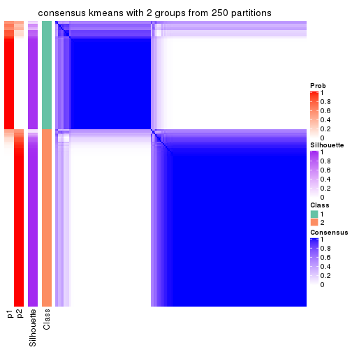</p>

</div>
<div id='tab-CV-kmeans-consensus-heatmap-2'>
<pre><code class="r">consensus_heatmap(res, k = 3)
</code></pre>

<p>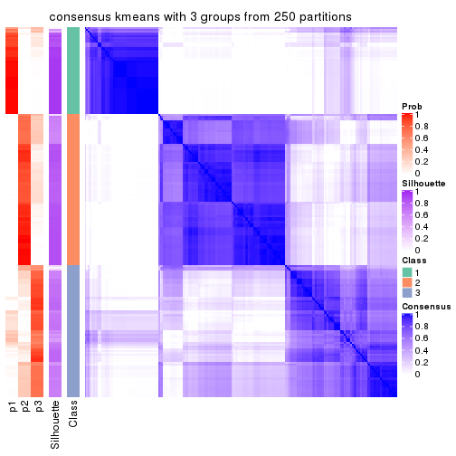</p>

</div>
<div id='tab-CV-kmeans-consensus-heatmap-3'>
<pre><code class="r">consensus_heatmap(res, k = 4)
</code></pre>

<p>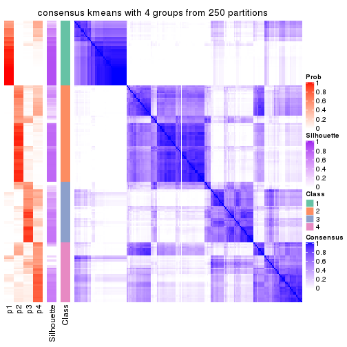</p>

</div>
<div id='tab-CV-kmeans-consensus-heatmap-4'>
<pre><code class="r">consensus_heatmap(res, k = 5)
</code></pre>

<p>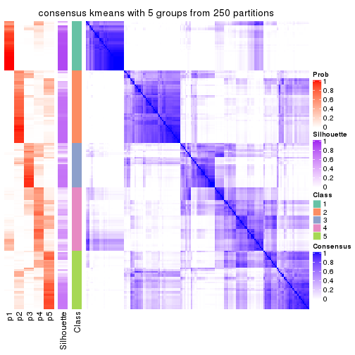</p>

</div>
<div id='tab-CV-kmeans-consensus-heatmap-5'>
<pre><code class="r">consensus_heatmap(res, k = 6)
</code></pre>

<p>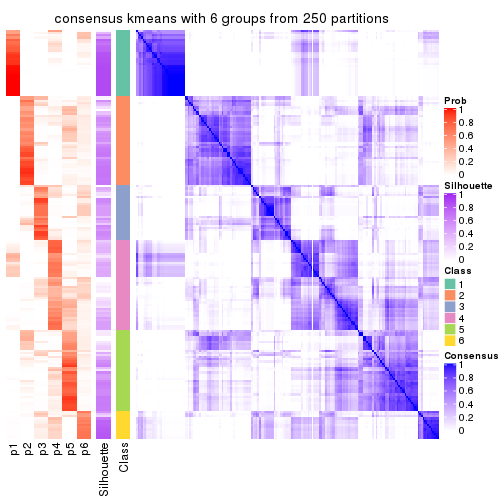</p>

</div>
</div>

Heatmaps for the membership of samples in all partitions to see how consistent they are:


<script>
$( function() {
	$( '#tabs-CV-kmeans-membership-heatmap' ).tabs();
} );
</script>
<div id='tabs-CV-kmeans-membership-heatmap'>
<ul>
<li><a href='#tab-CV-kmeans-membership-heatmap-1'>k = 2</a></li>
<li><a href='#tab-CV-kmeans-membership-heatmap-2'>k = 3</a></li>
<li><a href='#tab-CV-kmeans-membership-heatmap-3'>k = 4</a></li>
<li><a href='#tab-CV-kmeans-membership-heatmap-4'>k = 5</a></li>
<li><a href='#tab-CV-kmeans-membership-heatmap-5'>k = 6</a></li>
</ul>
<div id='tab-CV-kmeans-membership-heatmap-1'>
<pre><code class="r">membership_heatmap(res, k = 2)
</code></pre>

<p>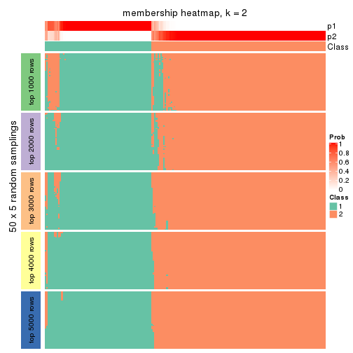</p>

</div>
<div id='tab-CV-kmeans-membership-heatmap-2'>
<pre><code class="r">membership_heatmap(res, k = 3)
</code></pre>

<p>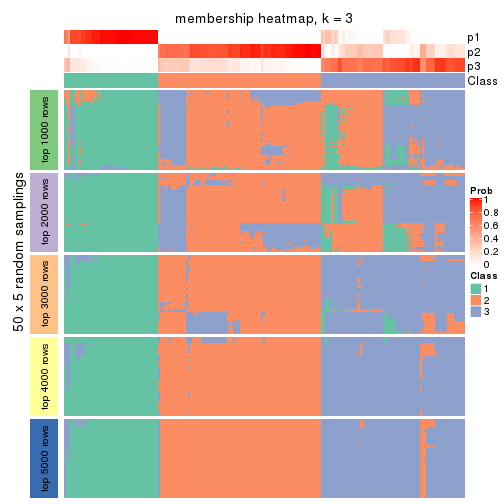</p>

</div>
<div id='tab-CV-kmeans-membership-heatmap-3'>
<pre><code class="r">membership_heatmap(res, k = 4)
</code></pre>

<p>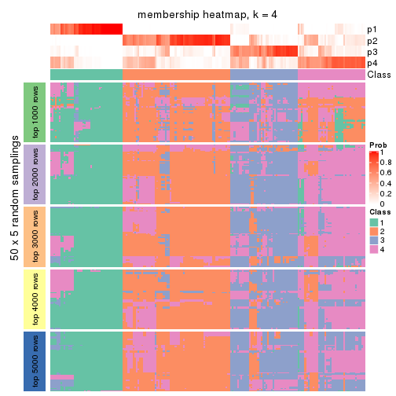</p>

</div>
<div id='tab-CV-kmeans-membership-heatmap-4'>
<pre><code class="r">membership_heatmap(res, k = 5)
</code></pre>

<p>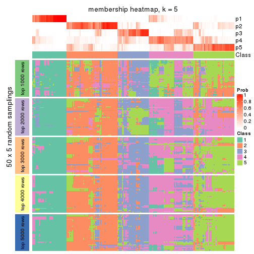</p>

</div>
<div id='tab-CV-kmeans-membership-heatmap-5'>
<pre><code class="r">membership_heatmap(res, k = 6)
</code></pre>

<p></p>

</div>
</div>

As soon as we have had the classes for columns, we can look for signatures
which are significantly different between classes which can be candidate marks
for certain classes. Following are the heatmaps for signatures.


Signature heatmaps where rows are scaled:


<script>
$( function() {
	$( '#tabs-CV-kmeans-get-signatures' ).tabs();
} );
</script>
<div id='tabs-CV-kmeans-get-signatures'>
<ul>
<li><a href='#tab-CV-kmeans-get-signatures-1'>k = 2</a></li>
<li><a href='#tab-CV-kmeans-get-signatures-2'>k = 3</a></li>
<li><a href='#tab-CV-kmeans-get-signatures-3'>k = 4</a></li>
<li><a href='#tab-CV-kmeans-get-signatures-4'>k = 5</a></li>
<li><a href='#tab-CV-kmeans-get-signatures-5'>k = 6</a></li>
</ul>
<div id='tab-CV-kmeans-get-signatures-1'>
<pre><code class="r">get_signatures(res, k = 2)
</code></pre>

<p>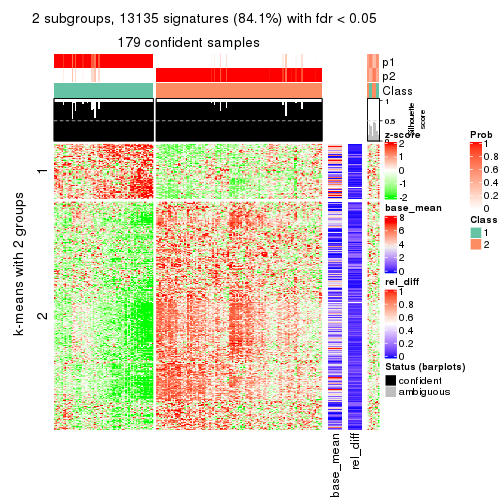</p>

</div>
<div id='tab-CV-kmeans-get-signatures-2'>
<pre><code class="r">get_signatures(res, k = 3)
</code></pre>

<p>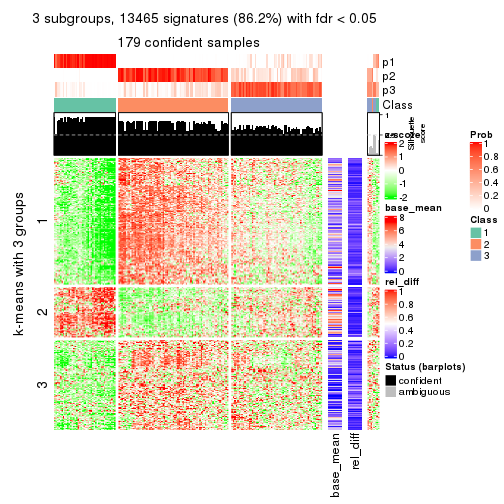</p>

</div>
<div id='tab-CV-kmeans-get-signatures-3'>
<pre><code class="r">get_signatures(res, k = 4)
</code></pre>

<p>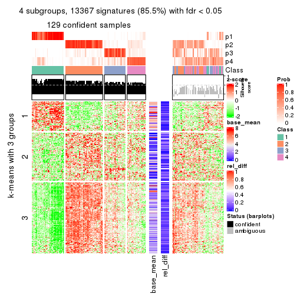</p>

</div>
<div id='tab-CV-kmeans-get-signatures-4'>
<pre><code class="r">get_signatures(res, k = 5)
</code></pre>

<p>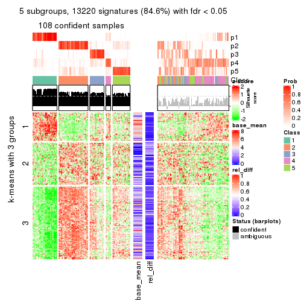</p>

</div>
<div id='tab-CV-kmeans-get-signatures-5'>
<pre><code class="r">get_signatures(res, k = 6)
</code></pre>

<p>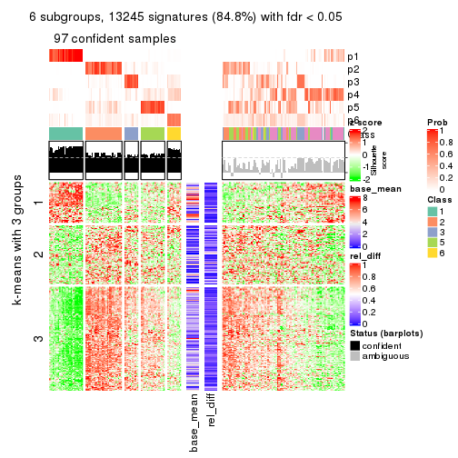</p>

</div>
</div>


Signature heatmaps where rows are not scaled:


<script>
$( function() {
	$( '#tabs-CV-kmeans-get-signatures-no-scale' ).tabs();
} );
</script>
<div id='tabs-CV-kmeans-get-signatures-no-scale'>
<ul>
<li><a href='#tab-CV-kmeans-get-signatures-no-scale-1'>k = 2</a></li>
<li><a href='#tab-CV-kmeans-get-signatures-no-scale-2'>k = 3</a></li>
<li><a href='#tab-CV-kmeans-get-signatures-no-scale-3'>k = 4</a></li>
<li><a href='#tab-CV-kmeans-get-signatures-no-scale-4'>k = 5</a></li>
<li><a href='#tab-CV-kmeans-get-signatures-no-scale-5'>k = 6</a></li>
</ul>
<div id='tab-CV-kmeans-get-signatures-no-scale-1'>
<pre><code class="r">get_signatures(res, k = 2, scale_rows = FALSE)
</code></pre>

<p>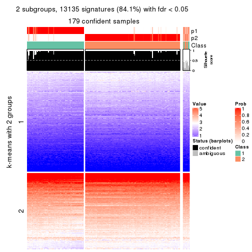</p>

</div>
<div id='tab-CV-kmeans-get-signatures-no-scale-2'>
<pre><code class="r">get_signatures(res, k = 3, scale_rows = FALSE)
</code></pre>

<p>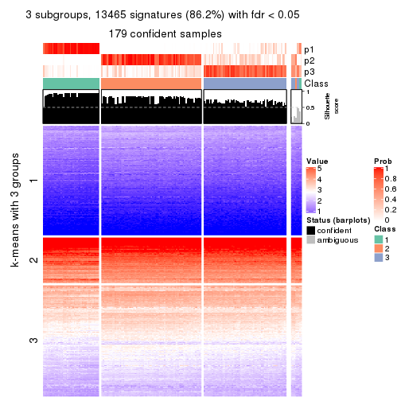</p>

</div>
<div id='tab-CV-kmeans-get-signatures-no-scale-3'>
<pre><code class="r">get_signatures(res, k = 4, scale_rows = FALSE)
</code></pre>

<p>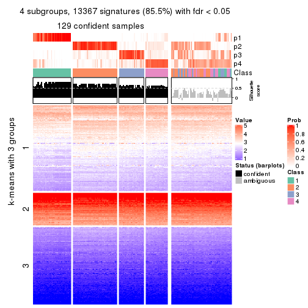</p>

</div>
<div id='tab-CV-kmeans-get-signatures-no-scale-4'>
<pre><code class="r">get_signatures(res, k = 5, scale_rows = FALSE)
</code></pre>

<p>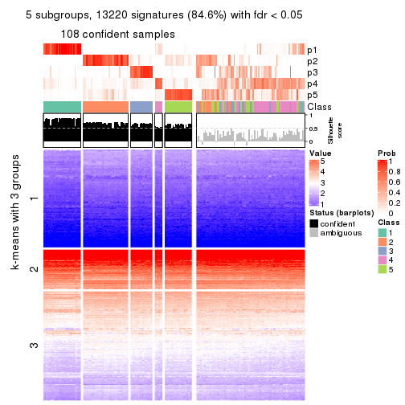</p>

</div>
<div id='tab-CV-kmeans-get-signatures-no-scale-5'>
<pre><code class="r">get_signatures(res, k = 6, scale_rows = FALSE)
</code></pre>

<p>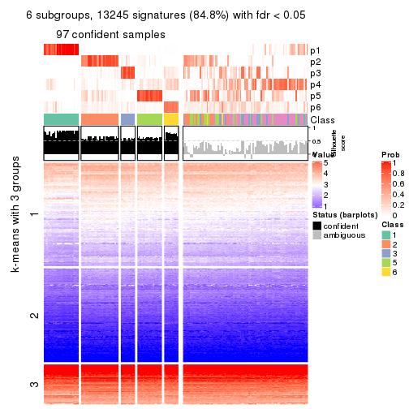</p>

</div>
</div>


Compare the overlap of signatures from different k:

```r
compare_signatures(res)
```

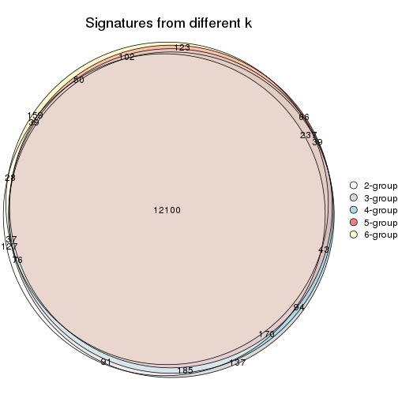

`get_signature()` returns a data frame invisibly. TO get the list of signatures, the function
call should be assigned to a variable explicitly. In following code, if `plot` argument is set
to `FALSE`, no heatmap is plotted while only the differential analysis is performed.

```r
# code only for demonstration
tb = get_signature(res, k = ..., plot = FALSE)
```

An example of the output of `tb` is:

```
#>   which_row         fdr    mean_1    mean_2 scaled_mean_1 scaled_mean_2 km
#> 1        38 0.042760348  8.373488  9.131774    -0.5533452     0.5164555  1
#> 2        40 0.018707592  7.106213  8.469186    -0.6173731     0.5762149  1
#> 3        55 0.019134737 10.221463 11.207825    -0.6159697     0.5749050  1
#> 4        59 0.006059896  5.921854  7.869574    -0.6899429     0.6439467  1
#> 5        60 0.018055526  8.928898 10.211722    -0.6204761     0.5791110  1
#> 6        98 0.009384629 15.714769 14.887706     0.6635654    -0.6193277  2
...
```

The columns in `tb` are:

1. `which_row`: row indices corresponding to the input matrix.
2. `fdr`: FDR for the differential test. 
3. `mean_x`: The mean value in group x.
4. `scaled_mean_x`: The mean value in group x after rows are scaled.
5. `km`: Row groups if k-means clustering is applied to rows.


UMAP plot which shows how samples are separated.


<script>
$( function() {
	$( '#tabs-CV-kmeans-dimension-reduction' ).tabs();
} );
</script>
<div id='tabs-CV-kmeans-dimension-reduction'>
<ul>
<li><a href='#tab-CV-kmeans-dimension-reduction-1'>k = 2</a></li>
<li><a href='#tab-CV-kmeans-dimension-reduction-2'>k = 3</a></li>
<li><a href='#tab-CV-kmeans-dimension-reduction-3'>k = 4</a></li>
<li><a href='#tab-CV-kmeans-dimension-reduction-4'>k = 5</a></li>
<li><a href='#tab-CV-kmeans-dimension-reduction-5'>k = 6</a></li>
</ul>
<div id='tab-CV-kmeans-dimension-reduction-1'>
<pre><code class="r">dimension_reduction(res, k = 2, method = &quot;UMAP&quot;)
</code></pre>

<p>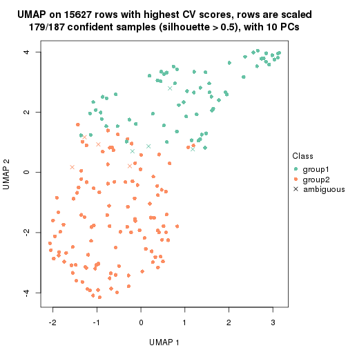</p>

</div>
<div id='tab-CV-kmeans-dimension-reduction-2'>
<pre><code class="r">dimension_reduction(res, k = 3, method = &quot;UMAP&quot;)
</code></pre>

<p>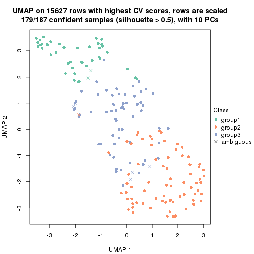</p>

</div>
<div id='tab-CV-kmeans-dimension-reduction-3'>
<pre><code class="r">dimension_reduction(res, k = 4, method = &quot;UMAP&quot;)
</code></pre>

<p>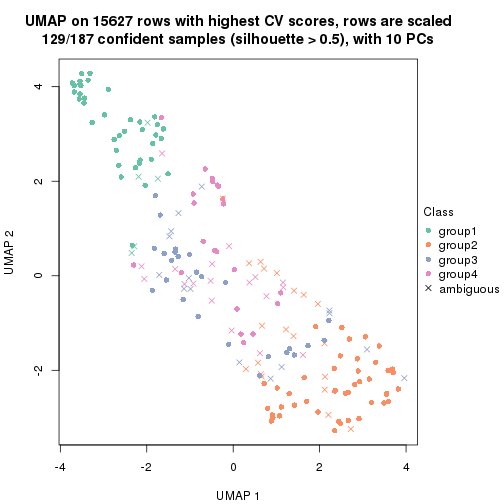</p>

</div>
<div id='tab-CV-kmeans-dimension-reduction-4'>
<pre><code class="r">dimension_reduction(res, k = 5, method = &quot;UMAP&quot;)
</code></pre>

<p>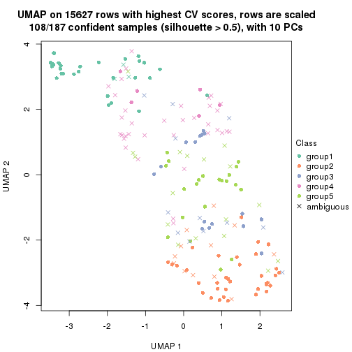</p>

</div>
<div id='tab-CV-kmeans-dimension-reduction-5'>
<pre><code class="r">dimension_reduction(res, k = 6, method = &quot;UMAP&quot;)
</code></pre>

<p>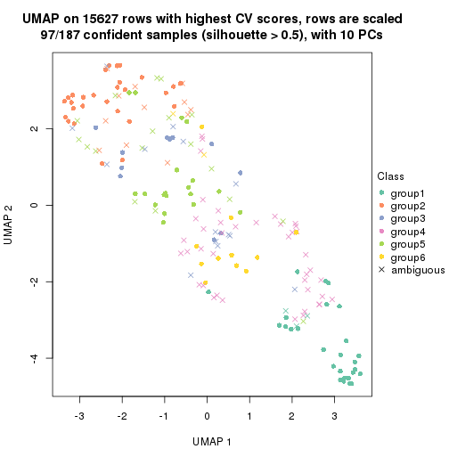</p>

</div>
</div>


Following heatmap shows how subgroups are split when increasing `k`:

```r
collect_classes(res)
```

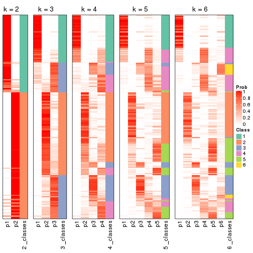


If matrix rows can be associated to genes, consider to use `GO_Enrichment(res,
...)` to perform function enrichment for the signature genes.


 

---------------------------------------------------


### CV:skmeans*


The object with results only for a single top-value method and a single partition method 
can be extracted as:

```r
res = res_list["CV", "skmeans"]
# you can also extract it by
# res = res_list["CV:skmeans"]
```

A summary of `res` and all the functions that can be applied to it:

```r
res
```

```
#> A 'ConsensusPartition' object with k = 2, 3, 4, 5, 6.
#>   On a matrix with 15627 rows and 187 columns.
#>   Top rows (1000, 2000, 3000, 4000, 5000) are extracted by 'CV' method.
#>   Subgroups are detected by 'skmeans' method.
#>   Performed in total 1250 partitions by row resampling.
#>   Best k for subgroups seems to be 2.
#> 
#> Following methods can be applied to this 'ConsensusPartition' object:
#>  [1] "cola_report"             "collect_classes"         "collect_plots"          
#>  [4] "collect_stats"           "colnames"                "compare_signatures"     
#>  [7] "consensus_heatmap"       "dimension_reduction"     "functional_enrichment"  
#> [10] "get_anno_col"            "get_anno"                "get_classes"            
#> [13] "get_consensus"           "get_matrix"              "get_membership"         
#> [16] "get_param"               "get_signatures"          "get_stats"              
#> [19] "is_best_k"               "is_stable_k"             "membership_heatmap"     
#> [22] "ncol"                    "nrow"                    "plot_ecdf"              
#> [25] "rownames"                "select_partition_number" "show"                   
#> [28] "suggest_best_k"          "test_to_known_factors"
```

`collect_plots()` function collects all the plots made from `res` for all `k` (number of partitions)
into one single page to provide an easy and fast comparison between different `k`.

```r
collect_plots(res)
```

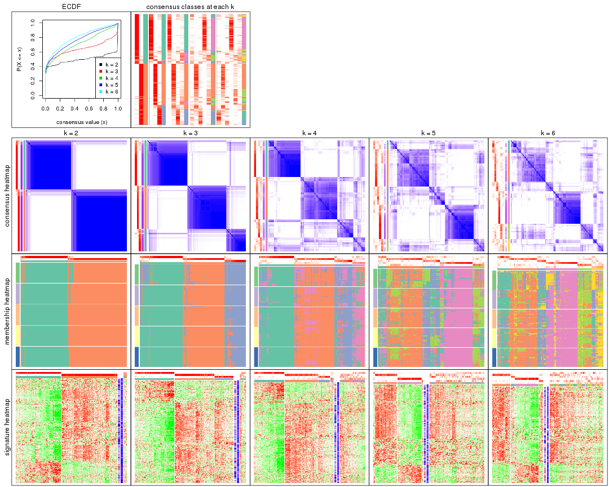

The plots are:

- The first row: a plot of the ECDF (Empirical cumulative distribution
  function) curves of the consensus matrix for each `k` and the heatmap of
  predicted classes for each `k`.
- The second row: heatmaps of the consensus matrix for each `k`.
- The third row: heatmaps of the membership matrix for each `k`.
- The fouth row: heatmaps of the signatures for each `k`.

All the plots in panels can be made by individual functions and they are
plotted later in this section.

`select_partition_number()` produces several plots showing different
statistics for choosing "optimized" `k`. There are following statistics:

- ECDF curves of the consensus matrix for each `k`;
- 1-PAC. [The PAC
  score](https://en.wikipedia.org/wiki/Consensus_clustering#Over-interpretation_potential_of_consensus_clustering)
  measures the proportion of the ambiguous subgrouping.
- Mean silhouette score.
- Concordance. The mean probability of fiting the consensus class ids in all
  partitions.
- Area increased. Denote $A_k$ as the area under the ECDF curve for current
  `k`, the area increased is defined as $A_k - A_{k-1}$.
- Rand index. The percent of pairs of samples that are both in a same cluster
  or both are not in a same cluster in the partition of k and k-1.
- Jaccard index. The ratio of pairs of samples are both in a same cluster in
  the partition of k and k-1 and the pairs of samples are both in a same
  cluster in the partition k or k-1.

The detailed explanations of these statistics can be found in [the cola
vignette](http://bioconductor.org/packages/devel/bioc/vignettes/cola/inst/doc/cola.html#toc_13).

Generally speaking, lower PAC score, higher mean silhouette score or higher
concordance corresponds to better partition. Rand index and Jaccard index
measure how similar the current partition is compared to partition with `k-1`.
If they are too similar, we won't accept `k` is better than `k-1`.

```r
select_partition_number(res)
```

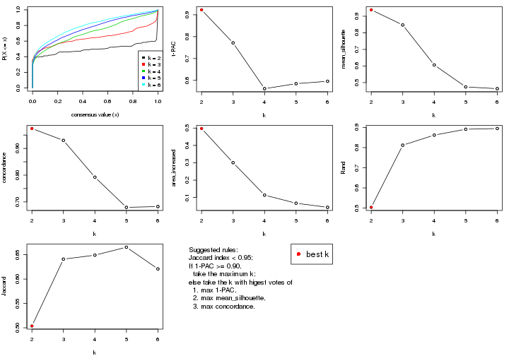

The numeric values for all these statistics can be obtained by `get_stats()`.

```r
get_stats(res)
```

```
#>   k 1-PAC mean_silhouette concordance area_increased  Rand Jaccard
#> 2 2 0.922           0.938       0.974         0.4973 0.504   0.504
#> 3 3 0.771           0.847       0.930         0.3006 0.812   0.641
#> 4 4 0.562           0.606       0.792         0.1137 0.862   0.649
#> 5 5 0.585           0.474       0.680         0.0670 0.891   0.665
#> 6 6 0.596           0.463       0.683         0.0434 0.895   0.621
```

`suggest_best_k()` suggests the best $k$ based on these statistics. The rules are as follows:

- All $k$ with Jaccard index larger than 0.95 are removed because the increase of
  the partition number does not provides enough extra information. If all $k$ are removed,
  the best $k$ is assigned by `NA`.
- For $k$ with 1-PAC larger than 0.9, the maximal $k$ is taken as the "best k". Other $k$ is called "optional k".
- If it does not fit the second rule. The $k$ with the highest vote of highest
  1-PAC, mean silhouette and concordance is taken as the "best k".

```r
suggest_best_k(res)
```

```
#> [1] 2
```


Following shows the table of the partitions (You need to click the **show/hide
code output** link to see it). The membership matrix (columns with name `p*`)
is inferred by
[`clue::cl_consensus()`](https://www.rdocumentation.org/link/cl_consensus?package=clue)
function with the `SE` method. Basically the value in the membership matrix
represents the probability to belong to a certain group. The finall class
label for an item is determined with the group with highest probability it
belongs to.

In `get_classes()` function, the entropy is calculated from the membership
matrix and the silhouette score is calculated from the consensus matrix.


<script>
$( function() {
	$( '#tabs-CV-skmeans-get-classes' ).tabs();
} );
</script>
<div id='tabs-CV-skmeans-get-classes'>
<ul>
<li><a href='#tab-CV-skmeans-get-classes-1'>k = 2</a></li>
<li><a href='#tab-CV-skmeans-get-classes-2'>k = 3</a></li>
<li><a href='#tab-CV-skmeans-get-classes-3'>k = 4</a></li>
<li><a href='#tab-CV-skmeans-get-classes-4'>k = 5</a></li>
<li><a href='#tab-CV-skmeans-get-classes-5'>k = 6</a></li>
</ul>

<div id='tab-CV-skmeans-get-classes-1'>
<p><a id='tab-CV-skmeans-get-classes-1-a' style='color:#0366d6' href='#'>show/hide code output</a></p>
<pre><code class="r">cbind(get_classes(res, k = 2), get_membership(res, k = 2))
</code></pre>

<pre><code>#&gt;            class entropy silhouette    p1    p2
#&gt; SRR1747213     1  0.0000      0.973 1.000 0.000
#&gt; SRR1747214     1  0.0000      0.973 1.000 0.000
#&gt; SRR1747215     2  0.0000      0.973 0.000 1.000
#&gt; SRR1747216     2  0.0000      0.973 0.000 1.000
#&gt; SRR1747217     1  0.4161      0.893 0.916 0.084
#&gt; SRR1747218     2  0.0000      0.973 0.000 1.000
#&gt; SRR1747219     1  0.0000      0.973 1.000 0.000
#&gt; SRR1747220     1  0.0000      0.973 1.000 0.000
#&gt; SRR1747221     1  0.0000      0.973 1.000 0.000
#&gt; SRR1747222     1  0.4298      0.890 0.912 0.088
#&gt; SRR1747223     1  0.0000      0.973 1.000 0.000
#&gt; SRR1747224     1  0.7056      0.763 0.808 0.192
#&gt; SRR1747225     2  0.0000      0.973 0.000 1.000
#&gt; SRR1747226     2  0.0000      0.973 0.000 1.000
#&gt; SRR1747227     2  0.0000      0.973 0.000 1.000
#&gt; SRR1747228     2  0.9833      0.280 0.424 0.576
#&gt; SRR1747229     2  0.0000      0.973 0.000 1.000
#&gt; SRR1747230     1  0.0000      0.973 1.000 0.000
#&gt; SRR1747231     1  0.0000      0.973 1.000 0.000
#&gt; SRR1747232     1  0.0000      0.973 1.000 0.000
#&gt; SRR1747233     1  0.0000      0.973 1.000 0.000
#&gt; SRR1747234     2  0.0000      0.973 0.000 1.000
#&gt; SRR1747235     1  0.0000      0.973 1.000 0.000
#&gt; SRR1747236     2  0.0000      0.973 0.000 1.000
#&gt; SRR1747237     2  0.0000      0.973 0.000 1.000
#&gt; SRR1747238     2  0.0000      0.973 0.000 1.000
#&gt; SRR1747239     2  0.0000      0.973 0.000 1.000
#&gt; SRR1747240     1  0.0000      0.973 1.000 0.000
#&gt; SRR1747241     1  0.7453      0.734 0.788 0.212
#&gt; SRR1747242     1  0.0000      0.973 1.000 0.000
#&gt; SRR1747243     1  0.0000      0.973 1.000 0.000
#&gt; SRR1747244     2  0.0000      0.973 0.000 1.000
#&gt; SRR1747245     2  0.0000      0.973 0.000 1.000
#&gt; SRR1747246     2  0.0000      0.973 0.000 1.000
#&gt; SRR1747247     1  0.0000      0.973 1.000 0.000
#&gt; SRR1747248     1  0.0000      0.973 1.000 0.000
#&gt; SRR1747249     1  0.0000      0.973 1.000 0.000
#&gt; SRR1747250     2  0.0000      0.973 0.000 1.000
#&gt; SRR1747252     1  0.0000      0.973 1.000 0.000
#&gt; SRR1747253     1  0.0000      0.973 1.000 0.000
#&gt; SRR1747254     2  0.0000      0.973 0.000 1.000
#&gt; SRR1747255     1  0.0000      0.973 1.000 0.000
#&gt; SRR1747256     1  0.0000      0.973 1.000 0.000
#&gt; SRR1747257     2  0.0000      0.973 0.000 1.000
#&gt; SRR1747258     2  0.0000      0.973 0.000 1.000
#&gt; SRR1747259     2  0.0000      0.973 0.000 1.000
#&gt; SRR1747260     2  0.2948      0.925 0.052 0.948
#&gt; SRR1747261     1  0.0938      0.963 0.988 0.012
#&gt; SRR1747262     2  0.0000      0.973 0.000 1.000
#&gt; SRR1747263     2  0.0000      0.973 0.000 1.000
#&gt; SRR1747264     1  0.0000      0.973 1.000 0.000
#&gt; SRR1747265     1  0.0000      0.973 1.000 0.000
#&gt; SRR1747266     2  0.6887      0.774 0.184 0.816
#&gt; SRR1747267     1  0.0000      0.973 1.000 0.000
#&gt; SRR1747268     1  0.9608      0.364 0.616 0.384
#&gt; SRR1747269     2  0.0000      0.973 0.000 1.000
#&gt; SRR1747270     2  0.0000      0.973 0.000 1.000
#&gt; SRR1747271     2  0.0000      0.973 0.000 1.000
#&gt; SRR1747272     2  0.9248      0.474 0.340 0.660
#&gt; SRR1747273     1  0.0000      0.973 1.000 0.000
#&gt; SRR1747274     2  0.9710      0.350 0.400 0.600
#&gt; SRR1747275     1  0.0000      0.973 1.000 0.000
#&gt; SRR1747276     1  0.0000      0.973 1.000 0.000
#&gt; SRR1747277     2  0.0000      0.973 0.000 1.000
#&gt; SRR1747278     2  0.5519      0.845 0.128 0.872
#&gt; SRR1747280     1  0.0000      0.973 1.000 0.000
#&gt; SRR1747279     1  0.0000      0.973 1.000 0.000
#&gt; SRR1747281     2  0.0000      0.973 0.000 1.000
#&gt; SRR1747282     1  0.0000      0.973 1.000 0.000
#&gt; SRR1747283     1  0.0000      0.973 1.000 0.000
#&gt; SRR1747284     1  0.0000      0.973 1.000 0.000
#&gt; SRR1747285     2  0.0000      0.973 0.000 1.000
#&gt; SRR1747286     2  0.0000      0.973 0.000 1.000
#&gt; SRR1747287     2  0.0000      0.973 0.000 1.000
#&gt; SRR1747288     1  0.0938      0.963 0.988 0.012
#&gt; SRR1747290     2  0.0000      0.973 0.000 1.000
#&gt; SRR1747289     2  0.0000      0.973 0.000 1.000
#&gt; SRR1747291     2  0.0000      0.973 0.000 1.000
#&gt; SRR1747293     2  0.0000      0.973 0.000 1.000
#&gt; SRR1747294     2  0.0000      0.973 0.000 1.000
#&gt; SRR1747292     1  0.0000      0.973 1.000 0.000
#&gt; SRR1747295     2  0.0000      0.973 0.000 1.000
#&gt; SRR1747296     2  0.0000      0.973 0.000 1.000
#&gt; SRR1747297     2  0.0000      0.973 0.000 1.000
#&gt; SRR1747298     2  0.0000      0.973 0.000 1.000
#&gt; SRR1747299     2  0.0000      0.973 0.000 1.000
#&gt; SRR1747300     2  0.0000      0.973 0.000 1.000
#&gt; SRR1747301     2  0.0000      0.973 0.000 1.000
#&gt; SRR1747302     2  0.0000      0.973 0.000 1.000
#&gt; SRR1747303     2  0.0000      0.973 0.000 1.000
#&gt; SRR1747304     1  0.0000      0.973 1.000 0.000
#&gt; SRR1747305     2  0.0000      0.973 0.000 1.000
#&gt; SRR1747306     2  0.0000      0.973 0.000 1.000
#&gt; SRR1747307     1  0.0000      0.973 1.000 0.000
#&gt; SRR1747308     2  0.0000      0.973 0.000 1.000
#&gt; SRR1747309     1  0.0000      0.973 1.000 0.000
#&gt; SRR1747310     1  0.0000      0.973 1.000 0.000
#&gt; SRR1747311     1  0.0000      0.973 1.000 0.000
#&gt; SRR1747313     1  0.8955      0.554 0.688 0.312
#&gt; SRR1747312     1  0.0000      0.973 1.000 0.000
#&gt; SRR1747314     1  0.0000      0.973 1.000 0.000
#&gt; SRR1747315     2  0.0000      0.973 0.000 1.000
#&gt; SRR1747316     2  0.0000      0.973 0.000 1.000
#&gt; SRR1747318     2  0.6801      0.770 0.180 0.820
#&gt; SRR1747317     2  0.0000      0.973 0.000 1.000
#&gt; SRR1747319     1  0.0672      0.966 0.992 0.008
#&gt; SRR1747320     1  0.0000      0.973 1.000 0.000
#&gt; SRR1747322     1  0.0000      0.973 1.000 0.000
#&gt; SRR1747321     1  0.0000      0.973 1.000 0.000
#&gt; SRR1747323     2  0.0000      0.973 0.000 1.000
#&gt; SRR1747324     2  0.0000      0.973 0.000 1.000
#&gt; SRR1747326     2  0.0000      0.973 0.000 1.000
#&gt; SRR1747325     2  0.0000      0.973 0.000 1.000
#&gt; SRR1747327     2  0.0000      0.973 0.000 1.000
#&gt; SRR1747328     1  0.6148      0.810 0.848 0.152
#&gt; SRR1747330     2  0.0938      0.963 0.012 0.988
#&gt; SRR1747329     2  0.0000      0.973 0.000 1.000
#&gt; SRR1747332     1  0.0000      0.973 1.000 0.000
#&gt; SRR1747331     2  0.7376      0.739 0.208 0.792
#&gt; SRR1747333     2  0.6887      0.774 0.184 0.816
#&gt; SRR1747334     2  0.0000      0.973 0.000 1.000
#&gt; SRR1747335     1  0.0000      0.973 1.000 0.000
#&gt; SRR1747336     1  0.0000      0.973 1.000 0.000
#&gt; SRR1747337     2  0.0000      0.973 0.000 1.000
#&gt; SRR1747338     2  0.0000      0.973 0.000 1.000
#&gt; SRR1747339     1  0.0000      0.973 1.000 0.000
#&gt; SRR1747340     2  0.0000      0.973 0.000 1.000
#&gt; SRR1747341     2  0.0000      0.973 0.000 1.000
#&gt; SRR1747342     2  0.0000      0.973 0.000 1.000
#&gt; SRR1747343     2  0.0000      0.973 0.000 1.000
#&gt; SRR1747344     2  0.0000      0.973 0.000 1.000
#&gt; SRR1747345     1  0.0000      0.973 1.000 0.000
#&gt; SRR1747346     2  0.0000      0.973 0.000 1.000
#&gt; SRR1747347     2  0.0000      0.973 0.000 1.000
#&gt; SRR1747348     1  0.0000      0.973 1.000 0.000
#&gt; SRR1747349     1  0.0000      0.973 1.000 0.000
#&gt; SRR1747351     2  0.0000      0.973 0.000 1.000
#&gt; SRR1747350     2  0.0376      0.970 0.004 0.996
#&gt; SRR1747352     1  0.0000      0.973 1.000 0.000
#&gt; SRR1747353     2  0.0000      0.973 0.000 1.000
#&gt; SRR1747354     2  0.0938      0.963 0.012 0.988
#&gt; SRR1747355     1  0.0000      0.973 1.000 0.000
#&gt; SRR1747356     2  0.9608      0.393 0.384 0.616
#&gt; SRR1747357     1  0.0000      0.973 1.000 0.000
#&gt; SRR1747358     1  0.0000      0.973 1.000 0.000
#&gt; SRR1747359     1  0.0000      0.973 1.000 0.000
#&gt; SRR1747360     2  0.0000      0.973 0.000 1.000
#&gt; SRR1747361     1  0.0000      0.973 1.000 0.000
#&gt; SRR1747362     2  0.0000      0.973 0.000 1.000
#&gt; SRR1747363     1  0.1184      0.960 0.984 0.016
#&gt; SRR1747364     1  0.0000      0.973 1.000 0.000
#&gt; SRR1747365     1  0.0000      0.973 1.000 0.000
#&gt; SRR1747366     2  0.0000      0.973 0.000 1.000
#&gt; SRR1747367     1  0.1184      0.960 0.984 0.016
#&gt; SRR1747369     2  0.0000      0.973 0.000 1.000
#&gt; SRR1747368     1  0.7219      0.752 0.800 0.200
#&gt; SRR1747370     1  0.9963      0.125 0.536 0.464
#&gt; SRR1747372     1  0.0000      0.973 1.000 0.000
#&gt; SRR1747371     1  0.0000      0.973 1.000 0.000
#&gt; SRR1747373     2  0.0000      0.973 0.000 1.000
#&gt; SRR1747374     2  0.0000      0.973 0.000 1.000
#&gt; SRR1747375     1  0.0000      0.973 1.000 0.000
#&gt; SRR1747376     2  0.0000      0.973 0.000 1.000
#&gt; SRR1747377     2  0.0000      0.973 0.000 1.000
#&gt; SRR1747378     2  0.0000      0.973 0.000 1.000
#&gt; SRR1747379     2  0.0000      0.973 0.000 1.000
#&gt; SRR1747380     2  0.0000      0.973 0.000 1.000
#&gt; SRR1747381     1  0.0000      0.973 1.000 0.000
#&gt; SRR1747382     1  0.0000      0.973 1.000 0.000
#&gt; SRR1747383     2  0.0000      0.973 0.000 1.000
#&gt; SRR1747384     1  0.0000      0.973 1.000 0.000
#&gt; SRR1747385     2  0.0000      0.973 0.000 1.000
#&gt; SRR1747386     1  0.0000      0.973 1.000 0.000
#&gt; SRR1747387     2  0.0000      0.973 0.000 1.000
#&gt; SRR1747388     2  0.0000      0.973 0.000 1.000
#&gt; SRR1747390     2  0.0000      0.973 0.000 1.000
#&gt; SRR1747389     2  0.0000      0.973 0.000 1.000
#&gt; SRR1747391     2  0.0000      0.973 0.000 1.000
#&gt; SRR1747392     2  0.0000      0.973 0.000 1.000
#&gt; SRR1747393     2  0.5408      0.850 0.124 0.876
#&gt; SRR1747394     1  0.0000      0.973 1.000 0.000
#&gt; SRR1747395     2  0.0000      0.973 0.000 1.000
#&gt; SRR1747396     2  0.0000      0.973 0.000 1.000
#&gt; SRR1747398     2  0.0000      0.973 0.000 1.000
#&gt; SRR1747397     1  0.0000      0.973 1.000 0.000
#&gt; SRR1747399     1  0.0000      0.973 1.000 0.000
#&gt; SRR1747400     1  0.0000      0.973 1.000 0.000
</code></pre>

<script>
$('#tab-CV-skmeans-get-classes-1-a').parent().next().next().hide();
$('#tab-CV-skmeans-get-classes-1-a').click(function(){
  $('#tab-CV-skmeans-get-classes-1-a').parent().next().next().toggle();
  return(false);
});
</script>
</div>

<div id='tab-CV-skmeans-get-classes-2'>
<p><a id='tab-CV-skmeans-get-classes-2-a' style='color:#0366d6' href='#'>show/hide code output</a></p>
<pre><code class="r">cbind(get_classes(res, k = 3), get_membership(res, k = 3))
</code></pre>

<pre><code>#&gt;            class entropy silhouette    p1    p2    p3
#&gt; SRR1747213     1  0.0000     0.9160 1.000 0.000 0.000
#&gt; SRR1747214     1  0.4399     0.7663 0.812 0.000 0.188
#&gt; SRR1747215     2  0.0000     0.9433 0.000 1.000 0.000
#&gt; SRR1747216     2  0.0000     0.9433 0.000 1.000 0.000
#&gt; SRR1747217     1  0.6427     0.4344 0.640 0.348 0.012
#&gt; SRR1747218     2  0.0000     0.9433 0.000 1.000 0.000
#&gt; SRR1747219     1  0.4504     0.7564 0.804 0.000 0.196
#&gt; SRR1747220     1  0.4346     0.7693 0.816 0.000 0.184
#&gt; SRR1747221     1  0.0000     0.9160 1.000 0.000 0.000
#&gt; SRR1747222     1  0.6274     0.2315 0.544 0.000 0.456
#&gt; SRR1747223     1  0.0237     0.9141 0.996 0.004 0.000
#&gt; SRR1747224     1  0.6625     0.2748 0.552 0.440 0.008
#&gt; SRR1747225     2  0.0000     0.9433 0.000 1.000 0.000
#&gt; SRR1747226     2  0.0424     0.9424 0.000 0.992 0.008
#&gt; SRR1747227     2  0.0000     0.9433 0.000 1.000 0.000
#&gt; SRR1747228     2  0.4504     0.7317 0.196 0.804 0.000
#&gt; SRR1747229     2  0.2165     0.9098 0.000 0.936 0.064
#&gt; SRR1747230     1  0.0000     0.9160 1.000 0.000 0.000
#&gt; SRR1747231     1  0.0000     0.9160 1.000 0.000 0.000
#&gt; SRR1747232     1  0.0000     0.9160 1.000 0.000 0.000
#&gt; SRR1747233     1  0.0000     0.9160 1.000 0.000 0.000
#&gt; SRR1747234     3  0.0000     0.8866 0.000 0.000 1.000
#&gt; SRR1747235     1  0.0000     0.9160 1.000 0.000 0.000
#&gt; SRR1747236     3  0.6307     0.0917 0.000 0.488 0.512
#&gt; SRR1747237     3  0.1163     0.8837 0.000 0.028 0.972
#&gt; SRR1747238     3  0.0424     0.8866 0.000 0.008 0.992
#&gt; SRR1747239     2  0.0592     0.9415 0.000 0.988 0.012
#&gt; SRR1747240     1  0.0000     0.9160 1.000 0.000 0.000
#&gt; SRR1747241     3  0.4784     0.6921 0.200 0.004 0.796
#&gt; SRR1747242     1  0.0000     0.9160 1.000 0.000 0.000
#&gt; SRR1747243     1  0.1753     0.8842 0.952 0.048 0.000
#&gt; SRR1747244     2  0.2448     0.8914 0.000 0.924 0.076
#&gt; SRR1747245     2  0.0000     0.9433 0.000 1.000 0.000
#&gt; SRR1747246     2  0.0000     0.9433 0.000 1.000 0.000
#&gt; SRR1747247     1  0.0000     0.9160 1.000 0.000 0.000
#&gt; SRR1747248     1  0.0000     0.9160 1.000 0.000 0.000
#&gt; SRR1747249     1  0.0000     0.9160 1.000 0.000 0.000
#&gt; SRR1747250     3  0.0000     0.8866 0.000 0.000 1.000
#&gt; SRR1747252     1  0.5529     0.6205 0.704 0.000 0.296
#&gt; SRR1747253     3  0.6267     0.0691 0.452 0.000 0.548
#&gt; SRR1747254     3  0.5678     0.5788 0.000 0.316 0.684
#&gt; SRR1747255     1  0.0000     0.9160 1.000 0.000 0.000
#&gt; SRR1747256     1  0.0000     0.9160 1.000 0.000 0.000
#&gt; SRR1747257     2  0.0747     0.9402 0.000 0.984 0.016
#&gt; SRR1747258     2  0.4452     0.7562 0.000 0.808 0.192
#&gt; SRR1747259     3  0.0892     0.8855 0.000 0.020 0.980
#&gt; SRR1747260     3  0.0000     0.8866 0.000 0.000 1.000
#&gt; SRR1747261     1  0.3619     0.8100 0.864 0.136 0.000
#&gt; SRR1747262     2  0.0000     0.9433 0.000 1.000 0.000
#&gt; SRR1747263     2  0.2066     0.9082 0.000 0.940 0.060
#&gt; SRR1747264     1  0.0000     0.9160 1.000 0.000 0.000
#&gt; SRR1747265     1  0.0237     0.9143 0.996 0.000 0.004
#&gt; SRR1747266     2  0.7031     0.6441 0.088 0.716 0.196
#&gt; SRR1747267     1  0.5291     0.6708 0.732 0.000 0.268
#&gt; SRR1747268     2  0.4399     0.7429 0.188 0.812 0.000
#&gt; SRR1747269     3  0.4504     0.7565 0.000 0.196 0.804
#&gt; SRR1747270     3  0.5291     0.6623 0.000 0.268 0.732
#&gt; SRR1747271     3  0.3116     0.8393 0.000 0.108 0.892
#&gt; SRR1747272     3  0.0000     0.8866 0.000 0.000 1.000
#&gt; SRR1747273     1  0.0000     0.9160 1.000 0.000 0.000
#&gt; SRR1747274     2  0.1643     0.9125 0.044 0.956 0.000
#&gt; SRR1747275     1  0.0000     0.9160 1.000 0.000 0.000
#&gt; SRR1747276     1  0.0000     0.9160 1.000 0.000 0.000
#&gt; SRR1747277     2  0.4291     0.7702 0.000 0.820 0.180
#&gt; SRR1747278     2  0.0237     0.9421 0.004 0.996 0.000
#&gt; SRR1747280     1  0.0000     0.9160 1.000 0.000 0.000
#&gt; SRR1747279     1  0.0000     0.9160 1.000 0.000 0.000
#&gt; SRR1747281     2  0.0000     0.9433 0.000 1.000 0.000
#&gt; SRR1747282     1  0.0000     0.9160 1.000 0.000 0.000
#&gt; SRR1747283     1  0.0000     0.9160 1.000 0.000 0.000
#&gt; SRR1747284     1  0.0000     0.9160 1.000 0.000 0.000
#&gt; SRR1747285     3  0.0000     0.8866 0.000 0.000 1.000
#&gt; SRR1747286     3  0.0000     0.8866 0.000 0.000 1.000
#&gt; SRR1747287     2  0.0424     0.9424 0.000 0.992 0.008
#&gt; SRR1747288     1  0.4618     0.8067 0.840 0.024 0.136
#&gt; SRR1747290     3  0.2356     0.8634 0.000 0.072 0.928
#&gt; SRR1747289     3  0.0592     0.8863 0.000 0.012 0.988
#&gt; SRR1747291     2  0.0000     0.9433 0.000 1.000 0.000
#&gt; SRR1747293     2  0.2537     0.8833 0.000 0.920 0.080
#&gt; SRR1747294     3  0.5948     0.4814 0.000 0.360 0.640
#&gt; SRR1747292     1  0.0000     0.9160 1.000 0.000 0.000
#&gt; SRR1747295     3  0.0000     0.8866 0.000 0.000 1.000
#&gt; SRR1747296     3  0.0000     0.8866 0.000 0.000 1.000
#&gt; SRR1747297     2  0.0000     0.9433 0.000 1.000 0.000
#&gt; SRR1747298     2  0.0000     0.9433 0.000 1.000 0.000
#&gt; SRR1747299     2  0.0000     0.9433 0.000 1.000 0.000
#&gt; SRR1747300     2  0.0000     0.9433 0.000 1.000 0.000
#&gt; SRR1747301     2  0.2878     0.8798 0.000 0.904 0.096
#&gt; SRR1747302     2  0.1411     0.9288 0.000 0.964 0.036
#&gt; SRR1747303     2  0.0000     0.9433 0.000 1.000 0.000
#&gt; SRR1747304     1  0.0000     0.9160 1.000 0.000 0.000
#&gt; SRR1747305     2  0.0000     0.9433 0.000 1.000 0.000
#&gt; SRR1747306     2  0.0237     0.9429 0.000 0.996 0.004
#&gt; SRR1747307     1  0.5098     0.6942 0.752 0.000 0.248
#&gt; SRR1747308     3  0.0000     0.8866 0.000 0.000 1.000
#&gt; SRR1747309     1  0.0000     0.9160 1.000 0.000 0.000
#&gt; SRR1747310     1  0.4178     0.7819 0.828 0.000 0.172
#&gt; SRR1747311     1  0.0000     0.9160 1.000 0.000 0.000
#&gt; SRR1747313     2  0.6126     0.2681 0.400 0.600 0.000
#&gt; SRR1747312     1  0.0000     0.9160 1.000 0.000 0.000
#&gt; SRR1747314     1  0.0000     0.9160 1.000 0.000 0.000
#&gt; SRR1747315     2  0.0000     0.9433 0.000 1.000 0.000
#&gt; SRR1747316     3  0.5178     0.6762 0.000 0.256 0.744
#&gt; SRR1747318     3  0.0000     0.8866 0.000 0.000 1.000
#&gt; SRR1747317     3  0.0000     0.8866 0.000 0.000 1.000
#&gt; SRR1747319     1  0.0892     0.9051 0.980 0.020 0.000
#&gt; SRR1747320     1  0.0592     0.9097 0.988 0.012 0.000
#&gt; SRR1747322     1  0.0000     0.9160 1.000 0.000 0.000
#&gt; SRR1747321     1  0.0000     0.9160 1.000 0.000 0.000
#&gt; SRR1747323     2  0.0424     0.9424 0.000 0.992 0.008
#&gt; SRR1747324     2  0.0424     0.9424 0.000 0.992 0.008
#&gt; SRR1747326     2  0.0000     0.9433 0.000 1.000 0.000
#&gt; SRR1747325     2  0.1753     0.9218 0.000 0.952 0.048
#&gt; SRR1747327     2  0.0000     0.9433 0.000 1.000 0.000
#&gt; SRR1747328     1  0.5760     0.4879 0.672 0.328 0.000
#&gt; SRR1747330     2  0.0475     0.9416 0.004 0.992 0.004
#&gt; SRR1747329     2  0.0747     0.9384 0.000 0.984 0.016
#&gt; SRR1747332     1  0.4178     0.7859 0.828 0.000 0.172
#&gt; SRR1747331     3  0.1585     0.8823 0.008 0.028 0.964
#&gt; SRR1747333     2  0.0747     0.9352 0.016 0.984 0.000
#&gt; SRR1747334     2  0.0000     0.9433 0.000 1.000 0.000
#&gt; SRR1747335     1  0.4974     0.7123 0.764 0.000 0.236
#&gt; SRR1747336     1  0.0000     0.9160 1.000 0.000 0.000
#&gt; SRR1747337     2  0.1289     0.9321 0.000 0.968 0.032
#&gt; SRR1747338     2  0.0747     0.9400 0.000 0.984 0.016
#&gt; SRR1747339     1  0.1529     0.8924 0.960 0.040 0.000
#&gt; SRR1747340     2  0.0000     0.9433 0.000 1.000 0.000
#&gt; SRR1747341     2  0.0424     0.9421 0.000 0.992 0.008
#&gt; SRR1747342     2  0.0424     0.9421 0.000 0.992 0.008
#&gt; SRR1747343     2  0.0424     0.9424 0.000 0.992 0.008
#&gt; SRR1747344     2  0.0424     0.9424 0.000 0.992 0.008
#&gt; SRR1747345     1  0.0747     0.9079 0.984 0.016 0.000
#&gt; SRR1747346     3  0.0000     0.8866 0.000 0.000 1.000
#&gt; SRR1747347     3  0.2711     0.8529 0.000 0.088 0.912
#&gt; SRR1747348     1  0.0000     0.9160 1.000 0.000 0.000
#&gt; SRR1747349     1  0.0000     0.9160 1.000 0.000 0.000
#&gt; SRR1747351     2  0.0592     0.9415 0.000 0.988 0.012
#&gt; SRR1747350     3  0.5058     0.6963 0.000 0.244 0.756
#&gt; SRR1747352     1  0.0237     0.9142 0.996 0.000 0.004
#&gt; SRR1747353     2  0.3192     0.8603 0.000 0.888 0.112
#&gt; SRR1747354     2  0.5785     0.5623 0.004 0.696 0.300
#&gt; SRR1747355     1  0.0000     0.9160 1.000 0.000 0.000
#&gt; SRR1747356     3  0.3832     0.8365 0.076 0.036 0.888
#&gt; SRR1747357     1  0.2356     0.8714 0.928 0.000 0.072
#&gt; SRR1747358     3  0.2796     0.8221 0.092 0.000 0.908
#&gt; SRR1747359     1  0.0000     0.9160 1.000 0.000 0.000
#&gt; SRR1747360     2  0.0424     0.9424 0.000 0.992 0.008
#&gt; SRR1747361     1  0.6204     0.3386 0.576 0.000 0.424
#&gt; SRR1747362     2  0.4235     0.7623 0.000 0.824 0.176
#&gt; SRR1747363     1  0.4002     0.7826 0.840 0.160 0.000
#&gt; SRR1747364     1  0.0424     0.9121 0.992 0.008 0.000
#&gt; SRR1747365     1  0.5785     0.5459 0.668 0.000 0.332
#&gt; SRR1747366     3  0.3412     0.8264 0.000 0.124 0.876
#&gt; SRR1747367     1  0.4002     0.7826 0.840 0.160 0.000
#&gt; SRR1747369     3  0.1529     0.8788 0.000 0.040 0.960
#&gt; SRR1747368     3  0.5810     0.4083 0.336 0.000 0.664
#&gt; SRR1747370     2  0.1289     0.9227 0.032 0.968 0.000
#&gt; SRR1747372     1  0.0000     0.9160 1.000 0.000 0.000
#&gt; SRR1747371     1  0.0000     0.9160 1.000 0.000 0.000
#&gt; SRR1747373     2  0.1860     0.9184 0.000 0.948 0.052
#&gt; SRR1747374     2  0.6215     0.1926 0.000 0.572 0.428
#&gt; SRR1747375     1  0.0424     0.9122 0.992 0.008 0.000
#&gt; SRR1747376     2  0.0000     0.9433 0.000 1.000 0.000
#&gt; SRR1747377     2  0.0592     0.9415 0.000 0.988 0.012
#&gt; SRR1747378     2  0.0000     0.9433 0.000 1.000 0.000
#&gt; SRR1747379     2  0.0000     0.9433 0.000 1.000 0.000
#&gt; SRR1747380     3  0.0000     0.8866 0.000 0.000 1.000
#&gt; SRR1747381     1  0.0000     0.9160 1.000 0.000 0.000
#&gt; SRR1747382     1  0.0000     0.9160 1.000 0.000 0.000
#&gt; SRR1747383     2  0.0237     0.9429 0.000 0.996 0.004
#&gt; SRR1747384     1  0.4887     0.7180 0.772 0.000 0.228
#&gt; SRR1747385     2  0.4452     0.7432 0.000 0.808 0.192
#&gt; SRR1747386     1  0.0000     0.9160 1.000 0.000 0.000
#&gt; SRR1747387     2  0.0592     0.9415 0.000 0.988 0.012
#&gt; SRR1747388     2  0.0592     0.9415 0.000 0.988 0.012
#&gt; SRR1747390     3  0.0000     0.8866 0.000 0.000 1.000
#&gt; SRR1747389     3  0.0000     0.8866 0.000 0.000 1.000
#&gt; SRR1747391     2  0.0000     0.9433 0.000 1.000 0.000
#&gt; SRR1747392     2  0.0000     0.9433 0.000 1.000 0.000
#&gt; SRR1747393     3  0.1289     0.8818 0.000 0.032 0.968
#&gt; SRR1747394     1  0.4235     0.7778 0.824 0.000 0.176
#&gt; SRR1747395     2  0.2356     0.9028 0.000 0.928 0.072
#&gt; SRR1747396     2  0.0000     0.9433 0.000 1.000 0.000
#&gt; SRR1747398     2  0.0892     0.9382 0.000 0.980 0.020
#&gt; SRR1747397     1  0.2165     0.8747 0.936 0.064 0.000
#&gt; SRR1747399     1  0.0000     0.9160 1.000 0.000 0.000
#&gt; SRR1747400     1  0.0000     0.9160 1.000 0.000 0.000
</code></pre>

<script>
$('#tab-CV-skmeans-get-classes-2-a').parent().next().next().hide();
$('#tab-CV-skmeans-get-classes-2-a').click(function(){
  $('#tab-CV-skmeans-get-classes-2-a').parent().next().next().toggle();
  return(false);
});
</script>
</div>

<div id='tab-CV-skmeans-get-classes-3'>
<p><a id='tab-CV-skmeans-get-classes-3-a' style='color:#0366d6' href='#'>show/hide code output</a></p>
<pre><code class="r">cbind(get_classes(res, k = 4), get_membership(res, k = 4))
</code></pre>

<pre><code>#&gt;            class entropy silhouette    p1    p2    p3    p4
#&gt; SRR1747213     1  0.1792    0.81610 0.932 0.000 0.000 0.068
#&gt; SRR1747214     1  0.4868    0.62786 0.720 0.000 0.256 0.024
#&gt; SRR1747215     2  0.1022    0.77284 0.000 0.968 0.000 0.032
#&gt; SRR1747216     2  0.2281    0.75605 0.000 0.904 0.000 0.096
#&gt; SRR1747217     4  0.7551    0.46581 0.288 0.228 0.000 0.484
#&gt; SRR1747218     2  0.2125    0.76732 0.000 0.920 0.004 0.076
#&gt; SRR1747219     1  0.5716    0.56791 0.668 0.000 0.272 0.060
#&gt; SRR1747220     1  0.5579    0.59288 0.688 0.000 0.252 0.060
#&gt; SRR1747221     1  0.4655    0.38931 0.684 0.004 0.000 0.312
#&gt; SRR1747222     3  0.5088    0.07062 0.424 0.000 0.572 0.004
#&gt; SRR1747223     4  0.5119    0.33204 0.440 0.004 0.000 0.556
#&gt; SRR1747224     4  0.4535    0.53553 0.104 0.080 0.004 0.812
#&gt; SRR1747225     2  0.4193    0.62627 0.000 0.732 0.000 0.268
#&gt; SRR1747226     2  0.0927    0.77382 0.000 0.976 0.008 0.016
#&gt; SRR1747227     2  0.3400    0.71371 0.000 0.820 0.000 0.180
#&gt; SRR1747228     2  0.7313   -0.04534 0.152 0.432 0.000 0.416
#&gt; SRR1747229     2  0.4199    0.69507 0.000 0.804 0.032 0.164
#&gt; SRR1747230     1  0.0000    0.84928 1.000 0.000 0.000 0.000
#&gt; SRR1747231     1  0.1452    0.83445 0.956 0.000 0.008 0.036
#&gt; SRR1747232     1  0.1256    0.83830 0.964 0.000 0.008 0.028
#&gt; SRR1747233     1  0.0336    0.84626 0.992 0.000 0.000 0.008
#&gt; SRR1747234     3  0.0817    0.66082 0.000 0.000 0.976 0.024
#&gt; SRR1747235     1  0.0000    0.84928 1.000 0.000 0.000 0.000
#&gt; SRR1747236     2  0.5199    0.64276 0.000 0.756 0.144 0.100
#&gt; SRR1747237     3  0.6313    0.57704 0.000 0.220 0.652 0.128
#&gt; SRR1747238     3  0.7088    0.52932 0.000 0.204 0.568 0.228
#&gt; SRR1747239     2  0.0937    0.77265 0.000 0.976 0.012 0.012
#&gt; SRR1747240     1  0.0000    0.84928 1.000 0.000 0.000 0.000
#&gt; SRR1747241     3  0.6097    0.33117 0.324 0.036 0.624 0.016
#&gt; SRR1747242     1  0.0000    0.84928 1.000 0.000 0.000 0.000
#&gt; SRR1747243     4  0.5574    0.55163 0.284 0.048 0.000 0.668
#&gt; SRR1747244     2  0.6031    0.64202 0.000 0.676 0.108 0.216
#&gt; SRR1747245     2  0.4008    0.65657 0.000 0.756 0.000 0.244
#&gt; SRR1747246     2  0.0657    0.77267 0.000 0.984 0.004 0.012
#&gt; SRR1747247     1  0.1256    0.83830 0.964 0.000 0.008 0.028
#&gt; SRR1747248     1  0.0000    0.84928 1.000 0.000 0.000 0.000
#&gt; SRR1747249     1  0.2704    0.76737 0.876 0.000 0.000 0.124
#&gt; SRR1747250     3  0.3172    0.63730 0.000 0.000 0.840 0.160
#&gt; SRR1747252     1  0.7468    0.20909 0.464 0.000 0.352 0.184
#&gt; SRR1747253     3  0.6337   -0.14357 0.464 0.000 0.476 0.060
#&gt; SRR1747254     2  0.5292    0.63177 0.000 0.744 0.168 0.088
#&gt; SRR1747255     1  0.0592    0.84319 0.984 0.000 0.000 0.016
#&gt; SRR1747256     1  0.2149    0.79713 0.912 0.000 0.000 0.088
#&gt; SRR1747257     2  0.3444    0.69217 0.000 0.816 0.000 0.184
#&gt; SRR1747258     2  0.6520    0.34533 0.000 0.552 0.084 0.364
#&gt; SRR1747259     3  0.6104    0.59369 0.000 0.180 0.680 0.140
#&gt; SRR1747260     3  0.4998    0.62191 0.000 0.052 0.748 0.200
#&gt; SRR1747261     1  0.6350    0.32415 0.636 0.112 0.000 0.252
#&gt; SRR1747262     2  0.3486    0.71176 0.000 0.812 0.000 0.188
#&gt; SRR1747263     2  0.6078    0.66424 0.000 0.684 0.152 0.164
#&gt; SRR1747264     1  0.0000    0.84928 1.000 0.000 0.000 0.000
#&gt; SRR1747265     1  0.3172    0.74394 0.840 0.000 0.000 0.160
#&gt; SRR1747266     4  0.5986    0.28301 0.004 0.276 0.064 0.656
#&gt; SRR1747267     4  0.7890    0.11905 0.312 0.000 0.308 0.380
#&gt; SRR1747268     4  0.5906    0.55348 0.148 0.152 0.000 0.700
#&gt; SRR1747269     2  0.6805    0.36300 0.000 0.592 0.260 0.148
#&gt; SRR1747270     2  0.6770    0.40259 0.000 0.604 0.236 0.160
#&gt; SRR1747271     3  0.4746    0.51337 0.000 0.304 0.688 0.008
#&gt; SRR1747272     3  0.0804    0.65404 0.012 0.008 0.980 0.000
#&gt; SRR1747273     1  0.0000    0.84928 1.000 0.000 0.000 0.000
#&gt; SRR1747274     2  0.5645    0.42794 0.032 0.604 0.000 0.364
#&gt; SRR1747275     1  0.0592    0.84193 0.984 0.000 0.000 0.016
#&gt; SRR1747276     1  0.0707    0.83979 0.980 0.000 0.000 0.020
#&gt; SRR1747277     2  0.6221    0.58325 0.000 0.644 0.256 0.100
#&gt; SRR1747278     2  0.5517    0.57823 0.040 0.684 0.004 0.272
#&gt; SRR1747280     1  0.0000    0.84928 1.000 0.000 0.000 0.000
#&gt; SRR1747279     1  0.0000    0.84928 1.000 0.000 0.000 0.000
#&gt; SRR1747281     2  0.4103    0.64652 0.000 0.744 0.000 0.256
#&gt; SRR1747282     1  0.0336    0.84626 0.992 0.000 0.000 0.008
#&gt; SRR1747283     1  0.0336    0.84757 0.992 0.000 0.000 0.008
#&gt; SRR1747284     1  0.0000    0.84928 1.000 0.000 0.000 0.000
#&gt; SRR1747285     3  0.2670    0.66227 0.000 0.072 0.904 0.024
#&gt; SRR1747286     3  0.4669    0.62865 0.000 0.036 0.764 0.200
#&gt; SRR1747287     2  0.2704    0.74937 0.000 0.876 0.000 0.124
#&gt; SRR1747288     4  0.7742    0.24476 0.320 0.020 0.152 0.508
#&gt; SRR1747290     2  0.7187   -0.15417 0.000 0.440 0.424 0.136
#&gt; SRR1747289     3  0.7068    0.48364 0.000 0.296 0.548 0.156
#&gt; SRR1747291     2  0.3907    0.67027 0.000 0.768 0.000 0.232
#&gt; SRR1747293     4  0.5698    0.15381 0.000 0.320 0.044 0.636
#&gt; SRR1747294     3  0.6125    0.08252 0.000 0.436 0.516 0.048
#&gt; SRR1747292     1  0.0336    0.84626 0.992 0.000 0.000 0.008
#&gt; SRR1747295     3  0.4335    0.64464 0.000 0.036 0.796 0.168
#&gt; SRR1747296     3  0.3881    0.63984 0.000 0.016 0.812 0.172
#&gt; SRR1747297     2  0.3355    0.72808 0.000 0.836 0.004 0.160
#&gt; SRR1747298     2  0.3306    0.72797 0.000 0.840 0.004 0.156
#&gt; SRR1747299     2  0.1022    0.77052 0.000 0.968 0.000 0.032
#&gt; SRR1747300     2  0.0817    0.77117 0.000 0.976 0.000 0.024
#&gt; SRR1747301     2  0.3105    0.74427 0.000 0.868 0.120 0.012
#&gt; SRR1747302     2  0.2480    0.75644 0.000 0.904 0.088 0.008
#&gt; SRR1747303     2  0.3528    0.71187 0.000 0.808 0.000 0.192
#&gt; SRR1747304     1  0.0000    0.84928 1.000 0.000 0.000 0.000
#&gt; SRR1747305     2  0.1867    0.77430 0.000 0.928 0.000 0.072
#&gt; SRR1747306     2  0.0707    0.77276 0.000 0.980 0.000 0.020
#&gt; SRR1747307     1  0.5926    0.51676 0.632 0.000 0.308 0.060
#&gt; SRR1747308     3  0.0336    0.65808 0.000 0.008 0.992 0.000
#&gt; SRR1747309     1  0.4356    0.44329 0.708 0.000 0.000 0.292
#&gt; SRR1747310     1  0.5050    0.61095 0.704 0.000 0.268 0.028
#&gt; SRR1747311     1  0.4961   -0.04062 0.552 0.000 0.000 0.448
#&gt; SRR1747313     4  0.6896    0.50752 0.140 0.292 0.000 0.568
#&gt; SRR1747312     1  0.0000    0.84928 1.000 0.000 0.000 0.000
#&gt; SRR1747314     1  0.0000    0.84928 1.000 0.000 0.000 0.000
#&gt; SRR1747315     2  0.4776    0.46947 0.000 0.624 0.000 0.376
#&gt; SRR1747316     3  0.5784    0.46769 0.000 0.200 0.700 0.100
#&gt; SRR1747318     3  0.0000    0.65683 0.000 0.000 1.000 0.000
#&gt; SRR1747317     3  0.0000    0.65683 0.000 0.000 1.000 0.000
#&gt; SRR1747319     1  0.3853    0.71558 0.820 0.020 0.000 0.160
#&gt; SRR1747320     1  0.3428    0.73738 0.844 0.012 0.000 0.144
#&gt; SRR1747322     1  0.0000    0.84928 1.000 0.000 0.000 0.000
#&gt; SRR1747321     1  0.0336    0.84626 0.992 0.000 0.000 0.008
#&gt; SRR1747323     2  0.0937    0.77380 0.000 0.976 0.012 0.012
#&gt; SRR1747324     2  0.1305    0.77340 0.000 0.960 0.004 0.036
#&gt; SRR1747326     2  0.1109    0.77425 0.000 0.968 0.004 0.028
#&gt; SRR1747325     2  0.2593    0.75143 0.000 0.892 0.104 0.004
#&gt; SRR1747327     2  0.3649    0.70702 0.000 0.796 0.000 0.204
#&gt; SRR1747328     4  0.6013    0.54447 0.312 0.064 0.000 0.624
#&gt; SRR1747330     4  0.6524    0.26698 0.012 0.316 0.068 0.604
#&gt; SRR1747329     2  0.6615    0.32948 0.000 0.512 0.084 0.404
#&gt; SRR1747332     1  0.5994    0.52235 0.636 0.000 0.296 0.068
#&gt; SRR1747331     3  0.5918    0.57126 0.032 0.108 0.744 0.116
#&gt; SRR1747333     4  0.5921   -0.00689 0.036 0.448 0.000 0.516
#&gt; SRR1747334     2  0.2530    0.74875 0.000 0.888 0.000 0.112
#&gt; SRR1747335     1  0.6215    0.46675 0.600 0.000 0.328 0.072
#&gt; SRR1747336     1  0.0921    0.84121 0.972 0.000 0.000 0.028
#&gt; SRR1747337     2  0.2101    0.76566 0.000 0.928 0.060 0.012
#&gt; SRR1747338     2  0.1520    0.76920 0.000 0.956 0.024 0.020
#&gt; SRR1747339     4  0.5898    0.52510 0.316 0.056 0.000 0.628
#&gt; SRR1747340     4  0.4955    0.03119 0.000 0.444 0.000 0.556
#&gt; SRR1747341     2  0.1297    0.77079 0.000 0.964 0.020 0.016
#&gt; SRR1747342     2  0.1411    0.76986 0.000 0.960 0.020 0.020
#&gt; SRR1747343     2  0.0937    0.77380 0.000 0.976 0.012 0.012
#&gt; SRR1747344     2  0.1398    0.77317 0.000 0.956 0.004 0.040
#&gt; SRR1747345     4  0.6055    0.45356 0.372 0.052 0.000 0.576
#&gt; SRR1747346     3  0.0000    0.65683 0.000 0.000 1.000 0.000
#&gt; SRR1747347     3  0.4836    0.47744 0.000 0.320 0.672 0.008
#&gt; SRR1747348     1  0.0000    0.84928 1.000 0.000 0.000 0.000
#&gt; SRR1747349     1  0.1118    0.83819 0.964 0.000 0.000 0.036
#&gt; SRR1747351     2  0.3052    0.72759 0.000 0.860 0.004 0.136
#&gt; SRR1747350     2  0.7397   -0.08136 0.000 0.428 0.408 0.164
#&gt; SRR1747352     1  0.3587    0.76345 0.856 0.000 0.104 0.040
#&gt; SRR1747353     2  0.6340    0.44870 0.000 0.580 0.076 0.344
#&gt; SRR1747354     4  0.6522    0.24576 0.004 0.192 0.152 0.652
#&gt; SRR1747355     1  0.0000    0.84928 1.000 0.000 0.000 0.000
#&gt; SRR1747356     4  0.7115   -0.22299 0.016 0.084 0.396 0.504
#&gt; SRR1747357     4  0.5628    0.43770 0.236 0.008 0.052 0.704
#&gt; SRR1747358     4  0.7293   -0.07430 0.108 0.016 0.348 0.528
#&gt; SRR1747359     1  0.0000    0.84928 1.000 0.000 0.000 0.000
#&gt; SRR1747360     2  0.4155    0.66086 0.000 0.756 0.004 0.240
#&gt; SRR1747361     3  0.6130   -0.05138 0.440 0.000 0.512 0.048
#&gt; SRR1747362     2  0.4914    0.69772 0.000 0.748 0.044 0.208
#&gt; SRR1747363     1  0.5551    0.53852 0.728 0.112 0.000 0.160
#&gt; SRR1747364     1  0.1520    0.82624 0.956 0.020 0.000 0.024
#&gt; SRR1747365     1  0.6055    0.52219 0.668 0.004 0.080 0.248
#&gt; SRR1747366     2  0.7830   -0.18564 0.000 0.400 0.332 0.268
#&gt; SRR1747367     1  0.6245    0.35930 0.648 0.108 0.000 0.244
#&gt; SRR1747369     3  0.6116    0.47490 0.000 0.320 0.612 0.068
#&gt; SRR1747368     3  0.6439    0.43197 0.176 0.000 0.648 0.176
#&gt; SRR1747370     4  0.5292    0.49044 0.060 0.216 0.000 0.724
#&gt; SRR1747372     1  0.0000    0.84928 1.000 0.000 0.000 0.000
#&gt; SRR1747371     1  0.0336    0.84767 0.992 0.000 0.000 0.008
#&gt; SRR1747373     2  0.2385    0.76377 0.000 0.920 0.052 0.028
#&gt; SRR1747374     2  0.4372    0.60676 0.000 0.728 0.268 0.004
#&gt; SRR1747375     4  0.5781    0.22828 0.480 0.028 0.000 0.492
#&gt; SRR1747376     2  0.2149    0.75808 0.000 0.912 0.000 0.088
#&gt; SRR1747377     2  0.1174    0.77138 0.000 0.968 0.012 0.020
#&gt; SRR1747378     2  0.3266    0.72261 0.000 0.832 0.000 0.168
#&gt; SRR1747379     2  0.4564    0.55488 0.000 0.672 0.000 0.328
#&gt; SRR1747380     3  0.0000    0.65683 0.000 0.000 1.000 0.000
#&gt; SRR1747381     1  0.0000    0.84928 1.000 0.000 0.000 0.000
#&gt; SRR1747382     1  0.0000    0.84928 1.000 0.000 0.000 0.000
#&gt; SRR1747383     2  0.0707    0.77313 0.000 0.980 0.020 0.000
#&gt; SRR1747384     1  0.5392    0.58485 0.680 0.000 0.280 0.040
#&gt; SRR1747385     2  0.6790    0.57076 0.000 0.604 0.228 0.168
#&gt; SRR1747386     1  0.0000    0.84928 1.000 0.000 0.000 0.000
#&gt; SRR1747387     2  0.2589    0.74890 0.000 0.884 0.000 0.116
#&gt; SRR1747388     2  0.3105    0.72295 0.000 0.856 0.004 0.140
#&gt; SRR1747390     3  0.5524    0.58898 0.000 0.048 0.676 0.276
#&gt; SRR1747389     3  0.4655    0.63775 0.000 0.032 0.760 0.208
#&gt; SRR1747391     2  0.3751    0.70005 0.000 0.800 0.004 0.196
#&gt; SRR1747392     2  0.3695    0.73153 0.000 0.828 0.016 0.156
#&gt; SRR1747393     3  0.6714    0.54040 0.000 0.176 0.616 0.208
#&gt; SRR1747394     1  0.5417    0.61352 0.704 0.000 0.240 0.056
#&gt; SRR1747395     2  0.6381    0.53317 0.000 0.652 0.196 0.152
#&gt; SRR1747396     2  0.1042    0.77389 0.000 0.972 0.020 0.008
#&gt; SRR1747398     2  0.2816    0.75620 0.000 0.900 0.036 0.064
#&gt; SRR1747397     4  0.6529    0.41910 0.388 0.080 0.000 0.532
#&gt; SRR1747399     1  0.0921    0.84121 0.972 0.000 0.000 0.028
#&gt; SRR1747400     1  0.0921    0.84121 0.972 0.000 0.000 0.028
</code></pre>

<script>
$('#tab-CV-skmeans-get-classes-3-a').parent().next().next().hide();
$('#tab-CV-skmeans-get-classes-3-a').click(function(){
  $('#tab-CV-skmeans-get-classes-3-a').parent().next().next().toggle();
  return(false);
});
</script>
</div>

<div id='tab-CV-skmeans-get-classes-4'>
<p><a id='tab-CV-skmeans-get-classes-4-a' style='color:#0366d6' href='#'>show/hide code output</a></p>
<pre><code class="r">cbind(get_classes(res, k = 5), get_membership(res, k = 5))
</code></pre>

<pre><code>#&gt;            class entropy silhouette    p1    p2    p3    p4    p5
#&gt; SRR1747213     4  0.3506    0.71266 0.036 0.000 0.084 0.852 0.028
#&gt; SRR1747214     4  0.4838    0.48129 0.232 0.000 0.036 0.712 0.020
#&gt; SRR1747215     2  0.3250    0.66879 0.004 0.820 0.008 0.000 0.168
#&gt; SRR1747216     2  0.4029    0.54889 0.004 0.680 0.000 0.000 0.316
#&gt; SRR1747217     1  0.9607   -0.08973 0.276 0.208 0.092 0.160 0.264
#&gt; SRR1747218     2  0.2674    0.68129 0.032 0.896 0.012 0.000 0.060
#&gt; SRR1747219     1  0.4542    0.23897 0.536 0.000 0.008 0.456 0.000
#&gt; SRR1747220     4  0.4448   -0.12931 0.480 0.000 0.004 0.516 0.000
#&gt; SRR1747221     4  0.5737    0.34089 0.120 0.000 0.000 0.592 0.288
#&gt; SRR1747222     1  0.7809    0.24763 0.352 0.008 0.288 0.312 0.040
#&gt; SRR1747223     4  0.6190   -0.07886 0.136 0.000 0.000 0.444 0.420
#&gt; SRR1747224     5  0.7087    0.22395 0.236 0.024 0.184 0.016 0.540
#&gt; SRR1747225     2  0.4734    0.40165 0.024 0.604 0.000 0.000 0.372
#&gt; SRR1747226     2  0.1356    0.69400 0.012 0.956 0.004 0.000 0.028
#&gt; SRR1747227     2  0.4446    0.30296 0.004 0.520 0.000 0.000 0.476
#&gt; SRR1747228     5  0.4571    0.45888 0.000 0.188 0.000 0.076 0.736
#&gt; SRR1747229     2  0.4503    0.62313 0.052 0.788 0.120 0.000 0.040
#&gt; SRR1747230     4  0.0000    0.81283 0.000 0.000 0.000 1.000 0.000
#&gt; SRR1747231     4  0.1965    0.75996 0.096 0.000 0.000 0.904 0.000
#&gt; SRR1747232     4  0.1851    0.76722 0.088 0.000 0.000 0.912 0.000
#&gt; SRR1747233     4  0.1012    0.80487 0.012 0.000 0.000 0.968 0.020
#&gt; SRR1747234     3  0.4749    0.37018 0.252 0.008 0.700 0.000 0.040
#&gt; SRR1747235     4  0.0404    0.81289 0.012 0.000 0.000 0.988 0.000
#&gt; SRR1747236     2  0.4017    0.62398 0.072 0.816 0.096 0.000 0.016
#&gt; SRR1747237     3  0.6012    0.39029 0.060 0.252 0.632 0.000 0.056
#&gt; SRR1747238     3  0.5059    0.38993 0.072 0.196 0.716 0.000 0.016
#&gt; SRR1747239     2  0.1059    0.69576 0.008 0.968 0.004 0.000 0.020
#&gt; SRR1747240     4  0.0290    0.81238 0.008 0.000 0.000 0.992 0.000
#&gt; SRR1747241     3  0.8435   -0.01001 0.256 0.064 0.420 0.216 0.044
#&gt; SRR1747242     4  0.0162    0.81277 0.004 0.000 0.000 0.996 0.000
#&gt; SRR1747243     5  0.4109    0.47505 0.048 0.004 0.000 0.168 0.780
#&gt; SRR1747244     2  0.5877    0.36862 0.036 0.548 0.040 0.000 0.376
#&gt; SRR1747245     2  0.4291    0.26463 0.000 0.536 0.000 0.000 0.464
#&gt; SRR1747246     2  0.1041    0.69795 0.004 0.964 0.000 0.000 0.032
#&gt; SRR1747247     4  0.1121    0.79728 0.044 0.000 0.000 0.956 0.000
#&gt; SRR1747248     4  0.0000    0.81283 0.000 0.000 0.000 1.000 0.000
#&gt; SRR1747249     4  0.4482    0.62489 0.040 0.000 0.144 0.780 0.036
#&gt; SRR1747250     3  0.3111    0.41454 0.144 0.004 0.840 0.000 0.012
#&gt; SRR1747252     1  0.4860    0.50644 0.708 0.000 0.048 0.232 0.012
#&gt; SRR1747253     1  0.5290    0.51805 0.624 0.000 0.076 0.300 0.000
#&gt; SRR1747254     2  0.4147    0.62096 0.092 0.804 0.092 0.000 0.012
#&gt; SRR1747255     4  0.0324    0.81251 0.004 0.000 0.000 0.992 0.004
#&gt; SRR1747256     4  0.3804    0.68921 0.040 0.000 0.100 0.832 0.028
#&gt; SRR1747257     2  0.5516    0.56400 0.020 0.676 0.216 0.000 0.088
#&gt; SRR1747258     3  0.7938    0.23930 0.168 0.268 0.436 0.000 0.128
#&gt; SRR1747259     3  0.4799    0.43266 0.048 0.188 0.740 0.000 0.024
#&gt; SRR1747260     3  0.2429    0.43097 0.076 0.004 0.900 0.000 0.020
#&gt; SRR1747261     4  0.6777    0.23957 0.112 0.036 0.004 0.524 0.324
#&gt; SRR1747262     2  0.4390    0.39367 0.004 0.568 0.000 0.000 0.428
#&gt; SRR1747263     2  0.6599    0.29138 0.048 0.472 0.076 0.000 0.404
#&gt; SRR1747264     4  0.0000    0.81283 0.000 0.000 0.000 1.000 0.000
#&gt; SRR1747265     4  0.6088    0.44391 0.104 0.000 0.188 0.656 0.052
#&gt; SRR1747266     3  0.8332    0.18945 0.220 0.184 0.384 0.000 0.212
#&gt; SRR1747267     1  0.6943    0.40556 0.592 0.000 0.116 0.172 0.120
#&gt; SRR1747268     5  0.4032    0.52148 0.068 0.024 0.000 0.088 0.820
#&gt; SRR1747269     2  0.5512    0.48614 0.116 0.676 0.196 0.000 0.012
#&gt; SRR1747270     2  0.5630    0.48743 0.188 0.660 0.144 0.000 0.008
#&gt; SRR1747271     3  0.6767    0.30862 0.116 0.336 0.508 0.000 0.040
#&gt; SRR1747272     3  0.5542    0.26033 0.424 0.008 0.524 0.004 0.040
#&gt; SRR1747273     4  0.0609    0.81129 0.020 0.000 0.000 0.980 0.000
#&gt; SRR1747274     2  0.7018    0.04500 0.160 0.432 0.012 0.012 0.384
#&gt; SRR1747275     4  0.1041    0.80193 0.004 0.000 0.000 0.964 0.032
#&gt; SRR1747276     4  0.1251    0.79781 0.008 0.000 0.000 0.956 0.036
#&gt; SRR1747277     2  0.7404    0.27294 0.048 0.460 0.264 0.000 0.228
#&gt; SRR1747278     5  0.5229    0.08425 0.000 0.404 0.000 0.048 0.548
#&gt; SRR1747280     4  0.0162    0.81277 0.004 0.000 0.000 0.996 0.000
#&gt; SRR1747279     4  0.0510    0.81056 0.016 0.000 0.000 0.984 0.000
#&gt; SRR1747281     5  0.4415   -0.14812 0.000 0.444 0.000 0.004 0.552
#&gt; SRR1747282     4  0.0609    0.80790 0.000 0.000 0.000 0.980 0.020
#&gt; SRR1747283     4  0.1442    0.80059 0.032 0.004 0.000 0.952 0.012
#&gt; SRR1747284     4  0.0510    0.81228 0.016 0.000 0.000 0.984 0.000
#&gt; SRR1747285     3  0.6113    0.38446 0.200 0.116 0.644 0.000 0.040
#&gt; SRR1747286     3  0.1412    0.44285 0.036 0.004 0.952 0.000 0.008
#&gt; SRR1747287     2  0.4487    0.65811 0.008 0.772 0.096 0.000 0.124
#&gt; SRR1747288     3  0.7728    0.05726 0.304 0.004 0.456 0.100 0.136
#&gt; SRR1747290     2  0.6086    0.36140 0.116 0.608 0.256 0.000 0.020
#&gt; SRR1747289     2  0.6254    0.06885 0.108 0.504 0.376 0.000 0.012
#&gt; SRR1747291     2  0.4302    0.25383 0.000 0.520 0.000 0.000 0.480
#&gt; SRR1747293     5  0.6015    0.37165 0.036 0.180 0.128 0.000 0.656
#&gt; SRR1747294     3  0.7947    0.05351 0.104 0.344 0.372 0.000 0.180
#&gt; SRR1747292     4  0.0798    0.80800 0.008 0.000 0.000 0.976 0.016
#&gt; SRR1747295     3  0.1153    0.45051 0.024 0.008 0.964 0.000 0.004
#&gt; SRR1747296     3  0.0865    0.44849 0.024 0.004 0.972 0.000 0.000
#&gt; SRR1747297     2  0.4425    0.42520 0.008 0.600 0.000 0.000 0.392
#&gt; SRR1747298     2  0.4126    0.44507 0.000 0.620 0.000 0.000 0.380
#&gt; SRR1747299     2  0.2329    0.68525 0.000 0.876 0.000 0.000 0.124
#&gt; SRR1747300     2  0.1892    0.69344 0.004 0.916 0.000 0.000 0.080
#&gt; SRR1747301     2  0.3584    0.66501 0.020 0.848 0.068 0.000 0.064
#&gt; SRR1747302     2  0.2591    0.68195 0.020 0.904 0.032 0.000 0.044
#&gt; SRR1747303     2  0.4604    0.36851 0.012 0.560 0.000 0.000 0.428
#&gt; SRR1747304     4  0.0000    0.81283 0.000 0.000 0.000 1.000 0.000
#&gt; SRR1747305     2  0.4220    0.65357 0.004 0.768 0.048 0.000 0.180
#&gt; SRR1747306     2  0.2575    0.69350 0.004 0.884 0.012 0.000 0.100
#&gt; SRR1747307     1  0.4800    0.47462 0.604 0.000 0.028 0.368 0.000
#&gt; SRR1747308     3  0.5396    0.28258 0.404 0.012 0.548 0.000 0.036
#&gt; SRR1747309     4  0.5532    0.37660 0.104 0.000 0.000 0.616 0.280
#&gt; SRR1747310     4  0.5340    0.24994 0.324 0.000 0.036 0.620 0.020
#&gt; SRR1747311     4  0.6494   -0.01534 0.192 0.000 0.000 0.444 0.364
#&gt; SRR1747313     5  0.7726    0.37606 0.156 0.204 0.004 0.128 0.508
#&gt; SRR1747312     4  0.0000    0.81283 0.000 0.000 0.000 1.000 0.000
#&gt; SRR1747314     4  0.0162    0.81247 0.000 0.000 0.000 0.996 0.004
#&gt; SRR1747315     5  0.4066    0.21809 0.004 0.324 0.000 0.000 0.672
#&gt; SRR1747316     5  0.8095   -0.18153 0.260 0.096 0.296 0.000 0.348
#&gt; SRR1747318     3  0.5384    0.27489 0.416 0.008 0.536 0.000 0.040
#&gt; SRR1747317     3  0.5384    0.27489 0.416 0.008 0.536 0.000 0.040
#&gt; SRR1747319     4  0.5862    0.50107 0.072 0.004 0.176 0.688 0.060
#&gt; SRR1747320     4  0.5586    0.52851 0.064 0.004 0.172 0.708 0.052
#&gt; SRR1747322     4  0.0162    0.81247 0.000 0.000 0.000 0.996 0.004
#&gt; SRR1747321     4  0.0404    0.81061 0.000 0.000 0.000 0.988 0.012
#&gt; SRR1747323     2  0.1205    0.69841 0.000 0.956 0.004 0.000 0.040
#&gt; SRR1747324     2  0.2349    0.69066 0.012 0.900 0.004 0.000 0.084
#&gt; SRR1747326     2  0.2763    0.67650 0.000 0.848 0.004 0.000 0.148
#&gt; SRR1747325     2  0.4191    0.65825 0.016 0.804 0.084 0.000 0.096
#&gt; SRR1747327     2  0.4562    0.34598 0.004 0.548 0.004 0.000 0.444
#&gt; SRR1747328     5  0.5273    0.43616 0.064 0.024 0.000 0.216 0.696
#&gt; SRR1747330     5  0.3668    0.50240 0.028 0.108 0.028 0.000 0.836
#&gt; SRR1747329     5  0.5073    0.35716 0.032 0.220 0.040 0.000 0.708
#&gt; SRR1747332     1  0.4538    0.48127 0.620 0.000 0.016 0.364 0.000
#&gt; SRR1747331     1  0.5790    0.21313 0.716 0.060 0.152 0.028 0.044
#&gt; SRR1747333     5  0.5374    0.47416 0.040 0.232 0.000 0.044 0.684
#&gt; SRR1747334     2  0.3197    0.65950 0.024 0.836 0.000 0.000 0.140
#&gt; SRR1747335     1  0.4592    0.52658 0.644 0.000 0.024 0.332 0.000
#&gt; SRR1747336     4  0.1410    0.78788 0.060 0.000 0.000 0.940 0.000
#&gt; SRR1747337     2  0.1012    0.69531 0.000 0.968 0.020 0.000 0.012
#&gt; SRR1747338     2  0.0566    0.69557 0.004 0.984 0.012 0.000 0.000
#&gt; SRR1747339     5  0.6454    0.31650 0.192 0.012 0.000 0.240 0.556
#&gt; SRR1747340     5  0.5384    0.39725 0.076 0.288 0.000 0.004 0.632
#&gt; SRR1747341     2  0.1591    0.69929 0.004 0.940 0.004 0.000 0.052
#&gt; SRR1747342     2  0.1443    0.69982 0.004 0.948 0.004 0.000 0.044
#&gt; SRR1747343     2  0.1041    0.69880 0.000 0.964 0.004 0.000 0.032
#&gt; SRR1747344     2  0.2452    0.68962 0.016 0.896 0.004 0.000 0.084
#&gt; SRR1747345     5  0.6361    0.24419 0.156 0.004 0.000 0.336 0.504
#&gt; SRR1747346     3  0.5384    0.27489 0.416 0.008 0.536 0.000 0.040
#&gt; SRR1747347     3  0.6759    0.22058 0.100 0.376 0.480 0.000 0.044
#&gt; SRR1747348     4  0.0290    0.81238 0.008 0.000 0.000 0.992 0.000
#&gt; SRR1747349     4  0.1851    0.76677 0.088 0.000 0.000 0.912 0.000
#&gt; SRR1747351     2  0.4396    0.64110 0.008 0.772 0.152 0.000 0.068
#&gt; SRR1747350     1  0.7511   -0.09953 0.404 0.344 0.200 0.000 0.052
#&gt; SRR1747352     4  0.3452    0.56274 0.244 0.000 0.000 0.756 0.000
#&gt; SRR1747353     3  0.7942    0.17906 0.104 0.260 0.424 0.000 0.212
#&gt; SRR1747354     3  0.7614    0.20334 0.268 0.080 0.464 0.000 0.188
#&gt; SRR1747355     4  0.0290    0.81226 0.000 0.000 0.000 0.992 0.008
#&gt; SRR1747356     3  0.6288    0.17043 0.392 0.032 0.504 0.000 0.072
#&gt; SRR1747357     1  0.7269    0.04044 0.512 0.004 0.264 0.052 0.168
#&gt; SRR1747358     1  0.6168   -0.04552 0.532 0.004 0.364 0.012 0.088
#&gt; SRR1747359     4  0.0609    0.80845 0.000 0.000 0.000 0.980 0.020
#&gt; SRR1747360     2  0.4960    0.61904 0.052 0.764 0.088 0.000 0.096
#&gt; SRR1747361     1  0.6462    0.41310 0.600 0.000 0.148 0.216 0.036
#&gt; SRR1747362     2  0.6708    0.44050 0.020 0.532 0.192 0.000 0.256
#&gt; SRR1747363     4  0.5861    0.46685 0.096 0.028 0.000 0.648 0.228
#&gt; SRR1747364     4  0.2548    0.76157 0.028 0.000 0.004 0.896 0.072
#&gt; SRR1747365     3  0.7259   -0.17435 0.120 0.004 0.428 0.392 0.056
#&gt; SRR1747366     3  0.7182    0.28932 0.160 0.232 0.536 0.000 0.072
#&gt; SRR1747367     4  0.6479    0.33891 0.132 0.028 0.000 0.568 0.272
#&gt; SRR1747369     2  0.6210   -0.08061 0.052 0.456 0.452 0.000 0.040
#&gt; SRR1747368     3  0.6052    0.20132 0.308 0.004 0.592 0.072 0.024
#&gt; SRR1747370     5  0.6018    0.47843 0.176 0.084 0.016 0.040 0.684
#&gt; SRR1747372     4  0.0000    0.81283 0.000 0.000 0.000 1.000 0.000
#&gt; SRR1747371     4  0.0703    0.80835 0.024 0.000 0.000 0.976 0.000
#&gt; SRR1747373     2  0.1806    0.69232 0.016 0.940 0.028 0.000 0.016
#&gt; SRR1747374     2  0.6017    0.50271 0.072 0.660 0.200 0.000 0.068
#&gt; SRR1747375     5  0.6411    0.12103 0.148 0.004 0.000 0.408 0.440
#&gt; SRR1747376     2  0.3183    0.66094 0.016 0.828 0.000 0.000 0.156
#&gt; SRR1747377     2  0.0960    0.69605 0.004 0.972 0.008 0.000 0.016
#&gt; SRR1747378     2  0.4221    0.57602 0.032 0.732 0.000 0.000 0.236
#&gt; SRR1747379     5  0.4264    0.07959 0.004 0.376 0.000 0.000 0.620
#&gt; SRR1747380     3  0.5384    0.27489 0.416 0.008 0.536 0.000 0.040
#&gt; SRR1747381     4  0.0609    0.81129 0.020 0.000 0.000 0.980 0.000
#&gt; SRR1747382     4  0.0703    0.81009 0.024 0.000 0.000 0.976 0.000
#&gt; SRR1747383     2  0.2233    0.69166 0.000 0.892 0.004 0.000 0.104
#&gt; SRR1747384     4  0.5098    0.06735 0.404 0.000 0.020 0.564 0.012
#&gt; SRR1747385     2  0.7297    0.17016 0.108 0.408 0.080 0.000 0.404
#&gt; SRR1747386     4  0.0510    0.81056 0.016 0.000 0.000 0.984 0.000
#&gt; SRR1747387     2  0.4702    0.64396 0.004 0.748 0.120 0.000 0.128
#&gt; SRR1747388     2  0.4019    0.64839 0.004 0.792 0.152 0.000 0.052
#&gt; SRR1747390     3  0.5743    0.28451 0.276 0.060 0.632 0.000 0.032
#&gt; SRR1747389     3  0.3685    0.42804 0.112 0.040 0.832 0.000 0.016
#&gt; SRR1747391     2  0.4440    0.31637 0.004 0.528 0.000 0.000 0.468
#&gt; SRR1747392     2  0.4871    0.37573 0.012 0.548 0.008 0.000 0.432
#&gt; SRR1747393     1  0.6559   -0.00716 0.532 0.148 0.304 0.004 0.012
#&gt; SRR1747394     4  0.4907   -0.12009 0.468 0.000 0.012 0.512 0.008
#&gt; SRR1747395     2  0.7033    0.33138 0.088 0.572 0.196 0.000 0.144
#&gt; SRR1747396     2  0.1200    0.69351 0.012 0.964 0.008 0.000 0.016
#&gt; SRR1747398     2  0.2610    0.67635 0.036 0.904 0.036 0.000 0.024
#&gt; SRR1747397     5  0.8124    0.15799 0.204 0.088 0.008 0.312 0.388
#&gt; SRR1747399     4  0.1671    0.77633 0.076 0.000 0.000 0.924 0.000
#&gt; SRR1747400     4  0.1270    0.79313 0.052 0.000 0.000 0.948 0.000
</code></pre>

<script>
$('#tab-CV-skmeans-get-classes-4-a').parent().next().next().hide();
$('#tab-CV-skmeans-get-classes-4-a').click(function(){
  $('#tab-CV-skmeans-get-classes-4-a').parent().next().next().toggle();
  return(false);
});
</script>
</div>

<div id='tab-CV-skmeans-get-classes-5'>
<p><a id='tab-CV-skmeans-get-classes-5-a' style='color:#0366d6' href='#'>show/hide code output</a></p>
<pre><code class="r">cbind(get_classes(res, k = 6), get_membership(res, k = 6))
</code></pre>

<pre><code>#&gt;            class entropy silhouette    p1    p2    p3    p4    p5    p6
#&gt; SRR1747213     4  0.2859     0.7105 0.000 0.000 0.156 0.828 0.000 0.016
#&gt; SRR1747214     4  0.4789     0.5905 0.124 0.000 0.008 0.692 0.000 0.176
#&gt; SRR1747215     2  0.4054     0.4791 0.004 0.688 0.024 0.000 0.284 0.000
#&gt; SRR1747216     2  0.4300     0.0917 0.000 0.548 0.020 0.000 0.432 0.000
#&gt; SRR1747217     6  0.8580     0.1113 0.020 0.264 0.152 0.084 0.112 0.368
#&gt; SRR1747218     2  0.3992     0.5979 0.008 0.780 0.008 0.000 0.056 0.148
#&gt; SRR1747219     4  0.6892     0.0573 0.172 0.000 0.080 0.420 0.000 0.328
#&gt; SRR1747220     4  0.6109     0.2994 0.152 0.000 0.032 0.524 0.000 0.292
#&gt; SRR1747221     4  0.5863    -0.2062 0.004 0.000 0.004 0.436 0.144 0.412
#&gt; SRR1747222     1  0.4548     0.1633 0.632 0.000 0.000 0.312 0.000 0.056
#&gt; SRR1747223     6  0.6312     0.3830 0.004 0.000 0.016 0.252 0.244 0.484
#&gt; SRR1747224     6  0.6410     0.1671 0.000 0.020 0.272 0.000 0.272 0.436
#&gt; SRR1747225     2  0.6037    -0.1431 0.000 0.440 0.012 0.000 0.380 0.168
#&gt; SRR1747226     2  0.2321     0.6717 0.004 0.904 0.008 0.000 0.032 0.052
#&gt; SRR1747227     5  0.4202     0.5147 0.000 0.328 0.012 0.000 0.648 0.012
#&gt; SRR1747228     5  0.4390     0.5322 0.004 0.072 0.020 0.052 0.796 0.056
#&gt; SRR1747229     2  0.3301     0.6550 0.000 0.844 0.064 0.000 0.024 0.068
#&gt; SRR1747230     4  0.0000     0.7999 0.000 0.000 0.000 1.000 0.000 0.000
#&gt; SRR1747231     4  0.2513     0.7411 0.008 0.000 0.000 0.852 0.000 0.140
#&gt; SRR1747232     4  0.2346     0.7520 0.008 0.000 0.000 0.868 0.000 0.124
#&gt; SRR1747233     4  0.1370     0.7840 0.004 0.000 0.000 0.948 0.012 0.036
#&gt; SRR1747234     1  0.2431     0.4362 0.860 0.008 0.132 0.000 0.000 0.000
#&gt; SRR1747235     4  0.0508     0.7995 0.000 0.000 0.004 0.984 0.000 0.012
#&gt; SRR1747236     2  0.3511     0.6451 0.024 0.844 0.056 0.000 0.016 0.060
#&gt; SRR1747237     1  0.7116     0.2016 0.436 0.268 0.204 0.000 0.088 0.004
#&gt; SRR1747238     3  0.6427     0.3468 0.216 0.244 0.508 0.000 0.016 0.016
#&gt; SRR1747239     2  0.1483     0.6765 0.000 0.944 0.008 0.000 0.012 0.036
#&gt; SRR1747240     4  0.0000     0.7999 0.000 0.000 0.000 1.000 0.000 0.000
#&gt; SRR1747241     1  0.8342     0.1343 0.424 0.092 0.084 0.240 0.024 0.136
#&gt; SRR1747242     4  0.0000     0.7999 0.000 0.000 0.000 1.000 0.000 0.000
#&gt; SRR1747243     5  0.5522     0.0756 0.008 0.008 0.012 0.096 0.632 0.244
#&gt; SRR1747244     2  0.6760    -0.1904 0.116 0.408 0.012 0.000 0.400 0.064
#&gt; SRR1747245     5  0.3725     0.5532 0.008 0.316 0.000 0.000 0.676 0.000
#&gt; SRR1747246     2  0.1807     0.6750 0.000 0.920 0.000 0.000 0.060 0.020
#&gt; SRR1747247     4  0.1908     0.7693 0.004 0.000 0.000 0.900 0.000 0.096
#&gt; SRR1747248     4  0.0000     0.7999 0.000 0.000 0.000 1.000 0.000 0.000
#&gt; SRR1747249     4  0.3405     0.5895 0.000 0.000 0.272 0.724 0.000 0.004
#&gt; SRR1747250     3  0.4015     0.3737 0.396 0.000 0.596 0.000 0.004 0.004
#&gt; SRR1747252     6  0.7463     0.2357 0.260 0.000 0.168 0.196 0.000 0.376
#&gt; SRR1747253     6  0.7251     0.2120 0.320 0.000 0.096 0.240 0.000 0.344
#&gt; SRR1747254     2  0.3254     0.6513 0.040 0.860 0.032 0.000 0.012 0.056
#&gt; SRR1747255     4  0.1524     0.7695 0.000 0.000 0.000 0.932 0.008 0.060
#&gt; SRR1747256     4  0.3088     0.6891 0.000 0.000 0.172 0.808 0.000 0.020
#&gt; SRR1747257     2  0.5377     0.4585 0.016 0.596 0.288 0.000 0.100 0.000
#&gt; SRR1747258     3  0.4607     0.5793 0.012 0.152 0.748 0.000 0.028 0.060
#&gt; SRR1747259     1  0.5567     0.3669 0.612 0.212 0.156 0.000 0.020 0.000
#&gt; SRR1747260     3  0.4091     0.4522 0.340 0.004 0.644 0.000 0.004 0.008
#&gt; SRR1747261     4  0.7586    -0.3142 0.016 0.008 0.060 0.324 0.288 0.304
#&gt; SRR1747262     5  0.6080     0.3034 0.004 0.364 0.032 0.000 0.492 0.108
#&gt; SRR1747263     5  0.5940     0.4031 0.200 0.288 0.008 0.000 0.504 0.000
#&gt; SRR1747264     4  0.0000     0.7999 0.000 0.000 0.000 1.000 0.000 0.000
#&gt; SRR1747265     4  0.4506     0.4495 0.004 0.000 0.344 0.616 0.000 0.036
#&gt; SRR1747266     3  0.4896     0.5362 0.000 0.120 0.728 0.000 0.076 0.076
#&gt; SRR1747267     6  0.8353     0.1145 0.168 0.004 0.292 0.108 0.084 0.344
#&gt; SRR1747268     5  0.5020     0.2004 0.008 0.000 0.028 0.056 0.680 0.228
#&gt; SRR1747269     2  0.4776     0.5814 0.048 0.756 0.100 0.000 0.016 0.080
#&gt; SRR1747270     2  0.5202     0.5587 0.036 0.712 0.116 0.000 0.016 0.120
#&gt; SRR1747271     1  0.3665     0.4452 0.696 0.296 0.004 0.000 0.004 0.000
#&gt; SRR1747272     1  0.1245     0.4980 0.952 0.016 0.000 0.000 0.000 0.032
#&gt; SRR1747273     4  0.0858     0.7993 0.000 0.000 0.004 0.968 0.000 0.028
#&gt; SRR1747274     6  0.7333    -0.2136 0.004 0.308 0.084 0.000 0.276 0.328
#&gt; SRR1747275     4  0.1391     0.7805 0.000 0.000 0.000 0.944 0.016 0.040
#&gt; SRR1747276     4  0.1549     0.7754 0.000 0.000 0.000 0.936 0.020 0.044
#&gt; SRR1747277     1  0.6454     0.0454 0.412 0.292 0.004 0.000 0.280 0.012
#&gt; SRR1747278     5  0.5571     0.5807 0.012 0.176 0.016 0.020 0.676 0.100
#&gt; SRR1747280     4  0.0000     0.7999 0.000 0.000 0.000 1.000 0.000 0.000
#&gt; SRR1747279     4  0.1010     0.7948 0.004 0.000 0.000 0.960 0.000 0.036
#&gt; SRR1747281     5  0.3584     0.5863 0.000 0.244 0.012 0.000 0.740 0.004
#&gt; SRR1747282     4  0.0260     0.7980 0.000 0.000 0.000 0.992 0.000 0.008
#&gt; SRR1747283     4  0.3181     0.7219 0.012 0.004 0.024 0.852 0.008 0.100
#&gt; SRR1747284     4  0.0777     0.7997 0.000 0.000 0.004 0.972 0.000 0.024
#&gt; SRR1747285     1  0.3800     0.4722 0.780 0.164 0.044 0.000 0.000 0.012
#&gt; SRR1747286     3  0.4420     0.3980 0.380 0.008 0.596 0.000 0.008 0.008
#&gt; SRR1747287     2  0.5273     0.4749 0.004 0.620 0.168 0.000 0.208 0.000
#&gt; SRR1747288     3  0.2900     0.5748 0.008 0.000 0.876 0.044 0.016 0.056
#&gt; SRR1747290     2  0.5942     0.4791 0.124 0.660 0.112 0.000 0.020 0.084
#&gt; SRR1747289     2  0.6244     0.3829 0.156 0.612 0.152 0.000 0.016 0.064
#&gt; SRR1747291     5  0.4806     0.4266 0.000 0.380 0.000 0.000 0.560 0.060
#&gt; SRR1747293     5  0.5422     0.4278 0.036 0.048 0.212 0.000 0.672 0.032
#&gt; SRR1747294     1  0.6157     0.2094 0.492 0.268 0.016 0.000 0.224 0.000
#&gt; SRR1747292     4  0.0748     0.7957 0.004 0.000 0.000 0.976 0.004 0.016
#&gt; SRR1747295     1  0.4513    -0.1309 0.532 0.024 0.440 0.000 0.004 0.000
#&gt; SRR1747296     1  0.4374    -0.1499 0.532 0.016 0.448 0.000 0.004 0.000
#&gt; SRR1747297     5  0.4181     0.2786 0.000 0.476 0.000 0.000 0.512 0.012
#&gt; SRR1747298     5  0.4095     0.2748 0.000 0.480 0.000 0.000 0.512 0.008
#&gt; SRR1747299     2  0.3284     0.6025 0.000 0.784 0.000 0.000 0.196 0.020
#&gt; SRR1747300     2  0.2706     0.6573 0.000 0.860 0.000 0.000 0.104 0.036
#&gt; SRR1747301     2  0.4098     0.6023 0.168 0.764 0.004 0.000 0.052 0.012
#&gt; SRR1747302     2  0.2567     0.6609 0.100 0.876 0.004 0.000 0.008 0.012
#&gt; SRR1747303     5  0.4432     0.4747 0.000 0.352 0.008 0.000 0.616 0.024
#&gt; SRR1747304     4  0.0000     0.7999 0.000 0.000 0.000 1.000 0.000 0.000
#&gt; SRR1747305     2  0.4676     0.3532 0.004 0.616 0.040 0.000 0.336 0.004
#&gt; SRR1747306     2  0.4057     0.5851 0.004 0.744 0.036 0.000 0.208 0.008
#&gt; SRR1747307     6  0.7392     0.2302 0.264 0.004 0.096 0.288 0.000 0.348
#&gt; SRR1747308     1  0.1750     0.5053 0.932 0.040 0.012 0.000 0.000 0.016
#&gt; SRR1747309     4  0.5831    -0.2103 0.004 0.000 0.008 0.436 0.124 0.428
#&gt; SRR1747310     4  0.5285     0.4759 0.188 0.000 0.004 0.620 0.000 0.188
#&gt; SRR1747311     6  0.6182     0.4067 0.012 0.000 0.020 0.240 0.176 0.552
#&gt; SRR1747313     6  0.6186     0.2854 0.004 0.068 0.020 0.056 0.264 0.588
#&gt; SRR1747312     4  0.0000     0.7999 0.000 0.000 0.000 1.000 0.000 0.000
#&gt; SRR1747314     4  0.0000     0.7999 0.000 0.000 0.000 1.000 0.000 0.000
#&gt; SRR1747315     5  0.2779     0.6116 0.004 0.120 0.016 0.000 0.856 0.004
#&gt; SRR1747316     1  0.6204     0.0141 0.440 0.044 0.056 0.000 0.436 0.024
#&gt; SRR1747318     1  0.1599     0.4906 0.940 0.008 0.028 0.000 0.000 0.024
#&gt; SRR1747317     1  0.1764     0.4935 0.936 0.012 0.024 0.000 0.004 0.024
#&gt; SRR1747319     4  0.4833     0.3876 0.004 0.000 0.376 0.576 0.008 0.036
#&gt; SRR1747320     4  0.4780     0.4216 0.004 0.000 0.356 0.596 0.008 0.036
#&gt; SRR1747322     4  0.0000     0.7999 0.000 0.000 0.000 1.000 0.000 0.000
#&gt; SRR1747321     4  0.0363     0.7974 0.000 0.000 0.000 0.988 0.000 0.012
#&gt; SRR1747323     2  0.2338     0.6756 0.012 0.900 0.004 0.000 0.068 0.016
#&gt; SRR1747324     2  0.3853     0.6465 0.012 0.808 0.016 0.000 0.112 0.052
#&gt; SRR1747326     2  0.3650     0.4945 0.008 0.716 0.004 0.000 0.272 0.000
#&gt; SRR1747325     2  0.4723     0.5064 0.232 0.664 0.000 0.000 0.104 0.000
#&gt; SRR1747327     5  0.4241     0.4642 0.000 0.368 0.024 0.000 0.608 0.000
#&gt; SRR1747328     5  0.5463     0.2745 0.008 0.012 0.052 0.172 0.692 0.064
#&gt; SRR1747330     5  0.4602     0.4198 0.108 0.024 0.012 0.004 0.764 0.088
#&gt; SRR1747329     5  0.5265     0.4854 0.180 0.072 0.012 0.000 0.692 0.044
#&gt; SRR1747332     6  0.7591     0.2429 0.268 0.000 0.116 0.264 0.008 0.344
#&gt; SRR1747331     6  0.8039     0.0240 0.316 0.064 0.224 0.012 0.048 0.336
#&gt; SRR1747333     5  0.6727     0.2704 0.008 0.192 0.024 0.016 0.504 0.256
#&gt; SRR1747334     2  0.4853     0.5331 0.000 0.700 0.016 0.000 0.152 0.132
#&gt; SRR1747335     6  0.7865     0.2272 0.272 0.000 0.160 0.212 0.016 0.340
#&gt; SRR1747336     4  0.2146     0.7588 0.004 0.000 0.000 0.880 0.000 0.116
#&gt; SRR1747337     2  0.2177     0.6749 0.060 0.908 0.004 0.000 0.024 0.004
#&gt; SRR1747338     2  0.1377     0.6776 0.016 0.952 0.004 0.000 0.024 0.004
#&gt; SRR1747339     6  0.6409     0.2792 0.000 0.008 0.068 0.084 0.356 0.484
#&gt; SRR1747340     5  0.6485     0.1949 0.004 0.172 0.040 0.000 0.492 0.292
#&gt; SRR1747341     2  0.2600     0.6406 0.008 0.860 0.000 0.000 0.124 0.008
#&gt; SRR1747342     2  0.2373     0.6530 0.008 0.880 0.000 0.000 0.104 0.008
#&gt; SRR1747343     2  0.2338     0.6756 0.012 0.900 0.004 0.000 0.068 0.016
#&gt; SRR1747344     2  0.3727     0.6502 0.012 0.816 0.016 0.000 0.112 0.044
#&gt; SRR1747345     6  0.6729     0.3531 0.024 0.012 0.008 0.192 0.280 0.484
#&gt; SRR1747346     1  0.1536     0.4984 0.944 0.012 0.020 0.000 0.000 0.024
#&gt; SRR1747347     1  0.4337     0.4196 0.648 0.320 0.012 0.000 0.020 0.000
#&gt; SRR1747348     4  0.0146     0.8000 0.000 0.000 0.000 0.996 0.000 0.004
#&gt; SRR1747349     4  0.2833     0.7295 0.012 0.000 0.004 0.836 0.000 0.148
#&gt; SRR1747351     2  0.5038     0.5492 0.016 0.676 0.180 0.000 0.128 0.000
#&gt; SRR1747350     2  0.8652    -0.1213 0.120 0.280 0.192 0.000 0.132 0.276
#&gt; SRR1747352     4  0.4286     0.6128 0.068 0.000 0.004 0.720 0.000 0.208
#&gt; SRR1747353     3  0.4841     0.4942 0.004 0.184 0.688 0.000 0.120 0.004
#&gt; SRR1747354     3  0.2924     0.6004 0.004 0.036 0.876 0.000 0.044 0.040
#&gt; SRR1747355     4  0.0632     0.7980 0.000 0.000 0.000 0.976 0.000 0.024
#&gt; SRR1747356     3  0.2265     0.5775 0.004 0.008 0.896 0.000 0.008 0.084
#&gt; SRR1747357     6  0.5664    -0.0134 0.004 0.008 0.396 0.028 0.048 0.516
#&gt; SRR1747358     6  0.6204    -0.1566 0.044 0.028 0.436 0.012 0.028 0.452
#&gt; SRR1747359     4  0.0603     0.7967 0.000 0.000 0.000 0.980 0.004 0.016
#&gt; SRR1747360     2  0.5172     0.5604 0.000 0.704 0.116 0.000 0.072 0.108
#&gt; SRR1747361     1  0.7669    -0.1093 0.444 0.000 0.120 0.128 0.048 0.260
#&gt; SRR1747362     2  0.6491     0.1140 0.012 0.448 0.224 0.000 0.304 0.012
#&gt; SRR1747363     4  0.6717    -0.2077 0.012 0.008 0.016 0.400 0.184 0.380
#&gt; SRR1747364     4  0.3674     0.6825 0.004 0.000 0.012 0.812 0.060 0.112
#&gt; SRR1747365     3  0.4161     0.3523 0.004 0.000 0.716 0.240 0.004 0.036
#&gt; SRR1747366     3  0.3556     0.5943 0.024 0.148 0.804 0.000 0.024 0.000
#&gt; SRR1747367     6  0.6689     0.2946 0.008 0.008 0.020 0.340 0.188 0.436
#&gt; SRR1747369     1  0.4403     0.1187 0.508 0.468 0.024 0.000 0.000 0.000
#&gt; SRR1747368     3  0.5966     0.2179 0.424 0.000 0.448 0.044 0.000 0.084
#&gt; SRR1747370     6  0.5831     0.1418 0.000 0.020 0.076 0.012 0.412 0.480
#&gt; SRR1747372     4  0.0000     0.7999 0.000 0.000 0.000 1.000 0.000 0.000
#&gt; SRR1747371     4  0.1219     0.7911 0.004 0.000 0.000 0.948 0.000 0.048
#&gt; SRR1747373     2  0.1743     0.6763 0.024 0.936 0.004 0.000 0.028 0.008
#&gt; SRR1747374     2  0.4795     0.4198 0.324 0.604 0.000 0.000 0.072 0.000
#&gt; SRR1747375     6  0.6295     0.3909 0.000 0.004 0.016 0.276 0.220 0.484
#&gt; SRR1747376     2  0.4345     0.5744 0.000 0.732 0.012 0.000 0.188 0.068
#&gt; SRR1747377     2  0.1268     0.6791 0.000 0.952 0.004 0.000 0.036 0.008
#&gt; SRR1747378     2  0.5415     0.4245 0.000 0.624 0.020 0.000 0.232 0.124
#&gt; SRR1747379     5  0.3825     0.6019 0.008 0.200 0.016 0.000 0.764 0.012
#&gt; SRR1747380     1  0.1536     0.4984 0.944 0.012 0.020 0.000 0.000 0.024
#&gt; SRR1747381     4  0.0858     0.7987 0.000 0.000 0.004 0.968 0.000 0.028
#&gt; SRR1747382     4  0.1010     0.7967 0.000 0.000 0.004 0.960 0.000 0.036
#&gt; SRR1747383     2  0.3187     0.5849 0.012 0.796 0.004 0.000 0.188 0.000
#&gt; SRR1747384     4  0.6035     0.3544 0.176 0.000 0.028 0.548 0.000 0.248
#&gt; SRR1747385     5  0.6149     0.4251 0.252 0.224 0.004 0.000 0.508 0.012
#&gt; SRR1747386     4  0.0632     0.7983 0.000 0.000 0.000 0.976 0.000 0.024
#&gt; SRR1747387     2  0.5396     0.4650 0.012 0.620 0.152 0.000 0.216 0.000
#&gt; SRR1747388     2  0.4909     0.5382 0.012 0.664 0.236 0.000 0.088 0.000
#&gt; SRR1747390     3  0.5206     0.5663 0.104 0.044 0.720 0.000 0.020 0.112
#&gt; SRR1747389     3  0.5874     0.4278 0.304 0.048 0.580 0.000 0.028 0.040
#&gt; SRR1747391     5  0.4229     0.5267 0.012 0.324 0.008 0.000 0.652 0.004
#&gt; SRR1747392     5  0.4759     0.3998 0.044 0.396 0.004 0.000 0.556 0.000
#&gt; SRR1747393     3  0.8210     0.1112 0.192 0.192 0.300 0.000 0.036 0.280
#&gt; SRR1747394     4  0.6581     0.1419 0.172 0.000 0.052 0.456 0.000 0.320
#&gt; SRR1747395     2  0.6892     0.0410 0.336 0.452 0.012 0.000 0.080 0.120
#&gt; SRR1747396     2  0.2316     0.6764 0.020 0.908 0.004 0.000 0.024 0.044
#&gt; SRR1747398     2  0.2571     0.6642 0.004 0.892 0.024 0.000 0.020 0.060
#&gt; SRR1747397     6  0.7772     0.3470 0.004 0.104 0.104 0.144 0.140 0.504
#&gt; SRR1747399     4  0.2320     0.7493 0.004 0.000 0.000 0.864 0.000 0.132
#&gt; SRR1747400     4  0.2100     0.7617 0.004 0.000 0.000 0.884 0.000 0.112
</code></pre>

<script>
$('#tab-CV-skmeans-get-classes-5-a').parent().next().next().hide();
$('#tab-CV-skmeans-get-classes-5-a').click(function(){
  $('#tab-CV-skmeans-get-classes-5-a').parent().next().next().toggle();
  return(false);
});
</script>
</div>
</div>

Heatmaps for the consensus matrix. It visualizes the probability of two
samples to be in a same group.


<script>
$( function() {
	$( '#tabs-CV-skmeans-consensus-heatmap' ).tabs();
} );
</script>
<div id='tabs-CV-skmeans-consensus-heatmap'>
<ul>
<li><a href='#tab-CV-skmeans-consensus-heatmap-1'>k = 2</a></li>
<li><a href='#tab-CV-skmeans-consensus-heatmap-2'>k = 3</a></li>
<li><a href='#tab-CV-skmeans-consensus-heatmap-3'>k = 4</a></li>
<li><a href='#tab-CV-skmeans-consensus-heatmap-4'>k = 5</a></li>
<li><a href='#tab-CV-skmeans-consensus-heatmap-5'>k = 6</a></li>
</ul>
<div id='tab-CV-skmeans-consensus-heatmap-1'>
<pre><code class="r">consensus_heatmap(res, k = 2)
</code></pre>

<p>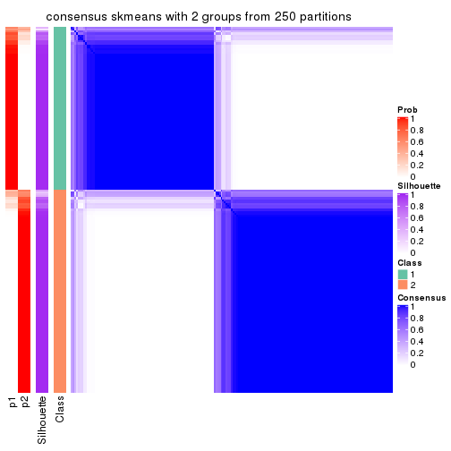</p>

</div>
<div id='tab-CV-skmeans-consensus-heatmap-2'>
<pre><code class="r">consensus_heatmap(res, k = 3)
</code></pre>

<p>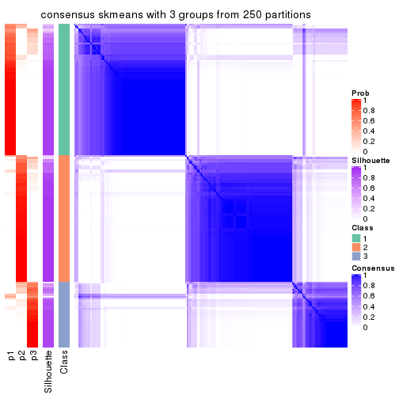</p>

</div>
<div id='tab-CV-skmeans-consensus-heatmap-3'>
<pre><code class="r">consensus_heatmap(res, k = 4)
</code></pre>

<p>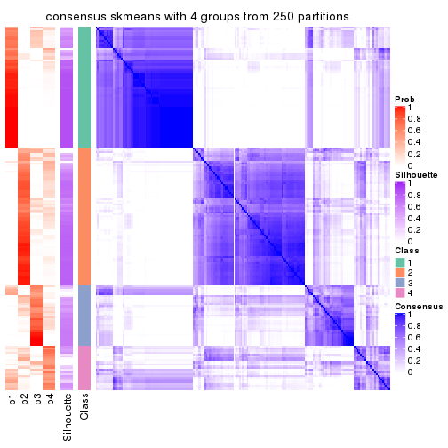</p>

</div>
<div id='tab-CV-skmeans-consensus-heatmap-4'>
<pre><code class="r">consensus_heatmap(res, k = 5)
</code></pre>

<p>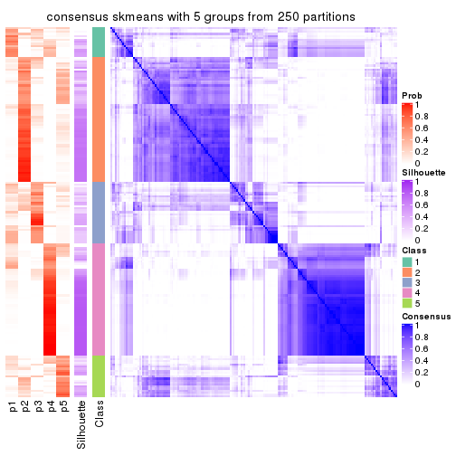</p>

</div>
<div id='tab-CV-skmeans-consensus-heatmap-5'>
<pre><code class="r">consensus_heatmap(res, k = 6)
</code></pre>

<p>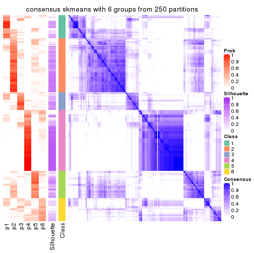</p>

</div>
</div>

Heatmaps for the membership of samples in all partitions to see how consistent they are:


<script>
$( function() {
	$( '#tabs-CV-skmeans-membership-heatmap' ).tabs();
} );
</script>
<div id='tabs-CV-skmeans-membership-heatmap'>
<ul>
<li><a href='#tab-CV-skmeans-membership-heatmap-1'>k = 2</a></li>
<li><a href='#tab-CV-skmeans-membership-heatmap-2'>k = 3</a></li>
<li><a href='#tab-CV-skmeans-membership-heatmap-3'>k = 4</a></li>
<li><a href='#tab-CV-skmeans-membership-heatmap-4'>k = 5</a></li>
<li><a href='#tab-CV-skmeans-membership-heatmap-5'>k = 6</a></li>
</ul>
<div id='tab-CV-skmeans-membership-heatmap-1'>
<pre><code class="r">membership_heatmap(res, k = 2)
</code></pre>

<p>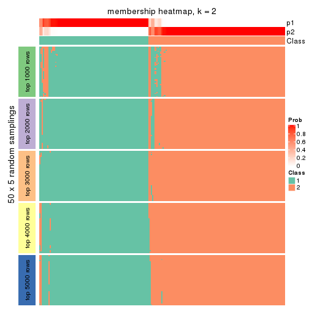</p>

</div>
<div id='tab-CV-skmeans-membership-heatmap-2'>
<pre><code class="r">membership_heatmap(res, k = 3)
</code></pre>

<p>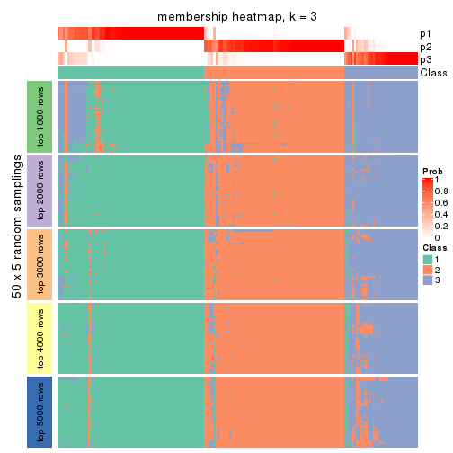</p>

</div>
<div id='tab-CV-skmeans-membership-heatmap-3'>
<pre><code class="r">membership_heatmap(res, k = 4)
</code></pre>

<p>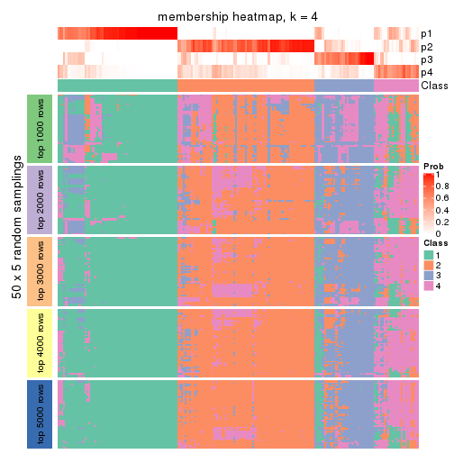</p>

</div>
<div id='tab-CV-skmeans-membership-heatmap-4'>
<pre><code class="r">membership_heatmap(res, k = 5)
</code></pre>

<p>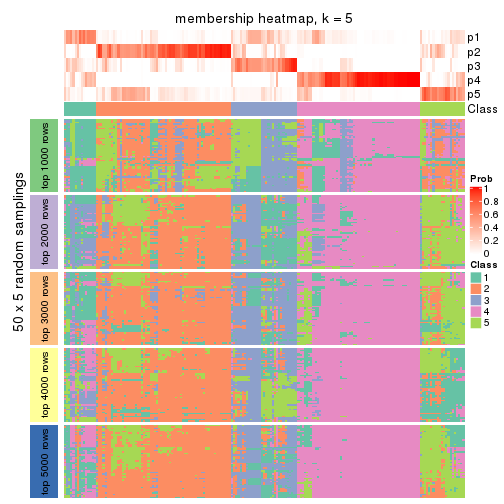</p>

</div>
<div id='tab-CV-skmeans-membership-heatmap-5'>
<pre><code class="r">membership_heatmap(res, k = 6)
</code></pre>

<p>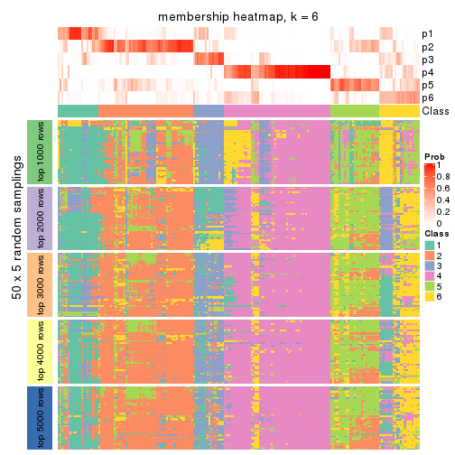</p>

</div>
</div>

As soon as we have had the classes for columns, we can look for signatures
which are significantly different between classes which can be candidate marks
for certain classes. Following are the heatmaps for signatures.


Signature heatmaps where rows are scaled:


<script>
$( function() {
	$( '#tabs-CV-skmeans-get-signatures' ).tabs();
} );
</script>
<div id='tabs-CV-skmeans-get-signatures'>
<ul>
<li><a href='#tab-CV-skmeans-get-signatures-1'>k = 2</a></li>
<li><a href='#tab-CV-skmeans-get-signatures-2'>k = 3</a></li>
<li><a href='#tab-CV-skmeans-get-signatures-3'>k = 4</a></li>
<li><a href='#tab-CV-skmeans-get-signatures-4'>k = 5</a></li>
<li><a href='#tab-CV-skmeans-get-signatures-5'>k = 6</a></li>
</ul>
<div id='tab-CV-skmeans-get-signatures-1'>
<pre><code class="r">get_signatures(res, k = 2)
</code></pre>

<p>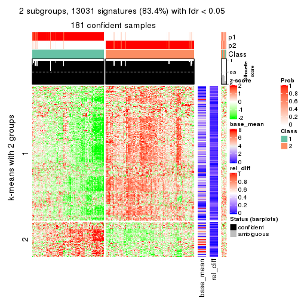</p>

</div>
<div id='tab-CV-skmeans-get-signatures-2'>
<pre><code class="r">get_signatures(res, k = 3)
</code></pre>

<p>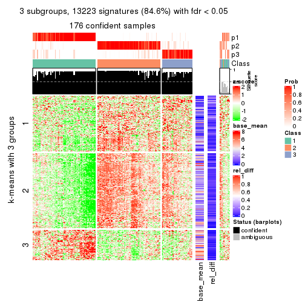</p>

</div>
<div id='tab-CV-skmeans-get-signatures-3'>
<pre><code class="r">get_signatures(res, k = 4)
</code></pre>

<p>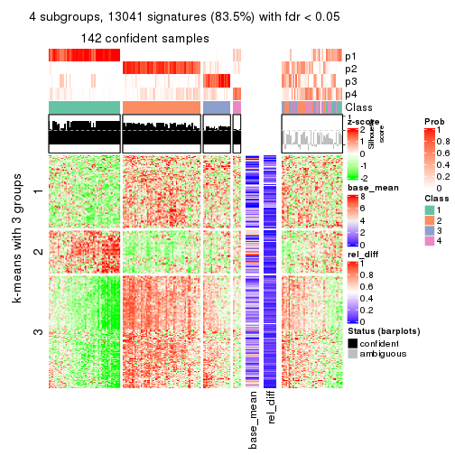</p>

</div>
<div id='tab-CV-skmeans-get-signatures-4'>
<pre><code class="r">get_signatures(res, k = 5)
</code></pre>

<p>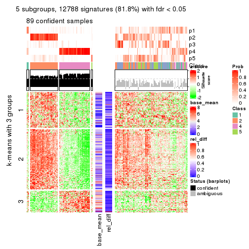</p>

</div>
<div id='tab-CV-skmeans-get-signatures-5'>
<pre><code class="r">get_signatures(res, k = 6)
</code></pre>

<p>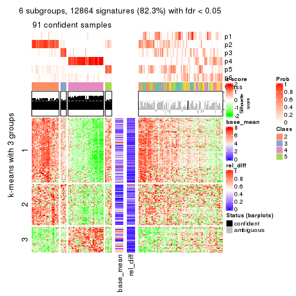</p>

</div>
</div>


Signature heatmaps where rows are not scaled:


<script>
$( function() {
	$( '#tabs-CV-skmeans-get-signatures-no-scale' ).tabs();
} );
</script>
<div id='tabs-CV-skmeans-get-signatures-no-scale'>
<ul>
<li><a href='#tab-CV-skmeans-get-signatures-no-scale-1'>k = 2</a></li>
<li><a href='#tab-CV-skmeans-get-signatures-no-scale-2'>k = 3</a></li>
<li><a href='#tab-CV-skmeans-get-signatures-no-scale-3'>k = 4</a></li>
<li><a href='#tab-CV-skmeans-get-signatures-no-scale-4'>k = 5</a></li>
<li><a href='#tab-CV-skmeans-get-signatures-no-scale-5'>k = 6</a></li>
</ul>
<div id='tab-CV-skmeans-get-signatures-no-scale-1'>
<pre><code class="r">get_signatures(res, k = 2, scale_rows = FALSE)
</code></pre>

<p>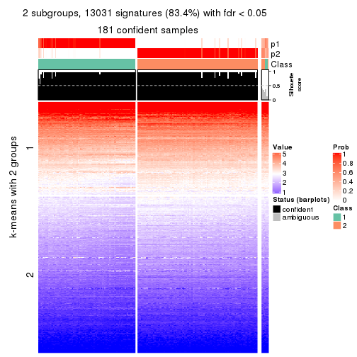</p>

</div>
<div id='tab-CV-skmeans-get-signatures-no-scale-2'>
<pre><code class="r">get_signatures(res, k = 3, scale_rows = FALSE)
</code></pre>

<p>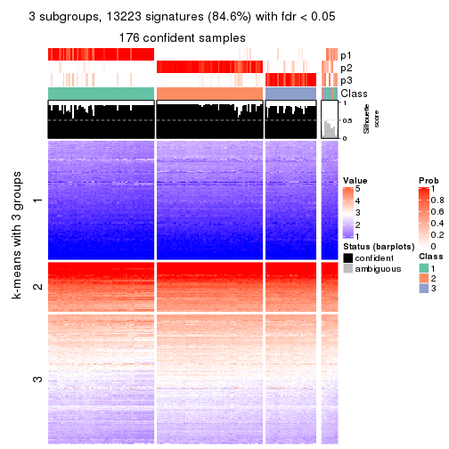</p>

</div>
<div id='tab-CV-skmeans-get-signatures-no-scale-3'>
<pre><code class="r">get_signatures(res, k = 4, scale_rows = FALSE)
</code></pre>

<p>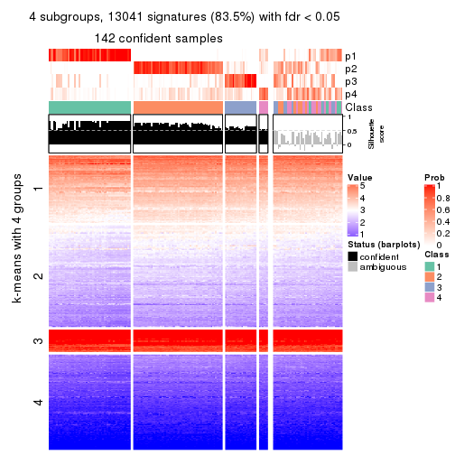</p>

</div>
<div id='tab-CV-skmeans-get-signatures-no-scale-4'>
<pre><code class="r">get_signatures(res, k = 5, scale_rows = FALSE)
</code></pre>

<p>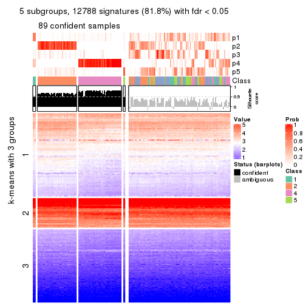</p>

</div>
<div id='tab-CV-skmeans-get-signatures-no-scale-5'>
<pre><code class="r">get_signatures(res, k = 6, scale_rows = FALSE)
</code></pre>

<p>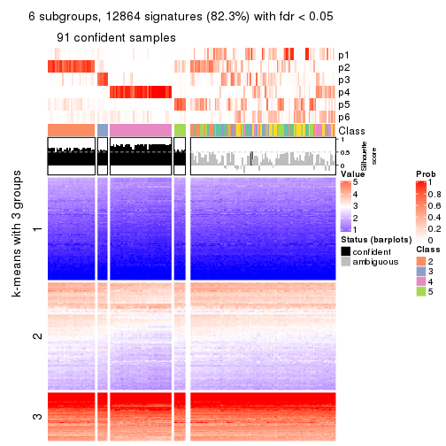</p>

</div>
</div>


Compare the overlap of signatures from different k:

```r
compare_signatures(res)
```

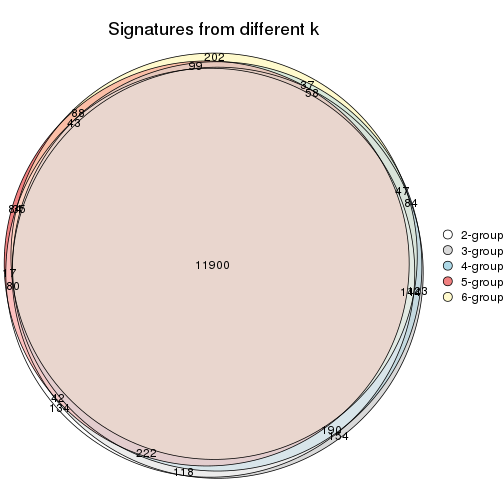

`get_signature()` returns a data frame invisibly. TO get the list of signatures, the function
call should be assigned to a variable explicitly. In following code, if `plot` argument is set
to `FALSE`, no heatmap is plotted while only the differential analysis is performed.

```r
# code only for demonstration
tb = get_signature(res, k = ..., plot = FALSE)
```

An example of the output of `tb` is:

```
#>   which_row         fdr    mean_1    mean_2 scaled_mean_1 scaled_mean_2 km
#> 1        38 0.042760348  8.373488  9.131774    -0.5533452     0.5164555  1
#> 2        40 0.018707592  7.106213  8.469186    -0.6173731     0.5762149  1
#> 3        55 0.019134737 10.221463 11.207825    -0.6159697     0.5749050  1
#> 4        59 0.006059896  5.921854  7.869574    -0.6899429     0.6439467  1
#> 5        60 0.018055526  8.928898 10.211722    -0.6204761     0.5791110  1
#> 6        98 0.009384629 15.714769 14.887706     0.6635654    -0.6193277  2
...
```

The columns in `tb` are:

1. `which_row`: row indices corresponding to the input matrix.
2. `fdr`: FDR for the differential test. 
3. `mean_x`: The mean value in group x.
4. `scaled_mean_x`: The mean value in group x after rows are scaled.
5. `km`: Row groups if k-means clustering is applied to rows.


UMAP plot which shows how samples are separated.


<script>
$( function() {
	$( '#tabs-CV-skmeans-dimension-reduction' ).tabs();
} );
</script>
<div id='tabs-CV-skmeans-dimension-reduction'>
<ul>
<li><a href='#tab-CV-skmeans-dimension-reduction-1'>k = 2</a></li>
<li><a href='#tab-CV-skmeans-dimension-reduction-2'>k = 3</a></li>
<li><a href='#tab-CV-skmeans-dimension-reduction-3'>k = 4</a></li>
<li><a href='#tab-CV-skmeans-dimension-reduction-4'>k = 5</a></li>
<li><a href='#tab-CV-skmeans-dimension-reduction-5'>k = 6</a></li>
</ul>
<div id='tab-CV-skmeans-dimension-reduction-1'>
<pre><code class="r">dimension_reduction(res, k = 2, method = &quot;UMAP&quot;)
</code></pre>

<p>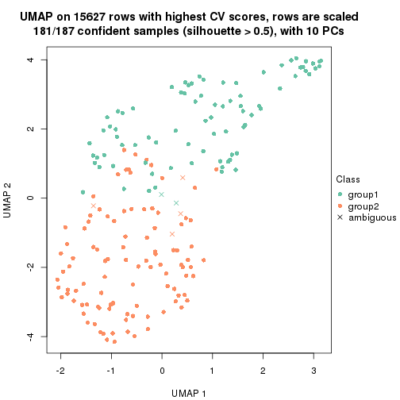</p>

</div>
<div id='tab-CV-skmeans-dimension-reduction-2'>
<pre><code class="r">dimension_reduction(res, k = 3, method = &quot;UMAP&quot;)
</code></pre>

<p>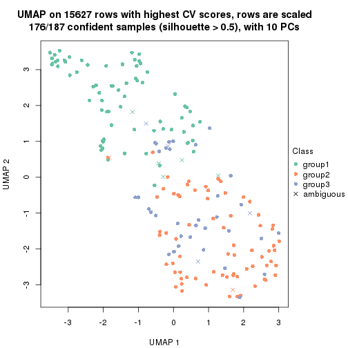</p>

</div>
<div id='tab-CV-skmeans-dimension-reduction-3'>
<pre><code class="r">dimension_reduction(res, k = 4, method = &quot;UMAP&quot;)
</code></pre>

<p>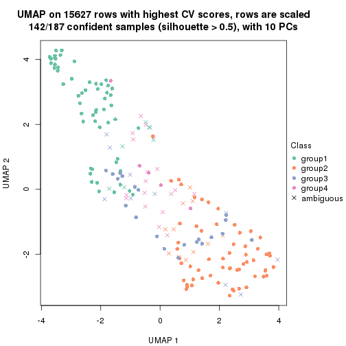</p>

</div>
<div id='tab-CV-skmeans-dimension-reduction-4'>
<pre><code class="r">dimension_reduction(res, k = 5, method = &quot;UMAP&quot;)
</code></pre>

<p>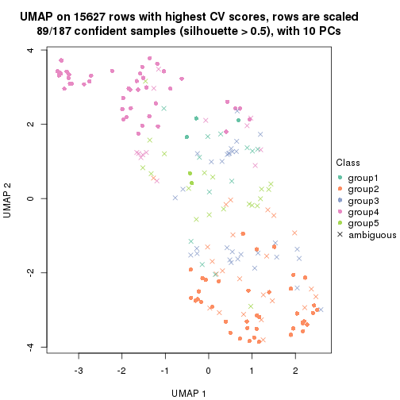</p>

</div>
<div id='tab-CV-skmeans-dimension-reduction-5'>
<pre><code class="r">dimension_reduction(res, k = 6, method = &quot;UMAP&quot;)
</code></pre>

<p>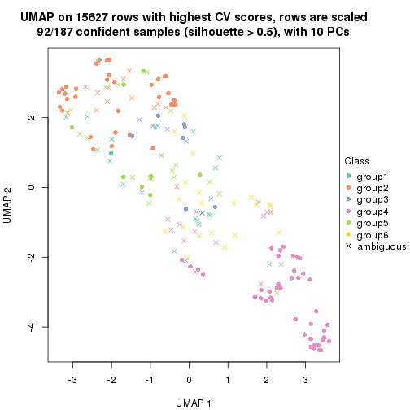</p>

</div>
</div>


Following heatmap shows how subgroups are split when increasing `k`:

```r
collect_classes(res)
```

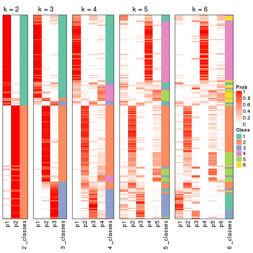


If matrix rows can be associated to genes, consider to use `GO_Enrichment(res,
...)` to perform function enrichment for the signature genes.


 

---------------------------------------------------


### CV:pam


The object with results only for a single top-value method and a single partition method 
can be extracted as:

```r
res = res_list["CV", "pam"]
# you can also extract it by
# res = res_list["CV:pam"]
```

A summary of `res` and all the functions that can be applied to it:

```r
res
```

```
#> A 'ConsensusPartition' object with k = 2, 3, 4, 5, 6.
#>   On a matrix with 15627 rows and 187 columns.
#>   Top rows (1000, 2000, 3000, 4000, 5000) are extracted by 'CV' method.
#>   Subgroups are detected by 'pam' method.
#>   Performed in total 1250 partitions by row resampling.
#>   Best k for subgroups seems to be 2.
#> 
#> Following methods can be applied to this 'ConsensusPartition' object:
#>  [1] "cola_report"             "collect_classes"         "collect_plots"          
#>  [4] "collect_stats"           "colnames"                "compare_signatures"     
#>  [7] "consensus_heatmap"       "dimension_reduction"     "functional_enrichment"  
#> [10] "get_anno_col"            "get_anno"                "get_classes"            
#> [13] "get_consensus"           "get_matrix"              "get_membership"         
#> [16] "get_param"               "get_signatures"          "get_stats"              
#> [19] "is_best_k"               "is_stable_k"             "membership_heatmap"     
#> [22] "ncol"                    "nrow"                    "plot_ecdf"              
#> [25] "rownames"                "select_partition_number" "show"                   
#> [28] "suggest_best_k"          "test_to_known_factors"
```

`collect_plots()` function collects all the plots made from `res` for all `k` (number of partitions)
into one single page to provide an easy and fast comparison between different `k`.

```r
collect_plots(res)
```

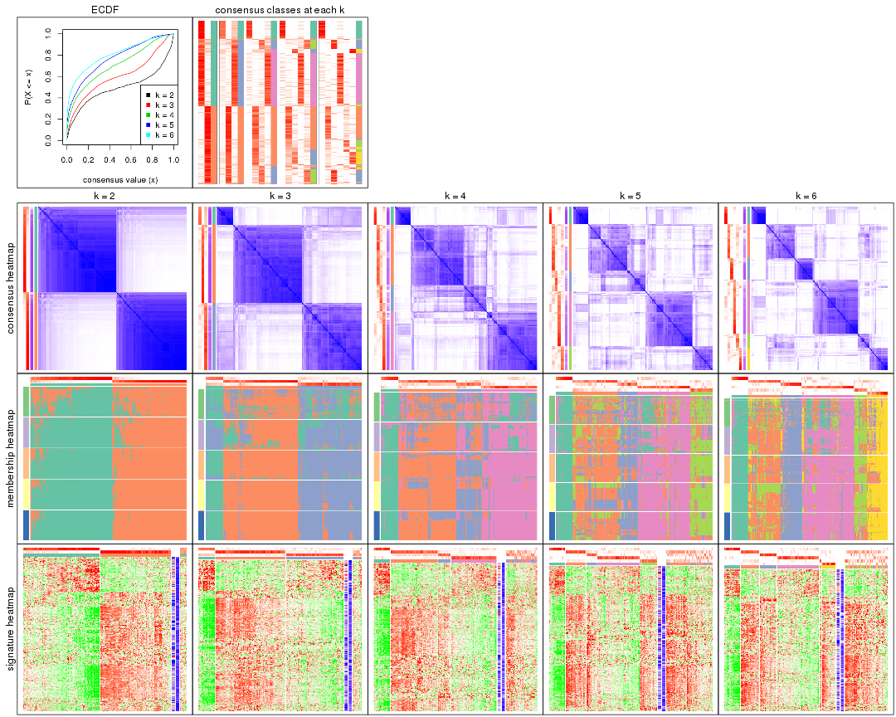

The plots are:

- The first row: a plot of the ECDF (Empirical cumulative distribution
  function) curves of the consensus matrix for each `k` and the heatmap of
  predicted classes for each `k`.
- The second row: heatmaps of the consensus matrix for each `k`.
- The third row: heatmaps of the membership matrix for each `k`.
- The fouth row: heatmaps of the signatures for each `k`.

All the plots in panels can be made by individual functions and they are
plotted later in this section.

`select_partition_number()` produces several plots showing different
statistics for choosing "optimized" `k`. There are following statistics:

- ECDF curves of the consensus matrix for each `k`;
- 1-PAC. [The PAC
  score](https://en.wikipedia.org/wiki/Consensus_clustering#Over-interpretation_potential_of_consensus_clustering)
  measures the proportion of the ambiguous subgrouping.
- Mean silhouette score.
- Concordance. The mean probability of fiting the consensus class ids in all
  partitions.
- Area increased. Denote $A_k$ as the area under the ECDF curve for current
  `k`, the area increased is defined as $A_k - A_{k-1}$.
- Rand index. The percent of pairs of samples that are both in a same cluster
  or both are not in a same cluster in the partition of k and k-1.
- Jaccard index. The ratio of pairs of samples are both in a same cluster in
  the partition of k and k-1 and the pairs of samples are both in a same
  cluster in the partition k or k-1.

The detailed explanations of these statistics can be found in [the cola
vignette](http://bioconductor.org/packages/devel/bioc/vignettes/cola/inst/doc/cola.html#toc_13).

Generally speaking, lower PAC score, higher mean silhouette score or higher
concordance corresponds to better partition. Rand index and Jaccard index
measure how similar the current partition is compared to partition with `k-1`.
If they are too similar, we won't accept `k` is better than `k-1`.

```r
select_partition_number(res)
```

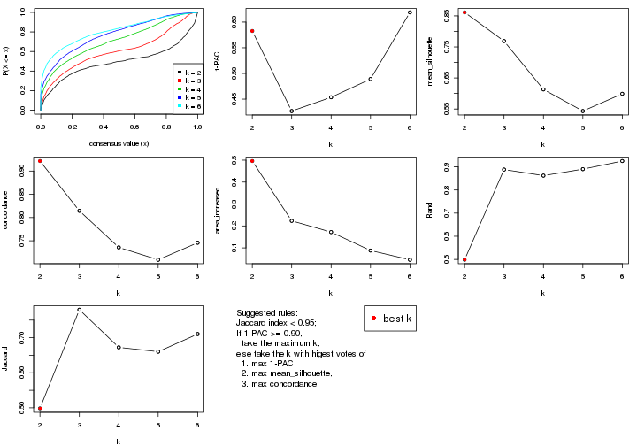

The numeric values for all these statistics can be obtained by `get_stats()`.

```r
get_stats(res)
```

```
#>   k 1-PAC mean_silhouette concordance area_increased  Rand Jaccard
#> 2 2 0.583           0.861       0.922         0.4959 0.498   0.498
#> 3 3 0.427           0.769       0.814         0.2233 0.888   0.780
#> 4 4 0.454           0.613       0.736         0.1719 0.862   0.672
#> 5 5 0.489           0.543       0.709         0.0880 0.890   0.660
#> 6 6 0.619           0.599       0.746         0.0459 0.925   0.710
```

`suggest_best_k()` suggests the best $k$ based on these statistics. The rules are as follows:

- All $k$ with Jaccard index larger than 0.95 are removed because the increase of
  the partition number does not provides enough extra information. If all $k$ are removed,
  the best $k$ is assigned by `NA`.
- For $k$ with 1-PAC larger than 0.9, the maximal $k$ is taken as the "best k". Other $k$ is called "optional k".
- If it does not fit the second rule. The $k$ with the highest vote of highest
  1-PAC, mean silhouette and concordance is taken as the "best k".

```r
suggest_best_k(res)
```

```
#> [1] 2
```


Following shows the table of the partitions (You need to click the **show/hide
code output** link to see it). The membership matrix (columns with name `p*`)
is inferred by
[`clue::cl_consensus()`](https://www.rdocumentation.org/link/cl_consensus?package=clue)
function with the `SE` method. Basically the value in the membership matrix
represents the probability to belong to a certain group. The finall class
label for an item is determined with the group with highest probability it
belongs to.

In `get_classes()` function, the entropy is calculated from the membership
matrix and the silhouette score is calculated from the consensus matrix.


<script>
$( function() {
	$( '#tabs-CV-pam-get-classes' ).tabs();
} );
</script>
<div id='tabs-CV-pam-get-classes'>
<ul>
<li><a href='#tab-CV-pam-get-classes-1'>k = 2</a></li>
<li><a href='#tab-CV-pam-get-classes-2'>k = 3</a></li>
<li><a href='#tab-CV-pam-get-classes-3'>k = 4</a></li>
<li><a href='#tab-CV-pam-get-classes-4'>k = 5</a></li>
<li><a href='#tab-CV-pam-get-classes-5'>k = 6</a></li>
</ul>

<div id='tab-CV-pam-get-classes-1'>
<p><a id='tab-CV-pam-get-classes-1-a' style='color:#0366d6' href='#'>show/hide code output</a></p>
<pre><code class="r">cbind(get_classes(res, k = 2), get_membership(res, k = 2))
</code></pre>

<pre><code>#&gt;            class entropy silhouette    p1    p2
#&gt; SRR1747213     1  0.0376     0.9089 0.996 0.004
#&gt; SRR1747214     1  0.4562     0.8875 0.904 0.096
#&gt; SRR1747215     2  0.0000     0.9321 0.000 1.000
#&gt; SRR1747216     2  0.0000     0.9321 0.000 1.000
#&gt; SRR1747217     1  0.7139     0.8076 0.804 0.196
#&gt; SRR1747218     2  0.1843     0.9298 0.028 0.972
#&gt; SRR1747219     1  0.2603     0.9067 0.956 0.044
#&gt; SRR1747220     1  0.2778     0.9053 0.952 0.048
#&gt; SRR1747221     1  0.1184     0.9098 0.984 0.016
#&gt; SRR1747222     1  0.5519     0.8684 0.872 0.128
#&gt; SRR1747223     1  0.1843     0.9094 0.972 0.028
#&gt; SRR1747224     1  0.8267     0.7356 0.740 0.260
#&gt; SRR1747225     2  0.2043     0.9237 0.032 0.968
#&gt; SRR1747226     2  0.0376     0.9325 0.004 0.996
#&gt; SRR1747227     2  0.0376     0.9325 0.004 0.996
#&gt; SRR1747228     2  0.7815     0.7438 0.232 0.768
#&gt; SRR1747229     2  0.5294     0.8689 0.120 0.880
#&gt; SRR1747230     1  0.0376     0.9091 0.996 0.004
#&gt; SRR1747231     1  0.0000     0.9081 1.000 0.000
#&gt; SRR1747232     1  0.0000     0.9081 1.000 0.000
#&gt; SRR1747233     1  0.1184     0.9092 0.984 0.016
#&gt; SRR1747234     2  0.7950     0.7156 0.240 0.760
#&gt; SRR1747235     1  0.0000     0.9081 1.000 0.000
#&gt; SRR1747236     2  0.1843     0.9301 0.028 0.972
#&gt; SRR1747237     2  0.1184     0.9291 0.016 0.984
#&gt; SRR1747238     2  0.2043     0.9286 0.032 0.968
#&gt; SRR1747239     2  0.0938     0.9332 0.012 0.988
#&gt; SRR1747240     1  0.0376     0.9081 0.996 0.004
#&gt; SRR1747241     1  0.6623     0.8331 0.828 0.172
#&gt; SRR1747242     1  0.0376     0.9091 0.996 0.004
#&gt; SRR1747243     1  0.5408     0.8577 0.876 0.124
#&gt; SRR1747244     2  0.3431     0.9130 0.064 0.936
#&gt; SRR1747245     2  0.4161     0.9020 0.084 0.916
#&gt; SRR1747246     2  0.1633     0.9295 0.024 0.976
#&gt; SRR1747247     1  0.0000     0.9081 1.000 0.000
#&gt; SRR1747248     1  0.0376     0.9081 0.996 0.004
#&gt; SRR1747249     1  0.1414     0.9102 0.980 0.020
#&gt; SRR1747250     1  0.8763     0.6606 0.704 0.296
#&gt; SRR1747252     1  0.3431     0.9008 0.936 0.064
#&gt; SRR1747253     1  0.2948     0.9041 0.948 0.052
#&gt; SRR1747254     2  0.1414     0.9317 0.020 0.980
#&gt; SRR1747255     1  0.1184     0.9092 0.984 0.016
#&gt; SRR1747256     1  0.1633     0.9107 0.976 0.024
#&gt; SRR1747257     2  0.0376     0.9330 0.004 0.996
#&gt; SRR1747258     1  0.7815     0.7713 0.768 0.232
#&gt; SRR1747259     2  0.1633     0.9304 0.024 0.976
#&gt; SRR1747260     1  0.7219     0.8179 0.800 0.200
#&gt; SRR1747261     2  0.9933     0.0946 0.452 0.548
#&gt; SRR1747262     2  0.0672     0.9335 0.008 0.992
#&gt; SRR1747263     2  0.1184     0.9299 0.016 0.984
#&gt; SRR1747264     1  0.0938     0.9092 0.988 0.012
#&gt; SRR1747265     1  0.4562     0.8908 0.904 0.096
#&gt; SRR1747266     2  0.9933     0.1385 0.452 0.548
#&gt; SRR1747267     1  0.3274     0.9018 0.940 0.060
#&gt; SRR1747268     1  0.7376     0.7765 0.792 0.208
#&gt; SRR1747269     2  0.2236     0.9280 0.036 0.964
#&gt; SRR1747270     2  0.4939     0.8905 0.108 0.892
#&gt; SRR1747271     2  0.0376     0.9319 0.004 0.996
#&gt; SRR1747272     1  0.6623     0.8383 0.828 0.172
#&gt; SRR1747273     1  0.0376     0.9088 0.996 0.004
#&gt; SRR1747274     1  0.9944     0.2241 0.544 0.456
#&gt; SRR1747275     1  0.2043     0.9083 0.968 0.032
#&gt; SRR1747276     1  0.1414     0.9115 0.980 0.020
#&gt; SRR1747277     2  0.1414     0.9306 0.020 0.980
#&gt; SRR1747278     1  0.9983     0.0457 0.524 0.476
#&gt; SRR1747280     1  0.0000     0.9081 1.000 0.000
#&gt; SRR1747279     1  0.0000     0.9081 1.000 0.000
#&gt; SRR1747281     2  0.0938     0.9332 0.012 0.988
#&gt; SRR1747282     1  0.0938     0.9092 0.988 0.012
#&gt; SRR1747283     1  0.4431     0.8953 0.908 0.092
#&gt; SRR1747284     1  0.0672     0.9100 0.992 0.008
#&gt; SRR1747285     2  0.4939     0.8744 0.108 0.892
#&gt; SRR1747286     1  0.9775     0.4433 0.588 0.412
#&gt; SRR1747287     2  0.0672     0.9329 0.008 0.992
#&gt; SRR1747288     1  0.5178     0.8832 0.884 0.116
#&gt; SRR1747290     2  0.5294     0.8761 0.120 0.880
#&gt; SRR1747289     2  0.3879     0.9089 0.076 0.924
#&gt; SRR1747291     2  0.0000     0.9321 0.000 1.000
#&gt; SRR1747293     2  0.9491     0.4109 0.368 0.632
#&gt; SRR1747294     2  0.1843     0.9282 0.028 0.972
#&gt; SRR1747292     1  0.0938     0.9098 0.988 0.012
#&gt; SRR1747295     2  0.4939     0.8724 0.108 0.892
#&gt; SRR1747296     2  0.5178     0.8674 0.116 0.884
#&gt; SRR1747297     2  0.1414     0.9326 0.020 0.980
#&gt; SRR1747298     2  0.0376     0.9325 0.004 0.996
#&gt; SRR1747299     2  0.0000     0.9321 0.000 1.000
#&gt; SRR1747300     2  0.0376     0.9330 0.004 0.996
#&gt; SRR1747301     2  0.6712     0.8139 0.176 0.824
#&gt; SRR1747302     2  0.0672     0.9329 0.008 0.992
#&gt; SRR1747303     2  0.2603     0.9251 0.044 0.956
#&gt; SRR1747304     1  0.0000     0.9081 1.000 0.000
#&gt; SRR1747305     2  0.0000     0.9321 0.000 1.000
#&gt; SRR1747306     2  0.0000     0.9321 0.000 1.000
#&gt; SRR1747307     1  0.1184     0.9107 0.984 0.016
#&gt; SRR1747308     2  0.2778     0.9235 0.048 0.952
#&gt; SRR1747309     1  0.1184     0.9106 0.984 0.016
#&gt; SRR1747310     1  0.1843     0.9095 0.972 0.028
#&gt; SRR1747311     1  0.1414     0.9090 0.980 0.020
#&gt; SRR1747313     1  0.6531     0.8209 0.832 0.168
#&gt; SRR1747312     1  0.0672     0.9089 0.992 0.008
#&gt; SRR1747314     1  0.1184     0.9092 0.984 0.016
#&gt; SRR1747315     2  0.0672     0.9332 0.008 0.992
#&gt; SRR1747316     2  0.4431     0.8967 0.092 0.908
#&gt; SRR1747318     1  0.5059     0.8794 0.888 0.112
#&gt; SRR1747317     1  0.9922     0.2689 0.552 0.448
#&gt; SRR1747319     1  0.6623     0.8446 0.828 0.172
#&gt; SRR1747320     1  0.5294     0.8813 0.880 0.120
#&gt; SRR1747322     1  0.1184     0.9092 0.984 0.016
#&gt; SRR1747321     1  0.1414     0.9090 0.980 0.020
#&gt; SRR1747323     2  0.0376     0.9319 0.004 0.996
#&gt; SRR1747324     2  0.0672     0.9331 0.008 0.992
#&gt; SRR1747326     2  0.0376     0.9330 0.004 0.996
#&gt; SRR1747325     2  0.0000     0.9321 0.000 1.000
#&gt; SRR1747327     2  0.2778     0.9201 0.048 0.952
#&gt; SRR1747328     1  0.2778     0.9040 0.952 0.048
#&gt; SRR1747330     1  0.8955     0.6367 0.688 0.312
#&gt; SRR1747329     2  0.6048     0.8455 0.148 0.852
#&gt; SRR1747332     1  0.2236     0.9086 0.964 0.036
#&gt; SRR1747331     1  0.8813     0.6231 0.700 0.300
#&gt; SRR1747333     2  0.8555     0.6678 0.280 0.720
#&gt; SRR1747334     2  0.0938     0.9336 0.012 0.988
#&gt; SRR1747335     1  0.3274     0.9027 0.940 0.060
#&gt; SRR1747336     1  0.0000     0.9081 1.000 0.000
#&gt; SRR1747337     2  0.0000     0.9321 0.000 1.000
#&gt; SRR1747338     2  0.0000     0.9321 0.000 1.000
#&gt; SRR1747339     1  0.3431     0.9054 0.936 0.064
#&gt; SRR1747340     2  0.8909     0.5819 0.308 0.692
#&gt; SRR1747341     2  0.0376     0.9319 0.004 0.996
#&gt; SRR1747342     2  0.0376     0.9319 0.004 0.996
#&gt; SRR1747343     2  0.0000     0.9321 0.000 1.000
#&gt; SRR1747344     2  0.1414     0.9317 0.020 0.980
#&gt; SRR1747345     1  0.2043     0.9091 0.968 0.032
#&gt; SRR1747346     1  0.6247     0.8489 0.844 0.156
#&gt; SRR1747347     2  0.0376     0.9319 0.004 0.996
#&gt; SRR1747348     1  0.0376     0.9091 0.996 0.004
#&gt; SRR1747349     1  0.0000     0.9081 1.000 0.000
#&gt; SRR1747351     2  0.0000     0.9321 0.000 1.000
#&gt; SRR1747350     2  0.8386     0.6762 0.268 0.732
#&gt; SRR1747352     1  0.0000     0.9081 1.000 0.000
#&gt; SRR1747353     2  0.6343     0.8159 0.160 0.840
#&gt; SRR1747354     1  0.6148     0.8596 0.848 0.152
#&gt; SRR1747355     1  0.0376     0.9081 0.996 0.004
#&gt; SRR1747356     1  0.4431     0.8907 0.908 0.092
#&gt; SRR1747357     1  0.3584     0.9018 0.932 0.068
#&gt; SRR1747358     1  0.5178     0.8792 0.884 0.116
#&gt; SRR1747359     1  0.0000     0.9081 1.000 0.000
#&gt; SRR1747360     2  0.3733     0.9096 0.072 0.928
#&gt; SRR1747361     1  0.7528     0.7685 0.784 0.216
#&gt; SRR1747362     2  0.0672     0.9331 0.008 0.992
#&gt; SRR1747363     1  0.3879     0.9031 0.924 0.076
#&gt; SRR1747364     1  0.3431     0.9061 0.936 0.064
#&gt; SRR1747365     1  0.3584     0.9005 0.932 0.068
#&gt; SRR1747366     2  0.5294     0.8759 0.120 0.880
#&gt; SRR1747367     1  0.4161     0.8990 0.916 0.084
#&gt; SRR1747369     2  0.0376     0.9319 0.004 0.996
#&gt; SRR1747368     1  0.6438     0.8485 0.836 0.164
#&gt; SRR1747370     1  0.4562     0.8951 0.904 0.096
#&gt; SRR1747372     1  0.1184     0.9092 0.984 0.016
#&gt; SRR1747371     1  0.0938     0.9104 0.988 0.012
#&gt; SRR1747373     2  0.0938     0.9331 0.012 0.988
#&gt; SRR1747374     2  0.1184     0.9291 0.016 0.984
#&gt; SRR1747375     1  0.2236     0.9085 0.964 0.036
#&gt; SRR1747376     2  0.2603     0.9224 0.044 0.956
#&gt; SRR1747377     2  0.0000     0.9321 0.000 1.000
#&gt; SRR1747378     2  0.3584     0.9114 0.068 0.932
#&gt; SRR1747379     2  0.3431     0.9113 0.064 0.936
#&gt; SRR1747380     1  0.8661     0.6828 0.712 0.288
#&gt; SRR1747381     1  0.0376     0.9081 0.996 0.004
#&gt; SRR1747382     1  0.0000     0.9081 1.000 0.000
#&gt; SRR1747383     2  0.0672     0.9334 0.008 0.992
#&gt; SRR1747384     2  0.8081     0.7196 0.248 0.752
#&gt; SRR1747385     2  0.5629     0.8702 0.132 0.868
#&gt; SRR1747386     1  0.0000     0.9081 1.000 0.000
#&gt; SRR1747387     2  0.0000     0.9321 0.000 1.000
#&gt; SRR1747388     2  0.0000     0.9321 0.000 1.000
#&gt; SRR1747390     1  0.9323     0.5538 0.652 0.348
#&gt; SRR1747389     2  0.3274     0.9173 0.060 0.940
#&gt; SRR1747391     2  0.0672     0.9323 0.008 0.992
#&gt; SRR1747392     2  0.0376     0.9325 0.004 0.996
#&gt; SRR1747393     1  0.9815     0.3880 0.580 0.420
#&gt; SRR1747394     1  0.3733     0.8979 0.928 0.072
#&gt; SRR1747395     2  0.5946     0.8228 0.144 0.856
#&gt; SRR1747396     2  0.0000     0.9321 0.000 1.000
#&gt; SRR1747398     2  0.0376     0.9319 0.004 0.996
#&gt; SRR1747397     1  0.3879     0.9023 0.924 0.076
#&gt; SRR1747399     1  0.0000     0.9081 1.000 0.000
#&gt; SRR1747400     1  0.0000     0.9081 1.000 0.000
</code></pre>

<script>
$('#tab-CV-pam-get-classes-1-a').parent().next().next().hide();
$('#tab-CV-pam-get-classes-1-a').click(function(){
  $('#tab-CV-pam-get-classes-1-a').parent().next().next().toggle();
  return(false);
});
</script>
</div>

<div id='tab-CV-pam-get-classes-2'>
<p><a id='tab-CV-pam-get-classes-2-a' style='color:#0366d6' href='#'>show/hide code output</a></p>
<pre><code class="r">cbind(get_classes(res, k = 3), get_membership(res, k = 3))
</code></pre>

<pre><code>#&gt;            class entropy silhouette    p1    p2    p3
#&gt; SRR1747213     3  0.4346    0.71524 0.184 0.000 0.816
#&gt; SRR1747214     3  0.4233    0.71556 0.160 0.004 0.836
#&gt; SRR1747215     2  0.1129    0.88631 0.004 0.976 0.020
#&gt; SRR1747216     2  0.0848    0.88612 0.008 0.984 0.008
#&gt; SRR1747217     3  0.5119    0.72099 0.028 0.160 0.812
#&gt; SRR1747218     2  0.1585    0.88971 0.008 0.964 0.028
#&gt; SRR1747219     3  0.3670    0.74499 0.092 0.020 0.888
#&gt; SRR1747220     3  0.3129    0.73893 0.088 0.008 0.904
#&gt; SRR1747221     3  0.3715    0.72298 0.128 0.004 0.868
#&gt; SRR1747222     3  0.5659    0.60739 0.248 0.012 0.740
#&gt; SRR1747223     3  0.4449    0.75049 0.100 0.040 0.860
#&gt; SRR1747224     3  0.6597    0.59123 0.036 0.268 0.696
#&gt; SRR1747225     2  0.2564    0.88186 0.036 0.936 0.028
#&gt; SRR1747226     2  0.1765    0.88421 0.040 0.956 0.004
#&gt; SRR1747227     2  0.0747    0.88864 0.000 0.984 0.016
#&gt; SRR1747228     2  0.6699    0.72809 0.092 0.744 0.164
#&gt; SRR1747229     2  0.4531    0.82505 0.008 0.824 0.168
#&gt; SRR1747230     1  0.5058    0.90794 0.756 0.000 0.244
#&gt; SRR1747231     3  0.1964    0.74252 0.056 0.000 0.944
#&gt; SRR1747232     1  0.5621    0.86780 0.692 0.000 0.308
#&gt; SRR1747233     3  0.4692    0.71498 0.168 0.012 0.820
#&gt; SRR1747234     2  0.8924    0.61904 0.268 0.560 0.172
#&gt; SRR1747235     1  0.5016    0.90736 0.760 0.000 0.240
#&gt; SRR1747236     2  0.2689    0.88931 0.036 0.932 0.032
#&gt; SRR1747237     2  0.6208    0.82394 0.152 0.772 0.076
#&gt; SRR1747238     2  0.5166    0.85950 0.056 0.828 0.116
#&gt; SRR1747239     2  0.2269    0.89146 0.040 0.944 0.016
#&gt; SRR1747240     1  0.5497    0.89529 0.708 0.000 0.292
#&gt; SRR1747241     3  0.5722    0.72263 0.112 0.084 0.804
#&gt; SRR1747242     1  0.4974    0.90467 0.764 0.000 0.236
#&gt; SRR1747243     3  0.5608    0.73719 0.120 0.072 0.808
#&gt; SRR1747244     2  0.3683    0.88720 0.044 0.896 0.060
#&gt; SRR1747245     2  0.3589    0.88415 0.048 0.900 0.052
#&gt; SRR1747246     2  0.2031    0.88557 0.032 0.952 0.016
#&gt; SRR1747247     1  0.5968    0.85029 0.636 0.000 0.364
#&gt; SRR1747248     1  0.5178    0.90849 0.744 0.000 0.256
#&gt; SRR1747249     3  0.4261    0.73489 0.140 0.012 0.848
#&gt; SRR1747250     3  0.8569    0.49102 0.196 0.196 0.608
#&gt; SRR1747252     3  0.3359    0.74503 0.084 0.016 0.900
#&gt; SRR1747253     3  0.2116    0.75500 0.040 0.012 0.948
#&gt; SRR1747254     2  0.3669    0.88633 0.064 0.896 0.040
#&gt; SRR1747255     3  0.3267    0.71885 0.116 0.000 0.884
#&gt; SRR1747256     3  0.3618    0.75007 0.104 0.012 0.884
#&gt; SRR1747257     2  0.1585    0.88697 0.008 0.964 0.028
#&gt; SRR1747258     3  0.5778    0.66166 0.032 0.200 0.768
#&gt; SRR1747259     2  0.5136    0.85811 0.132 0.824 0.044
#&gt; SRR1747260     3  0.7474    0.63610 0.176 0.128 0.696
#&gt; SRR1747261     2  0.7876    0.00536 0.056 0.520 0.424
#&gt; SRR1747262     2  0.1765    0.88990 0.004 0.956 0.040
#&gt; SRR1747263     2  0.2550    0.89000 0.040 0.936 0.024
#&gt; SRR1747264     3  0.3752    0.70139 0.144 0.000 0.856
#&gt; SRR1747265     3  0.4058    0.75253 0.076 0.044 0.880
#&gt; SRR1747266     3  0.7493   -0.07865 0.036 0.476 0.488
#&gt; SRR1747267     3  0.2806    0.76529 0.032 0.040 0.928
#&gt; SRR1747268     3  0.5355    0.70772 0.036 0.160 0.804
#&gt; SRR1747269     2  0.4676    0.87191 0.040 0.848 0.112
#&gt; SRR1747270     2  0.5269    0.80752 0.016 0.784 0.200
#&gt; SRR1747271     2  0.4861    0.83922 0.180 0.808 0.012
#&gt; SRR1747272     3  0.6678    0.60527 0.216 0.060 0.724
#&gt; SRR1747273     3  0.4351    0.70917 0.168 0.004 0.828
#&gt; SRR1747274     3  0.7690    0.26916 0.048 0.416 0.536
#&gt; SRR1747275     3  0.4636    0.74839 0.116 0.036 0.848
#&gt; SRR1747276     3  0.4295    0.74860 0.104 0.032 0.864
#&gt; SRR1747277     2  0.4677    0.86597 0.132 0.840 0.028
#&gt; SRR1747278     2  0.7841    0.02835 0.052 0.476 0.472
#&gt; SRR1747280     1  0.4974    0.90565 0.764 0.000 0.236
#&gt; SRR1747279     3  0.2448    0.73901 0.076 0.000 0.924
#&gt; SRR1747281     2  0.2651    0.88652 0.012 0.928 0.060
#&gt; SRR1747282     1  0.6228    0.78623 0.624 0.004 0.372
#&gt; SRR1747283     3  0.4768    0.76077 0.052 0.100 0.848
#&gt; SRR1747284     1  0.5722    0.89403 0.704 0.004 0.292
#&gt; SRR1747285     2  0.6562    0.80105 0.184 0.744 0.072
#&gt; SRR1747286     3  0.9182    0.42666 0.204 0.260 0.536
#&gt; SRR1747287     2  0.2443    0.88814 0.032 0.940 0.028
#&gt; SRR1747288     3  0.5263    0.74732 0.084 0.088 0.828
#&gt; SRR1747290     2  0.5202    0.84971 0.044 0.820 0.136
#&gt; SRR1747289     2  0.5117    0.86236 0.060 0.832 0.108
#&gt; SRR1747291     2  0.1751    0.88703 0.012 0.960 0.028
#&gt; SRR1747293     2  0.7102    0.34529 0.024 0.556 0.420
#&gt; SRR1747294     2  0.5334    0.85395 0.120 0.820 0.060
#&gt; SRR1747292     3  0.4110    0.71192 0.152 0.004 0.844
#&gt; SRR1747295     2  0.7304    0.76047 0.228 0.688 0.084
#&gt; SRR1747296     2  0.8094    0.70253 0.240 0.636 0.124
#&gt; SRR1747297     2  0.1647    0.89012 0.004 0.960 0.036
#&gt; SRR1747298     2  0.1015    0.88599 0.012 0.980 0.008
#&gt; SRR1747299     2  0.0661    0.88566 0.004 0.988 0.008
#&gt; SRR1747300     2  0.0848    0.88648 0.008 0.984 0.008
#&gt; SRR1747301     2  0.5466    0.82354 0.040 0.800 0.160
#&gt; SRR1747302     2  0.2955    0.87910 0.080 0.912 0.008
#&gt; SRR1747303     2  0.1999    0.88727 0.012 0.952 0.036
#&gt; SRR1747304     1  0.5529    0.89168 0.704 0.000 0.296
#&gt; SRR1747305     2  0.1832    0.88684 0.008 0.956 0.036
#&gt; SRR1747306     2  0.2031    0.88765 0.016 0.952 0.032
#&gt; SRR1747307     3  0.2096    0.74920 0.052 0.004 0.944
#&gt; SRR1747308     2  0.7431    0.76398 0.212 0.688 0.100
#&gt; SRR1747309     3  0.3644    0.72037 0.124 0.004 0.872
#&gt; SRR1747310     1  0.6330    0.46737 0.600 0.004 0.396
#&gt; SRR1747311     3  0.3850    0.74422 0.088 0.028 0.884
#&gt; SRR1747313     3  0.6850    0.68305 0.140 0.120 0.740
#&gt; SRR1747312     1  0.5465    0.89930 0.712 0.000 0.288
#&gt; SRR1747314     1  0.5098    0.90628 0.752 0.000 0.248
#&gt; SRR1747315     2  0.2414    0.88455 0.020 0.940 0.040
#&gt; SRR1747316     2  0.7548    0.75035 0.204 0.684 0.112
#&gt; SRR1747318     3  0.5956    0.59718 0.264 0.016 0.720
#&gt; SRR1747317     3  0.9400    0.28202 0.228 0.264 0.508
#&gt; SRR1747319     3  0.5625    0.73981 0.076 0.116 0.808
#&gt; SRR1747320     3  0.5497    0.75119 0.124 0.064 0.812
#&gt; SRR1747322     1  0.5621    0.88443 0.692 0.000 0.308
#&gt; SRR1747321     3  0.3965    0.71542 0.132 0.008 0.860
#&gt; SRR1747323     2  0.2269    0.88868 0.040 0.944 0.016
#&gt; SRR1747324     2  0.2056    0.89098 0.024 0.952 0.024
#&gt; SRR1747326     2  0.2383    0.88734 0.044 0.940 0.016
#&gt; SRR1747325     2  0.4679    0.85888 0.148 0.832 0.020
#&gt; SRR1747327     2  0.2749    0.88803 0.012 0.924 0.064
#&gt; SRR1747328     3  0.3791    0.76460 0.060 0.048 0.892
#&gt; SRR1747330     3  0.6379    0.56818 0.032 0.256 0.712
#&gt; SRR1747329     2  0.6783    0.82780 0.176 0.736 0.088
#&gt; SRR1747332     3  0.2492    0.75352 0.048 0.016 0.936
#&gt; SRR1747331     3  0.6158    0.60561 0.052 0.188 0.760
#&gt; SRR1747333     2  0.6423    0.72139 0.044 0.728 0.228
#&gt; SRR1747334     2  0.2806    0.88398 0.032 0.928 0.040
#&gt; SRR1747335     3  0.2663    0.75603 0.044 0.024 0.932
#&gt; SRR1747336     1  0.5497    0.89291 0.708 0.000 0.292
#&gt; SRR1747337     2  0.2356    0.87997 0.072 0.928 0.000
#&gt; SRR1747338     2  0.1753    0.88308 0.048 0.952 0.000
#&gt; SRR1747339     3  0.4505    0.74625 0.048 0.092 0.860
#&gt; SRR1747340     2  0.6684    0.61769 0.032 0.676 0.292
#&gt; SRR1747341     2  0.1482    0.88625 0.020 0.968 0.012
#&gt; SRR1747342     2  0.1482    0.88694 0.020 0.968 0.012
#&gt; SRR1747343     2  0.2584    0.88377 0.064 0.928 0.008
#&gt; SRR1747344     2  0.2903    0.89115 0.028 0.924 0.048
#&gt; SRR1747345     3  0.6446    0.68943 0.212 0.052 0.736
#&gt; SRR1747346     3  0.5992    0.59277 0.268 0.016 0.716
#&gt; SRR1747347     2  0.5526    0.83684 0.172 0.792 0.036
#&gt; SRR1747348     1  0.5058    0.90762 0.756 0.000 0.244
#&gt; SRR1747349     3  0.3686    0.71310 0.140 0.000 0.860
#&gt; SRR1747351     2  0.2229    0.88715 0.012 0.944 0.044
#&gt; SRR1747350     2  0.7424    0.63968 0.064 0.648 0.288
#&gt; SRR1747352     3  0.2448    0.73845 0.076 0.000 0.924
#&gt; SRR1747353     2  0.5874    0.77553 0.032 0.760 0.208
#&gt; SRR1747354     3  0.5222    0.71115 0.040 0.144 0.816
#&gt; SRR1747355     3  0.3686    0.72338 0.140 0.000 0.860
#&gt; SRR1747356     3  0.3683    0.75332 0.044 0.060 0.896
#&gt; SRR1747357     3  0.4339    0.75866 0.084 0.048 0.868
#&gt; SRR1747358     3  0.4339    0.75003 0.084 0.048 0.868
#&gt; SRR1747359     3  0.3941    0.72141 0.156 0.000 0.844
#&gt; SRR1747360     2  0.4544    0.86823 0.084 0.860 0.056
#&gt; SRR1747361     3  0.5875    0.64811 0.056 0.160 0.784
#&gt; SRR1747362     2  0.2229    0.88741 0.012 0.944 0.044
#&gt; SRR1747363     3  0.4384    0.75664 0.064 0.068 0.868
#&gt; SRR1747364     3  0.6735    0.46418 0.260 0.044 0.696
#&gt; SRR1747365     3  0.3263    0.76447 0.040 0.048 0.912
#&gt; SRR1747366     2  0.4930    0.85526 0.044 0.836 0.120
#&gt; SRR1747367     3  0.4196    0.74835 0.024 0.112 0.864
#&gt; SRR1747369     2  0.5627    0.83456 0.188 0.780 0.032
#&gt; SRR1747368     3  0.6590    0.70625 0.132 0.112 0.756
#&gt; SRR1747370     3  0.5307    0.73132 0.048 0.136 0.816
#&gt; SRR1747372     3  0.3551    0.70761 0.132 0.000 0.868
#&gt; SRR1747371     3  0.2682    0.74186 0.076 0.004 0.920
#&gt; SRR1747373     2  0.3112    0.88476 0.056 0.916 0.028
#&gt; SRR1747374     2  0.6057    0.81835 0.196 0.760 0.044
#&gt; SRR1747375     3  0.4591    0.73936 0.120 0.032 0.848
#&gt; SRR1747376     2  0.2689    0.88127 0.032 0.932 0.036
#&gt; SRR1747377     2  0.1015    0.88633 0.008 0.980 0.012
#&gt; SRR1747378     2  0.3234    0.87356 0.020 0.908 0.072
#&gt; SRR1747379     2  0.3213    0.88259 0.028 0.912 0.060
#&gt; SRR1747380     3  0.6904    0.56789 0.268 0.048 0.684
#&gt; SRR1747381     1  0.5517    0.89542 0.728 0.004 0.268
#&gt; SRR1747382     3  0.3116    0.73324 0.108 0.000 0.892
#&gt; SRR1747383     2  0.1170    0.88950 0.008 0.976 0.016
#&gt; SRR1747384     2  0.7012    0.60937 0.040 0.652 0.308
#&gt; SRR1747385     2  0.5787    0.84085 0.068 0.796 0.136
#&gt; SRR1747386     1  0.5016    0.90956 0.760 0.000 0.240
#&gt; SRR1747387     2  0.1877    0.88555 0.012 0.956 0.032
#&gt; SRR1747388     2  0.2569    0.88673 0.032 0.936 0.032
#&gt; SRR1747390     3  0.6211    0.56173 0.036 0.228 0.736
#&gt; SRR1747389     2  0.6460    0.81964 0.124 0.764 0.112
#&gt; SRR1747391     2  0.1170    0.88805 0.008 0.976 0.016
#&gt; SRR1747392     2  0.2810    0.89113 0.036 0.928 0.036
#&gt; SRR1747393     3  0.6589    0.49382 0.032 0.280 0.688
#&gt; SRR1747394     3  0.3091    0.74973 0.072 0.016 0.912
#&gt; SRR1747395     2  0.6918    0.76849 0.136 0.736 0.128
#&gt; SRR1747396     2  0.2096    0.88529 0.052 0.944 0.004
#&gt; SRR1747398     2  0.2297    0.88912 0.036 0.944 0.020
#&gt; SRR1747397     3  0.4914    0.74946 0.068 0.088 0.844
#&gt; SRR1747399     1  0.6204    0.73457 0.576 0.000 0.424
#&gt; SRR1747400     1  0.5650    0.89032 0.688 0.000 0.312
</code></pre>

<script>
$('#tab-CV-pam-get-classes-2-a').parent().next().next().hide();
$('#tab-CV-pam-get-classes-2-a').click(function(){
  $('#tab-CV-pam-get-classes-2-a').parent().next().next().toggle();
  return(false);
});
</script>
</div>

<div id='tab-CV-pam-get-classes-3'>
<p><a id='tab-CV-pam-get-classes-3-a' style='color:#0366d6' href='#'>show/hide code output</a></p>
<pre><code class="r">cbind(get_classes(res, k = 4), get_membership(res, k = 4))
</code></pre>

<pre><code>#&gt;            class entropy silhouette    p1    p2    p3    p4
#&gt; SRR1747213     4   0.433     0.6975 0.244 0.000 0.008 0.748
#&gt; SRR1747214     4   0.424     0.6954 0.152 0.000 0.040 0.808
#&gt; SRR1747215     2   0.413     0.6924 0.000 0.740 0.260 0.000
#&gt; SRR1747216     2   0.434     0.6974 0.004 0.752 0.240 0.004
#&gt; SRR1747217     4   0.563     0.7138 0.032 0.108 0.096 0.764
#&gt; SRR1747218     2   0.449     0.7112 0.000 0.772 0.200 0.028
#&gt; SRR1747219     4   0.180     0.7510 0.032 0.004 0.016 0.948
#&gt; SRR1747220     4   0.182     0.7487 0.036 0.000 0.020 0.944
#&gt; SRR1747221     4   0.413     0.7381 0.176 0.008 0.012 0.804
#&gt; SRR1747222     4   0.581     0.5997 0.040 0.040 0.192 0.728
#&gt; SRR1747223     4   0.473     0.7591 0.072 0.048 0.056 0.824
#&gt; SRR1747224     4   0.631     0.4846 0.012 0.064 0.288 0.636
#&gt; SRR1747225     2   0.486     0.6933 0.008 0.744 0.228 0.020
#&gt; SRR1747226     2   0.182     0.6836 0.008 0.944 0.044 0.004
#&gt; SRR1747227     2   0.427     0.7061 0.004 0.772 0.216 0.008
#&gt; SRR1747228     2   0.850     0.4854 0.156 0.552 0.156 0.136
#&gt; SRR1747229     2   0.683     0.5534 0.000 0.572 0.296 0.132
#&gt; SRR1747230     1   0.112     0.8946 0.964 0.000 0.000 0.036
#&gt; SRR1747231     4   0.121     0.7533 0.032 0.000 0.004 0.964
#&gt; SRR1747232     1   0.428     0.7608 0.764 0.000 0.012 0.224
#&gt; SRR1747233     4   0.477     0.6634 0.280 0.008 0.004 0.708
#&gt; SRR1747234     3   0.700     0.4232 0.028 0.172 0.648 0.152
#&gt; SRR1747235     1   0.158     0.8925 0.948 0.000 0.004 0.048
#&gt; SRR1747236     2   0.549    -0.3150 0.000 0.532 0.452 0.016
#&gt; SRR1747237     3   0.509     0.5526 0.012 0.152 0.776 0.060
#&gt; SRR1747238     3   0.479     0.5556 0.008 0.180 0.776 0.036
#&gt; SRR1747239     2   0.410     0.7044 0.012 0.820 0.152 0.016
#&gt; SRR1747240     1   0.164     0.8891 0.940 0.000 0.000 0.060
#&gt; SRR1747241     4   0.635     0.5684 0.028 0.188 0.088 0.696
#&gt; SRR1747242     1   0.149     0.8925 0.952 0.000 0.004 0.044
#&gt; SRR1747243     4   0.544     0.7521 0.112 0.052 0.056 0.780
#&gt; SRR1747244     3   0.595     0.1691 0.012 0.356 0.604 0.028
#&gt; SRR1747245     2   0.338     0.6852 0.008 0.876 0.088 0.028
#&gt; SRR1747246     2   0.352     0.7149 0.008 0.848 0.136 0.008
#&gt; SRR1747247     1   0.481     0.6774 0.676 0.000 0.008 0.316
#&gt; SRR1747248     1   0.121     0.8945 0.960 0.000 0.000 0.040
#&gt; SRR1747249     4   0.422     0.7619 0.112 0.004 0.056 0.828
#&gt; SRR1747250     3   0.422     0.6013 0.024 0.012 0.820 0.144
#&gt; SRR1747252     4   0.209     0.7509 0.048 0.000 0.020 0.932
#&gt; SRR1747253     4   0.141     0.7513 0.024 0.000 0.016 0.960
#&gt; SRR1747254     2   0.343     0.6669 0.008 0.860 0.120 0.012
#&gt; SRR1747255     4   0.322     0.7391 0.164 0.000 0.000 0.836
#&gt; SRR1747256     4   0.428     0.7642 0.092 0.008 0.068 0.832
#&gt; SRR1747257     2   0.436     0.6728 0.000 0.708 0.292 0.000
#&gt; SRR1747258     3   0.589     0.5022 0.008 0.040 0.640 0.312
#&gt; SRR1747259     2   0.463     0.5965 0.008 0.728 0.260 0.004
#&gt; SRR1747260     3   0.554     0.5844 0.028 0.052 0.752 0.168
#&gt; SRR1747261     2   0.785     0.0266 0.056 0.452 0.080 0.412
#&gt; SRR1747262     2   0.512     0.6996 0.012 0.724 0.244 0.020
#&gt; SRR1747263     2   0.440     0.6982 0.004 0.724 0.272 0.000
#&gt; SRR1747264     4   0.456     0.6158 0.328 0.000 0.000 0.672
#&gt; SRR1747265     4   0.331     0.7541 0.028 0.008 0.084 0.880
#&gt; SRR1747266     3   0.532     0.6060 0.004 0.052 0.728 0.216
#&gt; SRR1747267     4   0.305     0.7591 0.016 0.012 0.080 0.892
#&gt; SRR1747268     4   0.507     0.7231 0.024 0.100 0.080 0.796
#&gt; SRR1747269     2   0.616     0.6797 0.008 0.652 0.272 0.068
#&gt; SRR1747270     2   0.722     0.5825 0.008 0.584 0.216 0.192
#&gt; SRR1747271     2   0.478     0.5084 0.016 0.732 0.248 0.004
#&gt; SRR1747272     4   0.780     0.3567 0.024 0.200 0.232 0.544
#&gt; SRR1747273     4   0.463     0.6417 0.244 0.004 0.012 0.740
#&gt; SRR1747274     3   0.687     0.4803 0.004 0.108 0.560 0.328
#&gt; SRR1747275     4   0.433     0.7517 0.148 0.032 0.008 0.812
#&gt; SRR1747276     4   0.449     0.7600 0.132 0.028 0.024 0.816
#&gt; SRR1747277     2   0.469     0.6329 0.016 0.780 0.184 0.020
#&gt; SRR1747278     2   0.723     0.1140 0.036 0.496 0.060 0.408
#&gt; SRR1747280     1   0.166     0.8935 0.944 0.000 0.004 0.052
#&gt; SRR1747279     4   0.220     0.7627 0.080 0.000 0.004 0.916
#&gt; SRR1747281     2   0.542     0.6852 0.008 0.688 0.276 0.028
#&gt; SRR1747282     1   0.316     0.8064 0.852 0.000 0.004 0.144
#&gt; SRR1747283     4   0.474     0.7696 0.068 0.052 0.056 0.824
#&gt; SRR1747284     1   0.363     0.8389 0.828 0.000 0.012 0.160
#&gt; SRR1747285     2   0.457     0.5876 0.016 0.796 0.164 0.024
#&gt; SRR1747286     3   0.428     0.6005 0.028 0.076 0.844 0.052
#&gt; SRR1747287     3   0.494     0.0225 0.000 0.436 0.564 0.000
#&gt; SRR1747288     3   0.624     0.3335 0.028 0.020 0.572 0.380
#&gt; SRR1747290     2   0.553     0.5718 0.004 0.732 0.180 0.084
#&gt; SRR1747289     3   0.620     0.4828 0.000 0.340 0.592 0.068
#&gt; SRR1747291     2   0.453     0.6998 0.008 0.764 0.216 0.012
#&gt; SRR1747293     4   0.814    -0.3022 0.008 0.344 0.276 0.372
#&gt; SRR1747294     2   0.645     0.6385 0.016 0.608 0.320 0.056
#&gt; SRR1747292     4   0.465     0.6592 0.288 0.008 0.000 0.704
#&gt; SRR1747295     3   0.316     0.5916 0.036 0.052 0.896 0.016
#&gt; SRR1747296     3   0.581     0.5229 0.036 0.144 0.748 0.072
#&gt; SRR1747297     2   0.453     0.7050 0.008 0.764 0.216 0.012
#&gt; SRR1747298     2   0.381     0.7093 0.008 0.804 0.188 0.000
#&gt; SRR1747299     2   0.401     0.7053 0.004 0.788 0.204 0.004
#&gt; SRR1747300     2   0.399     0.7040 0.008 0.800 0.188 0.004
#&gt; SRR1747301     2   0.513     0.5966 0.004 0.772 0.100 0.124
#&gt; SRR1747302     2   0.216     0.6684 0.004 0.924 0.068 0.004
#&gt; SRR1747303     2   0.506     0.7063 0.012 0.752 0.204 0.032
#&gt; SRR1747304     1   0.164     0.8891 0.940 0.000 0.000 0.060
#&gt; SRR1747305     2   0.436     0.6733 0.000 0.708 0.292 0.000
#&gt; SRR1747306     2   0.493     0.4271 0.000 0.568 0.432 0.000
#&gt; SRR1747307     4   0.119     0.7533 0.024 0.004 0.004 0.968
#&gt; SRR1747308     2   0.712     0.3612 0.024 0.616 0.236 0.124
#&gt; SRR1747309     4   0.446     0.6789 0.256 0.004 0.004 0.736
#&gt; SRR1747310     1   0.705     0.2238 0.448 0.004 0.104 0.444
#&gt; SRR1747311     4   0.445     0.7597 0.096 0.036 0.036 0.832
#&gt; SRR1747313     4   0.704     0.6159 0.276 0.068 0.044 0.612
#&gt; SRR1747312     1   0.147     0.8925 0.948 0.000 0.000 0.052
#&gt; SRR1747314     1   0.112     0.8946 0.964 0.000 0.000 0.036
#&gt; SRR1747315     2   0.528     0.6820 0.012 0.712 0.252 0.024
#&gt; SRR1747316     3   0.789    -0.2542 0.024 0.372 0.460 0.144
#&gt; SRR1747318     4   0.767     0.3760 0.028 0.172 0.232 0.568
#&gt; SRR1747317     4   0.835     0.0271 0.024 0.344 0.224 0.408
#&gt; SRR1747319     4   0.506     0.7107 0.024 0.040 0.156 0.780
#&gt; SRR1747320     4   0.577     0.7434 0.140 0.016 0.104 0.740
#&gt; SRR1747322     1   0.205     0.8839 0.924 0.000 0.004 0.072
#&gt; SRR1747321     4   0.437     0.6729 0.268 0.000 0.004 0.728
#&gt; SRR1747323     2   0.455     0.7141 0.008 0.752 0.232 0.008
#&gt; SRR1747324     2   0.588     0.5034 0.016 0.608 0.356 0.020
#&gt; SRR1747326     2   0.179     0.6750 0.000 0.932 0.068 0.000
#&gt; SRR1747325     2   0.464     0.5823 0.024 0.764 0.208 0.004
#&gt; SRR1747327     2   0.538     0.6720 0.008 0.684 0.284 0.024
#&gt; SRR1747328     4   0.250     0.7639 0.020 0.016 0.040 0.924
#&gt; SRR1747330     4   0.598     0.5503 0.016 0.052 0.252 0.680
#&gt; SRR1747329     2   0.609     0.5812 0.020 0.568 0.392 0.020
#&gt; SRR1747332     4   0.141     0.7513 0.024 0.000 0.016 0.960
#&gt; SRR1747331     4   0.609    -0.2112 0.024 0.012 0.452 0.512
#&gt; SRR1747333     2   0.770     0.4926 0.020 0.548 0.240 0.192
#&gt; SRR1747334     2   0.522     0.6794 0.012 0.728 0.232 0.028
#&gt; SRR1747335     4   0.183     0.7544 0.024 0.000 0.032 0.944
#&gt; SRR1747336     1   0.194     0.8857 0.924 0.000 0.000 0.076
#&gt; SRR1747337     2   0.255     0.6517 0.008 0.900 0.092 0.000
#&gt; SRR1747338     2   0.144     0.6805 0.004 0.960 0.028 0.008
#&gt; SRR1747339     4   0.491     0.7398 0.036 0.076 0.076 0.812
#&gt; SRR1747340     2   0.746     0.4110 0.012 0.560 0.188 0.240
#&gt; SRR1747341     2   0.336     0.7128 0.000 0.824 0.176 0.000
#&gt; SRR1747342     2   0.340     0.7156 0.000 0.820 0.180 0.000
#&gt; SRR1747343     2   0.382     0.6951 0.008 0.816 0.172 0.004
#&gt; SRR1747344     2   0.524     0.7118 0.016 0.728 0.232 0.024
#&gt; SRR1747345     4   0.672     0.6806 0.080 0.044 0.204 0.672
#&gt; SRR1747346     4   0.771     0.3753 0.028 0.180 0.228 0.564
#&gt; SRR1747347     2   0.471     0.5571 0.024 0.768 0.200 0.008
#&gt; SRR1747348     1   0.140     0.8935 0.956 0.000 0.004 0.040
#&gt; SRR1747349     4   0.428     0.6664 0.280 0.000 0.000 0.720
#&gt; SRR1747351     3   0.445     0.4347 0.000 0.308 0.692 0.000
#&gt; SRR1747350     3   0.693     0.5967 0.032 0.072 0.608 0.288
#&gt; SRR1747352     4   0.168     0.7521 0.040 0.000 0.012 0.948
#&gt; SRR1747353     3   0.530     0.6027 0.000 0.104 0.748 0.148
#&gt; SRR1747354     3   0.553     0.4558 0.000 0.032 0.632 0.336
#&gt; SRR1747355     4   0.428     0.6889 0.256 0.000 0.004 0.740
#&gt; SRR1747356     3   0.551     0.3405 0.012 0.004 0.560 0.424
#&gt; SRR1747357     4   0.456     0.7585 0.044 0.048 0.076 0.832
#&gt; SRR1747358     4   0.622     0.4575 0.040 0.040 0.240 0.680
#&gt; SRR1747359     4   0.422     0.6954 0.248 0.000 0.004 0.748
#&gt; SRR1747360     3   0.528     0.5217 0.008 0.256 0.708 0.028
#&gt; SRR1747361     4   0.458     0.5841 0.020 0.000 0.232 0.748
#&gt; SRR1747362     3   0.527     0.0427 0.000 0.456 0.536 0.008
#&gt; SRR1747363     4   0.459     0.7629 0.048 0.064 0.056 0.832
#&gt; SRR1747364     4   0.647     0.4804 0.324 0.016 0.056 0.604
#&gt; SRR1747365     3   0.546     0.2063 0.008 0.004 0.496 0.492
#&gt; SRR1747366     3   0.525     0.5383 0.000 0.228 0.720 0.052
#&gt; SRR1747367     4   0.408     0.7425 0.004 0.108 0.052 0.836
#&gt; SRR1747369     2   0.548     0.3881 0.020 0.628 0.348 0.004
#&gt; SRR1747368     4   0.583     0.7012 0.032 0.056 0.180 0.732
#&gt; SRR1747370     4   0.539     0.7101 0.024 0.100 0.100 0.776
#&gt; SRR1747372     4   0.375     0.7277 0.196 0.000 0.004 0.800
#&gt; SRR1747371     4   0.266     0.7661 0.072 0.008 0.012 0.908
#&gt; SRR1747373     2   0.220     0.6607 0.004 0.916 0.080 0.000
#&gt; SRR1747374     2   0.551     0.5096 0.024 0.720 0.228 0.028
#&gt; SRR1747375     4   0.480     0.7560 0.096 0.040 0.048 0.816
#&gt; SRR1747376     2   0.621     0.3535 0.012 0.540 0.416 0.032
#&gt; SRR1747377     2   0.343     0.7116 0.012 0.860 0.120 0.008
#&gt; SRR1747378     2   0.574     0.6893 0.016 0.720 0.204 0.060
#&gt; SRR1747379     2   0.587     0.6348 0.012 0.624 0.336 0.028
#&gt; SRR1747380     4   0.785     0.3446 0.024 0.188 0.256 0.532
#&gt; SRR1747381     1   0.253     0.8767 0.896 0.000 0.004 0.100
#&gt; SRR1747382     4   0.158     0.7540 0.036 0.000 0.012 0.952
#&gt; SRR1747383     2   0.398     0.7078 0.000 0.776 0.220 0.004
#&gt; SRR1747384     2   0.572     0.3137 0.012 0.568 0.012 0.408
#&gt; SRR1747385     2   0.479     0.6157 0.004 0.796 0.104 0.096
#&gt; SRR1747386     1   0.112     0.8946 0.964 0.000 0.000 0.036
#&gt; SRR1747387     3   0.441     0.4530 0.000 0.300 0.700 0.000
#&gt; SRR1747388     3   0.413     0.4962 0.000 0.260 0.740 0.000
#&gt; SRR1747390     3   0.531     0.5898 0.004 0.024 0.676 0.296
#&gt; SRR1747389     3   0.588     0.5880 0.024 0.132 0.740 0.104
#&gt; SRR1747391     2   0.434     0.7049 0.008 0.764 0.224 0.004
#&gt; SRR1747392     2   0.489     0.7026 0.008 0.720 0.260 0.012
#&gt; SRR1747393     4   0.665     0.4201 0.020 0.092 0.240 0.648
#&gt; SRR1747394     4   0.193     0.7522 0.024 0.000 0.036 0.940
#&gt; SRR1747395     2   0.372     0.6206 0.016 0.844 0.132 0.008
#&gt; SRR1747396     2   0.386     0.7202 0.008 0.812 0.176 0.004
#&gt; SRR1747398     3   0.551     0.4022 0.012 0.376 0.604 0.008
#&gt; SRR1747397     4   0.468     0.7487 0.032 0.072 0.072 0.824
#&gt; SRR1747399     1   0.474     0.6376 0.668 0.000 0.004 0.328
#&gt; SRR1747400     1   0.281     0.8556 0.868 0.000 0.000 0.132
</code></pre>

<script>
$('#tab-CV-pam-get-classes-3-a').parent().next().next().hide();
$('#tab-CV-pam-get-classes-3-a').click(function(){
  $('#tab-CV-pam-get-classes-3-a').parent().next().next().toggle();
  return(false);
});
</script>
</div>

<div id='tab-CV-pam-get-classes-4'>
<p><a id='tab-CV-pam-get-classes-4-a' style='color:#0366d6' href='#'>show/hide code output</a></p>
<pre><code class="r">cbind(get_classes(res, k = 5), get_membership(res, k = 5))
</code></pre>

<pre><code>#&gt;            class entropy silhouette    p1    p2    p3    p4    p5
#&gt; SRR1747213     4  0.3635     0.6913 0.248 0.000 0.000 0.748 0.004
#&gt; SRR1747214     4  0.3342     0.7106 0.100 0.000 0.048 0.848 0.004
#&gt; SRR1747215     2  0.4249     0.4541 0.000 0.688 0.016 0.000 0.296
#&gt; SRR1747216     2  0.3098     0.5834 0.000 0.836 0.016 0.000 0.148
#&gt; SRR1747217     4  0.5974     0.5680 0.024 0.268 0.012 0.632 0.064
#&gt; SRR1747218     2  0.2708     0.6045 0.000 0.892 0.016 0.020 0.072
#&gt; SRR1747219     4  0.1173     0.7337 0.020 0.004 0.012 0.964 0.000
#&gt; SRR1747220     4  0.1012     0.7324 0.020 0.000 0.012 0.968 0.000
#&gt; SRR1747221     4  0.4721     0.7290 0.168 0.032 0.016 0.764 0.020
#&gt; SRR1747222     4  0.4084     0.5178 0.004 0.000 0.328 0.668 0.000
#&gt; SRR1747223     4  0.5446     0.7243 0.052 0.100 0.056 0.756 0.036
#&gt; SRR1747224     4  0.8197     0.1050 0.000 0.160 0.160 0.356 0.324
#&gt; SRR1747225     2  0.5203     0.5384 0.000 0.708 0.140 0.008 0.144
#&gt; SRR1747226     2  0.5125     0.5150 0.000 0.696 0.156 0.000 0.148
#&gt; SRR1747227     2  0.3558     0.5861 0.000 0.816 0.020 0.008 0.156
#&gt; SRR1747228     2  0.6265     0.4596 0.152 0.664 0.004 0.112 0.068
#&gt; SRR1747229     2  0.5775     0.4076 0.000 0.628 0.016 0.092 0.264
#&gt; SRR1747230     1  0.0162     0.9091 0.996 0.000 0.000 0.004 0.000
#&gt; SRR1747231     4  0.0992     0.7365 0.024 0.000 0.008 0.968 0.000
#&gt; SRR1747232     1  0.3720     0.7369 0.760 0.000 0.012 0.228 0.000
#&gt; SRR1747233     4  0.4533     0.6621 0.288 0.012 0.004 0.688 0.008
#&gt; SRR1747234     3  0.4376     0.4835 0.000 0.000 0.764 0.092 0.144
#&gt; SRR1747235     1  0.0404     0.9067 0.988 0.000 0.000 0.012 0.000
#&gt; SRR1747236     2  0.6639     0.3085 0.000 0.472 0.180 0.008 0.340
#&gt; SRR1747237     5  0.5880     0.6547 0.000 0.160 0.112 0.048 0.680
#&gt; SRR1747238     5  0.2339     0.6586 0.000 0.100 0.004 0.004 0.892
#&gt; SRR1747239     2  0.6120     0.4588 0.000 0.580 0.172 0.004 0.244
#&gt; SRR1747240     1  0.0510     0.9067 0.984 0.000 0.000 0.016 0.000
#&gt; SRR1747241     4  0.6690    -0.1264 0.016 0.040 0.428 0.460 0.056
#&gt; SRR1747242     1  0.0290     0.9067 0.992 0.000 0.000 0.008 0.000
#&gt; SRR1747243     4  0.6284     0.7043 0.096 0.144 0.044 0.684 0.032
#&gt; SRR1747244     5  0.6415     0.2744 0.000 0.260 0.172 0.012 0.556
#&gt; SRR1747245     2  0.6077     0.3631 0.000 0.572 0.328 0.032 0.068
#&gt; SRR1747246     2  0.3359     0.5808 0.000 0.840 0.108 0.000 0.052
#&gt; SRR1747247     1  0.4088     0.6598 0.688 0.000 0.008 0.304 0.000
#&gt; SRR1747248     1  0.0000     0.9087 1.000 0.000 0.000 0.000 0.000
#&gt; SRR1747249     4  0.4107     0.7453 0.112 0.008 0.004 0.808 0.068
#&gt; SRR1747250     5  0.6159     0.6371 0.000 0.092 0.148 0.092 0.668
#&gt; SRR1747252     4  0.1701     0.7323 0.028 0.000 0.012 0.944 0.016
#&gt; SRR1747253     4  0.1364     0.7326 0.012 0.000 0.036 0.952 0.000
#&gt; SRR1747254     3  0.6757     0.1631 0.000 0.320 0.400 0.000 0.280
#&gt; SRR1747255     4  0.3123     0.7203 0.184 0.004 0.000 0.812 0.000
#&gt; SRR1747256     4  0.4270     0.7301 0.048 0.024 0.004 0.804 0.120
#&gt; SRR1747257     2  0.4397     0.0400 0.000 0.564 0.004 0.000 0.432
#&gt; SRR1747258     5  0.4494     0.6428 0.004 0.084 0.020 0.100 0.792
#&gt; SRR1747259     3  0.6239     0.5193 0.000 0.268 0.556 0.004 0.172
#&gt; SRR1747260     5  0.5762     0.6221 0.016 0.028 0.112 0.136 0.708
#&gt; SRR1747261     2  0.6414    -0.1328 0.020 0.468 0.028 0.440 0.044
#&gt; SRR1747262     2  0.2952     0.6069 0.000 0.872 0.036 0.004 0.088
#&gt; SRR1747263     2  0.5827     0.0960 0.000 0.576 0.300 0.000 0.124
#&gt; SRR1747264     4  0.4114     0.5690 0.376 0.000 0.000 0.624 0.000
#&gt; SRR1747265     4  0.3192     0.7417 0.028 0.016 0.016 0.880 0.060
#&gt; SRR1747266     5  0.5385     0.5979 0.000 0.144 0.048 0.084 0.724
#&gt; SRR1747267     4  0.2371     0.7391 0.008 0.020 0.008 0.916 0.048
#&gt; SRR1747268     4  0.5660     0.6003 0.000 0.256 0.048 0.652 0.044
#&gt; SRR1747269     2  0.7603    -0.1864 0.000 0.380 0.344 0.052 0.224
#&gt; SRR1747270     5  0.6839     0.1693 0.000 0.340 0.044 0.116 0.500
#&gt; SRR1747271     3  0.3160     0.6202 0.000 0.188 0.808 0.000 0.004
#&gt; SRR1747272     3  0.3048     0.5493 0.000 0.004 0.820 0.176 0.000
#&gt; SRR1747273     4  0.3989     0.6464 0.260 0.004 0.008 0.728 0.000
#&gt; SRR1747274     5  0.7442     0.1868 0.000 0.356 0.036 0.240 0.368
#&gt; SRR1747275     4  0.4082     0.7364 0.160 0.044 0.008 0.788 0.000
#&gt; SRR1747276     4  0.4151     0.7413 0.144 0.032 0.020 0.800 0.004
#&gt; SRR1747277     3  0.5543     0.3089 0.000 0.448 0.492 0.004 0.056
#&gt; SRR1747278     2  0.8613     0.2582 0.020 0.392 0.256 0.140 0.192
#&gt; SRR1747280     1  0.0703     0.9068 0.976 0.000 0.000 0.024 0.000
#&gt; SRR1747279     4  0.1671     0.7470 0.076 0.000 0.000 0.924 0.000
#&gt; SRR1747281     2  0.4178     0.5895 0.000 0.788 0.040 0.016 0.156
#&gt; SRR1747282     1  0.2286     0.8181 0.888 0.004 0.000 0.108 0.000
#&gt; SRR1747283     4  0.4944     0.7435 0.052 0.060 0.024 0.788 0.076
#&gt; SRR1747284     1  0.3170     0.8245 0.828 0.000 0.004 0.160 0.008
#&gt; SRR1747285     3  0.5494     0.5778 0.008 0.296 0.640 0.024 0.032
#&gt; SRR1747286     5  0.5505     0.6603 0.012 0.076 0.136 0.044 0.732
#&gt; SRR1747287     5  0.5895     0.1700 0.000 0.444 0.100 0.000 0.456
#&gt; SRR1747288     5  0.5089     0.5062 0.012 0.024 0.008 0.300 0.656
#&gt; SRR1747290     2  0.7546    -0.2507 0.000 0.404 0.380 0.104 0.112
#&gt; SRR1747289     5  0.6240     0.5901 0.000 0.080 0.148 0.112 0.660
#&gt; SRR1747291     2  0.2654     0.6110 0.000 0.896 0.040 0.008 0.056
#&gt; SRR1747293     2  0.7003     0.2185 0.000 0.500 0.040 0.304 0.156
#&gt; SRR1747294     3  0.6522     0.2978 0.000 0.408 0.452 0.016 0.124
#&gt; SRR1747292     4  0.4029     0.6445 0.316 0.004 0.000 0.680 0.000
#&gt; SRR1747295     5  0.5215     0.5968 0.000 0.096 0.240 0.000 0.664
#&gt; SRR1747296     5  0.4863     0.4006 0.000 0.016 0.384 0.008 0.592
#&gt; SRR1747297     2  0.2906     0.5947 0.000 0.880 0.028 0.012 0.080
#&gt; SRR1747298     2  0.1997     0.5866 0.000 0.924 0.040 0.000 0.036
#&gt; SRR1747299     2  0.1915     0.5970 0.000 0.928 0.032 0.000 0.040
#&gt; SRR1747300     2  0.3165     0.5696 0.000 0.848 0.036 0.000 0.116
#&gt; SRR1747301     3  0.7294     0.3387 0.000 0.376 0.436 0.100 0.088
#&gt; SRR1747302     2  0.5172     0.1327 0.000 0.616 0.324 0.000 0.060
#&gt; SRR1747303     2  0.3368     0.6014 0.000 0.844 0.016 0.020 0.120
#&gt; SRR1747304     1  0.0510     0.9067 0.984 0.000 0.000 0.016 0.000
#&gt; SRR1747305     2  0.3630     0.5357 0.000 0.780 0.016 0.000 0.204
#&gt; SRR1747306     2  0.4674     0.0422 0.000 0.568 0.016 0.000 0.416
#&gt; SRR1747307     4  0.0693     0.7333 0.012 0.000 0.008 0.980 0.000
#&gt; SRR1747308     3  0.2701     0.6062 0.000 0.044 0.896 0.048 0.012
#&gt; SRR1747309     4  0.4359     0.6754 0.272 0.020 0.004 0.704 0.000
#&gt; SRR1747310     4  0.6110    -0.1211 0.396 0.000 0.128 0.476 0.000
#&gt; SRR1747311     4  0.4578     0.7467 0.084 0.068 0.040 0.800 0.008
#&gt; SRR1747313     4  0.9513     0.1929 0.288 0.168 0.108 0.300 0.136
#&gt; SRR1747312     1  0.0609     0.9063 0.980 0.000 0.000 0.020 0.000
#&gt; SRR1747314     1  0.0000     0.9087 1.000 0.000 0.000 0.000 0.000
#&gt; SRR1747315     2  0.3646     0.5963 0.000 0.828 0.044 0.008 0.120
#&gt; SRR1747316     3  0.8329     0.2627 0.000 0.252 0.372 0.164 0.212
#&gt; SRR1747318     3  0.3728     0.4922 0.000 0.000 0.748 0.244 0.008
#&gt; SRR1747317     3  0.3578     0.5954 0.000 0.048 0.820 0.132 0.000
#&gt; SRR1747319     4  0.4768     0.6527 0.016 0.032 0.004 0.724 0.224
#&gt; SRR1747320     4  0.5229     0.7215 0.132 0.008 0.008 0.724 0.128
#&gt; SRR1747322     1  0.0771     0.9041 0.976 0.004 0.000 0.020 0.000
#&gt; SRR1747321     4  0.4165     0.6360 0.320 0.008 0.000 0.672 0.000
#&gt; SRR1747323     3  0.6760     0.0903 0.000 0.316 0.400 0.000 0.284
#&gt; SRR1747324     2  0.6589     0.3990 0.000 0.480 0.172 0.008 0.340
#&gt; SRR1747326     2  0.3694     0.4761 0.000 0.796 0.172 0.000 0.032
#&gt; SRR1747325     3  0.5066     0.5348 0.000 0.344 0.608 0.000 0.048
#&gt; SRR1747327     2  0.3513     0.5878 0.000 0.800 0.020 0.000 0.180
#&gt; SRR1747328     4  0.5221     0.6706 0.028 0.100 0.056 0.768 0.048
#&gt; SRR1747330     4  0.7264     0.4288 0.004 0.224 0.096 0.552 0.124
#&gt; SRR1747329     3  0.6055     0.3696 0.000 0.184 0.608 0.008 0.200
#&gt; SRR1747332     4  0.0807     0.7325 0.012 0.000 0.012 0.976 0.000
#&gt; SRR1747331     4  0.6686    -0.2237 0.012 0.100 0.020 0.500 0.368
#&gt; SRR1747333     2  0.6997     0.4609 0.000 0.572 0.164 0.076 0.188
#&gt; SRR1747334     2  0.6325     0.4368 0.000 0.560 0.176 0.008 0.256
#&gt; SRR1747335     4  0.1700     0.7321 0.012 0.008 0.012 0.948 0.020
#&gt; SRR1747336     1  0.1410     0.8945 0.940 0.000 0.000 0.060 0.000
#&gt; SRR1747337     2  0.5557    -0.2908 0.000 0.468 0.464 0.000 0.068
#&gt; SRR1747338     2  0.5429    -0.0578 0.000 0.564 0.368 0.000 0.068
#&gt; SRR1747339     4  0.6340     0.4634 0.008 0.320 0.060 0.572 0.040
#&gt; SRR1747340     2  0.7330     0.4211 0.000 0.532 0.176 0.088 0.204
#&gt; SRR1747341     2  0.2632     0.5612 0.000 0.888 0.072 0.000 0.040
#&gt; SRR1747342     2  0.2946     0.5618 0.000 0.868 0.088 0.000 0.044
#&gt; SRR1747343     3  0.6695     0.1385 0.000 0.308 0.428 0.000 0.264
#&gt; SRR1747344     2  0.6879     0.3447 0.000 0.436 0.240 0.008 0.316
#&gt; SRR1747345     4  0.6146     0.5429 0.012 0.108 0.332 0.548 0.000
#&gt; SRR1747346     3  0.2561     0.5678 0.000 0.000 0.856 0.144 0.000
#&gt; SRR1747347     3  0.4065     0.5980 0.000 0.264 0.720 0.000 0.016
#&gt; SRR1747348     1  0.0290     0.9089 0.992 0.000 0.000 0.008 0.000
#&gt; SRR1747349     4  0.3730     0.6604 0.288 0.000 0.000 0.712 0.000
#&gt; SRR1747351     5  0.3885     0.5986 0.000 0.268 0.008 0.000 0.724
#&gt; SRR1747350     5  0.7032     0.5659 0.016 0.192 0.012 0.268 0.512
#&gt; SRR1747352     4  0.1364     0.7378 0.036 0.000 0.012 0.952 0.000
#&gt; SRR1747353     5  0.4214     0.6753 0.000 0.152 0.004 0.064 0.780
#&gt; SRR1747354     5  0.3604     0.6418 0.000 0.056 0.008 0.100 0.836
#&gt; SRR1747355     4  0.3636     0.6778 0.272 0.000 0.000 0.728 0.000
#&gt; SRR1747356     5  0.4661     0.5478 0.000 0.032 0.000 0.312 0.656
#&gt; SRR1747357     4  0.5884     0.5692 0.024 0.228 0.004 0.652 0.092
#&gt; SRR1747358     4  0.6690     0.3835 0.020 0.120 0.024 0.592 0.244
#&gt; SRR1747359     4  0.3715     0.6888 0.260 0.004 0.000 0.736 0.000
#&gt; SRR1747360     2  0.6120     0.4483 0.000 0.580 0.172 0.004 0.244
#&gt; SRR1747361     4  0.5073     0.5899 0.012 0.096 0.024 0.760 0.108
#&gt; SRR1747362     5  0.4151     0.5071 0.000 0.344 0.004 0.000 0.652
#&gt; SRR1747363     4  0.4850     0.7424 0.044 0.092 0.032 0.792 0.040
#&gt; SRR1747364     4  0.6074     0.5409 0.316 0.040 0.016 0.596 0.032
#&gt; SRR1747365     5  0.4419     0.4645 0.008 0.000 0.004 0.344 0.644
#&gt; SRR1747366     5  0.4010     0.6569 0.000 0.208 0.000 0.032 0.760
#&gt; SRR1747367     4  0.4147     0.7221 0.000 0.128 0.040 0.804 0.028
#&gt; SRR1747369     3  0.4159     0.6218 0.000 0.156 0.776 0.000 0.068
#&gt; SRR1747368     4  0.5690     0.6941 0.016 0.052 0.092 0.728 0.112
#&gt; SRR1747370     4  0.6464     0.3410 0.000 0.372 0.052 0.512 0.064
#&gt; SRR1747372     4  0.3534     0.6893 0.256 0.000 0.000 0.744 0.000
#&gt; SRR1747371     4  0.2841     0.7537 0.056 0.020 0.016 0.896 0.012
#&gt; SRR1747373     2  0.5559    -0.1078 0.000 0.544 0.380 0.000 0.076
#&gt; SRR1747374     3  0.3480     0.6070 0.000 0.248 0.752 0.000 0.000
#&gt; SRR1747375     4  0.5933     0.7151 0.072 0.108 0.044 0.724 0.052
#&gt; SRR1747376     2  0.6690     0.4424 0.000 0.544 0.180 0.024 0.252
#&gt; SRR1747377     2  0.3710     0.5685 0.000 0.784 0.024 0.000 0.192
#&gt; SRR1747378     2  0.4203     0.5941 0.008 0.824 0.052 0.040 0.076
#&gt; SRR1747379     2  0.6818     0.3777 0.000 0.456 0.160 0.020 0.364
#&gt; SRR1747380     3  0.1768     0.5833 0.000 0.004 0.924 0.072 0.000
#&gt; SRR1747381     1  0.2020     0.8662 0.900 0.000 0.000 0.100 0.000
#&gt; SRR1747382     4  0.1444     0.7397 0.040 0.000 0.012 0.948 0.000
#&gt; SRR1747383     2  0.3558     0.5775 0.000 0.828 0.064 0.000 0.108
#&gt; SRR1747384     4  0.4491     0.4397 0.008 0.300 0.008 0.680 0.004
#&gt; SRR1747385     3  0.6744     0.4608 0.000 0.324 0.512 0.132 0.032
#&gt; SRR1747386     1  0.0290     0.9085 0.992 0.000 0.000 0.008 0.000
#&gt; SRR1747387     5  0.4232     0.5506 0.000 0.312 0.012 0.000 0.676
#&gt; SRR1747388     5  0.3424     0.6301 0.000 0.240 0.000 0.000 0.760
#&gt; SRR1747390     5  0.4816     0.6769 0.000 0.096 0.004 0.168 0.732
#&gt; SRR1747389     5  0.6475     0.6577 0.008 0.148 0.088 0.100 0.656
#&gt; SRR1747391     2  0.2777     0.5919 0.000 0.864 0.016 0.000 0.120
#&gt; SRR1747392     2  0.5282     0.5146 0.000 0.700 0.144 0.008 0.148
#&gt; SRR1747393     4  0.6475     0.3839 0.012 0.216 0.012 0.596 0.164
#&gt; SRR1747394     4  0.1419     0.7326 0.016 0.000 0.012 0.956 0.016
#&gt; SRR1747395     3  0.4371     0.5486 0.000 0.344 0.644 0.000 0.012
#&gt; SRR1747396     2  0.3176     0.6011 0.000 0.856 0.080 0.000 0.064
#&gt; SRR1747398     2  0.6269     0.3494 0.000 0.444 0.148 0.000 0.408
#&gt; SRR1747397     4  0.5038     0.7075 0.016 0.144 0.044 0.760 0.036
#&gt; SRR1747399     1  0.4047     0.6065 0.676 0.000 0.004 0.320 0.000
#&gt; SRR1747400     1  0.2179     0.8642 0.888 0.000 0.000 0.112 0.000
</code></pre>

<script>
$('#tab-CV-pam-get-classes-4-a').parent().next().next().hide();
$('#tab-CV-pam-get-classes-4-a').click(function(){
  $('#tab-CV-pam-get-classes-4-a').parent().next().next().toggle();
  return(false);
});
</script>
</div>

<div id='tab-CV-pam-get-classes-5'>
<p><a id='tab-CV-pam-get-classes-5-a' style='color:#0366d6' href='#'>show/hide code output</a></p>
<pre><code class="r">cbind(get_classes(res, k = 6), get_membership(res, k = 6))
</code></pre>

<pre><code>#&gt;            class entropy silhouette    p1    p2    p3    p4    p5    p6
#&gt; SRR1747213     4  0.3259     0.7240 0.216 0.000 0.012 0.772 0.000 0.000
#&gt; SRR1747214     4  0.2414     0.7390 0.056 0.000 0.012 0.896 0.000 0.036
#&gt; SRR1747215     2  0.4884     0.4630 0.000 0.652 0.128 0.000 0.220 0.000
#&gt; SRR1747216     2  0.3405     0.6023 0.000 0.812 0.076 0.000 0.112 0.000
#&gt; SRR1747217     4  0.5114     0.5552 0.020 0.312 0.028 0.620 0.020 0.000
#&gt; SRR1747218     2  0.4315     0.5567 0.000 0.772 0.020 0.016 0.140 0.052
#&gt; SRR1747219     4  0.0653     0.7454 0.004 0.000 0.012 0.980 0.000 0.004
#&gt; SRR1747220     4  0.0653     0.7454 0.004 0.000 0.012 0.980 0.000 0.004
#&gt; SRR1747221     4  0.4426     0.7503 0.128 0.028 0.004 0.768 0.068 0.004
#&gt; SRR1747222     4  0.3996     0.4516 0.004 0.000 0.004 0.604 0.000 0.388
#&gt; SRR1747223     4  0.4693     0.7234 0.032 0.080 0.004 0.748 0.132 0.004
#&gt; SRR1747224     5  0.5760     0.4014 0.000 0.084 0.068 0.236 0.612 0.000
#&gt; SRR1747225     2  0.4252     0.2642 0.000 0.588 0.004 0.008 0.396 0.004
#&gt; SRR1747226     2  0.3934     0.2292 0.000 0.616 0.000 0.000 0.376 0.008
#&gt; SRR1747227     2  0.4838     0.5005 0.000 0.644 0.072 0.008 0.276 0.000
#&gt; SRR1747228     2  0.6685     0.2991 0.160 0.568 0.012 0.124 0.136 0.000
#&gt; SRR1747229     2  0.6225     0.1388 0.000 0.476 0.364 0.052 0.108 0.000
#&gt; SRR1747230     1  0.0146     0.9131 0.996 0.000 0.000 0.004 0.000 0.000
#&gt; SRR1747231     4  0.0696     0.7476 0.008 0.000 0.004 0.980 0.004 0.004
#&gt; SRR1747232     1  0.3357     0.7204 0.764 0.000 0.008 0.224 0.000 0.004
#&gt; SRR1747233     4  0.4236     0.7086 0.240 0.012 0.008 0.720 0.016 0.004
#&gt; SRR1747234     6  0.1391     0.6898 0.000 0.000 0.016 0.040 0.000 0.944
#&gt; SRR1747235     1  0.0260     0.9125 0.992 0.000 0.000 0.008 0.000 0.000
#&gt; SRR1747236     2  0.5795     0.0693 0.000 0.496 0.172 0.000 0.328 0.004
#&gt; SRR1747237     3  0.2800     0.8001 0.000 0.020 0.876 0.052 0.000 0.052
#&gt; SRR1747238     3  0.1003     0.8345 0.000 0.016 0.964 0.000 0.020 0.000
#&gt; SRR1747239     2  0.4165    -0.1971 0.000 0.536 0.012 0.000 0.452 0.000
#&gt; SRR1747240     1  0.0260     0.9127 0.992 0.000 0.000 0.008 0.000 0.000
#&gt; SRR1747241     6  0.5661     0.3183 0.004 0.024 0.044 0.420 0.012 0.496
#&gt; SRR1747242     1  0.0146     0.9126 0.996 0.000 0.000 0.004 0.000 0.000
#&gt; SRR1747243     4  0.6338     0.6253 0.080 0.140 0.004 0.596 0.176 0.004
#&gt; SRR1747244     5  0.5702     0.4174 0.000 0.156 0.272 0.000 0.560 0.012
#&gt; SRR1747245     2  0.5175     0.4647 0.000 0.672 0.004 0.016 0.180 0.128
#&gt; SRR1747246     2  0.2312     0.5943 0.000 0.876 0.000 0.000 0.112 0.012
#&gt; SRR1747247     1  0.3565     0.6632 0.716 0.000 0.004 0.276 0.000 0.004
#&gt; SRR1747248     1  0.0000     0.9134 1.000 0.000 0.000 0.000 0.000 0.000
#&gt; SRR1747249     4  0.3941     0.7518 0.076 0.004 0.108 0.796 0.016 0.000
#&gt; SRR1747250     3  0.2069     0.8146 0.000 0.004 0.908 0.068 0.000 0.020
#&gt; SRR1747252     4  0.0951     0.7450 0.008 0.000 0.020 0.968 0.000 0.004
#&gt; SRR1747253     4  0.1194     0.7451 0.004 0.000 0.008 0.956 0.000 0.032
#&gt; SRR1747254     5  0.5002     0.4164 0.000 0.232 0.040 0.000 0.672 0.056
#&gt; SRR1747255     4  0.3134     0.7257 0.208 0.004 0.000 0.784 0.004 0.000
#&gt; SRR1747256     4  0.3856     0.7283 0.028 0.004 0.176 0.776 0.016 0.000
#&gt; SRR1747257     3  0.3672     0.4623 0.000 0.304 0.688 0.000 0.008 0.000
#&gt; SRR1747258     3  0.2265     0.8148 0.000 0.008 0.900 0.024 0.068 0.000
#&gt; SRR1747259     6  0.5176     0.5909 0.000 0.128 0.248 0.000 0.004 0.620
#&gt; SRR1747260     3  0.1562     0.8310 0.004 0.024 0.940 0.032 0.000 0.000
#&gt; SRR1747261     4  0.5969     0.2618 0.008 0.396 0.008 0.456 0.132 0.000
#&gt; SRR1747262     2  0.4109     0.5405 0.000 0.700 0.024 0.004 0.268 0.004
#&gt; SRR1747263     2  0.6004     0.3367 0.000 0.564 0.040 0.000 0.140 0.256
#&gt; SRR1747264     4  0.3634     0.6136 0.356 0.000 0.000 0.644 0.000 0.000
#&gt; SRR1747265     4  0.2854     0.7591 0.016 0.004 0.060 0.880 0.036 0.004
#&gt; SRR1747266     3  0.3774     0.7339 0.000 0.072 0.808 0.024 0.096 0.000
#&gt; SRR1747267     4  0.1976     0.7557 0.004 0.032 0.032 0.924 0.008 0.000
#&gt; SRR1747268     4  0.5729     0.5516 0.000 0.164 0.012 0.584 0.236 0.004
#&gt; SRR1747269     6  0.7943     0.2578 0.000 0.232 0.096 0.048 0.248 0.376
#&gt; SRR1747270     5  0.7397     0.1901 0.000 0.240 0.304 0.120 0.336 0.000
#&gt; SRR1747271     6  0.1421     0.7112 0.000 0.028 0.000 0.000 0.028 0.944
#&gt; SRR1747272     6  0.0146     0.7035 0.000 0.000 0.000 0.004 0.000 0.996
#&gt; SRR1747273     4  0.3797     0.6838 0.232 0.004 0.008 0.744 0.008 0.004
#&gt; SRR1747274     3  0.7109     0.1293 0.000 0.220 0.448 0.216 0.116 0.000
#&gt; SRR1747275     4  0.4113     0.7512 0.144 0.016 0.004 0.780 0.052 0.004
#&gt; SRR1747276     4  0.4178     0.7501 0.148 0.012 0.004 0.772 0.060 0.004
#&gt; SRR1747277     6  0.5073     0.4426 0.000 0.336 0.016 0.004 0.048 0.596
#&gt; SRR1747278     5  0.4699     0.4493 0.004 0.236 0.000 0.060 0.688 0.012
#&gt; SRR1747280     1  0.0547     0.9101 0.980 0.000 0.000 0.020 0.000 0.000
#&gt; SRR1747279     4  0.2044     0.7629 0.076 0.000 0.004 0.908 0.008 0.004
#&gt; SRR1747281     2  0.3768     0.5733 0.000 0.780 0.044 0.004 0.168 0.004
#&gt; SRR1747282     1  0.1958     0.8194 0.896 0.000 0.000 0.100 0.004 0.000
#&gt; SRR1747283     4  0.4392     0.7451 0.044 0.028 0.024 0.776 0.128 0.000
#&gt; SRR1747284     1  0.2726     0.8285 0.844 0.004 0.004 0.144 0.004 0.000
#&gt; SRR1747285     6  0.4018     0.6882 0.000 0.168 0.012 0.008 0.040 0.772
#&gt; SRR1747286     3  0.0725     0.8352 0.000 0.012 0.976 0.012 0.000 0.000
#&gt; SRR1747287     2  0.6054     0.1614 0.000 0.444 0.324 0.000 0.228 0.004
#&gt; SRR1747288     3  0.1562     0.8328 0.000 0.032 0.940 0.024 0.004 0.000
#&gt; SRR1747290     6  0.7102     0.3536 0.000 0.312 0.124 0.088 0.020 0.456
#&gt; SRR1747289     3  0.1515     0.8349 0.000 0.028 0.944 0.020 0.000 0.008
#&gt; SRR1747291     2  0.2744     0.5805 0.000 0.840 0.016 0.000 0.144 0.000
#&gt; SRR1747293     4  0.7037     0.1538 0.000 0.344 0.092 0.408 0.152 0.004
#&gt; SRR1747294     6  0.5113     0.6523 0.000 0.184 0.084 0.020 0.016 0.696
#&gt; SRR1747292     4  0.3646     0.6789 0.292 0.004 0.000 0.700 0.004 0.000
#&gt; SRR1747295     3  0.3405     0.6353 0.000 0.004 0.724 0.000 0.000 0.272
#&gt; SRR1747296     3  0.3684     0.6041 0.000 0.004 0.692 0.004 0.000 0.300
#&gt; SRR1747297     2  0.1245     0.6147 0.000 0.952 0.032 0.000 0.016 0.000
#&gt; SRR1747298     2  0.2163     0.6131 0.000 0.892 0.000 0.000 0.092 0.016
#&gt; SRR1747299     2  0.2630     0.6087 0.000 0.872 0.032 0.004 0.092 0.000
#&gt; SRR1747300     2  0.3136     0.5762 0.000 0.768 0.004 0.000 0.228 0.000
#&gt; SRR1747301     6  0.7148     0.4530 0.000 0.228 0.016 0.104 0.160 0.492
#&gt; SRR1747302     2  0.5886     0.3134 0.000 0.520 0.008 0.000 0.200 0.272
#&gt; SRR1747303     2  0.3745     0.4696 0.000 0.732 0.028 0.000 0.240 0.000
#&gt; SRR1747304     1  0.0146     0.9129 0.996 0.000 0.000 0.004 0.000 0.000
#&gt; SRR1747305     2  0.3612     0.5780 0.000 0.780 0.168 0.000 0.052 0.000
#&gt; SRR1747306     2  0.5122     0.3548 0.000 0.576 0.320 0.000 0.104 0.000
#&gt; SRR1747307     4  0.0436     0.7459 0.004 0.000 0.004 0.988 0.000 0.004
#&gt; SRR1747308     6  0.0146     0.7035 0.000 0.000 0.000 0.004 0.000 0.996
#&gt; SRR1747309     4  0.4222     0.7026 0.252 0.012 0.004 0.708 0.024 0.000
#&gt; SRR1747310     4  0.5603    -0.0766 0.380 0.000 0.008 0.496 0.000 0.116
#&gt; SRR1747311     4  0.4268     0.7511 0.084 0.020 0.004 0.780 0.108 0.004
#&gt; SRR1747313     5  0.7398     0.2261 0.276 0.136 0.000 0.216 0.372 0.000
#&gt; SRR1747312     1  0.0260     0.9124 0.992 0.000 0.000 0.008 0.000 0.000
#&gt; SRR1747314     1  0.0000     0.9134 1.000 0.000 0.000 0.000 0.000 0.000
#&gt; SRR1747315     2  0.3627     0.5507 0.000 0.752 0.020 0.000 0.224 0.004
#&gt; SRR1747316     6  0.8575     0.2246 0.000 0.112 0.132 0.196 0.232 0.328
#&gt; SRR1747318     6  0.1700     0.6705 0.000 0.000 0.004 0.080 0.000 0.916
#&gt; SRR1747317     6  0.0146     0.7035 0.000 0.000 0.000 0.004 0.000 0.996
#&gt; SRR1747319     4  0.4492     0.6727 0.004 0.044 0.240 0.700 0.012 0.000
#&gt; SRR1747320     4  0.5126     0.7438 0.120 0.020 0.108 0.724 0.024 0.004
#&gt; SRR1747322     1  0.0405     0.9109 0.988 0.000 0.000 0.008 0.004 0.000
#&gt; SRR1747321     4  0.3809     0.6669 0.304 0.004 0.000 0.684 0.008 0.000
#&gt; SRR1747323     5  0.3473     0.4802 0.000 0.144 0.004 0.000 0.804 0.048
#&gt; SRR1747324     5  0.3155     0.5049 0.000 0.088 0.068 0.000 0.840 0.004
#&gt; SRR1747326     2  0.3207     0.5866 0.000 0.828 0.000 0.004 0.044 0.124
#&gt; SRR1747325     6  0.4694     0.6097 0.000 0.248 0.072 0.000 0.008 0.672
#&gt; SRR1747327     2  0.3782     0.5854 0.000 0.780 0.096 0.000 0.124 0.000
#&gt; SRR1747328     4  0.5433     0.5149 0.016 0.116 0.008 0.640 0.220 0.000
#&gt; SRR1747330     4  0.6757     0.4993 0.000 0.192 0.040 0.544 0.188 0.036
#&gt; SRR1747329     6  0.5344     0.4697 0.000 0.096 0.024 0.000 0.256 0.624
#&gt; SRR1747332     4  0.0551     0.7451 0.004 0.000 0.008 0.984 0.000 0.004
#&gt; SRR1747331     4  0.4833    -0.0908 0.004 0.024 0.440 0.520 0.000 0.012
#&gt; SRR1747333     5  0.4820     0.3397 0.000 0.428 0.012 0.024 0.532 0.004
#&gt; SRR1747334     5  0.3634     0.4262 0.000 0.356 0.000 0.000 0.644 0.000
#&gt; SRR1747335     4  0.1147     0.7455 0.004 0.000 0.028 0.960 0.004 0.004
#&gt; SRR1747336     1  0.0935     0.9033 0.964 0.000 0.000 0.032 0.004 0.000
#&gt; SRR1747337     6  0.6191     0.0641 0.000 0.360 0.004 0.000 0.264 0.372
#&gt; SRR1747338     2  0.5510     0.3658 0.000 0.568 0.004 0.000 0.272 0.156
#&gt; SRR1747339     4  0.5722     0.3992 0.000 0.328 0.008 0.532 0.128 0.004
#&gt; SRR1747340     5  0.4602     0.3351 0.000 0.444 0.004 0.016 0.528 0.008
#&gt; SRR1747341     2  0.2325     0.6141 0.000 0.900 0.008 0.000 0.048 0.044
#&gt; SRR1747342     2  0.3149     0.6115 0.000 0.852 0.020 0.000 0.052 0.076
#&gt; SRR1747343     5  0.3536     0.4806 0.000 0.132 0.004 0.000 0.804 0.060
#&gt; SRR1747344     5  0.3075     0.5088 0.000 0.092 0.016 0.000 0.852 0.040
#&gt; SRR1747345     4  0.5847     0.4297 0.004 0.040 0.000 0.500 0.068 0.388
#&gt; SRR1747346     6  0.0146     0.7035 0.000 0.000 0.000 0.004 0.000 0.996
#&gt; SRR1747347     6  0.2389     0.7085 0.000 0.128 0.000 0.000 0.008 0.864
#&gt; SRR1747348     1  0.0146     0.9126 0.996 0.000 0.000 0.004 0.000 0.000
#&gt; SRR1747349     4  0.3337     0.6979 0.260 0.000 0.000 0.736 0.004 0.000
#&gt; SRR1747351     3  0.1265     0.8271 0.000 0.044 0.948 0.000 0.008 0.000
#&gt; SRR1747350     3  0.5835     0.4216 0.004 0.140 0.552 0.292 0.008 0.004
#&gt; SRR1747352     4  0.1036     0.7486 0.024 0.000 0.008 0.964 0.000 0.004
#&gt; SRR1747353     3  0.0891     0.8342 0.000 0.024 0.968 0.000 0.008 0.000
#&gt; SRR1747354     3  0.1737     0.8306 0.000 0.040 0.932 0.008 0.020 0.000
#&gt; SRR1747355     4  0.3290     0.7036 0.252 0.004 0.000 0.744 0.000 0.000
#&gt; SRR1747356     3  0.1116     0.8339 0.000 0.004 0.960 0.028 0.008 0.000
#&gt; SRR1747357     4  0.5712     0.5251 0.008 0.256 0.060 0.616 0.060 0.000
#&gt; SRR1747358     4  0.6376     0.3087 0.004 0.104 0.256 0.552 0.084 0.000
#&gt; SRR1747359     4  0.3429     0.7055 0.252 0.004 0.000 0.740 0.004 0.000
#&gt; SRR1747360     2  0.5461     0.0700 0.000 0.568 0.080 0.000 0.328 0.024
#&gt; SRR1747361     4  0.1979     0.7417 0.004 0.008 0.048 0.924 0.004 0.012
#&gt; SRR1747362     3  0.2384     0.7973 0.000 0.064 0.888 0.000 0.048 0.000
#&gt; SRR1747363     4  0.4198     0.7361 0.028 0.044 0.004 0.768 0.156 0.000
#&gt; SRR1747364     4  0.5668     0.5258 0.336 0.020 0.016 0.568 0.056 0.004
#&gt; SRR1747365     3  0.1285     0.8284 0.000 0.004 0.944 0.052 0.000 0.000
#&gt; SRR1747366     3  0.0405     0.8342 0.000 0.008 0.988 0.004 0.000 0.000
#&gt; SRR1747367     4  0.3943     0.7251 0.000 0.068 0.004 0.776 0.148 0.004
#&gt; SRR1747369     6  0.1970     0.7157 0.000 0.044 0.028 0.000 0.008 0.920
#&gt; SRR1747368     4  0.5522     0.6905 0.004 0.028 0.092 0.704 0.044 0.128
#&gt; SRR1747370     4  0.6000     0.2588 0.000 0.388 0.016 0.464 0.128 0.004
#&gt; SRR1747372     4  0.3448     0.6894 0.280 0.000 0.000 0.716 0.004 0.000
#&gt; SRR1747371     4  0.2644     0.7623 0.040 0.012 0.004 0.892 0.048 0.004
#&gt; SRR1747373     2  0.6175     0.2314 0.000 0.472 0.012 0.000 0.264 0.252
#&gt; SRR1747374     6  0.2706     0.7023 0.000 0.160 0.000 0.000 0.008 0.832
#&gt; SRR1747375     4  0.5432     0.6686 0.032 0.140 0.004 0.676 0.144 0.004
#&gt; SRR1747376     5  0.4214     0.4211 0.000 0.380 0.008 0.004 0.604 0.004
#&gt; SRR1747377     2  0.3485     0.5484 0.000 0.800 0.044 0.000 0.152 0.004
#&gt; SRR1747378     2  0.3608     0.5090 0.004 0.780 0.012 0.008 0.192 0.004
#&gt; SRR1747379     5  0.4593     0.4216 0.000 0.276 0.044 0.004 0.668 0.008
#&gt; SRR1747380     6  0.0146     0.7043 0.000 0.004 0.000 0.000 0.000 0.996
#&gt; SRR1747381     1  0.1714     0.8689 0.908 0.000 0.000 0.092 0.000 0.000
#&gt; SRR1747382     4  0.0862     0.7494 0.016 0.000 0.008 0.972 0.000 0.004
#&gt; SRR1747383     2  0.4532     0.5189 0.000 0.620 0.032 0.000 0.340 0.008
#&gt; SRR1747384     4  0.3116     0.6675 0.004 0.148 0.012 0.828 0.004 0.004
#&gt; SRR1747385     6  0.6243     0.5487 0.000 0.232 0.012 0.136 0.044 0.576
#&gt; SRR1747386     1  0.0146     0.9134 0.996 0.000 0.000 0.004 0.000 0.000
#&gt; SRR1747387     3  0.4964     0.1897 0.000 0.388 0.540 0.000 0.072 0.000
#&gt; SRR1747388     3  0.1074     0.8334 0.000 0.028 0.960 0.000 0.012 0.000
#&gt; SRR1747390     3  0.0858     0.8328 0.000 0.004 0.968 0.028 0.000 0.000
#&gt; SRR1747389     3  0.2573     0.7640 0.000 0.008 0.856 0.132 0.000 0.004
#&gt; SRR1747391     2  0.4161     0.5413 0.000 0.696 0.036 0.004 0.264 0.000
#&gt; SRR1747392     2  0.4589     0.5865 0.000 0.752 0.052 0.000 0.108 0.088
#&gt; SRR1747393     4  0.5089     0.6460 0.004 0.140 0.108 0.712 0.032 0.004
#&gt; SRR1747394     4  0.0748     0.7457 0.004 0.000 0.016 0.976 0.000 0.004
#&gt; SRR1747395     6  0.3588     0.6916 0.000 0.152 0.000 0.000 0.060 0.788
#&gt; SRR1747396     2  0.3492     0.6007 0.000 0.788 0.004 0.000 0.176 0.032
#&gt; SRR1747398     5  0.5011     0.3513 0.000 0.420 0.072 0.000 0.508 0.000
#&gt; SRR1747397     4  0.4987     0.6713 0.008 0.184 0.016 0.704 0.084 0.004
#&gt; SRR1747399     1  0.3601     0.6223 0.684 0.000 0.000 0.312 0.004 0.000
#&gt; SRR1747400     1  0.1644     0.8775 0.920 0.000 0.000 0.076 0.004 0.000
</code></pre>

<script>
$('#tab-CV-pam-get-classes-5-a').parent().next().next().hide();
$('#tab-CV-pam-get-classes-5-a').click(function(){
  $('#tab-CV-pam-get-classes-5-a').parent().next().next().toggle();
  return(false);
});
</script>
</div>
</div>

Heatmaps for the consensus matrix. It visualizes the probability of two
samples to be in a same group.


<script>
$( function() {
	$( '#tabs-CV-pam-consensus-heatmap' ).tabs();
} );
</script>
<div id='tabs-CV-pam-consensus-heatmap'>
<ul>
<li><a href='#tab-CV-pam-consensus-heatmap-1'>k = 2</a></li>
<li><a href='#tab-CV-pam-consensus-heatmap-2'>k = 3</a></li>
<li><a href='#tab-CV-pam-consensus-heatmap-3'>k = 4</a></li>
<li><a href='#tab-CV-pam-consensus-heatmap-4'>k = 5</a></li>
<li><a href='#tab-CV-pam-consensus-heatmap-5'>k = 6</a></li>
</ul>
<div id='tab-CV-pam-consensus-heatmap-1'>
<pre><code class="r">consensus_heatmap(res, k = 2)
</code></pre>

<p>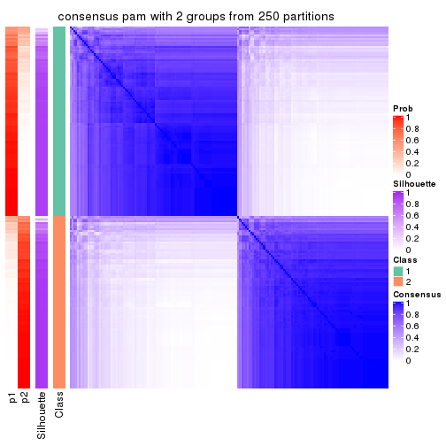</p>

</div>
<div id='tab-CV-pam-consensus-heatmap-2'>
<pre><code class="r">consensus_heatmap(res, k = 3)
</code></pre>

<p>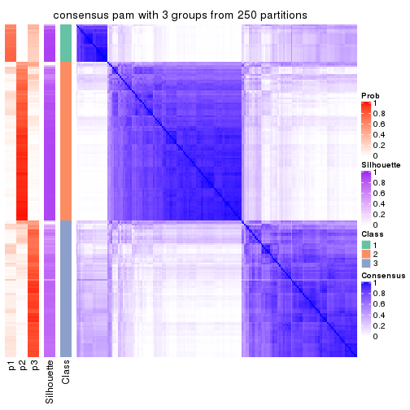</p>

</div>
<div id='tab-CV-pam-consensus-heatmap-3'>
<pre><code class="r">consensus_heatmap(res, k = 4)
</code></pre>

<p>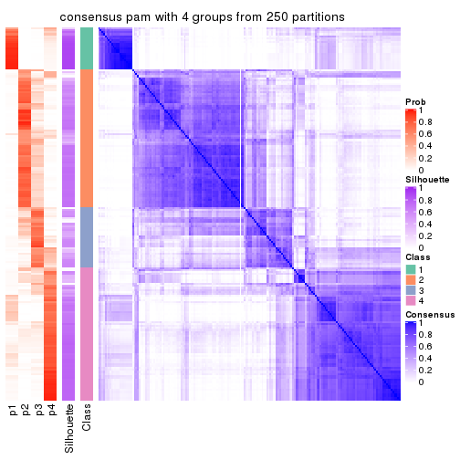</p>

</div>
<div id='tab-CV-pam-consensus-heatmap-4'>
<pre><code class="r">consensus_heatmap(res, k = 5)
</code></pre>

<p>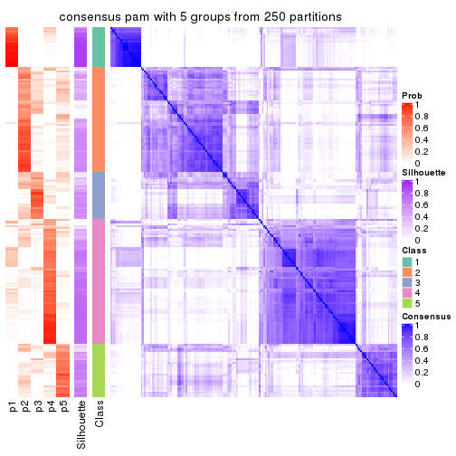</p>

</div>
<div id='tab-CV-pam-consensus-heatmap-5'>
<pre><code class="r">consensus_heatmap(res, k = 6)
</code></pre>

<p>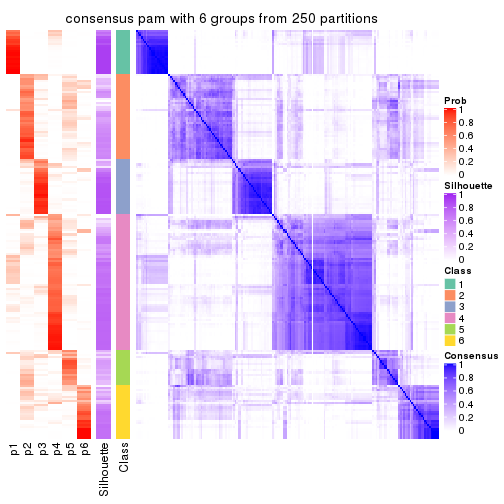</p>

</div>
</div>

Heatmaps for the membership of samples in all partitions to see how consistent they are:


<script>
$( function() {
	$( '#tabs-CV-pam-membership-heatmap' ).tabs();
} );
</script>
<div id='tabs-CV-pam-membership-heatmap'>
<ul>
<li><a href='#tab-CV-pam-membership-heatmap-1'>k = 2</a></li>
<li><a href='#tab-CV-pam-membership-heatmap-2'>k = 3</a></li>
<li><a href='#tab-CV-pam-membership-heatmap-3'>k = 4</a></li>
<li><a href='#tab-CV-pam-membership-heatmap-4'>k = 5</a></li>
<li><a href='#tab-CV-pam-membership-heatmap-5'>k = 6</a></li>
</ul>
<div id='tab-CV-pam-membership-heatmap-1'>
<pre><code class="r">membership_heatmap(res, k = 2)
</code></pre>

<p>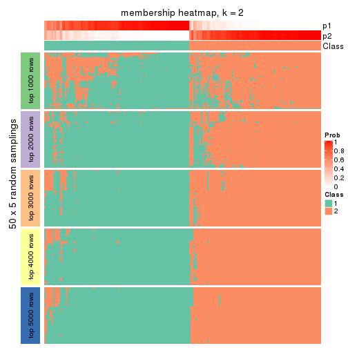</p>

</div>
<div id='tab-CV-pam-membership-heatmap-2'>
<pre><code class="r">membership_heatmap(res, k = 3)
</code></pre>

<p>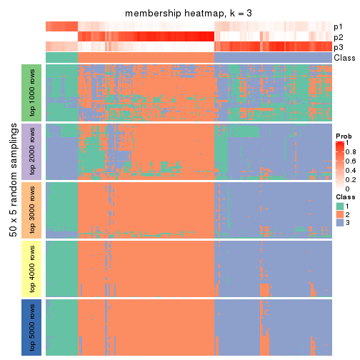</p>

</div>
<div id='tab-CV-pam-membership-heatmap-3'>
<pre><code class="r">membership_heatmap(res, k = 4)
</code></pre>

<p>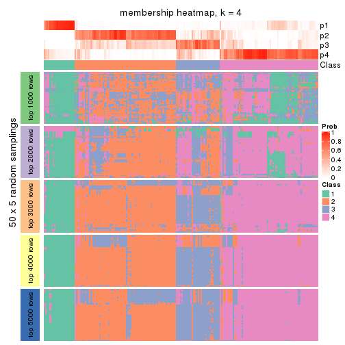</p>

</div>
<div id='tab-CV-pam-membership-heatmap-4'>
<pre><code class="r">membership_heatmap(res, k = 5)
</code></pre>

<p>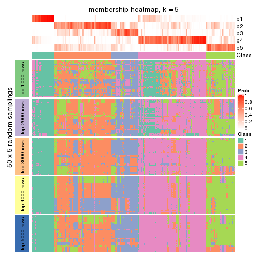</p>

</div>
<div id='tab-CV-pam-membership-heatmap-5'>
<pre><code class="r">membership_heatmap(res, k = 6)
</code></pre>

<p>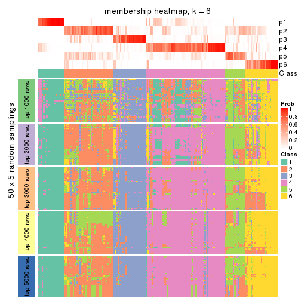</p>

</div>
</div>

As soon as we have had the classes for columns, we can look for signatures
which are significantly different between classes which can be candidate marks
for certain classes. Following are the heatmaps for signatures.


Signature heatmaps where rows are scaled:


<script>
$( function() {
	$( '#tabs-CV-pam-get-signatures' ).tabs();
} );
</script>
<div id='tabs-CV-pam-get-signatures'>
<ul>
<li><a href='#tab-CV-pam-get-signatures-1'>k = 2</a></li>
<li><a href='#tab-CV-pam-get-signatures-2'>k = 3</a></li>
<li><a href='#tab-CV-pam-get-signatures-3'>k = 4</a></li>
<li><a href='#tab-CV-pam-get-signatures-4'>k = 5</a></li>
<li><a href='#tab-CV-pam-get-signatures-5'>k = 6</a></li>
</ul>
<div id='tab-CV-pam-get-signatures-1'>
<pre><code class="r">get_signatures(res, k = 2)
</code></pre>

<p>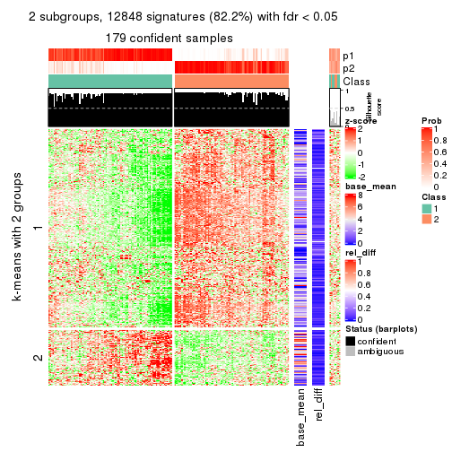</p>

</div>
<div id='tab-CV-pam-get-signatures-2'>
<pre><code class="r">get_signatures(res, k = 3)
</code></pre>

<p>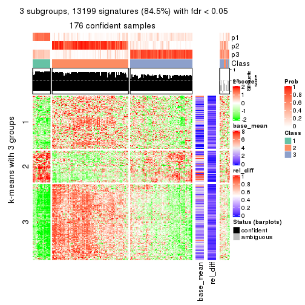</p>

</div>
<div id='tab-CV-pam-get-signatures-3'>
<pre><code class="r">get_signatures(res, k = 4)
</code></pre>

<p>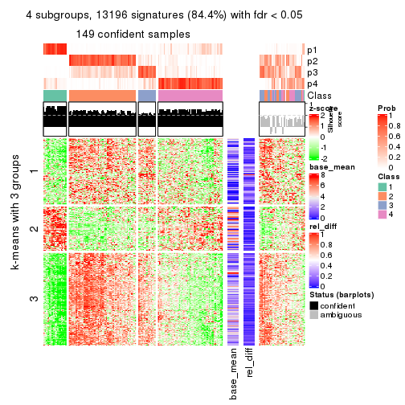</p>

</div>
<div id='tab-CV-pam-get-signatures-4'>
<pre><code class="r">get_signatures(res, k = 5)
</code></pre>

<p>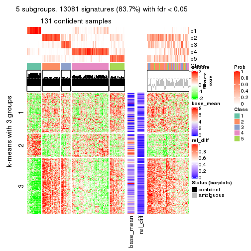</p>

</div>
<div id='tab-CV-pam-get-signatures-5'>
<pre><code class="r">get_signatures(res, k = 6)
</code></pre>

<p>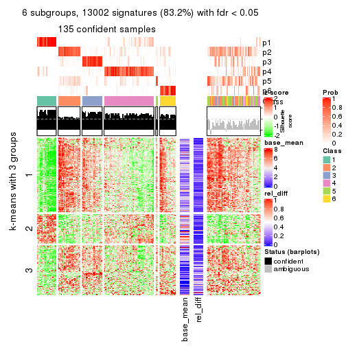</p>

</div>
</div>


Signature heatmaps where rows are not scaled:


<script>
$( function() {
	$( '#tabs-CV-pam-get-signatures-no-scale' ).tabs();
} );
</script>
<div id='tabs-CV-pam-get-signatures-no-scale'>
<ul>
<li><a href='#tab-CV-pam-get-signatures-no-scale-1'>k = 2</a></li>
<li><a href='#tab-CV-pam-get-signatures-no-scale-2'>k = 3</a></li>
<li><a href='#tab-CV-pam-get-signatures-no-scale-3'>k = 4</a></li>
<li><a href='#tab-CV-pam-get-signatures-no-scale-4'>k = 5</a></li>
<li><a href='#tab-CV-pam-get-signatures-no-scale-5'>k = 6</a></li>
</ul>
<div id='tab-CV-pam-get-signatures-no-scale-1'>
<pre><code class="r">get_signatures(res, k = 2, scale_rows = FALSE)
</code></pre>

<p>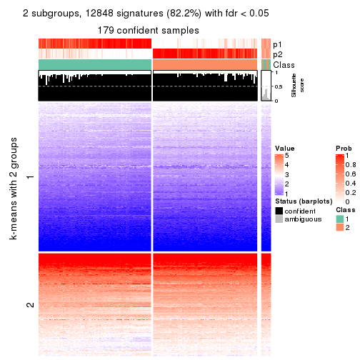</p>

</div>
<div id='tab-CV-pam-get-signatures-no-scale-2'>
<pre><code class="r">get_signatures(res, k = 3, scale_rows = FALSE)
</code></pre>

<p>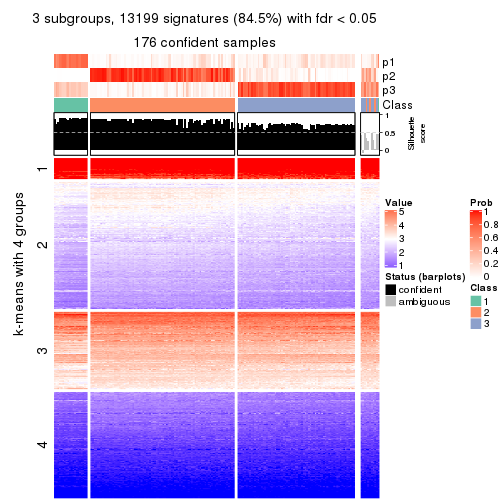</p>

</div>
<div id='tab-CV-pam-get-signatures-no-scale-3'>
<pre><code class="r">get_signatures(res, k = 4, scale_rows = FALSE)
</code></pre>

<p>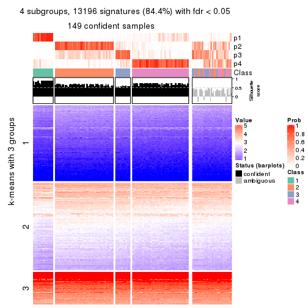</p>

</div>
<div id='tab-CV-pam-get-signatures-no-scale-4'>
<pre><code class="r">get_signatures(res, k = 5, scale_rows = FALSE)
</code></pre>

<p>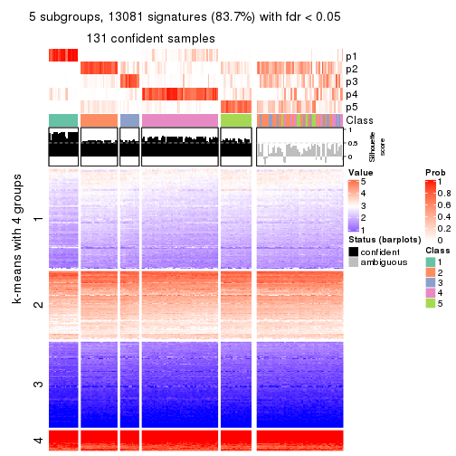</p>

</div>
<div id='tab-CV-pam-get-signatures-no-scale-5'>
<pre><code class="r">get_signatures(res, k = 6, scale_rows = FALSE)
</code></pre>

<p>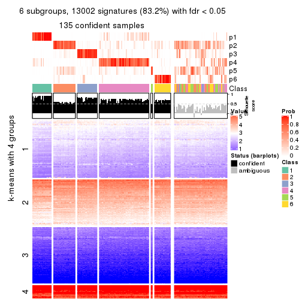</p>

</div>
</div>


Compare the overlap of signatures from different k:

```r
compare_signatures(res)
```

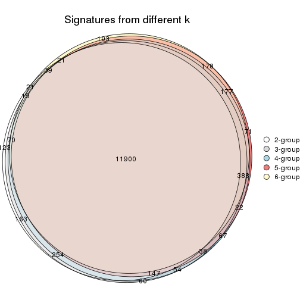

`get_signature()` returns a data frame invisibly. TO get the list of signatures, the function
call should be assigned to a variable explicitly. In following code, if `plot` argument is set
to `FALSE`, no heatmap is plotted while only the differential analysis is performed.

```r
# code only for demonstration
tb = get_signature(res, k = ..., plot = FALSE)
```

An example of the output of `tb` is:

```
#>   which_row         fdr    mean_1    mean_2 scaled_mean_1 scaled_mean_2 km
#> 1        38 0.042760348  8.373488  9.131774    -0.5533452     0.5164555  1
#> 2        40 0.018707592  7.106213  8.469186    -0.6173731     0.5762149  1
#> 3        55 0.019134737 10.221463 11.207825    -0.6159697     0.5749050  1
#> 4        59 0.006059896  5.921854  7.869574    -0.6899429     0.6439467  1
#> 5        60 0.018055526  8.928898 10.211722    -0.6204761     0.5791110  1
#> 6        98 0.009384629 15.714769 14.887706     0.6635654    -0.6193277  2
...
```

The columns in `tb` are:

1. `which_row`: row indices corresponding to the input matrix.
2. `fdr`: FDR for the differential test. 
3. `mean_x`: The mean value in group x.
4. `scaled_mean_x`: The mean value in group x after rows are scaled.
5. `km`: Row groups if k-means clustering is applied to rows.


UMAP plot which shows how samples are separated.


<script>
$( function() {
	$( '#tabs-CV-pam-dimension-reduction' ).tabs();
} );
</script>
<div id='tabs-CV-pam-dimension-reduction'>
<ul>
<li><a href='#tab-CV-pam-dimension-reduction-1'>k = 2</a></li>
<li><a href='#tab-CV-pam-dimension-reduction-2'>k = 3</a></li>
<li><a href='#tab-CV-pam-dimension-reduction-3'>k = 4</a></li>
<li><a href='#tab-CV-pam-dimension-reduction-4'>k = 5</a></li>
<li><a href='#tab-CV-pam-dimension-reduction-5'>k = 6</a></li>
</ul>
<div id='tab-CV-pam-dimension-reduction-1'>
<pre><code class="r">dimension_reduction(res, k = 2, method = &quot;UMAP&quot;)
</code></pre>

<p>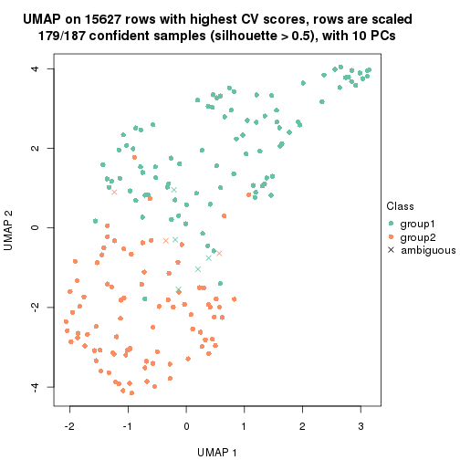</p>

</div>
<div id='tab-CV-pam-dimension-reduction-2'>
<pre><code class="r">dimension_reduction(res, k = 3, method = &quot;UMAP&quot;)
</code></pre>

<p>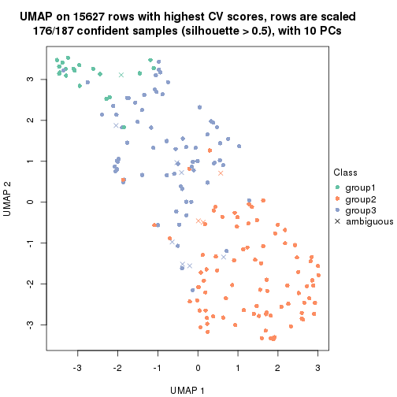</p>

</div>
<div id='tab-CV-pam-dimension-reduction-3'>
<pre><code class="r">dimension_reduction(res, k = 4, method = &quot;UMAP&quot;)
</code></pre>

<p>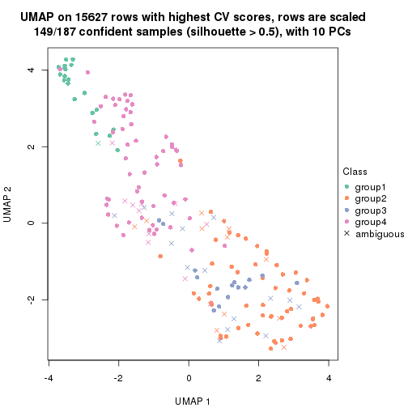</p>

</div>
<div id='tab-CV-pam-dimension-reduction-4'>
<pre><code class="r">dimension_reduction(res, k = 5, method = &quot;UMAP&quot;)
</code></pre>

<p>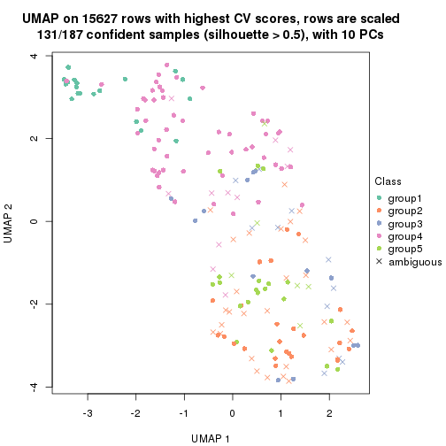</p>

</div>
<div id='tab-CV-pam-dimension-reduction-5'>
<pre><code class="r">dimension_reduction(res, k = 6, method = &quot;UMAP&quot;)
</code></pre>

<p>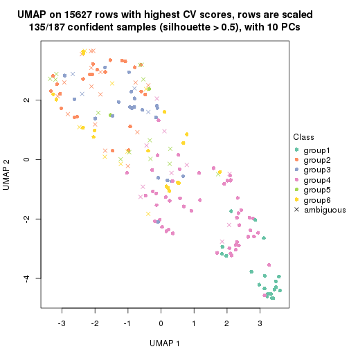</p>

</div>
</div>


Following heatmap shows how subgroups are split when increasing `k`:

```r
collect_classes(res)
```

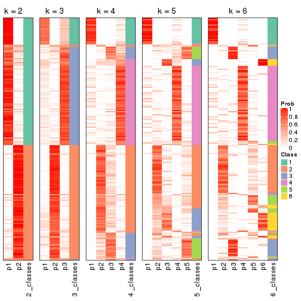


If matrix rows can be associated to genes, consider to use `GO_Enrichment(res,
...)` to perform function enrichment for the signature genes.


 

---------------------------------------------------


### CV:mclust


The object with results only for a single top-value method and a single partition method 
can be extracted as:

```r
res = res_list["CV", "mclust"]
# you can also extract it by
# res = res_list["CV:mclust"]
```

A summary of `res` and all the functions that can be applied to it:

```r
res
```

```
#> A 'ConsensusPartition' object with k = 2, 3, 4, 5, 6.
#>   On a matrix with 15627 rows and 187 columns.
#>   Top rows (1000, 2000, 3000, 4000, 5000) are extracted by 'CV' method.
#>   Subgroups are detected by 'mclust' method.
#>   Performed in total 1250 partitions by row resampling.
#>   Best k for subgroups seems to be 2.
#> 
#> Following methods can be applied to this 'ConsensusPartition' object:
#>  [1] "cola_report"             "collect_classes"         "collect_plots"          
#>  [4] "collect_stats"           "colnames"                "compare_signatures"     
#>  [7] "consensus_heatmap"       "dimension_reduction"     "functional_enrichment"  
#> [10] "get_anno_col"            "get_anno"                "get_classes"            
#> [13] "get_consensus"           "get_matrix"              "get_membership"         
#> [16] "get_param"               "get_signatures"          "get_stats"              
#> [19] "is_best_k"               "is_stable_k"             "membership_heatmap"     
#> [22] "ncol"                    "nrow"                    "plot_ecdf"              
#> [25] "rownames"                "select_partition_number" "show"                   
#> [28] "suggest_best_k"          "test_to_known_factors"
```

`collect_plots()` function collects all the plots made from `res` for all `k` (number of partitions)
into one single page to provide an easy and fast comparison between different `k`.

```r
collect_plots(res)
```

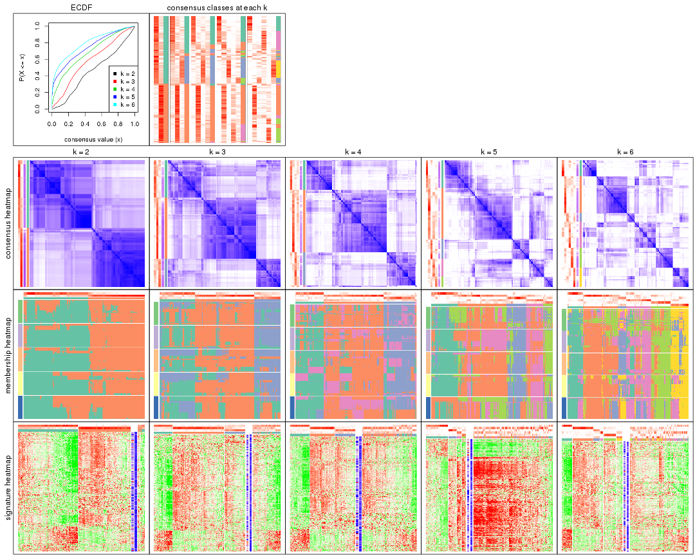

The plots are:

- The first row: a plot of the ECDF (Empirical cumulative distribution
  function) curves of the consensus matrix for each `k` and the heatmap of
  predicted classes for each `k`.
- The second row: heatmaps of the consensus matrix for each `k`.
- The third row: heatmaps of the membership matrix for each `k`.
- The fouth row: heatmaps of the signatures for each `k`.

All the plots in panels can be made by individual functions and they are
plotted later in this section.

`select_partition_number()` produces several plots showing different
statistics for choosing "optimized" `k`. There are following statistics:

- ECDF curves of the consensus matrix for each `k`;
- 1-PAC. [The PAC
  score](https://en.wikipedia.org/wiki/Consensus_clustering#Over-interpretation_potential_of_consensus_clustering)
  measures the proportion of the ambiguous subgrouping.
- Mean silhouette score.
- Concordance. The mean probability of fiting the consensus class ids in all
  partitions.
- Area increased. Denote $A_k$ as the area under the ECDF curve for current
  `k`, the area increased is defined as $A_k - A_{k-1}$.
- Rand index. The percent of pairs of samples that are both in a same cluster
  or both are not in a same cluster in the partition of k and k-1.
- Jaccard index. The ratio of pairs of samples are both in a same cluster in
  the partition of k and k-1 and the pairs of samples are both in a same
  cluster in the partition k or k-1.

The detailed explanations of these statistics can be found in [the cola
vignette](http://bioconductor.org/packages/devel/bioc/vignettes/cola/inst/doc/cola.html#toc_13).

Generally speaking, lower PAC score, higher mean silhouette score or higher
concordance corresponds to better partition. Rand index and Jaccard index
measure how similar the current partition is compared to partition with `k-1`.
If they are too similar, we won't accept `k` is better than `k-1`.

```r
select_partition_number(res)
```

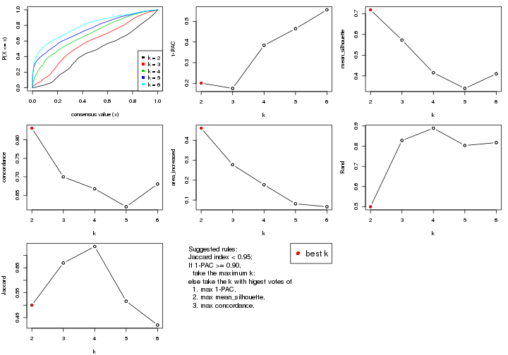

The numeric values for all these statistics can be obtained by `get_stats()`.

```r
get_stats(res)
```

```
#>   k 1-PAC mean_silhouette concordance area_increased  Rand Jaccard
#> 2 2 0.201           0.719       0.832         0.4609 0.500   0.500
#> 3 3 0.175           0.573       0.700         0.2775 0.828   0.670
#> 4 4 0.384           0.416       0.668         0.1767 0.889   0.736
#> 5 5 0.464           0.340       0.619         0.0813 0.803   0.516
#> 6 6 0.556           0.410       0.681         0.0666 0.818   0.420
```

`suggest_best_k()` suggests the best $k$ based on these statistics. The rules are as follows:

- All $k$ with Jaccard index larger than 0.95 are removed because the increase of
  the partition number does not provides enough extra information. If all $k$ are removed,
  the best $k$ is assigned by `NA`.
- For $k$ with 1-PAC larger than 0.9, the maximal $k$ is taken as the "best k". Other $k$ is called "optional k".
- If it does not fit the second rule. The $k$ with the highest vote of highest
  1-PAC, mean silhouette and concordance is taken as the "best k".

```r
suggest_best_k(res)
```

```
#> [1] 2
```


Following shows the table of the partitions (You need to click the **show/hide
code output** link to see it). The membership matrix (columns with name `p*`)
is inferred by
[`clue::cl_consensus()`](https://www.rdocumentation.org/link/cl_consensus?package=clue)
function with the `SE` method. Basically the value in the membership matrix
represents the probability to belong to a certain group. The finall class
label for an item is determined with the group with highest probability it
belongs to.

In `get_classes()` function, the entropy is calculated from the membership
matrix and the silhouette score is calculated from the consensus matrix.


<script>
$( function() {
	$( '#tabs-CV-mclust-get-classes' ).tabs();
} );
</script>
<div id='tabs-CV-mclust-get-classes'>
<ul>
<li><a href='#tab-CV-mclust-get-classes-1'>k = 2</a></li>
<li><a href='#tab-CV-mclust-get-classes-2'>k = 3</a></li>
<li><a href='#tab-CV-mclust-get-classes-3'>k = 4</a></li>
<li><a href='#tab-CV-mclust-get-classes-4'>k = 5</a></li>
<li><a href='#tab-CV-mclust-get-classes-5'>k = 6</a></li>
</ul>

<div id='tab-CV-mclust-get-classes-1'>
<p><a id='tab-CV-mclust-get-classes-1-a' style='color:#0366d6' href='#'>show/hide code output</a></p>
<pre><code class="r">cbind(get_classes(res, k = 2), get_membership(res, k = 2))
</code></pre>

<pre><code>#&gt;            class entropy silhouette    p1    p2
#&gt; SRR1747213     1  0.6048     0.7202 0.852 0.148
#&gt; SRR1747214     1  0.0376     0.7188 0.996 0.004
#&gt; SRR1747215     2  0.1843     0.8656 0.028 0.972
#&gt; SRR1747216     2  0.1184     0.8636 0.016 0.984
#&gt; SRR1747217     1  0.9993     0.3015 0.516 0.484
#&gt; SRR1747218     2  0.3114     0.8655 0.056 0.944
#&gt; SRR1747219     1  0.6531     0.7400 0.832 0.168
#&gt; SRR1747220     1  0.0938     0.7228 0.988 0.012
#&gt; SRR1747221     2  0.9170     0.5207 0.332 0.668
#&gt; SRR1747222     1  0.4022     0.7434 0.920 0.080
#&gt; SRR1747223     2  0.8443     0.6201 0.272 0.728
#&gt; SRR1747224     2  0.7453     0.7382 0.212 0.788
#&gt; SRR1747225     2  0.2423     0.8694 0.040 0.960
#&gt; SRR1747226     2  0.0938     0.8645 0.012 0.988
#&gt; SRR1747227     2  0.1414     0.8678 0.020 0.980
#&gt; SRR1747228     2  0.2778     0.8691 0.048 0.952
#&gt; SRR1747229     2  0.6623     0.7313 0.172 0.828
#&gt; SRR1747230     1  0.6531     0.7059 0.832 0.168
#&gt; SRR1747231     1  0.1184     0.7232 0.984 0.016
#&gt; SRR1747232     1  0.0000     0.7165 1.000 0.000
#&gt; SRR1747233     1  0.7602     0.6582 0.780 0.220
#&gt; SRR1747234     1  0.8955     0.6614 0.688 0.312
#&gt; SRR1747235     1  0.6148     0.7156 0.848 0.152
#&gt; SRR1747236     2  0.9993    -0.3541 0.484 0.516
#&gt; SRR1747237     1  0.8955     0.6614 0.688 0.312
#&gt; SRR1747238     1  0.9248     0.6494 0.660 0.340
#&gt; SRR1747239     2  0.1633     0.8665 0.024 0.976
#&gt; SRR1747240     1  0.6343     0.7108 0.840 0.160
#&gt; SRR1747241     1  0.8861     0.6779 0.696 0.304
#&gt; SRR1747242     1  0.6438     0.7085 0.836 0.164
#&gt; SRR1747243     2  0.5842     0.8068 0.140 0.860
#&gt; SRR1747244     2  0.3879     0.8618 0.076 0.924
#&gt; SRR1747245     2  0.2236     0.8675 0.036 0.964
#&gt; SRR1747246     2  0.1414     0.8655 0.020 0.980
#&gt; SRR1747247     1  0.0000     0.7165 1.000 0.000
#&gt; SRR1747248     1  0.6531     0.7059 0.832 0.168
#&gt; SRR1747249     1  0.6048     0.7202 0.852 0.148
#&gt; SRR1747250     1  0.8909     0.6654 0.692 0.308
#&gt; SRR1747252     1  0.5842     0.7418 0.860 0.140
#&gt; SRR1747253     1  0.4562     0.7410 0.904 0.096
#&gt; SRR1747254     1  0.8955     0.6614 0.688 0.312
#&gt; SRR1747255     1  0.9754     0.2339 0.592 0.408
#&gt; SRR1747256     1  0.6801     0.7233 0.820 0.180
#&gt; SRR1747257     2  0.3879     0.8384 0.076 0.924
#&gt; SRR1747258     2  0.9922    -0.1086 0.448 0.552
#&gt; SRR1747259     1  0.8955     0.6614 0.688 0.312
#&gt; SRR1747260     1  0.8443     0.7103 0.728 0.272
#&gt; SRR1747261     2  0.6247     0.7787 0.156 0.844
#&gt; SRR1747262     2  0.2778     0.8666 0.048 0.952
#&gt; SRR1747263     2  0.4562     0.8320 0.096 0.904
#&gt; SRR1747264     1  0.6148     0.7156 0.848 0.152
#&gt; SRR1747265     1  0.8144     0.7138 0.748 0.252
#&gt; SRR1747266     2  0.6438     0.7837 0.164 0.836
#&gt; SRR1747267     1  0.8713     0.6867 0.708 0.292
#&gt; SRR1747268     2  0.4815     0.8346 0.104 0.896
#&gt; SRR1747269     1  0.9580     0.6195 0.620 0.380
#&gt; SRR1747270     1  0.9170     0.6545 0.668 0.332
#&gt; SRR1747271     1  0.9323     0.6160 0.652 0.348
#&gt; SRR1747272     1  0.7745     0.7159 0.772 0.228
#&gt; SRR1747273     1  0.6048     0.7172 0.852 0.148
#&gt; SRR1747274     2  0.6048     0.8261 0.148 0.852
#&gt; SRR1747275     1  0.7376     0.6704 0.792 0.208
#&gt; SRR1747276     1  0.9732     0.2581 0.596 0.404
#&gt; SRR1747277     2  0.7453     0.6595 0.212 0.788
#&gt; SRR1747278     2  0.2043     0.8676 0.032 0.968
#&gt; SRR1747280     1  0.6148     0.7153 0.848 0.152
#&gt; SRR1747279     1  0.5178     0.7287 0.884 0.116
#&gt; SRR1747281     2  0.1633     0.8673 0.024 0.976
#&gt; SRR1747282     1  0.9248     0.4424 0.660 0.340
#&gt; SRR1747283     1  0.9286     0.6418 0.656 0.344
#&gt; SRR1747284     1  0.5842     0.7209 0.860 0.140
#&gt; SRR1747285     1  0.8909     0.6654 0.692 0.308
#&gt; SRR1747286     1  0.9044     0.6589 0.680 0.320
#&gt; SRR1747287     2  0.2603     0.8653 0.044 0.956
#&gt; SRR1747288     1  0.9170     0.6537 0.668 0.332
#&gt; SRR1747290     1  0.9087     0.6580 0.676 0.324
#&gt; SRR1747289     1  0.8955     0.6614 0.688 0.312
#&gt; SRR1747291     2  0.2423     0.8694 0.040 0.960
#&gt; SRR1747293     2  0.5294     0.8083 0.120 0.880
#&gt; SRR1747294     1  0.9000     0.6577 0.684 0.316
#&gt; SRR1747292     1  0.9608     0.3333 0.616 0.384
#&gt; SRR1747295     1  0.8955     0.6614 0.688 0.312
#&gt; SRR1747296     1  0.8955     0.6614 0.688 0.312
#&gt; SRR1747297     2  0.4161     0.8407 0.084 0.916
#&gt; SRR1747298     2  0.3431     0.8531 0.064 0.936
#&gt; SRR1747299     2  0.0376     0.8603 0.004 0.996
#&gt; SRR1747300     2  0.0938     0.8627 0.012 0.988
#&gt; SRR1747301     2  0.7299     0.6950 0.204 0.796
#&gt; SRR1747302     2  0.4562     0.8444 0.096 0.904
#&gt; SRR1747303     2  0.2778     0.8632 0.048 0.952
#&gt; SRR1747304     1  0.6531     0.7059 0.832 0.168
#&gt; SRR1747305     2  0.1843     0.8669 0.028 0.972
#&gt; SRR1747306     2  0.1843     0.8656 0.028 0.972
#&gt; SRR1747307     1  0.5946     0.7411 0.856 0.144
#&gt; SRR1747308     1  0.8955     0.6614 0.688 0.312
#&gt; SRR1747309     2  0.9850     0.2739 0.428 0.572
#&gt; SRR1747310     1  0.0000     0.7165 1.000 0.000
#&gt; SRR1747311     2  0.9732     0.2556 0.404 0.596
#&gt; SRR1747313     2  0.6148     0.7836 0.152 0.848
#&gt; SRR1747312     1  0.6343     0.7108 0.840 0.160
#&gt; SRR1747314     1  0.6531     0.7059 0.832 0.168
#&gt; SRR1747315     2  0.1633     0.8673 0.024 0.976
#&gt; SRR1747316     1  0.9552     0.6216 0.624 0.376
#&gt; SRR1747318     1  0.8955     0.6614 0.688 0.312
#&gt; SRR1747317     1  0.8955     0.6614 0.688 0.312
#&gt; SRR1747319     1  0.9129     0.6585 0.672 0.328
#&gt; SRR1747320     1  0.7056     0.7194 0.808 0.192
#&gt; SRR1747322     1  0.6623     0.7031 0.828 0.172
#&gt; SRR1747321     1  0.9754     0.2593 0.592 0.408
#&gt; SRR1747323     2  0.1633     0.8665 0.024 0.976
#&gt; SRR1747324     2  0.1633     0.8639 0.024 0.976
#&gt; SRR1747326     2  0.2043     0.8676 0.032 0.968
#&gt; SRR1747325     2  0.8081     0.6192 0.248 0.752
#&gt; SRR1747327     2  0.1633     0.8673 0.024 0.976
#&gt; SRR1747328     2  0.5408     0.8257 0.124 0.876
#&gt; SRR1747330     2  0.2423     0.8665 0.040 0.960
#&gt; SRR1747329     2  0.3114     0.8619 0.056 0.944
#&gt; SRR1747332     1  0.4431     0.7445 0.908 0.092
#&gt; SRR1747331     1  0.8443     0.6904 0.728 0.272
#&gt; SRR1747333     2  0.1633     0.8673 0.024 0.976
#&gt; SRR1747334     2  0.1184     0.8661 0.016 0.984
#&gt; SRR1747335     1  0.6712     0.7337 0.824 0.176
#&gt; SRR1747336     1  0.3274     0.7329 0.940 0.060
#&gt; SRR1747337     2  0.6801     0.7132 0.180 0.820
#&gt; SRR1747338     2  0.1633     0.8665 0.024 0.976
#&gt; SRR1747339     2  0.6247     0.7787 0.156 0.844
#&gt; SRR1747340     2  0.2236     0.8695 0.036 0.964
#&gt; SRR1747341     2  0.4022     0.8498 0.080 0.920
#&gt; SRR1747342     2  0.4161     0.8489 0.084 0.916
#&gt; SRR1747343     2  0.1414     0.8655 0.020 0.980
#&gt; SRR1747344     2  0.2603     0.8617 0.044 0.956
#&gt; SRR1747345     2  0.6531     0.7745 0.168 0.832
#&gt; SRR1747346     1  0.8909     0.6653 0.692 0.308
#&gt; SRR1747347     1  0.8955     0.6614 0.688 0.312
#&gt; SRR1747348     1  0.1414     0.7246 0.980 0.020
#&gt; SRR1747349     1  0.3431     0.7335 0.936 0.064
#&gt; SRR1747351     2  0.3431     0.8559 0.064 0.936
#&gt; SRR1747350     1  0.9000     0.6629 0.684 0.316
#&gt; SRR1747352     1  0.0000     0.7165 1.000 0.000
#&gt; SRR1747353     2  0.6623     0.7353 0.172 0.828
#&gt; SRR1747354     2  0.9881     0.0181 0.436 0.564
#&gt; SRR1747355     1  0.6343     0.7205 0.840 0.160
#&gt; SRR1747356     1  0.9170     0.6587 0.668 0.332
#&gt; SRR1747357     1  0.9323     0.6269 0.652 0.348
#&gt; SRR1747358     1  0.8713     0.6890 0.708 0.292
#&gt; SRR1747359     1  0.6623     0.7031 0.828 0.172
#&gt; SRR1747360     2  0.2423     0.8663 0.040 0.960
#&gt; SRR1747361     1  0.6887     0.7300 0.816 0.184
#&gt; SRR1747362     2  0.5842     0.7980 0.140 0.860
#&gt; SRR1747363     2  0.7299     0.7289 0.204 0.796
#&gt; SRR1747364     1  0.7602     0.6706 0.780 0.220
#&gt; SRR1747365     1  0.8327     0.7092 0.736 0.264
#&gt; SRR1747366     1  0.9866     0.5645 0.568 0.432
#&gt; SRR1747367     2  0.6438     0.7734 0.164 0.836
#&gt; SRR1747369     1  0.8955     0.6614 0.688 0.312
#&gt; SRR1747368     1  0.8327     0.7077 0.736 0.264
#&gt; SRR1747370     2  0.5294     0.8188 0.120 0.880
#&gt; SRR1747372     1  0.6148     0.7153 0.848 0.152
#&gt; SRR1747371     1  0.5519     0.7253 0.872 0.128
#&gt; SRR1747373     2  0.4431     0.8208 0.092 0.908
#&gt; SRR1747374     1  0.8955     0.6614 0.688 0.312
#&gt; SRR1747375     2  0.6438     0.7721 0.164 0.836
#&gt; SRR1747376     2  0.0376     0.8609 0.004 0.996
#&gt; SRR1747377     2  0.1184     0.8636 0.016 0.984
#&gt; SRR1747378     2  0.1414     0.8671 0.020 0.980
#&gt; SRR1747379     2  0.2423     0.8694 0.040 0.960
#&gt; SRR1747380     1  0.8909     0.6653 0.692 0.308
#&gt; SRR1747381     1  0.3879     0.7337 0.924 0.076
#&gt; SRR1747382     1  0.2948     0.7323 0.948 0.052
#&gt; SRR1747383     2  0.1184     0.8634 0.016 0.984
#&gt; SRR1747384     1  0.6438     0.7359 0.836 0.164
#&gt; SRR1747385     2  0.8443     0.5786 0.272 0.728
#&gt; SRR1747386     1  0.0672     0.7200 0.992 0.008
#&gt; SRR1747387     2  0.3431     0.8667 0.064 0.936
#&gt; SRR1747388     2  0.5178     0.8146 0.116 0.884
#&gt; SRR1747390     1  0.8955     0.6651 0.688 0.312
#&gt; SRR1747389     1  0.8955     0.6614 0.688 0.312
#&gt; SRR1747391     2  0.2236     0.8670 0.036 0.964
#&gt; SRR1747392     2  0.2236     0.8670 0.036 0.964
#&gt; SRR1747393     1  0.8081     0.7134 0.752 0.248
#&gt; SRR1747394     1  0.4431     0.7455 0.908 0.092
#&gt; SRR1747395     2  0.7528     0.7194 0.216 0.784
#&gt; SRR1747396     2  0.1414     0.8662 0.020 0.980
#&gt; SRR1747398     2  0.4298     0.8386 0.088 0.912
#&gt; SRR1747397     2  0.7299     0.7294 0.204 0.796
#&gt; SRR1747399     1  0.1633     0.7258 0.976 0.024
#&gt; SRR1747400     1  0.4562     0.7323 0.904 0.096
</code></pre>

<script>
$('#tab-CV-mclust-get-classes-1-a').parent().next().next().hide();
$('#tab-CV-mclust-get-classes-1-a').click(function(){
  $('#tab-CV-mclust-get-classes-1-a').parent().next().next().toggle();
  return(false);
});
</script>
</div>

<div id='tab-CV-mclust-get-classes-2'>
<p><a id='tab-CV-mclust-get-classes-2-a' style='color:#0366d6' href='#'>show/hide code output</a></p>
<pre><code class="r">cbind(get_classes(res, k = 3), get_membership(res, k = 3))
</code></pre>

<pre><code>#&gt;            class entropy silhouette    p1    p2    p3
#&gt; SRR1747213     1  0.5730     0.5588 0.796 0.060 0.144
#&gt; SRR1747214     3  0.6204     0.4760 0.424 0.000 0.576
#&gt; SRR1747215     2  0.3499     0.7760 0.072 0.900 0.028
#&gt; SRR1747216     2  0.2939     0.7780 0.072 0.916 0.012
#&gt; SRR1747217     2  0.8291     0.4164 0.280 0.604 0.116
#&gt; SRR1747218     2  0.2261     0.7807 0.068 0.932 0.000
#&gt; SRR1747219     3  0.7395     0.2636 0.476 0.032 0.492
#&gt; SRR1747220     3  0.6180     0.5551 0.332 0.008 0.660
#&gt; SRR1747221     2  0.8676     0.2019 0.352 0.532 0.116
#&gt; SRR1747222     3  0.5585     0.6576 0.204 0.024 0.772
#&gt; SRR1747223     2  0.8511     0.5661 0.152 0.604 0.244
#&gt; SRR1747224     2  0.5710     0.7018 0.080 0.804 0.116
#&gt; SRR1747225     2  0.2165     0.7816 0.064 0.936 0.000
#&gt; SRR1747226     2  0.3310     0.7746 0.064 0.908 0.028
#&gt; SRR1747227     2  0.2165     0.7818 0.064 0.936 0.000
#&gt; SRR1747228     2  0.5939     0.7586 0.072 0.788 0.140
#&gt; SRR1747229     2  0.3370     0.7477 0.072 0.904 0.024
#&gt; SRR1747230     1  0.5816     0.6078 0.788 0.156 0.056
#&gt; SRR1747231     1  0.4842     0.2816 0.776 0.000 0.224
#&gt; SRR1747232     3  0.6291     0.3033 0.468 0.000 0.532
#&gt; SRR1747233     1  0.7731     0.5889 0.664 0.228 0.108
#&gt; SRR1747234     3  0.7113     0.7041 0.168 0.112 0.720
#&gt; SRR1747235     1  0.5981     0.6088 0.788 0.132 0.080
#&gt; SRR1747236     2  0.8718    -0.0384 0.364 0.520 0.116
#&gt; SRR1747237     3  0.9063     0.6570 0.200 0.248 0.552
#&gt; SRR1747238     1  0.9624    -0.2033 0.468 0.292 0.240
#&gt; SRR1747239     2  0.1163     0.7701 0.000 0.972 0.028
#&gt; SRR1747240     1  0.6151     0.6055 0.764 0.180 0.056
#&gt; SRR1747241     1  0.9364     0.4179 0.512 0.220 0.268
#&gt; SRR1747242     1  0.5939     0.6103 0.788 0.140 0.072
#&gt; SRR1747243     2  0.7880     0.6286 0.108 0.648 0.244
#&gt; SRR1747244     2  0.2879     0.7697 0.024 0.924 0.052
#&gt; SRR1747245     2  0.4615     0.7390 0.020 0.836 0.144
#&gt; SRR1747246     2  0.3112     0.7766 0.056 0.916 0.028
#&gt; SRR1747247     3  0.6215     0.3876 0.428 0.000 0.572
#&gt; SRR1747248     1  0.5816     0.6080 0.788 0.156 0.056
#&gt; SRR1747249     1  0.5760     0.5627 0.796 0.064 0.140
#&gt; SRR1747250     3  0.7530     0.6636 0.252 0.084 0.664
#&gt; SRR1747252     3  0.6570     0.6104 0.308 0.024 0.668
#&gt; SRR1747253     3  0.6026     0.6569 0.244 0.024 0.732
#&gt; SRR1747254     3  0.9292     0.6392 0.208 0.272 0.520
#&gt; SRR1747255     1  0.8737     0.1862 0.464 0.428 0.108
#&gt; SRR1747256     1  0.6109     0.5624 0.780 0.080 0.140
#&gt; SRR1747257     2  0.4618     0.7518 0.136 0.840 0.024
#&gt; SRR1747258     2  0.8567     0.3575 0.296 0.576 0.128
#&gt; SRR1747259     3  0.9513     0.6174 0.256 0.252 0.492
#&gt; SRR1747260     1  0.9241    -0.2462 0.456 0.156 0.388
#&gt; SRR1747261     2  0.6823     0.6346 0.152 0.740 0.108
#&gt; SRR1747262     2  0.2261     0.7807 0.068 0.932 0.000
#&gt; SRR1747263     2  0.5111     0.7249 0.024 0.808 0.168
#&gt; SRR1747264     1  0.4291     0.6159 0.820 0.180 0.000
#&gt; SRR1747265     1  0.6567     0.5380 0.752 0.088 0.160
#&gt; SRR1747266     2  0.5521     0.7052 0.180 0.788 0.032
#&gt; SRR1747267     1  0.9561     0.3424 0.428 0.376 0.196
#&gt; SRR1747268     2  0.7222     0.6726 0.072 0.684 0.244
#&gt; SRR1747269     2  0.9266    -0.2374 0.420 0.424 0.156
#&gt; SRR1747270     2  0.9865    -0.4513 0.268 0.408 0.324
#&gt; SRR1747271     3  0.8386     0.6676 0.156 0.224 0.620
#&gt; SRR1747272     3  0.6174     0.6970 0.168 0.064 0.768
#&gt; SRR1747273     1  0.4677     0.6184 0.840 0.132 0.028
#&gt; SRR1747274     2  0.5566     0.7057 0.080 0.812 0.108
#&gt; SRR1747275     1  0.8054     0.4553 0.580 0.340 0.080
#&gt; SRR1747276     1  0.8720     0.2458 0.480 0.412 0.108
#&gt; SRR1747277     2  0.4634     0.6883 0.164 0.824 0.012
#&gt; SRR1747278     2  0.4865     0.7518 0.032 0.832 0.136
#&gt; SRR1747280     1  0.6231     0.6119 0.772 0.148 0.080
#&gt; SRR1747279     1  0.6243     0.6050 0.776 0.124 0.100
#&gt; SRR1747281     2  0.4982     0.7627 0.036 0.828 0.136
#&gt; SRR1747282     1  0.5948     0.4217 0.640 0.360 0.000
#&gt; SRR1747283     1  0.8473     0.5588 0.616 0.208 0.176
#&gt; SRR1747284     1  0.4413     0.6051 0.860 0.104 0.036
#&gt; SRR1747285     3  0.7545     0.6959 0.172 0.136 0.692
#&gt; SRR1747286     3  0.8650     0.6292 0.276 0.144 0.580
#&gt; SRR1747287     2  0.2806     0.7710 0.032 0.928 0.040
#&gt; SRR1747288     1  0.8421     0.4586 0.608 0.252 0.140
#&gt; SRR1747290     3  0.9846     0.5454 0.304 0.276 0.420
#&gt; SRR1747289     3  0.9383     0.6462 0.236 0.252 0.512
#&gt; SRR1747291     2  0.2165     0.7816 0.064 0.936 0.000
#&gt; SRR1747293     2  0.5178     0.7352 0.028 0.808 0.164
#&gt; SRR1747294     3  0.9350     0.5659 0.184 0.328 0.488
#&gt; SRR1747292     1  0.8684     0.3318 0.500 0.392 0.108
#&gt; SRR1747295     3  0.9536     0.6143 0.260 0.252 0.488
#&gt; SRR1747296     3  0.9489     0.6225 0.252 0.252 0.496
#&gt; SRR1747297     2  0.4934     0.7302 0.024 0.820 0.156
#&gt; SRR1747298     2  0.4411     0.7475 0.016 0.844 0.140
#&gt; SRR1747299     2  0.2165     0.7816 0.064 0.936 0.000
#&gt; SRR1747300     2  0.2400     0.7811 0.064 0.932 0.004
#&gt; SRR1747301     2  0.4862     0.6827 0.160 0.820 0.020
#&gt; SRR1747302     2  0.3583     0.7481 0.056 0.900 0.044
#&gt; SRR1747303     2  0.4261     0.7499 0.012 0.848 0.140
#&gt; SRR1747304     1  0.6630     0.5907 0.724 0.220 0.056
#&gt; SRR1747305     2  0.3499     0.7760 0.072 0.900 0.028
#&gt; SRR1747306     2  0.3590     0.7746 0.076 0.896 0.028
#&gt; SRR1747307     3  0.6066     0.6570 0.248 0.024 0.728
#&gt; SRR1747308     3  0.8016     0.6886 0.156 0.188 0.656
#&gt; SRR1747309     2  0.8701     0.0389 0.400 0.492 0.108
#&gt; SRR1747310     3  0.6204     0.4760 0.424 0.000 0.576
#&gt; SRR1747311     2  0.8262     0.4192 0.276 0.608 0.116
#&gt; SRR1747313     2  0.5393     0.7060 0.072 0.820 0.108
#&gt; SRR1747312     1  0.6151     0.6055 0.764 0.180 0.056
#&gt; SRR1747314     1  0.6151     0.6055 0.764 0.180 0.056
#&gt; SRR1747315     2  0.5696     0.7615 0.064 0.800 0.136
#&gt; SRR1747316     2  0.8984     0.1530 0.224 0.564 0.212
#&gt; SRR1747318     3  0.6231     0.7037 0.148 0.080 0.772
#&gt; SRR1747317     3  0.6252     0.7062 0.144 0.084 0.772
#&gt; SRR1747319     1  0.7217     0.5590 0.716 0.132 0.152
#&gt; SRR1747320     1  0.6850     0.5625 0.740 0.120 0.140
#&gt; SRR1747322     1  0.7022     0.5651 0.684 0.260 0.056
#&gt; SRR1747321     1  0.7250     0.3318 0.572 0.396 0.032
#&gt; SRR1747323     2  0.2050     0.7684 0.020 0.952 0.028
#&gt; SRR1747324     2  0.2165     0.7816 0.064 0.936 0.000
#&gt; SRR1747326     2  0.4063     0.7535 0.020 0.868 0.112
#&gt; SRR1747325     2  0.6488     0.5833 0.192 0.744 0.064
#&gt; SRR1747327     2  0.4033     0.7479 0.008 0.856 0.136
#&gt; SRR1747328     2  0.7458     0.6660 0.084 0.672 0.244
#&gt; SRR1747330     2  0.5486     0.7218 0.024 0.780 0.196
#&gt; SRR1747329     2  0.4811     0.7357 0.024 0.828 0.148
#&gt; SRR1747332     3  0.6796     0.5629 0.344 0.024 0.632
#&gt; SRR1747331     3  0.8067     0.7032 0.188 0.160 0.652
#&gt; SRR1747333     2  0.5538     0.7642 0.060 0.808 0.132
#&gt; SRR1747334     2  0.2165     0.7824 0.064 0.936 0.000
#&gt; SRR1747335     3  0.6986     0.6511 0.256 0.056 0.688
#&gt; SRR1747336     1  0.5315     0.4088 0.772 0.012 0.216
#&gt; SRR1747337     2  0.3918     0.7340 0.120 0.868 0.012
#&gt; SRR1747338     2  0.2903     0.7752 0.048 0.924 0.028
#&gt; SRR1747339     2  0.6775     0.6271 0.144 0.744 0.112
#&gt; SRR1747340     2  0.4384     0.7817 0.064 0.868 0.068
#&gt; SRR1747341     2  0.2806     0.7778 0.040 0.928 0.032
#&gt; SRR1747342     2  0.2918     0.7750 0.032 0.924 0.044
#&gt; SRR1747343     2  0.2050     0.7644 0.020 0.952 0.028
#&gt; SRR1747344     2  0.2165     0.7816 0.064 0.936 0.000
#&gt; SRR1747345     2  0.8245     0.5873 0.132 0.624 0.244
#&gt; SRR1747346     3  0.6171     0.7044 0.144 0.080 0.776
#&gt; SRR1747347     3  0.7909     0.6886 0.148 0.188 0.664
#&gt; SRR1747348     1  0.7107     0.2161 0.624 0.036 0.340
#&gt; SRR1747349     1  0.4539     0.4472 0.836 0.016 0.148
#&gt; SRR1747351     2  0.3234     0.7787 0.072 0.908 0.020
#&gt; SRR1747350     3  0.9717     0.4634 0.220 0.384 0.396
#&gt; SRR1747352     1  0.6308    -0.3990 0.508 0.000 0.492
#&gt; SRR1747353     2  0.5627     0.6811 0.188 0.780 0.032
#&gt; SRR1747354     2  0.8955     0.2344 0.344 0.516 0.140
#&gt; SRR1747355     1  0.7797     0.5985 0.672 0.188 0.140
#&gt; SRR1747356     1  0.8985     0.3487 0.544 0.292 0.164
#&gt; SRR1747357     1  0.8939     0.3453 0.520 0.340 0.140
#&gt; SRR1747358     1  0.8948     0.3401 0.568 0.208 0.224
#&gt; SRR1747359     1  0.4702     0.6091 0.788 0.212 0.000
#&gt; SRR1747360     2  0.1877     0.7835 0.032 0.956 0.012
#&gt; SRR1747361     3  0.7457     0.6331 0.208 0.104 0.688
#&gt; SRR1747362     2  0.4174     0.7598 0.092 0.872 0.036
#&gt; SRR1747363     2  0.7731     0.5182 0.228 0.664 0.108
#&gt; SRR1747364     1  0.8610     0.4941 0.548 0.336 0.116
#&gt; SRR1747365     1  0.7665     0.3868 0.648 0.084 0.268
#&gt; SRR1747366     1  0.8524     0.1436 0.456 0.452 0.092
#&gt; SRR1747367     2  0.7731     0.5182 0.228 0.664 0.108
#&gt; SRR1747369     3  0.9055     0.6515 0.196 0.252 0.552
#&gt; SRR1747368     1  0.8169     0.0389 0.536 0.076 0.388
#&gt; SRR1747370     2  0.5304     0.7097 0.068 0.824 0.108
#&gt; SRR1747372     1  0.5874     0.6021 0.796 0.116 0.088
#&gt; SRR1747371     1  0.7508     0.5968 0.696 0.148 0.156
#&gt; SRR1747373     2  0.4189     0.7283 0.068 0.876 0.056
#&gt; SRR1747374     3  0.8427     0.6540 0.148 0.240 0.612
#&gt; SRR1747375     2  0.7437     0.5654 0.200 0.692 0.108
#&gt; SRR1747376     2  0.2165     0.7816 0.064 0.936 0.000
#&gt; SRR1747377     2  0.3678     0.7760 0.080 0.892 0.028
#&gt; SRR1747378     2  0.2165     0.7816 0.064 0.936 0.000
#&gt; SRR1747379     2  0.5497     0.7657 0.064 0.812 0.124
#&gt; SRR1747380     3  0.6171     0.7044 0.144 0.080 0.776
#&gt; SRR1747381     1  0.4189     0.5480 0.876 0.056 0.068
#&gt; SRR1747382     1  0.3856     0.5352 0.888 0.040 0.072
#&gt; SRR1747383     2  0.0661     0.7727 0.008 0.988 0.004
#&gt; SRR1747384     3  0.6026     0.6531 0.244 0.024 0.732
#&gt; SRR1747385     2  0.7053     0.5914 0.064 0.692 0.244
#&gt; SRR1747386     1  0.6267    -0.1516 0.548 0.000 0.452
#&gt; SRR1747387     2  0.4007     0.7766 0.084 0.880 0.036
#&gt; SRR1747388     2  0.5947     0.6903 0.172 0.776 0.052
#&gt; SRR1747390     1  0.9802    -0.4853 0.400 0.240 0.360
#&gt; SRR1747389     3  0.9003     0.6659 0.200 0.240 0.560
#&gt; SRR1747391     2  0.4551     0.7407 0.020 0.840 0.140
#&gt; SRR1747392     2  0.4679     0.7372 0.020 0.832 0.148
#&gt; SRR1747393     3  0.9758     0.4506 0.304 0.256 0.440
#&gt; SRR1747394     3  0.7030     0.4626 0.396 0.024 0.580
#&gt; SRR1747395     2  0.5554     0.7057 0.112 0.812 0.076
#&gt; SRR1747396     2  0.2681     0.7786 0.040 0.932 0.028
#&gt; SRR1747398     2  0.5414     0.6627 0.212 0.772 0.016
#&gt; SRR1747397     2  0.7692     0.5251 0.224 0.668 0.108
#&gt; SRR1747399     1  0.4931     0.2750 0.768 0.000 0.232
#&gt; SRR1747400     1  0.4565     0.5560 0.860 0.064 0.076
</code></pre>

<script>
$('#tab-CV-mclust-get-classes-2-a').parent().next().next().hide();
$('#tab-CV-mclust-get-classes-2-a').click(function(){
  $('#tab-CV-mclust-get-classes-2-a').parent().next().next().toggle();
  return(false);
});
</script>
</div>

<div id='tab-CV-mclust-get-classes-3'>
<p><a id='tab-CV-mclust-get-classes-3-a' style='color:#0366d6' href='#'>show/hide code output</a></p>
<pre><code class="r">cbind(get_classes(res, k = 4), get_membership(res, k = 4))
</code></pre>

<pre><code>#&gt;            class entropy silhouette    p1    p2    p3    p4
#&gt; SRR1747213     1  0.5693     0.5871 0.712 0.028 0.032 0.228
#&gt; SRR1747214     3  0.4509     0.4890 0.288 0.000 0.708 0.004
#&gt; SRR1747215     2  0.3196     0.5421 0.008 0.856 0.000 0.136
#&gt; SRR1747216     2  0.3681     0.5372 0.008 0.816 0.000 0.176
#&gt; SRR1747217     2  0.5758     0.3205 0.060 0.732 0.024 0.184
#&gt; SRR1747218     2  0.1139     0.5650 0.008 0.972 0.012 0.008
#&gt; SRR1747219     3  0.7711     0.4576 0.184 0.016 0.528 0.272
#&gt; SRR1747220     3  0.6469     0.4436 0.192 0.000 0.644 0.164
#&gt; SRR1747221     1  0.7968    -0.1451 0.404 0.332 0.004 0.260
#&gt; SRR1747222     3  0.5159     0.5784 0.088 0.000 0.756 0.156
#&gt; SRR1747223     4  0.7892     0.1965 0.252 0.308 0.004 0.436
#&gt; SRR1747224     2  0.4827     0.3199 0.020 0.748 0.008 0.224
#&gt; SRR1747225     2  0.2597     0.5406 0.008 0.904 0.004 0.084
#&gt; SRR1747226     2  0.0921     0.5676 0.000 0.972 0.000 0.028
#&gt; SRR1747227     2  0.3545     0.5136 0.008 0.828 0.000 0.164
#&gt; SRR1747228     2  0.5537     0.1845 0.016 0.588 0.004 0.392
#&gt; SRR1747229     2  0.3525     0.5467 0.028 0.880 0.028 0.064
#&gt; SRR1747230     1  0.4270     0.6670 0.836 0.048 0.100 0.016
#&gt; SRR1747231     1  0.5292     0.5550 0.724 0.000 0.216 0.060
#&gt; SRR1747232     3  0.5435    -0.0419 0.420 0.000 0.564 0.016
#&gt; SRR1747233     1  0.6749     0.5197 0.656 0.168 0.016 0.160
#&gt; SRR1747234     3  0.4934     0.6489 0.004 0.084 0.784 0.128
#&gt; SRR1747235     1  0.4131     0.6701 0.840 0.036 0.108 0.016
#&gt; SRR1747236     2  0.7375     0.2160 0.028 0.596 0.240 0.136
#&gt; SRR1747237     3  0.7867     0.5567 0.020 0.192 0.516 0.272
#&gt; SRR1747238     3  0.8224     0.5201 0.060 0.136 0.516 0.288
#&gt; SRR1747239     2  0.2814     0.5481 0.000 0.868 0.000 0.132
#&gt; SRR1747240     1  0.4581     0.6671 0.820 0.052 0.108 0.020
#&gt; SRR1747241     3  0.9756    -0.0777 0.148 0.272 0.316 0.264
#&gt; SRR1747242     1  0.4212     0.6696 0.836 0.048 0.104 0.012
#&gt; SRR1747243     2  0.5864    -0.2021 0.024 0.488 0.004 0.484
#&gt; SRR1747244     2  0.3326     0.5594 0.004 0.856 0.008 0.132
#&gt; SRR1747245     2  0.4843     0.3386 0.000 0.604 0.000 0.396
#&gt; SRR1747246     2  0.1716     0.5719 0.000 0.936 0.000 0.064
#&gt; SRR1747247     3  0.5295    -0.0147 0.488 0.000 0.504 0.008
#&gt; SRR1747248     1  0.4152     0.6682 0.840 0.048 0.100 0.012
#&gt; SRR1747249     1  0.6037     0.5752 0.696 0.044 0.032 0.228
#&gt; SRR1747250     3  0.7060     0.6150 0.036 0.088 0.620 0.256
#&gt; SRR1747252     3  0.7250     0.4716 0.148 0.040 0.636 0.176
#&gt; SRR1747253     3  0.3570     0.6078 0.092 0.000 0.860 0.048
#&gt; SRR1747254     3  0.7467     0.4771 0.000 0.284 0.500 0.216
#&gt; SRR1747255     1  0.7173     0.3001 0.556 0.228 0.000 0.216
#&gt; SRR1747256     1  0.6413     0.5532 0.672 0.056 0.036 0.236
#&gt; SRR1747257     2  0.4219     0.5212 0.056 0.844 0.020 0.080
#&gt; SRR1747258     2  0.6338     0.2873 0.072 0.692 0.032 0.204
#&gt; SRR1747259     3  0.7180     0.6070 0.036 0.088 0.600 0.276
#&gt; SRR1747260     3  0.8159     0.5430 0.072 0.108 0.520 0.300
#&gt; SRR1747261     2  0.5537     0.2734 0.056 0.720 0.008 0.216
#&gt; SRR1747262     2  0.2164     0.5459 0.004 0.924 0.004 0.068
#&gt; SRR1747263     2  0.5888     0.2677 0.000 0.540 0.036 0.424
#&gt; SRR1747264     1  0.2287     0.6769 0.924 0.060 0.004 0.012
#&gt; SRR1747265     1  0.6505     0.5455 0.668 0.048 0.048 0.236
#&gt; SRR1747266     2  0.4493     0.5025 0.060 0.828 0.020 0.092
#&gt; SRR1747267     2  0.9429    -0.2747 0.308 0.368 0.116 0.208
#&gt; SRR1747268     2  0.5576    -0.1699 0.012 0.500 0.004 0.484
#&gt; SRR1747269     2  0.7877    -0.0427 0.020 0.484 0.332 0.164
#&gt; SRR1747270     3  0.8004     0.3586 0.008 0.344 0.416 0.232
#&gt; SRR1747271     3  0.5326     0.6468 0.000 0.116 0.748 0.136
#&gt; SRR1747272     3  0.3051     0.6472 0.000 0.088 0.884 0.028
#&gt; SRR1747273     1  0.2977     0.6817 0.904 0.052 0.024 0.020
#&gt; SRR1747274     2  0.4198     0.3393 0.004 0.768 0.004 0.224
#&gt; SRR1747275     1  0.6816     0.3994 0.604 0.212 0.000 0.184
#&gt; SRR1747276     1  0.7271     0.2636 0.540 0.244 0.000 0.216
#&gt; SRR1747277     2  0.5793     0.4310 0.004 0.712 0.096 0.188
#&gt; SRR1747278     2  0.5361     0.3381 0.016 0.636 0.004 0.344
#&gt; SRR1747280     1  0.3587     0.6694 0.860 0.032 0.104 0.004
#&gt; SRR1747279     1  0.5074     0.6347 0.780 0.028 0.036 0.156
#&gt; SRR1747281     2  0.4877     0.3484 0.008 0.664 0.000 0.328
#&gt; SRR1747282     1  0.5102     0.5180 0.748 0.188 0.000 0.064
#&gt; SRR1747283     1  0.9335    -0.1313 0.348 0.344 0.104 0.204
#&gt; SRR1747284     1  0.3387     0.6769 0.888 0.040 0.048 0.024
#&gt; SRR1747285     3  0.6110     0.6324 0.000 0.100 0.660 0.240
#&gt; SRR1747286     3  0.7371     0.6014 0.036 0.096 0.576 0.292
#&gt; SRR1747287     2  0.3056     0.5604 0.032 0.892 0.004 0.072
#&gt; SRR1747288     2  0.9123    -0.2283 0.300 0.364 0.068 0.268
#&gt; SRR1747290     3  0.6648     0.6221 0.008 0.120 0.636 0.236
#&gt; SRR1747289     3  0.6181     0.6361 0.008 0.096 0.680 0.216
#&gt; SRR1747291     2  0.2589     0.5380 0.000 0.884 0.000 0.116
#&gt; SRR1747293     2  0.6047     0.3297 0.028 0.604 0.016 0.352
#&gt; SRR1747294     3  0.7714     0.4604 0.004 0.276 0.484 0.236
#&gt; SRR1747292     1  0.7389     0.2054 0.516 0.272 0.000 0.212
#&gt; SRR1747295     3  0.7288     0.6025 0.036 0.096 0.592 0.276
#&gt; SRR1747296     3  0.7101     0.6089 0.036 0.084 0.608 0.272
#&gt; SRR1747297     2  0.5800     0.3299 0.000 0.548 0.032 0.420
#&gt; SRR1747298     2  0.4991     0.3576 0.000 0.608 0.004 0.388
#&gt; SRR1747299     2  0.1557     0.5554 0.000 0.944 0.000 0.056
#&gt; SRR1747300     2  0.1637     0.5606 0.000 0.940 0.000 0.060
#&gt; SRR1747301     2  0.5094     0.4751 0.004 0.744 0.044 0.208
#&gt; SRR1747302     2  0.4240     0.5219 0.004 0.784 0.012 0.200
#&gt; SRR1747303     2  0.4477     0.4180 0.000 0.688 0.000 0.312
#&gt; SRR1747304     1  0.4491     0.6550 0.832 0.056 0.084 0.028
#&gt; SRR1747305     2  0.3047     0.5461 0.012 0.872 0.000 0.116
#&gt; SRR1747306     2  0.2737     0.5445 0.008 0.888 0.000 0.104
#&gt; SRR1747307     3  0.5837     0.5417 0.092 0.012 0.724 0.172
#&gt; SRR1747308     3  0.2662     0.6478 0.000 0.084 0.900 0.016
#&gt; SRR1747309     1  0.7724     0.0879 0.480 0.284 0.004 0.232
#&gt; SRR1747310     3  0.4819     0.3997 0.344 0.000 0.652 0.004
#&gt; SRR1747311     2  0.7606    -0.0562 0.204 0.564 0.020 0.212
#&gt; SRR1747313     2  0.5187     0.2783 0.040 0.728 0.004 0.228
#&gt; SRR1747312     1  0.4351     0.6667 0.832 0.052 0.100 0.016
#&gt; SRR1747314     1  0.4105     0.6685 0.840 0.052 0.100 0.008
#&gt; SRR1747315     2  0.4877     0.3500 0.008 0.664 0.000 0.328
#&gt; SRR1747316     2  0.8069    -0.2743 0.004 0.356 0.308 0.332
#&gt; SRR1747318     3  0.3439     0.6481 0.000 0.084 0.868 0.048
#&gt; SRR1747317     3  0.3505     0.6476 0.000 0.088 0.864 0.048
#&gt; SRR1747319     1  0.7376     0.4636 0.604 0.096 0.048 0.252
#&gt; SRR1747320     1  0.7580     0.4374 0.588 0.132 0.040 0.240
#&gt; SRR1747322     1  0.4643     0.6513 0.824 0.064 0.084 0.028
#&gt; SRR1747321     1  0.7289     0.2518 0.536 0.252 0.000 0.212
#&gt; SRR1747323     2  0.3444     0.5333 0.000 0.816 0.000 0.184
#&gt; SRR1747324     2  0.0895     0.5623 0.000 0.976 0.004 0.020
#&gt; SRR1747326     2  0.4584     0.4250 0.004 0.696 0.000 0.300
#&gt; SRR1747325     2  0.7764     0.1661 0.004 0.456 0.216 0.324
#&gt; SRR1747327     2  0.4643     0.3631 0.000 0.656 0.000 0.344
#&gt; SRR1747328     4  0.6187    -0.1408 0.028 0.476 0.012 0.484
#&gt; SRR1747330     2  0.5857     0.2133 0.004 0.508 0.024 0.464
#&gt; SRR1747329     2  0.5771     0.2395 0.004 0.504 0.020 0.472
#&gt; SRR1747332     3  0.6683     0.4213 0.204 0.000 0.620 0.176
#&gt; SRR1747331     3  0.4221     0.6374 0.008 0.132 0.824 0.036
#&gt; SRR1747333     2  0.4535     0.3854 0.004 0.704 0.000 0.292
#&gt; SRR1747334     2  0.1661     0.5528 0.004 0.944 0.000 0.052
#&gt; SRR1747335     3  0.6152     0.5458 0.072 0.032 0.712 0.184
#&gt; SRR1747336     1  0.4535     0.5969 0.744 0.000 0.240 0.016
#&gt; SRR1747337     2  0.7010     0.3357 0.000 0.576 0.184 0.240
#&gt; SRR1747338     2  0.3266     0.5378 0.000 0.832 0.000 0.168
#&gt; SRR1747339     2  0.6550     0.0689 0.104 0.620 0.004 0.272
#&gt; SRR1747340     2  0.3668     0.4869 0.004 0.808 0.000 0.188
#&gt; SRR1747341     2  0.4137     0.5239 0.000 0.780 0.012 0.208
#&gt; SRR1747342     2  0.4348     0.5207 0.000 0.780 0.024 0.196
#&gt; SRR1747343     2  0.3649     0.5298 0.000 0.796 0.000 0.204
#&gt; SRR1747344     2  0.0188     0.5651 0.000 0.996 0.004 0.000
#&gt; SRR1747345     2  0.6805    -0.1867 0.076 0.512 0.008 0.404
#&gt; SRR1747346     3  0.3587     0.6480 0.000 0.088 0.860 0.052
#&gt; SRR1747347     3  0.3716     0.6482 0.000 0.096 0.852 0.052
#&gt; SRR1747348     1  0.5024     0.4721 0.632 0.000 0.360 0.008
#&gt; SRR1747349     1  0.3708     0.6226 0.832 0.000 0.148 0.020
#&gt; SRR1747351     2  0.3850     0.5542 0.032 0.848 0.008 0.112
#&gt; SRR1747350     3  0.7710     0.4043 0.004 0.340 0.456 0.200
#&gt; SRR1747352     3  0.5600     0.0671 0.468 0.000 0.512 0.020
#&gt; SRR1747353     2  0.4928     0.4828 0.068 0.804 0.024 0.104
#&gt; SRR1747354     2  0.7225     0.1809 0.096 0.612 0.040 0.252
#&gt; SRR1747355     1  0.5562     0.6166 0.748 0.064 0.020 0.168
#&gt; SRR1747356     2  0.9461    -0.2308 0.108 0.344 0.236 0.312
#&gt; SRR1747357     2  0.8533    -0.0968 0.232 0.464 0.044 0.260
#&gt; SRR1747358     2  0.9639    -0.2513 0.132 0.332 0.240 0.296
#&gt; SRR1747359     1  0.4781     0.6421 0.796 0.088 0.004 0.112
#&gt; SRR1747360     2  0.1786     0.5639 0.008 0.948 0.008 0.036
#&gt; SRR1747361     3  0.5828     0.5454 0.008 0.084 0.712 0.196
#&gt; SRR1747362     2  0.3777     0.5490 0.052 0.868 0.020 0.060
#&gt; SRR1747363     2  0.7176     0.0233 0.180 0.600 0.012 0.208
#&gt; SRR1747364     1  0.7968    -0.0239 0.436 0.368 0.016 0.180
#&gt; SRR1747365     3  0.9507     0.1195 0.208 0.124 0.336 0.332
#&gt; SRR1747366     2  0.8405     0.1133 0.068 0.528 0.216 0.188
#&gt; SRR1747367     2  0.6773     0.0978 0.136 0.640 0.012 0.212
#&gt; SRR1747369     3  0.7736     0.5385 0.008 0.220 0.500 0.272
#&gt; SRR1747368     4  0.9631    -0.3624 0.160 0.184 0.312 0.344
#&gt; SRR1747370     2  0.4442     0.3200 0.008 0.752 0.004 0.236
#&gt; SRR1747372     1  0.3662     0.6669 0.860 0.024 0.104 0.012
#&gt; SRR1747371     1  0.6163     0.6215 0.720 0.056 0.052 0.172
#&gt; SRR1747373     2  0.5500     0.4672 0.000 0.708 0.068 0.224
#&gt; SRR1747374     3  0.6463     0.5414 0.000 0.196 0.644 0.160
#&gt; SRR1747375     2  0.7370    -0.0642 0.188 0.560 0.008 0.244
#&gt; SRR1747376     2  0.1661     0.5528 0.004 0.944 0.000 0.052
#&gt; SRR1747377     2  0.3047     0.5435 0.012 0.872 0.000 0.116
#&gt; SRR1747378     2  0.1978     0.5475 0.004 0.928 0.000 0.068
#&gt; SRR1747379     2  0.4331     0.4065 0.000 0.712 0.000 0.288
#&gt; SRR1747380     3  0.3587     0.6480 0.000 0.088 0.860 0.052
#&gt; SRR1747381     1  0.3521     0.6599 0.880 0.024 0.032 0.064
#&gt; SRR1747382     1  0.4607     0.6450 0.820 0.016 0.076 0.088
#&gt; SRR1747383     2  0.2546     0.5693 0.000 0.900 0.008 0.092
#&gt; SRR1747384     3  0.5997     0.5402 0.100 0.004 0.692 0.204
#&gt; SRR1747385     2  0.7722     0.0966 0.004 0.440 0.196 0.360
#&gt; SRR1747386     1  0.5172     0.4093 0.588 0.000 0.404 0.008
#&gt; SRR1747387     2  0.4285     0.5376 0.028 0.804 0.004 0.164
#&gt; SRR1747388     2  0.5361     0.4762 0.056 0.748 0.012 0.184
#&gt; SRR1747390     3  0.7374     0.6034 0.040 0.100 0.592 0.268
#&gt; SRR1747389     3  0.6822     0.6243 0.024 0.088 0.628 0.260
#&gt; SRR1747391     2  0.5074     0.3501 0.004 0.656 0.008 0.332
#&gt; SRR1747392     2  0.5601     0.3646 0.004 0.596 0.020 0.380
#&gt; SRR1747393     3  0.7615     0.5241 0.008 0.216 0.524 0.252
#&gt; SRR1747394     3  0.7394     0.3917 0.236 0.000 0.520 0.244
#&gt; SRR1747395     2  0.4345     0.5136 0.004 0.788 0.020 0.188
#&gt; SRR1747396     2  0.2011     0.5702 0.000 0.920 0.000 0.080
#&gt; SRR1747398     2  0.4428     0.5029 0.004 0.816 0.116 0.064
#&gt; SRR1747397     2  0.6607     0.1109 0.132 0.648 0.008 0.212
#&gt; SRR1747399     1  0.4212     0.5618 0.772 0.000 0.216 0.012
#&gt; SRR1747400     1  0.3255     0.6635 0.880 0.012 0.092 0.016
</code></pre>

<script>
$('#tab-CV-mclust-get-classes-3-a').parent().next().next().hide();
$('#tab-CV-mclust-get-classes-3-a').click(function(){
  $('#tab-CV-mclust-get-classes-3-a').parent().next().next().toggle();
  return(false);
});
</script>
</div>

<div id='tab-CV-mclust-get-classes-4'>
<p><a id='tab-CV-mclust-get-classes-4-a' style='color:#0366d6' href='#'>show/hide code output</a></p>
<pre><code class="r">cbind(get_classes(res, k = 5), get_membership(res, k = 5))
</code></pre>

<pre><code>#&gt;            class entropy silhouette    p1    p2    p3    p4    p5
#&gt; SRR1747213     1  0.6285    0.61451 0.552 0.288 0.000 0.008 0.152
#&gt; SRR1747214     3  0.4138    0.49881 0.200 0.004 0.768 0.016 0.012
#&gt; SRR1747215     2  0.5571    0.34990 0.000 0.568 0.000 0.348 0.084
#&gt; SRR1747216     2  0.3990    0.32933 0.000 0.688 0.000 0.308 0.004
#&gt; SRR1747217     2  0.3150    0.38756 0.016 0.864 0.000 0.024 0.096
#&gt; SRR1747218     2  0.5197    0.28429 0.000 0.680 0.000 0.204 0.116
#&gt; SRR1747219     2  0.8690   -0.40622 0.260 0.336 0.152 0.012 0.240
#&gt; SRR1747220     3  0.4830    0.53723 0.020 0.188 0.748 0.020 0.024
#&gt; SRR1747221     2  0.6541   -0.16394 0.212 0.504 0.000 0.280 0.004
#&gt; SRR1747222     3  0.3873    0.54746 0.008 0.172 0.796 0.004 0.020
#&gt; SRR1747223     2  0.5874   -0.21986 0.084 0.476 0.000 0.436 0.004
#&gt; SRR1747224     2  0.2304    0.38627 0.000 0.892 0.000 0.008 0.100
#&gt; SRR1747225     2  0.5150    0.19929 0.000 0.692 0.000 0.136 0.172
#&gt; SRR1747226     2  0.4268    0.32655 0.000 0.648 0.000 0.344 0.008
#&gt; SRR1747227     2  0.5575    0.09231 0.000 0.644 0.000 0.188 0.168
#&gt; SRR1747228     2  0.6309   -0.37409 0.000 0.492 0.000 0.340 0.168
#&gt; SRR1747229     2  0.6442    0.34140 0.004 0.504 0.008 0.356 0.128
#&gt; SRR1747230     1  0.0579    0.69080 0.984 0.008 0.000 0.000 0.008
#&gt; SRR1747231     1  0.6819    0.62428 0.632 0.164 0.116 0.020 0.068
#&gt; SRR1747232     1  0.5531    0.20286 0.560 0.000 0.384 0.020 0.036
#&gt; SRR1747233     1  0.4576    0.57645 0.536 0.456 0.000 0.004 0.004
#&gt; SRR1747234     3  0.3398    0.32325 0.000 0.004 0.780 0.000 0.216
#&gt; SRR1747235     1  0.1197    0.69657 0.952 0.000 0.000 0.000 0.048
#&gt; SRR1747236     5  0.6998    0.33012 0.008 0.148 0.032 0.284 0.528
#&gt; SRR1747237     5  0.6468    0.29856 0.000 0.004 0.380 0.160 0.456
#&gt; SRR1747238     5  0.5391    0.57768 0.004 0.104 0.192 0.008 0.692
#&gt; SRR1747239     2  0.4622    0.27977 0.000 0.548 0.000 0.440 0.012
#&gt; SRR1747240     1  0.0798    0.68982 0.976 0.016 0.000 0.000 0.008
#&gt; SRR1747241     2  0.7833   -0.16122 0.036 0.432 0.188 0.028 0.316
#&gt; SRR1747242     1  0.0703    0.69447 0.976 0.000 0.000 0.000 0.024
#&gt; SRR1747243     4  0.6463    0.36909 0.008 0.408 0.000 0.444 0.140
#&gt; SRR1747244     4  0.6600    0.09203 0.004 0.408 0.000 0.408 0.180
#&gt; SRR1747245     4  0.5268    0.54364 0.004 0.136 0.000 0.692 0.168
#&gt; SRR1747246     2  0.4455    0.29791 0.000 0.588 0.000 0.404 0.008
#&gt; SRR1747247     1  0.5218    0.00935 0.512 0.004 0.456 0.020 0.008
#&gt; SRR1747248     1  0.0451    0.69077 0.988 0.004 0.000 0.000 0.008
#&gt; SRR1747249     1  0.6359    0.60036 0.532 0.308 0.000 0.008 0.152
#&gt; SRR1747250     3  0.4383   -0.16342 0.000 0.000 0.572 0.004 0.424
#&gt; SRR1747252     3  0.6385    0.49826 0.048 0.208 0.648 0.020 0.076
#&gt; SRR1747253     3  0.4483    0.55468 0.012 0.148 0.784 0.016 0.040
#&gt; SRR1747254     5  0.7076    0.46687 0.000 0.072 0.152 0.224 0.552
#&gt; SRR1747255     1  0.5446    0.59888 0.576 0.360 0.000 0.060 0.004
#&gt; SRR1747256     1  0.6341    0.57250 0.504 0.340 0.000 0.004 0.152
#&gt; SRR1747257     2  0.6334    0.35950 0.004 0.536 0.008 0.328 0.124
#&gt; SRR1747258     2  0.4245    0.38581 0.016 0.792 0.012 0.024 0.156
#&gt; SRR1747259     5  0.4524    0.42696 0.000 0.004 0.420 0.004 0.572
#&gt; SRR1747260     5  0.5759    0.57827 0.004 0.116 0.224 0.008 0.648
#&gt; SRR1747261     2  0.0162    0.36270 0.000 0.996 0.000 0.000 0.004
#&gt; SRR1747262     2  0.4901    0.23095 0.000 0.716 0.000 0.116 0.168
#&gt; SRR1747263     4  0.4780    0.53120 0.000 0.072 0.016 0.748 0.164
#&gt; SRR1747264     1  0.0955    0.69988 0.968 0.028 0.000 0.000 0.004
#&gt; SRR1747265     1  0.6397    0.58736 0.520 0.320 0.000 0.008 0.152
#&gt; SRR1747266     2  0.6465    0.32117 0.004 0.524 0.000 0.216 0.256
#&gt; SRR1747267     2  0.6082    0.28865 0.112 0.660 0.012 0.024 0.192
#&gt; SRR1747268     2  0.6362   -0.39430 0.000 0.464 0.000 0.368 0.168
#&gt; SRR1747269     2  0.8201   -0.16645 0.008 0.384 0.248 0.088 0.272
#&gt; SRR1747270     5  0.8291    0.20244 0.000 0.268 0.128 0.264 0.340
#&gt; SRR1747271     3  0.5332    0.22898 0.000 0.012 0.700 0.124 0.164
#&gt; SRR1747272     3  0.0579    0.53577 0.000 0.000 0.984 0.008 0.008
#&gt; SRR1747273     1  0.4703    0.69829 0.752 0.144 0.000 0.008 0.096
#&gt; SRR1747274     2  0.3241    0.30306 0.000 0.832 0.000 0.024 0.144
#&gt; SRR1747275     1  0.4623    0.63739 0.640 0.340 0.000 0.012 0.008
#&gt; SRR1747276     1  0.4875    0.60211 0.576 0.400 0.000 0.020 0.004
#&gt; SRR1747277     2  0.7558    0.04466 0.000 0.420 0.056 0.316 0.208
#&gt; SRR1747278     4  0.5949    0.53259 0.004 0.220 0.000 0.608 0.168
#&gt; SRR1747280     1  0.1478    0.69616 0.936 0.000 0.000 0.000 0.064
#&gt; SRR1747279     1  0.5869    0.66255 0.640 0.216 0.004 0.008 0.132
#&gt; SRR1747281     4  0.6372    0.45554 0.000 0.376 0.000 0.456 0.168
#&gt; SRR1747282     1  0.4316    0.67647 0.748 0.208 0.000 0.040 0.004
#&gt; SRR1747283     2  0.5379    0.22485 0.208 0.672 0.004 0.000 0.116
#&gt; SRR1747284     1  0.3190    0.68498 0.840 0.012 0.000 0.008 0.140
#&gt; SRR1747285     3  0.4706   -0.29785 0.000 0.004 0.496 0.008 0.492
#&gt; SRR1747286     5  0.3762    0.54155 0.004 0.004 0.244 0.000 0.748
#&gt; SRR1747287     2  0.6047    0.35753 0.000 0.532 0.000 0.332 0.136
#&gt; SRR1747288     2  0.4551    0.35832 0.056 0.768 0.004 0.012 0.160
#&gt; SRR1747290     5  0.6237    0.52584 0.000 0.088 0.304 0.032 0.576
#&gt; SRR1747289     5  0.4775    0.45861 0.000 0.004 0.304 0.032 0.660
#&gt; SRR1747291     2  0.5195    0.19260 0.000 0.688 0.000 0.144 0.168
#&gt; SRR1747293     4  0.5880    0.47462 0.004 0.116 0.000 0.584 0.296
#&gt; SRR1747294     3  0.6229    0.11336 0.000 0.016 0.588 0.140 0.256
#&gt; SRR1747292     2  0.4803   -0.53948 0.492 0.492 0.000 0.012 0.004
#&gt; SRR1747295     5  0.4162    0.52428 0.000 0.004 0.312 0.004 0.680
#&gt; SRR1747296     5  0.4531    0.42046 0.000 0.004 0.424 0.004 0.568
#&gt; SRR1747297     4  0.2230    0.46569 0.000 0.116 0.000 0.884 0.000
#&gt; SRR1747298     4  0.4269    0.48391 0.000 0.188 0.000 0.756 0.056
#&gt; SRR1747299     2  0.3796    0.32635 0.000 0.700 0.000 0.300 0.000
#&gt; SRR1747300     2  0.4088    0.33014 0.000 0.688 0.000 0.304 0.008
#&gt; SRR1747301     2  0.7061    0.03133 0.004 0.388 0.012 0.388 0.208
#&gt; SRR1747302     2  0.4557    0.24377 0.000 0.516 0.000 0.476 0.008
#&gt; SRR1747303     4  0.5886    0.51872 0.000 0.224 0.000 0.600 0.176
#&gt; SRR1747304     1  0.0992    0.68804 0.968 0.024 0.000 0.000 0.008
#&gt; SRR1747305     2  0.5878    0.35905 0.000 0.548 0.000 0.336 0.116
#&gt; SRR1747306     2  0.5218    0.35303 0.000 0.604 0.000 0.336 0.060
#&gt; SRR1747307     3  0.5861    0.51601 0.016 0.204 0.672 0.016 0.092
#&gt; SRR1747308     3  0.1857    0.50686 0.000 0.004 0.928 0.008 0.060
#&gt; SRR1747309     1  0.6115    0.50705 0.488 0.396 0.000 0.112 0.004
#&gt; SRR1747310     3  0.3875    0.49393 0.208 0.004 0.772 0.012 0.004
#&gt; SRR1747311     2  0.3866    0.32850 0.096 0.820 0.000 0.008 0.076
#&gt; SRR1747313     2  0.0566    0.35761 0.000 0.984 0.000 0.012 0.004
#&gt; SRR1747312     1  0.0693    0.69047 0.980 0.012 0.000 0.000 0.008
#&gt; SRR1747314     1  0.0798    0.68982 0.976 0.016 0.000 0.000 0.008
#&gt; SRR1747315     4  0.6384    0.44806 0.000 0.388 0.000 0.444 0.168
#&gt; SRR1747316     5  0.8195    0.09273 0.000 0.164 0.268 0.172 0.396
#&gt; SRR1747318     3  0.0932    0.53263 0.000 0.004 0.972 0.004 0.020
#&gt; SRR1747317     3  0.0833    0.53363 0.000 0.004 0.976 0.004 0.016
#&gt; SRR1747319     2  0.6665   -0.30277 0.360 0.472 0.004 0.008 0.156
#&gt; SRR1747320     1  0.6294    0.49757 0.444 0.404 0.000 0.000 0.152
#&gt; SRR1747322     1  0.1243    0.68663 0.960 0.028 0.000 0.004 0.008
#&gt; SRR1747321     1  0.5736    0.57379 0.544 0.372 0.000 0.080 0.004
#&gt; SRR1747323     2  0.4552    0.25208 0.000 0.524 0.000 0.468 0.008
#&gt; SRR1747324     2  0.5177    0.28501 0.000 0.676 0.000 0.220 0.104
#&gt; SRR1747326     4  0.5024    0.20248 0.004 0.396 0.000 0.572 0.028
#&gt; SRR1747325     4  0.8015   -0.00875 0.000 0.172 0.216 0.448 0.164
#&gt; SRR1747327     4  0.4402    0.37858 0.000 0.352 0.000 0.636 0.012
#&gt; SRR1747328     4  0.7636    0.38713 0.080 0.320 0.000 0.432 0.168
#&gt; SRR1747330     4  0.5460    0.53152 0.000 0.156 0.004 0.672 0.168
#&gt; SRR1747329     4  0.4610    0.53354 0.000 0.092 0.000 0.740 0.168
#&gt; SRR1747332     3  0.6494    0.49778 0.080 0.180 0.652 0.016 0.072
#&gt; SRR1747331     3  0.3543    0.49897 0.004 0.044 0.852 0.016 0.084
#&gt; SRR1747333     4  0.6384    0.44806 0.000 0.388 0.000 0.444 0.168
#&gt; SRR1747334     2  0.3796    0.32635 0.000 0.700 0.000 0.300 0.000
#&gt; SRR1747335     3  0.5556    0.53376 0.012 0.184 0.700 0.016 0.088
#&gt; SRR1747336     1  0.4148    0.60552 0.796 0.000 0.144 0.020 0.040
#&gt; SRR1747337     4  0.6345   -0.17607 0.004 0.408 0.008 0.472 0.108
#&gt; SRR1747338     2  0.4538    0.26682 0.000 0.540 0.000 0.452 0.008
#&gt; SRR1747339     2  0.1430    0.31999 0.000 0.944 0.000 0.052 0.004
#&gt; SRR1747340     2  0.5918   -0.05507 0.000 0.592 0.000 0.240 0.168
#&gt; SRR1747341     4  0.4560   -0.24035 0.000 0.484 0.000 0.508 0.008
#&gt; SRR1747342     4  0.4562   -0.25172 0.000 0.492 0.000 0.500 0.008
#&gt; SRR1747343     2  0.4552    0.25208 0.000 0.524 0.000 0.468 0.008
#&gt; SRR1747344     2  0.5322    0.25900 0.000 0.672 0.000 0.188 0.140
#&gt; SRR1747345     2  0.4390   -0.20926 0.004 0.568 0.000 0.428 0.000
#&gt; SRR1747346     3  0.0771    0.53289 0.000 0.000 0.976 0.004 0.020
#&gt; SRR1747347     3  0.2597    0.45597 0.000 0.004 0.872 0.004 0.120
#&gt; SRR1747348     1  0.4241    0.48112 0.716 0.000 0.264 0.008 0.012
#&gt; SRR1747349     1  0.5721    0.62844 0.720 0.080 0.140 0.020 0.040
#&gt; SRR1747351     2  0.6047    0.35753 0.000 0.532 0.000 0.332 0.136
#&gt; SRR1747350     3  0.8591   -0.28363 0.004 0.236 0.308 0.168 0.284
#&gt; SRR1747352     3  0.5686    0.17293 0.428 0.004 0.516 0.020 0.032
#&gt; SRR1747353     2  0.6440    0.34936 0.004 0.520 0.000 0.284 0.192
#&gt; SRR1747354     2  0.4310    0.38339 0.016 0.792 0.020 0.020 0.152
#&gt; SRR1747355     1  0.5895    0.63826 0.592 0.292 0.000 0.008 0.108
#&gt; SRR1747356     2  0.5481    0.34097 0.028 0.696 0.048 0.012 0.216
#&gt; SRR1747357     2  0.4082    0.36682 0.044 0.788 0.000 0.008 0.160
#&gt; SRR1747358     2  0.5934    0.31003 0.032 0.652 0.060 0.012 0.244
#&gt; SRR1747359     1  0.3554    0.68901 0.776 0.216 0.000 0.004 0.004
#&gt; SRR1747360     2  0.6000    0.35736 0.000 0.532 0.000 0.340 0.128
#&gt; SRR1747361     3  0.3612    0.54945 0.000 0.184 0.796 0.004 0.016
#&gt; SRR1747362     2  0.6323    0.31822 0.000 0.528 0.000 0.220 0.252
#&gt; SRR1747363     2  0.0451    0.36148 0.004 0.988 0.000 0.000 0.008
#&gt; SRR1747364     2  0.4950   -0.23821 0.348 0.612 0.000 0.000 0.040
#&gt; SRR1747365     2  0.6173   -0.17585 0.056 0.460 0.020 0.008 0.456
#&gt; SRR1747366     2  0.7549    0.05989 0.012 0.440 0.164 0.044 0.340
#&gt; SRR1747367     2  0.0162    0.36270 0.000 0.996 0.000 0.000 0.004
#&gt; SRR1747369     5  0.5912    0.52057 0.000 0.016 0.160 0.180 0.644
#&gt; SRR1747368     2  0.5913    0.15817 0.040 0.616 0.032 0.012 0.300
#&gt; SRR1747370     2  0.2825    0.29766 0.000 0.860 0.000 0.016 0.124
#&gt; SRR1747372     1  0.2074    0.69136 0.896 0.000 0.000 0.000 0.104
#&gt; SRR1747371     1  0.5992    0.63413 0.588 0.300 0.004 0.008 0.100
#&gt; SRR1747373     4  0.4913   -0.24385 0.000 0.484 0.008 0.496 0.012
#&gt; SRR1747374     3  0.6155    0.12916 0.000 0.004 0.556 0.292 0.148
#&gt; SRR1747375     2  0.1569    0.32616 0.008 0.944 0.000 0.044 0.004
#&gt; SRR1747376     2  0.3796    0.32635 0.000 0.700 0.000 0.300 0.000
#&gt; SRR1747377     2  0.5382    0.35715 0.000 0.592 0.000 0.336 0.072
#&gt; SRR1747378     2  0.5079    0.21479 0.000 0.700 0.000 0.136 0.164
#&gt; SRR1747379     2  0.6392   -0.41238 0.000 0.432 0.000 0.400 0.168
#&gt; SRR1747380     3  0.0955    0.52971 0.000 0.000 0.968 0.004 0.028
#&gt; SRR1747381     1  0.2956    0.67908 0.848 0.004 0.000 0.008 0.140
#&gt; SRR1747382     1  0.5652    0.67182 0.672 0.172 0.004 0.008 0.144
#&gt; SRR1747383     2  0.5932    0.19560 0.000 0.528 0.000 0.356 0.116
#&gt; SRR1747384     3  0.5723    0.51221 0.012 0.200 0.672 0.008 0.108
#&gt; SRR1747385     4  0.6302    0.43269 0.000 0.052 0.140 0.640 0.168
#&gt; SRR1747386     1  0.4540    0.42868 0.676 0.000 0.300 0.016 0.008
#&gt; SRR1747387     2  0.5975    0.35038 0.000 0.532 0.000 0.344 0.124
#&gt; SRR1747388     2  0.6193    0.35793 0.004 0.528 0.000 0.332 0.136
#&gt; SRR1747390     5  0.6302    0.55368 0.000 0.156 0.244 0.016 0.584
#&gt; SRR1747389     3  0.4490   -0.08723 0.004 0.004 0.588 0.000 0.404
#&gt; SRR1747391     4  0.6172    0.52436 0.004 0.260 0.000 0.568 0.168
#&gt; SRR1747392     4  0.2690    0.48012 0.000 0.156 0.000 0.844 0.000
#&gt; SRR1747393     3  0.8078   -0.33300 0.000 0.328 0.344 0.100 0.228
#&gt; SRR1747394     3  0.8678    0.11456 0.216 0.256 0.364 0.016 0.148
#&gt; SRR1747395     4  0.6478    0.10860 0.000 0.396 0.000 0.420 0.184
#&gt; SRR1747396     2  0.4436    0.30303 0.000 0.596 0.000 0.396 0.008
#&gt; SRR1747398     2  0.5630    0.28304 0.000 0.504 0.012 0.436 0.048
#&gt; SRR1747397     2  0.0854    0.36664 0.004 0.976 0.000 0.008 0.012
#&gt; SRR1747399     1  0.4234    0.59898 0.792 0.004 0.152 0.020 0.032
#&gt; SRR1747400     1  0.4240    0.68343 0.820 0.020 0.056 0.016 0.088
</code></pre>

<script>
$('#tab-CV-mclust-get-classes-4-a').parent().next().next().hide();
$('#tab-CV-mclust-get-classes-4-a').click(function(){
  $('#tab-CV-mclust-get-classes-4-a').parent().next().next().toggle();
  return(false);
});
</script>
</div>

<div id='tab-CV-mclust-get-classes-5'>
<p><a id='tab-CV-mclust-get-classes-5-a' style='color:#0366d6' href='#'>show/hide code output</a></p>
<pre><code class="r">cbind(get_classes(res, k = 6), get_membership(res, k = 6))
</code></pre>

<pre><code>#&gt;            class entropy silhouette    p1    p2    p3    p4    p5    p6
#&gt; SRR1747213     4  0.2355    0.46418 0.112 0.004 0.000 0.876 0.008 0.000
#&gt; SRR1747214     6  0.5866    0.52863 0.112 0.000 0.016 0.220 0.032 0.620
#&gt; SRR1747215     2  0.2172    0.66410 0.000 0.912 0.020 0.044 0.024 0.000
#&gt; SRR1747216     2  0.2420    0.62654 0.000 0.864 0.004 0.004 0.128 0.000
#&gt; SRR1747217     2  0.6913    0.05444 0.000 0.376 0.196 0.368 0.056 0.004
#&gt; SRR1747218     2  0.6234    0.48675 0.000 0.616 0.164 0.036 0.148 0.036
#&gt; SRR1747219     4  0.4405    0.38394 0.008 0.004 0.056 0.772 0.028 0.132
#&gt; SRR1747220     6  0.5256    0.52800 0.024 0.000 0.020 0.312 0.032 0.612
#&gt; SRR1747221     4  0.6702    0.15842 0.108 0.036 0.032 0.416 0.408 0.000
#&gt; SRR1747222     6  0.4103    0.55392 0.016 0.000 0.016 0.244 0.004 0.720
#&gt; SRR1747223     5  0.6402    0.16679 0.036 0.036 0.072 0.312 0.540 0.004
#&gt; SRR1747224     2  0.7321    0.17219 0.000 0.392 0.200 0.296 0.108 0.004
#&gt; SRR1747225     5  0.5796   -0.03229 0.000 0.428 0.108 0.012 0.448 0.004
#&gt; SRR1747226     2  0.1674    0.65130 0.000 0.924 0.000 0.004 0.068 0.004
#&gt; SRR1747227     5  0.4452    0.13330 0.000 0.428 0.008 0.016 0.548 0.000
#&gt; SRR1747228     5  0.2822    0.68930 0.000 0.076 0.000 0.056 0.864 0.004
#&gt; SRR1747229     2  0.3377    0.64809 0.000 0.844 0.016 0.088 0.012 0.040
#&gt; SRR1747230     1  0.0692    0.71828 0.976 0.000 0.000 0.020 0.004 0.000
#&gt; SRR1747231     4  0.6058   -0.05272 0.328 0.000 0.024 0.540 0.024 0.084
#&gt; SRR1747232     1  0.5526    0.26222 0.584 0.000 0.032 0.028 0.028 0.328
#&gt; SRR1747233     4  0.6269    0.18179 0.308 0.040 0.008 0.524 0.120 0.000
#&gt; SRR1747234     6  0.4110   -0.22364 0.000 0.000 0.376 0.016 0.000 0.608
#&gt; SRR1747235     1  0.3756    0.33974 0.644 0.000 0.000 0.352 0.004 0.000
#&gt; SRR1747236     3  0.6165    0.45981 0.000 0.320 0.528 0.104 0.008 0.040
#&gt; SRR1747237     6  0.6382   -0.41735 0.000 0.120 0.408 0.044 0.004 0.424
#&gt; SRR1747238     3  0.6126    0.63307 0.000 0.044 0.560 0.164 0.000 0.232
#&gt; SRR1747239     2  0.0260    0.65153 0.000 0.992 0.000 0.000 0.008 0.000
#&gt; SRR1747240     1  0.0291    0.71987 0.992 0.000 0.000 0.004 0.004 0.000
#&gt; SRR1747241     4  0.5457    0.21521 0.000 0.084 0.024 0.652 0.016 0.224
#&gt; SRR1747242     1  0.0777    0.71762 0.972 0.000 0.000 0.024 0.004 0.000
#&gt; SRR1747243     5  0.2656    0.68075 0.008 0.044 0.000 0.060 0.884 0.004
#&gt; SRR1747244     5  0.4606    0.25553 0.000 0.448 0.008 0.016 0.524 0.004
#&gt; SRR1747245     5  0.2768    0.69591 0.000 0.156 0.000 0.012 0.832 0.000
#&gt; SRR1747246     2  0.1080    0.65460 0.000 0.960 0.004 0.004 0.032 0.000
#&gt; SRR1747247     1  0.6193    0.17586 0.516 0.000 0.052 0.060 0.020 0.352
#&gt; SRR1747248     1  0.0692    0.71828 0.976 0.000 0.000 0.020 0.004 0.000
#&gt; SRR1747249     4  0.1882    0.49431 0.060 0.012 0.000 0.920 0.008 0.000
#&gt; SRR1747250     6  0.4886   -0.10146 0.000 0.000 0.300 0.076 0.004 0.620
#&gt; SRR1747252     6  0.6057    0.49023 0.016 0.000 0.100 0.284 0.032 0.568
#&gt; SRR1747253     6  0.4452    0.55517 0.000 0.000 0.024 0.248 0.032 0.696
#&gt; SRR1747254     3  0.6124    0.43666 0.000 0.284 0.528 0.012 0.012 0.164
#&gt; SRR1747255     4  0.5795   -0.05357 0.440 0.012 0.008 0.444 0.096 0.000
#&gt; SRR1747256     4  0.1173    0.51192 0.016 0.016 0.000 0.960 0.008 0.000
#&gt; SRR1747257     2  0.3363    0.65163 0.000 0.840 0.012 0.100 0.012 0.036
#&gt; SRR1747258     4  0.6814    0.10174 0.000 0.304 0.200 0.440 0.052 0.004
#&gt; SRR1747259     3  0.5149    0.50282 0.000 0.000 0.496 0.072 0.004 0.428
#&gt; SRR1747260     3  0.6325    0.60381 0.000 0.024 0.476 0.224 0.000 0.276
#&gt; SRR1747261     2  0.7582    0.14653 0.000 0.372 0.200 0.260 0.164 0.004
#&gt; SRR1747262     2  0.6479    0.11163 0.000 0.432 0.128 0.048 0.388 0.004
#&gt; SRR1747263     5  0.4024    0.63279 0.000 0.216 0.008 0.012 0.744 0.020
#&gt; SRR1747264     1  0.3415    0.57839 0.760 0.000 0.004 0.228 0.004 0.004
#&gt; SRR1747265     4  0.1382    0.50268 0.036 0.008 0.000 0.948 0.008 0.000
#&gt; SRR1747266     2  0.7513    0.33890 0.000 0.456 0.172 0.204 0.148 0.020
#&gt; SRR1747267     4  0.7091    0.11649 0.036 0.320 0.176 0.440 0.012 0.016
#&gt; SRR1747268     5  0.3499    0.67502 0.000 0.064 0.040 0.052 0.840 0.004
#&gt; SRR1747269     2  0.7779   -0.27016 0.000 0.348 0.272 0.132 0.016 0.232
#&gt; SRR1747270     2  0.6156    0.16182 0.000 0.548 0.256 0.024 0.008 0.164
#&gt; SRR1747271     6  0.4225    0.30076 0.000 0.048 0.152 0.004 0.028 0.768
#&gt; SRR1747272     6  0.0551    0.48974 0.000 0.000 0.004 0.004 0.008 0.984
#&gt; SRR1747273     4  0.3767    0.25885 0.268 0.004 0.000 0.716 0.008 0.004
#&gt; SRR1747274     2  0.7443    0.25737 0.000 0.420 0.200 0.164 0.212 0.004
#&gt; SRR1747275     1  0.5603    0.01245 0.456 0.008 0.008 0.444 0.084 0.000
#&gt; SRR1747276     4  0.6105   -0.00651 0.416 0.024 0.008 0.444 0.108 0.000
#&gt; SRR1747277     2  0.5407    0.38718 0.000 0.636 0.012 0.004 0.196 0.152
#&gt; SRR1747278     5  0.2722    0.70716 0.004 0.088 0.000 0.032 0.872 0.004
#&gt; SRR1747280     1  0.1152    0.70935 0.952 0.000 0.000 0.044 0.004 0.000
#&gt; SRR1747279     1  0.4082    0.27626 0.560 0.000 0.004 0.432 0.000 0.004
#&gt; SRR1747281     5  0.2558    0.69918 0.000 0.104 0.000 0.028 0.868 0.000
#&gt; SRR1747282     1  0.4490    0.51825 0.692 0.004 0.004 0.244 0.056 0.000
#&gt; SRR1747283     4  0.4381    0.51831 0.004 0.032 0.148 0.760 0.056 0.000
#&gt; SRR1747284     4  0.3104    0.34165 0.204 0.000 0.000 0.788 0.004 0.004
#&gt; SRR1747285     6  0.4478   -0.39542 0.000 0.000 0.452 0.016 0.008 0.524
#&gt; SRR1747286     3  0.4855    0.63569 0.000 0.000 0.640 0.104 0.000 0.256
#&gt; SRR1747287     2  0.2112    0.65898 0.000 0.896 0.000 0.088 0.016 0.000
#&gt; SRR1747288     4  0.4197    0.47578 0.000 0.044 0.196 0.744 0.012 0.004
#&gt; SRR1747290     3  0.5266    0.57760 0.000 0.008 0.576 0.052 0.016 0.348
#&gt; SRR1747289     3  0.4303    0.56876 0.000 0.000 0.652 0.024 0.008 0.316
#&gt; SRR1747291     5  0.4507    0.12604 0.000 0.432 0.012 0.008 0.544 0.004
#&gt; SRR1747293     5  0.4594    0.63603 0.000 0.160 0.008 0.104 0.724 0.004
#&gt; SRR1747294     6  0.5643    0.23333 0.000 0.116 0.120 0.020 0.060 0.684
#&gt; SRR1747292     4  0.6485    0.07024 0.372 0.036 0.008 0.444 0.140 0.000
#&gt; SRR1747295     3  0.4948    0.61930 0.000 0.000 0.604 0.076 0.004 0.316
#&gt; SRR1747296     3  0.5160    0.54238 0.000 0.000 0.520 0.076 0.004 0.400
#&gt; SRR1747297     5  0.4333    0.33425 0.000 0.468 0.020 0.000 0.512 0.000
#&gt; SRR1747298     5  0.3668    0.58871 0.000 0.328 0.004 0.000 0.668 0.000
#&gt; SRR1747299     2  0.3206    0.59902 0.000 0.808 0.008 0.008 0.172 0.004
#&gt; SRR1747300     2  0.2785    0.62233 0.000 0.852 0.008 0.008 0.128 0.004
#&gt; SRR1747301     2  0.4033    0.51786 0.000 0.756 0.012 0.008 0.196 0.028
#&gt; SRR1747302     2  0.1364    0.62702 0.000 0.944 0.000 0.004 0.048 0.004
#&gt; SRR1747303     5  0.2980    0.69675 0.000 0.192 0.000 0.008 0.800 0.000
#&gt; SRR1747304     1  0.0291    0.71987 0.992 0.000 0.000 0.004 0.004 0.000
#&gt; SRR1747305     2  0.2195    0.66205 0.000 0.904 0.012 0.068 0.016 0.000
#&gt; SRR1747306     2  0.2172    0.66410 0.000 0.912 0.020 0.044 0.024 0.000
#&gt; SRR1747307     6  0.5744    0.51480 0.020 0.000 0.056 0.312 0.032 0.580
#&gt; SRR1747308     6  0.2308    0.39871 0.000 0.000 0.108 0.004 0.008 0.880
#&gt; SRR1747309     4  0.6530    0.04190 0.384 0.020 0.020 0.428 0.148 0.000
#&gt; SRR1747310     6  0.5764    0.52946 0.104 0.000 0.016 0.216 0.032 0.632
#&gt; SRR1747311     4  0.7756    0.09063 0.032 0.304 0.180 0.388 0.092 0.004
#&gt; SRR1747313     2  0.7562    0.21349 0.000 0.392 0.200 0.224 0.180 0.004
#&gt; SRR1747312     1  0.0291    0.71987 0.992 0.000 0.000 0.004 0.004 0.000
#&gt; SRR1747314     1  0.0717    0.71802 0.976 0.000 0.000 0.016 0.008 0.000
#&gt; SRR1747315     5  0.2623    0.69174 0.000 0.132 0.000 0.016 0.852 0.000
#&gt; SRR1747316     5  0.7721    0.02579 0.000 0.184 0.060 0.060 0.360 0.336
#&gt; SRR1747318     6  0.0837    0.48531 0.000 0.000 0.020 0.004 0.004 0.972
#&gt; SRR1747317     6  0.0862    0.48568 0.000 0.000 0.016 0.004 0.008 0.972
#&gt; SRR1747319     4  0.1332    0.51618 0.008 0.028 0.000 0.952 0.012 0.000
#&gt; SRR1747320     4  0.1262    0.51514 0.008 0.020 0.000 0.956 0.016 0.000
#&gt; SRR1747322     1  0.0291    0.71987 0.992 0.000 0.000 0.004 0.004 0.000
#&gt; SRR1747321     1  0.6028    0.03221 0.444 0.016 0.008 0.416 0.116 0.000
#&gt; SRR1747323     2  0.0632    0.64013 0.000 0.976 0.000 0.000 0.024 0.000
#&gt; SRR1747324     2  0.4122    0.53213 0.000 0.720 0.016 0.008 0.244 0.012
#&gt; SRR1747326     5  0.3862    0.31463 0.000 0.476 0.000 0.000 0.524 0.000
#&gt; SRR1747325     2  0.5417    0.30900 0.000 0.648 0.020 0.036 0.048 0.248
#&gt; SRR1747327     5  0.3769    0.50823 0.000 0.356 0.000 0.004 0.640 0.000
#&gt; SRR1747328     5  0.3054    0.67613 0.032 0.036 0.004 0.052 0.872 0.004
#&gt; SRR1747330     5  0.2859    0.69560 0.000 0.108 0.000 0.028 0.856 0.008
#&gt; SRR1747329     5  0.2700    0.67952 0.000 0.156 0.004 0.004 0.836 0.000
#&gt; SRR1747332     6  0.5052    0.53704 0.004 0.000 0.036 0.300 0.032 0.628
#&gt; SRR1747331     6  0.2563    0.49503 0.000 0.000 0.044 0.028 0.036 0.892
#&gt; SRR1747333     5  0.2752    0.69543 0.000 0.096 0.000 0.036 0.864 0.004
#&gt; SRR1747334     2  0.3234    0.60558 0.000 0.812 0.004 0.008 0.164 0.012
#&gt; SRR1747335     6  0.5065    0.54262 0.000 0.000 0.048 0.292 0.032 0.628
#&gt; SRR1747336     1  0.2832    0.69206 0.880 0.000 0.056 0.016 0.008 0.040
#&gt; SRR1747337     2  0.1950    0.62788 0.000 0.924 0.008 0.004 0.044 0.020
#&gt; SRR1747338     2  0.0260    0.65114 0.000 0.992 0.000 0.000 0.008 0.000
#&gt; SRR1747339     2  0.7766    0.06031 0.000 0.316 0.196 0.256 0.228 0.004
#&gt; SRR1747340     5  0.3840    0.54686 0.000 0.264 0.004 0.012 0.716 0.004
#&gt; SRR1747341     2  0.1196    0.63256 0.000 0.952 0.008 0.000 0.040 0.000
#&gt; SRR1747342     2  0.1320    0.63364 0.000 0.948 0.016 0.000 0.036 0.000
#&gt; SRR1747343     2  0.0713    0.63846 0.000 0.972 0.000 0.000 0.028 0.000
#&gt; SRR1747344     2  0.4964    0.44939 0.000 0.648 0.048 0.012 0.280 0.012
#&gt; SRR1747345     5  0.6042    0.37541 0.000 0.052 0.164 0.176 0.604 0.004
#&gt; SRR1747346     6  0.0837    0.48531 0.000 0.000 0.020 0.004 0.004 0.972
#&gt; SRR1747347     6  0.2615    0.36845 0.000 0.000 0.136 0.004 0.008 0.852
#&gt; SRR1747348     1  0.2939    0.68758 0.868 0.000 0.048 0.012 0.004 0.068
#&gt; SRR1747349     1  0.5458    0.55348 0.644 0.000 0.064 0.240 0.008 0.044
#&gt; SRR1747351     2  0.2203    0.65930 0.000 0.896 0.004 0.084 0.016 0.000
#&gt; SRR1747350     2  0.7005   -0.18989 0.000 0.396 0.208 0.016 0.040 0.340
#&gt; SRR1747352     6  0.7040    0.20309 0.264 0.000 0.028 0.232 0.032 0.444
#&gt; SRR1747353     2  0.4455    0.62279 0.000 0.772 0.024 0.128 0.048 0.028
#&gt; SRR1747354     4  0.6400    0.15462 0.000 0.288 0.204 0.480 0.024 0.004
#&gt; SRR1747355     4  0.4096   -0.10827 0.484 0.000 0.000 0.508 0.008 0.000
#&gt; SRR1747356     4  0.5297    0.40736 0.000 0.060 0.212 0.672 0.008 0.048
#&gt; SRR1747357     4  0.5599    0.42005 0.000 0.160 0.200 0.620 0.012 0.008
#&gt; SRR1747358     4  0.4524    0.44173 0.000 0.028 0.188 0.732 0.004 0.048
#&gt; SRR1747359     1  0.4345    0.41354 0.640 0.004 0.008 0.332 0.016 0.000
#&gt; SRR1747360     2  0.2894    0.65706 0.000 0.864 0.000 0.088 0.020 0.028
#&gt; SRR1747361     6  0.4072    0.55306 0.000 0.000 0.004 0.260 0.032 0.704
#&gt; SRR1747362     2  0.4744    0.56635 0.000 0.716 0.008 0.108 0.160 0.008
#&gt; SRR1747363     4  0.7635   -0.01176 0.000 0.304 0.200 0.328 0.164 0.004
#&gt; SRR1747364     4  0.3758    0.48801 0.008 0.068 0.000 0.792 0.132 0.000
#&gt; SRR1747365     4  0.3870    0.47131 0.000 0.032 0.068 0.816 0.008 0.076
#&gt; SRR1747366     4  0.7680   -0.35816 0.000 0.296 0.228 0.312 0.004 0.160
#&gt; SRR1747367     2  0.7638    0.01535 0.000 0.320 0.200 0.312 0.164 0.004
#&gt; SRR1747369     3  0.6524    0.50173 0.000 0.244 0.548 0.052 0.016 0.140
#&gt; SRR1747368     4  0.4695    0.47043 0.000 0.036 0.208 0.716 0.016 0.024
#&gt; SRR1747370     2  0.7524    0.23561 0.000 0.396 0.200 0.164 0.236 0.004
#&gt; SRR1747372     1  0.2520    0.63620 0.844 0.000 0.000 0.152 0.004 0.000
#&gt; SRR1747371     4  0.4538   -0.06959 0.468 0.004 0.000 0.508 0.012 0.008
#&gt; SRR1747373     2  0.1889    0.61913 0.000 0.920 0.020 0.000 0.056 0.004
#&gt; SRR1747374     6  0.5171    0.16376 0.000 0.312 0.076 0.004 0.008 0.600
#&gt; SRR1747375     4  0.7848    0.03208 0.004 0.276 0.168 0.300 0.248 0.004
#&gt; SRR1747376     2  0.3135    0.60347 0.000 0.816 0.008 0.008 0.164 0.004
#&gt; SRR1747377     2  0.2115    0.66322 0.000 0.916 0.020 0.032 0.032 0.000
#&gt; SRR1747378     2  0.4552    0.23220 0.000 0.564 0.016 0.008 0.408 0.004
#&gt; SRR1747379     5  0.2848    0.68257 0.000 0.160 0.000 0.008 0.828 0.004
#&gt; SRR1747380     6  0.1615    0.45231 0.000 0.000 0.064 0.004 0.004 0.928
#&gt; SRR1747381     4  0.3819    0.10292 0.340 0.000 0.000 0.652 0.000 0.008
#&gt; SRR1747382     4  0.3099    0.40174 0.160 0.004 0.000 0.820 0.008 0.008
#&gt; SRR1747383     2  0.3301    0.48523 0.000 0.772 0.000 0.008 0.216 0.004
#&gt; SRR1747384     6  0.5464    0.52559 0.016 0.004 0.032 0.316 0.032 0.600
#&gt; SRR1747385     5  0.4462    0.61205 0.000 0.104 0.008 0.024 0.764 0.100
#&gt; SRR1747386     1  0.3291    0.67622 0.848 0.000 0.060 0.012 0.008 0.072
#&gt; SRR1747387     2  0.2224    0.66201 0.000 0.904 0.020 0.064 0.012 0.000
#&gt; SRR1747388     2  0.2492    0.64978 0.000 0.876 0.020 0.100 0.004 0.000
#&gt; SRR1747390     3  0.6467    0.61014 0.000 0.032 0.484 0.192 0.004 0.288
#&gt; SRR1747389     6  0.4697   -0.33603 0.000 0.000 0.432 0.036 0.004 0.528
#&gt; SRR1747391     5  0.2261    0.70622 0.000 0.104 0.004 0.008 0.884 0.000
#&gt; SRR1747392     5  0.3991    0.33735 0.000 0.472 0.000 0.004 0.524 0.000
#&gt; SRR1747393     3  0.7374    0.20513 0.000 0.256 0.356 0.064 0.016 0.308
#&gt; SRR1747394     4  0.5953   -0.31648 0.028 0.000 0.044 0.464 0.032 0.432
#&gt; SRR1747395     2  0.5482   -0.06148 0.000 0.496 0.084 0.008 0.408 0.004
#&gt; SRR1747396     2  0.1080    0.65523 0.000 0.960 0.000 0.004 0.032 0.004
#&gt; SRR1747398     2  0.2628    0.65160 0.000 0.896 0.032 0.024 0.012 0.036
#&gt; SRR1747397     2  0.7519    0.14935 0.000 0.380 0.200 0.268 0.148 0.004
#&gt; SRR1747399     1  0.5549    0.54303 0.628 0.000 0.060 0.256 0.008 0.048
#&gt; SRR1747400     4  0.4985   -0.19766 0.436 0.000 0.024 0.516 0.004 0.020
</code></pre>

<script>
$('#tab-CV-mclust-get-classes-5-a').parent().next().next().hide();
$('#tab-CV-mclust-get-classes-5-a').click(function(){
  $('#tab-CV-mclust-get-classes-5-a').parent().next().next().toggle();
  return(false);
});
</script>
</div>
</div>

Heatmaps for the consensus matrix. It visualizes the probability of two
samples to be in a same group.


<script>
$( function() {
	$( '#tabs-CV-mclust-consensus-heatmap' ).tabs();
} );
</script>
<div id='tabs-CV-mclust-consensus-heatmap'>
<ul>
<li><a href='#tab-CV-mclust-consensus-heatmap-1'>k = 2</a></li>
<li><a href='#tab-CV-mclust-consensus-heatmap-2'>k = 3</a></li>
<li><a href='#tab-CV-mclust-consensus-heatmap-3'>k = 4</a></li>
<li><a href='#tab-CV-mclust-consensus-heatmap-4'>k = 5</a></li>
<li><a href='#tab-CV-mclust-consensus-heatmap-5'>k = 6</a></li>
</ul>
<div id='tab-CV-mclust-consensus-heatmap-1'>
<pre><code class="r">consensus_heatmap(res, k = 2)
</code></pre>

<p>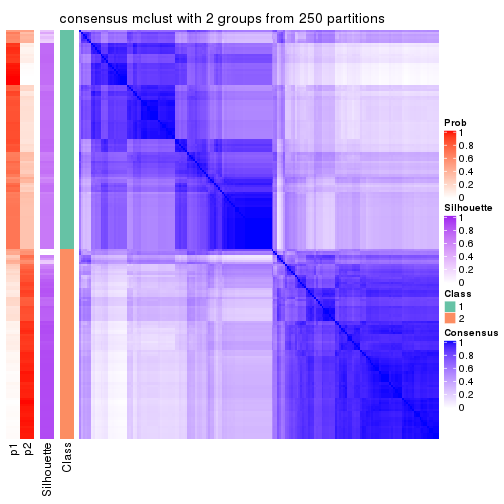</p>

</div>
<div id='tab-CV-mclust-consensus-heatmap-2'>
<pre><code class="r">consensus_heatmap(res, k = 3)
</code></pre>

<p>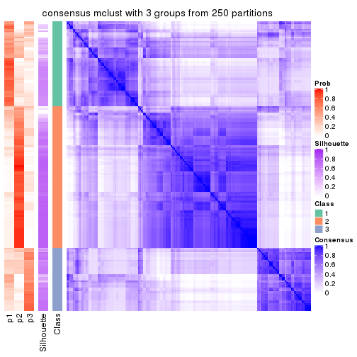</p>

</div>
<div id='tab-CV-mclust-consensus-heatmap-3'>
<pre><code class="r">consensus_heatmap(res, k = 4)
</code></pre>

<p>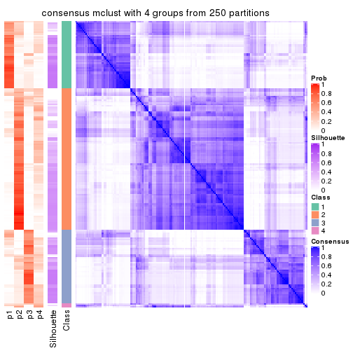</p>

</div>
<div id='tab-CV-mclust-consensus-heatmap-4'>
<pre><code class="r">consensus_heatmap(res, k = 5)
</code></pre>

<p>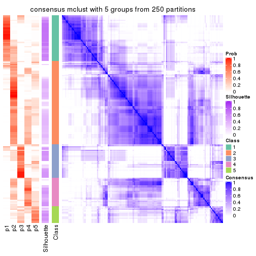</p>

</div>
<div id='tab-CV-mclust-consensus-heatmap-5'>
<pre><code class="r">consensus_heatmap(res, k = 6)
</code></pre>

<p>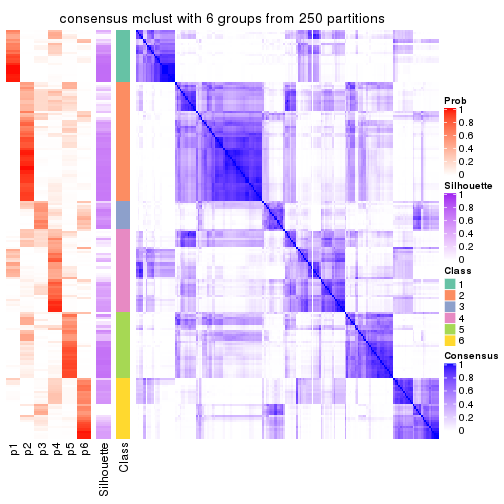</p>

</div>
</div>

Heatmaps for the membership of samples in all partitions to see how consistent they are:


<script>
$( function() {
	$( '#tabs-CV-mclust-membership-heatmap' ).tabs();
} );
</script>
<div id='tabs-CV-mclust-membership-heatmap'>
<ul>
<li><a href='#tab-CV-mclust-membership-heatmap-1'>k = 2</a></li>
<li><a href='#tab-CV-mclust-membership-heatmap-2'>k = 3</a></li>
<li><a href='#tab-CV-mclust-membership-heatmap-3'>k = 4</a></li>
<li><a href='#tab-CV-mclust-membership-heatmap-4'>k = 5</a></li>
<li><a href='#tab-CV-mclust-membership-heatmap-5'>k = 6</a></li>
</ul>
<div id='tab-CV-mclust-membership-heatmap-1'>
<pre><code class="r">membership_heatmap(res, k = 2)
</code></pre>

<p>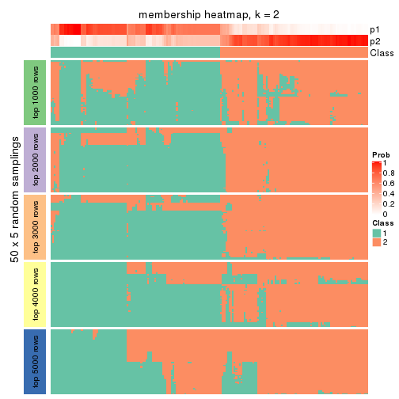</p>

</div>
<div id='tab-CV-mclust-membership-heatmap-2'>
<pre><code class="r">membership_heatmap(res, k = 3)
</code></pre>

<p>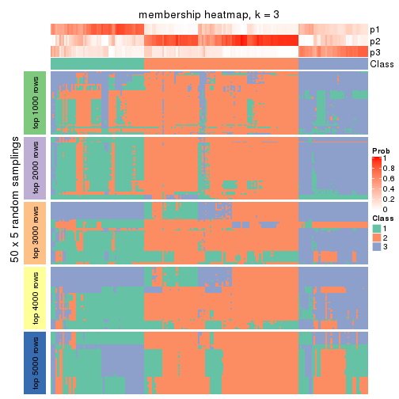</p>

</div>
<div id='tab-CV-mclust-membership-heatmap-3'>
<pre><code class="r">membership_heatmap(res, k = 4)
</code></pre>

<p>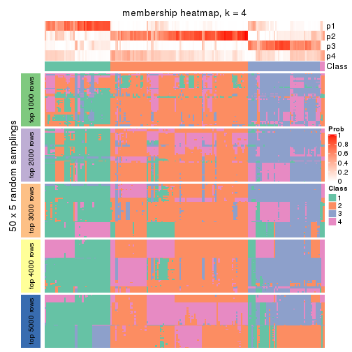</p>

</div>
<div id='tab-CV-mclust-membership-heatmap-4'>
<pre><code class="r">membership_heatmap(res, k = 5)
</code></pre>

<p>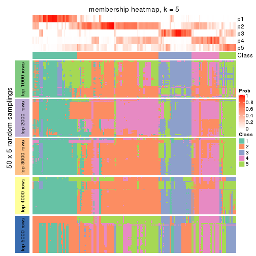</p>

</div>
<div id='tab-CV-mclust-membership-heatmap-5'>
<pre><code class="r">membership_heatmap(res, k = 6)
</code></pre>

<p>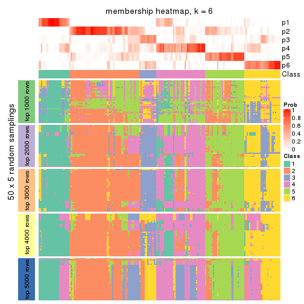</p>

</div>
</div>

As soon as we have had the classes for columns, we can look for signatures
which are significantly different between classes which can be candidate marks
for certain classes. Following are the heatmaps for signatures.


Signature heatmaps where rows are scaled:


<script>
$( function() {
	$( '#tabs-CV-mclust-get-signatures' ).tabs();
} );
</script>
<div id='tabs-CV-mclust-get-signatures'>
<ul>
<li><a href='#tab-CV-mclust-get-signatures-1'>k = 2</a></li>
<li><a href='#tab-CV-mclust-get-signatures-2'>k = 3</a></li>
<li><a href='#tab-CV-mclust-get-signatures-3'>k = 4</a></li>
<li><a href='#tab-CV-mclust-get-signatures-4'>k = 5</a></li>
<li><a href='#tab-CV-mclust-get-signatures-5'>k = 6</a></li>
</ul>
<div id='tab-CV-mclust-get-signatures-1'>
<pre><code class="r">get_signatures(res, k = 2)
</code></pre>

<p>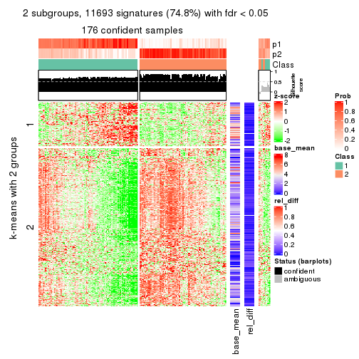</p>

</div>
<div id='tab-CV-mclust-get-signatures-2'>
<pre><code class="r">get_signatures(res, k = 3)
</code></pre>

<p>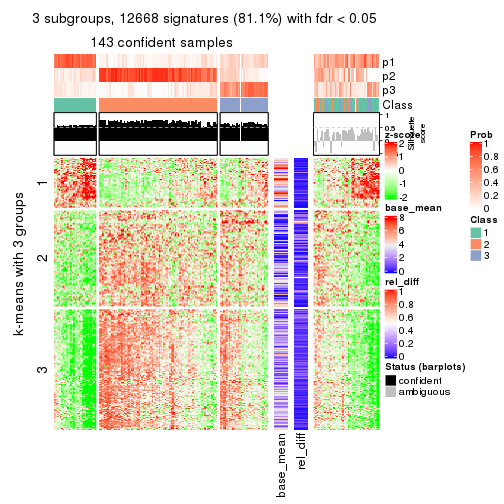</p>

</div>
<div id='tab-CV-mclust-get-signatures-3'>
<pre><code class="r">get_signatures(res, k = 4)
</code></pre>

<p>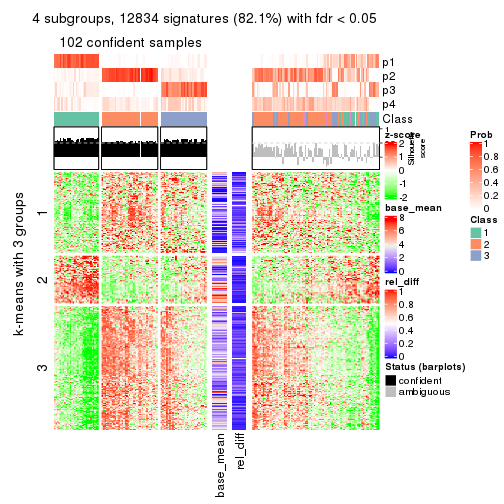</p>

</div>
<div id='tab-CV-mclust-get-signatures-4'>
<pre><code class="r">get_signatures(res, k = 5)
</code></pre>

<p>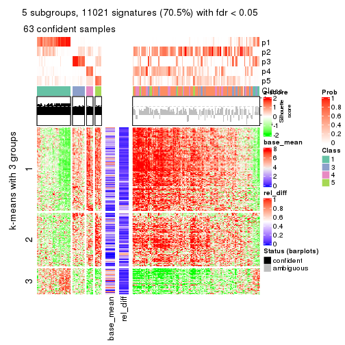</p>

</div>
<div id='tab-CV-mclust-get-signatures-5'>
<pre><code class="r">get_signatures(res, k = 6)
</code></pre>

<p>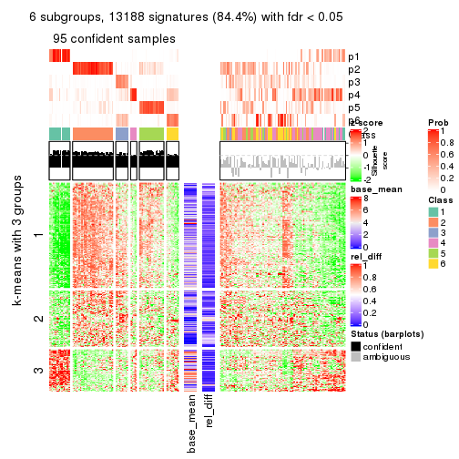</p>

</div>
</div>


Signature heatmaps where rows are not scaled:


<script>
$( function() {
	$( '#tabs-CV-mclust-get-signatures-no-scale' ).tabs();
} );
</script>
<div id='tabs-CV-mclust-get-signatures-no-scale'>
<ul>
<li><a href='#tab-CV-mclust-get-signatures-no-scale-1'>k = 2</a></li>
<li><a href='#tab-CV-mclust-get-signatures-no-scale-2'>k = 3</a></li>
<li><a href='#tab-CV-mclust-get-signatures-no-scale-3'>k = 4</a></li>
<li><a href='#tab-CV-mclust-get-signatures-no-scale-4'>k = 5</a></li>
<li><a href='#tab-CV-mclust-get-signatures-no-scale-5'>k = 6</a></li>
</ul>
<div id='tab-CV-mclust-get-signatures-no-scale-1'>
<pre><code class="r">get_signatures(res, k = 2, scale_rows = FALSE)
</code></pre>

<p>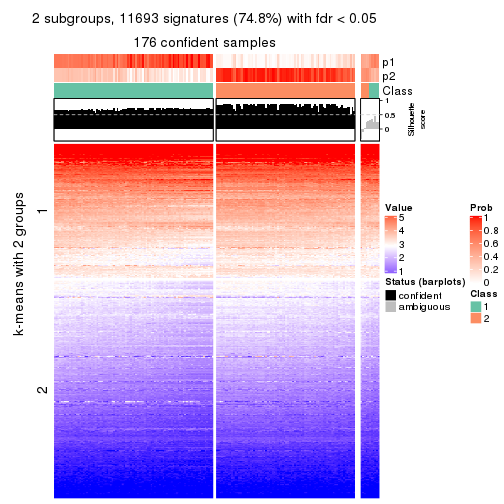</p>

</div>
<div id='tab-CV-mclust-get-signatures-no-scale-2'>
<pre><code class="r">get_signatures(res, k = 3, scale_rows = FALSE)
</code></pre>

<p>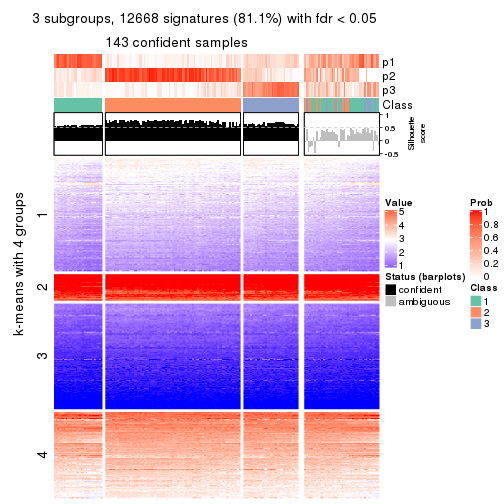</p>

</div>
<div id='tab-CV-mclust-get-signatures-no-scale-3'>
<pre><code class="r">get_signatures(res, k = 4, scale_rows = FALSE)
</code></pre>

<p>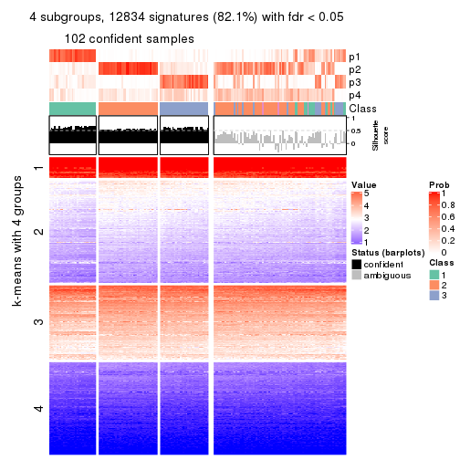</p>

</div>
<div id='tab-CV-mclust-get-signatures-no-scale-4'>
<pre><code class="r">get_signatures(res, k = 5, scale_rows = FALSE)
</code></pre>

<p>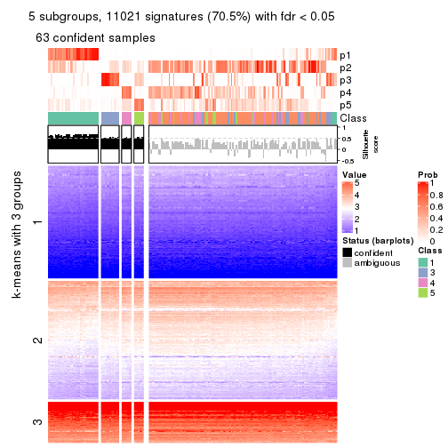</p>

</div>
<div id='tab-CV-mclust-get-signatures-no-scale-5'>
<pre><code class="r">get_signatures(res, k = 6, scale_rows = FALSE)
</code></pre>

<p>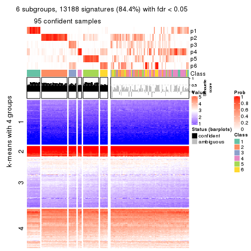</p>

</div>
</div>


Compare the overlap of signatures from different k:

```r
compare_signatures(res)
```

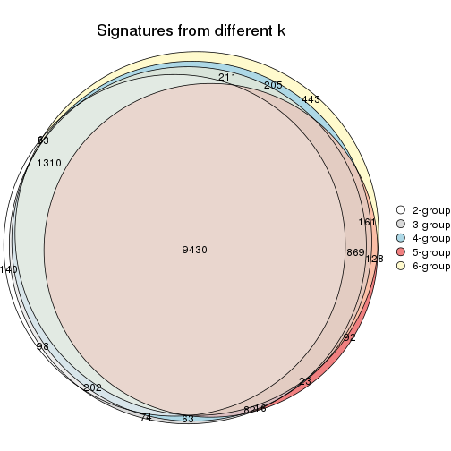

`get_signature()` returns a data frame invisibly. TO get the list of signatures, the function
call should be assigned to a variable explicitly. In following code, if `plot` argument is set
to `FALSE`, no heatmap is plotted while only the differential analysis is performed.

```r
# code only for demonstration
tb = get_signature(res, k = ..., plot = FALSE)
```

An example of the output of `tb` is:

```
#>   which_row         fdr    mean_1    mean_2 scaled_mean_1 scaled_mean_2 km
#> 1        38 0.042760348  8.373488  9.131774    -0.5533452     0.5164555  1
#> 2        40 0.018707592  7.106213  8.469186    -0.6173731     0.5762149  1
#> 3        55 0.019134737 10.221463 11.207825    -0.6159697     0.5749050  1
#> 4        59 0.006059896  5.921854  7.869574    -0.6899429     0.6439467  1
#> 5        60 0.018055526  8.928898 10.211722    -0.6204761     0.5791110  1
#> 6        98 0.009384629 15.714769 14.887706     0.6635654    -0.6193277  2
...
```

The columns in `tb` are:

1. `which_row`: row indices corresponding to the input matrix.
2. `fdr`: FDR for the differential test. 
3. `mean_x`: The mean value in group x.
4. `scaled_mean_x`: The mean value in group x after rows are scaled.
5. `km`: Row groups if k-means clustering is applied to rows.


UMAP plot which shows how samples are separated.


<script>
$( function() {
	$( '#tabs-CV-mclust-dimension-reduction' ).tabs();
} );
</script>
<div id='tabs-CV-mclust-dimension-reduction'>
<ul>
<li><a href='#tab-CV-mclust-dimension-reduction-1'>k = 2</a></li>
<li><a href='#tab-CV-mclust-dimension-reduction-2'>k = 3</a></li>
<li><a href='#tab-CV-mclust-dimension-reduction-3'>k = 4</a></li>
<li><a href='#tab-CV-mclust-dimension-reduction-4'>k = 5</a></li>
<li><a href='#tab-CV-mclust-dimension-reduction-5'>k = 6</a></li>
</ul>
<div id='tab-CV-mclust-dimension-reduction-1'>
<pre><code class="r">dimension_reduction(res, k = 2, method = &quot;UMAP&quot;)
</code></pre>

<p>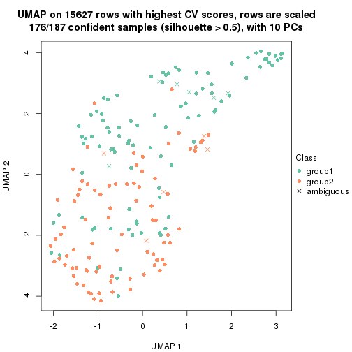</p>

</div>
<div id='tab-CV-mclust-dimension-reduction-2'>
<pre><code class="r">dimension_reduction(res, k = 3, method = &quot;UMAP&quot;)
</code></pre>

<p>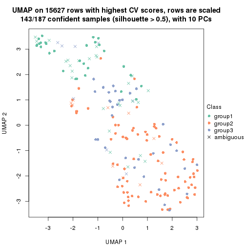</p>

</div>
<div id='tab-CV-mclust-dimension-reduction-3'>
<pre><code class="r">dimension_reduction(res, k = 4, method = &quot;UMAP&quot;)
</code></pre>

<p>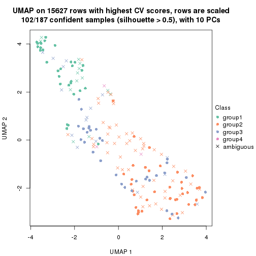</p>

</div>
<div id='tab-CV-mclust-dimension-reduction-4'>
<pre><code class="r">dimension_reduction(res, k = 5, method = &quot;UMAP&quot;)
</code></pre>

<p>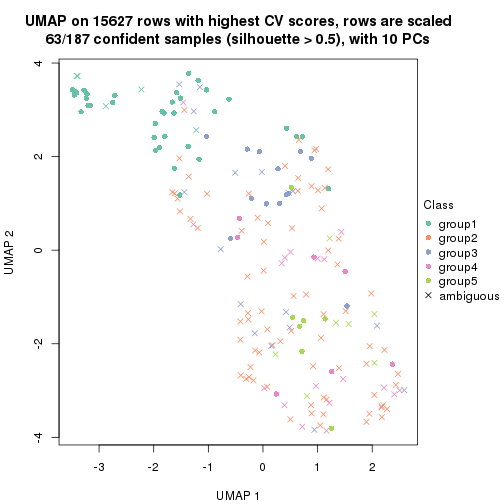</p>

</div>
<div id='tab-CV-mclust-dimension-reduction-5'>
<pre><code class="r">dimension_reduction(res, k = 6, method = &quot;UMAP&quot;)
</code></pre>

<p>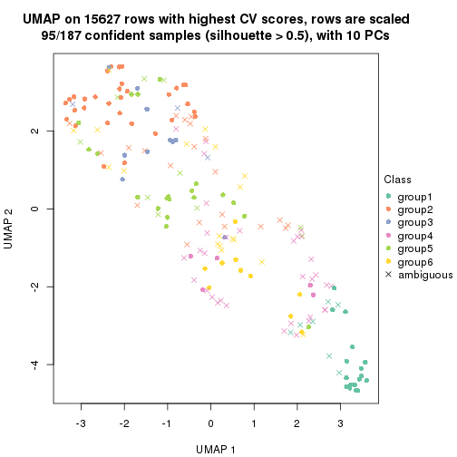</p>

</div>
</div>


Following heatmap shows how subgroups are split when increasing `k`:

```r
collect_classes(res)
```

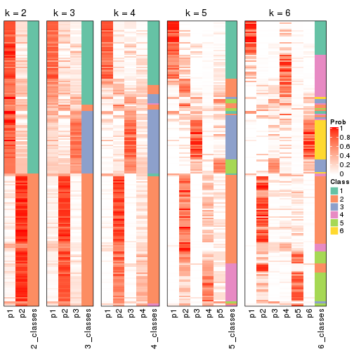


If matrix rows can be associated to genes, consider to use `GO_Enrichment(res,
...)` to perform function enrichment for the signature genes.


 

---------------------------------------------------


### CV:NMF*


The object with results only for a single top-value method and a single partition method 
can be extracted as:

```r
res = res_list["CV", "NMF"]
# you can also extract it by
# res = res_list["CV:NMF"]
```

A summary of `res` and all the functions that can be applied to it:

```r
res
```

```
#> A 'ConsensusPartition' object with k = 2, 3, 4, 5, 6.
#>   On a matrix with 15627 rows and 187 columns.
#>   Top rows (1000, 2000, 3000, 4000, 5000) are extracted by 'CV' method.
#>   Subgroups are detected by 'NMF' method.
#>   Performed in total 1250 partitions by row resampling.
#>   Best k for subgroups seems to be 2.
#> 
#> Following methods can be applied to this 'ConsensusPartition' object:
#>  [1] "cola_report"             "collect_classes"         "collect_plots"          
#>  [4] "collect_stats"           "colnames"                "compare_signatures"     
#>  [7] "consensus_heatmap"       "dimension_reduction"     "functional_enrichment"  
#> [10] "get_anno_col"            "get_anno"                "get_classes"            
#> [13] "get_consensus"           "get_matrix"              "get_membership"         
#> [16] "get_param"               "get_signatures"          "get_stats"              
#> [19] "is_best_k"               "is_stable_k"             "membership_heatmap"     
#> [22] "ncol"                    "nrow"                    "plot_ecdf"              
#> [25] "rownames"                "select_partition_number" "show"                   
#> [28] "suggest_best_k"          "test_to_known_factors"
```

`collect_plots()` function collects all the plots made from `res` for all `k` (number of partitions)
into one single page to provide an easy and fast comparison between different `k`.

```r
collect_plots(res)
```

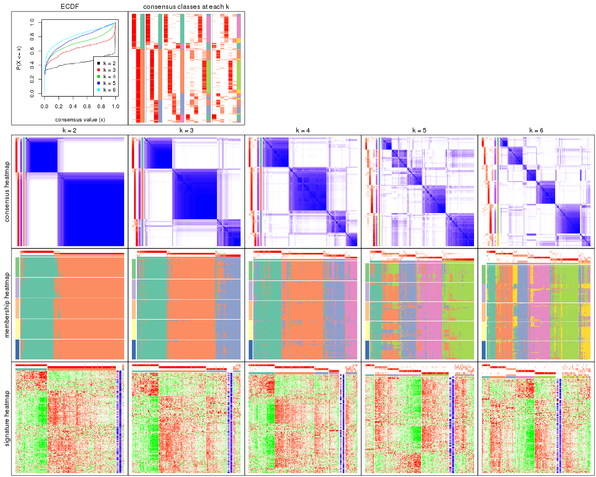

The plots are:

- The first row: a plot of the ECDF (Empirical cumulative distribution
  function) curves of the consensus matrix for each `k` and the heatmap of
  predicted classes for each `k`.
- The second row: heatmaps of the consensus matrix for each `k`.
- The third row: heatmaps of the membership matrix for each `k`.
- The fouth row: heatmaps of the signatures for each `k`.

All the plots in panels can be made by individual functions and they are
plotted later in this section.

`select_partition_number()` produces several plots showing different
statistics for choosing "optimized" `k`. There are following statistics:

- ECDF curves of the consensus matrix for each `k`;
- 1-PAC. [The PAC
  score](https://en.wikipedia.org/wiki/Consensus_clustering#Over-interpretation_potential_of_consensus_clustering)
  measures the proportion of the ambiguous subgrouping.
- Mean silhouette score.
- Concordance. The mean probability of fiting the consensus class ids in all
  partitions.
- Area increased. Denote $A_k$ as the area under the ECDF curve for current
  `k`, the area increased is defined as $A_k - A_{k-1}$.
- Rand index. The percent of pairs of samples that are both in a same cluster
  or both are not in a same cluster in the partition of k and k-1.
- Jaccard index. The ratio of pairs of samples are both in a same cluster in
  the partition of k and k-1 and the pairs of samples are both in a same
  cluster in the partition k or k-1.

The detailed explanations of these statistics can be found in [the cola
vignette](http://bioconductor.org/packages/devel/bioc/vignettes/cola/inst/doc/cola.html#toc_13).

Generally speaking, lower PAC score, higher mean silhouette score or higher
concordance corresponds to better partition. Rand index and Jaccard index
measure how similar the current partition is compared to partition with `k-1`.
If they are too similar, we won't accept `k` is better than `k-1`.

```r
select_partition_number(res)
```

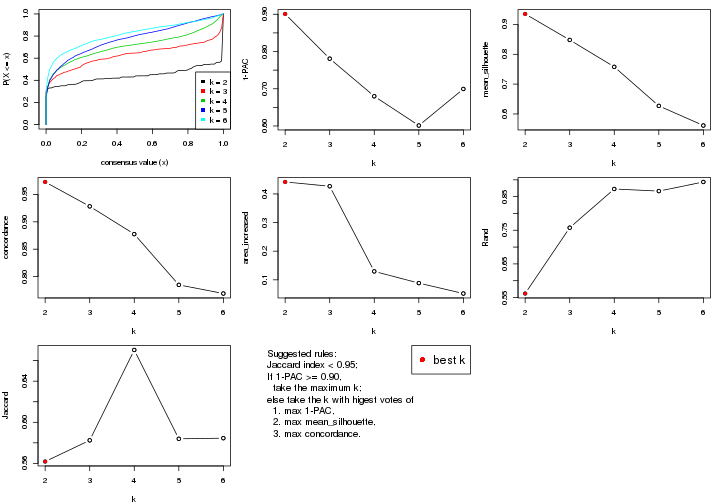

The numeric values for all these statistics can be obtained by `get_stats()`.

```r
get_stats(res)
```

```
#>   k 1-PAC mean_silhouette concordance area_increased  Rand Jaccard
#> 2 2 0.901           0.935       0.973         0.4418 0.562   0.562
#> 3 3 0.781           0.848       0.928         0.4268 0.758   0.582
#> 4 4 0.680           0.758       0.878         0.1294 0.873   0.670
#> 5 5 0.601           0.627       0.785         0.0885 0.866   0.584
#> 6 6 0.699           0.561       0.769         0.0521 0.894   0.585
```

`suggest_best_k()` suggests the best $k$ based on these statistics. The rules are as follows:

- All $k$ with Jaccard index larger than 0.95 are removed because the increase of
  the partition number does not provides enough extra information. If all $k$ are removed,
  the best $k$ is assigned by `NA`.
- For $k$ with 1-PAC larger than 0.9, the maximal $k$ is taken as the "best k". Other $k$ is called "optional k".
- If it does not fit the second rule. The $k$ with the highest vote of highest
  1-PAC, mean silhouette and concordance is taken as the "best k".

```r
suggest_best_k(res)
```

```
#> [1] 2
```


Following shows the table of the partitions (You need to click the **show/hide
code output** link to see it). The membership matrix (columns with name `p*`)
is inferred by
[`clue::cl_consensus()`](https://www.rdocumentation.org/link/cl_consensus?package=clue)
function with the `SE` method. Basically the value in the membership matrix
represents the probability to belong to a certain group. The finall class
label for an item is determined with the group with highest probability it
belongs to.

In `get_classes()` function, the entropy is calculated from the membership
matrix and the silhouette score is calculated from the consensus matrix.


<script>
$( function() {
	$( '#tabs-CV-NMF-get-classes' ).tabs();
} );
</script>
<div id='tabs-CV-NMF-get-classes'>
<ul>
<li><a href='#tab-CV-NMF-get-classes-1'>k = 2</a></li>
<li><a href='#tab-CV-NMF-get-classes-2'>k = 3</a></li>
<li><a href='#tab-CV-NMF-get-classes-3'>k = 4</a></li>
<li><a href='#tab-CV-NMF-get-classes-4'>k = 5</a></li>
<li><a href='#tab-CV-NMF-get-classes-5'>k = 6</a></li>
</ul>

<div id='tab-CV-NMF-get-classes-1'>
<p><a id='tab-CV-NMF-get-classes-1-a' style='color:#0366d6' href='#'>show/hide code output</a></p>
<pre><code class="r">cbind(get_classes(res, k = 2), get_membership(res, k = 2))
</code></pre>

<pre><code>#&gt;            class entropy silhouette    p1    p2
#&gt; SRR1747213     1  0.0000     0.9640 1.000 0.000
#&gt; SRR1747214     1  0.0000     0.9640 1.000 0.000
#&gt; SRR1747215     2  0.0000     0.9748 0.000 1.000
#&gt; SRR1747216     2  0.0000     0.9748 0.000 1.000
#&gt; SRR1747217     2  0.0000     0.9748 0.000 1.000
#&gt; SRR1747218     2  0.0000     0.9748 0.000 1.000
#&gt; SRR1747219     1  0.0376     0.9611 0.996 0.004
#&gt; SRR1747220     1  0.0000     0.9640 1.000 0.000
#&gt; SRR1747221     1  0.0000     0.9640 1.000 0.000
#&gt; SRR1747222     1  0.7056     0.7616 0.808 0.192
#&gt; SRR1747223     1  0.0000     0.9640 1.000 0.000
#&gt; SRR1747224     2  0.0000     0.9748 0.000 1.000
#&gt; SRR1747225     2  0.0000     0.9748 0.000 1.000
#&gt; SRR1747226     2  0.0000     0.9748 0.000 1.000
#&gt; SRR1747227     2  0.0000     0.9748 0.000 1.000
#&gt; SRR1747228     2  0.0000     0.9748 0.000 1.000
#&gt; SRR1747229     2  0.0000     0.9748 0.000 1.000
#&gt; SRR1747230     1  0.0000     0.9640 1.000 0.000
#&gt; SRR1747231     1  0.0000     0.9640 1.000 0.000
#&gt; SRR1747232     1  0.0000     0.9640 1.000 0.000
#&gt; SRR1747233     1  0.7453     0.7357 0.788 0.212
#&gt; SRR1747234     2  0.0000     0.9748 0.000 1.000
#&gt; SRR1747235     1  0.0000     0.9640 1.000 0.000
#&gt; SRR1747236     2  0.0000     0.9748 0.000 1.000
#&gt; SRR1747237     2  0.0000     0.9748 0.000 1.000
#&gt; SRR1747238     2  0.0000     0.9748 0.000 1.000
#&gt; SRR1747239     2  0.0000     0.9748 0.000 1.000
#&gt; SRR1747240     1  0.0000     0.9640 1.000 0.000
#&gt; SRR1747241     2  0.0000     0.9748 0.000 1.000
#&gt; SRR1747242     1  0.0000     0.9640 1.000 0.000
#&gt; SRR1747243     2  0.0938     0.9653 0.012 0.988
#&gt; SRR1747244     2  0.0000     0.9748 0.000 1.000
#&gt; SRR1747245     2  0.0000     0.9748 0.000 1.000
#&gt; SRR1747246     2  0.0000     0.9748 0.000 1.000
#&gt; SRR1747247     1  0.0000     0.9640 1.000 0.000
#&gt; SRR1747248     1  0.0000     0.9640 1.000 0.000
#&gt; SRR1747249     1  0.0376     0.9611 0.996 0.004
#&gt; SRR1747250     2  0.0000     0.9748 0.000 1.000
#&gt; SRR1747252     1  0.0000     0.9640 1.000 0.000
#&gt; SRR1747253     1  0.0000     0.9640 1.000 0.000
#&gt; SRR1747254     2  0.0000     0.9748 0.000 1.000
#&gt; SRR1747255     1  0.0000     0.9640 1.000 0.000
#&gt; SRR1747256     1  0.0000     0.9640 1.000 0.000
#&gt; SRR1747257     2  0.0000     0.9748 0.000 1.000
#&gt; SRR1747258     2  0.0000     0.9748 0.000 1.000
#&gt; SRR1747259     2  0.0000     0.9748 0.000 1.000
#&gt; SRR1747260     2  0.0000     0.9748 0.000 1.000
#&gt; SRR1747261     2  0.0000     0.9748 0.000 1.000
#&gt; SRR1747262     2  0.0000     0.9748 0.000 1.000
#&gt; SRR1747263     2  0.0000     0.9748 0.000 1.000
#&gt; SRR1747264     1  0.0000     0.9640 1.000 0.000
#&gt; SRR1747265     2  0.9815     0.2663 0.420 0.580
#&gt; SRR1747266     2  0.2603     0.9357 0.044 0.956
#&gt; SRR1747267     2  0.6531     0.7988 0.168 0.832
#&gt; SRR1747268     2  0.0672     0.9686 0.008 0.992
#&gt; SRR1747269     2  0.0000     0.9748 0.000 1.000
#&gt; SRR1747270     2  0.0000     0.9748 0.000 1.000
#&gt; SRR1747271     2  0.0000     0.9748 0.000 1.000
#&gt; SRR1747272     2  0.0000     0.9748 0.000 1.000
#&gt; SRR1747273     1  0.0000     0.9640 1.000 0.000
#&gt; SRR1747274     2  0.6343     0.8065 0.160 0.840
#&gt; SRR1747275     1  0.0000     0.9640 1.000 0.000
#&gt; SRR1747276     1  0.2236     0.9349 0.964 0.036
#&gt; SRR1747277     2  0.0000     0.9748 0.000 1.000
#&gt; SRR1747278     2  0.0376     0.9717 0.004 0.996
#&gt; SRR1747280     1  0.0000     0.9640 1.000 0.000
#&gt; SRR1747279     1  0.0000     0.9640 1.000 0.000
#&gt; SRR1747281     2  0.0000     0.9748 0.000 1.000
#&gt; SRR1747282     1  0.0000     0.9640 1.000 0.000
#&gt; SRR1747283     2  0.6623     0.7881 0.172 0.828
#&gt; SRR1747284     1  0.0000     0.9640 1.000 0.000
#&gt; SRR1747285     2  0.0000     0.9748 0.000 1.000
#&gt; SRR1747286     2  0.0000     0.9748 0.000 1.000
#&gt; SRR1747287     2  0.0000     0.9748 0.000 1.000
#&gt; SRR1747288     2  0.8267     0.6438 0.260 0.740
#&gt; SRR1747290     2  0.0000     0.9748 0.000 1.000
#&gt; SRR1747289     2  0.0000     0.9748 0.000 1.000
#&gt; SRR1747291     2  0.0000     0.9748 0.000 1.000
#&gt; SRR1747293     2  0.0000     0.9748 0.000 1.000
#&gt; SRR1747294     2  0.0000     0.9748 0.000 1.000
#&gt; SRR1747292     1  0.0672     0.9580 0.992 0.008
#&gt; SRR1747295     2  0.0000     0.9748 0.000 1.000
#&gt; SRR1747296     2  0.0000     0.9748 0.000 1.000
#&gt; SRR1747297     2  0.0000     0.9748 0.000 1.000
#&gt; SRR1747298     2  0.0000     0.9748 0.000 1.000
#&gt; SRR1747299     2  0.0000     0.9748 0.000 1.000
#&gt; SRR1747300     2  0.0000     0.9748 0.000 1.000
#&gt; SRR1747301     2  0.0000     0.9748 0.000 1.000
#&gt; SRR1747302     2  0.0000     0.9748 0.000 1.000
#&gt; SRR1747303     2  0.0000     0.9748 0.000 1.000
#&gt; SRR1747304     1  0.0000     0.9640 1.000 0.000
#&gt; SRR1747305     2  0.0000     0.9748 0.000 1.000
#&gt; SRR1747306     2  0.0000     0.9748 0.000 1.000
#&gt; SRR1747307     1  0.0000     0.9640 1.000 0.000
#&gt; SRR1747308     2  0.0000     0.9748 0.000 1.000
#&gt; SRR1747309     1  0.0000     0.9640 1.000 0.000
#&gt; SRR1747310     1  0.0000     0.9640 1.000 0.000
#&gt; SRR1747311     1  0.0000     0.9640 1.000 0.000
#&gt; SRR1747313     2  0.0000     0.9748 0.000 1.000
#&gt; SRR1747312     1  0.0000     0.9640 1.000 0.000
#&gt; SRR1747314     1  0.0000     0.9640 1.000 0.000
#&gt; SRR1747315     2  0.0000     0.9748 0.000 1.000
#&gt; SRR1747316     2  0.0000     0.9748 0.000 1.000
#&gt; SRR1747318     2  0.0000     0.9748 0.000 1.000
#&gt; SRR1747317     2  0.0000     0.9748 0.000 1.000
#&gt; SRR1747319     2  0.0000     0.9748 0.000 1.000
#&gt; SRR1747320     1  0.8555     0.6237 0.720 0.280
#&gt; SRR1747322     1  0.0000     0.9640 1.000 0.000
#&gt; SRR1747321     1  0.0000     0.9640 1.000 0.000
#&gt; SRR1747323     2  0.0000     0.9748 0.000 1.000
#&gt; SRR1747324     2  0.0000     0.9748 0.000 1.000
#&gt; SRR1747326     2  0.0000     0.9748 0.000 1.000
#&gt; SRR1747325     2  0.0000     0.9748 0.000 1.000
#&gt; SRR1747327     2  0.0000     0.9748 0.000 1.000
#&gt; SRR1747328     2  0.9129     0.5242 0.328 0.672
#&gt; SRR1747330     2  0.0000     0.9748 0.000 1.000
#&gt; SRR1747329     2  0.0000     0.9748 0.000 1.000
#&gt; SRR1747332     1  0.0000     0.9640 1.000 0.000
#&gt; SRR1747331     2  0.9522     0.4210 0.372 0.628
#&gt; SRR1747333     2  0.0000     0.9748 0.000 1.000
#&gt; SRR1747334     2  0.0000     0.9748 0.000 1.000
#&gt; SRR1747335     1  0.5178     0.8529 0.884 0.116
#&gt; SRR1747336     1  0.0000     0.9640 1.000 0.000
#&gt; SRR1747337     2  0.0000     0.9748 0.000 1.000
#&gt; SRR1747338     2  0.0000     0.9748 0.000 1.000
#&gt; SRR1747339     2  0.0938     0.9652 0.012 0.988
#&gt; SRR1747340     2  0.0000     0.9748 0.000 1.000
#&gt; SRR1747341     2  0.0000     0.9748 0.000 1.000
#&gt; SRR1747342     2  0.0000     0.9748 0.000 1.000
#&gt; SRR1747343     2  0.0000     0.9748 0.000 1.000
#&gt; SRR1747344     2  0.0000     0.9748 0.000 1.000
#&gt; SRR1747345     2  0.5178     0.8615 0.116 0.884
#&gt; SRR1747346     2  0.0000     0.9748 0.000 1.000
#&gt; SRR1747347     2  0.0000     0.9748 0.000 1.000
#&gt; SRR1747348     1  0.0000     0.9640 1.000 0.000
#&gt; SRR1747349     1  0.0000     0.9640 1.000 0.000
#&gt; SRR1747351     2  0.0000     0.9748 0.000 1.000
#&gt; SRR1747350     2  0.0672     0.9685 0.008 0.992
#&gt; SRR1747352     1  0.0000     0.9640 1.000 0.000
#&gt; SRR1747353     2  0.0000     0.9748 0.000 1.000
#&gt; SRR1747354     2  0.0000     0.9748 0.000 1.000
#&gt; SRR1747355     1  0.0000     0.9640 1.000 0.000
#&gt; SRR1747356     2  0.8327     0.6504 0.264 0.736
#&gt; SRR1747357     2  0.8443     0.6360 0.272 0.728
#&gt; SRR1747358     2  0.6623     0.7922 0.172 0.828
#&gt; SRR1747359     1  0.0000     0.9640 1.000 0.000
#&gt; SRR1747360     2  0.0000     0.9748 0.000 1.000
#&gt; SRR1747361     1  0.9795     0.2739 0.584 0.416
#&gt; SRR1747362     2  0.0000     0.9748 0.000 1.000
#&gt; SRR1747363     2  0.0000     0.9748 0.000 1.000
#&gt; SRR1747364     1  0.4022     0.8935 0.920 0.080
#&gt; SRR1747365     2  0.0000     0.9748 0.000 1.000
#&gt; SRR1747366     2  0.0000     0.9748 0.000 1.000
#&gt; SRR1747367     2  0.0376     0.9717 0.004 0.996
#&gt; SRR1747369     2  0.0000     0.9748 0.000 1.000
#&gt; SRR1747368     2  0.0000     0.9748 0.000 1.000
#&gt; SRR1747370     2  0.0000     0.9748 0.000 1.000
#&gt; SRR1747372     1  0.0000     0.9640 1.000 0.000
#&gt; SRR1747371     1  0.0000     0.9640 1.000 0.000
#&gt; SRR1747373     2  0.0000     0.9748 0.000 1.000
#&gt; SRR1747374     2  0.0000     0.9748 0.000 1.000
#&gt; SRR1747375     1  0.6887     0.7680 0.816 0.184
#&gt; SRR1747376     2  0.0000     0.9748 0.000 1.000
#&gt; SRR1747377     2  0.0000     0.9748 0.000 1.000
#&gt; SRR1747378     2  0.0000     0.9748 0.000 1.000
#&gt; SRR1747379     2  0.0000     0.9748 0.000 1.000
#&gt; SRR1747380     2  0.0000     0.9748 0.000 1.000
#&gt; SRR1747381     1  0.0000     0.9640 1.000 0.000
#&gt; SRR1747382     1  0.0000     0.9640 1.000 0.000
#&gt; SRR1747383     2  0.0000     0.9748 0.000 1.000
#&gt; SRR1747384     1  1.0000    -0.0252 0.500 0.500
#&gt; SRR1747385     2  0.0672     0.9685 0.008 0.992
#&gt; SRR1747386     1  0.0000     0.9640 1.000 0.000
#&gt; SRR1747387     2  0.0000     0.9748 0.000 1.000
#&gt; SRR1747388     2  0.0000     0.9748 0.000 1.000
#&gt; SRR1747390     2  0.0000     0.9748 0.000 1.000
#&gt; SRR1747389     2  0.0000     0.9748 0.000 1.000
#&gt; SRR1747391     2  0.0000     0.9748 0.000 1.000
#&gt; SRR1747392     2  0.0000     0.9748 0.000 1.000
#&gt; SRR1747393     2  0.7139     0.7566 0.196 0.804
#&gt; SRR1747394     1  0.0000     0.9640 1.000 0.000
#&gt; SRR1747395     2  0.0000     0.9748 0.000 1.000
#&gt; SRR1747396     2  0.0000     0.9748 0.000 1.000
#&gt; SRR1747398     2  0.0000     0.9748 0.000 1.000
#&gt; SRR1747397     2  0.2603     0.9359 0.044 0.956
#&gt; SRR1747399     1  0.0000     0.9640 1.000 0.000
#&gt; SRR1747400     1  0.0000     0.9640 1.000 0.000
</code></pre>

<script>
$('#tab-CV-NMF-get-classes-1-a').parent().next().next().hide();
$('#tab-CV-NMF-get-classes-1-a').click(function(){
  $('#tab-CV-NMF-get-classes-1-a').parent().next().next().toggle();
  return(false);
});
</script>
</div>

<div id='tab-CV-NMF-get-classes-2'>
<p><a id='tab-CV-NMF-get-classes-2-a' style='color:#0366d6' href='#'>show/hide code output</a></p>
<pre><code class="r">cbind(get_classes(res, k = 3), get_membership(res, k = 3))
</code></pre>

<pre><code>#&gt;            class entropy silhouette    p1    p2    p3
#&gt; SRR1747213     1  0.0000      0.916 1.000 0.000 0.000
#&gt; SRR1747214     3  0.1289      0.805 0.032 0.000 0.968
#&gt; SRR1747215     2  0.0000      0.964 0.000 1.000 0.000
#&gt; SRR1747216     2  0.0000      0.964 0.000 1.000 0.000
#&gt; SRR1747217     2  0.0592      0.958 0.000 0.988 0.012
#&gt; SRR1747218     2  0.0424      0.961 0.000 0.992 0.008
#&gt; SRR1747219     3  0.6260      0.140 0.448 0.000 0.552
#&gt; SRR1747220     1  0.6291      0.209 0.532 0.000 0.468
#&gt; SRR1747221     1  0.4399      0.724 0.812 0.188 0.000
#&gt; SRR1747222     3  0.0237      0.820 0.004 0.000 0.996
#&gt; SRR1747223     1  0.1964      0.876 0.944 0.056 0.000
#&gt; SRR1747224     2  0.0000      0.964 0.000 1.000 0.000
#&gt; SRR1747225     2  0.0000      0.964 0.000 1.000 0.000
#&gt; SRR1747226     2  0.0000      0.964 0.000 1.000 0.000
#&gt; SRR1747227     2  0.0000      0.964 0.000 1.000 0.000
#&gt; SRR1747228     2  0.0237      0.962 0.004 0.996 0.000
#&gt; SRR1747229     2  0.1860      0.926 0.000 0.948 0.052
#&gt; SRR1747230     1  0.0000      0.916 1.000 0.000 0.000
#&gt; SRR1747231     1  0.0000      0.916 1.000 0.000 0.000
#&gt; SRR1747232     1  0.0000      0.916 1.000 0.000 0.000
#&gt; SRR1747233     1  0.4555      0.699 0.800 0.200 0.000
#&gt; SRR1747234     3  0.0000      0.822 0.000 0.000 1.000
#&gt; SRR1747235     1  0.0000      0.916 1.000 0.000 0.000
#&gt; SRR1747236     3  0.6154      0.457 0.000 0.408 0.592
#&gt; SRR1747237     3  0.1289      0.828 0.000 0.032 0.968
#&gt; SRR1747238     3  0.2796      0.814 0.000 0.092 0.908
#&gt; SRR1747239     2  0.0000      0.964 0.000 1.000 0.000
#&gt; SRR1747240     1  0.0000      0.916 1.000 0.000 0.000
#&gt; SRR1747241     3  0.4654      0.757 0.000 0.208 0.792
#&gt; SRR1747242     1  0.0000      0.916 1.000 0.000 0.000
#&gt; SRR1747243     2  0.0592      0.956 0.012 0.988 0.000
#&gt; SRR1747244     2  0.0000      0.964 0.000 1.000 0.000
#&gt; SRR1747245     2  0.0000      0.964 0.000 1.000 0.000
#&gt; SRR1747246     2  0.0000      0.964 0.000 1.000 0.000
#&gt; SRR1747247     1  0.1163      0.901 0.972 0.000 0.028
#&gt; SRR1747248     1  0.0000      0.916 1.000 0.000 0.000
#&gt; SRR1747249     1  0.0237      0.914 0.996 0.004 0.000
#&gt; SRR1747250     3  0.0892      0.827 0.000 0.020 0.980
#&gt; SRR1747252     1  0.5138      0.668 0.748 0.000 0.252
#&gt; SRR1747253     3  0.0000      0.822 0.000 0.000 1.000
#&gt; SRR1747254     3  0.1964      0.825 0.000 0.056 0.944
#&gt; SRR1747255     1  0.0237      0.914 0.996 0.004 0.000
#&gt; SRR1747256     1  0.0000      0.916 1.000 0.000 0.000
#&gt; SRR1747257     2  0.1411      0.941 0.000 0.964 0.036
#&gt; SRR1747258     2  0.1031      0.950 0.000 0.976 0.024
#&gt; SRR1747259     3  0.2537      0.818 0.000 0.080 0.920
#&gt; SRR1747260     3  0.3941      0.785 0.000 0.156 0.844
#&gt; SRR1747261     2  0.0000      0.964 0.000 1.000 0.000
#&gt; SRR1747262     2  0.0000      0.964 0.000 1.000 0.000
#&gt; SRR1747263     2  0.0237      0.962 0.000 0.996 0.004
#&gt; SRR1747264     1  0.0000      0.916 1.000 0.000 0.000
#&gt; SRR1747265     3  0.8620      0.384 0.352 0.112 0.536
#&gt; SRR1747266     2  0.0747      0.953 0.016 0.984 0.000
#&gt; SRR1747267     2  0.5502      0.645 0.248 0.744 0.008
#&gt; SRR1747268     2  0.0424      0.959 0.008 0.992 0.000
#&gt; SRR1747269     3  0.6026      0.509 0.000 0.376 0.624
#&gt; SRR1747270     3  0.5465      0.636 0.000 0.288 0.712
#&gt; SRR1747271     3  0.6192      0.421 0.000 0.420 0.580
#&gt; SRR1747272     3  0.0000      0.822 0.000 0.000 1.000
#&gt; SRR1747273     1  0.1860      0.880 0.948 0.000 0.052
#&gt; SRR1747274     2  0.2878      0.866 0.096 0.904 0.000
#&gt; SRR1747275     1  0.0592      0.910 0.988 0.012 0.000
#&gt; SRR1747276     1  0.3482      0.799 0.872 0.128 0.000
#&gt; SRR1747277     2  0.1753      0.930 0.000 0.952 0.048
#&gt; SRR1747278     2  0.0237      0.962 0.004 0.996 0.000
#&gt; SRR1747280     1  0.0000      0.916 1.000 0.000 0.000
#&gt; SRR1747279     1  0.0000      0.916 1.000 0.000 0.000
#&gt; SRR1747281     2  0.0000      0.964 0.000 1.000 0.000
#&gt; SRR1747282     1  0.0000      0.916 1.000 0.000 0.000
#&gt; SRR1747283     3  0.9346      0.496 0.224 0.260 0.516
#&gt; SRR1747284     1  0.0000      0.916 1.000 0.000 0.000
#&gt; SRR1747285     3  0.1411      0.828 0.000 0.036 0.964
#&gt; SRR1747286     3  0.1411      0.828 0.000 0.036 0.964
#&gt; SRR1747287     2  0.1031      0.950 0.000 0.976 0.024
#&gt; SRR1747288     1  0.8375      0.298 0.540 0.368 0.092
#&gt; SRR1747290     3  0.0892      0.827 0.000 0.020 0.980
#&gt; SRR1747289     3  0.0424      0.825 0.000 0.008 0.992
#&gt; SRR1747291     2  0.0000      0.964 0.000 1.000 0.000
#&gt; SRR1747293     2  0.0000      0.964 0.000 1.000 0.000
#&gt; SRR1747294     2  0.4750      0.696 0.000 0.784 0.216
#&gt; SRR1747292     1  0.2066      0.872 0.940 0.060 0.000
#&gt; SRR1747295     3  0.1860      0.825 0.000 0.052 0.948
#&gt; SRR1747296     3  0.0424      0.825 0.000 0.008 0.992
#&gt; SRR1747297     2  0.0000      0.964 0.000 1.000 0.000
#&gt; SRR1747298     2  0.0000      0.964 0.000 1.000 0.000
#&gt; SRR1747299     2  0.0000      0.964 0.000 1.000 0.000
#&gt; SRR1747300     2  0.0000      0.964 0.000 1.000 0.000
#&gt; SRR1747301     2  0.1031      0.951 0.000 0.976 0.024
#&gt; SRR1747302     2  0.0237      0.962 0.000 0.996 0.004
#&gt; SRR1747303     2  0.0000      0.964 0.000 1.000 0.000
#&gt; SRR1747304     1  0.0000      0.916 1.000 0.000 0.000
#&gt; SRR1747305     2  0.0000      0.964 0.000 1.000 0.000
#&gt; SRR1747306     2  0.0000      0.964 0.000 1.000 0.000
#&gt; SRR1747307     3  0.1163      0.809 0.028 0.000 0.972
#&gt; SRR1747308     3  0.0000      0.822 0.000 0.000 1.000
#&gt; SRR1747309     1  0.0237      0.914 0.996 0.004 0.000
#&gt; SRR1747310     1  0.5529      0.601 0.704 0.000 0.296
#&gt; SRR1747311     1  0.0424      0.912 0.992 0.008 0.000
#&gt; SRR1747313     2  0.0000      0.964 0.000 1.000 0.000
#&gt; SRR1747312     1  0.0000      0.916 1.000 0.000 0.000
#&gt; SRR1747314     1  0.0000      0.916 1.000 0.000 0.000
#&gt; SRR1747315     2  0.0000      0.964 0.000 1.000 0.000
#&gt; SRR1747316     2  0.3116      0.864 0.000 0.892 0.108
#&gt; SRR1747318     3  0.0000      0.822 0.000 0.000 1.000
#&gt; SRR1747317     3  0.0000      0.822 0.000 0.000 1.000
#&gt; SRR1747319     3  0.5882      0.575 0.000 0.348 0.652
#&gt; SRR1747320     1  0.8907      0.344 0.572 0.200 0.228
#&gt; SRR1747322     1  0.0000      0.916 1.000 0.000 0.000
#&gt; SRR1747321     1  0.1163      0.899 0.972 0.028 0.000
#&gt; SRR1747323     2  0.0000      0.964 0.000 1.000 0.000
#&gt; SRR1747324     2  0.0000      0.964 0.000 1.000 0.000
#&gt; SRR1747326     2  0.0000      0.964 0.000 1.000 0.000
#&gt; SRR1747325     2  0.0424      0.961 0.000 0.992 0.008
#&gt; SRR1747327     2  0.0000      0.964 0.000 1.000 0.000
#&gt; SRR1747328     2  0.5465      0.590 0.288 0.712 0.000
#&gt; SRR1747330     2  0.0000      0.964 0.000 1.000 0.000
#&gt; SRR1747329     2  0.0000      0.964 0.000 1.000 0.000
#&gt; SRR1747332     1  0.2356      0.870 0.928 0.000 0.072
#&gt; SRR1747331     3  0.1643      0.820 0.000 0.044 0.956
#&gt; SRR1747333     2  0.0237      0.962 0.004 0.996 0.000
#&gt; SRR1747334     2  0.0000      0.964 0.000 1.000 0.000
#&gt; SRR1747335     1  0.6247      0.433 0.620 0.004 0.376
#&gt; SRR1747336     1  0.0000      0.916 1.000 0.000 0.000
#&gt; SRR1747337     2  0.2066      0.917 0.000 0.940 0.060
#&gt; SRR1747338     2  0.0424      0.961 0.000 0.992 0.008
#&gt; SRR1747339     2  0.0747      0.953 0.016 0.984 0.000
#&gt; SRR1747340     2  0.0000      0.964 0.000 1.000 0.000
#&gt; SRR1747341     2  0.0592      0.959 0.000 0.988 0.012
#&gt; SRR1747342     2  0.0592      0.959 0.000 0.988 0.012
#&gt; SRR1747343     2  0.0237      0.962 0.000 0.996 0.004
#&gt; SRR1747344     2  0.0000      0.964 0.000 1.000 0.000
#&gt; SRR1747345     2  0.2711      0.879 0.088 0.912 0.000
#&gt; SRR1747346     3  0.0000      0.822 0.000 0.000 1.000
#&gt; SRR1747347     3  0.0747      0.827 0.000 0.016 0.984
#&gt; SRR1747348     1  0.0000      0.916 1.000 0.000 0.000
#&gt; SRR1747349     1  0.0000      0.916 1.000 0.000 0.000
#&gt; SRR1747351     2  0.0424      0.961 0.000 0.992 0.008
#&gt; SRR1747350     3  0.5968      0.478 0.000 0.364 0.636
#&gt; SRR1747352     1  0.0592      0.911 0.988 0.000 0.012
#&gt; SRR1747353     2  0.0592      0.958 0.000 0.988 0.012
#&gt; SRR1747354     2  0.1163      0.947 0.000 0.972 0.028
#&gt; SRR1747355     1  0.0000      0.916 1.000 0.000 0.000
#&gt; SRR1747356     3  0.9178      0.529 0.220 0.240 0.540
#&gt; SRR1747357     2  0.5659      0.652 0.248 0.740 0.012
#&gt; SRR1747358     3  0.6710      0.734 0.072 0.196 0.732
#&gt; SRR1747359     1  0.0000      0.916 1.000 0.000 0.000
#&gt; SRR1747360     2  0.0237      0.962 0.000 0.996 0.004
#&gt; SRR1747361     3  0.9092      0.343 0.296 0.172 0.532
#&gt; SRR1747362     2  0.0237      0.962 0.000 0.996 0.004
#&gt; SRR1747363     2  0.0237      0.962 0.004 0.996 0.000
#&gt; SRR1747364     1  0.3752      0.775 0.856 0.144 0.000
#&gt; SRR1747365     3  0.3551      0.797 0.000 0.132 0.868
#&gt; SRR1747366     3  0.6215      0.408 0.000 0.428 0.572
#&gt; SRR1747367     2  0.1163      0.944 0.028 0.972 0.000
#&gt; SRR1747369     3  0.4750      0.751 0.000 0.216 0.784
#&gt; SRR1747368     3  0.4504      0.763 0.000 0.196 0.804
#&gt; SRR1747370     2  0.0000      0.964 0.000 1.000 0.000
#&gt; SRR1747372     1  0.0000      0.916 1.000 0.000 0.000
#&gt; SRR1747371     1  0.0000      0.916 1.000 0.000 0.000
#&gt; SRR1747373     2  0.2261      0.911 0.000 0.932 0.068
#&gt; SRR1747374     2  0.6204      0.186 0.000 0.576 0.424
#&gt; SRR1747375     1  0.6244      0.240 0.560 0.440 0.000
#&gt; SRR1747376     2  0.0000      0.964 0.000 1.000 0.000
#&gt; SRR1747377     2  0.0592      0.958 0.000 0.988 0.012
#&gt; SRR1747378     2  0.0000      0.964 0.000 1.000 0.000
#&gt; SRR1747379     2  0.0000      0.964 0.000 1.000 0.000
#&gt; SRR1747380     3  0.0000      0.822 0.000 0.000 1.000
#&gt; SRR1747381     1  0.1031      0.904 0.976 0.000 0.024
#&gt; SRR1747382     1  0.0237      0.914 0.996 0.000 0.004
#&gt; SRR1747383     2  0.0000      0.964 0.000 1.000 0.000
#&gt; SRR1747384     3  0.0000      0.822 0.000 0.000 1.000
#&gt; SRR1747385     2  0.3030      0.872 0.004 0.904 0.092
#&gt; SRR1747386     1  0.0000      0.916 1.000 0.000 0.000
#&gt; SRR1747387     2  0.0237      0.962 0.000 0.996 0.004
#&gt; SRR1747388     2  0.1529      0.937 0.000 0.960 0.040
#&gt; SRR1747390     3  0.0000      0.822 0.000 0.000 1.000
#&gt; SRR1747389     3  0.0000      0.822 0.000 0.000 1.000
#&gt; SRR1747391     2  0.0000      0.964 0.000 1.000 0.000
#&gt; SRR1747392     2  0.0000      0.964 0.000 1.000 0.000
#&gt; SRR1747393     3  0.4654      0.741 0.000 0.208 0.792
#&gt; SRR1747394     1  0.2878      0.849 0.904 0.000 0.096
#&gt; SRR1747395     2  0.0000      0.964 0.000 1.000 0.000
#&gt; SRR1747396     2  0.0000      0.964 0.000 1.000 0.000
#&gt; SRR1747398     2  0.1753      0.930 0.000 0.952 0.048
#&gt; SRR1747397     2  0.4062      0.774 0.164 0.836 0.000
#&gt; SRR1747399     1  0.0000      0.916 1.000 0.000 0.000
#&gt; SRR1747400     1  0.0000      0.916 1.000 0.000 0.000
</code></pre>

<script>
$('#tab-CV-NMF-get-classes-2-a').parent().next().next().hide();
$('#tab-CV-NMF-get-classes-2-a').click(function(){
  $('#tab-CV-NMF-get-classes-2-a').parent().next().next().toggle();
  return(false);
});
</script>
</div>

<div id='tab-CV-NMF-get-classes-3'>
<p><a id='tab-CV-NMF-get-classes-3-a' style='color:#0366d6' href='#'>show/hide code output</a></p>
<pre><code class="r">cbind(get_classes(res, k = 4), get_membership(res, k = 4))
</code></pre>

<pre><code>#&gt;            class entropy silhouette    p1    p2    p3    p4
#&gt; SRR1747213     1  0.4193   0.749948 0.796 0.004 0.184 0.016
#&gt; SRR1747214     4  0.1022   0.826334 0.000 0.000 0.032 0.968
#&gt; SRR1747215     2  0.0657   0.904511 0.000 0.984 0.012 0.004
#&gt; SRR1747216     2  0.0376   0.903603 0.000 0.992 0.004 0.004
#&gt; SRR1747217     3  0.5070   0.398924 0.008 0.372 0.620 0.000
#&gt; SRR1747218     3  0.4776   0.413357 0.000 0.376 0.624 0.000
#&gt; SRR1747219     1  0.5280   0.712074 0.748 0.000 0.096 0.156
#&gt; SRR1747220     4  0.3450   0.722609 0.156 0.000 0.008 0.836
#&gt; SRR1747221     1  0.5030   0.475813 0.640 0.352 0.004 0.004
#&gt; SRR1747222     4  0.1118   0.825616 0.000 0.000 0.036 0.964
#&gt; SRR1747223     1  0.4894   0.609235 0.720 0.260 0.008 0.012
#&gt; SRR1747224     2  0.3257   0.826693 0.012 0.872 0.108 0.008
#&gt; SRR1747225     2  0.1004   0.904434 0.004 0.972 0.024 0.000
#&gt; SRR1747226     2  0.3975   0.697079 0.000 0.760 0.240 0.000
#&gt; SRR1747227     2  0.0524   0.904199 0.000 0.988 0.008 0.004
#&gt; SRR1747228     2  0.0895   0.898989 0.020 0.976 0.000 0.004
#&gt; SRR1747229     3  0.5000   0.000202 0.000 0.496 0.504 0.000
#&gt; SRR1747230     1  0.0000   0.890848 1.000 0.000 0.000 0.000
#&gt; SRR1747231     1  0.1004   0.886990 0.972 0.000 0.004 0.024
#&gt; SRR1747232     1  0.1305   0.882681 0.960 0.000 0.004 0.036
#&gt; SRR1747233     1  0.3377   0.775560 0.848 0.140 0.012 0.000
#&gt; SRR1747234     4  0.3907   0.653727 0.000 0.000 0.232 0.768
#&gt; SRR1747235     1  0.0469   0.890221 0.988 0.000 0.012 0.000
#&gt; SRR1747236     3  0.3024   0.682475 0.000 0.148 0.852 0.000
#&gt; SRR1747237     3  0.6232   0.357838 0.000 0.072 0.596 0.332
#&gt; SRR1747238     3  0.0657   0.728140 0.000 0.012 0.984 0.004
#&gt; SRR1747239     2  0.1557   0.898832 0.000 0.944 0.056 0.000
#&gt; SRR1747240     1  0.0336   0.890692 0.992 0.000 0.000 0.008
#&gt; SRR1747241     3  0.2882   0.720713 0.000 0.084 0.892 0.024
#&gt; SRR1747242     1  0.0000   0.890848 1.000 0.000 0.000 0.000
#&gt; SRR1747243     2  0.1339   0.892856 0.024 0.964 0.008 0.004
#&gt; SRR1747244     2  0.0336   0.902146 0.000 0.992 0.008 0.000
#&gt; SRR1747245     2  0.0336   0.902146 0.000 0.992 0.008 0.000
#&gt; SRR1747246     2  0.2081   0.882434 0.000 0.916 0.084 0.000
#&gt; SRR1747247     1  0.4746   0.438726 0.632 0.000 0.000 0.368
#&gt; SRR1747248     1  0.0000   0.890848 1.000 0.000 0.000 0.000
#&gt; SRR1747249     1  0.3774   0.771058 0.820 0.004 0.168 0.008
#&gt; SRR1747250     4  0.4679   0.460027 0.000 0.000 0.352 0.648
#&gt; SRR1747252     1  0.4746   0.606357 0.688 0.000 0.008 0.304
#&gt; SRR1747253     4  0.0707   0.824431 0.000 0.000 0.020 0.980
#&gt; SRR1747254     3  0.5127   0.393635 0.000 0.012 0.632 0.356
#&gt; SRR1747255     1  0.0469   0.890242 0.988 0.012 0.000 0.000
#&gt; SRR1747256     1  0.3448   0.776748 0.828 0.004 0.168 0.000
#&gt; SRR1747257     3  0.2197   0.727489 0.000 0.080 0.916 0.004
#&gt; SRR1747258     3  0.1994   0.732172 0.008 0.052 0.936 0.004
#&gt; SRR1747259     3  0.2704   0.687982 0.000 0.000 0.876 0.124
#&gt; SRR1747260     3  0.1305   0.722121 0.000 0.004 0.960 0.036
#&gt; SRR1747261     2  0.2899   0.856524 0.004 0.880 0.112 0.004
#&gt; SRR1747262     2  0.1305   0.902446 0.000 0.960 0.036 0.004
#&gt; SRR1747263     2  0.0524   0.902455 0.000 0.988 0.008 0.004
#&gt; SRR1747264     1  0.0336   0.890692 0.992 0.000 0.000 0.008
#&gt; SRR1747265     3  0.7465   0.005709 0.424 0.016 0.448 0.112
#&gt; SRR1747266     2  0.4885   0.717441 0.056 0.784 0.152 0.008
#&gt; SRR1747267     2  0.6765   0.190084 0.396 0.532 0.048 0.024
#&gt; SRR1747268     2  0.0469   0.902075 0.012 0.988 0.000 0.000
#&gt; SRR1747269     3  0.2224   0.730526 0.000 0.032 0.928 0.040
#&gt; SRR1747270     3  0.7706   0.213798 0.000 0.236 0.436 0.328
#&gt; SRR1747271     4  0.6375   0.414312 0.000 0.272 0.104 0.624
#&gt; SRR1747272     4  0.0817   0.826366 0.000 0.000 0.024 0.976
#&gt; SRR1747273     1  0.3249   0.804317 0.852 0.000 0.140 0.008
#&gt; SRR1747274     2  0.3914   0.809618 0.120 0.840 0.036 0.004
#&gt; SRR1747275     1  0.2011   0.846966 0.920 0.080 0.000 0.000
#&gt; SRR1747276     1  0.3123   0.764196 0.844 0.156 0.000 0.000
#&gt; SRR1747277     2  0.1305   0.903617 0.000 0.960 0.036 0.004
#&gt; SRR1747278     2  0.0672   0.903494 0.008 0.984 0.008 0.000
#&gt; SRR1747280     1  0.0000   0.890848 1.000 0.000 0.000 0.000
#&gt; SRR1747279     1  0.0804   0.889929 0.980 0.000 0.008 0.012
#&gt; SRR1747281     2  0.0376   0.902896 0.004 0.992 0.000 0.004
#&gt; SRR1747282     1  0.0000   0.890848 1.000 0.000 0.000 0.000
#&gt; SRR1747283     3  0.1911   0.730442 0.032 0.020 0.944 0.004
#&gt; SRR1747284     1  0.3172   0.784404 0.840 0.000 0.160 0.000
#&gt; SRR1747285     3  0.3751   0.624508 0.000 0.004 0.800 0.196
#&gt; SRR1747286     3  0.1389   0.716433 0.000 0.000 0.952 0.048
#&gt; SRR1747287     2  0.2593   0.859574 0.000 0.892 0.104 0.004
#&gt; SRR1747288     3  0.6522   0.232691 0.384 0.028 0.556 0.032
#&gt; SRR1747290     3  0.4137   0.610738 0.000 0.012 0.780 0.208
#&gt; SRR1747289     3  0.3498   0.664557 0.000 0.008 0.832 0.160
#&gt; SRR1747291     2  0.0188   0.903726 0.000 0.996 0.004 0.000
#&gt; SRR1747293     2  0.1229   0.898305 0.004 0.968 0.020 0.008
#&gt; SRR1747294     2  0.3707   0.799047 0.000 0.840 0.028 0.132
#&gt; SRR1747292     1  0.3444   0.731780 0.816 0.184 0.000 0.000
#&gt; SRR1747295     3  0.2081   0.702132 0.000 0.000 0.916 0.084
#&gt; SRR1747296     3  0.4679   0.335771 0.000 0.000 0.648 0.352
#&gt; SRR1747297     2  0.0376   0.903744 0.000 0.992 0.004 0.004
#&gt; SRR1747298     2  0.0336   0.904065 0.000 0.992 0.008 0.000
#&gt; SRR1747299     2  0.1302   0.899560 0.000 0.956 0.044 0.000
#&gt; SRR1747300     2  0.2081   0.881132 0.000 0.916 0.084 0.000
#&gt; SRR1747301     2  0.1398   0.901916 0.000 0.956 0.040 0.004
#&gt; SRR1747302     2  0.2469   0.864576 0.000 0.892 0.108 0.000
#&gt; SRR1747303     2  0.0188   0.903002 0.000 0.996 0.000 0.004
#&gt; SRR1747304     1  0.0000   0.890848 1.000 0.000 0.000 0.000
#&gt; SRR1747305     2  0.1004   0.900234 0.000 0.972 0.024 0.004
#&gt; SRR1747306     2  0.1305   0.902026 0.000 0.960 0.036 0.004
#&gt; SRR1747307     4  0.2546   0.798578 0.060 0.000 0.028 0.912
#&gt; SRR1747308     4  0.1211   0.826308 0.000 0.000 0.040 0.960
#&gt; SRR1747309     1  0.1082   0.887101 0.972 0.020 0.004 0.004
#&gt; SRR1747310     4  0.3757   0.730385 0.152 0.000 0.020 0.828
#&gt; SRR1747311     1  0.0712   0.890584 0.984 0.004 0.008 0.004
#&gt; SRR1747313     2  0.5021   0.632474 0.240 0.724 0.036 0.000
#&gt; SRR1747312     1  0.0188   0.890694 0.996 0.000 0.000 0.004
#&gt; SRR1747314     1  0.0000   0.890848 1.000 0.000 0.000 0.000
#&gt; SRR1747315     2  0.0524   0.901948 0.000 0.988 0.008 0.004
#&gt; SRR1747316     2  0.3464   0.812635 0.000 0.860 0.032 0.108
#&gt; SRR1747318     4  0.1022   0.825757 0.000 0.000 0.032 0.968
#&gt; SRR1747317     4  0.1209   0.825361 0.000 0.004 0.032 0.964
#&gt; SRR1747319     3  0.1388   0.731803 0.000 0.028 0.960 0.012
#&gt; SRR1747320     3  0.2402   0.709612 0.076 0.012 0.912 0.000
#&gt; SRR1747322     1  0.0188   0.890924 0.996 0.000 0.000 0.004
#&gt; SRR1747321     1  0.1771   0.876986 0.948 0.036 0.004 0.012
#&gt; SRR1747323     2  0.2216   0.877168 0.000 0.908 0.092 0.000
#&gt; SRR1747324     2  0.2345   0.869534 0.000 0.900 0.100 0.000
#&gt; SRR1747326     2  0.0188   0.903726 0.000 0.996 0.004 0.000
#&gt; SRR1747325     2  0.0707   0.905409 0.000 0.980 0.020 0.000
#&gt; SRR1747327     2  0.0376   0.903603 0.000 0.992 0.004 0.004
#&gt; SRR1747328     2  0.4074   0.708811 0.196 0.792 0.008 0.004
#&gt; SRR1747330     2  0.1007   0.898994 0.008 0.976 0.008 0.008
#&gt; SRR1747329     2  0.0672   0.901241 0.000 0.984 0.008 0.008
#&gt; SRR1747332     1  0.5126   0.269647 0.552 0.000 0.004 0.444
#&gt; SRR1747331     4  0.1575   0.821719 0.004 0.012 0.028 0.956
#&gt; SRR1747333     2  0.0992   0.900689 0.008 0.976 0.012 0.004
#&gt; SRR1747334     2  0.1940   0.886206 0.000 0.924 0.076 0.000
#&gt; SRR1747335     4  0.3315   0.766731 0.104 0.008 0.016 0.872
#&gt; SRR1747336     1  0.1004   0.886495 0.972 0.000 0.004 0.024
#&gt; SRR1747337     2  0.4855   0.340190 0.000 0.600 0.400 0.000
#&gt; SRR1747338     2  0.4624   0.501464 0.000 0.660 0.340 0.000
#&gt; SRR1747339     2  0.2310   0.869085 0.068 0.920 0.008 0.004
#&gt; SRR1747340     2  0.0859   0.901629 0.008 0.980 0.008 0.004
#&gt; SRR1747341     2  0.1389   0.899591 0.000 0.952 0.048 0.000
#&gt; SRR1747342     2  0.1302   0.900669 0.000 0.956 0.044 0.000
#&gt; SRR1747343     2  0.2081   0.882830 0.000 0.916 0.084 0.000
#&gt; SRR1747344     2  0.2011   0.883707 0.000 0.920 0.080 0.000
#&gt; SRR1747345     2  0.2125   0.878985 0.052 0.932 0.012 0.004
#&gt; SRR1747346     4  0.1211   0.825614 0.000 0.000 0.040 0.960
#&gt; SRR1747347     4  0.2542   0.801030 0.000 0.012 0.084 0.904
#&gt; SRR1747348     1  0.0336   0.890692 0.992 0.000 0.000 0.008
#&gt; SRR1747349     1  0.1004   0.886495 0.972 0.000 0.004 0.024
#&gt; SRR1747351     2  0.2814   0.841882 0.000 0.868 0.132 0.000
#&gt; SRR1747350     4  0.5189   0.363201 0.000 0.372 0.012 0.616
#&gt; SRR1747352     1  0.2999   0.818991 0.864 0.000 0.004 0.132
#&gt; SRR1747353     2  0.4655   0.515471 0.000 0.684 0.312 0.004
#&gt; SRR1747354     3  0.2899   0.715092 0.004 0.112 0.880 0.004
#&gt; SRR1747355     1  0.0927   0.889106 0.976 0.016 0.000 0.008
#&gt; SRR1747356     3  0.3210   0.717473 0.036 0.024 0.896 0.044
#&gt; SRR1747357     3  0.7136   0.493929 0.172 0.212 0.604 0.012
#&gt; SRR1747358     3  0.0992   0.727879 0.004 0.008 0.976 0.012
#&gt; SRR1747359     1  0.0992   0.889790 0.976 0.004 0.008 0.012
#&gt; SRR1747360     2  0.2010   0.898804 0.004 0.932 0.060 0.004
#&gt; SRR1747361     4  0.2297   0.807680 0.024 0.032 0.012 0.932
#&gt; SRR1747362     2  0.2654   0.832409 0.000 0.888 0.108 0.004
#&gt; SRR1747363     3  0.6234   0.447479 0.068 0.348 0.584 0.000
#&gt; SRR1747364     1  0.1610   0.881060 0.952 0.016 0.032 0.000
#&gt; SRR1747365     3  0.2048   0.710337 0.000 0.008 0.928 0.064
#&gt; SRR1747366     3  0.1724   0.730409 0.000 0.032 0.948 0.020
#&gt; SRR1747367     3  0.7717   0.351353 0.304 0.252 0.444 0.000
#&gt; SRR1747369     3  0.3521   0.711453 0.000 0.084 0.864 0.052
#&gt; SRR1747368     3  0.3890   0.648044 0.028 0.004 0.836 0.132
#&gt; SRR1747370     2  0.0779   0.904933 0.004 0.980 0.016 0.000
#&gt; SRR1747372     1  0.0000   0.890848 1.000 0.000 0.000 0.000
#&gt; SRR1747371     1  0.0188   0.890694 0.996 0.000 0.000 0.004
#&gt; SRR1747373     2  0.4228   0.701676 0.000 0.760 0.232 0.008
#&gt; SRR1747374     2  0.5693   0.014233 0.000 0.504 0.024 0.472
#&gt; SRR1747375     1  0.3102   0.810326 0.872 0.116 0.008 0.004
#&gt; SRR1747376     2  0.1302   0.900291 0.000 0.956 0.044 0.000
#&gt; SRR1747377     2  0.4564   0.525018 0.000 0.672 0.328 0.000
#&gt; SRR1747378     2  0.0921   0.903453 0.000 0.972 0.028 0.000
#&gt; SRR1747379     2  0.0376   0.902754 0.000 0.992 0.004 0.004
#&gt; SRR1747380     4  0.1211   0.825614 0.000 0.000 0.040 0.960
#&gt; SRR1747381     1  0.3390   0.805933 0.852 0.000 0.132 0.016
#&gt; SRR1747382     1  0.1109   0.884714 0.968 0.000 0.028 0.004
#&gt; SRR1747383     2  0.0817   0.903907 0.000 0.976 0.024 0.000
#&gt; SRR1747384     4  0.0592   0.825798 0.000 0.000 0.016 0.984
#&gt; SRR1747385     2  0.2384   0.863178 0.004 0.916 0.008 0.072
#&gt; SRR1747386     1  0.0592   0.889671 0.984 0.000 0.000 0.016
#&gt; SRR1747387     2  0.0817   0.904256 0.000 0.976 0.024 0.000
#&gt; SRR1747388     3  0.3726   0.641640 0.000 0.212 0.788 0.000
#&gt; SRR1747390     3  0.2704   0.675446 0.000 0.000 0.876 0.124
#&gt; SRR1747389     4  0.4585   0.506461 0.000 0.000 0.332 0.668
#&gt; SRR1747391     2  0.0000   0.902969 0.000 1.000 0.000 0.000
#&gt; SRR1747392     2  0.0000   0.902969 0.000 1.000 0.000 0.000
#&gt; SRR1747393     4  0.8191  -0.024564 0.012 0.260 0.328 0.400
#&gt; SRR1747394     1  0.2593   0.849854 0.904 0.000 0.016 0.080
#&gt; SRR1747395     2  0.1576   0.901115 0.000 0.948 0.048 0.004
#&gt; SRR1747396     2  0.1389   0.898990 0.000 0.952 0.048 0.000
#&gt; SRR1747398     3  0.4040   0.601270 0.000 0.248 0.752 0.000
#&gt; SRR1747397     1  0.5262   0.532228 0.672 0.304 0.020 0.004
#&gt; SRR1747399     1  0.1004   0.886562 0.972 0.000 0.004 0.024
#&gt; SRR1747400     1  0.0804   0.890044 0.980 0.000 0.012 0.008
</code></pre>

<script>
$('#tab-CV-NMF-get-classes-3-a').parent().next().next().hide();
$('#tab-CV-NMF-get-classes-3-a').click(function(){
  $('#tab-CV-NMF-get-classes-3-a').parent().next().next().toggle();
  return(false);
});
</script>
</div>

<div id='tab-CV-NMF-get-classes-4'>
<p><a id='tab-CV-NMF-get-classes-4-a' style='color:#0366d6' href='#'>show/hide code output</a></p>
<pre><code class="r">cbind(get_classes(res, k = 5), get_membership(res, k = 5))
</code></pre>

<pre><code>#&gt;            class entropy silhouette    p1    p2    p3    p4    p5
#&gt; SRR1747213     3  0.4441     0.5251 0.000 0.012 0.696 0.280 0.012
#&gt; SRR1747214     1  0.0609     0.7966 0.980 0.000 0.020 0.000 0.000
#&gt; SRR1747215     5  0.0451     0.8079 0.000 0.008 0.004 0.000 0.988
#&gt; SRR1747216     5  0.0162     0.8071 0.000 0.004 0.000 0.000 0.996
#&gt; SRR1747217     2  0.6272     0.6374 0.000 0.576 0.256 0.012 0.156
#&gt; SRR1747218     2  0.5430     0.6831 0.000 0.660 0.192 0.000 0.148
#&gt; SRR1747219     3  0.7463     0.3620 0.080 0.148 0.508 0.260 0.004
#&gt; SRR1747220     1  0.5929     0.6588 0.692 0.108 0.112 0.088 0.000
#&gt; SRR1747221     4  0.6333     0.4657 0.004 0.144 0.008 0.564 0.280
#&gt; SRR1747222     1  0.0404     0.7980 0.988 0.000 0.012 0.000 0.000
#&gt; SRR1747223     4  0.6913     0.4130 0.012 0.180 0.012 0.516 0.280
#&gt; SRR1747224     5  0.5296     0.5980 0.000 0.176 0.132 0.004 0.688
#&gt; SRR1747225     5  0.3044     0.7401 0.000 0.148 0.004 0.008 0.840
#&gt; SRR1747226     2  0.5489     0.7076 0.000 0.648 0.136 0.000 0.216
#&gt; SRR1747227     5  0.0162     0.8080 0.000 0.000 0.004 0.000 0.996
#&gt; SRR1747228     5  0.0703     0.8055 0.000 0.000 0.000 0.024 0.976
#&gt; SRR1747229     2  0.5440     0.6900 0.000 0.660 0.184 0.000 0.156
#&gt; SRR1747230     4  0.0000     0.8037 0.000 0.000 0.000 1.000 0.000
#&gt; SRR1747231     4  0.4762     0.6802 0.008 0.140 0.104 0.748 0.000
#&gt; SRR1747232     4  0.0854     0.8014 0.012 0.008 0.004 0.976 0.000
#&gt; SRR1747233     4  0.3035     0.7661 0.000 0.112 0.000 0.856 0.032
#&gt; SRR1747234     1  0.1444     0.7880 0.948 0.012 0.040 0.000 0.000
#&gt; SRR1747235     4  0.2172     0.7800 0.000 0.016 0.076 0.908 0.000
#&gt; SRR1747236     2  0.5666     0.5939 0.004 0.604 0.296 0.000 0.096
#&gt; SRR1747237     3  0.6206     0.3722 0.200 0.000 0.548 0.000 0.252
#&gt; SRR1747238     3  0.3715     0.4697 0.004 0.260 0.736 0.000 0.000
#&gt; SRR1747239     5  0.4560     0.1428 0.000 0.484 0.008 0.000 0.508
#&gt; SRR1747240     4  0.0510     0.8035 0.000 0.016 0.000 0.984 0.000
#&gt; SRR1747241     3  0.5611    -0.1363 0.008 0.408 0.528 0.000 0.056
#&gt; SRR1747242     4  0.0324     0.8032 0.000 0.004 0.004 0.992 0.000
#&gt; SRR1747243     5  0.1914     0.7816 0.000 0.016 0.000 0.060 0.924
#&gt; SRR1747244     5  0.0963     0.8049 0.000 0.036 0.000 0.000 0.964
#&gt; SRR1747245     5  0.0609     0.8071 0.000 0.020 0.000 0.000 0.980
#&gt; SRR1747246     2  0.4898     0.5714 0.000 0.592 0.032 0.000 0.376
#&gt; SRR1747247     4  0.3957     0.5628 0.280 0.008 0.000 0.712 0.000
#&gt; SRR1747248     4  0.0000     0.8037 0.000 0.000 0.000 1.000 0.000
#&gt; SRR1747249     3  0.4182     0.4176 0.000 0.004 0.644 0.352 0.000
#&gt; SRR1747250     3  0.4752     0.5098 0.272 0.004 0.684 0.000 0.040
#&gt; SRR1747252     4  0.8162    -0.1554 0.296 0.296 0.100 0.308 0.000
#&gt; SRR1747253     1  0.4157     0.7313 0.784 0.164 0.012 0.040 0.000
#&gt; SRR1747254     2  0.4078     0.5728 0.040 0.792 0.156 0.000 0.012
#&gt; SRR1747255     4  0.0703     0.8026 0.000 0.000 0.000 0.976 0.024
#&gt; SRR1747256     4  0.2471     0.7425 0.000 0.000 0.136 0.864 0.000
#&gt; SRR1747257     3  0.4119     0.5977 0.000 0.068 0.780 0.000 0.152
#&gt; SRR1747258     3  0.1549     0.7180 0.000 0.040 0.944 0.000 0.016
#&gt; SRR1747259     2  0.6011     0.3693 0.128 0.528 0.344 0.000 0.000
#&gt; SRR1747260     3  0.2017     0.6948 0.008 0.080 0.912 0.000 0.000
#&gt; SRR1747261     5  0.2562     0.7857 0.000 0.032 0.060 0.008 0.900
#&gt; SRR1747262     5  0.0510     0.8081 0.000 0.016 0.000 0.000 0.984
#&gt; SRR1747263     5  0.0566     0.8086 0.012 0.004 0.000 0.000 0.984
#&gt; SRR1747264     4  0.0000     0.8037 0.000 0.000 0.000 1.000 0.000
#&gt; SRR1747265     3  0.4345     0.6740 0.028 0.072 0.812 0.080 0.008
#&gt; SRR1747266     5  0.6882     0.2129 0.004 0.208 0.316 0.008 0.464
#&gt; SRR1747267     5  0.8002     0.1977 0.020 0.192 0.240 0.076 0.472
#&gt; SRR1747268     5  0.0798     0.8067 0.000 0.008 0.000 0.016 0.976
#&gt; SRR1747269     2  0.4178     0.5247 0.004 0.696 0.292 0.000 0.008
#&gt; SRR1747270     2  0.7830     0.2786 0.180 0.464 0.236 0.000 0.120
#&gt; SRR1747271     2  0.5736     0.3667 0.372 0.544 0.004 0.000 0.080
#&gt; SRR1747272     1  0.1041     0.7919 0.964 0.032 0.004 0.000 0.000
#&gt; SRR1747273     4  0.4800     0.3747 0.000 0.028 0.368 0.604 0.000
#&gt; SRR1747274     5  0.4454     0.6890 0.000 0.092 0.016 0.108 0.784
#&gt; SRR1747275     4  0.2074     0.7746 0.000 0.000 0.000 0.896 0.104
#&gt; SRR1747276     4  0.2561     0.7480 0.000 0.000 0.000 0.856 0.144
#&gt; SRR1747277     5  0.4014     0.5211 0.016 0.256 0.000 0.000 0.728
#&gt; SRR1747278     5  0.2452     0.7814 0.004 0.084 0.000 0.016 0.896
#&gt; SRR1747280     4  0.0290     0.8038 0.000 0.000 0.008 0.992 0.000
#&gt; SRR1747279     4  0.0727     0.8052 0.012 0.000 0.004 0.980 0.004
#&gt; SRR1747281     5  0.0290     0.8072 0.000 0.000 0.000 0.008 0.992
#&gt; SRR1747282     4  0.1478     0.7913 0.000 0.000 0.000 0.936 0.064
#&gt; SRR1747283     3  0.5083    -0.0209 0.000 0.428 0.540 0.028 0.004
#&gt; SRR1747284     4  0.4206     0.5465 0.000 0.016 0.288 0.696 0.000
#&gt; SRR1747285     2  0.5610     0.5551 0.176 0.640 0.184 0.000 0.000
#&gt; SRR1747286     3  0.1892     0.6965 0.004 0.080 0.916 0.000 0.000
#&gt; SRR1747287     5  0.2389     0.7517 0.000 0.004 0.116 0.000 0.880
#&gt; SRR1747288     3  0.3262     0.6916 0.000 0.020 0.856 0.104 0.020
#&gt; SRR1747290     2  0.4491     0.5361 0.008 0.708 0.260 0.000 0.024
#&gt; SRR1747289     2  0.4435     0.4819 0.008 0.664 0.320 0.000 0.008
#&gt; SRR1747291     5  0.1270     0.7984 0.000 0.052 0.000 0.000 0.948
#&gt; SRR1747293     5  0.2478     0.7810 0.000 0.060 0.028 0.008 0.904
#&gt; SRR1747294     5  0.4218     0.4778 0.332 0.008 0.000 0.000 0.660
#&gt; SRR1747292     4  0.2338     0.7681 0.000 0.004 0.000 0.884 0.112
#&gt; SRR1747295     3  0.2464     0.6796 0.016 0.096 0.888 0.000 0.000
#&gt; SRR1747296     3  0.3741     0.5591 0.264 0.004 0.732 0.000 0.000
#&gt; SRR1747297     5  0.0703     0.8063 0.000 0.024 0.000 0.000 0.976
#&gt; SRR1747298     5  0.1197     0.7947 0.000 0.048 0.000 0.000 0.952
#&gt; SRR1747299     5  0.2020     0.7613 0.000 0.100 0.000 0.000 0.900
#&gt; SRR1747300     5  0.4659    -0.3462 0.000 0.492 0.012 0.000 0.496
#&gt; SRR1747301     2  0.4977     0.4187 0.016 0.532 0.008 0.000 0.444
#&gt; SRR1747302     2  0.5219     0.6600 0.004 0.636 0.060 0.000 0.300
#&gt; SRR1747303     5  0.0404     0.8087 0.000 0.012 0.000 0.000 0.988
#&gt; SRR1747304     4  0.0000     0.8037 0.000 0.000 0.000 1.000 0.000
#&gt; SRR1747305     5  0.0912     0.8081 0.000 0.012 0.016 0.000 0.972
#&gt; SRR1747306     5  0.0671     0.8074 0.000 0.016 0.004 0.000 0.980
#&gt; SRR1747307     1  0.6601     0.5852 0.548 0.292 0.032 0.128 0.000
#&gt; SRR1747308     1  0.0566     0.7986 0.984 0.004 0.012 0.000 0.000
#&gt; SRR1747309     4  0.5172     0.6890 0.012 0.176 0.012 0.728 0.072
#&gt; SRR1747310     1  0.1644     0.7859 0.940 0.004 0.008 0.048 0.000
#&gt; SRR1747311     4  0.5121     0.6708 0.004 0.220 0.012 0.704 0.060
#&gt; SRR1747313     4  0.7049     0.0305 0.000 0.320 0.008 0.360 0.312
#&gt; SRR1747312     4  0.0290     0.8025 0.000 0.008 0.000 0.992 0.000
#&gt; SRR1747314     4  0.0000     0.8037 0.000 0.000 0.000 1.000 0.000
#&gt; SRR1747315     5  0.0955     0.8055 0.000 0.028 0.000 0.004 0.968
#&gt; SRR1747316     5  0.4156     0.6705 0.152 0.020 0.036 0.000 0.792
#&gt; SRR1747318     1  0.0162     0.7987 0.996 0.000 0.004 0.000 0.000
#&gt; SRR1747317     1  0.0324     0.7983 0.992 0.004 0.004 0.000 0.000
#&gt; SRR1747319     3  0.1331     0.7187 0.000 0.040 0.952 0.008 0.000
#&gt; SRR1747320     3  0.2580     0.7165 0.000 0.044 0.892 0.064 0.000
#&gt; SRR1747322     4  0.1356     0.8003 0.012 0.028 0.004 0.956 0.000
#&gt; SRR1747321     4  0.3056     0.7837 0.012 0.044 0.008 0.884 0.052
#&gt; SRR1747323     2  0.4779     0.5472 0.004 0.584 0.016 0.000 0.396
#&gt; SRR1747324     2  0.5654     0.5779 0.000 0.536 0.084 0.000 0.380
#&gt; SRR1747326     5  0.2536     0.7403 0.004 0.128 0.000 0.000 0.868
#&gt; SRR1747325     5  0.2723     0.7435 0.012 0.124 0.000 0.000 0.864
#&gt; SRR1747327     5  0.0290     0.8084 0.000 0.008 0.000 0.000 0.992
#&gt; SRR1747328     5  0.2067     0.7848 0.000 0.032 0.000 0.048 0.920
#&gt; SRR1747330     5  0.1554     0.8068 0.012 0.024 0.004 0.008 0.952
#&gt; SRR1747329     5  0.1990     0.8014 0.012 0.052 0.004 0.004 0.928
#&gt; SRR1747332     1  0.7587     0.1606 0.388 0.164 0.072 0.376 0.000
#&gt; SRR1747331     1  0.6228     0.6806 0.680 0.164 0.088 0.032 0.036
#&gt; SRR1747333     5  0.4164     0.6695 0.008 0.228 0.008 0.008 0.748
#&gt; SRR1747334     2  0.4656    -0.0229 0.000 0.508 0.012 0.000 0.480
#&gt; SRR1747335     1  0.6903     0.6537 0.640 0.164 0.080 0.072 0.044
#&gt; SRR1747336     4  0.2964     0.7428 0.004 0.152 0.004 0.840 0.000
#&gt; SRR1747337     2  0.5456     0.6962 0.008 0.648 0.084 0.000 0.260
#&gt; SRR1747338     2  0.5343     0.6993 0.004 0.656 0.088 0.000 0.252
#&gt; SRR1747339     5  0.5885     0.5265 0.000 0.208 0.008 0.156 0.628
#&gt; SRR1747340     5  0.4130     0.6646 0.004 0.240 0.008 0.008 0.740
#&gt; SRR1747341     5  0.3774     0.4348 0.000 0.296 0.000 0.000 0.704
#&gt; SRR1747342     5  0.3424     0.5809 0.000 0.240 0.000 0.000 0.760
#&gt; SRR1747343     2  0.4722     0.5168 0.004 0.572 0.012 0.000 0.412
#&gt; SRR1747344     2  0.5461     0.5124 0.000 0.528 0.064 0.000 0.408
#&gt; SRR1747345     5  0.6969     0.2421 0.012 0.188 0.008 0.312 0.480
#&gt; SRR1747346     1  0.0324     0.7988 0.992 0.004 0.004 0.000 0.000
#&gt; SRR1747347     1  0.4194     0.4837 0.708 0.276 0.004 0.000 0.012
#&gt; SRR1747348     4  0.1243     0.8020 0.008 0.028 0.004 0.960 0.000
#&gt; SRR1747349     4  0.3632     0.7220 0.004 0.176 0.020 0.800 0.000
#&gt; SRR1747351     5  0.3176     0.7571 0.000 0.064 0.080 0.000 0.856
#&gt; SRR1747350     1  0.7958     0.2853 0.364 0.216 0.064 0.008 0.348
#&gt; SRR1747352     4  0.4138     0.6946 0.072 0.148 0.000 0.780 0.000
#&gt; SRR1747353     3  0.4644     0.1530 0.000 0.012 0.528 0.000 0.460
#&gt; SRR1747354     3  0.1399     0.7277 0.000 0.020 0.952 0.000 0.028
#&gt; SRR1747355     4  0.3961     0.6698 0.000 0.000 0.028 0.760 0.212
#&gt; SRR1747356     3  0.1978     0.7284 0.000 0.044 0.928 0.024 0.004
#&gt; SRR1747357     3  0.4080     0.6496 0.000 0.212 0.760 0.012 0.016
#&gt; SRR1747358     3  0.1764     0.7266 0.000 0.064 0.928 0.008 0.000
#&gt; SRR1747359     4  0.4896     0.7061 0.016 0.176 0.012 0.748 0.048
#&gt; SRR1747360     5  0.4521     0.5751 0.008 0.316 0.012 0.000 0.664
#&gt; SRR1747361     1  0.3436     0.7337 0.844 0.020 0.008 0.008 0.120
#&gt; SRR1747362     5  0.1831     0.7802 0.000 0.004 0.076 0.000 0.920
#&gt; SRR1747363     2  0.7776     0.5349 0.000 0.488 0.152 0.160 0.200
#&gt; SRR1747364     4  0.3285     0.7691 0.000 0.008 0.092 0.856 0.044
#&gt; SRR1747365     3  0.0613     0.7273 0.004 0.008 0.984 0.004 0.000
#&gt; SRR1747366     3  0.0451     0.7262 0.000 0.008 0.988 0.000 0.004
#&gt; SRR1747367     4  0.7448    -0.1342 0.000 0.396 0.108 0.400 0.096
#&gt; SRR1747369     2  0.6101     0.5703 0.176 0.628 0.176 0.000 0.020
#&gt; SRR1747368     3  0.1573     0.7285 0.036 0.008 0.948 0.004 0.004
#&gt; SRR1747370     5  0.3740     0.7030 0.000 0.196 0.012 0.008 0.784
#&gt; SRR1747372     4  0.0000     0.8037 0.000 0.000 0.000 1.000 0.000
#&gt; SRR1747371     4  0.0451     0.8023 0.000 0.008 0.004 0.988 0.000
#&gt; SRR1747373     2  0.5295     0.6727 0.004 0.636 0.068 0.000 0.292
#&gt; SRR1747374     1  0.5530     0.3866 0.632 0.096 0.004 0.000 0.268
#&gt; SRR1747375     4  0.5154     0.6686 0.012 0.220 0.012 0.708 0.048
#&gt; SRR1747376     5  0.3727     0.6791 0.000 0.216 0.016 0.000 0.768
#&gt; SRR1747377     2  0.5466     0.7027 0.000 0.656 0.152 0.000 0.192
#&gt; SRR1747378     5  0.3885     0.6092 0.000 0.268 0.008 0.000 0.724
#&gt; SRR1747379     5  0.0290     0.8084 0.000 0.008 0.000 0.000 0.992
#&gt; SRR1747380     1  0.0566     0.7978 0.984 0.012 0.004 0.000 0.000
#&gt; SRR1747381     3  0.4450     0.0354 0.004 0.000 0.508 0.488 0.000
#&gt; SRR1747382     4  0.3274     0.6512 0.000 0.000 0.220 0.780 0.000
#&gt; SRR1747383     5  0.3123     0.6664 0.004 0.184 0.000 0.000 0.812
#&gt; SRR1747384     1  0.1569     0.7970 0.948 0.032 0.012 0.008 0.000
#&gt; SRR1747385     5  0.3099     0.7453 0.124 0.028 0.000 0.000 0.848
#&gt; SRR1747386     4  0.0740     0.8036 0.008 0.008 0.004 0.980 0.000
#&gt; SRR1747387     5  0.1943     0.7890 0.000 0.020 0.056 0.000 0.924
#&gt; SRR1747388     3  0.5268     0.3317 0.000 0.068 0.612 0.000 0.320
#&gt; SRR1747390     3  0.2067     0.7169 0.032 0.048 0.920 0.000 0.000
#&gt; SRR1747389     3  0.5122     0.5446 0.228 0.028 0.700 0.000 0.044
#&gt; SRR1747391     5  0.0324     0.8076 0.000 0.004 0.000 0.004 0.992
#&gt; SRR1747392     5  0.0290     0.8067 0.000 0.008 0.000 0.000 0.992
#&gt; SRR1747393     2  0.9043    -0.1636 0.280 0.340 0.220 0.060 0.100
#&gt; SRR1747394     4  0.5276     0.6823 0.108 0.148 0.024 0.720 0.000
#&gt; SRR1747395     2  0.4587     0.5788 0.008 0.660 0.008 0.004 0.320
#&gt; SRR1747396     2  0.4302     0.4966 0.004 0.648 0.004 0.000 0.344
#&gt; SRR1747398     2  0.5284     0.6632 0.000 0.668 0.216 0.000 0.116
#&gt; SRR1747397     4  0.6820     0.3262 0.012 0.360 0.012 0.480 0.136
#&gt; SRR1747399     4  0.3219     0.7441 0.004 0.136 0.020 0.840 0.000
#&gt; SRR1747400     4  0.2879     0.7607 0.000 0.032 0.100 0.868 0.000
</code></pre>

<script>
$('#tab-CV-NMF-get-classes-4-a').parent().next().next().hide();
$('#tab-CV-NMF-get-classes-4-a').click(function(){
  $('#tab-CV-NMF-get-classes-4-a').parent().next().next().toggle();
  return(false);
});
</script>
</div>

<div id='tab-CV-NMF-get-classes-5'>
<p><a id='tab-CV-NMF-get-classes-5-a' style='color:#0366d6' href='#'>show/hide code output</a></p>
<pre><code class="r">cbind(get_classes(res, k = 6), get_membership(res, k = 6))
</code></pre>

<pre><code>#&gt;            class entropy silhouette    p1    p2    p3    p4    p5    p6
#&gt; SRR1747213     3  0.4644     0.6295 0.000 0.000 0.524 0.032 0.004 0.440
#&gt; SRR1747214     1  0.0291     0.8413 0.992 0.000 0.004 0.004 0.000 0.000
#&gt; SRR1747215     5  0.0291     0.7777 0.000 0.004 0.000 0.000 0.992 0.004
#&gt; SRR1747216     5  0.0000     0.7767 0.000 0.000 0.000 0.000 1.000 0.000
#&gt; SRR1747217     2  0.2084     0.8155 0.000 0.916 0.016 0.000 0.024 0.044
#&gt; SRR1747218     2  0.0436     0.8187 0.000 0.988 0.004 0.000 0.004 0.004
#&gt; SRR1747219     3  0.4099     0.4464 0.020 0.000 0.748 0.036 0.000 0.196
#&gt; SRR1747220     1  0.4552     0.5400 0.636 0.000 0.320 0.032 0.000 0.012
#&gt; SRR1747221     6  0.6101     0.3817 0.000 0.004 0.000 0.364 0.228 0.404
#&gt; SRR1747222     1  0.0260     0.8436 0.992 0.008 0.000 0.000 0.000 0.000
#&gt; SRR1747223     6  0.5753     0.4817 0.000 0.000 0.000 0.252 0.236 0.512
#&gt; SRR1747224     6  0.3923     0.2384 0.000 0.000 0.004 0.000 0.416 0.580
#&gt; SRR1747225     5  0.5650     0.2938 0.000 0.152 0.000 0.016 0.584 0.248
#&gt; SRR1747226     2  0.1003     0.8222 0.000 0.964 0.000 0.000 0.020 0.016
#&gt; SRR1747227     5  0.0551     0.7777 0.000 0.008 0.004 0.000 0.984 0.004
#&gt; SRR1747228     5  0.0000     0.7767 0.000 0.000 0.000 0.000 1.000 0.000
#&gt; SRR1747229     2  0.3172     0.7356 0.000 0.820 0.016 0.000 0.012 0.152
#&gt; SRR1747230     4  0.0405     0.8259 0.000 0.000 0.008 0.988 0.000 0.004
#&gt; SRR1747231     4  0.4051     0.4986 0.008 0.000 0.432 0.560 0.000 0.000
#&gt; SRR1747232     4  0.1668     0.8148 0.008 0.000 0.060 0.928 0.000 0.004
#&gt; SRR1747233     4  0.1564     0.8104 0.000 0.040 0.000 0.936 0.000 0.024
#&gt; SRR1747234     1  0.0692     0.8389 0.976 0.020 0.000 0.000 0.000 0.004
#&gt; SRR1747235     4  0.2302     0.8041 0.000 0.008 0.060 0.900 0.000 0.032
#&gt; SRR1747236     2  0.0820     0.8171 0.000 0.972 0.012 0.000 0.000 0.016
#&gt; SRR1747237     5  0.7668    -0.1890 0.180 0.008 0.168 0.000 0.352 0.292
#&gt; SRR1747238     2  0.5988    -0.0984 0.004 0.440 0.200 0.000 0.000 0.356
#&gt; SRR1747239     6  0.5911     0.2112 0.000 0.180 0.004 0.000 0.372 0.444
#&gt; SRR1747240     4  0.1408     0.8184 0.000 0.000 0.036 0.944 0.000 0.020
#&gt; SRR1747241     2  0.4252     0.6927 0.000 0.768 0.128 0.028 0.000 0.076
#&gt; SRR1747242     4  0.0405     0.8245 0.000 0.000 0.004 0.988 0.000 0.008
#&gt; SRR1747243     5  0.0914     0.7721 0.000 0.000 0.000 0.016 0.968 0.016
#&gt; SRR1747244     5  0.1866     0.7328 0.000 0.008 0.000 0.000 0.908 0.084
#&gt; SRR1747245     5  0.0146     0.7771 0.000 0.000 0.000 0.000 0.996 0.004
#&gt; SRR1747246     2  0.1719     0.8147 0.000 0.924 0.000 0.000 0.060 0.016
#&gt; SRR1747247     4  0.3509     0.6539 0.240 0.000 0.016 0.744 0.000 0.000
#&gt; SRR1747248     4  0.0291     0.8248 0.000 0.000 0.004 0.992 0.000 0.004
#&gt; SRR1747249     3  0.4933     0.6120 0.000 0.000 0.504 0.064 0.000 0.432
#&gt; SRR1747250     3  0.5806     0.5957 0.044 0.000 0.464 0.000 0.068 0.424
#&gt; SRR1747252     3  0.5163    -0.1820 0.044 0.000 0.492 0.020 0.000 0.444
#&gt; SRR1747253     1  0.4649     0.4437 0.556 0.004 0.412 0.012 0.000 0.016
#&gt; SRR1747254     2  0.3250     0.7233 0.012 0.788 0.196 0.000 0.000 0.004
#&gt; SRR1747255     4  0.0622     0.8207 0.000 0.000 0.000 0.980 0.008 0.012
#&gt; SRR1747256     4  0.1401     0.8148 0.000 0.004 0.020 0.948 0.000 0.028
#&gt; SRR1747257     6  0.6616    -0.2918 0.000 0.040 0.212 0.000 0.320 0.428
#&gt; SRR1747258     3  0.4574     0.6308 0.000 0.036 0.524 0.000 0.000 0.440
#&gt; SRR1747259     2  0.5282     0.5516 0.220 0.656 0.040 0.000 0.000 0.084
#&gt; SRR1747260     3  0.5064     0.6160 0.000 0.076 0.492 0.000 0.000 0.432
#&gt; SRR1747261     5  0.3592     0.7094 0.000 0.072 0.024 0.024 0.840 0.040
#&gt; SRR1747262     5  0.1579     0.7689 0.000 0.024 0.008 0.004 0.944 0.020
#&gt; SRR1747263     5  0.0777     0.7749 0.024 0.004 0.000 0.000 0.972 0.000
#&gt; SRR1747264     4  0.0508     0.8255 0.000 0.000 0.012 0.984 0.000 0.004
#&gt; SRR1747265     3  0.3961     0.6391 0.004 0.000 0.556 0.000 0.000 0.440
#&gt; SRR1747266     6  0.4002     0.2793 0.000 0.000 0.068 0.000 0.188 0.744
#&gt; SRR1747267     5  0.6070    -0.1250 0.008 0.000 0.400 0.004 0.424 0.164
#&gt; SRR1747268     5  0.0260     0.7765 0.000 0.000 0.000 0.000 0.992 0.008
#&gt; SRR1747269     2  0.3318     0.7409 0.000 0.796 0.172 0.000 0.000 0.032
#&gt; SRR1747270     3  0.6900    -0.0928 0.080 0.288 0.504 0.000 0.100 0.028
#&gt; SRR1747271     2  0.4002     0.3674 0.404 0.588 0.000 0.000 0.008 0.000
#&gt; SRR1747272     1  0.0632     0.8386 0.976 0.024 0.000 0.000 0.000 0.000
#&gt; SRR1747273     4  0.5000     0.5732 0.000 0.036 0.264 0.652 0.000 0.048
#&gt; SRR1747274     5  0.6194     0.3132 0.000 0.032 0.300 0.032 0.556 0.080
#&gt; SRR1747275     4  0.1608     0.8102 0.000 0.004 0.004 0.940 0.016 0.036
#&gt; SRR1747276     4  0.2113     0.7969 0.000 0.004 0.008 0.916 0.028 0.044
#&gt; SRR1747277     5  0.4786     0.4181 0.036 0.344 0.000 0.000 0.604 0.016
#&gt; SRR1747278     5  0.2933     0.7138 0.000 0.056 0.000 0.076 0.860 0.008
#&gt; SRR1747280     4  0.0717     0.8247 0.000 0.000 0.016 0.976 0.000 0.008
#&gt; SRR1747279     4  0.0964     0.8266 0.004 0.000 0.012 0.968 0.000 0.016
#&gt; SRR1747281     5  0.0000     0.7767 0.000 0.000 0.000 0.000 1.000 0.000
#&gt; SRR1747282     4  0.0146     0.8245 0.000 0.000 0.000 0.996 0.000 0.004
#&gt; SRR1747283     2  0.3850     0.7301 0.000 0.808 0.080 0.036 0.000 0.076
#&gt; SRR1747284     4  0.3029     0.7716 0.000 0.008 0.088 0.852 0.000 0.052
#&gt; SRR1747285     2  0.2165     0.7808 0.108 0.884 0.000 0.000 0.000 0.008
#&gt; SRR1747286     3  0.5322     0.5991 0.000 0.104 0.472 0.000 0.000 0.424
#&gt; SRR1747287     5  0.2265     0.7293 0.000 0.008 0.024 0.000 0.900 0.068
#&gt; SRR1747288     3  0.3955     0.6386 0.000 0.000 0.560 0.000 0.004 0.436
#&gt; SRR1747290     2  0.1226     0.8147 0.004 0.952 0.040 0.000 0.000 0.004
#&gt; SRR1747289     2  0.0665     0.8159 0.008 0.980 0.008 0.000 0.000 0.004
#&gt; SRR1747291     5  0.1003     0.7745 0.000 0.016 0.000 0.000 0.964 0.020
#&gt; SRR1747293     5  0.1265     0.7608 0.000 0.000 0.008 0.000 0.948 0.044
#&gt; SRR1747294     5  0.4177     0.0743 0.468 0.012 0.000 0.000 0.520 0.000
#&gt; SRR1747292     4  0.0912     0.8239 0.000 0.004 0.004 0.972 0.008 0.012
#&gt; SRR1747295     3  0.5488     0.6192 0.028 0.060 0.484 0.000 0.000 0.428
#&gt; SRR1747296     3  0.5421     0.6138 0.100 0.004 0.464 0.000 0.000 0.432
#&gt; SRR1747297     5  0.0000     0.7767 0.000 0.000 0.000 0.000 1.000 0.000
#&gt; SRR1747298     5  0.0146     0.7775 0.000 0.004 0.000 0.000 0.996 0.000
#&gt; SRR1747299     5  0.2553     0.6977 0.000 0.144 0.000 0.000 0.848 0.008
#&gt; SRR1747300     2  0.3398     0.6506 0.000 0.740 0.000 0.000 0.252 0.008
#&gt; SRR1747301     2  0.2730     0.7533 0.012 0.836 0.000 0.000 0.152 0.000
#&gt; SRR1747302     2  0.1349     0.8164 0.000 0.940 0.000 0.000 0.056 0.004
#&gt; SRR1747303     5  0.0260     0.7771 0.000 0.000 0.000 0.000 0.992 0.008
#&gt; SRR1747304     4  0.0260     0.8256 0.000 0.000 0.008 0.992 0.000 0.000
#&gt; SRR1747305     5  0.0622     0.7748 0.000 0.000 0.008 0.000 0.980 0.012
#&gt; SRR1747306     5  0.0767     0.7772 0.000 0.012 0.004 0.000 0.976 0.008
#&gt; SRR1747307     3  0.6621    -0.3284 0.372 0.036 0.440 0.016 0.000 0.136
#&gt; SRR1747308     1  0.0146     0.8441 0.996 0.004 0.000 0.000 0.000 0.000
#&gt; SRR1747309     6  0.5552     0.4032 0.000 0.000 0.004 0.328 0.136 0.532
#&gt; SRR1747310     1  0.1010     0.8226 0.960 0.000 0.004 0.036 0.000 0.000
#&gt; SRR1747311     6  0.5708     0.3624 0.000 0.012 0.024 0.332 0.072 0.560
#&gt; SRR1747313     6  0.6265     0.2832 0.000 0.084 0.004 0.388 0.060 0.464
#&gt; SRR1747312     4  0.0993     0.8229 0.000 0.000 0.024 0.964 0.000 0.012
#&gt; SRR1747314     4  0.0000     0.8250 0.000 0.000 0.000 1.000 0.000 0.000
#&gt; SRR1747315     5  0.1049     0.7678 0.000 0.000 0.008 0.000 0.960 0.032
#&gt; SRR1747316     5  0.4223     0.5885 0.192 0.000 0.028 0.000 0.744 0.036
#&gt; SRR1747318     1  0.0000     0.8435 1.000 0.000 0.000 0.000 0.000 0.000
#&gt; SRR1747317     1  0.0000     0.8435 1.000 0.000 0.000 0.000 0.000 0.000
#&gt; SRR1747319     3  0.4620     0.6347 0.000 0.040 0.532 0.000 0.000 0.428
#&gt; SRR1747320     6  0.6305    -0.5138 0.000 0.024 0.352 0.184 0.000 0.440
#&gt; SRR1747322     4  0.1168     0.8216 0.000 0.000 0.016 0.956 0.000 0.028
#&gt; SRR1747321     4  0.1624     0.8132 0.000 0.000 0.012 0.936 0.008 0.044
#&gt; SRR1747323     2  0.2994     0.7043 0.000 0.788 0.000 0.000 0.208 0.004
#&gt; SRR1747324     2  0.4188     0.6322 0.000 0.712 0.004 0.000 0.236 0.048
#&gt; SRR1747326     5  0.1957     0.7312 0.000 0.112 0.000 0.000 0.888 0.000
#&gt; SRR1747325     5  0.2826     0.7216 0.052 0.092 0.000 0.000 0.856 0.000
#&gt; SRR1747327     5  0.0146     0.7771 0.000 0.000 0.004 0.000 0.996 0.000
#&gt; SRR1747328     5  0.0520     0.7777 0.000 0.000 0.008 0.000 0.984 0.008
#&gt; SRR1747330     5  0.0713     0.7717 0.000 0.000 0.000 0.000 0.972 0.028
#&gt; SRR1747329     5  0.2003     0.7026 0.000 0.000 0.000 0.000 0.884 0.116
#&gt; SRR1747332     3  0.6141    -0.1595 0.256 0.000 0.528 0.188 0.000 0.028
#&gt; SRR1747331     3  0.5048    -0.2613 0.376 0.004 0.572 0.008 0.020 0.020
#&gt; SRR1747333     5  0.4184    -0.1358 0.000 0.012 0.000 0.000 0.500 0.488
#&gt; SRR1747334     6  0.6024     0.2237 0.000 0.308 0.000 0.000 0.268 0.424
#&gt; SRR1747335     3  0.6293    -0.2314 0.304 0.000 0.520 0.036 0.132 0.008
#&gt; SRR1747336     4  0.4444     0.4937 0.004 0.000 0.396 0.576 0.000 0.024
#&gt; SRR1747337     2  0.0632     0.8222 0.000 0.976 0.000 0.000 0.024 0.000
#&gt; SRR1747338     2  0.0547     0.8209 0.000 0.980 0.000 0.000 0.020 0.000
#&gt; SRR1747339     6  0.4957     0.2760 0.000 0.000 0.000 0.068 0.412 0.520
#&gt; SRR1747340     6  0.4264     0.1109 0.000 0.016 0.000 0.000 0.484 0.500
#&gt; SRR1747341     5  0.3819     0.4233 0.000 0.372 0.004 0.000 0.624 0.000
#&gt; SRR1747342     5  0.3619     0.5162 0.000 0.316 0.004 0.000 0.680 0.000
#&gt; SRR1747343     2  0.3052     0.6997 0.000 0.780 0.000 0.000 0.216 0.004
#&gt; SRR1747344     2  0.4454     0.6019 0.000 0.684 0.004 0.000 0.252 0.060
#&gt; SRR1747345     6  0.5355     0.2043 0.000 0.004 0.000 0.092 0.452 0.452
#&gt; SRR1747346     1  0.0146     0.8441 0.996 0.004 0.000 0.000 0.000 0.000
#&gt; SRR1747347     1  0.3244     0.5415 0.732 0.268 0.000 0.000 0.000 0.000
#&gt; SRR1747348     4  0.0914     0.8243 0.000 0.000 0.016 0.968 0.000 0.016
#&gt; SRR1747349     4  0.5027     0.3979 0.008 0.000 0.444 0.496 0.000 0.052
#&gt; SRR1747351     5  0.3185     0.6866 0.000 0.048 0.004 0.000 0.832 0.116
#&gt; SRR1747350     3  0.6376    -0.0385 0.144 0.004 0.556 0.000 0.232 0.064
#&gt; SRR1747352     4  0.4946     0.4836 0.048 0.000 0.368 0.572 0.000 0.012
#&gt; SRR1747353     6  0.6012    -0.4217 0.000 0.000 0.348 0.000 0.244 0.408
#&gt; SRR1747354     3  0.3961     0.6381 0.000 0.000 0.556 0.000 0.004 0.440
#&gt; SRR1747355     4  0.4064     0.6172 0.000 0.000 0.036 0.764 0.172 0.028
#&gt; SRR1747356     3  0.3828     0.6355 0.000 0.000 0.560 0.000 0.000 0.440
#&gt; SRR1747357     6  0.3582    -0.1097 0.000 0.000 0.252 0.000 0.016 0.732
#&gt; SRR1747358     6  0.4234    -0.4958 0.000 0.016 0.440 0.000 0.000 0.544
#&gt; SRR1747359     6  0.4453     0.1412 0.000 0.000 0.028 0.444 0.000 0.528
#&gt; SRR1747360     6  0.4995     0.2462 0.000 0.040 0.016 0.000 0.408 0.536
#&gt; SRR1747361     1  0.3882     0.5712 0.716 0.000 0.012 0.012 0.260 0.000
#&gt; SRR1747362     5  0.1196     0.7617 0.000 0.000 0.008 0.000 0.952 0.040
#&gt; SRR1747363     4  0.5191     0.0354 0.000 0.464 0.008 0.476 0.012 0.040
#&gt; SRR1747364     4  0.1908     0.8106 0.000 0.012 0.020 0.924 0.000 0.044
#&gt; SRR1747365     3  0.4152     0.6396 0.000 0.012 0.548 0.000 0.000 0.440
#&gt; SRR1747366     3  0.4189     0.6391 0.000 0.008 0.552 0.000 0.004 0.436
#&gt; SRR1747367     4  0.4251     0.5481 0.000 0.256 0.012 0.700 0.000 0.032
#&gt; SRR1747369     2  0.2562     0.7320 0.172 0.828 0.000 0.000 0.000 0.000
#&gt; SRR1747368     3  0.4393     0.6311 0.012 0.000 0.532 0.008 0.000 0.448
#&gt; SRR1747370     5  0.3866    -0.1081 0.000 0.000 0.000 0.000 0.516 0.484
#&gt; SRR1747372     4  0.0146     0.8248 0.000 0.000 0.000 0.996 0.000 0.004
#&gt; SRR1747371     4  0.1049     0.8230 0.000 0.000 0.032 0.960 0.000 0.008
#&gt; SRR1747373     2  0.0858     0.8216 0.000 0.968 0.004 0.000 0.028 0.000
#&gt; SRR1747374     1  0.4654     0.5069 0.652 0.080 0.000 0.000 0.268 0.000
#&gt; SRR1747375     6  0.4852     0.2006 0.000 0.012 0.016 0.420 0.012 0.540
#&gt; SRR1747376     5  0.5442     0.0865 0.000 0.136 0.000 0.000 0.528 0.336
#&gt; SRR1747377     2  0.0520     0.8209 0.000 0.984 0.000 0.000 0.008 0.008
#&gt; SRR1747378     5  0.6023    -0.0520 0.000 0.260 0.000 0.000 0.420 0.320
#&gt; SRR1747379     5  0.0458     0.7756 0.000 0.000 0.000 0.000 0.984 0.016
#&gt; SRR1747380     1  0.0405     0.8435 0.988 0.008 0.000 0.000 0.000 0.004
#&gt; SRR1747381     4  0.6027    -0.1641 0.004 0.000 0.388 0.404 0.000 0.204
#&gt; SRR1747382     4  0.3914     0.6638 0.000 0.000 0.128 0.768 0.000 0.104
#&gt; SRR1747383     5  0.2912     0.6368 0.000 0.216 0.000 0.000 0.784 0.000
#&gt; SRR1747384     1  0.2921     0.7443 0.828 0.008 0.156 0.008 0.000 0.000
#&gt; SRR1747385     5  0.3071     0.6509 0.180 0.016 0.000 0.000 0.804 0.000
#&gt; SRR1747386     4  0.0993     0.8236 0.000 0.000 0.024 0.964 0.000 0.012
#&gt; SRR1747387     5  0.1049     0.7702 0.000 0.008 0.000 0.000 0.960 0.032
#&gt; SRR1747388     5  0.6205    -0.0934 0.000 0.040 0.120 0.000 0.428 0.412
#&gt; SRR1747390     3  0.3923     0.6400 0.000 0.000 0.580 0.000 0.004 0.416
#&gt; SRR1747389     3  0.5938     0.5960 0.044 0.004 0.448 0.000 0.068 0.436
#&gt; SRR1747391     5  0.0146     0.7769 0.000 0.000 0.000 0.000 0.996 0.004
#&gt; SRR1747392     5  0.0458     0.7772 0.000 0.016 0.000 0.000 0.984 0.000
#&gt; SRR1747393     3  0.6603    -0.0809 0.192 0.124 0.596 0.012 0.028 0.048
#&gt; SRR1747394     6  0.7113     0.2438 0.204 0.000 0.104 0.264 0.000 0.428
#&gt; SRR1747395     2  0.3070     0.8003 0.028 0.868 0.000 0.008 0.036 0.060
#&gt; SRR1747396     2  0.4252     0.6417 0.000 0.724 0.000 0.000 0.088 0.188
#&gt; SRR1747398     2  0.1007     0.8158 0.000 0.956 0.000 0.000 0.000 0.044
#&gt; SRR1747397     6  0.6245     0.3337 0.000 0.240 0.032 0.184 0.004 0.540
#&gt; SRR1747399     4  0.3819     0.5554 0.000 0.000 0.372 0.624 0.000 0.004
#&gt; SRR1747400     4  0.3245     0.7174 0.000 0.000 0.228 0.764 0.000 0.008
</code></pre>

<script>
$('#tab-CV-NMF-get-classes-5-a').parent().next().next().hide();
$('#tab-CV-NMF-get-classes-5-a').click(function(){
  $('#tab-CV-NMF-get-classes-5-a').parent().next().next().toggle();
  return(false);
});
</script>
</div>
</div>

Heatmaps for the consensus matrix. It visualizes the probability of two
samples to be in a same group.


<script>
$( function() {
	$( '#tabs-CV-NMF-consensus-heatmap' ).tabs();
} );
</script>
<div id='tabs-CV-NMF-consensus-heatmap'>
<ul>
<li><a href='#tab-CV-NMF-consensus-heatmap-1'>k = 2</a></li>
<li><a href='#tab-CV-NMF-consensus-heatmap-2'>k = 3</a></li>
<li><a href='#tab-CV-NMF-consensus-heatmap-3'>k = 4</a></li>
<li><a href='#tab-CV-NMF-consensus-heatmap-4'>k = 5</a></li>
<li><a href='#tab-CV-NMF-consensus-heatmap-5'>k = 6</a></li>
</ul>
<div id='tab-CV-NMF-consensus-heatmap-1'>
<pre><code class="r">consensus_heatmap(res, k = 2)
</code></pre>

<p>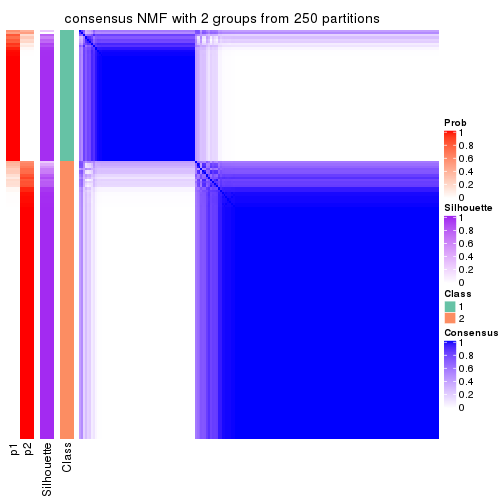</p>

</div>
<div id='tab-CV-NMF-consensus-heatmap-2'>
<pre><code class="r">consensus_heatmap(res, k = 3)
</code></pre>

<p>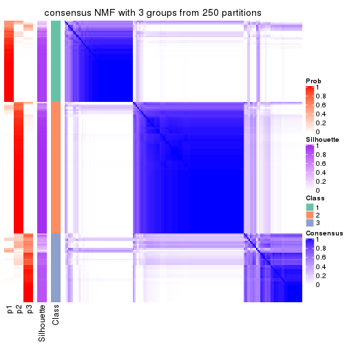</p>

</div>
<div id='tab-CV-NMF-consensus-heatmap-3'>
<pre><code class="r">consensus_heatmap(res, k = 4)
</code></pre>

<p>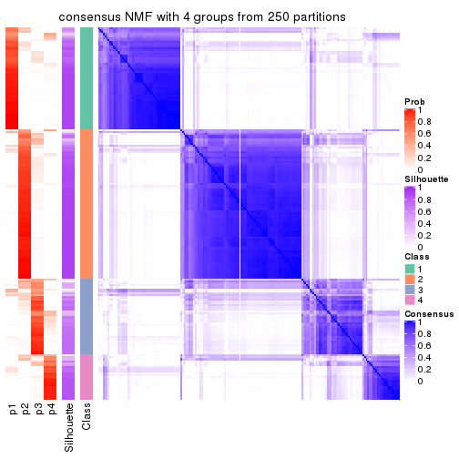</p>

</div>
<div id='tab-CV-NMF-consensus-heatmap-4'>
<pre><code class="r">consensus_heatmap(res, k = 5)
</code></pre>

<p>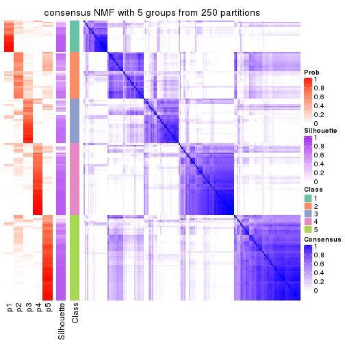</p>

</div>
<div id='tab-CV-NMF-consensus-heatmap-5'>
<pre><code class="r">consensus_heatmap(res, k = 6)
</code></pre>

<p>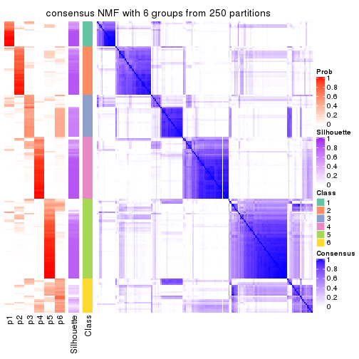</p>

</div>
</div>

Heatmaps for the membership of samples in all partitions to see how consistent they are:


<script>
$( function() {
	$( '#tabs-CV-NMF-membership-heatmap' ).tabs();
} );
</script>
<div id='tabs-CV-NMF-membership-heatmap'>
<ul>
<li><a href='#tab-CV-NMF-membership-heatmap-1'>k = 2</a></li>
<li><a href='#tab-CV-NMF-membership-heatmap-2'>k = 3</a></li>
<li><a href='#tab-CV-NMF-membership-heatmap-3'>k = 4</a></li>
<li><a href='#tab-CV-NMF-membership-heatmap-4'>k = 5</a></li>
<li><a href='#tab-CV-NMF-membership-heatmap-5'>k = 6</a></li>
</ul>
<div id='tab-CV-NMF-membership-heatmap-1'>
<pre><code class="r">membership_heatmap(res, k = 2)
</code></pre>

<p>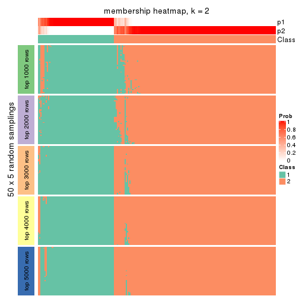</p>

</div>
<div id='tab-CV-NMF-membership-heatmap-2'>
<pre><code class="r">membership_heatmap(res, k = 3)
</code></pre>

<p>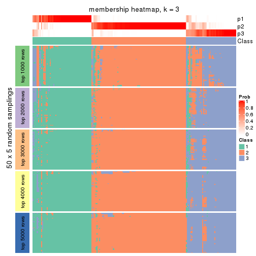</p>

</div>
<div id='tab-CV-NMF-membership-heatmap-3'>
<pre><code class="r">membership_heatmap(res, k = 4)
</code></pre>

<p>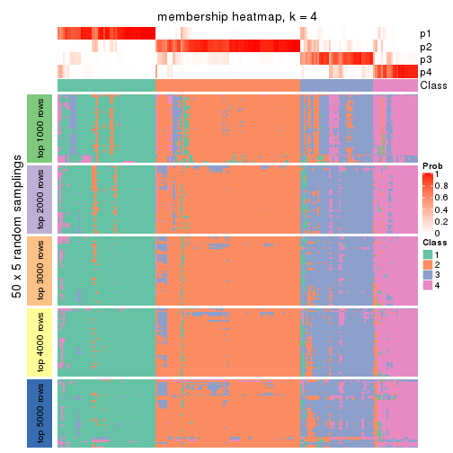</p>

</div>
<div id='tab-CV-NMF-membership-heatmap-4'>
<pre><code class="r">membership_heatmap(res, k = 5)
</code></pre>

<p>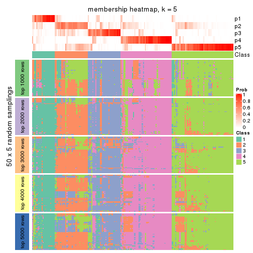</p>

</div>
<div id='tab-CV-NMF-membership-heatmap-5'>
<pre><code class="r">membership_heatmap(res, k = 6)
</code></pre>

<p>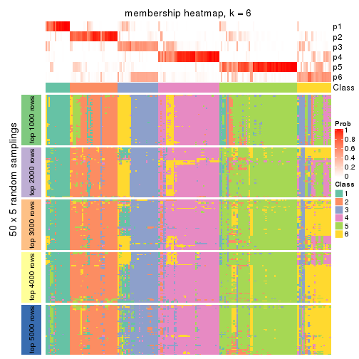</p>

</div>
</div>

As soon as we have had the classes for columns, we can look for signatures
which are significantly different between classes which can be candidate marks
for certain classes. Following are the heatmaps for signatures.


Signature heatmaps where rows are scaled:


<script>
$( function() {
	$( '#tabs-CV-NMF-get-signatures' ).tabs();
} );
</script>
<div id='tabs-CV-NMF-get-signatures'>
<ul>
<li><a href='#tab-CV-NMF-get-signatures-1'>k = 2</a></li>
<li><a href='#tab-CV-NMF-get-signatures-2'>k = 3</a></li>
<li><a href='#tab-CV-NMF-get-signatures-3'>k = 4</a></li>
<li><a href='#tab-CV-NMF-get-signatures-4'>k = 5</a></li>
<li><a href='#tab-CV-NMF-get-signatures-5'>k = 6</a></li>
</ul>
<div id='tab-CV-NMF-get-signatures-1'>
<pre><code class="r">get_signatures(res, k = 2)
</code></pre>

<p>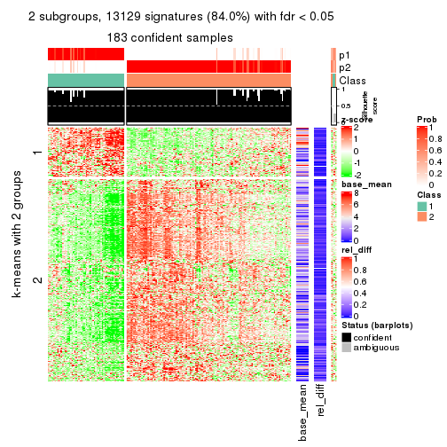</p>

</div>
<div id='tab-CV-NMF-get-signatures-2'>
<pre><code class="r">get_signatures(res, k = 3)
</code></pre>

<p>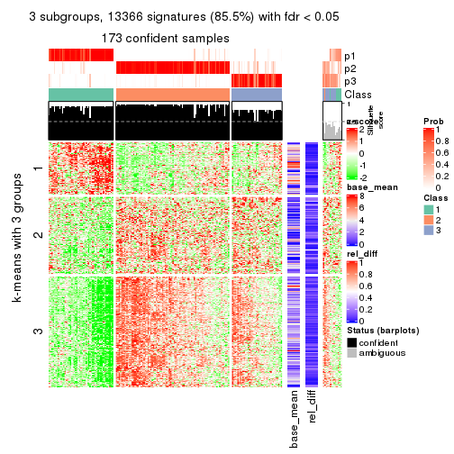</p>

</div>
<div id='tab-CV-NMF-get-signatures-3'>
<pre><code class="r">get_signatures(res, k = 4)
</code></pre>

<p>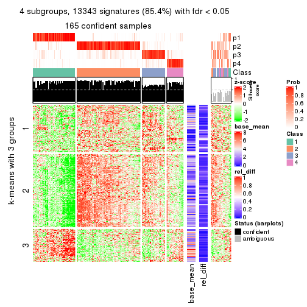</p>

</div>
<div id='tab-CV-NMF-get-signatures-4'>
<pre><code class="r">get_signatures(res, k = 5)
</code></pre>

<p>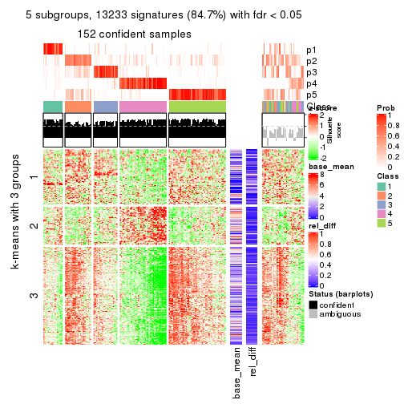</p>

</div>
<div id='tab-CV-NMF-get-signatures-5'>
<pre><code class="r">get_signatures(res, k = 6)
</code></pre>

<p>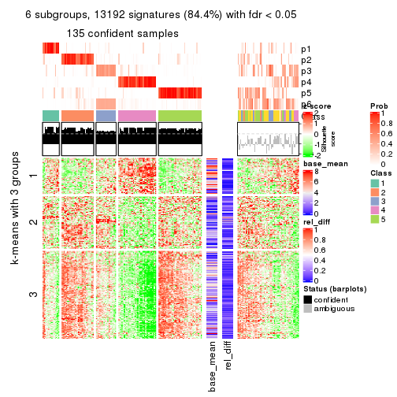</p>

</div>
</div>


Signature heatmaps where rows are not scaled:


<script>
$( function() {
	$( '#tabs-CV-NMF-get-signatures-no-scale' ).tabs();
} );
</script>
<div id='tabs-CV-NMF-get-signatures-no-scale'>
<ul>
<li><a href='#tab-CV-NMF-get-signatures-no-scale-1'>k = 2</a></li>
<li><a href='#tab-CV-NMF-get-signatures-no-scale-2'>k = 3</a></li>
<li><a href='#tab-CV-NMF-get-signatures-no-scale-3'>k = 4</a></li>
<li><a href='#tab-CV-NMF-get-signatures-no-scale-4'>k = 5</a></li>
<li><a href='#tab-CV-NMF-get-signatures-no-scale-5'>k = 6</a></li>
</ul>
<div id='tab-CV-NMF-get-signatures-no-scale-1'>
<pre><code class="r">get_signatures(res, k = 2, scale_rows = FALSE)
</code></pre>

<p>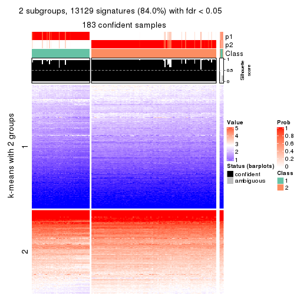</p>

</div>
<div id='tab-CV-NMF-get-signatures-no-scale-2'>
<pre><code class="r">get_signatures(res, k = 3, scale_rows = FALSE)
</code></pre>

<p>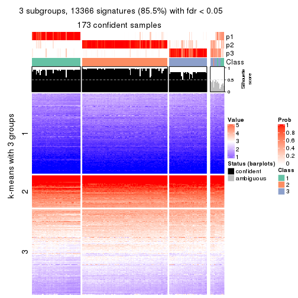</p>

</div>
<div id='tab-CV-NMF-get-signatures-no-scale-3'>
<pre><code class="r">get_signatures(res, k = 4, scale_rows = FALSE)
</code></pre>

<p>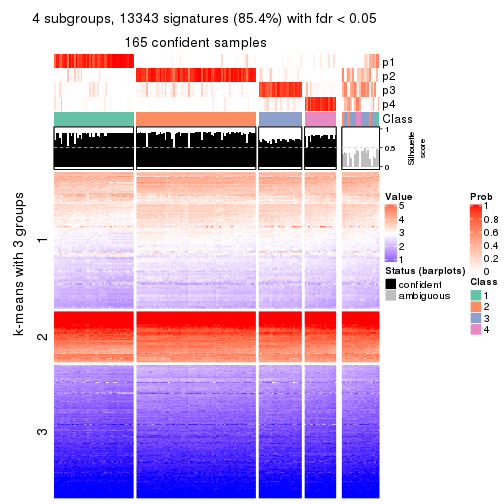</p>

</div>
<div id='tab-CV-NMF-get-signatures-no-scale-4'>
<pre><code class="r">get_signatures(res, k = 5, scale_rows = FALSE)
</code></pre>

<p>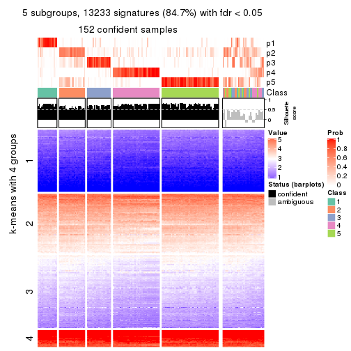</p>

</div>
<div id='tab-CV-NMF-get-signatures-no-scale-5'>
<pre><code class="r">get_signatures(res, k = 6, scale_rows = FALSE)
</code></pre>

<p>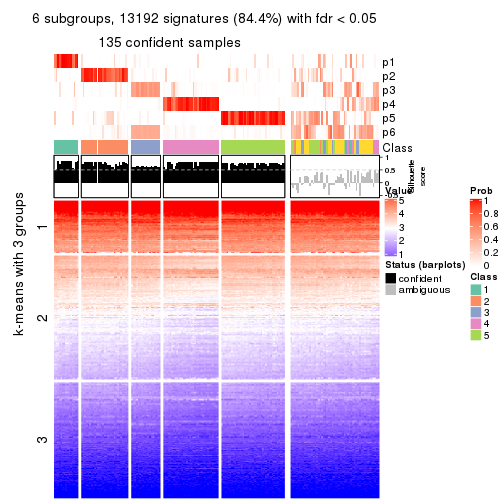</p>

</div>
</div>


Compare the overlap of signatures from different k:

```r
compare_signatures(res)
```

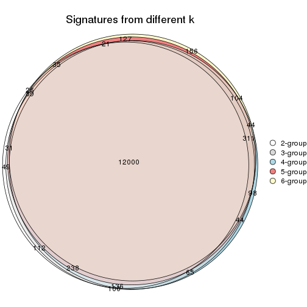

`get_signature()` returns a data frame invisibly. TO get the list of signatures, the function
call should be assigned to a variable explicitly. In following code, if `plot` argument is set
to `FALSE`, no heatmap is plotted while only the differential analysis is performed.

```r
# code only for demonstration
tb = get_signature(res, k = ..., plot = FALSE)
```

An example of the output of `tb` is:

```
#>   which_row         fdr    mean_1    mean_2 scaled_mean_1 scaled_mean_2 km
#> 1        38 0.042760348  8.373488  9.131774    -0.5533452     0.5164555  1
#> 2        40 0.018707592  7.106213  8.469186    -0.6173731     0.5762149  1
#> 3        55 0.019134737 10.221463 11.207825    -0.6159697     0.5749050  1
#> 4        59 0.006059896  5.921854  7.869574    -0.6899429     0.6439467  1
#> 5        60 0.018055526  8.928898 10.211722    -0.6204761     0.5791110  1
#> 6        98 0.009384629 15.714769 14.887706     0.6635654    -0.6193277  2
...
```

The columns in `tb` are:

1. `which_row`: row indices corresponding to the input matrix.
2. `fdr`: FDR for the differential test. 
3. `mean_x`: The mean value in group x.
4. `scaled_mean_x`: The mean value in group x after rows are scaled.
5. `km`: Row groups if k-means clustering is applied to rows.


UMAP plot which shows how samples are separated.


<script>
$( function() {
	$( '#tabs-CV-NMF-dimension-reduction' ).tabs();
} );
</script>
<div id='tabs-CV-NMF-dimension-reduction'>
<ul>
<li><a href='#tab-CV-NMF-dimension-reduction-1'>k = 2</a></li>
<li><a href='#tab-CV-NMF-dimension-reduction-2'>k = 3</a></li>
<li><a href='#tab-CV-NMF-dimension-reduction-3'>k = 4</a></li>
<li><a href='#tab-CV-NMF-dimension-reduction-4'>k = 5</a></li>
<li><a href='#tab-CV-NMF-dimension-reduction-5'>k = 6</a></li>
</ul>
<div id='tab-CV-NMF-dimension-reduction-1'>
<pre><code class="r">dimension_reduction(res, k = 2, method = &quot;UMAP&quot;)
</code></pre>

<p>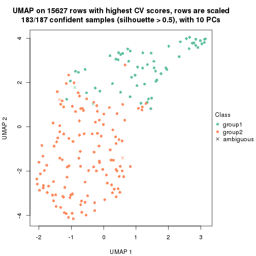</p>

</div>
<div id='tab-CV-NMF-dimension-reduction-2'>
<pre><code class="r">dimension_reduction(res, k = 3, method = &quot;UMAP&quot;)
</code></pre>

<p>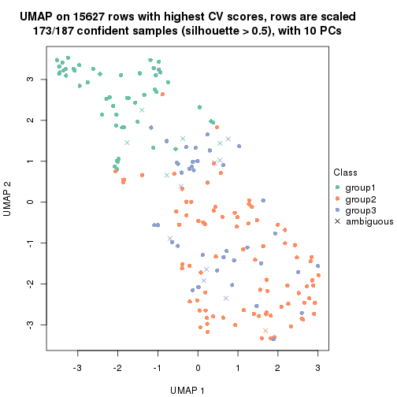</p>

</div>
<div id='tab-CV-NMF-dimension-reduction-3'>
<pre><code class="r">dimension_reduction(res, k = 4, method = &quot;UMAP&quot;)
</code></pre>

<p>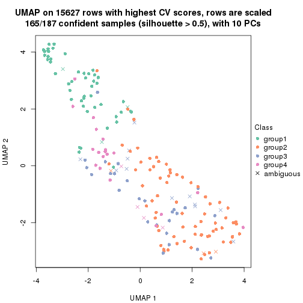</p>

</div>
<div id='tab-CV-NMF-dimension-reduction-4'>
<pre><code class="r">dimension_reduction(res, k = 5, method = &quot;UMAP&quot;)
</code></pre>

<p>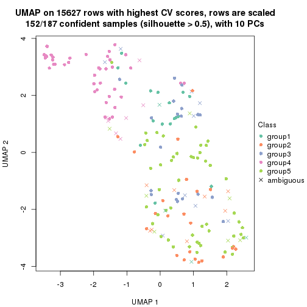</p>

</div>
<div id='tab-CV-NMF-dimension-reduction-5'>
<pre><code class="r">dimension_reduction(res, k = 6, method = &quot;UMAP&quot;)
</code></pre>

<p>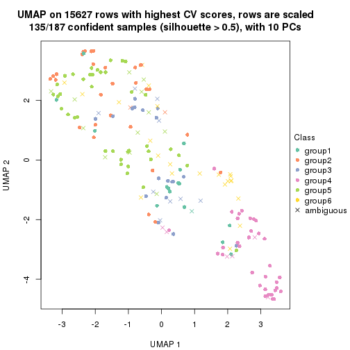</p>

</div>
</div>


Following heatmap shows how subgroups are split when increasing `k`:

```r
collect_classes(res)
```

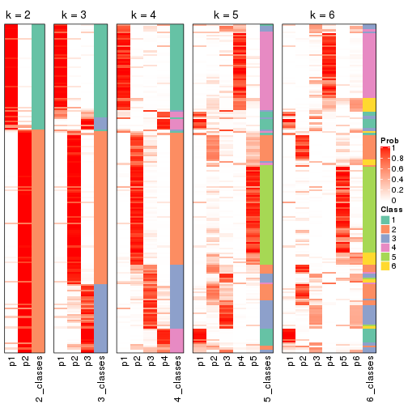


If matrix rows can be associated to genes, consider to use `GO_Enrichment(res,
...)` to perform function enrichment for the signature genes.


 

---------------------------------------------------


### MAD:hclust


The object with results only for a single top-value method and a single partition method 
can be extracted as:

```r
res = res_list["MAD", "hclust"]
# you can also extract it by
# res = res_list["MAD:hclust"]
```

A summary of `res` and all the functions that can be applied to it:

```r
res
```

```
#> A 'ConsensusPartition' object with k = 2, 3, 4, 5, 6.
#>   On a matrix with 15627 rows and 187 columns.
#>   Top rows (1000, 2000, 3000, 4000, 5000) are extracted by 'MAD' method.
#>   Subgroups are detected by 'hclust' method.
#>   Performed in total 1250 partitions by row resampling.
#>   Best k for subgroups seems to be 3.
#> 
#> Following methods can be applied to this 'ConsensusPartition' object:
#>  [1] "cola_report"             "collect_classes"         "collect_plots"          
#>  [4] "collect_stats"           "colnames"                "compare_signatures"     
#>  [7] "consensus_heatmap"       "dimension_reduction"     "functional_enrichment"  
#> [10] "get_anno_col"            "get_anno"                "get_classes"            
#> [13] "get_consensus"           "get_matrix"              "get_membership"         
#> [16] "get_param"               "get_signatures"          "get_stats"              
#> [19] "is_best_k"               "is_stable_k"             "membership_heatmap"     
#> [22] "ncol"                    "nrow"                    "plot_ecdf"              
#> [25] "rownames"                "select_partition_number" "show"                   
#> [28] "suggest_best_k"          "test_to_known_factors"
```

`collect_plots()` function collects all the plots made from `res` for all `k` (number of partitions)
into one single page to provide an easy and fast comparison between different `k`.

```r
collect_plots(res)
```

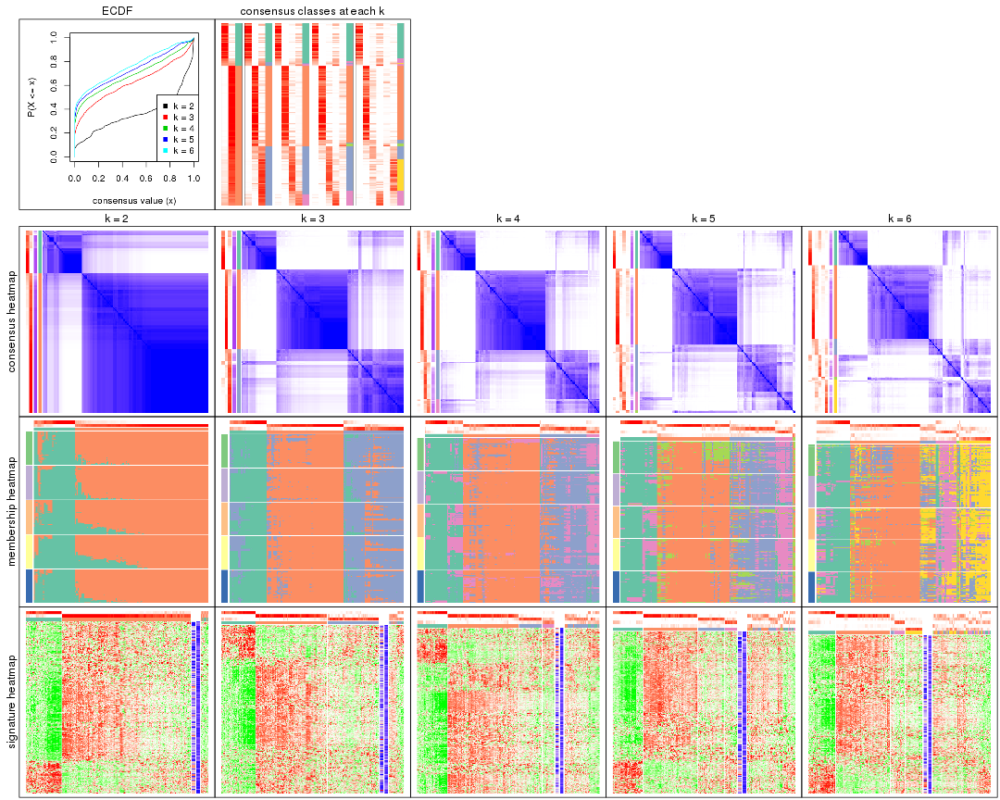

The plots are:

- The first row: a plot of the ECDF (Empirical cumulative distribution
  function) curves of the consensus matrix for each `k` and the heatmap of
  predicted classes for each `k`.
- The second row: heatmaps of the consensus matrix for each `k`.
- The third row: heatmaps of the membership matrix for each `k`.
- The fouth row: heatmaps of the signatures for each `k`.

All the plots in panels can be made by individual functions and they are
plotted later in this section.

`select_partition_number()` produces several plots showing different
statistics for choosing "optimized" `k`. There are following statistics:

- ECDF curves of the consensus matrix for each `k`;
- 1-PAC. [The PAC
  score](https://en.wikipedia.org/wiki/Consensus_clustering#Over-interpretation_potential_of_consensus_clustering)
  measures the proportion of the ambiguous subgrouping.
- Mean silhouette score.
- Concordance. The mean probability of fiting the consensus class ids in all
  partitions.
- Area increased. Denote $A_k$ as the area under the ECDF curve for current
  `k`, the area increased is defined as $A_k - A_{k-1}$.
- Rand index. The percent of pairs of samples that are both in a same cluster
  or both are not in a same cluster in the partition of k and k-1.
- Jaccard index. The ratio of pairs of samples are both in a same cluster in
  the partition of k and k-1 and the pairs of samples are both in a same
  cluster in the partition k or k-1.

The detailed explanations of these statistics can be found in [the cola
vignette](http://bioconductor.org/packages/devel/bioc/vignettes/cola/inst/doc/cola.html#toc_13).

Generally speaking, lower PAC score, higher mean silhouette score or higher
concordance corresponds to better partition. Rand index and Jaccard index
measure how similar the current partition is compared to partition with `k-1`.
If they are too similar, we won't accept `k` is better than `k-1`.

```r
select_partition_number(res)
```

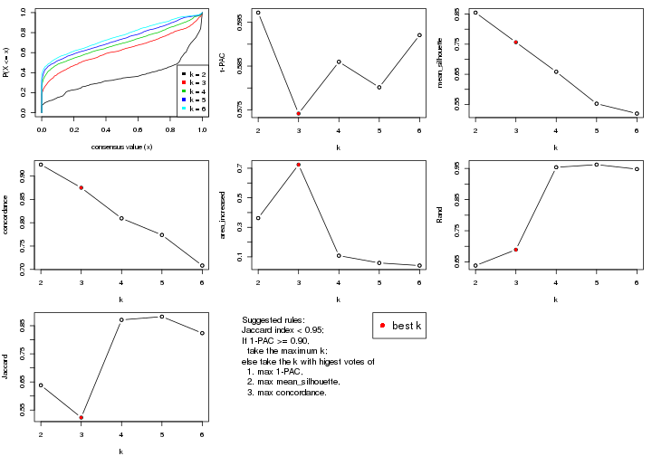

The numeric values for all these statistics can be obtained by `get_stats()`.

```r
get_stats(res)
```

```
#>   k 1-PAC mean_silhouette concordance area_increased  Rand Jaccard
#> 2 2 0.597           0.855       0.925         0.3625 0.638   0.638
#> 3 3 0.574           0.757       0.875         0.7243 0.689   0.523
#> 4 4 0.586           0.658       0.809         0.1081 0.954   0.871
#> 5 5 0.580           0.552       0.774         0.0590 0.962   0.882
#> 6 6 0.592           0.519       0.708         0.0412 0.948   0.824
```

`suggest_best_k()` suggests the best $k$ based on these statistics. The rules are as follows:

- All $k$ with Jaccard index larger than 0.95 are removed because the increase of
  the partition number does not provides enough extra information. If all $k$ are removed,
  the best $k$ is assigned by `NA`.
- For $k$ with 1-PAC larger than 0.9, the maximal $k$ is taken as the "best k". Other $k$ is called "optional k".
- If it does not fit the second rule. The $k$ with the highest vote of highest
  1-PAC, mean silhouette and concordance is taken as the "best k".

```r
suggest_best_k(res)
```

```
#> [1] 3
```


Following shows the table of the partitions (You need to click the **show/hide
code output** link to see it). The membership matrix (columns with name `p*`)
is inferred by
[`clue::cl_consensus()`](https://www.rdocumentation.org/link/cl_consensus?package=clue)
function with the `SE` method. Basically the value in the membership matrix
represents the probability to belong to a certain group. The finall class
label for an item is determined with the group with highest probability it
belongs to.

In `get_classes()` function, the entropy is calculated from the membership
matrix and the silhouette score is calculated from the consensus matrix.


<script>
$( function() {
	$( '#tabs-MAD-hclust-get-classes' ).tabs();
} );
</script>
<div id='tabs-MAD-hclust-get-classes'>
<ul>
<li><a href='#tab-MAD-hclust-get-classes-1'>k = 2</a></li>
<li><a href='#tab-MAD-hclust-get-classes-2'>k = 3</a></li>
<li><a href='#tab-MAD-hclust-get-classes-3'>k = 4</a></li>
<li><a href='#tab-MAD-hclust-get-classes-4'>k = 5</a></li>
<li><a href='#tab-MAD-hclust-get-classes-5'>k = 6</a></li>
</ul>

<div id='tab-MAD-hclust-get-classes-1'>
<p><a id='tab-MAD-hclust-get-classes-1-a' style='color:#0366d6' href='#'>show/hide code output</a></p>
<pre><code class="r">cbind(get_classes(res, k = 2), get_membership(res, k = 2))
</code></pre>

<pre><code>#&gt;            class entropy silhouette    p1    p2
#&gt; SRR1747213     2  0.9686     0.3807 0.396 0.604
#&gt; SRR1747214     1  0.3879     0.8476 0.924 0.076
#&gt; SRR1747215     2  0.0000     0.9275 0.000 1.000
#&gt; SRR1747216     2  0.0000     0.9275 0.000 1.000
#&gt; SRR1747217     2  0.2778     0.9164 0.048 0.952
#&gt; SRR1747218     2  0.2778     0.9164 0.048 0.952
#&gt; SRR1747219     2  0.7602     0.7617 0.220 0.780
#&gt; SRR1747220     2  0.7602     0.7617 0.220 0.780
#&gt; SRR1747221     1  0.8763     0.6353 0.704 0.296
#&gt; SRR1747222     1  0.7815     0.7289 0.768 0.232
#&gt; SRR1747223     2  0.5946     0.8557 0.144 0.856
#&gt; SRR1747224     2  0.5737     0.8628 0.136 0.864
#&gt; SRR1747225     2  0.0000     0.9275 0.000 1.000
#&gt; SRR1747226     2  0.0000     0.9275 0.000 1.000
#&gt; SRR1747227     2  0.0000     0.9275 0.000 1.000
#&gt; SRR1747228     2  0.0938     0.9268 0.012 0.988
#&gt; SRR1747229     2  0.0000     0.9275 0.000 1.000
#&gt; SRR1747230     1  0.0000     0.8685 1.000 0.000
#&gt; SRR1747231     1  0.8016     0.7032 0.756 0.244
#&gt; SRR1747232     1  0.0000     0.8685 1.000 0.000
#&gt; SRR1747233     1  0.9933     0.2227 0.548 0.452
#&gt; SRR1747234     2  0.4815     0.8903 0.104 0.896
#&gt; SRR1747235     1  0.0376     0.8684 0.996 0.004
#&gt; SRR1747236     2  0.0000     0.9275 0.000 1.000
#&gt; SRR1747237     2  0.0000     0.9275 0.000 1.000
#&gt; SRR1747238     2  0.0000     0.9275 0.000 1.000
#&gt; SRR1747239     2  0.0000     0.9275 0.000 1.000
#&gt; SRR1747240     1  0.0000     0.8685 1.000 0.000
#&gt; SRR1747241     2  0.0000     0.9275 0.000 1.000
#&gt; SRR1747242     1  0.0000     0.8685 1.000 0.000
#&gt; SRR1747243     2  0.5842     0.8591 0.140 0.860
#&gt; SRR1747244     2  0.5842     0.8591 0.140 0.860
#&gt; SRR1747245     2  0.0938     0.9267 0.012 0.988
#&gt; SRR1747246     2  0.0000     0.9275 0.000 1.000
#&gt; SRR1747247     1  0.0000     0.8685 1.000 0.000
#&gt; SRR1747248     1  0.0000     0.8685 1.000 0.000
#&gt; SRR1747249     1  0.9460     0.4656 0.636 0.364
#&gt; SRR1747250     2  0.4562     0.8957 0.096 0.904
#&gt; SRR1747252     2  0.9552     0.4370 0.376 0.624
#&gt; SRR1747253     1  0.9552     0.4564 0.624 0.376
#&gt; SRR1747254     2  0.0000     0.9275 0.000 1.000
#&gt; SRR1747255     1  0.5842     0.8189 0.860 0.140
#&gt; SRR1747256     1  0.5842     0.8189 0.860 0.140
#&gt; SRR1747257     2  0.0000     0.9275 0.000 1.000
#&gt; SRR1747258     2  0.0376     0.9273 0.004 0.996
#&gt; SRR1747259     2  0.0000     0.9275 0.000 1.000
#&gt; SRR1747260     2  0.0000     0.9275 0.000 1.000
#&gt; SRR1747261     2  0.1414     0.9249 0.020 0.980
#&gt; SRR1747262     2  0.1414     0.9249 0.020 0.980
#&gt; SRR1747263     2  0.0000     0.9275 0.000 1.000
#&gt; SRR1747264     1  0.0000     0.8685 1.000 0.000
#&gt; SRR1747265     2  0.6801     0.8137 0.180 0.820
#&gt; SRR1747266     2  0.2423     0.9199 0.040 0.960
#&gt; SRR1747267     2  0.6887     0.8089 0.184 0.816
#&gt; SRR1747268     2  0.4562     0.8935 0.096 0.904
#&gt; SRR1747269     2  0.0000     0.9275 0.000 1.000
#&gt; SRR1747270     2  0.0000     0.9275 0.000 1.000
#&gt; SRR1747271     2  0.4161     0.9013 0.084 0.916
#&gt; SRR1747272     2  0.4161     0.9013 0.084 0.916
#&gt; SRR1747273     1  0.0672     0.8680 0.992 0.008
#&gt; SRR1747274     2  0.1843     0.9230 0.028 0.972
#&gt; SRR1747275     1  0.6048     0.8144 0.852 0.148
#&gt; SRR1747276     1  0.6048     0.8144 0.852 0.148
#&gt; SRR1747277     2  0.0000     0.9275 0.000 1.000
#&gt; SRR1747278     2  0.5059     0.8827 0.112 0.888
#&gt; SRR1747280     1  0.0000     0.8685 1.000 0.000
#&gt; SRR1747279     1  0.5946     0.8173 0.856 0.144
#&gt; SRR1747281     2  0.0000     0.9275 0.000 1.000
#&gt; SRR1747282     1  0.0000     0.8685 1.000 0.000
#&gt; SRR1747283     2  0.9087     0.5672 0.324 0.676
#&gt; SRR1747284     1  1.0000    -0.0047 0.500 0.500
#&gt; SRR1747285     2  0.3431     0.9101 0.064 0.936
#&gt; SRR1747286     2  0.0000     0.9275 0.000 1.000
#&gt; SRR1747287     2  0.0000     0.9275 0.000 1.000
#&gt; SRR1747288     2  0.7883     0.7360 0.236 0.764
#&gt; SRR1747290     2  0.0000     0.9275 0.000 1.000
#&gt; SRR1747289     2  0.0000     0.9275 0.000 1.000
#&gt; SRR1747291     2  0.2043     0.9229 0.032 0.968
#&gt; SRR1747293     2  0.0000     0.9275 0.000 1.000
#&gt; SRR1747294     2  0.0000     0.9275 0.000 1.000
#&gt; SRR1747292     1  0.8813     0.6265 0.700 0.300
#&gt; SRR1747295     2  0.0000     0.9275 0.000 1.000
#&gt; SRR1747296     2  0.0000     0.9275 0.000 1.000
#&gt; SRR1747297     2  0.0000     0.9275 0.000 1.000
#&gt; SRR1747298     2  0.0000     0.9275 0.000 1.000
#&gt; SRR1747299     2  0.0000     0.9275 0.000 1.000
#&gt; SRR1747300     2  0.0000     0.9275 0.000 1.000
#&gt; SRR1747301     2  0.0000     0.9275 0.000 1.000
#&gt; SRR1747302     2  0.0000     0.9275 0.000 1.000
#&gt; SRR1747303     2  0.0000     0.9275 0.000 1.000
#&gt; SRR1747304     1  0.0000     0.8685 1.000 0.000
#&gt; SRR1747305     2  0.0000     0.9275 0.000 1.000
#&gt; SRR1747306     2  0.0000     0.9275 0.000 1.000
#&gt; SRR1747307     2  0.4161     0.9009 0.084 0.916
#&gt; SRR1747308     2  0.4161     0.9009 0.084 0.916
#&gt; SRR1747309     1  0.9977     0.1373 0.528 0.472
#&gt; SRR1747310     1  0.0000     0.8685 1.000 0.000
#&gt; SRR1747311     2  0.5737     0.8626 0.136 0.864
#&gt; SRR1747313     2  0.5842     0.8593 0.140 0.860
#&gt; SRR1747312     1  0.0000     0.8685 1.000 0.000
#&gt; SRR1747314     1  0.0000     0.8685 1.000 0.000
#&gt; SRR1747315     2  0.0376     0.9273 0.004 0.996
#&gt; SRR1747316     2  0.0376     0.9273 0.004 0.996
#&gt; SRR1747318     2  0.5519     0.8698 0.128 0.872
#&gt; SRR1747317     2  0.5519     0.8698 0.128 0.872
#&gt; SRR1747319     2  0.8499     0.6695 0.276 0.724
#&gt; SRR1747320     2  0.8499     0.6695 0.276 0.724
#&gt; SRR1747322     1  0.0000     0.8685 1.000 0.000
#&gt; SRR1747321     1  0.2603     0.8607 0.956 0.044
#&gt; SRR1747323     2  0.0000     0.9275 0.000 1.000
#&gt; SRR1747324     2  0.0000     0.9275 0.000 1.000
#&gt; SRR1747326     2  0.0000     0.9275 0.000 1.000
#&gt; SRR1747325     2  0.0000     0.9275 0.000 1.000
#&gt; SRR1747327     2  0.0000     0.9275 0.000 1.000
#&gt; SRR1747328     2  0.3733     0.9071 0.072 0.928
#&gt; SRR1747330     2  0.5519     0.8700 0.128 0.872
#&gt; SRR1747329     2  0.5519     0.8700 0.128 0.872
#&gt; SRR1747332     2  0.4298     0.8982 0.088 0.912
#&gt; SRR1747331     2  0.4298     0.8982 0.088 0.912
#&gt; SRR1747333     2  0.0000     0.9275 0.000 1.000
#&gt; SRR1747334     2  0.0000     0.9275 0.000 1.000
#&gt; SRR1747335     2  0.7219     0.7882 0.200 0.800
#&gt; SRR1747336     1  0.0000     0.8685 1.000 0.000
#&gt; SRR1747337     2  0.0000     0.9275 0.000 1.000
#&gt; SRR1747338     2  0.0000     0.9275 0.000 1.000
#&gt; SRR1747339     2  0.4690     0.8908 0.100 0.900
#&gt; SRR1747340     2  0.4690     0.8908 0.100 0.900
#&gt; SRR1747341     2  0.0000     0.9275 0.000 1.000
#&gt; SRR1747342     2  0.0000     0.9275 0.000 1.000
#&gt; SRR1747343     2  0.0000     0.9275 0.000 1.000
#&gt; SRR1747344     2  0.0000     0.9275 0.000 1.000
#&gt; SRR1747345     2  0.5294     0.8766 0.120 0.880
#&gt; SRR1747346     2  0.5946     0.8568 0.144 0.856
#&gt; SRR1747347     2  0.0000     0.9275 0.000 1.000
#&gt; SRR1747348     1  0.0000     0.8685 1.000 0.000
#&gt; SRR1747349     1  0.6343     0.8051 0.840 0.160
#&gt; SRR1747351     2  0.0000     0.9275 0.000 1.000
#&gt; SRR1747350     2  0.0376     0.9273 0.004 0.996
#&gt; SRR1747352     1  0.0000     0.8685 1.000 0.000
#&gt; SRR1747353     2  0.2043     0.9220 0.032 0.968
#&gt; SRR1747354     2  0.2043     0.9220 0.032 0.968
#&gt; SRR1747355     2  0.9000     0.5904 0.316 0.684
#&gt; SRR1747356     2  0.2948     0.9168 0.052 0.948
#&gt; SRR1747357     2  0.4431     0.8975 0.092 0.908
#&gt; SRR1747358     2  0.4431     0.8975 0.092 0.908
#&gt; SRR1747359     1  0.3584     0.8538 0.932 0.068
#&gt; SRR1747360     2  0.0000     0.9275 0.000 1.000
#&gt; SRR1747361     2  0.6438     0.8334 0.164 0.836
#&gt; SRR1747362     2  0.0938     0.9267 0.012 0.988
#&gt; SRR1747363     2  0.9286     0.5260 0.344 0.656
#&gt; SRR1747364     2  0.9635     0.4056 0.388 0.612
#&gt; SRR1747365     2  0.3584     0.9097 0.068 0.932
#&gt; SRR1747366     2  0.1184     0.9261 0.016 0.984
#&gt; SRR1747367     2  0.9286     0.5260 0.344 0.656
#&gt; SRR1747369     2  0.0000     0.9275 0.000 1.000
#&gt; SRR1747368     2  0.6343     0.8386 0.160 0.840
#&gt; SRR1747370     2  0.4562     0.8936 0.096 0.904
#&gt; SRR1747372     1  0.0000     0.8685 1.000 0.000
#&gt; SRR1747371     1  0.5946     0.8173 0.856 0.144
#&gt; SRR1747373     2  0.0000     0.9275 0.000 1.000
#&gt; SRR1747374     2  0.0000     0.9275 0.000 1.000
#&gt; SRR1747375     2  0.5737     0.8631 0.136 0.864
#&gt; SRR1747376     2  0.0000     0.9275 0.000 1.000
#&gt; SRR1747377     2  0.0000     0.9275 0.000 1.000
#&gt; SRR1747378     2  0.0376     0.9274 0.004 0.996
#&gt; SRR1747379     2  0.1633     0.9239 0.024 0.976
#&gt; SRR1747380     2  0.5946     0.8568 0.144 0.856
#&gt; SRR1747381     1  0.1414     0.8664 0.980 0.020
#&gt; SRR1747382     1  0.1414     0.8664 0.980 0.020
#&gt; SRR1747383     2  0.0376     0.9274 0.004 0.996
#&gt; SRR1747384     2  0.3879     0.9065 0.076 0.924
#&gt; SRR1747385     2  0.5294     0.8763 0.120 0.880
#&gt; SRR1747386     1  0.0000     0.8685 1.000 0.000
#&gt; SRR1747387     2  0.0000     0.9275 0.000 1.000
#&gt; SRR1747388     2  0.0000     0.9275 0.000 1.000
#&gt; SRR1747390     2  0.1843     0.9232 0.028 0.972
#&gt; SRR1747389     2  0.1843     0.9232 0.028 0.972
#&gt; SRR1747391     2  0.0000     0.9275 0.000 1.000
#&gt; SRR1747392     2  0.0000     0.9275 0.000 1.000
#&gt; SRR1747393     2  0.2043     0.9225 0.032 0.968
#&gt; SRR1747394     2  0.5737     0.8626 0.136 0.864
#&gt; SRR1747395     2  0.1843     0.9235 0.028 0.972
#&gt; SRR1747396     2  0.0000     0.9275 0.000 1.000
#&gt; SRR1747398     2  0.0000     0.9275 0.000 1.000
#&gt; SRR1747397     2  0.5294     0.8763 0.120 0.880
#&gt; SRR1747399     1  0.8081     0.6934 0.752 0.248
#&gt; SRR1747400     1  0.8081     0.6934 0.752 0.248
</code></pre>

<script>
$('#tab-MAD-hclust-get-classes-1-a').parent().next().next().hide();
$('#tab-MAD-hclust-get-classes-1-a').click(function(){
  $('#tab-MAD-hclust-get-classes-1-a').parent().next().next().toggle();
  return(false);
});
</script>
</div>

<div id='tab-MAD-hclust-get-classes-2'>
<p><a id='tab-MAD-hclust-get-classes-2-a' style='color:#0366d6' href='#'>show/hide code output</a></p>
<pre><code class="r">cbind(get_classes(res, k = 3), get_membership(res, k = 3))
</code></pre>

<pre><code>#&gt;            class entropy silhouette    p1    p2    p3
#&gt; SRR1747213     3  0.4931     0.5267 0.232 0.000 0.768
#&gt; SRR1747214     1  0.3192     0.8195 0.888 0.000 0.112
#&gt; SRR1747215     2  0.0000     0.9151 0.000 1.000 0.000
#&gt; SRR1747216     2  0.0000     0.9151 0.000 1.000 0.000
#&gt; SRR1747217     3  0.5948     0.5228 0.000 0.360 0.640
#&gt; SRR1747218     3  0.5948     0.5228 0.000 0.360 0.640
#&gt; SRR1747219     3  0.2096     0.7321 0.052 0.004 0.944
#&gt; SRR1747220     3  0.2096     0.7321 0.052 0.004 0.944
#&gt; SRR1747221     1  0.6587     0.4595 0.568 0.008 0.424
#&gt; SRR1747222     1  0.5988     0.6001 0.632 0.000 0.368
#&gt; SRR1747223     3  0.1647     0.7774 0.004 0.036 0.960
#&gt; SRR1747224     3  0.1643     0.7811 0.000 0.044 0.956
#&gt; SRR1747225     2  0.1031     0.9149 0.000 0.976 0.024
#&gt; SRR1747226     2  0.1031     0.9149 0.000 0.976 0.024
#&gt; SRR1747227     2  0.1643     0.9096 0.000 0.956 0.044
#&gt; SRR1747228     2  0.4178     0.8009 0.000 0.828 0.172
#&gt; SRR1747229     2  0.1163     0.9114 0.000 0.972 0.028
#&gt; SRR1747230     1  0.0000     0.8503 1.000 0.000 0.000
#&gt; SRR1747231     1  0.6026     0.5487 0.624 0.000 0.376
#&gt; SRR1747232     1  0.0424     0.8505 0.992 0.000 0.008
#&gt; SRR1747233     3  0.6140     0.0138 0.404 0.000 0.596
#&gt; SRR1747234     3  0.5903     0.7118 0.024 0.232 0.744
#&gt; SRR1747235     1  0.1529     0.8485 0.960 0.000 0.040
#&gt; SRR1747236     2  0.0000     0.9151 0.000 1.000 0.000
#&gt; SRR1747237     2  0.1860     0.9050 0.000 0.948 0.052
#&gt; SRR1747238     2  0.1860     0.9050 0.000 0.948 0.052
#&gt; SRR1747239     2  0.0000     0.9151 0.000 1.000 0.000
#&gt; SRR1747240     1  0.0000     0.8503 1.000 0.000 0.000
#&gt; SRR1747241     2  0.2537     0.8894 0.000 0.920 0.080
#&gt; SRR1747242     1  0.0000     0.8503 1.000 0.000 0.000
#&gt; SRR1747243     3  0.1765     0.7794 0.004 0.040 0.956
#&gt; SRR1747244     3  0.1765     0.7794 0.004 0.040 0.956
#&gt; SRR1747245     2  0.4235     0.7908 0.000 0.824 0.176
#&gt; SRR1747246     2  0.1289     0.9134 0.000 0.968 0.032
#&gt; SRR1747247     1  0.0000     0.8503 1.000 0.000 0.000
#&gt; SRR1747248     1  0.0000     0.8503 1.000 0.000 0.000
#&gt; SRR1747249     1  0.6308     0.2567 0.508 0.000 0.492
#&gt; SRR1747250     3  0.4840     0.7586 0.016 0.168 0.816
#&gt; SRR1747252     3  0.5070     0.5481 0.224 0.004 0.772
#&gt; SRR1747253     3  0.6678    -0.2294 0.480 0.008 0.512
#&gt; SRR1747254     2  0.0000     0.9151 0.000 1.000 0.000
#&gt; SRR1747255     1  0.5291     0.7303 0.732 0.000 0.268
#&gt; SRR1747256     1  0.5291     0.7303 0.732 0.000 0.268
#&gt; SRR1747257     2  0.2165     0.8976 0.000 0.936 0.064
#&gt; SRR1747258     2  0.4178     0.7891 0.000 0.828 0.172
#&gt; SRR1747259     2  0.1964     0.8975 0.000 0.944 0.056
#&gt; SRR1747260     2  0.1964     0.8975 0.000 0.944 0.056
#&gt; SRR1747261     2  0.4654     0.7361 0.000 0.792 0.208
#&gt; SRR1747262     2  0.4654     0.7361 0.000 0.792 0.208
#&gt; SRR1747263     2  0.1529     0.9108 0.000 0.960 0.040
#&gt; SRR1747264     1  0.0747     0.8514 0.984 0.000 0.016
#&gt; SRR1747265     3  0.2187     0.7632 0.024 0.028 0.948
#&gt; SRR1747266     3  0.5905     0.5196 0.000 0.352 0.648
#&gt; SRR1747267     3  0.1905     0.7530 0.028 0.016 0.956
#&gt; SRR1747268     3  0.3752     0.7756 0.000 0.144 0.856
#&gt; SRR1747269     2  0.1289     0.9131 0.000 0.968 0.032
#&gt; SRR1747270     2  0.1289     0.9131 0.000 0.968 0.032
#&gt; SRR1747271     3  0.3879     0.7698 0.000 0.152 0.848
#&gt; SRR1747272     3  0.3879     0.7698 0.000 0.152 0.848
#&gt; SRR1747273     1  0.1643     0.8479 0.956 0.000 0.044
#&gt; SRR1747274     2  0.6180     0.2301 0.000 0.584 0.416
#&gt; SRR1747275     1  0.5363     0.7213 0.724 0.000 0.276
#&gt; SRR1747276     1  0.5363     0.7213 0.724 0.000 0.276
#&gt; SRR1747277     2  0.2537     0.8894 0.000 0.920 0.080
#&gt; SRR1747278     3  0.2356     0.7875 0.000 0.072 0.928
#&gt; SRR1747280     1  0.0000     0.8503 1.000 0.000 0.000
#&gt; SRR1747279     1  0.5327     0.7254 0.728 0.000 0.272
#&gt; SRR1747281     2  0.1289     0.9137 0.000 0.968 0.032
#&gt; SRR1747282     1  0.0747     0.8514 0.984 0.000 0.016
#&gt; SRR1747283     3  0.5581     0.6407 0.176 0.036 0.788
#&gt; SRR1747284     3  0.5882     0.2674 0.348 0.000 0.652
#&gt; SRR1747285     3  0.5835     0.5801 0.000 0.340 0.660
#&gt; SRR1747286     2  0.4291     0.7688 0.000 0.820 0.180
#&gt; SRR1747287     2  0.4452     0.7681 0.000 0.808 0.192
#&gt; SRR1747288     3  0.2939     0.7264 0.072 0.012 0.916
#&gt; SRR1747290     2  0.0000     0.9151 0.000 1.000 0.000
#&gt; SRR1747289     2  0.0000     0.9151 0.000 1.000 0.000
#&gt; SRR1747291     2  0.5650     0.5625 0.000 0.688 0.312
#&gt; SRR1747293     2  0.1163     0.9142 0.000 0.972 0.028
#&gt; SRR1747294     2  0.1163     0.9142 0.000 0.972 0.028
#&gt; SRR1747292     1  0.6451     0.4535 0.560 0.004 0.436
#&gt; SRR1747295     2  0.1753     0.9031 0.000 0.952 0.048
#&gt; SRR1747296     2  0.1753     0.9031 0.000 0.952 0.048
#&gt; SRR1747297     2  0.1163     0.9143 0.000 0.972 0.028
#&gt; SRR1747298     2  0.1163     0.9143 0.000 0.972 0.028
#&gt; SRR1747299     2  0.0237     0.9152 0.000 0.996 0.004
#&gt; SRR1747300     2  0.0237     0.9152 0.000 0.996 0.004
#&gt; SRR1747301     2  0.0237     0.9151 0.000 0.996 0.004
#&gt; SRR1747302     2  0.0237     0.9151 0.000 0.996 0.004
#&gt; SRR1747303     2  0.2356     0.8950 0.000 0.928 0.072
#&gt; SRR1747304     1  0.0424     0.8510 0.992 0.000 0.008
#&gt; SRR1747305     2  0.0000     0.9151 0.000 1.000 0.000
#&gt; SRR1747306     2  0.0000     0.9151 0.000 1.000 0.000
#&gt; SRR1747307     3  0.4291     0.7574 0.000 0.180 0.820
#&gt; SRR1747308     3  0.4291     0.7574 0.000 0.180 0.820
#&gt; SRR1747309     3  0.7156     0.1635 0.400 0.028 0.572
#&gt; SRR1747310     1  0.0747     0.8514 0.984 0.000 0.016
#&gt; SRR1747311     3  0.1529     0.7794 0.000 0.040 0.960
#&gt; SRR1747313     3  0.2486     0.7862 0.008 0.060 0.932
#&gt; SRR1747312     1  0.0000     0.8503 1.000 0.000 0.000
#&gt; SRR1747314     1  0.0000     0.8503 1.000 0.000 0.000
#&gt; SRR1747315     2  0.2796     0.8799 0.000 0.908 0.092
#&gt; SRR1747316     2  0.2796     0.8799 0.000 0.908 0.092
#&gt; SRR1747318     3  0.2682     0.7889 0.004 0.076 0.920
#&gt; SRR1747317     3  0.2682     0.7889 0.004 0.076 0.920
#&gt; SRR1747319     3  0.3272     0.6950 0.104 0.004 0.892
#&gt; SRR1747320     3  0.3272     0.6950 0.104 0.004 0.892
#&gt; SRR1747322     1  0.0000     0.8503 1.000 0.000 0.000
#&gt; SRR1747321     1  0.3941     0.8048 0.844 0.000 0.156
#&gt; SRR1747323     2  0.0000     0.9151 0.000 1.000 0.000
#&gt; SRR1747324     2  0.0000     0.9151 0.000 1.000 0.000
#&gt; SRR1747326     2  0.0000     0.9151 0.000 1.000 0.000
#&gt; SRR1747325     2  0.0000     0.9151 0.000 1.000 0.000
#&gt; SRR1747327     2  0.4931     0.7076 0.000 0.768 0.232
#&gt; SRR1747328     3  0.6062     0.4583 0.000 0.384 0.616
#&gt; SRR1747330     3  0.1753     0.7828 0.000 0.048 0.952
#&gt; SRR1747329     3  0.1753     0.7828 0.000 0.048 0.952
#&gt; SRR1747332     3  0.2796     0.7883 0.000 0.092 0.908
#&gt; SRR1747331     3  0.2796     0.7883 0.000 0.092 0.908
#&gt; SRR1747333     2  0.1031     0.9147 0.000 0.976 0.024
#&gt; SRR1747334     2  0.1031     0.9147 0.000 0.976 0.024
#&gt; SRR1747335     3  0.2269     0.7482 0.040 0.016 0.944
#&gt; SRR1747336     1  0.0000     0.8503 1.000 0.000 0.000
#&gt; SRR1747337     2  0.0000     0.9151 0.000 1.000 0.000
#&gt; SRR1747338     2  0.0000     0.9151 0.000 1.000 0.000
#&gt; SRR1747339     3  0.3192     0.7849 0.000 0.112 0.888
#&gt; SRR1747340     3  0.3192     0.7849 0.000 0.112 0.888
#&gt; SRR1747341     2  0.0000     0.9151 0.000 1.000 0.000
#&gt; SRR1747342     2  0.0000     0.9151 0.000 1.000 0.000
#&gt; SRR1747343     2  0.0000     0.9151 0.000 1.000 0.000
#&gt; SRR1747344     2  0.0000     0.9151 0.000 1.000 0.000
#&gt; SRR1747345     3  0.2165     0.7872 0.000 0.064 0.936
#&gt; SRR1747346     3  0.2173     0.7815 0.008 0.048 0.944
#&gt; SRR1747347     2  0.0000     0.9151 0.000 1.000 0.000
#&gt; SRR1747348     1  0.0000     0.8503 1.000 0.000 0.000
#&gt; SRR1747349     1  0.5465     0.7100 0.712 0.000 0.288
#&gt; SRR1747351     2  0.0000     0.9151 0.000 1.000 0.000
#&gt; SRR1747350     2  0.4887     0.7103 0.000 0.772 0.228
#&gt; SRR1747352     1  0.3116     0.8265 0.892 0.000 0.108
#&gt; SRR1747353     3  0.6309     0.1305 0.000 0.496 0.504
#&gt; SRR1747354     3  0.6309     0.1305 0.000 0.496 0.504
#&gt; SRR1747355     3  0.3879     0.6418 0.152 0.000 0.848
#&gt; SRR1747356     3  0.6318     0.5111 0.008 0.356 0.636
#&gt; SRR1747357     3  0.4887     0.7207 0.000 0.228 0.772
#&gt; SRR1747358     3  0.4887     0.7207 0.000 0.228 0.772
#&gt; SRR1747359     1  0.4346     0.7917 0.816 0.000 0.184
#&gt; SRR1747360     2  0.1289     0.9141 0.000 0.968 0.032
#&gt; SRR1747361     3  0.2152     0.7722 0.016 0.036 0.948
#&gt; SRR1747362     3  0.6299     0.1656 0.000 0.476 0.524
#&gt; SRR1747363     3  0.4235     0.6144 0.176 0.000 0.824
#&gt; SRR1747364     3  0.4796     0.5452 0.220 0.000 0.780
#&gt; SRR1747365     3  0.6148     0.5363 0.004 0.356 0.640
#&gt; SRR1747366     2  0.6204     0.1871 0.000 0.576 0.424
#&gt; SRR1747367     3  0.4235     0.6144 0.176 0.000 0.824
#&gt; SRR1747369     2  0.0000     0.9151 0.000 1.000 0.000
#&gt; SRR1747368     3  0.1751     0.7682 0.012 0.028 0.960
#&gt; SRR1747370     3  0.3551     0.7797 0.000 0.132 0.868
#&gt; SRR1747372     1  0.0000     0.8503 1.000 0.000 0.000
#&gt; SRR1747371     1  0.5327     0.7254 0.728 0.000 0.272
#&gt; SRR1747373     2  0.0000     0.9151 0.000 1.000 0.000
#&gt; SRR1747374     2  0.0000     0.9151 0.000 1.000 0.000
#&gt; SRR1747375     3  0.3213     0.7878 0.008 0.092 0.900
#&gt; SRR1747376     2  0.2625     0.8829 0.000 0.916 0.084
#&gt; SRR1747377     2  0.0000     0.9151 0.000 1.000 0.000
#&gt; SRR1747378     2  0.1643     0.9073 0.000 0.956 0.044
#&gt; SRR1747379     2  0.5098     0.6752 0.000 0.752 0.248
#&gt; SRR1747380     3  0.2173     0.7815 0.008 0.048 0.944
#&gt; SRR1747381     1  0.1860     0.8466 0.948 0.000 0.052
#&gt; SRR1747382     1  0.1860     0.8466 0.948 0.000 0.052
#&gt; SRR1747383     2  0.5465     0.5855 0.000 0.712 0.288
#&gt; SRR1747384     3  0.5733     0.5905 0.000 0.324 0.676
#&gt; SRR1747385     3  0.3482     0.7786 0.000 0.128 0.872
#&gt; SRR1747386     1  0.0000     0.8503 1.000 0.000 0.000
#&gt; SRR1747387     2  0.0000     0.9151 0.000 1.000 0.000
#&gt; SRR1747388     2  0.0000     0.9151 0.000 1.000 0.000
#&gt; SRR1747390     2  0.5835     0.4392 0.000 0.660 0.340
#&gt; SRR1747389     2  0.5835     0.4392 0.000 0.660 0.340
#&gt; SRR1747391     2  0.1163     0.9143 0.000 0.972 0.028
#&gt; SRR1747392     2  0.1163     0.9143 0.000 0.972 0.028
#&gt; SRR1747393     3  0.6308     0.1186 0.000 0.492 0.508
#&gt; SRR1747394     3  0.1529     0.7794 0.000 0.040 0.960
#&gt; SRR1747395     2  0.5058     0.6764 0.000 0.756 0.244
#&gt; SRR1747396     2  0.1964     0.9048 0.000 0.944 0.056
#&gt; SRR1747398     2  0.0000     0.9151 0.000 1.000 0.000
#&gt; SRR1747397     3  0.2356     0.7881 0.000 0.072 0.928
#&gt; SRR1747399     1  0.5988     0.5458 0.632 0.000 0.368
#&gt; SRR1747400     1  0.5988     0.5458 0.632 0.000 0.368
</code></pre>

<script>
$('#tab-MAD-hclust-get-classes-2-a').parent().next().next().hide();
$('#tab-MAD-hclust-get-classes-2-a').click(function(){
  $('#tab-MAD-hclust-get-classes-2-a').parent().next().next().toggle();
  return(false);
});
</script>
</div>

<div id='tab-MAD-hclust-get-classes-3'>
<p><a id='tab-MAD-hclust-get-classes-3-a' style='color:#0366d6' href='#'>show/hide code output</a></p>
<pre><code class="r">cbind(get_classes(res, k = 4), get_membership(res, k = 4))
</code></pre>

<pre><code>#&gt;            class entropy silhouette    p1    p2    p3    p4
#&gt; SRR1747213     4  0.6366     0.7346 0.120 0.000 0.240 0.640
#&gt; SRR1747214     1  0.4158     0.7044 0.768 0.000 0.008 0.224
#&gt; SRR1747215     2  0.0921     0.8864 0.000 0.972 0.000 0.028
#&gt; SRR1747216     2  0.0921     0.8864 0.000 0.972 0.000 0.028
#&gt; SRR1747217     3  0.5446     0.4805 0.000 0.276 0.680 0.044
#&gt; SRR1747218     3  0.5446     0.4805 0.000 0.276 0.680 0.044
#&gt; SRR1747219     4  0.5137     0.5177 0.004 0.000 0.452 0.544
#&gt; SRR1747220     4  0.5137     0.5177 0.004 0.000 0.452 0.544
#&gt; SRR1747221     1  0.6911     0.3427 0.504 0.000 0.112 0.384
#&gt; SRR1747222     1  0.6264     0.4992 0.560 0.000 0.064 0.376
#&gt; SRR1747223     3  0.3907     0.4451 0.000 0.000 0.768 0.232
#&gt; SRR1747224     3  0.3649     0.4826 0.000 0.000 0.796 0.204
#&gt; SRR1747225     2  0.1284     0.8854 0.000 0.964 0.024 0.012
#&gt; SRR1747226     2  0.1284     0.8854 0.000 0.964 0.024 0.012
#&gt; SRR1747227     2  0.1722     0.8801 0.000 0.944 0.048 0.008
#&gt; SRR1747228     2  0.4035     0.7707 0.000 0.804 0.176 0.020
#&gt; SRR1747229     2  0.2319     0.8826 0.000 0.924 0.040 0.036
#&gt; SRR1747230     1  0.0000     0.7890 1.000 0.000 0.000 0.000
#&gt; SRR1747231     1  0.6409     0.4294 0.560 0.000 0.076 0.364
#&gt; SRR1747232     1  0.1118     0.7894 0.964 0.000 0.000 0.036
#&gt; SRR1747233     4  0.7568     0.2370 0.340 0.000 0.204 0.456
#&gt; SRR1747234     3  0.6798     0.3708 0.000 0.172 0.604 0.224
#&gt; SRR1747235     1  0.3172     0.7564 0.840 0.000 0.000 0.160
#&gt; SRR1747236     2  0.1545     0.8853 0.000 0.952 0.008 0.040
#&gt; SRR1747237     2  0.3156     0.8596 0.000 0.884 0.068 0.048
#&gt; SRR1747238     2  0.3156     0.8596 0.000 0.884 0.068 0.048
#&gt; SRR1747239     2  0.1022     0.8856 0.000 0.968 0.000 0.032
#&gt; SRR1747240     1  0.0000     0.7890 1.000 0.000 0.000 0.000
#&gt; SRR1747241     2  0.4856     0.7857 0.000 0.780 0.084 0.136
#&gt; SRR1747242     1  0.0000     0.7890 1.000 0.000 0.000 0.000
#&gt; SRR1747243     3  0.3400     0.5048 0.000 0.000 0.820 0.180
#&gt; SRR1747244     3  0.3400     0.5048 0.000 0.000 0.820 0.180
#&gt; SRR1747245     2  0.4194     0.7576 0.000 0.800 0.172 0.028
#&gt; SRR1747246     2  0.1356     0.8835 0.000 0.960 0.032 0.008
#&gt; SRR1747247     1  0.0000     0.7890 1.000 0.000 0.000 0.000
#&gt; SRR1747248     1  0.0000     0.7890 1.000 0.000 0.000 0.000
#&gt; SRR1747249     1  0.7506    -0.0137 0.440 0.000 0.184 0.376
#&gt; SRR1747250     3  0.5988     0.4184 0.000 0.100 0.676 0.224
#&gt; SRR1747252     4  0.7045     0.6918 0.148 0.000 0.308 0.544
#&gt; SRR1747253     1  0.7775    -0.0939 0.404 0.000 0.244 0.352
#&gt; SRR1747254     2  0.1022     0.8856 0.000 0.968 0.000 0.032
#&gt; SRR1747255     1  0.5577     0.6245 0.636 0.000 0.036 0.328
#&gt; SRR1747256     1  0.5577     0.6245 0.636 0.000 0.036 0.328
#&gt; SRR1747257     2  0.2450     0.8685 0.000 0.912 0.072 0.016
#&gt; SRR1747258     2  0.4677     0.7409 0.000 0.768 0.192 0.040
#&gt; SRR1747259     2  0.4586     0.7985 0.000 0.796 0.068 0.136
#&gt; SRR1747260     2  0.4586     0.7985 0.000 0.796 0.068 0.136
#&gt; SRR1747261     2  0.4284     0.7142 0.000 0.764 0.224 0.012
#&gt; SRR1747262     2  0.4284     0.7142 0.000 0.764 0.224 0.012
#&gt; SRR1747263     2  0.1635     0.8807 0.000 0.948 0.044 0.008
#&gt; SRR1747264     1  0.1302     0.7902 0.956 0.000 0.000 0.044
#&gt; SRR1747265     3  0.5444    -0.1825 0.000 0.016 0.560 0.424
#&gt; SRR1747266     3  0.5471     0.4736 0.000 0.268 0.684 0.048
#&gt; SRR1747267     3  0.5273    -0.2937 0.000 0.008 0.536 0.456
#&gt; SRR1747268     3  0.3693     0.5932 0.000 0.072 0.856 0.072
#&gt; SRR1747269     2  0.2411     0.8792 0.000 0.920 0.040 0.040
#&gt; SRR1747270     2  0.2411     0.8792 0.000 0.920 0.040 0.040
#&gt; SRR1747271     3  0.3004     0.5899 0.000 0.060 0.892 0.048
#&gt; SRR1747272     3  0.3004     0.5899 0.000 0.060 0.892 0.048
#&gt; SRR1747273     1  0.3219     0.7542 0.836 0.000 0.000 0.164
#&gt; SRR1747274     2  0.5917     0.1340 0.000 0.520 0.444 0.036
#&gt; SRR1747275     1  0.5250     0.6427 0.660 0.000 0.024 0.316
#&gt; SRR1747276     1  0.5250     0.6427 0.660 0.000 0.024 0.316
#&gt; SRR1747277     2  0.4856     0.7857 0.000 0.780 0.084 0.136
#&gt; SRR1747278     3  0.2831     0.5548 0.000 0.004 0.876 0.120
#&gt; SRR1747280     1  0.0000     0.7890 1.000 0.000 0.000 0.000
#&gt; SRR1747279     1  0.5228     0.6461 0.664 0.000 0.024 0.312
#&gt; SRR1747281     2  0.1209     0.8836 0.000 0.964 0.032 0.004
#&gt; SRR1747282     1  0.1004     0.7904 0.972 0.000 0.004 0.024
#&gt; SRR1747283     4  0.5366     0.6987 0.024 0.012 0.264 0.700
#&gt; SRR1747284     4  0.6058     0.5800 0.180 0.000 0.136 0.684
#&gt; SRR1747285     3  0.5631     0.5032 0.000 0.224 0.700 0.076
#&gt; SRR1747286     2  0.6391     0.5688 0.000 0.604 0.092 0.304
#&gt; SRR1747287     2  0.4204     0.7555 0.000 0.788 0.192 0.020
#&gt; SRR1747288     4  0.5384     0.5750 0.008 0.004 0.420 0.568
#&gt; SRR1747290     2  0.1545     0.8853 0.000 0.952 0.008 0.040
#&gt; SRR1747289     2  0.1545     0.8853 0.000 0.952 0.008 0.040
#&gt; SRR1747291     2  0.5623     0.5561 0.000 0.660 0.292 0.048
#&gt; SRR1747293     2  0.1452     0.8839 0.000 0.956 0.036 0.008
#&gt; SRR1747294     2  0.1452     0.8839 0.000 0.956 0.036 0.008
#&gt; SRR1747292     1  0.7191     0.3220 0.500 0.000 0.148 0.352
#&gt; SRR1747295     2  0.3935     0.8335 0.000 0.840 0.060 0.100
#&gt; SRR1747296     2  0.3935     0.8335 0.000 0.840 0.060 0.100
#&gt; SRR1747297     2  0.1256     0.8839 0.000 0.964 0.028 0.008
#&gt; SRR1747298     2  0.1256     0.8839 0.000 0.964 0.028 0.008
#&gt; SRR1747299     2  0.1256     0.8879 0.000 0.964 0.008 0.028
#&gt; SRR1747300     2  0.1256     0.8879 0.000 0.964 0.008 0.028
#&gt; SRR1747301     2  0.1109     0.8871 0.000 0.968 0.004 0.028
#&gt; SRR1747302     2  0.1109     0.8871 0.000 0.968 0.004 0.028
#&gt; SRR1747303     2  0.2124     0.8720 0.000 0.924 0.068 0.008
#&gt; SRR1747304     1  0.0592     0.7899 0.984 0.000 0.000 0.016
#&gt; SRR1747305     2  0.0921     0.8864 0.000 0.972 0.000 0.028
#&gt; SRR1747306     2  0.0921     0.8864 0.000 0.972 0.000 0.028
#&gt; SRR1747307     3  0.3486     0.5860 0.000 0.092 0.864 0.044
#&gt; SRR1747308     3  0.3486     0.5860 0.000 0.092 0.864 0.044
#&gt; SRR1747309     3  0.7803    -0.3165 0.352 0.000 0.396 0.252
#&gt; SRR1747310     1  0.1716     0.7887 0.936 0.000 0.000 0.064
#&gt; SRR1747311     3  0.3356     0.5039 0.000 0.000 0.824 0.176
#&gt; SRR1747313     3  0.4175     0.4721 0.000 0.012 0.776 0.212
#&gt; SRR1747312     1  0.0000     0.7890 1.000 0.000 0.000 0.000
#&gt; SRR1747314     1  0.0000     0.7890 1.000 0.000 0.000 0.000
#&gt; SRR1747315     2  0.2530     0.8556 0.000 0.896 0.100 0.004
#&gt; SRR1747316     2  0.2530     0.8556 0.000 0.896 0.100 0.004
#&gt; SRR1747318     3  0.3161     0.5514 0.000 0.012 0.864 0.124
#&gt; SRR1747317     3  0.3161     0.5514 0.000 0.012 0.864 0.124
#&gt; SRR1747319     4  0.4868     0.7388 0.012 0.000 0.304 0.684
#&gt; SRR1747320     4  0.4868     0.7388 0.012 0.000 0.304 0.684
#&gt; SRR1747322     1  0.0000     0.7890 1.000 0.000 0.000 0.000
#&gt; SRR1747321     1  0.3945     0.7309 0.780 0.000 0.004 0.216
#&gt; SRR1747323     2  0.0817     0.8868 0.000 0.976 0.000 0.024
#&gt; SRR1747324     2  0.0817     0.8868 0.000 0.976 0.000 0.024
#&gt; SRR1747326     2  0.0921     0.8864 0.000 0.972 0.000 0.028
#&gt; SRR1747325     2  0.0921     0.8864 0.000 0.972 0.000 0.028
#&gt; SRR1747327     2  0.4567     0.6823 0.000 0.740 0.244 0.016
#&gt; SRR1747328     3  0.5898     0.4258 0.000 0.316 0.628 0.056
#&gt; SRR1747330     3  0.2921     0.5339 0.000 0.000 0.860 0.140
#&gt; SRR1747329     3  0.2921     0.5339 0.000 0.000 0.860 0.140
#&gt; SRR1747332     3  0.2125     0.5696 0.000 0.004 0.920 0.076
#&gt; SRR1747331     3  0.2125     0.5696 0.000 0.004 0.920 0.076
#&gt; SRR1747333     2  0.1004     0.8849 0.000 0.972 0.024 0.004
#&gt; SRR1747334     2  0.1004     0.8849 0.000 0.972 0.024 0.004
#&gt; SRR1747335     3  0.5112    -0.2550 0.000 0.004 0.560 0.436
#&gt; SRR1747336     1  0.0000     0.7890 1.000 0.000 0.000 0.000
#&gt; SRR1747337     2  0.0817     0.8868 0.000 0.976 0.000 0.024
#&gt; SRR1747338     2  0.0817     0.8868 0.000 0.976 0.000 0.024
#&gt; SRR1747339     3  0.2546     0.5880 0.000 0.028 0.912 0.060
#&gt; SRR1747340     3  0.2546     0.5880 0.000 0.028 0.912 0.060
#&gt; SRR1747341     2  0.0921     0.8864 0.000 0.972 0.000 0.028
#&gt; SRR1747342     2  0.0921     0.8864 0.000 0.972 0.000 0.028
#&gt; SRR1747343     2  0.0817     0.8868 0.000 0.976 0.000 0.024
#&gt; SRR1747344     2  0.0817     0.8868 0.000 0.976 0.000 0.024
#&gt; SRR1747345     3  0.3351     0.5393 0.000 0.008 0.844 0.148
#&gt; SRR1747346     3  0.4353     0.4008 0.000 0.012 0.756 0.232
#&gt; SRR1747347     2  0.0921     0.8864 0.000 0.972 0.000 0.028
#&gt; SRR1747348     1  0.0000     0.7890 1.000 0.000 0.000 0.000
#&gt; SRR1747349     1  0.5473     0.6247 0.644 0.000 0.032 0.324
#&gt; SRR1747351     2  0.0921     0.8864 0.000 0.972 0.000 0.028
#&gt; SRR1747350     2  0.5227     0.6425 0.000 0.704 0.256 0.040
#&gt; SRR1747352     1  0.3024     0.7634 0.852 0.000 0.000 0.148
#&gt; SRR1747353     3  0.5716     0.2320 0.000 0.420 0.552 0.028
#&gt; SRR1747354     3  0.5716     0.2320 0.000 0.420 0.552 0.028
#&gt; SRR1747355     4  0.6221     0.7323 0.076 0.000 0.316 0.608
#&gt; SRR1747356     3  0.6522     0.4427 0.000 0.280 0.608 0.112
#&gt; SRR1747357     3  0.5944     0.5166 0.000 0.164 0.696 0.140
#&gt; SRR1747358     3  0.5944     0.5166 0.000 0.164 0.696 0.140
#&gt; SRR1747359     1  0.4535     0.7145 0.744 0.000 0.016 0.240
#&gt; SRR1747360     2  0.2021     0.8817 0.000 0.936 0.040 0.024
#&gt; SRR1747361     3  0.4957     0.1848 0.000 0.012 0.668 0.320
#&gt; SRR1747362     3  0.5989     0.2622 0.000 0.400 0.556 0.044
#&gt; SRR1747363     4  0.4744     0.7551 0.024 0.000 0.240 0.736
#&gt; SRR1747364     4  0.4920     0.7435 0.052 0.000 0.192 0.756
#&gt; SRR1747365     3  0.6566     0.4535 0.000 0.288 0.600 0.112
#&gt; SRR1747366     2  0.5933     0.0665 0.000 0.500 0.464 0.036
#&gt; SRR1747367     4  0.4744     0.7551 0.024 0.000 0.240 0.736
#&gt; SRR1747369     2  0.0817     0.8868 0.000 0.976 0.000 0.024
#&gt; SRR1747368     3  0.5253     0.0684 0.000 0.016 0.624 0.360
#&gt; SRR1747370     3  0.2675     0.5951 0.000 0.044 0.908 0.048
#&gt; SRR1747372     1  0.0000     0.7890 1.000 0.000 0.000 0.000
#&gt; SRR1747371     1  0.5228     0.6461 0.664 0.000 0.024 0.312
#&gt; SRR1747373     2  0.0817     0.8868 0.000 0.976 0.000 0.024
#&gt; SRR1747374     2  0.0817     0.8868 0.000 0.976 0.000 0.024
#&gt; SRR1747375     3  0.4914     0.4996 0.000 0.044 0.748 0.208
#&gt; SRR1747376     2  0.2861     0.8601 0.000 0.888 0.096 0.016
#&gt; SRR1747377     2  0.0921     0.8864 0.000 0.972 0.000 0.028
#&gt; SRR1747378     2  0.2578     0.8802 0.000 0.912 0.052 0.036
#&gt; SRR1747379     2  0.4539     0.6533 0.000 0.720 0.272 0.008
#&gt; SRR1747380     3  0.4353     0.4008 0.000 0.012 0.756 0.232
#&gt; SRR1747381     1  0.3219     0.7559 0.836 0.000 0.000 0.164
#&gt; SRR1747382     1  0.3219     0.7559 0.836 0.000 0.000 0.164
#&gt; SRR1747383     2  0.4769     0.5513 0.000 0.684 0.308 0.008
#&gt; SRR1747384     3  0.5416     0.4997 0.000 0.260 0.692 0.048
#&gt; SRR1747385     3  0.4163     0.5812 0.000 0.076 0.828 0.096
#&gt; SRR1747386     1  0.0000     0.7890 1.000 0.000 0.000 0.000
#&gt; SRR1747387     2  0.1022     0.8856 0.000 0.968 0.000 0.032
#&gt; SRR1747388     2  0.1022     0.8856 0.000 0.968 0.000 0.032
#&gt; SRR1747390     2  0.5723     0.3198 0.000 0.580 0.388 0.032
#&gt; SRR1747389     2  0.5723     0.3198 0.000 0.580 0.388 0.032
#&gt; SRR1747391     2  0.1256     0.8839 0.000 0.964 0.028 0.008
#&gt; SRR1747392     2  0.1256     0.8839 0.000 0.964 0.028 0.008
#&gt; SRR1747393     3  0.6031     0.2087 0.000 0.420 0.536 0.044
#&gt; SRR1747394     3  0.3356     0.5039 0.000 0.000 0.824 0.176
#&gt; SRR1747395     2  0.5083     0.6344 0.000 0.716 0.248 0.036
#&gt; SRR1747396     2  0.2542     0.8679 0.000 0.904 0.084 0.012
#&gt; SRR1747398     2  0.1118     0.8860 0.000 0.964 0.000 0.036
#&gt; SRR1747397     3  0.2976     0.5573 0.000 0.008 0.872 0.120
#&gt; SRR1747399     1  0.6439     0.4291 0.576 0.000 0.084 0.340
#&gt; SRR1747400     1  0.6439     0.4291 0.576 0.000 0.084 0.340
</code></pre>

<script>
$('#tab-MAD-hclust-get-classes-3-a').parent().next().next().hide();
$('#tab-MAD-hclust-get-classes-3-a').click(function(){
  $('#tab-MAD-hclust-get-classes-3-a').parent().next().next().toggle();
  return(false);
});
</script>
</div>

<div id='tab-MAD-hclust-get-classes-4'>
<p><a id='tab-MAD-hclust-get-classes-4-a' style='color:#0366d6' href='#'>show/hide code output</a></p>
<pre><code class="r">cbind(get_classes(res, k = 5), get_membership(res, k = 5))
</code></pre>

<pre><code>#&gt;            class entropy silhouette    p1    p2    p3    p4    p5
#&gt; SRR1747213     4  0.4228    0.68365 0.100 0.000 0.108 0.788 0.004
#&gt; SRR1747214     1  0.3988    0.67325 0.732 0.000 0.000 0.252 0.016
#&gt; SRR1747215     2  0.0290    0.73667 0.000 0.992 0.000 0.000 0.008
#&gt; SRR1747216     2  0.0290    0.73667 0.000 0.992 0.000 0.000 0.008
#&gt; SRR1747217     3  0.6321    0.48152 0.000 0.156 0.592 0.020 0.232
#&gt; SRR1747218     3  0.6321    0.48152 0.000 0.156 0.592 0.020 0.232
#&gt; SRR1747219     4  0.4385    0.56125 0.004 0.000 0.312 0.672 0.012
#&gt; SRR1747220     4  0.4385    0.56125 0.004 0.000 0.312 0.672 0.012
#&gt; SRR1747221     1  0.6111    0.31443 0.496 0.000 0.100 0.396 0.008
#&gt; SRR1747222     1  0.5441    0.45679 0.536 0.000 0.044 0.412 0.008
#&gt; SRR1747223     3  0.3957    0.45163 0.000 0.000 0.712 0.280 0.008
#&gt; SRR1747224     3  0.3530    0.52636 0.000 0.000 0.784 0.204 0.012
#&gt; SRR1747225     2  0.2561    0.71047 0.000 0.856 0.000 0.000 0.144
#&gt; SRR1747226     2  0.2561    0.71047 0.000 0.856 0.000 0.000 0.144
#&gt; SRR1747227     2  0.3155    0.70629 0.000 0.852 0.020 0.008 0.120
#&gt; SRR1747228     2  0.5370    0.49179 0.000 0.708 0.148 0.020 0.124
#&gt; SRR1747229     2  0.2012    0.71074 0.000 0.920 0.020 0.000 0.060
#&gt; SRR1747230     1  0.0000    0.79038 1.000 0.000 0.000 0.000 0.000
#&gt; SRR1747231     1  0.4641    0.39954 0.532 0.000 0.012 0.456 0.000
#&gt; SRR1747232     1  0.1478    0.78792 0.936 0.000 0.000 0.064 0.000
#&gt; SRR1747233     4  0.6388    0.26237 0.316 0.000 0.140 0.532 0.012
#&gt; SRR1747234     3  0.7490    0.35162 0.000 0.088 0.496 0.252 0.164
#&gt; SRR1747235     1  0.3419    0.73895 0.804 0.000 0.000 0.180 0.016
#&gt; SRR1747236     2  0.2690    0.64134 0.000 0.844 0.000 0.000 0.156
#&gt; SRR1747237     2  0.4335    0.51680 0.000 0.740 0.036 0.004 0.220
#&gt; SRR1747238     2  0.4335    0.51680 0.000 0.740 0.036 0.004 0.220
#&gt; SRR1747239     2  0.0510    0.73486 0.000 0.984 0.000 0.000 0.016
#&gt; SRR1747240     1  0.0000    0.79038 1.000 0.000 0.000 0.000 0.000
#&gt; SRR1747241     5  0.4706    0.36590 0.000 0.488 0.008 0.004 0.500
#&gt; SRR1747242     1  0.0000    0.79038 1.000 0.000 0.000 0.000 0.000
#&gt; SRR1747243     3  0.3132    0.55395 0.000 0.000 0.820 0.172 0.008
#&gt; SRR1747244     3  0.3132    0.55395 0.000 0.000 0.820 0.172 0.008
#&gt; SRR1747245     2  0.5374    0.47302 0.000 0.708 0.144 0.020 0.128
#&gt; SRR1747246     2  0.2733    0.71655 0.000 0.872 0.012 0.004 0.112
#&gt; SRR1747247     1  0.0000    0.79038 1.000 0.000 0.000 0.000 0.000
#&gt; SRR1747248     1  0.0000    0.79038 1.000 0.000 0.000 0.000 0.000
#&gt; SRR1747249     4  0.6066    0.00279 0.424 0.000 0.120 0.456 0.000
#&gt; SRR1747250     3  0.6789    0.38909 0.000 0.040 0.548 0.264 0.148
#&gt; SRR1747252     4  0.5381    0.66627 0.132 0.000 0.172 0.688 0.008
#&gt; SRR1747253     4  0.6889    0.05073 0.388 0.000 0.200 0.400 0.012
#&gt; SRR1747254     2  0.0510    0.73486 0.000 0.984 0.000 0.000 0.016
#&gt; SRR1747255     1  0.4517    0.59632 0.616 0.000 0.008 0.372 0.004
#&gt; SRR1747256     1  0.4517    0.59632 0.616 0.000 0.008 0.372 0.004
#&gt; SRR1747257     2  0.3735    0.66855 0.000 0.816 0.048 0.004 0.132
#&gt; SRR1747258     2  0.5788    0.27254 0.000 0.628 0.152 0.004 0.216
#&gt; SRR1747259     2  0.4430   -0.44800 0.000 0.540 0.004 0.000 0.456
#&gt; SRR1747260     2  0.4430   -0.44800 0.000 0.540 0.004 0.000 0.456
#&gt; SRR1747261     2  0.5435    0.40323 0.000 0.672 0.188 0.004 0.136
#&gt; SRR1747262     2  0.5435    0.40323 0.000 0.672 0.188 0.004 0.136
#&gt; SRR1747263     2  0.3010    0.71026 0.000 0.860 0.016 0.008 0.116
#&gt; SRR1747264     1  0.1121    0.79126 0.956 0.000 0.000 0.044 0.000
#&gt; SRR1747265     4  0.4953    0.31258 0.000 0.000 0.440 0.532 0.028
#&gt; SRR1747266     3  0.6181    0.47923 0.000 0.196 0.632 0.032 0.140
#&gt; SRR1747267     4  0.4649    0.39959 0.000 0.000 0.404 0.580 0.016
#&gt; SRR1747268     3  0.3515    0.63043 0.000 0.032 0.856 0.052 0.060
#&gt; SRR1747269     2  0.3745    0.61293 0.000 0.780 0.024 0.000 0.196
#&gt; SRR1747270     2  0.3745    0.61293 0.000 0.780 0.024 0.000 0.196
#&gt; SRR1747271     3  0.3380    0.62257 0.000 0.008 0.840 0.028 0.124
#&gt; SRR1747272     3  0.3380    0.62257 0.000 0.008 0.840 0.028 0.124
#&gt; SRR1747273     1  0.3456    0.73615 0.800 0.000 0.000 0.184 0.016
#&gt; SRR1747274     2  0.6906   -0.15903 0.000 0.400 0.384 0.012 0.204
#&gt; SRR1747275     1  0.4807    0.61395 0.632 0.000 0.020 0.340 0.008
#&gt; SRR1747276     1  0.4807    0.61395 0.632 0.000 0.020 0.340 0.008
#&gt; SRR1747277     5  0.4706    0.36590 0.000 0.488 0.008 0.004 0.500
#&gt; SRR1747278     3  0.2866    0.60256 0.000 0.004 0.872 0.100 0.024
#&gt; SRR1747280     1  0.0000    0.79038 1.000 0.000 0.000 0.000 0.000
#&gt; SRR1747279     1  0.4775    0.61988 0.640 0.000 0.020 0.332 0.008
#&gt; SRR1747281     2  0.2731    0.71804 0.000 0.876 0.016 0.004 0.104
#&gt; SRR1747282     1  0.0794    0.79130 0.972 0.000 0.000 0.028 0.000
#&gt; SRR1747283     4  0.4155    0.65451 0.008 0.004 0.116 0.804 0.068
#&gt; SRR1747284     4  0.3459    0.54600 0.136 0.000 0.016 0.832 0.016
#&gt; SRR1747285     3  0.5921    0.56135 0.000 0.116 0.636 0.020 0.228
#&gt; SRR1747286     5  0.3379    0.16518 0.000 0.148 0.008 0.016 0.828
#&gt; SRR1747287     2  0.4636    0.53869 0.000 0.756 0.172 0.020 0.052
#&gt; SRR1747288     4  0.3790    0.60801 0.000 0.000 0.272 0.724 0.004
#&gt; SRR1747290     2  0.2773    0.63037 0.000 0.836 0.000 0.000 0.164
#&gt; SRR1747289     2  0.2773    0.63037 0.000 0.836 0.000 0.000 0.164
#&gt; SRR1747291     2  0.6125    0.24863 0.000 0.624 0.252 0.056 0.068
#&gt; SRR1747293     2  0.2753    0.70950 0.000 0.856 0.008 0.000 0.136
#&gt; SRR1747294     2  0.2753    0.70950 0.000 0.856 0.008 0.000 0.136
#&gt; SRR1747292     1  0.6358    0.26861 0.472 0.000 0.128 0.392 0.008
#&gt; SRR1747295     2  0.4402    0.00495 0.000 0.636 0.012 0.000 0.352
#&gt; SRR1747296     2  0.4402    0.00495 0.000 0.636 0.012 0.000 0.352
#&gt; SRR1747297     2  0.2699    0.71892 0.000 0.880 0.012 0.008 0.100
#&gt; SRR1747298     2  0.2699    0.71892 0.000 0.880 0.012 0.008 0.100
#&gt; SRR1747299     2  0.1197    0.73754 0.000 0.952 0.000 0.000 0.048
#&gt; SRR1747300     2  0.1197    0.73754 0.000 0.952 0.000 0.000 0.048
#&gt; SRR1747301     2  0.0290    0.73958 0.000 0.992 0.000 0.000 0.008
#&gt; SRR1747302     2  0.0290    0.73958 0.000 0.992 0.000 0.000 0.008
#&gt; SRR1747303     2  0.3441    0.70399 0.000 0.848 0.056 0.008 0.088
#&gt; SRR1747304     1  0.0510    0.79108 0.984 0.000 0.000 0.016 0.000
#&gt; SRR1747305     2  0.0290    0.73667 0.000 0.992 0.000 0.000 0.008
#&gt; SRR1747306     2  0.0290    0.73667 0.000 0.992 0.000 0.000 0.008
#&gt; SRR1747307     3  0.3849    0.61815 0.000 0.020 0.800 0.016 0.164
#&gt; SRR1747308     3  0.3849    0.61815 0.000 0.020 0.800 0.016 0.164
#&gt; SRR1747309     3  0.7029   -0.25223 0.352 0.000 0.356 0.284 0.008
#&gt; SRR1747310     1  0.1908    0.78632 0.908 0.000 0.000 0.092 0.000
#&gt; SRR1747311     3  0.3789    0.51262 0.000 0.000 0.760 0.224 0.016
#&gt; SRR1747313     3  0.3940    0.51280 0.000 0.000 0.756 0.220 0.024
#&gt; SRR1747312     1  0.0000    0.79038 1.000 0.000 0.000 0.000 0.000
#&gt; SRR1747314     1  0.0000    0.79038 1.000 0.000 0.000 0.000 0.000
#&gt; SRR1747315     2  0.4293    0.65142 0.000 0.788 0.068 0.012 0.132
#&gt; SRR1747316     2  0.4293    0.65142 0.000 0.788 0.068 0.012 0.132
#&gt; SRR1747318     3  0.3115    0.59688 0.000 0.000 0.852 0.112 0.036
#&gt; SRR1747317     3  0.3115    0.59688 0.000 0.000 0.852 0.112 0.036
#&gt; SRR1747319     4  0.2516    0.69752 0.000 0.000 0.140 0.860 0.000
#&gt; SRR1747320     4  0.2516    0.69752 0.000 0.000 0.140 0.860 0.000
#&gt; SRR1747322     1  0.0000    0.79038 1.000 0.000 0.000 0.000 0.000
#&gt; SRR1747321     1  0.3395    0.71992 0.764 0.000 0.000 0.236 0.000
#&gt; SRR1747323     2  0.0290    0.73813 0.000 0.992 0.000 0.000 0.008
#&gt; SRR1747324     2  0.0290    0.73813 0.000 0.992 0.000 0.000 0.008
#&gt; SRR1747326     2  0.0404    0.73752 0.000 0.988 0.000 0.000 0.012
#&gt; SRR1747325     2  0.0404    0.73752 0.000 0.988 0.000 0.000 0.012
#&gt; SRR1747327     2  0.5001    0.45164 0.000 0.712 0.216 0.020 0.052
#&gt; SRR1747328     3  0.6074    0.31168 0.000 0.284 0.604 0.036 0.076
#&gt; SRR1747330     3  0.2612    0.58314 0.000 0.000 0.868 0.124 0.008
#&gt; SRR1747329     3  0.2612    0.58314 0.000 0.000 0.868 0.124 0.008
#&gt; SRR1747332     3  0.2754    0.61671 0.000 0.000 0.880 0.040 0.080
#&gt; SRR1747331     3  0.2754    0.61671 0.000 0.000 0.880 0.040 0.080
#&gt; SRR1747333     2  0.2127    0.72184 0.000 0.892 0.000 0.000 0.108
#&gt; SRR1747334     2  0.2127    0.72184 0.000 0.892 0.000 0.000 0.108
#&gt; SRR1747335     4  0.4604    0.37326 0.000 0.000 0.428 0.560 0.012
#&gt; SRR1747336     1  0.0000    0.79038 1.000 0.000 0.000 0.000 0.000
#&gt; SRR1747337     2  0.0162    0.73794 0.000 0.996 0.000 0.000 0.004
#&gt; SRR1747338     2  0.0162    0.73794 0.000 0.996 0.000 0.000 0.004
#&gt; SRR1747339     3  0.2696    0.62901 0.000 0.012 0.896 0.040 0.052
#&gt; SRR1747340     3  0.2696    0.62901 0.000 0.012 0.896 0.040 0.052
#&gt; SRR1747341     2  0.0290    0.73667 0.000 0.992 0.000 0.000 0.008
#&gt; SRR1747342     2  0.0290    0.73667 0.000 0.992 0.000 0.000 0.008
#&gt; SRR1747343     2  0.0290    0.73813 0.000 0.992 0.000 0.000 0.008
#&gt; SRR1747344     2  0.0290    0.73813 0.000 0.992 0.000 0.000 0.008
#&gt; SRR1747345     3  0.3925    0.56242 0.000 0.004 0.784 0.180 0.032
#&gt; SRR1747346     3  0.4715    0.36901 0.000 0.004 0.672 0.292 0.032
#&gt; SRR1747347     2  0.0404    0.73752 0.000 0.988 0.000 0.000 0.012
#&gt; SRR1747348     1  0.0000    0.79038 1.000 0.000 0.000 0.000 0.000
#&gt; SRR1747349     1  0.4851    0.59636 0.620 0.000 0.020 0.352 0.008
#&gt; SRR1747351     2  0.0404    0.73775 0.000 0.988 0.000 0.000 0.012
#&gt; SRR1747350     2  0.6531    0.05977 0.000 0.544 0.204 0.012 0.240
#&gt; SRR1747352     1  0.2773    0.75749 0.836 0.000 0.000 0.164 0.000
#&gt; SRR1747353     3  0.6569    0.17477 0.000 0.312 0.500 0.008 0.180
#&gt; SRR1747354     3  0.6569    0.17477 0.000 0.312 0.500 0.008 0.180
#&gt; SRR1747355     4  0.4308    0.69589 0.060 0.000 0.168 0.768 0.004
#&gt; SRR1747356     3  0.7276    0.44692 0.000 0.204 0.548 0.116 0.132
#&gt; SRR1747357     3  0.6832    0.52414 0.000 0.088 0.600 0.148 0.164
#&gt; SRR1747358     3  0.6832    0.52414 0.000 0.088 0.600 0.148 0.164
#&gt; SRR1747359     1  0.3766    0.69980 0.728 0.000 0.004 0.268 0.000
#&gt; SRR1747360     2  0.3123    0.68278 0.000 0.812 0.004 0.000 0.184
#&gt; SRR1747361     3  0.4717    0.08342 0.000 0.000 0.584 0.396 0.020
#&gt; SRR1747362     3  0.6565    0.12247 0.000 0.328 0.516 0.020 0.136
#&gt; SRR1747363     4  0.2753    0.69790 0.008 0.000 0.104 0.876 0.012
#&gt; SRR1747364     4  0.2140    0.68004 0.024 0.000 0.040 0.924 0.012
#&gt; SRR1747365     3  0.7559    0.46105 0.000 0.168 0.512 0.116 0.204
#&gt; SRR1747366     3  0.6892   -0.08292 0.000 0.356 0.408 0.008 0.228
#&gt; SRR1747367     4  0.2753    0.69790 0.008 0.000 0.104 0.876 0.012
#&gt; SRR1747369     2  0.0162    0.73794 0.000 0.996 0.000 0.000 0.004
#&gt; SRR1747368     3  0.4977   -0.14677 0.000 0.000 0.500 0.472 0.028
#&gt; SRR1747370     3  0.3086    0.63391 0.000 0.020 0.876 0.036 0.068
#&gt; SRR1747372     1  0.0000    0.79038 1.000 0.000 0.000 0.000 0.000
#&gt; SRR1747371     1  0.4775    0.61988 0.640 0.000 0.020 0.332 0.008
#&gt; SRR1747373     2  0.0162    0.73794 0.000 0.996 0.000 0.000 0.004
#&gt; SRR1747374     2  0.0162    0.73794 0.000 0.996 0.000 0.000 0.004
#&gt; SRR1747375     3  0.4580    0.53424 0.000 0.008 0.740 0.200 0.052
#&gt; SRR1747376     2  0.3338    0.69791 0.000 0.852 0.076 0.004 0.068
#&gt; SRR1747377     2  0.0794    0.73779 0.000 0.972 0.000 0.000 0.028
#&gt; SRR1747378     2  0.2932    0.70694 0.000 0.864 0.032 0.000 0.104
#&gt; SRR1747379     2  0.5727    0.33828 0.000 0.636 0.236 0.008 0.120
#&gt; SRR1747380     3  0.4715    0.36901 0.000 0.004 0.672 0.292 0.032
#&gt; SRR1747381     1  0.3391    0.73783 0.800 0.000 0.000 0.188 0.012
#&gt; SRR1747382     1  0.3391    0.73783 0.800 0.000 0.000 0.188 0.012
#&gt; SRR1747383     2  0.6191    0.11766 0.000 0.564 0.264 0.004 0.168
#&gt; SRR1747384     3  0.6463    0.53361 0.000 0.128 0.604 0.044 0.224
#&gt; SRR1747385     3  0.3629    0.61937 0.000 0.028 0.848 0.056 0.068
#&gt; SRR1747386     1  0.0000    0.79038 1.000 0.000 0.000 0.000 0.000
#&gt; SRR1747387     2  0.0703    0.73119 0.000 0.976 0.000 0.000 0.024
#&gt; SRR1747388     2  0.0703    0.73119 0.000 0.976 0.000 0.000 0.024
#&gt; SRR1747390     2  0.6745   -0.16525 0.000 0.436 0.336 0.004 0.224
#&gt; SRR1747389     2  0.6745   -0.16525 0.000 0.436 0.336 0.004 0.224
#&gt; SRR1747391     2  0.2629    0.71874 0.000 0.880 0.012 0.004 0.104
#&gt; SRR1747392     2  0.2629    0.71874 0.000 0.880 0.012 0.004 0.104
#&gt; SRR1747393     3  0.6835    0.13576 0.000 0.332 0.484 0.024 0.160
#&gt; SRR1747394     3  0.3789    0.51262 0.000 0.000 0.760 0.224 0.016
#&gt; SRR1747395     2  0.5995    0.24324 0.000 0.624 0.228 0.016 0.132
#&gt; SRR1747396     2  0.3821    0.66743 0.000 0.800 0.052 0.000 0.148
#&gt; SRR1747398     2  0.0963    0.73092 0.000 0.964 0.000 0.000 0.036
#&gt; SRR1747397     3  0.2623    0.59837 0.000 0.004 0.884 0.096 0.016
#&gt; SRR1747399     1  0.4420    0.41723 0.548 0.000 0.000 0.448 0.004
#&gt; SRR1747400     1  0.4420    0.41723 0.548 0.000 0.000 0.448 0.004
</code></pre>

<script>
$('#tab-MAD-hclust-get-classes-4-a').parent().next().next().hide();
$('#tab-MAD-hclust-get-classes-4-a').click(function(){
  $('#tab-MAD-hclust-get-classes-4-a').parent().next().next().toggle();
  return(false);
});
</script>
</div>

<div id='tab-MAD-hclust-get-classes-5'>
<p><a id='tab-MAD-hclust-get-classes-5-a' style='color:#0366d6' href='#'>show/hide code output</a></p>
<pre><code class="r">cbind(get_classes(res, k = 6), get_membership(res, k = 6))
</code></pre>

<pre><code>#&gt;            class entropy silhouette    p1    p2    p3    p4    p5    p6
#&gt; SRR1747213     4  0.4805     0.6230 0.052 0.000 0.048 0.744 0.016 0.140
#&gt; SRR1747214     1  0.6012     0.4881 0.544 0.000 0.100 0.304 0.052 0.000
#&gt; SRR1747215     2  0.0405     0.7507 0.000 0.988 0.008 0.000 0.004 0.000
#&gt; SRR1747216     2  0.0405     0.7507 0.000 0.988 0.008 0.000 0.004 0.000
#&gt; SRR1747217     3  0.5719     0.4904 0.000 0.108 0.552 0.012 0.008 0.320
#&gt; SRR1747218     3  0.5719     0.4904 0.000 0.108 0.552 0.012 0.008 0.320
#&gt; SRR1747219     4  0.4891     0.4667 0.000 0.000 0.064 0.616 0.008 0.312
#&gt; SRR1747220     4  0.4891     0.4667 0.000 0.000 0.064 0.616 0.008 0.312
#&gt; SRR1747221     1  0.6759     0.2436 0.448 0.000 0.036 0.344 0.020 0.152
#&gt; SRR1747222     1  0.6238     0.3571 0.476 0.000 0.040 0.388 0.016 0.080
#&gt; SRR1747223     6  0.3246     0.5404 0.000 0.000 0.016 0.160 0.012 0.812
#&gt; SRR1747224     6  0.3249     0.6191 0.000 0.000 0.060 0.096 0.008 0.836
#&gt; SRR1747225     2  0.3412     0.7166 0.000 0.808 0.128 0.000 0.064 0.000
#&gt; SRR1747226     2  0.3412     0.7166 0.000 0.808 0.128 0.000 0.064 0.000
#&gt; SRR1747227     2  0.3947     0.6542 0.000 0.732 0.228 0.000 0.036 0.004
#&gt; SRR1747228     2  0.5650     0.3968 0.000 0.588 0.284 0.000 0.040 0.088
#&gt; SRR1747229     2  0.2133     0.7314 0.000 0.912 0.052 0.000 0.020 0.016
#&gt; SRR1747230     1  0.0260     0.7434 0.992 0.000 0.008 0.000 0.000 0.000
#&gt; SRR1747231     4  0.5254    -0.1859 0.424 0.000 0.040 0.512 0.012 0.012
#&gt; SRR1747232     1  0.2784     0.7189 0.848 0.000 0.012 0.132 0.008 0.000
#&gt; SRR1747233     4  0.6718     0.2766 0.260 0.000 0.056 0.524 0.020 0.140
#&gt; SRR1747234     6  0.7844     0.0196 0.000 0.056 0.308 0.252 0.060 0.324
#&gt; SRR1747235     1  0.5741     0.5853 0.612 0.000 0.104 0.232 0.052 0.000
#&gt; SRR1747236     2  0.3602     0.6595 0.000 0.792 0.072 0.000 0.136 0.000
#&gt; SRR1747237     2  0.4774     0.5078 0.000 0.672 0.192 0.000 0.136 0.000
#&gt; SRR1747238     2  0.4774     0.5078 0.000 0.672 0.192 0.000 0.136 0.000
#&gt; SRR1747239     2  0.0622     0.7510 0.000 0.980 0.008 0.000 0.012 0.000
#&gt; SRR1747240     1  0.0622     0.7434 0.980 0.000 0.012 0.000 0.008 0.000
#&gt; SRR1747241     5  0.6075     0.4998 0.000 0.360 0.268 0.000 0.372 0.000
#&gt; SRR1747242     1  0.0508     0.7429 0.984 0.000 0.012 0.000 0.004 0.000
#&gt; SRR1747243     6  0.1982     0.6160 0.000 0.000 0.016 0.068 0.004 0.912
#&gt; SRR1747244     6  0.1982     0.6160 0.000 0.000 0.016 0.068 0.004 0.912
#&gt; SRR1747245     2  0.5587     0.4315 0.000 0.616 0.240 0.000 0.036 0.108
#&gt; SRR1747246     2  0.3090     0.7243 0.000 0.828 0.140 0.000 0.028 0.004
#&gt; SRR1747247     1  0.0260     0.7434 0.992 0.000 0.008 0.000 0.000 0.000
#&gt; SRR1747248     1  0.0260     0.7434 0.992 0.000 0.008 0.000 0.000 0.000
#&gt; SRR1747249     4  0.6836     0.0920 0.344 0.000 0.068 0.468 0.028 0.092
#&gt; SRR1747250     6  0.7163     0.1038 0.000 0.036 0.324 0.268 0.020 0.352
#&gt; SRR1747252     4  0.5520     0.5888 0.100 0.000 0.036 0.672 0.016 0.176
#&gt; SRR1747253     4  0.7428     0.0732 0.340 0.000 0.072 0.356 0.020 0.212
#&gt; SRR1747254     2  0.0622     0.7510 0.000 0.980 0.008 0.000 0.012 0.000
#&gt; SRR1747255     1  0.5858     0.4799 0.532 0.000 0.048 0.364 0.028 0.028
#&gt; SRR1747256     1  0.5858     0.4799 0.532 0.000 0.048 0.364 0.028 0.028
#&gt; SRR1747257     2  0.4172     0.6459 0.000 0.736 0.200 0.000 0.056 0.008
#&gt; SRR1747258     2  0.5695     0.2466 0.000 0.548 0.328 0.000 0.096 0.028
#&gt; SRR1747259     2  0.5826    -0.5006 0.000 0.436 0.188 0.000 0.376 0.000
#&gt; SRR1747260     2  0.5826    -0.5006 0.000 0.436 0.188 0.000 0.376 0.000
#&gt; SRR1747261     2  0.5514     0.3837 0.000 0.592 0.292 0.000 0.032 0.084
#&gt; SRR1747262     2  0.5514     0.3837 0.000 0.592 0.292 0.000 0.032 0.084
#&gt; SRR1747263     2  0.3316     0.7157 0.000 0.804 0.164 0.000 0.028 0.004
#&gt; SRR1747264     1  0.1838     0.7413 0.916 0.000 0.016 0.068 0.000 0.000
#&gt; SRR1747265     4  0.6203     0.2528 0.000 0.000 0.152 0.460 0.028 0.360
#&gt; SRR1747266     3  0.6712     0.5023 0.000 0.168 0.444 0.008 0.044 0.336
#&gt; SRR1747267     4  0.5785     0.3194 0.000 0.000 0.124 0.508 0.016 0.352
#&gt; SRR1747268     6  0.4129     0.5063 0.000 0.008 0.240 0.004 0.028 0.720
#&gt; SRR1747269     2  0.4369     0.6110 0.000 0.720 0.164 0.000 0.116 0.000
#&gt; SRR1747270     2  0.4369     0.6110 0.000 0.720 0.164 0.000 0.116 0.000
#&gt; SRR1747271     6  0.4539     0.3440 0.000 0.004 0.368 0.020 0.008 0.600
#&gt; SRR1747272     6  0.4539     0.3440 0.000 0.004 0.368 0.020 0.008 0.600
#&gt; SRR1747273     1  0.5795     0.5815 0.608 0.000 0.104 0.232 0.056 0.000
#&gt; SRR1747274     3  0.6475     0.3891 0.000 0.348 0.440 0.000 0.040 0.172
#&gt; SRR1747275     1  0.5574     0.5139 0.568 0.000 0.040 0.340 0.012 0.040
#&gt; SRR1747276     1  0.5574     0.5139 0.568 0.000 0.040 0.340 0.012 0.040
#&gt; SRR1747277     5  0.6075     0.4998 0.000 0.360 0.268 0.000 0.372 0.000
#&gt; SRR1747278     6  0.3343     0.5987 0.000 0.000 0.128 0.032 0.016 0.824
#&gt; SRR1747280     1  0.0363     0.7435 0.988 0.000 0.012 0.000 0.000 0.000
#&gt; SRR1747279     1  0.5653     0.5258 0.580 0.000 0.044 0.320 0.016 0.040
#&gt; SRR1747281     2  0.2890     0.7309 0.000 0.844 0.128 0.000 0.024 0.004
#&gt; SRR1747282     1  0.1668     0.7436 0.928 0.000 0.008 0.060 0.004 0.000
#&gt; SRR1747283     4  0.4143     0.5693 0.000 0.004 0.104 0.780 0.016 0.096
#&gt; SRR1747284     4  0.2433     0.5756 0.060 0.000 0.016 0.900 0.012 0.012
#&gt; SRR1747285     3  0.6390     0.1686 0.000 0.064 0.440 0.012 0.072 0.412
#&gt; SRR1747286     5  0.3464     0.1290 0.000 0.084 0.108 0.000 0.808 0.000
#&gt; SRR1747287     2  0.5053     0.5702 0.000 0.700 0.160 0.000 0.044 0.096
#&gt; SRR1747288     4  0.5187     0.5112 0.000 0.000 0.068 0.648 0.036 0.248
#&gt; SRR1747290     2  0.3707     0.6513 0.000 0.784 0.080 0.000 0.136 0.000
#&gt; SRR1747289     2  0.3707     0.6513 0.000 0.784 0.080 0.000 0.136 0.000
#&gt; SRR1747291     2  0.6362     0.2279 0.000 0.544 0.212 0.024 0.016 0.204
#&gt; SRR1747293     2  0.3268     0.7163 0.000 0.812 0.144 0.000 0.044 0.000
#&gt; SRR1747294     2  0.3268     0.7163 0.000 0.812 0.144 0.000 0.044 0.000
#&gt; SRR1747292     1  0.6882     0.1918 0.416 0.000 0.040 0.352 0.016 0.176
#&gt; SRR1747295     2  0.5711    -0.0419 0.000 0.540 0.192 0.000 0.264 0.004
#&gt; SRR1747296     2  0.5711    -0.0419 0.000 0.540 0.192 0.000 0.264 0.004
#&gt; SRR1747297     2  0.2882     0.7331 0.000 0.848 0.120 0.000 0.028 0.004
#&gt; SRR1747298     2  0.2882     0.7331 0.000 0.848 0.120 0.000 0.028 0.004
#&gt; SRR1747299     2  0.1480     0.7542 0.000 0.940 0.040 0.000 0.020 0.000
#&gt; SRR1747300     2  0.1480     0.7542 0.000 0.940 0.040 0.000 0.020 0.000
#&gt; SRR1747301     2  0.0622     0.7555 0.000 0.980 0.012 0.000 0.008 0.000
#&gt; SRR1747302     2  0.0622     0.7555 0.000 0.980 0.012 0.000 0.008 0.000
#&gt; SRR1747303     2  0.3479     0.7191 0.000 0.812 0.140 0.000 0.024 0.024
#&gt; SRR1747304     1  0.1036     0.7448 0.964 0.000 0.008 0.024 0.004 0.000
#&gt; SRR1747305     2  0.0405     0.7507 0.000 0.988 0.008 0.000 0.004 0.000
#&gt; SRR1747306     2  0.0405     0.7507 0.000 0.988 0.008 0.000 0.004 0.000
#&gt; SRR1747307     6  0.4400     0.2065 0.000 0.004 0.428 0.004 0.012 0.552
#&gt; SRR1747308     6  0.4400     0.2065 0.000 0.004 0.428 0.004 0.012 0.552
#&gt; SRR1747309     6  0.6341    -0.1907 0.340 0.000 0.004 0.216 0.012 0.428
#&gt; SRR1747310     1  0.3128     0.7148 0.812 0.000 0.012 0.168 0.008 0.000
#&gt; SRR1747311     6  0.3462     0.5809 0.000 0.000 0.044 0.112 0.020 0.824
#&gt; SRR1747313     6  0.3745     0.6108 0.000 0.000 0.060 0.108 0.024 0.808
#&gt; SRR1747312     1  0.0260     0.7434 0.992 0.000 0.008 0.000 0.000 0.000
#&gt; SRR1747314     1  0.0260     0.7434 0.992 0.000 0.008 0.000 0.000 0.000
#&gt; SRR1747315     2  0.4595     0.5881 0.000 0.676 0.264 0.000 0.040 0.020
#&gt; SRR1747316     2  0.4595     0.5881 0.000 0.676 0.264 0.000 0.040 0.020
#&gt; SRR1747318     6  0.4012     0.5831 0.000 0.000 0.172 0.060 0.008 0.760
#&gt; SRR1747317     6  0.4012     0.5831 0.000 0.000 0.172 0.060 0.008 0.760
#&gt; SRR1747319     4  0.3231     0.6106 0.000 0.000 0.012 0.800 0.008 0.180
#&gt; SRR1747320     4  0.3231     0.6106 0.000 0.000 0.012 0.800 0.008 0.180
#&gt; SRR1747322     1  0.0520     0.7434 0.984 0.000 0.008 0.008 0.000 0.000
#&gt; SRR1747321     1  0.4779     0.6321 0.676 0.000 0.048 0.248 0.028 0.000
#&gt; SRR1747323     2  0.0146     0.7541 0.000 0.996 0.004 0.000 0.000 0.000
#&gt; SRR1747324     2  0.0146     0.7541 0.000 0.996 0.004 0.000 0.000 0.000
#&gt; SRR1747326     2  0.0520     0.7517 0.000 0.984 0.008 0.000 0.008 0.000
#&gt; SRR1747325     2  0.0520     0.7517 0.000 0.984 0.008 0.000 0.008 0.000
#&gt; SRR1747327     2  0.5599     0.4085 0.000 0.612 0.256 0.000 0.048 0.084
#&gt; SRR1747328     3  0.6704     0.4281 0.000 0.184 0.452 0.000 0.060 0.304
#&gt; SRR1747330     6  0.1933     0.6138 0.000 0.000 0.044 0.032 0.004 0.920
#&gt; SRR1747329     6  0.1933     0.6138 0.000 0.000 0.044 0.032 0.004 0.920
#&gt; SRR1747332     6  0.5260     0.2816 0.000 0.000 0.460 0.012 0.064 0.464
#&gt; SRR1747331     6  0.5260     0.2816 0.000 0.000 0.460 0.012 0.064 0.464
#&gt; SRR1747333     2  0.2527     0.7400 0.000 0.876 0.084 0.000 0.040 0.000
#&gt; SRR1747334     2  0.2527     0.7400 0.000 0.876 0.084 0.000 0.040 0.000
#&gt; SRR1747335     4  0.5743     0.2712 0.000 0.000 0.112 0.488 0.016 0.384
#&gt; SRR1747336     1  0.0622     0.7434 0.980 0.000 0.012 0.000 0.008 0.000
#&gt; SRR1747337     2  0.0146     0.7528 0.000 0.996 0.000 0.000 0.004 0.000
#&gt; SRR1747338     2  0.0146     0.7528 0.000 0.996 0.000 0.000 0.004 0.000
#&gt; SRR1747339     6  0.3840     0.5202 0.000 0.000 0.228 0.008 0.024 0.740
#&gt; SRR1747340     6  0.3840     0.5202 0.000 0.000 0.228 0.008 0.024 0.740
#&gt; SRR1747341     2  0.0405     0.7507 0.000 0.988 0.008 0.000 0.004 0.000
#&gt; SRR1747342     2  0.0405     0.7507 0.000 0.988 0.008 0.000 0.004 0.000
#&gt; SRR1747343     2  0.0146     0.7541 0.000 0.996 0.004 0.000 0.000 0.000
#&gt; SRR1747344     2  0.0146     0.7541 0.000 0.996 0.004 0.000 0.000 0.000
#&gt; SRR1747345     6  0.4002     0.6095 0.000 0.000 0.100 0.080 0.028 0.792
#&gt; SRR1747346     6  0.5301     0.4792 0.000 0.000 0.136 0.208 0.016 0.640
#&gt; SRR1747347     2  0.0717     0.7527 0.000 0.976 0.016 0.000 0.008 0.000
#&gt; SRR1747348     1  0.0260     0.7434 0.992 0.000 0.008 0.000 0.000 0.000
#&gt; SRR1747349     1  0.5791     0.5014 0.556 0.000 0.044 0.340 0.020 0.040
#&gt; SRR1747351     2  0.0520     0.7519 0.000 0.984 0.008 0.000 0.008 0.000
#&gt; SRR1747350     2  0.6263     0.0738 0.000 0.492 0.344 0.000 0.100 0.064
#&gt; SRR1747352     1  0.4162     0.6834 0.760 0.000 0.044 0.168 0.028 0.000
#&gt; SRR1747353     3  0.6674     0.5742 0.000 0.272 0.452 0.000 0.048 0.228
#&gt; SRR1747354     3  0.6674     0.5742 0.000 0.272 0.452 0.000 0.048 0.228
#&gt; SRR1747355     4  0.4692     0.6039 0.012 0.000 0.064 0.716 0.012 0.196
#&gt; SRR1747356     3  0.7441     0.4992 0.000 0.176 0.416 0.096 0.020 0.292
#&gt; SRR1747357     3  0.6841     0.2180 0.000 0.064 0.456 0.124 0.016 0.340
#&gt; SRR1747358     3  0.6841     0.2180 0.000 0.064 0.456 0.124 0.016 0.340
#&gt; SRR1747359     1  0.5307     0.6089 0.636 0.000 0.056 0.268 0.032 0.008
#&gt; SRR1747360     2  0.4050     0.6796 0.000 0.752 0.152 0.000 0.096 0.000
#&gt; SRR1747361     6  0.6146     0.1888 0.000 0.000 0.164 0.324 0.024 0.488
#&gt; SRR1747362     6  0.7192    -0.5075 0.000 0.304 0.292 0.000 0.080 0.324
#&gt; SRR1747363     4  0.3196     0.6170 0.000 0.000 0.020 0.816 0.008 0.156
#&gt; SRR1747364     4  0.2508     0.6227 0.000 0.000 0.016 0.884 0.016 0.084
#&gt; SRR1747365     3  0.7280     0.4022 0.000 0.112 0.452 0.084 0.040 0.312
#&gt; SRR1747366     3  0.6802     0.4477 0.000 0.300 0.452 0.000 0.076 0.172
#&gt; SRR1747367     4  0.3196     0.6170 0.000 0.000 0.020 0.816 0.008 0.156
#&gt; SRR1747369     2  0.0146     0.7528 0.000 0.996 0.000 0.000 0.004 0.000
#&gt; SRR1747368     6  0.6163    -0.0822 0.000 0.000 0.176 0.404 0.016 0.404
#&gt; SRR1747370     6  0.4289     0.4651 0.000 0.008 0.268 0.004 0.028 0.692
#&gt; SRR1747372     1  0.0363     0.7435 0.988 0.000 0.012 0.000 0.000 0.000
#&gt; SRR1747371     1  0.5653     0.5258 0.580 0.000 0.044 0.320 0.016 0.040
#&gt; SRR1747373     2  0.0291     0.7522 0.000 0.992 0.004 0.000 0.004 0.000
#&gt; SRR1747374     2  0.0291     0.7522 0.000 0.992 0.004 0.000 0.004 0.000
#&gt; SRR1747375     6  0.4448     0.5929 0.000 0.000 0.100 0.112 0.032 0.756
#&gt; SRR1747376     2  0.3351     0.7220 0.000 0.840 0.084 0.000 0.028 0.048
#&gt; SRR1747377     2  0.0725     0.7547 0.000 0.976 0.012 0.000 0.012 0.000
#&gt; SRR1747378     2  0.3290     0.7273 0.000 0.840 0.084 0.000 0.060 0.016
#&gt; SRR1747379     2  0.5989     0.3128 0.000 0.552 0.284 0.000 0.040 0.124
#&gt; SRR1747380     6  0.5301     0.4792 0.000 0.000 0.136 0.208 0.016 0.640
#&gt; SRR1747381     1  0.5687     0.5843 0.612 0.000 0.100 0.240 0.048 0.000
#&gt; SRR1747382     1  0.5687     0.5843 0.612 0.000 0.100 0.240 0.048 0.000
#&gt; SRR1747383     2  0.5908     0.0976 0.000 0.508 0.328 0.000 0.016 0.148
#&gt; SRR1747384     3  0.6027     0.3463 0.000 0.076 0.492 0.024 0.020 0.388
#&gt; SRR1747385     6  0.3172     0.5424 0.000 0.012 0.152 0.000 0.016 0.820
#&gt; SRR1747386     1  0.0260     0.7434 0.992 0.000 0.008 0.000 0.000 0.000
#&gt; SRR1747387     2  0.0806     0.7485 0.000 0.972 0.008 0.000 0.020 0.000
#&gt; SRR1747388     2  0.0806     0.7485 0.000 0.972 0.008 0.000 0.020 0.000
#&gt; SRR1747390     3  0.6600     0.3197 0.000 0.384 0.416 0.000 0.068 0.132
#&gt; SRR1747389     3  0.6600     0.3197 0.000 0.384 0.416 0.000 0.068 0.132
#&gt; SRR1747391     2  0.2890     0.7322 0.000 0.844 0.128 0.000 0.024 0.004
#&gt; SRR1747392     2  0.2890     0.7322 0.000 0.844 0.128 0.000 0.024 0.004
#&gt; SRR1747393     3  0.6844     0.5282 0.000 0.292 0.384 0.004 0.036 0.284
#&gt; SRR1747394     6  0.3462     0.5809 0.000 0.000 0.044 0.112 0.020 0.824
#&gt; SRR1747395     2  0.6290     0.2167 0.000 0.548 0.204 0.000 0.052 0.196
#&gt; SRR1747396     2  0.4325     0.6472 0.000 0.724 0.208 0.000 0.056 0.012
#&gt; SRR1747398     2  0.1074     0.7480 0.000 0.960 0.012 0.000 0.028 0.000
#&gt; SRR1747397     6  0.2752     0.6092 0.000 0.000 0.104 0.020 0.012 0.864
#&gt; SRR1747399     4  0.4786    -0.2004 0.468 0.000 0.016 0.496 0.016 0.004
#&gt; SRR1747400     4  0.4786    -0.2004 0.468 0.000 0.016 0.496 0.016 0.004
</code></pre>

<script>
$('#tab-MAD-hclust-get-classes-5-a').parent().next().next().hide();
$('#tab-MAD-hclust-get-classes-5-a').click(function(){
  $('#tab-MAD-hclust-get-classes-5-a').parent().next().next().toggle();
  return(false);
});
</script>
</div>
</div>

Heatmaps for the consensus matrix. It visualizes the probability of two
samples to be in a same group.


<script>
$( function() {
	$( '#tabs-MAD-hclust-consensus-heatmap' ).tabs();
} );
</script>
<div id='tabs-MAD-hclust-consensus-heatmap'>
<ul>
<li><a href='#tab-MAD-hclust-consensus-heatmap-1'>k = 2</a></li>
<li><a href='#tab-MAD-hclust-consensus-heatmap-2'>k = 3</a></li>
<li><a href='#tab-MAD-hclust-consensus-heatmap-3'>k = 4</a></li>
<li><a href='#tab-MAD-hclust-consensus-heatmap-4'>k = 5</a></li>
<li><a href='#tab-MAD-hclust-consensus-heatmap-5'>k = 6</a></li>
</ul>
<div id='tab-MAD-hclust-consensus-heatmap-1'>
<pre><code class="r">consensus_heatmap(res, k = 2)
</code></pre>

<p>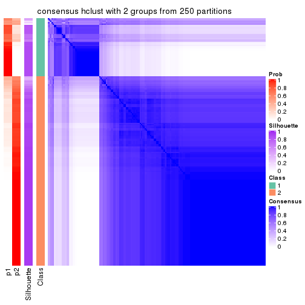</p>

</div>
<div id='tab-MAD-hclust-consensus-heatmap-2'>
<pre><code class="r">consensus_heatmap(res, k = 3)
</code></pre>

<p>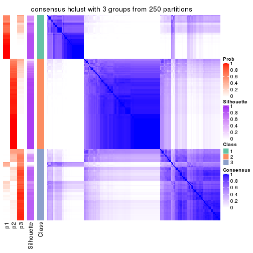</p>

</div>
<div id='tab-MAD-hclust-consensus-heatmap-3'>
<pre><code class="r">consensus_heatmap(res, k = 4)
</code></pre>

<p>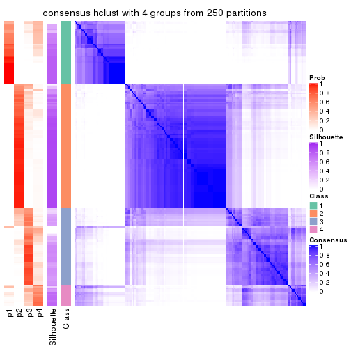</p>

</div>
<div id='tab-MAD-hclust-consensus-heatmap-4'>
<pre><code class="r">consensus_heatmap(res, k = 5)
</code></pre>

<p>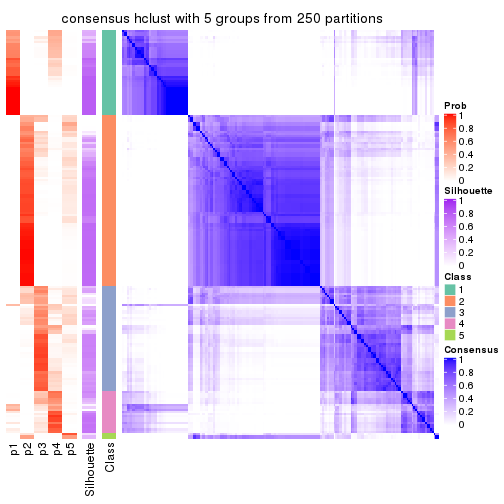</p>

</div>
<div id='tab-MAD-hclust-consensus-heatmap-5'>
<pre><code class="r">consensus_heatmap(res, k = 6)
</code></pre>

<p>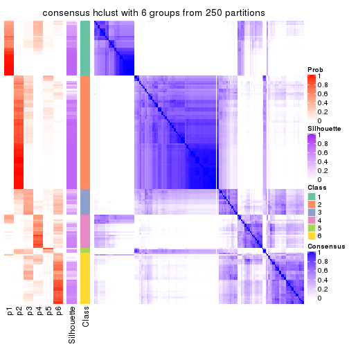</p>

</div>
</div>

Heatmaps for the membership of samples in all partitions to see how consistent they are:


<script>
$( function() {
	$( '#tabs-MAD-hclust-membership-heatmap' ).tabs();
} );
</script>
<div id='tabs-MAD-hclust-membership-heatmap'>
<ul>
<li><a href='#tab-MAD-hclust-membership-heatmap-1'>k = 2</a></li>
<li><a href='#tab-MAD-hclust-membership-heatmap-2'>k = 3</a></li>
<li><a href='#tab-MAD-hclust-membership-heatmap-3'>k = 4</a></li>
<li><a href='#tab-MAD-hclust-membership-heatmap-4'>k = 5</a></li>
<li><a href='#tab-MAD-hclust-membership-heatmap-5'>k = 6</a></li>
</ul>
<div id='tab-MAD-hclust-membership-heatmap-1'>
<pre><code class="r">membership_heatmap(res, k = 2)
</code></pre>

<p>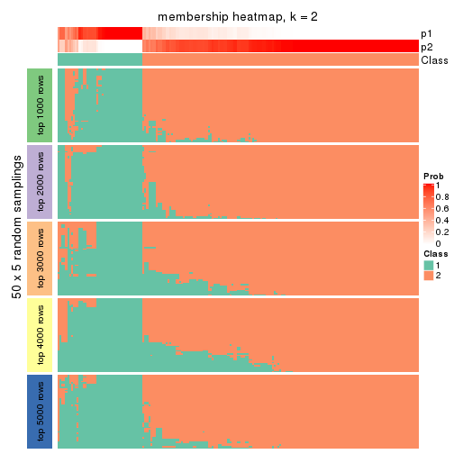</p>

</div>
<div id='tab-MAD-hclust-membership-heatmap-2'>
<pre><code class="r">membership_heatmap(res, k = 3)
</code></pre>

<p>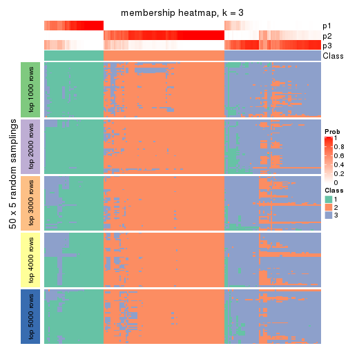</p>

</div>
<div id='tab-MAD-hclust-membership-heatmap-3'>
<pre><code class="r">membership_heatmap(res, k = 4)
</code></pre>

<p>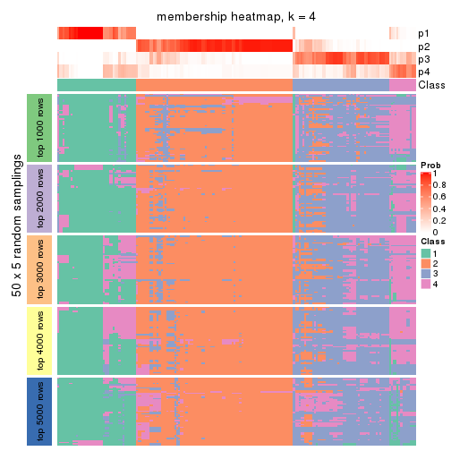</p>

</div>
<div id='tab-MAD-hclust-membership-heatmap-4'>
<pre><code class="r">membership_heatmap(res, k = 5)
</code></pre>

<p>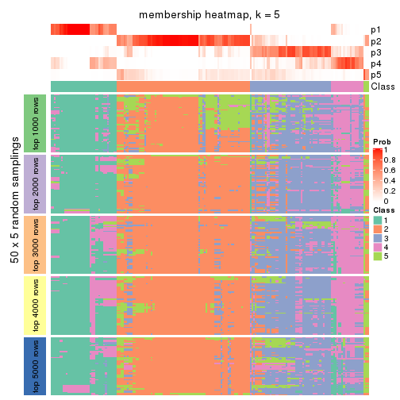</p>

</div>
<div id='tab-MAD-hclust-membership-heatmap-5'>
<pre><code class="r">membership_heatmap(res, k = 6)
</code></pre>

<p>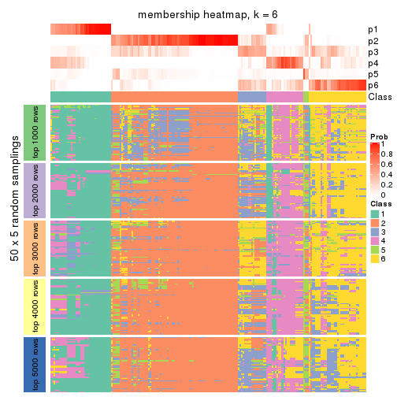</p>

</div>
</div>

As soon as we have had the classes for columns, we can look for signatures
which are significantly different between classes which can be candidate marks
for certain classes. Following are the heatmaps for signatures.


Signature heatmaps where rows are scaled:


<script>
$( function() {
	$( '#tabs-MAD-hclust-get-signatures' ).tabs();
} );
</script>
<div id='tabs-MAD-hclust-get-signatures'>
<ul>
<li><a href='#tab-MAD-hclust-get-signatures-1'>k = 2</a></li>
<li><a href='#tab-MAD-hclust-get-signatures-2'>k = 3</a></li>
<li><a href='#tab-MAD-hclust-get-signatures-3'>k = 4</a></li>
<li><a href='#tab-MAD-hclust-get-signatures-4'>k = 5</a></li>
<li><a href='#tab-MAD-hclust-get-signatures-5'>k = 6</a></li>
</ul>
<div id='tab-MAD-hclust-get-signatures-1'>
<pre><code class="r">get_signatures(res, k = 2)
</code></pre>

<p>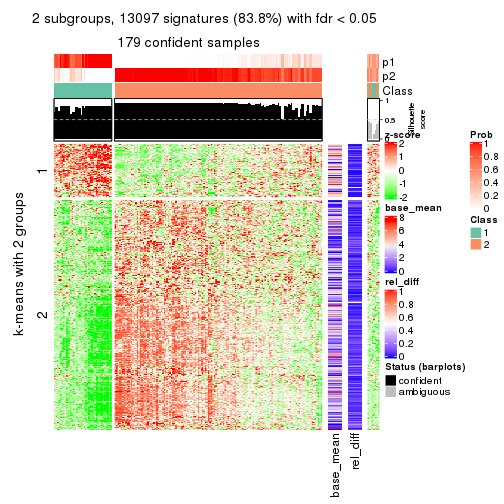</p>

</div>
<div id='tab-MAD-hclust-get-signatures-2'>
<pre><code class="r">get_signatures(res, k = 3)
</code></pre>

<p>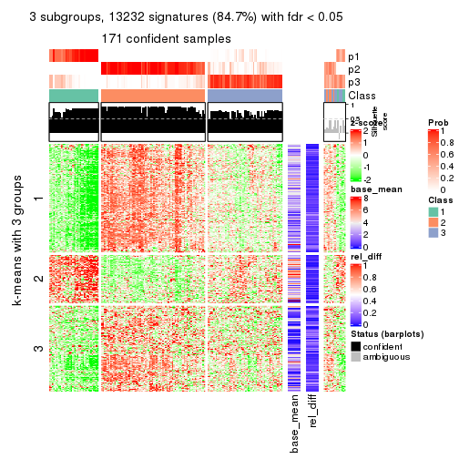</p>

</div>
<div id='tab-MAD-hclust-get-signatures-3'>
<pre><code class="r">get_signatures(res, k = 4)
</code></pre>

<p>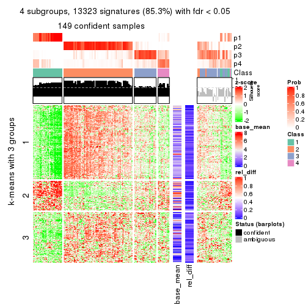</p>

</div>
<div id='tab-MAD-hclust-get-signatures-4'>
<pre><code class="r">get_signatures(res, k = 5)
</code></pre>

<p>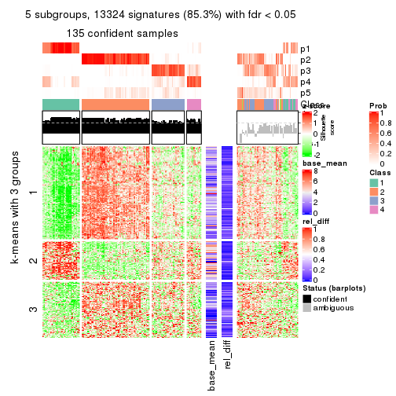</p>

</div>
<div id='tab-MAD-hclust-get-signatures-5'>
<pre><code class="r">get_signatures(res, k = 6)
</code></pre>

<p>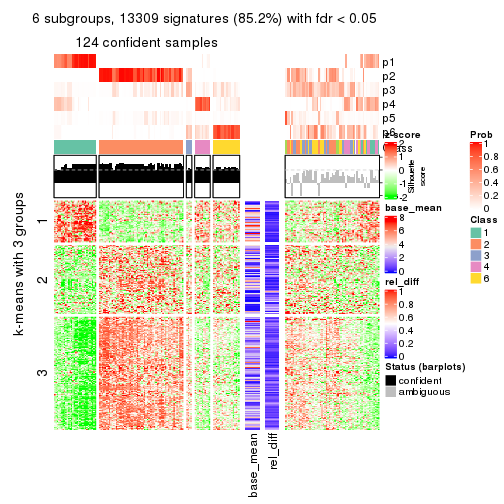</p>

</div>
</div>


Signature heatmaps where rows are not scaled:


<script>
$( function() {
	$( '#tabs-MAD-hclust-get-signatures-no-scale' ).tabs();
} );
</script>
<div id='tabs-MAD-hclust-get-signatures-no-scale'>
<ul>
<li><a href='#tab-MAD-hclust-get-signatures-no-scale-1'>k = 2</a></li>
<li><a href='#tab-MAD-hclust-get-signatures-no-scale-2'>k = 3</a></li>
<li><a href='#tab-MAD-hclust-get-signatures-no-scale-3'>k = 4</a></li>
<li><a href='#tab-MAD-hclust-get-signatures-no-scale-4'>k = 5</a></li>
<li><a href='#tab-MAD-hclust-get-signatures-no-scale-5'>k = 6</a></li>
</ul>
<div id='tab-MAD-hclust-get-signatures-no-scale-1'>
<pre><code class="r">get_signatures(res, k = 2, scale_rows = FALSE)
</code></pre>

<p>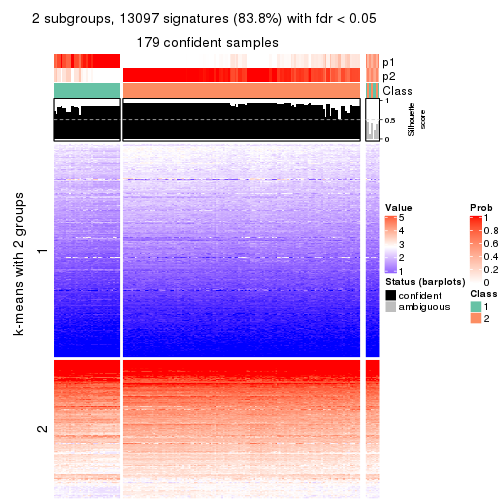</p>

</div>
<div id='tab-MAD-hclust-get-signatures-no-scale-2'>
<pre><code class="r">get_signatures(res, k = 3, scale_rows = FALSE)
</code></pre>

<p>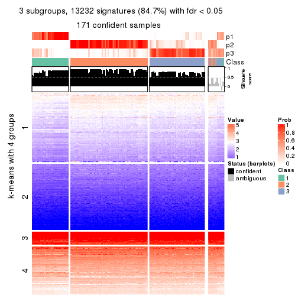</p>

</div>
<div id='tab-MAD-hclust-get-signatures-no-scale-3'>
<pre><code class="r">get_signatures(res, k = 4, scale_rows = FALSE)
</code></pre>

<p>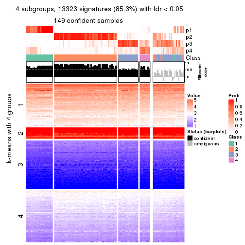</p>

</div>
<div id='tab-MAD-hclust-get-signatures-no-scale-4'>
<pre><code class="r">get_signatures(res, k = 5, scale_rows = FALSE)
</code></pre>

<p>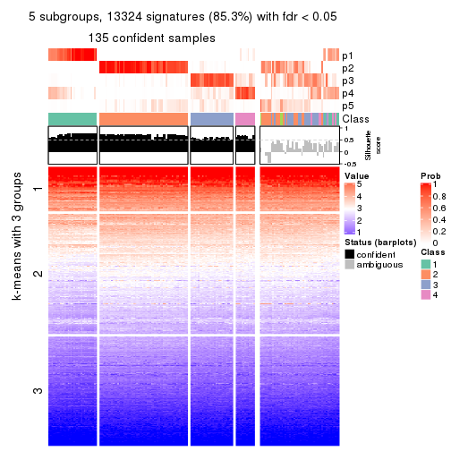</p>

</div>
<div id='tab-MAD-hclust-get-signatures-no-scale-5'>
<pre><code class="r">get_signatures(res, k = 6, scale_rows = FALSE)
</code></pre>

<p>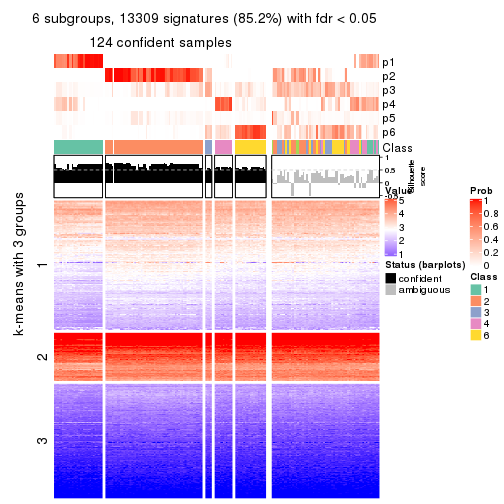</p>

</div>
</div>


Compare the overlap of signatures from different k:

```r
compare_signatures(res)
```

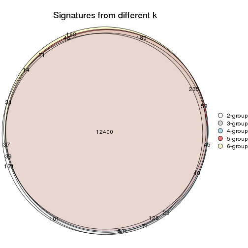

`get_signature()` returns a data frame invisibly. TO get the list of signatures, the function
call should be assigned to a variable explicitly. In following code, if `plot` argument is set
to `FALSE`, no heatmap is plotted while only the differential analysis is performed.

```r
# code only for demonstration
tb = get_signature(res, k = ..., plot = FALSE)
```

An example of the output of `tb` is:

```
#>   which_row         fdr    mean_1    mean_2 scaled_mean_1 scaled_mean_2 km
#> 1        38 0.042760348  8.373488  9.131774    -0.5533452     0.5164555  1
#> 2        40 0.018707592  7.106213  8.469186    -0.6173731     0.5762149  1
#> 3        55 0.019134737 10.221463 11.207825    -0.6159697     0.5749050  1
#> 4        59 0.006059896  5.921854  7.869574    -0.6899429     0.6439467  1
#> 5        60 0.018055526  8.928898 10.211722    -0.6204761     0.5791110  1
#> 6        98 0.009384629 15.714769 14.887706     0.6635654    -0.6193277  2
...
```

The columns in `tb` are:

1. `which_row`: row indices corresponding to the input matrix.
2. `fdr`: FDR for the differential test. 
3. `mean_x`: The mean value in group x.
4. `scaled_mean_x`: The mean value in group x after rows are scaled.
5. `km`: Row groups if k-means clustering is applied to rows.


UMAP plot which shows how samples are separated.


<script>
$( function() {
	$( '#tabs-MAD-hclust-dimension-reduction' ).tabs();
} );
</script>
<div id='tabs-MAD-hclust-dimension-reduction'>
<ul>
<li><a href='#tab-MAD-hclust-dimension-reduction-1'>k = 2</a></li>
<li><a href='#tab-MAD-hclust-dimension-reduction-2'>k = 3</a></li>
<li><a href='#tab-MAD-hclust-dimension-reduction-3'>k = 4</a></li>
<li><a href='#tab-MAD-hclust-dimension-reduction-4'>k = 5</a></li>
<li><a href='#tab-MAD-hclust-dimension-reduction-5'>k = 6</a></li>
</ul>
<div id='tab-MAD-hclust-dimension-reduction-1'>
<pre><code class="r">dimension_reduction(res, k = 2, method = &quot;UMAP&quot;)
</code></pre>

<p>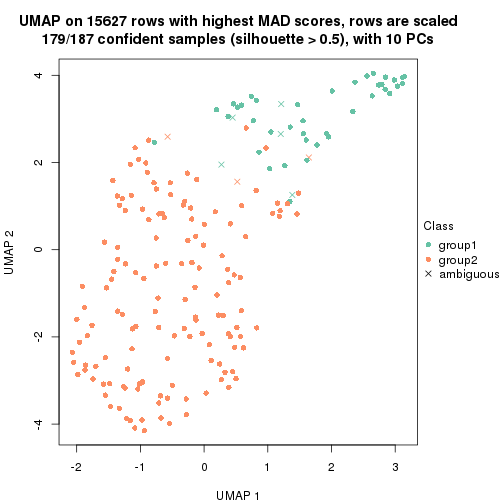</p>

</div>
<div id='tab-MAD-hclust-dimension-reduction-2'>
<pre><code class="r">dimension_reduction(res, k = 3, method = &quot;UMAP&quot;)
</code></pre>

<p>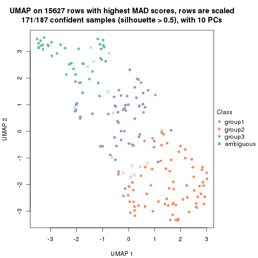</p>

</div>
<div id='tab-MAD-hclust-dimension-reduction-3'>
<pre><code class="r">dimension_reduction(res, k = 4, method = &quot;UMAP&quot;)
</code></pre>

<p>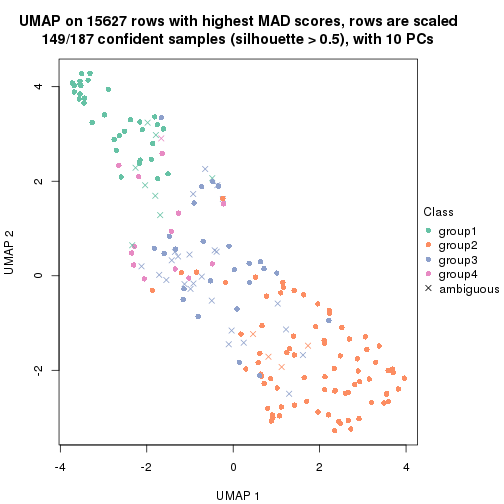</p>

</div>
<div id='tab-MAD-hclust-dimension-reduction-4'>
<pre><code class="r">dimension_reduction(res, k = 5, method = &quot;UMAP&quot;)
</code></pre>

<p>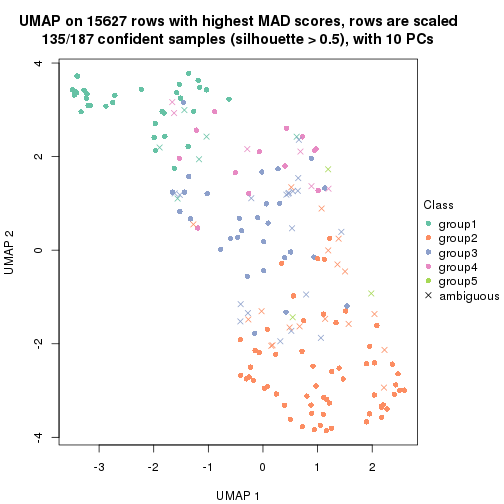</p>

</div>
<div id='tab-MAD-hclust-dimension-reduction-5'>
<pre><code class="r">dimension_reduction(res, k = 6, method = &quot;UMAP&quot;)
</code></pre>

<p>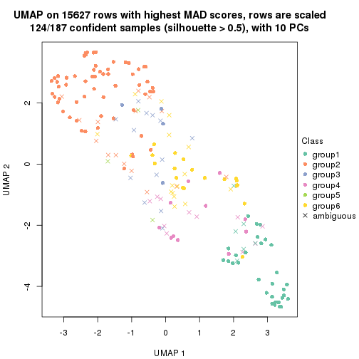</p>

</div>
</div>


Following heatmap shows how subgroups are split when increasing `k`:

```r
collect_classes(res)
```

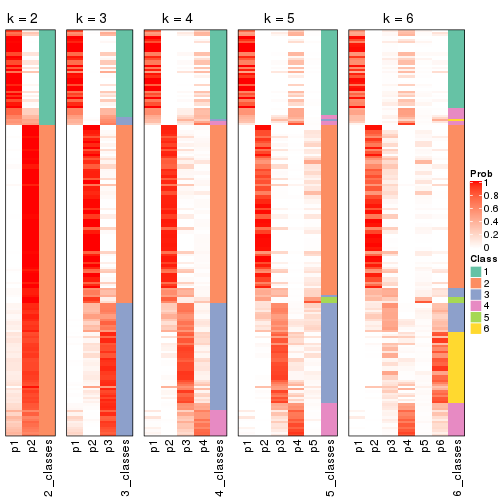


If matrix rows can be associated to genes, consider to use `GO_Enrichment(res,
...)` to perform function enrichment for the signature genes.


 

---------------------------------------------------


### MAD:kmeans**


The object with results only for a single top-value method and a single partition method 
can be extracted as:

```r
res = res_list["MAD", "kmeans"]
# you can also extract it by
# res = res_list["MAD:kmeans"]
```

A summary of `res` and all the functions that can be applied to it:

```r
res
```

```
#> A 'ConsensusPartition' object with k = 2, 3, 4, 5, 6.
#>   On a matrix with 15627 rows and 187 columns.
#>   Top rows (1000, 2000, 3000, 4000, 5000) are extracted by 'MAD' method.
#>   Subgroups are detected by 'kmeans' method.
#>   Performed in total 1250 partitions by row resampling.
#>   Best k for subgroups seems to be 3.
#> 
#> Following methods can be applied to this 'ConsensusPartition' object:
#>  [1] "cola_report"             "collect_classes"         "collect_plots"          
#>  [4] "collect_stats"           "colnames"                "compare_signatures"     
#>  [7] "consensus_heatmap"       "dimension_reduction"     "functional_enrichment"  
#> [10] "get_anno_col"            "get_anno"                "get_classes"            
#> [13] "get_consensus"           "get_matrix"              "get_membership"         
#> [16] "get_param"               "get_signatures"          "get_stats"              
#> [19] "is_best_k"               "is_stable_k"             "membership_heatmap"     
#> [22] "ncol"                    "nrow"                    "plot_ecdf"              
#> [25] "rownames"                "select_partition_number" "show"                   
#> [28] "suggest_best_k"          "test_to_known_factors"
```

`collect_plots()` function collects all the plots made from `res` for all `k` (number of partitions)
into one single page to provide an easy and fast comparison between different `k`.

```r
collect_plots(res)
```

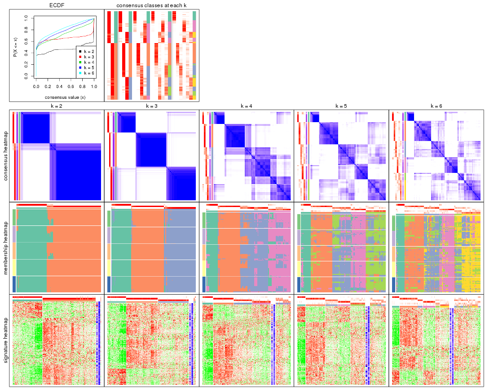

The plots are:

- The first row: a plot of the ECDF (Empirical cumulative distribution
  function) curves of the consensus matrix for each `k` and the heatmap of
  predicted classes for each `k`.
- The second row: heatmaps of the consensus matrix for each `k`.
- The third row: heatmaps of the membership matrix for each `k`.
- The fouth row: heatmaps of the signatures for each `k`.

All the plots in panels can be made by individual functions and they are
plotted later in this section.

`select_partition_number()` produces several plots showing different
statistics for choosing "optimized" `k`. There are following statistics:

- ECDF curves of the consensus matrix for each `k`;
- 1-PAC. [The PAC
  score](https://en.wikipedia.org/wiki/Consensus_clustering#Over-interpretation_potential_of_consensus_clustering)
  measures the proportion of the ambiguous subgrouping.
- Mean silhouette score.
- Concordance. The mean probability of fiting the consensus class ids in all
  partitions.
- Area increased. Denote $A_k$ as the area under the ECDF curve for current
  `k`, the area increased is defined as $A_k - A_{k-1}$.
- Rand index. The percent of pairs of samples that are both in a same cluster
  or both are not in a same cluster in the partition of k and k-1.
- Jaccard index. The ratio of pairs of samples are both in a same cluster in
  the partition of k and k-1 and the pairs of samples are both in a same
  cluster in the partition k or k-1.

The detailed explanations of these statistics can be found in [the cola
vignette](http://bioconductor.org/packages/devel/bioc/vignettes/cola/inst/doc/cola.html#toc_13).

Generally speaking, lower PAC score, higher mean silhouette score or higher
concordance corresponds to better partition. Rand index and Jaccard index
measure how similar the current partition is compared to partition with `k-1`.
If they are too similar, we won't accept `k` is better than `k-1`.

```r
select_partition_number(res)
```

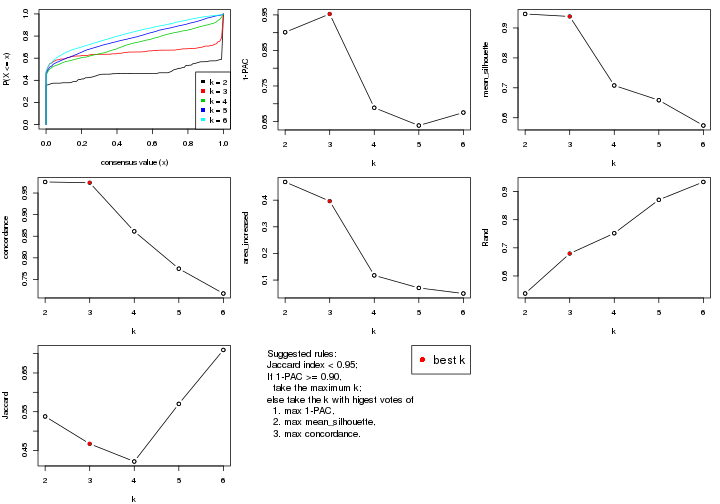

The numeric values for all these statistics can be obtained by `get_stats()`.

```r
get_stats(res)
```

```
#>   k 1-PAC mean_silhouette concordance area_increased  Rand Jaccard
#> 2 2 0.901           0.947       0.976         0.4683 0.538   0.538
#> 3 3 0.953           0.938       0.974         0.3964 0.680   0.467
#> 4 4 0.689           0.708       0.861         0.1176 0.752   0.421
#> 5 5 0.639           0.658       0.775         0.0705 0.871   0.570
#> 6 6 0.675           0.574       0.717         0.0495 0.934   0.709
```

`suggest_best_k()` suggests the best $k$ based on these statistics. The rules are as follows:

- All $k$ with Jaccard index larger than 0.95 are removed because the increase of
  the partition number does not provides enough extra information. If all $k$ are removed,
  the best $k$ is assigned by `NA`.
- For $k$ with 1-PAC larger than 0.9, the maximal $k$ is taken as the "best k". Other $k$ is called "optional k".
- If it does not fit the second rule. The $k$ with the highest vote of highest
  1-PAC, mean silhouette and concordance is taken as the "best k".

```r
suggest_best_k(res)
```

```
#> [1] 3
#> attr(,"optional")
#> [1] 2
```

There is also optional best $k$ = 2 that is worth to check.

Following shows the table of the partitions (You need to click the **show/hide
code output** link to see it). The membership matrix (columns with name `p*`)
is inferred by
[`clue::cl_consensus()`](https://www.rdocumentation.org/link/cl_consensus?package=clue)
function with the `SE` method. Basically the value in the membership matrix
represents the probability to belong to a certain group. The finall class
label for an item is determined with the group with highest probability it
belongs to.

In `get_classes()` function, the entropy is calculated from the membership
matrix and the silhouette score is calculated from the consensus matrix.


<script>
$( function() {
	$( '#tabs-MAD-kmeans-get-classes' ).tabs();
} );
</script>
<div id='tabs-MAD-kmeans-get-classes'>
<ul>
<li><a href='#tab-MAD-kmeans-get-classes-1'>k = 2</a></li>
<li><a href='#tab-MAD-kmeans-get-classes-2'>k = 3</a></li>
<li><a href='#tab-MAD-kmeans-get-classes-3'>k = 4</a></li>
<li><a href='#tab-MAD-kmeans-get-classes-4'>k = 5</a></li>
<li><a href='#tab-MAD-kmeans-get-classes-5'>k = 6</a></li>
</ul>

<div id='tab-MAD-kmeans-get-classes-1'>
<p><a id='tab-MAD-kmeans-get-classes-1-a' style='color:#0366d6' href='#'>show/hide code output</a></p>
<pre><code class="r">cbind(get_classes(res, k = 2), get_membership(res, k = 2))
</code></pre>

<pre><code>#&gt;            class entropy silhouette    p1    p2
#&gt; SRR1747213     1  0.0000      0.984 1.000 0.000
#&gt; SRR1747214     1  0.0000      0.984 1.000 0.000
#&gt; SRR1747215     2  0.0000      0.969 0.000 1.000
#&gt; SRR1747216     2  0.0000      0.969 0.000 1.000
#&gt; SRR1747217     2  0.0000      0.969 0.000 1.000
#&gt; SRR1747218     2  0.0000      0.969 0.000 1.000
#&gt; SRR1747219     2  0.8555      0.642 0.280 0.720
#&gt; SRR1747220     1  0.0000      0.984 1.000 0.000
#&gt; SRR1747221     1  0.0000      0.984 1.000 0.000
#&gt; SRR1747222     1  0.0000      0.984 1.000 0.000
#&gt; SRR1747223     1  0.0000      0.984 1.000 0.000
#&gt; SRR1747224     2  0.0000      0.969 0.000 1.000
#&gt; SRR1747225     2  0.0000      0.969 0.000 1.000
#&gt; SRR1747226     2  0.0000      0.969 0.000 1.000
#&gt; SRR1747227     2  0.0000      0.969 0.000 1.000
#&gt; SRR1747228     2  0.0000      0.969 0.000 1.000
#&gt; SRR1747229     2  0.0000      0.969 0.000 1.000
#&gt; SRR1747230     1  0.0000      0.984 1.000 0.000
#&gt; SRR1747231     1  0.0000      0.984 1.000 0.000
#&gt; SRR1747232     1  0.0000      0.984 1.000 0.000
#&gt; SRR1747233     1  0.0000      0.984 1.000 0.000
#&gt; SRR1747234     2  0.0000      0.969 0.000 1.000
#&gt; SRR1747235     1  0.0000      0.984 1.000 0.000
#&gt; SRR1747236     2  0.0000      0.969 0.000 1.000
#&gt; SRR1747237     2  0.0000      0.969 0.000 1.000
#&gt; SRR1747238     2  0.0000      0.969 0.000 1.000
#&gt; SRR1747239     2  0.0000      0.969 0.000 1.000
#&gt; SRR1747240     1  0.0000      0.984 1.000 0.000
#&gt; SRR1747241     2  0.0000      0.969 0.000 1.000
#&gt; SRR1747242     1  0.0000      0.984 1.000 0.000
#&gt; SRR1747243     1  0.0000      0.984 1.000 0.000
#&gt; SRR1747244     2  0.0000      0.969 0.000 1.000
#&gt; SRR1747245     2  0.0000      0.969 0.000 1.000
#&gt; SRR1747246     2  0.0000      0.969 0.000 1.000
#&gt; SRR1747247     1  0.0000      0.984 1.000 0.000
#&gt; SRR1747248     1  0.0000      0.984 1.000 0.000
#&gt; SRR1747249     1  0.0000      0.984 1.000 0.000
#&gt; SRR1747250     2  0.0000      0.969 0.000 1.000
#&gt; SRR1747252     1  0.0000      0.984 1.000 0.000
#&gt; SRR1747253     1  0.0000      0.984 1.000 0.000
#&gt; SRR1747254     2  0.0000      0.969 0.000 1.000
#&gt; SRR1747255     1  0.0000      0.984 1.000 0.000
#&gt; SRR1747256     1  0.0000      0.984 1.000 0.000
#&gt; SRR1747257     2  0.0000      0.969 0.000 1.000
#&gt; SRR1747258     2  0.0000      0.969 0.000 1.000
#&gt; SRR1747259     2  0.0000      0.969 0.000 1.000
#&gt; SRR1747260     2  0.0000      0.969 0.000 1.000
#&gt; SRR1747261     2  0.0000      0.969 0.000 1.000
#&gt; SRR1747262     2  0.0000      0.969 0.000 1.000
#&gt; SRR1747263     2  0.0000      0.969 0.000 1.000
#&gt; SRR1747264     1  0.0000      0.984 1.000 0.000
#&gt; SRR1747265     2  0.7602      0.737 0.220 0.780
#&gt; SRR1747266     2  0.0000      0.969 0.000 1.000
#&gt; SRR1747267     2  0.9522      0.456 0.372 0.628
#&gt; SRR1747268     2  0.6801      0.790 0.180 0.820
#&gt; SRR1747269     2  0.0000      0.969 0.000 1.000
#&gt; SRR1747270     2  0.0000      0.969 0.000 1.000
#&gt; SRR1747271     2  0.0000      0.969 0.000 1.000
#&gt; SRR1747272     1  0.0938      0.973 0.988 0.012
#&gt; SRR1747273     1  0.0000      0.984 1.000 0.000
#&gt; SRR1747274     2  0.0000      0.969 0.000 1.000
#&gt; SRR1747275     1  0.0000      0.984 1.000 0.000
#&gt; SRR1747276     1  0.0000      0.984 1.000 0.000
#&gt; SRR1747277     2  0.0000      0.969 0.000 1.000
#&gt; SRR1747278     2  0.4161      0.895 0.084 0.916
#&gt; SRR1747280     1  0.0000      0.984 1.000 0.000
#&gt; SRR1747279     1  0.0000      0.984 1.000 0.000
#&gt; SRR1747281     2  0.0000      0.969 0.000 1.000
#&gt; SRR1747282     1  0.0000      0.984 1.000 0.000
#&gt; SRR1747283     2  0.7883      0.713 0.236 0.764
#&gt; SRR1747284     1  0.0000      0.984 1.000 0.000
#&gt; SRR1747285     2  0.0000      0.969 0.000 1.000
#&gt; SRR1747286     2  0.0000      0.969 0.000 1.000
#&gt; SRR1747287     2  0.0000      0.969 0.000 1.000
#&gt; SRR1747288     1  0.0000      0.984 1.000 0.000
#&gt; SRR1747290     2  0.0000      0.969 0.000 1.000
#&gt; SRR1747289     2  0.0000      0.969 0.000 1.000
#&gt; SRR1747291     2  0.0000      0.969 0.000 1.000
#&gt; SRR1747293     2  0.0000      0.969 0.000 1.000
#&gt; SRR1747294     2  0.0000      0.969 0.000 1.000
#&gt; SRR1747292     1  0.0000      0.984 1.000 0.000
#&gt; SRR1747295     2  0.0000      0.969 0.000 1.000
#&gt; SRR1747296     2  0.0000      0.969 0.000 1.000
#&gt; SRR1747297     2  0.0000      0.969 0.000 1.000
#&gt; SRR1747298     2  0.0000      0.969 0.000 1.000
#&gt; SRR1747299     2  0.0000      0.969 0.000 1.000
#&gt; SRR1747300     2  0.0000      0.969 0.000 1.000
#&gt; SRR1747301     2  0.0000      0.969 0.000 1.000
#&gt; SRR1747302     2  0.0000      0.969 0.000 1.000
#&gt; SRR1747303     2  0.0000      0.969 0.000 1.000
#&gt; SRR1747304     1  0.0000      0.984 1.000 0.000
#&gt; SRR1747305     2  0.0000      0.969 0.000 1.000
#&gt; SRR1747306     2  0.0000      0.969 0.000 1.000
#&gt; SRR1747307     1  0.1633      0.962 0.976 0.024
#&gt; SRR1747308     2  0.0000      0.969 0.000 1.000
#&gt; SRR1747309     1  0.0000      0.984 1.000 0.000
#&gt; SRR1747310     1  0.0000      0.984 1.000 0.000
#&gt; SRR1747311     1  0.6623      0.789 0.828 0.172
#&gt; SRR1747313     1  0.6801      0.778 0.820 0.180
#&gt; SRR1747312     1  0.0000      0.984 1.000 0.000
#&gt; SRR1747314     1  0.0000      0.984 1.000 0.000
#&gt; SRR1747315     2  0.0000      0.969 0.000 1.000
#&gt; SRR1747316     2  0.0000      0.969 0.000 1.000
#&gt; SRR1747318     2  0.8861      0.598 0.304 0.696
#&gt; SRR1747317     2  0.2236      0.939 0.036 0.964
#&gt; SRR1747319     1  0.8327      0.646 0.736 0.264
#&gt; SRR1747320     1  0.0000      0.984 1.000 0.000
#&gt; SRR1747322     1  0.0000      0.984 1.000 0.000
#&gt; SRR1747321     1  0.0000      0.984 1.000 0.000
#&gt; SRR1747323     2  0.0000      0.969 0.000 1.000
#&gt; SRR1747324     2  0.0000      0.969 0.000 1.000
#&gt; SRR1747326     2  0.0000      0.969 0.000 1.000
#&gt; SRR1747325     2  0.0000      0.969 0.000 1.000
#&gt; SRR1747327     2  0.0000      0.969 0.000 1.000
#&gt; SRR1747328     2  0.8813      0.608 0.300 0.700
#&gt; SRR1747330     1  0.0000      0.984 1.000 0.000
#&gt; SRR1747329     2  0.0000      0.969 0.000 1.000
#&gt; SRR1747332     1  0.0000      0.984 1.000 0.000
#&gt; SRR1747331     2  0.0000      0.969 0.000 1.000
#&gt; SRR1747333     2  0.0000      0.969 0.000 1.000
#&gt; SRR1747334     2  0.0000      0.969 0.000 1.000
#&gt; SRR1747335     1  0.6048      0.819 0.852 0.148
#&gt; SRR1747336     1  0.0000      0.984 1.000 0.000
#&gt; SRR1747337     2  0.0000      0.969 0.000 1.000
#&gt; SRR1747338     2  0.0000      0.969 0.000 1.000
#&gt; SRR1747339     2  0.8661      0.629 0.288 0.712
#&gt; SRR1747340     2  0.0000      0.969 0.000 1.000
#&gt; SRR1747341     2  0.0000      0.969 0.000 1.000
#&gt; SRR1747342     2  0.0000      0.969 0.000 1.000
#&gt; SRR1747343     2  0.0000      0.969 0.000 1.000
#&gt; SRR1747344     2  0.0000      0.969 0.000 1.000
#&gt; SRR1747345     2  0.8207      0.683 0.256 0.744
#&gt; SRR1747346     2  0.7528      0.742 0.216 0.784
#&gt; SRR1747347     2  0.0000      0.969 0.000 1.000
#&gt; SRR1747348     1  0.0000      0.984 1.000 0.000
#&gt; SRR1747349     1  0.0000      0.984 1.000 0.000
#&gt; SRR1747351     2  0.0000      0.969 0.000 1.000
#&gt; SRR1747350     2  0.0000      0.969 0.000 1.000
#&gt; SRR1747352     1  0.0000      0.984 1.000 0.000
#&gt; SRR1747353     2  0.0000      0.969 0.000 1.000
#&gt; SRR1747354     2  0.0000      0.969 0.000 1.000
#&gt; SRR1747355     1  0.0000      0.984 1.000 0.000
#&gt; SRR1747356     2  0.0000      0.969 0.000 1.000
#&gt; SRR1747357     2  0.0000      0.969 0.000 1.000
#&gt; SRR1747358     2  0.0000      0.969 0.000 1.000
#&gt; SRR1747359     1  0.0000      0.984 1.000 0.000
#&gt; SRR1747360     2  0.0000      0.969 0.000 1.000
#&gt; SRR1747361     1  0.0000      0.984 1.000 0.000
#&gt; SRR1747362     2  0.0000      0.969 0.000 1.000
#&gt; SRR1747363     1  0.0000      0.984 1.000 0.000
#&gt; SRR1747364     1  0.0000      0.984 1.000 0.000
#&gt; SRR1747365     2  0.5737      0.841 0.136 0.864
#&gt; SRR1747366     2  0.0000      0.969 0.000 1.000
#&gt; SRR1747367     1  0.0000      0.984 1.000 0.000
#&gt; SRR1747369     2  0.0000      0.969 0.000 1.000
#&gt; SRR1747368     2  0.6247      0.818 0.156 0.844
#&gt; SRR1747370     2  0.0000      0.969 0.000 1.000
#&gt; SRR1747372     1  0.0000      0.984 1.000 0.000
#&gt; SRR1747371     1  0.0000      0.984 1.000 0.000
#&gt; SRR1747373     2  0.0000      0.969 0.000 1.000
#&gt; SRR1747374     2  0.0000      0.969 0.000 1.000
#&gt; SRR1747375     1  0.0000      0.984 1.000 0.000
#&gt; SRR1747376     2  0.0000      0.969 0.000 1.000
#&gt; SRR1747377     2  0.0000      0.969 0.000 1.000
#&gt; SRR1747378     2  0.0000      0.969 0.000 1.000
#&gt; SRR1747379     2  0.0000      0.969 0.000 1.000
#&gt; SRR1747380     2  0.7528      0.742 0.216 0.784
#&gt; SRR1747381     1  0.0000      0.984 1.000 0.000
#&gt; SRR1747382     1  0.0000      0.984 1.000 0.000
#&gt; SRR1747383     2  0.0000      0.969 0.000 1.000
#&gt; SRR1747384     2  0.8661      0.628 0.288 0.712
#&gt; SRR1747385     2  0.0000      0.969 0.000 1.000
#&gt; SRR1747386     1  0.0000      0.984 1.000 0.000
#&gt; SRR1747387     2  0.0000      0.969 0.000 1.000
#&gt; SRR1747388     2  0.0000      0.969 0.000 1.000
#&gt; SRR1747390     2  0.0000      0.969 0.000 1.000
#&gt; SRR1747389     2  0.0000      0.969 0.000 1.000
#&gt; SRR1747391     2  0.0000      0.969 0.000 1.000
#&gt; SRR1747392     2  0.0000      0.969 0.000 1.000
#&gt; SRR1747393     2  0.0000      0.969 0.000 1.000
#&gt; SRR1747394     1  0.0000      0.984 1.000 0.000
#&gt; SRR1747395     2  0.0000      0.969 0.000 1.000
#&gt; SRR1747396     2  0.0000      0.969 0.000 1.000
#&gt; SRR1747398     2  0.0000      0.969 0.000 1.000
#&gt; SRR1747397     1  0.7056      0.761 0.808 0.192
#&gt; SRR1747399     1  0.0000      0.984 1.000 0.000
#&gt; SRR1747400     1  0.0000      0.984 1.000 0.000
</code></pre>

<script>
$('#tab-MAD-kmeans-get-classes-1-a').parent().next().next().hide();
$('#tab-MAD-kmeans-get-classes-1-a').click(function(){
  $('#tab-MAD-kmeans-get-classes-1-a').parent().next().next().toggle();
  return(false);
});
</script>
</div>

<div id='tab-MAD-kmeans-get-classes-2'>
<p><a id='tab-MAD-kmeans-get-classes-2-a' style='color:#0366d6' href='#'>show/hide code output</a></p>
<pre><code class="r">cbind(get_classes(res, k = 3), get_membership(res, k = 3))
</code></pre>

<pre><code>#&gt;            class entropy silhouette    p1    p2    p3
#&gt; SRR1747213     3  0.0424      0.958 0.008 0.000 0.992
#&gt; SRR1747214     1  0.0000      0.960 1.000 0.000 0.000
#&gt; SRR1747215     2  0.0000      0.985 0.000 1.000 0.000
#&gt; SRR1747216     2  0.0000      0.985 0.000 1.000 0.000
#&gt; SRR1747217     3  0.0000      0.963 0.000 0.000 1.000
#&gt; SRR1747218     3  0.6111      0.364 0.000 0.396 0.604
#&gt; SRR1747219     3  0.0000      0.963 0.000 0.000 1.000
#&gt; SRR1747220     1  0.5968      0.444 0.636 0.000 0.364
#&gt; SRR1747221     3  0.3752      0.815 0.144 0.000 0.856
#&gt; SRR1747222     1  0.3941      0.825 0.844 0.000 0.156
#&gt; SRR1747223     3  0.3116      0.859 0.108 0.000 0.892
#&gt; SRR1747224     3  0.0000      0.963 0.000 0.000 1.000
#&gt; SRR1747225     3  0.1289      0.938 0.000 0.032 0.968
#&gt; SRR1747226     2  0.0000      0.985 0.000 1.000 0.000
#&gt; SRR1747227     2  0.0000      0.985 0.000 1.000 0.000
#&gt; SRR1747228     3  0.0000      0.963 0.000 0.000 1.000
#&gt; SRR1747229     2  0.0000      0.985 0.000 1.000 0.000
#&gt; SRR1747230     1  0.0000      0.960 1.000 0.000 0.000
#&gt; SRR1747231     1  0.3267      0.864 0.884 0.000 0.116
#&gt; SRR1747232     1  0.0000      0.960 1.000 0.000 0.000
#&gt; SRR1747233     1  0.3686      0.844 0.860 0.000 0.140
#&gt; SRR1747234     3  0.0000      0.963 0.000 0.000 1.000
#&gt; SRR1747235     1  0.0000      0.960 1.000 0.000 0.000
#&gt; SRR1747236     2  0.0000      0.985 0.000 1.000 0.000
#&gt; SRR1747237     2  0.0000      0.985 0.000 1.000 0.000
#&gt; SRR1747238     2  0.0000      0.985 0.000 1.000 0.000
#&gt; SRR1747239     2  0.0000      0.985 0.000 1.000 0.000
#&gt; SRR1747240     1  0.0000      0.960 1.000 0.000 0.000
#&gt; SRR1747241     3  0.1643      0.925 0.000 0.044 0.956
#&gt; SRR1747242     1  0.0000      0.960 1.000 0.000 0.000
#&gt; SRR1747243     3  0.0424      0.958 0.008 0.000 0.992
#&gt; SRR1747244     3  0.0000      0.963 0.000 0.000 1.000
#&gt; SRR1747245     3  0.4452      0.750 0.000 0.192 0.808
#&gt; SRR1747246     2  0.0000      0.985 0.000 1.000 0.000
#&gt; SRR1747247     1  0.0000      0.960 1.000 0.000 0.000
#&gt; SRR1747248     1  0.0000      0.960 1.000 0.000 0.000
#&gt; SRR1747249     1  0.3267      0.870 0.884 0.000 0.116
#&gt; SRR1747250     3  0.0000      0.963 0.000 0.000 1.000
#&gt; SRR1747252     3  0.1289      0.939 0.032 0.000 0.968
#&gt; SRR1747253     1  0.6280      0.200 0.540 0.000 0.460
#&gt; SRR1747254     2  0.0000      0.985 0.000 1.000 0.000
#&gt; SRR1747255     1  0.0892      0.950 0.980 0.000 0.020
#&gt; SRR1747256     1  0.0747      0.952 0.984 0.000 0.016
#&gt; SRR1747257     2  0.0000      0.985 0.000 1.000 0.000
#&gt; SRR1747258     3  0.0237      0.961 0.000 0.004 0.996
#&gt; SRR1747259     2  0.0000      0.985 0.000 1.000 0.000
#&gt; SRR1747260     3  0.0000      0.963 0.000 0.000 1.000
#&gt; SRR1747261     3  0.0424      0.958 0.000 0.008 0.992
#&gt; SRR1747262     2  0.0000      0.985 0.000 1.000 0.000
#&gt; SRR1747263     2  0.0000      0.985 0.000 1.000 0.000
#&gt; SRR1747264     1  0.0000      0.960 1.000 0.000 0.000
#&gt; SRR1747265     3  0.0000      0.963 0.000 0.000 1.000
#&gt; SRR1747266     3  0.0237      0.961 0.000 0.004 0.996
#&gt; SRR1747267     3  0.0000      0.963 0.000 0.000 1.000
#&gt; SRR1747268     3  0.0000      0.963 0.000 0.000 1.000
#&gt; SRR1747269     2  0.0000      0.985 0.000 1.000 0.000
#&gt; SRR1747270     2  0.0000      0.985 0.000 1.000 0.000
#&gt; SRR1747271     2  0.0000      0.985 0.000 1.000 0.000
#&gt; SRR1747272     3  0.0000      0.963 0.000 0.000 1.000
#&gt; SRR1747273     1  0.0592      0.955 0.988 0.000 0.012
#&gt; SRR1747274     3  0.0892      0.949 0.000 0.020 0.980
#&gt; SRR1747275     1  0.0237      0.959 0.996 0.000 0.004
#&gt; SRR1747276     1  0.2448      0.907 0.924 0.000 0.076
#&gt; SRR1747277     2  0.0000      0.985 0.000 1.000 0.000
#&gt; SRR1747278     3  0.0000      0.963 0.000 0.000 1.000
#&gt; SRR1747280     1  0.0000      0.960 1.000 0.000 0.000
#&gt; SRR1747279     1  0.0237      0.959 0.996 0.000 0.004
#&gt; SRR1747281     2  0.0000      0.985 0.000 1.000 0.000
#&gt; SRR1747282     1  0.0000      0.960 1.000 0.000 0.000
#&gt; SRR1747283     3  0.0000      0.963 0.000 0.000 1.000
#&gt; SRR1747284     1  0.0000      0.960 1.000 0.000 0.000
#&gt; SRR1747285     3  0.0000      0.963 0.000 0.000 1.000
#&gt; SRR1747286     3  0.6225      0.267 0.000 0.432 0.568
#&gt; SRR1747287     2  0.0000      0.985 0.000 1.000 0.000
#&gt; SRR1747288     3  0.0000      0.963 0.000 0.000 1.000
#&gt; SRR1747290     2  0.0000      0.985 0.000 1.000 0.000
#&gt; SRR1747289     2  0.0000      0.985 0.000 1.000 0.000
#&gt; SRR1747291     2  0.1289      0.958 0.000 0.968 0.032
#&gt; SRR1747293     3  0.0237      0.961 0.000 0.004 0.996
#&gt; SRR1747294     2  0.0000      0.985 0.000 1.000 0.000
#&gt; SRR1747292     1  0.0237      0.959 0.996 0.000 0.004
#&gt; SRR1747295     2  0.0000      0.985 0.000 1.000 0.000
#&gt; SRR1747296     2  0.1860      0.937 0.000 0.948 0.052
#&gt; SRR1747297     2  0.0000      0.985 0.000 1.000 0.000
#&gt; SRR1747298     2  0.0000      0.985 0.000 1.000 0.000
#&gt; SRR1747299     2  0.0000      0.985 0.000 1.000 0.000
#&gt; SRR1747300     2  0.0000      0.985 0.000 1.000 0.000
#&gt; SRR1747301     2  0.0000      0.985 0.000 1.000 0.000
#&gt; SRR1747302     2  0.0000      0.985 0.000 1.000 0.000
#&gt; SRR1747303     2  0.2356      0.914 0.000 0.928 0.072
#&gt; SRR1747304     1  0.0000      0.960 1.000 0.000 0.000
#&gt; SRR1747305     2  0.0000      0.985 0.000 1.000 0.000
#&gt; SRR1747306     2  0.0000      0.985 0.000 1.000 0.000
#&gt; SRR1747307     3  0.0000      0.963 0.000 0.000 1.000
#&gt; SRR1747308     3  0.3340      0.842 0.000 0.120 0.880
#&gt; SRR1747309     3  0.1860      0.920 0.052 0.000 0.948
#&gt; SRR1747310     1  0.0000      0.960 1.000 0.000 0.000
#&gt; SRR1747311     3  0.0000      0.963 0.000 0.000 1.000
#&gt; SRR1747313     3  0.0000      0.963 0.000 0.000 1.000
#&gt; SRR1747312     1  0.0000      0.960 1.000 0.000 0.000
#&gt; SRR1747314     1  0.0000      0.960 1.000 0.000 0.000
#&gt; SRR1747315     2  0.1529      0.949 0.000 0.960 0.040
#&gt; SRR1747316     3  0.0747      0.952 0.000 0.016 0.984
#&gt; SRR1747318     3  0.0000      0.963 0.000 0.000 1.000
#&gt; SRR1747317     3  0.0000      0.963 0.000 0.000 1.000
#&gt; SRR1747319     3  0.0000      0.963 0.000 0.000 1.000
#&gt; SRR1747320     1  0.3551      0.853 0.868 0.000 0.132
#&gt; SRR1747322     1  0.0000      0.960 1.000 0.000 0.000
#&gt; SRR1747321     1  0.0000      0.960 1.000 0.000 0.000
#&gt; SRR1747323     2  0.0000      0.985 0.000 1.000 0.000
#&gt; SRR1747324     2  0.0000      0.985 0.000 1.000 0.000
#&gt; SRR1747326     2  0.0000      0.985 0.000 1.000 0.000
#&gt; SRR1747325     2  0.0000      0.985 0.000 1.000 0.000
#&gt; SRR1747327     2  0.0000      0.985 0.000 1.000 0.000
#&gt; SRR1747328     3  0.0000      0.963 0.000 0.000 1.000
#&gt; SRR1747330     3  0.0000      0.963 0.000 0.000 1.000
#&gt; SRR1747329     3  0.0237      0.961 0.000 0.004 0.996
#&gt; SRR1747332     3  0.1411      0.935 0.036 0.000 0.964
#&gt; SRR1747331     2  0.5138      0.660 0.000 0.748 0.252
#&gt; SRR1747333     2  0.6252      0.196 0.000 0.556 0.444
#&gt; SRR1747334     2  0.0000      0.985 0.000 1.000 0.000
#&gt; SRR1747335     3  0.0000      0.963 0.000 0.000 1.000
#&gt; SRR1747336     1  0.0000      0.960 1.000 0.000 0.000
#&gt; SRR1747337     2  0.0000      0.985 0.000 1.000 0.000
#&gt; SRR1747338     2  0.0000      0.985 0.000 1.000 0.000
#&gt; SRR1747339     3  0.0000      0.963 0.000 0.000 1.000
#&gt; SRR1747340     3  0.0237      0.961 0.000 0.004 0.996
#&gt; SRR1747341     2  0.0000      0.985 0.000 1.000 0.000
#&gt; SRR1747342     2  0.0000      0.985 0.000 1.000 0.000
#&gt; SRR1747343     2  0.0000      0.985 0.000 1.000 0.000
#&gt; SRR1747344     2  0.0000      0.985 0.000 1.000 0.000
#&gt; SRR1747345     3  0.0000      0.963 0.000 0.000 1.000
#&gt; SRR1747346     3  0.0000      0.963 0.000 0.000 1.000
#&gt; SRR1747347     2  0.0000      0.985 0.000 1.000 0.000
#&gt; SRR1747348     1  0.0000      0.960 1.000 0.000 0.000
#&gt; SRR1747349     1  0.0000      0.960 1.000 0.000 0.000
#&gt; SRR1747351     2  0.0000      0.985 0.000 1.000 0.000
#&gt; SRR1747350     2  0.0747      0.972 0.000 0.984 0.016
#&gt; SRR1747352     1  0.0000      0.960 1.000 0.000 0.000
#&gt; SRR1747353     2  0.0747      0.972 0.000 0.984 0.016
#&gt; SRR1747354     3  0.0000      0.963 0.000 0.000 1.000
#&gt; SRR1747355     3  0.1411      0.935 0.036 0.000 0.964
#&gt; SRR1747356     3  0.0000      0.963 0.000 0.000 1.000
#&gt; SRR1747357     3  0.0000      0.963 0.000 0.000 1.000
#&gt; SRR1747358     3  0.0000      0.963 0.000 0.000 1.000
#&gt; SRR1747359     1  0.0237      0.959 0.996 0.000 0.004
#&gt; SRR1747360     2  0.0592      0.975 0.000 0.988 0.012
#&gt; SRR1747361     3  0.0000      0.963 0.000 0.000 1.000
#&gt; SRR1747362     2  0.0000      0.985 0.000 1.000 0.000
#&gt; SRR1747363     3  0.0000      0.963 0.000 0.000 1.000
#&gt; SRR1747364     1  0.2066      0.919 0.940 0.000 0.060
#&gt; SRR1747365     3  0.0000      0.963 0.000 0.000 1.000
#&gt; SRR1747366     2  0.0000      0.985 0.000 1.000 0.000
#&gt; SRR1747367     3  0.0000      0.963 0.000 0.000 1.000
#&gt; SRR1747369     2  0.0000      0.985 0.000 1.000 0.000
#&gt; SRR1747368     3  0.0000      0.963 0.000 0.000 1.000
#&gt; SRR1747370     3  0.0000      0.963 0.000 0.000 1.000
#&gt; SRR1747372     1  0.0000      0.960 1.000 0.000 0.000
#&gt; SRR1747371     3  0.5291      0.615 0.268 0.000 0.732
#&gt; SRR1747373     2  0.0000      0.985 0.000 1.000 0.000
#&gt; SRR1747374     2  0.0000      0.985 0.000 1.000 0.000
#&gt; SRR1747375     3  0.0000      0.963 0.000 0.000 1.000
#&gt; SRR1747376     2  0.0000      0.985 0.000 1.000 0.000
#&gt; SRR1747377     2  0.0000      0.985 0.000 1.000 0.000
#&gt; SRR1747378     2  0.0892      0.968 0.000 0.980 0.020
#&gt; SRR1747379     3  0.0592      0.955 0.000 0.012 0.988
#&gt; SRR1747380     3  0.0000      0.963 0.000 0.000 1.000
#&gt; SRR1747381     1  0.0000      0.960 1.000 0.000 0.000
#&gt; SRR1747382     1  0.0000      0.960 1.000 0.000 0.000
#&gt; SRR1747383     2  0.0000      0.985 0.000 1.000 0.000
#&gt; SRR1747384     3  0.0000      0.963 0.000 0.000 1.000
#&gt; SRR1747385     3  0.0237      0.961 0.000 0.004 0.996
#&gt; SRR1747386     1  0.0000      0.960 1.000 0.000 0.000
#&gt; SRR1747387     2  0.0000      0.985 0.000 1.000 0.000
#&gt; SRR1747388     2  0.0000      0.985 0.000 1.000 0.000
#&gt; SRR1747390     3  0.5016      0.690 0.000 0.240 0.760
#&gt; SRR1747389     2  0.1031      0.965 0.000 0.976 0.024
#&gt; SRR1747391     2  0.0000      0.985 0.000 1.000 0.000
#&gt; SRR1747392     2  0.0000      0.985 0.000 1.000 0.000
#&gt; SRR1747393     3  0.0000      0.963 0.000 0.000 1.000
#&gt; SRR1747394     3  0.0000      0.963 0.000 0.000 1.000
#&gt; SRR1747395     3  0.0000      0.963 0.000 0.000 1.000
#&gt; SRR1747396     2  0.0000      0.985 0.000 1.000 0.000
#&gt; SRR1747398     2  0.0000      0.985 0.000 1.000 0.000
#&gt; SRR1747397     3  0.0000      0.963 0.000 0.000 1.000
#&gt; SRR1747399     1  0.0000      0.960 1.000 0.000 0.000
#&gt; SRR1747400     1  0.0000      0.960 1.000 0.000 0.000
</code></pre>

<script>
$('#tab-MAD-kmeans-get-classes-2-a').parent().next().next().hide();
$('#tab-MAD-kmeans-get-classes-2-a').click(function(){
  $('#tab-MAD-kmeans-get-classes-2-a').parent().next().next().toggle();
  return(false);
});
</script>
</div>

<div id='tab-MAD-kmeans-get-classes-3'>
<p><a id='tab-MAD-kmeans-get-classes-3-a' style='color:#0366d6' href='#'>show/hide code output</a></p>
<pre><code class="r">cbind(get_classes(res, k = 4), get_membership(res, k = 4))
</code></pre>

<pre><code>#&gt;            class entropy silhouette    p1    p2    p3    p4
#&gt; SRR1747213     4  0.1211    0.73625 0.000 0.000 0.040 0.960
#&gt; SRR1747214     1  0.4985    0.28583 0.532 0.000 0.000 0.468
#&gt; SRR1747215     2  0.0336    0.95591 0.000 0.992 0.000 0.008
#&gt; SRR1747216     2  0.0188    0.95599 0.000 0.996 0.004 0.000
#&gt; SRR1747217     3  0.4605    0.24866 0.000 0.000 0.664 0.336
#&gt; SRR1747218     3  0.0707    0.74935 0.000 0.020 0.980 0.000
#&gt; SRR1747219     3  0.4843    0.05536 0.000 0.000 0.604 0.396
#&gt; SRR1747220     4  0.3224    0.67380 0.120 0.000 0.016 0.864
#&gt; SRR1747221     4  0.0657    0.73349 0.004 0.000 0.012 0.984
#&gt; SRR1747222     4  0.1940    0.70684 0.076 0.000 0.000 0.924
#&gt; SRR1747223     4  0.0657    0.73349 0.004 0.000 0.012 0.984
#&gt; SRR1747224     3  0.4855    0.19400 0.000 0.000 0.600 0.400
#&gt; SRR1747225     3  0.2222    0.74105 0.000 0.016 0.924 0.060
#&gt; SRR1747226     2  0.0188    0.95658 0.000 0.996 0.004 0.000
#&gt; SRR1747227     2  0.1042    0.95099 0.000 0.972 0.020 0.008
#&gt; SRR1747228     3  0.2530    0.71104 0.000 0.000 0.888 0.112
#&gt; SRR1747229     2  0.4877    0.43183 0.000 0.664 0.328 0.008
#&gt; SRR1747230     1  0.0000    0.92102 1.000 0.000 0.000 0.000
#&gt; SRR1747231     4  0.3626    0.60741 0.184 0.000 0.004 0.812
#&gt; SRR1747232     1  0.0000    0.92102 1.000 0.000 0.000 0.000
#&gt; SRR1747233     4  0.3444    0.60868 0.184 0.000 0.000 0.816
#&gt; SRR1747234     3  0.1022    0.74339 0.000 0.000 0.968 0.032
#&gt; SRR1747235     1  0.0000    0.92102 1.000 0.000 0.000 0.000
#&gt; SRR1747236     2  0.4040    0.61405 0.000 0.752 0.248 0.000
#&gt; SRR1747237     2  0.1042    0.95101 0.000 0.972 0.020 0.008
#&gt; SRR1747238     3  0.3123    0.70851 0.000 0.156 0.844 0.000
#&gt; SRR1747239     2  0.0524    0.95578 0.000 0.988 0.004 0.008
#&gt; SRR1747240     1  0.0000    0.92102 1.000 0.000 0.000 0.000
#&gt; SRR1747241     3  0.0336    0.74701 0.000 0.000 0.992 0.008
#&gt; SRR1747242     1  0.0000    0.92102 1.000 0.000 0.000 0.000
#&gt; SRR1747243     4  0.0592    0.73454 0.000 0.000 0.016 0.984
#&gt; SRR1747244     3  0.3172    0.67433 0.000 0.000 0.840 0.160
#&gt; SRR1747245     3  0.2589    0.71767 0.000 0.000 0.884 0.116
#&gt; SRR1747246     2  0.0188    0.95658 0.000 0.996 0.004 0.000
#&gt; SRR1747247     1  0.0000    0.92102 1.000 0.000 0.000 0.000
#&gt; SRR1747248     1  0.0000    0.92102 1.000 0.000 0.000 0.000
#&gt; SRR1747249     4  0.3569    0.59374 0.196 0.000 0.000 0.804
#&gt; SRR1747250     3  0.1389    0.73680 0.000 0.000 0.952 0.048
#&gt; SRR1747252     4  0.0817    0.73631 0.000 0.000 0.024 0.976
#&gt; SRR1747253     4  0.1209    0.72730 0.032 0.000 0.004 0.964
#&gt; SRR1747254     2  0.0524    0.95578 0.000 0.988 0.004 0.008
#&gt; SRR1747255     4  0.1867    0.70817 0.072 0.000 0.000 0.928
#&gt; SRR1747256     4  0.2345    0.68978 0.100 0.000 0.000 0.900
#&gt; SRR1747257     2  0.1042    0.95101 0.000 0.972 0.020 0.008
#&gt; SRR1747258     3  0.0188    0.74707 0.000 0.000 0.996 0.004
#&gt; SRR1747259     2  0.1256    0.94464 0.000 0.964 0.028 0.008
#&gt; SRR1747260     3  0.1557    0.73404 0.000 0.000 0.944 0.056
#&gt; SRR1747261     3  0.0188    0.74707 0.000 0.000 0.996 0.004
#&gt; SRR1747262     3  0.4697    0.46684 0.000 0.356 0.644 0.000
#&gt; SRR1747263     2  0.1356    0.94389 0.000 0.960 0.032 0.008
#&gt; SRR1747264     1  0.1211    0.90284 0.960 0.000 0.000 0.040
#&gt; SRR1747265     3  0.1792    0.72839 0.000 0.000 0.932 0.068
#&gt; SRR1747266     3  0.1389    0.74426 0.000 0.000 0.952 0.048
#&gt; SRR1747267     4  0.4866    0.48968 0.000 0.000 0.404 0.596
#&gt; SRR1747268     4  0.4933    0.37584 0.000 0.000 0.432 0.568
#&gt; SRR1747269     3  0.4866    0.37644 0.000 0.404 0.596 0.000
#&gt; SRR1747270     3  0.5244    0.27256 0.000 0.436 0.556 0.008
#&gt; SRR1747271     3  0.3311    0.70898 0.000 0.172 0.828 0.000
#&gt; SRR1747272     4  0.4500    0.58445 0.000 0.000 0.316 0.684
#&gt; SRR1747273     4  0.3443    0.65571 0.136 0.000 0.016 0.848
#&gt; SRR1747274     3  0.0336    0.74699 0.000 0.000 0.992 0.008
#&gt; SRR1747275     4  0.3975    0.52974 0.240 0.000 0.000 0.760
#&gt; SRR1747276     4  0.2081    0.70083 0.084 0.000 0.000 0.916
#&gt; SRR1747277     3  0.5236    0.27598 0.000 0.432 0.560 0.008
#&gt; SRR1747278     3  0.3942    0.60299 0.000 0.000 0.764 0.236
#&gt; SRR1747280     1  0.0000    0.92102 1.000 0.000 0.000 0.000
#&gt; SRR1747279     4  0.4040    0.51701 0.248 0.000 0.000 0.752
#&gt; SRR1747281     2  0.1118    0.94169 0.000 0.964 0.036 0.000
#&gt; SRR1747282     1  0.3266    0.81401 0.832 0.000 0.000 0.168
#&gt; SRR1747283     3  0.4830    0.05526 0.000 0.000 0.608 0.392
#&gt; SRR1747284     1  0.3123    0.82491 0.844 0.000 0.000 0.156
#&gt; SRR1747285     3  0.1118    0.74140 0.000 0.000 0.964 0.036
#&gt; SRR1747286     3  0.2530    0.73020 0.000 0.100 0.896 0.004
#&gt; SRR1747287     2  0.4643    0.42343 0.000 0.656 0.344 0.000
#&gt; SRR1747288     4  0.3569    0.71035 0.000 0.000 0.196 0.804
#&gt; SRR1747290     3  0.4989    0.19343 0.000 0.472 0.528 0.000
#&gt; SRR1747289     2  0.0188    0.95658 0.000 0.996 0.004 0.000
#&gt; SRR1747291     3  0.2480    0.73827 0.000 0.088 0.904 0.008
#&gt; SRR1747293     3  0.1302    0.74435 0.000 0.000 0.956 0.044
#&gt; SRR1747294     2  0.2124    0.91374 0.000 0.924 0.068 0.008
#&gt; SRR1747292     4  0.4222    0.47354 0.272 0.000 0.000 0.728
#&gt; SRR1747295     3  0.4103    0.62274 0.000 0.256 0.744 0.000
#&gt; SRR1747296     3  0.1356    0.74836 0.000 0.032 0.960 0.008
#&gt; SRR1747297     2  0.0707    0.94928 0.000 0.980 0.020 0.000
#&gt; SRR1747298     2  0.1118    0.94113 0.000 0.964 0.036 0.000
#&gt; SRR1747299     2  0.0336    0.95520 0.000 0.992 0.008 0.000
#&gt; SRR1747300     2  0.0000    0.95650 0.000 1.000 0.000 0.000
#&gt; SRR1747301     2  0.4973    0.37310 0.000 0.644 0.348 0.008
#&gt; SRR1747302     2  0.0188    0.95658 0.000 0.996 0.004 0.000
#&gt; SRR1747303     3  0.5294    0.13753 0.000 0.484 0.508 0.008
#&gt; SRR1747304     1  0.0000    0.92102 1.000 0.000 0.000 0.000
#&gt; SRR1747305     2  0.0524    0.95559 0.000 0.988 0.004 0.008
#&gt; SRR1747306     2  0.0188    0.95599 0.000 0.996 0.004 0.000
#&gt; SRR1747307     4  0.4730    0.55482 0.000 0.000 0.364 0.636
#&gt; SRR1747308     3  0.0817    0.74868 0.000 0.024 0.976 0.000
#&gt; SRR1747309     4  0.0469    0.73443 0.000 0.000 0.012 0.988
#&gt; SRR1747310     1  0.0188    0.91960 0.996 0.000 0.000 0.004
#&gt; SRR1747311     4  0.4382    0.61386 0.000 0.000 0.296 0.704
#&gt; SRR1747313     4  0.4331    0.62227 0.000 0.000 0.288 0.712
#&gt; SRR1747312     1  0.0000    0.92102 1.000 0.000 0.000 0.000
#&gt; SRR1747314     1  0.0000    0.92102 1.000 0.000 0.000 0.000
#&gt; SRR1747315     3  0.4453    0.62377 0.000 0.244 0.744 0.012
#&gt; SRR1747316     3  0.0336    0.74699 0.000 0.000 0.992 0.008
#&gt; SRR1747318     4  0.4746    0.51330 0.000 0.000 0.368 0.632
#&gt; SRR1747317     4  0.4761    0.51072 0.000 0.000 0.372 0.628
#&gt; SRR1747319     4  0.4955    0.44173 0.000 0.000 0.444 0.556
#&gt; SRR1747320     4  0.2081    0.70239 0.084 0.000 0.000 0.916
#&gt; SRR1747322     1  0.0000    0.92102 1.000 0.000 0.000 0.000
#&gt; SRR1747321     4  0.4996   -0.17485 0.484 0.000 0.000 0.516
#&gt; SRR1747323     2  0.0524    0.95578 0.000 0.988 0.004 0.008
#&gt; SRR1747324     3  0.4948    0.31219 0.000 0.440 0.560 0.000
#&gt; SRR1747326     2  0.0469    0.95369 0.000 0.988 0.012 0.000
#&gt; SRR1747325     2  0.0336    0.95591 0.000 0.992 0.000 0.008
#&gt; SRR1747327     2  0.1042    0.94949 0.000 0.972 0.020 0.008
#&gt; SRR1747328     3  0.4331    0.48459 0.000 0.000 0.712 0.288
#&gt; SRR1747330     4  0.3219    0.71485 0.000 0.000 0.164 0.836
#&gt; SRR1747329     3  0.2921    0.68948 0.000 0.000 0.860 0.140
#&gt; SRR1747332     4  0.2868    0.74010 0.000 0.000 0.136 0.864
#&gt; SRR1747331     3  0.2198    0.74075 0.000 0.072 0.920 0.008
#&gt; SRR1747333     3  0.2706    0.73949 0.000 0.020 0.900 0.080
#&gt; SRR1747334     2  0.0188    0.95658 0.000 0.996 0.004 0.000
#&gt; SRR1747335     4  0.4543    0.60043 0.000 0.000 0.324 0.676
#&gt; SRR1747336     1  0.0000    0.92102 1.000 0.000 0.000 0.000
#&gt; SRR1747337     2  0.0000    0.95650 0.000 1.000 0.000 0.000
#&gt; SRR1747338     2  0.0000    0.95650 0.000 1.000 0.000 0.000
#&gt; SRR1747339     4  0.4746    0.51723 0.000 0.000 0.368 0.632
#&gt; SRR1747340     3  0.2704    0.70548 0.000 0.000 0.876 0.124
#&gt; SRR1747341     2  0.0336    0.95591 0.000 0.992 0.000 0.008
#&gt; SRR1747342     2  0.0336    0.95591 0.000 0.992 0.000 0.008
#&gt; SRR1747343     2  0.0524    0.95578 0.000 0.988 0.004 0.008
#&gt; SRR1747344     3  0.5183    0.37406 0.000 0.408 0.584 0.008
#&gt; SRR1747345     4  0.4776    0.50628 0.000 0.000 0.376 0.624
#&gt; SRR1747346     4  0.4877    0.46910 0.000 0.000 0.408 0.592
#&gt; SRR1747347     2  0.0524    0.95578 0.000 0.988 0.004 0.008
#&gt; SRR1747348     1  0.0000    0.92102 1.000 0.000 0.000 0.000
#&gt; SRR1747349     1  0.4790    0.49308 0.620 0.000 0.000 0.380
#&gt; SRR1747351     2  0.0524    0.95559 0.000 0.988 0.004 0.008
#&gt; SRR1747350     3  0.4624    0.48006 0.000 0.340 0.660 0.000
#&gt; SRR1747352     1  0.0707    0.91288 0.980 0.000 0.000 0.020
#&gt; SRR1747353     3  0.4356    0.56277 0.000 0.292 0.708 0.000
#&gt; SRR1747354     3  0.1474    0.73590 0.000 0.000 0.948 0.052
#&gt; SRR1747355     4  0.1211    0.73625 0.000 0.000 0.040 0.960
#&gt; SRR1747356     3  0.1557    0.73375 0.000 0.000 0.944 0.056
#&gt; SRR1747357     3  0.1474    0.73578 0.000 0.000 0.948 0.052
#&gt; SRR1747358     3  0.1211    0.74091 0.000 0.000 0.960 0.040
#&gt; SRR1747359     4  0.3942    0.53631 0.236 0.000 0.000 0.764
#&gt; SRR1747360     3  0.4679    0.46932 0.000 0.352 0.648 0.000
#&gt; SRR1747361     4  0.2760    0.73354 0.000 0.000 0.128 0.872
#&gt; SRR1747362     3  0.4898    0.32983 0.000 0.416 0.584 0.000
#&gt; SRR1747363     4  0.1389    0.73837 0.000 0.000 0.048 0.952
#&gt; SRR1747364     4  0.3024    0.64611 0.148 0.000 0.000 0.852
#&gt; SRR1747365     3  0.4866    0.00936 0.000 0.000 0.596 0.404
#&gt; SRR1747366     3  0.4804    0.41740 0.000 0.384 0.616 0.000
#&gt; SRR1747367     4  0.2973    0.73576 0.000 0.000 0.144 0.856
#&gt; SRR1747369     2  0.0188    0.95658 0.000 0.996 0.004 0.000
#&gt; SRR1747368     3  0.4564    0.29488 0.000 0.000 0.672 0.328
#&gt; SRR1747370     3  0.1792    0.73699 0.000 0.000 0.932 0.068
#&gt; SRR1747372     1  0.0000    0.92102 1.000 0.000 0.000 0.000
#&gt; SRR1747371     4  0.1305    0.72551 0.036 0.000 0.004 0.960
#&gt; SRR1747373     2  0.0188    0.95658 0.000 0.996 0.004 0.000
#&gt; SRR1747374     2  0.0188    0.95658 0.000 0.996 0.004 0.000
#&gt; SRR1747375     4  0.1637    0.74096 0.000 0.000 0.060 0.940
#&gt; SRR1747376     2  0.0000    0.95650 0.000 1.000 0.000 0.000
#&gt; SRR1747377     2  0.0524    0.95578 0.000 0.988 0.004 0.008
#&gt; SRR1747378     3  0.4535    0.56950 0.000 0.292 0.704 0.004
#&gt; SRR1747379     3  0.1792    0.73745 0.000 0.000 0.932 0.068
#&gt; SRR1747380     4  0.4877    0.46910 0.000 0.000 0.408 0.592
#&gt; SRR1747381     1  0.3311    0.81106 0.828 0.000 0.000 0.172
#&gt; SRR1747382     4  0.4955   -0.03333 0.444 0.000 0.000 0.556
#&gt; SRR1747383     2  0.1042    0.95099 0.000 0.972 0.020 0.008
#&gt; SRR1747384     4  0.4855    0.49703 0.000 0.000 0.400 0.600
#&gt; SRR1747385     3  0.2760    0.70063 0.000 0.000 0.872 0.128
#&gt; SRR1747386     1  0.0000    0.92102 1.000 0.000 0.000 0.000
#&gt; SRR1747387     2  0.0336    0.95591 0.000 0.992 0.000 0.008
#&gt; SRR1747388     2  0.0000    0.95650 0.000 1.000 0.000 0.000
#&gt; SRR1747390     3  0.0188    0.74798 0.000 0.004 0.996 0.000
#&gt; SRR1747389     3  0.2081    0.73537 0.000 0.084 0.916 0.000
#&gt; SRR1747391     2  0.1118    0.94169 0.000 0.964 0.036 0.000
#&gt; SRR1747392     2  0.0707    0.94928 0.000 0.980 0.020 0.000
#&gt; SRR1747393     3  0.0817    0.74479 0.000 0.000 0.976 0.024
#&gt; SRR1747394     4  0.2704    0.74113 0.000 0.000 0.124 0.876
#&gt; SRR1747395     3  0.4972   -0.01346 0.000 0.000 0.544 0.456
#&gt; SRR1747396     2  0.0188    0.95658 0.000 0.996 0.004 0.000
#&gt; SRR1747398     2  0.0188    0.95658 0.000 0.996 0.004 0.000
#&gt; SRR1747397     4  0.4331    0.62227 0.000 0.000 0.288 0.712
#&gt; SRR1747399     1  0.3123    0.82456 0.844 0.000 0.000 0.156
#&gt; SRR1747400     1  0.4522    0.60802 0.680 0.000 0.000 0.320
</code></pre>

<script>
$('#tab-MAD-kmeans-get-classes-3-a').parent().next().next().hide();
$('#tab-MAD-kmeans-get-classes-3-a').click(function(){
  $('#tab-MAD-kmeans-get-classes-3-a').parent().next().next().toggle();
  return(false);
});
</script>
</div>

<div id='tab-MAD-kmeans-get-classes-4'>
<p><a id='tab-MAD-kmeans-get-classes-4-a' style='color:#0366d6' href='#'>show/hide code output</a></p>
<pre><code class="r">cbind(get_classes(res, k = 5), get_membership(res, k = 5))
</code></pre>

<pre><code>#&gt;            class entropy silhouette    p1    p2    p3    p4    p5
#&gt; SRR1747213     4  0.0955     0.8305 0.000 0.000 0.028 0.968 0.004
#&gt; SRR1747214     4  0.3968     0.7344 0.112 0.000 0.016 0.816 0.056
#&gt; SRR1747215     2  0.0000     0.8665 0.000 1.000 0.000 0.000 0.000
#&gt; SRR1747216     2  0.0693     0.8630 0.000 0.980 0.008 0.000 0.012
#&gt; SRR1747217     3  0.5006     0.5575 0.000 0.000 0.624 0.048 0.328
#&gt; SRR1747218     5  0.2964     0.6252 0.000 0.004 0.152 0.004 0.840
#&gt; SRR1747219     3  0.5086     0.5727 0.000 0.000 0.636 0.060 0.304
#&gt; SRR1747220     4  0.2721     0.8140 0.016 0.000 0.036 0.896 0.052
#&gt; SRR1747221     4  0.1671     0.8047 0.000 0.000 0.076 0.924 0.000
#&gt; SRR1747222     4  0.0486     0.8327 0.004 0.000 0.004 0.988 0.004
#&gt; SRR1747223     4  0.2813     0.7207 0.000 0.000 0.168 0.832 0.000
#&gt; SRR1747224     3  0.4049     0.6337 0.000 0.000 0.792 0.084 0.124
#&gt; SRR1747225     5  0.4225     0.5656 0.000 0.004 0.364 0.000 0.632
#&gt; SRR1747226     2  0.3033     0.8547 0.000 0.864 0.084 0.000 0.052
#&gt; SRR1747227     2  0.3794     0.7517 0.000 0.800 0.048 0.000 0.152
#&gt; SRR1747228     5  0.4648     0.4077 0.000 0.000 0.464 0.012 0.524
#&gt; SRR1747229     2  0.5351     0.0931 0.000 0.484 0.052 0.000 0.464
#&gt; SRR1747230     1  0.0000     0.8882 1.000 0.000 0.000 0.000 0.000
#&gt; SRR1747231     4  0.3152     0.7998 0.044 0.000 0.028 0.876 0.052
#&gt; SRR1747232     1  0.0000     0.8882 1.000 0.000 0.000 0.000 0.000
#&gt; SRR1747233     4  0.1285     0.8262 0.036 0.000 0.004 0.956 0.004
#&gt; SRR1747234     3  0.4437     0.3324 0.000 0.000 0.532 0.004 0.464
#&gt; SRR1747235     1  0.3081     0.8205 0.868 0.000 0.004 0.072 0.056
#&gt; SRR1747236     2  0.5725     0.2023 0.000 0.488 0.084 0.000 0.428
#&gt; SRR1747237     2  0.2416     0.8277 0.000 0.888 0.012 0.000 0.100
#&gt; SRR1747238     5  0.3460     0.6380 0.000 0.044 0.128 0.000 0.828
#&gt; SRR1747239     2  0.2362     0.8653 0.000 0.900 0.076 0.000 0.024
#&gt; SRR1747240     1  0.0000     0.8882 1.000 0.000 0.000 0.000 0.000
#&gt; SRR1747241     5  0.3838     0.5047 0.000 0.000 0.280 0.004 0.716
#&gt; SRR1747242     1  0.0000     0.8882 1.000 0.000 0.000 0.000 0.000
#&gt; SRR1747243     4  0.1851     0.7966 0.000 0.000 0.088 0.912 0.000
#&gt; SRR1747244     3  0.5002     0.1155 0.000 0.000 0.596 0.040 0.364
#&gt; SRR1747245     5  0.4666     0.4891 0.000 0.000 0.412 0.016 0.572
#&gt; SRR1747246     2  0.2482     0.8635 0.000 0.892 0.084 0.000 0.024
#&gt; SRR1747247     1  0.0000     0.8882 1.000 0.000 0.000 0.000 0.000
#&gt; SRR1747248     1  0.0000     0.8882 1.000 0.000 0.000 0.000 0.000
#&gt; SRR1747249     4  0.1251     0.8272 0.036 0.000 0.008 0.956 0.000
#&gt; SRR1747250     3  0.4359     0.4339 0.000 0.000 0.584 0.004 0.412
#&gt; SRR1747252     4  0.5119     0.2767 0.000 0.000 0.360 0.592 0.048
#&gt; SRR1747253     4  0.1041     0.8298 0.004 0.000 0.032 0.964 0.000
#&gt; SRR1747254     2  0.2511     0.8638 0.000 0.892 0.080 0.000 0.028
#&gt; SRR1747255     4  0.0451     0.8321 0.004 0.000 0.008 0.988 0.000
#&gt; SRR1747256     4  0.1285     0.8306 0.004 0.000 0.004 0.956 0.036
#&gt; SRR1747257     2  0.2305     0.8327 0.000 0.896 0.012 0.000 0.092
#&gt; SRR1747258     5  0.3741     0.4914 0.000 0.000 0.264 0.004 0.732
#&gt; SRR1747259     2  0.4674     0.6745 0.000 0.708 0.060 0.000 0.232
#&gt; SRR1747260     3  0.4350     0.4584 0.000 0.000 0.588 0.004 0.408
#&gt; SRR1747261     5  0.3969     0.4416 0.000 0.000 0.304 0.004 0.692
#&gt; SRR1747262     5  0.3616     0.6713 0.000 0.164 0.032 0.000 0.804
#&gt; SRR1747263     2  0.3667     0.7643 0.000 0.812 0.048 0.000 0.140
#&gt; SRR1747264     1  0.3684     0.6342 0.720 0.000 0.000 0.280 0.000
#&gt; SRR1747265     3  0.4430     0.5066 0.000 0.000 0.628 0.012 0.360
#&gt; SRR1747266     5  0.4138     0.3995 0.000 0.000 0.384 0.000 0.616
#&gt; SRR1747267     3  0.4479     0.6883 0.000 0.000 0.744 0.184 0.072
#&gt; SRR1747268     3  0.4203     0.6378 0.000 0.000 0.780 0.128 0.092
#&gt; SRR1747269     5  0.4031     0.6473 0.000 0.184 0.044 0.000 0.772
#&gt; SRR1747270     5  0.4180     0.6134 0.000 0.220 0.036 0.000 0.744
#&gt; SRR1747271     5  0.4588     0.6587 0.000 0.060 0.220 0.000 0.720
#&gt; SRR1747272     3  0.3789     0.6548 0.000 0.000 0.760 0.224 0.016
#&gt; SRR1747273     4  0.2688     0.8128 0.012 0.000 0.036 0.896 0.056
#&gt; SRR1747274     5  0.3048     0.6279 0.000 0.000 0.176 0.004 0.820
#&gt; SRR1747275     4  0.1443     0.8230 0.044 0.000 0.004 0.948 0.004
#&gt; SRR1747276     4  0.0613     0.8327 0.004 0.000 0.008 0.984 0.004
#&gt; SRR1747277     5  0.4333     0.6331 0.000 0.188 0.060 0.000 0.752
#&gt; SRR1747278     3  0.4479     0.5533 0.000 0.000 0.744 0.072 0.184
#&gt; SRR1747280     1  0.0324     0.8847 0.992 0.000 0.004 0.000 0.004
#&gt; SRR1747279     4  0.1331     0.8254 0.040 0.000 0.008 0.952 0.000
#&gt; SRR1747281     2  0.4490     0.6660 0.000 0.724 0.052 0.000 0.224
#&gt; SRR1747282     1  0.5028     0.3711 0.564 0.000 0.000 0.400 0.036
#&gt; SRR1747283     3  0.5519     0.5393 0.000 0.000 0.584 0.084 0.332
#&gt; SRR1747284     4  0.5657    -0.1472 0.456 0.000 0.008 0.480 0.056
#&gt; SRR1747285     3  0.4434     0.3630 0.000 0.000 0.536 0.004 0.460
#&gt; SRR1747286     5  0.4479     0.4980 0.000 0.036 0.240 0.004 0.720
#&gt; SRR1747287     5  0.4622     0.5033 0.000 0.276 0.040 0.000 0.684
#&gt; SRR1747288     3  0.5213     0.4277 0.000 0.000 0.556 0.396 0.048
#&gt; SRR1747290     5  0.4605     0.6098 0.000 0.192 0.076 0.000 0.732
#&gt; SRR1747289     2  0.3301     0.8475 0.000 0.848 0.080 0.000 0.072
#&gt; SRR1747291     5  0.4620     0.6107 0.000 0.028 0.320 0.000 0.652
#&gt; SRR1747293     5  0.4150     0.5386 0.000 0.000 0.388 0.000 0.612
#&gt; SRR1747294     2  0.5036     0.4728 0.000 0.628 0.052 0.000 0.320
#&gt; SRR1747292     4  0.1282     0.8227 0.044 0.000 0.000 0.952 0.004
#&gt; SRR1747295     5  0.3579     0.6477 0.000 0.072 0.100 0.000 0.828
#&gt; SRR1747296     5  0.3317     0.6112 0.000 0.004 0.188 0.004 0.804
#&gt; SRR1747297     2  0.1725     0.8509 0.000 0.936 0.020 0.000 0.044
#&gt; SRR1747298     2  0.4295     0.6796 0.000 0.740 0.044 0.000 0.216
#&gt; SRR1747299     2  0.1818     0.8671 0.000 0.932 0.044 0.000 0.024
#&gt; SRR1747300     2  0.3593     0.8392 0.000 0.828 0.084 0.000 0.088
#&gt; SRR1747301     5  0.5678     0.2516 0.000 0.392 0.084 0.000 0.524
#&gt; SRR1747302     2  0.2390     0.8642 0.000 0.896 0.084 0.000 0.020
#&gt; SRR1747303     5  0.5958     0.5999 0.000 0.200 0.208 0.000 0.592
#&gt; SRR1747304     1  0.0000     0.8882 1.000 0.000 0.000 0.000 0.000
#&gt; SRR1747305     2  0.0693     0.8630 0.000 0.980 0.008 0.000 0.012
#&gt; SRR1747306     2  0.1195     0.8663 0.000 0.960 0.028 0.000 0.012
#&gt; SRR1747307     3  0.4985     0.6567 0.000 0.000 0.680 0.244 0.076
#&gt; SRR1747308     5  0.3963     0.5532 0.000 0.008 0.256 0.004 0.732
#&gt; SRR1747309     4  0.2377     0.7632 0.000 0.000 0.128 0.872 0.000
#&gt; SRR1747310     1  0.3270     0.8040 0.852 0.000 0.004 0.100 0.044
#&gt; SRR1747311     3  0.4026     0.6351 0.000 0.000 0.736 0.244 0.020
#&gt; SRR1747313     3  0.4040     0.6244 0.000 0.000 0.724 0.260 0.016
#&gt; SRR1747312     1  0.0000     0.8882 1.000 0.000 0.000 0.000 0.000
#&gt; SRR1747314     1  0.0000     0.8882 1.000 0.000 0.000 0.000 0.000
#&gt; SRR1747315     5  0.5450     0.6221 0.000 0.124 0.228 0.000 0.648
#&gt; SRR1747316     5  0.3579     0.6103 0.000 0.000 0.240 0.004 0.756
#&gt; SRR1747318     3  0.3724     0.6735 0.000 0.000 0.776 0.204 0.020
#&gt; SRR1747317     3  0.3710     0.6742 0.000 0.000 0.784 0.192 0.024
#&gt; SRR1747319     3  0.5656     0.6060 0.000 0.000 0.624 0.140 0.236
#&gt; SRR1747320     4  0.0613     0.8332 0.004 0.000 0.008 0.984 0.004
#&gt; SRR1747322     1  0.0000     0.8882 1.000 0.000 0.000 0.000 0.000
#&gt; SRR1747321     4  0.2304     0.7763 0.100 0.000 0.008 0.892 0.000
#&gt; SRR1747323     2  0.1725     0.8688 0.000 0.936 0.044 0.000 0.020
#&gt; SRR1747324     5  0.4644     0.5142 0.000 0.280 0.040 0.000 0.680
#&gt; SRR1747326     2  0.1668     0.8549 0.000 0.940 0.028 0.000 0.032
#&gt; SRR1747325     2  0.0324     0.8652 0.000 0.992 0.004 0.000 0.004
#&gt; SRR1747327     2  0.1818     0.8501 0.000 0.932 0.024 0.000 0.044
#&gt; SRR1747328     3  0.4350     0.6106 0.000 0.000 0.764 0.084 0.152
#&gt; SRR1747330     3  0.4348     0.5222 0.000 0.000 0.668 0.316 0.016
#&gt; SRR1747329     5  0.4818     0.4037 0.000 0.000 0.460 0.020 0.520
#&gt; SRR1747332     4  0.5509    -0.1632 0.000 0.000 0.464 0.472 0.064
#&gt; SRR1747331     5  0.2763     0.6406 0.000 0.004 0.148 0.000 0.848
#&gt; SRR1747333     5  0.4389     0.5623 0.000 0.004 0.368 0.004 0.624
#&gt; SRR1747334     2  0.3857     0.8268 0.000 0.808 0.084 0.000 0.108
#&gt; SRR1747335     3  0.5274     0.5526 0.000 0.000 0.600 0.336 0.064
#&gt; SRR1747336     1  0.0000     0.8882 1.000 0.000 0.000 0.000 0.000
#&gt; SRR1747337     2  0.2270     0.8660 0.000 0.904 0.076 0.000 0.020
#&gt; SRR1747338     2  0.2270     0.8660 0.000 0.904 0.076 0.000 0.020
#&gt; SRR1747339     3  0.3656     0.6700 0.000 0.000 0.784 0.196 0.020
#&gt; SRR1747340     5  0.4818     0.3855 0.000 0.000 0.460 0.020 0.520
#&gt; SRR1747341     2  0.0000     0.8665 0.000 1.000 0.000 0.000 0.000
#&gt; SRR1747342     2  0.0000     0.8665 0.000 1.000 0.000 0.000 0.000
#&gt; SRR1747343     2  0.1725     0.8688 0.000 0.936 0.044 0.000 0.020
#&gt; SRR1747344     5  0.4777     0.5370 0.000 0.268 0.052 0.000 0.680
#&gt; SRR1747345     3  0.4059     0.6616 0.000 0.000 0.776 0.172 0.052
#&gt; SRR1747346     3  0.4479     0.6878 0.000 0.000 0.744 0.184 0.072
#&gt; SRR1747347     2  0.1386     0.8698 0.000 0.952 0.032 0.000 0.016
#&gt; SRR1747348     1  0.0000     0.8882 1.000 0.000 0.000 0.000 0.000
#&gt; SRR1747349     4  0.3398     0.6313 0.216 0.000 0.004 0.780 0.000
#&gt; SRR1747351     2  0.0693     0.8630 0.000 0.980 0.008 0.000 0.012
#&gt; SRR1747350     5  0.3236     0.6759 0.000 0.152 0.020 0.000 0.828
#&gt; SRR1747352     1  0.4503     0.6362 0.704 0.000 0.000 0.256 0.040
#&gt; SRR1747353     5  0.3647     0.6836 0.000 0.132 0.052 0.000 0.816
#&gt; SRR1747354     3  0.4350     0.4293 0.000 0.000 0.588 0.004 0.408
#&gt; SRR1747355     4  0.2763     0.7219 0.000 0.000 0.148 0.848 0.004
#&gt; SRR1747356     3  0.4359     0.4292 0.000 0.000 0.584 0.004 0.412
#&gt; SRR1747357     3  0.4341     0.4416 0.000 0.000 0.592 0.004 0.404
#&gt; SRR1747358     3  0.4434     0.3452 0.000 0.000 0.536 0.004 0.460
#&gt; SRR1747359     4  0.1251     0.8266 0.036 0.000 0.008 0.956 0.000
#&gt; SRR1747360     5  0.4098     0.6587 0.000 0.156 0.064 0.000 0.780
#&gt; SRR1747361     3  0.4448     0.2360 0.000 0.000 0.516 0.480 0.004
#&gt; SRR1747362     5  0.3655     0.6711 0.000 0.160 0.036 0.000 0.804
#&gt; SRR1747363     4  0.3318     0.6450 0.000 0.000 0.192 0.800 0.008
#&gt; SRR1747364     4  0.2625     0.8161 0.016 0.000 0.028 0.900 0.056
#&gt; SRR1747365     3  0.5538     0.5438 0.000 0.000 0.588 0.088 0.324
#&gt; SRR1747366     5  0.3846     0.6617 0.000 0.144 0.056 0.000 0.800
#&gt; SRR1747367     4  0.4425    -0.0797 0.000 0.000 0.452 0.544 0.004
#&gt; SRR1747369     2  0.2482     0.8635 0.000 0.892 0.084 0.000 0.024
#&gt; SRR1747368     3  0.4817     0.5747 0.000 0.000 0.656 0.044 0.300
#&gt; SRR1747370     3  0.3636     0.5178 0.000 0.000 0.728 0.000 0.272
#&gt; SRR1747372     1  0.0000     0.8882 1.000 0.000 0.000 0.000 0.000
#&gt; SRR1747371     4  0.0451     0.8321 0.004 0.000 0.008 0.988 0.000
#&gt; SRR1747373     2  0.2331     0.8652 0.000 0.900 0.080 0.000 0.020
#&gt; SRR1747374     2  0.1894     0.8688 0.000 0.920 0.072 0.000 0.008
#&gt; SRR1747375     3  0.4446     0.1966 0.000 0.000 0.520 0.476 0.004
#&gt; SRR1747376     2  0.3857     0.8268 0.000 0.808 0.084 0.000 0.108
#&gt; SRR1747377     2  0.2012     0.8676 0.000 0.920 0.060 0.000 0.020
#&gt; SRR1747378     5  0.5102     0.6349 0.000 0.100 0.216 0.000 0.684
#&gt; SRR1747379     5  0.4470     0.5393 0.000 0.000 0.372 0.012 0.616
#&gt; SRR1747380     3  0.4479     0.6878 0.000 0.000 0.744 0.184 0.072
#&gt; SRR1747381     4  0.5525     0.1682 0.368 0.000 0.008 0.568 0.056
#&gt; SRR1747382     4  0.3479     0.7787 0.076 0.000 0.016 0.852 0.056
#&gt; SRR1747383     2  0.3958     0.7354 0.000 0.780 0.044 0.000 0.176
#&gt; SRR1747384     3  0.5082     0.6832 0.000 0.000 0.684 0.220 0.096
#&gt; SRR1747385     5  0.4811     0.4112 0.000 0.000 0.452 0.020 0.528
#&gt; SRR1747386     1  0.0000     0.8882 1.000 0.000 0.000 0.000 0.000
#&gt; SRR1747387     2  0.0693     0.8630 0.000 0.980 0.008 0.000 0.012
#&gt; SRR1747388     2  0.3056     0.8607 0.000 0.864 0.068 0.000 0.068
#&gt; SRR1747390     5  0.3086     0.6040 0.000 0.000 0.180 0.004 0.816
#&gt; SRR1747389     5  0.2953     0.6336 0.000 0.012 0.144 0.000 0.844
#&gt; SRR1747391     2  0.4519     0.6644 0.000 0.720 0.052 0.000 0.228
#&gt; SRR1747392     2  0.3375     0.8240 0.000 0.840 0.056 0.000 0.104
#&gt; SRR1747393     5  0.4225     0.2608 0.000 0.000 0.364 0.004 0.632
#&gt; SRR1747394     3  0.4410     0.3406 0.000 0.000 0.556 0.440 0.004
#&gt; SRR1747395     3  0.4096     0.5915 0.000 0.000 0.784 0.072 0.144
#&gt; SRR1747396     2  0.3806     0.8299 0.000 0.812 0.084 0.000 0.104
#&gt; SRR1747398     2  0.3479     0.8417 0.000 0.836 0.084 0.000 0.080
#&gt; SRR1747397     3  0.4065     0.6206 0.000 0.000 0.720 0.264 0.016
#&gt; SRR1747399     1  0.5411     0.3630 0.552 0.000 0.004 0.392 0.052
#&gt; SRR1747400     1  0.5577     0.2915 0.516 0.000 0.008 0.424 0.052
</code></pre>

<script>
$('#tab-MAD-kmeans-get-classes-4-a').parent().next().next().hide();
$('#tab-MAD-kmeans-get-classes-4-a').click(function(){
  $('#tab-MAD-kmeans-get-classes-4-a').parent().next().next().toggle();
  return(false);
});
</script>
</div>

<div id='tab-MAD-kmeans-get-classes-5'>
<p><a id='tab-MAD-kmeans-get-classes-5-a' style='color:#0366d6' href='#'>show/hide code output</a></p>
<pre><code class="r">cbind(get_classes(res, k = 6), get_membership(res, k = 6))
</code></pre>

<pre><code>#&gt;            class entropy silhouette    p1    p2    p3    p4    p5    p6
#&gt; SRR1747213     4  0.3291     0.7686 0.000 0.000 0.004 0.828 0.064 0.104
#&gt; SRR1747214     4  0.3724     0.7564 0.020 0.000 0.000 0.780 0.176 0.024
#&gt; SRR1747215     2  0.1501     0.8130 0.000 0.924 0.000 0.000 0.076 0.000
#&gt; SRR1747216     2  0.2783     0.8126 0.000 0.836 0.016 0.000 0.148 0.000
#&gt; SRR1747217     6  0.4157     0.5263 0.000 0.000 0.276 0.004 0.032 0.688
#&gt; SRR1747218     3  0.2579     0.5432 0.000 0.000 0.872 0.000 0.040 0.088
#&gt; SRR1747219     6  0.3593     0.5403 0.000 0.000 0.228 0.000 0.024 0.748
#&gt; SRR1747220     4  0.4125     0.7458 0.000 0.000 0.000 0.736 0.184 0.080
#&gt; SRR1747221     4  0.3419     0.6847 0.000 0.000 0.000 0.812 0.104 0.084
#&gt; SRR1747222     4  0.0436     0.8075 0.004 0.000 0.000 0.988 0.004 0.004
#&gt; SRR1747223     4  0.4595     0.5411 0.000 0.000 0.000 0.696 0.136 0.168
#&gt; SRR1747224     6  0.3987     0.5229 0.000 0.000 0.012 0.024 0.236 0.728
#&gt; SRR1747225     5  0.5949     0.5685 0.000 0.000 0.364 0.000 0.416 0.220
#&gt; SRR1747226     2  0.3193     0.8013 0.000 0.844 0.068 0.004 0.080 0.004
#&gt; SRR1747227     2  0.4585     0.5816 0.000 0.632 0.060 0.000 0.308 0.000
#&gt; SRR1747228     5  0.5676     0.6100 0.000 0.000 0.284 0.000 0.520 0.196
#&gt; SRR1747229     3  0.5408     0.1597 0.000 0.408 0.476 0.000 0.116 0.000
#&gt; SRR1747230     1  0.0000     0.9151 1.000 0.000 0.000 0.000 0.000 0.000
#&gt; SRR1747231     4  0.4664     0.7403 0.020 0.000 0.004 0.724 0.176 0.076
#&gt; SRR1747232     1  0.0146     0.9150 0.996 0.000 0.004 0.000 0.000 0.000
#&gt; SRR1747233     4  0.0405     0.8072 0.008 0.000 0.000 0.988 0.004 0.000
#&gt; SRR1747234     3  0.4097    -0.2271 0.000 0.000 0.504 0.000 0.008 0.488
#&gt; SRR1747235     1  0.4435     0.6771 0.720 0.000 0.000 0.100 0.176 0.004
#&gt; SRR1747236     3  0.5342     0.1431 0.000 0.380 0.528 0.004 0.084 0.004
#&gt; SRR1747237     2  0.4121     0.7336 0.000 0.748 0.116 0.000 0.136 0.000
#&gt; SRR1747238     3  0.1866     0.5489 0.000 0.000 0.908 0.000 0.008 0.084
#&gt; SRR1747239     2  0.1003     0.8150 0.000 0.964 0.016 0.000 0.020 0.000
#&gt; SRR1747240     1  0.0146     0.9150 0.996 0.000 0.004 0.000 0.000 0.000
#&gt; SRR1747241     3  0.4557     0.3997 0.000 0.000 0.660 0.000 0.072 0.268
#&gt; SRR1747242     1  0.0291     0.9134 0.992 0.000 0.004 0.000 0.004 0.000
#&gt; SRR1747243     4  0.3502     0.6901 0.000 0.000 0.004 0.812 0.108 0.076
#&gt; SRR1747244     5  0.6533     0.3840 0.000 0.000 0.192 0.036 0.404 0.368
#&gt; SRR1747245     5  0.5848     0.6190 0.000 0.000 0.296 0.000 0.480 0.224
#&gt; SRR1747246     2  0.2803     0.8084 0.000 0.864 0.048 0.000 0.084 0.004
#&gt; SRR1747247     1  0.0000     0.9151 1.000 0.000 0.000 0.000 0.000 0.000
#&gt; SRR1747248     1  0.0146     0.9150 0.996 0.000 0.004 0.000 0.000 0.000
#&gt; SRR1747249     4  0.1223     0.8073 0.008 0.000 0.004 0.960 0.012 0.016
#&gt; SRR1747250     6  0.4012     0.4463 0.000 0.000 0.344 0.000 0.016 0.640
#&gt; SRR1747252     6  0.5578     0.2124 0.000 0.000 0.000 0.360 0.148 0.492
#&gt; SRR1747253     4  0.2001     0.7787 0.000 0.000 0.004 0.900 0.004 0.092
#&gt; SRR1747254     2  0.1232     0.8146 0.000 0.956 0.016 0.004 0.024 0.000
#&gt; SRR1747255     4  0.0436     0.8073 0.000 0.000 0.004 0.988 0.004 0.004
#&gt; SRR1747256     4  0.1225     0.8085 0.004 0.000 0.004 0.956 0.032 0.004
#&gt; SRR1747257     2  0.3862     0.7513 0.000 0.772 0.096 0.000 0.132 0.000
#&gt; SRR1747258     3  0.3996     0.4905 0.000 0.000 0.752 0.000 0.080 0.168
#&gt; SRR1747259     2  0.4476     0.5296 0.000 0.664 0.272 0.000 0.064 0.000
#&gt; SRR1747260     6  0.3872     0.4135 0.000 0.000 0.392 0.000 0.004 0.604
#&gt; SRR1747261     3  0.5259     0.2724 0.000 0.000 0.536 0.000 0.108 0.356
#&gt; SRR1747262     3  0.4436     0.3684 0.000 0.044 0.676 0.000 0.272 0.008
#&gt; SRR1747263     2  0.4393     0.5942 0.000 0.640 0.044 0.000 0.316 0.000
#&gt; SRR1747264     1  0.3996     0.0364 0.512 0.000 0.000 0.484 0.004 0.000
#&gt; SRR1747265     6  0.3812     0.5101 0.000 0.000 0.264 0.000 0.024 0.712
#&gt; SRR1747266     3  0.5254     0.1861 0.000 0.000 0.564 0.000 0.120 0.316
#&gt; SRR1747267     6  0.2515     0.6226 0.000 0.000 0.040 0.052 0.016 0.892
#&gt; SRR1747268     6  0.4825     0.4133 0.000 0.000 0.016 0.044 0.320 0.620
#&gt; SRR1747269     3  0.2442     0.5359 0.000 0.068 0.884 0.000 0.048 0.000
#&gt; SRR1747270     3  0.3534     0.5296 0.000 0.092 0.824 0.000 0.064 0.020
#&gt; SRR1747271     3  0.5662    -0.0434 0.000 0.020 0.576 0.000 0.276 0.128
#&gt; SRR1747272     6  0.3857     0.5854 0.000 0.000 0.004 0.072 0.148 0.776
#&gt; SRR1747273     4  0.4402     0.7408 0.000 0.000 0.008 0.724 0.188 0.080
#&gt; SRR1747274     3  0.4461     0.4103 0.000 0.000 0.704 0.000 0.192 0.104
#&gt; SRR1747275     4  0.0520     0.8076 0.008 0.000 0.000 0.984 0.008 0.000
#&gt; SRR1747276     4  0.0551     0.8081 0.004 0.000 0.000 0.984 0.008 0.004
#&gt; SRR1747277     3  0.4151     0.4533 0.000 0.076 0.744 0.000 0.176 0.004
#&gt; SRR1747278     6  0.5744     0.1490 0.000 0.000 0.060 0.048 0.396 0.496
#&gt; SRR1747280     1  0.0748     0.9046 0.976 0.000 0.004 0.000 0.016 0.004
#&gt; SRR1747279     4  0.0405     0.8080 0.008 0.000 0.000 0.988 0.004 0.000
#&gt; SRR1747281     5  0.5658    -0.3360 0.000 0.416 0.152 0.000 0.432 0.000
#&gt; SRR1747282     4  0.4561     0.1760 0.428 0.000 0.000 0.536 0.036 0.000
#&gt; SRR1747283     6  0.4688     0.4264 0.000 0.000 0.340 0.012 0.036 0.612
#&gt; SRR1747284     4  0.5954     0.3515 0.308 0.000 0.000 0.504 0.176 0.012
#&gt; SRR1747285     6  0.4181     0.2331 0.000 0.000 0.476 0.000 0.012 0.512
#&gt; SRR1747286     3  0.3287     0.4736 0.000 0.000 0.768 0.000 0.012 0.220
#&gt; SRR1747287     3  0.5484     0.3328 0.000 0.136 0.608 0.000 0.240 0.016
#&gt; SRR1747288     6  0.4959     0.5605 0.000 0.000 0.040 0.208 0.064 0.688
#&gt; SRR1747290     3  0.3380     0.5324 0.000 0.060 0.840 0.004 0.080 0.016
#&gt; SRR1747289     2  0.3767     0.7668 0.000 0.788 0.128 0.004 0.080 0.000
#&gt; SRR1747291     5  0.5940     0.5332 0.000 0.008 0.368 0.000 0.456 0.168
#&gt; SRR1747293     5  0.5845     0.6042 0.000 0.000 0.316 0.000 0.472 0.212
#&gt; SRR1747294     2  0.5915     0.2984 0.000 0.468 0.264 0.000 0.268 0.000
#&gt; SRR1747292     4  0.0622     0.8081 0.008 0.000 0.000 0.980 0.012 0.000
#&gt; SRR1747295     3  0.1983     0.5591 0.000 0.012 0.916 0.000 0.012 0.060
#&gt; SRR1747296     3  0.3612     0.5002 0.000 0.000 0.780 0.000 0.052 0.168
#&gt; SRR1747297     2  0.3534     0.7637 0.000 0.740 0.016 0.000 0.244 0.000
#&gt; SRR1747298     2  0.5681     0.2668 0.000 0.428 0.156 0.000 0.416 0.000
#&gt; SRR1747299     2  0.3912     0.8028 0.000 0.748 0.044 0.000 0.204 0.004
#&gt; SRR1747300     2  0.4153     0.7400 0.000 0.752 0.148 0.000 0.096 0.004
#&gt; SRR1747301     3  0.6481    -0.0812 0.000 0.320 0.356 0.000 0.308 0.016
#&gt; SRR1747302     2  0.2631     0.8096 0.000 0.876 0.044 0.004 0.076 0.000
#&gt; SRR1747303     5  0.6709     0.3130 0.000 0.092 0.376 0.000 0.416 0.116
#&gt; SRR1747304     1  0.0146     0.9150 0.996 0.000 0.004 0.000 0.000 0.000
#&gt; SRR1747305     2  0.1957     0.8032 0.000 0.888 0.000 0.000 0.112 0.000
#&gt; SRR1747306     2  0.2925     0.8143 0.000 0.832 0.016 0.004 0.148 0.000
#&gt; SRR1747307     6  0.3368     0.6201 0.000 0.000 0.108 0.052 0.012 0.828
#&gt; SRR1747308     3  0.4755     0.4551 0.000 0.016 0.680 0.000 0.068 0.236
#&gt; SRR1747309     4  0.4165     0.6115 0.000 0.000 0.000 0.740 0.100 0.160
#&gt; SRR1747310     1  0.4018     0.7194 0.768 0.000 0.000 0.116 0.112 0.004
#&gt; SRR1747311     6  0.4624     0.5434 0.000 0.000 0.004 0.096 0.208 0.692
#&gt; SRR1747313     6  0.4956     0.5214 0.000 0.000 0.004 0.116 0.228 0.652
#&gt; SRR1747312     1  0.0000     0.9151 1.000 0.000 0.000 0.000 0.000 0.000
#&gt; SRR1747314     1  0.0000     0.9151 1.000 0.000 0.000 0.000 0.000 0.000
#&gt; SRR1747315     5  0.5431     0.3902 0.000 0.036 0.348 0.000 0.560 0.056
#&gt; SRR1747316     5  0.5737     0.1915 0.000 0.000 0.392 0.000 0.440 0.168
#&gt; SRR1747318     6  0.4170     0.5571 0.000 0.000 0.008 0.060 0.192 0.740
#&gt; SRR1747317     6  0.4443     0.5290 0.000 0.000 0.008 0.060 0.232 0.700
#&gt; SRR1747319     6  0.4217     0.5218 0.000 0.000 0.260 0.024 0.016 0.700
#&gt; SRR1747320     4  0.1109     0.8081 0.004 0.000 0.004 0.964 0.012 0.016
#&gt; SRR1747322     1  0.0000     0.9151 1.000 0.000 0.000 0.000 0.000 0.000
#&gt; SRR1747321     4  0.0837     0.8049 0.020 0.000 0.004 0.972 0.004 0.000
#&gt; SRR1747323     2  0.0508     0.8157 0.000 0.984 0.012 0.000 0.004 0.000
#&gt; SRR1747324     3  0.5708     0.2545 0.000 0.184 0.584 0.000 0.216 0.016
#&gt; SRR1747326     2  0.3841     0.7838 0.000 0.724 0.032 0.000 0.244 0.000
#&gt; SRR1747325     2  0.1765     0.8089 0.000 0.904 0.000 0.000 0.096 0.000
#&gt; SRR1747327     2  0.3348     0.7399 0.000 0.768 0.016 0.000 0.216 0.000
#&gt; SRR1747328     6  0.5201     0.3631 0.000 0.000 0.072 0.044 0.220 0.664
#&gt; SRR1747330     6  0.5976     0.3237 0.000 0.000 0.008 0.192 0.316 0.484
#&gt; SRR1747329     5  0.5942     0.5935 0.000 0.000 0.236 0.004 0.492 0.268
#&gt; SRR1747332     6  0.5102     0.4395 0.000 0.000 0.000 0.240 0.140 0.620
#&gt; SRR1747331     3  0.4067     0.4556 0.000 0.004 0.752 0.000 0.172 0.072
#&gt; SRR1747333     5  0.5905     0.6168 0.000 0.000 0.288 0.000 0.468 0.244
#&gt; SRR1747334     2  0.4348     0.7225 0.000 0.732 0.160 0.000 0.104 0.004
#&gt; SRR1747335     6  0.4148     0.5895 0.000 0.000 0.056 0.184 0.012 0.748
#&gt; SRR1747336     1  0.0146     0.9150 0.996 0.000 0.004 0.000 0.000 0.000
#&gt; SRR1747337     2  0.2451     0.8130 0.000 0.888 0.040 0.004 0.068 0.000
#&gt; SRR1747338     2  0.2451     0.8130 0.000 0.888 0.040 0.004 0.068 0.000
#&gt; SRR1747339     6  0.4525     0.5264 0.000 0.000 0.008 0.068 0.228 0.696
#&gt; SRR1747340     5  0.6056     0.5542 0.000 0.000 0.276 0.000 0.408 0.316
#&gt; SRR1747341     2  0.1327     0.8149 0.000 0.936 0.000 0.000 0.064 0.000
#&gt; SRR1747342     2  0.1141     0.8165 0.000 0.948 0.000 0.000 0.052 0.000
#&gt; SRR1747343     2  0.0508     0.8157 0.000 0.984 0.012 0.000 0.004 0.000
#&gt; SRR1747344     3  0.5655     0.2618 0.000 0.176 0.592 0.000 0.216 0.016
#&gt; SRR1747345     6  0.4548     0.5043 0.000 0.000 0.008 0.056 0.260 0.676
#&gt; SRR1747346     6  0.2699     0.6070 0.000 0.000 0.028 0.048 0.040 0.884
#&gt; SRR1747347     2  0.1196     0.8130 0.000 0.952 0.008 0.000 0.040 0.000
#&gt; SRR1747348     1  0.0000     0.9151 1.000 0.000 0.000 0.000 0.000 0.000
#&gt; SRR1747349     4  0.2744     0.7212 0.144 0.000 0.000 0.840 0.016 0.000
#&gt; SRR1747351     2  0.1957     0.8032 0.000 0.888 0.000 0.000 0.112 0.000
#&gt; SRR1747350     3  0.3791     0.5099 0.000 0.044 0.800 0.000 0.128 0.028
#&gt; SRR1747352     1  0.4834     0.3360 0.596 0.000 0.004 0.340 0.060 0.000
#&gt; SRR1747353     3  0.4957     0.3134 0.000 0.036 0.644 0.000 0.280 0.040
#&gt; SRR1747354     6  0.4153     0.4326 0.000 0.000 0.340 0.000 0.024 0.636
#&gt; SRR1747355     4  0.4072     0.5622 0.000 0.000 0.004 0.704 0.032 0.260
#&gt; SRR1747356     6  0.4252     0.3933 0.000 0.000 0.372 0.000 0.024 0.604
#&gt; SRR1747357     6  0.4150     0.4578 0.000 0.000 0.320 0.000 0.028 0.652
#&gt; SRR1747358     6  0.4389     0.2538 0.000 0.000 0.448 0.000 0.024 0.528
#&gt; SRR1747359     4  0.0405     0.8077 0.008 0.000 0.004 0.988 0.000 0.000
#&gt; SRR1747360     3  0.5267     0.4256 0.000 0.076 0.672 0.000 0.196 0.056
#&gt; SRR1747361     6  0.4974     0.4034 0.000 0.000 0.000 0.324 0.088 0.588
#&gt; SRR1747362     3  0.4791     0.2439 0.000 0.052 0.612 0.000 0.328 0.008
#&gt; SRR1747363     4  0.4659     0.3840 0.000 0.000 0.004 0.612 0.048 0.336
#&gt; SRR1747364     4  0.3852     0.7577 0.000 0.000 0.000 0.760 0.176 0.064
#&gt; SRR1747365     6  0.4453     0.4507 0.000 0.000 0.328 0.016 0.020 0.636
#&gt; SRR1747366     3  0.2100     0.5586 0.000 0.016 0.916 0.000 0.032 0.036
#&gt; SRR1747367     6  0.5622     0.2706 0.000 0.000 0.004 0.376 0.132 0.488
#&gt; SRR1747369     2  0.2750     0.8081 0.000 0.868 0.048 0.004 0.080 0.000
#&gt; SRR1747368     6  0.3348     0.5578 0.000 0.000 0.216 0.000 0.016 0.768
#&gt; SRR1747370     6  0.4447     0.4683 0.000 0.000 0.100 0.000 0.196 0.704
#&gt; SRR1747372     1  0.0146     0.9150 0.996 0.000 0.004 0.000 0.000 0.000
#&gt; SRR1747371     4  0.0717     0.8061 0.000 0.000 0.000 0.976 0.008 0.016
#&gt; SRR1747373     2  0.2380     0.8140 0.000 0.892 0.036 0.004 0.068 0.000
#&gt; SRR1747374     2  0.2547     0.8167 0.000 0.880 0.036 0.004 0.080 0.000
#&gt; SRR1747375     6  0.5655     0.3665 0.000 0.000 0.000 0.324 0.172 0.504
#&gt; SRR1747376     2  0.4838     0.6636 0.000 0.676 0.192 0.000 0.128 0.004
#&gt; SRR1747377     2  0.0622     0.8151 0.000 0.980 0.012 0.000 0.008 0.000
#&gt; SRR1747378     3  0.6276    -0.2677 0.000 0.040 0.476 0.000 0.344 0.140
#&gt; SRR1747379     5  0.5867     0.5915 0.000 0.000 0.336 0.000 0.456 0.208
#&gt; SRR1747380     6  0.2699     0.6070 0.000 0.000 0.028 0.048 0.040 0.884
#&gt; SRR1747381     4  0.5354     0.5422 0.212 0.000 0.000 0.608 0.176 0.004
#&gt; SRR1747382     4  0.3724     0.7564 0.020 0.000 0.000 0.780 0.176 0.024
#&gt; SRR1747383     2  0.4929     0.5539 0.000 0.608 0.092 0.000 0.300 0.000
#&gt; SRR1747384     6  0.3150     0.6161 0.000 0.000 0.112 0.036 0.012 0.840
#&gt; SRR1747385     5  0.5942     0.5941 0.000 0.000 0.236 0.004 0.492 0.268
#&gt; SRR1747386     1  0.0000     0.9151 1.000 0.000 0.000 0.000 0.000 0.000
#&gt; SRR1747387     2  0.2100     0.8029 0.000 0.884 0.000 0.000 0.112 0.004
#&gt; SRR1747388     2  0.4540     0.7888 0.000 0.712 0.116 0.000 0.168 0.004
#&gt; SRR1747390     3  0.2821     0.5249 0.000 0.000 0.832 0.000 0.016 0.152
#&gt; SRR1747389     3  0.2209     0.5477 0.000 0.004 0.904 0.000 0.040 0.052
#&gt; SRR1747391     5  0.5617    -0.2816 0.000 0.396 0.128 0.000 0.472 0.004
#&gt; SRR1747392     2  0.4900     0.6697 0.000 0.592 0.080 0.000 0.328 0.000
#&gt; SRR1747393     3  0.4673     0.3887 0.000 0.000 0.648 0.000 0.080 0.272
#&gt; SRR1747394     6  0.4911     0.4764 0.000 0.000 0.000 0.276 0.100 0.624
#&gt; SRR1747395     6  0.4710     0.3584 0.000 0.000 0.024 0.020 0.360 0.596
#&gt; SRR1747396     2  0.4243     0.7356 0.000 0.744 0.148 0.000 0.104 0.004
#&gt; SRR1747398     2  0.3958     0.7611 0.000 0.780 0.128 0.004 0.084 0.004
#&gt; SRR1747397     6  0.4812     0.5251 0.000 0.000 0.004 0.104 0.224 0.668
#&gt; SRR1747399     4  0.5869     0.1941 0.372 0.000 0.000 0.452 0.172 0.004
#&gt; SRR1747400     4  0.6496     0.1875 0.364 0.000 0.000 0.416 0.184 0.036
</code></pre>

<script>
$('#tab-MAD-kmeans-get-classes-5-a').parent().next().next().hide();
$('#tab-MAD-kmeans-get-classes-5-a').click(function(){
  $('#tab-MAD-kmeans-get-classes-5-a').parent().next().next().toggle();
  return(false);
});
</script>
</div>
</div>

Heatmaps for the consensus matrix. It visualizes the probability of two
samples to be in a same group.


<script>
$( function() {
	$( '#tabs-MAD-kmeans-consensus-heatmap' ).tabs();
} );
</script>
<div id='tabs-MAD-kmeans-consensus-heatmap'>
<ul>
<li><a href='#tab-MAD-kmeans-consensus-heatmap-1'>k = 2</a></li>
<li><a href='#tab-MAD-kmeans-consensus-heatmap-2'>k = 3</a></li>
<li><a href='#tab-MAD-kmeans-consensus-heatmap-3'>k = 4</a></li>
<li><a href='#tab-MAD-kmeans-consensus-heatmap-4'>k = 5</a></li>
<li><a href='#tab-MAD-kmeans-consensus-heatmap-5'>k = 6</a></li>
</ul>
<div id='tab-MAD-kmeans-consensus-heatmap-1'>
<pre><code class="r">consensus_heatmap(res, k = 2)
</code></pre>

<p>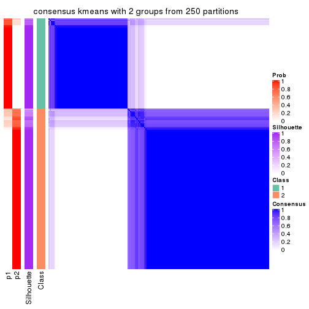</p>

</div>
<div id='tab-MAD-kmeans-consensus-heatmap-2'>
<pre><code class="r">consensus_heatmap(res, k = 3)
</code></pre>

<p>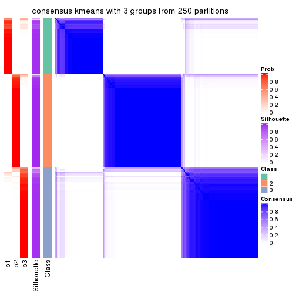</p>

</div>
<div id='tab-MAD-kmeans-consensus-heatmap-3'>
<pre><code class="r">consensus_heatmap(res, k = 4)
</code></pre>

<p>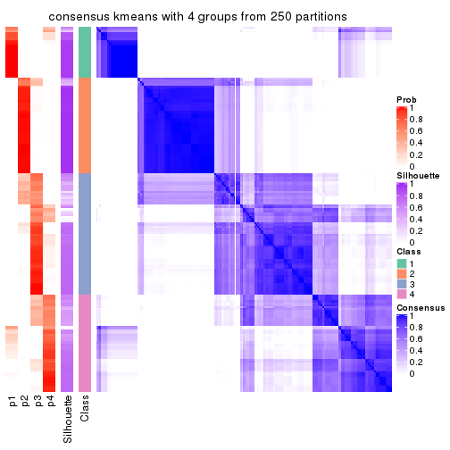</p>

</div>
<div id='tab-MAD-kmeans-consensus-heatmap-4'>
<pre><code class="r">consensus_heatmap(res, k = 5)
</code></pre>

<p>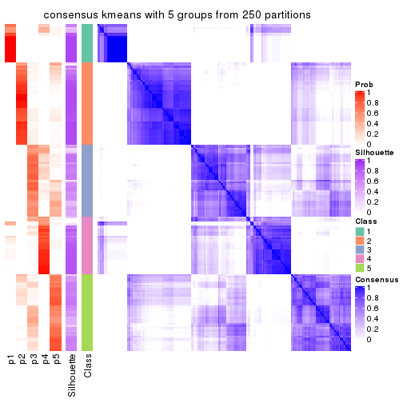</p>

</div>
<div id='tab-MAD-kmeans-consensus-heatmap-5'>
<pre><code class="r">consensus_heatmap(res, k = 6)
</code></pre>

<p>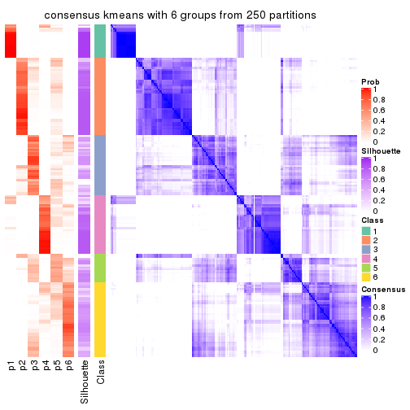</p>

</div>
</div>

Heatmaps for the membership of samples in all partitions to see how consistent they are:


<script>
$( function() {
	$( '#tabs-MAD-kmeans-membership-heatmap' ).tabs();
} );
</script>
<div id='tabs-MAD-kmeans-membership-heatmap'>
<ul>
<li><a href='#tab-MAD-kmeans-membership-heatmap-1'>k = 2</a></li>
<li><a href='#tab-MAD-kmeans-membership-heatmap-2'>k = 3</a></li>
<li><a href='#tab-MAD-kmeans-membership-heatmap-3'>k = 4</a></li>
<li><a href='#tab-MAD-kmeans-membership-heatmap-4'>k = 5</a></li>
<li><a href='#tab-MAD-kmeans-membership-heatmap-5'>k = 6</a></li>
</ul>
<div id='tab-MAD-kmeans-membership-heatmap-1'>
<pre><code class="r">membership_heatmap(res, k = 2)
</code></pre>

<p>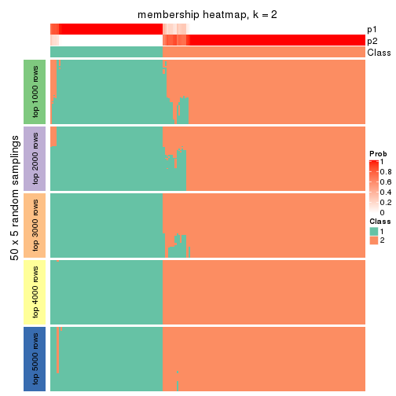</p>

</div>
<div id='tab-MAD-kmeans-membership-heatmap-2'>
<pre><code class="r">membership_heatmap(res, k = 3)
</code></pre>

<p>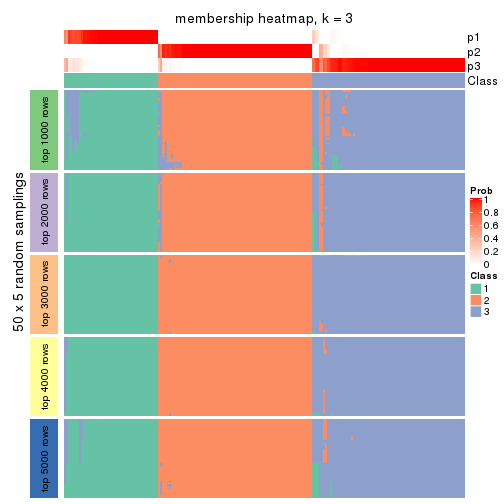</p>

</div>
<div id='tab-MAD-kmeans-membership-heatmap-3'>
<pre><code class="r">membership_heatmap(res, k = 4)
</code></pre>

<p>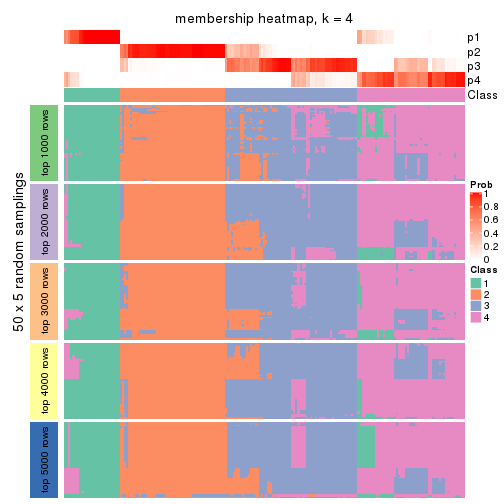</p>

</div>
<div id='tab-MAD-kmeans-membership-heatmap-4'>
<pre><code class="r">membership_heatmap(res, k = 5)
</code></pre>

<p>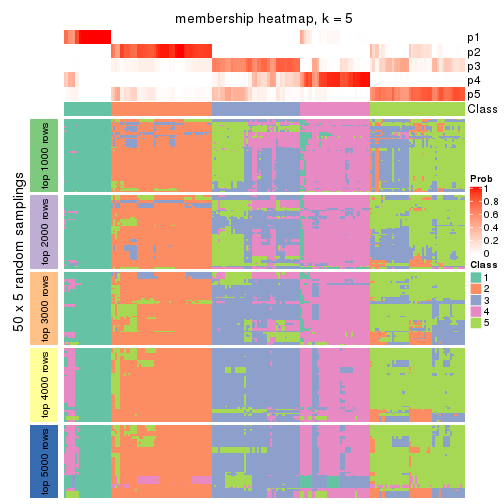</p>

</div>
<div id='tab-MAD-kmeans-membership-heatmap-5'>
<pre><code class="r">membership_heatmap(res, k = 6)
</code></pre>

<p>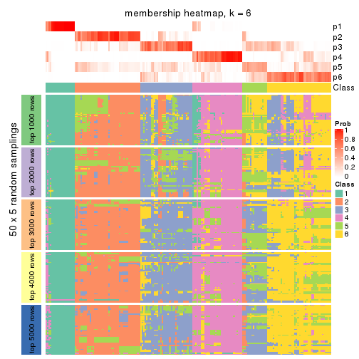</p>

</div>
</div>

As soon as we have had the classes for columns, we can look for signatures
which are significantly different between classes which can be candidate marks
for certain classes. Following are the heatmaps for signatures.


Signature heatmaps where rows are scaled:


<script>
$( function() {
	$( '#tabs-MAD-kmeans-get-signatures' ).tabs();
} );
</script>
<div id='tabs-MAD-kmeans-get-signatures'>
<ul>
<li><a href='#tab-MAD-kmeans-get-signatures-1'>k = 2</a></li>
<li><a href='#tab-MAD-kmeans-get-signatures-2'>k = 3</a></li>
<li><a href='#tab-MAD-kmeans-get-signatures-3'>k = 4</a></li>
<li><a href='#tab-MAD-kmeans-get-signatures-4'>k = 5</a></li>
<li><a href='#tab-MAD-kmeans-get-signatures-5'>k = 6</a></li>
</ul>
<div id='tab-MAD-kmeans-get-signatures-1'>
<pre><code class="r">get_signatures(res, k = 2)
</code></pre>

<p>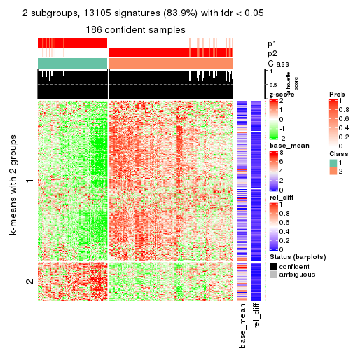</p>

</div>
<div id='tab-MAD-kmeans-get-signatures-2'>
<pre><code class="r">get_signatures(res, k = 3)
</code></pre>

<p>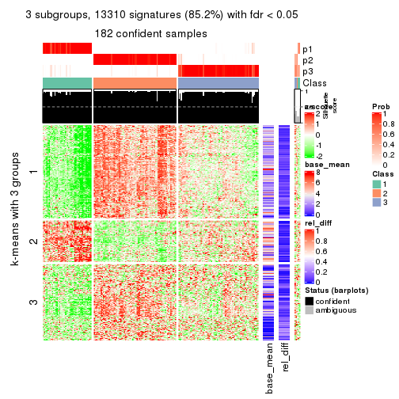</p>

</div>
<div id='tab-MAD-kmeans-get-signatures-3'>
<pre><code class="r">get_signatures(res, k = 4)
</code></pre>

<p>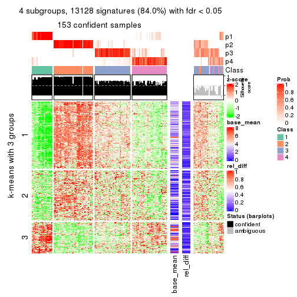</p>

</div>
<div id='tab-MAD-kmeans-get-signatures-4'>
<pre><code class="r">get_signatures(res, k = 5)
</code></pre>

<p>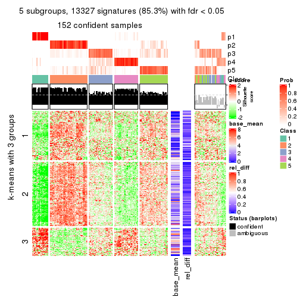</p>

</div>
<div id='tab-MAD-kmeans-get-signatures-5'>
<pre><code class="r">get_signatures(res, k = 6)
</code></pre>

<p>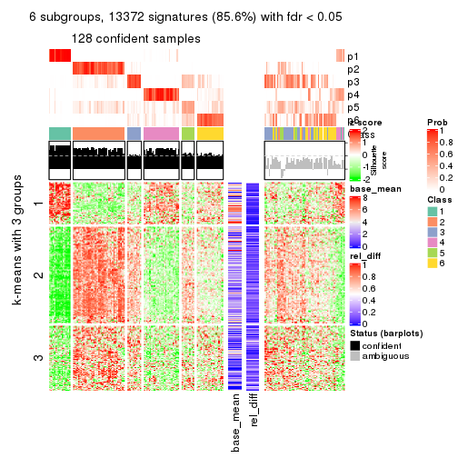</p>

</div>
</div>


Signature heatmaps where rows are not scaled:


<script>
$( function() {
	$( '#tabs-MAD-kmeans-get-signatures-no-scale' ).tabs();
} );
</script>
<div id='tabs-MAD-kmeans-get-signatures-no-scale'>
<ul>
<li><a href='#tab-MAD-kmeans-get-signatures-no-scale-1'>k = 2</a></li>
<li><a href='#tab-MAD-kmeans-get-signatures-no-scale-2'>k = 3</a></li>
<li><a href='#tab-MAD-kmeans-get-signatures-no-scale-3'>k = 4</a></li>
<li><a href='#tab-MAD-kmeans-get-signatures-no-scale-4'>k = 5</a></li>
<li><a href='#tab-MAD-kmeans-get-signatures-no-scale-5'>k = 6</a></li>
</ul>
<div id='tab-MAD-kmeans-get-signatures-no-scale-1'>
<pre><code class="r">get_signatures(res, k = 2, scale_rows = FALSE)
</code></pre>

<p>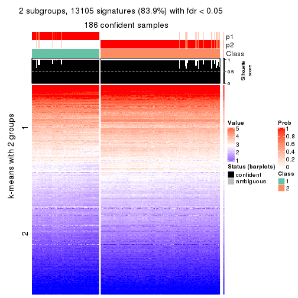</p>

</div>
<div id='tab-MAD-kmeans-get-signatures-no-scale-2'>
<pre><code class="r">get_signatures(res, k = 3, scale_rows = FALSE)
</code></pre>

<p>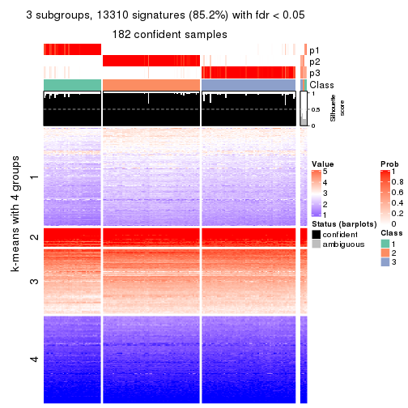</p>

</div>
<div id='tab-MAD-kmeans-get-signatures-no-scale-3'>
<pre><code class="r">get_signatures(res, k = 4, scale_rows = FALSE)
</code></pre>

<p>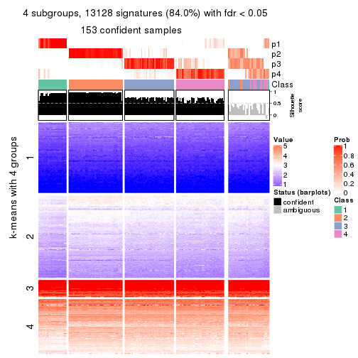</p>

</div>
<div id='tab-MAD-kmeans-get-signatures-no-scale-4'>
<pre><code class="r">get_signatures(res, k = 5, scale_rows = FALSE)
</code></pre>

<p>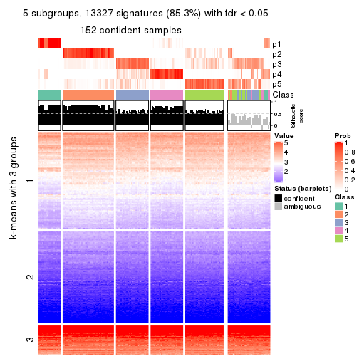</p>

</div>
<div id='tab-MAD-kmeans-get-signatures-no-scale-5'>
<pre><code class="r">get_signatures(res, k = 6, scale_rows = FALSE)
</code></pre>

<p>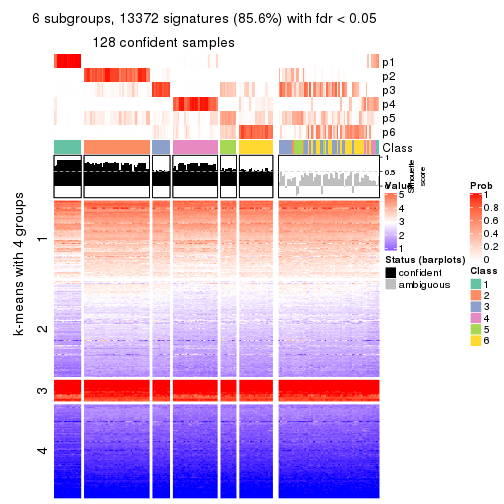</p>

</div>
</div>


Compare the overlap of signatures from different k:

```r
compare_signatures(res)
```

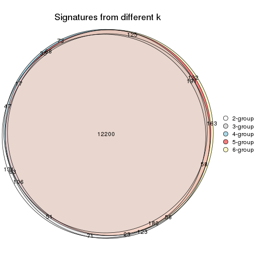

`get_signature()` returns a data frame invisibly. TO get the list of signatures, the function
call should be assigned to a variable explicitly. In following code, if `plot` argument is set
to `FALSE`, no heatmap is plotted while only the differential analysis is performed.

```r
# code only for demonstration
tb = get_signature(res, k = ..., plot = FALSE)
```

An example of the output of `tb` is:

```
#>   which_row         fdr    mean_1    mean_2 scaled_mean_1 scaled_mean_2 km
#> 1        38 0.042760348  8.373488  9.131774    -0.5533452     0.5164555  1
#> 2        40 0.018707592  7.106213  8.469186    -0.6173731     0.5762149  1
#> 3        55 0.019134737 10.221463 11.207825    -0.6159697     0.5749050  1
#> 4        59 0.006059896  5.921854  7.869574    -0.6899429     0.6439467  1
#> 5        60 0.018055526  8.928898 10.211722    -0.6204761     0.5791110  1
#> 6        98 0.009384629 15.714769 14.887706     0.6635654    -0.6193277  2
...
```

The columns in `tb` are:

1. `which_row`: row indices corresponding to the input matrix.
2. `fdr`: FDR for the differential test. 
3. `mean_x`: The mean value in group x.
4. `scaled_mean_x`: The mean value in group x after rows are scaled.
5. `km`: Row groups if k-means clustering is applied to rows.


UMAP plot which shows how samples are separated.


<script>
$( function() {
	$( '#tabs-MAD-kmeans-dimension-reduction' ).tabs();
} );
</script>
<div id='tabs-MAD-kmeans-dimension-reduction'>
<ul>
<li><a href='#tab-MAD-kmeans-dimension-reduction-1'>k = 2</a></li>
<li><a href='#tab-MAD-kmeans-dimension-reduction-2'>k = 3</a></li>
<li><a href='#tab-MAD-kmeans-dimension-reduction-3'>k = 4</a></li>
<li><a href='#tab-MAD-kmeans-dimension-reduction-4'>k = 5</a></li>
<li><a href='#tab-MAD-kmeans-dimension-reduction-5'>k = 6</a></li>
</ul>
<div id='tab-MAD-kmeans-dimension-reduction-1'>
<pre><code class="r">dimension_reduction(res, k = 2, method = &quot;UMAP&quot;)
</code></pre>

<p>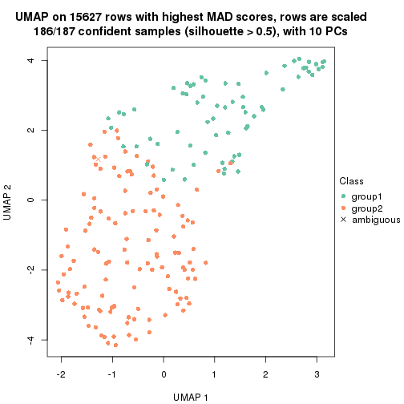</p>

</div>
<div id='tab-MAD-kmeans-dimension-reduction-2'>
<pre><code class="r">dimension_reduction(res, k = 3, method = &quot;UMAP&quot;)
</code></pre>

<p>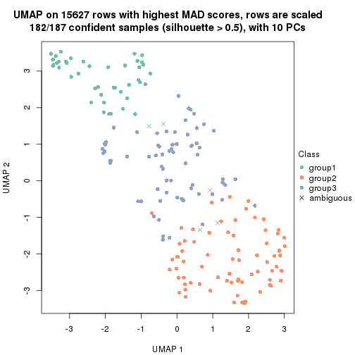</p>

</div>
<div id='tab-MAD-kmeans-dimension-reduction-3'>
<pre><code class="r">dimension_reduction(res, k = 4, method = &quot;UMAP&quot;)
</code></pre>

<p>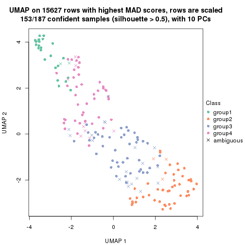</p>

</div>
<div id='tab-MAD-kmeans-dimension-reduction-4'>
<pre><code class="r">dimension_reduction(res, k = 5, method = &quot;UMAP&quot;)
</code></pre>

<p>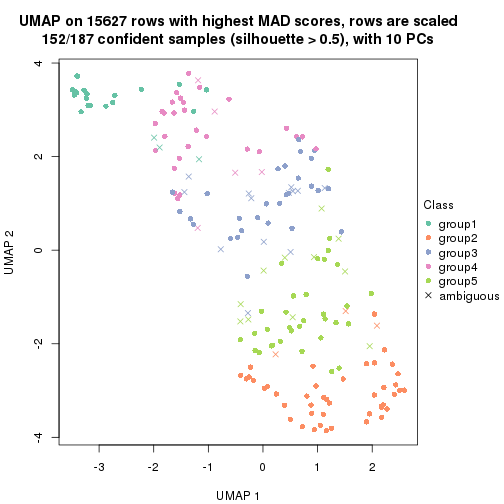</p>

</div>
<div id='tab-MAD-kmeans-dimension-reduction-5'>
<pre><code class="r">dimension_reduction(res, k = 6, method = &quot;UMAP&quot;)
</code></pre>

<p>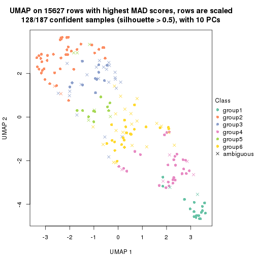</p>

</div>
</div>


Following heatmap shows how subgroups are split when increasing `k`:

```r
collect_classes(res)
```

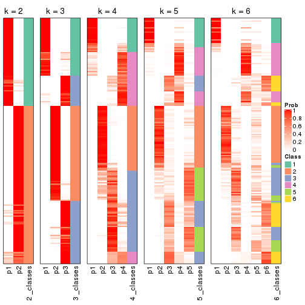


If matrix rows can be associated to genes, consider to use `GO_Enrichment(res,
...)` to perform function enrichment for the signature genes.


 

---------------------------------------------------


### MAD:skmeans**


The object with results only for a single top-value method and a single partition method 
can be extracted as:

```r
res = res_list["MAD", "skmeans"]
# you can also extract it by
# res = res_list["MAD:skmeans"]
```

A summary of `res` and all the functions that can be applied to it:

```r
res
```

```
#> A 'ConsensusPartition' object with k = 2, 3, 4, 5, 6.
#>   On a matrix with 15627 rows and 187 columns.
#>   Top rows (1000, 2000, 3000, 4000, 5000) are extracted by 'MAD' method.
#>   Subgroups are detected by 'skmeans' method.
#>   Performed in total 1250 partitions by row resampling.
#>   Best k for subgroups seems to be 2.
#> 
#> Following methods can be applied to this 'ConsensusPartition' object:
#>  [1] "cola_report"             "collect_classes"         "collect_plots"          
#>  [4] "collect_stats"           "colnames"                "compare_signatures"     
#>  [7] "consensus_heatmap"       "dimension_reduction"     "functional_enrichment"  
#> [10] "get_anno_col"            "get_anno"                "get_classes"            
#> [13] "get_consensus"           "get_matrix"              "get_membership"         
#> [16] "get_param"               "get_signatures"          "get_stats"              
#> [19] "is_best_k"               "is_stable_k"             "membership_heatmap"     
#> [22] "ncol"                    "nrow"                    "plot_ecdf"              
#> [25] "rownames"                "select_partition_number" "show"                   
#> [28] "suggest_best_k"          "test_to_known_factors"
```

`collect_plots()` function collects all the plots made from `res` for all `k` (number of partitions)
into one single page to provide an easy and fast comparison between different `k`.

```r
collect_plots(res)
```

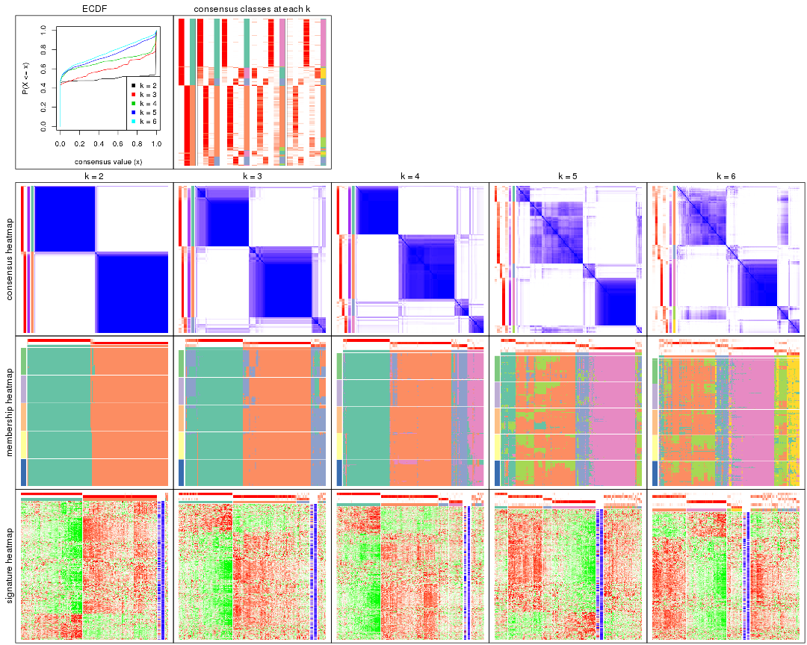

The plots are:

- The first row: a plot of the ECDF (Empirical cumulative distribution
  function) curves of the consensus matrix for each `k` and the heatmap of
  predicted classes for each `k`.
- The second row: heatmaps of the consensus matrix for each `k`.
- The third row: heatmaps of the membership matrix for each `k`.
- The fouth row: heatmaps of the signatures for each `k`.

All the plots in panels can be made by individual functions and they are
plotted later in this section.

`select_partition_number()` produces several plots showing different
statistics for choosing "optimized" `k`. There are following statistics:

- ECDF curves of the consensus matrix for each `k`;
- 1-PAC. [The PAC
  score](https://en.wikipedia.org/wiki/Consensus_clustering#Over-interpretation_potential_of_consensus_clustering)
  measures the proportion of the ambiguous subgrouping.
- Mean silhouette score.
- Concordance. The mean probability of fiting the consensus class ids in all
  partitions.
- Area increased. Denote $A_k$ as the area under the ECDF curve for current
  `k`, the area increased is defined as $A_k - A_{k-1}$.
- Rand index. The percent of pairs of samples that are both in a same cluster
  or both are not in a same cluster in the partition of k and k-1.
- Jaccard index. The ratio of pairs of samples are both in a same cluster in
  the partition of k and k-1 and the pairs of samples are both in a same
  cluster in the partition k or k-1.

The detailed explanations of these statistics can be found in [the cola
vignette](http://bioconductor.org/packages/devel/bioc/vignettes/cola/inst/doc/cola.html#toc_13).

Generally speaking, lower PAC score, higher mean silhouette score or higher
concordance corresponds to better partition. Rand index and Jaccard index
measure how similar the current partition is compared to partition with `k-1`.
If they are too similar, we won't accept `k` is better than `k-1`.

```r
select_partition_number(res)
```

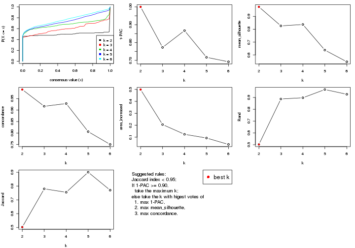

The numeric values for all these statistics can be obtained by `get_stats()`.

```r
get_stats(res)
```

```
#>   k 1-PAC mean_silhouette concordance area_increased  Rand Jaccard
#> 2 2 1.000           0.974       0.990         0.4991 0.503   0.503
#> 3 3 0.773           0.826       0.917         0.2058 0.887   0.780
#> 4 4 0.867           0.837       0.929         0.1242 0.897   0.755
#> 5 5 0.717           0.638       0.806         0.0930 0.967   0.900
#> 6 6 0.692           0.547       0.750         0.0393 0.927   0.770
```

`suggest_best_k()` suggests the best $k$ based on these statistics. The rules are as follows:

- All $k$ with Jaccard index larger than 0.95 are removed because the increase of
  the partition number does not provides enough extra information. If all $k$ are removed,
  the best $k$ is assigned by `NA`.
- For $k$ with 1-PAC larger than 0.9, the maximal $k$ is taken as the "best k". Other $k$ is called "optional k".
- If it does not fit the second rule. The $k$ with the highest vote of highest
  1-PAC, mean silhouette and concordance is taken as the "best k".

```r
suggest_best_k(res)
```

```
#> [1] 2
```


Following shows the table of the partitions (You need to click the **show/hide
code output** link to see it). The membership matrix (columns with name `p*`)
is inferred by
[`clue::cl_consensus()`](https://www.rdocumentation.org/link/cl_consensus?package=clue)
function with the `SE` method. Basically the value in the membership matrix
represents the probability to belong to a certain group. The finall class
label for an item is determined with the group with highest probability it
belongs to.

In `get_classes()` function, the entropy is calculated from the membership
matrix and the silhouette score is calculated from the consensus matrix.


<script>
$( function() {
	$( '#tabs-MAD-skmeans-get-classes' ).tabs();
} );
</script>
<div id='tabs-MAD-skmeans-get-classes'>
<ul>
<li><a href='#tab-MAD-skmeans-get-classes-1'>k = 2</a></li>
<li><a href='#tab-MAD-skmeans-get-classes-2'>k = 3</a></li>
<li><a href='#tab-MAD-skmeans-get-classes-3'>k = 4</a></li>
<li><a href='#tab-MAD-skmeans-get-classes-4'>k = 5</a></li>
<li><a href='#tab-MAD-skmeans-get-classes-5'>k = 6</a></li>
</ul>

<div id='tab-MAD-skmeans-get-classes-1'>
<p><a id='tab-MAD-skmeans-get-classes-1-a' style='color:#0366d6' href='#'>show/hide code output</a></p>
<pre><code class="r">cbind(get_classes(res, k = 2), get_membership(res, k = 2))
</code></pre>

<pre><code>#&gt;            class entropy silhouette    p1    p2
#&gt; SRR1747213     1  0.0000      0.995 1.000 0.000
#&gt; SRR1747214     1  0.0000      0.995 1.000 0.000
#&gt; SRR1747215     2  0.0000      0.985 0.000 1.000
#&gt; SRR1747216     2  0.0000      0.985 0.000 1.000
#&gt; SRR1747217     1  0.0000      0.995 1.000 0.000
#&gt; SRR1747218     2  0.0000      0.985 0.000 1.000
#&gt; SRR1747219     1  0.0000      0.995 1.000 0.000
#&gt; SRR1747220     1  0.0000      0.995 1.000 0.000
#&gt; SRR1747221     1  0.0000      0.995 1.000 0.000
#&gt; SRR1747222     1  0.0000      0.995 1.000 0.000
#&gt; SRR1747223     1  0.0000      0.995 1.000 0.000
#&gt; SRR1747224     1  0.0672      0.987 0.992 0.008
#&gt; SRR1747225     2  0.0000      0.985 0.000 1.000
#&gt; SRR1747226     2  0.0000      0.985 0.000 1.000
#&gt; SRR1747227     2  0.0000      0.985 0.000 1.000
#&gt; SRR1747228     2  0.0000      0.985 0.000 1.000
#&gt; SRR1747229     2  0.0000      0.985 0.000 1.000
#&gt; SRR1747230     1  0.0000      0.995 1.000 0.000
#&gt; SRR1747231     1  0.0000      0.995 1.000 0.000
#&gt; SRR1747232     1  0.0000      0.995 1.000 0.000
#&gt; SRR1747233     1  0.0000      0.995 1.000 0.000
#&gt; SRR1747234     2  0.0000      0.985 0.000 1.000
#&gt; SRR1747235     1  0.0000      0.995 1.000 0.000
#&gt; SRR1747236     2  0.0000      0.985 0.000 1.000
#&gt; SRR1747237     2  0.0000      0.985 0.000 1.000
#&gt; SRR1747238     2  0.0000      0.985 0.000 1.000
#&gt; SRR1747239     2  0.0000      0.985 0.000 1.000
#&gt; SRR1747240     1  0.0000      0.995 1.000 0.000
#&gt; SRR1747241     2  0.0000      0.985 0.000 1.000
#&gt; SRR1747242     1  0.0000      0.995 1.000 0.000
#&gt; SRR1747243     1  0.0000      0.995 1.000 0.000
#&gt; SRR1747244     2  0.6801      0.778 0.180 0.820
#&gt; SRR1747245     2  0.0000      0.985 0.000 1.000
#&gt; SRR1747246     2  0.0000      0.985 0.000 1.000
#&gt; SRR1747247     1  0.0000      0.995 1.000 0.000
#&gt; SRR1747248     1  0.0000      0.995 1.000 0.000
#&gt; SRR1747249     1  0.0000      0.995 1.000 0.000
#&gt; SRR1747250     2  0.0000      0.985 0.000 1.000
#&gt; SRR1747252     1  0.0000      0.995 1.000 0.000
#&gt; SRR1747253     1  0.0000      0.995 1.000 0.000
#&gt; SRR1747254     2  0.0000      0.985 0.000 1.000
#&gt; SRR1747255     1  0.0000      0.995 1.000 0.000
#&gt; SRR1747256     1  0.0000      0.995 1.000 0.000
#&gt; SRR1747257     2  0.0000      0.985 0.000 1.000
#&gt; SRR1747258     2  0.0000      0.985 0.000 1.000
#&gt; SRR1747259     2  0.0000      0.985 0.000 1.000
#&gt; SRR1747260     2  0.9635      0.371 0.388 0.612
#&gt; SRR1747261     2  0.0000      0.985 0.000 1.000
#&gt; SRR1747262     2  0.0000      0.985 0.000 1.000
#&gt; SRR1747263     2  0.0000      0.985 0.000 1.000
#&gt; SRR1747264     1  0.0000      0.995 1.000 0.000
#&gt; SRR1747265     1  0.0000      0.995 1.000 0.000
#&gt; SRR1747266     2  0.0000      0.985 0.000 1.000
#&gt; SRR1747267     1  0.0000      0.995 1.000 0.000
#&gt; SRR1747268     1  0.0000      0.995 1.000 0.000
#&gt; SRR1747269     2  0.0000      0.985 0.000 1.000
#&gt; SRR1747270     2  0.0000      0.985 0.000 1.000
#&gt; SRR1747271     2  0.0000      0.985 0.000 1.000
#&gt; SRR1747272     1  0.0000      0.995 1.000 0.000
#&gt; SRR1747273     1  0.0000      0.995 1.000 0.000
#&gt; SRR1747274     2  0.0000      0.985 0.000 1.000
#&gt; SRR1747275     1  0.0000      0.995 1.000 0.000
#&gt; SRR1747276     1  0.0000      0.995 1.000 0.000
#&gt; SRR1747277     2  0.0000      0.985 0.000 1.000
#&gt; SRR1747278     2  0.9393      0.455 0.356 0.644
#&gt; SRR1747280     1  0.0000      0.995 1.000 0.000
#&gt; SRR1747279     1  0.0000      0.995 1.000 0.000
#&gt; SRR1747281     2  0.0000      0.985 0.000 1.000
#&gt; SRR1747282     1  0.0000      0.995 1.000 0.000
#&gt; SRR1747283     1  0.0000      0.995 1.000 0.000
#&gt; SRR1747284     1  0.0000      0.995 1.000 0.000
#&gt; SRR1747285     2  0.0000      0.985 0.000 1.000
#&gt; SRR1747286     2  0.0000      0.985 0.000 1.000
#&gt; SRR1747287     2  0.0000      0.985 0.000 1.000
#&gt; SRR1747288     1  0.0000      0.995 1.000 0.000
#&gt; SRR1747290     2  0.0000      0.985 0.000 1.000
#&gt; SRR1747289     2  0.0000      0.985 0.000 1.000
#&gt; SRR1747291     2  0.0000      0.985 0.000 1.000
#&gt; SRR1747293     2  0.0000      0.985 0.000 1.000
#&gt; SRR1747294     2  0.0000      0.985 0.000 1.000
#&gt; SRR1747292     1  0.0000      0.995 1.000 0.000
#&gt; SRR1747295     2  0.0000      0.985 0.000 1.000
#&gt; SRR1747296     2  0.0000      0.985 0.000 1.000
#&gt; SRR1747297     2  0.0000      0.985 0.000 1.000
#&gt; SRR1747298     2  0.0000      0.985 0.000 1.000
#&gt; SRR1747299     2  0.0000      0.985 0.000 1.000
#&gt; SRR1747300     2  0.0000      0.985 0.000 1.000
#&gt; SRR1747301     2  0.0000      0.985 0.000 1.000
#&gt; SRR1747302     2  0.0000      0.985 0.000 1.000
#&gt; SRR1747303     2  0.0000      0.985 0.000 1.000
#&gt; SRR1747304     1  0.0000      0.995 1.000 0.000
#&gt; SRR1747305     2  0.0000      0.985 0.000 1.000
#&gt; SRR1747306     2  0.0000      0.985 0.000 1.000
#&gt; SRR1747307     1  0.0000      0.995 1.000 0.000
#&gt; SRR1747308     2  0.0000      0.985 0.000 1.000
#&gt; SRR1747309     1  0.0000      0.995 1.000 0.000
#&gt; SRR1747310     1  0.0000      0.995 1.000 0.000
#&gt; SRR1747311     1  0.0000      0.995 1.000 0.000
#&gt; SRR1747313     1  0.0000      0.995 1.000 0.000
#&gt; SRR1747312     1  0.0000      0.995 1.000 0.000
#&gt; SRR1747314     1  0.0000      0.995 1.000 0.000
#&gt; SRR1747315     2  0.0000      0.985 0.000 1.000
#&gt; SRR1747316     2  0.0000      0.985 0.000 1.000
#&gt; SRR1747318     1  0.0000      0.995 1.000 0.000
#&gt; SRR1747317     1  0.1184      0.979 0.984 0.016
#&gt; SRR1747319     1  0.0000      0.995 1.000 0.000
#&gt; SRR1747320     1  0.0000      0.995 1.000 0.000
#&gt; SRR1747322     1  0.0000      0.995 1.000 0.000
#&gt; SRR1747321     1  0.0000      0.995 1.000 0.000
#&gt; SRR1747323     2  0.0000      0.985 0.000 1.000
#&gt; SRR1747324     2  0.0000      0.985 0.000 1.000
#&gt; SRR1747326     2  0.0000      0.985 0.000 1.000
#&gt; SRR1747325     2  0.0000      0.985 0.000 1.000
#&gt; SRR1747327     2  0.0000      0.985 0.000 1.000
#&gt; SRR1747328     1  0.9732      0.301 0.596 0.404
#&gt; SRR1747330     1  0.0000      0.995 1.000 0.000
#&gt; SRR1747329     2  0.0000      0.985 0.000 1.000
#&gt; SRR1747332     1  0.0000      0.995 1.000 0.000
#&gt; SRR1747331     2  0.0000      0.985 0.000 1.000
#&gt; SRR1747333     2  0.0000      0.985 0.000 1.000
#&gt; SRR1747334     2  0.0000      0.985 0.000 1.000
#&gt; SRR1747335     1  0.0000      0.995 1.000 0.000
#&gt; SRR1747336     1  0.0000      0.995 1.000 0.000
#&gt; SRR1747337     2  0.0000      0.985 0.000 1.000
#&gt; SRR1747338     2  0.0000      0.985 0.000 1.000
#&gt; SRR1747339     1  0.0000      0.995 1.000 0.000
#&gt; SRR1747340     2  0.0000      0.985 0.000 1.000
#&gt; SRR1747341     2  0.0000      0.985 0.000 1.000
#&gt; SRR1747342     2  0.0000      0.985 0.000 1.000
#&gt; SRR1747343     2  0.0000      0.985 0.000 1.000
#&gt; SRR1747344     2  0.0000      0.985 0.000 1.000
#&gt; SRR1747345     1  0.0000      0.995 1.000 0.000
#&gt; SRR1747346     1  0.0000      0.995 1.000 0.000
#&gt; SRR1747347     2  0.0000      0.985 0.000 1.000
#&gt; SRR1747348     1  0.0000      0.995 1.000 0.000
#&gt; SRR1747349     1  0.0000      0.995 1.000 0.000
#&gt; SRR1747351     2  0.0000      0.985 0.000 1.000
#&gt; SRR1747350     2  0.0000      0.985 0.000 1.000
#&gt; SRR1747352     1  0.0000      0.995 1.000 0.000
#&gt; SRR1747353     2  0.0000      0.985 0.000 1.000
#&gt; SRR1747354     2  0.0000      0.985 0.000 1.000
#&gt; SRR1747355     1  0.0000      0.995 1.000 0.000
#&gt; SRR1747356     2  0.0000      0.985 0.000 1.000
#&gt; SRR1747357     2  0.4022      0.905 0.080 0.920
#&gt; SRR1747358     2  0.4022      0.905 0.080 0.920
#&gt; SRR1747359     1  0.0000      0.995 1.000 0.000
#&gt; SRR1747360     2  0.0000      0.985 0.000 1.000
#&gt; SRR1747361     1  0.0000      0.995 1.000 0.000
#&gt; SRR1747362     2  0.0000      0.985 0.000 1.000
#&gt; SRR1747363     1  0.0000      0.995 1.000 0.000
#&gt; SRR1747364     1  0.0000      0.995 1.000 0.000
#&gt; SRR1747365     1  0.0000      0.995 1.000 0.000
#&gt; SRR1747366     2  0.0000      0.985 0.000 1.000
#&gt; SRR1747367     1  0.0000      0.995 1.000 0.000
#&gt; SRR1747369     2  0.0000      0.985 0.000 1.000
#&gt; SRR1747368     1  0.0000      0.995 1.000 0.000
#&gt; SRR1747370     2  0.0000      0.985 0.000 1.000
#&gt; SRR1747372     1  0.0000      0.995 1.000 0.000
#&gt; SRR1747371     1  0.0000      0.995 1.000 0.000
#&gt; SRR1747373     2  0.0000      0.985 0.000 1.000
#&gt; SRR1747374     2  0.0000      0.985 0.000 1.000
#&gt; SRR1747375     1  0.0000      0.995 1.000 0.000
#&gt; SRR1747376     2  0.0000      0.985 0.000 1.000
#&gt; SRR1747377     2  0.0000      0.985 0.000 1.000
#&gt; SRR1747378     2  0.0000      0.985 0.000 1.000
#&gt; SRR1747379     2  0.0000      0.985 0.000 1.000
#&gt; SRR1747380     1  0.0000      0.995 1.000 0.000
#&gt; SRR1747381     1  0.0000      0.995 1.000 0.000
#&gt; SRR1747382     1  0.0000      0.995 1.000 0.000
#&gt; SRR1747383     2  0.0000      0.985 0.000 1.000
#&gt; SRR1747384     1  0.0000      0.995 1.000 0.000
#&gt; SRR1747385     2  0.0000      0.985 0.000 1.000
#&gt; SRR1747386     1  0.0000      0.995 1.000 0.000
#&gt; SRR1747387     2  0.0000      0.985 0.000 1.000
#&gt; SRR1747388     2  0.0000      0.985 0.000 1.000
#&gt; SRR1747390     2  0.0000      0.985 0.000 1.000
#&gt; SRR1747389     2  0.0000      0.985 0.000 1.000
#&gt; SRR1747391     2  0.0000      0.985 0.000 1.000
#&gt; SRR1747392     2  0.0000      0.985 0.000 1.000
#&gt; SRR1747393     2  0.0000      0.985 0.000 1.000
#&gt; SRR1747394     1  0.0000      0.995 1.000 0.000
#&gt; SRR1747395     2  0.9850      0.258 0.428 0.572
#&gt; SRR1747396     2  0.0000      0.985 0.000 1.000
#&gt; SRR1747398     2  0.0000      0.985 0.000 1.000
#&gt; SRR1747397     1  0.0000      0.995 1.000 0.000
#&gt; SRR1747399     1  0.0000      0.995 1.000 0.000
#&gt; SRR1747400     1  0.0000      0.995 1.000 0.000
</code></pre>

<script>
$('#tab-MAD-skmeans-get-classes-1-a').parent().next().next().hide();
$('#tab-MAD-skmeans-get-classes-1-a').click(function(){
  $('#tab-MAD-skmeans-get-classes-1-a').parent().next().next().toggle();
  return(false);
});
</script>
</div>

<div id='tab-MAD-skmeans-get-classes-2'>
<p><a id='tab-MAD-skmeans-get-classes-2-a' style='color:#0366d6' href='#'>show/hide code output</a></p>
<pre><code class="r">cbind(get_classes(res, k = 3), get_membership(res, k = 3))
</code></pre>

<pre><code>#&gt;            class entropy silhouette    p1    p2    p3
#&gt; SRR1747213     1  0.0000     0.9103 1.000 0.000 0.000
#&gt; SRR1747214     1  0.0000     0.9103 1.000 0.000 0.000
#&gt; SRR1747215     2  0.0000     0.9402 0.000 1.000 0.000
#&gt; SRR1747216     2  0.0000     0.9402 0.000 1.000 0.000
#&gt; SRR1747217     1  0.3752     0.7572 0.856 0.000 0.144
#&gt; SRR1747218     2  0.0000     0.9402 0.000 1.000 0.000
#&gt; SRR1747219     3  0.5733     0.5609 0.324 0.000 0.676
#&gt; SRR1747220     1  0.0000     0.9103 1.000 0.000 0.000
#&gt; SRR1747221     1  0.1031     0.8941 0.976 0.000 0.024
#&gt; SRR1747222     1  0.0000     0.9103 1.000 0.000 0.000
#&gt; SRR1747223     1  0.5431     0.6423 0.716 0.000 0.284
#&gt; SRR1747224     1  0.6140     0.4674 0.596 0.000 0.404
#&gt; SRR1747225     2  0.2356     0.8750 0.000 0.928 0.072
#&gt; SRR1747226     2  0.0000     0.9402 0.000 1.000 0.000
#&gt; SRR1747227     2  0.0000     0.9402 0.000 1.000 0.000
#&gt; SRR1747228     2  0.1031     0.9206 0.000 0.976 0.024
#&gt; SRR1747229     2  0.0000     0.9402 0.000 1.000 0.000
#&gt; SRR1747230     1  0.0000     0.9103 1.000 0.000 0.000
#&gt; SRR1747231     1  0.0000     0.9103 1.000 0.000 0.000
#&gt; SRR1747232     1  0.0000     0.9103 1.000 0.000 0.000
#&gt; SRR1747233     1  0.0000     0.9103 1.000 0.000 0.000
#&gt; SRR1747234     3  0.5497     0.6635 0.000 0.292 0.708
#&gt; SRR1747235     1  0.0000     0.9103 1.000 0.000 0.000
#&gt; SRR1747236     2  0.0000     0.9402 0.000 1.000 0.000
#&gt; SRR1747237     2  0.0000     0.9402 0.000 1.000 0.000
#&gt; SRR1747238     2  0.2959     0.8475 0.000 0.900 0.100
#&gt; SRR1747239     2  0.0000     0.9402 0.000 1.000 0.000
#&gt; SRR1747240     1  0.0000     0.9103 1.000 0.000 0.000
#&gt; SRR1747241     3  0.6095     0.5200 0.000 0.392 0.608
#&gt; SRR1747242     1  0.0000     0.9103 1.000 0.000 0.000
#&gt; SRR1747243     1  0.3038     0.8274 0.896 0.000 0.104
#&gt; SRR1747244     2  0.7453     0.4644 0.064 0.644 0.292
#&gt; SRR1747245     2  0.3412     0.8178 0.000 0.876 0.124
#&gt; SRR1747246     2  0.0000     0.9402 0.000 1.000 0.000
#&gt; SRR1747247     1  0.0000     0.9103 1.000 0.000 0.000
#&gt; SRR1747248     1  0.0000     0.9103 1.000 0.000 0.000
#&gt; SRR1747249     1  0.0000     0.9103 1.000 0.000 0.000
#&gt; SRR1747250     3  0.5397     0.6746 0.000 0.280 0.720
#&gt; SRR1747252     1  0.0424     0.9047 0.992 0.000 0.008
#&gt; SRR1747253     1  0.0000     0.9103 1.000 0.000 0.000
#&gt; SRR1747254     2  0.0000     0.9402 0.000 1.000 0.000
#&gt; SRR1747255     1  0.0000     0.9103 1.000 0.000 0.000
#&gt; SRR1747256     1  0.0000     0.9103 1.000 0.000 0.000
#&gt; SRR1747257     2  0.0000     0.9402 0.000 1.000 0.000
#&gt; SRR1747258     2  0.4062     0.7672 0.000 0.836 0.164
#&gt; SRR1747259     2  0.0000     0.9402 0.000 1.000 0.000
#&gt; SRR1747260     3  0.5692     0.6860 0.008 0.268 0.724
#&gt; SRR1747261     2  0.3941     0.7601 0.000 0.844 0.156
#&gt; SRR1747262     2  0.0000     0.9402 0.000 1.000 0.000
#&gt; SRR1747263     2  0.0000     0.9402 0.000 1.000 0.000
#&gt; SRR1747264     1  0.0000     0.9103 1.000 0.000 0.000
#&gt; SRR1747265     3  0.5363     0.6094 0.276 0.000 0.724
#&gt; SRR1747266     2  0.6140     0.3865 0.000 0.596 0.404
#&gt; SRR1747267     3  0.6260     0.3136 0.448 0.000 0.552
#&gt; SRR1747268     1  0.5497     0.6331 0.708 0.000 0.292
#&gt; SRR1747269     2  0.0000     0.9402 0.000 1.000 0.000
#&gt; SRR1747270     2  0.0000     0.9402 0.000 1.000 0.000
#&gt; SRR1747271     2  0.0000     0.9402 0.000 1.000 0.000
#&gt; SRR1747272     1  0.1289     0.8871 0.968 0.000 0.032
#&gt; SRR1747273     1  0.0000     0.9103 1.000 0.000 0.000
#&gt; SRR1747274     2  0.0000     0.9402 0.000 1.000 0.000
#&gt; SRR1747275     1  0.0000     0.9103 1.000 0.000 0.000
#&gt; SRR1747276     1  0.0000     0.9103 1.000 0.000 0.000
#&gt; SRR1747277     2  0.0000     0.9402 0.000 1.000 0.000
#&gt; SRR1747278     2  0.8350     0.3636 0.120 0.600 0.280
#&gt; SRR1747280     1  0.0000     0.9103 1.000 0.000 0.000
#&gt; SRR1747279     1  0.0000     0.9103 1.000 0.000 0.000
#&gt; SRR1747281     2  0.0000     0.9402 0.000 1.000 0.000
#&gt; SRR1747282     1  0.0000     0.9103 1.000 0.000 0.000
#&gt; SRR1747283     3  0.6095     0.4555 0.392 0.000 0.608
#&gt; SRR1747284     1  0.0000     0.9103 1.000 0.000 0.000
#&gt; SRR1747285     3  0.6302     0.3072 0.000 0.480 0.520
#&gt; SRR1747286     3  0.5497     0.6635 0.000 0.292 0.708
#&gt; SRR1747287     2  0.0000     0.9402 0.000 1.000 0.000
#&gt; SRR1747288     1  0.3340     0.7925 0.880 0.000 0.120
#&gt; SRR1747290     2  0.0000     0.9402 0.000 1.000 0.000
#&gt; SRR1747289     2  0.0000     0.9402 0.000 1.000 0.000
#&gt; SRR1747291     2  0.0000     0.9402 0.000 1.000 0.000
#&gt; SRR1747293     2  0.5859     0.5067 0.000 0.656 0.344
#&gt; SRR1747294     2  0.0000     0.9402 0.000 1.000 0.000
#&gt; SRR1747292     1  0.0000     0.9103 1.000 0.000 0.000
#&gt; SRR1747295     2  0.5926     0.3383 0.000 0.644 0.356
#&gt; SRR1747296     3  0.5621     0.6439 0.000 0.308 0.692
#&gt; SRR1747297     2  0.0000     0.9402 0.000 1.000 0.000
#&gt; SRR1747298     2  0.0000     0.9402 0.000 1.000 0.000
#&gt; SRR1747299     2  0.0000     0.9402 0.000 1.000 0.000
#&gt; SRR1747300     2  0.0000     0.9402 0.000 1.000 0.000
#&gt; SRR1747301     2  0.0000     0.9402 0.000 1.000 0.000
#&gt; SRR1747302     2  0.0000     0.9402 0.000 1.000 0.000
#&gt; SRR1747303     2  0.0000     0.9402 0.000 1.000 0.000
#&gt; SRR1747304     1  0.0000     0.9103 1.000 0.000 0.000
#&gt; SRR1747305     2  0.0000     0.9402 0.000 1.000 0.000
#&gt; SRR1747306     2  0.0000     0.9402 0.000 1.000 0.000
#&gt; SRR1747307     1  0.0000     0.9103 1.000 0.000 0.000
#&gt; SRR1747308     2  0.0000     0.9402 0.000 1.000 0.000
#&gt; SRR1747309     1  0.0237     0.9077 0.996 0.000 0.004
#&gt; SRR1747310     1  0.0000     0.9103 1.000 0.000 0.000
#&gt; SRR1747311     1  0.5560     0.6238 0.700 0.000 0.300
#&gt; SRR1747313     1  0.5397     0.6471 0.720 0.000 0.280
#&gt; SRR1747312     1  0.0000     0.9103 1.000 0.000 0.000
#&gt; SRR1747314     1  0.0000     0.9103 1.000 0.000 0.000
#&gt; SRR1747315     2  0.0000     0.9402 0.000 1.000 0.000
#&gt; SRR1747316     2  0.1289     0.9139 0.000 0.968 0.032
#&gt; SRR1747318     1  0.6045     0.5096 0.620 0.000 0.380
#&gt; SRR1747317     1  0.5988     0.5289 0.632 0.000 0.368
#&gt; SRR1747319     1  0.6305    -0.1299 0.516 0.000 0.484
#&gt; SRR1747320     1  0.0000     0.9103 1.000 0.000 0.000
#&gt; SRR1747322     1  0.0000     0.9103 1.000 0.000 0.000
#&gt; SRR1747321     1  0.0000     0.9103 1.000 0.000 0.000
#&gt; SRR1747323     2  0.0000     0.9402 0.000 1.000 0.000
#&gt; SRR1747324     2  0.0000     0.9402 0.000 1.000 0.000
#&gt; SRR1747326     2  0.0000     0.9402 0.000 1.000 0.000
#&gt; SRR1747325     2  0.0000     0.9402 0.000 1.000 0.000
#&gt; SRR1747327     2  0.0000     0.9402 0.000 1.000 0.000
#&gt; SRR1747328     1  0.6973     0.0523 0.564 0.416 0.020
#&gt; SRR1747330     1  0.5465     0.6374 0.712 0.000 0.288
#&gt; SRR1747329     2  0.5465     0.5838 0.000 0.712 0.288
#&gt; SRR1747332     1  0.0000     0.9103 1.000 0.000 0.000
#&gt; SRR1747331     2  0.0000     0.9402 0.000 1.000 0.000
#&gt; SRR1747333     2  0.5363     0.6031 0.000 0.724 0.276
#&gt; SRR1747334     2  0.0000     0.9402 0.000 1.000 0.000
#&gt; SRR1747335     1  0.0424     0.9040 0.992 0.000 0.008
#&gt; SRR1747336     1  0.0000     0.9103 1.000 0.000 0.000
#&gt; SRR1747337     2  0.0000     0.9402 0.000 1.000 0.000
#&gt; SRR1747338     2  0.0000     0.9402 0.000 1.000 0.000
#&gt; SRR1747339     1  0.5497     0.6331 0.708 0.000 0.292
#&gt; SRR1747340     2  0.5497     0.5773 0.000 0.708 0.292
#&gt; SRR1747341     2  0.0000     0.9402 0.000 1.000 0.000
#&gt; SRR1747342     2  0.0000     0.9402 0.000 1.000 0.000
#&gt; SRR1747343     2  0.0000     0.9402 0.000 1.000 0.000
#&gt; SRR1747344     2  0.0000     0.9402 0.000 1.000 0.000
#&gt; SRR1747345     1  0.5560     0.6238 0.700 0.000 0.300
#&gt; SRR1747346     3  0.4235     0.5986 0.176 0.000 0.824
#&gt; SRR1747347     2  0.0000     0.9402 0.000 1.000 0.000
#&gt; SRR1747348     1  0.0000     0.9103 1.000 0.000 0.000
#&gt; SRR1747349     1  0.0000     0.9103 1.000 0.000 0.000
#&gt; SRR1747351     2  0.0000     0.9402 0.000 1.000 0.000
#&gt; SRR1747350     2  0.0747     0.9276 0.000 0.984 0.016
#&gt; SRR1747352     1  0.0000     0.9103 1.000 0.000 0.000
#&gt; SRR1747353     2  0.2261     0.8799 0.000 0.932 0.068
#&gt; SRR1747354     3  0.4887     0.7030 0.000 0.228 0.772
#&gt; SRR1747355     1  0.0000     0.9103 1.000 0.000 0.000
#&gt; SRR1747356     3  0.4099     0.7087 0.008 0.140 0.852
#&gt; SRR1747357     3  0.3253     0.6978 0.052 0.036 0.912
#&gt; SRR1747358     3  0.7180     0.7343 0.116 0.168 0.716
#&gt; SRR1747359     1  0.0000     0.9103 1.000 0.000 0.000
#&gt; SRR1747360     2  0.0000     0.9402 0.000 1.000 0.000
#&gt; SRR1747361     1  0.0000     0.9103 1.000 0.000 0.000
#&gt; SRR1747362     2  0.0000     0.9402 0.000 1.000 0.000
#&gt; SRR1747363     1  0.0000     0.9103 1.000 0.000 0.000
#&gt; SRR1747364     1  0.0000     0.9103 1.000 0.000 0.000
#&gt; SRR1747365     3  0.5706     0.5651 0.320 0.000 0.680
#&gt; SRR1747366     2  0.3482     0.8143 0.000 0.872 0.128
#&gt; SRR1747367     1  0.0000     0.9103 1.000 0.000 0.000
#&gt; SRR1747369     2  0.0000     0.9402 0.000 1.000 0.000
#&gt; SRR1747368     3  0.4974     0.6377 0.236 0.000 0.764
#&gt; SRR1747370     3  0.3551     0.6612 0.000 0.132 0.868
#&gt; SRR1747372     1  0.0000     0.9103 1.000 0.000 0.000
#&gt; SRR1747371     1  0.0000     0.9103 1.000 0.000 0.000
#&gt; SRR1747373     2  0.0000     0.9402 0.000 1.000 0.000
#&gt; SRR1747374     2  0.0000     0.9402 0.000 1.000 0.000
#&gt; SRR1747375     1  0.5178     0.6731 0.744 0.000 0.256
#&gt; SRR1747376     2  0.0000     0.9402 0.000 1.000 0.000
#&gt; SRR1747377     2  0.0000     0.9402 0.000 1.000 0.000
#&gt; SRR1747378     2  0.0000     0.9402 0.000 1.000 0.000
#&gt; SRR1747379     2  0.3340     0.8225 0.000 0.880 0.120
#&gt; SRR1747380     3  0.4235     0.5986 0.176 0.000 0.824
#&gt; SRR1747381     1  0.0000     0.9103 1.000 0.000 0.000
#&gt; SRR1747382     1  0.0000     0.9103 1.000 0.000 0.000
#&gt; SRR1747383     2  0.0000     0.9402 0.000 1.000 0.000
#&gt; SRR1747384     1  0.0000     0.9103 1.000 0.000 0.000
#&gt; SRR1747385     2  0.5431     0.5903 0.000 0.716 0.284
#&gt; SRR1747386     1  0.0000     0.9103 1.000 0.000 0.000
#&gt; SRR1747387     2  0.0000     0.9402 0.000 1.000 0.000
#&gt; SRR1747388     2  0.0000     0.9402 0.000 1.000 0.000
#&gt; SRR1747390     2  0.3879     0.7829 0.000 0.848 0.152
#&gt; SRR1747389     2  0.3619     0.8040 0.000 0.864 0.136
#&gt; SRR1747391     2  0.0000     0.9402 0.000 1.000 0.000
#&gt; SRR1747392     2  0.0000     0.9402 0.000 1.000 0.000
#&gt; SRR1747393     2  0.2537     0.8679 0.000 0.920 0.080
#&gt; SRR1747394     1  0.0000     0.9103 1.000 0.000 0.000
#&gt; SRR1747395     1  0.9793     0.0371 0.436 0.280 0.284
#&gt; SRR1747396     2  0.0000     0.9402 0.000 1.000 0.000
#&gt; SRR1747398     2  0.0000     0.9402 0.000 1.000 0.000
#&gt; SRR1747397     1  0.5497     0.6331 0.708 0.000 0.292
#&gt; SRR1747399     1  0.0000     0.9103 1.000 0.000 0.000
#&gt; SRR1747400     1  0.0000     0.9103 1.000 0.000 0.000
</code></pre>

<script>
$('#tab-MAD-skmeans-get-classes-2-a').parent().next().next().hide();
$('#tab-MAD-skmeans-get-classes-2-a').click(function(){
  $('#tab-MAD-skmeans-get-classes-2-a').parent().next().next().toggle();
  return(false);
});
</script>
</div>

<div id='tab-MAD-skmeans-get-classes-3'>
<p><a id='tab-MAD-skmeans-get-classes-3-a' style='color:#0366d6' href='#'>show/hide code output</a></p>
<pre><code class="r">cbind(get_classes(res, k = 4), get_membership(res, k = 4))
</code></pre>

<pre><code>#&gt;            class entropy silhouette    p1    p2    p3    p4
#&gt; SRR1747213     1  0.0188     0.9707 0.996 0.000 0.004 0.000
#&gt; SRR1747214     1  0.0000     0.9731 1.000 0.000 0.000 0.000
#&gt; SRR1747215     2  0.0000     0.9383 0.000 1.000 0.000 0.000
#&gt; SRR1747216     2  0.0000     0.9383 0.000 1.000 0.000 0.000
#&gt; SRR1747217     1  0.5754     0.4006 0.636 0.000 0.316 0.048
#&gt; SRR1747218     2  0.1706     0.9248 0.000 0.948 0.016 0.036
#&gt; SRR1747219     3  0.3219     0.6099 0.164 0.000 0.836 0.000
#&gt; SRR1747220     1  0.0188     0.9707 0.996 0.000 0.004 0.000
#&gt; SRR1747221     1  0.3311     0.7663 0.828 0.000 0.000 0.172
#&gt; SRR1747222     1  0.0000     0.9731 1.000 0.000 0.000 0.000
#&gt; SRR1747223     4  0.3528     0.7010 0.192 0.000 0.000 0.808
#&gt; SRR1747224     4  0.1545     0.8024 0.040 0.000 0.008 0.952
#&gt; SRR1747225     2  0.2216     0.8973 0.000 0.908 0.000 0.092
#&gt; SRR1747226     2  0.1118     0.9306 0.000 0.964 0.000 0.036
#&gt; SRR1747227     2  0.0000     0.9383 0.000 1.000 0.000 0.000
#&gt; SRR1747228     2  0.1557     0.9014 0.000 0.944 0.000 0.056
#&gt; SRR1747229     2  0.0188     0.9379 0.000 0.996 0.004 0.000
#&gt; SRR1747230     1  0.0000     0.9731 1.000 0.000 0.000 0.000
#&gt; SRR1747231     1  0.0188     0.9707 0.996 0.000 0.004 0.000
#&gt; SRR1747232     1  0.0000     0.9731 1.000 0.000 0.000 0.000
#&gt; SRR1747233     1  0.0000     0.9731 1.000 0.000 0.000 0.000
#&gt; SRR1747234     3  0.0524     0.7088 0.000 0.008 0.988 0.004
#&gt; SRR1747235     1  0.0188     0.9707 0.996 0.000 0.004 0.000
#&gt; SRR1747236     2  0.1452     0.9280 0.000 0.956 0.008 0.036
#&gt; SRR1747237     2  0.0000     0.9383 0.000 1.000 0.000 0.000
#&gt; SRR1747238     2  0.5453     0.5483 0.000 0.660 0.304 0.036
#&gt; SRR1747239     2  0.0000     0.9383 0.000 1.000 0.000 0.000
#&gt; SRR1747240     1  0.0000     0.9731 1.000 0.000 0.000 0.000
#&gt; SRR1747241     3  0.4250     0.4847 0.000 0.276 0.724 0.000
#&gt; SRR1747242     1  0.0000     0.9731 1.000 0.000 0.000 0.000
#&gt; SRR1747243     4  0.4843     0.4368 0.396 0.000 0.000 0.604
#&gt; SRR1747244     4  0.1867     0.7614 0.000 0.072 0.000 0.928
#&gt; SRR1747245     2  0.3610     0.7361 0.000 0.800 0.000 0.200
#&gt; SRR1747246     2  0.0336     0.9381 0.000 0.992 0.000 0.008
#&gt; SRR1747247     1  0.0000     0.9731 1.000 0.000 0.000 0.000
#&gt; SRR1747248     1  0.0000     0.9731 1.000 0.000 0.000 0.000
#&gt; SRR1747249     1  0.0000     0.9731 1.000 0.000 0.000 0.000
#&gt; SRR1747250     3  0.0336     0.7080 0.000 0.000 0.992 0.008
#&gt; SRR1747252     1  0.0188     0.9701 0.996 0.000 0.004 0.000
#&gt; SRR1747253     1  0.0000     0.9731 1.000 0.000 0.000 0.000
#&gt; SRR1747254     2  0.0188     0.9383 0.000 0.996 0.000 0.004
#&gt; SRR1747255     1  0.0000     0.9731 1.000 0.000 0.000 0.000
#&gt; SRR1747256     1  0.0000     0.9731 1.000 0.000 0.000 0.000
#&gt; SRR1747257     2  0.0000     0.9383 0.000 1.000 0.000 0.000
#&gt; SRR1747258     2  0.6139     0.2792 0.000 0.544 0.404 0.052
#&gt; SRR1747259     2  0.0469     0.9356 0.000 0.988 0.012 0.000
#&gt; SRR1747260     3  0.0188     0.7085 0.000 0.000 0.996 0.004
#&gt; SRR1747261     2  0.3074     0.7994 0.000 0.848 0.152 0.000
#&gt; SRR1747262     2  0.1118     0.9306 0.000 0.964 0.000 0.036
#&gt; SRR1747263     2  0.0188     0.9373 0.000 0.996 0.000 0.004
#&gt; SRR1747264     1  0.0000     0.9731 1.000 0.000 0.000 0.000
#&gt; SRR1747265     3  0.0376     0.7082 0.004 0.000 0.992 0.004
#&gt; SRR1747266     2  0.7922    -0.2594 0.000 0.340 0.340 0.320
#&gt; SRR1747267     3  0.5137     0.1869 0.452 0.000 0.544 0.004
#&gt; SRR1747268     4  0.1302     0.8044 0.044 0.000 0.000 0.956
#&gt; SRR1747269     2  0.1929     0.9197 0.000 0.940 0.024 0.036
#&gt; SRR1747270     2  0.0707     0.9320 0.000 0.980 0.020 0.000
#&gt; SRR1747271     2  0.0336     0.9381 0.000 0.992 0.000 0.008
#&gt; SRR1747272     1  0.2469     0.8541 0.892 0.000 0.000 0.108
#&gt; SRR1747273     1  0.0188     0.9707 0.996 0.000 0.004 0.000
#&gt; SRR1747274     2  0.1489     0.9264 0.000 0.952 0.004 0.044
#&gt; SRR1747275     1  0.0000     0.9731 1.000 0.000 0.000 0.000
#&gt; SRR1747276     1  0.0000     0.9731 1.000 0.000 0.000 0.000
#&gt; SRR1747277     2  0.0000     0.9383 0.000 1.000 0.000 0.000
#&gt; SRR1747278     4  0.0524     0.7773 0.004 0.008 0.000 0.988
#&gt; SRR1747280     1  0.0000     0.9731 1.000 0.000 0.000 0.000
#&gt; SRR1747279     1  0.0000     0.9731 1.000 0.000 0.000 0.000
#&gt; SRR1747281     2  0.0188     0.9373 0.000 0.996 0.000 0.004
#&gt; SRR1747282     1  0.0000     0.9731 1.000 0.000 0.000 0.000
#&gt; SRR1747283     3  0.4522     0.4601 0.320 0.000 0.680 0.000
#&gt; SRR1747284     1  0.0000     0.9731 1.000 0.000 0.000 0.000
#&gt; SRR1747285     3  0.6270     0.2527 0.000 0.404 0.536 0.060
#&gt; SRR1747286     3  0.1488     0.7009 0.000 0.012 0.956 0.032
#&gt; SRR1747287     2  0.0000     0.9383 0.000 1.000 0.000 0.000
#&gt; SRR1747288     1  0.4262     0.6471 0.756 0.000 0.236 0.008
#&gt; SRR1747290     2  0.1452     0.9280 0.000 0.956 0.008 0.036
#&gt; SRR1747289     2  0.1452     0.9280 0.000 0.956 0.008 0.036
#&gt; SRR1747291     2  0.0188     0.9373 0.000 0.996 0.000 0.004
#&gt; SRR1747293     4  0.5689     0.5124 0.000 0.184 0.104 0.712
#&gt; SRR1747294     2  0.0000     0.9383 0.000 1.000 0.000 0.000
#&gt; SRR1747292     1  0.0000     0.9731 1.000 0.000 0.000 0.000
#&gt; SRR1747295     3  0.5917     0.0375 0.000 0.444 0.520 0.036
#&gt; SRR1747296     3  0.1474     0.6895 0.000 0.052 0.948 0.000
#&gt; SRR1747297     2  0.0188     0.9373 0.000 0.996 0.000 0.004
#&gt; SRR1747298     2  0.0188     0.9373 0.000 0.996 0.000 0.004
#&gt; SRR1747299     2  0.0921     0.9335 0.000 0.972 0.000 0.028
#&gt; SRR1747300     2  0.1118     0.9306 0.000 0.964 0.000 0.036
#&gt; SRR1747301     2  0.0000     0.9383 0.000 1.000 0.000 0.000
#&gt; SRR1747302     2  0.0336     0.9381 0.000 0.992 0.000 0.008
#&gt; SRR1747303     2  0.0188     0.9373 0.000 0.996 0.000 0.004
#&gt; SRR1747304     1  0.0000     0.9731 1.000 0.000 0.000 0.000
#&gt; SRR1747305     2  0.0000     0.9383 0.000 1.000 0.000 0.000
#&gt; SRR1747306     2  0.0469     0.9374 0.000 0.988 0.000 0.012
#&gt; SRR1747307     1  0.0188     0.9707 0.996 0.000 0.004 0.000
#&gt; SRR1747308     2  0.0336     0.9371 0.000 0.992 0.008 0.000
#&gt; SRR1747309     1  0.0336     0.9670 0.992 0.000 0.000 0.008
#&gt; SRR1747310     1  0.0000     0.9731 1.000 0.000 0.000 0.000
#&gt; SRR1747311     4  0.2976     0.7674 0.120 0.000 0.008 0.872
#&gt; SRR1747313     4  0.3801     0.6685 0.220 0.000 0.000 0.780
#&gt; SRR1747312     1  0.0000     0.9731 1.000 0.000 0.000 0.000
#&gt; SRR1747314     1  0.0000     0.9731 1.000 0.000 0.000 0.000
#&gt; SRR1747315     2  0.0336     0.9359 0.000 0.992 0.000 0.008
#&gt; SRR1747316     2  0.2124     0.8876 0.000 0.924 0.068 0.008
#&gt; SRR1747318     4  0.1902     0.8021 0.064 0.000 0.004 0.932
#&gt; SRR1747317     4  0.1576     0.8046 0.048 0.000 0.004 0.948
#&gt; SRR1747319     3  0.4746     0.3954 0.368 0.000 0.632 0.000
#&gt; SRR1747320     1  0.0000     0.9731 1.000 0.000 0.000 0.000
#&gt; SRR1747322     1  0.0000     0.9731 1.000 0.000 0.000 0.000
#&gt; SRR1747321     1  0.0000     0.9731 1.000 0.000 0.000 0.000
#&gt; SRR1747323     2  0.0000     0.9383 0.000 1.000 0.000 0.000
#&gt; SRR1747324     2  0.1118     0.9306 0.000 0.964 0.000 0.036
#&gt; SRR1747326     2  0.0000     0.9383 0.000 1.000 0.000 0.000
#&gt; SRR1747325     2  0.0000     0.9383 0.000 1.000 0.000 0.000
#&gt; SRR1747327     2  0.0000     0.9383 0.000 1.000 0.000 0.000
#&gt; SRR1747328     1  0.6881     0.2418 0.580 0.328 0.024 0.068
#&gt; SRR1747330     4  0.1557     0.8050 0.056 0.000 0.000 0.944
#&gt; SRR1747329     4  0.1940     0.7590 0.000 0.076 0.000 0.924
#&gt; SRR1747332     1  0.0000     0.9731 1.000 0.000 0.000 0.000
#&gt; SRR1747331     2  0.1452     0.9283 0.000 0.956 0.008 0.036
#&gt; SRR1747333     4  0.4877     0.2694 0.000 0.408 0.000 0.592
#&gt; SRR1747334     2  0.1211     0.9296 0.000 0.960 0.000 0.040
#&gt; SRR1747335     1  0.1118     0.9382 0.964 0.000 0.036 0.000
#&gt; SRR1747336     1  0.0000     0.9731 1.000 0.000 0.000 0.000
#&gt; SRR1747337     2  0.0336     0.9381 0.000 0.992 0.000 0.008
#&gt; SRR1747338     2  0.0707     0.9358 0.000 0.980 0.000 0.020
#&gt; SRR1747339     4  0.1489     0.8041 0.044 0.000 0.004 0.952
#&gt; SRR1747340     4  0.0707     0.7685 0.000 0.020 0.000 0.980
#&gt; SRR1747341     2  0.0000     0.9383 0.000 1.000 0.000 0.000
#&gt; SRR1747342     2  0.0000     0.9383 0.000 1.000 0.000 0.000
#&gt; SRR1747343     2  0.0000     0.9383 0.000 1.000 0.000 0.000
#&gt; SRR1747344     2  0.0000     0.9383 0.000 1.000 0.000 0.000
#&gt; SRR1747345     4  0.2053     0.7994 0.072 0.000 0.004 0.924
#&gt; SRR1747346     3  0.5279     0.1742 0.012 0.000 0.588 0.400
#&gt; SRR1747347     2  0.0000     0.9383 0.000 1.000 0.000 0.000
#&gt; SRR1747348     1  0.0000     0.9731 1.000 0.000 0.000 0.000
#&gt; SRR1747349     1  0.0000     0.9731 1.000 0.000 0.000 0.000
#&gt; SRR1747351     2  0.0000     0.9383 0.000 1.000 0.000 0.000
#&gt; SRR1747350     2  0.2408     0.9048 0.000 0.920 0.044 0.036
#&gt; SRR1747352     1  0.0000     0.9731 1.000 0.000 0.000 0.000
#&gt; SRR1747353     2  0.3123     0.7956 0.000 0.844 0.156 0.000
#&gt; SRR1747354     3  0.0336     0.7080 0.000 0.000 0.992 0.008
#&gt; SRR1747355     1  0.0188     0.9707 0.996 0.000 0.004 0.000
#&gt; SRR1747356     3  0.5410     0.5350 0.000 0.080 0.728 0.192
#&gt; SRR1747357     3  0.1302     0.6990 0.000 0.000 0.956 0.044
#&gt; SRR1747358     3  0.0000     0.7086 0.000 0.000 1.000 0.000
#&gt; SRR1747359     1  0.0000     0.9731 1.000 0.000 0.000 0.000
#&gt; SRR1747360     2  0.1398     0.9281 0.000 0.956 0.004 0.040
#&gt; SRR1747361     1  0.0000     0.9731 1.000 0.000 0.000 0.000
#&gt; SRR1747362     2  0.1022     0.9323 0.000 0.968 0.000 0.032
#&gt; SRR1747363     1  0.0188     0.9707 0.996 0.000 0.004 0.000
#&gt; SRR1747364     1  0.0000     0.9731 1.000 0.000 0.000 0.000
#&gt; SRR1747365     3  0.3219     0.6122 0.164 0.000 0.836 0.000
#&gt; SRR1747366     2  0.5577     0.5004 0.000 0.636 0.328 0.036
#&gt; SRR1747367     1  0.0336     0.9670 0.992 0.000 0.000 0.008
#&gt; SRR1747369     2  0.1022     0.9322 0.000 0.968 0.000 0.032
#&gt; SRR1747368     3  0.0524     0.7082 0.004 0.000 0.988 0.008
#&gt; SRR1747370     4  0.4630     0.5109 0.000 0.016 0.252 0.732
#&gt; SRR1747372     1  0.0000     0.9731 1.000 0.000 0.000 0.000
#&gt; SRR1747371     1  0.0000     0.9731 1.000 0.000 0.000 0.000
#&gt; SRR1747373     2  0.0336     0.9381 0.000 0.992 0.000 0.008
#&gt; SRR1747374     2  0.0336     0.9381 0.000 0.992 0.000 0.008
#&gt; SRR1747375     4  0.4925     0.3652 0.428 0.000 0.000 0.572
#&gt; SRR1747376     2  0.1118     0.9306 0.000 0.964 0.000 0.036
#&gt; SRR1747377     2  0.0000     0.9383 0.000 1.000 0.000 0.000
#&gt; SRR1747378     2  0.1302     0.9292 0.000 0.956 0.000 0.044
#&gt; SRR1747379     2  0.2530     0.8464 0.000 0.888 0.000 0.112
#&gt; SRR1747380     3  0.5279     0.1742 0.012 0.000 0.588 0.400
#&gt; SRR1747381     1  0.0000     0.9731 1.000 0.000 0.000 0.000
#&gt; SRR1747382     1  0.0000     0.9731 1.000 0.000 0.000 0.000
#&gt; SRR1747383     2  0.0000     0.9383 0.000 1.000 0.000 0.000
#&gt; SRR1747384     1  0.0188     0.9707 0.996 0.000 0.004 0.000
#&gt; SRR1747385     4  0.1867     0.7614 0.000 0.072 0.000 0.928
#&gt; SRR1747386     1  0.0000     0.9731 1.000 0.000 0.000 0.000
#&gt; SRR1747387     2  0.0000     0.9383 0.000 1.000 0.000 0.000
#&gt; SRR1747388     2  0.1118     0.9306 0.000 0.964 0.000 0.036
#&gt; SRR1747390     2  0.5050     0.3320 0.000 0.588 0.408 0.004
#&gt; SRR1747389     2  0.5174     0.4303 0.000 0.620 0.368 0.012
#&gt; SRR1747391     2  0.0469     0.9350 0.000 0.988 0.000 0.012
#&gt; SRR1747392     2  0.1211     0.9312 0.000 0.960 0.000 0.040
#&gt; SRR1747393     2  0.4793     0.7125 0.000 0.756 0.204 0.040
#&gt; SRR1747394     1  0.0592     0.9596 0.984 0.000 0.000 0.016
#&gt; SRR1747395     4  0.1398     0.8038 0.040 0.004 0.000 0.956
#&gt; SRR1747396     2  0.1211     0.9296 0.000 0.960 0.000 0.040
#&gt; SRR1747398     2  0.1305     0.9293 0.000 0.960 0.004 0.036
#&gt; SRR1747397     4  0.2593     0.7814 0.104 0.000 0.004 0.892
#&gt; SRR1747399     1  0.0000     0.9731 1.000 0.000 0.000 0.000
#&gt; SRR1747400     1  0.0000     0.9731 1.000 0.000 0.000 0.000
</code></pre>

<script>
$('#tab-MAD-skmeans-get-classes-3-a').parent().next().next().hide();
$('#tab-MAD-skmeans-get-classes-3-a').click(function(){
  $('#tab-MAD-skmeans-get-classes-3-a').parent().next().next().toggle();
  return(false);
});
</script>
</div>

<div id='tab-MAD-skmeans-get-classes-4'>
<p><a id='tab-MAD-skmeans-get-classes-4-a' style='color:#0366d6' href='#'>show/hide code output</a></p>
<pre><code class="r">cbind(get_classes(res, k = 5), get_membership(res, k = 5))
</code></pre>

<pre><code>#&gt;            class entropy silhouette    p1    p2    p3    p4    p5
#&gt; SRR1747213     4  0.0566     0.9482 0.000 0.000 0.012 0.984 0.004
#&gt; SRR1747214     4  0.0162     0.9543 0.000 0.000 0.004 0.996 0.000
#&gt; SRR1747215     2  0.2732     0.6362 0.000 0.840 0.000 0.000 0.160
#&gt; SRR1747216     2  0.2424     0.6491 0.000 0.868 0.000 0.000 0.132
#&gt; SRR1747217     4  0.6480     0.0644 0.068 0.004 0.372 0.516 0.040
#&gt; SRR1747218     2  0.4988     0.2940 0.000 0.656 0.060 0.000 0.284
#&gt; SRR1747219     3  0.3339     0.6659 0.000 0.000 0.840 0.112 0.048
#&gt; SRR1747220     4  0.0579     0.9479 0.000 0.000 0.008 0.984 0.008
#&gt; SRR1747221     4  0.4210     0.2942 0.412 0.000 0.000 0.588 0.000
#&gt; SRR1747222     4  0.0000     0.9562 0.000 0.000 0.000 1.000 0.000
#&gt; SRR1747223     1  0.2488     0.7178 0.872 0.000 0.000 0.124 0.004
#&gt; SRR1747224     1  0.1243     0.7765 0.960 0.000 0.008 0.004 0.028
#&gt; SRR1747225     2  0.4599     0.3517 0.020 0.624 0.000 0.000 0.356
#&gt; SRR1747226     2  0.3039     0.5233 0.000 0.808 0.000 0.000 0.192
#&gt; SRR1747227     2  0.3913     0.5094 0.000 0.676 0.000 0.000 0.324
#&gt; SRR1747228     2  0.5509     0.2182 0.064 0.472 0.000 0.000 0.464
#&gt; SRR1747229     2  0.1671     0.6527 0.000 0.924 0.000 0.000 0.076
#&gt; SRR1747230     4  0.0000     0.9562 0.000 0.000 0.000 1.000 0.000
#&gt; SRR1747231     4  0.0451     0.9498 0.000 0.000 0.008 0.988 0.004
#&gt; SRR1747232     4  0.0000     0.9562 0.000 0.000 0.000 1.000 0.000
#&gt; SRR1747233     4  0.0000     0.9562 0.000 0.000 0.000 1.000 0.000
#&gt; SRR1747234     3  0.2074     0.7006 0.000 0.000 0.896 0.000 0.104
#&gt; SRR1747235     4  0.0671     0.9456 0.000 0.000 0.016 0.980 0.004
#&gt; SRR1747236     2  0.4306     0.2867 0.000 0.660 0.012 0.000 0.328
#&gt; SRR1747237     2  0.3333     0.6298 0.000 0.788 0.004 0.000 0.208
#&gt; SRR1747238     2  0.5928    -0.1998 0.000 0.500 0.108 0.000 0.392
#&gt; SRR1747239     2  0.0000     0.6578 0.000 1.000 0.000 0.000 0.000
#&gt; SRR1747240     4  0.0000     0.9562 0.000 0.000 0.000 1.000 0.000
#&gt; SRR1747241     3  0.4361     0.5257 0.000 0.124 0.768 0.000 0.108
#&gt; SRR1747242     4  0.0000     0.9562 0.000 0.000 0.000 1.000 0.000
#&gt; SRR1747243     1  0.4313     0.4074 0.636 0.000 0.000 0.356 0.008
#&gt; SRR1747244     1  0.4863     0.6230 0.708 0.088 0.000 0.000 0.204
#&gt; SRR1747245     2  0.5752     0.2750 0.092 0.524 0.000 0.000 0.384
#&gt; SRR1747246     2  0.0794     0.6524 0.000 0.972 0.000 0.000 0.028
#&gt; SRR1747247     4  0.0000     0.9562 0.000 0.000 0.000 1.000 0.000
#&gt; SRR1747248     4  0.0000     0.9562 0.000 0.000 0.000 1.000 0.000
#&gt; SRR1747249     4  0.0000     0.9562 0.000 0.000 0.000 1.000 0.000
#&gt; SRR1747250     3  0.2230     0.7020 0.000 0.000 0.884 0.000 0.116
#&gt; SRR1747252     4  0.0451     0.9495 0.004 0.000 0.008 0.988 0.000
#&gt; SRR1747253     4  0.0162     0.9544 0.000 0.000 0.000 0.996 0.004
#&gt; SRR1747254     2  0.1043     0.6515 0.000 0.960 0.000 0.000 0.040
#&gt; SRR1747255     4  0.0000     0.9562 0.000 0.000 0.000 1.000 0.000
#&gt; SRR1747256     4  0.0000     0.9562 0.000 0.000 0.000 1.000 0.000
#&gt; SRR1747257     2  0.2561     0.6496 0.000 0.856 0.000 0.000 0.144
#&gt; SRR1747258     5  0.6346     0.4981 0.004 0.236 0.212 0.000 0.548
#&gt; SRR1747259     2  0.2921     0.6270 0.000 0.856 0.020 0.000 0.124
#&gt; SRR1747260     3  0.2338     0.7032 0.004 0.000 0.884 0.000 0.112
#&gt; SRR1747261     2  0.5748     0.4318 0.000 0.608 0.140 0.000 0.252
#&gt; SRR1747262     2  0.3966     0.4752 0.000 0.664 0.000 0.000 0.336
#&gt; SRR1747263     2  0.4114     0.4525 0.000 0.624 0.000 0.000 0.376
#&gt; SRR1747264     4  0.0000     0.9562 0.000 0.000 0.000 1.000 0.000
#&gt; SRR1747265     3  0.1270     0.7095 0.000 0.000 0.948 0.000 0.052
#&gt; SRR1747266     5  0.7266     0.4343 0.056 0.212 0.224 0.000 0.508
#&gt; SRR1747267     3  0.5514     0.4652 0.016 0.000 0.628 0.296 0.060
#&gt; SRR1747268     1  0.1952     0.7751 0.912 0.000 0.000 0.004 0.084
#&gt; SRR1747269     2  0.4540     0.2820 0.000 0.656 0.024 0.000 0.320
#&gt; SRR1747270     2  0.1877     0.6362 0.000 0.924 0.012 0.000 0.064
#&gt; SRR1747271     2  0.1270     0.6466 0.000 0.948 0.000 0.000 0.052
#&gt; SRR1747272     4  0.4511     0.5963 0.260 0.000 0.012 0.708 0.020
#&gt; SRR1747273     4  0.2006     0.8925 0.000 0.000 0.072 0.916 0.012
#&gt; SRR1747274     2  0.4256     0.2340 0.000 0.564 0.000 0.000 0.436
#&gt; SRR1747275     4  0.0000     0.9562 0.000 0.000 0.000 1.000 0.000
#&gt; SRR1747276     4  0.0000     0.9562 0.000 0.000 0.000 1.000 0.000
#&gt; SRR1747277     2  0.3146     0.6418 0.000 0.844 0.028 0.000 0.128
#&gt; SRR1747278     1  0.1965     0.7636 0.904 0.000 0.000 0.000 0.096
#&gt; SRR1747280     4  0.0000     0.9562 0.000 0.000 0.000 1.000 0.000
#&gt; SRR1747279     4  0.0000     0.9562 0.000 0.000 0.000 1.000 0.000
#&gt; SRR1747281     2  0.4030     0.4713 0.000 0.648 0.000 0.000 0.352
#&gt; SRR1747282     4  0.0000     0.9562 0.000 0.000 0.000 1.000 0.000
#&gt; SRR1747283     3  0.4168     0.5893 0.000 0.000 0.756 0.200 0.044
#&gt; SRR1747284     4  0.0290     0.9522 0.000 0.000 0.008 0.992 0.000
#&gt; SRR1747285     5  0.7147     0.4265 0.016 0.336 0.260 0.000 0.388
#&gt; SRR1747286     3  0.4418     0.4530 0.000 0.016 0.652 0.000 0.332
#&gt; SRR1747287     2  0.2813     0.6460 0.000 0.832 0.000 0.000 0.168
#&gt; SRR1747288     4  0.5030     0.5319 0.004 0.000 0.236 0.688 0.072
#&gt; SRR1747290     2  0.4401     0.2802 0.000 0.656 0.016 0.000 0.328
#&gt; SRR1747289     2  0.4288     0.2968 0.000 0.664 0.012 0.000 0.324
#&gt; SRR1747291     2  0.3612     0.5376 0.000 0.732 0.000 0.000 0.268
#&gt; SRR1747293     5  0.7123     0.0794 0.184 0.240 0.052 0.000 0.524
#&gt; SRR1747294     2  0.3353     0.6286 0.000 0.796 0.008 0.000 0.196
#&gt; SRR1747292     4  0.0000     0.9562 0.000 0.000 0.000 1.000 0.000
#&gt; SRR1747295     5  0.6740     0.4832 0.000 0.304 0.284 0.000 0.412
#&gt; SRR1747296     3  0.3536     0.6627 0.000 0.032 0.812 0.000 0.156
#&gt; SRR1747297     2  0.3876     0.5129 0.000 0.684 0.000 0.000 0.316
#&gt; SRR1747298     2  0.3895     0.5085 0.000 0.680 0.000 0.000 0.320
#&gt; SRR1747299     2  0.2605     0.6455 0.000 0.852 0.000 0.000 0.148
#&gt; SRR1747300     2  0.3109     0.5096 0.000 0.800 0.000 0.000 0.200
#&gt; SRR1747301     2  0.1732     0.6518 0.000 0.920 0.000 0.000 0.080
#&gt; SRR1747302     2  0.1121     0.6470 0.000 0.956 0.000 0.000 0.044
#&gt; SRR1747303     2  0.3932     0.4990 0.000 0.672 0.000 0.000 0.328
#&gt; SRR1747304     4  0.0000     0.9562 0.000 0.000 0.000 1.000 0.000
#&gt; SRR1747305     2  0.2648     0.6390 0.000 0.848 0.000 0.000 0.152
#&gt; SRR1747306     2  0.2561     0.6491 0.000 0.856 0.000 0.000 0.144
#&gt; SRR1747307     4  0.1739     0.9172 0.004 0.000 0.032 0.940 0.024
#&gt; SRR1747308     2  0.3134     0.6101 0.000 0.848 0.032 0.000 0.120
#&gt; SRR1747309     4  0.2773     0.7952 0.164 0.000 0.000 0.836 0.000
#&gt; SRR1747310     4  0.0000     0.9562 0.000 0.000 0.000 1.000 0.000
#&gt; SRR1747311     1  0.2869     0.7574 0.888 0.000 0.016 0.056 0.040
#&gt; SRR1747313     1  0.2536     0.7135 0.868 0.000 0.000 0.128 0.004
#&gt; SRR1747312     4  0.0000     0.9562 0.000 0.000 0.000 1.000 0.000
#&gt; SRR1747314     4  0.0000     0.9562 0.000 0.000 0.000 1.000 0.000
#&gt; SRR1747315     2  0.4278     0.3527 0.000 0.548 0.000 0.000 0.452
#&gt; SRR1747316     2  0.5933     0.1838 0.000 0.452 0.104 0.000 0.444
#&gt; SRR1747318     1  0.1518     0.7788 0.952 0.000 0.016 0.012 0.020
#&gt; SRR1747317     1  0.0932     0.7784 0.972 0.000 0.004 0.004 0.020
#&gt; SRR1747319     3  0.4925     0.4379 0.000 0.000 0.632 0.324 0.044
#&gt; SRR1747320     4  0.0000     0.9562 0.000 0.000 0.000 1.000 0.000
#&gt; SRR1747322     4  0.0000     0.9562 0.000 0.000 0.000 1.000 0.000
#&gt; SRR1747321     4  0.0000     0.9562 0.000 0.000 0.000 1.000 0.000
#&gt; SRR1747323     2  0.0000     0.6578 0.000 1.000 0.000 0.000 0.000
#&gt; SRR1747324     2  0.3305     0.4797 0.000 0.776 0.000 0.000 0.224
#&gt; SRR1747326     2  0.2280     0.6564 0.000 0.880 0.000 0.000 0.120
#&gt; SRR1747325     2  0.2561     0.6417 0.000 0.856 0.000 0.000 0.144
#&gt; SRR1747327     2  0.4045     0.4811 0.000 0.644 0.000 0.000 0.356
#&gt; SRR1747328     5  0.8422     0.0334 0.044 0.216 0.060 0.268 0.412
#&gt; SRR1747330     1  0.1341     0.7755 0.944 0.000 0.000 0.000 0.056
#&gt; SRR1747329     1  0.5404     0.5519 0.636 0.100 0.000 0.000 0.264
#&gt; SRR1747332     4  0.1211     0.9319 0.000 0.000 0.024 0.960 0.016
#&gt; SRR1747331     5  0.4533    -0.0606 0.000 0.448 0.008 0.000 0.544
#&gt; SRR1747333     2  0.6783    -0.1044 0.348 0.372 0.000 0.000 0.280
#&gt; SRR1747334     2  0.3305     0.4830 0.000 0.776 0.000 0.000 0.224
#&gt; SRR1747335     4  0.3134     0.8117 0.000 0.000 0.120 0.848 0.032
#&gt; SRR1747336     4  0.0000     0.9562 0.000 0.000 0.000 1.000 0.000
#&gt; SRR1747337     2  0.1043     0.6486 0.000 0.960 0.000 0.000 0.040
#&gt; SRR1747338     2  0.1341     0.6413 0.000 0.944 0.000 0.000 0.056
#&gt; SRR1747339     1  0.0771     0.7791 0.976 0.000 0.000 0.004 0.020
#&gt; SRR1747340     1  0.4133     0.6834 0.768 0.052 0.000 0.000 0.180
#&gt; SRR1747341     2  0.2074     0.6534 0.000 0.896 0.000 0.000 0.104
#&gt; SRR1747342     2  0.0609     0.6616 0.000 0.980 0.000 0.000 0.020
#&gt; SRR1747343     2  0.1197     0.6572 0.000 0.952 0.000 0.000 0.048
#&gt; SRR1747344     2  0.0794     0.6572 0.000 0.972 0.000 0.000 0.028
#&gt; SRR1747345     1  0.2568     0.7668 0.904 0.000 0.016 0.032 0.048
#&gt; SRR1747346     3  0.5368     0.3052 0.356 0.000 0.592 0.016 0.036
#&gt; SRR1747347     2  0.1851     0.6515 0.000 0.912 0.000 0.000 0.088
#&gt; SRR1747348     4  0.0000     0.9562 0.000 0.000 0.000 1.000 0.000
#&gt; SRR1747349     4  0.0000     0.9562 0.000 0.000 0.000 1.000 0.000
#&gt; SRR1747351     2  0.2230     0.6497 0.000 0.884 0.000 0.000 0.116
#&gt; SRR1747350     2  0.4768     0.3718 0.000 0.592 0.024 0.000 0.384
#&gt; SRR1747352     4  0.0000     0.9562 0.000 0.000 0.000 1.000 0.000
#&gt; SRR1747353     2  0.5192     0.4353 0.000 0.664 0.092 0.000 0.244
#&gt; SRR1747354     3  0.3519     0.6577 0.008 0.000 0.776 0.000 0.216
#&gt; SRR1747355     4  0.0324     0.9522 0.000 0.000 0.004 0.992 0.004
#&gt; SRR1747356     5  0.6972     0.1365 0.052 0.112 0.368 0.000 0.468
#&gt; SRR1747357     3  0.4613     0.3966 0.020 0.000 0.620 0.000 0.360
#&gt; SRR1747358     3  0.1792     0.7076 0.000 0.000 0.916 0.000 0.084
#&gt; SRR1747359     4  0.0000     0.9562 0.000 0.000 0.000 1.000 0.000
#&gt; SRR1747360     2  0.4135     0.2720 0.000 0.656 0.004 0.000 0.340
#&gt; SRR1747361     4  0.0162     0.9544 0.000 0.000 0.000 0.996 0.004
#&gt; SRR1747362     2  0.3305     0.6213 0.000 0.776 0.000 0.000 0.224
#&gt; SRR1747363     4  0.1281     0.9288 0.000 0.000 0.032 0.956 0.012
#&gt; SRR1747364     4  0.0000     0.9562 0.000 0.000 0.000 1.000 0.000
#&gt; SRR1747365     3  0.3420     0.6925 0.000 0.000 0.840 0.076 0.084
#&gt; SRR1747366     5  0.6409     0.4002 0.000 0.352 0.180 0.000 0.468
#&gt; SRR1747367     4  0.2266     0.8879 0.064 0.000 0.016 0.912 0.008
#&gt; SRR1747369     2  0.2605     0.5754 0.000 0.852 0.000 0.000 0.148
#&gt; SRR1747368     3  0.2166     0.7097 0.012 0.000 0.912 0.004 0.072
#&gt; SRR1747370     1  0.6969     0.0734 0.432 0.060 0.096 0.000 0.412
#&gt; SRR1747372     4  0.0000     0.9562 0.000 0.000 0.000 1.000 0.000
#&gt; SRR1747371     4  0.0000     0.9562 0.000 0.000 0.000 1.000 0.000
#&gt; SRR1747373     2  0.1043     0.6496 0.000 0.960 0.000 0.000 0.040
#&gt; SRR1747374     2  0.0794     0.6524 0.000 0.972 0.000 0.000 0.028
#&gt; SRR1747375     1  0.3636     0.5282 0.728 0.000 0.000 0.272 0.000
#&gt; SRR1747376     2  0.3143     0.5072 0.000 0.796 0.000 0.000 0.204
#&gt; SRR1747377     2  0.0162     0.6573 0.000 0.996 0.000 0.000 0.004
#&gt; SRR1747378     2  0.3395     0.4854 0.000 0.764 0.000 0.000 0.236
#&gt; SRR1747379     2  0.4867     0.3433 0.024 0.544 0.000 0.000 0.432
#&gt; SRR1747380     3  0.5368     0.3052 0.356 0.000 0.592 0.016 0.036
#&gt; SRR1747381     4  0.0000     0.9562 0.000 0.000 0.000 1.000 0.000
#&gt; SRR1747382     4  0.0000     0.9562 0.000 0.000 0.000 1.000 0.000
#&gt; SRR1747383     2  0.2516     0.6433 0.000 0.860 0.000 0.000 0.140
#&gt; SRR1747384     4  0.1018     0.9373 0.000 0.000 0.016 0.968 0.016
#&gt; SRR1747385     1  0.5357     0.5639 0.640 0.096 0.000 0.000 0.264
#&gt; SRR1747386     4  0.0000     0.9562 0.000 0.000 0.000 1.000 0.000
#&gt; SRR1747387     2  0.2813     0.6345 0.000 0.832 0.000 0.000 0.168
#&gt; SRR1747388     2  0.3561     0.5406 0.000 0.740 0.000 0.000 0.260
#&gt; SRR1747390     2  0.6724    -0.3838 0.000 0.420 0.284 0.000 0.296
#&gt; SRR1747389     2  0.6532    -0.3003 0.000 0.448 0.204 0.000 0.348
#&gt; SRR1747391     2  0.4182     0.4119 0.000 0.600 0.000 0.000 0.400
#&gt; SRR1747392     2  0.3983     0.5308 0.000 0.660 0.000 0.000 0.340
#&gt; SRR1747393     2  0.5396    -0.1994 0.000 0.500 0.056 0.000 0.444
#&gt; SRR1747394     4  0.3422     0.7359 0.200 0.000 0.004 0.792 0.004
#&gt; SRR1747395     1  0.1041     0.7792 0.964 0.004 0.000 0.000 0.032
#&gt; SRR1747396     2  0.3210     0.4997 0.000 0.788 0.000 0.000 0.212
#&gt; SRR1747398     2  0.3752     0.3766 0.000 0.708 0.000 0.000 0.292
#&gt; SRR1747397     1  0.1924     0.7635 0.924 0.000 0.004 0.064 0.008
#&gt; SRR1747399     4  0.0000     0.9562 0.000 0.000 0.000 1.000 0.000
#&gt; SRR1747400     4  0.0000     0.9562 0.000 0.000 0.000 1.000 0.000
</code></pre>

<script>
$('#tab-MAD-skmeans-get-classes-4-a').parent().next().next().hide();
$('#tab-MAD-skmeans-get-classes-4-a').click(function(){
  $('#tab-MAD-skmeans-get-classes-4-a').parent().next().next().toggle();
  return(false);
});
</script>
</div>

<div id='tab-MAD-skmeans-get-classes-5'>
<p><a id='tab-MAD-skmeans-get-classes-5-a' style='color:#0366d6' href='#'>show/hide code output</a></p>
<pre><code class="r">cbind(get_classes(res, k = 6), get_membership(res, k = 6))
</code></pre>

<pre><code>#&gt;            class entropy silhouette    p1    p2    p3    p4    p5    p6
#&gt; SRR1747213     4  0.2206    0.87422 0.064 0.000 0.008 0.904 0.024 0.000
#&gt; SRR1747214     4  0.0725    0.91643 0.012 0.000 0.000 0.976 0.012 0.000
#&gt; SRR1747215     2  0.3244    0.47157 0.000 0.732 0.000 0.000 0.268 0.000
#&gt; SRR1747216     2  0.2838    0.55871 0.004 0.808 0.000 0.000 0.188 0.000
#&gt; SRR1747217     1  0.7972   -0.10626 0.364 0.000 0.204 0.284 0.052 0.096
#&gt; SRR1747218     2  0.4488    0.49087 0.304 0.652 0.032 0.000 0.012 0.000
#&gt; SRR1747219     3  0.5909    0.26450 0.404 0.000 0.480 0.040 0.072 0.004
#&gt; SRR1747220     4  0.2123    0.87646 0.064 0.000 0.008 0.908 0.020 0.000
#&gt; SRR1747221     4  0.4097   -0.00519 0.008 0.000 0.000 0.500 0.000 0.492
#&gt; SRR1747222     4  0.0000    0.92190 0.000 0.000 0.000 1.000 0.000 0.000
#&gt; SRR1747223     6  0.2500    0.67755 0.012 0.000 0.000 0.116 0.004 0.868
#&gt; SRR1747224     6  0.2592    0.70081 0.056 0.000 0.024 0.004 0.024 0.892
#&gt; SRR1747225     2  0.5590    0.36784 0.156 0.608 0.000 0.000 0.216 0.020
#&gt; SRR1747226     2  0.2389    0.62628 0.128 0.864 0.000 0.000 0.008 0.000
#&gt; SRR1747227     2  0.3867   -0.19958 0.000 0.512 0.000 0.000 0.488 0.000
#&gt; SRR1747228     5  0.2877    0.56407 0.012 0.168 0.000 0.000 0.820 0.000
#&gt; SRR1747229     2  0.2191    0.60702 0.004 0.876 0.000 0.000 0.120 0.000
#&gt; SRR1747230     4  0.0000    0.92190 0.000 0.000 0.000 1.000 0.000 0.000
#&gt; SRR1747231     4  0.1594    0.88978 0.052 0.000 0.000 0.932 0.016 0.000
#&gt; SRR1747232     4  0.0000    0.92190 0.000 0.000 0.000 1.000 0.000 0.000
#&gt; SRR1747233     4  0.0547    0.91778 0.020 0.000 0.000 0.980 0.000 0.000
#&gt; SRR1747234     3  0.3679    0.33354 0.260 0.000 0.724 0.000 0.012 0.004
#&gt; SRR1747235     4  0.1528    0.89313 0.048 0.000 0.000 0.936 0.016 0.000
#&gt; SRR1747236     2  0.3589    0.57044 0.228 0.752 0.008 0.000 0.012 0.000
#&gt; SRR1747237     2  0.3903    0.42267 0.012 0.680 0.004 0.000 0.304 0.000
#&gt; SRR1747238     2  0.5917    0.15808 0.328 0.488 0.176 0.000 0.008 0.000
#&gt; SRR1747239     2  0.1267    0.63577 0.000 0.940 0.000 0.000 0.060 0.000
#&gt; SRR1747240     4  0.0000    0.92190 0.000 0.000 0.000 1.000 0.000 0.000
#&gt; SRR1747241     3  0.5939    0.24045 0.420 0.048 0.456 0.000 0.076 0.000
#&gt; SRR1747242     4  0.0000    0.92190 0.000 0.000 0.000 1.000 0.000 0.000
#&gt; SRR1747243     6  0.6206    0.31007 0.036 0.000 0.000 0.372 0.132 0.460
#&gt; SRR1747244     6  0.5184    0.40348 0.028 0.036 0.000 0.000 0.440 0.496
#&gt; SRR1747245     5  0.4754    0.58071 0.016 0.276 0.000 0.000 0.656 0.052
#&gt; SRR1747246     2  0.0520    0.65150 0.008 0.984 0.000 0.000 0.008 0.000
#&gt; SRR1747247     4  0.0000    0.92190 0.000 0.000 0.000 1.000 0.000 0.000
#&gt; SRR1747248     4  0.0000    0.92190 0.000 0.000 0.000 1.000 0.000 0.000
#&gt; SRR1747249     4  0.0665    0.91877 0.008 0.000 0.008 0.980 0.004 0.000
#&gt; SRR1747250     3  0.1528    0.34045 0.016 0.000 0.944 0.000 0.028 0.012
#&gt; SRR1747252     4  0.1628    0.89344 0.036 0.000 0.012 0.940 0.008 0.004
#&gt; SRR1747253     4  0.0665    0.91647 0.008 0.000 0.000 0.980 0.008 0.004
#&gt; SRR1747254     2  0.0972    0.65002 0.008 0.964 0.000 0.000 0.028 0.000
#&gt; SRR1747255     4  0.0405    0.92007 0.008 0.000 0.000 0.988 0.004 0.000
#&gt; SRR1747256     4  0.0000    0.92190 0.000 0.000 0.000 1.000 0.000 0.000
#&gt; SRR1747257     2  0.3668    0.49622 0.008 0.728 0.008 0.000 0.256 0.000
#&gt; SRR1747258     1  0.7076    0.17079 0.388 0.140 0.364 0.000 0.104 0.004
#&gt; SRR1747259     2  0.3910    0.57035 0.044 0.788 0.028 0.000 0.140 0.000
#&gt; SRR1747260     3  0.2110    0.34044 0.084 0.000 0.900 0.000 0.004 0.012
#&gt; SRR1747261     2  0.6801   -0.08086 0.096 0.428 0.128 0.000 0.348 0.000
#&gt; SRR1747262     2  0.4892    0.54965 0.176 0.660 0.000 0.000 0.164 0.000
#&gt; SRR1747263     5  0.3727    0.49503 0.000 0.388 0.000 0.000 0.612 0.000
#&gt; SRR1747264     4  0.0146    0.92143 0.004 0.000 0.000 0.996 0.000 0.000
#&gt; SRR1747265     3  0.4797    0.31606 0.356 0.000 0.580 0.000 0.064 0.000
#&gt; SRR1747266     1  0.6837    0.16430 0.424 0.120 0.384 0.000 0.036 0.036
#&gt; SRR1747267     3  0.7685    0.18499 0.312 0.000 0.412 0.120 0.096 0.060
#&gt; SRR1747268     6  0.4390    0.66030 0.048 0.000 0.004 0.000 0.272 0.676
#&gt; SRR1747269     2  0.3721    0.56104 0.252 0.728 0.016 0.000 0.004 0.000
#&gt; SRR1747270     2  0.2774    0.63456 0.040 0.872 0.012 0.000 0.076 0.000
#&gt; SRR1747271     2  0.0725    0.65189 0.012 0.976 0.000 0.000 0.012 0.000
#&gt; SRR1747272     4  0.5184    0.41563 0.060 0.000 0.004 0.616 0.020 0.300
#&gt; SRR1747273     4  0.3425    0.76988 0.164 0.000 0.008 0.800 0.028 0.000
#&gt; SRR1747274     2  0.5966    0.34337 0.308 0.496 0.004 0.000 0.188 0.004
#&gt; SRR1747275     4  0.0146    0.92143 0.004 0.000 0.000 0.996 0.000 0.000
#&gt; SRR1747276     4  0.0146    0.92143 0.004 0.000 0.000 0.996 0.000 0.000
#&gt; SRR1747277     2  0.4449    0.55271 0.092 0.752 0.028 0.000 0.128 0.000
#&gt; SRR1747278     6  0.4127    0.64490 0.036 0.000 0.000 0.000 0.284 0.680
#&gt; SRR1747280     4  0.0146    0.92131 0.000 0.000 0.000 0.996 0.004 0.000
#&gt; SRR1747279     4  0.0146    0.92143 0.004 0.000 0.000 0.996 0.000 0.000
#&gt; SRR1747281     5  0.3866    0.36014 0.000 0.484 0.000 0.000 0.516 0.000
#&gt; SRR1747282     4  0.0000    0.92190 0.000 0.000 0.000 1.000 0.000 0.000
#&gt; SRR1747283     1  0.6416   -0.31585 0.424 0.000 0.404 0.100 0.072 0.000
#&gt; SRR1747284     4  0.1003    0.90892 0.020 0.000 0.000 0.964 0.016 0.000
#&gt; SRR1747285     1  0.6863    0.07984 0.468 0.248 0.232 0.000 0.024 0.028
#&gt; SRR1747286     3  0.4713    0.12339 0.364 0.028 0.592 0.000 0.016 0.000
#&gt; SRR1747287     2  0.3121    0.57839 0.012 0.804 0.004 0.000 0.180 0.000
#&gt; SRR1747288     4  0.5707    0.06707 0.100 0.000 0.388 0.496 0.008 0.008
#&gt; SRR1747290     2  0.3512    0.56963 0.248 0.740 0.008 0.000 0.004 0.000
#&gt; SRR1747289     2  0.3134    0.59358 0.208 0.784 0.004 0.000 0.004 0.000
#&gt; SRR1747291     2  0.3881    0.03344 0.004 0.600 0.000 0.000 0.396 0.000
#&gt; SRR1747293     5  0.5489    0.35700 0.040 0.088 0.060 0.000 0.712 0.100
#&gt; SRR1747294     2  0.4183    0.43861 0.036 0.692 0.004 0.000 0.268 0.000
#&gt; SRR1747292     4  0.0146    0.92143 0.004 0.000 0.000 0.996 0.000 0.000
#&gt; SRR1747295     3  0.6296   -0.21532 0.320 0.284 0.388 0.000 0.008 0.000
#&gt; SRR1747296     3  0.4937    0.24373 0.160 0.052 0.712 0.000 0.076 0.000
#&gt; SRR1747297     5  0.3867    0.32052 0.000 0.488 0.000 0.000 0.512 0.000
#&gt; SRR1747298     5  0.3860    0.35488 0.000 0.472 0.000 0.000 0.528 0.000
#&gt; SRR1747299     2  0.2979    0.62377 0.044 0.840 0.000 0.000 0.116 0.000
#&gt; SRR1747300     2  0.2730    0.61695 0.152 0.836 0.000 0.000 0.012 0.000
#&gt; SRR1747301     2  0.2378    0.57252 0.000 0.848 0.000 0.000 0.152 0.000
#&gt; SRR1747302     2  0.0458    0.65156 0.016 0.984 0.000 0.000 0.000 0.000
#&gt; SRR1747303     5  0.3866    0.34963 0.000 0.484 0.000 0.000 0.516 0.000
#&gt; SRR1747304     4  0.0000    0.92190 0.000 0.000 0.000 1.000 0.000 0.000
#&gt; SRR1747305     2  0.3448    0.44756 0.004 0.716 0.000 0.000 0.280 0.000
#&gt; SRR1747306     2  0.2783    0.59214 0.016 0.836 0.000 0.000 0.148 0.000
#&gt; SRR1747307     4  0.5182    0.65176 0.180 0.000 0.044 0.704 0.048 0.024
#&gt; SRR1747308     2  0.4661    0.53814 0.072 0.756 0.048 0.000 0.116 0.008
#&gt; SRR1747309     4  0.4153    0.43426 0.024 0.000 0.000 0.636 0.000 0.340
#&gt; SRR1747310     4  0.0146    0.92131 0.000 0.000 0.000 0.996 0.004 0.000
#&gt; SRR1747311     6  0.3970    0.64083 0.108 0.000 0.024 0.036 0.024 0.808
#&gt; SRR1747313     6  0.2750    0.65571 0.020 0.000 0.000 0.136 0.000 0.844
#&gt; SRR1747312     4  0.0000    0.92190 0.000 0.000 0.000 1.000 0.000 0.000
#&gt; SRR1747314     4  0.0000    0.92190 0.000 0.000 0.000 1.000 0.000 0.000
#&gt; SRR1747315     5  0.3499    0.56368 0.000 0.320 0.000 0.000 0.680 0.000
#&gt; SRR1747316     5  0.4624    0.56767 0.008 0.264 0.060 0.000 0.668 0.000
#&gt; SRR1747318     6  0.4064    0.68773 0.044 0.000 0.072 0.012 0.064 0.808
#&gt; SRR1747317     6  0.3008    0.70921 0.036 0.000 0.032 0.000 0.068 0.864
#&gt; SRR1747319     3  0.6538    0.00429 0.196 0.000 0.416 0.352 0.036 0.000
#&gt; SRR1747320     4  0.0405    0.92013 0.008 0.000 0.000 0.988 0.004 0.000
#&gt; SRR1747322     4  0.0146    0.92143 0.004 0.000 0.000 0.996 0.000 0.000
#&gt; SRR1747321     4  0.0508    0.91892 0.012 0.000 0.000 0.984 0.004 0.000
#&gt; SRR1747323     2  0.1444    0.62993 0.000 0.928 0.000 0.000 0.072 0.000
#&gt; SRR1747324     2  0.2778    0.61105 0.168 0.824 0.000 0.000 0.008 0.000
#&gt; SRR1747326     2  0.2762    0.56015 0.000 0.804 0.000 0.000 0.196 0.000
#&gt; SRR1747325     2  0.3221    0.47566 0.000 0.736 0.000 0.000 0.264 0.000
#&gt; SRR1747327     5  0.3851    0.34901 0.000 0.460 0.000 0.000 0.540 0.000
#&gt; SRR1747328     5  0.6503    0.14538 0.104 0.064 0.040 0.120 0.648 0.024
#&gt; SRR1747330     6  0.3810    0.68791 0.036 0.000 0.000 0.004 0.208 0.752
#&gt; SRR1747329     5  0.5363   -0.37066 0.036 0.040 0.000 0.000 0.484 0.440
#&gt; SRR1747332     4  0.3318    0.82428 0.072 0.000 0.024 0.848 0.052 0.004
#&gt; SRR1747331     2  0.6611    0.15345 0.336 0.376 0.028 0.000 0.260 0.000
#&gt; SRR1747333     5  0.6173    0.06578 0.032 0.156 0.000 0.000 0.508 0.304
#&gt; SRR1747334     2  0.3017    0.60678 0.164 0.816 0.000 0.000 0.020 0.000
#&gt; SRR1747335     4  0.5650    0.59962 0.144 0.000 0.084 0.672 0.092 0.008
#&gt; SRR1747336     4  0.0000    0.92190 0.000 0.000 0.000 1.000 0.000 0.000
#&gt; SRR1747337     2  0.0363    0.65151 0.012 0.988 0.000 0.000 0.000 0.000
#&gt; SRR1747338     2  0.0713    0.65115 0.028 0.972 0.000 0.000 0.000 0.000
#&gt; SRR1747339     6  0.3306    0.72482 0.032 0.000 0.004 0.020 0.104 0.840
#&gt; SRR1747340     6  0.5873    0.50319 0.092 0.040 0.000 0.000 0.340 0.528
#&gt; SRR1747341     2  0.2664    0.56083 0.000 0.816 0.000 0.000 0.184 0.000
#&gt; SRR1747342     2  0.2003    0.61578 0.000 0.884 0.000 0.000 0.116 0.000
#&gt; SRR1747343     2  0.1863    0.61125 0.000 0.896 0.000 0.000 0.104 0.000
#&gt; SRR1747344     2  0.2331    0.64186 0.032 0.888 0.000 0.000 0.080 0.000
#&gt; SRR1747345     6  0.3462    0.66561 0.096 0.000 0.008 0.020 0.040 0.836
#&gt; SRR1747346     3  0.6842    0.17326 0.180 0.000 0.396 0.000 0.068 0.356
#&gt; SRR1747347     2  0.2669    0.57040 0.008 0.836 0.000 0.000 0.156 0.000
#&gt; SRR1747348     4  0.0000    0.92190 0.000 0.000 0.000 1.000 0.000 0.000
#&gt; SRR1747349     4  0.0146    0.92143 0.004 0.000 0.000 0.996 0.000 0.000
#&gt; SRR1747351     2  0.3163    0.51879 0.004 0.764 0.000 0.000 0.232 0.000
#&gt; SRR1747350     2  0.5694    0.50149 0.216 0.600 0.024 0.000 0.160 0.000
#&gt; SRR1747352     4  0.0000    0.92190 0.000 0.000 0.000 1.000 0.000 0.000
#&gt; SRR1747353     2  0.6660    0.09195 0.072 0.496 0.180 0.000 0.252 0.000
#&gt; SRR1747354     3  0.3810    0.19886 0.220 0.000 0.748 0.000 0.016 0.016
#&gt; SRR1747355     4  0.1829    0.88299 0.056 0.000 0.000 0.920 0.024 0.000
#&gt; SRR1747356     3  0.5850   -0.17775 0.392 0.044 0.508 0.000 0.032 0.024
#&gt; SRR1747357     1  0.4944   -0.10137 0.596 0.000 0.344 0.000 0.032 0.028
#&gt; SRR1747358     3  0.4692    0.29229 0.444 0.000 0.512 0.000 0.044 0.000
#&gt; SRR1747359     4  0.0260    0.92085 0.008 0.000 0.000 0.992 0.000 0.000
#&gt; SRR1747360     2  0.4449    0.51821 0.260 0.688 0.024 0.000 0.028 0.000
#&gt; SRR1747361     4  0.1434    0.90438 0.020 0.000 0.000 0.948 0.024 0.008
#&gt; SRR1747362     2  0.4235    0.56644 0.084 0.724 0.000 0.000 0.192 0.000
#&gt; SRR1747363     4  0.3032    0.83063 0.096 0.000 0.012 0.852 0.040 0.000
#&gt; SRR1747364     4  0.0520    0.91905 0.008 0.000 0.000 0.984 0.008 0.000
#&gt; SRR1747365     3  0.5305    0.27680 0.240 0.000 0.644 0.076 0.040 0.000
#&gt; SRR1747366     2  0.7216   -0.07786 0.268 0.356 0.288 0.000 0.088 0.000
#&gt; SRR1747367     4  0.3075    0.81052 0.032 0.000 0.004 0.848 0.008 0.108
#&gt; SRR1747369     2  0.1267    0.64930 0.060 0.940 0.000 0.000 0.000 0.000
#&gt; SRR1747368     3  0.4523    0.33625 0.180 0.000 0.732 0.000 0.036 0.052
#&gt; SRR1747370     1  0.7511    0.08932 0.404 0.052 0.180 0.000 0.052 0.312
#&gt; SRR1747372     4  0.0000    0.92190 0.000 0.000 0.000 1.000 0.000 0.000
#&gt; SRR1747371     4  0.0146    0.92143 0.004 0.000 0.000 0.996 0.000 0.000
#&gt; SRR1747373     2  0.0260    0.65039 0.000 0.992 0.000 0.000 0.008 0.000
#&gt; SRR1747374     2  0.0790    0.64921 0.000 0.968 0.000 0.000 0.032 0.000
#&gt; SRR1747375     6  0.3721    0.51298 0.016 0.000 0.000 0.252 0.004 0.728
#&gt; SRR1747376     2  0.2805    0.61504 0.160 0.828 0.000 0.000 0.012 0.000
#&gt; SRR1747377     2  0.1387    0.63196 0.000 0.932 0.000 0.000 0.068 0.000
#&gt; SRR1747378     2  0.3928    0.58266 0.160 0.760 0.000 0.000 0.080 0.000
#&gt; SRR1747379     5  0.4190    0.57690 0.016 0.304 0.000 0.000 0.668 0.012
#&gt; SRR1747380     3  0.6842    0.17326 0.180 0.000 0.396 0.000 0.068 0.356
#&gt; SRR1747381     4  0.0508    0.91859 0.004 0.000 0.000 0.984 0.012 0.000
#&gt; SRR1747382     4  0.0508    0.91920 0.012 0.000 0.000 0.984 0.004 0.000
#&gt; SRR1747383     2  0.3101    0.49734 0.000 0.756 0.000 0.000 0.244 0.000
#&gt; SRR1747384     4  0.3525    0.81455 0.092 0.000 0.024 0.836 0.036 0.012
#&gt; SRR1747385     5  0.5333   -0.31363 0.036 0.040 0.000 0.000 0.516 0.408
#&gt; SRR1747386     4  0.0000    0.92190 0.000 0.000 0.000 1.000 0.000 0.000
#&gt; SRR1747387     2  0.3508    0.42876 0.004 0.704 0.000 0.000 0.292 0.000
#&gt; SRR1747388     2  0.3894    0.62704 0.120 0.784 0.008 0.000 0.088 0.000
#&gt; SRR1747390     2  0.7013   -0.16058 0.232 0.352 0.348 0.000 0.068 0.000
#&gt; SRR1747389     2  0.6973    0.01435 0.224 0.412 0.292 0.000 0.072 0.000
#&gt; SRR1747391     5  0.3774    0.48760 0.000 0.408 0.000 0.000 0.592 0.000
#&gt; SRR1747392     2  0.4838    0.02723 0.060 0.544 0.000 0.000 0.396 0.000
#&gt; SRR1747393     2  0.5927    0.14721 0.368 0.488 0.120 0.000 0.024 0.000
#&gt; SRR1747394     4  0.5591    0.16168 0.072 0.000 0.008 0.520 0.016 0.384
#&gt; SRR1747395     6  0.2487    0.71962 0.032 0.000 0.000 0.000 0.092 0.876
#&gt; SRR1747396     2  0.2945    0.60927 0.156 0.824 0.000 0.000 0.020 0.000
#&gt; SRR1747398     2  0.3110    0.59390 0.196 0.792 0.000 0.000 0.012 0.000
#&gt; SRR1747397     6  0.2384    0.69383 0.032 0.000 0.000 0.084 0.000 0.884
#&gt; SRR1747399     4  0.0146    0.92131 0.000 0.000 0.000 0.996 0.004 0.000
#&gt; SRR1747400     4  0.0520    0.91863 0.008 0.000 0.000 0.984 0.008 0.000
</code></pre>

<script>
$('#tab-MAD-skmeans-get-classes-5-a').parent().next().next().hide();
$('#tab-MAD-skmeans-get-classes-5-a').click(function(){
  $('#tab-MAD-skmeans-get-classes-5-a').parent().next().next().toggle();
  return(false);
});
</script>
</div>
</div>

Heatmaps for the consensus matrix. It visualizes the probability of two
samples to be in a same group.


<script>
$( function() {
	$( '#tabs-MAD-skmeans-consensus-heatmap' ).tabs();
} );
</script>
<div id='tabs-MAD-skmeans-consensus-heatmap'>
<ul>
<li><a href='#tab-MAD-skmeans-consensus-heatmap-1'>k = 2</a></li>
<li><a href='#tab-MAD-skmeans-consensus-heatmap-2'>k = 3</a></li>
<li><a href='#tab-MAD-skmeans-consensus-heatmap-3'>k = 4</a></li>
<li><a href='#tab-MAD-skmeans-consensus-heatmap-4'>k = 5</a></li>
<li><a href='#tab-MAD-skmeans-consensus-heatmap-5'>k = 6</a></li>
</ul>
<div id='tab-MAD-skmeans-consensus-heatmap-1'>
<pre><code class="r">consensus_heatmap(res, k = 2)
</code></pre>

<p>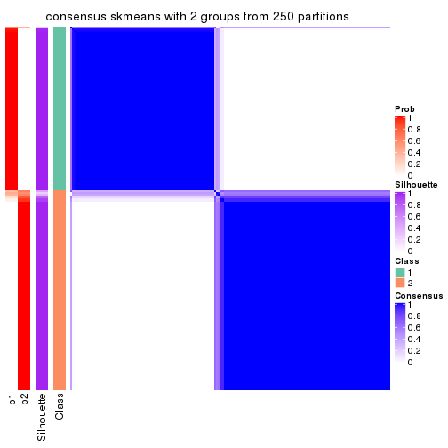</p>

</div>
<div id='tab-MAD-skmeans-consensus-heatmap-2'>
<pre><code class="r">consensus_heatmap(res, k = 3)
</code></pre>

<p>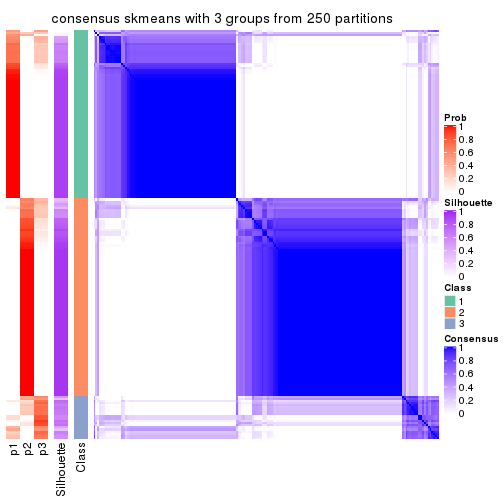</p>

</div>
<div id='tab-MAD-skmeans-consensus-heatmap-3'>
<pre><code class="r">consensus_heatmap(res, k = 4)
</code></pre>

<p>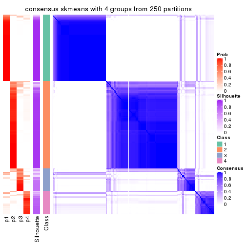</p>

</div>
<div id='tab-MAD-skmeans-consensus-heatmap-4'>
<pre><code class="r">consensus_heatmap(res, k = 5)
</code></pre>

<p>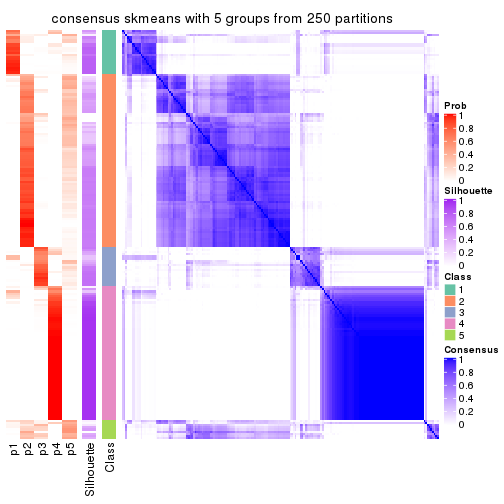</p>

</div>
<div id='tab-MAD-skmeans-consensus-heatmap-5'>
<pre><code class="r">consensus_heatmap(res, k = 6)
</code></pre>

<p>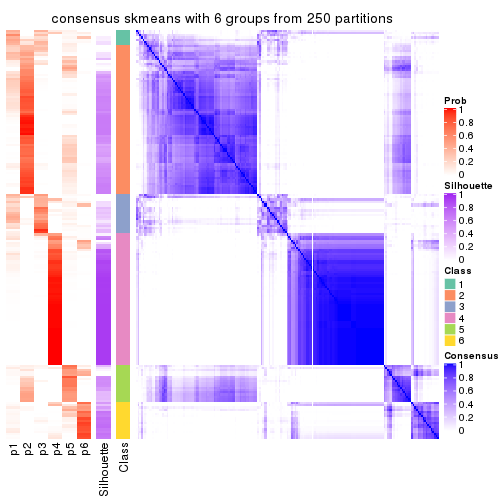</p>

</div>
</div>

Heatmaps for the membership of samples in all partitions to see how consistent they are:


<script>
$( function() {
	$( '#tabs-MAD-skmeans-membership-heatmap' ).tabs();
} );
</script>
<div id='tabs-MAD-skmeans-membership-heatmap'>
<ul>
<li><a href='#tab-MAD-skmeans-membership-heatmap-1'>k = 2</a></li>
<li><a href='#tab-MAD-skmeans-membership-heatmap-2'>k = 3</a></li>
<li><a href='#tab-MAD-skmeans-membership-heatmap-3'>k = 4</a></li>
<li><a href='#tab-MAD-skmeans-membership-heatmap-4'>k = 5</a></li>
<li><a href='#tab-MAD-skmeans-membership-heatmap-5'>k = 6</a></li>
</ul>
<div id='tab-MAD-skmeans-membership-heatmap-1'>
<pre><code class="r">membership_heatmap(res, k = 2)
</code></pre>

<p>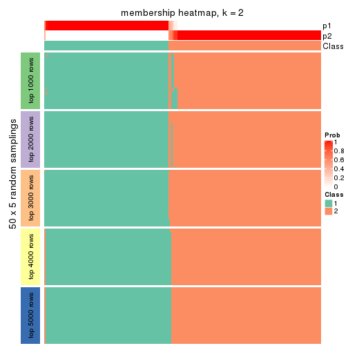</p>

</div>
<div id='tab-MAD-skmeans-membership-heatmap-2'>
<pre><code class="r">membership_heatmap(res, k = 3)
</code></pre>

<p>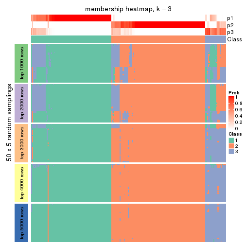</p>

</div>
<div id='tab-MAD-skmeans-membership-heatmap-3'>
<pre><code class="r">membership_heatmap(res, k = 4)
</code></pre>

<p>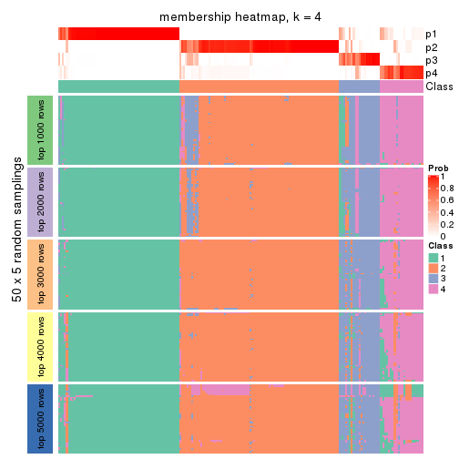</p>

</div>
<div id='tab-MAD-skmeans-membership-heatmap-4'>
<pre><code class="r">membership_heatmap(res, k = 5)
</code></pre>

<p>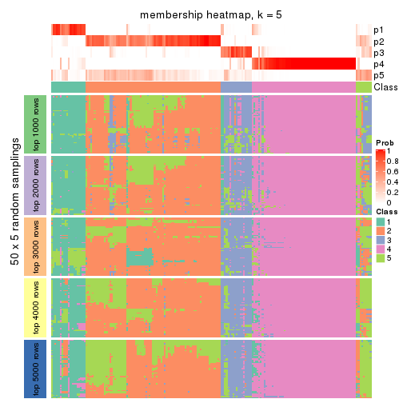</p>

</div>
<div id='tab-MAD-skmeans-membership-heatmap-5'>
<pre><code class="r">membership_heatmap(res, k = 6)
</code></pre>

<p>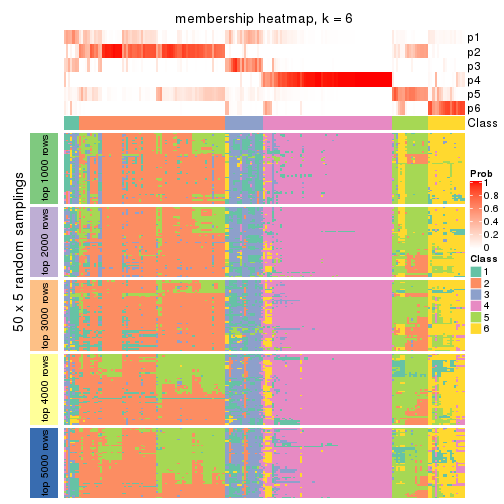</p>

</div>
</div>

As soon as we have had the classes for columns, we can look for signatures
which are significantly different between classes which can be candidate marks
for certain classes. Following are the heatmaps for signatures.


Signature heatmaps where rows are scaled:


<script>
$( function() {
	$( '#tabs-MAD-skmeans-get-signatures' ).tabs();
} );
</script>
<div id='tabs-MAD-skmeans-get-signatures'>
<ul>
<li><a href='#tab-MAD-skmeans-get-signatures-1'>k = 2</a></li>
<li><a href='#tab-MAD-skmeans-get-signatures-2'>k = 3</a></li>
<li><a href='#tab-MAD-skmeans-get-signatures-3'>k = 4</a></li>
<li><a href='#tab-MAD-skmeans-get-signatures-4'>k = 5</a></li>
<li><a href='#tab-MAD-skmeans-get-signatures-5'>k = 6</a></li>
</ul>
<div id='tab-MAD-skmeans-get-signatures-1'>
<pre><code class="r">get_signatures(res, k = 2)
</code></pre>

<p>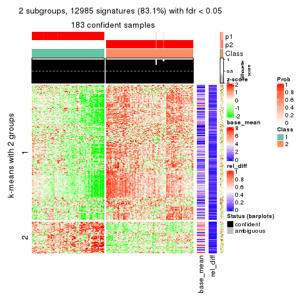</p>

</div>
<div id='tab-MAD-skmeans-get-signatures-2'>
<pre><code class="r">get_signatures(res, k = 3)
</code></pre>

<p>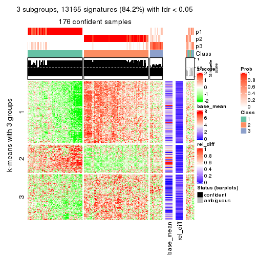</p>

</div>
<div id='tab-MAD-skmeans-get-signatures-3'>
<pre><code class="r">get_signatures(res, k = 4)
</code></pre>

<p>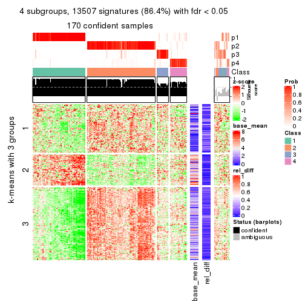</p>

</div>
<div id='tab-MAD-skmeans-get-signatures-4'>
<pre><code class="r">get_signatures(res, k = 5)
</code></pre>

<p>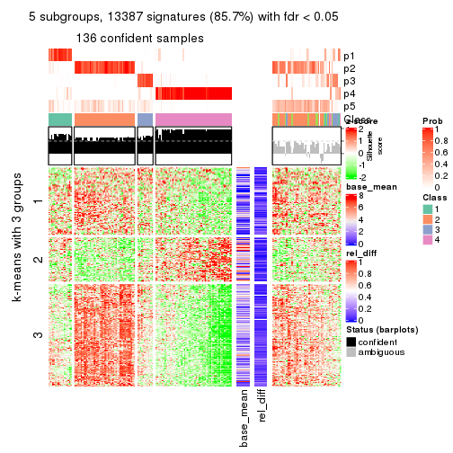</p>

</div>
<div id='tab-MAD-skmeans-get-signatures-5'>
<pre><code class="r">get_signatures(res, k = 6)
</code></pre>

<p>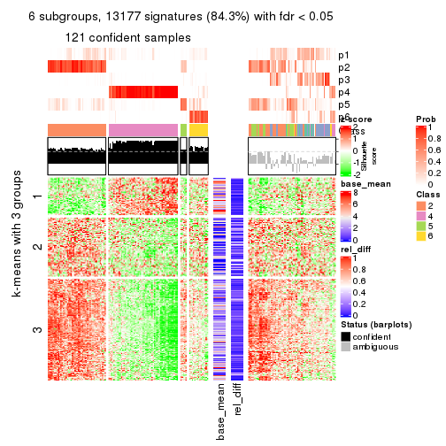</p>

</div>
</div>


Signature heatmaps where rows are not scaled:


<script>
$( function() {
	$( '#tabs-MAD-skmeans-get-signatures-no-scale' ).tabs();
} );
</script>
<div id='tabs-MAD-skmeans-get-signatures-no-scale'>
<ul>
<li><a href='#tab-MAD-skmeans-get-signatures-no-scale-1'>k = 2</a></li>
<li><a href='#tab-MAD-skmeans-get-signatures-no-scale-2'>k = 3</a></li>
<li><a href='#tab-MAD-skmeans-get-signatures-no-scale-3'>k = 4</a></li>
<li><a href='#tab-MAD-skmeans-get-signatures-no-scale-4'>k = 5</a></li>
<li><a href='#tab-MAD-skmeans-get-signatures-no-scale-5'>k = 6</a></li>
</ul>
<div id='tab-MAD-skmeans-get-signatures-no-scale-1'>
<pre><code class="r">get_signatures(res, k = 2, scale_rows = FALSE)
</code></pre>

<p>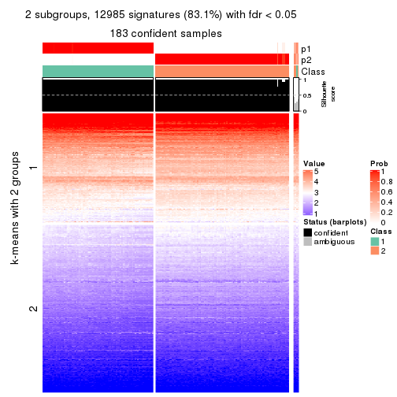</p>

</div>
<div id='tab-MAD-skmeans-get-signatures-no-scale-2'>
<pre><code class="r">get_signatures(res, k = 3, scale_rows = FALSE)
</code></pre>

<p>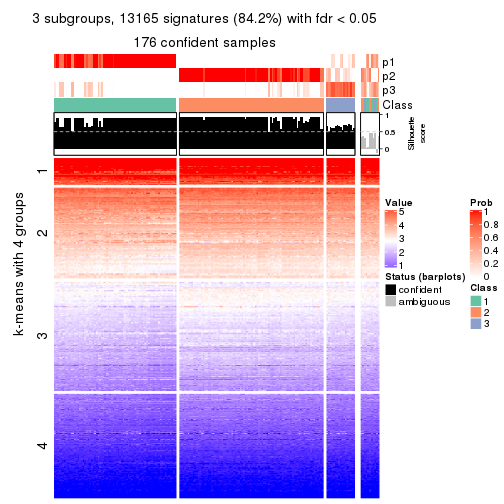</p>

</div>
<div id='tab-MAD-skmeans-get-signatures-no-scale-3'>
<pre><code class="r">get_signatures(res, k = 4, scale_rows = FALSE)
</code></pre>

<p>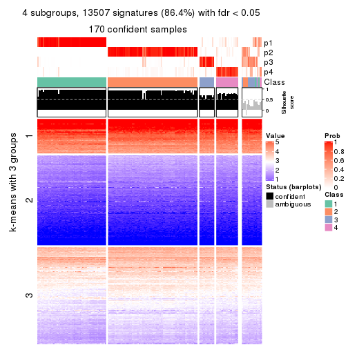</p>

</div>
<div id='tab-MAD-skmeans-get-signatures-no-scale-4'>
<pre><code class="r">get_signatures(res, k = 5, scale_rows = FALSE)
</code></pre>

<p>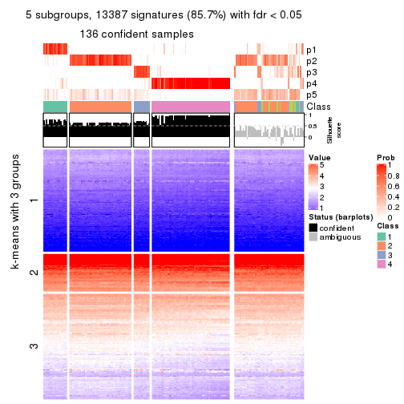</p>

</div>
<div id='tab-MAD-skmeans-get-signatures-no-scale-5'>
<pre><code class="r">get_signatures(res, k = 6, scale_rows = FALSE)
</code></pre>

<p>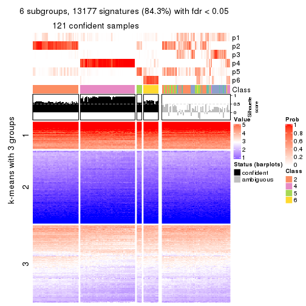</p>

</div>
</div>


Compare the overlap of signatures from different k:

```r
compare_signatures(res)
```

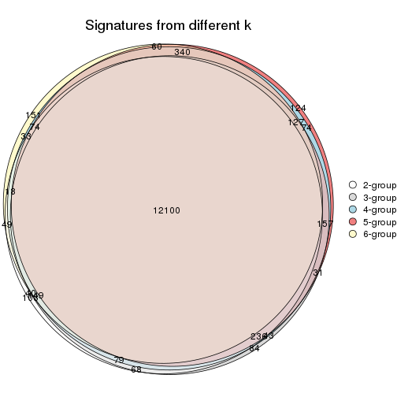

`get_signature()` returns a data frame invisibly. TO get the list of signatures, the function
call should be assigned to a variable explicitly. In following code, if `plot` argument is set
to `FALSE`, no heatmap is plotted while only the differential analysis is performed.

```r
# code only for demonstration
tb = get_signature(res, k = ..., plot = FALSE)
```

An example of the output of `tb` is:

```
#>   which_row         fdr    mean_1    mean_2 scaled_mean_1 scaled_mean_2 km
#> 1        38 0.042760348  8.373488  9.131774    -0.5533452     0.5164555  1
#> 2        40 0.018707592  7.106213  8.469186    -0.6173731     0.5762149  1
#> 3        55 0.019134737 10.221463 11.207825    -0.6159697     0.5749050  1
#> 4        59 0.006059896  5.921854  7.869574    -0.6899429     0.6439467  1
#> 5        60 0.018055526  8.928898 10.211722    -0.6204761     0.5791110  1
#> 6        98 0.009384629 15.714769 14.887706     0.6635654    -0.6193277  2
...
```

The columns in `tb` are:

1. `which_row`: row indices corresponding to the input matrix.
2. `fdr`: FDR for the differential test. 
3. `mean_x`: The mean value in group x.
4. `scaled_mean_x`: The mean value in group x after rows are scaled.
5. `km`: Row groups if k-means clustering is applied to rows.


UMAP plot which shows how samples are separated.


<script>
$( function() {
	$( '#tabs-MAD-skmeans-dimension-reduction' ).tabs();
} );
</script>
<div id='tabs-MAD-skmeans-dimension-reduction'>
<ul>
<li><a href='#tab-MAD-skmeans-dimension-reduction-1'>k = 2</a></li>
<li><a href='#tab-MAD-skmeans-dimension-reduction-2'>k = 3</a></li>
<li><a href='#tab-MAD-skmeans-dimension-reduction-3'>k = 4</a></li>
<li><a href='#tab-MAD-skmeans-dimension-reduction-4'>k = 5</a></li>
<li><a href='#tab-MAD-skmeans-dimension-reduction-5'>k = 6</a></li>
</ul>
<div id='tab-MAD-skmeans-dimension-reduction-1'>
<pre><code class="r">dimension_reduction(res, k = 2, method = &quot;UMAP&quot;)
</code></pre>

<p>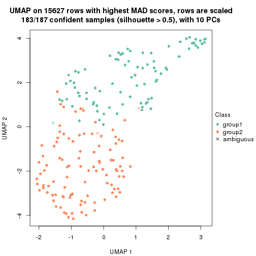</p>

</div>
<div id='tab-MAD-skmeans-dimension-reduction-2'>
<pre><code class="r">dimension_reduction(res, k = 3, method = &quot;UMAP&quot;)
</code></pre>

<p>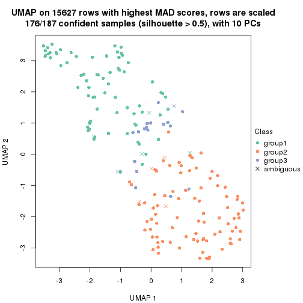</p>

</div>
<div id='tab-MAD-skmeans-dimension-reduction-3'>
<pre><code class="r">dimension_reduction(res, k = 4, method = &quot;UMAP&quot;)
</code></pre>

<p>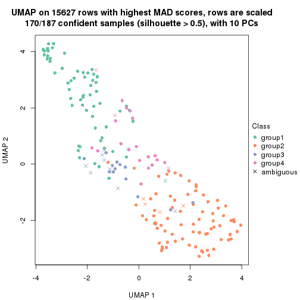</p>

</div>
<div id='tab-MAD-skmeans-dimension-reduction-4'>
<pre><code class="r">dimension_reduction(res, k = 5, method = &quot;UMAP&quot;)
</code></pre>

<p>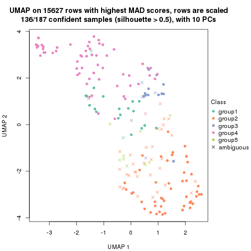</p>

</div>
<div id='tab-MAD-skmeans-dimension-reduction-5'>
<pre><code class="r">dimension_reduction(res, k = 6, method = &quot;UMAP&quot;)
</code></pre>

<p>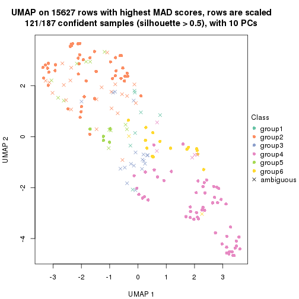</p>

</div>
</div>


Following heatmap shows how subgroups are split when increasing `k`:

```r
collect_classes(res)
```

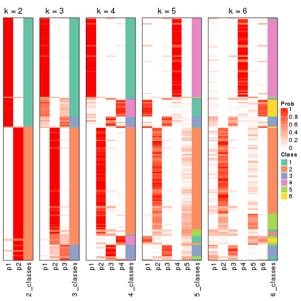


If matrix rows can be associated to genes, consider to use `GO_Enrichment(res,
...)` to perform function enrichment for the signature genes.


 

---------------------------------------------------


### MAD:pam


The object with results only for a single top-value method and a single partition method 
can be extracted as:

```r
res = res_list["MAD", "pam"]
# you can also extract it by
# res = res_list["MAD:pam"]
```

A summary of `res` and all the functions that can be applied to it:

```r
res
```

```
#> A 'ConsensusPartition' object with k = 2, 3, 4, 5, 6.
#>   On a matrix with 15627 rows and 187 columns.
#>   Top rows (1000, 2000, 3000, 4000, 5000) are extracted by 'MAD' method.
#>   Subgroups are detected by 'pam' method.
#>   Performed in total 1250 partitions by row resampling.
#>   Best k for subgroups seems to be 2.
#> 
#> Following methods can be applied to this 'ConsensusPartition' object:
#>  [1] "cola_report"             "collect_classes"         "collect_plots"          
#>  [4] "collect_stats"           "colnames"                "compare_signatures"     
#>  [7] "consensus_heatmap"       "dimension_reduction"     "functional_enrichment"  
#> [10] "get_anno_col"            "get_anno"                "get_classes"            
#> [13] "get_consensus"           "get_matrix"              "get_membership"         
#> [16] "get_param"               "get_signatures"          "get_stats"              
#> [19] "is_best_k"               "is_stable_k"             "membership_heatmap"     
#> [22] "ncol"                    "nrow"                    "plot_ecdf"              
#> [25] "rownames"                "select_partition_number" "show"                   
#> [28] "suggest_best_k"          "test_to_known_factors"
```

`collect_plots()` function collects all the plots made from `res` for all `k` (number of partitions)
into one single page to provide an easy and fast comparison between different `k`.

```r
collect_plots(res)
```

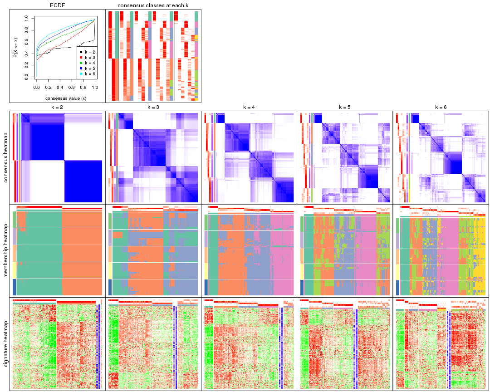

The plots are:

- The first row: a plot of the ECDF (Empirical cumulative distribution
  function) curves of the consensus matrix for each `k` and the heatmap of
  predicted classes for each `k`.
- The second row: heatmaps of the consensus matrix for each `k`.
- The third row: heatmaps of the membership matrix for each `k`.
- The fouth row: heatmaps of the signatures for each `k`.

All the plots in panels can be made by individual functions and they are
plotted later in this section.

`select_partition_number()` produces several plots showing different
statistics for choosing "optimized" `k`. There are following statistics:

- ECDF curves of the consensus matrix for each `k`;
- 1-PAC. [The PAC
  score](https://en.wikipedia.org/wiki/Consensus_clustering#Over-interpretation_potential_of_consensus_clustering)
  measures the proportion of the ambiguous subgrouping.
- Mean silhouette score.
- Concordance. The mean probability of fiting the consensus class ids in all
  partitions.
- Area increased. Denote $A_k$ as the area under the ECDF curve for current
  `k`, the area increased is defined as $A_k - A_{k-1}$.
- Rand index. The percent of pairs of samples that are both in a same cluster
  or both are not in a same cluster in the partition of k and k-1.
- Jaccard index. The ratio of pairs of samples are both in a same cluster in
  the partition of k and k-1 and the pairs of samples are both in a same
  cluster in the partition k or k-1.

The detailed explanations of these statistics can be found in [the cola
vignette](http://bioconductor.org/packages/devel/bioc/vignettes/cola/inst/doc/cola.html#toc_13).

Generally speaking, lower PAC score, higher mean silhouette score or higher
concordance corresponds to better partition. Rand index and Jaccard index
measure how similar the current partition is compared to partition with `k-1`.
If they are too similar, we won't accept `k` is better than `k-1`.

```r
select_partition_number(res)
```

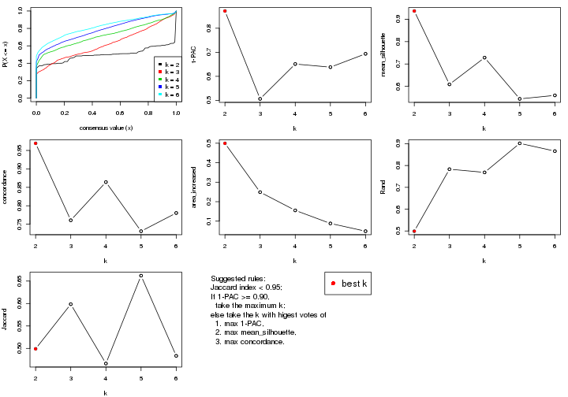

The numeric values for all these statistics can be obtained by `get_stats()`.

```r
get_stats(res)
```

```
#>   k 1-PAC mean_silhouette concordance area_increased  Rand Jaccard
#> 2 2 0.872           0.937       0.969         0.4996 0.499   0.499
#> 3 3 0.506           0.609       0.761         0.2488 0.783   0.598
#> 4 4 0.651           0.728       0.864         0.1552 0.768   0.466
#> 5 5 0.638           0.544       0.731         0.0881 0.902   0.662
#> 6 6 0.694           0.560       0.780         0.0482 0.866   0.483
```

`suggest_best_k()` suggests the best $k$ based on these statistics. The rules are as follows:

- All $k$ with Jaccard index larger than 0.95 are removed because the increase of
  the partition number does not provides enough extra information. If all $k$ are removed,
  the best $k$ is assigned by `NA`.
- For $k$ with 1-PAC larger than 0.9, the maximal $k$ is taken as the "best k". Other $k$ is called "optional k".
- If it does not fit the second rule. The $k$ with the highest vote of highest
  1-PAC, mean silhouette and concordance is taken as the "best k".

```r
suggest_best_k(res)
```

```
#> [1] 2
```


Following shows the table of the partitions (You need to click the **show/hide
code output** link to see it). The membership matrix (columns with name `p*`)
is inferred by
[`clue::cl_consensus()`](https://www.rdocumentation.org/link/cl_consensus?package=clue)
function with the `SE` method. Basically the value in the membership matrix
represents the probability to belong to a certain group. The finall class
label for an item is determined with the group with highest probability it
belongs to.

In `get_classes()` function, the entropy is calculated from the membership
matrix and the silhouette score is calculated from the consensus matrix.


<script>
$( function() {
	$( '#tabs-MAD-pam-get-classes' ).tabs();
} );
</script>
<div id='tabs-MAD-pam-get-classes'>
<ul>
<li><a href='#tab-MAD-pam-get-classes-1'>k = 2</a></li>
<li><a href='#tab-MAD-pam-get-classes-2'>k = 3</a></li>
<li><a href='#tab-MAD-pam-get-classes-3'>k = 4</a></li>
<li><a href='#tab-MAD-pam-get-classes-4'>k = 5</a></li>
<li><a href='#tab-MAD-pam-get-classes-5'>k = 6</a></li>
</ul>

<div id='tab-MAD-pam-get-classes-1'>
<p><a id='tab-MAD-pam-get-classes-1-a' style='color:#0366d6' href='#'>show/hide code output</a></p>
<pre><code class="r">cbind(get_classes(res, k = 2), get_membership(res, k = 2))
</code></pre>

<pre><code>#&gt;            class entropy silhouette    p1    p2
#&gt; SRR1747213     1  0.0000      0.946 1.000 0.000
#&gt; SRR1747214     1  0.0000      0.946 1.000 0.000
#&gt; SRR1747215     2  0.0000      0.992 0.000 1.000
#&gt; SRR1747216     2  0.0000      0.992 0.000 1.000
#&gt; SRR1747217     1  0.3733      0.899 0.928 0.072
#&gt; SRR1747218     2  0.0000      0.992 0.000 1.000
#&gt; SRR1747219     1  0.1184      0.937 0.984 0.016
#&gt; SRR1747220     1  0.0000      0.946 1.000 0.000
#&gt; SRR1747221     1  0.0000      0.946 1.000 0.000
#&gt; SRR1747222     1  0.0000      0.946 1.000 0.000
#&gt; SRR1747223     1  0.0000      0.946 1.000 0.000
#&gt; SRR1747224     1  0.7745      0.750 0.772 0.228
#&gt; SRR1747225     2  0.0000      0.992 0.000 1.000
#&gt; SRR1747226     2  0.0000      0.992 0.000 1.000
#&gt; SRR1747227     2  0.0000      0.992 0.000 1.000
#&gt; SRR1747228     2  0.7883      0.656 0.236 0.764
#&gt; SRR1747229     2  0.0000      0.992 0.000 1.000
#&gt; SRR1747230     1  0.0000      0.946 1.000 0.000
#&gt; SRR1747231     1  0.0000      0.946 1.000 0.000
#&gt; SRR1747232     1  0.0000      0.946 1.000 0.000
#&gt; SRR1747233     1  0.0000      0.946 1.000 0.000
#&gt; SRR1747234     1  0.8555      0.676 0.720 0.280
#&gt; SRR1747235     1  0.0000      0.946 1.000 0.000
#&gt; SRR1747236     2  0.0000      0.992 0.000 1.000
#&gt; SRR1747237     2  0.0000      0.992 0.000 1.000
#&gt; SRR1747238     2  0.0000      0.992 0.000 1.000
#&gt; SRR1747239     2  0.0000      0.992 0.000 1.000
#&gt; SRR1747240     1  0.0000      0.946 1.000 0.000
#&gt; SRR1747241     2  0.1184      0.976 0.016 0.984
#&gt; SRR1747242     1  0.0000      0.946 1.000 0.000
#&gt; SRR1747243     1  0.0000      0.946 1.000 0.000
#&gt; SRR1747244     1  0.8499      0.682 0.724 0.276
#&gt; SRR1747245     2  0.0000      0.992 0.000 1.000
#&gt; SRR1747246     2  0.0000      0.992 0.000 1.000
#&gt; SRR1747247     1  0.0000      0.946 1.000 0.000
#&gt; SRR1747248     1  0.0000      0.946 1.000 0.000
#&gt; SRR1747249     1  0.0000      0.946 1.000 0.000
#&gt; SRR1747250     1  0.7815      0.745 0.768 0.232
#&gt; SRR1747252     1  0.0000      0.946 1.000 0.000
#&gt; SRR1747253     1  0.0000      0.946 1.000 0.000
#&gt; SRR1747254     2  0.0000      0.992 0.000 1.000
#&gt; SRR1747255     1  0.0000      0.946 1.000 0.000
#&gt; SRR1747256     1  0.0000      0.946 1.000 0.000
#&gt; SRR1747257     2  0.0000      0.992 0.000 1.000
#&gt; SRR1747258     2  0.9129      0.452 0.328 0.672
#&gt; SRR1747259     2  0.0000      0.992 0.000 1.000
#&gt; SRR1747260     1  0.7950      0.735 0.760 0.240
#&gt; SRR1747261     1  0.9944      0.273 0.544 0.456
#&gt; SRR1747262     2  0.0000      0.992 0.000 1.000
#&gt; SRR1747263     2  0.0000      0.992 0.000 1.000
#&gt; SRR1747264     1  0.0000      0.946 1.000 0.000
#&gt; SRR1747265     1  0.7056      0.791 0.808 0.192
#&gt; SRR1747266     2  0.0376      0.989 0.004 0.996
#&gt; SRR1747267     1  0.0000      0.946 1.000 0.000
#&gt; SRR1747268     1  0.0000      0.946 1.000 0.000
#&gt; SRR1747269     2  0.0000      0.992 0.000 1.000
#&gt; SRR1747270     2  0.0000      0.992 0.000 1.000
#&gt; SRR1747271     2  0.0000      0.992 0.000 1.000
#&gt; SRR1747272     1  0.0000      0.946 1.000 0.000
#&gt; SRR1747273     1  0.0000      0.946 1.000 0.000
#&gt; SRR1747274     2  0.0000      0.992 0.000 1.000
#&gt; SRR1747275     1  0.0000      0.946 1.000 0.000
#&gt; SRR1747276     1  0.0000      0.946 1.000 0.000
#&gt; SRR1747277     2  0.0000      0.992 0.000 1.000
#&gt; SRR1747278     1  0.3274      0.905 0.940 0.060
#&gt; SRR1747280     1  0.0000      0.946 1.000 0.000
#&gt; SRR1747279     1  0.0000      0.946 1.000 0.000
#&gt; SRR1747281     2  0.0000      0.992 0.000 1.000
#&gt; SRR1747282     1  0.0000      0.946 1.000 0.000
#&gt; SRR1747283     1  0.6048      0.836 0.852 0.148
#&gt; SRR1747284     1  0.0000      0.946 1.000 0.000
#&gt; SRR1747285     1  0.7883      0.741 0.764 0.236
#&gt; SRR1747286     2  0.0000      0.992 0.000 1.000
#&gt; SRR1747287     2  0.0000      0.992 0.000 1.000
#&gt; SRR1747288     1  0.0000      0.946 1.000 0.000
#&gt; SRR1747290     2  0.0000      0.992 0.000 1.000
#&gt; SRR1747289     2  0.0000      0.992 0.000 1.000
#&gt; SRR1747291     2  0.0000      0.992 0.000 1.000
#&gt; SRR1747293     2  0.0376      0.989 0.004 0.996
#&gt; SRR1747294     2  0.0000      0.992 0.000 1.000
#&gt; SRR1747292     1  0.0000      0.946 1.000 0.000
#&gt; SRR1747295     2  0.0000      0.992 0.000 1.000
#&gt; SRR1747296     2  0.0000      0.992 0.000 1.000
#&gt; SRR1747297     2  0.0000      0.992 0.000 1.000
#&gt; SRR1747298     2  0.0000      0.992 0.000 1.000
#&gt; SRR1747299     2  0.0000      0.992 0.000 1.000
#&gt; SRR1747300     2  0.0000      0.992 0.000 1.000
#&gt; SRR1747301     2  0.0000      0.992 0.000 1.000
#&gt; SRR1747302     2  0.0000      0.992 0.000 1.000
#&gt; SRR1747303     2  0.0000      0.992 0.000 1.000
#&gt; SRR1747304     1  0.0000      0.946 1.000 0.000
#&gt; SRR1747305     2  0.0000      0.992 0.000 1.000
#&gt; SRR1747306     2  0.0000      0.992 0.000 1.000
#&gt; SRR1747307     1  0.0000      0.946 1.000 0.000
#&gt; SRR1747308     2  0.0000      0.992 0.000 1.000
#&gt; SRR1747309     1  0.0000      0.946 1.000 0.000
#&gt; SRR1747310     1  0.0000      0.946 1.000 0.000
#&gt; SRR1747311     1  0.0000      0.946 1.000 0.000
#&gt; SRR1747313     1  0.0000      0.946 1.000 0.000
#&gt; SRR1747312     1  0.0000      0.946 1.000 0.000
#&gt; SRR1747314     1  0.0000      0.946 1.000 0.000
#&gt; SRR1747315     2  0.0000      0.992 0.000 1.000
#&gt; SRR1747316     2  0.0000      0.992 0.000 1.000
#&gt; SRR1747318     1  0.0000      0.946 1.000 0.000
#&gt; SRR1747317     1  0.0000      0.946 1.000 0.000
#&gt; SRR1747319     1  0.7056      0.791 0.808 0.192
#&gt; SRR1747320     1  0.0000      0.946 1.000 0.000
#&gt; SRR1747322     1  0.0000      0.946 1.000 0.000
#&gt; SRR1747321     1  0.0000      0.946 1.000 0.000
#&gt; SRR1747323     2  0.0000      0.992 0.000 1.000
#&gt; SRR1747324     2  0.0000      0.992 0.000 1.000
#&gt; SRR1747326     2  0.0000      0.992 0.000 1.000
#&gt; SRR1747325     2  0.0000      0.992 0.000 1.000
#&gt; SRR1747327     2  0.0000      0.992 0.000 1.000
#&gt; SRR1747328     1  0.0672      0.942 0.992 0.008
#&gt; SRR1747330     1  0.0000      0.946 1.000 0.000
#&gt; SRR1747329     2  0.0938      0.981 0.012 0.988
#&gt; SRR1747332     1  0.0000      0.946 1.000 0.000
#&gt; SRR1747331     2  0.0000      0.992 0.000 1.000
#&gt; SRR1747333     2  0.0000      0.992 0.000 1.000
#&gt; SRR1747334     2  0.0000      0.992 0.000 1.000
#&gt; SRR1747335     1  0.0000      0.946 1.000 0.000
#&gt; SRR1747336     1  0.0000      0.946 1.000 0.000
#&gt; SRR1747337     2  0.0000      0.992 0.000 1.000
#&gt; SRR1747338     2  0.0000      0.992 0.000 1.000
#&gt; SRR1747339     1  0.0000      0.946 1.000 0.000
#&gt; SRR1747340     2  0.0672      0.985 0.008 0.992
#&gt; SRR1747341     2  0.0000      0.992 0.000 1.000
#&gt; SRR1747342     2  0.0000      0.992 0.000 1.000
#&gt; SRR1747343     2  0.0000      0.992 0.000 1.000
#&gt; SRR1747344     2  0.0000      0.992 0.000 1.000
#&gt; SRR1747345     1  0.0000      0.946 1.000 0.000
#&gt; SRR1747346     1  0.0000      0.946 1.000 0.000
#&gt; SRR1747347     2  0.0000      0.992 0.000 1.000
#&gt; SRR1747348     1  0.0000      0.946 1.000 0.000
#&gt; SRR1747349     1  0.0000      0.946 1.000 0.000
#&gt; SRR1747351     2  0.0000      0.992 0.000 1.000
#&gt; SRR1747350     2  0.0000      0.992 0.000 1.000
#&gt; SRR1747352     1  0.0000      0.946 1.000 0.000
#&gt; SRR1747353     2  0.0000      0.992 0.000 1.000
#&gt; SRR1747354     1  0.8267      0.707 0.740 0.260
#&gt; SRR1747355     1  0.0000      0.946 1.000 0.000
#&gt; SRR1747356     1  0.2778      0.917 0.952 0.048
#&gt; SRR1747357     1  0.7815      0.745 0.768 0.232
#&gt; SRR1747358     1  0.8386      0.695 0.732 0.268
#&gt; SRR1747359     1  0.0000      0.946 1.000 0.000
#&gt; SRR1747360     2  0.0000      0.992 0.000 1.000
#&gt; SRR1747361     1  0.7815      0.745 0.768 0.232
#&gt; SRR1747362     2  0.0000      0.992 0.000 1.000
#&gt; SRR1747363     1  0.0000      0.946 1.000 0.000
#&gt; SRR1747364     1  0.0000      0.946 1.000 0.000
#&gt; SRR1747365     1  0.6973      0.795 0.812 0.188
#&gt; SRR1747366     2  0.0000      0.992 0.000 1.000
#&gt; SRR1747367     1  0.0000      0.946 1.000 0.000
#&gt; SRR1747369     2  0.0000      0.992 0.000 1.000
#&gt; SRR1747368     1  0.4939      0.871 0.892 0.108
#&gt; SRR1747370     1  0.7815      0.745 0.768 0.232
#&gt; SRR1747372     1  0.0000      0.946 1.000 0.000
#&gt; SRR1747371     1  0.0000      0.946 1.000 0.000
#&gt; SRR1747373     2  0.0000      0.992 0.000 1.000
#&gt; SRR1747374     2  0.0000      0.992 0.000 1.000
#&gt; SRR1747375     1  0.0000      0.946 1.000 0.000
#&gt; SRR1747376     2  0.0000      0.992 0.000 1.000
#&gt; SRR1747377     2  0.0000      0.992 0.000 1.000
#&gt; SRR1747378     2  0.0000      0.992 0.000 1.000
#&gt; SRR1747379     2  0.0000      0.992 0.000 1.000
#&gt; SRR1747380     1  0.0000      0.946 1.000 0.000
#&gt; SRR1747381     1  0.0000      0.946 1.000 0.000
#&gt; SRR1747382     1  0.0000      0.946 1.000 0.000
#&gt; SRR1747383     2  0.0000      0.992 0.000 1.000
#&gt; SRR1747384     1  0.2778      0.914 0.952 0.048
#&gt; SRR1747385     1  0.9754      0.378 0.592 0.408
#&gt; SRR1747386     1  0.0000      0.946 1.000 0.000
#&gt; SRR1747387     2  0.0000      0.992 0.000 1.000
#&gt; SRR1747388     2  0.0000      0.992 0.000 1.000
#&gt; SRR1747390     2  0.0000      0.992 0.000 1.000
#&gt; SRR1747389     2  0.0000      0.992 0.000 1.000
#&gt; SRR1747391     2  0.0000      0.992 0.000 1.000
#&gt; SRR1747392     2  0.0000      0.992 0.000 1.000
#&gt; SRR1747393     1  0.8555      0.676 0.720 0.280
#&gt; SRR1747394     1  0.0000      0.946 1.000 0.000
#&gt; SRR1747395     1  0.7139      0.789 0.804 0.196
#&gt; SRR1747396     2  0.0000      0.992 0.000 1.000
#&gt; SRR1747398     2  0.0000      0.992 0.000 1.000
#&gt; SRR1747397     1  0.0000      0.946 1.000 0.000
#&gt; SRR1747399     1  0.0000      0.946 1.000 0.000
#&gt; SRR1747400     1  0.0000      0.946 1.000 0.000
</code></pre>

<script>
$('#tab-MAD-pam-get-classes-1-a').parent().next().next().hide();
$('#tab-MAD-pam-get-classes-1-a').click(function(){
  $('#tab-MAD-pam-get-classes-1-a').parent().next().next().toggle();
  return(false);
});
</script>
</div>

<div id='tab-MAD-pam-get-classes-2'>
<p><a id='tab-MAD-pam-get-classes-2-a' style='color:#0366d6' href='#'>show/hide code output</a></p>
<pre><code class="r">cbind(get_classes(res, k = 3), get_membership(res, k = 3))
</code></pre>

<pre><code>#&gt;            class entropy silhouette    p1    p2    p3
#&gt; SRR1747213     3  0.5465     0.4433 0.288 0.000 0.712
#&gt; SRR1747214     1  0.6111     0.4838 0.604 0.000 0.396
#&gt; SRR1747215     2  0.0000     0.8699 0.000 1.000 0.000
#&gt; SRR1747216     2  0.0747     0.8725 0.000 0.984 0.016
#&gt; SRR1747217     3  0.4540     0.6471 0.124 0.028 0.848
#&gt; SRR1747218     2  0.6286     0.4460 0.000 0.536 0.464
#&gt; SRR1747219     3  0.3845     0.6466 0.116 0.012 0.872
#&gt; SRR1747220     3  0.6299    -0.1353 0.476 0.000 0.524
#&gt; SRR1747221     3  0.6180     0.0956 0.416 0.000 0.584
#&gt; SRR1747222     3  0.6180     0.0962 0.416 0.000 0.584
#&gt; SRR1747223     3  0.5216     0.4819 0.260 0.000 0.740
#&gt; SRR1747224     3  0.3141     0.6181 0.020 0.068 0.912
#&gt; SRR1747225     2  0.6154     0.5321 0.000 0.592 0.408
#&gt; SRR1747226     2  0.0000     0.8699 0.000 1.000 0.000
#&gt; SRR1747227     2  0.1163     0.8726 0.000 0.972 0.028
#&gt; SRR1747228     3  0.6302    -0.2968 0.000 0.480 0.520
#&gt; SRR1747229     2  0.1860     0.8633 0.000 0.948 0.052
#&gt; SRR1747230     1  0.0000     0.7617 1.000 0.000 0.000
#&gt; SRR1747231     1  0.6302     0.2640 0.520 0.000 0.480
#&gt; SRR1747232     1  0.0000     0.7617 1.000 0.000 0.000
#&gt; SRR1747233     3  0.6252    -0.0204 0.444 0.000 0.556
#&gt; SRR1747234     3  0.3207     0.6066 0.012 0.084 0.904
#&gt; SRR1747235     1  0.0000     0.7617 1.000 0.000 0.000
#&gt; SRR1747236     2  0.1031     0.8733 0.000 0.976 0.024
#&gt; SRR1747237     2  0.2959     0.8671 0.000 0.900 0.100
#&gt; SRR1747238     2  0.6079     0.6157 0.000 0.612 0.388
#&gt; SRR1747239     2  0.0000     0.8699 0.000 1.000 0.000
#&gt; SRR1747240     1  0.0000     0.7617 1.000 0.000 0.000
#&gt; SRR1747241     2  0.6267     0.4849 0.000 0.548 0.452
#&gt; SRR1747242     1  0.0000     0.7617 1.000 0.000 0.000
#&gt; SRR1747243     3  0.3752     0.6368 0.144 0.000 0.856
#&gt; SRR1747244     3  0.2774     0.6116 0.008 0.072 0.920
#&gt; SRR1747245     2  0.6180     0.5440 0.000 0.584 0.416
#&gt; SRR1747246     2  0.0592     0.8729 0.000 0.988 0.012
#&gt; SRR1747247     1  0.0424     0.7601 0.992 0.000 0.008
#&gt; SRR1747248     1  0.0000     0.7617 1.000 0.000 0.000
#&gt; SRR1747249     3  0.6225     0.0310 0.432 0.000 0.568
#&gt; SRR1747250     3  0.2590     0.6093 0.004 0.072 0.924
#&gt; SRR1747252     3  0.5397     0.4492 0.280 0.000 0.720
#&gt; SRR1747253     3  0.6126     0.1477 0.400 0.000 0.600
#&gt; SRR1747254     2  0.0000     0.8699 0.000 1.000 0.000
#&gt; SRR1747255     3  0.6095     0.1723 0.392 0.000 0.608
#&gt; SRR1747256     3  0.6168     0.1103 0.412 0.000 0.588
#&gt; SRR1747257     2  0.1289     0.8733 0.000 0.968 0.032
#&gt; SRR1747258     3  0.6045     0.0517 0.000 0.380 0.620
#&gt; SRR1747259     2  0.4654     0.8086 0.000 0.792 0.208
#&gt; SRR1747260     3  0.2261     0.6100 0.000 0.068 0.932
#&gt; SRR1747261     3  0.5216     0.4148 0.000 0.260 0.740
#&gt; SRR1747262     2  0.5138     0.7875 0.000 0.748 0.252
#&gt; SRR1747263     2  0.1163     0.8726 0.000 0.972 0.028
#&gt; SRR1747264     1  0.3340     0.7201 0.880 0.000 0.120
#&gt; SRR1747265     3  0.4288     0.6356 0.068 0.060 0.872
#&gt; SRR1747266     3  0.6192    -0.1441 0.000 0.420 0.580
#&gt; SRR1747267     3  0.3686     0.6387 0.140 0.000 0.860
#&gt; SRR1747268     3  0.3752     0.6368 0.144 0.000 0.856
#&gt; SRR1747269     2  0.5621     0.7381 0.000 0.692 0.308
#&gt; SRR1747270     2  0.3619     0.8162 0.000 0.864 0.136
#&gt; SRR1747271     2  0.6026     0.6429 0.000 0.624 0.376
#&gt; SRR1747272     3  0.3816     0.6346 0.148 0.000 0.852
#&gt; SRR1747273     3  0.6252    -0.0165 0.444 0.000 0.556
#&gt; SRR1747274     2  0.6045     0.6264 0.000 0.620 0.380
#&gt; SRR1747275     1  0.6140     0.4696 0.596 0.000 0.404
#&gt; SRR1747276     3  0.6305    -0.1687 0.484 0.000 0.516
#&gt; SRR1747277     2  0.3482     0.8605 0.000 0.872 0.128
#&gt; SRR1747278     3  0.4139     0.6444 0.124 0.016 0.860
#&gt; SRR1747280     1  0.0000     0.7617 1.000 0.000 0.000
#&gt; SRR1747279     1  0.6307     0.2377 0.512 0.000 0.488
#&gt; SRR1747281     2  0.3551     0.8583 0.000 0.868 0.132
#&gt; SRR1747282     1  0.4399     0.6720 0.812 0.000 0.188
#&gt; SRR1747283     3  0.6037     0.6101 0.100 0.112 0.788
#&gt; SRR1747284     1  0.5216     0.6112 0.740 0.000 0.260
#&gt; SRR1747285     3  0.5467     0.5481 0.032 0.176 0.792
#&gt; SRR1747286     2  0.6180     0.5555 0.000 0.584 0.416
#&gt; SRR1747287     2  0.3482     0.8597 0.000 0.872 0.128
#&gt; SRR1747288     3  0.5178     0.4905 0.256 0.000 0.744
#&gt; SRR1747290     2  0.1860     0.8740 0.000 0.948 0.052
#&gt; SRR1747289     2  0.0000     0.8699 0.000 1.000 0.000
#&gt; SRR1747291     2  0.5810     0.7037 0.000 0.664 0.336
#&gt; SRR1747293     3  0.6204    -0.1736 0.000 0.424 0.576
#&gt; SRR1747294     2  0.3116     0.8652 0.000 0.892 0.108
#&gt; SRR1747292     1  0.6126     0.4769 0.600 0.000 0.400
#&gt; SRR1747295     2  0.5431     0.7381 0.000 0.716 0.284
#&gt; SRR1747296     3  0.6295    -0.3147 0.000 0.472 0.528
#&gt; SRR1747297     2  0.0892     0.8726 0.000 0.980 0.020
#&gt; SRR1747298     2  0.2711     0.8698 0.000 0.912 0.088
#&gt; SRR1747299     2  0.1289     0.8733 0.000 0.968 0.032
#&gt; SRR1747300     2  0.1411     0.8739 0.000 0.964 0.036
#&gt; SRR1747301     2  0.3116     0.8069 0.000 0.892 0.108
#&gt; SRR1747302     2  0.0000     0.8699 0.000 1.000 0.000
#&gt; SRR1747303     2  0.5254     0.7732 0.000 0.736 0.264
#&gt; SRR1747304     1  0.0000     0.7617 1.000 0.000 0.000
#&gt; SRR1747305     2  0.0747     0.8726 0.000 0.984 0.016
#&gt; SRR1747306     2  0.0892     0.8726 0.000 0.980 0.020
#&gt; SRR1747307     3  0.3816     0.6346 0.148 0.000 0.852
#&gt; SRR1747308     3  0.6252    -0.1672 0.000 0.444 0.556
#&gt; SRR1747309     3  0.5138     0.4974 0.252 0.000 0.748
#&gt; SRR1747310     1  0.0000     0.7617 1.000 0.000 0.000
#&gt; SRR1747311     3  0.3619     0.6402 0.136 0.000 0.864
#&gt; SRR1747313     3  0.3551     0.6413 0.132 0.000 0.868
#&gt; SRR1747312     1  0.0000     0.7617 1.000 0.000 0.000
#&gt; SRR1747314     1  0.0000     0.7617 1.000 0.000 0.000
#&gt; SRR1747315     2  0.5760     0.7149 0.000 0.672 0.328
#&gt; SRR1747316     3  0.6168    -0.1344 0.000 0.412 0.588
#&gt; SRR1747318     3  0.3752     0.6368 0.144 0.000 0.856
#&gt; SRR1747317     3  0.3686     0.6387 0.140 0.000 0.860
#&gt; SRR1747319     3  0.5020     0.6436 0.108 0.056 0.836
#&gt; SRR1747320     3  0.6307    -0.1867 0.488 0.000 0.512
#&gt; SRR1747322     1  0.0000     0.7617 1.000 0.000 0.000
#&gt; SRR1747321     1  0.6095     0.4877 0.608 0.000 0.392
#&gt; SRR1747323     2  0.0424     0.8713 0.000 0.992 0.008
#&gt; SRR1747324     2  0.4555     0.8210 0.000 0.800 0.200
#&gt; SRR1747326     2  0.2165     0.8728 0.000 0.936 0.064
#&gt; SRR1747325     2  0.0000     0.8699 0.000 1.000 0.000
#&gt; SRR1747327     2  0.0000     0.8699 0.000 1.000 0.000
#&gt; SRR1747328     3  0.3116     0.6447 0.108 0.000 0.892
#&gt; SRR1747330     3  0.3752     0.6368 0.144 0.000 0.856
#&gt; SRR1747329     3  0.6140    -0.1128 0.000 0.404 0.596
#&gt; SRR1747332     3  0.5397     0.4629 0.280 0.000 0.720
#&gt; SRR1747331     2  0.5431     0.7621 0.000 0.716 0.284
#&gt; SRR1747333     2  0.6168     0.5569 0.000 0.588 0.412
#&gt; SRR1747334     2  0.2625     0.8686 0.000 0.916 0.084
#&gt; SRR1747335     3  0.4062     0.6228 0.164 0.000 0.836
#&gt; SRR1747336     1  0.0000     0.7617 1.000 0.000 0.000
#&gt; SRR1747337     2  0.0000     0.8699 0.000 1.000 0.000
#&gt; SRR1747338     2  0.0000     0.8699 0.000 1.000 0.000
#&gt; SRR1747339     3  0.3482     0.6419 0.128 0.000 0.872
#&gt; SRR1747340     3  0.6168    -0.1369 0.000 0.412 0.588
#&gt; SRR1747341     2  0.0000     0.8699 0.000 1.000 0.000
#&gt; SRR1747342     2  0.0000     0.8699 0.000 1.000 0.000
#&gt; SRR1747343     2  0.0424     0.8713 0.000 0.992 0.008
#&gt; SRR1747344     2  0.5098     0.7786 0.000 0.752 0.248
#&gt; SRR1747345     3  0.3752     0.6368 0.144 0.000 0.856
#&gt; SRR1747346     3  0.3551     0.6411 0.132 0.000 0.868
#&gt; SRR1747347     2  0.0000     0.8699 0.000 1.000 0.000
#&gt; SRR1747348     1  0.0000     0.7617 1.000 0.000 0.000
#&gt; SRR1747349     1  0.6111     0.4838 0.604 0.000 0.396
#&gt; SRR1747351     2  0.1289     0.8733 0.000 0.968 0.032
#&gt; SRR1747350     2  0.4291     0.8392 0.000 0.820 0.180
#&gt; SRR1747352     1  0.0000     0.7617 1.000 0.000 0.000
#&gt; SRR1747353     2  0.5291     0.7797 0.000 0.732 0.268
#&gt; SRR1747354     3  0.2448     0.6057 0.000 0.076 0.924
#&gt; SRR1747355     3  0.4654     0.5746 0.208 0.000 0.792
#&gt; SRR1747356     3  0.3587     0.6458 0.088 0.020 0.892
#&gt; SRR1747357     3  0.2774     0.6122 0.008 0.072 0.920
#&gt; SRR1747358     3  0.2537     0.6036 0.000 0.080 0.920
#&gt; SRR1747359     1  0.6215     0.4159 0.572 0.000 0.428
#&gt; SRR1747360     2  0.3412     0.8612 0.000 0.876 0.124
#&gt; SRR1747361     3  0.4075     0.6227 0.048 0.072 0.880
#&gt; SRR1747362     2  0.4796     0.8124 0.000 0.780 0.220
#&gt; SRR1747363     3  0.3816     0.6346 0.148 0.000 0.852
#&gt; SRR1747364     1  0.6302     0.2640 0.520 0.000 0.480
#&gt; SRR1747365     3  0.5020     0.6430 0.108 0.056 0.836
#&gt; SRR1747366     2  0.4346     0.8356 0.000 0.816 0.184
#&gt; SRR1747367     3  0.3816     0.6346 0.148 0.000 0.852
#&gt; SRR1747369     2  0.0000     0.8699 0.000 1.000 0.000
#&gt; SRR1747368     3  0.3889     0.6456 0.084 0.032 0.884
#&gt; SRR1747370     3  0.2261     0.6100 0.000 0.068 0.932
#&gt; SRR1747372     1  0.1964     0.7463 0.944 0.000 0.056
#&gt; SRR1747371     3  0.6260    -0.0248 0.448 0.000 0.552
#&gt; SRR1747373     2  0.0000     0.8699 0.000 1.000 0.000
#&gt; SRR1747374     2  0.0000     0.8699 0.000 1.000 0.000
#&gt; SRR1747375     3  0.3752     0.6368 0.144 0.000 0.856
#&gt; SRR1747376     2  0.2878     0.8661 0.000 0.904 0.096
#&gt; SRR1747377     2  0.0000     0.8699 0.000 1.000 0.000
#&gt; SRR1747378     2  0.4555     0.8286 0.000 0.800 0.200
#&gt; SRR1747379     3  0.6286    -0.2954 0.000 0.464 0.536
#&gt; SRR1747380     3  0.3619     0.6400 0.136 0.000 0.864
#&gt; SRR1747381     1  0.3412     0.7136 0.876 0.000 0.124
#&gt; SRR1747382     1  0.6126     0.4767 0.600 0.000 0.400
#&gt; SRR1747383     2  0.3412     0.8607 0.000 0.876 0.124
#&gt; SRR1747384     3  0.3965     0.6438 0.132 0.008 0.860
#&gt; SRR1747385     3  0.6183     0.4797 0.032 0.236 0.732
#&gt; SRR1747386     1  0.0000     0.7617 1.000 0.000 0.000
#&gt; SRR1747387     2  0.0000     0.8699 0.000 1.000 0.000
#&gt; SRR1747388     2  0.3038     0.8661 0.000 0.896 0.104
#&gt; SRR1747390     3  0.6267    -0.2630 0.000 0.452 0.548
#&gt; SRR1747389     2  0.5859     0.6836 0.000 0.656 0.344
#&gt; SRR1747391     2  0.4002     0.8489 0.000 0.840 0.160
#&gt; SRR1747392     2  0.3116     0.8655 0.000 0.892 0.108
#&gt; SRR1747393     3  0.2866     0.6083 0.008 0.076 0.916
#&gt; SRR1747394     3  0.3816     0.6346 0.148 0.000 0.852
#&gt; SRR1747395     3  0.3993     0.6379 0.064 0.052 0.884
#&gt; SRR1747396     2  0.0747     0.8731 0.000 0.984 0.016
#&gt; SRR1747398     2  0.0000     0.8699 0.000 1.000 0.000
#&gt; SRR1747397     3  0.3752     0.6368 0.144 0.000 0.856
#&gt; SRR1747399     1  0.6111     0.4838 0.604 0.000 0.396
#&gt; SRR1747400     1  0.6274     0.3369 0.544 0.000 0.456
</code></pre>

<script>
$('#tab-MAD-pam-get-classes-2-a').parent().next().next().hide();
$('#tab-MAD-pam-get-classes-2-a').click(function(){
  $('#tab-MAD-pam-get-classes-2-a').parent().next().next().toggle();
  return(false);
});
</script>
</div>

<div id='tab-MAD-pam-get-classes-3'>
<p><a id='tab-MAD-pam-get-classes-3-a' style='color:#0366d6' href='#'>show/hide code output</a></p>
<pre><code class="r">cbind(get_classes(res, k = 4), get_membership(res, k = 4))
</code></pre>

<pre><code>#&gt;            class entropy silhouette    p1    p2    p3    p4
#&gt; SRR1747213     4  0.1722     0.8739 0.008 0.000 0.048 0.944
#&gt; SRR1747214     4  0.1302     0.8830 0.044 0.000 0.000 0.956
#&gt; SRR1747215     2  0.0000     0.8220 0.000 1.000 0.000 0.000
#&gt; SRR1747216     2  0.2408     0.8186 0.000 0.896 0.104 0.000
#&gt; SRR1747217     3  0.4877     0.3835 0.000 0.000 0.592 0.408
#&gt; SRR1747218     3  0.3280     0.7373 0.000 0.124 0.860 0.016
#&gt; SRR1747219     3  0.4543     0.4784 0.000 0.000 0.676 0.324
#&gt; SRR1747220     4  0.1211     0.8848 0.040 0.000 0.000 0.960
#&gt; SRR1747221     4  0.1022     0.8863 0.032 0.000 0.000 0.968
#&gt; SRR1747222     4  0.0592     0.8873 0.016 0.000 0.000 0.984
#&gt; SRR1747223     4  0.0817     0.8780 0.000 0.000 0.024 0.976
#&gt; SRR1747224     3  0.2408     0.7718 0.000 0.000 0.896 0.104
#&gt; SRR1747225     3  0.4661     0.6496 0.000 0.256 0.728 0.016
#&gt; SRR1747226     2  0.0000     0.8220 0.000 1.000 0.000 0.000
#&gt; SRR1747227     2  0.3074     0.8001 0.000 0.848 0.152 0.000
#&gt; SRR1747228     3  0.2610     0.7588 0.000 0.088 0.900 0.012
#&gt; SRR1747229     2  0.4994    -0.1177 0.000 0.520 0.480 0.000
#&gt; SRR1747230     1  0.0000     0.9312 1.000 0.000 0.000 0.000
#&gt; SRR1747231     4  0.1211     0.8848 0.040 0.000 0.000 0.960
#&gt; SRR1747232     1  0.0000     0.9312 1.000 0.000 0.000 0.000
#&gt; SRR1747233     4  0.0336     0.8863 0.008 0.000 0.000 0.992
#&gt; SRR1747234     3  0.1398     0.7814 0.000 0.004 0.956 0.040
#&gt; SRR1747235     1  0.0000     0.9312 1.000 0.000 0.000 0.000
#&gt; SRR1747236     2  0.1302     0.8202 0.000 0.956 0.044 0.000
#&gt; SRR1747237     2  0.4382     0.7212 0.000 0.704 0.296 0.000
#&gt; SRR1747238     3  0.2101     0.7664 0.000 0.060 0.928 0.012
#&gt; SRR1747239     2  0.0000     0.8220 0.000 1.000 0.000 0.000
#&gt; SRR1747240     1  0.0000     0.9312 1.000 0.000 0.000 0.000
#&gt; SRR1747241     3  0.1854     0.7709 0.000 0.048 0.940 0.012
#&gt; SRR1747242     1  0.0000     0.9312 1.000 0.000 0.000 0.000
#&gt; SRR1747243     4  0.1022     0.8750 0.000 0.000 0.032 0.968
#&gt; SRR1747244     3  0.2081     0.7787 0.000 0.000 0.916 0.084
#&gt; SRR1747245     3  0.4370     0.7267 0.000 0.156 0.800 0.044
#&gt; SRR1747246     2  0.0817     0.8258 0.000 0.976 0.024 0.000
#&gt; SRR1747247     1  0.1557     0.8894 0.944 0.000 0.000 0.056
#&gt; SRR1747248     1  0.0000     0.9312 1.000 0.000 0.000 0.000
#&gt; SRR1747249     4  0.0779     0.8854 0.004 0.000 0.016 0.980
#&gt; SRR1747250     3  0.0524     0.7755 0.000 0.008 0.988 0.004
#&gt; SRR1747252     4  0.0657     0.8878 0.012 0.000 0.004 0.984
#&gt; SRR1747253     4  0.0592     0.8873 0.016 0.000 0.000 0.984
#&gt; SRR1747254     2  0.0817     0.8156 0.000 0.976 0.024 0.000
#&gt; SRR1747255     4  0.0592     0.8873 0.016 0.000 0.000 0.984
#&gt; SRR1747256     4  0.0804     0.8872 0.012 0.000 0.008 0.980
#&gt; SRR1747257     2  0.3219     0.7972 0.000 0.836 0.164 0.000
#&gt; SRR1747258     3  0.1022     0.7728 0.000 0.032 0.968 0.000
#&gt; SRR1747259     3  0.4431     0.5552 0.000 0.304 0.696 0.000
#&gt; SRR1747260     3  0.0336     0.7770 0.000 0.000 0.992 0.008
#&gt; SRR1747261     3  0.1716     0.7679 0.000 0.064 0.936 0.000
#&gt; SRR1747262     3  0.2868     0.7244 0.000 0.136 0.864 0.000
#&gt; SRR1747263     2  0.3074     0.8009 0.000 0.848 0.152 0.000
#&gt; SRR1747264     1  0.4522     0.5036 0.680 0.000 0.000 0.320
#&gt; SRR1747265     3  0.3024     0.7199 0.000 0.000 0.852 0.148
#&gt; SRR1747266     3  0.4283     0.4579 0.000 0.256 0.740 0.004
#&gt; SRR1747267     4  0.4898     0.2455 0.000 0.000 0.416 0.584
#&gt; SRR1747268     4  0.0921     0.8766 0.000 0.000 0.028 0.972
#&gt; SRR1747269     3  0.3306     0.6912 0.000 0.156 0.840 0.004
#&gt; SRR1747270     2  0.3907     0.7507 0.000 0.768 0.232 0.000
#&gt; SRR1747271     3  0.3763     0.7194 0.000 0.144 0.832 0.024
#&gt; SRR1747272     4  0.0000     0.8842 0.000 0.000 0.000 1.000
#&gt; SRR1747273     4  0.1545     0.8844 0.040 0.000 0.008 0.952
#&gt; SRR1747274     3  0.2987     0.7484 0.000 0.104 0.880 0.016
#&gt; SRR1747275     4  0.1302     0.8830 0.044 0.000 0.000 0.956
#&gt; SRR1747276     4  0.1211     0.8848 0.040 0.000 0.000 0.960
#&gt; SRR1747277     2  0.4522     0.6810 0.000 0.680 0.320 0.000
#&gt; SRR1747278     4  0.5506    -0.0343 0.000 0.016 0.472 0.512
#&gt; SRR1747280     1  0.0000     0.9312 1.000 0.000 0.000 0.000
#&gt; SRR1747279     4  0.1211     0.8848 0.040 0.000 0.000 0.960
#&gt; SRR1747281     2  0.4643     0.6545 0.000 0.656 0.344 0.000
#&gt; SRR1747282     1  0.4898     0.3069 0.584 0.000 0.000 0.416
#&gt; SRR1747283     3  0.4464     0.6628 0.000 0.024 0.768 0.208
#&gt; SRR1747284     4  0.4888     0.2430 0.412 0.000 0.000 0.588
#&gt; SRR1747285     3  0.4907     0.7293 0.000 0.060 0.764 0.176
#&gt; SRR1747286     3  0.1118     0.7710 0.000 0.036 0.964 0.000
#&gt; SRR1747287     2  0.4697     0.6404 0.000 0.644 0.356 0.000
#&gt; SRR1747288     4  0.1557     0.8659 0.000 0.000 0.056 0.944
#&gt; SRR1747290     2  0.3873     0.7623 0.000 0.772 0.228 0.000
#&gt; SRR1747289     2  0.0707     0.8255 0.000 0.980 0.020 0.000
#&gt; SRR1747291     3  0.3552     0.7357 0.000 0.128 0.848 0.024
#&gt; SRR1747293     3  0.1452     0.7796 0.000 0.008 0.956 0.036
#&gt; SRR1747294     2  0.4382     0.7080 0.000 0.704 0.296 0.000
#&gt; SRR1747292     4  0.1302     0.8830 0.044 0.000 0.000 0.956
#&gt; SRR1747295     2  0.4961     0.3615 0.000 0.552 0.448 0.000
#&gt; SRR1747296     3  0.2081     0.7532 0.000 0.084 0.916 0.000
#&gt; SRR1747297     2  0.2216     0.8216 0.000 0.908 0.092 0.000
#&gt; SRR1747298     2  0.4103     0.7443 0.000 0.744 0.256 0.000
#&gt; SRR1747299     2  0.2921     0.8057 0.000 0.860 0.140 0.000
#&gt; SRR1747300     2  0.2868     0.8091 0.000 0.864 0.136 0.000
#&gt; SRR1747301     2  0.1629     0.8031 0.000 0.952 0.024 0.024
#&gt; SRR1747302     2  0.0000     0.8220 0.000 1.000 0.000 0.000
#&gt; SRR1747303     2  0.5897     0.5777 0.000 0.588 0.368 0.044
#&gt; SRR1747304     1  0.0000     0.9312 1.000 0.000 0.000 0.000
#&gt; SRR1747305     2  0.2281     0.8214 0.000 0.904 0.096 0.000
#&gt; SRR1747306     2  0.2011     0.8233 0.000 0.920 0.080 0.000
#&gt; SRR1747307     4  0.4804     0.3611 0.000 0.000 0.384 0.616
#&gt; SRR1747308     3  0.3647     0.7158 0.000 0.152 0.832 0.016
#&gt; SRR1747309     4  0.0188     0.8838 0.000 0.000 0.004 0.996
#&gt; SRR1747310     1  0.0000     0.9312 1.000 0.000 0.000 0.000
#&gt; SRR1747311     4  0.1389     0.8662 0.000 0.000 0.048 0.952
#&gt; SRR1747313     4  0.3400     0.7215 0.000 0.000 0.180 0.820
#&gt; SRR1747312     1  0.0000     0.9312 1.000 0.000 0.000 0.000
#&gt; SRR1747314     1  0.0000     0.9312 1.000 0.000 0.000 0.000
#&gt; SRR1747315     3  0.3384     0.7375 0.000 0.116 0.860 0.024
#&gt; SRR1747316     3  0.1406     0.7792 0.000 0.024 0.960 0.016
#&gt; SRR1747318     4  0.1118     0.8735 0.000 0.000 0.036 0.964
#&gt; SRR1747317     4  0.4830     0.2872 0.000 0.000 0.392 0.608
#&gt; SRR1747319     3  0.4193     0.5871 0.000 0.000 0.732 0.268
#&gt; SRR1747320     4  0.0895     0.8875 0.020 0.000 0.004 0.976
#&gt; SRR1747322     1  0.0000     0.9312 1.000 0.000 0.000 0.000
#&gt; SRR1747321     4  0.1389     0.8808 0.048 0.000 0.000 0.952
#&gt; SRR1747323     2  0.0469     0.8227 0.000 0.988 0.012 0.000
#&gt; SRR1747324     2  0.5090     0.6273 0.000 0.660 0.324 0.016
#&gt; SRR1747326     2  0.3610     0.7830 0.000 0.800 0.200 0.000
#&gt; SRR1747325     2  0.0000     0.8220 0.000 1.000 0.000 0.000
#&gt; SRR1747327     2  0.0817     0.8257 0.000 0.976 0.024 0.000
#&gt; SRR1747328     3  0.4605     0.4827 0.000 0.000 0.664 0.336
#&gt; SRR1747330     4  0.1022     0.8750 0.000 0.000 0.032 0.968
#&gt; SRR1747329     3  0.2385     0.7785 0.000 0.028 0.920 0.052
#&gt; SRR1747332     4  0.1211     0.8848 0.040 0.000 0.000 0.960
#&gt; SRR1747331     3  0.4888    -0.0977 0.000 0.412 0.588 0.000
#&gt; SRR1747333     3  0.4914     0.6633 0.000 0.208 0.748 0.044
#&gt; SRR1747334     2  0.3219     0.7747 0.000 0.836 0.164 0.000
#&gt; SRR1747335     4  0.4103     0.6461 0.000 0.000 0.256 0.744
#&gt; SRR1747336     1  0.0000     0.9312 1.000 0.000 0.000 0.000
#&gt; SRR1747337     2  0.0000     0.8220 0.000 1.000 0.000 0.000
#&gt; SRR1747338     2  0.0000     0.8220 0.000 1.000 0.000 0.000
#&gt; SRR1747339     3  0.4907     0.2606 0.000 0.000 0.580 0.420
#&gt; SRR1747340     3  0.2197     0.7788 0.000 0.024 0.928 0.048
#&gt; SRR1747341     2  0.0000     0.8220 0.000 1.000 0.000 0.000
#&gt; SRR1747342     2  0.0000     0.8220 0.000 1.000 0.000 0.000
#&gt; SRR1747343     2  0.0469     0.8227 0.000 0.988 0.012 0.000
#&gt; SRR1747344     3  0.5110     0.5346 0.000 0.328 0.656 0.016
#&gt; SRR1747345     4  0.0921     0.8766 0.000 0.000 0.028 0.972
#&gt; SRR1747346     3  0.4907     0.2602 0.000 0.000 0.580 0.420
#&gt; SRR1747347     2  0.0000     0.8220 0.000 1.000 0.000 0.000
#&gt; SRR1747348     1  0.0000     0.9312 1.000 0.000 0.000 0.000
#&gt; SRR1747349     4  0.1302     0.8830 0.044 0.000 0.000 0.956
#&gt; SRR1747351     2  0.2814     0.8071 0.000 0.868 0.132 0.000
#&gt; SRR1747350     2  0.5028     0.5985 0.000 0.596 0.400 0.004
#&gt; SRR1747352     1  0.0000     0.9312 1.000 0.000 0.000 0.000
#&gt; SRR1747353     3  0.4907    -0.1789 0.000 0.420 0.580 0.000
#&gt; SRR1747354     3  0.0188     0.7752 0.000 0.000 0.996 0.004
#&gt; SRR1747355     4  0.1211     0.8848 0.040 0.000 0.000 0.960
#&gt; SRR1747356     3  0.4564     0.4875 0.000 0.000 0.672 0.328
#&gt; SRR1747357     3  0.0592     0.7785 0.000 0.000 0.984 0.016
#&gt; SRR1747358     3  0.0592     0.7779 0.000 0.000 0.984 0.016
#&gt; SRR1747359     4  0.1302     0.8830 0.044 0.000 0.000 0.956
#&gt; SRR1747360     2  0.4431     0.6681 0.000 0.696 0.304 0.000
#&gt; SRR1747361     4  0.4331     0.4685 0.000 0.000 0.288 0.712
#&gt; SRR1747362     2  0.5444     0.4802 0.000 0.560 0.424 0.016
#&gt; SRR1747363     4  0.2704     0.7848 0.000 0.000 0.124 0.876
#&gt; SRR1747364     4  0.1302     0.8830 0.044 0.000 0.000 0.956
#&gt; SRR1747365     3  0.4008     0.6215 0.000 0.000 0.756 0.244
#&gt; SRR1747366     3  0.4998    -0.3721 0.000 0.488 0.512 0.000
#&gt; SRR1747367     4  0.0188     0.8838 0.000 0.000 0.004 0.996
#&gt; SRR1747369     2  0.0000     0.8220 0.000 1.000 0.000 0.000
#&gt; SRR1747368     3  0.3764     0.6456 0.000 0.000 0.784 0.216
#&gt; SRR1747370     3  0.1576     0.7817 0.000 0.004 0.948 0.048
#&gt; SRR1747372     1  0.3311     0.7642 0.828 0.000 0.000 0.172
#&gt; SRR1747371     4  0.1211     0.8848 0.040 0.000 0.000 0.960
#&gt; SRR1747373     2  0.0000     0.8220 0.000 1.000 0.000 0.000
#&gt; SRR1747374     2  0.0000     0.8220 0.000 1.000 0.000 0.000
#&gt; SRR1747375     4  0.1022     0.8750 0.000 0.000 0.032 0.968
#&gt; SRR1747376     2  0.3649     0.7500 0.000 0.796 0.204 0.000
#&gt; SRR1747377     2  0.0000     0.8220 0.000 1.000 0.000 0.000
#&gt; SRR1747378     2  0.5414     0.5819 0.000 0.604 0.376 0.020
#&gt; SRR1747379     3  0.2124     0.7778 0.000 0.028 0.932 0.040
#&gt; SRR1747380     3  0.4916     0.2485 0.000 0.000 0.576 0.424
#&gt; SRR1747381     1  0.4277     0.6123 0.720 0.000 0.000 0.280
#&gt; SRR1747382     4  0.1302     0.8830 0.044 0.000 0.000 0.956
#&gt; SRR1747383     2  0.4564     0.6722 0.000 0.672 0.328 0.000
#&gt; SRR1747384     4  0.5000    -0.1389 0.000 0.000 0.500 0.500
#&gt; SRR1747385     3  0.4104     0.7471 0.000 0.028 0.808 0.164
#&gt; SRR1747386     1  0.0000     0.9312 1.000 0.000 0.000 0.000
#&gt; SRR1747387     2  0.0469     0.8245 0.000 0.988 0.012 0.000
#&gt; SRR1747388     2  0.4406     0.7043 0.000 0.700 0.300 0.000
#&gt; SRR1747390     3  0.0817     0.7732 0.000 0.024 0.976 0.000
#&gt; SRR1747389     3  0.4761     0.0658 0.000 0.372 0.628 0.000
#&gt; SRR1747391     2  0.5220     0.6259 0.000 0.632 0.352 0.016
#&gt; SRR1747392     2  0.4406     0.7041 0.000 0.700 0.300 0.000
#&gt; SRR1747393     3  0.1867     0.7817 0.000 0.000 0.928 0.072
#&gt; SRR1747394     4  0.0000     0.8842 0.000 0.000 0.000 1.000
#&gt; SRR1747395     3  0.5062     0.5836 0.000 0.020 0.680 0.300
#&gt; SRR1747396     2  0.1389     0.8227 0.000 0.952 0.048 0.000
#&gt; SRR1747398     2  0.0336     0.8206 0.000 0.992 0.008 0.000
#&gt; SRR1747397     4  0.1022     0.8750 0.000 0.000 0.032 0.968
#&gt; SRR1747399     4  0.1302     0.8830 0.044 0.000 0.000 0.956
#&gt; SRR1747400     4  0.1302     0.8830 0.044 0.000 0.000 0.956
</code></pre>

<script>
$('#tab-MAD-pam-get-classes-3-a').parent().next().next().hide();
$('#tab-MAD-pam-get-classes-3-a').click(function(){
  $('#tab-MAD-pam-get-classes-3-a').parent().next().next().toggle();
  return(false);
});
</script>
</div>

<div id='tab-MAD-pam-get-classes-4'>
<p><a id='tab-MAD-pam-get-classes-4-a' style='color:#0366d6' href='#'>show/hide code output</a></p>
<pre><code class="r">cbind(get_classes(res, k = 5), get_membership(res, k = 5))
</code></pre>

<pre><code>#&gt;            class entropy silhouette    p1    p2    p3    p4    p5
#&gt; SRR1747213     4  0.1965    0.82202 0.000 0.000 0.096 0.904 0.000
#&gt; SRR1747214     4  0.0404    0.87287 0.012 0.000 0.000 0.988 0.000
#&gt; SRR1747215     2  0.3508    0.56322 0.000 0.748 0.000 0.000 0.252
#&gt; SRR1747216     2  0.3143    0.56246 0.000 0.796 0.000 0.000 0.204
#&gt; SRR1747217     3  0.5635    0.31011 0.000 0.000 0.496 0.428 0.076
#&gt; SRR1747218     5  0.5587   -0.14546 0.000 0.072 0.428 0.000 0.500
#&gt; SRR1747219     3  0.4458    0.60199 0.000 0.000 0.760 0.120 0.120
#&gt; SRR1747220     4  0.0404    0.87287 0.012 0.000 0.000 0.988 0.000
#&gt; SRR1747221     4  0.0162    0.87313 0.004 0.000 0.000 0.996 0.000
#&gt; SRR1747222     4  0.0000    0.87288 0.000 0.000 0.000 1.000 0.000
#&gt; SRR1747223     4  0.2648    0.79259 0.000 0.000 0.152 0.848 0.000
#&gt; SRR1747224     3  0.1549    0.62413 0.000 0.000 0.944 0.016 0.040
#&gt; SRR1747225     3  0.5210    0.43851 0.000 0.132 0.684 0.000 0.184
#&gt; SRR1747226     2  0.0000    0.62970 0.000 1.000 0.000 0.000 0.000
#&gt; SRR1747227     2  0.4300    0.48789 0.000 0.524 0.000 0.000 0.476
#&gt; SRR1747228     3  0.5142    0.31961 0.000 0.052 0.600 0.000 0.348
#&gt; SRR1747229     2  0.4653    0.35396 0.000 0.516 0.012 0.000 0.472
#&gt; SRR1747230     1  0.0000    0.92059 1.000 0.000 0.000 0.000 0.000
#&gt; SRR1747231     4  0.0404    0.87287 0.012 0.000 0.000 0.988 0.000
#&gt; SRR1747232     1  0.0000    0.92059 1.000 0.000 0.000 0.000 0.000
#&gt; SRR1747233     4  0.0000    0.87288 0.000 0.000 0.000 1.000 0.000
#&gt; SRR1747234     3  0.4009    0.56859 0.000 0.000 0.684 0.004 0.312
#&gt; SRR1747235     1  0.0000    0.92059 1.000 0.000 0.000 0.000 0.000
#&gt; SRR1747236     2  0.3143    0.51679 0.000 0.796 0.000 0.000 0.204
#&gt; SRR1747237     5  0.4637   -0.38128 0.000 0.452 0.012 0.000 0.536
#&gt; SRR1747238     5  0.4101    0.02909 0.000 0.004 0.332 0.000 0.664
#&gt; SRR1747239     2  0.3508    0.56322 0.000 0.748 0.000 0.000 0.252
#&gt; SRR1747240     1  0.0000    0.92059 1.000 0.000 0.000 0.000 0.000
#&gt; SRR1747241     3  0.4341    0.47359 0.000 0.004 0.592 0.000 0.404
#&gt; SRR1747242     1  0.0000    0.92059 1.000 0.000 0.000 0.000 0.000
#&gt; SRR1747243     4  0.2732    0.78784 0.000 0.000 0.160 0.840 0.000
#&gt; SRR1747244     3  0.5028    0.25961 0.000 0.000 0.564 0.036 0.400
#&gt; SRR1747245     3  0.4440    0.50713 0.000 0.072 0.776 0.012 0.140
#&gt; SRR1747246     2  0.1121    0.63030 0.000 0.956 0.000 0.000 0.044
#&gt; SRR1747247     1  0.1410    0.87541 0.940 0.000 0.000 0.060 0.000
#&gt; SRR1747248     1  0.0000    0.92059 1.000 0.000 0.000 0.000 0.000
#&gt; SRR1747249     4  0.0510    0.86933 0.000 0.000 0.016 0.984 0.000
#&gt; SRR1747250     3  0.3861    0.58648 0.000 0.000 0.712 0.004 0.284
#&gt; SRR1747252     4  0.0771    0.86814 0.004 0.000 0.020 0.976 0.000
#&gt; SRR1747253     4  0.0000    0.87288 0.000 0.000 0.000 1.000 0.000
#&gt; SRR1747254     2  0.3752    0.53768 0.000 0.708 0.000 0.000 0.292
#&gt; SRR1747255     4  0.0000    0.87288 0.000 0.000 0.000 1.000 0.000
#&gt; SRR1747256     4  0.0000    0.87288 0.000 0.000 0.000 1.000 0.000
#&gt; SRR1747257     2  0.3586    0.49528 0.000 0.736 0.000 0.000 0.264
#&gt; SRR1747258     3  0.4451    0.51766 0.000 0.016 0.644 0.000 0.340
#&gt; SRR1747259     5  0.5063    0.06751 0.000 0.312 0.056 0.000 0.632
#&gt; SRR1747260     3  0.3109    0.61410 0.000 0.000 0.800 0.000 0.200
#&gt; SRR1747261     3  0.4836    0.51650 0.000 0.044 0.652 0.000 0.304
#&gt; SRR1747262     5  0.5378    0.03540 0.000 0.060 0.392 0.000 0.548
#&gt; SRR1747263     2  0.4256    0.50811 0.000 0.564 0.000 0.000 0.436
#&gt; SRR1747264     1  0.3999    0.49205 0.656 0.000 0.000 0.344 0.000
#&gt; SRR1747265     3  0.1851    0.63450 0.000 0.000 0.912 0.000 0.088
#&gt; SRR1747266     3  0.4916    0.40928 0.000 0.124 0.716 0.000 0.160
#&gt; SRR1747267     3  0.3730    0.49518 0.000 0.000 0.712 0.288 0.000
#&gt; SRR1747268     4  0.3398    0.73223 0.000 0.000 0.216 0.780 0.004
#&gt; SRR1747269     5  0.5570    0.12096 0.000 0.104 0.288 0.000 0.608
#&gt; SRR1747270     5  0.4659   -0.20465 0.000 0.488 0.012 0.000 0.500
#&gt; SRR1747271     5  0.5249    0.07323 0.000 0.032 0.416 0.008 0.544
#&gt; SRR1747272     4  0.2377    0.80678 0.000 0.000 0.128 0.872 0.000
#&gt; SRR1747273     4  0.0566    0.87214 0.012 0.000 0.004 0.984 0.000
#&gt; SRR1747274     5  0.5019    0.17407 0.000 0.052 0.316 0.000 0.632
#&gt; SRR1747275     4  0.0404    0.87287 0.012 0.000 0.000 0.988 0.000
#&gt; SRR1747276     4  0.0404    0.87287 0.012 0.000 0.000 0.988 0.000
#&gt; SRR1747277     2  0.4757   -0.02112 0.000 0.596 0.024 0.000 0.380
#&gt; SRR1747278     3  0.5668    0.40845 0.000 0.000 0.624 0.144 0.232
#&gt; SRR1747280     1  0.0000    0.92059 1.000 0.000 0.000 0.000 0.000
#&gt; SRR1747279     4  0.0404    0.87287 0.012 0.000 0.000 0.988 0.000
#&gt; SRR1747281     5  0.5019    0.39123 0.000 0.316 0.052 0.000 0.632
#&gt; SRR1747282     1  0.4219    0.26847 0.584 0.000 0.000 0.416 0.000
#&gt; SRR1747283     3  0.4204    0.61488 0.000 0.000 0.756 0.048 0.196
#&gt; SRR1747284     4  0.4210    0.28875 0.412 0.000 0.000 0.588 0.000
#&gt; SRR1747285     3  0.7075    0.34268 0.000 0.040 0.496 0.172 0.292
#&gt; SRR1747286     3  0.4126    0.51352 0.000 0.000 0.620 0.000 0.380
#&gt; SRR1747287     5  0.3857    0.40343 0.000 0.312 0.000 0.000 0.688
#&gt; SRR1747288     4  0.3895    0.52013 0.000 0.000 0.320 0.680 0.000
#&gt; SRR1747290     2  0.3932    0.39636 0.000 0.672 0.000 0.000 0.328
#&gt; SRR1747289     2  0.2732    0.59933 0.000 0.840 0.000 0.000 0.160
#&gt; SRR1747291     5  0.5702   -0.00140 0.000 0.060 0.440 0.008 0.492
#&gt; SRR1747293     3  0.5003    0.29225 0.000 0.016 0.572 0.012 0.400
#&gt; SRR1747294     5  0.3741   -0.00683 0.000 0.264 0.004 0.000 0.732
#&gt; SRR1747292     4  0.0404    0.87287 0.012 0.000 0.000 0.988 0.000
#&gt; SRR1747295     5  0.6729    0.32579 0.000 0.372 0.252 0.000 0.376
#&gt; SRR1747296     3  0.4054    0.59290 0.000 0.020 0.732 0.000 0.248
#&gt; SRR1747297     2  0.3003    0.56829 0.000 0.812 0.000 0.000 0.188
#&gt; SRR1747298     2  0.3966    0.36364 0.000 0.664 0.000 0.000 0.336
#&gt; SRR1747299     2  0.3177    0.55276 0.000 0.792 0.000 0.000 0.208
#&gt; SRR1747300     2  0.4192    0.24236 0.000 0.596 0.000 0.000 0.404
#&gt; SRR1747301     2  0.1877    0.60243 0.000 0.924 0.064 0.000 0.012
#&gt; SRR1747302     2  0.0510    0.63084 0.000 0.984 0.000 0.000 0.016
#&gt; SRR1747303     5  0.6316    0.41349 0.000 0.272 0.152 0.012 0.564
#&gt; SRR1747304     1  0.0000    0.92059 1.000 0.000 0.000 0.000 0.000
#&gt; SRR1747305     2  0.2732    0.58396 0.000 0.840 0.000 0.000 0.160
#&gt; SRR1747306     2  0.3177    0.55818 0.000 0.792 0.000 0.000 0.208
#&gt; SRR1747307     4  0.5238   -0.08474 0.000 0.000 0.472 0.484 0.044
#&gt; SRR1747308     3  0.5798    0.46463 0.000 0.148 0.604 0.000 0.248
#&gt; SRR1747309     4  0.0404    0.87071 0.000 0.000 0.012 0.988 0.000
#&gt; SRR1747310     1  0.0000    0.92059 1.000 0.000 0.000 0.000 0.000
#&gt; SRR1747311     4  0.2929    0.77856 0.000 0.000 0.180 0.820 0.000
#&gt; SRR1747313     4  0.3452    0.70159 0.000 0.000 0.244 0.756 0.000
#&gt; SRR1747312     1  0.0000    0.92059 1.000 0.000 0.000 0.000 0.000
#&gt; SRR1747314     1  0.0000    0.92059 1.000 0.000 0.000 0.000 0.000
#&gt; SRR1747315     5  0.6164    0.04527 0.000 0.116 0.408 0.004 0.472
#&gt; SRR1747316     3  0.4692    0.57221 0.000 0.024 0.688 0.012 0.276
#&gt; SRR1747318     4  0.3999    0.61061 0.000 0.000 0.344 0.656 0.000
#&gt; SRR1747317     3  0.3983    0.30242 0.000 0.000 0.660 0.340 0.000
#&gt; SRR1747319     3  0.4589    0.60576 0.000 0.000 0.724 0.064 0.212
#&gt; SRR1747320     4  0.0000    0.87288 0.000 0.000 0.000 1.000 0.000
#&gt; SRR1747322     1  0.0000    0.92059 1.000 0.000 0.000 0.000 0.000
#&gt; SRR1747321     4  0.0510    0.87163 0.016 0.000 0.000 0.984 0.000
#&gt; SRR1747323     2  0.4150    0.46622 0.000 0.612 0.000 0.000 0.388
#&gt; SRR1747324     5  0.2813    0.25630 0.000 0.168 0.000 0.000 0.832
#&gt; SRR1747326     2  0.4201    0.20004 0.000 0.592 0.000 0.000 0.408
#&gt; SRR1747325     2  0.3561    0.55933 0.000 0.740 0.000 0.000 0.260
#&gt; SRR1747327     2  0.2471    0.62774 0.000 0.864 0.000 0.000 0.136
#&gt; SRR1747328     3  0.4289    0.58897 0.000 0.000 0.760 0.176 0.064
#&gt; SRR1747330     4  0.3336    0.72439 0.000 0.000 0.228 0.772 0.000
#&gt; SRR1747329     3  0.5617    0.28310 0.000 0.044 0.592 0.024 0.340
#&gt; SRR1747332     4  0.1809    0.84547 0.012 0.000 0.060 0.928 0.000
#&gt; SRR1747331     5  0.4350    0.44890 0.000 0.268 0.028 0.000 0.704
#&gt; SRR1747333     3  0.6256    0.07940 0.000 0.104 0.480 0.012 0.404
#&gt; SRR1747334     2  0.4161    0.00426 0.000 0.608 0.000 0.000 0.392
#&gt; SRR1747335     4  0.5235    0.38705 0.000 0.000 0.312 0.620 0.068
#&gt; SRR1747336     1  0.0000    0.92059 1.000 0.000 0.000 0.000 0.000
#&gt; SRR1747337     2  0.3983    0.57276 0.000 0.660 0.000 0.000 0.340
#&gt; SRR1747338     2  0.2377    0.62135 0.000 0.872 0.000 0.000 0.128
#&gt; SRR1747339     3  0.1608    0.61522 0.000 0.000 0.928 0.072 0.000
#&gt; SRR1747340     3  0.3942    0.45956 0.000 0.000 0.728 0.012 0.260
#&gt; SRR1747341     2  0.3857    0.56813 0.000 0.688 0.000 0.000 0.312
#&gt; SRR1747342     2  0.0404    0.63311 0.000 0.988 0.000 0.000 0.012
#&gt; SRR1747343     2  0.4150    0.46622 0.000 0.612 0.000 0.000 0.388
#&gt; SRR1747344     5  0.5345    0.13501 0.000 0.280 0.088 0.000 0.632
#&gt; SRR1747345     4  0.3983    0.61109 0.000 0.000 0.340 0.660 0.000
#&gt; SRR1747346     3  0.0404    0.61723 0.000 0.000 0.988 0.012 0.000
#&gt; SRR1747347     2  0.3561    0.55933 0.000 0.740 0.000 0.000 0.260
#&gt; SRR1747348     1  0.0000    0.92059 1.000 0.000 0.000 0.000 0.000
#&gt; SRR1747349     4  0.0404    0.87287 0.012 0.000 0.000 0.988 0.000
#&gt; SRR1747351     2  0.3999    0.56582 0.000 0.656 0.000 0.000 0.344
#&gt; SRR1747350     5  0.5234    0.18828 0.000 0.460 0.044 0.000 0.496
#&gt; SRR1747352     1  0.0000    0.92059 1.000 0.000 0.000 0.000 0.000
#&gt; SRR1747353     5  0.6785    0.28559 0.000 0.280 0.356 0.000 0.364
#&gt; SRR1747354     3  0.2127    0.63277 0.000 0.000 0.892 0.000 0.108
#&gt; SRR1747355     4  0.0404    0.87287 0.012 0.000 0.000 0.988 0.000
#&gt; SRR1747356     3  0.5909    0.53637 0.000 0.000 0.592 0.164 0.244
#&gt; SRR1747357     3  0.1965    0.62925 0.000 0.000 0.904 0.000 0.096
#&gt; SRR1747358     3  0.3636    0.59014 0.000 0.000 0.728 0.000 0.272
#&gt; SRR1747359     4  0.0404    0.87287 0.012 0.000 0.000 0.988 0.000
#&gt; SRR1747360     2  0.6292   -0.28851 0.000 0.448 0.152 0.000 0.400
#&gt; SRR1747361     4  0.4060    0.41423 0.000 0.000 0.000 0.640 0.360
#&gt; SRR1747362     5  0.4067    0.41319 0.000 0.300 0.008 0.000 0.692
#&gt; SRR1747363     4  0.2852    0.73870 0.000 0.000 0.172 0.828 0.000
#&gt; SRR1747364     4  0.0404    0.87287 0.012 0.000 0.000 0.988 0.000
#&gt; SRR1747365     3  0.4678    0.60048 0.000 0.000 0.712 0.064 0.224
#&gt; SRR1747366     5  0.5791    0.44917 0.000 0.260 0.140 0.000 0.600
#&gt; SRR1747367     4  0.0290    0.87174 0.000 0.000 0.008 0.992 0.000
#&gt; SRR1747369     2  0.0963    0.63235 0.000 0.964 0.000 0.000 0.036
#&gt; SRR1747368     3  0.2011    0.63158 0.000 0.000 0.908 0.004 0.088
#&gt; SRR1747370     3  0.0693    0.61887 0.000 0.000 0.980 0.012 0.008
#&gt; SRR1747372     1  0.3003    0.75507 0.812 0.000 0.000 0.188 0.000
#&gt; SRR1747371     4  0.0404    0.87287 0.012 0.000 0.000 0.988 0.000
#&gt; SRR1747373     2  0.2329    0.61977 0.000 0.876 0.000 0.000 0.124
#&gt; SRR1747374     2  0.0963    0.63150 0.000 0.964 0.000 0.000 0.036
#&gt; SRR1747375     4  0.2852    0.77849 0.000 0.000 0.172 0.828 0.000
#&gt; SRR1747376     2  0.4227   -0.08960 0.000 0.580 0.000 0.000 0.420
#&gt; SRR1747377     2  0.3534    0.56145 0.000 0.744 0.000 0.000 0.256
#&gt; SRR1747378     5  0.6326    0.37396 0.000 0.268 0.208 0.000 0.524
#&gt; SRR1747379     3  0.4517    0.30233 0.000 0.000 0.600 0.012 0.388
#&gt; SRR1747380     3  0.0609    0.61694 0.000 0.000 0.980 0.020 0.000
#&gt; SRR1747381     1  0.3684    0.59618 0.720 0.000 0.000 0.280 0.000
#&gt; SRR1747382     4  0.0404    0.87287 0.012 0.000 0.000 0.988 0.000
#&gt; SRR1747383     5  0.4060    0.00690 0.000 0.360 0.000 0.000 0.640
#&gt; SRR1747384     4  0.4528    0.00778 0.000 0.000 0.444 0.548 0.008
#&gt; SRR1747385     3  0.5378    0.24294 0.000 0.000 0.548 0.060 0.392
#&gt; SRR1747386     1  0.0000    0.92059 1.000 0.000 0.000 0.000 0.000
#&gt; SRR1747387     2  0.3796    0.56583 0.000 0.700 0.000 0.000 0.300
#&gt; SRR1747388     2  0.4302   -0.06758 0.000 0.520 0.000 0.000 0.480
#&gt; SRR1747390     3  0.4350    0.45598 0.000 0.004 0.588 0.000 0.408
#&gt; SRR1747389     5  0.5632    0.47850 0.000 0.232 0.140 0.000 0.628
#&gt; SRR1747391     5  0.5063    0.39540 0.000 0.312 0.056 0.000 0.632
#&gt; SRR1747392     5  0.4283    0.15441 0.000 0.456 0.000 0.000 0.544
#&gt; SRR1747393     5  0.4849   -0.10997 0.000 0.000 0.360 0.032 0.608
#&gt; SRR1747394     4  0.0000    0.87288 0.000 0.000 0.000 1.000 0.000
#&gt; SRR1747395     3  0.4630    0.48488 0.000 0.000 0.736 0.176 0.088
#&gt; SRR1747396     2  0.3885    0.32196 0.000 0.724 0.008 0.000 0.268
#&gt; SRR1747398     2  0.1270    0.61964 0.000 0.948 0.000 0.000 0.052
#&gt; SRR1747397     4  0.2471    0.80631 0.000 0.000 0.136 0.864 0.000
#&gt; SRR1747399     4  0.0404    0.87287 0.012 0.000 0.000 0.988 0.000
#&gt; SRR1747400     4  0.0404    0.87287 0.012 0.000 0.000 0.988 0.000
</code></pre>

<script>
$('#tab-MAD-pam-get-classes-4-a').parent().next().next().hide();
$('#tab-MAD-pam-get-classes-4-a').click(function(){
  $('#tab-MAD-pam-get-classes-4-a').parent().next().next().toggle();
  return(false);
});
</script>
</div>

<div id='tab-MAD-pam-get-classes-5'>
<p><a id='tab-MAD-pam-get-classes-5-a' style='color:#0366d6' href='#'>show/hide code output</a></p>
<pre><code class="r">cbind(get_classes(res, k = 6), get_membership(res, k = 6))
</code></pre>

<pre><code>#&gt;            class entropy silhouette    p1    p2    p3    p4    p5    p6
#&gt; SRR1747213     4  0.0937     0.8633 0.000 0.000 0.040 0.960 0.000 0.000
#&gt; SRR1747214     4  0.0000     0.8826 0.000 0.000 0.000 1.000 0.000 0.000
#&gt; SRR1747215     2  0.0000     0.5576 0.000 1.000 0.000 0.000 0.000 0.000
#&gt; SRR1747216     5  0.3659     0.2946 0.000 0.364 0.000 0.000 0.636 0.000
#&gt; SRR1747217     4  0.5842    -0.0914 0.000 0.000 0.424 0.432 0.012 0.132
#&gt; SRR1747218     5  0.5965    -0.2794 0.000 0.004 0.368 0.000 0.436 0.192
#&gt; SRR1747219     3  0.2555     0.6677 0.000 0.000 0.888 0.032 0.016 0.064
#&gt; SRR1747220     4  0.0000     0.8826 0.000 0.000 0.000 1.000 0.000 0.000
#&gt; SRR1747221     4  0.0000     0.8826 0.000 0.000 0.000 1.000 0.000 0.000
#&gt; SRR1747222     4  0.0000     0.8826 0.000 0.000 0.000 1.000 0.000 0.000
#&gt; SRR1747223     4  0.2664     0.7380 0.000 0.000 0.000 0.816 0.000 0.184
#&gt; SRR1747224     6  0.2100     0.7356 0.000 0.000 0.112 0.000 0.004 0.884
#&gt; SRR1747225     6  0.5107     0.4420 0.000 0.040 0.036 0.000 0.316 0.608
#&gt; SRR1747226     2  0.3868    -0.1098 0.000 0.504 0.000 0.000 0.496 0.000
#&gt; SRR1747227     2  0.3807     0.2529 0.000 0.628 0.004 0.000 0.368 0.000
#&gt; SRR1747228     6  0.5209     0.3105 0.000 0.000 0.092 0.000 0.416 0.492
#&gt; SRR1747229     3  0.5473     0.1532 0.000 0.456 0.460 0.000 0.036 0.048
#&gt; SRR1747230     1  0.0000     0.9138 1.000 0.000 0.000 0.000 0.000 0.000
#&gt; SRR1747231     4  0.0000     0.8826 0.000 0.000 0.000 1.000 0.000 0.000
#&gt; SRR1747232     1  0.0000     0.9138 1.000 0.000 0.000 0.000 0.000 0.000
#&gt; SRR1747233     4  0.0000     0.8826 0.000 0.000 0.000 1.000 0.000 0.000
#&gt; SRR1747234     3  0.3045     0.6881 0.000 0.000 0.840 0.000 0.060 0.100
#&gt; SRR1747235     1  0.0000     0.9138 1.000 0.000 0.000 0.000 0.000 0.000
#&gt; SRR1747236     5  0.4313     0.3520 0.000 0.172 0.004 0.000 0.732 0.092
#&gt; SRR1747237     2  0.5279     0.2837 0.000 0.604 0.196 0.000 0.200 0.000
#&gt; SRR1747238     3  0.4200     0.6646 0.000 0.000 0.720 0.000 0.208 0.072
#&gt; SRR1747239     2  0.0146     0.5572 0.000 0.996 0.000 0.000 0.004 0.000
#&gt; SRR1747240     1  0.0000     0.9138 1.000 0.000 0.000 0.000 0.000 0.000
#&gt; SRR1747241     3  0.4620     0.6366 0.000 0.000 0.692 0.000 0.176 0.132
#&gt; SRR1747242     1  0.0000     0.9138 1.000 0.000 0.000 0.000 0.000 0.000
#&gt; SRR1747243     4  0.3244     0.6479 0.000 0.000 0.000 0.732 0.000 0.268
#&gt; SRR1747244     6  0.2302     0.7397 0.000 0.000 0.008 0.000 0.120 0.872
#&gt; SRR1747245     6  0.0935     0.7328 0.000 0.000 0.032 0.000 0.004 0.964
#&gt; SRR1747246     2  0.4062     0.0360 0.000 0.552 0.008 0.000 0.440 0.000
#&gt; SRR1747247     1  0.1387     0.8579 0.932 0.000 0.000 0.068 0.000 0.000
#&gt; SRR1747248     1  0.0000     0.9138 1.000 0.000 0.000 0.000 0.000 0.000
#&gt; SRR1747249     4  0.0000     0.8826 0.000 0.000 0.000 1.000 0.000 0.000
#&gt; SRR1747250     3  0.1701     0.6974 0.000 0.000 0.920 0.000 0.072 0.008
#&gt; SRR1747252     4  0.0632     0.8732 0.000 0.000 0.024 0.976 0.000 0.000
#&gt; SRR1747253     4  0.0000     0.8826 0.000 0.000 0.000 1.000 0.000 0.000
#&gt; SRR1747254     2  0.0000     0.5576 0.000 1.000 0.000 0.000 0.000 0.000
#&gt; SRR1747255     4  0.0000     0.8826 0.000 0.000 0.000 1.000 0.000 0.000
#&gt; SRR1747256     4  0.0000     0.8826 0.000 0.000 0.000 1.000 0.000 0.000
#&gt; SRR1747257     5  0.3956     0.3829 0.000 0.292 0.024 0.000 0.684 0.000
#&gt; SRR1747258     3  0.5705     0.3938 0.000 0.000 0.516 0.000 0.280 0.204
#&gt; SRR1747259     2  0.4245     0.3358 0.000 0.696 0.044 0.000 0.256 0.004
#&gt; SRR1747260     3  0.0937     0.6725 0.000 0.000 0.960 0.000 0.000 0.040
#&gt; SRR1747261     3  0.4881     0.5609 0.000 0.000 0.588 0.000 0.336 0.076
#&gt; SRR1747262     5  0.1807     0.4632 0.000 0.000 0.020 0.000 0.920 0.060
#&gt; SRR1747263     2  0.3961     0.1119 0.000 0.556 0.004 0.000 0.440 0.000
#&gt; SRR1747264     1  0.3634     0.4639 0.644 0.000 0.000 0.356 0.000 0.000
#&gt; SRR1747265     3  0.2632     0.5730 0.000 0.000 0.832 0.000 0.004 0.164
#&gt; SRR1747266     6  0.3758     0.6192 0.000 0.000 0.284 0.000 0.016 0.700
#&gt; SRR1747267     4  0.5227     0.1163 0.000 0.000 0.452 0.456 0.000 0.092
#&gt; SRR1747268     6  0.2631     0.6658 0.000 0.000 0.000 0.180 0.000 0.820
#&gt; SRR1747269     3  0.6790     0.3715 0.000 0.072 0.404 0.000 0.364 0.160
#&gt; SRR1747270     3  0.6630     0.4207 0.000 0.244 0.516 0.000 0.148 0.092
#&gt; SRR1747271     6  0.4662     0.3613 0.000 0.004 0.032 0.000 0.468 0.496
#&gt; SRR1747272     4  0.3254     0.7761 0.000 0.000 0.124 0.820 0.000 0.056
#&gt; SRR1747273     4  0.2092     0.7959 0.000 0.000 0.124 0.876 0.000 0.000
#&gt; SRR1747274     5  0.5779    -0.1928 0.000 0.000 0.312 0.000 0.488 0.200
#&gt; SRR1747275     4  0.0000     0.8826 0.000 0.000 0.000 1.000 0.000 0.000
#&gt; SRR1747276     4  0.0000     0.8826 0.000 0.000 0.000 1.000 0.000 0.000
#&gt; SRR1747277     5  0.4536     0.3916 0.000 0.180 0.120 0.000 0.700 0.000
#&gt; SRR1747278     6  0.1938     0.7425 0.000 0.000 0.052 0.008 0.020 0.920
#&gt; SRR1747280     1  0.0000     0.9138 1.000 0.000 0.000 0.000 0.000 0.000
#&gt; SRR1747279     4  0.0000     0.8826 0.000 0.000 0.000 1.000 0.000 0.000
#&gt; SRR1747281     5  0.0717     0.4771 0.000 0.000 0.016 0.000 0.976 0.008
#&gt; SRR1747282     1  0.3789     0.2755 0.584 0.000 0.000 0.416 0.000 0.000
#&gt; SRR1747283     3  0.2209     0.6762 0.000 0.000 0.900 0.004 0.024 0.072
#&gt; SRR1747284     4  0.3782     0.2777 0.412 0.000 0.000 0.588 0.000 0.000
#&gt; SRR1747285     6  0.7464     0.3090 0.000 0.000 0.192 0.188 0.232 0.388
#&gt; SRR1747286     3  0.1444     0.6960 0.000 0.000 0.928 0.000 0.072 0.000
#&gt; SRR1747287     5  0.0972     0.4736 0.000 0.000 0.028 0.000 0.964 0.008
#&gt; SRR1747288     4  0.3244     0.6275 0.000 0.000 0.268 0.732 0.000 0.000
#&gt; SRR1747290     5  0.2793     0.4524 0.000 0.200 0.000 0.000 0.800 0.000
#&gt; SRR1747289     5  0.4463     0.2696 0.000 0.376 0.036 0.000 0.588 0.000
#&gt; SRR1747291     5  0.4423    -0.0572 0.000 0.000 0.028 0.000 0.552 0.420
#&gt; SRR1747293     6  0.3418     0.6964 0.000 0.000 0.032 0.000 0.184 0.784
#&gt; SRR1747294     2  0.4269     0.2186 0.000 0.568 0.020 0.000 0.412 0.000
#&gt; SRR1747292     4  0.0000     0.8826 0.000 0.000 0.000 1.000 0.000 0.000
#&gt; SRR1747295     3  0.3370     0.6869 0.000 0.048 0.804 0.000 0.148 0.000
#&gt; SRR1747296     3  0.1867     0.7003 0.000 0.004 0.924 0.000 0.036 0.036
#&gt; SRR1747297     5  0.4129     0.2295 0.000 0.424 0.012 0.000 0.564 0.000
#&gt; SRR1747298     5  0.3398     0.4228 0.000 0.252 0.008 0.000 0.740 0.000
#&gt; SRR1747299     5  0.3707     0.3632 0.000 0.312 0.008 0.000 0.680 0.000
#&gt; SRR1747300     5  0.3284     0.4301 0.000 0.168 0.000 0.000 0.800 0.032
#&gt; SRR1747301     2  0.5328    -0.0355 0.000 0.488 0.008 0.000 0.424 0.080
#&gt; SRR1747302     2  0.3266     0.3580 0.000 0.728 0.000 0.000 0.272 0.000
#&gt; SRR1747303     5  0.3905     0.2501 0.000 0.000 0.016 0.000 0.668 0.316
#&gt; SRR1747304     1  0.0000     0.9138 1.000 0.000 0.000 0.000 0.000 0.000
#&gt; SRR1747305     5  0.4224     0.2157 0.000 0.432 0.016 0.000 0.552 0.000
#&gt; SRR1747306     5  0.3647     0.3005 0.000 0.360 0.000 0.000 0.640 0.000
#&gt; SRR1747307     4  0.4517     0.2178 0.000 0.000 0.444 0.524 0.000 0.032
#&gt; SRR1747308     3  0.5272     0.5973 0.000 0.064 0.660 0.000 0.056 0.220
#&gt; SRR1747309     4  0.0363     0.8780 0.000 0.000 0.000 0.988 0.000 0.012
#&gt; SRR1747310     1  0.0000     0.9138 1.000 0.000 0.000 0.000 0.000 0.000
#&gt; SRR1747311     4  0.3217     0.6940 0.000 0.000 0.008 0.768 0.000 0.224
#&gt; SRR1747313     4  0.3684     0.5277 0.000 0.000 0.004 0.664 0.000 0.332
#&gt; SRR1747312     1  0.0000     0.9138 1.000 0.000 0.000 0.000 0.000 0.000
#&gt; SRR1747314     1  0.0000     0.9138 1.000 0.000 0.000 0.000 0.000 0.000
#&gt; SRR1747315     6  0.4823     0.6170 0.000 0.040 0.028 0.000 0.280 0.652
#&gt; SRR1747316     3  0.4849     0.6336 0.000 0.000 0.648 0.000 0.240 0.112
#&gt; SRR1747318     4  0.5425     0.2511 0.000 0.000 0.124 0.504 0.000 0.372
#&gt; SRR1747317     6  0.2282     0.7299 0.000 0.000 0.088 0.024 0.000 0.888
#&gt; SRR1747319     3  0.4984     0.2027 0.000 0.000 0.552 0.392 0.036 0.020
#&gt; SRR1747320     4  0.0000     0.8826 0.000 0.000 0.000 1.000 0.000 0.000
#&gt; SRR1747322     1  0.0000     0.9138 1.000 0.000 0.000 0.000 0.000 0.000
#&gt; SRR1747321     4  0.0146     0.8811 0.004 0.000 0.000 0.996 0.000 0.000
#&gt; SRR1747323     2  0.3424     0.4682 0.000 0.812 0.000 0.000 0.096 0.092
#&gt; SRR1747324     2  0.5117     0.2480 0.000 0.548 0.000 0.000 0.360 0.092
#&gt; SRR1747326     5  0.3323     0.4248 0.000 0.240 0.008 0.000 0.752 0.000
#&gt; SRR1747325     2  0.0632     0.5569 0.000 0.976 0.000 0.000 0.024 0.000
#&gt; SRR1747327     2  0.4101     0.0894 0.000 0.580 0.012 0.000 0.408 0.000
#&gt; SRR1747328     3  0.6413     0.4547 0.000 0.000 0.540 0.184 0.064 0.212
#&gt; SRR1747330     6  0.2416     0.6800 0.000 0.000 0.000 0.156 0.000 0.844
#&gt; SRR1747329     6  0.2494     0.7403 0.000 0.000 0.016 0.000 0.120 0.864
#&gt; SRR1747332     4  0.1588     0.8401 0.000 0.000 0.072 0.924 0.000 0.004
#&gt; SRR1747331     3  0.5139     0.4021 0.000 0.000 0.492 0.000 0.424 0.084
#&gt; SRR1747333     6  0.2214     0.7427 0.000 0.000 0.016 0.000 0.096 0.888
#&gt; SRR1747334     5  0.4762    -0.1445 0.000 0.472 0.008 0.000 0.488 0.032
#&gt; SRR1747335     3  0.4389     0.1488 0.000 0.000 0.528 0.448 0.000 0.024
#&gt; SRR1747336     1  0.0000     0.9138 1.000 0.000 0.000 0.000 0.000 0.000
#&gt; SRR1747337     2  0.2340     0.5169 0.000 0.852 0.000 0.000 0.148 0.000
#&gt; SRR1747338     2  0.3851     0.0683 0.000 0.540 0.000 0.000 0.460 0.000
#&gt; SRR1747339     6  0.3388     0.6993 0.000 0.000 0.172 0.036 0.000 0.792
#&gt; SRR1747340     6  0.2445     0.7427 0.000 0.000 0.020 0.000 0.108 0.872
#&gt; SRR1747341     2  0.2823     0.4732 0.000 0.796 0.000 0.000 0.204 0.000
#&gt; SRR1747342     5  0.3868     0.0636 0.000 0.496 0.000 0.000 0.504 0.000
#&gt; SRR1747343     2  0.3376     0.4683 0.000 0.816 0.000 0.000 0.092 0.092
#&gt; SRR1747344     2  0.4886     0.3110 0.000 0.648 0.004 0.000 0.252 0.096
#&gt; SRR1747345     6  0.4461     0.6086 0.000 0.000 0.104 0.192 0.000 0.704
#&gt; SRR1747346     6  0.3727     0.4835 0.000 0.000 0.388 0.000 0.000 0.612
#&gt; SRR1747347     2  0.0146     0.5573 0.000 0.996 0.000 0.000 0.004 0.000
#&gt; SRR1747348     1  0.0000     0.9138 1.000 0.000 0.000 0.000 0.000 0.000
#&gt; SRR1747349     4  0.0000     0.8826 0.000 0.000 0.000 1.000 0.000 0.000
#&gt; SRR1747351     2  0.3862     0.0359 0.000 0.524 0.000 0.000 0.476 0.000
#&gt; SRR1747350     5  0.6692     0.0470 0.000 0.060 0.204 0.000 0.472 0.264
#&gt; SRR1747352     1  0.0000     0.9138 1.000 0.000 0.000 0.000 0.000 0.000
#&gt; SRR1747353     3  0.5306     0.4287 0.000 0.004 0.596 0.000 0.132 0.268
#&gt; SRR1747354     3  0.2631     0.6194 0.000 0.000 0.840 0.000 0.008 0.152
#&gt; SRR1747355     4  0.0000     0.8826 0.000 0.000 0.000 1.000 0.000 0.000
#&gt; SRR1747356     3  0.3977     0.6469 0.000 0.000 0.796 0.064 0.036 0.104
#&gt; SRR1747357     6  0.4444     0.3959 0.000 0.000 0.436 0.000 0.028 0.536
#&gt; SRR1747358     3  0.2325     0.6926 0.000 0.000 0.892 0.000 0.060 0.048
#&gt; SRR1747359     4  0.0000     0.8826 0.000 0.000 0.000 1.000 0.000 0.000
#&gt; SRR1747360     5  0.5944    -0.0827 0.000 0.136 0.016 0.000 0.432 0.416
#&gt; SRR1747361     4  0.3088     0.7173 0.000 0.000 0.020 0.808 0.172 0.000
#&gt; SRR1747362     5  0.1501     0.4630 0.000 0.000 0.076 0.000 0.924 0.000
#&gt; SRR1747363     4  0.2623     0.7913 0.000 0.000 0.132 0.852 0.000 0.016
#&gt; SRR1747364     4  0.0000     0.8826 0.000 0.000 0.000 1.000 0.000 0.000
#&gt; SRR1747365     3  0.2001     0.6915 0.000 0.000 0.912 0.048 0.040 0.000
#&gt; SRR1747366     3  0.3841     0.5292 0.000 0.000 0.616 0.000 0.380 0.004
#&gt; SRR1747367     4  0.0260     0.8796 0.000 0.000 0.000 0.992 0.000 0.008
#&gt; SRR1747369     2  0.3309     0.3640 0.000 0.720 0.000 0.000 0.280 0.000
#&gt; SRR1747368     3  0.2048     0.6314 0.000 0.000 0.880 0.000 0.000 0.120
#&gt; SRR1747370     6  0.2948     0.6966 0.000 0.000 0.188 0.000 0.008 0.804
#&gt; SRR1747372     1  0.2793     0.7193 0.800 0.000 0.000 0.200 0.000 0.000
#&gt; SRR1747371     4  0.0000     0.8826 0.000 0.000 0.000 1.000 0.000 0.000
#&gt; SRR1747373     5  0.3868     0.0117 0.000 0.492 0.000 0.000 0.508 0.000
#&gt; SRR1747374     5  0.3867     0.0866 0.000 0.488 0.000 0.000 0.512 0.000
#&gt; SRR1747375     4  0.2854     0.7153 0.000 0.000 0.000 0.792 0.000 0.208
#&gt; SRR1747376     5  0.4032     0.3613 0.000 0.140 0.004 0.000 0.764 0.092
#&gt; SRR1747377     2  0.0146     0.5572 0.000 0.996 0.000 0.000 0.004 0.000
#&gt; SRR1747378     6  0.3398     0.6823 0.000 0.000 0.008 0.000 0.252 0.740
#&gt; SRR1747379     6  0.2768     0.6780 0.000 0.000 0.012 0.000 0.156 0.832
#&gt; SRR1747380     6  0.3984     0.4645 0.000 0.000 0.396 0.008 0.000 0.596
#&gt; SRR1747381     1  0.3309     0.5996 0.720 0.000 0.000 0.280 0.000 0.000
#&gt; SRR1747382     4  0.0000     0.8826 0.000 0.000 0.000 1.000 0.000 0.000
#&gt; SRR1747383     5  0.3490     0.3055 0.000 0.268 0.008 0.000 0.724 0.000
#&gt; SRR1747384     4  0.2237     0.8224 0.000 0.000 0.080 0.896 0.004 0.020
#&gt; SRR1747385     6  0.2600     0.7398 0.000 0.000 0.008 0.008 0.124 0.860
#&gt; SRR1747386     1  0.0000     0.9138 1.000 0.000 0.000 0.000 0.000 0.000
#&gt; SRR1747387     2  0.2706     0.5214 0.000 0.852 0.024 0.000 0.124 0.000
#&gt; SRR1747388     5  0.4148     0.4354 0.000 0.208 0.068 0.000 0.724 0.000
#&gt; SRR1747390     3  0.2618     0.7002 0.000 0.000 0.872 0.000 0.076 0.052
#&gt; SRR1747389     3  0.3955     0.4523 0.000 0.000 0.560 0.000 0.436 0.004
#&gt; SRR1747391     5  0.2494     0.4638 0.000 0.000 0.016 0.000 0.864 0.120
#&gt; SRR1747392     5  0.2667     0.4785 0.000 0.128 0.020 0.000 0.852 0.000
#&gt; SRR1747393     3  0.5989     0.5090 0.000 0.000 0.544 0.020 0.208 0.228
#&gt; SRR1747394     4  0.0000     0.8826 0.000 0.000 0.000 1.000 0.000 0.000
#&gt; SRR1747395     6  0.2540     0.7278 0.000 0.000 0.104 0.020 0.004 0.872
#&gt; SRR1747396     2  0.4856     0.1166 0.000 0.480 0.000 0.000 0.464 0.056
#&gt; SRR1747398     2  0.3489     0.3469 0.000 0.708 0.000 0.000 0.288 0.004
#&gt; SRR1747397     4  0.2491     0.7619 0.000 0.000 0.000 0.836 0.000 0.164
#&gt; SRR1747399     4  0.0000     0.8826 0.000 0.000 0.000 1.000 0.000 0.000
#&gt; SRR1747400     4  0.0000     0.8826 0.000 0.000 0.000 1.000 0.000 0.000
</code></pre>

<script>
$('#tab-MAD-pam-get-classes-5-a').parent().next().next().hide();
$('#tab-MAD-pam-get-classes-5-a').click(function(){
  $('#tab-MAD-pam-get-classes-5-a').parent().next().next().toggle();
  return(false);
});
</script>
</div>
</div>

Heatmaps for the consensus matrix. It visualizes the probability of two
samples to be in a same group.


<script>
$( function() {
	$( '#tabs-MAD-pam-consensus-heatmap' ).tabs();
} );
</script>
<div id='tabs-MAD-pam-consensus-heatmap'>
<ul>
<li><a href='#tab-MAD-pam-consensus-heatmap-1'>k = 2</a></li>
<li><a href='#tab-MAD-pam-consensus-heatmap-2'>k = 3</a></li>
<li><a href='#tab-MAD-pam-consensus-heatmap-3'>k = 4</a></li>
<li><a href='#tab-MAD-pam-consensus-heatmap-4'>k = 5</a></li>
<li><a href='#tab-MAD-pam-consensus-heatmap-5'>k = 6</a></li>
</ul>
<div id='tab-MAD-pam-consensus-heatmap-1'>
<pre><code class="r">consensus_heatmap(res, k = 2)
</code></pre>

<p>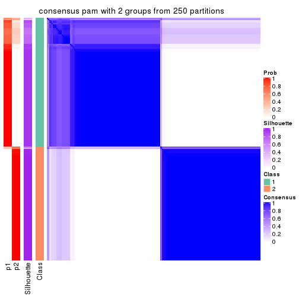</p>

</div>
<div id='tab-MAD-pam-consensus-heatmap-2'>
<pre><code class="r">consensus_heatmap(res, k = 3)
</code></pre>

<p>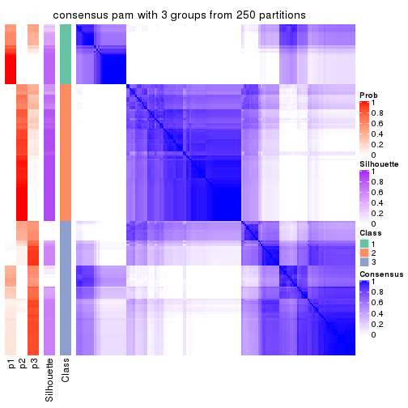</p>

</div>
<div id='tab-MAD-pam-consensus-heatmap-3'>
<pre><code class="r">consensus_heatmap(res, k = 4)
</code></pre>

<p>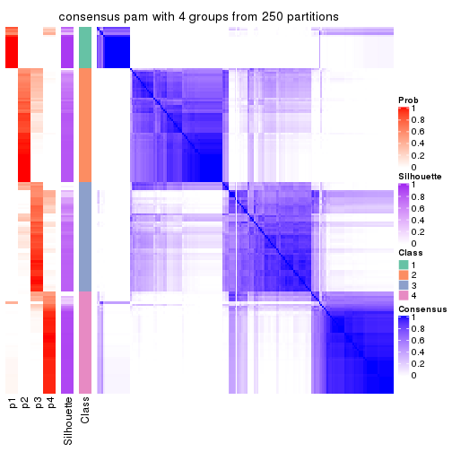</p>

</div>
<div id='tab-MAD-pam-consensus-heatmap-4'>
<pre><code class="r">consensus_heatmap(res, k = 5)
</code></pre>

<p>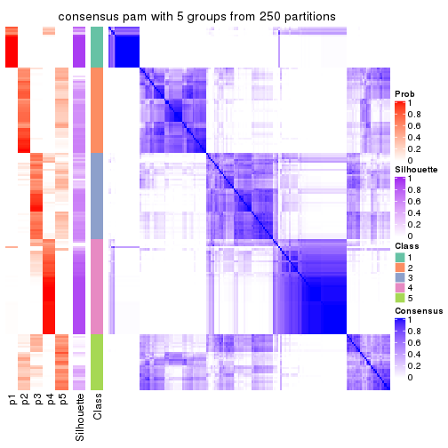</p>

</div>
<div id='tab-MAD-pam-consensus-heatmap-5'>
<pre><code class="r">consensus_heatmap(res, k = 6)
</code></pre>

<p>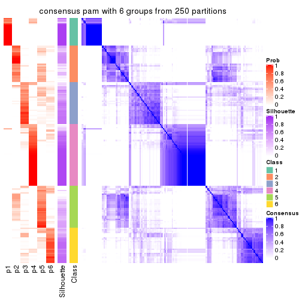</p>

</div>
</div>

Heatmaps for the membership of samples in all partitions to see how consistent they are:


<script>
$( function() {
	$( '#tabs-MAD-pam-membership-heatmap' ).tabs();
} );
</script>
<div id='tabs-MAD-pam-membership-heatmap'>
<ul>
<li><a href='#tab-MAD-pam-membership-heatmap-1'>k = 2</a></li>
<li><a href='#tab-MAD-pam-membership-heatmap-2'>k = 3</a></li>
<li><a href='#tab-MAD-pam-membership-heatmap-3'>k = 4</a></li>
<li><a href='#tab-MAD-pam-membership-heatmap-4'>k = 5</a></li>
<li><a href='#tab-MAD-pam-membership-heatmap-5'>k = 6</a></li>
</ul>
<div id='tab-MAD-pam-membership-heatmap-1'>
<pre><code class="r">membership_heatmap(res, k = 2)
</code></pre>

<p>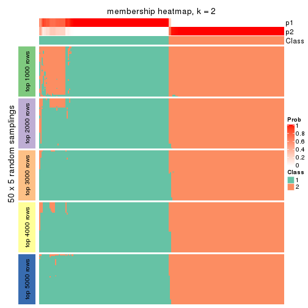</p>

</div>
<div id='tab-MAD-pam-membership-heatmap-2'>
<pre><code class="r">membership_heatmap(res, k = 3)
</code></pre>

<p>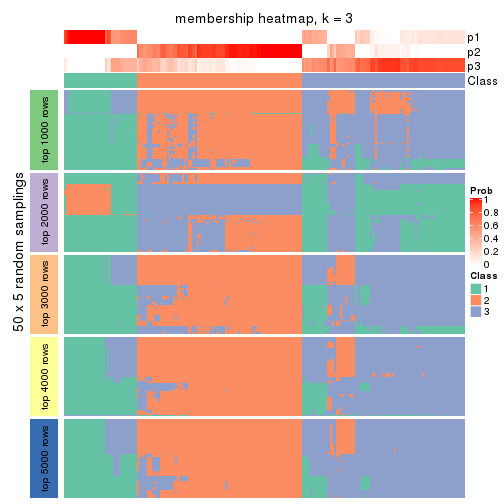</p>

</div>
<div id='tab-MAD-pam-membership-heatmap-3'>
<pre><code class="r">membership_heatmap(res, k = 4)
</code></pre>

<p>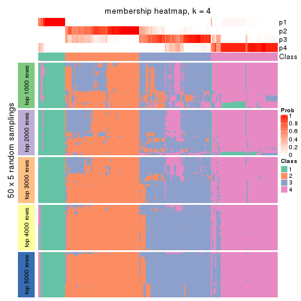</p>

</div>
<div id='tab-MAD-pam-membership-heatmap-4'>
<pre><code class="r">membership_heatmap(res, k = 5)
</code></pre>

<p>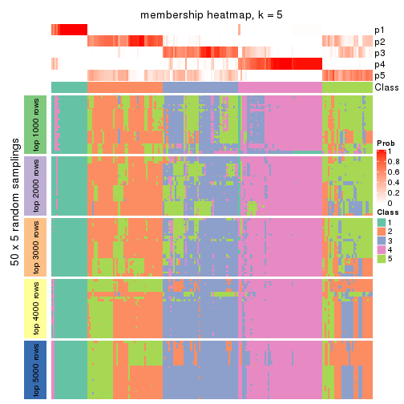</p>

</div>
<div id='tab-MAD-pam-membership-heatmap-5'>
<pre><code class="r">membership_heatmap(res, k = 6)
</code></pre>

<p>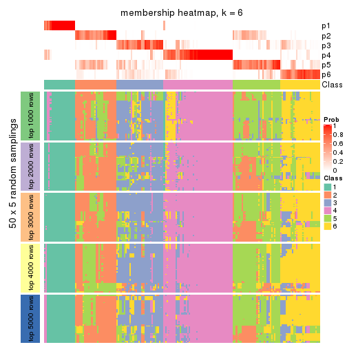</p>

</div>
</div>

As soon as we have had the classes for columns, we can look for signatures
which are significantly different between classes which can be candidate marks
for certain classes. Following are the heatmaps for signatures.


Signature heatmaps where rows are scaled:


<script>
$( function() {
	$( '#tabs-MAD-pam-get-signatures' ).tabs();
} );
</script>
<div id='tabs-MAD-pam-get-signatures'>
<ul>
<li><a href='#tab-MAD-pam-get-signatures-1'>k = 2</a></li>
<li><a href='#tab-MAD-pam-get-signatures-2'>k = 3</a></li>
<li><a href='#tab-MAD-pam-get-signatures-3'>k = 4</a></li>
<li><a href='#tab-MAD-pam-get-signatures-4'>k = 5</a></li>
<li><a href='#tab-MAD-pam-get-signatures-5'>k = 6</a></li>
</ul>
<div id='tab-MAD-pam-get-signatures-1'>
<pre><code class="r">get_signatures(res, k = 2)
</code></pre>

<p>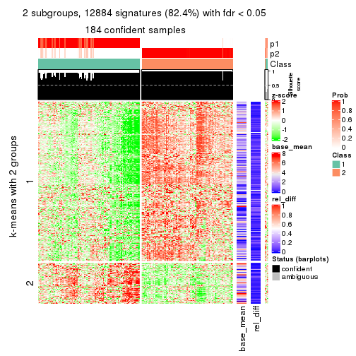</p>

</div>
<div id='tab-MAD-pam-get-signatures-2'>
<pre><code class="r">get_signatures(res, k = 3)
</code></pre>

<p>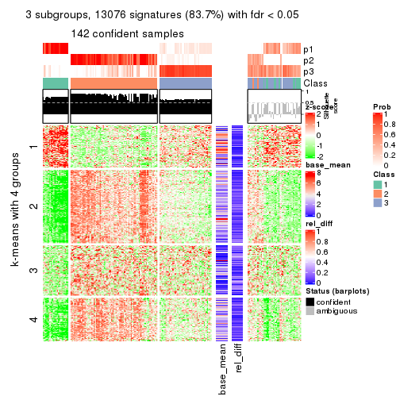</p>

</div>
<div id='tab-MAD-pam-get-signatures-3'>
<pre><code class="r">get_signatures(res, k = 4)
</code></pre>

<p>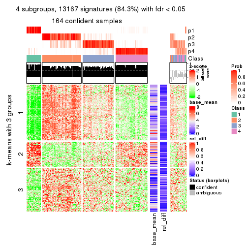</p>

</div>
<div id='tab-MAD-pam-get-signatures-4'>
<pre><code class="r">get_signatures(res, k = 5)
</code></pre>

<p>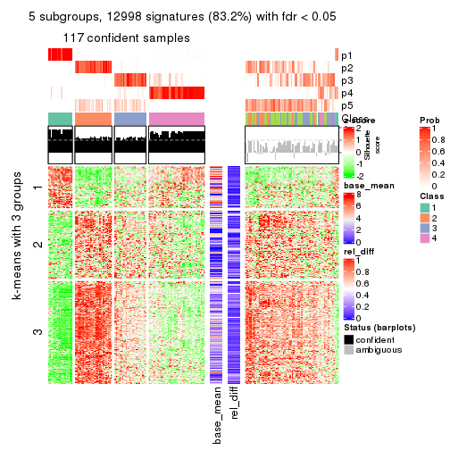</p>

</div>
<div id='tab-MAD-pam-get-signatures-5'>
<pre><code class="r">get_signatures(res, k = 6)
</code></pre>

<p>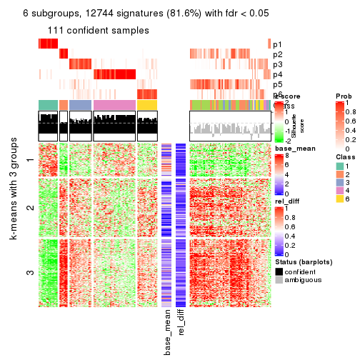</p>

</div>
</div>


Signature heatmaps where rows are not scaled:


<script>
$( function() {
	$( '#tabs-MAD-pam-get-signatures-no-scale' ).tabs();
} );
</script>
<div id='tabs-MAD-pam-get-signatures-no-scale'>
<ul>
<li><a href='#tab-MAD-pam-get-signatures-no-scale-1'>k = 2</a></li>
<li><a href='#tab-MAD-pam-get-signatures-no-scale-2'>k = 3</a></li>
<li><a href='#tab-MAD-pam-get-signatures-no-scale-3'>k = 4</a></li>
<li><a href='#tab-MAD-pam-get-signatures-no-scale-4'>k = 5</a></li>
<li><a href='#tab-MAD-pam-get-signatures-no-scale-5'>k = 6</a></li>
</ul>
<div id='tab-MAD-pam-get-signatures-no-scale-1'>
<pre><code class="r">get_signatures(res, k = 2, scale_rows = FALSE)
</code></pre>

<p>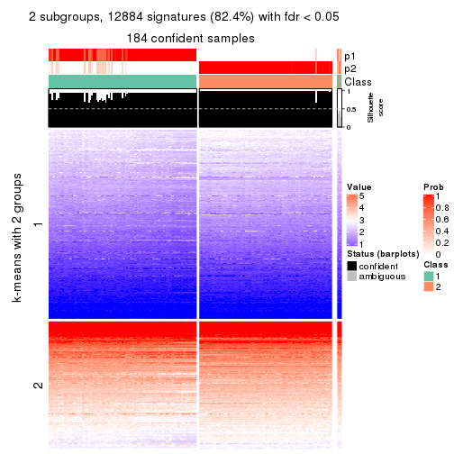</p>

</div>
<div id='tab-MAD-pam-get-signatures-no-scale-2'>
<pre><code class="r">get_signatures(res, k = 3, scale_rows = FALSE)
</code></pre>

<p>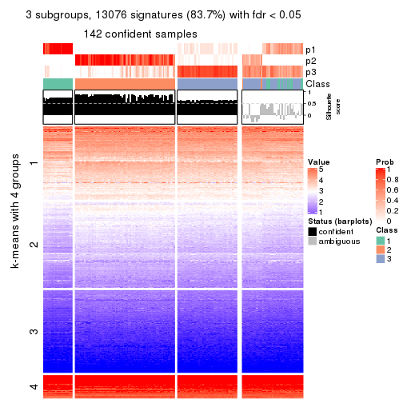</p>

</div>
<div id='tab-MAD-pam-get-signatures-no-scale-3'>
<pre><code class="r">get_signatures(res, k = 4, scale_rows = FALSE)
</code></pre>

<p>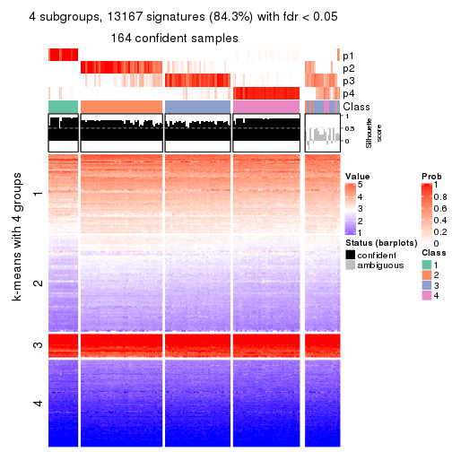</p>

</div>
<div id='tab-MAD-pam-get-signatures-no-scale-4'>
<pre><code class="r">get_signatures(res, k = 5, scale_rows = FALSE)
</code></pre>

<p>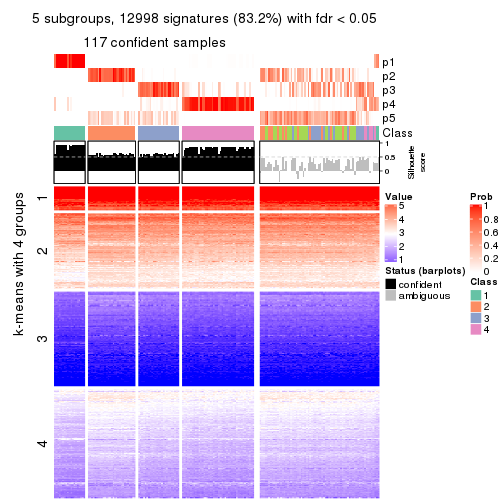</p>

</div>
<div id='tab-MAD-pam-get-signatures-no-scale-5'>
<pre><code class="r">get_signatures(res, k = 6, scale_rows = FALSE)
</code></pre>

<p>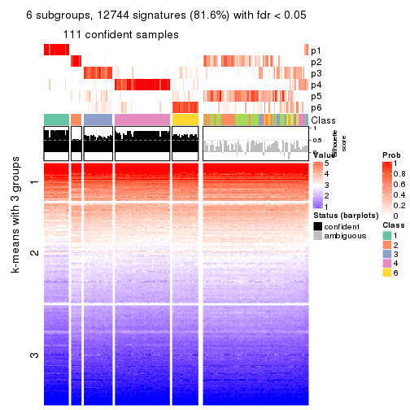</p>

</div>
</div>


Compare the overlap of signatures from different k:

```r
compare_signatures(res)
```

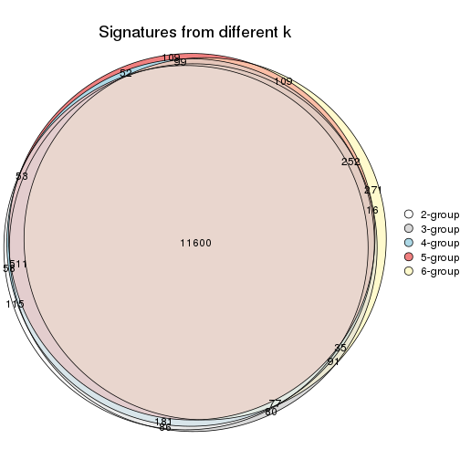

`get_signature()` returns a data frame invisibly. TO get the list of signatures, the function
call should be assigned to a variable explicitly. In following code, if `plot` argument is set
to `FALSE`, no heatmap is plotted while only the differential analysis is performed.

```r
# code only for demonstration
tb = get_signature(res, k = ..., plot = FALSE)
```

An example of the output of `tb` is:

```
#>   which_row         fdr    mean_1    mean_2 scaled_mean_1 scaled_mean_2 km
#> 1        38 0.042760348  8.373488  9.131774    -0.5533452     0.5164555  1
#> 2        40 0.018707592  7.106213  8.469186    -0.6173731     0.5762149  1
#> 3        55 0.019134737 10.221463 11.207825    -0.6159697     0.5749050  1
#> 4        59 0.006059896  5.921854  7.869574    -0.6899429     0.6439467  1
#> 5        60 0.018055526  8.928898 10.211722    -0.6204761     0.5791110  1
#> 6        98 0.009384629 15.714769 14.887706     0.6635654    -0.6193277  2
...
```

The columns in `tb` are:

1. `which_row`: row indices corresponding to the input matrix.
2. `fdr`: FDR for the differential test. 
3. `mean_x`: The mean value in group x.
4. `scaled_mean_x`: The mean value in group x after rows are scaled.
5. `km`: Row groups if k-means clustering is applied to rows.


UMAP plot which shows how samples are separated.


<script>
$( function() {
	$( '#tabs-MAD-pam-dimension-reduction' ).tabs();
} );
</script>
<div id='tabs-MAD-pam-dimension-reduction'>
<ul>
<li><a href='#tab-MAD-pam-dimension-reduction-1'>k = 2</a></li>
<li><a href='#tab-MAD-pam-dimension-reduction-2'>k = 3</a></li>
<li><a href='#tab-MAD-pam-dimension-reduction-3'>k = 4</a></li>
<li><a href='#tab-MAD-pam-dimension-reduction-4'>k = 5</a></li>
<li><a href='#tab-MAD-pam-dimension-reduction-5'>k = 6</a></li>
</ul>
<div id='tab-MAD-pam-dimension-reduction-1'>
<pre><code class="r">dimension_reduction(res, k = 2, method = &quot;UMAP&quot;)
</code></pre>

<p>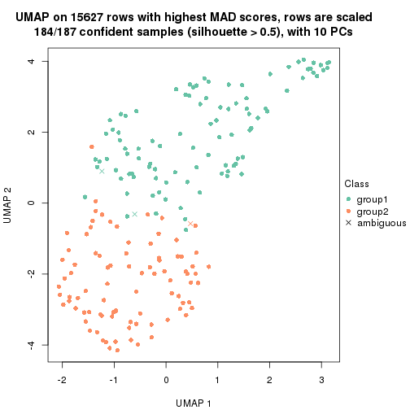</p>

</div>
<div id='tab-MAD-pam-dimension-reduction-2'>
<pre><code class="r">dimension_reduction(res, k = 3, method = &quot;UMAP&quot;)
</code></pre>

<p>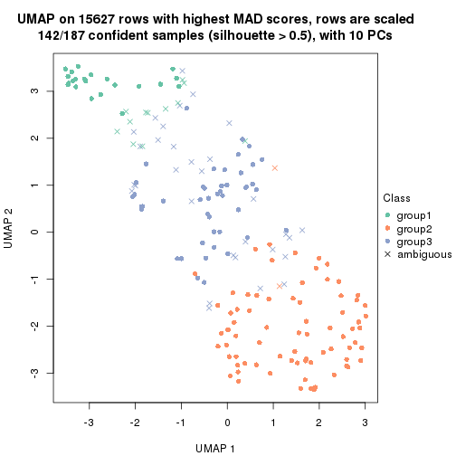</p>

</div>
<div id='tab-MAD-pam-dimension-reduction-3'>
<pre><code class="r">dimension_reduction(res, k = 4, method = &quot;UMAP&quot;)
</code></pre>

<p>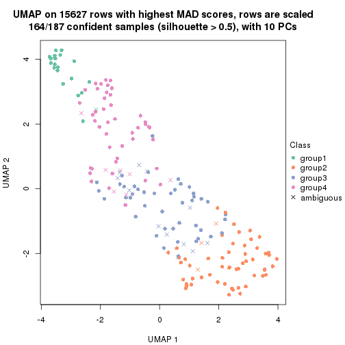</p>

</div>
<div id='tab-MAD-pam-dimension-reduction-4'>
<pre><code class="r">dimension_reduction(res, k = 5, method = &quot;UMAP&quot;)
</code></pre>

<p>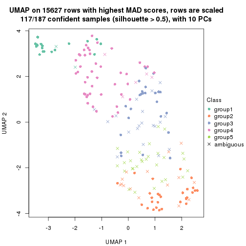</p>

</div>
<div id='tab-MAD-pam-dimension-reduction-5'>
<pre><code class="r">dimension_reduction(res, k = 6, method = &quot;UMAP&quot;)
</code></pre>

<p>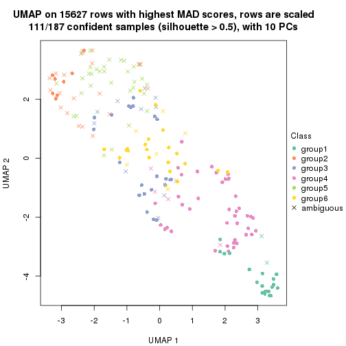</p>

</div>
</div>


Following heatmap shows how subgroups are split when increasing `k`:

```r
collect_classes(res)
```

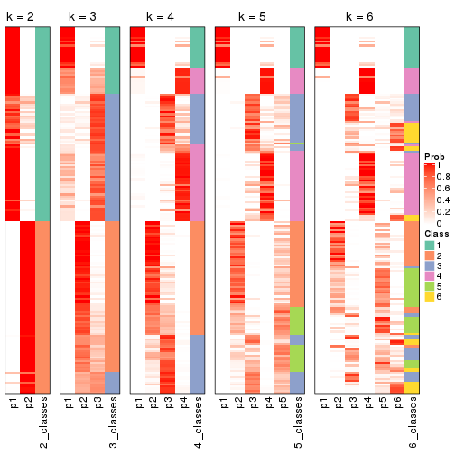


If matrix rows can be associated to genes, consider to use `GO_Enrichment(res,
...)` to perform function enrichment for the signature genes.


 

---------------------------------------------------


### MAD:mclust


The object with results only for a single top-value method and a single partition method 
can be extracted as:

```r
res = res_list["MAD", "mclust"]
# you can also extract it by
# res = res_list["MAD:mclust"]
```

A summary of `res` and all the functions that can be applied to it:

```r
res
```

```
#> A 'ConsensusPartition' object with k = 2, 3, 4, 5, 6.
#>   On a matrix with 15627 rows and 187 columns.
#>   Top rows (1000, 2000, 3000, 4000, 5000) are extracted by 'MAD' method.
#>   Subgroups are detected by 'mclust' method.
#>   Performed in total 1250 partitions by row resampling.
#>   Best k for subgroups seems to be 4.
#> 
#> Following methods can be applied to this 'ConsensusPartition' object:
#>  [1] "cola_report"             "collect_classes"         "collect_plots"          
#>  [4] "collect_stats"           "colnames"                "compare_signatures"     
#>  [7] "consensus_heatmap"       "dimension_reduction"     "functional_enrichment"  
#> [10] "get_anno_col"            "get_anno"                "get_classes"            
#> [13] "get_consensus"           "get_matrix"              "get_membership"         
#> [16] "get_param"               "get_signatures"          "get_stats"              
#> [19] "is_best_k"               "is_stable_k"             "membership_heatmap"     
#> [22] "ncol"                    "nrow"                    "plot_ecdf"              
#> [25] "rownames"                "select_partition_number" "show"                   
#> [28] "suggest_best_k"          "test_to_known_factors"
```

`collect_plots()` function collects all the plots made from `res` for all `k` (number of partitions)
into one single page to provide an easy and fast comparison between different `k`.

```r
collect_plots(res)
```

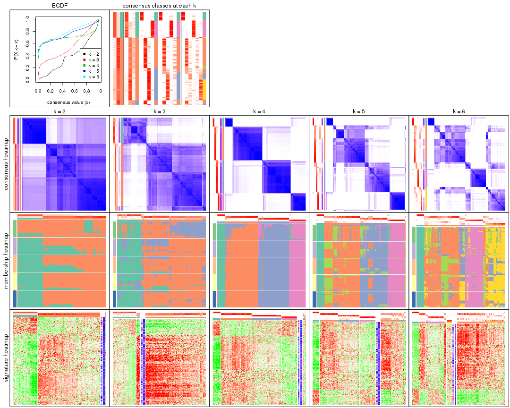

The plots are:

- The first row: a plot of the ECDF (Empirical cumulative distribution
  function) curves of the consensus matrix for each `k` and the heatmap of
  predicted classes for each `k`.
- The second row: heatmaps of the consensus matrix for each `k`.
- The third row: heatmaps of the membership matrix for each `k`.
- The fouth row: heatmaps of the signatures for each `k`.

All the plots in panels can be made by individual functions and they are
plotted later in this section.

`select_partition_number()` produces several plots showing different
statistics for choosing "optimized" `k`. There are following statistics:

- ECDF curves of the consensus matrix for each `k`;
- 1-PAC. [The PAC
  score](https://en.wikipedia.org/wiki/Consensus_clustering#Over-interpretation_potential_of_consensus_clustering)
  measures the proportion of the ambiguous subgrouping.
- Mean silhouette score.
- Concordance. The mean probability of fiting the consensus class ids in all
  partitions.
- Area increased. Denote $A_k$ as the area under the ECDF curve for current
  `k`, the area increased is defined as $A_k - A_{k-1}$.
- Rand index. The percent of pairs of samples that are both in a same cluster
  or both are not in a same cluster in the partition of k and k-1.
- Jaccard index. The ratio of pairs of samples are both in a same cluster in
  the partition of k and k-1 and the pairs of samples are both in a same
  cluster in the partition k or k-1.

The detailed explanations of these statistics can be found in [the cola
vignette](http://bioconductor.org/packages/devel/bioc/vignettes/cola/inst/doc/cola.html#toc_13).

Generally speaking, lower PAC score, higher mean silhouette score or higher
concordance corresponds to better partition. Rand index and Jaccard index
measure how similar the current partition is compared to partition with `k-1`.
If they are too similar, we won't accept `k` is better than `k-1`.

```r
select_partition_number(res)
```

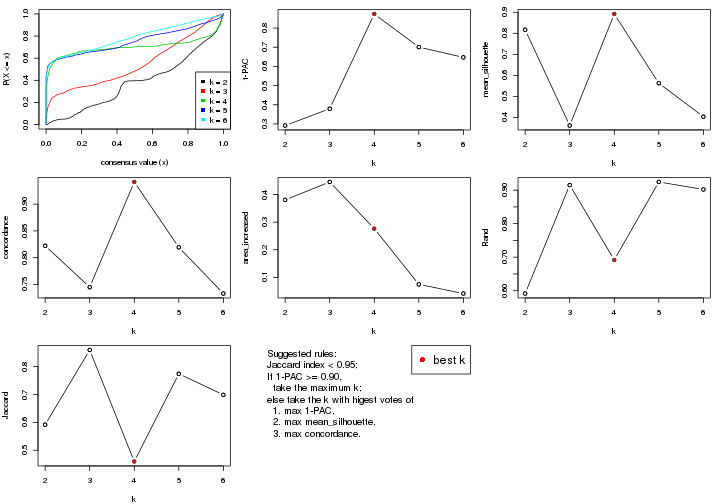

The numeric values for all these statistics can be obtained by `get_stats()`.

```r
get_stats(res)
```

```
#>   k 1-PAC mean_silhouette concordance area_increased  Rand Jaccard
#> 2 2 0.292           0.817       0.822         0.3807 0.592   0.592
#> 3 3 0.379           0.362       0.745         0.4455 0.915   0.860
#> 4 4 0.873           0.892       0.942         0.2765 0.692   0.460
#> 5 5 0.701           0.563       0.819         0.0745 0.924   0.774
#> 6 6 0.647           0.404       0.733         0.0414 0.902   0.699
```

`suggest_best_k()` suggests the best $k$ based on these statistics. The rules are as follows:

- All $k$ with Jaccard index larger than 0.95 are removed because the increase of
  the partition number does not provides enough extra information. If all $k$ are removed,
  the best $k$ is assigned by `NA`.
- For $k$ with 1-PAC larger than 0.9, the maximal $k$ is taken as the "best k". Other $k$ is called "optional k".
- If it does not fit the second rule. The $k$ with the highest vote of highest
  1-PAC, mean silhouette and concordance is taken as the "best k".

```r
suggest_best_k(res)
```

```
#> [1] 4
```


Following shows the table of the partitions (You need to click the **show/hide
code output** link to see it). The membership matrix (columns with name `p*`)
is inferred by
[`clue::cl_consensus()`](https://www.rdocumentation.org/link/cl_consensus?package=clue)
function with the `SE` method. Basically the value in the membership matrix
represents the probability to belong to a certain group. The finall class
label for an item is determined with the group with highest probability it
belongs to.

In `get_classes()` function, the entropy is calculated from the membership
matrix and the silhouette score is calculated from the consensus matrix.


<script>
$( function() {
	$( '#tabs-MAD-mclust-get-classes' ).tabs();
} );
</script>
<div id='tabs-MAD-mclust-get-classes'>
<ul>
<li><a href='#tab-MAD-mclust-get-classes-1'>k = 2</a></li>
<li><a href='#tab-MAD-mclust-get-classes-2'>k = 3</a></li>
<li><a href='#tab-MAD-mclust-get-classes-3'>k = 4</a></li>
<li><a href='#tab-MAD-mclust-get-classes-4'>k = 5</a></li>
<li><a href='#tab-MAD-mclust-get-classes-5'>k = 6</a></li>
</ul>

<div id='tab-MAD-mclust-get-classes-1'>
<p><a id='tab-MAD-mclust-get-classes-1-a' style='color:#0366d6' href='#'>show/hide code output</a></p>
<pre><code class="r">cbind(get_classes(res, k = 2), get_membership(res, k = 2))
</code></pre>

<pre><code>#&gt;            class entropy silhouette    p1    p2
#&gt; SRR1747213     1  0.6712      0.952 0.824 0.176
#&gt; SRR1747214     1  0.6531      0.973 0.832 0.168
#&gt; SRR1747215     2  0.1414      0.768 0.020 0.980
#&gt; SRR1747216     2  0.2236      0.758 0.036 0.964
#&gt; SRR1747217     2  0.8144      0.778 0.252 0.748
#&gt; SRR1747218     2  0.7056      0.805 0.192 0.808
#&gt; SRR1747219     2  0.8327      0.779 0.264 0.736
#&gt; SRR1747220     1  0.6438      0.958 0.836 0.164
#&gt; SRR1747221     1  0.6712      0.970 0.824 0.176
#&gt; SRR1747222     1  0.6531      0.976 0.832 0.168
#&gt; SRR1747223     1  0.6623      0.970 0.828 0.172
#&gt; SRR1747224     2  0.8144      0.782 0.252 0.748
#&gt; SRR1747225     2  0.6148      0.810 0.152 0.848
#&gt; SRR1747226     2  0.5737      0.666 0.136 0.864
#&gt; SRR1747227     2  0.4022      0.788 0.080 0.920
#&gt; SRR1747228     2  0.8207      0.786 0.256 0.744
#&gt; SRR1747229     2  0.2423      0.759 0.040 0.960
#&gt; SRR1747230     1  0.6531      0.976 0.832 0.168
#&gt; SRR1747231     1  0.6531      0.959 0.832 0.168
#&gt; SRR1747232     1  0.6343      0.973 0.840 0.160
#&gt; SRR1747233     1  0.6531      0.976 0.832 0.168
#&gt; SRR1747234     2  0.8267      0.776 0.260 0.740
#&gt; SRR1747235     1  0.6801      0.964 0.820 0.180
#&gt; SRR1747236     2  0.6887      0.808 0.184 0.816
#&gt; SRR1747237     2  0.3879      0.799 0.076 0.924
#&gt; SRR1747238     2  0.7528      0.800 0.216 0.784
#&gt; SRR1747239     2  0.2423      0.770 0.040 0.960
#&gt; SRR1747240     1  0.6438      0.974 0.836 0.164
#&gt; SRR1747241     2  0.8267      0.776 0.260 0.740
#&gt; SRR1747242     1  0.6438      0.973 0.836 0.164
#&gt; SRR1747243     1  0.6531      0.976 0.832 0.168
#&gt; SRR1747244     2  0.8144      0.782 0.252 0.748
#&gt; SRR1747245     2  0.7299      0.804 0.204 0.796
#&gt; SRR1747246     2  0.5946      0.659 0.144 0.856
#&gt; SRR1747247     1  0.6531      0.976 0.832 0.168
#&gt; SRR1747248     1  0.6531      0.976 0.832 0.168
#&gt; SRR1747249     1  0.6343      0.973 0.840 0.160
#&gt; SRR1747250     2  0.8267      0.783 0.260 0.740
#&gt; SRR1747252     1  0.6887      0.948 0.816 0.184
#&gt; SRR1747253     1  0.6438      0.974 0.836 0.164
#&gt; SRR1747254     2  0.2423      0.770 0.040 0.960
#&gt; SRR1747255     1  0.6531      0.976 0.832 0.168
#&gt; SRR1747256     1  0.6531      0.976 0.832 0.168
#&gt; SRR1747257     2  0.2236      0.791 0.036 0.964
#&gt; SRR1747258     2  0.7745      0.799 0.228 0.772
#&gt; SRR1747259     2  0.3733      0.801 0.072 0.928
#&gt; SRR1747260     2  0.8144      0.782 0.252 0.748
#&gt; SRR1747261     2  0.8016      0.784 0.244 0.756
#&gt; SRR1747262     2  0.3879      0.805 0.076 0.924
#&gt; SRR1747263     2  0.4298      0.791 0.088 0.912
#&gt; SRR1747264     1  0.6531      0.976 0.832 0.168
#&gt; SRR1747265     2  0.8443      0.778 0.272 0.728
#&gt; SRR1747266     2  0.7376      0.806 0.208 0.792
#&gt; SRR1747267     2  0.8386      0.779 0.268 0.732
#&gt; SRR1747268     2  0.8499      0.766 0.276 0.724
#&gt; SRR1747269     2  0.5629      0.810 0.132 0.868
#&gt; SRR1747270     2  0.4298      0.800 0.088 0.912
#&gt; SRR1747271     2  0.5059      0.809 0.112 0.888
#&gt; SRR1747272     2  0.8207      0.775 0.256 0.744
#&gt; SRR1747273     1  0.6801      0.964 0.820 0.180
#&gt; SRR1747274     2  0.7602      0.797 0.220 0.780
#&gt; SRR1747275     1  0.6531      0.976 0.832 0.168
#&gt; SRR1747276     1  0.6531      0.976 0.832 0.168
#&gt; SRR1747277     2  0.6048      0.810 0.148 0.852
#&gt; SRR1747278     2  0.8386      0.765 0.268 0.732
#&gt; SRR1747280     1  0.6247      0.969 0.844 0.156
#&gt; SRR1747279     1  0.6247      0.970 0.844 0.156
#&gt; SRR1747281     2  0.2948      0.793 0.052 0.948
#&gt; SRR1747282     1  0.6438      0.974 0.836 0.164
#&gt; SRR1747283     2  0.8267      0.776 0.260 0.740
#&gt; SRR1747284     1  0.6801      0.964 0.820 0.180
#&gt; SRR1747285     2  0.7883      0.789 0.236 0.764
#&gt; SRR1747286     2  0.8207      0.779 0.256 0.744
#&gt; SRR1747287     2  0.3879      0.786 0.076 0.924
#&gt; SRR1747288     2  0.8555      0.768 0.280 0.720
#&gt; SRR1747290     2  0.6343      0.810 0.160 0.840
#&gt; SRR1747289     2  0.5842      0.810 0.140 0.860
#&gt; SRR1747291     2  0.4815      0.808 0.104 0.896
#&gt; SRR1747293     2  0.8144      0.790 0.252 0.748
#&gt; SRR1747294     2  0.3879      0.795 0.076 0.924
#&gt; SRR1747292     1  0.6531      0.976 0.832 0.168
#&gt; SRR1747295     2  0.5519      0.810 0.128 0.872
#&gt; SRR1747296     2  0.8081      0.791 0.248 0.752
#&gt; SRR1747297     2  0.2778      0.778 0.048 0.952
#&gt; SRR1747298     2  0.1843      0.782 0.028 0.972
#&gt; SRR1747299     2  0.5737      0.667 0.136 0.864
#&gt; SRR1747300     2  0.6048      0.655 0.148 0.852
#&gt; SRR1747301     2  0.6247      0.702 0.156 0.844
#&gt; SRR1747302     2  0.6048      0.655 0.148 0.852
#&gt; SRR1747303     2  0.3114      0.797 0.056 0.944
#&gt; SRR1747304     1  0.6531      0.976 0.832 0.168
#&gt; SRR1747305     2  0.2778      0.771 0.048 0.952
#&gt; SRR1747306     2  0.2236      0.758 0.036 0.964
#&gt; SRR1747307     2  0.8207      0.778 0.256 0.744
#&gt; SRR1747308     2  0.7139      0.805 0.196 0.804
#&gt; SRR1747309     1  0.6887      0.951 0.816 0.184
#&gt; SRR1747310     1  0.6247      0.970 0.844 0.156
#&gt; SRR1747311     2  0.8327      0.773 0.264 0.736
#&gt; SRR1747313     2  0.8386      0.765 0.268 0.732
#&gt; SRR1747312     1  0.6531      0.976 0.832 0.168
#&gt; SRR1747314     1  0.6531      0.976 0.832 0.168
#&gt; SRR1747315     2  0.5178      0.807 0.116 0.884
#&gt; SRR1747316     2  0.7815      0.799 0.232 0.768
#&gt; SRR1747318     2  0.8327      0.773 0.264 0.736
#&gt; SRR1747317     2  0.8443      0.765 0.272 0.728
#&gt; SRR1747319     2  0.8267      0.779 0.260 0.740
#&gt; SRR1747320     1  0.6531      0.976 0.832 0.168
#&gt; SRR1747322     1  0.6531      0.976 0.832 0.168
#&gt; SRR1747321     1  0.6531      0.976 0.832 0.168
#&gt; SRR1747323     2  0.6048      0.655 0.148 0.852
#&gt; SRR1747324     2  0.4815      0.795 0.104 0.896
#&gt; SRR1747326     2  0.6148      0.785 0.152 0.848
#&gt; SRR1747325     2  0.2603      0.792 0.044 0.956
#&gt; SRR1747327     2  0.3114      0.773 0.056 0.944
#&gt; SRR1747328     2  0.8327      0.782 0.264 0.736
#&gt; SRR1747330     2  0.9896      0.350 0.440 0.560
#&gt; SRR1747329     2  0.8207      0.778 0.256 0.744
#&gt; SRR1747332     2  0.9732      0.505 0.404 0.596
#&gt; SRR1747331     2  0.6623      0.809 0.172 0.828
#&gt; SRR1747333     2  0.7745      0.796 0.228 0.772
#&gt; SRR1747334     2  0.5737      0.680 0.136 0.864
#&gt; SRR1747335     2  0.8443      0.776 0.272 0.728
#&gt; SRR1747336     1  0.6247      0.970 0.844 0.156
#&gt; SRR1747337     2  0.6048      0.655 0.148 0.852
#&gt; SRR1747338     2  0.6048      0.655 0.148 0.852
#&gt; SRR1747339     2  0.8386      0.769 0.268 0.732
#&gt; SRR1747340     2  0.8144      0.782 0.252 0.748
#&gt; SRR1747341     2  0.5059      0.702 0.112 0.888
#&gt; SRR1747342     2  0.2948      0.741 0.052 0.948
#&gt; SRR1747343     2  0.5842      0.663 0.140 0.860
#&gt; SRR1747344     2  0.4431      0.799 0.092 0.908
#&gt; SRR1747345     2  0.8555      0.765 0.280 0.720
#&gt; SRR1747346     2  0.8081      0.781 0.248 0.752
#&gt; SRR1747347     2  0.6247      0.732 0.156 0.844
#&gt; SRR1747348     1  0.6531      0.976 0.832 0.168
#&gt; SRR1747349     1  0.6247      0.970 0.844 0.156
#&gt; SRR1747351     2  0.2236      0.753 0.036 0.964
#&gt; SRR1747350     2  0.3879      0.784 0.076 0.924
#&gt; SRR1747352     1  0.6438      0.974 0.836 0.164
#&gt; SRR1747353     2  0.4562      0.798 0.096 0.904
#&gt; SRR1747354     2  0.8081      0.791 0.248 0.752
#&gt; SRR1747355     1  0.8861      0.698 0.696 0.304
#&gt; SRR1747356     2  0.8327      0.782 0.264 0.736
#&gt; SRR1747357     2  0.8267      0.782 0.260 0.740
#&gt; SRR1747358     2  0.8267      0.779 0.260 0.740
#&gt; SRR1747359     1  0.6247      0.970 0.844 0.156
#&gt; SRR1747360     2  0.3733      0.802 0.072 0.928
#&gt; SRR1747361     2  0.8909      0.731 0.308 0.692
#&gt; SRR1747362     2  0.3584      0.786 0.068 0.932
#&gt; SRR1747363     2  0.8661      0.735 0.288 0.712
#&gt; SRR1747364     1  0.6887      0.963 0.816 0.184
#&gt; SRR1747365     2  0.8386      0.773 0.268 0.732
#&gt; SRR1747366     2  0.4939      0.807 0.108 0.892
#&gt; SRR1747367     2  0.8267      0.772 0.260 0.740
#&gt; SRR1747369     2  0.3114      0.744 0.056 0.944
#&gt; SRR1747368     2  0.8081      0.781 0.248 0.752
#&gt; SRR1747370     2  0.8144      0.782 0.252 0.748
#&gt; SRR1747372     1  0.6531      0.976 0.832 0.168
#&gt; SRR1747371     1  0.6531      0.976 0.832 0.168
#&gt; SRR1747373     2  0.6048      0.655 0.148 0.852
#&gt; SRR1747374     2  0.5519      0.675 0.128 0.872
#&gt; SRR1747375     1  0.9881      0.254 0.564 0.436
#&gt; SRR1747376     2  0.0672      0.774 0.008 0.992
#&gt; SRR1747377     2  0.6048      0.659 0.148 0.852
#&gt; SRR1747378     2  0.4690      0.808 0.100 0.900
#&gt; SRR1747379     2  0.7056      0.807 0.192 0.808
#&gt; SRR1747380     2  0.8081      0.781 0.248 0.752
#&gt; SRR1747381     1  0.6438      0.973 0.836 0.164
#&gt; SRR1747382     1  0.6801      0.967 0.820 0.180
#&gt; SRR1747383     2  0.5629      0.690 0.132 0.868
#&gt; SRR1747384     2  0.8144      0.778 0.252 0.748
#&gt; SRR1747385     2  0.8386      0.765 0.268 0.732
#&gt; SRR1747386     1  0.6531      0.976 0.832 0.168
#&gt; SRR1747387     2  0.2236      0.783 0.036 0.964
#&gt; SRR1747388     2  0.2423      0.770 0.040 0.960
#&gt; SRR1747390     2  0.7815      0.799 0.232 0.768
#&gt; SRR1747389     2  0.5059      0.807 0.112 0.888
#&gt; SRR1747391     2  0.7815      0.794 0.232 0.768
#&gt; SRR1747392     2  0.3733      0.804 0.072 0.928
#&gt; SRR1747393     2  0.7674      0.796 0.224 0.776
#&gt; SRR1747394     2  0.8499      0.757 0.276 0.724
#&gt; SRR1747395     2  0.8386      0.765 0.268 0.732
#&gt; SRR1747396     2  0.5737      0.686 0.136 0.864
#&gt; SRR1747398     2  0.5519      0.756 0.128 0.872
#&gt; SRR1747397     2  0.8555      0.755 0.280 0.720
#&gt; SRR1747399     1  0.6531      0.976 0.832 0.168
#&gt; SRR1747400     1  0.6623      0.955 0.828 0.172
</code></pre>

<script>
$('#tab-MAD-mclust-get-classes-1-a').parent().next().next().hide();
$('#tab-MAD-mclust-get-classes-1-a').click(function(){
  $('#tab-MAD-mclust-get-classes-1-a').parent().next().next().toggle();
  return(false);
});
</script>
</div>

<div id='tab-MAD-mclust-get-classes-2'>
<p><a id='tab-MAD-mclust-get-classes-2-a' style='color:#0366d6' href='#'>show/hide code output</a></p>
<pre><code class="r">cbind(get_classes(res, k = 3), get_membership(res, k = 3))
</code></pre>

<pre><code>#&gt;            class entropy silhouette    p1    p2    p3
#&gt; SRR1747213     1  0.9409   4.90e-01 0.460 0.360 0.180
#&gt; SRR1747214     1  0.5253   7.93e-01 0.792 0.020 0.188
#&gt; SRR1747215     3  0.6307   7.13e-01 0.000 0.488 0.512
#&gt; SRR1747216     2  0.5882   4.59e-02 0.000 0.652 0.348
#&gt; SRR1747217     2  0.5093   3.71e-01 0.088 0.836 0.076
#&gt; SRR1747218     2  0.5016   2.36e-01 0.000 0.760 0.240
#&gt; SRR1747219     2  0.5585   3.34e-01 0.096 0.812 0.092
#&gt; SRR1747220     1  0.8466   6.99e-01 0.616 0.212 0.172
#&gt; SRR1747221     1  0.8610   6.54e-01 0.556 0.324 0.120
#&gt; SRR1747222     1  0.7287   7.66e-01 0.696 0.212 0.092
#&gt; SRR1747223     1  0.8646   6.54e-01 0.556 0.320 0.124
#&gt; SRR1747224     2  0.3850   3.90e-01 0.088 0.884 0.028
#&gt; SRR1747225     2  0.5016   2.61e-01 0.000 0.760 0.240
#&gt; SRR1747226     2  0.5760   8.57e-02 0.000 0.672 0.328
#&gt; SRR1747227     3  0.6505   7.33e-01 0.004 0.468 0.528
#&gt; SRR1747228     2  0.3826   3.29e-01 0.008 0.868 0.124
#&gt; SRR1747229     2  0.5706   6.74e-02 0.000 0.680 0.320
#&gt; SRR1747230     1  0.2945   8.17e-01 0.908 0.004 0.088
#&gt; SRR1747231     1  0.5371   8.09e-01 0.812 0.048 0.140
#&gt; SRR1747232     1  0.2796   8.16e-01 0.908 0.000 0.092
#&gt; SRR1747233     1  0.7739   7.58e-01 0.672 0.204 0.124
#&gt; SRR1747234     2  0.7801   6.93e-02 0.088 0.636 0.276
#&gt; SRR1747235     1  0.5253   7.93e-01 0.792 0.020 0.188
#&gt; SRR1747236     2  0.5690   2.11e-01 0.004 0.708 0.288
#&gt; SRR1747237     3  0.6302   7.16e-01 0.000 0.480 0.520
#&gt; SRR1747238     2  0.5363   2.08e-01 0.000 0.724 0.276
#&gt; SRR1747239     2  0.5785   7.80e-02 0.000 0.668 0.332
#&gt; SRR1747240     1  0.2711   8.17e-01 0.912 0.000 0.088
#&gt; SRR1747241     3  0.8465   5.46e-02 0.088 0.452 0.460
#&gt; SRR1747242     1  0.2878   8.16e-01 0.904 0.000 0.096
#&gt; SRR1747243     1  0.8872   6.67e-01 0.556 0.288 0.156
#&gt; SRR1747244     2  0.0661   4.01e-01 0.008 0.988 0.004
#&gt; SRR1747245     2  0.5873  -1.14e-01 0.004 0.684 0.312
#&gt; SRR1747246     2  0.5810   5.71e-02 0.000 0.664 0.336
#&gt; SRR1747247     1  0.3722   8.24e-01 0.888 0.024 0.088
#&gt; SRR1747248     1  0.2945   8.17e-01 0.908 0.004 0.088
#&gt; SRR1747249     1  0.6882   7.90e-01 0.732 0.172 0.096
#&gt; SRR1747250     2  0.4786   3.43e-01 0.044 0.844 0.112
#&gt; SRR1747252     1  0.6950   5.28e-01 0.572 0.408 0.020
#&gt; SRR1747253     1  0.7250   7.12e-01 0.656 0.288 0.056
#&gt; SRR1747254     2  0.6126   7.00e-03 0.004 0.644 0.352
#&gt; SRR1747255     1  0.7495   7.71e-01 0.692 0.188 0.120
#&gt; SRR1747256     1  0.2400   8.38e-01 0.932 0.064 0.004
#&gt; SRR1747257     2  0.6180  -3.45e-01 0.000 0.584 0.416
#&gt; SRR1747258     2  0.3112   3.87e-01 0.004 0.900 0.096
#&gt; SRR1747259     3  0.6520   7.36e-01 0.004 0.488 0.508
#&gt; SRR1747260     2  0.4007   3.98e-01 0.084 0.880 0.036
#&gt; SRR1747261     2  0.2682   3.66e-01 0.004 0.920 0.076
#&gt; SRR1747262     2  0.5397   2.26e-01 0.000 0.720 0.280
#&gt; SRR1747263     2  0.6516  -7.09e-01 0.004 0.516 0.480
#&gt; SRR1747264     1  0.3886   8.35e-01 0.880 0.024 0.096
#&gt; SRR1747265     2  0.6363   2.88e-01 0.096 0.768 0.136
#&gt; SRR1747266     2  0.3425   3.78e-01 0.004 0.884 0.112
#&gt; SRR1747267     2  0.4399   3.80e-01 0.092 0.864 0.044
#&gt; SRR1747268     2  0.4914   3.68e-01 0.088 0.844 0.068
#&gt; SRR1747269     2  0.5431   2.13e-01 0.000 0.716 0.284
#&gt; SRR1747270     2  0.5722   1.86e-01 0.004 0.704 0.292
#&gt; SRR1747271     2  0.5254   2.17e-01 0.000 0.736 0.264
#&gt; SRR1747272     2  0.4092   3.91e-01 0.088 0.876 0.036
#&gt; SRR1747273     1  0.8758   6.90e-01 0.588 0.220 0.192
#&gt; SRR1747274     2  0.2682   3.83e-01 0.004 0.920 0.076
#&gt; SRR1747275     1  0.4859   8.31e-01 0.840 0.044 0.116
#&gt; SRR1747276     1  0.7588   7.66e-01 0.684 0.196 0.120
#&gt; SRR1747277     2  0.6476  -5.97e-01 0.004 0.548 0.448
#&gt; SRR1747278     2  0.5093   3.74e-01 0.088 0.836 0.076
#&gt; SRR1747280     1  0.2959   8.15e-01 0.900 0.000 0.100
#&gt; SRR1747279     1  0.4742   8.33e-01 0.848 0.048 0.104
#&gt; SRR1747281     2  0.5621   1.81e-01 0.000 0.692 0.308
#&gt; SRR1747282     1  0.3181   8.38e-01 0.912 0.024 0.064
#&gt; SRR1747283     2  0.8362  -2.32e-02 0.096 0.556 0.348
#&gt; SRR1747284     1  0.4349   8.17e-01 0.852 0.020 0.128
#&gt; SRR1747285     2  0.2339   3.89e-01 0.012 0.940 0.048
#&gt; SRR1747286     2  0.5896   1.65e-01 0.008 0.700 0.292
#&gt; SRR1747287     2  0.5873   1.89e-01 0.004 0.684 0.312
#&gt; SRR1747288     2  0.4636   3.73e-01 0.116 0.848 0.036
#&gt; SRR1747290     2  0.5291   2.24e-01 0.000 0.732 0.268
#&gt; SRR1747289     2  0.5656   2.04e-01 0.004 0.712 0.284
#&gt; SRR1747291     2  0.5465   1.22e-01 0.000 0.712 0.288
#&gt; SRR1747293     2  0.4172   3.37e-01 0.004 0.840 0.156
#&gt; SRR1747294     3  0.6309   7.41e-01 0.000 0.496 0.504
#&gt; SRR1747292     1  0.5075   8.30e-01 0.836 0.068 0.096
#&gt; SRR1747295     2  0.5397   2.11e-01 0.000 0.720 0.280
#&gt; SRR1747296     2  0.6483  -5.89e-01 0.004 0.544 0.452
#&gt; SRR1747297     2  0.6008   1.16e-01 0.004 0.664 0.332
#&gt; SRR1747298     2  0.5859   7.26e-02 0.000 0.656 0.344
#&gt; SRR1747299     2  0.5882   2.69e-02 0.000 0.652 0.348
#&gt; SRR1747300     2  0.5733   9.93e-02 0.000 0.676 0.324
#&gt; SRR1747301     2  0.5678   1.83e-02 0.000 0.684 0.316
#&gt; SRR1747302     2  0.5835   4.44e-02 0.000 0.660 0.340
#&gt; SRR1747303     2  0.5363   2.17e-01 0.000 0.724 0.276
#&gt; SRR1747304     1  0.2945   8.18e-01 0.908 0.004 0.088
#&gt; SRR1747305     2  0.6111  -1.15e-01 0.000 0.604 0.396
#&gt; SRR1747306     2  0.5882   5.61e-02 0.000 0.652 0.348
#&gt; SRR1747307     2  0.4015   3.86e-01 0.096 0.876 0.028
#&gt; SRR1747308     2  0.6047  -6.20e-02 0.008 0.680 0.312
#&gt; SRR1747309     1  0.8872   6.34e-01 0.536 0.324 0.140
#&gt; SRR1747310     1  0.1919   8.37e-01 0.956 0.020 0.024
#&gt; SRR1747311     2  0.5075   3.74e-01 0.096 0.836 0.068
#&gt; SRR1747313     2  0.4295   3.82e-01 0.104 0.864 0.032
#&gt; SRR1747312     1  0.2860   8.18e-01 0.912 0.004 0.084
#&gt; SRR1747314     1  0.2860   8.18e-01 0.912 0.004 0.084
#&gt; SRR1747315     2  0.5497   1.76e-01 0.000 0.708 0.292
#&gt; SRR1747316     2  0.5156   1.96e-01 0.008 0.776 0.216
#&gt; SRR1747318     2  0.4137   3.84e-01 0.096 0.872 0.032
#&gt; SRR1747317     2  0.4217   3.70e-01 0.100 0.868 0.032
#&gt; SRR1747319     2  0.5889   3.23e-01 0.096 0.796 0.108
#&gt; SRR1747320     1  0.5360   7.70e-01 0.768 0.220 0.012
#&gt; SRR1747322     1  0.4047   8.16e-01 0.848 0.004 0.148
#&gt; SRR1747321     1  0.4931   8.31e-01 0.828 0.032 0.140
#&gt; SRR1747323     2  0.6062  -1.16e-01 0.000 0.616 0.384
#&gt; SRR1747324     2  0.5291   2.30e-01 0.000 0.732 0.268
#&gt; SRR1747326     2  0.5929   1.03e-01 0.004 0.676 0.320
#&gt; SRR1747325     3  0.6309   7.09e-01 0.000 0.496 0.504
#&gt; SRR1747327     2  0.6460  -4.41e-01 0.004 0.556 0.440
#&gt; SRR1747328     2  0.4370   3.84e-01 0.076 0.868 0.056
#&gt; SRR1747330     2  0.7160   2.18e-01 0.132 0.720 0.148
#&gt; SRR1747329     2  0.4692   2.26e-01 0.012 0.820 0.168
#&gt; SRR1747332     2  0.6000   2.74e-01 0.200 0.760 0.040
#&gt; SRR1747331     2  0.4465   3.39e-01 0.004 0.820 0.176
#&gt; SRR1747333     2  0.4834   2.63e-01 0.004 0.792 0.204
#&gt; SRR1747334     2  0.5760   9.61e-02 0.000 0.672 0.328
#&gt; SRR1747335     2  0.5662   3.29e-01 0.100 0.808 0.092
#&gt; SRR1747336     1  0.2711   8.17e-01 0.912 0.000 0.088
#&gt; SRR1747337     2  0.5926  -8.65e-05 0.000 0.644 0.356
#&gt; SRR1747338     2  0.5810   6.31e-02 0.000 0.664 0.336
#&gt; SRR1747339     2  0.4316   3.80e-01 0.088 0.868 0.044
#&gt; SRR1747340     2  0.2301   3.97e-01 0.004 0.936 0.060
#&gt; SRR1747341     3  0.6302   6.88e-01 0.000 0.480 0.520
#&gt; SRR1747342     2  0.6111  -1.70e-01 0.000 0.604 0.396
#&gt; SRR1747343     2  0.6126  -2.23e-01 0.000 0.600 0.400
#&gt; SRR1747344     2  0.5254   2.25e-01 0.000 0.736 0.264
#&gt; SRR1747345     2  0.5582   3.59e-01 0.088 0.812 0.100
#&gt; SRR1747346     2  0.3293   3.93e-01 0.088 0.900 0.012
#&gt; SRR1747347     3  0.6495   7.19e-01 0.004 0.460 0.536
#&gt; SRR1747348     1  0.2945   8.18e-01 0.908 0.004 0.088
#&gt; SRR1747349     1  0.3722   8.36e-01 0.888 0.024 0.088
#&gt; SRR1747351     2  0.6008  -9.41e-02 0.000 0.628 0.372
#&gt; SRR1747350     2  0.5517   2.46e-01 0.004 0.728 0.268
#&gt; SRR1747352     1  0.2297   8.40e-01 0.944 0.020 0.036
#&gt; SRR1747353     2  0.5291   2.46e-01 0.000 0.732 0.268
#&gt; SRR1747354     2  0.1950   3.99e-01 0.008 0.952 0.040
#&gt; SRR1747355     2  0.8755  -2.07e-01 0.400 0.488 0.112
#&gt; SRR1747356     2  0.2845   3.97e-01 0.012 0.920 0.068
#&gt; SRR1747357     2  0.4357   3.95e-01 0.080 0.868 0.052
#&gt; SRR1747358     2  0.3921   3.89e-01 0.080 0.884 0.036
#&gt; SRR1747359     1  0.4586   8.34e-01 0.856 0.048 0.096
#&gt; SRR1747360     2  0.5325   2.59e-01 0.004 0.748 0.248
#&gt; SRR1747361     2  0.6148   2.99e-01 0.148 0.776 0.076
#&gt; SRR1747362     2  0.5497   2.06e-01 0.000 0.708 0.292
#&gt; SRR1747363     2  0.9268  -1.12e-02 0.268 0.524 0.208
#&gt; SRR1747364     1  0.5167   7.92e-01 0.792 0.192 0.016
#&gt; SRR1747365     2  0.8472  -4.42e-02 0.100 0.540 0.360
#&gt; SRR1747366     2  0.5690   2.41e-01 0.004 0.708 0.288
#&gt; SRR1747367     2  0.4399   3.88e-01 0.092 0.864 0.044
#&gt; SRR1747369     2  0.5882   3.93e-02 0.000 0.652 0.348
#&gt; SRR1747368     2  0.3973   3.90e-01 0.088 0.880 0.032
#&gt; SRR1747370     2  0.2918   4.05e-01 0.032 0.924 0.044
#&gt; SRR1747372     1  0.2945   8.17e-01 0.908 0.004 0.088
#&gt; SRR1747371     1  0.8067   7.01e-01 0.616 0.284 0.100
#&gt; SRR1747373     2  0.5905   1.25e-02 0.000 0.648 0.352
#&gt; SRR1747374     2  0.5882   2.68e-02 0.000 0.652 0.348
#&gt; SRR1747375     2  0.8700  -7.74e-02 0.320 0.552 0.128
#&gt; SRR1747376     2  0.5591   1.46e-01 0.000 0.696 0.304
#&gt; SRR1747377     2  0.6062  -1.16e-01 0.000 0.616 0.384
#&gt; SRR1747378     2  0.5254   2.36e-01 0.000 0.736 0.264
#&gt; SRR1747379     2  0.3551   3.55e-01 0.000 0.868 0.132
#&gt; SRR1747380     2  0.3129   3.93e-01 0.088 0.904 0.008
#&gt; SRR1747381     1  0.4280   8.18e-01 0.856 0.020 0.124
#&gt; SRR1747382     1  0.2031   8.38e-01 0.952 0.032 0.016
#&gt; SRR1747383     2  0.6062  -2.36e-01 0.000 0.616 0.384
#&gt; SRR1747384     2  0.4709   3.67e-01 0.092 0.852 0.056
#&gt; SRR1747385     2  0.5111   3.07e-01 0.036 0.820 0.144
#&gt; SRR1747386     1  0.3112   8.18e-01 0.900 0.004 0.096
#&gt; SRR1747387     2  0.6235  -3.90e-01 0.000 0.564 0.436
#&gt; SRR1747388     2  0.5835   9.00e-02 0.000 0.660 0.340
#&gt; SRR1747390     2  0.5618   2.28e-01 0.008 0.732 0.260
#&gt; SRR1747389     2  0.5404   2.60e-01 0.004 0.740 0.256
#&gt; SRR1747391     2  0.5656   1.89e-01 0.004 0.712 0.284
#&gt; SRR1747392     2  0.5650   1.56e-01 0.000 0.688 0.312
#&gt; SRR1747393     2  0.1267   4.00e-01 0.004 0.972 0.024
#&gt; SRR1747394     2  0.4741   3.43e-01 0.152 0.828 0.020
#&gt; SRR1747395     2  0.4423   3.85e-01 0.088 0.864 0.048
#&gt; SRR1747396     2  0.5760   9.61e-02 0.000 0.672 0.328
#&gt; SRR1747398     2  0.6081   6.30e-02 0.004 0.652 0.344
#&gt; SRR1747397     2  0.4295   3.71e-01 0.104 0.864 0.032
#&gt; SRR1747399     1  0.1129   8.38e-01 0.976 0.020 0.004
#&gt; SRR1747400     1  0.2550   8.37e-01 0.932 0.056 0.012
</code></pre>

<script>
$('#tab-MAD-mclust-get-classes-2-a').parent().next().next().hide();
$('#tab-MAD-mclust-get-classes-2-a').click(function(){
  $('#tab-MAD-mclust-get-classes-2-a').parent().next().next().toggle();
  return(false);
});
</script>
</div>

<div id='tab-MAD-mclust-get-classes-3'>
<p><a id='tab-MAD-mclust-get-classes-3-a' style='color:#0366d6' href='#'>show/hide code output</a></p>
<pre><code class="r">cbind(get_classes(res, k = 4), get_membership(res, k = 4))
</code></pre>

<pre><code>#&gt;            class entropy silhouette    p1    p2    p3    p4
#&gt; SRR1747213     4  0.0921      0.940 0.000 0.000 0.028 0.972
#&gt; SRR1747214     4  0.0469      0.944 0.012 0.000 0.000 0.988
#&gt; SRR1747215     2  0.0524      0.931 0.000 0.988 0.008 0.004
#&gt; SRR1747216     2  0.0657      0.931 0.000 0.984 0.012 0.004
#&gt; SRR1747217     3  0.0376      0.937 0.000 0.004 0.992 0.004
#&gt; SRR1747218     3  0.0921      0.925 0.000 0.028 0.972 0.000
#&gt; SRR1747219     3  0.0707      0.932 0.000 0.000 0.980 0.020
#&gt; SRR1747220     4  0.0657      0.949 0.004 0.000 0.012 0.984
#&gt; SRR1747221     4  0.0707      0.948 0.000 0.000 0.020 0.980
#&gt; SRR1747222     4  0.0592      0.951 0.000 0.000 0.016 0.984
#&gt; SRR1747223     4  0.0707      0.948 0.000 0.000 0.020 0.980
#&gt; SRR1747224     3  0.0188      0.937 0.000 0.004 0.996 0.000
#&gt; SRR1747225     3  0.0707      0.930 0.000 0.020 0.980 0.000
#&gt; SRR1747226     2  0.0336      0.927 0.000 0.992 0.000 0.008
#&gt; SRR1747227     2  0.0921      0.933 0.000 0.972 0.028 0.000
#&gt; SRR1747228     3  0.0000      0.937 0.000 0.000 1.000 0.000
#&gt; SRR1747229     2  0.0469      0.932 0.000 0.988 0.012 0.000
#&gt; SRR1747230     1  0.0592      0.945 0.984 0.000 0.000 0.016
#&gt; SRR1747231     4  0.0524      0.949 0.004 0.000 0.008 0.988
#&gt; SRR1747232     1  0.0592      0.945 0.984 0.000 0.000 0.016
#&gt; SRR1747233     4  0.0592      0.951 0.000 0.000 0.016 0.984
#&gt; SRR1747234     3  0.1114      0.928 0.016 0.008 0.972 0.004
#&gt; SRR1747235     1  0.3688      0.749 0.792 0.000 0.000 0.208
#&gt; SRR1747236     2  0.1677      0.929 0.012 0.948 0.040 0.000
#&gt; SRR1747237     2  0.1389      0.930 0.000 0.952 0.048 0.000
#&gt; SRR1747238     3  0.3730      0.794 0.016 0.144 0.836 0.004
#&gt; SRR1747239     2  0.0672      0.930 0.000 0.984 0.008 0.008
#&gt; SRR1747240     1  0.0592      0.945 0.984 0.000 0.000 0.016
#&gt; SRR1747241     3  0.1114      0.928 0.016 0.008 0.972 0.004
#&gt; SRR1747242     1  0.0592      0.945 0.984 0.000 0.000 0.016
#&gt; SRR1747243     4  0.0707      0.948 0.000 0.000 0.020 0.980
#&gt; SRR1747244     3  0.0188      0.937 0.000 0.004 0.996 0.000
#&gt; SRR1747245     3  0.0469      0.935 0.000 0.012 0.988 0.000
#&gt; SRR1747246     2  0.0336      0.927 0.000 0.992 0.000 0.008
#&gt; SRR1747247     1  0.0707      0.942 0.980 0.000 0.000 0.020
#&gt; SRR1747248     1  0.0592      0.945 0.984 0.000 0.000 0.016
#&gt; SRR1747249     4  0.0592      0.951 0.000 0.000 0.016 0.984
#&gt; SRR1747250     3  0.0336      0.935 0.000 0.008 0.992 0.000
#&gt; SRR1747252     4  0.0817      0.945 0.000 0.000 0.024 0.976
#&gt; SRR1747253     4  0.0592      0.951 0.000 0.000 0.016 0.984
#&gt; SRR1747254     2  0.0376      0.930 0.000 0.992 0.004 0.004
#&gt; SRR1747255     4  0.0592      0.951 0.000 0.000 0.016 0.984
#&gt; SRR1747256     4  0.0524      0.949 0.004 0.000 0.008 0.988
#&gt; SRR1747257     2  0.1118      0.932 0.000 0.964 0.036 0.000
#&gt; SRR1747258     3  0.0336      0.935 0.000 0.008 0.992 0.000
#&gt; SRR1747259     2  0.1059      0.932 0.012 0.972 0.016 0.000
#&gt; SRR1747260     3  0.0859      0.932 0.008 0.008 0.980 0.004
#&gt; SRR1747261     3  0.0469      0.935 0.000 0.012 0.988 0.000
#&gt; SRR1747262     2  0.2760      0.875 0.000 0.872 0.128 0.000
#&gt; SRR1747263     2  0.1389      0.929 0.000 0.952 0.048 0.000
#&gt; SRR1747264     4  0.3024      0.808 0.148 0.000 0.000 0.852
#&gt; SRR1747265     3  0.0707      0.932 0.000 0.000 0.980 0.020
#&gt; SRR1747266     3  0.0336      0.935 0.000 0.008 0.992 0.000
#&gt; SRR1747267     3  0.0921      0.927 0.000 0.000 0.972 0.028
#&gt; SRR1747268     3  0.0707      0.932 0.000 0.000 0.980 0.020
#&gt; SRR1747269     2  0.1635      0.929 0.008 0.948 0.044 0.000
#&gt; SRR1747270     2  0.2216      0.907 0.000 0.908 0.092 0.000
#&gt; SRR1747271     3  0.4585      0.471 0.000 0.332 0.668 0.000
#&gt; SRR1747272     3  0.2401      0.876 0.000 0.004 0.904 0.092
#&gt; SRR1747273     4  0.0779      0.949 0.004 0.000 0.016 0.980
#&gt; SRR1747274     3  0.0469      0.935 0.000 0.012 0.988 0.000
#&gt; SRR1747275     4  0.0469      0.951 0.000 0.000 0.012 0.988
#&gt; SRR1747276     4  0.0592      0.951 0.000 0.000 0.016 0.984
#&gt; SRR1747277     2  0.1635      0.929 0.008 0.948 0.044 0.000
#&gt; SRR1747278     3  0.1004      0.930 0.000 0.004 0.972 0.024
#&gt; SRR1747280     1  0.0592      0.945 0.984 0.000 0.000 0.016
#&gt; SRR1747279     4  0.0524      0.949 0.004 0.000 0.008 0.988
#&gt; SRR1747281     2  0.2921      0.866 0.000 0.860 0.140 0.000
#&gt; SRR1747282     4  0.3219      0.787 0.164 0.000 0.000 0.836
#&gt; SRR1747283     3  0.0672      0.935 0.008 0.000 0.984 0.008
#&gt; SRR1747284     4  0.1211      0.924 0.040 0.000 0.000 0.960
#&gt; SRR1747285     3  0.0336      0.936 0.000 0.008 0.992 0.000
#&gt; SRR1747286     3  0.3626      0.804 0.016 0.136 0.844 0.004
#&gt; SRR1747287     2  0.1637      0.926 0.000 0.940 0.060 0.000
#&gt; SRR1747288     3  0.2973      0.824 0.000 0.000 0.856 0.144
#&gt; SRR1747290     2  0.3113      0.885 0.012 0.876 0.108 0.004
#&gt; SRR1747289     2  0.1488      0.931 0.012 0.956 0.032 0.000
#&gt; SRR1747291     2  0.4999      0.158 0.000 0.508 0.492 0.000
#&gt; SRR1747293     3  0.0336      0.935 0.000 0.008 0.992 0.000
#&gt; SRR1747294     2  0.1004      0.933 0.004 0.972 0.024 0.000
#&gt; SRR1747292     4  0.0469      0.951 0.000 0.000 0.012 0.988
#&gt; SRR1747295     2  0.1635      0.929 0.008 0.948 0.044 0.000
#&gt; SRR1747296     2  0.4841      0.681 0.012 0.712 0.272 0.004
#&gt; SRR1747297     2  0.1474      0.929 0.000 0.948 0.052 0.000
#&gt; SRR1747298     2  0.3219      0.843 0.000 0.836 0.164 0.000
#&gt; SRR1747299     2  0.0592      0.932 0.000 0.984 0.016 0.000
#&gt; SRR1747300     2  0.0524      0.931 0.000 0.988 0.008 0.004
#&gt; SRR1747301     2  0.1474      0.928 0.000 0.948 0.052 0.000
#&gt; SRR1747302     2  0.0336      0.927 0.000 0.992 0.000 0.008
#&gt; SRR1747303     2  0.3400      0.822 0.000 0.820 0.180 0.000
#&gt; SRR1747304     1  0.0592      0.945 0.984 0.000 0.000 0.016
#&gt; SRR1747305     2  0.0657      0.931 0.000 0.984 0.012 0.004
#&gt; SRR1747306     2  0.0657      0.931 0.000 0.984 0.012 0.004
#&gt; SRR1747307     3  0.1209      0.924 0.000 0.004 0.964 0.032
#&gt; SRR1747308     3  0.0707      0.930 0.000 0.020 0.980 0.000
#&gt; SRR1747309     4  0.0817      0.944 0.000 0.000 0.024 0.976
#&gt; SRR1747310     1  0.3942      0.708 0.764 0.000 0.000 0.236
#&gt; SRR1747311     3  0.0895      0.932 0.000 0.004 0.976 0.020
#&gt; SRR1747313     3  0.0895      0.932 0.000 0.004 0.976 0.020
#&gt; SRR1747312     1  0.0592      0.945 0.984 0.000 0.000 0.016
#&gt; SRR1747314     1  0.0592      0.945 0.984 0.000 0.000 0.016
#&gt; SRR1747315     2  0.3444      0.821 0.000 0.816 0.184 0.000
#&gt; SRR1747316     3  0.0336      0.935 0.000 0.008 0.992 0.000
#&gt; SRR1747318     3  0.0592      0.933 0.000 0.000 0.984 0.016
#&gt; SRR1747317     3  0.0188      0.937 0.000 0.004 0.996 0.000
#&gt; SRR1747319     3  0.0000      0.937 0.000 0.000 1.000 0.000
#&gt; SRR1747320     4  0.0592      0.951 0.000 0.000 0.016 0.984
#&gt; SRR1747322     1  0.0592      0.945 0.984 0.000 0.000 0.016
#&gt; SRR1747321     4  0.0524      0.947 0.008 0.000 0.004 0.988
#&gt; SRR1747323     2  0.0336      0.927 0.000 0.992 0.000 0.008
#&gt; SRR1747324     2  0.1557      0.926 0.000 0.944 0.056 0.000
#&gt; SRR1747326     2  0.1389      0.929 0.000 0.952 0.048 0.000
#&gt; SRR1747325     2  0.0524      0.931 0.000 0.988 0.008 0.004
#&gt; SRR1747327     2  0.1557      0.927 0.000 0.944 0.056 0.000
#&gt; SRR1747328     3  0.1022      0.924 0.000 0.000 0.968 0.032
#&gt; SRR1747330     3  0.3306      0.813 0.000 0.004 0.840 0.156
#&gt; SRR1747329     3  0.0188      0.937 0.000 0.004 0.996 0.000
#&gt; SRR1747332     3  0.4761      0.448 0.000 0.000 0.628 0.372
#&gt; SRR1747331     3  0.1867      0.877 0.000 0.072 0.928 0.000
#&gt; SRR1747333     3  0.4679      0.388 0.000 0.352 0.648 0.000
#&gt; SRR1747334     2  0.0336      0.927 0.000 0.992 0.000 0.008
#&gt; SRR1747335     3  0.1557      0.906 0.000 0.000 0.944 0.056
#&gt; SRR1747336     1  0.0592      0.945 0.984 0.000 0.000 0.016
#&gt; SRR1747337     2  0.0336      0.927 0.000 0.992 0.000 0.008
#&gt; SRR1747338     2  0.0336      0.927 0.000 0.992 0.000 0.008
#&gt; SRR1747339     3  0.1109      0.928 0.000 0.004 0.968 0.028
#&gt; SRR1747340     3  0.0469      0.935 0.000 0.012 0.988 0.000
#&gt; SRR1747341     2  0.0336      0.927 0.000 0.992 0.000 0.008
#&gt; SRR1747342     2  0.0188      0.929 0.000 0.996 0.000 0.004
#&gt; SRR1747343     2  0.0336      0.927 0.000 0.992 0.000 0.008
#&gt; SRR1747344     2  0.2760      0.876 0.000 0.872 0.128 0.000
#&gt; SRR1747345     3  0.1004      0.930 0.000 0.004 0.972 0.024
#&gt; SRR1747346     3  0.0779      0.934 0.000 0.004 0.980 0.016
#&gt; SRR1747347     2  0.0336      0.927 0.000 0.992 0.000 0.008
#&gt; SRR1747348     1  0.0592      0.945 0.984 0.000 0.000 0.016
#&gt; SRR1747349     4  0.0707      0.939 0.020 0.000 0.000 0.980
#&gt; SRR1747351     2  0.0188      0.929 0.000 0.996 0.000 0.004
#&gt; SRR1747350     2  0.3400      0.826 0.000 0.820 0.180 0.000
#&gt; SRR1747352     1  0.4989      0.137 0.528 0.000 0.000 0.472
#&gt; SRR1747353     2  0.3400      0.826 0.000 0.820 0.180 0.000
#&gt; SRR1747354     3  0.0336      0.935 0.000 0.008 0.992 0.000
#&gt; SRR1747355     4  0.1389      0.919 0.000 0.000 0.048 0.952
#&gt; SRR1747356     3  0.0000      0.937 0.000 0.000 1.000 0.000
#&gt; SRR1747357     3  0.0000      0.937 0.000 0.000 1.000 0.000
#&gt; SRR1747358     3  0.0376      0.936 0.004 0.000 0.992 0.004
#&gt; SRR1747359     4  0.0524      0.947 0.008 0.000 0.004 0.988
#&gt; SRR1747360     2  0.1474      0.928 0.000 0.948 0.052 0.000
#&gt; SRR1747361     3  0.4522      0.560 0.000 0.000 0.680 0.320
#&gt; SRR1747362     2  0.1940      0.917 0.000 0.924 0.076 0.000
#&gt; SRR1747363     3  0.4950      0.441 0.000 0.004 0.620 0.376
#&gt; SRR1747364     4  0.0469      0.951 0.000 0.000 0.012 0.988
#&gt; SRR1747365     3  0.0000      0.937 0.000 0.000 1.000 0.000
#&gt; SRR1747366     2  0.1716      0.924 0.000 0.936 0.064 0.000
#&gt; SRR1747367     3  0.2530      0.870 0.000 0.004 0.896 0.100
#&gt; SRR1747369     2  0.0336      0.927 0.000 0.992 0.000 0.008
#&gt; SRR1747368     3  0.0336      0.936 0.000 0.000 0.992 0.008
#&gt; SRR1747370     3  0.0469      0.935 0.000 0.012 0.988 0.000
#&gt; SRR1747372     1  0.0592      0.945 0.984 0.000 0.000 0.016
#&gt; SRR1747371     4  0.0592      0.951 0.000 0.000 0.016 0.984
#&gt; SRR1747373     2  0.0336      0.927 0.000 0.992 0.000 0.008
#&gt; SRR1747374     2  0.0336      0.927 0.000 0.992 0.000 0.008
#&gt; SRR1747375     4  0.4819      0.459 0.000 0.004 0.344 0.652
#&gt; SRR1747376     2  0.0921      0.933 0.000 0.972 0.028 0.000
#&gt; SRR1747377     2  0.0336      0.927 0.000 0.992 0.000 0.008
#&gt; SRR1747378     2  0.4697      0.550 0.000 0.644 0.356 0.000
#&gt; SRR1747379     3  0.0336      0.935 0.000 0.008 0.992 0.000
#&gt; SRR1747380     3  0.0779      0.934 0.000 0.004 0.980 0.016
#&gt; SRR1747381     4  0.3356      0.770 0.176 0.000 0.000 0.824
#&gt; SRR1747382     4  0.0524      0.947 0.008 0.000 0.004 0.988
#&gt; SRR1747383     2  0.0707      0.932 0.000 0.980 0.020 0.000
#&gt; SRR1747384     3  0.0895      0.932 0.000 0.004 0.976 0.020
#&gt; SRR1747385     3  0.0188      0.937 0.000 0.004 0.996 0.000
#&gt; SRR1747386     1  0.0592      0.945 0.984 0.000 0.000 0.016
#&gt; SRR1747387     2  0.0657      0.931 0.000 0.984 0.012 0.004
#&gt; SRR1747388     2  0.0469      0.932 0.000 0.988 0.012 0.000
#&gt; SRR1747390     3  0.0712      0.932 0.004 0.008 0.984 0.004
#&gt; SRR1747389     2  0.4356      0.681 0.000 0.708 0.292 0.000
#&gt; SRR1747391     2  0.2216      0.904 0.000 0.908 0.092 0.000
#&gt; SRR1747392     2  0.1302      0.930 0.000 0.956 0.044 0.000
#&gt; SRR1747393     3  0.0469      0.935 0.000 0.012 0.988 0.000
#&gt; SRR1747394     3  0.3688      0.749 0.000 0.000 0.792 0.208
#&gt; SRR1747395     3  0.0188      0.937 0.000 0.004 0.996 0.000
#&gt; SRR1747396     2  0.0188      0.929 0.000 0.996 0.000 0.004
#&gt; SRR1747398     2  0.0336      0.927 0.000 0.992 0.000 0.008
#&gt; SRR1747397     3  0.0895      0.932 0.000 0.004 0.976 0.020
#&gt; SRR1747399     4  0.3266      0.785 0.168 0.000 0.000 0.832
#&gt; SRR1747400     4  0.1716      0.905 0.064 0.000 0.000 0.936
</code></pre>

<script>
$('#tab-MAD-mclust-get-classes-3-a').parent().next().next().hide();
$('#tab-MAD-mclust-get-classes-3-a').click(function(){
  $('#tab-MAD-mclust-get-classes-3-a').parent().next().next().toggle();
  return(false);
});
</script>
</div>

<div id='tab-MAD-mclust-get-classes-4'>
<p><a id='tab-MAD-mclust-get-classes-4-a' style='color:#0366d6' href='#'>show/hide code output</a></p>
<pre><code class="r">cbind(get_classes(res, k = 5), get_membership(res, k = 5))
</code></pre>

<pre><code>#&gt;            class entropy silhouette    p1    p2    p3    p4    p5
#&gt; SRR1747213     4  0.0162    0.94227 0.004 0.000 0.000 0.996 0.000
#&gt; SRR1747214     4  0.0290    0.94273 0.000 0.000 0.000 0.992 0.008
#&gt; SRR1747215     2  0.4552   -0.04757 0.000 0.524 0.008 0.000 0.468
#&gt; SRR1747216     2  0.4446   -0.06039 0.000 0.520 0.004 0.000 0.476
#&gt; SRR1747217     3  0.2305    0.74712 0.000 0.012 0.896 0.000 0.092
#&gt; SRR1747218     2  0.6615   -0.23319 0.000 0.424 0.220 0.000 0.356
#&gt; SRR1747219     3  0.3767    0.69829 0.004 0.004 0.776 0.008 0.208
#&gt; SRR1747220     4  0.0451    0.94160 0.004 0.000 0.000 0.988 0.008
#&gt; SRR1747221     4  0.0510    0.93647 0.000 0.000 0.016 0.984 0.000
#&gt; SRR1747222     4  0.0000    0.94379 0.000 0.000 0.000 1.000 0.000
#&gt; SRR1747223     4  0.1043    0.91599 0.000 0.000 0.040 0.960 0.000
#&gt; SRR1747224     3  0.0798    0.74903 0.000 0.008 0.976 0.000 0.016
#&gt; SRR1747225     3  0.4989    0.15456 0.000 0.416 0.552 0.000 0.032
#&gt; SRR1747226     2  0.0963    0.59493 0.000 0.964 0.000 0.000 0.036
#&gt; SRR1747227     2  0.1608    0.58717 0.000 0.928 0.000 0.000 0.072
#&gt; SRR1747228     3  0.2848    0.68610 0.000 0.104 0.868 0.000 0.028
#&gt; SRR1747229     2  0.0162    0.60315 0.000 0.996 0.000 0.000 0.004
#&gt; SRR1747230     1  0.0162    0.95232 0.996 0.000 0.000 0.004 0.000
#&gt; SRR1747231     4  0.0290    0.94273 0.000 0.000 0.000 0.992 0.008
#&gt; SRR1747232     1  0.0162    0.95232 0.996 0.000 0.000 0.004 0.000
#&gt; SRR1747233     4  0.0000    0.94379 0.000 0.000 0.000 1.000 0.000
#&gt; SRR1747234     3  0.5868    0.42330 0.000 0.104 0.516 0.000 0.380
#&gt; SRR1747235     4  0.4380    0.38137 0.376 0.000 0.000 0.616 0.008
#&gt; SRR1747236     2  0.1270    0.59226 0.000 0.948 0.000 0.000 0.052
#&gt; SRR1747237     2  0.1197    0.59486 0.000 0.952 0.000 0.000 0.048
#&gt; SRR1747238     2  0.5959   -0.10969 0.000 0.472 0.108 0.000 0.420
#&gt; SRR1747239     2  0.4294   -0.03860 0.000 0.532 0.000 0.000 0.468
#&gt; SRR1747240     1  0.0162    0.95232 0.996 0.000 0.000 0.004 0.000
#&gt; SRR1747241     2  0.6554   -0.25828 0.000 0.404 0.200 0.000 0.396
#&gt; SRR1747242     1  0.0162    0.95232 0.996 0.000 0.000 0.004 0.000
#&gt; SRR1747243     4  0.0880    0.92303 0.000 0.000 0.032 0.968 0.000
#&gt; SRR1747244     3  0.1168    0.74876 0.000 0.008 0.960 0.000 0.032
#&gt; SRR1747245     3  0.5044    0.05393 0.000 0.464 0.504 0.000 0.032
#&gt; SRR1747246     2  0.2020    0.55277 0.000 0.900 0.000 0.000 0.100
#&gt; SRR1747247     1  0.2732    0.78112 0.840 0.000 0.000 0.160 0.000
#&gt; SRR1747248     1  0.0162    0.95232 0.996 0.000 0.000 0.004 0.000
#&gt; SRR1747249     4  0.0000    0.94379 0.000 0.000 0.000 1.000 0.000
#&gt; SRR1747250     3  0.4608    0.64259 0.004 0.036 0.700 0.000 0.260
#&gt; SRR1747252     4  0.0727    0.93440 0.004 0.000 0.012 0.980 0.004
#&gt; SRR1747253     4  0.0162    0.94249 0.000 0.000 0.004 0.996 0.000
#&gt; SRR1747254     2  0.4297   -0.04700 0.000 0.528 0.000 0.000 0.472
#&gt; SRR1747255     4  0.0162    0.94249 0.000 0.000 0.004 0.996 0.000
#&gt; SRR1747256     4  0.0000    0.94379 0.000 0.000 0.000 1.000 0.000
#&gt; SRR1747257     2  0.0703    0.60056 0.000 0.976 0.000 0.000 0.024
#&gt; SRR1747258     3  0.4933    0.65039 0.004 0.084 0.712 0.000 0.200
#&gt; SRR1747259     2  0.0880    0.59890 0.000 0.968 0.000 0.000 0.032
#&gt; SRR1747260     3  0.5119    0.53146 0.000 0.048 0.592 0.000 0.360
#&gt; SRR1747261     3  0.4096    0.69596 0.000 0.052 0.772 0.000 0.176
#&gt; SRR1747262     2  0.2189    0.56776 0.000 0.904 0.012 0.000 0.084
#&gt; SRR1747263     2  0.1608    0.58717 0.000 0.928 0.000 0.000 0.072
#&gt; SRR1747264     4  0.2605    0.80758 0.148 0.000 0.000 0.852 0.000
#&gt; SRR1747265     3  0.3893    0.68745 0.004 0.004 0.760 0.008 0.224
#&gt; SRR1747266     3  0.5095    0.24118 0.004 0.368 0.592 0.000 0.036
#&gt; SRR1747267     3  0.1877    0.75361 0.004 0.004 0.932 0.008 0.052
#&gt; SRR1747268     3  0.1285    0.74495 0.000 0.004 0.956 0.004 0.036
#&gt; SRR1747269     2  0.2127    0.56047 0.000 0.892 0.000 0.000 0.108
#&gt; SRR1747270     2  0.2011    0.56188 0.004 0.908 0.000 0.000 0.088
#&gt; SRR1747271     2  0.3056    0.52693 0.000 0.864 0.068 0.000 0.068
#&gt; SRR1747272     3  0.1356    0.74875 0.000 0.004 0.956 0.012 0.028
#&gt; SRR1747273     4  0.0290    0.94273 0.000 0.000 0.000 0.992 0.008
#&gt; SRR1747274     3  0.3237    0.72983 0.000 0.048 0.848 0.000 0.104
#&gt; SRR1747275     4  0.0000    0.94379 0.000 0.000 0.000 1.000 0.000
#&gt; SRR1747276     4  0.0162    0.94249 0.000 0.000 0.004 0.996 0.000
#&gt; SRR1747277     2  0.0510    0.60282 0.000 0.984 0.000 0.000 0.016
#&gt; SRR1747278     3  0.1285    0.74551 0.000 0.004 0.956 0.004 0.036
#&gt; SRR1747280     1  0.0162    0.95232 0.996 0.000 0.000 0.004 0.000
#&gt; SRR1747279     4  0.0000    0.94379 0.000 0.000 0.000 1.000 0.000
#&gt; SRR1747281     2  0.1410    0.57846 0.000 0.940 0.060 0.000 0.000
#&gt; SRR1747282     4  0.2732    0.79362 0.160 0.000 0.000 0.840 0.000
#&gt; SRR1747283     3  0.4789    0.54507 0.000 0.020 0.608 0.004 0.368
#&gt; SRR1747284     4  0.0451    0.94101 0.004 0.000 0.000 0.988 0.008
#&gt; SRR1747285     3  0.3163    0.72142 0.000 0.012 0.824 0.000 0.164
#&gt; SRR1747286     5  0.6757   -0.32214 0.000 0.320 0.280 0.000 0.400
#&gt; SRR1747287     2  0.0162    0.60373 0.000 0.996 0.000 0.000 0.004
#&gt; SRR1747288     3  0.4305    0.62083 0.004 0.000 0.744 0.216 0.036
#&gt; SRR1747290     2  0.4015    0.25701 0.000 0.652 0.000 0.000 0.348
#&gt; SRR1747289     2  0.0162    0.60384 0.000 0.996 0.000 0.000 0.004
#&gt; SRR1747291     2  0.4413    0.32735 0.000 0.724 0.232 0.000 0.044
#&gt; SRR1747293     3  0.5303    0.10527 0.004 0.440 0.516 0.000 0.040
#&gt; SRR1747294     2  0.0880    0.59890 0.000 0.968 0.000 0.000 0.032
#&gt; SRR1747292     4  0.0000    0.94379 0.000 0.000 0.000 1.000 0.000
#&gt; SRR1747295     2  0.2813    0.50699 0.000 0.832 0.000 0.000 0.168
#&gt; SRR1747296     2  0.5803   -0.07557 0.000 0.488 0.092 0.000 0.420
#&gt; SRR1747297     2  0.4268    0.00212 0.000 0.556 0.000 0.000 0.444
#&gt; SRR1747298     2  0.2305    0.55075 0.000 0.896 0.092 0.000 0.012
#&gt; SRR1747299     2  0.0290    0.60352 0.000 0.992 0.000 0.000 0.008
#&gt; SRR1747300     2  0.0162    0.60359 0.000 0.996 0.000 0.000 0.004
#&gt; SRR1747301     2  0.0404    0.60266 0.000 0.988 0.000 0.000 0.012
#&gt; SRR1747302     2  0.4297   -0.04480 0.000 0.528 0.000 0.000 0.472
#&gt; SRR1747303     2  0.3003    0.43902 0.000 0.812 0.188 0.000 0.000
#&gt; SRR1747304     1  0.0162    0.95232 0.996 0.000 0.000 0.004 0.000
#&gt; SRR1747305     2  0.4450   -0.08520 0.000 0.508 0.004 0.000 0.488
#&gt; SRR1747306     2  0.4446   -0.06039 0.000 0.520 0.004 0.000 0.476
#&gt; SRR1747307     3  0.2729    0.74884 0.004 0.000 0.884 0.028 0.084
#&gt; SRR1747308     2  0.6616   -0.17937 0.000 0.456 0.252 0.000 0.292
#&gt; SRR1747309     4  0.1043    0.91497 0.000 0.000 0.040 0.960 0.000
#&gt; SRR1747310     1  0.4304    0.00284 0.516 0.000 0.000 0.484 0.000
#&gt; SRR1747311     3  0.1329    0.74626 0.000 0.004 0.956 0.008 0.032
#&gt; SRR1747313     3  0.1285    0.74495 0.000 0.004 0.956 0.004 0.036
#&gt; SRR1747312     1  0.0162    0.95232 0.996 0.000 0.000 0.004 0.000
#&gt; SRR1747314     1  0.0162    0.95232 0.996 0.000 0.000 0.004 0.000
#&gt; SRR1747315     2  0.3048    0.45239 0.000 0.820 0.176 0.000 0.004
#&gt; SRR1747316     3  0.6441    0.02583 0.004 0.420 0.424 0.000 0.152
#&gt; SRR1747318     3  0.1277    0.74736 0.004 0.004 0.960 0.004 0.028
#&gt; SRR1747317     3  0.1251    0.74555 0.000 0.008 0.956 0.000 0.036
#&gt; SRR1747319     3  0.4287    0.63691 0.004 0.008 0.700 0.004 0.284
#&gt; SRR1747320     4  0.0000    0.94379 0.000 0.000 0.000 1.000 0.000
#&gt; SRR1747322     1  0.0162    0.95232 0.996 0.000 0.000 0.004 0.000
#&gt; SRR1747321     4  0.0000    0.94379 0.000 0.000 0.000 1.000 0.000
#&gt; SRR1747323     2  0.4304   -0.06671 0.000 0.516 0.000 0.000 0.484
#&gt; SRR1747324     2  0.1270    0.59109 0.000 0.948 0.000 0.000 0.052
#&gt; SRR1747326     2  0.0290    0.60315 0.000 0.992 0.000 0.000 0.008
#&gt; SRR1747325     2  0.2930    0.51344 0.000 0.832 0.004 0.000 0.164
#&gt; SRR1747327     2  0.2966    0.47863 0.000 0.816 0.000 0.000 0.184
#&gt; SRR1747328     3  0.1016    0.75177 0.004 0.004 0.972 0.008 0.012
#&gt; SRR1747330     3  0.3691    0.65924 0.000 0.000 0.804 0.156 0.040
#&gt; SRR1747329     3  0.5071    0.13576 0.000 0.424 0.540 0.000 0.036
#&gt; SRR1747332     3  0.5024    0.26200 0.004 0.000 0.532 0.440 0.024
#&gt; SRR1747331     2  0.6202    0.06978 0.004 0.564 0.260 0.000 0.172
#&gt; SRR1747333     2  0.4996    0.02890 0.000 0.548 0.420 0.000 0.032
#&gt; SRR1747334     2  0.0290    0.60341 0.000 0.992 0.000 0.000 0.008
#&gt; SRR1747335     3  0.1914    0.75293 0.004 0.000 0.932 0.032 0.032
#&gt; SRR1747336     1  0.0162    0.95232 0.996 0.000 0.000 0.004 0.000
#&gt; SRR1747337     2  0.4294   -0.03860 0.000 0.532 0.000 0.000 0.468
#&gt; SRR1747338     2  0.3774    0.29327 0.000 0.704 0.000 0.000 0.296
#&gt; SRR1747339     3  0.1116    0.74663 0.000 0.004 0.964 0.004 0.028
#&gt; SRR1747340     3  0.4977    0.26293 0.000 0.356 0.604 0.000 0.040
#&gt; SRR1747341     5  0.4450   -0.42811 0.000 0.488 0.004 0.000 0.508
#&gt; SRR1747342     2  0.4305   -0.07474 0.000 0.512 0.000 0.000 0.488
#&gt; SRR1747343     2  0.4450   -0.08841 0.000 0.508 0.004 0.000 0.488
#&gt; SRR1747344     2  0.1478    0.58490 0.000 0.936 0.000 0.000 0.064
#&gt; SRR1747345     3  0.1285    0.74495 0.000 0.004 0.956 0.004 0.036
#&gt; SRR1747346     3  0.1518    0.75312 0.000 0.004 0.944 0.004 0.048
#&gt; SRR1747347     2  0.1732    0.58421 0.000 0.920 0.000 0.000 0.080
#&gt; SRR1747348     1  0.0162    0.95232 0.996 0.000 0.000 0.004 0.000
#&gt; SRR1747349     4  0.0162    0.94225 0.004 0.000 0.000 0.996 0.000
#&gt; SRR1747351     2  0.3003    0.46121 0.000 0.812 0.000 0.000 0.188
#&gt; SRR1747350     2  0.3823    0.47129 0.004 0.808 0.048 0.000 0.140
#&gt; SRR1747352     4  0.4227    0.26508 0.420 0.000 0.000 0.580 0.000
#&gt; SRR1747353     2  0.2983    0.52187 0.004 0.868 0.096 0.000 0.032
#&gt; SRR1747354     3  0.3111    0.72949 0.004 0.012 0.840 0.000 0.144
#&gt; SRR1747355     4  0.3333    0.67168 0.004 0.000 0.208 0.788 0.000
#&gt; SRR1747356     3  0.2733    0.74052 0.004 0.012 0.872 0.000 0.112
#&gt; SRR1747357     3  0.2733    0.73968 0.004 0.012 0.872 0.000 0.112
#&gt; SRR1747358     3  0.4835    0.53323 0.000 0.028 0.592 0.000 0.380
#&gt; SRR1747359     4  0.0000    0.94379 0.000 0.000 0.000 1.000 0.000
#&gt; SRR1747360     2  0.0703    0.60082 0.000 0.976 0.000 0.000 0.024
#&gt; SRR1747361     3  0.3396    0.68875 0.004 0.000 0.832 0.136 0.028
#&gt; SRR1747362     2  0.0404    0.60278 0.000 0.988 0.000 0.000 0.012
#&gt; SRR1747363     3  0.5261    0.29197 0.000 0.000 0.528 0.424 0.048
#&gt; SRR1747364     4  0.0290    0.94273 0.000 0.000 0.000 0.992 0.008
#&gt; SRR1747365     3  0.4787    0.54535 0.000 0.028 0.608 0.000 0.364
#&gt; SRR1747366     2  0.3607    0.41001 0.004 0.752 0.000 0.000 0.244
#&gt; SRR1747367     3  0.2793    0.72456 0.000 0.000 0.876 0.088 0.036
#&gt; SRR1747369     2  0.4287   -0.02812 0.000 0.540 0.000 0.000 0.460
#&gt; SRR1747368     3  0.2575    0.74422 0.004 0.012 0.884 0.000 0.100
#&gt; SRR1747370     3  0.1012    0.75133 0.000 0.012 0.968 0.000 0.020
#&gt; SRR1747372     1  0.0162    0.95232 0.996 0.000 0.000 0.004 0.000
#&gt; SRR1747371     4  0.0000    0.94379 0.000 0.000 0.000 1.000 0.000
#&gt; SRR1747373     2  0.4045    0.18249 0.000 0.644 0.000 0.000 0.356
#&gt; SRR1747374     2  0.4297   -0.04480 0.000 0.528 0.000 0.000 0.472
#&gt; SRR1747375     3  0.3495    0.64391 0.000 0.000 0.812 0.160 0.028
#&gt; SRR1747376     2  0.0000    0.60313 0.000 1.000 0.000 0.000 0.000
#&gt; SRR1747377     2  0.4305   -0.07474 0.000 0.512 0.000 0.000 0.488
#&gt; SRR1747378     2  0.4555    0.33522 0.000 0.720 0.224 0.000 0.056
#&gt; SRR1747379     3  0.5059    0.14872 0.000 0.416 0.548 0.000 0.036
#&gt; SRR1747380     3  0.1518    0.75312 0.000 0.004 0.944 0.004 0.048
#&gt; SRR1747381     4  0.2929    0.79847 0.152 0.000 0.000 0.840 0.008
#&gt; SRR1747382     4  0.0290    0.94273 0.000 0.000 0.000 0.992 0.008
#&gt; SRR1747383     2  0.0404    0.60266 0.000 0.988 0.000 0.000 0.012
#&gt; SRR1747384     3  0.1857    0.75299 0.000 0.004 0.928 0.008 0.060
#&gt; SRR1747385     3  0.5077    0.13698 0.000 0.428 0.536 0.000 0.036
#&gt; SRR1747386     1  0.0162    0.95232 0.996 0.000 0.000 0.004 0.000
#&gt; SRR1747387     2  0.4562   -0.11790 0.000 0.496 0.008 0.000 0.496
#&gt; SRR1747388     2  0.2329    0.52512 0.000 0.876 0.000 0.000 0.124
#&gt; SRR1747390     2  0.6529   -0.18929 0.004 0.436 0.168 0.000 0.392
#&gt; SRR1747389     2  0.4283    0.32052 0.004 0.692 0.012 0.000 0.292
#&gt; SRR1747391     2  0.1270    0.58468 0.000 0.948 0.052 0.000 0.000
#&gt; SRR1747392     2  0.0000    0.60313 0.000 1.000 0.000 0.000 0.000
#&gt; SRR1747393     3  0.2037    0.75138 0.004 0.012 0.920 0.000 0.064
#&gt; SRR1747394     3  0.3897    0.63142 0.000 0.000 0.768 0.204 0.028
#&gt; SRR1747395     3  0.1836    0.74469 0.000 0.032 0.932 0.000 0.036
#&gt; SRR1747396     2  0.0404    0.60385 0.000 0.988 0.000 0.000 0.012
#&gt; SRR1747398     2  0.0290    0.60341 0.000 0.992 0.000 0.000 0.008
#&gt; SRR1747397     3  0.1285    0.74495 0.000 0.004 0.956 0.004 0.036
#&gt; SRR1747399     4  0.0898    0.93169 0.020 0.000 0.000 0.972 0.008
#&gt; SRR1747400     4  0.0451    0.94156 0.004 0.000 0.000 0.988 0.008
</code></pre>

<script>
$('#tab-MAD-mclust-get-classes-4-a').parent().next().next().hide();
$('#tab-MAD-mclust-get-classes-4-a').click(function(){
  $('#tab-MAD-mclust-get-classes-4-a').parent().next().next().toggle();
  return(false);
});
</script>
</div>

<div id='tab-MAD-mclust-get-classes-5'>
<p><a id='tab-MAD-mclust-get-classes-5-a' style='color:#0366d6' href='#'>show/hide code output</a></p>
<pre><code class="r">cbind(get_classes(res, k = 6), get_membership(res, k = 6))
</code></pre>

<pre><code>#&gt;            class entropy silhouette    p1    p2    p3    p4    p5    p6
#&gt; SRR1747213     4  0.1003    0.90733 0.000 0.000 0.000 0.964 0.020 0.016
#&gt; SRR1747214     4  0.1605    0.90221 0.000 0.000 0.016 0.936 0.044 0.004
#&gt; SRR1747215     2  0.5774   -0.73503 0.000 0.484 0.136 0.004 0.372 0.004
#&gt; SRR1747216     2  0.4128   -0.97651 0.000 0.500 0.000 0.004 0.492 0.004
#&gt; SRR1747217     6  0.3967    0.10385 0.000 0.000 0.356 0.012 0.000 0.632
#&gt; SRR1747218     2  0.7484   -0.23604 0.000 0.340 0.308 0.000 0.172 0.180
#&gt; SRR1747219     3  0.4550    0.31406 0.000 0.000 0.524 0.008 0.020 0.448
#&gt; SRR1747220     4  0.1605    0.90221 0.000 0.000 0.016 0.936 0.044 0.004
#&gt; SRR1747221     4  0.1858    0.87118 0.000 0.000 0.000 0.912 0.012 0.076
#&gt; SRR1747222     4  0.0508    0.90740 0.000 0.000 0.000 0.984 0.012 0.004
#&gt; SRR1747223     4  0.2613    0.81296 0.000 0.000 0.000 0.848 0.012 0.140
#&gt; SRR1747224     6  0.1299    0.52606 0.000 0.004 0.036 0.004 0.004 0.952
#&gt; SRR1747225     2  0.7006   -0.00414 0.004 0.396 0.092 0.000 0.144 0.364
#&gt; SRR1747226     2  0.0891    0.45489 0.000 0.968 0.008 0.000 0.024 0.000
#&gt; SRR1747227     2  0.3493    0.32300 0.000 0.800 0.136 0.000 0.064 0.000
#&gt; SRR1747228     6  0.6464    0.17603 0.004 0.228 0.076 0.000 0.140 0.552
#&gt; SRR1747229     2  0.1225    0.47851 0.000 0.952 0.036 0.000 0.012 0.000
#&gt; SRR1747230     1  0.0146    0.94603 0.996 0.000 0.000 0.004 0.000 0.000
#&gt; SRR1747231     4  0.1605    0.90221 0.000 0.000 0.016 0.936 0.044 0.004
#&gt; SRR1747232     1  0.0146    0.94603 0.996 0.000 0.000 0.004 0.000 0.000
#&gt; SRR1747233     4  0.0508    0.90740 0.000 0.000 0.000 0.984 0.012 0.004
#&gt; SRR1747234     3  0.5876    0.49989 0.000 0.036 0.560 0.000 0.116 0.288
#&gt; SRR1747235     4  0.4555    0.60190 0.260 0.000 0.016 0.680 0.044 0.000
#&gt; SRR1747236     2  0.3167    0.50618 0.000 0.832 0.096 0.000 0.072 0.000
#&gt; SRR1747237     2  0.2815    0.38656 0.000 0.848 0.120 0.000 0.032 0.000
#&gt; SRR1747238     2  0.5958    0.19283 0.000 0.484 0.340 0.000 0.164 0.012
#&gt; SRR1747239     2  0.3868   -0.95730 0.000 0.508 0.000 0.000 0.492 0.000
#&gt; SRR1747240     1  0.0146    0.94603 0.996 0.000 0.000 0.004 0.000 0.000
#&gt; SRR1747241     3  0.7124    0.28925 0.000 0.292 0.420 0.000 0.116 0.172
#&gt; SRR1747242     1  0.0146    0.94603 0.996 0.000 0.000 0.004 0.000 0.000
#&gt; SRR1747243     4  0.2613    0.81214 0.000 0.000 0.000 0.848 0.012 0.140
#&gt; SRR1747244     6  0.4001    0.44498 0.004 0.084 0.028 0.000 0.084 0.800
#&gt; SRR1747245     2  0.7222    0.10813 0.004 0.412 0.100 0.000 0.192 0.292
#&gt; SRR1747246     2  0.2871    0.05247 0.000 0.804 0.004 0.000 0.192 0.000
#&gt; SRR1747247     1  0.2597    0.74966 0.824 0.000 0.000 0.176 0.000 0.000
#&gt; SRR1747248     1  0.0146    0.94603 0.996 0.000 0.000 0.004 0.000 0.000
#&gt; SRR1747249     4  0.0405    0.90808 0.000 0.000 0.000 0.988 0.008 0.004
#&gt; SRR1747250     3  0.4697    0.41510 0.000 0.012 0.568 0.004 0.020 0.396
#&gt; SRR1747252     4  0.2263    0.84952 0.000 0.000 0.000 0.884 0.016 0.100
#&gt; SRR1747253     4  0.0520    0.90869 0.000 0.000 0.000 0.984 0.008 0.008
#&gt; SRR1747254     5  0.3869    0.96727 0.000 0.500 0.000 0.000 0.500 0.000
#&gt; SRR1747255     4  0.0508    0.90740 0.000 0.000 0.000 0.984 0.012 0.004
#&gt; SRR1747256     4  0.0767    0.90831 0.000 0.000 0.008 0.976 0.012 0.004
#&gt; SRR1747257     2  0.1074    0.46274 0.000 0.960 0.028 0.000 0.012 0.000
#&gt; SRR1747258     6  0.6904   -0.15360 0.000 0.252 0.300 0.000 0.056 0.392
#&gt; SRR1747259     2  0.1480    0.45450 0.000 0.940 0.040 0.000 0.020 0.000
#&gt; SRR1747260     3  0.5108    0.52250 0.000 0.004 0.584 0.000 0.088 0.324
#&gt; SRR1747261     3  0.5259    0.30331 0.000 0.064 0.472 0.000 0.012 0.452
#&gt; SRR1747262     2  0.4253    0.50867 0.000 0.756 0.132 0.000 0.100 0.012
#&gt; SRR1747263     2  0.3694    0.32915 0.000 0.784 0.140 0.000 0.076 0.000
#&gt; SRR1747264     4  0.1765    0.85457 0.096 0.000 0.000 0.904 0.000 0.000
#&gt; SRR1747265     3  0.4699    0.34503 0.000 0.000 0.536 0.016 0.020 0.428
#&gt; SRR1747266     6  0.7154   -0.08185 0.000 0.340 0.192 0.000 0.100 0.368
#&gt; SRR1747267     6  0.4535   -0.07398 0.000 0.000 0.424 0.012 0.016 0.548
#&gt; SRR1747268     6  0.1476    0.52838 0.004 0.000 0.012 0.008 0.028 0.948
#&gt; SRR1747269     2  0.4039    0.48737 0.000 0.752 0.156 0.000 0.092 0.000
#&gt; SRR1747270     2  0.2918    0.51669 0.000 0.856 0.088 0.000 0.052 0.004
#&gt; SRR1747271     2  0.3952    0.51131 0.000 0.780 0.104 0.000 0.108 0.008
#&gt; SRR1747272     6  0.1944    0.51915 0.000 0.000 0.036 0.024 0.016 0.924
#&gt; SRR1747273     4  0.1605    0.90221 0.000 0.000 0.016 0.936 0.044 0.004
#&gt; SRR1747274     6  0.6758   -0.06353 0.000 0.240 0.228 0.000 0.064 0.468
#&gt; SRR1747275     4  0.0508    0.90740 0.000 0.000 0.000 0.984 0.012 0.004
#&gt; SRR1747276     4  0.0508    0.90740 0.000 0.000 0.000 0.984 0.012 0.004
#&gt; SRR1747277     2  0.2586    0.50402 0.000 0.868 0.100 0.000 0.032 0.000
#&gt; SRR1747278     6  0.2926    0.48903 0.000 0.000 0.024 0.012 0.112 0.852
#&gt; SRR1747280     1  0.0146    0.94603 0.996 0.000 0.000 0.004 0.000 0.000
#&gt; SRR1747279     4  0.0146    0.90785 0.000 0.000 0.000 0.996 0.000 0.004
#&gt; SRR1747281     2  0.2713    0.50931 0.004 0.884 0.024 0.000 0.064 0.024
#&gt; SRR1747282     4  0.2378    0.79613 0.152 0.000 0.000 0.848 0.000 0.000
#&gt; SRR1747283     3  0.5431    0.50250 0.000 0.000 0.560 0.008 0.112 0.320
#&gt; SRR1747284     4  0.1605    0.90063 0.004 0.000 0.016 0.936 0.044 0.000
#&gt; SRR1747285     6  0.4433    0.23578 0.000 0.004 0.236 0.008 0.048 0.704
#&gt; SRR1747286     3  0.7352    0.28973 0.000 0.284 0.376 0.000 0.128 0.212
#&gt; SRR1747287     2  0.2007    0.50541 0.000 0.916 0.036 0.000 0.044 0.004
#&gt; SRR1747288     6  0.4492    0.37772 0.000 0.000 0.148 0.080 0.028 0.744
#&gt; SRR1747290     2  0.5586    0.34843 0.000 0.532 0.292 0.000 0.176 0.000
#&gt; SRR1747289     2  0.0806    0.47139 0.000 0.972 0.020 0.000 0.008 0.000
#&gt; SRR1747291     2  0.5252    0.49572 0.004 0.696 0.100 0.000 0.148 0.052
#&gt; SRR1747293     2  0.7464   -0.02243 0.000 0.380 0.168 0.000 0.204 0.248
#&gt; SRR1747294     2  0.1765    0.44613 0.000 0.924 0.052 0.000 0.024 0.000
#&gt; SRR1747292     4  0.0508    0.90740 0.000 0.000 0.000 0.984 0.012 0.004
#&gt; SRR1747295     2  0.4871    0.45437 0.000 0.656 0.212 0.000 0.132 0.000
#&gt; SRR1747296     2  0.6154    0.16026 0.000 0.452 0.372 0.000 0.152 0.024
#&gt; SRR1747297     2  0.3995   -0.87862 0.000 0.516 0.000 0.000 0.480 0.004
#&gt; SRR1747298     2  0.2688    0.50821 0.004 0.884 0.020 0.000 0.068 0.024
#&gt; SRR1747299     2  0.1049    0.44054 0.000 0.960 0.008 0.000 0.032 0.000
#&gt; SRR1747300     2  0.0622    0.46064 0.000 0.980 0.008 0.000 0.012 0.000
#&gt; SRR1747301     2  0.1908    0.49746 0.000 0.916 0.028 0.000 0.056 0.000
#&gt; SRR1747302     2  0.3998   -0.96610 0.000 0.504 0.004 0.000 0.492 0.000
#&gt; SRR1747303     2  0.4873    0.48051 0.004 0.732 0.044 0.000 0.104 0.116
#&gt; SRR1747304     1  0.0146    0.94603 0.996 0.000 0.000 0.004 0.000 0.000
#&gt; SRR1747305     5  0.4128    0.97545 0.000 0.488 0.000 0.004 0.504 0.004
#&gt; SRR1747306     2  0.4128   -0.97651 0.000 0.500 0.000 0.004 0.492 0.004
#&gt; SRR1747307     6  0.4636    0.11498 0.000 0.000 0.336 0.024 0.020 0.620
#&gt; SRR1747308     2  0.7140   -0.02548 0.000 0.416 0.296 0.000 0.120 0.168
#&gt; SRR1747309     4  0.2613    0.81624 0.000 0.000 0.000 0.848 0.012 0.140
#&gt; SRR1747310     1  0.4315   -0.08914 0.496 0.000 0.012 0.488 0.004 0.000
#&gt; SRR1747311     6  0.0665    0.53050 0.000 0.000 0.008 0.008 0.004 0.980
#&gt; SRR1747313     6  0.1167    0.53058 0.000 0.000 0.008 0.012 0.020 0.960
#&gt; SRR1747312     1  0.0146    0.94603 0.996 0.000 0.000 0.004 0.000 0.000
#&gt; SRR1747314     1  0.0146    0.94603 0.996 0.000 0.000 0.004 0.000 0.000
#&gt; SRR1747315     2  0.4853    0.49350 0.000 0.728 0.100 0.000 0.120 0.052
#&gt; SRR1747316     2  0.7404   -0.19934 0.000 0.344 0.312 0.000 0.132 0.212
#&gt; SRR1747318     6  0.1382    0.52610 0.000 0.000 0.036 0.008 0.008 0.948
#&gt; SRR1747317     6  0.2296    0.50572 0.004 0.004 0.024 0.000 0.068 0.900
#&gt; SRR1747319     3  0.4251    0.29432 0.000 0.004 0.520 0.004 0.004 0.468
#&gt; SRR1747320     4  0.0837    0.90776 0.000 0.000 0.004 0.972 0.020 0.004
#&gt; SRR1747322     1  0.0146    0.94603 0.996 0.000 0.000 0.004 0.000 0.000
#&gt; SRR1747321     4  0.0508    0.90740 0.000 0.000 0.000 0.984 0.012 0.004
#&gt; SRR1747323     5  0.3999    0.97857 0.000 0.496 0.004 0.000 0.500 0.000
#&gt; SRR1747324     2  0.3159    0.51601 0.004 0.836 0.052 0.000 0.108 0.000
#&gt; SRR1747326     2  0.0291    0.46637 0.000 0.992 0.004 0.000 0.004 0.000
#&gt; SRR1747325     2  0.4965   -0.12983 0.000 0.664 0.156 0.000 0.176 0.004
#&gt; SRR1747327     2  0.4653   -0.06789 0.000 0.696 0.112 0.000 0.188 0.004
#&gt; SRR1747328     6  0.2944    0.46861 0.000 0.000 0.148 0.008 0.012 0.832
#&gt; SRR1747330     6  0.3939    0.44676 0.000 0.000 0.016 0.080 0.116 0.788
#&gt; SRR1747329     6  0.6880    0.06562 0.004 0.328 0.068 0.000 0.168 0.432
#&gt; SRR1747332     6  0.5230    0.10671 0.000 0.000 0.064 0.412 0.012 0.512
#&gt; SRR1747331     2  0.6434    0.29454 0.000 0.532 0.260 0.000 0.124 0.084
#&gt; SRR1747333     2  0.6853    0.22934 0.004 0.464 0.064 0.000 0.196 0.272
#&gt; SRR1747334     2  0.0717    0.46146 0.000 0.976 0.008 0.000 0.016 0.000
#&gt; SRR1747335     6  0.4897   -0.08621 0.000 0.000 0.416 0.028 0.020 0.536
#&gt; SRR1747336     1  0.0146    0.94603 0.996 0.000 0.000 0.004 0.000 0.000
#&gt; SRR1747337     2  0.3996   -0.95872 0.000 0.512 0.004 0.000 0.484 0.000
#&gt; SRR1747338     2  0.3636   -0.50350 0.000 0.676 0.004 0.000 0.320 0.000
#&gt; SRR1747339     6  0.0767    0.53176 0.004 0.000 0.000 0.008 0.012 0.976
#&gt; SRR1747340     6  0.6429    0.11766 0.004 0.288 0.044 0.000 0.156 0.508
#&gt; SRR1747341     2  0.5537   -0.76098 0.000 0.476 0.136 0.000 0.388 0.000
#&gt; SRR1747342     5  0.3868    0.98232 0.000 0.492 0.000 0.000 0.508 0.000
#&gt; SRR1747343     2  0.5509   -0.79885 0.000 0.496 0.136 0.000 0.368 0.000
#&gt; SRR1747344     2  0.3337    0.51600 0.004 0.824 0.064 0.000 0.108 0.000
#&gt; SRR1747345     6  0.1078    0.53183 0.000 0.000 0.008 0.012 0.016 0.964
#&gt; SRR1747346     6  0.3802    0.20680 0.000 0.000 0.312 0.012 0.000 0.676
#&gt; SRR1747347     2  0.3641    0.30246 0.000 0.788 0.140 0.000 0.072 0.000
#&gt; SRR1747348     1  0.0146    0.94603 0.996 0.000 0.000 0.004 0.000 0.000
#&gt; SRR1747349     4  0.0508    0.90501 0.012 0.000 0.000 0.984 0.004 0.000
#&gt; SRR1747351     2  0.3052   -0.08284 0.000 0.780 0.004 0.000 0.216 0.000
#&gt; SRR1747350     2  0.4506    0.48996 0.000 0.728 0.180 0.000 0.072 0.020
#&gt; SRR1747352     4  0.3915    0.30869 0.412 0.000 0.004 0.584 0.000 0.000
#&gt; SRR1747353     2  0.4212    0.50692 0.000 0.772 0.096 0.000 0.108 0.024
#&gt; SRR1747354     6  0.4961   -0.23609 0.000 0.012 0.456 0.000 0.040 0.492
#&gt; SRR1747355     4  0.3213    0.66186 0.000 0.000 0.008 0.784 0.004 0.204
#&gt; SRR1747356     6  0.4493    0.33344 0.000 0.044 0.192 0.000 0.036 0.728
#&gt; SRR1747357     6  0.4015    0.29485 0.000 0.008 0.244 0.000 0.028 0.720
#&gt; SRR1747358     3  0.5077    0.52150 0.000 0.004 0.592 0.004 0.072 0.328
#&gt; SRR1747359     4  0.0291    0.90790 0.000 0.000 0.000 0.992 0.004 0.004
#&gt; SRR1747360     2  0.2474    0.51445 0.000 0.884 0.032 0.000 0.080 0.004
#&gt; SRR1747361     6  0.2791    0.46669 0.000 0.000 0.008 0.124 0.016 0.852
#&gt; SRR1747362     2  0.2510    0.51505 0.000 0.884 0.028 0.000 0.080 0.008
#&gt; SRR1747363     4  0.5693    0.06606 0.000 0.000 0.116 0.528 0.016 0.340
#&gt; SRR1747364     4  0.1536    0.90317 0.000 0.000 0.016 0.940 0.040 0.004
#&gt; SRR1747365     3  0.5186    0.51513 0.000 0.008 0.592 0.008 0.064 0.328
#&gt; SRR1747366     2  0.5061    0.45319 0.000 0.636 0.240 0.000 0.120 0.004
#&gt; SRR1747367     6  0.2713    0.50100 0.000 0.000 0.052 0.052 0.016 0.880
#&gt; SRR1747369     2  0.3867   -0.95684 0.000 0.512 0.000 0.000 0.488 0.000
#&gt; SRR1747368     6  0.4380   -0.10160 0.000 0.000 0.436 0.008 0.012 0.544
#&gt; SRR1747370     6  0.2637    0.48878 0.000 0.012 0.088 0.000 0.024 0.876
#&gt; SRR1747372     1  0.0146    0.94603 0.996 0.000 0.000 0.004 0.000 0.000
#&gt; SRR1747371     4  0.0508    0.90740 0.000 0.000 0.000 0.984 0.012 0.004
#&gt; SRR1747373     2  0.3841   -0.70752 0.000 0.616 0.004 0.000 0.380 0.000
#&gt; SRR1747374     2  0.3999   -0.97560 0.000 0.500 0.004 0.000 0.496 0.000
#&gt; SRR1747375     6  0.2664    0.45258 0.000 0.000 0.000 0.136 0.016 0.848
#&gt; SRR1747376     2  0.0964    0.47671 0.004 0.968 0.012 0.000 0.016 0.000
#&gt; SRR1747377     5  0.3866    0.97908 0.000 0.484 0.000 0.000 0.516 0.000
#&gt; SRR1747378     2  0.5649    0.45917 0.004 0.652 0.048 0.000 0.144 0.152
#&gt; SRR1747379     2  0.7185    0.02142 0.004 0.404 0.120 0.000 0.144 0.328
#&gt; SRR1747380     6  0.3802    0.20680 0.000 0.000 0.312 0.012 0.000 0.676
#&gt; SRR1747381     4  0.2384    0.88161 0.040 0.000 0.016 0.900 0.044 0.000
#&gt; SRR1747382     4  0.1605    0.90221 0.000 0.000 0.016 0.936 0.044 0.004
#&gt; SRR1747383     2  0.0972    0.46820 0.000 0.964 0.028 0.000 0.008 0.000
#&gt; SRR1747384     6  0.3852    0.18104 0.000 0.000 0.324 0.012 0.000 0.664
#&gt; SRR1747385     6  0.6825    0.07709 0.000 0.320 0.064 0.004 0.168 0.444
#&gt; SRR1747386     1  0.0146    0.94603 0.996 0.000 0.000 0.004 0.000 0.000
#&gt; SRR1747387     2  0.5780   -0.76709 0.000 0.480 0.136 0.004 0.376 0.004
#&gt; SRR1747388     2  0.2357    0.29238 0.000 0.872 0.012 0.000 0.116 0.000
#&gt; SRR1747390     3  0.6355   -0.03537 0.000 0.408 0.428 0.000 0.076 0.088
#&gt; SRR1747389     2  0.5252    0.41560 0.000 0.584 0.312 0.000 0.096 0.008
#&gt; SRR1747391     2  0.3327    0.50572 0.004 0.836 0.024 0.000 0.112 0.024
#&gt; SRR1747392     2  0.0837    0.47310 0.004 0.972 0.004 0.000 0.020 0.000
#&gt; SRR1747393     6  0.5871    0.12805 0.000 0.192 0.160 0.000 0.044 0.604
#&gt; SRR1747394     6  0.3880    0.38884 0.000 0.000 0.024 0.176 0.028 0.772
#&gt; SRR1747395     6  0.3121    0.48478 0.000 0.004 0.032 0.008 0.112 0.844
#&gt; SRR1747396     2  0.0717    0.46146 0.000 0.976 0.008 0.000 0.016 0.000
#&gt; SRR1747398     2  0.0777    0.46158 0.000 0.972 0.004 0.000 0.024 0.000
#&gt; SRR1747397     6  0.1121    0.53136 0.004 0.000 0.008 0.008 0.016 0.964
#&gt; SRR1747399     4  0.1820    0.89655 0.012 0.000 0.016 0.928 0.044 0.000
#&gt; SRR1747400     4  0.1820    0.89830 0.012 0.000 0.016 0.928 0.044 0.000
</code></pre>

<script>
$('#tab-MAD-mclust-get-classes-5-a').parent().next().next().hide();
$('#tab-MAD-mclust-get-classes-5-a').click(function(){
  $('#tab-MAD-mclust-get-classes-5-a').parent().next().next().toggle();
  return(false);
});
</script>
</div>
</div>

Heatmaps for the consensus matrix. It visualizes the probability of two
samples to be in a same group.


<script>
$( function() {
	$( '#tabs-MAD-mclust-consensus-heatmap' ).tabs();
} );
</script>
<div id='tabs-MAD-mclust-consensus-heatmap'>
<ul>
<li><a href='#tab-MAD-mclust-consensus-heatmap-1'>k = 2</a></li>
<li><a href='#tab-MAD-mclust-consensus-heatmap-2'>k = 3</a></li>
<li><a href='#tab-MAD-mclust-consensus-heatmap-3'>k = 4</a></li>
<li><a href='#tab-MAD-mclust-consensus-heatmap-4'>k = 5</a></li>
<li><a href='#tab-MAD-mclust-consensus-heatmap-5'>k = 6</a></li>
</ul>
<div id='tab-MAD-mclust-consensus-heatmap-1'>
<pre><code class="r">consensus_heatmap(res, k = 2)
</code></pre>

<p>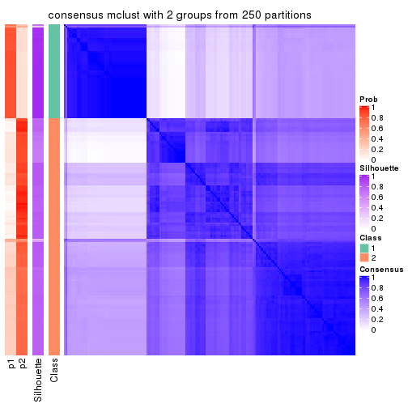</p>

</div>
<div id='tab-MAD-mclust-consensus-heatmap-2'>
<pre><code class="r">consensus_heatmap(res, k = 3)
</code></pre>

<p>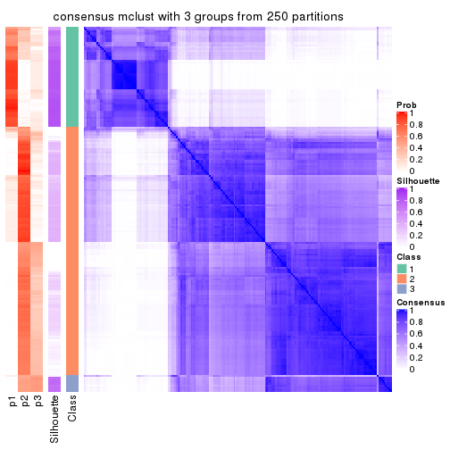</p>

</div>
<div id='tab-MAD-mclust-consensus-heatmap-3'>
<pre><code class="r">consensus_heatmap(res, k = 4)
</code></pre>

<p>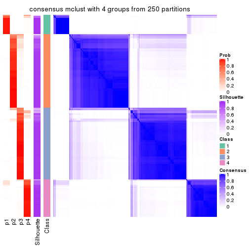</p>

</div>
<div id='tab-MAD-mclust-consensus-heatmap-4'>
<pre><code class="r">consensus_heatmap(res, k = 5)
</code></pre>

<p>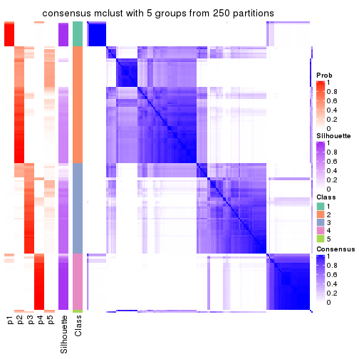</p>

</div>
<div id='tab-MAD-mclust-consensus-heatmap-5'>
<pre><code class="r">consensus_heatmap(res, k = 6)
</code></pre>

<p>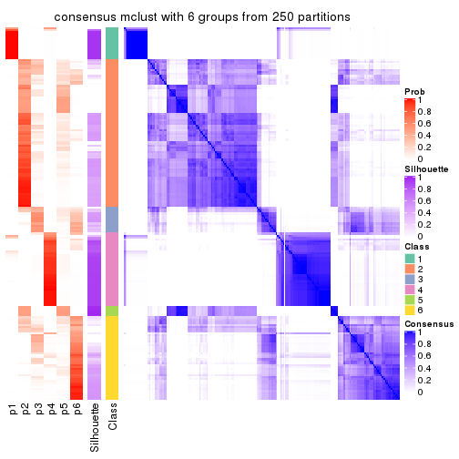</p>

</div>
</div>

Heatmaps for the membership of samples in all partitions to see how consistent they are:


<script>
$( function() {
	$( '#tabs-MAD-mclust-membership-heatmap' ).tabs();
} );
</script>
<div id='tabs-MAD-mclust-membership-heatmap'>
<ul>
<li><a href='#tab-MAD-mclust-membership-heatmap-1'>k = 2</a></li>
<li><a href='#tab-MAD-mclust-membership-heatmap-2'>k = 3</a></li>
<li><a href='#tab-MAD-mclust-membership-heatmap-3'>k = 4</a></li>
<li><a href='#tab-MAD-mclust-membership-heatmap-4'>k = 5</a></li>
<li><a href='#tab-MAD-mclust-membership-heatmap-5'>k = 6</a></li>
</ul>
<div id='tab-MAD-mclust-membership-heatmap-1'>
<pre><code class="r">membership_heatmap(res, k = 2)
</code></pre>

<p>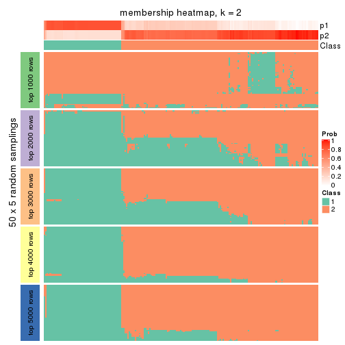</p>

</div>
<div id='tab-MAD-mclust-membership-heatmap-2'>
<pre><code class="r">membership_heatmap(res, k = 3)
</code></pre>

<p>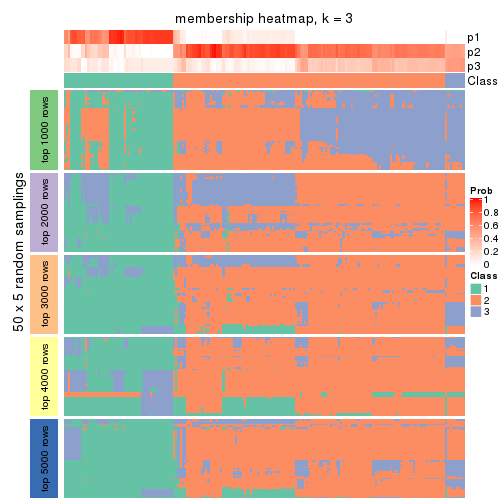</p>

</div>
<div id='tab-MAD-mclust-membership-heatmap-3'>
<pre><code class="r">membership_heatmap(res, k = 4)
</code></pre>

<p>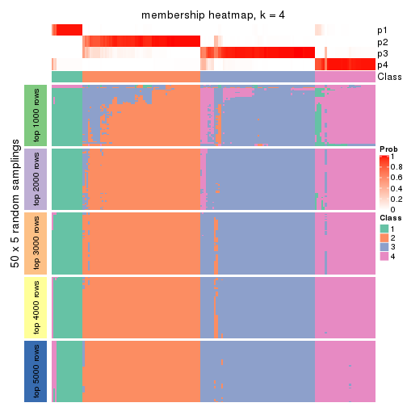</p>

</div>
<div id='tab-MAD-mclust-membership-heatmap-4'>
<pre><code class="r">membership_heatmap(res, k = 5)
</code></pre>

<p>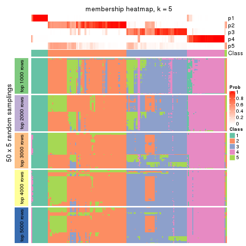</p>

</div>
<div id='tab-MAD-mclust-membership-heatmap-5'>
<pre><code class="r">membership_heatmap(res, k = 6)
</code></pre>

<p>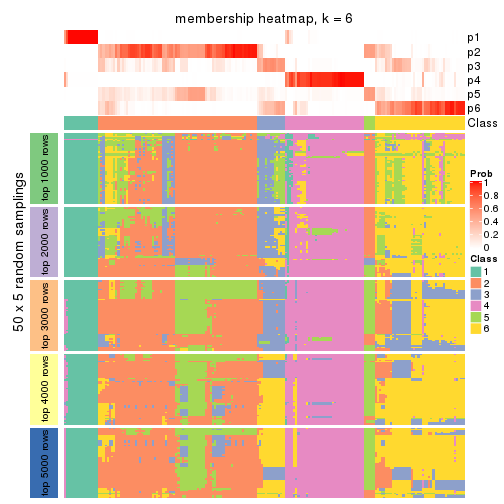</p>

</div>
</div>

As soon as we have had the classes for columns, we can look for signatures
which are significantly different between classes which can be candidate marks
for certain classes. Following are the heatmaps for signatures.


Signature heatmaps where rows are scaled:


<script>
$( function() {
	$( '#tabs-MAD-mclust-get-signatures' ).tabs();
} );
</script>
<div id='tabs-MAD-mclust-get-signatures'>
<ul>
<li><a href='#tab-MAD-mclust-get-signatures-1'>k = 2</a></li>
<li><a href='#tab-MAD-mclust-get-signatures-2'>k = 3</a></li>
<li><a href='#tab-MAD-mclust-get-signatures-3'>k = 4</a></li>
<li><a href='#tab-MAD-mclust-get-signatures-4'>k = 5</a></li>
<li><a href='#tab-MAD-mclust-get-signatures-5'>k = 6</a></li>
</ul>
<div id='tab-MAD-mclust-get-signatures-1'>
<pre><code class="r">get_signatures(res, k = 2)
</code></pre>

<p>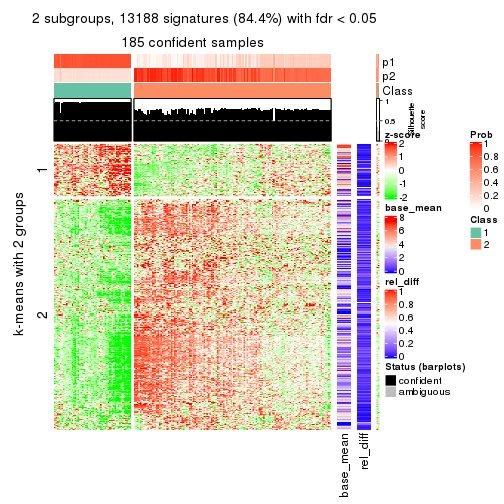</p>

</div>
<div id='tab-MAD-mclust-get-signatures-2'>
<pre><code class="r">get_signatures(res, k = 3)
</code></pre>

<p>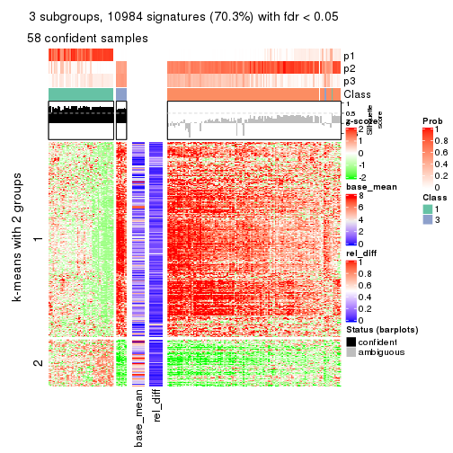</p>

</div>
<div id='tab-MAD-mclust-get-signatures-3'>
<pre><code class="r">get_signatures(res, k = 4)
</code></pre>

<p>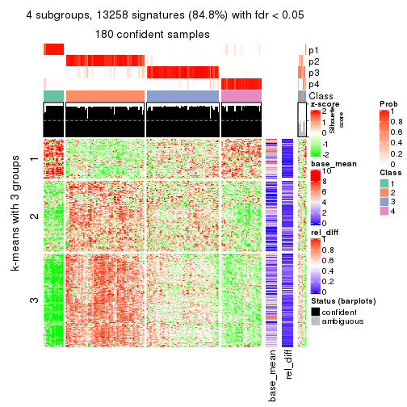</p>

</div>
<div id='tab-MAD-mclust-get-signatures-4'>
<pre><code class="r">get_signatures(res, k = 5)
</code></pre>

<p>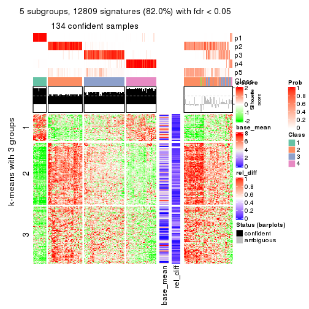</p>

</div>
<div id='tab-MAD-mclust-get-signatures-5'>
<pre><code class="r">get_signatures(res, k = 6)
</code></pre>

<p>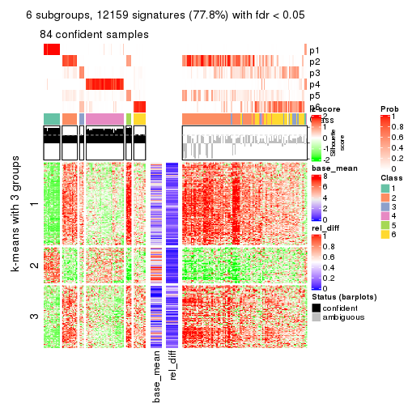</p>

</div>
</div>


Signature heatmaps where rows are not scaled:


<script>
$( function() {
	$( '#tabs-MAD-mclust-get-signatures-no-scale' ).tabs();
} );
</script>
<div id='tabs-MAD-mclust-get-signatures-no-scale'>
<ul>
<li><a href='#tab-MAD-mclust-get-signatures-no-scale-1'>k = 2</a></li>
<li><a href='#tab-MAD-mclust-get-signatures-no-scale-2'>k = 3</a></li>
<li><a href='#tab-MAD-mclust-get-signatures-no-scale-3'>k = 4</a></li>
<li><a href='#tab-MAD-mclust-get-signatures-no-scale-4'>k = 5</a></li>
<li><a href='#tab-MAD-mclust-get-signatures-no-scale-5'>k = 6</a></li>
</ul>
<div id='tab-MAD-mclust-get-signatures-no-scale-1'>
<pre><code class="r">get_signatures(res, k = 2, scale_rows = FALSE)
</code></pre>

<p>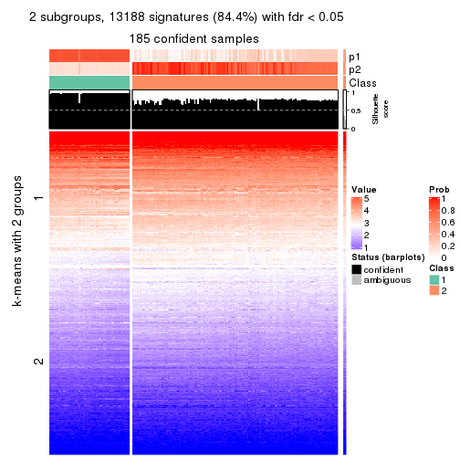</p>

</div>
<div id='tab-MAD-mclust-get-signatures-no-scale-2'>
<pre><code class="r">get_signatures(res, k = 3, scale_rows = FALSE)
</code></pre>

<p>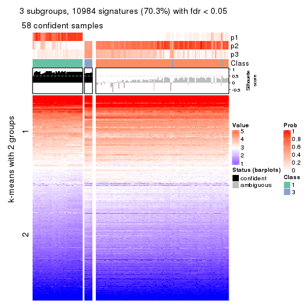</p>

</div>
<div id='tab-MAD-mclust-get-signatures-no-scale-3'>
<pre><code class="r">get_signatures(res, k = 4, scale_rows = FALSE)
</code></pre>

<p>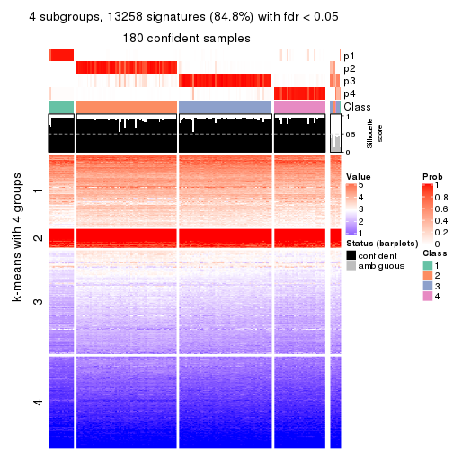</p>

</div>
<div id='tab-MAD-mclust-get-signatures-no-scale-4'>
<pre><code class="r">get_signatures(res, k = 5, scale_rows = FALSE)
</code></pre>

<p>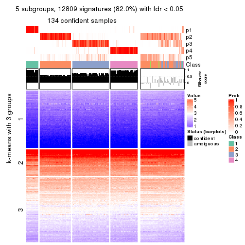</p>

</div>
<div id='tab-MAD-mclust-get-signatures-no-scale-5'>
<pre><code class="r">get_signatures(res, k = 6, scale_rows = FALSE)
</code></pre>

<p>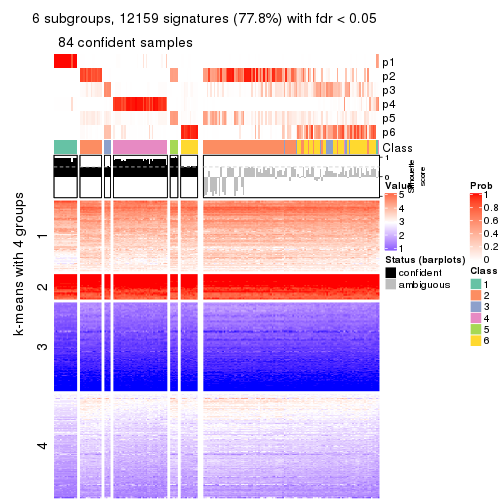</p>

</div>
</div>


Compare the overlap of signatures from different k:

```r
compare_signatures(res)
```

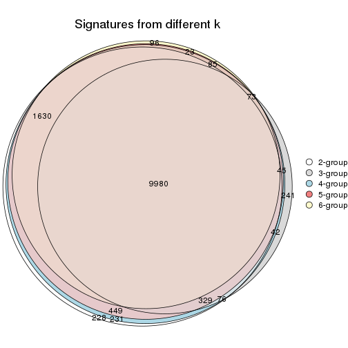

`get_signature()` returns a data frame invisibly. TO get the list of signatures, the function
call should be assigned to a variable explicitly. In following code, if `plot` argument is set
to `FALSE`, no heatmap is plotted while only the differential analysis is performed.

```r
# code only for demonstration
tb = get_signature(res, k = ..., plot = FALSE)
```

An example of the output of `tb` is:

```
#>   which_row         fdr    mean_1    mean_2 scaled_mean_1 scaled_mean_2 km
#> 1        38 0.042760348  8.373488  9.131774    -0.5533452     0.5164555  1
#> 2        40 0.018707592  7.106213  8.469186    -0.6173731     0.5762149  1
#> 3        55 0.019134737 10.221463 11.207825    -0.6159697     0.5749050  1
#> 4        59 0.006059896  5.921854  7.869574    -0.6899429     0.6439467  1
#> 5        60 0.018055526  8.928898 10.211722    -0.6204761     0.5791110  1
#> 6        98 0.009384629 15.714769 14.887706     0.6635654    -0.6193277  2
...
```

The columns in `tb` are:

1. `which_row`: row indices corresponding to the input matrix.
2. `fdr`: FDR for the differential test. 
3. `mean_x`: The mean value in group x.
4. `scaled_mean_x`: The mean value in group x after rows are scaled.
5. `km`: Row groups if k-means clustering is applied to rows.


UMAP plot which shows how samples are separated.


<script>
$( function() {
	$( '#tabs-MAD-mclust-dimension-reduction' ).tabs();
} );
</script>
<div id='tabs-MAD-mclust-dimension-reduction'>
<ul>
<li><a href='#tab-MAD-mclust-dimension-reduction-1'>k = 2</a></li>
<li><a href='#tab-MAD-mclust-dimension-reduction-2'>k = 3</a></li>
<li><a href='#tab-MAD-mclust-dimension-reduction-3'>k = 4</a></li>
<li><a href='#tab-MAD-mclust-dimension-reduction-4'>k = 5</a></li>
<li><a href='#tab-MAD-mclust-dimension-reduction-5'>k = 6</a></li>
</ul>
<div id='tab-MAD-mclust-dimension-reduction-1'>
<pre><code class="r">dimension_reduction(res, k = 2, method = &quot;UMAP&quot;)
</code></pre>

<p>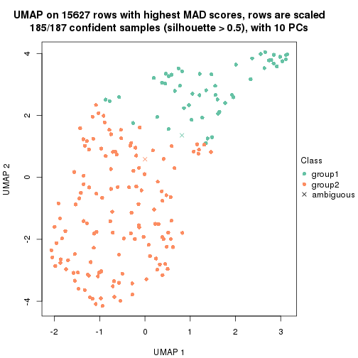</p>

</div>
<div id='tab-MAD-mclust-dimension-reduction-2'>
<pre><code class="r">dimension_reduction(res, k = 3, method = &quot;UMAP&quot;)
</code></pre>

<p>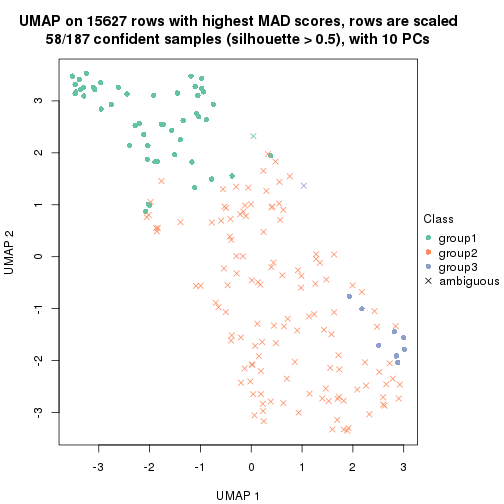</p>

</div>
<div id='tab-MAD-mclust-dimension-reduction-3'>
<pre><code class="r">dimension_reduction(res, k = 4, method = &quot;UMAP&quot;)
</code></pre>

<p>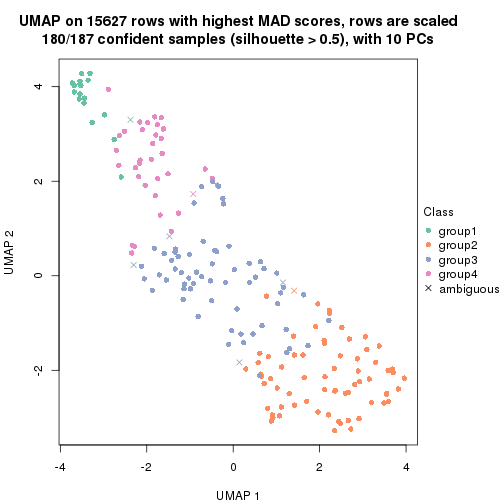</p>

</div>
<div id='tab-MAD-mclust-dimension-reduction-4'>
<pre><code class="r">dimension_reduction(res, k = 5, method = &quot;UMAP&quot;)
</code></pre>

<p>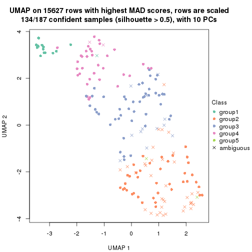</p>

</div>
<div id='tab-MAD-mclust-dimension-reduction-5'>
<pre><code class="r">dimension_reduction(res, k = 6, method = &quot;UMAP&quot;)
</code></pre>

<p>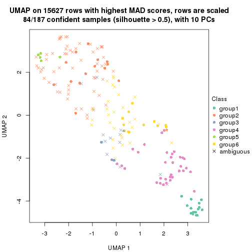</p>

</div>
</div>


Following heatmap shows how subgroups are split when increasing `k`:

```r
collect_classes(res)
```

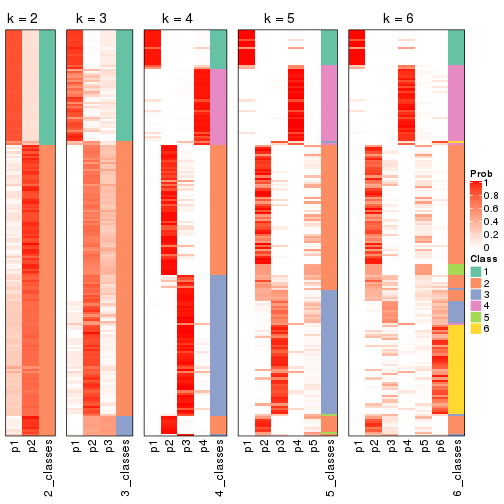


If matrix rows can be associated to genes, consider to use `GO_Enrichment(res,
...)` to perform function enrichment for the signature genes.


 

---------------------------------------------------


### MAD:NMF


The object with results only for a single top-value method and a single partition method 
can be extracted as:

```r
res = res_list["MAD", "NMF"]
# you can also extract it by
# res = res_list["MAD:NMF"]
```

A summary of `res` and all the functions that can be applied to it:

```r
res
```

```
#> A 'ConsensusPartition' object with k = 2, 3, 4, 5, 6.
#>   On a matrix with 15627 rows and 187 columns.
#>   Top rows (1000, 2000, 3000, 4000, 5000) are extracted by 'MAD' method.
#>   Subgroups are detected by 'NMF' method.
#>   Performed in total 1250 partitions by row resampling.
#>   Best k for subgroups seems to be 2.
#> 
#> Following methods can be applied to this 'ConsensusPartition' object:
#>  [1] "cola_report"             "collect_classes"         "collect_plots"          
#>  [4] "collect_stats"           "colnames"                "compare_signatures"     
#>  [7] "consensus_heatmap"       "dimension_reduction"     "functional_enrichment"  
#> [10] "get_anno_col"            "get_anno"                "get_classes"            
#> [13] "get_consensus"           "get_matrix"              "get_membership"         
#> [16] "get_param"               "get_signatures"          "get_stats"              
#> [19] "is_best_k"               "is_stable_k"             "membership_heatmap"     
#> [22] "ncol"                    "nrow"                    "plot_ecdf"              
#> [25] "rownames"                "select_partition_number" "show"                   
#> [28] "suggest_best_k"          "test_to_known_factors"
```

`collect_plots()` function collects all the plots made from `res` for all `k` (number of partitions)
into one single page to provide an easy and fast comparison between different `k`.

```r
collect_plots(res)
```

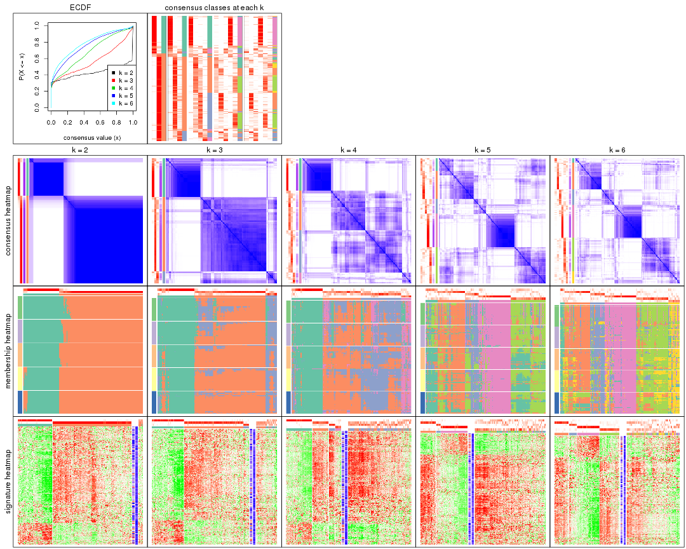

The plots are:

- The first row: a plot of the ECDF (Empirical cumulative distribution
  function) curves of the consensus matrix for each `k` and the heatmap of
  predicted classes for each `k`.
- The second row: heatmaps of the consensus matrix for each `k`.
- The third row: heatmaps of the membership matrix for each `k`.
- The fouth row: heatmaps of the signatures for each `k`.

All the plots in panels can be made by individual functions and they are
plotted later in this section.

`select_partition_number()` produces several plots showing different
statistics for choosing "optimized" `k`. There are following statistics:

- ECDF curves of the consensus matrix for each `k`;
- 1-PAC. [The PAC
  score](https://en.wikipedia.org/wiki/Consensus_clustering#Over-interpretation_potential_of_consensus_clustering)
  measures the proportion of the ambiguous subgrouping.
- Mean silhouette score.
- Concordance. The mean probability of fiting the consensus class ids in all
  partitions.
- Area increased. Denote $A_k$ as the area under the ECDF curve for current
  `k`, the area increased is defined as $A_k - A_{k-1}$.
- Rand index. The percent of pairs of samples that are both in a same cluster
  or both are not in a same cluster in the partition of k and k-1.
- Jaccard index. The ratio of pairs of samples are both in a same cluster in
  the partition of k and k-1 and the pairs of samples are both in a same
  cluster in the partition k or k-1.

The detailed explanations of these statistics can be found in [the cola
vignette](http://bioconductor.org/packages/devel/bioc/vignettes/cola/inst/doc/cola.html#toc_13).

Generally speaking, lower PAC score, higher mean silhouette score or higher
concordance corresponds to better partition. Rand index and Jaccard index
measure how similar the current partition is compared to partition with `k-1`.
If they are too similar, we won't accept `k` is better than `k-1`.

```r
select_partition_number(res)
```

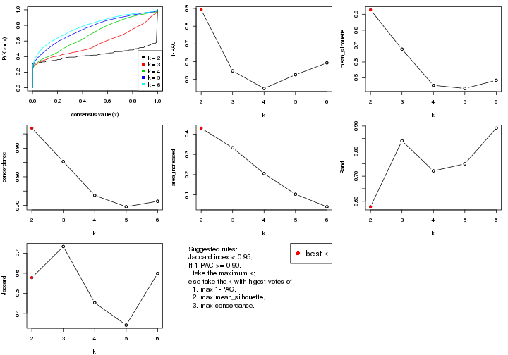

The numeric values for all these statistics can be obtained by `get_stats()`.

```r
get_stats(res)
```

```
#>   k 1-PAC mean_silhouette concordance area_increased  Rand Jaccard
#> 2 2 0.892           0.928       0.970         0.4293 0.578   0.578
#> 3 3 0.548           0.680       0.853         0.3327 0.841   0.733
#> 4 4 0.449           0.453       0.735         0.2053 0.721   0.453
#> 5 5 0.526           0.433       0.695         0.1032 0.749   0.341
#> 6 6 0.593           0.484       0.714         0.0413 0.891   0.599
```

`suggest_best_k()` suggests the best $k$ based on these statistics. The rules are as follows:

- All $k$ with Jaccard index larger than 0.95 are removed because the increase of
  the partition number does not provides enough extra information. If all $k$ are removed,
  the best $k$ is assigned by `NA`.
- For $k$ with 1-PAC larger than 0.9, the maximal $k$ is taken as the "best k". Other $k$ is called "optional k".
- If it does not fit the second rule. The $k$ with the highest vote of highest
  1-PAC, mean silhouette and concordance is taken as the "best k".

```r
suggest_best_k(res)
```

```
#> [1] 2
```


Following shows the table of the partitions (You need to click the **show/hide
code output** link to see it). The membership matrix (columns with name `p*`)
is inferred by
[`clue::cl_consensus()`](https://www.rdocumentation.org/link/cl_consensus?package=clue)
function with the `SE` method. Basically the value in the membership matrix
represents the probability to belong to a certain group. The finall class
label for an item is determined with the group with highest probability it
belongs to.

In `get_classes()` function, the entropy is calculated from the membership
matrix and the silhouette score is calculated from the consensus matrix.


<script>
$( function() {
	$( '#tabs-MAD-NMF-get-classes' ).tabs();
} );
</script>
<div id='tabs-MAD-NMF-get-classes'>
<ul>
<li><a href='#tab-MAD-NMF-get-classes-1'>k = 2</a></li>
<li><a href='#tab-MAD-NMF-get-classes-2'>k = 3</a></li>
<li><a href='#tab-MAD-NMF-get-classes-3'>k = 4</a></li>
<li><a href='#tab-MAD-NMF-get-classes-4'>k = 5</a></li>
<li><a href='#tab-MAD-NMF-get-classes-5'>k = 6</a></li>
</ul>

<div id='tab-MAD-NMF-get-classes-1'>
<p><a id='tab-MAD-NMF-get-classes-1-a' style='color:#0366d6' href='#'>show/hide code output</a></p>
<pre><code class="r">cbind(get_classes(res, k = 2), get_membership(res, k = 2))
</code></pre>

<pre><code>#&gt;            class entropy silhouette    p1    p2
#&gt; SRR1747213     1  0.4939      0.865 0.892 0.108
#&gt; SRR1747214     1  0.0000      0.968 1.000 0.000
#&gt; SRR1747215     2  0.0000      0.968 0.000 1.000
#&gt; SRR1747216     2  0.0000      0.968 0.000 1.000
#&gt; SRR1747217     2  0.0000      0.968 0.000 1.000
#&gt; SRR1747218     2  0.0000      0.968 0.000 1.000
#&gt; SRR1747219     2  0.3879      0.901 0.076 0.924
#&gt; SRR1747220     1  0.0000      0.968 1.000 0.000
#&gt; SRR1747221     1  0.0000      0.968 1.000 0.000
#&gt; SRR1747222     1  0.0000      0.968 1.000 0.000
#&gt; SRR1747223     1  0.0000      0.968 1.000 0.000
#&gt; SRR1747224     2  0.0000      0.968 0.000 1.000
#&gt; SRR1747225     2  0.0000      0.968 0.000 1.000
#&gt; SRR1747226     2  0.0000      0.968 0.000 1.000
#&gt; SRR1747227     2  0.0000      0.968 0.000 1.000
#&gt; SRR1747228     2  0.0000      0.968 0.000 1.000
#&gt; SRR1747229     2  0.0000      0.968 0.000 1.000
#&gt; SRR1747230     1  0.0000      0.968 1.000 0.000
#&gt; SRR1747231     1  0.0000      0.968 1.000 0.000
#&gt; SRR1747232     1  0.0000      0.968 1.000 0.000
#&gt; SRR1747233     1  0.0000      0.968 1.000 0.000
#&gt; SRR1747234     2  0.0000      0.968 0.000 1.000
#&gt; SRR1747235     1  0.0000      0.968 1.000 0.000
#&gt; SRR1747236     2  0.0000      0.968 0.000 1.000
#&gt; SRR1747237     2  0.0000      0.968 0.000 1.000
#&gt; SRR1747238     2  0.0000      0.968 0.000 1.000
#&gt; SRR1747239     2  0.0000      0.968 0.000 1.000
#&gt; SRR1747240     1  0.0000      0.968 1.000 0.000
#&gt; SRR1747241     2  0.0000      0.968 0.000 1.000
#&gt; SRR1747242     1  0.0000      0.968 1.000 0.000
#&gt; SRR1747243     1  0.7815      0.703 0.768 0.232
#&gt; SRR1747244     2  0.0000      0.968 0.000 1.000
#&gt; SRR1747245     2  0.0000      0.968 0.000 1.000
#&gt; SRR1747246     2  0.0000      0.968 0.000 1.000
#&gt; SRR1747247     1  0.0000      0.968 1.000 0.000
#&gt; SRR1747248     1  0.0000      0.968 1.000 0.000
#&gt; SRR1747249     1  0.0000      0.968 1.000 0.000
#&gt; SRR1747250     2  0.0000      0.968 0.000 1.000
#&gt; SRR1747252     1  0.0000      0.968 1.000 0.000
#&gt; SRR1747253     1  0.0000      0.968 1.000 0.000
#&gt; SRR1747254     2  0.0000      0.968 0.000 1.000
#&gt; SRR1747255     1  0.0000      0.968 1.000 0.000
#&gt; SRR1747256     1  0.0000      0.968 1.000 0.000
#&gt; SRR1747257     2  0.0000      0.968 0.000 1.000
#&gt; SRR1747258     2  0.0000      0.968 0.000 1.000
#&gt; SRR1747259     2  0.0000      0.968 0.000 1.000
#&gt; SRR1747260     2  0.0000      0.968 0.000 1.000
#&gt; SRR1747261     2  0.0000      0.968 0.000 1.000
#&gt; SRR1747262     2  0.0000      0.968 0.000 1.000
#&gt; SRR1747263     2  0.0000      0.968 0.000 1.000
#&gt; SRR1747264     1  0.0000      0.968 1.000 0.000
#&gt; SRR1747265     2  0.2603      0.931 0.044 0.956
#&gt; SRR1747266     2  0.0000      0.968 0.000 1.000
#&gt; SRR1747267     2  0.6887      0.773 0.184 0.816
#&gt; SRR1747268     2  0.3879      0.901 0.076 0.924
#&gt; SRR1747269     2  0.0000      0.968 0.000 1.000
#&gt; SRR1747270     2  0.0000      0.968 0.000 1.000
#&gt; SRR1747271     2  0.0000      0.968 0.000 1.000
#&gt; SRR1747272     2  0.9358      0.469 0.352 0.648
#&gt; SRR1747273     1  0.0000      0.968 1.000 0.000
#&gt; SRR1747274     2  0.0000      0.968 0.000 1.000
#&gt; SRR1747275     1  0.0000      0.968 1.000 0.000
#&gt; SRR1747276     1  0.0000      0.968 1.000 0.000
#&gt; SRR1747277     2  0.0000      0.968 0.000 1.000
#&gt; SRR1747278     2  0.4815      0.872 0.104 0.896
#&gt; SRR1747280     1  0.0000      0.968 1.000 0.000
#&gt; SRR1747279     1  0.0000      0.968 1.000 0.000
#&gt; SRR1747281     2  0.0000      0.968 0.000 1.000
#&gt; SRR1747282     1  0.0000      0.968 1.000 0.000
#&gt; SRR1747283     2  0.0000      0.968 0.000 1.000
#&gt; SRR1747284     1  0.0000      0.968 1.000 0.000
#&gt; SRR1747285     2  0.0000      0.968 0.000 1.000
#&gt; SRR1747286     2  0.0000      0.968 0.000 1.000
#&gt; SRR1747287     2  0.0000      0.968 0.000 1.000
#&gt; SRR1747288     1  0.8443      0.632 0.728 0.272
#&gt; SRR1747290     2  0.0000      0.968 0.000 1.000
#&gt; SRR1747289     2  0.0000      0.968 0.000 1.000
#&gt; SRR1747291     2  0.0000      0.968 0.000 1.000
#&gt; SRR1747293     2  0.0000      0.968 0.000 1.000
#&gt; SRR1747294     2  0.0000      0.968 0.000 1.000
#&gt; SRR1747292     1  0.0000      0.968 1.000 0.000
#&gt; SRR1747295     2  0.0000      0.968 0.000 1.000
#&gt; SRR1747296     2  0.0000      0.968 0.000 1.000
#&gt; SRR1747297     2  0.0000      0.968 0.000 1.000
#&gt; SRR1747298     2  0.0000      0.968 0.000 1.000
#&gt; SRR1747299     2  0.0000      0.968 0.000 1.000
#&gt; SRR1747300     2  0.0000      0.968 0.000 1.000
#&gt; SRR1747301     2  0.0000      0.968 0.000 1.000
#&gt; SRR1747302     2  0.0000      0.968 0.000 1.000
#&gt; SRR1747303     2  0.0000      0.968 0.000 1.000
#&gt; SRR1747304     1  0.0000      0.968 1.000 0.000
#&gt; SRR1747305     2  0.0000      0.968 0.000 1.000
#&gt; SRR1747306     2  0.0000      0.968 0.000 1.000
#&gt; SRR1747307     2  0.9661      0.370 0.392 0.608
#&gt; SRR1747308     2  0.0000      0.968 0.000 1.000
#&gt; SRR1747309     1  0.0000      0.968 1.000 0.000
#&gt; SRR1747310     1  0.0000      0.968 1.000 0.000
#&gt; SRR1747311     2  0.4815      0.872 0.104 0.896
#&gt; SRR1747313     2  0.3114      0.921 0.056 0.944
#&gt; SRR1747312     1  0.0000      0.968 1.000 0.000
#&gt; SRR1747314     1  0.0000      0.968 1.000 0.000
#&gt; SRR1747315     2  0.0000      0.968 0.000 1.000
#&gt; SRR1747316     2  0.0000      0.968 0.000 1.000
#&gt; SRR1747318     2  0.0938      0.959 0.012 0.988
#&gt; SRR1747317     2  0.0000      0.968 0.000 1.000
#&gt; SRR1747319     2  0.0000      0.968 0.000 1.000
#&gt; SRR1747320     1  0.0000      0.968 1.000 0.000
#&gt; SRR1747322     1  0.0000      0.968 1.000 0.000
#&gt; SRR1747321     1  0.0000      0.968 1.000 0.000
#&gt; SRR1747323     2  0.0000      0.968 0.000 1.000
#&gt; SRR1747324     2  0.0000      0.968 0.000 1.000
#&gt; SRR1747326     2  0.0000      0.968 0.000 1.000
#&gt; SRR1747325     2  0.0000      0.968 0.000 1.000
#&gt; SRR1747327     2  0.0000      0.968 0.000 1.000
#&gt; SRR1747328     2  0.6247      0.810 0.156 0.844
#&gt; SRR1747330     2  0.9358      0.469 0.352 0.648
#&gt; SRR1747329     2  0.0000      0.968 0.000 1.000
#&gt; SRR1747332     1  0.7883      0.696 0.764 0.236
#&gt; SRR1747331     2  0.0000      0.968 0.000 1.000
#&gt; SRR1747333     2  0.0000      0.968 0.000 1.000
#&gt; SRR1747334     2  0.0000      0.968 0.000 1.000
#&gt; SRR1747335     2  0.8555      0.618 0.280 0.720
#&gt; SRR1747336     1  0.0000      0.968 1.000 0.000
#&gt; SRR1747337     2  0.0000      0.968 0.000 1.000
#&gt; SRR1747338     2  0.0000      0.968 0.000 1.000
#&gt; SRR1747339     2  0.6048      0.821 0.148 0.852
#&gt; SRR1747340     2  0.0000      0.968 0.000 1.000
#&gt; SRR1747341     2  0.0000      0.968 0.000 1.000
#&gt; SRR1747342     2  0.0000      0.968 0.000 1.000
#&gt; SRR1747343     2  0.0000      0.968 0.000 1.000
#&gt; SRR1747344     2  0.0000      0.968 0.000 1.000
#&gt; SRR1747345     2  0.0938      0.959 0.012 0.988
#&gt; SRR1747346     2  0.0376      0.965 0.004 0.996
#&gt; SRR1747347     2  0.0000      0.968 0.000 1.000
#&gt; SRR1747348     1  0.0000      0.968 1.000 0.000
#&gt; SRR1747349     1  0.0000      0.968 1.000 0.000
#&gt; SRR1747351     2  0.0000      0.968 0.000 1.000
#&gt; SRR1747350     2  0.0000      0.968 0.000 1.000
#&gt; SRR1747352     1  0.0000      0.968 1.000 0.000
#&gt; SRR1747353     2  0.0000      0.968 0.000 1.000
#&gt; SRR1747354     2  0.0000      0.968 0.000 1.000
#&gt; SRR1747355     1  0.9427      0.437 0.640 0.360
#&gt; SRR1747356     2  0.0000      0.968 0.000 1.000
#&gt; SRR1747357     2  0.0000      0.968 0.000 1.000
#&gt; SRR1747358     2  0.0000      0.968 0.000 1.000
#&gt; SRR1747359     1  0.0000      0.968 1.000 0.000
#&gt; SRR1747360     2  0.0000      0.968 0.000 1.000
#&gt; SRR1747361     2  0.9795      0.302 0.416 0.584
#&gt; SRR1747362     2  0.0000      0.968 0.000 1.000
#&gt; SRR1747363     2  0.9983      0.104 0.476 0.524
#&gt; SRR1747364     1  0.0000      0.968 1.000 0.000
#&gt; SRR1747365     2  0.0000      0.968 0.000 1.000
#&gt; SRR1747366     2  0.0000      0.968 0.000 1.000
#&gt; SRR1747367     2  0.9954      0.161 0.460 0.540
#&gt; SRR1747369     2  0.0000      0.968 0.000 1.000
#&gt; SRR1747368     2  0.0000      0.968 0.000 1.000
#&gt; SRR1747370     2  0.0000      0.968 0.000 1.000
#&gt; SRR1747372     1  0.0000      0.968 1.000 0.000
#&gt; SRR1747371     1  0.0000      0.968 1.000 0.000
#&gt; SRR1747373     2  0.0000      0.968 0.000 1.000
#&gt; SRR1747374     2  0.0000      0.968 0.000 1.000
#&gt; SRR1747375     1  0.7139      0.756 0.804 0.196
#&gt; SRR1747376     2  0.0000      0.968 0.000 1.000
#&gt; SRR1747377     2  0.0000      0.968 0.000 1.000
#&gt; SRR1747378     2  0.0000      0.968 0.000 1.000
#&gt; SRR1747379     2  0.0000      0.968 0.000 1.000
#&gt; SRR1747380     2  0.0000      0.968 0.000 1.000
#&gt; SRR1747381     1  0.0000      0.968 1.000 0.000
#&gt; SRR1747382     1  0.0000      0.968 1.000 0.000
#&gt; SRR1747383     2  0.0000      0.968 0.000 1.000
#&gt; SRR1747384     2  0.3274      0.917 0.060 0.940
#&gt; SRR1747385     2  0.0000      0.968 0.000 1.000
#&gt; SRR1747386     1  0.0000      0.968 1.000 0.000
#&gt; SRR1747387     2  0.0000      0.968 0.000 1.000
#&gt; SRR1747388     2  0.0000      0.968 0.000 1.000
#&gt; SRR1747390     2  0.0000      0.968 0.000 1.000
#&gt; SRR1747389     2  0.0000      0.968 0.000 1.000
#&gt; SRR1747391     2  0.0000      0.968 0.000 1.000
#&gt; SRR1747392     2  0.0000      0.968 0.000 1.000
#&gt; SRR1747393     2  0.0000      0.968 0.000 1.000
#&gt; SRR1747394     1  0.7950      0.690 0.760 0.240
#&gt; SRR1747395     2  0.0000      0.968 0.000 1.000
#&gt; SRR1747396     2  0.0000      0.968 0.000 1.000
#&gt; SRR1747398     2  0.0000      0.968 0.000 1.000
#&gt; SRR1747397     2  0.6973      0.767 0.188 0.812
#&gt; SRR1747399     1  0.0000      0.968 1.000 0.000
#&gt; SRR1747400     1  0.0000      0.968 1.000 0.000
</code></pre>

<script>
$('#tab-MAD-NMF-get-classes-1-a').parent().next().next().hide();
$('#tab-MAD-NMF-get-classes-1-a').click(function(){
  $('#tab-MAD-NMF-get-classes-1-a').parent().next().next().toggle();
  return(false);
});
</script>
</div>

<div id='tab-MAD-NMF-get-classes-2'>
<p><a id='tab-MAD-NMF-get-classes-2-a' style='color:#0366d6' href='#'>show/hide code output</a></p>
<pre><code class="r">cbind(get_classes(res, k = 3), get_membership(res, k = 3))
</code></pre>

<pre><code>#&gt;            class entropy silhouette    p1    p2    p3
#&gt; SRR1747213     1  0.3987     0.7814 0.872 0.020 0.108
#&gt; SRR1747214     1  0.0592     0.8733 0.988 0.000 0.012
#&gt; SRR1747215     2  0.2261     0.8153 0.000 0.932 0.068
#&gt; SRR1747216     2  0.1643     0.8182 0.000 0.956 0.044
#&gt; SRR1747217     2  0.6910     0.6752 0.120 0.736 0.144
#&gt; SRR1747218     2  0.4931     0.7137 0.000 0.768 0.232
#&gt; SRR1747219     3  0.3155     0.6232 0.044 0.040 0.916
#&gt; SRR1747220     1  0.5497     0.6058 0.708 0.000 0.292
#&gt; SRR1747221     1  0.2636     0.8344 0.932 0.048 0.020
#&gt; SRR1747222     1  0.0000     0.8777 1.000 0.000 0.000
#&gt; SRR1747223     1  0.2879     0.8283 0.924 0.052 0.024
#&gt; SRR1747224     2  0.1289     0.8081 0.000 0.968 0.032
#&gt; SRR1747225     2  0.1411     0.8086 0.000 0.964 0.036
#&gt; SRR1747226     2  0.2796     0.8024 0.000 0.908 0.092
#&gt; SRR1747227     2  0.2796     0.8137 0.000 0.908 0.092
#&gt; SRR1747228     2  0.1964     0.8080 0.000 0.944 0.056
#&gt; SRR1747229     2  0.2796     0.8123 0.000 0.908 0.092
#&gt; SRR1747230     1  0.0000     0.8777 1.000 0.000 0.000
#&gt; SRR1747231     1  0.4002     0.7637 0.840 0.000 0.160
#&gt; SRR1747232     1  0.0237     0.8768 0.996 0.000 0.004
#&gt; SRR1747233     1  0.0848     0.8712 0.984 0.008 0.008
#&gt; SRR1747234     3  0.6307    -0.1363 0.000 0.488 0.512
#&gt; SRR1747235     1  0.6302     0.2699 0.520 0.000 0.480
#&gt; SRR1747236     3  0.4346     0.6162 0.000 0.184 0.816
#&gt; SRR1747237     2  0.5621     0.6201 0.000 0.692 0.308
#&gt; SRR1747238     2  0.6305     0.1685 0.000 0.516 0.484
#&gt; SRR1747239     2  0.1753     0.8196 0.000 0.952 0.048
#&gt; SRR1747240     1  0.0237     0.8768 0.996 0.000 0.004
#&gt; SRR1747241     3  0.3551     0.6336 0.000 0.132 0.868
#&gt; SRR1747242     1  0.0000     0.8777 1.000 0.000 0.000
#&gt; SRR1747243     1  0.6449     0.5718 0.740 0.204 0.056
#&gt; SRR1747244     2  0.1753     0.8069 0.000 0.952 0.048
#&gt; SRR1747245     2  0.2165     0.8063 0.000 0.936 0.064
#&gt; SRR1747246     2  0.1411     0.8162 0.000 0.964 0.036
#&gt; SRR1747247     1  0.0000     0.8777 1.000 0.000 0.000
#&gt; SRR1747248     1  0.0000     0.8777 1.000 0.000 0.000
#&gt; SRR1747249     1  0.0000     0.8777 1.000 0.000 0.000
#&gt; SRR1747250     2  0.5733     0.5911 0.000 0.676 0.324
#&gt; SRR1747252     1  0.2031     0.8518 0.952 0.016 0.032
#&gt; SRR1747253     1  0.0000     0.8777 1.000 0.000 0.000
#&gt; SRR1747254     2  0.5058     0.7002 0.000 0.756 0.244
#&gt; SRR1747255     1  0.0661     0.8733 0.988 0.004 0.008
#&gt; SRR1747256     1  0.0000     0.8777 1.000 0.000 0.000
#&gt; SRR1747257     2  0.5098     0.7015 0.000 0.752 0.248
#&gt; SRR1747258     2  0.6095     0.4040 0.000 0.608 0.392
#&gt; SRR1747259     2  0.5760     0.5888 0.000 0.672 0.328
#&gt; SRR1747260     3  0.5591     0.4444 0.000 0.304 0.696
#&gt; SRR1747261     2  0.3619     0.7950 0.000 0.864 0.136
#&gt; SRR1747262     2  0.3551     0.7808 0.000 0.868 0.132
#&gt; SRR1747263     2  0.2261     0.8108 0.000 0.932 0.068
#&gt; SRR1747264     1  0.0000     0.8777 1.000 0.000 0.000
#&gt; SRR1747265     3  0.3375     0.6221 0.048 0.044 0.908
#&gt; SRR1747266     2  0.1860     0.8131 0.000 0.948 0.052
#&gt; SRR1747267     2  0.9955    -0.1857 0.316 0.380 0.304
#&gt; SRR1747268     2  0.4094     0.7332 0.100 0.872 0.028
#&gt; SRR1747269     2  0.6299     0.1568 0.000 0.524 0.476
#&gt; SRR1747270     2  0.5968     0.5212 0.000 0.636 0.364
#&gt; SRR1747271     2  0.1529     0.8205 0.000 0.960 0.040
#&gt; SRR1747272     1  0.7396    -0.0832 0.488 0.480 0.032
#&gt; SRR1747273     3  0.3482     0.5328 0.128 0.000 0.872
#&gt; SRR1747274     2  0.4178     0.7559 0.000 0.828 0.172
#&gt; SRR1747275     1  0.0424     0.8749 0.992 0.000 0.008
#&gt; SRR1747276     1  0.0237     0.8765 0.996 0.000 0.004
#&gt; SRR1747277     2  0.6062     0.4670 0.000 0.616 0.384
#&gt; SRR1747278     2  0.3406     0.7669 0.068 0.904 0.028
#&gt; SRR1747280     1  0.0237     0.8768 0.996 0.000 0.004
#&gt; SRR1747279     1  0.0237     0.8765 0.996 0.000 0.004
#&gt; SRR1747281     2  0.1163     0.8092 0.000 0.972 0.028
#&gt; SRR1747282     1  0.0000     0.8777 1.000 0.000 0.000
#&gt; SRR1747283     3  0.1529     0.6451 0.000 0.040 0.960
#&gt; SRR1747284     1  0.6299     0.2684 0.524 0.000 0.476
#&gt; SRR1747285     2  0.5202     0.7037 0.008 0.772 0.220
#&gt; SRR1747286     3  0.1643     0.6431 0.000 0.044 0.956
#&gt; SRR1747287     2  0.4974     0.7098 0.000 0.764 0.236
#&gt; SRR1747288     1  0.6854     0.6004 0.740 0.124 0.136
#&gt; SRR1747290     2  0.6126     0.4149 0.000 0.600 0.400
#&gt; SRR1747289     2  0.6299     0.1695 0.000 0.524 0.476
#&gt; SRR1747291     2  0.1860     0.8081 0.000 0.948 0.052
#&gt; SRR1747293     2  0.1031     0.8066 0.000 0.976 0.024
#&gt; SRR1747294     2  0.2959     0.8098 0.000 0.900 0.100
#&gt; SRR1747292     1  0.0237     0.8765 0.996 0.000 0.004
#&gt; SRR1747295     2  0.6235     0.3261 0.000 0.564 0.436
#&gt; SRR1747296     3  0.6280    -0.0207 0.000 0.460 0.540
#&gt; SRR1747297     2  0.0592     0.8135 0.000 0.988 0.012
#&gt; SRR1747298     2  0.1753     0.8128 0.000 0.952 0.048
#&gt; SRR1747299     2  0.1964     0.8155 0.000 0.944 0.056
#&gt; SRR1747300     2  0.1163     0.8157 0.000 0.972 0.028
#&gt; SRR1747301     2  0.1860     0.8151 0.000 0.948 0.052
#&gt; SRR1747302     2  0.1289     0.8161 0.000 0.968 0.032
#&gt; SRR1747303     2  0.0892     0.8130 0.000 0.980 0.020
#&gt; SRR1747304     1  0.0000     0.8777 1.000 0.000 0.000
#&gt; SRR1747305     2  0.3116     0.8066 0.000 0.892 0.108
#&gt; SRR1747306     2  0.3482     0.7879 0.000 0.872 0.128
#&gt; SRR1747307     3  0.6688     0.2689 0.308 0.028 0.664
#&gt; SRR1747308     2  0.4654     0.7411 0.000 0.792 0.208
#&gt; SRR1747309     1  0.0747     0.8706 0.984 0.000 0.016
#&gt; SRR1747310     1  0.0237     0.8768 0.996 0.000 0.004
#&gt; SRR1747311     2  0.7218     0.4203 0.296 0.652 0.052
#&gt; SRR1747313     2  0.5681     0.5677 0.236 0.748 0.016
#&gt; SRR1747312     1  0.0000     0.8777 1.000 0.000 0.000
#&gt; SRR1747314     1  0.0000     0.8777 1.000 0.000 0.000
#&gt; SRR1747315     2  0.1289     0.8094 0.000 0.968 0.032
#&gt; SRR1747316     2  0.2165     0.8168 0.000 0.936 0.064
#&gt; SRR1747318     2  0.6523     0.5773 0.228 0.724 0.048
#&gt; SRR1747317     2  0.1860     0.8072 0.000 0.948 0.052
#&gt; SRR1747319     3  0.5138     0.5209 0.000 0.252 0.748
#&gt; SRR1747320     1  0.0237     0.8762 0.996 0.000 0.004
#&gt; SRR1747322     1  0.0000     0.8777 1.000 0.000 0.000
#&gt; SRR1747321     1  0.0424     0.8749 0.992 0.000 0.008
#&gt; SRR1747323     2  0.1289     0.8169 0.000 0.968 0.032
#&gt; SRR1747324     2  0.1289     0.8155 0.000 0.968 0.032
#&gt; SRR1747326     2  0.0892     0.8081 0.000 0.980 0.020
#&gt; SRR1747325     2  0.1753     0.8118 0.000 0.952 0.048
#&gt; SRR1747327     2  0.1964     0.8161 0.000 0.944 0.056
#&gt; SRR1747328     2  0.5852     0.6661 0.152 0.788 0.060
#&gt; SRR1747330     2  0.6056     0.5286 0.224 0.744 0.032
#&gt; SRR1747329     2  0.1964     0.8067 0.000 0.944 0.056
#&gt; SRR1747332     3  0.7372    -0.1385 0.448 0.032 0.520
#&gt; SRR1747331     3  0.5968     0.3911 0.000 0.364 0.636
#&gt; SRR1747333     2  0.1643     0.8066 0.000 0.956 0.044
#&gt; SRR1747334     2  0.1163     0.8114 0.000 0.972 0.028
#&gt; SRR1747335     2  0.8362     0.1898 0.384 0.528 0.088
#&gt; SRR1747336     1  0.0000     0.8777 1.000 0.000 0.000
#&gt; SRR1747337     2  0.2537     0.8140 0.000 0.920 0.080
#&gt; SRR1747338     2  0.1643     0.8176 0.000 0.956 0.044
#&gt; SRR1747339     2  0.4873     0.6729 0.152 0.824 0.024
#&gt; SRR1747340     2  0.1289     0.8049 0.000 0.968 0.032
#&gt; SRR1747341     2  0.3116     0.8055 0.000 0.892 0.108
#&gt; SRR1747342     2  0.3038     0.8073 0.000 0.896 0.104
#&gt; SRR1747343     2  0.1529     0.8124 0.000 0.960 0.040
#&gt; SRR1747344     2  0.2066     0.8189 0.000 0.940 0.060
#&gt; SRR1747345     2  0.1878     0.8052 0.004 0.952 0.044
#&gt; SRR1747346     2  0.5744     0.7469 0.072 0.800 0.128
#&gt; SRR1747347     2  0.2711     0.8116 0.000 0.912 0.088
#&gt; SRR1747348     1  0.0000     0.8777 1.000 0.000 0.000
#&gt; SRR1747349     1  0.0000     0.8777 1.000 0.000 0.000
#&gt; SRR1747351     2  0.2537     0.8143 0.000 0.920 0.080
#&gt; SRR1747350     2  0.5216     0.6658 0.000 0.740 0.260
#&gt; SRR1747352     1  0.0000     0.8777 1.000 0.000 0.000
#&gt; SRR1747353     2  0.1753     0.8201 0.000 0.952 0.048
#&gt; SRR1747354     2  0.6295     0.2049 0.000 0.528 0.472
#&gt; SRR1747355     1  0.6154     0.5417 0.752 0.204 0.044
#&gt; SRR1747356     2  0.6169     0.4802 0.004 0.636 0.360
#&gt; SRR1747357     2  0.6608     0.2676 0.008 0.560 0.432
#&gt; SRR1747358     3  0.1753     0.6476 0.000 0.048 0.952
#&gt; SRR1747359     1  0.0000     0.8777 1.000 0.000 0.000
#&gt; SRR1747360     2  0.3116     0.7908 0.000 0.892 0.108
#&gt; SRR1747361     1  0.7382     0.0182 0.512 0.456 0.032
#&gt; SRR1747362     2  0.2261     0.8149 0.000 0.932 0.068
#&gt; SRR1747363     1  0.7567     0.1545 0.576 0.376 0.048
#&gt; SRR1747364     1  0.3038     0.8122 0.896 0.000 0.104
#&gt; SRR1747365     3  0.6299    -0.0593 0.000 0.476 0.524
#&gt; SRR1747366     2  0.6260     0.2563 0.000 0.552 0.448
#&gt; SRR1747367     1  0.6975     0.2496 0.616 0.356 0.028
#&gt; SRR1747369     2  0.4002     0.7713 0.000 0.840 0.160
#&gt; SRR1747368     2  0.8719     0.2517 0.128 0.548 0.324
#&gt; SRR1747370     2  0.1860     0.8137 0.000 0.948 0.052
#&gt; SRR1747372     1  0.0000     0.8777 1.000 0.000 0.000
#&gt; SRR1747371     1  0.0000     0.8777 1.000 0.000 0.000
#&gt; SRR1747373     2  0.1860     0.8178 0.000 0.948 0.052
#&gt; SRR1747374     2  0.1529     0.8179 0.000 0.960 0.040
#&gt; SRR1747375     1  0.2947     0.8139 0.920 0.060 0.020
#&gt; SRR1747376     2  0.1411     0.8157 0.000 0.964 0.036
#&gt; SRR1747377     2  0.1860     0.8189 0.000 0.948 0.052
#&gt; SRR1747378     2  0.1163     0.8092 0.000 0.972 0.028
#&gt; SRR1747379     2  0.1964     0.8067 0.000 0.944 0.056
#&gt; SRR1747380     2  0.5944     0.7343 0.088 0.792 0.120
#&gt; SRR1747381     1  0.0237     0.8768 0.996 0.000 0.004
#&gt; SRR1747382     1  0.0592     0.8734 0.988 0.000 0.012
#&gt; SRR1747383     2  0.2066     0.8162 0.000 0.940 0.060
#&gt; SRR1747384     2  0.7788     0.4349 0.284 0.632 0.084
#&gt; SRR1747385     2  0.1643     0.8084 0.000 0.956 0.044
#&gt; SRR1747386     1  0.0000     0.8777 1.000 0.000 0.000
#&gt; SRR1747387     2  0.2448     0.8150 0.000 0.924 0.076
#&gt; SRR1747388     2  0.4750     0.7153 0.000 0.784 0.216
#&gt; SRR1747390     3  0.6299    -0.0740 0.000 0.476 0.524
#&gt; SRR1747389     2  0.6154     0.4048 0.000 0.592 0.408
#&gt; SRR1747391     2  0.0892     0.8081 0.000 0.980 0.020
#&gt; SRR1747392     2  0.1289     0.8077 0.000 0.968 0.032
#&gt; SRR1747393     2  0.4178     0.7595 0.000 0.828 0.172
#&gt; SRR1747394     1  0.4937     0.6837 0.824 0.148 0.028
#&gt; SRR1747395     2  0.0892     0.8081 0.000 0.980 0.020
#&gt; SRR1747396     2  0.1411     0.8087 0.000 0.964 0.036
#&gt; SRR1747398     2  0.4750     0.7147 0.000 0.784 0.216
#&gt; SRR1747397     1  0.7295    -0.0477 0.488 0.484 0.028
#&gt; SRR1747399     1  0.0237     0.8768 0.996 0.000 0.004
#&gt; SRR1747400     3  0.6678    -0.2174 0.480 0.008 0.512
</code></pre>

<script>
$('#tab-MAD-NMF-get-classes-2-a').parent().next().next().hide();
$('#tab-MAD-NMF-get-classes-2-a').click(function(){
  $('#tab-MAD-NMF-get-classes-2-a').parent().next().next().toggle();
  return(false);
});
</script>
</div>

<div id='tab-MAD-NMF-get-classes-3'>
<p><a id='tab-MAD-NMF-get-classes-3-a' style='color:#0366d6' href='#'>show/hide code output</a></p>
<pre><code class="r">cbind(get_classes(res, k = 4), get_membership(res, k = 4))
</code></pre>

<pre><code>#&gt;            class entropy silhouette    p1    p2    p3    p4
#&gt; SRR1747213     3  0.7732    -0.2965 0.228 0.000 0.392 0.380
#&gt; SRR1747214     1  0.2480     0.8003 0.904 0.000 0.008 0.088
#&gt; SRR1747215     3  0.3942     0.4365 0.000 0.236 0.764 0.000
#&gt; SRR1747216     2  0.4761     0.4727 0.000 0.628 0.372 0.000
#&gt; SRR1747217     3  0.2489     0.5085 0.068 0.020 0.912 0.000
#&gt; SRR1747218     3  0.3942     0.3167 0.000 0.236 0.764 0.000
#&gt; SRR1747219     4  0.1118     0.6484 0.000 0.000 0.036 0.964
#&gt; SRR1747220     4  0.5628     0.6082 0.216 0.000 0.080 0.704
#&gt; SRR1747221     1  0.4382     0.4428 0.704 0.296 0.000 0.000
#&gt; SRR1747222     1  0.0000     0.8788 1.000 0.000 0.000 0.000
#&gt; SRR1747223     1  0.3975     0.5701 0.760 0.240 0.000 0.000
#&gt; SRR1747224     2  0.3257     0.5805 0.004 0.844 0.152 0.000
#&gt; SRR1747225     2  0.3356     0.5935 0.000 0.824 0.176 0.000
#&gt; SRR1747226     3  0.4981    -0.1979 0.000 0.464 0.536 0.000
#&gt; SRR1747227     3  0.2345     0.5132 0.000 0.100 0.900 0.000
#&gt; SRR1747228     3  0.5204     0.2679 0.012 0.376 0.612 0.000
#&gt; SRR1747229     3  0.3172     0.4705 0.000 0.160 0.840 0.000
#&gt; SRR1747230     1  0.0188     0.8794 0.996 0.000 0.000 0.004
#&gt; SRR1747231     1  0.7456     0.0497 0.508 0.000 0.256 0.236
#&gt; SRR1747232     1  0.0188     0.8794 0.996 0.000 0.000 0.004
#&gt; SRR1747233     1  0.0592     0.8692 0.984 0.000 0.016 0.000
#&gt; SRR1747234     3  0.3219     0.4113 0.000 0.000 0.836 0.164
#&gt; SRR1747235     4  0.4193     0.5563 0.268 0.000 0.000 0.732
#&gt; SRR1747236     2  0.7396     0.0822 0.000 0.432 0.404 0.164
#&gt; SRR1747237     3  0.3286     0.5145 0.000 0.080 0.876 0.044
#&gt; SRR1747238     3  0.4485     0.4277 0.000 0.152 0.796 0.052
#&gt; SRR1747239     2  0.4605     0.4402 0.000 0.664 0.336 0.000
#&gt; SRR1747240     1  0.0376     0.8783 0.992 0.004 0.000 0.004
#&gt; SRR1747241     3  0.4222     0.2205 0.000 0.000 0.728 0.272
#&gt; SRR1747242     1  0.0188     0.8794 0.996 0.000 0.000 0.004
#&gt; SRR1747243     1  0.5088     0.2015 0.572 0.004 0.424 0.000
#&gt; SRR1747244     2  0.5884     0.4090 0.052 0.620 0.328 0.000
#&gt; SRR1747245     3  0.4866     0.2763 0.000 0.404 0.596 0.000
#&gt; SRR1747246     2  0.4679     0.4947 0.000 0.648 0.352 0.000
#&gt; SRR1747247     1  0.0188     0.8794 0.996 0.000 0.000 0.004
#&gt; SRR1747248     1  0.0188     0.8794 0.996 0.000 0.000 0.004
#&gt; SRR1747249     1  0.3529     0.6994 0.836 0.000 0.152 0.012
#&gt; SRR1747250     3  0.6084     0.4278 0.000 0.120 0.676 0.204
#&gt; SRR1747252     1  0.7264     0.0902 0.512 0.320 0.000 0.168
#&gt; SRR1747253     1  0.0592     0.8732 0.984 0.000 0.000 0.016
#&gt; SRR1747254     3  0.3486     0.4100 0.000 0.188 0.812 0.000
#&gt; SRR1747255     1  0.0000     0.8788 1.000 0.000 0.000 0.000
#&gt; SRR1747256     1  0.0188     0.8794 0.996 0.000 0.000 0.004
#&gt; SRR1747257     3  0.1807     0.5200 0.000 0.052 0.940 0.008
#&gt; SRR1747258     2  0.5907     0.4232 0.000 0.680 0.092 0.228
#&gt; SRR1747259     3  0.1661     0.5089 0.000 0.004 0.944 0.052
#&gt; SRR1747260     4  0.5968     0.4750 0.000 0.084 0.252 0.664
#&gt; SRR1747261     3  0.3024     0.4925 0.000 0.148 0.852 0.000
#&gt; SRR1747262     2  0.4500     0.5304 0.000 0.684 0.316 0.000
#&gt; SRR1747263     3  0.3942     0.4311 0.000 0.236 0.764 0.000
#&gt; SRR1747264     1  0.0000     0.8788 1.000 0.000 0.000 0.000
#&gt; SRR1747265     4  0.1970     0.6464 0.000 0.008 0.060 0.932
#&gt; SRR1747266     2  0.1520     0.5353 0.000 0.956 0.024 0.020
#&gt; SRR1747267     4  0.8007     0.1514 0.004 0.280 0.320 0.396
#&gt; SRR1747268     2  0.4898     0.5799 0.072 0.772 0.156 0.000
#&gt; SRR1747269     2  0.7561     0.2049 0.000 0.452 0.348 0.200
#&gt; SRR1747270     3  0.5836     0.4645 0.000 0.112 0.700 0.188
#&gt; SRR1747271     3  0.4866    -0.0601 0.000 0.404 0.596 0.000
#&gt; SRR1747272     2  0.6491     0.1275 0.440 0.496 0.060 0.004
#&gt; SRR1747273     4  0.5077     0.6595 0.160 0.000 0.080 0.760
#&gt; SRR1747274     2  0.3982     0.5720 0.000 0.776 0.220 0.004
#&gt; SRR1747275     1  0.0000     0.8788 1.000 0.000 0.000 0.000
#&gt; SRR1747276     1  0.0000     0.8788 1.000 0.000 0.000 0.000
#&gt; SRR1747277     3  0.4054     0.3735 0.000 0.016 0.796 0.188
#&gt; SRR1747278     2  0.7067     0.3947 0.288 0.552 0.160 0.000
#&gt; SRR1747280     1  0.0592     0.8727 0.984 0.000 0.000 0.016
#&gt; SRR1747279     1  0.0000     0.8788 1.000 0.000 0.000 0.000
#&gt; SRR1747281     2  0.3688     0.5735 0.000 0.792 0.208 0.000
#&gt; SRR1747282     1  0.0000     0.8788 1.000 0.000 0.000 0.000
#&gt; SRR1747283     3  0.4193     0.1999 0.000 0.000 0.732 0.268
#&gt; SRR1747284     4  0.5080     0.2633 0.420 0.000 0.004 0.576
#&gt; SRR1747285     3  0.4855    -0.0764 0.000 0.400 0.600 0.000
#&gt; SRR1747286     4  0.6232     0.4001 0.000 0.072 0.332 0.596
#&gt; SRR1747287     3  0.5269     0.2305 0.000 0.364 0.620 0.016
#&gt; SRR1747288     4  0.7700     0.3161 0.220 0.384 0.000 0.396
#&gt; SRR1747290     3  0.5323     0.0445 0.000 0.352 0.628 0.020
#&gt; SRR1747289     3  0.5573     0.0160 0.000 0.368 0.604 0.028
#&gt; SRR1747291     3  0.4985     0.0813 0.000 0.468 0.532 0.000
#&gt; SRR1747293     2  0.4088     0.5476 0.004 0.764 0.232 0.000
#&gt; SRR1747294     3  0.1474     0.5186 0.000 0.052 0.948 0.000
#&gt; SRR1747292     1  0.0000     0.8788 1.000 0.000 0.000 0.000
#&gt; SRR1747295     3  0.6248     0.2661 0.000 0.252 0.644 0.104
#&gt; SRR1747296     3  0.4643     0.1728 0.000 0.000 0.656 0.344
#&gt; SRR1747297     2  0.4072     0.5411 0.000 0.748 0.252 0.000
#&gt; SRR1747298     2  0.4866     0.3395 0.000 0.596 0.404 0.000
#&gt; SRR1747299     2  0.4888     0.4135 0.000 0.588 0.412 0.000
#&gt; SRR1747300     2  0.5143     0.3205 0.000 0.540 0.456 0.004
#&gt; SRR1747301     3  0.2469     0.5051 0.000 0.108 0.892 0.000
#&gt; SRR1747302     2  0.5000     0.2528 0.000 0.504 0.496 0.000
#&gt; SRR1747303     2  0.4193     0.5226 0.000 0.732 0.268 0.000
#&gt; SRR1747304     1  0.0188     0.8794 0.996 0.000 0.000 0.004
#&gt; SRR1747305     3  0.5183     0.1406 0.000 0.408 0.584 0.008
#&gt; SRR1747306     2  0.5039     0.4172 0.000 0.592 0.404 0.004
#&gt; SRR1747307     4  0.6429     0.6382 0.200 0.048 0.060 0.692
#&gt; SRR1747308     3  0.1398     0.5098 0.000 0.040 0.956 0.004
#&gt; SRR1747309     1  0.1661     0.8358 0.944 0.052 0.000 0.004
#&gt; SRR1747310     1  0.0188     0.8794 0.996 0.000 0.000 0.004
#&gt; SRR1747311     2  0.2521     0.4896 0.064 0.912 0.000 0.024
#&gt; SRR1747313     1  0.7180    -0.1513 0.504 0.348 0.148 0.000
#&gt; SRR1747312     1  0.0188     0.8794 0.996 0.000 0.000 0.004
#&gt; SRR1747314     1  0.0188     0.8794 0.996 0.000 0.000 0.004
#&gt; SRR1747315     2  0.4193     0.5124 0.000 0.732 0.268 0.000
#&gt; SRR1747316     3  0.5217     0.2888 0.000 0.380 0.608 0.012
#&gt; SRR1747318     3  0.7739     0.1911 0.208 0.332 0.456 0.004
#&gt; SRR1747317     2  0.6926     0.1733 0.100 0.520 0.376 0.004
#&gt; SRR1747319     3  0.4967    -0.0467 0.000 0.000 0.548 0.452
#&gt; SRR1747320     1  0.0657     0.8731 0.984 0.000 0.004 0.012
#&gt; SRR1747322     1  0.0000     0.8788 1.000 0.000 0.000 0.000
#&gt; SRR1747321     1  0.1389     0.8397 0.952 0.000 0.048 0.000
#&gt; SRR1747323     3  0.4916    -0.0895 0.000 0.424 0.576 0.000
#&gt; SRR1747324     2  0.4220     0.5758 0.000 0.748 0.248 0.004
#&gt; SRR1747326     2  0.4790     0.4668 0.000 0.620 0.380 0.000
#&gt; SRR1747325     3  0.4008     0.4338 0.000 0.244 0.756 0.000
#&gt; SRR1747327     3  0.4877     0.2648 0.000 0.408 0.592 0.000
#&gt; SRR1747328     3  0.5577     0.1531 0.004 0.492 0.492 0.012
#&gt; SRR1747330     2  0.6439     0.4564 0.180 0.648 0.172 0.000
#&gt; SRR1747329     3  0.4989     0.1589 0.000 0.472 0.528 0.000
#&gt; SRR1747332     4  0.6202     0.6281 0.172 0.156 0.000 0.672
#&gt; SRR1747331     2  0.4343     0.2892 0.000 0.732 0.004 0.264
#&gt; SRR1747333     2  0.4372     0.5029 0.004 0.728 0.268 0.000
#&gt; SRR1747334     2  0.4535     0.5169 0.000 0.704 0.292 0.004
#&gt; SRR1747335     3  0.7811     0.3141 0.024 0.280 0.528 0.168
#&gt; SRR1747336     1  0.0376     0.8783 0.992 0.004 0.000 0.004
#&gt; SRR1747337     3  0.4843    -0.0476 0.000 0.396 0.604 0.000
#&gt; SRR1747338     3  0.4981    -0.2015 0.000 0.464 0.536 0.000
#&gt; SRR1747339     2  0.5874     0.5430 0.124 0.700 0.176 0.000
#&gt; SRR1747340     2  0.3311     0.5820 0.000 0.828 0.172 0.000
#&gt; SRR1747341     3  0.2216     0.5059 0.000 0.092 0.908 0.000
#&gt; SRR1747342     3  0.4164     0.3084 0.000 0.264 0.736 0.000
#&gt; SRR1747343     3  0.4134     0.3472 0.000 0.260 0.740 0.000
#&gt; SRR1747344     2  0.5000     0.1027 0.000 0.500 0.500 0.000
#&gt; SRR1747345     2  0.0859     0.5248 0.008 0.980 0.008 0.004
#&gt; SRR1747346     3  0.7335     0.3297 0.216 0.192 0.580 0.012
#&gt; SRR1747347     3  0.0592     0.5151 0.000 0.016 0.984 0.000
#&gt; SRR1747348     1  0.0188     0.8794 0.996 0.000 0.000 0.004
#&gt; SRR1747349     1  0.0000     0.8788 1.000 0.000 0.000 0.000
#&gt; SRR1747351     3  0.4356     0.2269 0.000 0.292 0.708 0.000
#&gt; SRR1747350     2  0.6724     0.5208 0.000 0.616 0.192 0.192
#&gt; SRR1747352     1  0.0188     0.8794 0.996 0.000 0.000 0.004
#&gt; SRR1747353     2  0.5057     0.4320 0.000 0.648 0.340 0.012
#&gt; SRR1747354     4  0.7093     0.1737 0.000 0.272 0.172 0.556
#&gt; SRR1747355     1  0.5893     0.1181 0.528 0.016 0.444 0.012
#&gt; SRR1747356     2  0.5137     0.4304 0.000 0.716 0.040 0.244
#&gt; SRR1747357     2  0.5300     0.3328 0.000 0.664 0.028 0.308
#&gt; SRR1747358     4  0.1557     0.6455 0.000 0.000 0.056 0.944
#&gt; SRR1747359     1  0.0188     0.8773 0.996 0.004 0.000 0.000
#&gt; SRR1747360     2  0.1489     0.5524 0.000 0.952 0.044 0.004
#&gt; SRR1747361     1  0.7426    -0.0647 0.452 0.172 0.376 0.000
#&gt; SRR1747362     2  0.4792     0.5375 0.000 0.680 0.312 0.008
#&gt; SRR1747363     3  0.6277     0.0378 0.360 0.000 0.572 0.068
#&gt; SRR1747364     1  0.2530     0.7987 0.896 0.004 0.000 0.100
#&gt; SRR1747365     3  0.4134     0.3251 0.000 0.000 0.740 0.260
#&gt; SRR1747366     2  0.7558     0.2572 0.000 0.428 0.380 0.192
#&gt; SRR1747367     2  0.6024     0.0460 0.464 0.500 0.032 0.004
#&gt; SRR1747369     3  0.4855    -0.0665 0.000 0.400 0.600 0.000
#&gt; SRR1747368     4  0.8262     0.4649 0.132 0.180 0.116 0.572
#&gt; SRR1747370     2  0.1576     0.5541 0.000 0.948 0.048 0.004
#&gt; SRR1747372     1  0.0188     0.8794 0.996 0.000 0.000 0.004
#&gt; SRR1747371     1  0.0188     0.8794 0.996 0.000 0.000 0.004
#&gt; SRR1747373     3  0.4907    -0.1060 0.000 0.420 0.580 0.000
#&gt; SRR1747374     2  0.4746     0.4703 0.000 0.632 0.368 0.000
#&gt; SRR1747375     1  0.0657     0.8707 0.984 0.012 0.000 0.004
#&gt; SRR1747376     2  0.3668     0.5952 0.000 0.808 0.188 0.004
#&gt; SRR1747377     3  0.4776     0.1105 0.000 0.376 0.624 0.000
#&gt; SRR1747378     2  0.3400     0.5954 0.000 0.820 0.180 0.000
#&gt; SRR1747379     2  0.4830     0.2313 0.000 0.608 0.392 0.000
#&gt; SRR1747380     3  0.7471     0.3167 0.220 0.192 0.572 0.016
#&gt; SRR1747381     1  0.2149     0.8076 0.912 0.000 0.000 0.088
#&gt; SRR1747382     1  0.1022     0.8619 0.968 0.000 0.000 0.032
#&gt; SRR1747383     3  0.3528     0.4595 0.000 0.192 0.808 0.000
#&gt; SRR1747384     3  0.4883     0.3017 0.288 0.016 0.696 0.000
#&gt; SRR1747385     3  0.6799    -0.1405 0.096 0.440 0.464 0.000
#&gt; SRR1747386     1  0.0188     0.8794 0.996 0.000 0.000 0.004
#&gt; SRR1747387     3  0.4677     0.3143 0.000 0.316 0.680 0.004
#&gt; SRR1747388     3  0.5600    -0.2235 0.000 0.468 0.512 0.020
#&gt; SRR1747390     3  0.5193     0.1504 0.000 0.008 0.580 0.412
#&gt; SRR1747389     2  0.7667     0.2899 0.000 0.440 0.336 0.224
#&gt; SRR1747391     2  0.4331     0.5587 0.000 0.712 0.288 0.000
#&gt; SRR1747392     2  0.3486     0.5939 0.000 0.812 0.188 0.000
#&gt; SRR1747393     2  0.6921     0.4930 0.012 0.584 0.304 0.100
#&gt; SRR1747394     2  0.5738    -0.0259 0.432 0.540 0.000 0.028
#&gt; SRR1747395     2  0.6506     0.2755 0.072 0.472 0.456 0.000
#&gt; SRR1747396     2  0.3791     0.5822 0.000 0.796 0.200 0.004
#&gt; SRR1747398     2  0.5080     0.2781 0.000 0.576 0.420 0.004
#&gt; SRR1747397     2  0.6194     0.1576 0.428 0.528 0.036 0.008
#&gt; SRR1747399     1  0.0469     0.8748 0.988 0.000 0.000 0.012
#&gt; SRR1747400     4  0.6127     0.5839 0.228 0.108 0.000 0.664
</code></pre>

<script>
$('#tab-MAD-NMF-get-classes-3-a').parent().next().next().hide();
$('#tab-MAD-NMF-get-classes-3-a').click(function(){
  $('#tab-MAD-NMF-get-classes-3-a').parent().next().next().toggle();
  return(false);
});
</script>
</div>

<div id='tab-MAD-NMF-get-classes-4'>
<p><a id='tab-MAD-NMF-get-classes-4-a' style='color:#0366d6' href='#'>show/hide code output</a></p>
<pre><code class="r">cbind(get_classes(res, k = 5), get_membership(res, k = 5))
</code></pre>

<pre><code>#&gt;            class entropy silhouette    p1    p2    p3    p4    p5
#&gt; SRR1747213     3  0.6260    0.43430 0.012 0.016 0.500 0.064 0.408
#&gt; SRR1747214     4  0.3996    0.65892 0.008 0.004 0.196 0.776 0.016
#&gt; SRR1747215     5  0.3430    0.43231 0.004 0.220 0.000 0.000 0.776
#&gt; SRR1747216     5  0.5795    0.22739 0.268 0.136 0.000 0.000 0.596
#&gt; SRR1747217     2  0.7054    0.24474 0.004 0.524 0.032 0.200 0.240
#&gt; SRR1747218     2  0.0290    0.67203 0.000 0.992 0.000 0.000 0.008
#&gt; SRR1747219     3  0.1701    0.57761 0.048 0.000 0.936 0.000 0.016
#&gt; SRR1747220     3  0.4014    0.60775 0.020 0.000 0.816 0.056 0.108
#&gt; SRR1747221     4  0.5209    0.28981 0.368 0.008 0.000 0.588 0.036
#&gt; SRR1747222     4  0.0290    0.86668 0.008 0.000 0.000 0.992 0.000
#&gt; SRR1747223     4  0.5216    0.53440 0.248 0.004 0.000 0.668 0.080
#&gt; SRR1747224     1  0.5014    0.21254 0.536 0.032 0.000 0.000 0.432
#&gt; SRR1747225     5  0.5557   -0.23302 0.464 0.068 0.000 0.000 0.468
#&gt; SRR1747226     2  0.3620    0.62537 0.108 0.824 0.000 0.000 0.068
#&gt; SRR1747227     5  0.4291    0.40491 0.004 0.188 0.048 0.000 0.760
#&gt; SRR1747228     5  0.1646    0.47528 0.020 0.032 0.000 0.004 0.944
#&gt; SRR1747229     2  0.1095    0.67391 0.008 0.968 0.012 0.000 0.012
#&gt; SRR1747230     4  0.0000    0.86753 0.000 0.000 0.000 1.000 0.000
#&gt; SRR1747231     3  0.7077    0.30942 0.012 0.000 0.368 0.360 0.260
#&gt; SRR1747232     4  0.0451    0.86512 0.004 0.000 0.008 0.988 0.000
#&gt; SRR1747233     4  0.0451    0.86591 0.008 0.000 0.000 0.988 0.004
#&gt; SRR1747234     2  0.5998    0.10795 0.004 0.520 0.372 0.000 0.104
#&gt; SRR1747235     3  0.4194    0.48062 0.016 0.004 0.720 0.260 0.000
#&gt; SRR1747236     2  0.1544    0.66059 0.068 0.932 0.000 0.000 0.000
#&gt; SRR1747237     5  0.5713    0.26188 0.004 0.200 0.156 0.000 0.640
#&gt; SRR1747238     2  0.1043    0.65098 0.000 0.960 0.040 0.000 0.000
#&gt; SRR1747239     2  0.6510    0.03305 0.224 0.480 0.000 0.000 0.296
#&gt; SRR1747240     4  0.0579    0.86434 0.008 0.000 0.008 0.984 0.000
#&gt; SRR1747241     3  0.6324    0.48667 0.004 0.168 0.532 0.000 0.296
#&gt; SRR1747242     4  0.0000    0.86753 0.000 0.000 0.000 1.000 0.000
#&gt; SRR1747243     5  0.4747   -0.19222 0.016 0.000 0.000 0.484 0.500
#&gt; SRR1747244     5  0.5803    0.31600 0.224 0.040 0.000 0.076 0.660
#&gt; SRR1747245     5  0.1413    0.46175 0.020 0.012 0.012 0.000 0.956
#&gt; SRR1747246     2  0.6316   -0.08767 0.356 0.480 0.000 0.000 0.164
#&gt; SRR1747247     4  0.0162    0.86731 0.004 0.000 0.000 0.996 0.000
#&gt; SRR1747248     4  0.0290    0.86604 0.000 0.000 0.008 0.992 0.000
#&gt; SRR1747249     4  0.4645    0.65734 0.012 0.004 0.088 0.772 0.124
#&gt; SRR1747250     5  0.5209   -0.09746 0.008 0.036 0.368 0.000 0.588
#&gt; SRR1747252     1  0.6777   -0.08996 0.436 0.008 0.136 0.408 0.012
#&gt; SRR1747253     4  0.2471    0.76952 0.136 0.000 0.000 0.864 0.000
#&gt; SRR1747254     2  0.0898    0.67106 0.008 0.972 0.000 0.000 0.020
#&gt; SRR1747255     4  0.1195    0.85402 0.012 0.000 0.000 0.960 0.028
#&gt; SRR1747256     4  0.0000    0.86753 0.000 0.000 0.000 1.000 0.000
#&gt; SRR1747257     5  0.5090    0.31329 0.004 0.264 0.064 0.000 0.668
#&gt; SRR1747258     1  0.6742    0.49438 0.620 0.080 0.160 0.004 0.136
#&gt; SRR1747259     2  0.6323    0.18897 0.004 0.544 0.268 0.000 0.184
#&gt; SRR1747260     2  0.4962    0.10630 0.008 0.544 0.432 0.000 0.016
#&gt; SRR1747261     5  0.4456    0.26000 0.000 0.320 0.020 0.000 0.660
#&gt; SRR1747262     5  0.6447   -0.09236 0.380 0.180 0.000 0.000 0.440
#&gt; SRR1747263     5  0.2723    0.46549 0.000 0.124 0.012 0.000 0.864
#&gt; SRR1747264     4  0.0162    0.86731 0.004 0.000 0.000 0.996 0.000
#&gt; SRR1747265     3  0.2722    0.59879 0.020 0.000 0.872 0.000 0.108
#&gt; SRR1747266     1  0.5053    0.49744 0.668 0.060 0.004 0.000 0.268
#&gt; SRR1747267     5  0.5188   -0.27236 0.044 0.000 0.416 0.000 0.540
#&gt; SRR1747268     5  0.5578   -0.01889 0.376 0.040 0.000 0.020 0.564
#&gt; SRR1747269     2  0.3648    0.64208 0.092 0.824 0.084 0.000 0.000
#&gt; SRR1747270     2  0.7555    0.23530 0.088 0.452 0.144 0.000 0.316
#&gt; SRR1747271     2  0.2012    0.66957 0.060 0.920 0.000 0.000 0.020
#&gt; SRR1747272     4  0.6510    0.02038 0.296 0.224 0.000 0.480 0.000
#&gt; SRR1747273     3  0.3935    0.58428 0.016 0.028 0.824 0.120 0.012
#&gt; SRR1747274     1  0.6036    0.43214 0.596 0.132 0.004 0.004 0.264
#&gt; SRR1747275     4  0.0290    0.86668 0.008 0.000 0.000 0.992 0.000
#&gt; SRR1747276     4  0.0162    0.86731 0.004 0.000 0.000 0.996 0.000
#&gt; SRR1747277     3  0.6816    0.37695 0.004 0.240 0.412 0.000 0.344
#&gt; SRR1747278     1  0.8001    0.26307 0.376 0.112 0.000 0.332 0.180
#&gt; SRR1747280     4  0.0566    0.86398 0.004 0.000 0.012 0.984 0.000
#&gt; SRR1747279     4  0.1059    0.85774 0.008 0.000 0.004 0.968 0.020
#&gt; SRR1747281     5  0.4562    0.25363 0.292 0.032 0.000 0.000 0.676
#&gt; SRR1747282     4  0.0162    0.86705 0.004 0.000 0.000 0.996 0.000
#&gt; SRR1747283     3  0.7048    0.27145 0.004 0.344 0.408 0.008 0.236
#&gt; SRR1747284     3  0.4830   -0.04072 0.020 0.000 0.492 0.488 0.000
#&gt; SRR1747285     2  0.1557    0.66745 0.052 0.940 0.000 0.000 0.008
#&gt; SRR1747286     2  0.4193    0.45284 0.024 0.720 0.256 0.000 0.000
#&gt; SRR1747287     5  0.4639    0.45970 0.096 0.104 0.024 0.000 0.776
#&gt; SRR1747288     3  0.7758    0.18821 0.272 0.016 0.412 0.268 0.032
#&gt; SRR1747290     2  0.0740    0.67307 0.008 0.980 0.004 0.000 0.008
#&gt; SRR1747289     2  0.0854    0.67275 0.012 0.976 0.004 0.000 0.008
#&gt; SRR1747291     5  0.3409    0.46051 0.112 0.052 0.000 0.000 0.836
#&gt; SRR1747293     5  0.4428    0.24774 0.284 0.020 0.004 0.000 0.692
#&gt; SRR1747294     5  0.5586   -0.02162 0.004 0.396 0.064 0.000 0.536
#&gt; SRR1747292     4  0.0290    0.86668 0.008 0.000 0.000 0.992 0.000
#&gt; SRR1747295     2  0.3989    0.45636 0.004 0.728 0.260 0.000 0.008
#&gt; SRR1747296     3  0.6536    0.41611 0.004 0.184 0.480 0.000 0.332
#&gt; SRR1747297     5  0.4522    0.32844 0.248 0.044 0.000 0.000 0.708
#&gt; SRR1747298     5  0.4581    0.39135 0.196 0.072 0.000 0.000 0.732
#&gt; SRR1747299     5  0.6802   -0.12915 0.336 0.296 0.000 0.000 0.368
#&gt; SRR1747300     2  0.5459    0.15343 0.360 0.568 0.000 0.000 0.072
#&gt; SRR1747301     2  0.4928    0.31153 0.008 0.564 0.016 0.000 0.412
#&gt; SRR1747302     2  0.4096    0.54418 0.200 0.760 0.000 0.000 0.040
#&gt; SRR1747303     5  0.4325    0.33829 0.240 0.036 0.000 0.000 0.724
#&gt; SRR1747304     4  0.0000    0.86753 0.000 0.000 0.000 1.000 0.000
#&gt; SRR1747305     5  0.4294    0.45400 0.112 0.092 0.008 0.000 0.788
#&gt; SRR1747306     5  0.6736    0.05864 0.284 0.252 0.004 0.000 0.460
#&gt; SRR1747307     3  0.6760    0.42016 0.360 0.124 0.484 0.032 0.000
#&gt; SRR1747308     2  0.3497    0.59599 0.008 0.840 0.044 0.000 0.108
#&gt; SRR1747309     4  0.2708    0.80757 0.072 0.000 0.000 0.884 0.044
#&gt; SRR1747310     4  0.0290    0.86604 0.000 0.000 0.008 0.992 0.000
#&gt; SRR1747311     1  0.3610    0.49332 0.844 0.048 0.000 0.020 0.088
#&gt; SRR1747313     4  0.3051    0.75960 0.060 0.076 0.000 0.864 0.000
#&gt; SRR1747312     4  0.0162    0.86738 0.004 0.000 0.000 0.996 0.000
#&gt; SRR1747314     4  0.0000    0.86753 0.000 0.000 0.000 1.000 0.000
#&gt; SRR1747315     5  0.3300    0.38213 0.204 0.004 0.000 0.000 0.792
#&gt; SRR1747316     5  0.1341    0.45009 0.000 0.000 0.056 0.000 0.944
#&gt; SRR1747318     4  0.6934    0.35098 0.112 0.036 0.020 0.568 0.264
#&gt; SRR1747317     4  0.7267    0.25868 0.220 0.056 0.000 0.508 0.216
#&gt; SRR1747319     3  0.6409    0.52934 0.020 0.116 0.604 0.012 0.248
#&gt; SRR1747320     4  0.0324    0.86709 0.004 0.000 0.004 0.992 0.000
#&gt; SRR1747322     4  0.0290    0.86668 0.008 0.000 0.000 0.992 0.000
#&gt; SRR1747321     4  0.2997    0.73743 0.012 0.000 0.000 0.840 0.148
#&gt; SRR1747323     2  0.2989    0.65367 0.060 0.868 0.000 0.000 0.072
#&gt; SRR1747324     1  0.6068    0.17604 0.452 0.428 0.000 0.000 0.120
#&gt; SRR1747326     5  0.6581    0.06840 0.280 0.252 0.000 0.000 0.468
#&gt; SRR1747325     5  0.3264    0.45499 0.004 0.140 0.020 0.000 0.836
#&gt; SRR1747327     5  0.1195    0.47378 0.012 0.028 0.000 0.000 0.960
#&gt; SRR1747328     5  0.1357    0.46458 0.048 0.004 0.000 0.000 0.948
#&gt; SRR1747330     5  0.6495    0.06782 0.276 0.008 0.000 0.188 0.528
#&gt; SRR1747329     5  0.1430    0.46040 0.052 0.000 0.000 0.004 0.944
#&gt; SRR1747332     3  0.6113    0.41946 0.356 0.000 0.528 0.108 0.008
#&gt; SRR1747331     1  0.4852    0.43426 0.740 0.008 0.144 0.000 0.108
#&gt; SRR1747333     5  0.4880    0.19304 0.348 0.036 0.000 0.000 0.616
#&gt; SRR1747334     2  0.5601   -0.09078 0.448 0.480 0.000 0.000 0.072
#&gt; SRR1747335     5  0.4897    0.19274 0.112 0.000 0.156 0.004 0.728
#&gt; SRR1747336     4  0.0992    0.85702 0.024 0.000 0.008 0.968 0.000
#&gt; SRR1747337     2  0.1918    0.67319 0.036 0.928 0.000 0.000 0.036
#&gt; SRR1747338     2  0.2850    0.65373 0.092 0.872 0.000 0.000 0.036
#&gt; SRR1747339     5  0.7006   -0.15591 0.356 0.016 0.000 0.212 0.416
#&gt; SRR1747340     5  0.5168   -0.16738 0.452 0.040 0.000 0.000 0.508
#&gt; SRR1747341     2  0.4297    0.19563 0.000 0.528 0.000 0.000 0.472
#&gt; SRR1747342     2  0.4152    0.50017 0.012 0.692 0.000 0.000 0.296
#&gt; SRR1747343     2  0.2953    0.65330 0.012 0.844 0.000 0.000 0.144
#&gt; SRR1747344     2  0.5181    0.50788 0.080 0.652 0.000 0.000 0.268
#&gt; SRR1747345     1  0.4940    0.37410 0.576 0.032 0.000 0.000 0.392
#&gt; SRR1747346     5  0.9376   -0.26329 0.176 0.144 0.132 0.156 0.392
#&gt; SRR1747347     2  0.4898    0.39941 0.004 0.632 0.032 0.000 0.332
#&gt; SRR1747348     4  0.0162    0.86738 0.004 0.000 0.000 0.996 0.000
#&gt; SRR1747349     4  0.0000    0.86753 0.000 0.000 0.000 1.000 0.000
#&gt; SRR1747351     2  0.4141    0.52649 0.024 0.728 0.000 0.000 0.248
#&gt; SRR1747350     5  0.7118   -0.08427 0.372 0.072 0.100 0.000 0.456
#&gt; SRR1747352     4  0.0000    0.86753 0.000 0.000 0.000 1.000 0.000
#&gt; SRR1747353     5  0.5458    0.31842 0.236 0.080 0.016 0.000 0.668
#&gt; SRR1747354     3  0.4583    0.42707 0.036 0.004 0.704 0.000 0.256
#&gt; SRR1747355     5  0.5186    0.00164 0.004 0.000 0.052 0.320 0.624
#&gt; SRR1747356     1  0.6595    0.48275 0.620 0.064 0.200 0.004 0.112
#&gt; SRR1747357     1  0.5861    0.45695 0.648 0.024 0.240 0.004 0.084
#&gt; SRR1747358     3  0.1012    0.57834 0.012 0.020 0.968 0.000 0.000
#&gt; SRR1747359     4  0.3177    0.77499 0.016 0.004 0.012 0.860 0.108
#&gt; SRR1747360     1  0.5117    0.49282 0.652 0.072 0.000 0.000 0.276
#&gt; SRR1747361     5  0.3639    0.34659 0.024 0.000 0.000 0.184 0.792
#&gt; SRR1747362     5  0.6177    0.02097 0.352 0.128 0.004 0.000 0.516
#&gt; SRR1747363     4  0.7510   -0.16366 0.004 0.064 0.144 0.424 0.364
#&gt; SRR1747364     4  0.1697    0.83411 0.008 0.000 0.060 0.932 0.000
#&gt; SRR1747365     3  0.7182    0.35356 0.012 0.148 0.428 0.024 0.388
#&gt; SRR1747366     2  0.8229   -0.02651 0.260 0.380 0.224 0.000 0.136
#&gt; SRR1747367     4  0.5785    0.23169 0.320 0.112 0.000 0.568 0.000
#&gt; SRR1747369     2  0.1251    0.67101 0.036 0.956 0.000 0.000 0.008
#&gt; SRR1747368     3  0.3913    0.56212 0.060 0.020 0.844 0.056 0.020
#&gt; SRR1747370     1  0.5233    0.48737 0.636 0.076 0.000 0.000 0.288
#&gt; SRR1747372     4  0.0000    0.86753 0.000 0.000 0.000 1.000 0.000
#&gt; SRR1747371     4  0.0000    0.86753 0.000 0.000 0.000 1.000 0.000
#&gt; SRR1747373     2  0.2012    0.66927 0.060 0.920 0.000 0.000 0.020
#&gt; SRR1747374     2  0.6802   -0.31849 0.352 0.356 0.000 0.000 0.292
#&gt; SRR1747375     4  0.0865    0.86079 0.024 0.000 0.000 0.972 0.004
#&gt; SRR1747376     1  0.6569    0.33151 0.464 0.232 0.000 0.000 0.304
#&gt; SRR1747377     2  0.2171    0.67048 0.024 0.912 0.000 0.000 0.064
#&gt; SRR1747378     1  0.6413    0.22749 0.432 0.172 0.000 0.000 0.396
#&gt; SRR1747379     5  0.2997    0.43283 0.148 0.012 0.000 0.000 0.840
#&gt; SRR1747380     5  0.9525   -0.28047 0.184 0.156 0.132 0.164 0.364
#&gt; SRR1747381     4  0.3421    0.67234 0.000 0.000 0.204 0.788 0.008
#&gt; SRR1747382     4  0.2074    0.80020 0.000 0.000 0.104 0.896 0.000
#&gt; SRR1747383     5  0.4613    0.22385 0.020 0.360 0.000 0.000 0.620
#&gt; SRR1747384     5  0.7635   -0.11368 0.004 0.280 0.036 0.308 0.372
#&gt; SRR1747385     5  0.5418    0.41513 0.176 0.080 0.000 0.036 0.708
#&gt; SRR1747386     4  0.0162    0.86738 0.004 0.000 0.000 0.996 0.000
#&gt; SRR1747387     5  0.5261    0.35767 0.044 0.316 0.012 0.000 0.628
#&gt; SRR1747388     2  0.6193    0.50950 0.116 0.664 0.076 0.000 0.144
#&gt; SRR1747390     3  0.7295    0.38960 0.076 0.116 0.444 0.000 0.364
#&gt; SRR1747389     5  0.8164    0.09504 0.256 0.132 0.216 0.000 0.396
#&gt; SRR1747391     5  0.5290    0.18318 0.300 0.076 0.000 0.000 0.624
#&gt; SRR1747392     5  0.5639   -0.07274 0.396 0.080 0.000 0.000 0.524
#&gt; SRR1747393     1  0.6071    0.17923 0.524 0.388 0.016 0.004 0.068
#&gt; SRR1747394     1  0.5302    0.17083 0.572 0.020 0.004 0.388 0.016
#&gt; SRR1747395     2  0.6460    0.26855 0.288 0.576 0.000 0.080 0.056
#&gt; SRR1747396     1  0.6519    0.36234 0.456 0.340 0.000 0.000 0.204
#&gt; SRR1747398     2  0.3835    0.51343 0.260 0.732 0.000 0.000 0.008
#&gt; SRR1747397     4  0.5613    0.17469 0.412 0.064 0.000 0.520 0.004
#&gt; SRR1747399     4  0.0451    0.86512 0.004 0.000 0.008 0.988 0.000
#&gt; SRR1747400     3  0.6100    0.43523 0.308 0.000 0.540 0.152 0.000
</code></pre>

<script>
$('#tab-MAD-NMF-get-classes-4-a').parent().next().next().hide();
$('#tab-MAD-NMF-get-classes-4-a').click(function(){
  $('#tab-MAD-NMF-get-classes-4-a').parent().next().next().toggle();
  return(false);
});
</script>
</div>

<div id='tab-MAD-NMF-get-classes-5'>
<p><a id='tab-MAD-NMF-get-classes-5-a' style='color:#0366d6' href='#'>show/hide code output</a></p>
<pre><code class="r">cbind(get_classes(res, k = 6), get_membership(res, k = 6))
</code></pre>

<pre><code>#&gt;            class entropy silhouette    p1    p2    p3    p4    p5    p6
#&gt; SRR1747213     3  0.4983     0.5462 0.032 0.000 0.688 0.020 0.228 0.032
#&gt; SRR1747214     3  0.4037     0.2556 0.000 0.000 0.608 0.380 0.000 0.012
#&gt; SRR1747215     5  0.3587     0.5995 0.000 0.140 0.068 0.000 0.792 0.000
#&gt; SRR1747216     5  0.3897     0.6106 0.020 0.084 0.000 0.000 0.796 0.100
#&gt; SRR1747217     2  0.6721     0.2822 0.000 0.516 0.136 0.228 0.120 0.000
#&gt; SRR1747218     2  0.0870     0.7050 0.004 0.972 0.012 0.000 0.012 0.000
#&gt; SRR1747219     3  0.2294     0.5814 0.072 0.000 0.892 0.000 0.000 0.036
#&gt; SRR1747220     3  0.3609     0.5746 0.100 0.000 0.828 0.040 0.020 0.012
#&gt; SRR1747221     4  0.5161     0.0319 0.036 0.000 0.000 0.520 0.028 0.416
#&gt; SRR1747222     4  0.0260     0.8099 0.000 0.000 0.000 0.992 0.000 0.008
#&gt; SRR1747223     6  0.5065     0.3340 0.012 0.000 0.012 0.356 0.036 0.584
#&gt; SRR1747224     6  0.3513     0.3323 0.008 0.000 0.020 0.004 0.176 0.792
#&gt; SRR1747225     5  0.6526     0.2398 0.128 0.084 0.000 0.000 0.512 0.276
#&gt; SRR1747226     2  0.1471     0.7067 0.000 0.932 0.000 0.000 0.064 0.004
#&gt; SRR1747227     5  0.4077     0.5425 0.000 0.060 0.180 0.000 0.752 0.008
#&gt; SRR1747228     5  0.1109     0.6334 0.000 0.012 0.016 0.004 0.964 0.004
#&gt; SRR1747229     2  0.1410     0.6972 0.000 0.944 0.044 0.000 0.004 0.008
#&gt; SRR1747230     4  0.0146     0.8112 0.004 0.000 0.000 0.996 0.000 0.000
#&gt; SRR1747231     4  0.7275     0.0258 0.132 0.000 0.304 0.420 0.136 0.008
#&gt; SRR1747232     4  0.0935     0.8052 0.032 0.000 0.000 0.964 0.000 0.004
#&gt; SRR1747233     4  0.0260     0.8110 0.000 0.000 0.008 0.992 0.000 0.000
#&gt; SRR1747234     3  0.3744     0.5006 0.000 0.256 0.724 0.000 0.016 0.004
#&gt; SRR1747235     3  0.5534     0.3545 0.216 0.000 0.592 0.184 0.000 0.008
#&gt; SRR1747236     2  0.0622     0.6991 0.012 0.980 0.008 0.000 0.000 0.000
#&gt; SRR1747237     5  0.4492     0.5031 0.000 0.080 0.216 0.000 0.700 0.004
#&gt; SRR1747238     2  0.0777     0.7021 0.000 0.972 0.024 0.000 0.004 0.000
#&gt; SRR1747239     2  0.4636     0.6043 0.000 0.716 0.016 0.000 0.176 0.092
#&gt; SRR1747240     4  0.1471     0.7939 0.064 0.000 0.000 0.932 0.000 0.004
#&gt; SRR1747241     3  0.3847     0.5967 0.028 0.076 0.812 0.000 0.080 0.004
#&gt; SRR1747242     4  0.0291     0.8111 0.004 0.000 0.004 0.992 0.000 0.000
#&gt; SRR1747243     4  0.6087     0.1927 0.000 0.000 0.136 0.508 0.324 0.032
#&gt; SRR1747244     5  0.4568     0.5506 0.000 0.012 0.012 0.116 0.748 0.112
#&gt; SRR1747245     5  0.3828     0.5326 0.000 0.012 0.160 0.000 0.780 0.048
#&gt; SRR1747246     2  0.5299     0.4787 0.024 0.640 0.000 0.000 0.232 0.104
#&gt; SRR1747247     4  0.0260     0.8102 0.000 0.000 0.000 0.992 0.000 0.008
#&gt; SRR1747248     4  0.0547     0.8090 0.020 0.000 0.000 0.980 0.000 0.000
#&gt; SRR1747249     4  0.5036     0.2571 0.000 0.000 0.388 0.552 0.020 0.040
#&gt; SRR1747250     3  0.4941     0.4106 0.020 0.000 0.572 0.000 0.372 0.036
#&gt; SRR1747252     6  0.6597     0.2397 0.216 0.000 0.044 0.280 0.000 0.460
#&gt; SRR1747253     4  0.3920     0.6550 0.148 0.004 0.012 0.784 0.000 0.052
#&gt; SRR1747254     2  0.0820     0.7048 0.000 0.972 0.016 0.000 0.012 0.000
#&gt; SRR1747255     4  0.0984     0.8027 0.000 0.000 0.012 0.968 0.008 0.012
#&gt; SRR1747256     4  0.0000     0.8110 0.000 0.000 0.000 1.000 0.000 0.000
#&gt; SRR1747257     5  0.4018     0.5875 0.000 0.112 0.116 0.000 0.768 0.004
#&gt; SRR1747258     1  0.7262     0.2057 0.412 0.052 0.024 0.000 0.292 0.220
#&gt; SRR1747259     3  0.4674     0.4344 0.004 0.312 0.640 0.000 0.028 0.016
#&gt; SRR1747260     3  0.3802     0.5099 0.000 0.208 0.748 0.000 0.000 0.044
#&gt; SRR1747261     5  0.4992     0.4482 0.000 0.260 0.116 0.000 0.624 0.000
#&gt; SRR1747262     5  0.5400     0.5263 0.076 0.088 0.000 0.000 0.676 0.160
#&gt; SRR1747263     5  0.2703     0.6221 0.000 0.052 0.064 0.000 0.876 0.008
#&gt; SRR1747264     4  0.0000     0.8110 0.000 0.000 0.000 1.000 0.000 0.000
#&gt; SRR1747265     3  0.3233     0.5660 0.132 0.000 0.828 0.000 0.024 0.016
#&gt; SRR1747266     6  0.6836     0.0598 0.248 0.036 0.012 0.000 0.252 0.452
#&gt; SRR1747267     3  0.5884     0.3898 0.040 0.000 0.544 0.000 0.316 0.100
#&gt; SRR1747268     5  0.4732     0.5072 0.040 0.012 0.000 0.032 0.720 0.196
#&gt; SRR1747269     2  0.4379     0.5687 0.000 0.732 0.124 0.000 0.004 0.140
#&gt; SRR1747270     2  0.7380     0.2404 0.176 0.420 0.148 0.000 0.252 0.004
#&gt; SRR1747271     2  0.1007     0.7092 0.004 0.968 0.004 0.000 0.016 0.008
#&gt; SRR1747272     4  0.6637     0.0279 0.064 0.352 0.000 0.460 0.008 0.116
#&gt; SRR1747273     3  0.4432     0.4844 0.192 0.000 0.720 0.080 0.000 0.008
#&gt; SRR1747274     1  0.6901     0.1475 0.428 0.096 0.000 0.000 0.328 0.148
#&gt; SRR1747275     4  0.0146     0.8111 0.000 0.000 0.004 0.996 0.000 0.000
#&gt; SRR1747276     4  0.0603     0.8055 0.004 0.000 0.000 0.980 0.000 0.016
#&gt; SRR1747277     3  0.2817     0.6119 0.004 0.040 0.872 0.000 0.076 0.008
#&gt; SRR1747278     4  0.7628    -0.2911 0.044 0.068 0.000 0.356 0.348 0.184
#&gt; SRR1747280     4  0.1642     0.7950 0.032 0.000 0.028 0.936 0.000 0.004
#&gt; SRR1747279     4  0.0858     0.8011 0.000 0.000 0.004 0.968 0.000 0.028
#&gt; SRR1747281     5  0.3240     0.5818 0.028 0.008 0.000 0.000 0.820 0.144
#&gt; SRR1747282     4  0.0458     0.8099 0.016 0.000 0.000 0.984 0.000 0.000
#&gt; SRR1747283     3  0.6434     0.2494 0.068 0.340 0.476 0.000 0.116 0.000
#&gt; SRR1747284     4  0.5026     0.4937 0.252 0.000 0.124 0.624 0.000 0.000
#&gt; SRR1747285     2  0.0551     0.7031 0.004 0.984 0.000 0.000 0.004 0.008
#&gt; SRR1747286     2  0.3950     0.4341 0.004 0.708 0.264 0.000 0.000 0.024
#&gt; SRR1747287     5  0.1552     0.6447 0.000 0.036 0.004 0.000 0.940 0.020
#&gt; SRR1747288     3  0.8254     0.0687 0.176 0.008 0.360 0.272 0.044 0.140
#&gt; SRR1747290     2  0.1225     0.7088 0.012 0.952 0.000 0.000 0.036 0.000
#&gt; SRR1747289     2  0.0665     0.7038 0.004 0.980 0.008 0.000 0.008 0.000
#&gt; SRR1747291     5  0.4720     0.5942 0.000 0.064 0.100 0.000 0.744 0.092
#&gt; SRR1747293     5  0.5212     0.2430 0.020 0.000 0.060 0.000 0.572 0.348
#&gt; SRR1747294     5  0.6144     0.2768 0.000 0.268 0.240 0.000 0.480 0.012
#&gt; SRR1747292     4  0.0000     0.8110 0.000 0.000 0.000 1.000 0.000 0.000
#&gt; SRR1747295     2  0.4677     0.1768 0.004 0.580 0.380 0.000 0.004 0.032
#&gt; SRR1747296     3  0.4143     0.5979 0.008 0.044 0.788 0.000 0.124 0.036
#&gt; SRR1747297     5  0.2682     0.6216 0.020 0.020 0.000 0.000 0.876 0.084
#&gt; SRR1747298     5  0.2287     0.6434 0.012 0.048 0.000 0.000 0.904 0.036
#&gt; SRR1747299     5  0.5783     0.4813 0.044 0.220 0.000 0.000 0.608 0.128
#&gt; SRR1747300     2  0.5658     0.4655 0.056 0.644 0.000 0.000 0.156 0.144
#&gt; SRR1747301     2  0.5329     0.4625 0.004 0.620 0.140 0.000 0.232 0.004
#&gt; SRR1747302     2  0.2051     0.6974 0.008 0.916 0.000 0.000 0.040 0.036
#&gt; SRR1747303     5  0.2449     0.6305 0.012 0.020 0.000 0.000 0.888 0.080
#&gt; SRR1747304     4  0.0458     0.8099 0.016 0.000 0.000 0.984 0.000 0.000
#&gt; SRR1747305     5  0.1837     0.6452 0.004 0.044 0.004 0.000 0.928 0.020
#&gt; SRR1747306     5  0.4868     0.5570 0.020 0.184 0.000 0.000 0.696 0.100
#&gt; SRR1747307     1  0.6789     0.1686 0.544 0.084 0.192 0.008 0.004 0.168
#&gt; SRR1747308     2  0.4383     0.5339 0.004 0.708 0.240 0.000 0.016 0.032
#&gt; SRR1747309     4  0.4376     0.3176 0.000 0.000 0.012 0.592 0.012 0.384
#&gt; SRR1747310     4  0.1577     0.7994 0.036 0.000 0.016 0.940 0.000 0.008
#&gt; SRR1747311     6  0.2843     0.2685 0.104 0.004 0.000 0.004 0.028 0.860
#&gt; SRR1747313     4  0.4426     0.4331 0.000 0.052 0.000 0.652 0.000 0.296
#&gt; SRR1747312     4  0.0146     0.8112 0.004 0.000 0.000 0.996 0.000 0.000
#&gt; SRR1747314     4  0.0146     0.8112 0.004 0.000 0.000 0.996 0.000 0.000
#&gt; SRR1747315     5  0.2572     0.6084 0.000 0.000 0.012 0.000 0.852 0.136
#&gt; SRR1747316     5  0.2912     0.5352 0.000 0.000 0.172 0.000 0.816 0.012
#&gt; SRR1747318     6  0.6574     0.2718 0.008 0.000 0.168 0.172 0.088 0.564
#&gt; SRR1747317     6  0.5381     0.2722 0.020 0.004 0.072 0.156 0.044 0.704
#&gt; SRR1747319     3  0.4389     0.6017 0.060 0.032 0.788 0.000 0.092 0.028
#&gt; SRR1747320     4  0.0260     0.8113 0.000 0.000 0.008 0.992 0.000 0.000
#&gt; SRR1747322     4  0.0146     0.8105 0.000 0.000 0.000 0.996 0.000 0.004
#&gt; SRR1747321     4  0.3181     0.6808 0.000 0.000 0.144 0.824 0.020 0.012
#&gt; SRR1747323     2  0.1327     0.7068 0.000 0.936 0.000 0.000 0.064 0.000
#&gt; SRR1747324     2  0.6122     0.4335 0.108 0.608 0.000 0.000 0.136 0.148
#&gt; SRR1747326     5  0.5417     0.4961 0.024 0.232 0.000 0.000 0.628 0.116
#&gt; SRR1747325     5  0.4614     0.5443 0.000 0.120 0.148 0.000 0.720 0.012
#&gt; SRR1747327     5  0.1882     0.6163 0.000 0.008 0.060 0.000 0.920 0.012
#&gt; SRR1747328     5  0.1630     0.6220 0.020 0.000 0.024 0.000 0.940 0.016
#&gt; SRR1747330     5  0.6180    -0.0317 0.004 0.000 0.008 0.276 0.480 0.232
#&gt; SRR1747329     5  0.5223     0.3568 0.000 0.000 0.152 0.004 0.624 0.220
#&gt; SRR1747332     1  0.2901     0.3808 0.868 0.000 0.080 0.036 0.004 0.012
#&gt; SRR1747331     1  0.3531     0.4222 0.820 0.008 0.004 0.000 0.108 0.060
#&gt; SRR1747333     6  0.5101     0.2131 0.004 0.036 0.020 0.000 0.384 0.556
#&gt; SRR1747334     2  0.5685     0.3749 0.064 0.592 0.000 0.000 0.064 0.280
#&gt; SRR1747335     5  0.5842     0.2708 0.248 0.004 0.160 0.000 0.572 0.016
#&gt; SRR1747336     4  0.1285     0.7971 0.052 0.000 0.000 0.944 0.000 0.004
#&gt; SRR1747337     2  0.0891     0.7087 0.008 0.968 0.000 0.000 0.024 0.000
#&gt; SRR1747338     2  0.1511     0.7042 0.012 0.940 0.000 0.000 0.044 0.004
#&gt; SRR1747339     6  0.5893     0.3481 0.000 0.000 0.024 0.312 0.132 0.532
#&gt; SRR1747340     6  0.4670     0.1664 0.036 0.004 0.000 0.000 0.412 0.548
#&gt; SRR1747341     5  0.4319     0.2321 0.000 0.400 0.024 0.000 0.576 0.000
#&gt; SRR1747342     2  0.3966     0.1572 0.000 0.552 0.004 0.000 0.444 0.000
#&gt; SRR1747343     2  0.2039     0.6978 0.000 0.904 0.020 0.000 0.076 0.000
#&gt; SRR1747344     2  0.4323     0.5997 0.000 0.724 0.048 0.000 0.212 0.016
#&gt; SRR1747345     6  0.5203     0.2277 0.096 0.004 0.000 0.000 0.328 0.572
#&gt; SRR1747346     6  0.7224    -0.0877 0.012 0.072 0.308 0.024 0.112 0.472
#&gt; SRR1747347     2  0.5164     0.4675 0.004 0.652 0.176 0.000 0.164 0.004
#&gt; SRR1747348     4  0.0000     0.8110 0.000 0.000 0.000 1.000 0.000 0.000
#&gt; SRR1747349     4  0.0508     0.8104 0.012 0.000 0.000 0.984 0.000 0.004
#&gt; SRR1747351     5  0.4226     0.0580 0.008 0.484 0.000 0.000 0.504 0.004
#&gt; SRR1747350     5  0.5085     0.5136 0.048 0.048 0.012 0.000 0.700 0.192
#&gt; SRR1747352     4  0.0820     0.8079 0.012 0.000 0.000 0.972 0.000 0.016
#&gt; SRR1747353     5  0.2958     0.6301 0.004 0.024 0.020 0.000 0.864 0.088
#&gt; SRR1747354     3  0.6629     0.2433 0.316 0.000 0.436 0.000 0.204 0.044
#&gt; SRR1747355     5  0.5649     0.1585 0.004 0.000 0.128 0.304 0.556 0.008
#&gt; SRR1747356     1  0.7661     0.2241 0.432 0.044 0.088 0.000 0.184 0.252
#&gt; SRR1747357     6  0.6940    -0.1115 0.388 0.016 0.120 0.000 0.072 0.404
#&gt; SRR1747358     3  0.2655     0.5506 0.140 0.004 0.848 0.000 0.000 0.008
#&gt; SRR1747359     4  0.4737     0.5794 0.000 0.000 0.152 0.712 0.016 0.120
#&gt; SRR1747360     6  0.5557     0.2009 0.172 0.028 0.008 0.000 0.140 0.652
#&gt; SRR1747361     5  0.3531     0.5295 0.004 0.000 0.028 0.140 0.812 0.016
#&gt; SRR1747362     5  0.4828     0.5424 0.036 0.072 0.000 0.000 0.708 0.184
#&gt; SRR1747363     4  0.6729    -0.0444 0.008 0.024 0.328 0.428 0.208 0.004
#&gt; SRR1747364     4  0.2541     0.7664 0.080 0.004 0.028 0.884 0.000 0.004
#&gt; SRR1747365     3  0.5598     0.5405 0.036 0.052 0.660 0.004 0.220 0.028
#&gt; SRR1747366     5  0.7776     0.2248 0.096 0.228 0.116 0.000 0.464 0.096
#&gt; SRR1747367     4  0.5874     0.3940 0.072 0.068 0.004 0.660 0.020 0.176
#&gt; SRR1747369     2  0.0665     0.7035 0.004 0.980 0.008 0.000 0.008 0.000
#&gt; SRR1747368     3  0.6184     0.3971 0.256 0.012 0.596 0.028 0.024 0.084
#&gt; SRR1747370     6  0.6499     0.0846 0.228 0.048 0.000 0.000 0.224 0.500
#&gt; SRR1747372     4  0.0146     0.8112 0.004 0.000 0.000 0.996 0.000 0.000
#&gt; SRR1747371     4  0.0000     0.8110 0.000 0.000 0.000 1.000 0.000 0.000
#&gt; SRR1747373     2  0.1333     0.7065 0.008 0.944 0.000 0.000 0.048 0.000
#&gt; SRR1747374     2  0.6112    -0.0675 0.028 0.440 0.000 0.000 0.400 0.132
#&gt; SRR1747375     4  0.3373     0.5818 0.000 0.000 0.008 0.744 0.000 0.248
#&gt; SRR1747376     5  0.7121     0.1166 0.100 0.336 0.000 0.000 0.380 0.184
#&gt; SRR1747377     2  0.0767     0.7061 0.000 0.976 0.008 0.000 0.012 0.004
#&gt; SRR1747378     5  0.6822     0.2561 0.076 0.220 0.000 0.000 0.472 0.232
#&gt; SRR1747379     5  0.1636     0.6331 0.000 0.004 0.024 0.000 0.936 0.036
#&gt; SRR1747380     6  0.7377    -0.0583 0.020 0.076 0.296 0.032 0.096 0.480
#&gt; SRR1747381     4  0.3979     0.2063 0.004 0.000 0.456 0.540 0.000 0.000
#&gt; SRR1747382     4  0.4138     0.3952 0.004 0.000 0.368 0.616 0.000 0.012
#&gt; SRR1747383     5  0.4264     0.3898 0.000 0.332 0.032 0.000 0.636 0.000
#&gt; SRR1747384     2  0.8159    -0.0672 0.036 0.308 0.180 0.292 0.184 0.000
#&gt; SRR1747385     5  0.3559     0.6421 0.000 0.056 0.008 0.044 0.840 0.052
#&gt; SRR1747386     4  0.0000     0.8110 0.000 0.000 0.000 1.000 0.000 0.000
#&gt; SRR1747387     5  0.3081     0.6266 0.000 0.152 0.012 0.000 0.824 0.012
#&gt; SRR1747388     2  0.7404     0.2117 0.032 0.484 0.124 0.000 0.224 0.136
#&gt; SRR1747390     3  0.7173     0.4174 0.160 0.072 0.480 0.000 0.260 0.028
#&gt; SRR1747389     5  0.6990     0.3949 0.064 0.060 0.156 0.000 0.560 0.160
#&gt; SRR1747391     5  0.4268     0.5660 0.032 0.044 0.000 0.000 0.752 0.172
#&gt; SRR1747392     5  0.5192     0.4796 0.052 0.064 0.000 0.000 0.668 0.216
#&gt; SRR1747393     2  0.6732     0.1868 0.308 0.468 0.000 0.000 0.096 0.128
#&gt; SRR1747394     6  0.5176     0.3376 0.088 0.000 0.004 0.280 0.008 0.620
#&gt; SRR1747395     2  0.5209     0.3502 0.000 0.572 0.004 0.048 0.020 0.356
#&gt; SRR1747396     2  0.6638     0.1420 0.068 0.444 0.000 0.000 0.144 0.344
#&gt; SRR1747398     2  0.2510     0.6565 0.028 0.872 0.000 0.000 0.000 0.100
#&gt; SRR1747397     6  0.5487     0.1571 0.036 0.040 0.000 0.432 0.004 0.488
#&gt; SRR1747399     4  0.1082     0.8028 0.040 0.000 0.004 0.956 0.000 0.000
#&gt; SRR1747400     1  0.2625     0.3753 0.872 0.000 0.072 0.056 0.000 0.000
</code></pre>

<script>
$('#tab-MAD-NMF-get-classes-5-a').parent().next().next().hide();
$('#tab-MAD-NMF-get-classes-5-a').click(function(){
  $('#tab-MAD-NMF-get-classes-5-a').parent().next().next().toggle();
  return(false);
});
</script>
</div>
</div>

Heatmaps for the consensus matrix. It visualizes the probability of two
samples to be in a same group.


<script>
$( function() {
	$( '#tabs-MAD-NMF-consensus-heatmap' ).tabs();
} );
</script>
<div id='tabs-MAD-NMF-consensus-heatmap'>
<ul>
<li><a href='#tab-MAD-NMF-consensus-heatmap-1'>k = 2</a></li>
<li><a href='#tab-MAD-NMF-consensus-heatmap-2'>k = 3</a></li>
<li><a href='#tab-MAD-NMF-consensus-heatmap-3'>k = 4</a></li>
<li><a href='#tab-MAD-NMF-consensus-heatmap-4'>k = 5</a></li>
<li><a href='#tab-MAD-NMF-consensus-heatmap-5'>k = 6</a></li>
</ul>
<div id='tab-MAD-NMF-consensus-heatmap-1'>
<pre><code class="r">consensus_heatmap(res, k = 2)
</code></pre>

<p>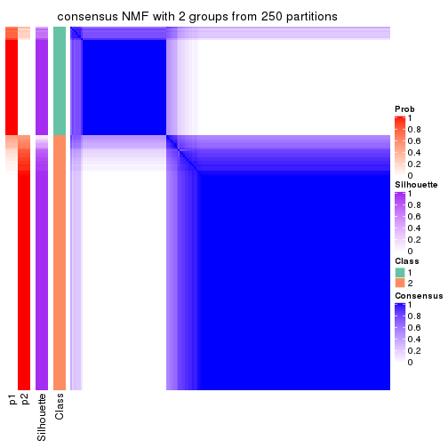</p>

</div>
<div id='tab-MAD-NMF-consensus-heatmap-2'>
<pre><code class="r">consensus_heatmap(res, k = 3)
</code></pre>

<p>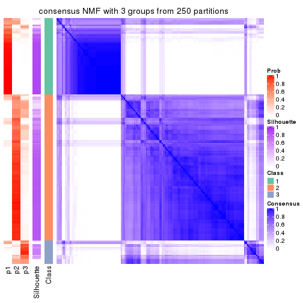</p>

</div>
<div id='tab-MAD-NMF-consensus-heatmap-3'>
<pre><code class="r">consensus_heatmap(res, k = 4)
</code></pre>

<p>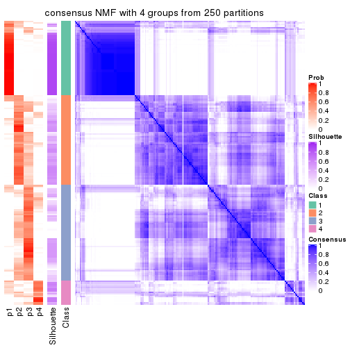</p>

</div>
<div id='tab-MAD-NMF-consensus-heatmap-4'>
<pre><code class="r">consensus_heatmap(res, k = 5)
</code></pre>

<p>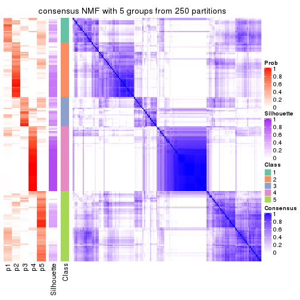</p>

</div>
<div id='tab-MAD-NMF-consensus-heatmap-5'>
<pre><code class="r">consensus_heatmap(res, k = 6)
</code></pre>

<p>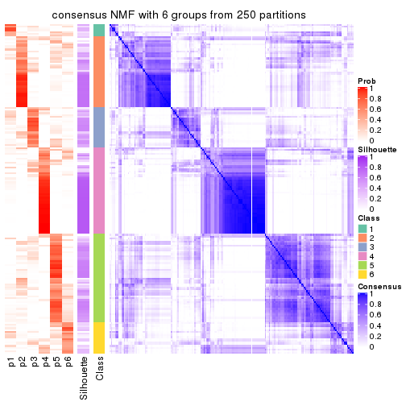</p>

</div>
</div>

Heatmaps for the membership of samples in all partitions to see how consistent they are:


<script>
$( function() {
	$( '#tabs-MAD-NMF-membership-heatmap' ).tabs();
} );
</script>
<div id='tabs-MAD-NMF-membership-heatmap'>
<ul>
<li><a href='#tab-MAD-NMF-membership-heatmap-1'>k = 2</a></li>
<li><a href='#tab-MAD-NMF-membership-heatmap-2'>k = 3</a></li>
<li><a href='#tab-MAD-NMF-membership-heatmap-3'>k = 4</a></li>
<li><a href='#tab-MAD-NMF-membership-heatmap-4'>k = 5</a></li>
<li><a href='#tab-MAD-NMF-membership-heatmap-5'>k = 6</a></li>
</ul>
<div id='tab-MAD-NMF-membership-heatmap-1'>
<pre><code class="r">membership_heatmap(res, k = 2)
</code></pre>

<p>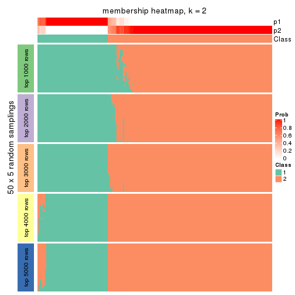</p>

</div>
<div id='tab-MAD-NMF-membership-heatmap-2'>
<pre><code class="r">membership_heatmap(res, k = 3)
</code></pre>

<p>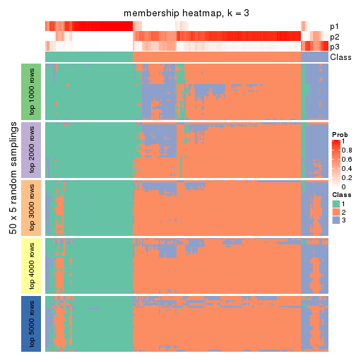</p>

</div>
<div id='tab-MAD-NMF-membership-heatmap-3'>
<pre><code class="r">membership_heatmap(res, k = 4)
</code></pre>

<p>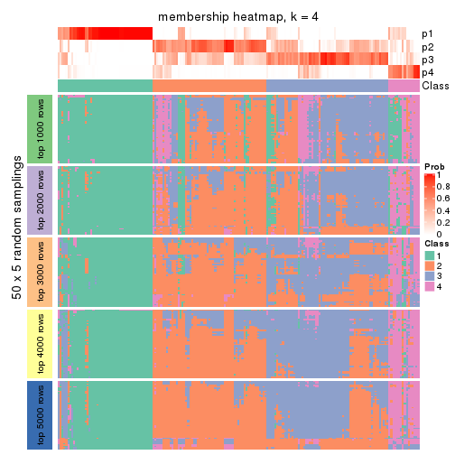</p>

</div>
<div id='tab-MAD-NMF-membership-heatmap-4'>
<pre><code class="r">membership_heatmap(res, k = 5)
</code></pre>

<p>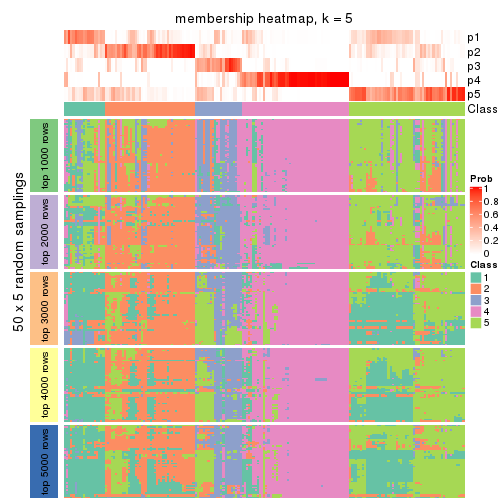</p>

</div>
<div id='tab-MAD-NMF-membership-heatmap-5'>
<pre><code class="r">membership_heatmap(res, k = 6)
</code></pre>

<p>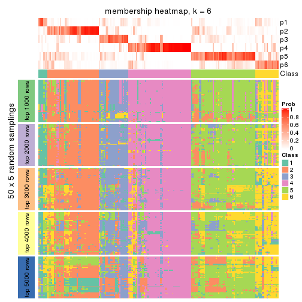</p>

</div>
</div>

As soon as we have had the classes for columns, we can look for signatures
which are significantly different between classes which can be candidate marks
for certain classes. Following are the heatmaps for signatures.


Signature heatmaps where rows are scaled:


<script>
$( function() {
	$( '#tabs-MAD-NMF-get-signatures' ).tabs();
} );
</script>
<div id='tabs-MAD-NMF-get-signatures'>
<ul>
<li><a href='#tab-MAD-NMF-get-signatures-1'>k = 2</a></li>
<li><a href='#tab-MAD-NMF-get-signatures-2'>k = 3</a></li>
<li><a href='#tab-MAD-NMF-get-signatures-3'>k = 4</a></li>
<li><a href='#tab-MAD-NMF-get-signatures-4'>k = 5</a></li>
<li><a href='#tab-MAD-NMF-get-signatures-5'>k = 6</a></li>
</ul>
<div id='tab-MAD-NMF-get-signatures-1'>
<pre><code class="r">get_signatures(res, k = 2)
</code></pre>

<p>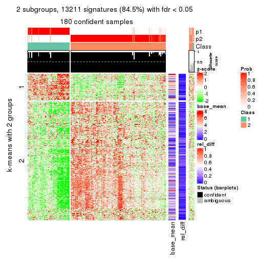</p>

</div>
<div id='tab-MAD-NMF-get-signatures-2'>
<pre><code class="r">get_signatures(res, k = 3)
</code></pre>

<p>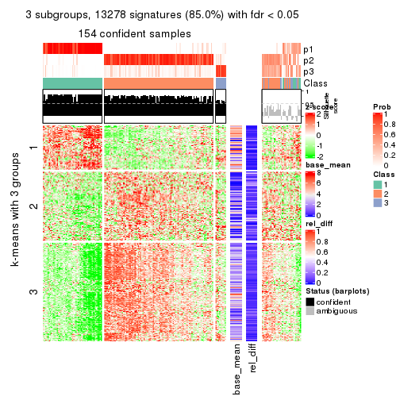</p>

</div>
<div id='tab-MAD-NMF-get-signatures-3'>
<pre><code class="r">get_signatures(res, k = 4)
</code></pre>

<p>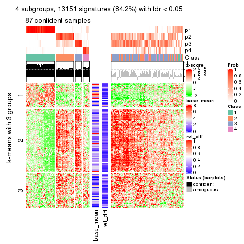</p>

</div>
<div id='tab-MAD-NMF-get-signatures-4'>
<pre><code class="r">get_signatures(res, k = 5)
</code></pre>

<p>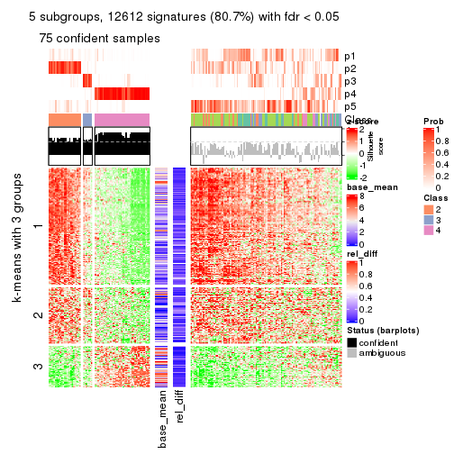</p>

</div>
<div id='tab-MAD-NMF-get-signatures-5'>
<pre><code class="r">get_signatures(res, k = 6)
</code></pre>

<p>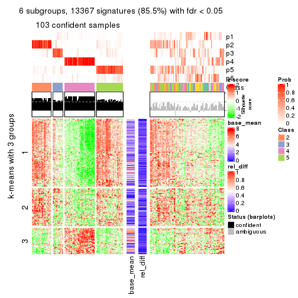</p>

</div>
</div>


Signature heatmaps where rows are not scaled:


<script>
$( function() {
	$( '#tabs-MAD-NMF-get-signatures-no-scale' ).tabs();
} );
</script>
<div id='tabs-MAD-NMF-get-signatures-no-scale'>
<ul>
<li><a href='#tab-MAD-NMF-get-signatures-no-scale-1'>k = 2</a></li>
<li><a href='#tab-MAD-NMF-get-signatures-no-scale-2'>k = 3</a></li>
<li><a href='#tab-MAD-NMF-get-signatures-no-scale-3'>k = 4</a></li>
<li><a href='#tab-MAD-NMF-get-signatures-no-scale-4'>k = 5</a></li>
<li><a href='#tab-MAD-NMF-get-signatures-no-scale-5'>k = 6</a></li>
</ul>
<div id='tab-MAD-NMF-get-signatures-no-scale-1'>
<pre><code class="r">get_signatures(res, k = 2, scale_rows = FALSE)
</code></pre>

<p>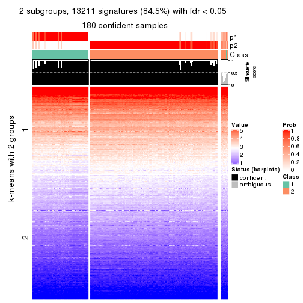</p>

</div>
<div id='tab-MAD-NMF-get-signatures-no-scale-2'>
<pre><code class="r">get_signatures(res, k = 3, scale_rows = FALSE)
</code></pre>

<p>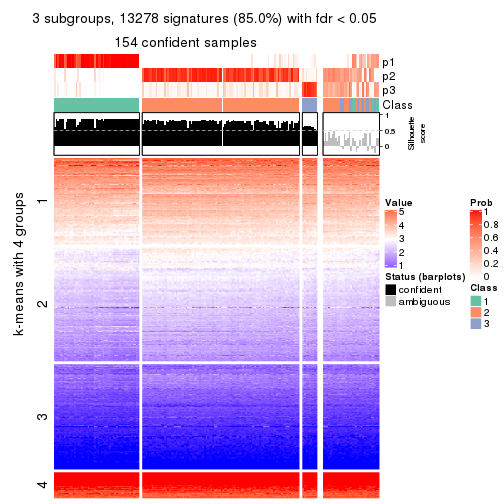</p>

</div>
<div id='tab-MAD-NMF-get-signatures-no-scale-3'>
<pre><code class="r">get_signatures(res, k = 4, scale_rows = FALSE)
</code></pre>

<p>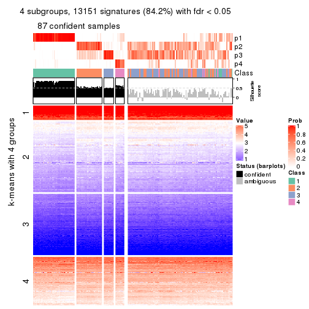</p>

</div>
<div id='tab-MAD-NMF-get-signatures-no-scale-4'>
<pre><code class="r">get_signatures(res, k = 5, scale_rows = FALSE)
</code></pre>

<p>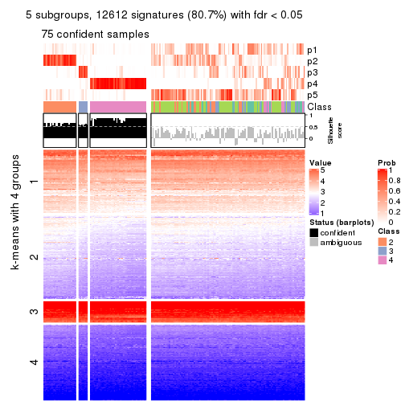</p>

</div>
<div id='tab-MAD-NMF-get-signatures-no-scale-5'>
<pre><code class="r">get_signatures(res, k = 6, scale_rows = FALSE)
</code></pre>

<p>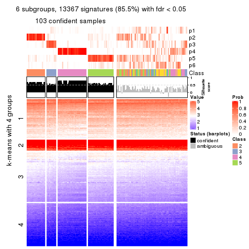</p>

</div>
</div>


Compare the overlap of signatures from different k:

```r
compare_signatures(res)
```

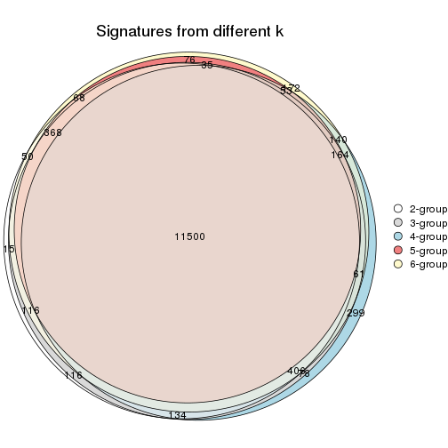

`get_signature()` returns a data frame invisibly. TO get the list of signatures, the function
call should be assigned to a variable explicitly. In following code, if `plot` argument is set
to `FALSE`, no heatmap is plotted while only the differential analysis is performed.

```r
# code only for demonstration
tb = get_signature(res, k = ..., plot = FALSE)
```

An example of the output of `tb` is:

```
#>   which_row         fdr    mean_1    mean_2 scaled_mean_1 scaled_mean_2 km
#> 1        38 0.042760348  8.373488  9.131774    -0.5533452     0.5164555  1
#> 2        40 0.018707592  7.106213  8.469186    -0.6173731     0.5762149  1
#> 3        55 0.019134737 10.221463 11.207825    -0.6159697     0.5749050  1
#> 4        59 0.006059896  5.921854  7.869574    -0.6899429     0.6439467  1
#> 5        60 0.018055526  8.928898 10.211722    -0.6204761     0.5791110  1
#> 6        98 0.009384629 15.714769 14.887706     0.6635654    -0.6193277  2
...
```

The columns in `tb` are:

1. `which_row`: row indices corresponding to the input matrix.
2. `fdr`: FDR for the differential test. 
3. `mean_x`: The mean value in group x.
4. `scaled_mean_x`: The mean value in group x after rows are scaled.
5. `km`: Row groups if k-means clustering is applied to rows.


UMAP plot which shows how samples are separated.


<script>
$( function() {
	$( '#tabs-MAD-NMF-dimension-reduction' ).tabs();
} );
</script>
<div id='tabs-MAD-NMF-dimension-reduction'>
<ul>
<li><a href='#tab-MAD-NMF-dimension-reduction-1'>k = 2</a></li>
<li><a href='#tab-MAD-NMF-dimension-reduction-2'>k = 3</a></li>
<li><a href='#tab-MAD-NMF-dimension-reduction-3'>k = 4</a></li>
<li><a href='#tab-MAD-NMF-dimension-reduction-4'>k = 5</a></li>
<li><a href='#tab-MAD-NMF-dimension-reduction-5'>k = 6</a></li>
</ul>
<div id='tab-MAD-NMF-dimension-reduction-1'>
<pre><code class="r">dimension_reduction(res, k = 2, method = &quot;UMAP&quot;)
</code></pre>

<p>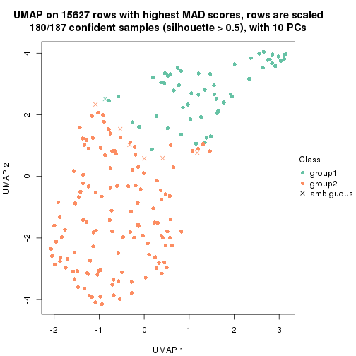</p>

</div>
<div id='tab-MAD-NMF-dimension-reduction-2'>
<pre><code class="r">dimension_reduction(res, k = 3, method = &quot;UMAP&quot;)
</code></pre>

<p>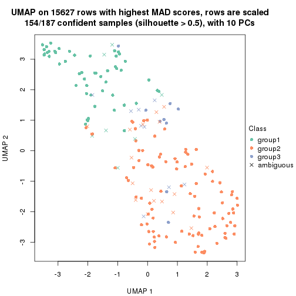</p>

</div>
<div id='tab-MAD-NMF-dimension-reduction-3'>
<pre><code class="r">dimension_reduction(res, k = 4, method = &quot;UMAP&quot;)
</code></pre>

<p>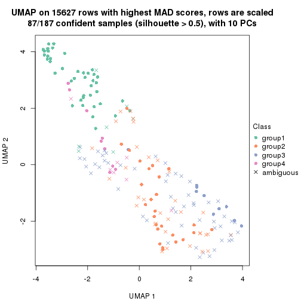</p>

</div>
<div id='tab-MAD-NMF-dimension-reduction-4'>
<pre><code class="r">dimension_reduction(res, k = 5, method = &quot;UMAP&quot;)
</code></pre>

<p>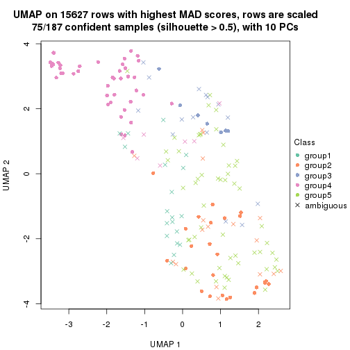</p>

</div>
<div id='tab-MAD-NMF-dimension-reduction-5'>
<pre><code class="r">dimension_reduction(res, k = 6, method = &quot;UMAP&quot;)
</code></pre>

<p>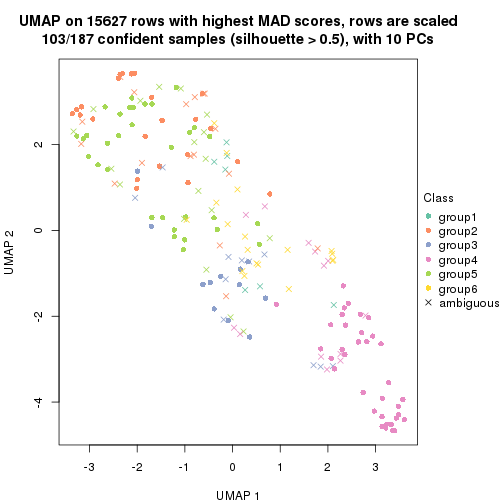</p>

</div>
</div>


Following heatmap shows how subgroups are split when increasing `k`:

```r
collect_classes(res)
```

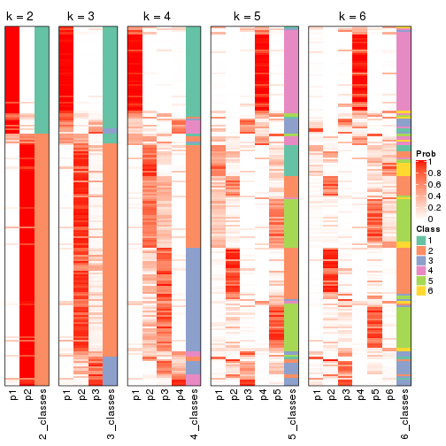


If matrix rows can be associated to genes, consider to use `GO_Enrichment(res,
...)` to perform function enrichment for the signature genes.


 

---------------------------------------------------


### ATC:hclust


The object with results only for a single top-value method and a single partition method 
can be extracted as:

```r
res = res_list["ATC", "hclust"]
# you can also extract it by
# res = res_list["ATC:hclust"]
```

A summary of `res` and all the functions that can be applied to it:

```r
res
```

```
#> A 'ConsensusPartition' object with k = 2, 3, 4, 5, 6.
#>   On a matrix with 15627 rows and 187 columns.
#>   Top rows (1000, 2000, 3000, 4000, 5000) are extracted by 'ATC' method.
#>   Subgroups are detected by 'hclust' method.
#>   Performed in total 1250 partitions by row resampling.
#>   Best k for subgroups seems to be 2.
#> 
#> Following methods can be applied to this 'ConsensusPartition' object:
#>  [1] "cola_report"             "collect_classes"         "collect_plots"          
#>  [4] "collect_stats"           "colnames"                "compare_signatures"     
#>  [7] "consensus_heatmap"       "dimension_reduction"     "functional_enrichment"  
#> [10] "get_anno_col"            "get_anno"                "get_classes"            
#> [13] "get_consensus"           "get_matrix"              "get_membership"         
#> [16] "get_param"               "get_signatures"          "get_stats"              
#> [19] "is_best_k"               "is_stable_k"             "membership_heatmap"     
#> [22] "ncol"                    "nrow"                    "plot_ecdf"              
#> [25] "rownames"                "select_partition_number" "show"                   
#> [28] "suggest_best_k"          "test_to_known_factors"
```

`collect_plots()` function collects all the plots made from `res` for all `k` (number of partitions)
into one single page to provide an easy and fast comparison between different `k`.

```r
collect_plots(res)
```

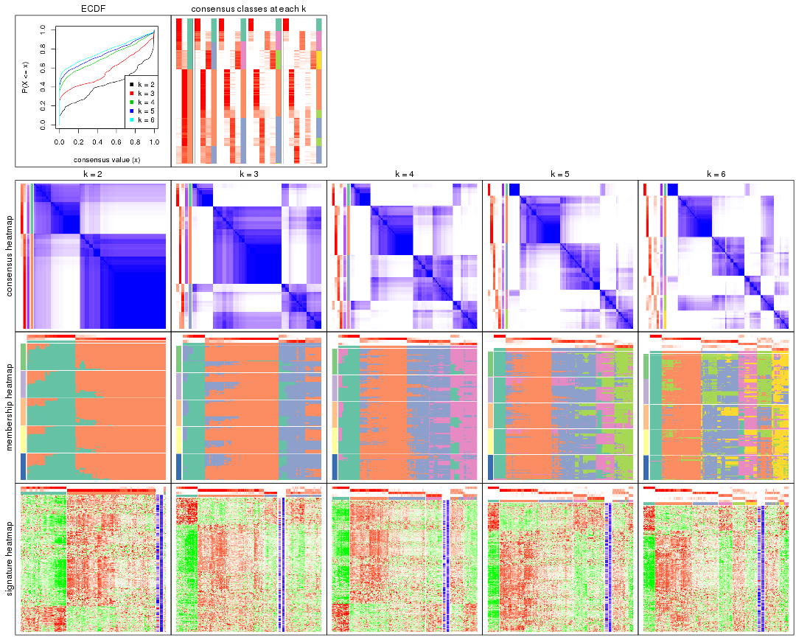

The plots are:

- The first row: a plot of the ECDF (Empirical cumulative distribution
  function) curves of the consensus matrix for each `k` and the heatmap of
  predicted classes for each `k`.
- The second row: heatmaps of the consensus matrix for each `k`.
- The third row: heatmaps of the membership matrix for each `k`.
- The fouth row: heatmaps of the signatures for each `k`.

All the plots in panels can be made by individual functions and they are
plotted later in this section.

`select_partition_number()` produces several plots showing different
statistics for choosing "optimized" `k`. There are following statistics:

- ECDF curves of the consensus matrix for each `k`;
- 1-PAC. [The PAC
  score](https://en.wikipedia.org/wiki/Consensus_clustering#Over-interpretation_potential_of_consensus_clustering)
  measures the proportion of the ambiguous subgrouping.
- Mean silhouette score.
- Concordance. The mean probability of fiting the consensus class ids in all
  partitions.
- Area increased. Denote $A_k$ as the area under the ECDF curve for current
  `k`, the area increased is defined as $A_k - A_{k-1}$.
- Rand index. The percent of pairs of samples that are both in a same cluster
  or both are not in a same cluster in the partition of k and k-1.
- Jaccard index. The ratio of pairs of samples are both in a same cluster in
  the partition of k and k-1 and the pairs of samples are both in a same
  cluster in the partition k or k-1.

The detailed explanations of these statistics can be found in [the cola
vignette](http://bioconductor.org/packages/devel/bioc/vignettes/cola/inst/doc/cola.html#toc_13).

Generally speaking, lower PAC score, higher mean silhouette score or higher
concordance corresponds to better partition. Rand index and Jaccard index
measure how similar the current partition is compared to partition with `k-1`.
If they are too similar, we won't accept `k` is better than `k-1`.

```r
select_partition_number(res)
```

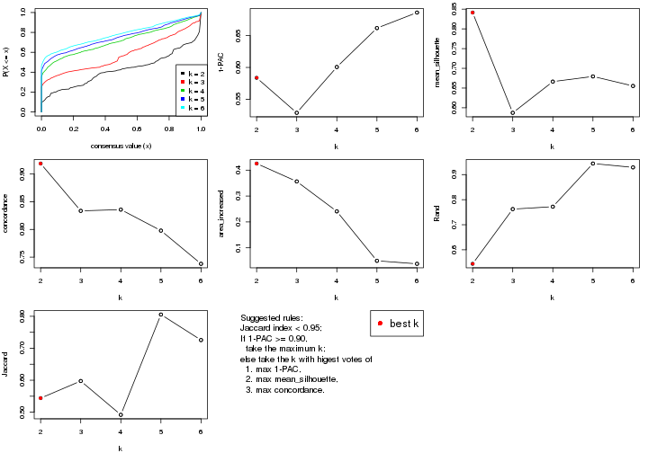

The numeric values for all these statistics can be obtained by `get_stats()`.

```r
get_stats(res)
```

```
#>   k 1-PAC mean_silhouette concordance area_increased  Rand Jaccard
#> 2 2 0.584           0.841       0.919         0.4255 0.544   0.544
#> 3 3 0.529           0.587       0.833         0.3564 0.762   0.598
#> 4 4 0.601           0.666       0.836         0.2407 0.772   0.492
#> 5 5 0.662           0.679       0.798         0.0498 0.944   0.805
#> 6 6 0.686           0.655       0.738         0.0382 0.929   0.726
```

`suggest_best_k()` suggests the best $k$ based on these statistics. The rules are as follows:

- All $k$ with Jaccard index larger than 0.95 are removed because the increase of
  the partition number does not provides enough extra information. If all $k$ are removed,
  the best $k$ is assigned by `NA`.
- For $k$ with 1-PAC larger than 0.9, the maximal $k$ is taken as the "best k". Other $k$ is called "optional k".
- If it does not fit the second rule. The $k$ with the highest vote of highest
  1-PAC, mean silhouette and concordance is taken as the "best k".

```r
suggest_best_k(res)
```

```
#> [1] 2
```


Following shows the table of the partitions (You need to click the **show/hide
code output** link to see it). The membership matrix (columns with name `p*`)
is inferred by
[`clue::cl_consensus()`](https://www.rdocumentation.org/link/cl_consensus?package=clue)
function with the `SE` method. Basically the value in the membership matrix
represents the probability to belong to a certain group. The finall class
label for an item is determined with the group with highest probability it
belongs to.

In `get_classes()` function, the entropy is calculated from the membership
matrix and the silhouette score is calculated from the consensus matrix.


<script>
$( function() {
	$( '#tabs-ATC-hclust-get-classes' ).tabs();
} );
</script>
<div id='tabs-ATC-hclust-get-classes'>
<ul>
<li><a href='#tab-ATC-hclust-get-classes-1'>k = 2</a></li>
<li><a href='#tab-ATC-hclust-get-classes-2'>k = 3</a></li>
<li><a href='#tab-ATC-hclust-get-classes-3'>k = 4</a></li>
<li><a href='#tab-ATC-hclust-get-classes-4'>k = 5</a></li>
<li><a href='#tab-ATC-hclust-get-classes-5'>k = 6</a></li>
</ul>

<div id='tab-ATC-hclust-get-classes-1'>
<p><a id='tab-ATC-hclust-get-classes-1-a' style='color:#0366d6' href='#'>show/hide code output</a></p>
<pre><code class="r">cbind(get_classes(res, k = 2), get_membership(res, k = 2))
</code></pre>

<pre><code>#&gt;            class entropy silhouette    p1    p2
#&gt; SRR1747213     1  0.9286      0.620 0.656 0.344
#&gt; SRR1747214     1  0.0000      0.839 1.000 0.000
#&gt; SRR1747215     2  0.0000      0.937 0.000 1.000
#&gt; SRR1747216     2  0.0000      0.937 0.000 1.000
#&gt; SRR1747217     2  0.5178      0.852 0.116 0.884
#&gt; SRR1747218     2  0.1184      0.931 0.016 0.984
#&gt; SRR1747219     2  0.7528      0.725 0.216 0.784
#&gt; SRR1747220     1  0.4815      0.821 0.896 0.104
#&gt; SRR1747221     1  0.8443      0.711 0.728 0.272
#&gt; SRR1747222     1  0.3879      0.833 0.924 0.076
#&gt; SRR1747223     1  0.8443      0.711 0.728 0.272
#&gt; SRR1747224     2  0.8327      0.636 0.264 0.736
#&gt; SRR1747225     2  0.1414      0.928 0.020 0.980
#&gt; SRR1747226     2  0.0000      0.937 0.000 1.000
#&gt; SRR1747227     2  0.0000      0.937 0.000 1.000
#&gt; SRR1747228     2  0.0938      0.933 0.012 0.988
#&gt; SRR1747229     2  0.0000      0.937 0.000 1.000
#&gt; SRR1747230     1  0.0000      0.839 1.000 0.000
#&gt; SRR1747231     1  0.9286      0.620 0.656 0.344
#&gt; SRR1747232     1  0.0000      0.839 1.000 0.000
#&gt; SRR1747233     1  0.1843      0.842 0.972 0.028
#&gt; SRR1747234     2  0.6712      0.785 0.176 0.824
#&gt; SRR1747235     1  0.0000      0.839 1.000 0.000
#&gt; SRR1747236     2  0.0000      0.937 0.000 1.000
#&gt; SRR1747237     2  0.0000      0.937 0.000 1.000
#&gt; SRR1747238     2  0.0000      0.937 0.000 1.000
#&gt; SRR1747239     2  0.0000      0.937 0.000 1.000
#&gt; SRR1747240     1  0.0000      0.839 1.000 0.000
#&gt; SRR1747241     2  0.0672      0.934 0.008 0.992
#&gt; SRR1747242     1  0.0000      0.839 1.000 0.000
#&gt; SRR1747243     1  0.9170      0.641 0.668 0.332
#&gt; SRR1747244     2  0.2423      0.917 0.040 0.960
#&gt; SRR1747245     2  0.0672      0.934 0.008 0.992
#&gt; SRR1747246     2  0.0000      0.937 0.000 1.000
#&gt; SRR1747247     1  0.0000      0.839 1.000 0.000
#&gt; SRR1747248     1  0.0000      0.839 1.000 0.000
#&gt; SRR1747249     1  0.1414      0.842 0.980 0.020
#&gt; SRR1747250     2  0.6712      0.785 0.176 0.824
#&gt; SRR1747252     1  0.8661      0.697 0.712 0.288
#&gt; SRR1747253     1  0.4431      0.827 0.908 0.092
#&gt; SRR1747254     2  0.0000      0.937 0.000 1.000
#&gt; SRR1747255     1  0.4431      0.827 0.908 0.092
#&gt; SRR1747256     1  0.3114      0.840 0.944 0.056
#&gt; SRR1747257     2  0.0000      0.937 0.000 1.000
#&gt; SRR1747258     2  0.1843      0.924 0.028 0.972
#&gt; SRR1747259     2  0.0000      0.937 0.000 1.000
#&gt; SRR1747260     2  0.6712      0.785 0.176 0.824
#&gt; SRR1747261     2  0.0672      0.935 0.008 0.992
#&gt; SRR1747262     2  0.0000      0.937 0.000 1.000
#&gt; SRR1747263     2  0.0000      0.937 0.000 1.000
#&gt; SRR1747264     1  0.0000      0.839 1.000 0.000
#&gt; SRR1747265     2  0.6712      0.785 0.176 0.824
#&gt; SRR1747266     2  0.1843      0.924 0.028 0.972
#&gt; SRR1747267     2  0.6712      0.785 0.176 0.824
#&gt; SRR1747268     2  0.9775      0.182 0.412 0.588
#&gt; SRR1747269     2  0.0000      0.937 0.000 1.000
#&gt; SRR1747270     2  0.0000      0.937 0.000 1.000
#&gt; SRR1747271     2  0.0000      0.937 0.000 1.000
#&gt; SRR1747272     1  0.9686      0.514 0.604 0.396
#&gt; SRR1747273     1  0.3274      0.839 0.940 0.060
#&gt; SRR1747274     2  0.1414      0.928 0.020 0.980
#&gt; SRR1747275     1  0.2948      0.841 0.948 0.052
#&gt; SRR1747276     1  0.2948      0.841 0.948 0.052
#&gt; SRR1747277     2  0.0000      0.937 0.000 1.000
#&gt; SRR1747278     2  0.5059      0.858 0.112 0.888
#&gt; SRR1747280     1  0.0000      0.839 1.000 0.000
#&gt; SRR1747279     1  0.1843      0.842 0.972 0.028
#&gt; SRR1747281     2  0.0000      0.937 0.000 1.000
#&gt; SRR1747282     1  0.2948      0.841 0.948 0.052
#&gt; SRR1747283     2  0.6887      0.774 0.184 0.816
#&gt; SRR1747284     1  0.0000      0.839 1.000 0.000
#&gt; SRR1747285     2  0.7528      0.725 0.216 0.784
#&gt; SRR1747286     2  0.1633      0.926 0.024 0.976
#&gt; SRR1747287     2  0.0000      0.937 0.000 1.000
#&gt; SRR1747288     1  0.9087      0.653 0.676 0.324
#&gt; SRR1747290     2  0.0000      0.937 0.000 1.000
#&gt; SRR1747289     2  0.0000      0.937 0.000 1.000
#&gt; SRR1747291     2  0.0000      0.937 0.000 1.000
#&gt; SRR1747293     2  0.2778      0.911 0.048 0.952
#&gt; SRR1747294     2  0.0000      0.937 0.000 1.000
#&gt; SRR1747292     1  0.1843      0.842 0.972 0.028
#&gt; SRR1747295     2  0.0000      0.937 0.000 1.000
#&gt; SRR1747296     2  0.0000      0.937 0.000 1.000
#&gt; SRR1747297     2  0.0000      0.937 0.000 1.000
#&gt; SRR1747298     2  0.0000      0.937 0.000 1.000
#&gt; SRR1747299     2  0.0000      0.937 0.000 1.000
#&gt; SRR1747300     2  0.0000      0.937 0.000 1.000
#&gt; SRR1747301     2  0.0000      0.937 0.000 1.000
#&gt; SRR1747302     2  0.0000      0.937 0.000 1.000
#&gt; SRR1747303     2  0.0000      0.937 0.000 1.000
#&gt; SRR1747304     1  0.0000      0.839 1.000 0.000
#&gt; SRR1747305     2  0.0000      0.937 0.000 1.000
#&gt; SRR1747306     2  0.0000      0.937 0.000 1.000
#&gt; SRR1747307     2  0.8267      0.645 0.260 0.740
#&gt; SRR1747308     2  0.0672      0.935 0.008 0.992
#&gt; SRR1747309     1  0.8443      0.711 0.728 0.272
#&gt; SRR1747310     1  0.0000      0.839 1.000 0.000
#&gt; SRR1747311     1  0.9044      0.659 0.680 0.320
#&gt; SRR1747313     1  0.9427      0.590 0.640 0.360
#&gt; SRR1747312     1  0.0000      0.839 1.000 0.000
#&gt; SRR1747314     1  0.0000      0.839 1.000 0.000
#&gt; SRR1747315     2  0.0000      0.937 0.000 1.000
#&gt; SRR1747316     2  0.0000      0.937 0.000 1.000
#&gt; SRR1747318     2  0.8661      0.585 0.288 0.712
#&gt; SRR1747317     2  0.8661      0.585 0.288 0.712
#&gt; SRR1747319     2  0.8267      0.645 0.260 0.740
#&gt; SRR1747320     1  0.2043      0.842 0.968 0.032
#&gt; SRR1747322     1  0.0000      0.839 1.000 0.000
#&gt; SRR1747321     1  0.0376      0.840 0.996 0.004
#&gt; SRR1747323     2  0.0000      0.937 0.000 1.000
#&gt; SRR1747324     2  0.0000      0.937 0.000 1.000
#&gt; SRR1747326     2  0.0000      0.937 0.000 1.000
#&gt; SRR1747325     2  0.0000      0.937 0.000 1.000
#&gt; SRR1747327     2  0.0000      0.937 0.000 1.000
#&gt; SRR1747328     2  0.2043      0.922 0.032 0.968
#&gt; SRR1747330     1  0.9393      0.598 0.644 0.356
#&gt; SRR1747329     2  0.0938      0.933 0.012 0.988
#&gt; SRR1747332     1  0.9000      0.664 0.684 0.316
#&gt; SRR1747331     2  0.0000      0.937 0.000 1.000
#&gt; SRR1747333     2  0.0938      0.933 0.012 0.988
#&gt; SRR1747334     2  0.0000      0.937 0.000 1.000
#&gt; SRR1747335     2  0.7056      0.763 0.192 0.808
#&gt; SRR1747336     1  0.0000      0.839 1.000 0.000
#&gt; SRR1747337     2  0.0000      0.937 0.000 1.000
#&gt; SRR1747338     2  0.0000      0.937 0.000 1.000
#&gt; SRR1747339     2  0.8555      0.602 0.280 0.720
#&gt; SRR1747340     2  0.2236      0.919 0.036 0.964
#&gt; SRR1747341     2  0.0000      0.937 0.000 1.000
#&gt; SRR1747342     2  0.0000      0.937 0.000 1.000
#&gt; SRR1747343     2  0.0000      0.937 0.000 1.000
#&gt; SRR1747344     2  0.0000      0.937 0.000 1.000
#&gt; SRR1747345     1  0.9248      0.628 0.660 0.340
#&gt; SRR1747346     2  0.6712      0.785 0.176 0.824
#&gt; SRR1747347     2  0.0000      0.937 0.000 1.000
#&gt; SRR1747348     1  0.0000      0.839 1.000 0.000
#&gt; SRR1747349     1  0.1843      0.842 0.972 0.028
#&gt; SRR1747351     2  0.0000      0.937 0.000 1.000
#&gt; SRR1747350     2  0.0000      0.937 0.000 1.000
#&gt; SRR1747352     1  0.0000      0.839 1.000 0.000
#&gt; SRR1747353     2  0.0000      0.937 0.000 1.000
#&gt; SRR1747354     2  0.6712      0.785 0.176 0.824
#&gt; SRR1747355     1  0.9491      0.573 0.632 0.368
#&gt; SRR1747356     2  0.5408      0.844 0.124 0.876
#&gt; SRR1747357     2  0.5519      0.841 0.128 0.872
#&gt; SRR1747358     2  0.5294      0.848 0.120 0.880
#&gt; SRR1747359     1  0.0000      0.839 1.000 0.000
#&gt; SRR1747360     2  0.0000      0.937 0.000 1.000
#&gt; SRR1747361     1  1.0000      0.190 0.504 0.496
#&gt; SRR1747362     2  0.0000      0.937 0.000 1.000
#&gt; SRR1747363     2  0.7453      0.731 0.212 0.788
#&gt; SRR1747364     1  0.8713      0.693 0.708 0.292
#&gt; SRR1747365     2  0.7056      0.763 0.192 0.808
#&gt; SRR1747366     2  0.0000      0.937 0.000 1.000
#&gt; SRR1747367     1  0.9323      0.613 0.652 0.348
#&gt; SRR1747369     2  0.0000      0.937 0.000 1.000
#&gt; SRR1747368     2  0.6712      0.785 0.176 0.824
#&gt; SRR1747370     2  0.2236      0.919 0.036 0.964
#&gt; SRR1747372     1  0.0000      0.839 1.000 0.000
#&gt; SRR1747371     1  0.8813      0.684 0.700 0.300
#&gt; SRR1747373     2  0.0000      0.937 0.000 1.000
#&gt; SRR1747374     2  0.0000      0.937 0.000 1.000
#&gt; SRR1747375     1  0.9044      0.659 0.680 0.320
#&gt; SRR1747376     2  0.0000      0.937 0.000 1.000
#&gt; SRR1747377     2  0.0000      0.937 0.000 1.000
#&gt; SRR1747378     2  0.0000      0.937 0.000 1.000
#&gt; SRR1747379     2  0.0938      0.933 0.012 0.988
#&gt; SRR1747380     2  0.6712      0.785 0.176 0.824
#&gt; SRR1747381     1  0.0000      0.839 1.000 0.000
#&gt; SRR1747382     1  0.2948      0.841 0.948 0.052
#&gt; SRR1747383     2  0.0000      0.937 0.000 1.000
#&gt; SRR1747384     2  0.7219      0.751 0.200 0.800
#&gt; SRR1747385     2  0.2778      0.911 0.048 0.952
#&gt; SRR1747386     1  0.0000      0.839 1.000 0.000
#&gt; SRR1747387     2  0.0000      0.937 0.000 1.000
#&gt; SRR1747388     2  0.0000      0.937 0.000 1.000
#&gt; SRR1747390     2  0.0000      0.937 0.000 1.000
#&gt; SRR1747389     2  0.0000      0.937 0.000 1.000
#&gt; SRR1747391     2  0.0000      0.937 0.000 1.000
#&gt; SRR1747392     2  0.0000      0.937 0.000 1.000
#&gt; SRR1747393     2  0.5408      0.844 0.124 0.876
#&gt; SRR1747394     1  0.8955      0.669 0.688 0.312
#&gt; SRR1747395     1  0.9977      0.291 0.528 0.472
#&gt; SRR1747396     2  0.0000      0.937 0.000 1.000
#&gt; SRR1747398     2  0.0000      0.937 0.000 1.000
#&gt; SRR1747397     1  0.9044      0.659 0.680 0.320
#&gt; SRR1747399     1  0.2948      0.841 0.948 0.052
#&gt; SRR1747400     1  0.8713      0.693 0.708 0.292
</code></pre>

<script>
$('#tab-ATC-hclust-get-classes-1-a').parent().next().next().hide();
$('#tab-ATC-hclust-get-classes-1-a').click(function(){
  $('#tab-ATC-hclust-get-classes-1-a').parent().next().next().toggle();
  return(false);
});
</script>
</div>

<div id='tab-ATC-hclust-get-classes-2'>
<p><a id='tab-ATC-hclust-get-classes-2-a' style='color:#0366d6' href='#'>show/hide code output</a></p>
<pre><code class="r">cbind(get_classes(res, k = 3), get_membership(res, k = 3))
</code></pre>

<pre><code>#&gt;            class entropy silhouette    p1    p2    p3
#&gt; SRR1747213     3  0.0237     0.5331 0.004 0.000 0.996
#&gt; SRR1747214     1  0.1964     0.8706 0.944 0.000 0.056
#&gt; SRR1747215     2  0.0000     0.8451 0.000 1.000 0.000
#&gt; SRR1747216     2  0.0000     0.8451 0.000 1.000 0.000
#&gt; SRR1747217     2  0.6252     0.2591 0.000 0.556 0.444
#&gt; SRR1747218     2  0.5397     0.6428 0.000 0.720 0.280
#&gt; SRR1747219     3  0.6235     0.1497 0.000 0.436 0.564
#&gt; SRR1747220     3  0.6168    -0.1831 0.412 0.000 0.588
#&gt; SRR1747221     3  0.3192     0.4447 0.112 0.000 0.888
#&gt; SRR1747222     3  0.6260    -0.2773 0.448 0.000 0.552
#&gt; SRR1747223     3  0.3192     0.4447 0.112 0.000 0.888
#&gt; SRR1747224     3  0.6079     0.2664 0.000 0.388 0.612
#&gt; SRR1747225     2  0.5706     0.5759 0.000 0.680 0.320
#&gt; SRR1747226     2  0.0000     0.8451 0.000 1.000 0.000
#&gt; SRR1747227     2  0.0000     0.8451 0.000 1.000 0.000
#&gt; SRR1747228     2  0.5529     0.6171 0.000 0.704 0.296
#&gt; SRR1747229     2  0.1529     0.8352 0.000 0.960 0.040
#&gt; SRR1747230     1  0.0000     0.8828 1.000 0.000 0.000
#&gt; SRR1747231     3  0.0237     0.5331 0.004 0.000 0.996
#&gt; SRR1747232     1  0.0000     0.8828 1.000 0.000 0.000
#&gt; SRR1747233     1  0.6180     0.5255 0.584 0.000 0.416
#&gt; SRR1747234     3  0.6302     0.0128 0.000 0.480 0.520
#&gt; SRR1747235     1  0.1411     0.8758 0.964 0.000 0.036
#&gt; SRR1747236     2  0.0000     0.8451 0.000 1.000 0.000
#&gt; SRR1747237     2  0.0000     0.8451 0.000 1.000 0.000
#&gt; SRR1747238     2  0.3412     0.8001 0.000 0.876 0.124
#&gt; SRR1747239     2  0.0000     0.8451 0.000 1.000 0.000
#&gt; SRR1747240     1  0.0000     0.8828 1.000 0.000 0.000
#&gt; SRR1747241     2  0.5138     0.6793 0.000 0.748 0.252
#&gt; SRR1747242     1  0.0000     0.8828 1.000 0.000 0.000
#&gt; SRR1747243     3  0.1031     0.5256 0.024 0.000 0.976
#&gt; SRR1747244     2  0.5926     0.5070 0.000 0.644 0.356
#&gt; SRR1747245     2  0.4796     0.7169 0.000 0.780 0.220
#&gt; SRR1747246     2  0.0000     0.8451 0.000 1.000 0.000
#&gt; SRR1747247     1  0.0000     0.8828 1.000 0.000 0.000
#&gt; SRR1747248     1  0.0000     0.8828 1.000 0.000 0.000
#&gt; SRR1747249     1  0.6062     0.5728 0.616 0.000 0.384
#&gt; SRR1747250     3  0.6302     0.0128 0.000 0.480 0.520
#&gt; SRR1747252     3  0.2356     0.4867 0.072 0.000 0.928
#&gt; SRR1747253     3  0.6215    -0.2247 0.428 0.000 0.572
#&gt; SRR1747254     2  0.0000     0.8451 0.000 1.000 0.000
#&gt; SRR1747255     3  0.6215    -0.2258 0.428 0.000 0.572
#&gt; SRR1747256     3  0.6295    -0.3386 0.472 0.000 0.528
#&gt; SRR1747257     2  0.0000     0.8451 0.000 1.000 0.000
#&gt; SRR1747258     2  0.5760     0.5621 0.000 0.672 0.328
#&gt; SRR1747259     2  0.0237     0.8451 0.000 0.996 0.004
#&gt; SRR1747260     3  0.6299     0.0278 0.000 0.476 0.524
#&gt; SRR1747261     2  0.5327     0.6529 0.000 0.728 0.272
#&gt; SRR1747262     2  0.2165     0.8294 0.000 0.936 0.064
#&gt; SRR1747263     2  0.0000     0.8451 0.000 1.000 0.000
#&gt; SRR1747264     1  0.0000     0.8828 1.000 0.000 0.000
#&gt; SRR1747265     3  0.6299     0.0278 0.000 0.476 0.524
#&gt; SRR1747266     2  0.5760     0.5621 0.000 0.672 0.328
#&gt; SRR1747267     3  0.6299     0.0278 0.000 0.476 0.524
#&gt; SRR1747268     3  0.5016     0.4888 0.000 0.240 0.760
#&gt; SRR1747269     2  0.3941     0.7772 0.000 0.844 0.156
#&gt; SRR1747270     2  0.0000     0.8451 0.000 1.000 0.000
#&gt; SRR1747271     2  0.4002     0.7751 0.000 0.840 0.160
#&gt; SRR1747272     3  0.2096     0.5469 0.004 0.052 0.944
#&gt; SRR1747273     3  0.6291    -0.3275 0.468 0.000 0.532
#&gt; SRR1747274     2  0.5650     0.5904 0.000 0.688 0.312
#&gt; SRR1747275     3  0.6302    -0.3489 0.480 0.000 0.520
#&gt; SRR1747276     3  0.6302    -0.3489 0.480 0.000 0.520
#&gt; SRR1747277     2  0.0237     0.8451 0.000 0.996 0.004
#&gt; SRR1747278     2  0.6267     0.2430 0.000 0.548 0.452
#&gt; SRR1747280     1  0.0000     0.8828 1.000 0.000 0.000
#&gt; SRR1747279     1  0.6180     0.5255 0.584 0.000 0.416
#&gt; SRR1747281     2  0.0000     0.8451 0.000 1.000 0.000
#&gt; SRR1747282     3  0.6299    -0.3424 0.476 0.000 0.524
#&gt; SRR1747283     3  0.6305    -0.0228 0.000 0.484 0.516
#&gt; SRR1747284     1  0.2959     0.8479 0.900 0.000 0.100
#&gt; SRR1747285     3  0.6235     0.1506 0.000 0.436 0.564
#&gt; SRR1747286     2  0.5497     0.6223 0.000 0.708 0.292
#&gt; SRR1747287     2  0.0237     0.8451 0.000 0.996 0.004
#&gt; SRR1747288     3  0.1031     0.5241 0.024 0.000 0.976
#&gt; SRR1747290     2  0.2537     0.8227 0.000 0.920 0.080
#&gt; SRR1747289     2  0.0000     0.8451 0.000 1.000 0.000
#&gt; SRR1747291     2  0.4555     0.7372 0.000 0.800 0.200
#&gt; SRR1747293     2  0.5988     0.4795 0.000 0.632 0.368
#&gt; SRR1747294     2  0.0000     0.8451 0.000 1.000 0.000
#&gt; SRR1747292     1  0.6204     0.5123 0.576 0.000 0.424
#&gt; SRR1747295     2  0.2625     0.8209 0.000 0.916 0.084
#&gt; SRR1747296     2  0.1411     0.8391 0.000 0.964 0.036
#&gt; SRR1747297     2  0.0000     0.8451 0.000 1.000 0.000
#&gt; SRR1747298     2  0.0000     0.8451 0.000 1.000 0.000
#&gt; SRR1747299     2  0.0000     0.8451 0.000 1.000 0.000
#&gt; SRR1747300     2  0.0237     0.8453 0.000 0.996 0.004
#&gt; SRR1747301     2  0.0747     0.8434 0.000 0.984 0.016
#&gt; SRR1747302     2  0.0000     0.8451 0.000 1.000 0.000
#&gt; SRR1747303     2  0.0237     0.8451 0.000 0.996 0.004
#&gt; SRR1747304     1  0.0000     0.8828 1.000 0.000 0.000
#&gt; SRR1747305     2  0.0000     0.8451 0.000 1.000 0.000
#&gt; SRR1747306     2  0.0000     0.8451 0.000 1.000 0.000
#&gt; SRR1747307     3  0.6095     0.2560 0.000 0.392 0.608
#&gt; SRR1747308     2  0.5291     0.6581 0.000 0.732 0.268
#&gt; SRR1747309     3  0.3192     0.4447 0.112 0.000 0.888
#&gt; SRR1747310     1  0.1860     0.8714 0.948 0.000 0.052
#&gt; SRR1747311     3  0.1163     0.5196 0.028 0.000 0.972
#&gt; SRR1747313     3  0.0592     0.5398 0.000 0.012 0.988
#&gt; SRR1747312     1  0.0000     0.8828 1.000 0.000 0.000
#&gt; SRR1747314     1  0.0000     0.8828 1.000 0.000 0.000
#&gt; SRR1747315     2  0.4654     0.7283 0.000 0.792 0.208
#&gt; SRR1747316     2  0.4654     0.7283 0.000 0.792 0.208
#&gt; SRR1747318     3  0.5968     0.3106 0.000 0.364 0.636
#&gt; SRR1747317     3  0.5968     0.3106 0.000 0.364 0.636
#&gt; SRR1747319     3  0.6095     0.2560 0.000 0.392 0.608
#&gt; SRR1747320     1  0.6260     0.4727 0.552 0.000 0.448
#&gt; SRR1747322     1  0.0000     0.8828 1.000 0.000 0.000
#&gt; SRR1747321     1  0.4346     0.7873 0.816 0.000 0.184
#&gt; SRR1747323     2  0.0000     0.8451 0.000 1.000 0.000
#&gt; SRR1747324     2  0.2796     0.8171 0.000 0.908 0.092
#&gt; SRR1747326     2  0.0000     0.8451 0.000 1.000 0.000
#&gt; SRR1747325     2  0.0000     0.8451 0.000 1.000 0.000
#&gt; SRR1747327     2  0.0000     0.8451 0.000 1.000 0.000
#&gt; SRR1747328     2  0.5810     0.5457 0.000 0.664 0.336
#&gt; SRR1747330     3  0.0424     0.5383 0.000 0.008 0.992
#&gt; SRR1747329     2  0.5363     0.6467 0.000 0.724 0.276
#&gt; SRR1747332     3  0.1289     0.5181 0.032 0.000 0.968
#&gt; SRR1747331     2  0.3941     0.7772 0.000 0.844 0.156
#&gt; SRR1747333     2  0.5497     0.6236 0.000 0.708 0.292
#&gt; SRR1747334     2  0.0237     0.8453 0.000 0.996 0.004
#&gt; SRR1747335     3  0.6295     0.0248 0.000 0.472 0.528
#&gt; SRR1747336     1  0.0000     0.8828 1.000 0.000 0.000
#&gt; SRR1747337     2  0.0000     0.8451 0.000 1.000 0.000
#&gt; SRR1747338     2  0.0000     0.8451 0.000 1.000 0.000
#&gt; SRR1747339     3  0.6008     0.2969 0.000 0.372 0.628
#&gt; SRR1747340     2  0.5882     0.5229 0.000 0.652 0.348
#&gt; SRR1747341     2  0.0000     0.8451 0.000 1.000 0.000
#&gt; SRR1747342     2  0.0000     0.8451 0.000 1.000 0.000
#&gt; SRR1747343     2  0.0000     0.8451 0.000 1.000 0.000
#&gt; SRR1747344     2  0.2796     0.8171 0.000 0.908 0.092
#&gt; SRR1747345     3  0.0829     0.5314 0.012 0.004 0.984
#&gt; SRR1747346     3  0.6299     0.0278 0.000 0.476 0.524
#&gt; SRR1747347     2  0.0000     0.8451 0.000 1.000 0.000
#&gt; SRR1747348     1  0.0000     0.8828 1.000 0.000 0.000
#&gt; SRR1747349     1  0.6180     0.5255 0.584 0.000 0.416
#&gt; SRR1747351     2  0.0000     0.8451 0.000 1.000 0.000
#&gt; SRR1747350     2  0.2165     0.8294 0.000 0.936 0.064
#&gt; SRR1747352     1  0.1964     0.8706 0.944 0.000 0.056
#&gt; SRR1747353     2  0.3116     0.8090 0.000 0.892 0.108
#&gt; SRR1747354     3  0.6302     0.0128 0.000 0.480 0.520
#&gt; SRR1747355     3  0.1267     0.5434 0.004 0.024 0.972
#&gt; SRR1747356     2  0.6274     0.2202 0.000 0.544 0.456
#&gt; SRR1747357     2  0.6286     0.1951 0.000 0.536 0.464
#&gt; SRR1747358     2  0.6274     0.2218 0.000 0.544 0.456
#&gt; SRR1747359     1  0.4121     0.8006 0.832 0.000 0.168
#&gt; SRR1747360     2  0.2165     0.8294 0.000 0.936 0.064
#&gt; SRR1747361     3  0.3816     0.5619 0.000 0.148 0.852
#&gt; SRR1747362     2  0.2165     0.8294 0.000 0.936 0.064
#&gt; SRR1747363     3  0.6267     0.0909 0.000 0.452 0.548
#&gt; SRR1747364     3  0.2165     0.4933 0.064 0.000 0.936
#&gt; SRR1747365     3  0.6299     0.0087 0.000 0.476 0.524
#&gt; SRR1747366     2  0.2165     0.8294 0.000 0.936 0.064
#&gt; SRR1747367     3  0.0848     0.5369 0.008 0.008 0.984
#&gt; SRR1747369     2  0.0000     0.8451 0.000 1.000 0.000
#&gt; SRR1747368     3  0.6299     0.0278 0.000 0.476 0.524
#&gt; SRR1747370     2  0.5905     0.5133 0.000 0.648 0.352
#&gt; SRR1747372     1  0.0000     0.8828 1.000 0.000 0.000
#&gt; SRR1747371     3  0.1964     0.5021 0.056 0.000 0.944
#&gt; SRR1747373     2  0.0000     0.8451 0.000 1.000 0.000
#&gt; SRR1747374     2  0.0000     0.8451 0.000 1.000 0.000
#&gt; SRR1747375     3  0.1163     0.5220 0.028 0.000 0.972
#&gt; SRR1747376     2  0.0237     0.8453 0.000 0.996 0.004
#&gt; SRR1747377     2  0.0000     0.8451 0.000 1.000 0.000
#&gt; SRR1747378     2  0.3752     0.7864 0.000 0.856 0.144
#&gt; SRR1747379     2  0.5529     0.6171 0.000 0.704 0.296
#&gt; SRR1747380     3  0.6299     0.0278 0.000 0.476 0.524
#&gt; SRR1747381     1  0.1964     0.8706 0.944 0.000 0.056
#&gt; SRR1747382     3  0.6308    -0.3681 0.492 0.000 0.508
#&gt; SRR1747383     2  0.0000     0.8451 0.000 1.000 0.000
#&gt; SRR1747384     3  0.6280     0.0677 0.000 0.460 0.540
#&gt; SRR1747385     2  0.6008     0.4697 0.000 0.628 0.372
#&gt; SRR1747386     1  0.0000     0.8828 1.000 0.000 0.000
#&gt; SRR1747387     2  0.0000     0.8451 0.000 1.000 0.000
#&gt; SRR1747388     2  0.0237     0.8453 0.000 0.996 0.004
#&gt; SRR1747390     2  0.3816     0.7833 0.000 0.852 0.148
#&gt; SRR1747389     2  0.3816     0.7833 0.000 0.852 0.148
#&gt; SRR1747391     2  0.0237     0.8453 0.000 0.996 0.004
#&gt; SRR1747392     2  0.0237     0.8453 0.000 0.996 0.004
#&gt; SRR1747393     2  0.6267     0.2341 0.000 0.548 0.452
#&gt; SRR1747394     3  0.1529     0.5140 0.040 0.000 0.960
#&gt; SRR1747395     3  0.3412     0.5578 0.000 0.124 0.876
#&gt; SRR1747396     2  0.0237     0.8453 0.000 0.996 0.004
#&gt; SRR1747398     2  0.0237     0.8453 0.000 0.996 0.004
#&gt; SRR1747397     3  0.1163     0.5220 0.028 0.000 0.972
#&gt; SRR1747399     3  0.6307    -0.3616 0.488 0.000 0.512
#&gt; SRR1747400     3  0.2165     0.4933 0.064 0.000 0.936
</code></pre>

<script>
$('#tab-ATC-hclust-get-classes-2-a').parent().next().next().hide();
$('#tab-ATC-hclust-get-classes-2-a').click(function(){
  $('#tab-ATC-hclust-get-classes-2-a').parent().next().next().toggle();
  return(false);
});
</script>
</div>

<div id='tab-ATC-hclust-get-classes-3'>
<p><a id='tab-ATC-hclust-get-classes-3-a' style='color:#0366d6' href='#'>show/hide code output</a></p>
<pre><code class="r">cbind(get_classes(res, k = 4), get_membership(res, k = 4))
</code></pre>

<pre><code>#&gt;            class entropy silhouette    p1    p2    p3    p4
#&gt; SRR1747213     4  0.3074     0.7006 0.000 0.000 0.152 0.848
#&gt; SRR1747214     1  0.2011     0.8241 0.920 0.000 0.000 0.080
#&gt; SRR1747215     2  0.0000     0.8516 0.000 1.000 0.000 0.000
#&gt; SRR1747216     2  0.0000     0.8516 0.000 1.000 0.000 0.000
#&gt; SRR1747217     3  0.3266     0.7652 0.000 0.024 0.868 0.108
#&gt; SRR1747218     3  0.3529     0.7180 0.000 0.152 0.836 0.012
#&gt; SRR1747219     3  0.3801     0.6943 0.000 0.000 0.780 0.220
#&gt; SRR1747220     4  0.4889     0.3551 0.360 0.000 0.004 0.636
#&gt; SRR1747221     4  0.2300     0.6990 0.064 0.000 0.016 0.920
#&gt; SRR1747222     4  0.5016     0.2867 0.396 0.000 0.004 0.600
#&gt; SRR1747223     4  0.2300     0.6990 0.064 0.000 0.016 0.920
#&gt; SRR1747224     3  0.4304     0.6205 0.000 0.000 0.716 0.284
#&gt; SRR1747225     3  0.2271     0.7682 0.000 0.076 0.916 0.008
#&gt; SRR1747226     2  0.0000     0.8516 0.000 1.000 0.000 0.000
#&gt; SRR1747227     2  0.0000     0.8516 0.000 1.000 0.000 0.000
#&gt; SRR1747228     3  0.2654     0.7496 0.000 0.108 0.888 0.004
#&gt; SRR1747229     2  0.4454     0.6076 0.000 0.692 0.308 0.000
#&gt; SRR1747230     1  0.0000     0.8529 1.000 0.000 0.000 0.000
#&gt; SRR1747231     4  0.3074     0.7006 0.000 0.000 0.152 0.848
#&gt; SRR1747232     1  0.0000     0.8529 1.000 0.000 0.000 0.000
#&gt; SRR1747233     1  0.4989     0.1047 0.528 0.000 0.000 0.472
#&gt; SRR1747234     3  0.3356     0.7318 0.000 0.000 0.824 0.176
#&gt; SRR1747235     1  0.1637     0.8332 0.940 0.000 0.000 0.060
#&gt; SRR1747236     2  0.3219     0.7878 0.000 0.836 0.164 0.000
#&gt; SRR1747237     2  0.0000     0.8516 0.000 1.000 0.000 0.000
#&gt; SRR1747238     3  0.4972     0.0204 0.000 0.456 0.544 0.000
#&gt; SRR1747239     2  0.0000     0.8516 0.000 1.000 0.000 0.000
#&gt; SRR1747240     1  0.0000     0.8529 1.000 0.000 0.000 0.000
#&gt; SRR1747241     3  0.3726     0.6660 0.000 0.212 0.788 0.000
#&gt; SRR1747242     1  0.0000     0.8529 1.000 0.000 0.000 0.000
#&gt; SRR1747243     4  0.2654     0.7160 0.004 0.000 0.108 0.888
#&gt; SRR1747244     3  0.2089     0.7752 0.000 0.048 0.932 0.020
#&gt; SRR1747245     3  0.4164     0.5922 0.000 0.264 0.736 0.000
#&gt; SRR1747246     2  0.0921     0.8504 0.000 0.972 0.028 0.000
#&gt; SRR1747247     1  0.0000     0.8529 1.000 0.000 0.000 0.000
#&gt; SRR1747248     1  0.0000     0.8529 1.000 0.000 0.000 0.000
#&gt; SRR1747249     1  0.4925     0.2261 0.572 0.000 0.000 0.428
#&gt; SRR1747250     3  0.3356     0.7318 0.000 0.000 0.824 0.176
#&gt; SRR1747252     4  0.2131     0.7194 0.036 0.000 0.032 0.932
#&gt; SRR1747253     4  0.4950     0.3259 0.376 0.000 0.004 0.620
#&gt; SRR1747254     2  0.0000     0.8516 0.000 1.000 0.000 0.000
#&gt; SRR1747255     4  0.4936     0.3327 0.372 0.000 0.004 0.624
#&gt; SRR1747256     4  0.5080     0.2271 0.420 0.000 0.004 0.576
#&gt; SRR1747257     2  0.0817     0.8507 0.000 0.976 0.024 0.000
#&gt; SRR1747258     3  0.2179     0.7737 0.000 0.064 0.924 0.012
#&gt; SRR1747259     2  0.3400     0.7721 0.000 0.820 0.180 0.000
#&gt; SRR1747260     3  0.3400     0.7295 0.000 0.000 0.820 0.180
#&gt; SRR1747261     3  0.2944     0.7352 0.000 0.128 0.868 0.004
#&gt; SRR1747262     2  0.4925     0.3603 0.000 0.572 0.428 0.000
#&gt; SRR1747263     2  0.0000     0.8516 0.000 1.000 0.000 0.000
#&gt; SRR1747264     1  0.0000     0.8529 1.000 0.000 0.000 0.000
#&gt; SRR1747265     3  0.3400     0.7295 0.000 0.000 0.820 0.180
#&gt; SRR1747266     3  0.2179     0.7737 0.000 0.064 0.924 0.012
#&gt; SRR1747267     3  0.3400     0.7295 0.000 0.000 0.820 0.180
#&gt; SRR1747268     3  0.4998     0.1066 0.000 0.000 0.512 0.488
#&gt; SRR1747269     3  0.4564     0.4152 0.000 0.328 0.672 0.000
#&gt; SRR1747270     2  0.1792     0.8414 0.000 0.932 0.068 0.000
#&gt; SRR1747271     3  0.4697     0.3558 0.000 0.356 0.644 0.000
#&gt; SRR1747272     4  0.3975     0.6114 0.000 0.000 0.240 0.760
#&gt; SRR1747273     4  0.5070     0.2348 0.416 0.000 0.004 0.580
#&gt; SRR1747274     3  0.2412     0.7652 0.000 0.084 0.908 0.008
#&gt; SRR1747275     4  0.4907     0.2244 0.420 0.000 0.000 0.580
#&gt; SRR1747276     4  0.4907     0.2244 0.420 0.000 0.000 0.580
#&gt; SRR1747277     2  0.3400     0.7721 0.000 0.820 0.180 0.000
#&gt; SRR1747278     3  0.2714     0.7587 0.000 0.004 0.884 0.112
#&gt; SRR1747280     1  0.0000     0.8529 1.000 0.000 0.000 0.000
#&gt; SRR1747279     1  0.4989     0.1047 0.528 0.000 0.000 0.472
#&gt; SRR1747281     2  0.1637     0.8435 0.000 0.940 0.060 0.000
#&gt; SRR1747282     4  0.4898     0.2347 0.416 0.000 0.000 0.584
#&gt; SRR1747283     3  0.3725     0.7240 0.000 0.008 0.812 0.180
#&gt; SRR1747284     1  0.2760     0.7857 0.872 0.000 0.000 0.128
#&gt; SRR1747285     3  0.3907     0.6823 0.000 0.000 0.768 0.232
#&gt; SRR1747286     3  0.2081     0.7621 0.000 0.084 0.916 0.000
#&gt; SRR1747287     2  0.1389     0.8465 0.000 0.952 0.048 0.000
#&gt; SRR1747288     4  0.1792     0.7269 0.000 0.000 0.068 0.932
#&gt; SRR1747290     2  0.4992     0.2278 0.000 0.524 0.476 0.000
#&gt; SRR1747289     2  0.0469     0.8517 0.000 0.988 0.012 0.000
#&gt; SRR1747291     3  0.3907     0.6119 0.000 0.232 0.768 0.000
#&gt; SRR1747293     3  0.2670     0.7772 0.000 0.052 0.908 0.040
#&gt; SRR1747294     2  0.2081     0.8343 0.000 0.916 0.084 0.000
#&gt; SRR1747292     1  0.4994     0.0820 0.520 0.000 0.000 0.480
#&gt; SRR1747295     2  0.4994     0.2102 0.000 0.520 0.480 0.000
#&gt; SRR1747296     2  0.4382     0.6162 0.000 0.704 0.296 0.000
#&gt; SRR1747297     2  0.0000     0.8516 0.000 1.000 0.000 0.000
#&gt; SRR1747298     2  0.1302     0.8476 0.000 0.956 0.044 0.000
#&gt; SRR1747299     2  0.0921     0.8501 0.000 0.972 0.028 0.000
#&gt; SRR1747300     2  0.2973     0.8008 0.000 0.856 0.144 0.000
#&gt; SRR1747301     2  0.3172     0.7872 0.000 0.840 0.160 0.000
#&gt; SRR1747302     2  0.0000     0.8516 0.000 1.000 0.000 0.000
#&gt; SRR1747303     2  0.2011     0.8368 0.000 0.920 0.080 0.000
#&gt; SRR1747304     1  0.0000     0.8529 1.000 0.000 0.000 0.000
#&gt; SRR1747305     2  0.0000     0.8516 0.000 1.000 0.000 0.000
#&gt; SRR1747306     2  0.0000     0.8516 0.000 1.000 0.000 0.000
#&gt; SRR1747307     3  0.4250     0.6409 0.000 0.000 0.724 0.276
#&gt; SRR1747308     3  0.2999     0.7319 0.000 0.132 0.864 0.004
#&gt; SRR1747309     4  0.2300     0.6990 0.064 0.000 0.016 0.920
#&gt; SRR1747310     1  0.1940     0.8255 0.924 0.000 0.000 0.076
#&gt; SRR1747311     4  0.1211     0.7239 0.000 0.000 0.040 0.960
#&gt; SRR1747313     4  0.3123     0.6951 0.000 0.000 0.156 0.844
#&gt; SRR1747312     1  0.0000     0.8529 1.000 0.000 0.000 0.000
#&gt; SRR1747314     1  0.0000     0.8529 1.000 0.000 0.000 0.000
#&gt; SRR1747315     3  0.4008     0.5984 0.000 0.244 0.756 0.000
#&gt; SRR1747316     3  0.4008     0.5984 0.000 0.244 0.756 0.000
#&gt; SRR1747318     3  0.4522     0.5762 0.000 0.000 0.680 0.320
#&gt; SRR1747317     3  0.4522     0.5762 0.000 0.000 0.680 0.320
#&gt; SRR1747319     3  0.4250     0.6409 0.000 0.000 0.724 0.276
#&gt; SRR1747320     4  0.5000    -0.0533 0.496 0.000 0.000 0.504
#&gt; SRR1747322     1  0.0000     0.8529 1.000 0.000 0.000 0.000
#&gt; SRR1747321     1  0.3801     0.6816 0.780 0.000 0.000 0.220
#&gt; SRR1747323     2  0.0000     0.8516 0.000 1.000 0.000 0.000
#&gt; SRR1747324     2  0.4994     0.2104 0.000 0.520 0.480 0.000
#&gt; SRR1747326     2  0.2530     0.8213 0.000 0.888 0.112 0.000
#&gt; SRR1747325     2  0.0000     0.8516 0.000 1.000 0.000 0.000
#&gt; SRR1747327     2  0.0000     0.8516 0.000 1.000 0.000 0.000
#&gt; SRR1747328     3  0.2060     0.7741 0.000 0.052 0.932 0.016
#&gt; SRR1747330     4  0.3024     0.7023 0.000 0.000 0.148 0.852
#&gt; SRR1747329     3  0.3052     0.7288 0.000 0.136 0.860 0.004
#&gt; SRR1747332     4  0.1118     0.7239 0.000 0.000 0.036 0.964
#&gt; SRR1747331     3  0.4564     0.4152 0.000 0.328 0.672 0.000
#&gt; SRR1747333     3  0.2773     0.7448 0.000 0.116 0.880 0.004
#&gt; SRR1747334     2  0.3444     0.7697 0.000 0.816 0.184 0.000
#&gt; SRR1747335     3  0.3710     0.7146 0.000 0.004 0.804 0.192
#&gt; SRR1747336     1  0.0000     0.8529 1.000 0.000 0.000 0.000
#&gt; SRR1747337     2  0.0000     0.8516 0.000 1.000 0.000 0.000
#&gt; SRR1747338     2  0.0000     0.8516 0.000 1.000 0.000 0.000
#&gt; SRR1747339     3  0.4454     0.5887 0.000 0.000 0.692 0.308
#&gt; SRR1747340     3  0.2797     0.7779 0.000 0.068 0.900 0.032
#&gt; SRR1747341     2  0.0000     0.8516 0.000 1.000 0.000 0.000
#&gt; SRR1747342     2  0.0000     0.8516 0.000 1.000 0.000 0.000
#&gt; SRR1747343     2  0.0000     0.8516 0.000 1.000 0.000 0.000
#&gt; SRR1747344     2  0.4994     0.2104 0.000 0.520 0.480 0.000
#&gt; SRR1747345     4  0.1792     0.7261 0.000 0.000 0.068 0.932
#&gt; SRR1747346     3  0.3400     0.7295 0.000 0.000 0.820 0.180
#&gt; SRR1747347     2  0.0000     0.8516 0.000 1.000 0.000 0.000
#&gt; SRR1747348     1  0.0000     0.8529 1.000 0.000 0.000 0.000
#&gt; SRR1747349     1  0.4989     0.1047 0.528 0.000 0.000 0.472
#&gt; SRR1747351     2  0.0469     0.8514 0.000 0.988 0.012 0.000
#&gt; SRR1747350     2  0.4916     0.3688 0.000 0.576 0.424 0.000
#&gt; SRR1747352     1  0.2011     0.8241 0.920 0.000 0.000 0.080
#&gt; SRR1747353     2  0.4994     0.2013 0.000 0.520 0.480 0.000
#&gt; SRR1747354     3  0.3356     0.7318 0.000 0.000 0.824 0.176
#&gt; SRR1747355     4  0.3356     0.6708 0.000 0.000 0.176 0.824
#&gt; SRR1747356     3  0.3384     0.7638 0.000 0.024 0.860 0.116
#&gt; SRR1747357     3  0.3497     0.7619 0.000 0.024 0.852 0.124
#&gt; SRR1747358     3  0.3384     0.7639 0.000 0.024 0.860 0.116
#&gt; SRR1747359     1  0.3528     0.7082 0.808 0.000 0.000 0.192
#&gt; SRR1747360     2  0.4916     0.3688 0.000 0.576 0.424 0.000
#&gt; SRR1747361     4  0.4855     0.2276 0.000 0.000 0.400 0.600
#&gt; SRR1747362     2  0.4948     0.3274 0.000 0.560 0.440 0.000
#&gt; SRR1747363     3  0.4018     0.6840 0.000 0.004 0.772 0.224
#&gt; SRR1747364     4  0.1936     0.7215 0.028 0.000 0.032 0.940
#&gt; SRR1747365     3  0.3668     0.7164 0.000 0.004 0.808 0.188
#&gt; SRR1747366     2  0.4941     0.3414 0.000 0.564 0.436 0.000
#&gt; SRR1747367     4  0.2704     0.7113 0.000 0.000 0.124 0.876
#&gt; SRR1747369     2  0.0000     0.8516 0.000 1.000 0.000 0.000
#&gt; SRR1747368     3  0.3400     0.7295 0.000 0.000 0.820 0.180
#&gt; SRR1747370     3  0.1798     0.7717 0.000 0.040 0.944 0.016
#&gt; SRR1747372     1  0.0000     0.8529 1.000 0.000 0.000 0.000
#&gt; SRR1747371     4  0.2060     0.7289 0.016 0.000 0.052 0.932
#&gt; SRR1747373     2  0.0188     0.8516 0.000 0.996 0.004 0.000
#&gt; SRR1747374     2  0.0000     0.8516 0.000 1.000 0.000 0.000
#&gt; SRR1747375     4  0.1716     0.7276 0.000 0.000 0.064 0.936
#&gt; SRR1747376     2  0.2469     0.8208 0.000 0.892 0.108 0.000
#&gt; SRR1747377     2  0.0000     0.8516 0.000 1.000 0.000 0.000
#&gt; SRR1747378     3  0.4830     0.2464 0.000 0.392 0.608 0.000
#&gt; SRR1747379     3  0.2654     0.7496 0.000 0.108 0.888 0.004
#&gt; SRR1747380     3  0.3400     0.7295 0.000 0.000 0.820 0.180
#&gt; SRR1747381     1  0.2011     0.8241 0.920 0.000 0.000 0.080
#&gt; SRR1747382     4  0.4933     0.1930 0.432 0.000 0.000 0.568
#&gt; SRR1747383     2  0.1474     0.8456 0.000 0.948 0.052 0.000
#&gt; SRR1747384     3  0.3831     0.7094 0.000 0.004 0.792 0.204
#&gt; SRR1747385     3  0.2759     0.7772 0.000 0.052 0.904 0.044
#&gt; SRR1747386     1  0.0000     0.8529 1.000 0.000 0.000 0.000
#&gt; SRR1747387     2  0.0000     0.8516 0.000 1.000 0.000 0.000
#&gt; SRR1747388     2  0.3444     0.7697 0.000 0.816 0.184 0.000
#&gt; SRR1747390     3  0.4855     0.2326 0.000 0.400 0.600 0.000
#&gt; SRR1747389     3  0.4855     0.2326 0.000 0.400 0.600 0.000
#&gt; SRR1747391     2  0.3356     0.7778 0.000 0.824 0.176 0.000
#&gt; SRR1747392     2  0.3356     0.7778 0.000 0.824 0.176 0.000
#&gt; SRR1747393     3  0.3325     0.7644 0.000 0.024 0.864 0.112
#&gt; SRR1747394     4  0.1743     0.7280 0.004 0.000 0.056 0.940
#&gt; SRR1747395     4  0.4605     0.4300 0.000 0.000 0.336 0.664
#&gt; SRR1747396     2  0.3444     0.7697 0.000 0.816 0.184 0.000
#&gt; SRR1747398     2  0.3444     0.7697 0.000 0.816 0.184 0.000
#&gt; SRR1747397     4  0.1716     0.7276 0.000 0.000 0.064 0.936
#&gt; SRR1747399     4  0.4925     0.2041 0.428 0.000 0.000 0.572
#&gt; SRR1747400     4  0.1936     0.7215 0.028 0.000 0.032 0.940
</code></pre>

<script>
$('#tab-ATC-hclust-get-classes-3-a').parent().next().next().hide();
$('#tab-ATC-hclust-get-classes-3-a').click(function(){
  $('#tab-ATC-hclust-get-classes-3-a').parent().next().next().toggle();
  return(false);
});
</script>
</div>

<div id='tab-ATC-hclust-get-classes-4'>
<p><a id='tab-ATC-hclust-get-classes-4-a' style='color:#0366d6' href='#'>show/hide code output</a></p>
<pre><code class="r">cbind(get_classes(res, k = 5), get_membership(res, k = 5))
</code></pre>

<pre><code>#&gt;            class entropy silhouette    p1    p2    p3    p4    p5
#&gt; SRR1747213     5  0.2511     0.7625 0.000 0.000 0.080 0.028 0.892
#&gt; SRR1747214     4  0.4294     0.2726 0.468 0.000 0.000 0.532 0.000
#&gt; SRR1747215     2  0.0000     0.8510 0.000 1.000 0.000 0.000 0.000
#&gt; SRR1747216     2  0.0000     0.8510 0.000 1.000 0.000 0.000 0.000
#&gt; SRR1747217     3  0.3081     0.6978 0.000 0.000 0.832 0.012 0.156
#&gt; SRR1747218     3  0.3301     0.6976 0.000 0.088 0.856 0.048 0.008
#&gt; SRR1747219     3  0.4109     0.6145 0.000 0.000 0.700 0.012 0.288
#&gt; SRR1747220     4  0.4444     0.5527 0.012 0.000 0.000 0.624 0.364
#&gt; SRR1747221     5  0.3837     0.5111 0.000 0.000 0.000 0.308 0.692
#&gt; SRR1747222     4  0.4473     0.6130 0.020 0.000 0.000 0.656 0.324
#&gt; SRR1747223     5  0.3837     0.5111 0.000 0.000 0.000 0.308 0.692
#&gt; SRR1747224     3  0.4313     0.5238 0.000 0.000 0.636 0.008 0.356
#&gt; SRR1747225     3  0.1799     0.7197 0.000 0.020 0.940 0.028 0.012
#&gt; SRR1747226     2  0.0000     0.8510 0.000 1.000 0.000 0.000 0.000
#&gt; SRR1747227     2  0.0162     0.8498 0.000 0.996 0.004 0.000 0.000
#&gt; SRR1747228     3  0.1992     0.7116 0.000 0.044 0.924 0.032 0.000
#&gt; SRR1747229     2  0.4972     0.5348 0.000 0.620 0.336 0.044 0.000
#&gt; SRR1747230     1  0.0000     0.9986 1.000 0.000 0.000 0.000 0.000
#&gt; SRR1747231     5  0.2511     0.7625 0.000 0.000 0.080 0.028 0.892
#&gt; SRR1747232     1  0.0000     0.9986 1.000 0.000 0.000 0.000 0.000
#&gt; SRR1747233     4  0.4832     0.7064 0.088 0.000 0.000 0.712 0.200
#&gt; SRR1747234     3  0.3835     0.6607 0.000 0.000 0.744 0.012 0.244
#&gt; SRR1747235     4  0.4306     0.2182 0.492 0.000 0.000 0.508 0.000
#&gt; SRR1747236     2  0.4127     0.7775 0.000 0.784 0.136 0.080 0.000
#&gt; SRR1747237     2  0.0000     0.8510 0.000 1.000 0.000 0.000 0.000
#&gt; SRR1747238     3  0.5766     0.0293 0.000 0.392 0.516 0.092 0.000
#&gt; SRR1747239     2  0.0000     0.8510 0.000 1.000 0.000 0.000 0.000
#&gt; SRR1747240     1  0.0000     0.9986 1.000 0.000 0.000 0.000 0.000
#&gt; SRR1747241     3  0.3544     0.6754 0.000 0.164 0.812 0.016 0.008
#&gt; SRR1747242     1  0.0000     0.9986 1.000 0.000 0.000 0.000 0.000
#&gt; SRR1747243     5  0.2654     0.7614 0.000 0.000 0.048 0.064 0.888
#&gt; SRR1747244     3  0.1787     0.7260 0.000 0.016 0.940 0.012 0.032
#&gt; SRR1747245     3  0.4004     0.6159 0.000 0.216 0.760 0.016 0.008
#&gt; SRR1747246     2  0.1668     0.8468 0.000 0.940 0.028 0.032 0.000
#&gt; SRR1747247     1  0.0510     0.9791 0.984 0.000 0.000 0.016 0.000
#&gt; SRR1747248     1  0.0000     0.9986 1.000 0.000 0.000 0.000 0.000
#&gt; SRR1747249     4  0.5144     0.6997 0.132 0.000 0.000 0.692 0.176
#&gt; SRR1747250     3  0.3835     0.6607 0.000 0.000 0.744 0.012 0.244
#&gt; SRR1747252     5  0.3242     0.6684 0.000 0.000 0.000 0.216 0.784
#&gt; SRR1747253     4  0.4387     0.5803 0.012 0.000 0.000 0.640 0.348
#&gt; SRR1747254     2  0.0000     0.8510 0.000 1.000 0.000 0.000 0.000
#&gt; SRR1747255     4  0.4402     0.5756 0.012 0.000 0.000 0.636 0.352
#&gt; SRR1747256     4  0.4360     0.6403 0.020 0.000 0.000 0.680 0.300
#&gt; SRR1747257     2  0.0992     0.8500 0.000 0.968 0.024 0.008 0.000
#&gt; SRR1747258     3  0.1893     0.7229 0.000 0.012 0.936 0.024 0.028
#&gt; SRR1747259     2  0.4136     0.7447 0.000 0.764 0.188 0.048 0.000
#&gt; SRR1747260     3  0.3863     0.6576 0.000 0.000 0.740 0.012 0.248
#&gt; SRR1747261     3  0.2597     0.7090 0.000 0.060 0.896 0.040 0.004
#&gt; SRR1747262     2  0.5821     0.3283 0.000 0.504 0.400 0.096 0.000
#&gt; SRR1747263     2  0.0162     0.8498 0.000 0.996 0.004 0.000 0.000
#&gt; SRR1747264     1  0.0000     0.9986 1.000 0.000 0.000 0.000 0.000
#&gt; SRR1747265     3  0.3863     0.6576 0.000 0.000 0.740 0.012 0.248
#&gt; SRR1747266     3  0.1893     0.7229 0.000 0.012 0.936 0.024 0.028
#&gt; SRR1747267     3  0.3863     0.6576 0.000 0.000 0.740 0.012 0.248
#&gt; SRR1747268     5  0.4390     0.0736 0.000 0.000 0.428 0.004 0.568
#&gt; SRR1747269     3  0.5263     0.4368 0.000 0.240 0.660 0.100 0.000
#&gt; SRR1747270     2  0.2110     0.8381 0.000 0.912 0.072 0.016 0.000
#&gt; SRR1747271     3  0.5554     0.3503 0.000 0.292 0.616 0.088 0.004
#&gt; SRR1747272     5  0.3368     0.7022 0.000 0.000 0.156 0.024 0.820
#&gt; SRR1747273     4  0.4380     0.6376 0.020 0.000 0.000 0.676 0.304
#&gt; SRR1747274     3  0.1978     0.7192 0.000 0.024 0.932 0.032 0.012
#&gt; SRR1747275     4  0.4863     0.6478 0.048 0.000 0.000 0.656 0.296
#&gt; SRR1747276     4  0.4863     0.6478 0.048 0.000 0.000 0.656 0.296
#&gt; SRR1747277     2  0.4136     0.7447 0.000 0.764 0.188 0.048 0.000
#&gt; SRR1747278     3  0.3123     0.7029 0.000 0.000 0.828 0.012 0.160
#&gt; SRR1747280     1  0.0000     0.9986 1.000 0.000 0.000 0.000 0.000
#&gt; SRR1747279     4  0.4832     0.7064 0.088 0.000 0.000 0.712 0.200
#&gt; SRR1747281     2  0.2304     0.8397 0.000 0.908 0.048 0.044 0.000
#&gt; SRR1747282     4  0.4883     0.6442 0.048 0.000 0.000 0.652 0.300
#&gt; SRR1747283     3  0.4014     0.6414 0.000 0.000 0.728 0.016 0.256
#&gt; SRR1747284     4  0.4872     0.3568 0.436 0.000 0.000 0.540 0.024
#&gt; SRR1747285     3  0.4025     0.6091 0.000 0.000 0.700 0.008 0.292
#&gt; SRR1747286     3  0.2349     0.7084 0.000 0.012 0.900 0.084 0.004
#&gt; SRR1747287     2  0.1965     0.8425 0.000 0.924 0.052 0.024 0.000
#&gt; SRR1747288     5  0.2110     0.7675 0.000 0.000 0.016 0.072 0.912
#&gt; SRR1747290     3  0.5858    -0.2123 0.000 0.452 0.452 0.096 0.000
#&gt; SRR1747289     2  0.0912     0.8506 0.000 0.972 0.016 0.012 0.000
#&gt; SRR1747291     3  0.3835     0.6324 0.000 0.156 0.796 0.048 0.000
#&gt; SRR1747293     3  0.2513     0.7255 0.000 0.020 0.904 0.016 0.060
#&gt; SRR1747294     2  0.2707     0.8216 0.000 0.876 0.100 0.024 0.000
#&gt; SRR1747292     4  0.4757     0.7047 0.080 0.000 0.000 0.716 0.204
#&gt; SRR1747295     2  0.5779     0.1738 0.000 0.456 0.456 0.088 0.000
#&gt; SRR1747296     2  0.4770     0.5583 0.000 0.644 0.320 0.036 0.000
#&gt; SRR1747297     2  0.0000     0.8510 0.000 1.000 0.000 0.000 0.000
#&gt; SRR1747298     2  0.1648     0.8467 0.000 0.940 0.040 0.020 0.000
#&gt; SRR1747299     2  0.1750     0.8461 0.000 0.936 0.036 0.028 0.000
#&gt; SRR1747300     2  0.3844     0.7871 0.000 0.804 0.132 0.064 0.000
#&gt; SRR1747301     2  0.3656     0.7689 0.000 0.800 0.168 0.032 0.000
#&gt; SRR1747302     2  0.0000     0.8510 0.000 1.000 0.000 0.000 0.000
#&gt; SRR1747303     2  0.2535     0.8333 0.000 0.892 0.076 0.032 0.000
#&gt; SRR1747304     1  0.0000     0.9986 1.000 0.000 0.000 0.000 0.000
#&gt; SRR1747305     2  0.0000     0.8510 0.000 1.000 0.000 0.000 0.000
#&gt; SRR1747306     2  0.0000     0.8510 0.000 1.000 0.000 0.000 0.000
#&gt; SRR1747307     3  0.4283     0.5481 0.000 0.000 0.644 0.008 0.348
#&gt; SRR1747308     3  0.2664     0.7075 0.000 0.064 0.892 0.040 0.004
#&gt; SRR1747309     5  0.3837     0.5111 0.000 0.000 0.000 0.308 0.692
#&gt; SRR1747310     4  0.4297     0.2689 0.472 0.000 0.000 0.528 0.000
#&gt; SRR1747311     5  0.3177     0.7096 0.000 0.000 0.000 0.208 0.792
#&gt; SRR1747313     5  0.1704     0.7598 0.000 0.000 0.068 0.004 0.928
#&gt; SRR1747312     1  0.0000     0.9986 1.000 0.000 0.000 0.000 0.000
#&gt; SRR1747314     1  0.0000     0.9986 1.000 0.000 0.000 0.000 0.000
#&gt; SRR1747315     3  0.3953     0.6200 0.000 0.168 0.784 0.048 0.000
#&gt; SRR1747316     3  0.3953     0.6200 0.000 0.168 0.784 0.048 0.000
#&gt; SRR1747318     3  0.4425     0.4660 0.000 0.000 0.600 0.008 0.392
#&gt; SRR1747317     3  0.4425     0.4660 0.000 0.000 0.600 0.008 0.392
#&gt; SRR1747319     3  0.4283     0.5481 0.000 0.000 0.644 0.008 0.348
#&gt; SRR1747320     4  0.4588     0.6972 0.060 0.000 0.000 0.720 0.220
#&gt; SRR1747322     1  0.0000     0.9986 1.000 0.000 0.000 0.000 0.000
#&gt; SRR1747321     4  0.4546     0.5292 0.304 0.000 0.000 0.668 0.028
#&gt; SRR1747323     2  0.0000     0.8510 0.000 1.000 0.000 0.000 0.000
#&gt; SRR1747324     2  0.5858     0.1780 0.000 0.452 0.452 0.096 0.000
#&gt; SRR1747326     2  0.3390     0.8108 0.000 0.840 0.100 0.060 0.000
#&gt; SRR1747325     2  0.0000     0.8510 0.000 1.000 0.000 0.000 0.000
#&gt; SRR1747327     2  0.0000     0.8510 0.000 1.000 0.000 0.000 0.000
#&gt; SRR1747328     3  0.1405     0.7234 0.000 0.008 0.956 0.016 0.020
#&gt; SRR1747330     5  0.1981     0.7609 0.000 0.000 0.064 0.016 0.920
#&gt; SRR1747329     3  0.2491     0.7027 0.000 0.068 0.896 0.036 0.000
#&gt; SRR1747332     5  0.2674     0.7344 0.000 0.000 0.004 0.140 0.856
#&gt; SRR1747331     3  0.5263     0.4368 0.000 0.240 0.660 0.100 0.000
#&gt; SRR1747333     3  0.2149     0.7099 0.000 0.048 0.916 0.036 0.000
#&gt; SRR1747334     2  0.4428     0.7590 0.000 0.760 0.144 0.096 0.000
#&gt; SRR1747335     3  0.3992     0.6283 0.000 0.000 0.720 0.012 0.268
#&gt; SRR1747336     1  0.0000     0.9986 1.000 0.000 0.000 0.000 0.000
#&gt; SRR1747337     2  0.0000     0.8510 0.000 1.000 0.000 0.000 0.000
#&gt; SRR1747338     2  0.0000     0.8510 0.000 1.000 0.000 0.000 0.000
#&gt; SRR1747339     3  0.4380     0.4871 0.000 0.000 0.616 0.008 0.376
#&gt; SRR1747340     3  0.2684     0.7261 0.000 0.024 0.900 0.032 0.044
#&gt; SRR1747341     2  0.0000     0.8510 0.000 1.000 0.000 0.000 0.000
#&gt; SRR1747342     2  0.0000     0.8510 0.000 1.000 0.000 0.000 0.000
#&gt; SRR1747343     2  0.0000     0.8510 0.000 1.000 0.000 0.000 0.000
#&gt; SRR1747344     2  0.5858     0.1780 0.000 0.452 0.452 0.096 0.000
#&gt; SRR1747345     5  0.3280     0.7227 0.000 0.000 0.012 0.176 0.812
#&gt; SRR1747346     3  0.3863     0.6576 0.000 0.000 0.740 0.012 0.248
#&gt; SRR1747347     2  0.0000     0.8510 0.000 1.000 0.000 0.000 0.000
#&gt; SRR1747348     1  0.0000     0.9986 1.000 0.000 0.000 0.000 0.000
#&gt; SRR1747349     4  0.4832     0.7064 0.088 0.000 0.000 0.712 0.200
#&gt; SRR1747351     2  0.0579     0.8510 0.000 0.984 0.008 0.008 0.000
#&gt; SRR1747350     2  0.5815     0.3371 0.000 0.508 0.396 0.096 0.000
#&gt; SRR1747352     4  0.4294     0.2726 0.468 0.000 0.000 0.532 0.000
#&gt; SRR1747353     3  0.5604    -0.1860 0.000 0.460 0.468 0.072 0.000
#&gt; SRR1747354     3  0.3835     0.6607 0.000 0.000 0.744 0.012 0.244
#&gt; SRR1747355     5  0.2848     0.7477 0.000 0.000 0.104 0.028 0.868
#&gt; SRR1747356     3  0.2890     0.7008 0.000 0.000 0.836 0.004 0.160
#&gt; SRR1747357     3  0.2970     0.6986 0.000 0.000 0.828 0.004 0.168
#&gt; SRR1747358     3  0.2890     0.7012 0.000 0.000 0.836 0.004 0.160
#&gt; SRR1747359     4  0.4671     0.5031 0.332 0.000 0.000 0.640 0.028
#&gt; SRR1747360     2  0.5815     0.3371 0.000 0.508 0.396 0.096 0.000
#&gt; SRR1747361     5  0.4029     0.4144 0.000 0.000 0.316 0.004 0.680
#&gt; SRR1747362     2  0.5836     0.2945 0.000 0.492 0.412 0.096 0.000
#&gt; SRR1747363     3  0.4173     0.5877 0.000 0.000 0.688 0.012 0.300
#&gt; SRR1747364     5  0.2966     0.6956 0.000 0.000 0.000 0.184 0.816
#&gt; SRR1747365     3  0.3967     0.6311 0.000 0.000 0.724 0.012 0.264
#&gt; SRR1747366     2  0.5831     0.3087 0.000 0.496 0.408 0.096 0.000
#&gt; SRR1747367     5  0.1830     0.7714 0.000 0.000 0.040 0.028 0.932
#&gt; SRR1747369     2  0.0000     0.8510 0.000 1.000 0.000 0.000 0.000
#&gt; SRR1747368     3  0.3863     0.6576 0.000 0.000 0.740 0.012 0.248
#&gt; SRR1747370     3  0.1412     0.7204 0.000 0.004 0.952 0.008 0.036
#&gt; SRR1747372     1  0.0000     0.9986 1.000 0.000 0.000 0.000 0.000
#&gt; SRR1747371     5  0.2286     0.7500 0.000 0.000 0.004 0.108 0.888
#&gt; SRR1747373     2  0.0579     0.8511 0.000 0.984 0.008 0.008 0.000
#&gt; SRR1747374     2  0.0162     0.8511 0.000 0.996 0.004 0.000 0.000
#&gt; SRR1747375     5  0.1956     0.7641 0.000 0.000 0.008 0.076 0.916
#&gt; SRR1747376     2  0.2889     0.8235 0.000 0.872 0.084 0.044 0.000
#&gt; SRR1747377     2  0.0000     0.8510 0.000 1.000 0.000 0.000 0.000
#&gt; SRR1747378     3  0.5443     0.3039 0.000 0.312 0.604 0.084 0.000
#&gt; SRR1747379     3  0.1992     0.7116 0.000 0.044 0.924 0.032 0.000
#&gt; SRR1747380     3  0.3863     0.6576 0.000 0.000 0.740 0.012 0.248
#&gt; SRR1747381     4  0.4294     0.2726 0.468 0.000 0.000 0.532 0.000
#&gt; SRR1747382     4  0.4887     0.6516 0.052 0.000 0.000 0.660 0.288
#&gt; SRR1747383     2  0.1872     0.8423 0.000 0.928 0.052 0.020 0.000
#&gt; SRR1747384     3  0.4063     0.6184 0.000 0.000 0.708 0.012 0.280
#&gt; SRR1747385     3  0.2580     0.7252 0.000 0.020 0.900 0.016 0.064
#&gt; SRR1747386     1  0.0000     0.9986 1.000 0.000 0.000 0.000 0.000
#&gt; SRR1747387     2  0.0000     0.8510 0.000 1.000 0.000 0.000 0.000
#&gt; SRR1747388     2  0.4428     0.7590 0.000 0.760 0.144 0.096 0.000
#&gt; SRR1747390     3  0.5434     0.2437 0.000 0.336 0.588 0.076 0.000
#&gt; SRR1747389     3  0.5434     0.2437 0.000 0.336 0.588 0.076 0.000
#&gt; SRR1747391     2  0.4280     0.7688 0.000 0.772 0.140 0.088 0.000
#&gt; SRR1747392     2  0.4280     0.7688 0.000 0.772 0.140 0.088 0.000
#&gt; SRR1747393     3  0.2848     0.7017 0.000 0.000 0.840 0.004 0.156
#&gt; SRR1747394     5  0.2124     0.7585 0.000 0.000 0.004 0.096 0.900
#&gt; SRR1747395     5  0.3728     0.5856 0.000 0.000 0.244 0.008 0.748
#&gt; SRR1747396     2  0.4428     0.7590 0.000 0.760 0.144 0.096 0.000
#&gt; SRR1747398     2  0.4428     0.7590 0.000 0.760 0.144 0.096 0.000
#&gt; SRR1747397     5  0.1956     0.7641 0.000 0.000 0.008 0.076 0.916
#&gt; SRR1747399     4  0.4907     0.6501 0.052 0.000 0.000 0.656 0.292
#&gt; SRR1747400     5  0.3109     0.6824 0.000 0.000 0.000 0.200 0.800
</code></pre>

<script>
$('#tab-ATC-hclust-get-classes-4-a').parent().next().next().hide();
$('#tab-ATC-hclust-get-classes-4-a').click(function(){
  $('#tab-ATC-hclust-get-classes-4-a').parent().next().next().toggle();
  return(false);
});
</script>
</div>

<div id='tab-ATC-hclust-get-classes-5'>
<p><a id='tab-ATC-hclust-get-classes-5-a' style='color:#0366d6' href='#'>show/hide code output</a></p>
<pre><code class="r">cbind(get_classes(res, k = 6), get_membership(res, k = 6))
</code></pre>

<pre><code>#&gt;            class entropy silhouette    p1    p2    p3    p4    p5    p6
#&gt; SRR1747213     6  0.5013     0.6580 0.000 0.000 0.256 0.016 0.080 0.648
#&gt; SRR1747214     4  0.4384     0.4345 0.348 0.000 0.000 0.616 0.036 0.000
#&gt; SRR1747215     2  0.0000     0.8517 0.000 1.000 0.000 0.000 0.000 0.000
#&gt; SRR1747216     2  0.0000     0.8517 0.000 1.000 0.000 0.000 0.000 0.000
#&gt; SRR1747217     3  0.2162     0.7123 0.000 0.000 0.896 0.004 0.088 0.012
#&gt; SRR1747218     3  0.4994     0.2010 0.000 0.060 0.524 0.000 0.412 0.004
#&gt; SRR1747219     3  0.1398     0.6881 0.000 0.000 0.940 0.000 0.008 0.052
#&gt; SRR1747220     4  0.4126     0.5654 0.000 0.000 0.008 0.624 0.008 0.360
#&gt; SRR1747221     6  0.5063     0.2897 0.000 0.000 0.000 0.284 0.112 0.604
#&gt; SRR1747222     4  0.3984     0.6207 0.000 0.000 0.008 0.664 0.008 0.320
#&gt; SRR1747223     6  0.5063     0.2897 0.000 0.000 0.000 0.284 0.112 0.604
#&gt; SRR1747224     3  0.2536     0.6292 0.000 0.000 0.864 0.000 0.020 0.116
#&gt; SRR1747225     3  0.3862     0.4663 0.000 0.004 0.608 0.000 0.388 0.000
#&gt; SRR1747226     2  0.0260     0.8519 0.000 0.992 0.000 0.000 0.008 0.000
#&gt; SRR1747227     2  0.1053     0.8340 0.000 0.964 0.000 0.012 0.020 0.004
#&gt; SRR1747228     3  0.4262     0.3692 0.000 0.012 0.560 0.000 0.424 0.004
#&gt; SRR1747229     2  0.5451    -0.0337 0.000 0.564 0.136 0.004 0.296 0.000
#&gt; SRR1747230     1  0.0000     0.9984 1.000 0.000 0.000 0.000 0.000 0.000
#&gt; SRR1747231     6  0.5013     0.6580 0.000 0.000 0.256 0.016 0.080 0.648
#&gt; SRR1747232     1  0.0000     0.9984 1.000 0.000 0.000 0.000 0.000 0.000
#&gt; SRR1747233     4  0.3896     0.7074 0.052 0.000 0.000 0.744 0.000 0.204
#&gt; SRR1747234     3  0.0692     0.7155 0.000 0.000 0.976 0.000 0.004 0.020
#&gt; SRR1747235     4  0.4453     0.3949 0.372 0.000 0.000 0.592 0.036 0.000
#&gt; SRR1747236     2  0.3494     0.6211 0.000 0.736 0.012 0.000 0.252 0.000
#&gt; SRR1747237     2  0.0000     0.8517 0.000 1.000 0.000 0.000 0.000 0.000
#&gt; SRR1747238     5  0.5900     0.7296 0.000 0.336 0.216 0.000 0.448 0.000
#&gt; SRR1747239     2  0.0000     0.8517 0.000 1.000 0.000 0.000 0.000 0.000
#&gt; SRR1747240     1  0.0000     0.9984 1.000 0.000 0.000 0.000 0.000 0.000
#&gt; SRR1747241     3  0.6115     0.2243 0.000 0.112 0.520 0.020 0.332 0.016
#&gt; SRR1747242     1  0.0000     0.9984 1.000 0.000 0.000 0.000 0.000 0.000
#&gt; SRR1747243     6  0.5733     0.6474 0.000 0.000 0.252 0.056 0.088 0.604
#&gt; SRR1747244     3  0.3702     0.6167 0.000 0.004 0.720 0.000 0.264 0.012
#&gt; SRR1747245     3  0.6443     0.0256 0.000 0.164 0.488 0.020 0.312 0.016
#&gt; SRR1747246     2  0.1610     0.8287 0.000 0.916 0.000 0.000 0.084 0.000
#&gt; SRR1747247     1  0.0458     0.9804 0.984 0.000 0.000 0.016 0.000 0.000
#&gt; SRR1747248     1  0.0000     0.9984 1.000 0.000 0.000 0.000 0.000 0.000
#&gt; SRR1747249     4  0.4422     0.6983 0.096 0.000 0.000 0.720 0.004 0.180
#&gt; SRR1747250     3  0.0806     0.7160 0.000 0.000 0.972 0.000 0.008 0.020
#&gt; SRR1747252     6  0.4796     0.4754 0.000 0.000 0.024 0.176 0.092 0.708
#&gt; SRR1747253     4  0.4074     0.5927 0.000 0.000 0.008 0.640 0.008 0.344
#&gt; SRR1747254     2  0.0000     0.8517 0.000 1.000 0.000 0.000 0.000 0.000
#&gt; SRR1747255     4  0.3996     0.5865 0.000 0.000 0.004 0.636 0.008 0.352
#&gt; SRR1747256     4  0.3703     0.6464 0.000 0.000 0.004 0.688 0.004 0.304
#&gt; SRR1747257     2  0.1075     0.8435 0.000 0.952 0.000 0.000 0.048 0.000
#&gt; SRR1747258     3  0.3620     0.5313 0.000 0.000 0.648 0.000 0.352 0.000
#&gt; SRR1747259     2  0.4072     0.5393 0.000 0.704 0.032 0.004 0.260 0.000
#&gt; SRR1747260     3  0.0547     0.7150 0.000 0.000 0.980 0.000 0.000 0.020
#&gt; SRR1747261     3  0.4435     0.3979 0.000 0.024 0.580 0.004 0.392 0.000
#&gt; SRR1747262     5  0.5479     0.6082 0.000 0.428 0.124 0.000 0.448 0.000
#&gt; SRR1747263     2  0.1053     0.8340 0.000 0.964 0.000 0.012 0.020 0.004
#&gt; SRR1747264     1  0.0146     0.9942 0.996 0.000 0.000 0.004 0.000 0.000
#&gt; SRR1747265     3  0.0547     0.7150 0.000 0.000 0.980 0.000 0.000 0.020
#&gt; SRR1747266     3  0.3620     0.5313 0.000 0.000 0.648 0.000 0.352 0.000
#&gt; SRR1747267     3  0.0547     0.7150 0.000 0.000 0.980 0.000 0.000 0.020
#&gt; SRR1747268     3  0.4497     0.1108 0.000 0.000 0.624 0.000 0.048 0.328
#&gt; SRR1747269     5  0.5549     0.5786 0.000 0.168 0.296 0.000 0.536 0.000
#&gt; SRR1747270     2  0.2540     0.7987 0.000 0.872 0.020 0.004 0.104 0.000
#&gt; SRR1747271     5  0.5865     0.6457 0.000 0.228 0.296 0.000 0.476 0.000
#&gt; SRR1747272     6  0.4810     0.6049 0.000 0.000 0.352 0.016 0.036 0.596
#&gt; SRR1747273     4  0.3809     0.6402 0.000 0.000 0.008 0.684 0.004 0.304
#&gt; SRR1747274     3  0.3881     0.4521 0.000 0.004 0.600 0.000 0.396 0.000
#&gt; SRR1747275     4  0.4217     0.6569 0.024 0.000 0.000 0.672 0.008 0.296
#&gt; SRR1747276     4  0.4217     0.6569 0.024 0.000 0.000 0.672 0.008 0.296
#&gt; SRR1747277     2  0.4072     0.5393 0.000 0.704 0.032 0.004 0.260 0.000
#&gt; SRR1747278     3  0.3062     0.6980 0.000 0.000 0.824 0.000 0.144 0.032
#&gt; SRR1747280     1  0.0000     0.9984 1.000 0.000 0.000 0.000 0.000 0.000
#&gt; SRR1747279     4  0.3896     0.7074 0.052 0.000 0.000 0.744 0.000 0.204
#&gt; SRR1747281     2  0.2191     0.8037 0.000 0.876 0.004 0.000 0.120 0.000
#&gt; SRR1747282     4  0.4235     0.6536 0.024 0.000 0.000 0.668 0.008 0.300
#&gt; SRR1747283     3  0.3875     0.6696 0.000 0.000 0.780 0.008 0.144 0.068
#&gt; SRR1747284     4  0.4528     0.4882 0.328 0.000 0.000 0.632 0.024 0.016
#&gt; SRR1747285     3  0.2554     0.6933 0.000 0.000 0.876 0.000 0.048 0.076
#&gt; SRR1747286     3  0.4178     0.4267 0.000 0.000 0.560 0.004 0.428 0.008
#&gt; SRR1747287     2  0.1918     0.8216 0.000 0.904 0.008 0.000 0.088 0.000
#&gt; SRR1747288     6  0.3578     0.6785 0.000 0.000 0.152 0.032 0.016 0.800
#&gt; SRR1747290     5  0.5603     0.6966 0.000 0.376 0.148 0.000 0.476 0.000
#&gt; SRR1747289     2  0.0865     0.8470 0.000 0.964 0.000 0.000 0.036 0.000
#&gt; SRR1747291     5  0.5295     0.1062 0.000 0.100 0.440 0.000 0.460 0.000
#&gt; SRR1747293     3  0.3476     0.6166 0.000 0.004 0.732 0.000 0.260 0.004
#&gt; SRR1747294     2  0.2744     0.7607 0.000 0.840 0.016 0.000 0.144 0.000
#&gt; SRR1747292     4  0.3802     0.7057 0.044 0.000 0.000 0.748 0.000 0.208
#&gt; SRR1747295     5  0.5633     0.6969 0.000 0.380 0.152 0.000 0.468 0.000
#&gt; SRR1747296     2  0.5252     0.0333 0.000 0.580 0.108 0.004 0.308 0.000
#&gt; SRR1747297     2  0.0000     0.8517 0.000 1.000 0.000 0.000 0.000 0.000
#&gt; SRR1747298     2  0.1714     0.8255 0.000 0.908 0.000 0.000 0.092 0.000
#&gt; SRR1747299     2  0.1663     0.8265 0.000 0.912 0.000 0.000 0.088 0.000
#&gt; SRR1747300     2  0.3323     0.6381 0.000 0.752 0.008 0.000 0.240 0.000
#&gt; SRR1747301     2  0.3766     0.6230 0.000 0.748 0.040 0.000 0.212 0.000
#&gt; SRR1747302     2  0.0000     0.8517 0.000 1.000 0.000 0.000 0.000 0.000
#&gt; SRR1747303     2  0.2572     0.7833 0.000 0.852 0.012 0.000 0.136 0.000
#&gt; SRR1747304     1  0.0000     0.9984 1.000 0.000 0.000 0.000 0.000 0.000
#&gt; SRR1747305     2  0.0000     0.8517 0.000 1.000 0.000 0.000 0.000 0.000
#&gt; SRR1747306     2  0.0000     0.8517 0.000 1.000 0.000 0.000 0.000 0.000
#&gt; SRR1747307     3  0.2436     0.6451 0.000 0.000 0.880 0.000 0.032 0.088
#&gt; SRR1747308     3  0.4498     0.3132 0.000 0.024 0.544 0.004 0.428 0.000
#&gt; SRR1747309     6  0.5063     0.2897 0.000 0.000 0.000 0.284 0.112 0.604
#&gt; SRR1747310     4  0.4396     0.4320 0.352 0.000 0.000 0.612 0.036 0.000
#&gt; SRR1747311     6  0.5571     0.4316 0.000 0.000 0.016 0.164 0.216 0.604
#&gt; SRR1747313     6  0.4799     0.6602 0.000 0.000 0.268 0.008 0.072 0.652
#&gt; SRR1747312     1  0.0000     0.9984 1.000 0.000 0.000 0.000 0.000 0.000
#&gt; SRR1747314     1  0.0000     0.9984 1.000 0.000 0.000 0.000 0.000 0.000
#&gt; SRR1747315     5  0.5357     0.1637 0.000 0.108 0.428 0.000 0.464 0.000
#&gt; SRR1747316     5  0.5357     0.1637 0.000 0.108 0.428 0.000 0.464 0.000
#&gt; SRR1747318     3  0.2942     0.5960 0.000 0.000 0.836 0.000 0.032 0.132
#&gt; SRR1747317     3  0.2942     0.5960 0.000 0.000 0.836 0.000 0.032 0.132
#&gt; SRR1747319     3  0.2436     0.6451 0.000 0.000 0.880 0.000 0.032 0.088
#&gt; SRR1747320     4  0.3753     0.6988 0.028 0.000 0.004 0.748 0.000 0.220
#&gt; SRR1747322     1  0.0000     0.9984 1.000 0.000 0.000 0.000 0.000 0.000
#&gt; SRR1747321     4  0.3955     0.6164 0.188 0.000 0.000 0.760 0.036 0.016
#&gt; SRR1747323     2  0.0000     0.8517 0.000 1.000 0.000 0.000 0.000 0.000
#&gt; SRR1747324     5  0.5678     0.6996 0.000 0.376 0.160 0.000 0.464 0.000
#&gt; SRR1747326     2  0.2964     0.7122 0.000 0.792 0.004 0.000 0.204 0.000
#&gt; SRR1747325     2  0.0000     0.8517 0.000 1.000 0.000 0.000 0.000 0.000
#&gt; SRR1747327     2  0.0000     0.8517 0.000 1.000 0.000 0.000 0.000 0.000
#&gt; SRR1747328     3  0.3586     0.6105 0.000 0.000 0.720 0.000 0.268 0.012
#&gt; SRR1747330     6  0.5107     0.6484 0.000 0.000 0.284 0.012 0.084 0.620
#&gt; SRR1747329     3  0.4421     0.3465 0.000 0.020 0.552 0.000 0.424 0.004
#&gt; SRR1747332     6  0.4223     0.5682 0.000 0.000 0.032 0.092 0.100 0.776
#&gt; SRR1747331     5  0.5549     0.5786 0.000 0.168 0.296 0.000 0.536 0.000
#&gt; SRR1747333     3  0.4279     0.3457 0.000 0.012 0.548 0.000 0.436 0.004
#&gt; SRR1747334     2  0.3615     0.5478 0.000 0.700 0.008 0.000 0.292 0.000
#&gt; SRR1747335     3  0.3905     0.6645 0.000 0.000 0.780 0.008 0.136 0.076
#&gt; SRR1747336     1  0.0000     0.9984 1.000 0.000 0.000 0.000 0.000 0.000
#&gt; SRR1747337     2  0.0146     0.8517 0.000 0.996 0.000 0.000 0.004 0.000
#&gt; SRR1747338     2  0.0146     0.8517 0.000 0.996 0.000 0.000 0.004 0.000
#&gt; SRR1747339     3  0.2826     0.6083 0.000 0.000 0.844 0.000 0.028 0.128
#&gt; SRR1747340     3  0.3905     0.5120 0.000 0.004 0.636 0.000 0.356 0.004
#&gt; SRR1747341     2  0.0000     0.8517 0.000 1.000 0.000 0.000 0.000 0.000
#&gt; SRR1747342     2  0.0000     0.8517 0.000 1.000 0.000 0.000 0.000 0.000
#&gt; SRR1747343     2  0.0000     0.8517 0.000 1.000 0.000 0.000 0.000 0.000
#&gt; SRR1747344     5  0.5678     0.6996 0.000 0.376 0.160 0.000 0.464 0.000
#&gt; SRR1747345     6  0.5891     0.5177 0.000 0.000 0.072 0.140 0.164 0.624
#&gt; SRR1747346     3  0.0547     0.7150 0.000 0.000 0.980 0.000 0.000 0.020
#&gt; SRR1747347     2  0.0000     0.8517 0.000 1.000 0.000 0.000 0.000 0.000
#&gt; SRR1747348     1  0.0000     0.9984 1.000 0.000 0.000 0.000 0.000 0.000
#&gt; SRR1747349     4  0.3896     0.7074 0.052 0.000 0.000 0.744 0.000 0.204
#&gt; SRR1747351     2  0.0547     0.8501 0.000 0.980 0.000 0.000 0.020 0.000
#&gt; SRR1747350     5  0.5452     0.5915 0.000 0.436 0.120 0.000 0.444 0.000
#&gt; SRR1747352     4  0.4384     0.4345 0.348 0.000 0.000 0.616 0.036 0.000
#&gt; SRR1747353     5  0.5777     0.6608 0.000 0.388 0.176 0.000 0.436 0.000
#&gt; SRR1747354     3  0.0806     0.7160 0.000 0.000 0.972 0.000 0.008 0.020
#&gt; SRR1747355     6  0.5129     0.6470 0.000 0.000 0.280 0.016 0.080 0.624
#&gt; SRR1747356     3  0.1910     0.7068 0.000 0.000 0.892 0.000 0.108 0.000
#&gt; SRR1747357     3  0.2218     0.7109 0.000 0.000 0.884 0.000 0.104 0.012
#&gt; SRR1747358     3  0.2053     0.7082 0.000 0.000 0.888 0.000 0.108 0.004
#&gt; SRR1747359     4  0.4091     0.6019 0.216 0.000 0.000 0.736 0.032 0.016
#&gt; SRR1747360     5  0.5452     0.5915 0.000 0.436 0.120 0.000 0.444 0.000
#&gt; SRR1747361     3  0.4763    -0.2073 0.000 0.000 0.536 0.000 0.052 0.412
#&gt; SRR1747362     5  0.5560     0.6354 0.000 0.420 0.136 0.000 0.444 0.000
#&gt; SRR1747363     3  0.4201     0.6348 0.000 0.000 0.756 0.008 0.132 0.104
#&gt; SRR1747364     6  0.4842     0.5090 0.000 0.000 0.040 0.148 0.092 0.720
#&gt; SRR1747365     3  0.3943     0.6655 0.000 0.000 0.776 0.008 0.140 0.076
#&gt; SRR1747366     5  0.5505     0.6266 0.000 0.420 0.128 0.000 0.452 0.000
#&gt; SRR1747367     6  0.4107     0.6775 0.000 0.000 0.228 0.020 0.024 0.728
#&gt; SRR1747369     2  0.0146     0.8517 0.000 0.996 0.000 0.000 0.004 0.000
#&gt; SRR1747368     3  0.0692     0.7155 0.000 0.000 0.976 0.000 0.004 0.020
#&gt; SRR1747370     3  0.3175     0.6254 0.000 0.000 0.744 0.000 0.256 0.000
#&gt; SRR1747372     1  0.0000     0.9984 1.000 0.000 0.000 0.000 0.000 0.000
#&gt; SRR1747371     6  0.3595     0.6510 0.000 0.000 0.120 0.084 0.000 0.796
#&gt; SRR1747373     2  0.0790     0.8477 0.000 0.968 0.000 0.000 0.032 0.000
#&gt; SRR1747374     2  0.0458     0.8510 0.000 0.984 0.000 0.000 0.016 0.000
#&gt; SRR1747375     6  0.3123     0.6731 0.000 0.000 0.136 0.040 0.000 0.824
#&gt; SRR1747376     2  0.2631     0.7616 0.000 0.840 0.008 0.000 0.152 0.000
#&gt; SRR1747377     2  0.0000     0.8517 0.000 1.000 0.000 0.000 0.000 0.000
#&gt; SRR1747378     5  0.5882     0.6451 0.000 0.244 0.280 0.000 0.476 0.000
#&gt; SRR1747379     3  0.4262     0.3692 0.000 0.012 0.560 0.000 0.424 0.004
#&gt; SRR1747380     3  0.0547     0.7150 0.000 0.000 0.980 0.000 0.000 0.020
#&gt; SRR1747381     4  0.4384     0.4345 0.348 0.000 0.000 0.616 0.036 0.000
#&gt; SRR1747382     4  0.4470     0.6577 0.028 0.000 0.000 0.660 0.016 0.296
#&gt; SRR1747383     2  0.1866     0.8235 0.000 0.908 0.008 0.000 0.084 0.000
#&gt; SRR1747384     3  0.3836     0.6605 0.000 0.000 0.788 0.008 0.124 0.080
#&gt; SRR1747385     3  0.3429     0.6229 0.000 0.004 0.740 0.000 0.252 0.004
#&gt; SRR1747386     1  0.0000     0.9984 1.000 0.000 0.000 0.000 0.000 0.000
#&gt; SRR1747387     2  0.0000     0.8517 0.000 1.000 0.000 0.000 0.000 0.000
#&gt; SRR1747388     2  0.3615     0.5478 0.000 0.700 0.008 0.000 0.292 0.000
#&gt; SRR1747390     5  0.5940     0.7034 0.000 0.272 0.268 0.000 0.460 0.000
#&gt; SRR1747389     5  0.5940     0.7034 0.000 0.272 0.268 0.000 0.460 0.000
#&gt; SRR1747391     2  0.3629     0.5739 0.000 0.712 0.012 0.000 0.276 0.000
#&gt; SRR1747392     2  0.3629     0.5739 0.000 0.712 0.012 0.000 0.276 0.000
#&gt; SRR1747393     3  0.1910     0.7065 0.000 0.000 0.892 0.000 0.108 0.000
#&gt; SRR1747394     6  0.3716     0.6588 0.000 0.000 0.128 0.076 0.004 0.792
#&gt; SRR1747395     6  0.4874     0.3952 0.000 0.000 0.456 0.008 0.040 0.496
#&gt; SRR1747396     2  0.3615     0.5478 0.000 0.700 0.008 0.000 0.292 0.000
#&gt; SRR1747398     2  0.3615     0.5478 0.000 0.700 0.008 0.000 0.292 0.000
#&gt; SRR1747397     6  0.3123     0.6731 0.000 0.000 0.136 0.040 0.000 0.824
#&gt; SRR1747399     4  0.4384     0.6573 0.028 0.000 0.000 0.664 0.012 0.296
#&gt; SRR1747400     6  0.4712     0.4848 0.000 0.000 0.024 0.160 0.096 0.720
</code></pre>

<script>
$('#tab-ATC-hclust-get-classes-5-a').parent().next().next().hide();
$('#tab-ATC-hclust-get-classes-5-a').click(function(){
  $('#tab-ATC-hclust-get-classes-5-a').parent().next().next().toggle();
  return(false);
});
</script>
</div>
</div>

Heatmaps for the consensus matrix. It visualizes the probability of two
samples to be in a same group.


<script>
$( function() {
	$( '#tabs-ATC-hclust-consensus-heatmap' ).tabs();
} );
</script>
<div id='tabs-ATC-hclust-consensus-heatmap'>
<ul>
<li><a href='#tab-ATC-hclust-consensus-heatmap-1'>k = 2</a></li>
<li><a href='#tab-ATC-hclust-consensus-heatmap-2'>k = 3</a></li>
<li><a href='#tab-ATC-hclust-consensus-heatmap-3'>k = 4</a></li>
<li><a href='#tab-ATC-hclust-consensus-heatmap-4'>k = 5</a></li>
<li><a href='#tab-ATC-hclust-consensus-heatmap-5'>k = 6</a></li>
</ul>
<div id='tab-ATC-hclust-consensus-heatmap-1'>
<pre><code class="r">consensus_heatmap(res, k = 2)
</code></pre>

<p>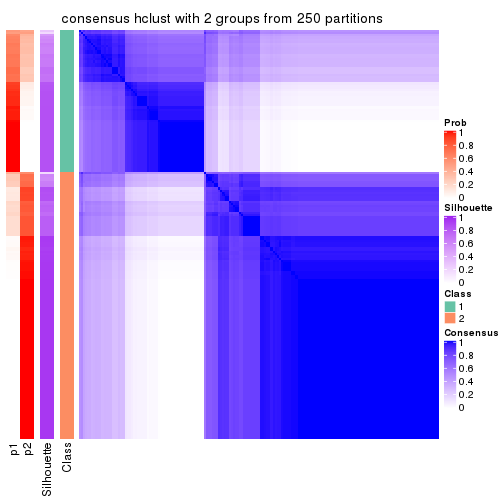</p>

</div>
<div id='tab-ATC-hclust-consensus-heatmap-2'>
<pre><code class="r">consensus_heatmap(res, k = 3)
</code></pre>

<p>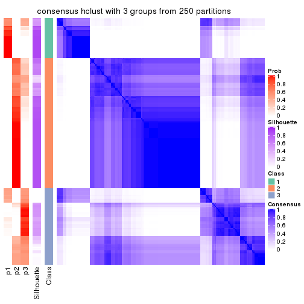</p>

</div>
<div id='tab-ATC-hclust-consensus-heatmap-3'>
<pre><code class="r">consensus_heatmap(res, k = 4)
</code></pre>

<p>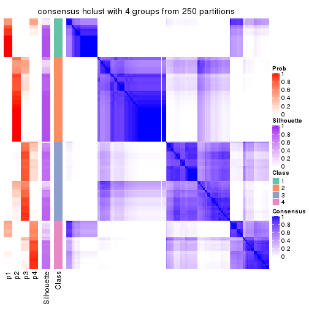</p>

</div>
<div id='tab-ATC-hclust-consensus-heatmap-4'>
<pre><code class="r">consensus_heatmap(res, k = 5)
</code></pre>

<p>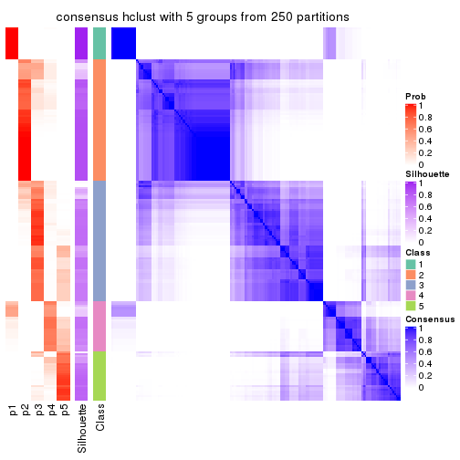</p>

</div>
<div id='tab-ATC-hclust-consensus-heatmap-5'>
<pre><code class="r">consensus_heatmap(res, k = 6)
</code></pre>

<p>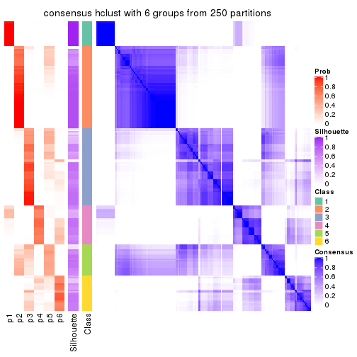</p>

</div>
</div>

Heatmaps for the membership of samples in all partitions to see how consistent they are:


<script>
$( function() {
	$( '#tabs-ATC-hclust-membership-heatmap' ).tabs();
} );
</script>
<div id='tabs-ATC-hclust-membership-heatmap'>
<ul>
<li><a href='#tab-ATC-hclust-membership-heatmap-1'>k = 2</a></li>
<li><a href='#tab-ATC-hclust-membership-heatmap-2'>k = 3</a></li>
<li><a href='#tab-ATC-hclust-membership-heatmap-3'>k = 4</a></li>
<li><a href='#tab-ATC-hclust-membership-heatmap-4'>k = 5</a></li>
<li><a href='#tab-ATC-hclust-membership-heatmap-5'>k = 6</a></li>
</ul>
<div id='tab-ATC-hclust-membership-heatmap-1'>
<pre><code class="r">membership_heatmap(res, k = 2)
</code></pre>

<p>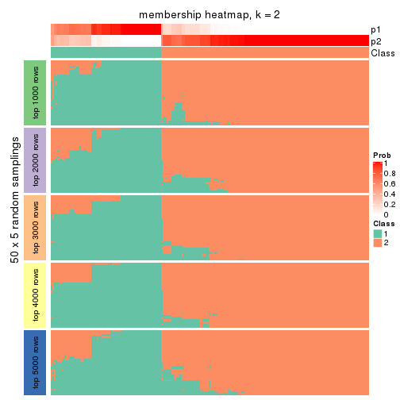</p>

</div>
<div id='tab-ATC-hclust-membership-heatmap-2'>
<pre><code class="r">membership_heatmap(res, k = 3)
</code></pre>

<p>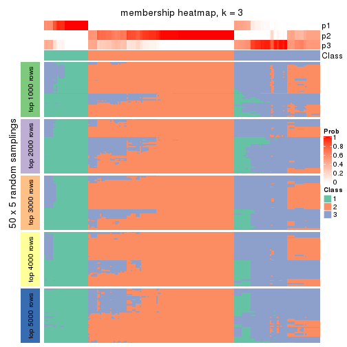</p>

</div>
<div id='tab-ATC-hclust-membership-heatmap-3'>
<pre><code class="r">membership_heatmap(res, k = 4)
</code></pre>

<p>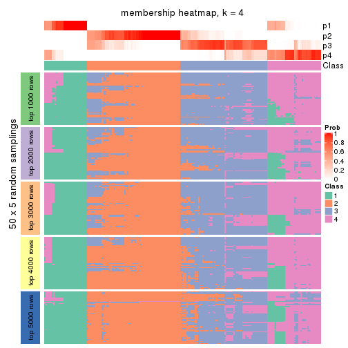</p>

</div>
<div id='tab-ATC-hclust-membership-heatmap-4'>
<pre><code class="r">membership_heatmap(res, k = 5)
</code></pre>

<p>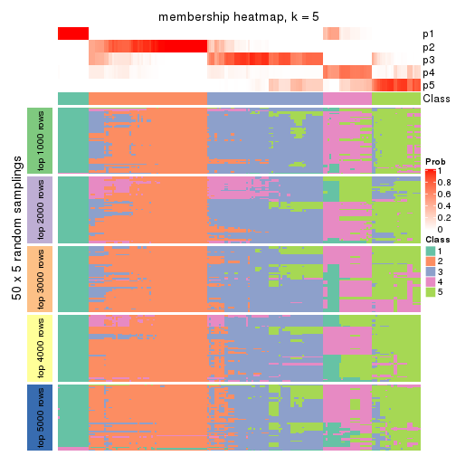</p>

</div>
<div id='tab-ATC-hclust-membership-heatmap-5'>
<pre><code class="r">membership_heatmap(res, k = 6)
</code></pre>

<p>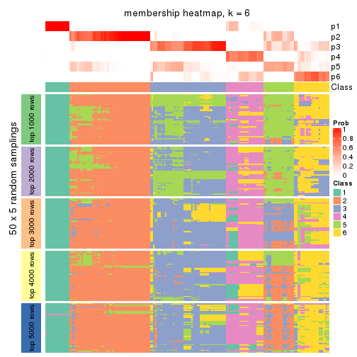</p>

</div>
</div>

As soon as we have had the classes for columns, we can look for signatures
which are significantly different between classes which can be candidate marks
for certain classes. Following are the heatmaps for signatures.


Signature heatmaps where rows are scaled:


<script>
$( function() {
	$( '#tabs-ATC-hclust-get-signatures' ).tabs();
} );
</script>
<div id='tabs-ATC-hclust-get-signatures'>
<ul>
<li><a href='#tab-ATC-hclust-get-signatures-1'>k = 2</a></li>
<li><a href='#tab-ATC-hclust-get-signatures-2'>k = 3</a></li>
<li><a href='#tab-ATC-hclust-get-signatures-3'>k = 4</a></li>
<li><a href='#tab-ATC-hclust-get-signatures-4'>k = 5</a></li>
<li><a href='#tab-ATC-hclust-get-signatures-5'>k = 6</a></li>
</ul>
<div id='tab-ATC-hclust-get-signatures-1'>
<pre><code class="r">get_signatures(res, k = 2)
</code></pre>

<p>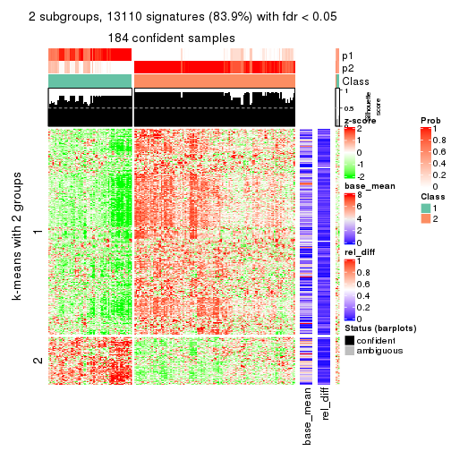</p>

</div>
<div id='tab-ATC-hclust-get-signatures-2'>
<pre><code class="r">get_signatures(res, k = 3)
</code></pre>

<p>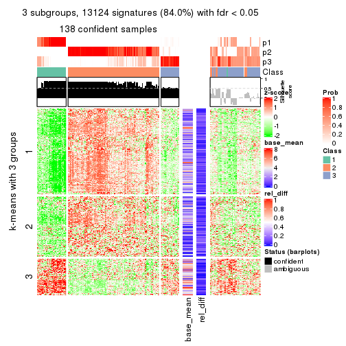</p>

</div>
<div id='tab-ATC-hclust-get-signatures-3'>
<pre><code class="r">get_signatures(res, k = 4)
</code></pre>

<p>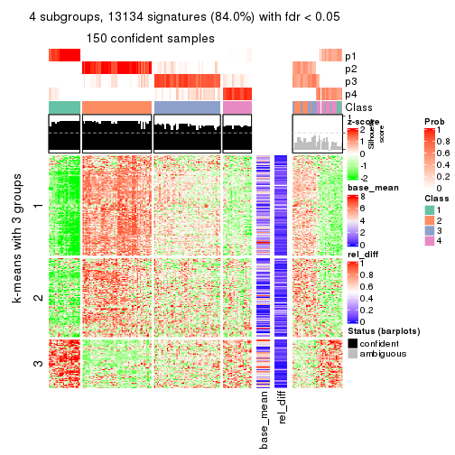</p>

</div>
<div id='tab-ATC-hclust-get-signatures-4'>
<pre><code class="r">get_signatures(res, k = 5)
</code></pre>

<p>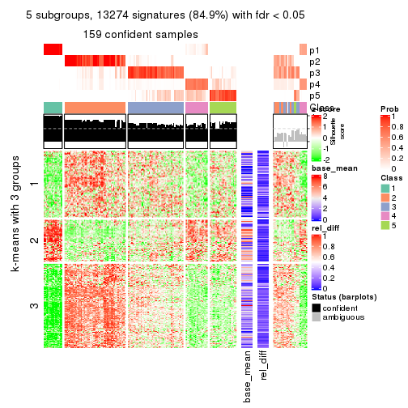</p>

</div>
<div id='tab-ATC-hclust-get-signatures-5'>
<pre><code class="r">get_signatures(res, k = 6)
</code></pre>

<p>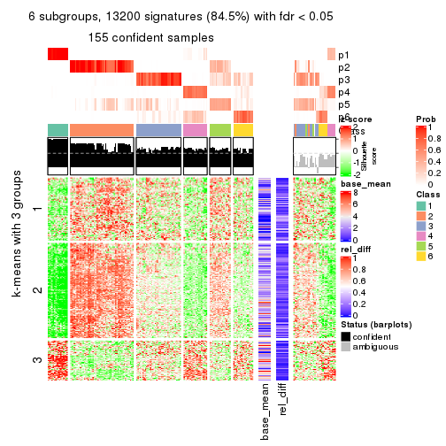</p>

</div>
</div>


Signature heatmaps where rows are not scaled:


<script>
$( function() {
	$( '#tabs-ATC-hclust-get-signatures-no-scale' ).tabs();
} );
</script>
<div id='tabs-ATC-hclust-get-signatures-no-scale'>
<ul>
<li><a href='#tab-ATC-hclust-get-signatures-no-scale-1'>k = 2</a></li>
<li><a href='#tab-ATC-hclust-get-signatures-no-scale-2'>k = 3</a></li>
<li><a href='#tab-ATC-hclust-get-signatures-no-scale-3'>k = 4</a></li>
<li><a href='#tab-ATC-hclust-get-signatures-no-scale-4'>k = 5</a></li>
<li><a href='#tab-ATC-hclust-get-signatures-no-scale-5'>k = 6</a></li>
</ul>
<div id='tab-ATC-hclust-get-signatures-no-scale-1'>
<pre><code class="r">get_signatures(res, k = 2, scale_rows = FALSE)
</code></pre>

<p>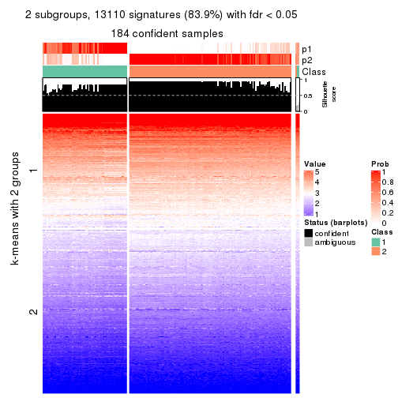</p>

</div>
<div id='tab-ATC-hclust-get-signatures-no-scale-2'>
<pre><code class="r">get_signatures(res, k = 3, scale_rows = FALSE)
</code></pre>

<p>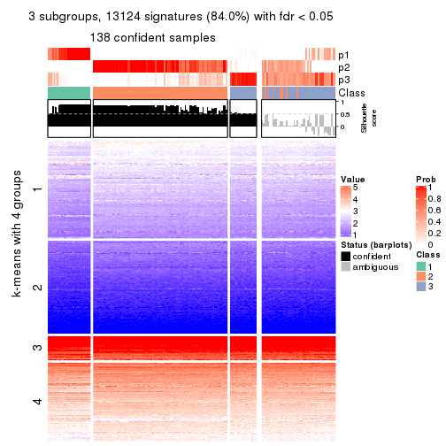</p>

</div>
<div id='tab-ATC-hclust-get-signatures-no-scale-3'>
<pre><code class="r">get_signatures(res, k = 4, scale_rows = FALSE)
</code></pre>

<p>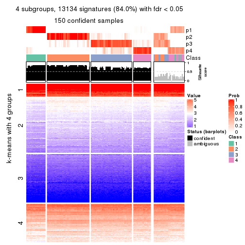</p>

</div>
<div id='tab-ATC-hclust-get-signatures-no-scale-4'>
<pre><code class="r">get_signatures(res, k = 5, scale_rows = FALSE)
</code></pre>

<p>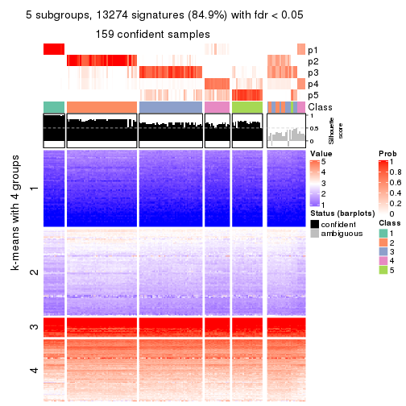</p>

</div>
<div id='tab-ATC-hclust-get-signatures-no-scale-5'>
<pre><code class="r">get_signatures(res, k = 6, scale_rows = FALSE)
</code></pre>

<p>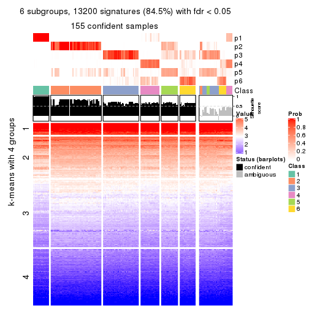</p>

</div>
</div>


Compare the overlap of signatures from different k:

```r
compare_signatures(res)
```

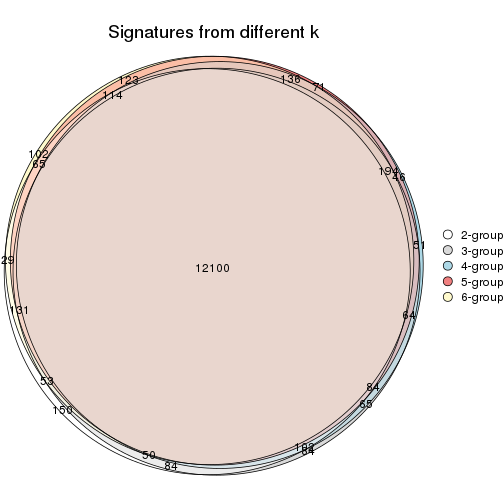

`get_signature()` returns a data frame invisibly. TO get the list of signatures, the function
call should be assigned to a variable explicitly. In following code, if `plot` argument is set
to `FALSE`, no heatmap is plotted while only the differential analysis is performed.

```r
# code only for demonstration
tb = get_signature(res, k = ..., plot = FALSE)
```

An example of the output of `tb` is:

```
#>   which_row         fdr    mean_1    mean_2 scaled_mean_1 scaled_mean_2 km
#> 1        38 0.042760348  8.373488  9.131774    -0.5533452     0.5164555  1
#> 2        40 0.018707592  7.106213  8.469186    -0.6173731     0.5762149  1
#> 3        55 0.019134737 10.221463 11.207825    -0.6159697     0.5749050  1
#> 4        59 0.006059896  5.921854  7.869574    -0.6899429     0.6439467  1
#> 5        60 0.018055526  8.928898 10.211722    -0.6204761     0.5791110  1
#> 6        98 0.009384629 15.714769 14.887706     0.6635654    -0.6193277  2
...
```

The columns in `tb` are:

1. `which_row`: row indices corresponding to the input matrix.
2. `fdr`: FDR for the differential test. 
3. `mean_x`: The mean value in group x.
4. `scaled_mean_x`: The mean value in group x after rows are scaled.
5. `km`: Row groups if k-means clustering is applied to rows.


UMAP plot which shows how samples are separated.


<script>
$( function() {
	$( '#tabs-ATC-hclust-dimension-reduction' ).tabs();
} );
</script>
<div id='tabs-ATC-hclust-dimension-reduction'>
<ul>
<li><a href='#tab-ATC-hclust-dimension-reduction-1'>k = 2</a></li>
<li><a href='#tab-ATC-hclust-dimension-reduction-2'>k = 3</a></li>
<li><a href='#tab-ATC-hclust-dimension-reduction-3'>k = 4</a></li>
<li><a href='#tab-ATC-hclust-dimension-reduction-4'>k = 5</a></li>
<li><a href='#tab-ATC-hclust-dimension-reduction-5'>k = 6</a></li>
</ul>
<div id='tab-ATC-hclust-dimension-reduction-1'>
<pre><code class="r">dimension_reduction(res, k = 2, method = &quot;UMAP&quot;)
</code></pre>

<p>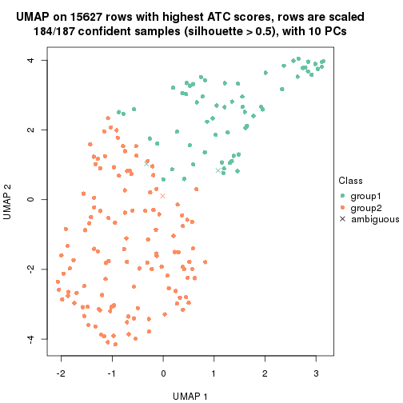</p>

</div>
<div id='tab-ATC-hclust-dimension-reduction-2'>
<pre><code class="r">dimension_reduction(res, k = 3, method = &quot;UMAP&quot;)
</code></pre>

<p>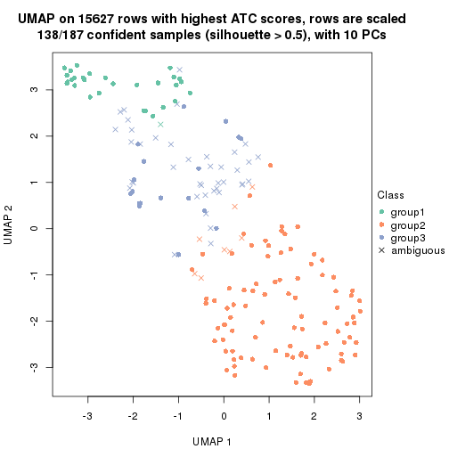</p>

</div>
<div id='tab-ATC-hclust-dimension-reduction-3'>
<pre><code class="r">dimension_reduction(res, k = 4, method = &quot;UMAP&quot;)
</code></pre>

<p>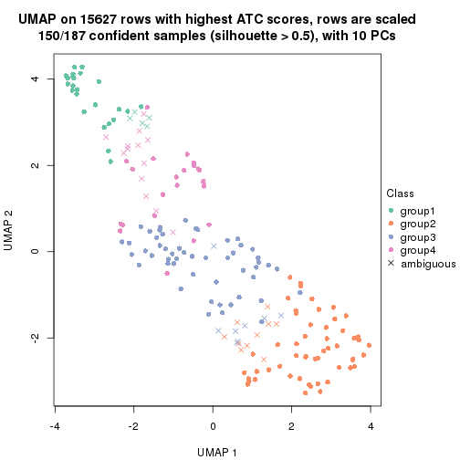</p>

</div>
<div id='tab-ATC-hclust-dimension-reduction-4'>
<pre><code class="r">dimension_reduction(res, k = 5, method = &quot;UMAP&quot;)
</code></pre>

<p>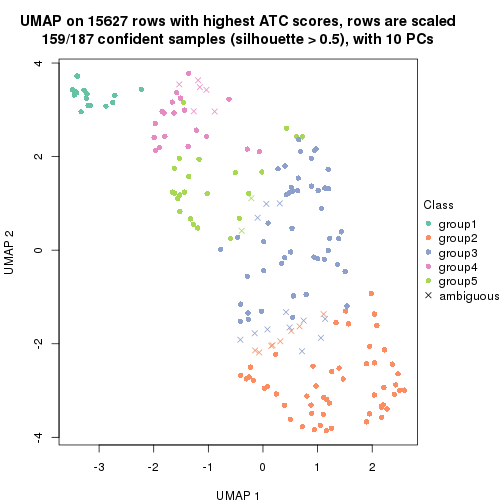</p>

</div>
<div id='tab-ATC-hclust-dimension-reduction-5'>
<pre><code class="r">dimension_reduction(res, k = 6, method = &quot;UMAP&quot;)
</code></pre>

<p>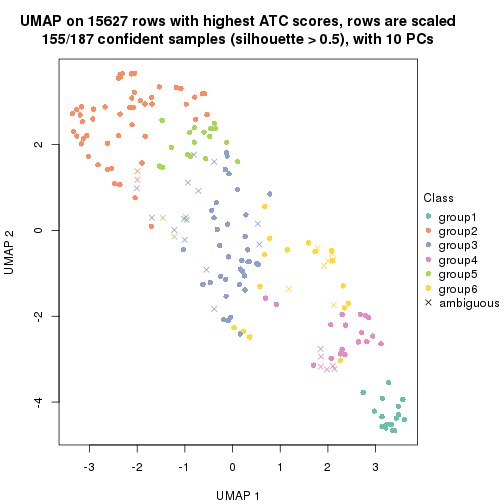</p>

</div>
</div>


Following heatmap shows how subgroups are split when increasing `k`:

```r
collect_classes(res)
```

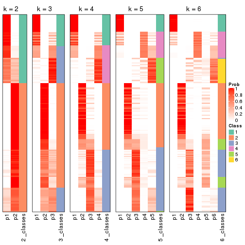


If matrix rows can be associated to genes, consider to use `GO_Enrichment(res,
...)` to perform function enrichment for the signature genes.


 

---------------------------------------------------


### ATC:kmeans*


The object with results only for a single top-value method and a single partition method 
can be extracted as:

```r
res = res_list["ATC", "kmeans"]
# you can also extract it by
# res = res_list["ATC:kmeans"]
```

A summary of `res` and all the functions that can be applied to it:

```r
res
```

```
#> A 'ConsensusPartition' object with k = 2, 3, 4, 5, 6.
#>   On a matrix with 15627 rows and 187 columns.
#>   Top rows (1000, 2000, 3000, 4000, 5000) are extracted by 'ATC' method.
#>   Subgroups are detected by 'kmeans' method.
#>   Performed in total 1250 partitions by row resampling.
#>   Best k for subgroups seems to be 3.
#> 
#> Following methods can be applied to this 'ConsensusPartition' object:
#>  [1] "cola_report"             "collect_classes"         "collect_plots"          
#>  [4] "collect_stats"           "colnames"                "compare_signatures"     
#>  [7] "consensus_heatmap"       "dimension_reduction"     "functional_enrichment"  
#> [10] "get_anno_col"            "get_anno"                "get_classes"            
#> [13] "get_consensus"           "get_matrix"              "get_membership"         
#> [16] "get_param"               "get_signatures"          "get_stats"              
#> [19] "is_best_k"               "is_stable_k"             "membership_heatmap"     
#> [22] "ncol"                    "nrow"                    "plot_ecdf"              
#> [25] "rownames"                "select_partition_number" "show"                   
#> [28] "suggest_best_k"          "test_to_known_factors"
```

`collect_plots()` function collects all the plots made from `res` for all `k` (number of partitions)
into one single page to provide an easy and fast comparison between different `k`.

```r
collect_plots(res)
```

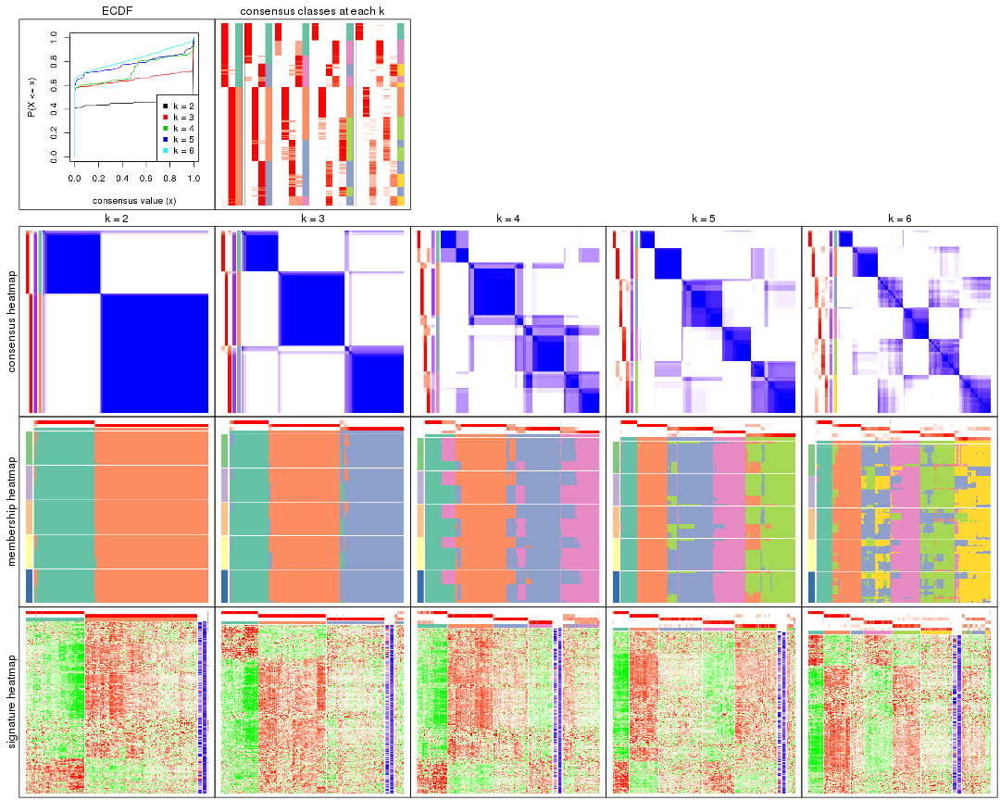

The plots are:

- The first row: a plot of the ECDF (Empirical cumulative distribution
  function) curves of the consensus matrix for each `k` and the heatmap of
  predicted classes for each `k`.
- The second row: heatmaps of the consensus matrix for each `k`.
- The third row: heatmaps of the membership matrix for each `k`.
- The fouth row: heatmaps of the signatures for each `k`.

All the plots in panels can be made by individual functions and they are
plotted later in this section.

`select_partition_number()` produces several plots showing different
statistics for choosing "optimized" `k`. There are following statistics:

- ECDF curves of the consensus matrix for each `k`;
- 1-PAC. [The PAC
  score](https://en.wikipedia.org/wiki/Consensus_clustering#Over-interpretation_potential_of_consensus_clustering)
  measures the proportion of the ambiguous subgrouping.
- Mean silhouette score.
- Concordance. The mean probability of fiting the consensus class ids in all
  partitions.
- Area increased. Denote $A_k$ as the area under the ECDF curve for current
  `k`, the area increased is defined as $A_k - A_{k-1}$.
- Rand index. The percent of pairs of samples that are both in a same cluster
  or both are not in a same cluster in the partition of k and k-1.
- Jaccard index. The ratio of pairs of samples are both in a same cluster in
  the partition of k and k-1 and the pairs of samples are both in a same
  cluster in the partition k or k-1.

The detailed explanations of these statistics can be found in [the cola
vignette](http://bioconductor.org/packages/devel/bioc/vignettes/cola/inst/doc/cola.html#toc_13).

Generally speaking, lower PAC score, higher mean silhouette score or higher
concordance corresponds to better partition. Rand index and Jaccard index
measure how similar the current partition is compared to partition with `k-1`.
If they are too similar, we won't accept `k` is better than `k-1`.

```r
select_partition_number(res)
```

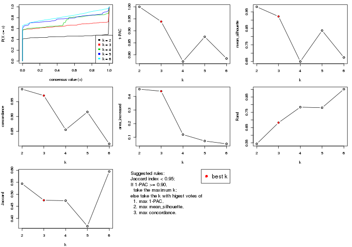

The numeric values for all these statistics can be obtained by `get_stats()`.

```r
get_stats(res)
```

```
#>   k 1-PAC mean_silhouette concordance area_increased  Rand Jaccard
#> 2 2 1.000           0.980       0.992         0.4532 0.544   0.544
#> 3 3 0.939           0.922       0.970         0.4383 0.683   0.475
#> 4 4 0.772           0.649       0.855         0.1197 0.784   0.474
#> 5 5 0.875           0.837       0.915         0.0725 0.780   0.367
#> 6 6 0.785           0.674       0.808         0.0516 0.901   0.595
```

`suggest_best_k()` suggests the best $k$ based on these statistics. The rules are as follows:

- All $k$ with Jaccard index larger than 0.95 are removed because the increase of
  the partition number does not provides enough extra information. If all $k$ are removed,
  the best $k$ is assigned by `NA`.
- For $k$ with 1-PAC larger than 0.9, the maximal $k$ is taken as the "best k". Other $k$ is called "optional k".
- If it does not fit the second rule. The $k$ with the highest vote of highest
  1-PAC, mean silhouette and concordance is taken as the "best k".

```r
suggest_best_k(res)
```

```
#> [1] 3
#> attr(,"optional")
#> [1] 2
```

There is also optional best $k$ = 2 that is worth to check.

Following shows the table of the partitions (You need to click the **show/hide
code output** link to see it). The membership matrix (columns with name `p*`)
is inferred by
[`clue::cl_consensus()`](https://www.rdocumentation.org/link/cl_consensus?package=clue)
function with the `SE` method. Basically the value in the membership matrix
represents the probability to belong to a certain group. The finall class
label for an item is determined with the group with highest probability it
belongs to.

In `get_classes()` function, the entropy is calculated from the membership
matrix and the silhouette score is calculated from the consensus matrix.


<script>
$( function() {
	$( '#tabs-ATC-kmeans-get-classes' ).tabs();
} );
</script>
<div id='tabs-ATC-kmeans-get-classes'>
<ul>
<li><a href='#tab-ATC-kmeans-get-classes-1'>k = 2</a></li>
<li><a href='#tab-ATC-kmeans-get-classes-2'>k = 3</a></li>
<li><a href='#tab-ATC-kmeans-get-classes-3'>k = 4</a></li>
<li><a href='#tab-ATC-kmeans-get-classes-4'>k = 5</a></li>
<li><a href='#tab-ATC-kmeans-get-classes-5'>k = 6</a></li>
</ul>

<div id='tab-ATC-kmeans-get-classes-1'>
<p><a id='tab-ATC-kmeans-get-classes-1-a' style='color:#0366d6' href='#'>show/hide code output</a></p>
<pre><code class="r">cbind(get_classes(res, k = 2), get_membership(res, k = 2))
</code></pre>

<pre><code>#&gt;            class entropy silhouette    p1    p2
#&gt; SRR1747213     1  0.0000     0.9808 1.000 0.000
#&gt; SRR1747214     1  0.0000     0.9808 1.000 0.000
#&gt; SRR1747215     2  0.0000     0.9977 0.000 1.000
#&gt; SRR1747216     2  0.0000     0.9977 0.000 1.000
#&gt; SRR1747217     2  0.0000     0.9977 0.000 1.000
#&gt; SRR1747218     2  0.0000     0.9977 0.000 1.000
#&gt; SRR1747219     2  0.0000     0.9977 0.000 1.000
#&gt; SRR1747220     1  0.0000     0.9808 1.000 0.000
#&gt; SRR1747221     1  0.0000     0.9808 1.000 0.000
#&gt; SRR1747222     1  0.0000     0.9808 1.000 0.000
#&gt; SRR1747223     1  0.0000     0.9808 1.000 0.000
#&gt; SRR1747224     2  0.0000     0.9977 0.000 1.000
#&gt; SRR1747225     2  0.0000     0.9977 0.000 1.000
#&gt; SRR1747226     2  0.0000     0.9977 0.000 1.000
#&gt; SRR1747227     2  0.0000     0.9977 0.000 1.000
#&gt; SRR1747228     2  0.0000     0.9977 0.000 1.000
#&gt; SRR1747229     2  0.0000     0.9977 0.000 1.000
#&gt; SRR1747230     1  0.0000     0.9808 1.000 0.000
#&gt; SRR1747231     1  0.0000     0.9808 1.000 0.000
#&gt; SRR1747232     1  0.0000     0.9808 1.000 0.000
#&gt; SRR1747233     1  0.0000     0.9808 1.000 0.000
#&gt; SRR1747234     2  0.0000     0.9977 0.000 1.000
#&gt; SRR1747235     1  0.0000     0.9808 1.000 0.000
#&gt; SRR1747236     2  0.0000     0.9977 0.000 1.000
#&gt; SRR1747237     2  0.0000     0.9977 0.000 1.000
#&gt; SRR1747238     2  0.0000     0.9977 0.000 1.000
#&gt; SRR1747239     2  0.0000     0.9977 0.000 1.000
#&gt; SRR1747240     1  0.0000     0.9808 1.000 0.000
#&gt; SRR1747241     2  0.0000     0.9977 0.000 1.000
#&gt; SRR1747242     1  0.0000     0.9808 1.000 0.000
#&gt; SRR1747243     1  0.0000     0.9808 1.000 0.000
#&gt; SRR1747244     2  0.0000     0.9977 0.000 1.000
#&gt; SRR1747245     2  0.0000     0.9977 0.000 1.000
#&gt; SRR1747246     2  0.0000     0.9977 0.000 1.000
#&gt; SRR1747247     1  0.0000     0.9808 1.000 0.000
#&gt; SRR1747248     1  0.0000     0.9808 1.000 0.000
#&gt; SRR1747249     1  0.0000     0.9808 1.000 0.000
#&gt; SRR1747250     2  0.0000     0.9977 0.000 1.000
#&gt; SRR1747252     1  0.0000     0.9808 1.000 0.000
#&gt; SRR1747253     1  0.0000     0.9808 1.000 0.000
#&gt; SRR1747254     2  0.0000     0.9977 0.000 1.000
#&gt; SRR1747255     1  0.0000     0.9808 1.000 0.000
#&gt; SRR1747256     1  0.0000     0.9808 1.000 0.000
#&gt; SRR1747257     2  0.0000     0.9977 0.000 1.000
#&gt; SRR1747258     2  0.0000     0.9977 0.000 1.000
#&gt; SRR1747259     2  0.0000     0.9977 0.000 1.000
#&gt; SRR1747260     2  0.0000     0.9977 0.000 1.000
#&gt; SRR1747261     2  0.0000     0.9977 0.000 1.000
#&gt; SRR1747262     2  0.0000     0.9977 0.000 1.000
#&gt; SRR1747263     2  0.0000     0.9977 0.000 1.000
#&gt; SRR1747264     1  0.0000     0.9808 1.000 0.000
#&gt; SRR1747265     2  0.0000     0.9977 0.000 1.000
#&gt; SRR1747266     2  0.0000     0.9977 0.000 1.000
#&gt; SRR1747267     2  0.0000     0.9977 0.000 1.000
#&gt; SRR1747268     2  0.0000     0.9977 0.000 1.000
#&gt; SRR1747269     2  0.0000     0.9977 0.000 1.000
#&gt; SRR1747270     2  0.0000     0.9977 0.000 1.000
#&gt; SRR1747271     2  0.0000     0.9977 0.000 1.000
#&gt; SRR1747272     1  0.4161     0.8982 0.916 0.084
#&gt; SRR1747273     1  0.0000     0.9808 1.000 0.000
#&gt; SRR1747274     2  0.0000     0.9977 0.000 1.000
#&gt; SRR1747275     1  0.0000     0.9808 1.000 0.000
#&gt; SRR1747276     1  0.0000     0.9808 1.000 0.000
#&gt; SRR1747277     2  0.0000     0.9977 0.000 1.000
#&gt; SRR1747278     2  0.0000     0.9977 0.000 1.000
#&gt; SRR1747280     1  0.0000     0.9808 1.000 0.000
#&gt; SRR1747279     1  0.0000     0.9808 1.000 0.000
#&gt; SRR1747281     2  0.0000     0.9977 0.000 1.000
#&gt; SRR1747282     1  0.0000     0.9808 1.000 0.000
#&gt; SRR1747283     2  0.0000     0.9977 0.000 1.000
#&gt; SRR1747284     1  0.0000     0.9808 1.000 0.000
#&gt; SRR1747285     2  0.0000     0.9977 0.000 1.000
#&gt; SRR1747286     2  0.0000     0.9977 0.000 1.000
#&gt; SRR1747287     2  0.0000     0.9977 0.000 1.000
#&gt; SRR1747288     1  0.0000     0.9808 1.000 0.000
#&gt; SRR1747290     2  0.0000     0.9977 0.000 1.000
#&gt; SRR1747289     2  0.0000     0.9977 0.000 1.000
#&gt; SRR1747291     2  0.0000     0.9977 0.000 1.000
#&gt; SRR1747293     2  0.0000     0.9977 0.000 1.000
#&gt; SRR1747294     2  0.0000     0.9977 0.000 1.000
#&gt; SRR1747292     1  0.0000     0.9808 1.000 0.000
#&gt; SRR1747295     2  0.0000     0.9977 0.000 1.000
#&gt; SRR1747296     2  0.0000     0.9977 0.000 1.000
#&gt; SRR1747297     2  0.0000     0.9977 0.000 1.000
#&gt; SRR1747298     2  0.0000     0.9977 0.000 1.000
#&gt; SRR1747299     2  0.0000     0.9977 0.000 1.000
#&gt; SRR1747300     2  0.0000     0.9977 0.000 1.000
#&gt; SRR1747301     2  0.0000     0.9977 0.000 1.000
#&gt; SRR1747302     2  0.0000     0.9977 0.000 1.000
#&gt; SRR1747303     2  0.0000     0.9977 0.000 1.000
#&gt; SRR1747304     1  0.0000     0.9808 1.000 0.000
#&gt; SRR1747305     2  0.0000     0.9977 0.000 1.000
#&gt; SRR1747306     2  0.0000     0.9977 0.000 1.000
#&gt; SRR1747307     2  0.3879     0.9151 0.076 0.924
#&gt; SRR1747308     2  0.0000     0.9977 0.000 1.000
#&gt; SRR1747309     1  0.0000     0.9808 1.000 0.000
#&gt; SRR1747310     1  0.0000     0.9808 1.000 0.000
#&gt; SRR1747311     1  0.0000     0.9808 1.000 0.000
#&gt; SRR1747313     1  0.0000     0.9808 1.000 0.000
#&gt; SRR1747312     1  0.0000     0.9808 1.000 0.000
#&gt; SRR1747314     1  0.0000     0.9808 1.000 0.000
#&gt; SRR1747315     2  0.0000     0.9977 0.000 1.000
#&gt; SRR1747316     2  0.0000     0.9977 0.000 1.000
#&gt; SRR1747318     1  0.9996     0.0668 0.512 0.488
#&gt; SRR1747317     2  0.0000     0.9977 0.000 1.000
#&gt; SRR1747319     1  0.8713     0.5968 0.708 0.292
#&gt; SRR1747320     1  0.0000     0.9808 1.000 0.000
#&gt; SRR1747322     1  0.0000     0.9808 1.000 0.000
#&gt; SRR1747321     1  0.0000     0.9808 1.000 0.000
#&gt; SRR1747323     2  0.0000     0.9977 0.000 1.000
#&gt; SRR1747324     2  0.0000     0.9977 0.000 1.000
#&gt; SRR1747326     2  0.0000     0.9977 0.000 1.000
#&gt; SRR1747325     2  0.0000     0.9977 0.000 1.000
#&gt; SRR1747327     2  0.0000     0.9977 0.000 1.000
#&gt; SRR1747328     2  0.0000     0.9977 0.000 1.000
#&gt; SRR1747330     1  0.0000     0.9808 1.000 0.000
#&gt; SRR1747329     2  0.0000     0.9977 0.000 1.000
#&gt; SRR1747332     1  0.0000     0.9808 1.000 0.000
#&gt; SRR1747331     2  0.0000     0.9977 0.000 1.000
#&gt; SRR1747333     2  0.0000     0.9977 0.000 1.000
#&gt; SRR1747334     2  0.0000     0.9977 0.000 1.000
#&gt; SRR1747335     2  0.0000     0.9977 0.000 1.000
#&gt; SRR1747336     1  0.0000     0.9808 1.000 0.000
#&gt; SRR1747337     2  0.0000     0.9977 0.000 1.000
#&gt; SRR1747338     2  0.0000     0.9977 0.000 1.000
#&gt; SRR1747339     2  0.0000     0.9977 0.000 1.000
#&gt; SRR1747340     2  0.0000     0.9977 0.000 1.000
#&gt; SRR1747341     2  0.0000     0.9977 0.000 1.000
#&gt; SRR1747342     2  0.0000     0.9977 0.000 1.000
#&gt; SRR1747343     2  0.0000     0.9977 0.000 1.000
#&gt; SRR1747344     2  0.0000     0.9977 0.000 1.000
#&gt; SRR1747345     1  0.8813     0.5817 0.700 0.300
#&gt; SRR1747346     2  0.0000     0.9977 0.000 1.000
#&gt; SRR1747347     2  0.0000     0.9977 0.000 1.000
#&gt; SRR1747348     1  0.0000     0.9808 1.000 0.000
#&gt; SRR1747349     1  0.0000     0.9808 1.000 0.000
#&gt; SRR1747351     2  0.0000     0.9977 0.000 1.000
#&gt; SRR1747350     2  0.0000     0.9977 0.000 1.000
#&gt; SRR1747352     1  0.0000     0.9808 1.000 0.000
#&gt; SRR1747353     2  0.0000     0.9977 0.000 1.000
#&gt; SRR1747354     2  0.0000     0.9977 0.000 1.000
#&gt; SRR1747355     1  0.3114     0.9279 0.944 0.056
#&gt; SRR1747356     2  0.0000     0.9977 0.000 1.000
#&gt; SRR1747357     2  0.0000     0.9977 0.000 1.000
#&gt; SRR1747358     2  0.0000     0.9977 0.000 1.000
#&gt; SRR1747359     1  0.0000     0.9808 1.000 0.000
#&gt; SRR1747360     2  0.0000     0.9977 0.000 1.000
#&gt; SRR1747361     2  0.6887     0.7693 0.184 0.816
#&gt; SRR1747362     2  0.0000     0.9977 0.000 1.000
#&gt; SRR1747363     2  0.0000     0.9977 0.000 1.000
#&gt; SRR1747364     1  0.0000     0.9808 1.000 0.000
#&gt; SRR1747365     2  0.0000     0.9977 0.000 1.000
#&gt; SRR1747366     2  0.0000     0.9977 0.000 1.000
#&gt; SRR1747367     1  0.0000     0.9808 1.000 0.000
#&gt; SRR1747369     2  0.0000     0.9977 0.000 1.000
#&gt; SRR1747368     2  0.0000     0.9977 0.000 1.000
#&gt; SRR1747370     2  0.0000     0.9977 0.000 1.000
#&gt; SRR1747372     1  0.0000     0.9808 1.000 0.000
#&gt; SRR1747371     1  0.0000     0.9808 1.000 0.000
#&gt; SRR1747373     2  0.0000     0.9977 0.000 1.000
#&gt; SRR1747374     2  0.0000     0.9977 0.000 1.000
#&gt; SRR1747375     1  0.0000     0.9808 1.000 0.000
#&gt; SRR1747376     2  0.0000     0.9977 0.000 1.000
#&gt; SRR1747377     2  0.0000     0.9977 0.000 1.000
#&gt; SRR1747378     2  0.0000     0.9977 0.000 1.000
#&gt; SRR1747379     2  0.0000     0.9977 0.000 1.000
#&gt; SRR1747380     2  0.0000     0.9977 0.000 1.000
#&gt; SRR1747381     1  0.0000     0.9808 1.000 0.000
#&gt; SRR1747382     1  0.0000     0.9808 1.000 0.000
#&gt; SRR1747383     2  0.0000     0.9977 0.000 1.000
#&gt; SRR1747384     2  0.0000     0.9977 0.000 1.000
#&gt; SRR1747385     2  0.0000     0.9977 0.000 1.000
#&gt; SRR1747386     1  0.0000     0.9808 1.000 0.000
#&gt; SRR1747387     2  0.0000     0.9977 0.000 1.000
#&gt; SRR1747388     2  0.0000     0.9977 0.000 1.000
#&gt; SRR1747390     2  0.0000     0.9977 0.000 1.000
#&gt; SRR1747389     2  0.0000     0.9977 0.000 1.000
#&gt; SRR1747391     2  0.0000     0.9977 0.000 1.000
#&gt; SRR1747392     2  0.0000     0.9977 0.000 1.000
#&gt; SRR1747393     2  0.0000     0.9977 0.000 1.000
#&gt; SRR1747394     1  0.0000     0.9808 1.000 0.000
#&gt; SRR1747395     2  0.0938     0.9857 0.012 0.988
#&gt; SRR1747396     2  0.0000     0.9977 0.000 1.000
#&gt; SRR1747398     2  0.0000     0.9977 0.000 1.000
#&gt; SRR1747397     1  0.0000     0.9808 1.000 0.000
#&gt; SRR1747399     1  0.0000     0.9808 1.000 0.000
#&gt; SRR1747400     1  0.0000     0.9808 1.000 0.000
</code></pre>

<script>
$('#tab-ATC-kmeans-get-classes-1-a').parent().next().next().hide();
$('#tab-ATC-kmeans-get-classes-1-a').click(function(){
  $('#tab-ATC-kmeans-get-classes-1-a').parent().next().next().toggle();
  return(false);
});
</script>
</div>

<div id='tab-ATC-kmeans-get-classes-2'>
<p><a id='tab-ATC-kmeans-get-classes-2-a' style='color:#0366d6' href='#'>show/hide code output</a></p>
<pre><code class="r">cbind(get_classes(res, k = 3), get_membership(res, k = 3))
</code></pre>

<pre><code>#&gt;            class entropy silhouette    p1    p2    p3
#&gt; SRR1747213     3  0.0000    0.94757 0.000 0.000 1.000
#&gt; SRR1747214     1  0.0000    0.96280 1.000 0.000 0.000
#&gt; SRR1747215     2  0.0000    0.98580 0.000 1.000 0.000
#&gt; SRR1747216     2  0.0000    0.98580 0.000 1.000 0.000
#&gt; SRR1747217     3  0.0000    0.94757 0.000 0.000 1.000
#&gt; SRR1747218     3  0.4555    0.72061 0.000 0.200 0.800
#&gt; SRR1747219     3  0.0000    0.94757 0.000 0.000 1.000
#&gt; SRR1747220     3  0.0000    0.94757 0.000 0.000 1.000
#&gt; SRR1747221     1  0.6274    0.16645 0.544 0.000 0.456
#&gt; SRR1747222     1  0.4346    0.76731 0.816 0.000 0.184
#&gt; SRR1747223     1  0.0000    0.96280 1.000 0.000 0.000
#&gt; SRR1747224     3  0.0000    0.94757 0.000 0.000 1.000
#&gt; SRR1747225     3  0.1031    0.92416 0.000 0.024 0.976
#&gt; SRR1747226     2  0.0000    0.98580 0.000 1.000 0.000
#&gt; SRR1747227     2  0.0000    0.98580 0.000 1.000 0.000
#&gt; SRR1747228     3  0.4842    0.69084 0.000 0.224 0.776
#&gt; SRR1747229     2  0.0000    0.98580 0.000 1.000 0.000
#&gt; SRR1747230     1  0.0000    0.96280 1.000 0.000 0.000
#&gt; SRR1747231     3  0.0000    0.94757 0.000 0.000 1.000
#&gt; SRR1747232     1  0.0000    0.96280 1.000 0.000 0.000
#&gt; SRR1747233     1  0.0000    0.96280 1.000 0.000 0.000
#&gt; SRR1747234     3  0.0000    0.94757 0.000 0.000 1.000
#&gt; SRR1747235     1  0.0000    0.96280 1.000 0.000 0.000
#&gt; SRR1747236     2  0.0000    0.98580 0.000 1.000 0.000
#&gt; SRR1747237     2  0.0000    0.98580 0.000 1.000 0.000
#&gt; SRR1747238     2  0.0000    0.98580 0.000 1.000 0.000
#&gt; SRR1747239     2  0.0000    0.98580 0.000 1.000 0.000
#&gt; SRR1747240     1  0.0000    0.96280 1.000 0.000 0.000
#&gt; SRR1747241     3  0.5254    0.62860 0.000 0.264 0.736
#&gt; SRR1747242     1  0.0000    0.96280 1.000 0.000 0.000
#&gt; SRR1747243     3  0.0000    0.94757 0.000 0.000 1.000
#&gt; SRR1747244     3  0.0000    0.94757 0.000 0.000 1.000
#&gt; SRR1747245     2  0.3267    0.86087 0.000 0.884 0.116
#&gt; SRR1747246     2  0.0000    0.98580 0.000 1.000 0.000
#&gt; SRR1747247     1  0.0000    0.96280 1.000 0.000 0.000
#&gt; SRR1747248     1  0.0000    0.96280 1.000 0.000 0.000
#&gt; SRR1747249     1  0.0000    0.96280 1.000 0.000 0.000
#&gt; SRR1747250     3  0.0000    0.94757 0.000 0.000 1.000
#&gt; SRR1747252     3  0.6307    0.00858 0.488 0.000 0.512
#&gt; SRR1747253     3  0.5785    0.47390 0.332 0.000 0.668
#&gt; SRR1747254     2  0.0000    0.98580 0.000 1.000 0.000
#&gt; SRR1747255     1  0.3752    0.81797 0.856 0.000 0.144
#&gt; SRR1747256     1  0.0000    0.96280 1.000 0.000 0.000
#&gt; SRR1747257     2  0.0000    0.98580 0.000 1.000 0.000
#&gt; SRR1747258     3  0.0000    0.94757 0.000 0.000 1.000
#&gt; SRR1747259     2  0.0000    0.98580 0.000 1.000 0.000
#&gt; SRR1747260     3  0.0000    0.94757 0.000 0.000 1.000
#&gt; SRR1747261     3  0.0000    0.94757 0.000 0.000 1.000
#&gt; SRR1747262     2  0.0000    0.98580 0.000 1.000 0.000
#&gt; SRR1747263     2  0.0000    0.98580 0.000 1.000 0.000
#&gt; SRR1747264     1  0.0000    0.96280 1.000 0.000 0.000
#&gt; SRR1747265     3  0.0000    0.94757 0.000 0.000 1.000
#&gt; SRR1747266     3  0.0000    0.94757 0.000 0.000 1.000
#&gt; SRR1747267     3  0.0000    0.94757 0.000 0.000 1.000
#&gt; SRR1747268     3  0.0000    0.94757 0.000 0.000 1.000
#&gt; SRR1747269     2  0.0000    0.98580 0.000 1.000 0.000
#&gt; SRR1747270     2  0.0000    0.98580 0.000 1.000 0.000
#&gt; SRR1747271     2  0.5882    0.46776 0.000 0.652 0.348
#&gt; SRR1747272     3  0.0000    0.94757 0.000 0.000 1.000
#&gt; SRR1747273     1  0.4452    0.75616 0.808 0.000 0.192
#&gt; SRR1747274     3  0.0000    0.94757 0.000 0.000 1.000
#&gt; SRR1747275     1  0.0000    0.96280 1.000 0.000 0.000
#&gt; SRR1747276     1  0.0000    0.96280 1.000 0.000 0.000
#&gt; SRR1747277     2  0.0000    0.98580 0.000 1.000 0.000
#&gt; SRR1747278     3  0.0000    0.94757 0.000 0.000 1.000
#&gt; SRR1747280     1  0.0000    0.96280 1.000 0.000 0.000
#&gt; SRR1747279     1  0.0000    0.96280 1.000 0.000 0.000
#&gt; SRR1747281     2  0.0000    0.98580 0.000 1.000 0.000
#&gt; SRR1747282     1  0.0000    0.96280 1.000 0.000 0.000
#&gt; SRR1747283     3  0.0000    0.94757 0.000 0.000 1.000
#&gt; SRR1747284     1  0.0000    0.96280 1.000 0.000 0.000
#&gt; SRR1747285     3  0.0000    0.94757 0.000 0.000 1.000
#&gt; SRR1747286     3  0.0000    0.94757 0.000 0.000 1.000
#&gt; SRR1747287     2  0.0000    0.98580 0.000 1.000 0.000
#&gt; SRR1747288     3  0.0000    0.94757 0.000 0.000 1.000
#&gt; SRR1747290     2  0.0000    0.98580 0.000 1.000 0.000
#&gt; SRR1747289     2  0.0000    0.98580 0.000 1.000 0.000
#&gt; SRR1747291     2  0.0000    0.98580 0.000 1.000 0.000
#&gt; SRR1747293     3  0.0000    0.94757 0.000 0.000 1.000
#&gt; SRR1747294     2  0.0000    0.98580 0.000 1.000 0.000
#&gt; SRR1747292     1  0.0000    0.96280 1.000 0.000 0.000
#&gt; SRR1747295     2  0.0000    0.98580 0.000 1.000 0.000
#&gt; SRR1747296     2  0.0000    0.98580 0.000 1.000 0.000
#&gt; SRR1747297     2  0.0000    0.98580 0.000 1.000 0.000
#&gt; SRR1747298     2  0.0000    0.98580 0.000 1.000 0.000
#&gt; SRR1747299     2  0.0000    0.98580 0.000 1.000 0.000
#&gt; SRR1747300     2  0.0000    0.98580 0.000 1.000 0.000
#&gt; SRR1747301     2  0.0000    0.98580 0.000 1.000 0.000
#&gt; SRR1747302     2  0.0000    0.98580 0.000 1.000 0.000
#&gt; SRR1747303     2  0.0000    0.98580 0.000 1.000 0.000
#&gt; SRR1747304     1  0.0000    0.96280 1.000 0.000 0.000
#&gt; SRR1747305     2  0.0000    0.98580 0.000 1.000 0.000
#&gt; SRR1747306     2  0.0000    0.98580 0.000 1.000 0.000
#&gt; SRR1747307     3  0.0000    0.94757 0.000 0.000 1.000
#&gt; SRR1747308     2  0.5968    0.43007 0.000 0.636 0.364
#&gt; SRR1747309     3  0.6008    0.37917 0.372 0.000 0.628
#&gt; SRR1747310     1  0.0000    0.96280 1.000 0.000 0.000
#&gt; SRR1747311     3  0.0000    0.94757 0.000 0.000 1.000
#&gt; SRR1747313     3  0.0000    0.94757 0.000 0.000 1.000
#&gt; SRR1747312     1  0.0000    0.96280 1.000 0.000 0.000
#&gt; SRR1747314     1  0.0000    0.96280 1.000 0.000 0.000
#&gt; SRR1747315     2  0.0000    0.98580 0.000 1.000 0.000
#&gt; SRR1747316     2  0.3340    0.85619 0.000 0.880 0.120
#&gt; SRR1747318     3  0.0000    0.94757 0.000 0.000 1.000
#&gt; SRR1747317     3  0.0000    0.94757 0.000 0.000 1.000
#&gt; SRR1747319     3  0.0000    0.94757 0.000 0.000 1.000
#&gt; SRR1747320     1  0.0000    0.96280 1.000 0.000 0.000
#&gt; SRR1747322     1  0.0000    0.96280 1.000 0.000 0.000
#&gt; SRR1747321     1  0.0000    0.96280 1.000 0.000 0.000
#&gt; SRR1747323     2  0.0000    0.98580 0.000 1.000 0.000
#&gt; SRR1747324     2  0.0000    0.98580 0.000 1.000 0.000
#&gt; SRR1747326     2  0.0000    0.98580 0.000 1.000 0.000
#&gt; SRR1747325     2  0.0000    0.98580 0.000 1.000 0.000
#&gt; SRR1747327     2  0.0000    0.98580 0.000 1.000 0.000
#&gt; SRR1747328     3  0.0000    0.94757 0.000 0.000 1.000
#&gt; SRR1747330     3  0.0000    0.94757 0.000 0.000 1.000
#&gt; SRR1747329     3  0.1289    0.91590 0.000 0.032 0.968
#&gt; SRR1747332     3  0.0000    0.94757 0.000 0.000 1.000
#&gt; SRR1747331     2  0.0747    0.97001 0.000 0.984 0.016
#&gt; SRR1747333     2  0.0237    0.98196 0.000 0.996 0.004
#&gt; SRR1747334     2  0.0000    0.98580 0.000 1.000 0.000
#&gt; SRR1747335     3  0.0000    0.94757 0.000 0.000 1.000
#&gt; SRR1747336     1  0.0000    0.96280 1.000 0.000 0.000
#&gt; SRR1747337     2  0.0000    0.98580 0.000 1.000 0.000
#&gt; SRR1747338     2  0.0000    0.98580 0.000 1.000 0.000
#&gt; SRR1747339     3  0.0000    0.94757 0.000 0.000 1.000
#&gt; SRR1747340     3  0.0000    0.94757 0.000 0.000 1.000
#&gt; SRR1747341     2  0.0000    0.98580 0.000 1.000 0.000
#&gt; SRR1747342     2  0.0000    0.98580 0.000 1.000 0.000
#&gt; SRR1747343     2  0.0000    0.98580 0.000 1.000 0.000
#&gt; SRR1747344     2  0.0000    0.98580 0.000 1.000 0.000
#&gt; SRR1747345     3  0.0000    0.94757 0.000 0.000 1.000
#&gt; SRR1747346     3  0.0000    0.94757 0.000 0.000 1.000
#&gt; SRR1747347     2  0.0000    0.98580 0.000 1.000 0.000
#&gt; SRR1747348     1  0.0000    0.96280 1.000 0.000 0.000
#&gt; SRR1747349     1  0.0000    0.96280 1.000 0.000 0.000
#&gt; SRR1747351     2  0.0000    0.98580 0.000 1.000 0.000
#&gt; SRR1747350     2  0.0000    0.98580 0.000 1.000 0.000
#&gt; SRR1747352     1  0.0000    0.96280 1.000 0.000 0.000
#&gt; SRR1747353     2  0.0000    0.98580 0.000 1.000 0.000
#&gt; SRR1747354     3  0.0000    0.94757 0.000 0.000 1.000
#&gt; SRR1747355     3  0.0000    0.94757 0.000 0.000 1.000
#&gt; SRR1747356     3  0.0000    0.94757 0.000 0.000 1.000
#&gt; SRR1747357     3  0.0000    0.94757 0.000 0.000 1.000
#&gt; SRR1747358     3  0.0000    0.94757 0.000 0.000 1.000
#&gt; SRR1747359     1  0.0000    0.96280 1.000 0.000 0.000
#&gt; SRR1747360     2  0.0000    0.98580 0.000 1.000 0.000
#&gt; SRR1747361     3  0.0000    0.94757 0.000 0.000 1.000
#&gt; SRR1747362     2  0.0000    0.98580 0.000 1.000 0.000
#&gt; SRR1747363     3  0.0000    0.94757 0.000 0.000 1.000
#&gt; SRR1747364     3  0.5706    0.49977 0.320 0.000 0.680
#&gt; SRR1747365     3  0.0000    0.94757 0.000 0.000 1.000
#&gt; SRR1747366     2  0.0000    0.98580 0.000 1.000 0.000
#&gt; SRR1747367     3  0.0000    0.94757 0.000 0.000 1.000
#&gt; SRR1747369     2  0.0000    0.98580 0.000 1.000 0.000
#&gt; SRR1747368     3  0.0000    0.94757 0.000 0.000 1.000
#&gt; SRR1747370     3  0.0000    0.94757 0.000 0.000 1.000
#&gt; SRR1747372     1  0.0000    0.96280 1.000 0.000 0.000
#&gt; SRR1747371     3  0.5926    0.41841 0.356 0.000 0.644
#&gt; SRR1747373     2  0.0000    0.98580 0.000 1.000 0.000
#&gt; SRR1747374     2  0.0000    0.98580 0.000 1.000 0.000
#&gt; SRR1747375     3  0.0000    0.94757 0.000 0.000 1.000
#&gt; SRR1747376     2  0.0000    0.98580 0.000 1.000 0.000
#&gt; SRR1747377     2  0.0000    0.98580 0.000 1.000 0.000
#&gt; SRR1747378     2  0.0000    0.98580 0.000 1.000 0.000
#&gt; SRR1747379     3  0.6309   -0.01212 0.000 0.500 0.500
#&gt; SRR1747380     3  0.0000    0.94757 0.000 0.000 1.000
#&gt; SRR1747381     1  0.0000    0.96280 1.000 0.000 0.000
#&gt; SRR1747382     1  0.0000    0.96280 1.000 0.000 0.000
#&gt; SRR1747383     2  0.0000    0.98580 0.000 1.000 0.000
#&gt; SRR1747384     3  0.0000    0.94757 0.000 0.000 1.000
#&gt; SRR1747385     3  0.0000    0.94757 0.000 0.000 1.000
#&gt; SRR1747386     1  0.0000    0.96280 1.000 0.000 0.000
#&gt; SRR1747387     2  0.0000    0.98580 0.000 1.000 0.000
#&gt; SRR1747388     2  0.0000    0.98580 0.000 1.000 0.000
#&gt; SRR1747390     2  0.0000    0.98580 0.000 1.000 0.000
#&gt; SRR1747389     2  0.0000    0.98580 0.000 1.000 0.000
#&gt; SRR1747391     2  0.0000    0.98580 0.000 1.000 0.000
#&gt; SRR1747392     2  0.0000    0.98580 0.000 1.000 0.000
#&gt; SRR1747393     3  0.0000    0.94757 0.000 0.000 1.000
#&gt; SRR1747394     3  0.0000    0.94757 0.000 0.000 1.000
#&gt; SRR1747395     3  0.0000    0.94757 0.000 0.000 1.000
#&gt; SRR1747396     2  0.0000    0.98580 0.000 1.000 0.000
#&gt; SRR1747398     2  0.0000    0.98580 0.000 1.000 0.000
#&gt; SRR1747397     3  0.0000    0.94757 0.000 0.000 1.000
#&gt; SRR1747399     1  0.0000    0.96280 1.000 0.000 0.000
#&gt; SRR1747400     1  0.6291    0.12488 0.532 0.000 0.468
</code></pre>

<script>
$('#tab-ATC-kmeans-get-classes-2-a').parent().next().next().hide();
$('#tab-ATC-kmeans-get-classes-2-a').click(function(){
  $('#tab-ATC-kmeans-get-classes-2-a').parent().next().next().toggle();
  return(false);
});
</script>
</div>

<div id='tab-ATC-kmeans-get-classes-3'>
<p><a id='tab-ATC-kmeans-get-classes-3-a' style='color:#0366d6' href='#'>show/hide code output</a></p>
<pre><code class="r">cbind(get_classes(res, k = 4), get_membership(res, k = 4))
</code></pre>

<pre><code>#&gt;            class entropy silhouette    p1    p2    p3    p4
#&gt; SRR1747213     4  0.0000    0.67486 0.000 0.000 0.000 1.000
#&gt; SRR1747214     1  0.4985    0.65094 0.532 0.000 0.000 0.468
#&gt; SRR1747215     2  0.0000    0.94353 0.000 1.000 0.000 0.000
#&gt; SRR1747216     2  0.0000    0.94353 0.000 1.000 0.000 0.000
#&gt; SRR1747217     3  0.3907    0.43371 0.000 0.000 0.768 0.232
#&gt; SRR1747218     3  0.0000    0.75593 0.000 0.000 1.000 0.000
#&gt; SRR1747219     3  0.5000   -0.33843 0.000 0.000 0.500 0.500
#&gt; SRR1747220     4  0.0000    0.67486 0.000 0.000 0.000 1.000
#&gt; SRR1747221     4  0.0000    0.67486 0.000 0.000 0.000 1.000
#&gt; SRR1747222     4  0.0000    0.67486 0.000 0.000 0.000 1.000
#&gt; SRR1747223     4  0.0000    0.67486 0.000 0.000 0.000 1.000
#&gt; SRR1747224     4  0.4996    0.34956 0.000 0.000 0.484 0.516
#&gt; SRR1747225     3  0.0000    0.75593 0.000 0.000 1.000 0.000
#&gt; SRR1747226     2  0.0000    0.94353 0.000 1.000 0.000 0.000
#&gt; SRR1747227     2  0.0000    0.94353 0.000 1.000 0.000 0.000
#&gt; SRR1747228     3  0.0000    0.75593 0.000 0.000 1.000 0.000
#&gt; SRR1747229     3  0.5000   -0.09993 0.000 0.500 0.500 0.000
#&gt; SRR1747230     1  0.0000    0.77296 1.000 0.000 0.000 0.000
#&gt; SRR1747231     4  0.0000    0.67486 0.000 0.000 0.000 1.000
#&gt; SRR1747232     1  0.0000    0.77296 1.000 0.000 0.000 0.000
#&gt; SRR1747233     1  0.4996    0.62792 0.516 0.000 0.000 0.484
#&gt; SRR1747234     3  0.0188    0.75311 0.000 0.000 0.996 0.004
#&gt; SRR1747235     1  0.0000    0.77296 1.000 0.000 0.000 0.000
#&gt; SRR1747236     2  0.0188    0.94164 0.000 0.996 0.004 0.000
#&gt; SRR1747237     2  0.0000    0.94353 0.000 1.000 0.000 0.000
#&gt; SRR1747238     3  0.2408    0.68750 0.000 0.104 0.896 0.000
#&gt; SRR1747239     2  0.0000    0.94353 0.000 1.000 0.000 0.000
#&gt; SRR1747240     1  0.0000    0.77296 1.000 0.000 0.000 0.000
#&gt; SRR1747241     3  0.0000    0.75593 0.000 0.000 1.000 0.000
#&gt; SRR1747242     1  0.0000    0.77296 1.000 0.000 0.000 0.000
#&gt; SRR1747243     4  0.0000    0.67486 0.000 0.000 0.000 1.000
#&gt; SRR1747244     3  0.0000    0.75593 0.000 0.000 1.000 0.000
#&gt; SRR1747245     3  0.0000    0.75593 0.000 0.000 1.000 0.000
#&gt; SRR1747246     2  0.0000    0.94353 0.000 1.000 0.000 0.000
#&gt; SRR1747247     1  0.0000    0.77296 1.000 0.000 0.000 0.000
#&gt; SRR1747248     1  0.0000    0.77296 1.000 0.000 0.000 0.000
#&gt; SRR1747249     1  0.4985    0.65094 0.532 0.000 0.000 0.468
#&gt; SRR1747250     3  0.0188    0.75311 0.000 0.000 0.996 0.004
#&gt; SRR1747252     4  0.0000    0.67486 0.000 0.000 0.000 1.000
#&gt; SRR1747253     4  0.0000    0.67486 0.000 0.000 0.000 1.000
#&gt; SRR1747254     2  0.0000    0.94353 0.000 1.000 0.000 0.000
#&gt; SRR1747255     4  0.0000    0.67486 0.000 0.000 0.000 1.000
#&gt; SRR1747256     4  0.0336    0.66476 0.008 0.000 0.000 0.992
#&gt; SRR1747257     2  0.0000    0.94353 0.000 1.000 0.000 0.000
#&gt; SRR1747258     3  0.0000    0.75593 0.000 0.000 1.000 0.000
#&gt; SRR1747259     2  0.0188    0.94164 0.000 0.996 0.004 0.000
#&gt; SRR1747260     3  0.5000   -0.33843 0.000 0.000 0.500 0.500
#&gt; SRR1747261     3  0.0000    0.75593 0.000 0.000 1.000 0.000
#&gt; SRR1747262     3  0.4985    0.01258 0.000 0.468 0.532 0.000
#&gt; SRR1747263     2  0.0000    0.94353 0.000 1.000 0.000 0.000
#&gt; SRR1747264     1  0.0000    0.77296 1.000 0.000 0.000 0.000
#&gt; SRR1747265     3  0.5000   -0.33843 0.000 0.000 0.500 0.500
#&gt; SRR1747266     3  0.0000    0.75593 0.000 0.000 1.000 0.000
#&gt; SRR1747267     4  0.5000    0.31040 0.000 0.000 0.500 0.500
#&gt; SRR1747268     4  0.5000    0.31040 0.000 0.000 0.500 0.500
#&gt; SRR1747269     3  0.1389    0.73103 0.000 0.048 0.952 0.000
#&gt; SRR1747270     2  0.0188    0.94164 0.000 0.996 0.004 0.000
#&gt; SRR1747271     3  0.0000    0.75593 0.000 0.000 1.000 0.000
#&gt; SRR1747272     4  0.4977    0.39640 0.000 0.000 0.460 0.540
#&gt; SRR1747273     4  0.0000    0.67486 0.000 0.000 0.000 1.000
#&gt; SRR1747274     3  0.0000    0.75593 0.000 0.000 1.000 0.000
#&gt; SRR1747275     1  0.4985    0.65094 0.532 0.000 0.000 0.468
#&gt; SRR1747276     4  0.3123    0.38218 0.156 0.000 0.000 0.844
#&gt; SRR1747277     2  0.5000    0.06686 0.000 0.500 0.500 0.000
#&gt; SRR1747278     3  0.0188    0.75311 0.000 0.000 0.996 0.004
#&gt; SRR1747280     1  0.0000    0.77296 1.000 0.000 0.000 0.000
#&gt; SRR1747279     1  0.4985    0.65094 0.532 0.000 0.000 0.468
#&gt; SRR1747281     2  0.0000    0.94353 0.000 1.000 0.000 0.000
#&gt; SRR1747282     1  0.4985    0.65094 0.532 0.000 0.000 0.468
#&gt; SRR1747283     3  0.0188    0.75311 0.000 0.000 0.996 0.004
#&gt; SRR1747284     1  0.4985    0.65094 0.532 0.000 0.000 0.468
#&gt; SRR1747285     3  0.4331    0.30249 0.000 0.000 0.712 0.288
#&gt; SRR1747286     3  0.0000    0.75593 0.000 0.000 1.000 0.000
#&gt; SRR1747287     2  0.0000    0.94353 0.000 1.000 0.000 0.000
#&gt; SRR1747288     4  0.2281    0.67770 0.000 0.000 0.096 0.904
#&gt; SRR1747290     3  0.4989   -0.00176 0.000 0.472 0.528 0.000
#&gt; SRR1747289     2  0.0000    0.94353 0.000 1.000 0.000 0.000
#&gt; SRR1747291     3  0.0000    0.75593 0.000 0.000 1.000 0.000
#&gt; SRR1747293     3  0.0000    0.75593 0.000 0.000 1.000 0.000
#&gt; SRR1747294     2  0.0188    0.94164 0.000 0.996 0.004 0.000
#&gt; SRR1747292     1  0.4985    0.65094 0.532 0.000 0.000 0.468
#&gt; SRR1747295     3  0.4134    0.52556 0.000 0.260 0.740 0.000
#&gt; SRR1747296     3  0.4985    0.01258 0.000 0.468 0.532 0.000
#&gt; SRR1747297     2  0.0000    0.94353 0.000 1.000 0.000 0.000
#&gt; SRR1747298     2  0.0000    0.94353 0.000 1.000 0.000 0.000
#&gt; SRR1747299     2  0.0000    0.94353 0.000 1.000 0.000 0.000
#&gt; SRR1747300     2  0.0188    0.94164 0.000 0.996 0.004 0.000
#&gt; SRR1747301     2  0.0188    0.94164 0.000 0.996 0.004 0.000
#&gt; SRR1747302     2  0.0000    0.94353 0.000 1.000 0.000 0.000
#&gt; SRR1747303     2  0.0188    0.94164 0.000 0.996 0.004 0.000
#&gt; SRR1747304     1  0.0000    0.77296 1.000 0.000 0.000 0.000
#&gt; SRR1747305     2  0.0000    0.94353 0.000 1.000 0.000 0.000
#&gt; SRR1747306     2  0.0000    0.94353 0.000 1.000 0.000 0.000
#&gt; SRR1747307     4  0.4985    0.38512 0.000 0.000 0.468 0.532
#&gt; SRR1747308     3  0.0000    0.75593 0.000 0.000 1.000 0.000
#&gt; SRR1747309     4  0.0000    0.67486 0.000 0.000 0.000 1.000
#&gt; SRR1747310     1  0.4985    0.65094 0.532 0.000 0.000 0.468
#&gt; SRR1747311     4  0.1474    0.67755 0.000 0.000 0.052 0.948
#&gt; SRR1747313     4  0.2921    0.67405 0.000 0.000 0.140 0.860
#&gt; SRR1747312     1  0.0000    0.77296 1.000 0.000 0.000 0.000
#&gt; SRR1747314     1  0.0000    0.77296 1.000 0.000 0.000 0.000
#&gt; SRR1747315     3  0.4985    0.01258 0.000 0.468 0.532 0.000
#&gt; SRR1747316     3  0.0000    0.75593 0.000 0.000 1.000 0.000
#&gt; SRR1747318     4  0.4985    0.38512 0.000 0.000 0.468 0.532
#&gt; SRR1747317     4  0.4985    0.38512 0.000 0.000 0.468 0.532
#&gt; SRR1747319     4  0.4985    0.38512 0.000 0.000 0.468 0.532
#&gt; SRR1747320     4  0.0336    0.66476 0.008 0.000 0.000 0.992
#&gt; SRR1747322     1  0.0000    0.77296 1.000 0.000 0.000 0.000
#&gt; SRR1747321     1  0.4985    0.65094 0.532 0.000 0.000 0.468
#&gt; SRR1747323     2  0.0000    0.94353 0.000 1.000 0.000 0.000
#&gt; SRR1747324     3  0.4454    0.43724 0.000 0.308 0.692 0.000
#&gt; SRR1747326     2  0.0188    0.94164 0.000 0.996 0.004 0.000
#&gt; SRR1747325     2  0.0000    0.94353 0.000 1.000 0.000 0.000
#&gt; SRR1747327     2  0.0000    0.94353 0.000 1.000 0.000 0.000
#&gt; SRR1747328     3  0.0000    0.75593 0.000 0.000 1.000 0.000
#&gt; SRR1747330     4  0.4008    0.62592 0.000 0.000 0.244 0.756
#&gt; SRR1747329     3  0.0000    0.75593 0.000 0.000 1.000 0.000
#&gt; SRR1747332     4  0.2530    0.67697 0.000 0.000 0.112 0.888
#&gt; SRR1747331     3  0.1389    0.73103 0.000 0.048 0.952 0.000
#&gt; SRR1747333     3  0.0000    0.75593 0.000 0.000 1.000 0.000
#&gt; SRR1747334     2  0.0188    0.94164 0.000 0.996 0.004 0.000
#&gt; SRR1747335     3  0.5000   -0.33843 0.000 0.000 0.500 0.500
#&gt; SRR1747336     1  0.0000    0.77296 1.000 0.000 0.000 0.000
#&gt; SRR1747337     2  0.0000    0.94353 0.000 1.000 0.000 0.000
#&gt; SRR1747338     2  0.0000    0.94353 0.000 1.000 0.000 0.000
#&gt; SRR1747339     4  0.4985    0.38512 0.000 0.000 0.468 0.532
#&gt; SRR1747340     3  0.0000    0.75593 0.000 0.000 1.000 0.000
#&gt; SRR1747341     2  0.0000    0.94353 0.000 1.000 0.000 0.000
#&gt; SRR1747342     2  0.0000    0.94353 0.000 1.000 0.000 0.000
#&gt; SRR1747343     2  0.0000    0.94353 0.000 1.000 0.000 0.000
#&gt; SRR1747344     2  0.5000    0.06686 0.000 0.500 0.500 0.000
#&gt; SRR1747345     4  0.4907    0.44750 0.000 0.000 0.420 0.580
#&gt; SRR1747346     3  0.5000   -0.32867 0.000 0.000 0.504 0.496
#&gt; SRR1747347     2  0.0000    0.94353 0.000 1.000 0.000 0.000
#&gt; SRR1747348     1  0.0000    0.77296 1.000 0.000 0.000 0.000
#&gt; SRR1747349     1  0.4985    0.65094 0.532 0.000 0.000 0.468
#&gt; SRR1747351     2  0.0000    0.94353 0.000 1.000 0.000 0.000
#&gt; SRR1747350     2  0.5000    0.06686 0.000 0.500 0.500 0.000
#&gt; SRR1747352     1  0.0000    0.77296 1.000 0.000 0.000 0.000
#&gt; SRR1747353     3  0.4985    0.01258 0.000 0.468 0.532 0.000
#&gt; SRR1747354     3  0.0000    0.75593 0.000 0.000 1.000 0.000
#&gt; SRR1747355     4  0.4985    0.38512 0.000 0.000 0.468 0.532
#&gt; SRR1747356     3  0.0000    0.75593 0.000 0.000 1.000 0.000
#&gt; SRR1747357     3  0.4382    0.28212 0.000 0.000 0.704 0.296
#&gt; SRR1747358     3  0.0000    0.75593 0.000 0.000 1.000 0.000
#&gt; SRR1747359     1  0.4985    0.65094 0.532 0.000 0.000 0.468
#&gt; SRR1747360     2  0.5000    0.06686 0.000 0.500 0.500 0.000
#&gt; SRR1747361     4  0.4985    0.38512 0.000 0.000 0.468 0.532
#&gt; SRR1747362     3  0.4277    0.49080 0.000 0.280 0.720 0.000
#&gt; SRR1747363     4  0.4985    0.38512 0.000 0.000 0.468 0.532
#&gt; SRR1747364     4  0.0000    0.67486 0.000 0.000 0.000 1.000
#&gt; SRR1747365     3  0.4989   -0.26938 0.000 0.000 0.528 0.472
#&gt; SRR1747366     3  0.4985    0.01258 0.000 0.468 0.532 0.000
#&gt; SRR1747367     4  0.3649    0.65804 0.000 0.000 0.204 0.796
#&gt; SRR1747369     2  0.0000    0.94353 0.000 1.000 0.000 0.000
#&gt; SRR1747368     4  0.5000    0.31040 0.000 0.000 0.500 0.500
#&gt; SRR1747370     3  0.0188    0.75311 0.000 0.000 0.996 0.004
#&gt; SRR1747372     1  0.0000    0.77296 1.000 0.000 0.000 0.000
#&gt; SRR1747371     4  0.0000    0.67486 0.000 0.000 0.000 1.000
#&gt; SRR1747373     2  0.0000    0.94353 0.000 1.000 0.000 0.000
#&gt; SRR1747374     2  0.0000    0.94353 0.000 1.000 0.000 0.000
#&gt; SRR1747375     4  0.0000    0.67486 0.000 0.000 0.000 1.000
#&gt; SRR1747376     2  0.0000    0.94353 0.000 1.000 0.000 0.000
#&gt; SRR1747377     2  0.0000    0.94353 0.000 1.000 0.000 0.000
#&gt; SRR1747378     3  0.1389    0.73103 0.000 0.048 0.952 0.000
#&gt; SRR1747379     3  0.0000    0.75593 0.000 0.000 1.000 0.000
#&gt; SRR1747380     3  0.4998   -0.30945 0.000 0.000 0.512 0.488
#&gt; SRR1747381     1  0.4985    0.65094 0.532 0.000 0.000 0.468
#&gt; SRR1747382     1  0.4985    0.65094 0.532 0.000 0.000 0.468
#&gt; SRR1747383     2  0.0000    0.94353 0.000 1.000 0.000 0.000
#&gt; SRR1747384     3  0.5000   -0.33843 0.000 0.000 0.500 0.500
#&gt; SRR1747385     3  0.0000    0.75593 0.000 0.000 1.000 0.000
#&gt; SRR1747386     1  0.0000    0.77296 1.000 0.000 0.000 0.000
#&gt; SRR1747387     2  0.0000    0.94353 0.000 1.000 0.000 0.000
#&gt; SRR1747388     2  0.0188    0.94164 0.000 0.996 0.004 0.000
#&gt; SRR1747390     3  0.1389    0.73103 0.000 0.048 0.952 0.000
#&gt; SRR1747389     3  0.1389    0.73103 0.000 0.048 0.952 0.000
#&gt; SRR1747391     2  0.4382    0.55802 0.000 0.704 0.296 0.000
#&gt; SRR1747392     2  0.0188    0.94164 0.000 0.996 0.004 0.000
#&gt; SRR1747393     3  0.0000    0.75593 0.000 0.000 1.000 0.000
#&gt; SRR1747394     4  0.0000    0.67486 0.000 0.000 0.000 1.000
#&gt; SRR1747395     4  0.4985    0.38512 0.000 0.000 0.468 0.532
#&gt; SRR1747396     2  0.4193    0.60703 0.000 0.732 0.268 0.000
#&gt; SRR1747398     2  0.0000    0.94353 0.000 1.000 0.000 0.000
#&gt; SRR1747397     4  0.0000    0.67486 0.000 0.000 0.000 1.000
#&gt; SRR1747399     1  0.4985    0.65094 0.532 0.000 0.000 0.468
#&gt; SRR1747400     4  0.0000    0.67486 0.000 0.000 0.000 1.000
</code></pre>

<script>
$('#tab-ATC-kmeans-get-classes-3-a').parent().next().next().hide();
$('#tab-ATC-kmeans-get-classes-3-a').click(function(){
  $('#tab-ATC-kmeans-get-classes-3-a').parent().next().next().toggle();
  return(false);
});
</script>
</div>

<div id='tab-ATC-kmeans-get-classes-4'>
<p><a id='tab-ATC-kmeans-get-classes-4-a' style='color:#0366d6' href='#'>show/hide code output</a></p>
<pre><code class="r">cbind(get_classes(res, k = 5), get_membership(res, k = 5))
</code></pre>

<pre><code>#&gt;            class entropy silhouette    p1    p2    p3    p4    p5
#&gt; SRR1747213     4  0.2516     0.8831 0.000 0.000 0.140 0.860 0.000
#&gt; SRR1747214     4  0.0162     0.9534 0.004 0.000 0.000 0.996 0.000
#&gt; SRR1747215     2  0.0000     0.9982 0.000 1.000 0.000 0.000 0.000
#&gt; SRR1747216     2  0.0000     0.9982 0.000 1.000 0.000 0.000 0.000
#&gt; SRR1747217     3  0.1671     0.8820 0.000 0.000 0.924 0.000 0.076
#&gt; SRR1747218     5  0.0000     0.8052 0.000 0.000 0.000 0.000 1.000
#&gt; SRR1747219     3  0.0703     0.8772 0.000 0.000 0.976 0.000 0.024
#&gt; SRR1747220     4  0.1732     0.9331 0.000 0.000 0.080 0.920 0.000
#&gt; SRR1747221     4  0.1732     0.9331 0.000 0.000 0.080 0.920 0.000
#&gt; SRR1747222     4  0.0609     0.9517 0.000 0.000 0.020 0.980 0.000
#&gt; SRR1747223     4  0.0510     0.9526 0.000 0.000 0.016 0.984 0.000
#&gt; SRR1747224     3  0.0609     0.8760 0.000 0.000 0.980 0.000 0.020
#&gt; SRR1747225     5  0.0000     0.8052 0.000 0.000 0.000 0.000 1.000
#&gt; SRR1747226     2  0.0000     0.9982 0.000 1.000 0.000 0.000 0.000
#&gt; SRR1747227     2  0.0162     0.9944 0.000 0.996 0.000 0.004 0.000
#&gt; SRR1747228     5  0.0000     0.8052 0.000 0.000 0.000 0.000 1.000
#&gt; SRR1747229     5  0.1768     0.7922 0.000 0.072 0.000 0.004 0.924
#&gt; SRR1747230     1  0.0000     0.9763 1.000 0.000 0.000 0.000 0.000
#&gt; SRR1747231     3  0.4015     0.3373 0.000 0.000 0.652 0.348 0.000
#&gt; SRR1747232     1  0.0000     0.9763 1.000 0.000 0.000 0.000 0.000
#&gt; SRR1747233     4  0.0162     0.9534 0.004 0.000 0.000 0.996 0.000
#&gt; SRR1747234     3  0.1732     0.8809 0.000 0.000 0.920 0.000 0.080
#&gt; SRR1747235     1  0.1671     0.9180 0.924 0.000 0.000 0.076 0.000
#&gt; SRR1747236     5  0.3635     0.6746 0.000 0.248 0.000 0.004 0.748
#&gt; SRR1747237     2  0.0000     0.9982 0.000 1.000 0.000 0.000 0.000
#&gt; SRR1747238     5  0.0162     0.8052 0.000 0.000 0.000 0.004 0.996
#&gt; SRR1747239     2  0.0000     0.9982 0.000 1.000 0.000 0.000 0.000
#&gt; SRR1747240     1  0.0000     0.9763 1.000 0.000 0.000 0.000 0.000
#&gt; SRR1747241     5  0.2488     0.6889 0.000 0.000 0.124 0.004 0.872
#&gt; SRR1747242     1  0.0000     0.9763 1.000 0.000 0.000 0.000 0.000
#&gt; SRR1747243     4  0.3039     0.8234 0.000 0.000 0.192 0.808 0.000
#&gt; SRR1747244     3  0.3395     0.7671 0.000 0.000 0.764 0.000 0.236
#&gt; SRR1747245     5  0.0162     0.8052 0.000 0.000 0.000 0.004 0.996
#&gt; SRR1747246     2  0.0609     0.9753 0.000 0.980 0.000 0.000 0.020
#&gt; SRR1747247     1  0.0000     0.9763 1.000 0.000 0.000 0.000 0.000
#&gt; SRR1747248     1  0.0000     0.9763 1.000 0.000 0.000 0.000 0.000
#&gt; SRR1747249     4  0.0162     0.9534 0.004 0.000 0.000 0.996 0.000
#&gt; SRR1747250     3  0.1732     0.8809 0.000 0.000 0.920 0.000 0.080
#&gt; SRR1747252     4  0.1732     0.9331 0.000 0.000 0.080 0.920 0.000
#&gt; SRR1747253     4  0.1732     0.9331 0.000 0.000 0.080 0.920 0.000
#&gt; SRR1747254     2  0.0000     0.9982 0.000 1.000 0.000 0.000 0.000
#&gt; SRR1747255     4  0.0794     0.9498 0.000 0.000 0.028 0.972 0.000
#&gt; SRR1747256     4  0.0162     0.9534 0.000 0.000 0.004 0.996 0.000
#&gt; SRR1747257     2  0.0000     0.9982 0.000 1.000 0.000 0.000 0.000
#&gt; SRR1747258     3  0.4138     0.5741 0.000 0.000 0.616 0.000 0.384
#&gt; SRR1747259     5  0.4135     0.5810 0.000 0.340 0.000 0.004 0.656
#&gt; SRR1747260     3  0.0963     0.8791 0.000 0.000 0.964 0.000 0.036
#&gt; SRR1747261     3  0.4114     0.5867 0.000 0.000 0.624 0.000 0.376
#&gt; SRR1747262     5  0.0000     0.8052 0.000 0.000 0.000 0.000 1.000
#&gt; SRR1747263     2  0.0000     0.9982 0.000 1.000 0.000 0.000 0.000
#&gt; SRR1747264     1  0.0609     0.9632 0.980 0.000 0.000 0.020 0.000
#&gt; SRR1747265     3  0.1671     0.8820 0.000 0.000 0.924 0.000 0.076
#&gt; SRR1747266     5  0.4060     0.1724 0.000 0.000 0.360 0.000 0.640
#&gt; SRR1747267     3  0.1671     0.8820 0.000 0.000 0.924 0.000 0.076
#&gt; SRR1747268     3  0.0703     0.8772 0.000 0.000 0.976 0.000 0.024
#&gt; SRR1747269     5  0.0000     0.8052 0.000 0.000 0.000 0.000 1.000
#&gt; SRR1747270     5  0.4066     0.5998 0.000 0.324 0.000 0.004 0.672
#&gt; SRR1747271     5  0.0000     0.8052 0.000 0.000 0.000 0.000 1.000
#&gt; SRR1747272     3  0.0000     0.8691 0.000 0.000 1.000 0.000 0.000
#&gt; SRR1747273     4  0.0510     0.9524 0.000 0.000 0.016 0.984 0.000
#&gt; SRR1747274     5  0.3424     0.4902 0.000 0.000 0.240 0.000 0.760
#&gt; SRR1747275     4  0.0162     0.9534 0.004 0.000 0.000 0.996 0.000
#&gt; SRR1747276     4  0.0162     0.9534 0.000 0.000 0.004 0.996 0.000
#&gt; SRR1747277     5  0.1831     0.7906 0.000 0.076 0.000 0.004 0.920
#&gt; SRR1747278     3  0.1732     0.8809 0.000 0.000 0.920 0.000 0.080
#&gt; SRR1747280     1  0.0000     0.9763 1.000 0.000 0.000 0.000 0.000
#&gt; SRR1747279     4  0.0162     0.9534 0.004 0.000 0.000 0.996 0.000
#&gt; SRR1747281     5  0.4306     0.2819 0.000 0.492 0.000 0.000 0.508
#&gt; SRR1747282     4  0.0162     0.9534 0.004 0.000 0.000 0.996 0.000
#&gt; SRR1747283     3  0.1831     0.8809 0.000 0.000 0.920 0.004 0.076
#&gt; SRR1747284     4  0.0162     0.9534 0.004 0.000 0.000 0.996 0.000
#&gt; SRR1747285     3  0.1732     0.8809 0.000 0.000 0.920 0.000 0.080
#&gt; SRR1747286     5  0.4171     0.0525 0.000 0.000 0.396 0.000 0.604
#&gt; SRR1747287     2  0.0609     0.9753 0.000 0.980 0.000 0.000 0.020
#&gt; SRR1747288     3  0.0000     0.8691 0.000 0.000 1.000 0.000 0.000
#&gt; SRR1747290     5  0.0451     0.8056 0.000 0.008 0.000 0.004 0.988
#&gt; SRR1747289     2  0.0000     0.9982 0.000 1.000 0.000 0.000 0.000
#&gt; SRR1747291     5  0.0162     0.8052 0.000 0.000 0.000 0.004 0.996
#&gt; SRR1747293     3  0.4138     0.5736 0.000 0.000 0.616 0.000 0.384
#&gt; SRR1747294     5  0.4238     0.5450 0.000 0.368 0.000 0.004 0.628
#&gt; SRR1747292     4  0.0162     0.9534 0.004 0.000 0.000 0.996 0.000
#&gt; SRR1747295     5  0.0162     0.8052 0.000 0.000 0.000 0.004 0.996
#&gt; SRR1747296     5  0.0771     0.8043 0.000 0.020 0.000 0.004 0.976
#&gt; SRR1747297     2  0.0000     0.9982 0.000 1.000 0.000 0.000 0.000
#&gt; SRR1747298     5  0.4300     0.3260 0.000 0.476 0.000 0.000 0.524
#&gt; SRR1747299     2  0.0000     0.9982 0.000 1.000 0.000 0.000 0.000
#&gt; SRR1747300     5  0.4161     0.5116 0.000 0.392 0.000 0.000 0.608
#&gt; SRR1747301     5  0.4225     0.5504 0.000 0.364 0.000 0.004 0.632
#&gt; SRR1747302     2  0.0000     0.9982 0.000 1.000 0.000 0.000 0.000
#&gt; SRR1747303     5  0.4238     0.5450 0.000 0.368 0.000 0.004 0.628
#&gt; SRR1747304     1  0.0000     0.9763 1.000 0.000 0.000 0.000 0.000
#&gt; SRR1747305     2  0.0000     0.9982 0.000 1.000 0.000 0.000 0.000
#&gt; SRR1747306     2  0.0000     0.9982 0.000 1.000 0.000 0.000 0.000
#&gt; SRR1747307     3  0.0000     0.8691 0.000 0.000 1.000 0.000 0.000
#&gt; SRR1747308     5  0.0162     0.8052 0.000 0.000 0.000 0.004 0.996
#&gt; SRR1747309     4  0.1732     0.9331 0.000 0.000 0.080 0.920 0.000
#&gt; SRR1747310     4  0.0162     0.9534 0.004 0.000 0.000 0.996 0.000
#&gt; SRR1747311     3  0.4283    -0.0368 0.000 0.000 0.544 0.456 0.000
#&gt; SRR1747313     3  0.0000     0.8691 0.000 0.000 1.000 0.000 0.000
#&gt; SRR1747312     1  0.0000     0.9763 1.000 0.000 0.000 0.000 0.000
#&gt; SRR1747314     1  0.0000     0.9763 1.000 0.000 0.000 0.000 0.000
#&gt; SRR1747315     5  0.0290     0.8058 0.000 0.008 0.000 0.000 0.992
#&gt; SRR1747316     5  0.0000     0.8052 0.000 0.000 0.000 0.000 1.000
#&gt; SRR1747318     3  0.0000     0.8691 0.000 0.000 1.000 0.000 0.000
#&gt; SRR1747317     3  0.0703     0.8772 0.000 0.000 0.976 0.000 0.024
#&gt; SRR1747319     3  0.0000     0.8691 0.000 0.000 1.000 0.000 0.000
#&gt; SRR1747320     4  0.0162     0.9534 0.000 0.000 0.004 0.996 0.000
#&gt; SRR1747322     1  0.0000     0.9763 1.000 0.000 0.000 0.000 0.000
#&gt; SRR1747321     4  0.0162     0.9534 0.004 0.000 0.000 0.996 0.000
#&gt; SRR1747323     2  0.0000     0.9982 0.000 1.000 0.000 0.000 0.000
#&gt; SRR1747324     5  0.0000     0.8052 0.000 0.000 0.000 0.000 1.000
#&gt; SRR1747326     5  0.4150     0.5179 0.000 0.388 0.000 0.000 0.612
#&gt; SRR1747325     2  0.0000     0.9982 0.000 1.000 0.000 0.000 0.000
#&gt; SRR1747327     2  0.0000     0.9982 0.000 1.000 0.000 0.000 0.000
#&gt; SRR1747328     3  0.4182     0.5442 0.000 0.000 0.600 0.000 0.400
#&gt; SRR1747330     3  0.0000     0.8691 0.000 0.000 1.000 0.000 0.000
#&gt; SRR1747329     5  0.3876     0.3073 0.000 0.000 0.316 0.000 0.684
#&gt; SRR1747332     3  0.0000     0.8691 0.000 0.000 1.000 0.000 0.000
#&gt; SRR1747331     5  0.0000     0.8052 0.000 0.000 0.000 0.000 1.000
#&gt; SRR1747333     5  0.0000     0.8052 0.000 0.000 0.000 0.000 1.000
#&gt; SRR1747334     5  0.4150     0.5183 0.000 0.388 0.000 0.000 0.612
#&gt; SRR1747335     3  0.1671     0.8820 0.000 0.000 0.924 0.000 0.076
#&gt; SRR1747336     1  0.0000     0.9763 1.000 0.000 0.000 0.000 0.000
#&gt; SRR1747337     2  0.0000     0.9982 0.000 1.000 0.000 0.000 0.000
#&gt; SRR1747338     2  0.0000     0.9982 0.000 1.000 0.000 0.000 0.000
#&gt; SRR1747339     3  0.0290     0.8720 0.000 0.000 0.992 0.000 0.008
#&gt; SRR1747340     3  0.4150     0.5666 0.000 0.000 0.612 0.000 0.388
#&gt; SRR1747341     2  0.0000     0.9982 0.000 1.000 0.000 0.000 0.000
#&gt; SRR1747342     2  0.0000     0.9982 0.000 1.000 0.000 0.000 0.000
#&gt; SRR1747343     2  0.0000     0.9982 0.000 1.000 0.000 0.000 0.000
#&gt; SRR1747344     5  0.1571     0.7957 0.000 0.060 0.000 0.004 0.936
#&gt; SRR1747345     3  0.0000     0.8691 0.000 0.000 1.000 0.000 0.000
#&gt; SRR1747346     3  0.1671     0.8820 0.000 0.000 0.924 0.000 0.076
#&gt; SRR1747347     2  0.0000     0.9982 0.000 1.000 0.000 0.000 0.000
#&gt; SRR1747348     1  0.0000     0.9763 1.000 0.000 0.000 0.000 0.000
#&gt; SRR1747349     4  0.0162     0.9534 0.004 0.000 0.000 0.996 0.000
#&gt; SRR1747351     2  0.0000     0.9982 0.000 1.000 0.000 0.000 0.000
#&gt; SRR1747350     5  0.1671     0.7914 0.000 0.076 0.000 0.000 0.924
#&gt; SRR1747352     1  0.3932     0.5475 0.672 0.000 0.000 0.328 0.000
#&gt; SRR1747353     5  0.0566     0.8054 0.000 0.012 0.000 0.004 0.984
#&gt; SRR1747354     3  0.3366     0.7713 0.000 0.000 0.768 0.000 0.232
#&gt; SRR1747355     3  0.0000     0.8691 0.000 0.000 1.000 0.000 0.000
#&gt; SRR1747356     3  0.1732     0.8809 0.000 0.000 0.920 0.000 0.080
#&gt; SRR1747357     3  0.1732     0.8809 0.000 0.000 0.920 0.000 0.080
#&gt; SRR1747358     3  0.3242     0.7860 0.000 0.000 0.784 0.000 0.216
#&gt; SRR1747359     4  0.0162     0.9534 0.004 0.000 0.000 0.996 0.000
#&gt; SRR1747360     5  0.1671     0.7914 0.000 0.076 0.000 0.000 0.924
#&gt; SRR1747361     3  0.0000     0.8691 0.000 0.000 1.000 0.000 0.000
#&gt; SRR1747362     5  0.0000     0.8052 0.000 0.000 0.000 0.000 1.000
#&gt; SRR1747363     3  0.0703     0.8772 0.000 0.000 0.976 0.000 0.024
#&gt; SRR1747364     4  0.1732     0.9331 0.000 0.000 0.080 0.920 0.000
#&gt; SRR1747365     3  0.1671     0.8820 0.000 0.000 0.924 0.000 0.076
#&gt; SRR1747366     5  0.0609     0.8046 0.000 0.020 0.000 0.000 0.980
#&gt; SRR1747367     3  0.0000     0.8691 0.000 0.000 1.000 0.000 0.000
#&gt; SRR1747369     2  0.0000     0.9982 0.000 1.000 0.000 0.000 0.000
#&gt; SRR1747368     3  0.1671     0.8820 0.000 0.000 0.924 0.000 0.076
#&gt; SRR1747370     3  0.1732     0.8809 0.000 0.000 0.920 0.000 0.080
#&gt; SRR1747372     1  0.0000     0.9763 1.000 0.000 0.000 0.000 0.000
#&gt; SRR1747371     4  0.1732     0.9331 0.000 0.000 0.080 0.920 0.000
#&gt; SRR1747373     2  0.0000     0.9982 0.000 1.000 0.000 0.000 0.000
#&gt; SRR1747374     2  0.0000     0.9982 0.000 1.000 0.000 0.000 0.000
#&gt; SRR1747375     4  0.2020     0.9186 0.000 0.000 0.100 0.900 0.000
#&gt; SRR1747376     5  0.4182     0.4964 0.000 0.400 0.000 0.000 0.600
#&gt; SRR1747377     2  0.0000     0.9982 0.000 1.000 0.000 0.000 0.000
#&gt; SRR1747378     5  0.0000     0.8052 0.000 0.000 0.000 0.000 1.000
#&gt; SRR1747379     5  0.0000     0.8052 0.000 0.000 0.000 0.000 1.000
#&gt; SRR1747380     3  0.1671     0.8820 0.000 0.000 0.924 0.000 0.076
#&gt; SRR1747381     4  0.0162     0.9534 0.004 0.000 0.000 0.996 0.000
#&gt; SRR1747382     4  0.0162     0.9534 0.004 0.000 0.000 0.996 0.000
#&gt; SRR1747383     5  0.4310     0.5087 0.000 0.392 0.000 0.004 0.604
#&gt; SRR1747384     3  0.1671     0.8820 0.000 0.000 0.924 0.000 0.076
#&gt; SRR1747385     3  0.4138     0.5736 0.000 0.000 0.616 0.000 0.384
#&gt; SRR1747386     1  0.0000     0.9763 1.000 0.000 0.000 0.000 0.000
#&gt; SRR1747387     2  0.0000     0.9982 0.000 1.000 0.000 0.000 0.000
#&gt; SRR1747388     5  0.4161     0.5116 0.000 0.392 0.000 0.000 0.608
#&gt; SRR1747390     5  0.0162     0.8052 0.000 0.000 0.000 0.004 0.996
#&gt; SRR1747389     5  0.0000     0.8052 0.000 0.000 0.000 0.000 1.000
#&gt; SRR1747391     5  0.1671     0.7914 0.000 0.076 0.000 0.000 0.924
#&gt; SRR1747392     5  0.4161     0.5116 0.000 0.392 0.000 0.000 0.608
#&gt; SRR1747393     3  0.3480     0.7544 0.000 0.000 0.752 0.000 0.248
#&gt; SRR1747394     4  0.2813     0.8535 0.000 0.000 0.168 0.832 0.000
#&gt; SRR1747395     3  0.0000     0.8691 0.000 0.000 1.000 0.000 0.000
#&gt; SRR1747396     5  0.2074     0.7810 0.000 0.104 0.000 0.000 0.896
#&gt; SRR1747398     5  0.4161     0.5116 0.000 0.392 0.000 0.000 0.608
#&gt; SRR1747397     4  0.3109     0.8150 0.000 0.000 0.200 0.800 0.000
#&gt; SRR1747399     4  0.0162     0.9534 0.004 0.000 0.000 0.996 0.000
#&gt; SRR1747400     4  0.1732     0.9331 0.000 0.000 0.080 0.920 0.000
</code></pre>

<script>
$('#tab-ATC-kmeans-get-classes-4-a').parent().next().next().hide();
$('#tab-ATC-kmeans-get-classes-4-a').click(function(){
  $('#tab-ATC-kmeans-get-classes-4-a').parent().next().next().toggle();
  return(false);
});
</script>
</div>

<div id='tab-ATC-kmeans-get-classes-5'>
<p><a id='tab-ATC-kmeans-get-classes-5-a' style='color:#0366d6' href='#'>show/hide code output</a></p>
<pre><code class="r">cbind(get_classes(res, k = 6), get_membership(res, k = 6))
</code></pre>

<pre><code>#&gt;            class entropy silhouette    p1    p2    p3    p4    p5    p6
#&gt; SRR1747213     6  0.3996    -0.4167 0.000 0.000 0.004 0.484 0.000 0.512
#&gt; SRR1747214     4  0.0260     0.8793 0.000 0.000 0.000 0.992 0.008 0.000
#&gt; SRR1747215     2  0.0291     0.9161 0.000 0.992 0.004 0.000 0.004 0.000
#&gt; SRR1747216     2  0.0000     0.9184 0.000 1.000 0.000 0.000 0.000 0.000
#&gt; SRR1747217     6  0.3756     0.6534 0.000 0.000 0.400 0.000 0.000 0.600
#&gt; SRR1747218     3  0.2969     0.5084 0.000 0.000 0.776 0.000 0.224 0.000
#&gt; SRR1747219     6  0.3390     0.7070 0.000 0.000 0.296 0.000 0.000 0.704
#&gt; SRR1747220     4  0.3563     0.7184 0.000 0.000 0.000 0.664 0.000 0.336
#&gt; SRR1747221     4  0.3151     0.7991 0.000 0.000 0.000 0.748 0.000 0.252
#&gt; SRR1747222     4  0.1556     0.8674 0.000 0.000 0.000 0.920 0.000 0.080
#&gt; SRR1747223     4  0.3023     0.8103 0.000 0.000 0.000 0.768 0.000 0.232
#&gt; SRR1747224     6  0.3266     0.7087 0.000 0.000 0.272 0.000 0.000 0.728
#&gt; SRR1747225     3  0.3023     0.5631 0.000 0.000 0.768 0.000 0.232 0.000
#&gt; SRR1747226     2  0.3578     0.5607 0.000 0.660 0.000 0.000 0.340 0.000
#&gt; SRR1747227     2  0.1643     0.8665 0.000 0.924 0.068 0.000 0.008 0.000
#&gt; SRR1747228     3  0.2562     0.5680 0.000 0.000 0.828 0.000 0.172 0.000
#&gt; SRR1747229     5  0.2996     0.7029 0.000 0.000 0.228 0.000 0.772 0.000
#&gt; SRR1747230     1  0.0000     0.9775 1.000 0.000 0.000 0.000 0.000 0.000
#&gt; SRR1747231     6  0.3312     0.4334 0.000 0.000 0.028 0.180 0.000 0.792
#&gt; SRR1747232     1  0.0000     0.9775 1.000 0.000 0.000 0.000 0.000 0.000
#&gt; SRR1747233     4  0.0000     0.8812 0.000 0.000 0.000 1.000 0.000 0.000
#&gt; SRR1747234     3  0.3838    -0.3423 0.000 0.000 0.552 0.000 0.000 0.448
#&gt; SRR1747235     1  0.3271     0.7390 0.760 0.000 0.000 0.232 0.008 0.000
#&gt; SRR1747236     5  0.0713     0.7678 0.000 0.028 0.000 0.000 0.972 0.000
#&gt; SRR1747237     2  0.0291     0.9161 0.000 0.992 0.004 0.000 0.004 0.000
#&gt; SRR1747238     5  0.3833     0.2072 0.000 0.000 0.444 0.000 0.556 0.000
#&gt; SRR1747239     2  0.0000     0.9184 0.000 1.000 0.000 0.000 0.000 0.000
#&gt; SRR1747240     1  0.0000     0.9775 1.000 0.000 0.000 0.000 0.000 0.000
#&gt; SRR1747241     3  0.2118     0.6111 0.000 0.000 0.888 0.000 0.104 0.008
#&gt; SRR1747242     1  0.0000     0.9775 1.000 0.000 0.000 0.000 0.000 0.000
#&gt; SRR1747243     6  0.3823    -0.2809 0.000 0.000 0.000 0.436 0.000 0.564
#&gt; SRR1747244     3  0.2595     0.4978 0.000 0.000 0.836 0.000 0.004 0.160
#&gt; SRR1747245     3  0.3446     0.3452 0.000 0.000 0.692 0.000 0.308 0.000
#&gt; SRR1747246     5  0.3979     0.2939 0.000 0.360 0.012 0.000 0.628 0.000
#&gt; SRR1747247     1  0.0790     0.9560 0.968 0.000 0.000 0.032 0.000 0.000
#&gt; SRR1747248     1  0.0000     0.9775 1.000 0.000 0.000 0.000 0.000 0.000
#&gt; SRR1747249     4  0.0260     0.8793 0.000 0.000 0.000 0.992 0.008 0.000
#&gt; SRR1747250     3  0.3797    -0.2660 0.000 0.000 0.580 0.000 0.000 0.420
#&gt; SRR1747252     4  0.3126     0.8017 0.000 0.000 0.000 0.752 0.000 0.248
#&gt; SRR1747253     4  0.3175     0.7957 0.000 0.000 0.000 0.744 0.000 0.256
#&gt; SRR1747254     2  0.0000     0.9184 0.000 1.000 0.000 0.000 0.000 0.000
#&gt; SRR1747255     4  0.2260     0.8481 0.000 0.000 0.000 0.860 0.000 0.140
#&gt; SRR1747256     4  0.0713     0.8789 0.000 0.000 0.000 0.972 0.000 0.028
#&gt; SRR1747257     2  0.0291     0.9161 0.000 0.992 0.004 0.000 0.004 0.000
#&gt; SRR1747258     3  0.3967     0.6006 0.000 0.000 0.760 0.000 0.148 0.092
#&gt; SRR1747259     5  0.3821     0.7391 0.000 0.080 0.148 0.000 0.772 0.000
#&gt; SRR1747260     6  0.3634     0.6883 0.000 0.000 0.356 0.000 0.000 0.644
#&gt; SRR1747261     3  0.2402     0.5247 0.000 0.000 0.856 0.000 0.004 0.140
#&gt; SRR1747262     5  0.2491     0.6941 0.000 0.000 0.164 0.000 0.836 0.000
#&gt; SRR1747263     2  0.1265     0.8871 0.000 0.948 0.044 0.000 0.008 0.000
#&gt; SRR1747264     1  0.2003     0.8839 0.884 0.000 0.000 0.116 0.000 0.000
#&gt; SRR1747265     6  0.3695     0.6784 0.000 0.000 0.376 0.000 0.000 0.624
#&gt; SRR1747266     3  0.3802     0.6149 0.000 0.000 0.748 0.000 0.208 0.044
#&gt; SRR1747267     6  0.3695     0.6784 0.000 0.000 0.376 0.000 0.000 0.624
#&gt; SRR1747268     6  0.3578     0.6884 0.000 0.000 0.340 0.000 0.000 0.660
#&gt; SRR1747269     5  0.3446     0.4866 0.000 0.000 0.308 0.000 0.692 0.000
#&gt; SRR1747270     5  0.2988     0.7518 0.000 0.028 0.144 0.000 0.828 0.000
#&gt; SRR1747271     3  0.3857     0.0312 0.000 0.000 0.532 0.000 0.468 0.000
#&gt; SRR1747272     6  0.0790     0.6501 0.000 0.000 0.032 0.000 0.000 0.968
#&gt; SRR1747273     4  0.1584     0.8722 0.000 0.000 0.000 0.928 0.008 0.064
#&gt; SRR1747274     3  0.2877     0.6269 0.000 0.000 0.820 0.000 0.168 0.012
#&gt; SRR1747275     4  0.0000     0.8812 0.000 0.000 0.000 1.000 0.000 0.000
#&gt; SRR1747276     4  0.0000     0.8812 0.000 0.000 0.000 1.000 0.000 0.000
#&gt; SRR1747277     5  0.2491     0.7395 0.000 0.000 0.164 0.000 0.836 0.000
#&gt; SRR1747278     6  0.3727     0.6331 0.000 0.000 0.388 0.000 0.000 0.612
#&gt; SRR1747280     1  0.0000     0.9775 1.000 0.000 0.000 0.000 0.000 0.000
#&gt; SRR1747279     4  0.0000     0.8812 0.000 0.000 0.000 1.000 0.000 0.000
#&gt; SRR1747281     5  0.2572     0.7138 0.000 0.136 0.012 0.000 0.852 0.000
#&gt; SRR1747282     4  0.0000     0.8812 0.000 0.000 0.000 1.000 0.000 0.000
#&gt; SRR1747283     3  0.3330     0.1982 0.000 0.000 0.716 0.000 0.000 0.284
#&gt; SRR1747284     4  0.0260     0.8793 0.000 0.000 0.000 0.992 0.008 0.000
#&gt; SRR1747285     6  0.3607     0.6871 0.000 0.000 0.348 0.000 0.000 0.652
#&gt; SRR1747286     3  0.3210     0.6280 0.000 0.000 0.804 0.000 0.168 0.028
#&gt; SRR1747287     2  0.4185     0.1120 0.000 0.496 0.012 0.000 0.492 0.000
#&gt; SRR1747288     6  0.0146     0.6375 0.000 0.000 0.004 0.000 0.000 0.996
#&gt; SRR1747290     5  0.1501     0.7615 0.000 0.000 0.076 0.000 0.924 0.000
#&gt; SRR1747289     2  0.3351     0.6486 0.000 0.712 0.000 0.000 0.288 0.000
#&gt; SRR1747291     3  0.3727     0.1461 0.000 0.000 0.612 0.000 0.388 0.000
#&gt; SRR1747293     3  0.3585     0.5592 0.000 0.000 0.780 0.000 0.048 0.172
#&gt; SRR1747294     5  0.3732     0.7429 0.000 0.076 0.144 0.000 0.780 0.000
#&gt; SRR1747292     4  0.0000     0.8812 0.000 0.000 0.000 1.000 0.000 0.000
#&gt; SRR1747295     5  0.3175     0.6118 0.000 0.000 0.256 0.000 0.744 0.000
#&gt; SRR1747296     5  0.3864     0.2957 0.000 0.000 0.480 0.000 0.520 0.000
#&gt; SRR1747297     2  0.0000     0.9184 0.000 1.000 0.000 0.000 0.000 0.000
#&gt; SRR1747298     5  0.3493     0.7095 0.000 0.136 0.064 0.000 0.800 0.000
#&gt; SRR1747299     2  0.3309     0.6601 0.000 0.720 0.000 0.000 0.280 0.000
#&gt; SRR1747300     5  0.1444     0.7603 0.000 0.072 0.000 0.000 0.928 0.000
#&gt; SRR1747301     5  0.3841     0.7356 0.000 0.068 0.168 0.000 0.764 0.000
#&gt; SRR1747302     2  0.0000     0.9184 0.000 1.000 0.000 0.000 0.000 0.000
#&gt; SRR1747303     5  0.3315     0.7451 0.000 0.076 0.104 0.000 0.820 0.000
#&gt; SRR1747304     1  0.0000     0.9775 1.000 0.000 0.000 0.000 0.000 0.000
#&gt; SRR1747305     2  0.0000     0.9184 0.000 1.000 0.000 0.000 0.000 0.000
#&gt; SRR1747306     2  0.0000     0.9184 0.000 1.000 0.000 0.000 0.000 0.000
#&gt; SRR1747307     6  0.3175     0.7116 0.000 0.000 0.256 0.000 0.000 0.744
#&gt; SRR1747308     3  0.3409     0.3804 0.000 0.000 0.700 0.000 0.300 0.000
#&gt; SRR1747309     4  0.3351     0.7695 0.000 0.000 0.000 0.712 0.000 0.288
#&gt; SRR1747310     4  0.0260     0.8793 0.000 0.000 0.000 0.992 0.008 0.000
#&gt; SRR1747311     6  0.2178     0.5216 0.000 0.000 0.000 0.132 0.000 0.868
#&gt; SRR1747313     6  0.0146     0.6375 0.000 0.000 0.004 0.000 0.000 0.996
#&gt; SRR1747312     1  0.0000     0.9775 1.000 0.000 0.000 0.000 0.000 0.000
#&gt; SRR1747314     1  0.0000     0.9775 1.000 0.000 0.000 0.000 0.000 0.000
#&gt; SRR1747315     5  0.3672     0.5356 0.000 0.000 0.368 0.000 0.632 0.000
#&gt; SRR1747316     3  0.3578     0.2871 0.000 0.000 0.660 0.000 0.340 0.000
#&gt; SRR1747318     6  0.2697     0.7041 0.000 0.000 0.188 0.000 0.000 0.812
#&gt; SRR1747317     6  0.3244     0.7095 0.000 0.000 0.268 0.000 0.000 0.732
#&gt; SRR1747319     6  0.3101     0.7111 0.000 0.000 0.244 0.000 0.000 0.756
#&gt; SRR1747320     4  0.0713     0.8789 0.000 0.000 0.000 0.972 0.000 0.028
#&gt; SRR1747322     1  0.0000     0.9775 1.000 0.000 0.000 0.000 0.000 0.000
#&gt; SRR1747321     4  0.0260     0.8793 0.000 0.000 0.000 0.992 0.008 0.000
#&gt; SRR1747323     2  0.0000     0.9184 0.000 1.000 0.000 0.000 0.000 0.000
#&gt; SRR1747324     5  0.2823     0.6528 0.000 0.000 0.204 0.000 0.796 0.000
#&gt; SRR1747326     5  0.1387     0.7610 0.000 0.068 0.000 0.000 0.932 0.000
#&gt; SRR1747325     2  0.0291     0.9161 0.000 0.992 0.004 0.000 0.004 0.000
#&gt; SRR1747327     2  0.0291     0.9161 0.000 0.992 0.004 0.000 0.004 0.000
#&gt; SRR1747328     3  0.1549     0.6374 0.000 0.000 0.936 0.000 0.044 0.020
#&gt; SRR1747330     6  0.0547     0.6451 0.000 0.000 0.020 0.000 0.000 0.980
#&gt; SRR1747329     3  0.2006     0.6328 0.000 0.000 0.904 0.000 0.080 0.016
#&gt; SRR1747332     6  0.0000     0.6367 0.000 0.000 0.000 0.000 0.000 1.000
#&gt; SRR1747331     5  0.3727     0.2901 0.000 0.000 0.388 0.000 0.612 0.000
#&gt; SRR1747333     3  0.3747     0.1202 0.000 0.000 0.604 0.000 0.396 0.000
#&gt; SRR1747334     5  0.1267     0.7636 0.000 0.060 0.000 0.000 0.940 0.000
#&gt; SRR1747335     6  0.3727     0.6676 0.000 0.000 0.388 0.000 0.000 0.612
#&gt; SRR1747336     1  0.0000     0.9775 1.000 0.000 0.000 0.000 0.000 0.000
#&gt; SRR1747337     2  0.0000     0.9184 0.000 1.000 0.000 0.000 0.000 0.000
#&gt; SRR1747338     2  0.3198     0.6866 0.000 0.740 0.000 0.000 0.260 0.000
#&gt; SRR1747339     6  0.3175     0.7108 0.000 0.000 0.256 0.000 0.000 0.744
#&gt; SRR1747340     3  0.3821     0.5872 0.000 0.000 0.772 0.000 0.080 0.148
#&gt; SRR1747341     2  0.0146     0.9173 0.000 0.996 0.004 0.000 0.000 0.000
#&gt; SRR1747342     2  0.0000     0.9184 0.000 1.000 0.000 0.000 0.000 0.000
#&gt; SRR1747343     2  0.0000     0.9184 0.000 1.000 0.000 0.000 0.000 0.000
#&gt; SRR1747344     5  0.3151     0.6830 0.000 0.000 0.252 0.000 0.748 0.000
#&gt; SRR1747345     6  0.0146     0.6375 0.000 0.000 0.004 0.000 0.000 0.996
#&gt; SRR1747346     6  0.3695     0.6762 0.000 0.000 0.376 0.000 0.000 0.624
#&gt; SRR1747347     2  0.0291     0.9161 0.000 0.992 0.004 0.000 0.004 0.000
#&gt; SRR1747348     1  0.0000     0.9775 1.000 0.000 0.000 0.000 0.000 0.000
#&gt; SRR1747349     4  0.0000     0.8812 0.000 0.000 0.000 1.000 0.000 0.000
#&gt; SRR1747351     2  0.0000     0.9184 0.000 1.000 0.000 0.000 0.000 0.000
#&gt; SRR1747350     5  0.0547     0.7656 0.000 0.000 0.020 0.000 0.980 0.000
#&gt; SRR1747352     4  0.4010     0.1334 0.408 0.000 0.000 0.584 0.008 0.000
#&gt; SRR1747353     5  0.3684     0.5243 0.000 0.000 0.372 0.000 0.628 0.000
#&gt; SRR1747354     3  0.2772     0.4652 0.000 0.000 0.816 0.000 0.004 0.180
#&gt; SRR1747355     6  0.1814     0.6678 0.000 0.000 0.100 0.000 0.000 0.900
#&gt; SRR1747356     3  0.3804    -0.2240 0.000 0.000 0.576 0.000 0.000 0.424
#&gt; SRR1747357     6  0.3607     0.6871 0.000 0.000 0.348 0.000 0.000 0.652
#&gt; SRR1747358     3  0.2664     0.4511 0.000 0.000 0.816 0.000 0.000 0.184
#&gt; SRR1747359     4  0.0260     0.8793 0.000 0.000 0.000 0.992 0.008 0.000
#&gt; SRR1747360     5  0.0458     0.7655 0.000 0.000 0.016 0.000 0.984 0.000
#&gt; SRR1747361     6  0.2793     0.7071 0.000 0.000 0.200 0.000 0.000 0.800
#&gt; SRR1747362     5  0.3221     0.5701 0.000 0.000 0.264 0.000 0.736 0.000
#&gt; SRR1747363     6  0.3684     0.6820 0.000 0.000 0.372 0.000 0.000 0.628
#&gt; SRR1747364     4  0.3266     0.7841 0.000 0.000 0.000 0.728 0.000 0.272
#&gt; SRR1747365     6  0.3727     0.6676 0.000 0.000 0.388 0.000 0.000 0.612
#&gt; SRR1747366     5  0.2178     0.7201 0.000 0.000 0.132 0.000 0.868 0.000
#&gt; SRR1747367     6  0.0146     0.6375 0.000 0.000 0.004 0.000 0.000 0.996
#&gt; SRR1747369     2  0.0146     0.9167 0.000 0.996 0.000 0.000 0.004 0.000
#&gt; SRR1747368     6  0.3684     0.6814 0.000 0.000 0.372 0.000 0.000 0.628
#&gt; SRR1747370     6  0.3737     0.6358 0.000 0.000 0.392 0.000 0.000 0.608
#&gt; SRR1747372     1  0.0000     0.9775 1.000 0.000 0.000 0.000 0.000 0.000
#&gt; SRR1747371     4  0.3175     0.7964 0.000 0.000 0.000 0.744 0.000 0.256
#&gt; SRR1747373     2  0.3747     0.4488 0.000 0.604 0.000 0.000 0.396 0.000
#&gt; SRR1747374     2  0.0000     0.9184 0.000 1.000 0.000 0.000 0.000 0.000
#&gt; SRR1747375     4  0.3810     0.5776 0.000 0.000 0.000 0.572 0.000 0.428
#&gt; SRR1747376     5  0.1444     0.7603 0.000 0.072 0.000 0.000 0.928 0.000
#&gt; SRR1747377     2  0.0000     0.9184 0.000 1.000 0.000 0.000 0.000 0.000
#&gt; SRR1747378     5  0.3672     0.3457 0.000 0.000 0.368 0.000 0.632 0.000
#&gt; SRR1747379     3  0.3351     0.4035 0.000 0.000 0.712 0.000 0.288 0.000
#&gt; SRR1747380     6  0.3695     0.6762 0.000 0.000 0.376 0.000 0.000 0.624
#&gt; SRR1747381     4  0.0260     0.8793 0.000 0.000 0.000 0.992 0.008 0.000
#&gt; SRR1747382     4  0.0000     0.8812 0.000 0.000 0.000 1.000 0.000 0.000
#&gt; SRR1747383     5  0.3985     0.7296 0.000 0.100 0.140 0.000 0.760 0.000
#&gt; SRR1747384     6  0.3695     0.6784 0.000 0.000 0.376 0.000 0.000 0.624
#&gt; SRR1747385     3  0.3612     0.5659 0.000 0.000 0.780 0.000 0.052 0.168
#&gt; SRR1747386     1  0.0000     0.9775 1.000 0.000 0.000 0.000 0.000 0.000
#&gt; SRR1747387     2  0.0000     0.9184 0.000 1.000 0.000 0.000 0.000 0.000
#&gt; SRR1747388     5  0.1444     0.7603 0.000 0.072 0.000 0.000 0.928 0.000
#&gt; SRR1747390     3  0.3737     0.1334 0.000 0.000 0.608 0.000 0.392 0.000
#&gt; SRR1747389     3  0.3854     0.0241 0.000 0.000 0.536 0.000 0.464 0.000
#&gt; SRR1747391     5  0.0458     0.7655 0.000 0.000 0.016 0.000 0.984 0.000
#&gt; SRR1747392     5  0.1444     0.7603 0.000 0.072 0.000 0.000 0.928 0.000
#&gt; SRR1747393     3  0.2703     0.4865 0.000 0.000 0.824 0.000 0.004 0.172
#&gt; SRR1747394     6  0.3828    -0.3269 0.000 0.000 0.000 0.440 0.000 0.560
#&gt; SRR1747395     6  0.2823     0.7077 0.000 0.000 0.204 0.000 0.000 0.796
#&gt; SRR1747396     5  0.0508     0.7659 0.000 0.004 0.012 0.000 0.984 0.000
#&gt; SRR1747398     5  0.1501     0.7583 0.000 0.076 0.000 0.000 0.924 0.000
#&gt; SRR1747397     6  0.3737    -0.1934 0.000 0.000 0.000 0.392 0.000 0.608
#&gt; SRR1747399     4  0.0000     0.8812 0.000 0.000 0.000 1.000 0.000 0.000
#&gt; SRR1747400     4  0.3126     0.8017 0.000 0.000 0.000 0.752 0.000 0.248
</code></pre>

<script>
$('#tab-ATC-kmeans-get-classes-5-a').parent().next().next().hide();
$('#tab-ATC-kmeans-get-classes-5-a').click(function(){
  $('#tab-ATC-kmeans-get-classes-5-a').parent().next().next().toggle();
  return(false);
});
</script>
</div>
</div>

Heatmaps for the consensus matrix. It visualizes the probability of two
samples to be in a same group.


<script>
$( function() {
	$( '#tabs-ATC-kmeans-consensus-heatmap' ).tabs();
} );
</script>
<div id='tabs-ATC-kmeans-consensus-heatmap'>
<ul>
<li><a href='#tab-ATC-kmeans-consensus-heatmap-1'>k = 2</a></li>
<li><a href='#tab-ATC-kmeans-consensus-heatmap-2'>k = 3</a></li>
<li><a href='#tab-ATC-kmeans-consensus-heatmap-3'>k = 4</a></li>
<li><a href='#tab-ATC-kmeans-consensus-heatmap-4'>k = 5</a></li>
<li><a href='#tab-ATC-kmeans-consensus-heatmap-5'>k = 6</a></li>
</ul>
<div id='tab-ATC-kmeans-consensus-heatmap-1'>
<pre><code class="r">consensus_heatmap(res, k = 2)
</code></pre>

<p>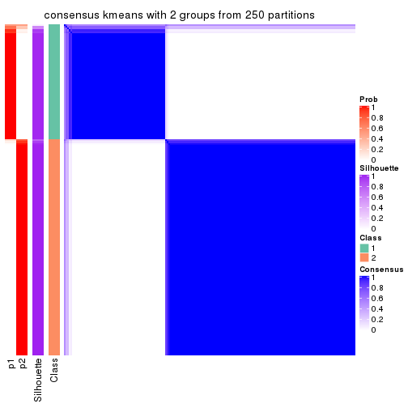</p>

</div>
<div id='tab-ATC-kmeans-consensus-heatmap-2'>
<pre><code class="r">consensus_heatmap(res, k = 3)
</code></pre>

<p>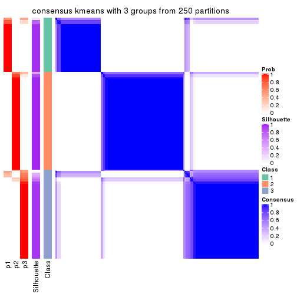</p>

</div>
<div id='tab-ATC-kmeans-consensus-heatmap-3'>
<pre><code class="r">consensus_heatmap(res, k = 4)
</code></pre>

<p>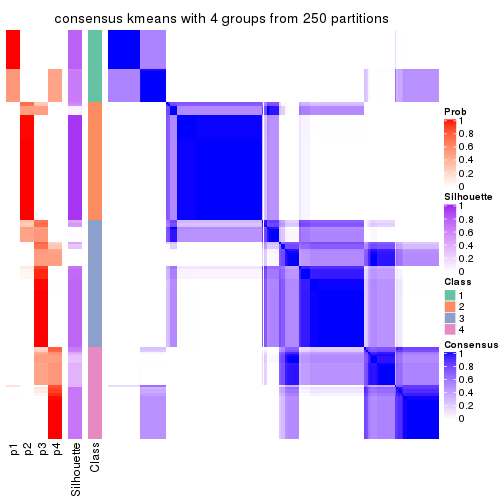</p>

</div>
<div id='tab-ATC-kmeans-consensus-heatmap-4'>
<pre><code class="r">consensus_heatmap(res, k = 5)
</code></pre>

<p>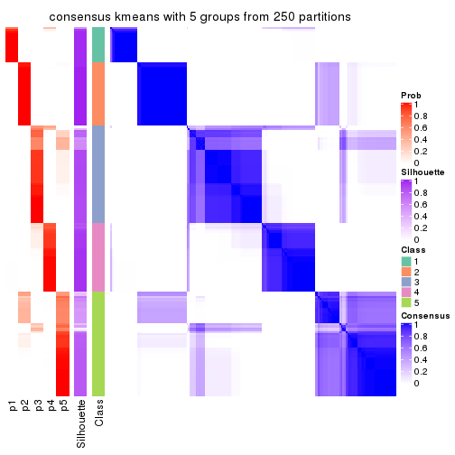</p>

</div>
<div id='tab-ATC-kmeans-consensus-heatmap-5'>
<pre><code class="r">consensus_heatmap(res, k = 6)
</code></pre>

<p>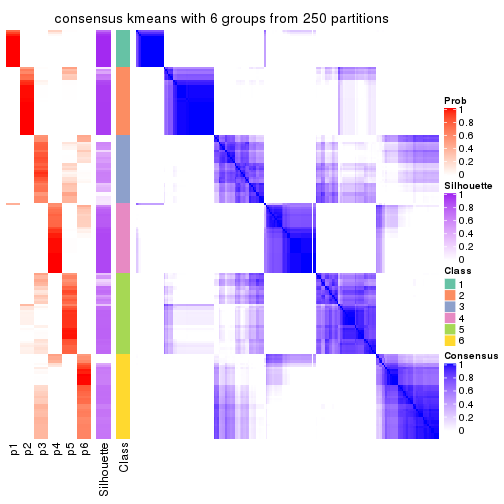</p>

</div>
</div>

Heatmaps for the membership of samples in all partitions to see how consistent they are:


<script>
$( function() {
	$( '#tabs-ATC-kmeans-membership-heatmap' ).tabs();
} );
</script>
<div id='tabs-ATC-kmeans-membership-heatmap'>
<ul>
<li><a href='#tab-ATC-kmeans-membership-heatmap-1'>k = 2</a></li>
<li><a href='#tab-ATC-kmeans-membership-heatmap-2'>k = 3</a></li>
<li><a href='#tab-ATC-kmeans-membership-heatmap-3'>k = 4</a></li>
<li><a href='#tab-ATC-kmeans-membership-heatmap-4'>k = 5</a></li>
<li><a href='#tab-ATC-kmeans-membership-heatmap-5'>k = 6</a></li>
</ul>
<div id='tab-ATC-kmeans-membership-heatmap-1'>
<pre><code class="r">membership_heatmap(res, k = 2)
</code></pre>

<p>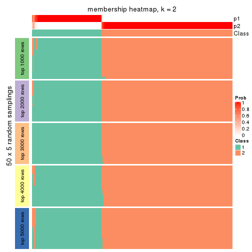</p>

</div>
<div id='tab-ATC-kmeans-membership-heatmap-2'>
<pre><code class="r">membership_heatmap(res, k = 3)
</code></pre>

<p>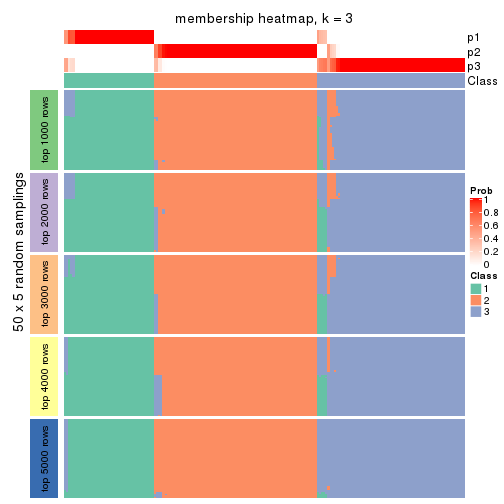</p>

</div>
<div id='tab-ATC-kmeans-membership-heatmap-3'>
<pre><code class="r">membership_heatmap(res, k = 4)
</code></pre>

<p>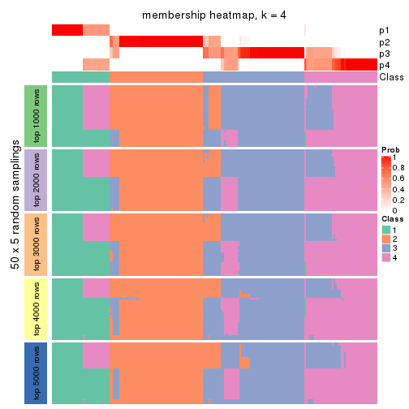</p>

</div>
<div id='tab-ATC-kmeans-membership-heatmap-4'>
<pre><code class="r">membership_heatmap(res, k = 5)
</code></pre>

<p>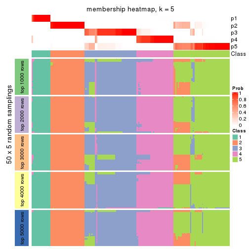</p>

</div>
<div id='tab-ATC-kmeans-membership-heatmap-5'>
<pre><code class="r">membership_heatmap(res, k = 6)
</code></pre>

<p>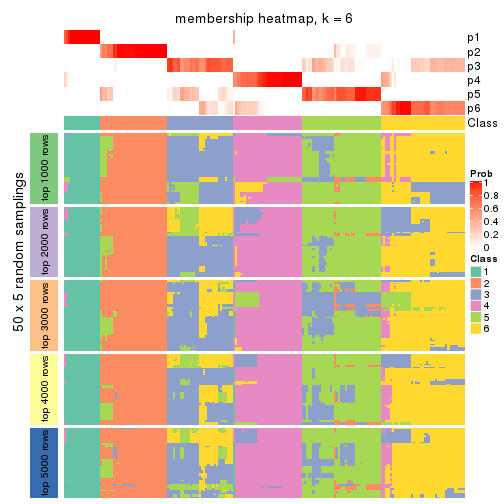</p>

</div>
</div>

As soon as we have had the classes for columns, we can look for signatures
which are significantly different between classes which can be candidate marks
for certain classes. Following are the heatmaps for signatures.


Signature heatmaps where rows are scaled:


<script>
$( function() {
	$( '#tabs-ATC-kmeans-get-signatures' ).tabs();
} );
</script>
<div id='tabs-ATC-kmeans-get-signatures'>
<ul>
<li><a href='#tab-ATC-kmeans-get-signatures-1'>k = 2</a></li>
<li><a href='#tab-ATC-kmeans-get-signatures-2'>k = 3</a></li>
<li><a href='#tab-ATC-kmeans-get-signatures-3'>k = 4</a></li>
<li><a href='#tab-ATC-kmeans-get-signatures-4'>k = 5</a></li>
<li><a href='#tab-ATC-kmeans-get-signatures-5'>k = 6</a></li>
</ul>
<div id='tab-ATC-kmeans-get-signatures-1'>
<pre><code class="r">get_signatures(res, k = 2)
</code></pre>

<p>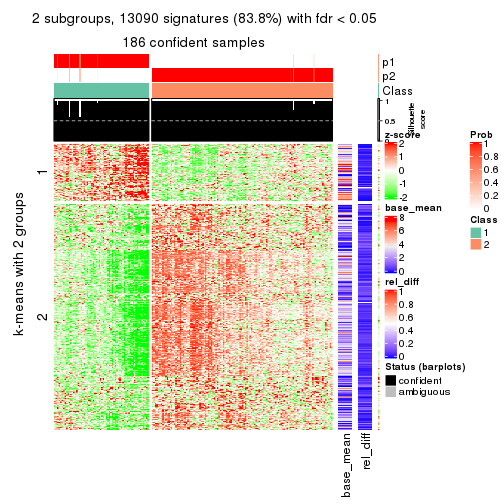</p>

</div>
<div id='tab-ATC-kmeans-get-signatures-2'>
<pre><code class="r">get_signatures(res, k = 3)
</code></pre>

<p>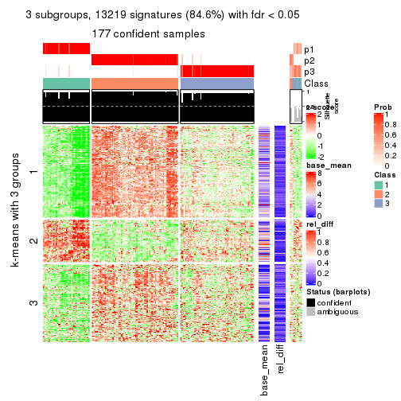</p>

</div>
<div id='tab-ATC-kmeans-get-signatures-3'>
<pre><code class="r">get_signatures(res, k = 4)
</code></pre>

<p>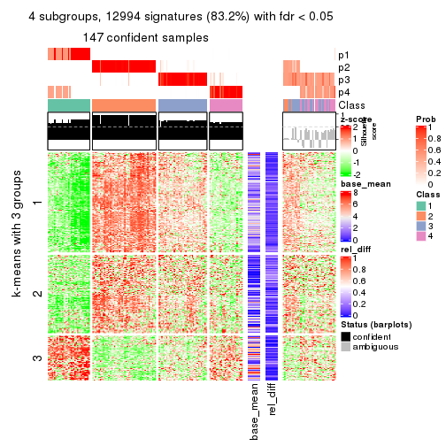</p>

</div>
<div id='tab-ATC-kmeans-get-signatures-4'>
<pre><code class="r">get_signatures(res, k = 5)
</code></pre>

<p>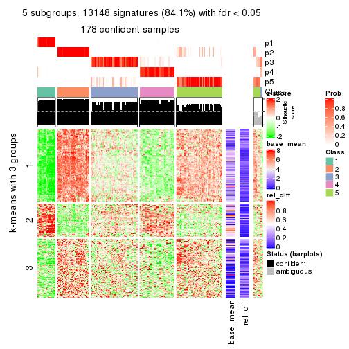</p>

</div>
<div id='tab-ATC-kmeans-get-signatures-5'>
<pre><code class="r">get_signatures(res, k = 6)
</code></pre>

<p>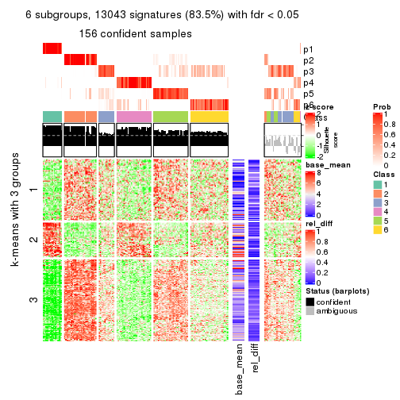</p>

</div>
</div>


Signature heatmaps where rows are not scaled:


<script>
$( function() {
	$( '#tabs-ATC-kmeans-get-signatures-no-scale' ).tabs();
} );
</script>
<div id='tabs-ATC-kmeans-get-signatures-no-scale'>
<ul>
<li><a href='#tab-ATC-kmeans-get-signatures-no-scale-1'>k = 2</a></li>
<li><a href='#tab-ATC-kmeans-get-signatures-no-scale-2'>k = 3</a></li>
<li><a href='#tab-ATC-kmeans-get-signatures-no-scale-3'>k = 4</a></li>
<li><a href='#tab-ATC-kmeans-get-signatures-no-scale-4'>k = 5</a></li>
<li><a href='#tab-ATC-kmeans-get-signatures-no-scale-5'>k = 6</a></li>
</ul>
<div id='tab-ATC-kmeans-get-signatures-no-scale-1'>
<pre><code class="r">get_signatures(res, k = 2, scale_rows = FALSE)
</code></pre>

<p>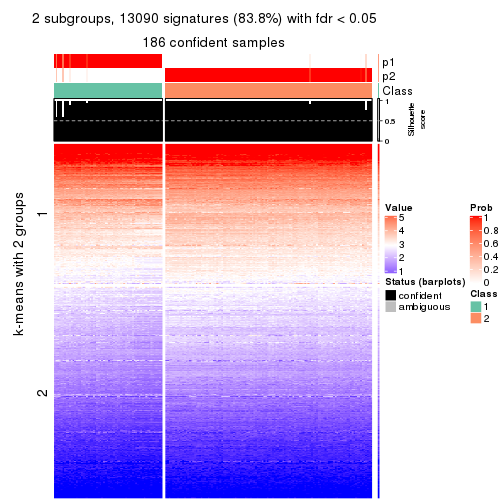</p>

</div>
<div id='tab-ATC-kmeans-get-signatures-no-scale-2'>
<pre><code class="r">get_signatures(res, k = 3, scale_rows = FALSE)
</code></pre>

<p>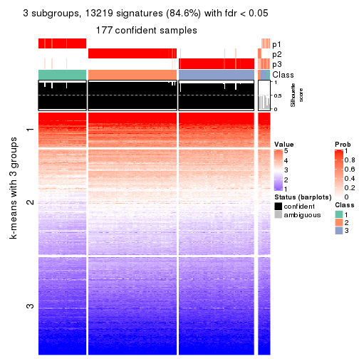</p>

</div>
<div id='tab-ATC-kmeans-get-signatures-no-scale-3'>
<pre><code class="r">get_signatures(res, k = 4, scale_rows = FALSE)
</code></pre>

<p>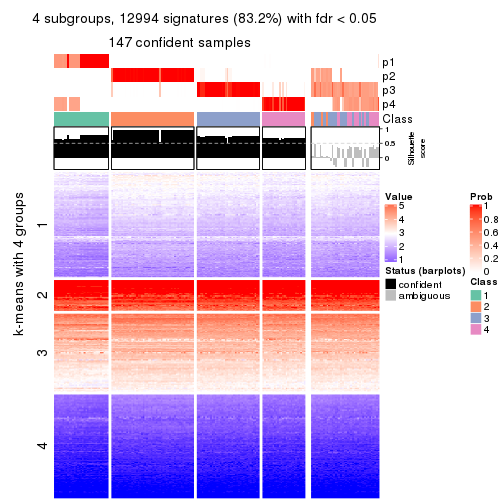</p>

</div>
<div id='tab-ATC-kmeans-get-signatures-no-scale-4'>
<pre><code class="r">get_signatures(res, k = 5, scale_rows = FALSE)
</code></pre>

<p>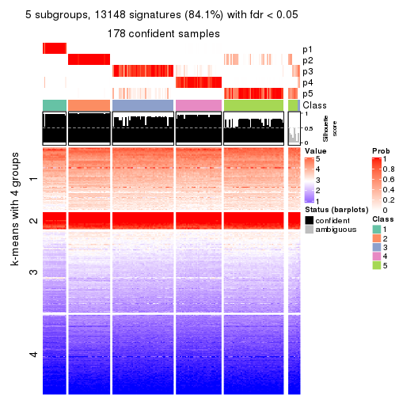</p>

</div>
<div id='tab-ATC-kmeans-get-signatures-no-scale-5'>
<pre><code class="r">get_signatures(res, k = 6, scale_rows = FALSE)
</code></pre>

<p>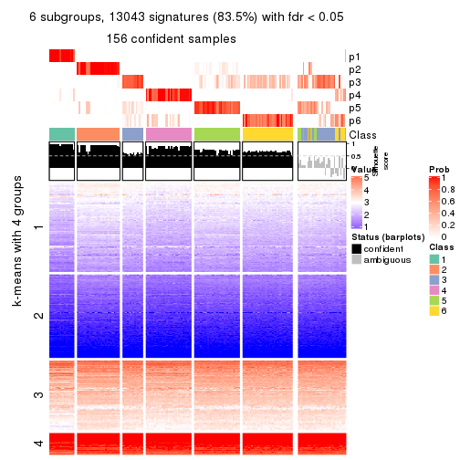</p>

</div>
</div>


Compare the overlap of signatures from different k:

```r
compare_signatures(res)
```

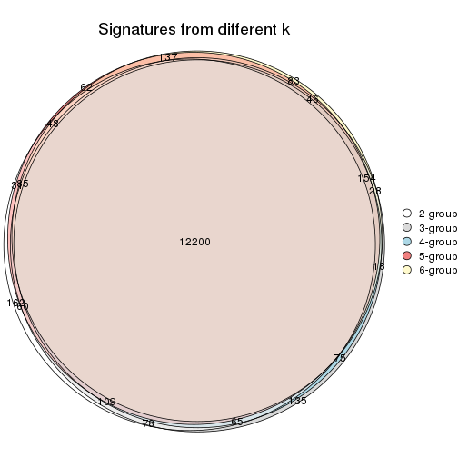

`get_signature()` returns a data frame invisibly. TO get the list of signatures, the function
call should be assigned to a variable explicitly. In following code, if `plot` argument is set
to `FALSE`, no heatmap is plotted while only the differential analysis is performed.

```r
# code only for demonstration
tb = get_signature(res, k = ..., plot = FALSE)
```

An example of the output of `tb` is:

```
#>   which_row         fdr    mean_1    mean_2 scaled_mean_1 scaled_mean_2 km
#> 1        38 0.042760348  8.373488  9.131774    -0.5533452     0.5164555  1
#> 2        40 0.018707592  7.106213  8.469186    -0.6173731     0.5762149  1
#> 3        55 0.019134737 10.221463 11.207825    -0.6159697     0.5749050  1
#> 4        59 0.006059896  5.921854  7.869574    -0.6899429     0.6439467  1
#> 5        60 0.018055526  8.928898 10.211722    -0.6204761     0.5791110  1
#> 6        98 0.009384629 15.714769 14.887706     0.6635654    -0.6193277  2
...
```

The columns in `tb` are:

1. `which_row`: row indices corresponding to the input matrix.
2. `fdr`: FDR for the differential test. 
3. `mean_x`: The mean value in group x.
4. `scaled_mean_x`: The mean value in group x after rows are scaled.
5. `km`: Row groups if k-means clustering is applied to rows.


UMAP plot which shows how samples are separated.


<script>
$( function() {
	$( '#tabs-ATC-kmeans-dimension-reduction' ).tabs();
} );
</script>
<div id='tabs-ATC-kmeans-dimension-reduction'>
<ul>
<li><a href='#tab-ATC-kmeans-dimension-reduction-1'>k = 2</a></li>
<li><a href='#tab-ATC-kmeans-dimension-reduction-2'>k = 3</a></li>
<li><a href='#tab-ATC-kmeans-dimension-reduction-3'>k = 4</a></li>
<li><a href='#tab-ATC-kmeans-dimension-reduction-4'>k = 5</a></li>
<li><a href='#tab-ATC-kmeans-dimension-reduction-5'>k = 6</a></li>
</ul>
<div id='tab-ATC-kmeans-dimension-reduction-1'>
<pre><code class="r">dimension_reduction(res, k = 2, method = &quot;UMAP&quot;)
</code></pre>

<p>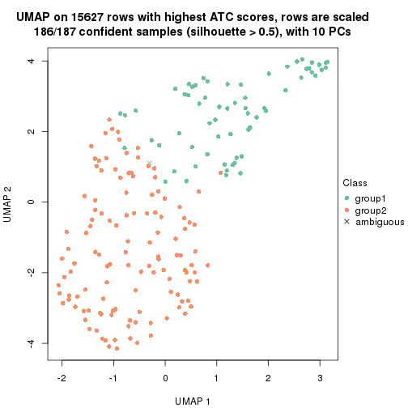</p>

</div>
<div id='tab-ATC-kmeans-dimension-reduction-2'>
<pre><code class="r">dimension_reduction(res, k = 3, method = &quot;UMAP&quot;)
</code></pre>

<p>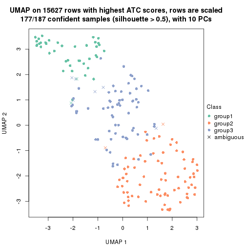</p>

</div>
<div id='tab-ATC-kmeans-dimension-reduction-3'>
<pre><code class="r">dimension_reduction(res, k = 4, method = &quot;UMAP&quot;)
</code></pre>

<p>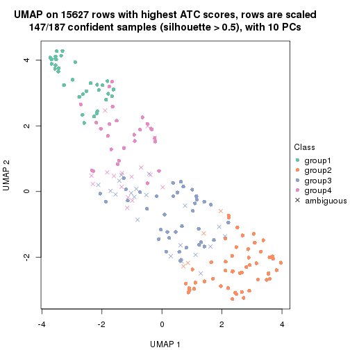</p>

</div>
<div id='tab-ATC-kmeans-dimension-reduction-4'>
<pre><code class="r">dimension_reduction(res, k = 5, method = &quot;UMAP&quot;)
</code></pre>

<p>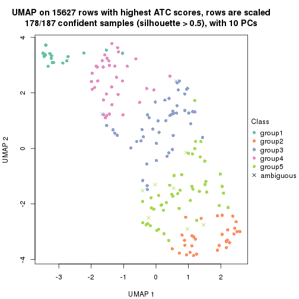</p>

</div>
<div id='tab-ATC-kmeans-dimension-reduction-5'>
<pre><code class="r">dimension_reduction(res, k = 6, method = &quot;UMAP&quot;)
</code></pre>

<p>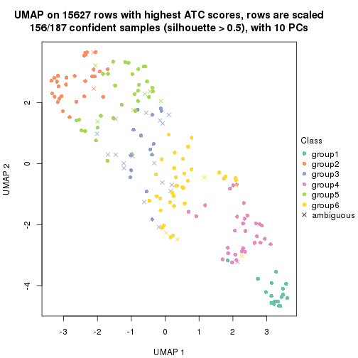</p>

</div>
</div>


Following heatmap shows how subgroups are split when increasing `k`:

```r
collect_classes(res)
```

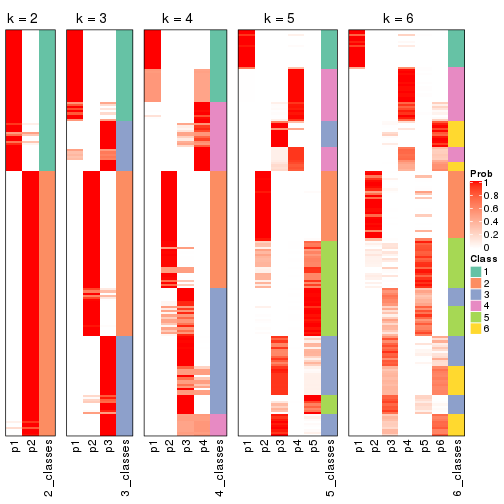


If matrix rows can be associated to genes, consider to use `GO_Enrichment(res,
...)` to perform function enrichment for the signature genes.


 

---------------------------------------------------


### ATC:skmeans**


The object with results only for a single top-value method and a single partition method 
can be extracted as:

```r
res = res_list["ATC", "skmeans"]
# you can also extract it by
# res = res_list["ATC:skmeans"]
```

A summary of `res` and all the functions that can be applied to it:

```r
res
```

```
#> A 'ConsensusPartition' object with k = 2, 3, 4, 5, 6.
#>   On a matrix with 15627 rows and 187 columns.
#>   Top rows (1000, 2000, 3000, 4000, 5000) are extracted by 'ATC' method.
#>   Subgroups are detected by 'skmeans' method.
#>   Performed in total 1250 partitions by row resampling.
#>   Best k for subgroups seems to be 3.
#> 
#> Following methods can be applied to this 'ConsensusPartition' object:
#>  [1] "cola_report"             "collect_classes"         "collect_plots"          
#>  [4] "collect_stats"           "colnames"                "compare_signatures"     
#>  [7] "consensus_heatmap"       "dimension_reduction"     "functional_enrichment"  
#> [10] "get_anno_col"            "get_anno"                "get_classes"            
#> [13] "get_consensus"           "get_matrix"              "get_membership"         
#> [16] "get_param"               "get_signatures"          "get_stats"              
#> [19] "is_best_k"               "is_stable_k"             "membership_heatmap"     
#> [22] "ncol"                    "nrow"                    "plot_ecdf"              
#> [25] "rownames"                "select_partition_number" "show"                   
#> [28] "suggest_best_k"          "test_to_known_factors"
```

`collect_plots()` function collects all the plots made from `res` for all `k` (number of partitions)
into one single page to provide an easy and fast comparison between different `k`.

```r
collect_plots(res)
```

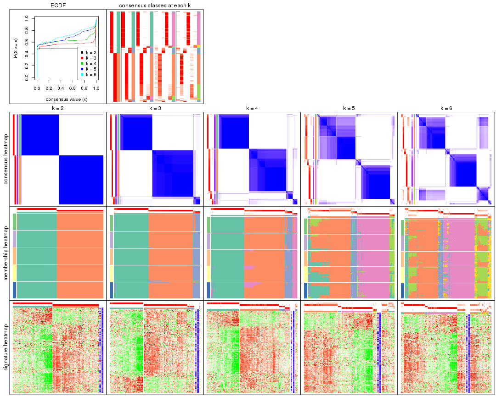

The plots are:

- The first row: a plot of the ECDF (Empirical cumulative distribution
  function) curves of the consensus matrix for each `k` and the heatmap of
  predicted classes for each `k`.
- The second row: heatmaps of the consensus matrix for each `k`.
- The third row: heatmaps of the membership matrix for each `k`.
- The fouth row: heatmaps of the signatures for each `k`.

All the plots in panels can be made by individual functions and they are
plotted later in this section.

`select_partition_number()` produces several plots showing different
statistics for choosing "optimized" `k`. There are following statistics:

- ECDF curves of the consensus matrix for each `k`;
- 1-PAC. [The PAC
  score](https://en.wikipedia.org/wiki/Consensus_clustering#Over-interpretation_potential_of_consensus_clustering)
  measures the proportion of the ambiguous subgrouping.
- Mean silhouette score.
- Concordance. The mean probability of fiting the consensus class ids in all
  partitions.
- Area increased. Denote $A_k$ as the area under the ECDF curve for current
  `k`, the area increased is defined as $A_k - A_{k-1}$.
- Rand index. The percent of pairs of samples that are both in a same cluster
  or both are not in a same cluster in the partition of k and k-1.
- Jaccard index. The ratio of pairs of samples are both in a same cluster in
  the partition of k and k-1 and the pairs of samples are both in a same
  cluster in the partition k or k-1.

The detailed explanations of these statistics can be found in [the cola
vignette](http://bioconductor.org/packages/devel/bioc/vignettes/cola/inst/doc/cola.html#toc_13).

Generally speaking, lower PAC score, higher mean silhouette score or higher
concordance corresponds to better partition. Rand index and Jaccard index
measure how similar the current partition is compared to partition with `k-1`.
If they are too similar, we won't accept `k` is better than `k-1`.

```r
select_partition_number(res)
```

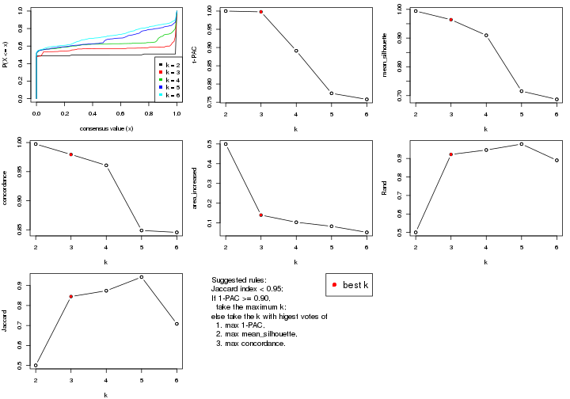

The numeric values for all these statistics can be obtained by `get_stats()`.

```r
get_stats(res)
```

```
#>   k 1-PAC mean_silhouette concordance area_increased  Rand Jaccard
#> 2 2 1.000           0.994       0.997         0.4995 0.501   0.501
#> 3 3 0.998           0.964       0.979         0.1396 0.922   0.845
#> 4 4 0.891           0.910       0.961         0.1034 0.946   0.874
#> 5 5 0.774           0.716       0.849         0.0830 0.978   0.942
#> 6 6 0.758           0.687       0.846         0.0522 0.890   0.708
```

`suggest_best_k()` suggests the best $k$ based on these statistics. The rules are as follows:

- All $k$ with Jaccard index larger than 0.95 are removed because the increase of
  the partition number does not provides enough extra information. If all $k$ are removed,
  the best $k$ is assigned by `NA`.
- For $k$ with 1-PAC larger than 0.9, the maximal $k$ is taken as the "best k". Other $k$ is called "optional k".
- If it does not fit the second rule. The $k$ with the highest vote of highest
  1-PAC, mean silhouette and concordance is taken as the "best k".

```r
suggest_best_k(res)
```

```
#> [1] 3
#> attr(,"optional")
#> [1] 2
```

There is also optional best $k$ = 2 that is worth to check.

Following shows the table of the partitions (You need to click the **show/hide
code output** link to see it). The membership matrix (columns with name `p*`)
is inferred by
[`clue::cl_consensus()`](https://www.rdocumentation.org/link/cl_consensus?package=clue)
function with the `SE` method. Basically the value in the membership matrix
represents the probability to belong to a certain group. The finall class
label for an item is determined with the group with highest probability it
belongs to.

In `get_classes()` function, the entropy is calculated from the membership
matrix and the silhouette score is calculated from the consensus matrix.


<script>
$( function() {
	$( '#tabs-ATC-skmeans-get-classes' ).tabs();
} );
</script>
<div id='tabs-ATC-skmeans-get-classes'>
<ul>
<li><a href='#tab-ATC-skmeans-get-classes-1'>k = 2</a></li>
<li><a href='#tab-ATC-skmeans-get-classes-2'>k = 3</a></li>
<li><a href='#tab-ATC-skmeans-get-classes-3'>k = 4</a></li>
<li><a href='#tab-ATC-skmeans-get-classes-4'>k = 5</a></li>
<li><a href='#tab-ATC-skmeans-get-classes-5'>k = 6</a></li>
</ul>

<div id='tab-ATC-skmeans-get-classes-1'>
<p><a id='tab-ATC-skmeans-get-classes-1-a' style='color:#0366d6' href='#'>show/hide code output</a></p>
<pre><code class="r">cbind(get_classes(res, k = 2), get_membership(res, k = 2))
</code></pre>

<pre><code>#&gt;            class entropy silhouette    p1    p2
#&gt; SRR1747213     1   0.000      0.994 1.000 0.000
#&gt; SRR1747214     1   0.000      0.994 1.000 0.000
#&gt; SRR1747215     2   0.000      1.000 0.000 1.000
#&gt; SRR1747216     2   0.000      1.000 0.000 1.000
#&gt; SRR1747217     1   0.795      0.686 0.760 0.240
#&gt; SRR1747218     2   0.000      1.000 0.000 1.000
#&gt; SRR1747219     1   0.000      0.994 1.000 0.000
#&gt; SRR1747220     1   0.000      0.994 1.000 0.000
#&gt; SRR1747221     1   0.000      0.994 1.000 0.000
#&gt; SRR1747222     1   0.000      0.994 1.000 0.000
#&gt; SRR1747223     1   0.000      0.994 1.000 0.000
#&gt; SRR1747224     1   0.000      0.994 1.000 0.000
#&gt; SRR1747225     2   0.000      1.000 0.000 1.000
#&gt; SRR1747226     2   0.000      1.000 0.000 1.000
#&gt; SRR1747227     2   0.000      1.000 0.000 1.000
#&gt; SRR1747228     2   0.000      1.000 0.000 1.000
#&gt; SRR1747229     2   0.000      1.000 0.000 1.000
#&gt; SRR1747230     1   0.000      0.994 1.000 0.000
#&gt; SRR1747231     1   0.000      0.994 1.000 0.000
#&gt; SRR1747232     1   0.000      0.994 1.000 0.000
#&gt; SRR1747233     1   0.000      0.994 1.000 0.000
#&gt; SRR1747234     2   0.000      1.000 0.000 1.000
#&gt; SRR1747235     1   0.000      0.994 1.000 0.000
#&gt; SRR1747236     2   0.000      1.000 0.000 1.000
#&gt; SRR1747237     2   0.000      1.000 0.000 1.000
#&gt; SRR1747238     2   0.000      1.000 0.000 1.000
#&gt; SRR1747239     2   0.000      1.000 0.000 1.000
#&gt; SRR1747240     1   0.000      0.994 1.000 0.000
#&gt; SRR1747241     2   0.000      1.000 0.000 1.000
#&gt; SRR1747242     1   0.000      0.994 1.000 0.000
#&gt; SRR1747243     1   0.000      0.994 1.000 0.000
#&gt; SRR1747244     2   0.000      1.000 0.000 1.000
#&gt; SRR1747245     2   0.000      1.000 0.000 1.000
#&gt; SRR1747246     2   0.000      1.000 0.000 1.000
#&gt; SRR1747247     1   0.000      0.994 1.000 0.000
#&gt; SRR1747248     1   0.000      0.994 1.000 0.000
#&gt; SRR1747249     1   0.000      0.994 1.000 0.000
#&gt; SRR1747250     2   0.000      1.000 0.000 1.000
#&gt; SRR1747252     1   0.000      0.994 1.000 0.000
#&gt; SRR1747253     1   0.000      0.994 1.000 0.000
#&gt; SRR1747254     2   0.000      1.000 0.000 1.000
#&gt; SRR1747255     1   0.000      0.994 1.000 0.000
#&gt; SRR1747256     1   0.000      0.994 1.000 0.000
#&gt; SRR1747257     2   0.000      1.000 0.000 1.000
#&gt; SRR1747258     2   0.000      1.000 0.000 1.000
#&gt; SRR1747259     2   0.000      1.000 0.000 1.000
#&gt; SRR1747260     1   0.000      0.994 1.000 0.000
#&gt; SRR1747261     2   0.000      1.000 0.000 1.000
#&gt; SRR1747262     2   0.000      1.000 0.000 1.000
#&gt; SRR1747263     2   0.000      1.000 0.000 1.000
#&gt; SRR1747264     1   0.000      0.994 1.000 0.000
#&gt; SRR1747265     1   0.000      0.994 1.000 0.000
#&gt; SRR1747266     2   0.000      1.000 0.000 1.000
#&gt; SRR1747267     1   0.000      0.994 1.000 0.000
#&gt; SRR1747268     1   0.000      0.994 1.000 0.000
#&gt; SRR1747269     2   0.000      1.000 0.000 1.000
#&gt; SRR1747270     2   0.000      1.000 0.000 1.000
#&gt; SRR1747271     2   0.000      1.000 0.000 1.000
#&gt; SRR1747272     1   0.000      0.994 1.000 0.000
#&gt; SRR1747273     1   0.000      0.994 1.000 0.000
#&gt; SRR1747274     2   0.000      1.000 0.000 1.000
#&gt; SRR1747275     1   0.000      0.994 1.000 0.000
#&gt; SRR1747276     1   0.000      0.994 1.000 0.000
#&gt; SRR1747277     2   0.000      1.000 0.000 1.000
#&gt; SRR1747278     2   0.000      1.000 0.000 1.000
#&gt; SRR1747280     1   0.000      0.994 1.000 0.000
#&gt; SRR1747279     1   0.000      0.994 1.000 0.000
#&gt; SRR1747281     2   0.000      1.000 0.000 1.000
#&gt; SRR1747282     1   0.000      0.994 1.000 0.000
#&gt; SRR1747283     2   0.000      1.000 0.000 1.000
#&gt; SRR1747284     1   0.000      0.994 1.000 0.000
#&gt; SRR1747285     1   0.802      0.680 0.756 0.244
#&gt; SRR1747286     2   0.000      1.000 0.000 1.000
#&gt; SRR1747287     2   0.000      1.000 0.000 1.000
#&gt; SRR1747288     1   0.000      0.994 1.000 0.000
#&gt; SRR1747290     2   0.000      1.000 0.000 1.000
#&gt; SRR1747289     2   0.000      1.000 0.000 1.000
#&gt; SRR1747291     2   0.000      1.000 0.000 1.000
#&gt; SRR1747293     2   0.000      1.000 0.000 1.000
#&gt; SRR1747294     2   0.000      1.000 0.000 1.000
#&gt; SRR1747292     1   0.000      0.994 1.000 0.000
#&gt; SRR1747295     2   0.000      1.000 0.000 1.000
#&gt; SRR1747296     2   0.000      1.000 0.000 1.000
#&gt; SRR1747297     2   0.000      1.000 0.000 1.000
#&gt; SRR1747298     2   0.000      1.000 0.000 1.000
#&gt; SRR1747299     2   0.000      1.000 0.000 1.000
#&gt; SRR1747300     2   0.000      1.000 0.000 1.000
#&gt; SRR1747301     2   0.000      1.000 0.000 1.000
#&gt; SRR1747302     2   0.000      1.000 0.000 1.000
#&gt; SRR1747303     2   0.000      1.000 0.000 1.000
#&gt; SRR1747304     1   0.000      0.994 1.000 0.000
#&gt; SRR1747305     2   0.000      1.000 0.000 1.000
#&gt; SRR1747306     2   0.000      1.000 0.000 1.000
#&gt; SRR1747307     1   0.000      0.994 1.000 0.000
#&gt; SRR1747308     2   0.000      1.000 0.000 1.000
#&gt; SRR1747309     1   0.000      0.994 1.000 0.000
#&gt; SRR1747310     1   0.000      0.994 1.000 0.000
#&gt; SRR1747311     1   0.000      0.994 1.000 0.000
#&gt; SRR1747313     1   0.000      0.994 1.000 0.000
#&gt; SRR1747312     1   0.000      0.994 1.000 0.000
#&gt; SRR1747314     1   0.000      0.994 1.000 0.000
#&gt; SRR1747315     2   0.000      1.000 0.000 1.000
#&gt; SRR1747316     2   0.000      1.000 0.000 1.000
#&gt; SRR1747318     1   0.000      0.994 1.000 0.000
#&gt; SRR1747317     1   0.000      0.994 1.000 0.000
#&gt; SRR1747319     1   0.000      0.994 1.000 0.000
#&gt; SRR1747320     1   0.000      0.994 1.000 0.000
#&gt; SRR1747322     1   0.000      0.994 1.000 0.000
#&gt; SRR1747321     1   0.000      0.994 1.000 0.000
#&gt; SRR1747323     2   0.000      1.000 0.000 1.000
#&gt; SRR1747324     2   0.000      1.000 0.000 1.000
#&gt; SRR1747326     2   0.000      1.000 0.000 1.000
#&gt; SRR1747325     2   0.000      1.000 0.000 1.000
#&gt; SRR1747327     2   0.000      1.000 0.000 1.000
#&gt; SRR1747328     2   0.000      1.000 0.000 1.000
#&gt; SRR1747330     1   0.000      0.994 1.000 0.000
#&gt; SRR1747329     2   0.000      1.000 0.000 1.000
#&gt; SRR1747332     1   0.000      0.994 1.000 0.000
#&gt; SRR1747331     2   0.000      1.000 0.000 1.000
#&gt; SRR1747333     2   0.000      1.000 0.000 1.000
#&gt; SRR1747334     2   0.000      1.000 0.000 1.000
#&gt; SRR1747335     1   0.000      0.994 1.000 0.000
#&gt; SRR1747336     1   0.000      0.994 1.000 0.000
#&gt; SRR1747337     2   0.000      1.000 0.000 1.000
#&gt; SRR1747338     2   0.000      1.000 0.000 1.000
#&gt; SRR1747339     1   0.000      0.994 1.000 0.000
#&gt; SRR1747340     2   0.000      1.000 0.000 1.000
#&gt; SRR1747341     2   0.000      1.000 0.000 1.000
#&gt; SRR1747342     2   0.000      1.000 0.000 1.000
#&gt; SRR1747343     2   0.000      1.000 0.000 1.000
#&gt; SRR1747344     2   0.000      1.000 0.000 1.000
#&gt; SRR1747345     1   0.000      0.994 1.000 0.000
#&gt; SRR1747346     1   0.000      0.994 1.000 0.000
#&gt; SRR1747347     2   0.000      1.000 0.000 1.000
#&gt; SRR1747348     1   0.000      0.994 1.000 0.000
#&gt; SRR1747349     1   0.000      0.994 1.000 0.000
#&gt; SRR1747351     2   0.000      1.000 0.000 1.000
#&gt; SRR1747350     2   0.000      1.000 0.000 1.000
#&gt; SRR1747352     1   0.000      0.994 1.000 0.000
#&gt; SRR1747353     2   0.000      1.000 0.000 1.000
#&gt; SRR1747354     2   0.000      1.000 0.000 1.000
#&gt; SRR1747355     1   0.000      0.994 1.000 0.000
#&gt; SRR1747356     2   0.000      1.000 0.000 1.000
#&gt; SRR1747357     1   0.000      0.994 1.000 0.000
#&gt; SRR1747358     2   0.000      1.000 0.000 1.000
#&gt; SRR1747359     1   0.000      0.994 1.000 0.000
#&gt; SRR1747360     2   0.000      1.000 0.000 1.000
#&gt; SRR1747361     1   0.000      0.994 1.000 0.000
#&gt; SRR1747362     2   0.000      1.000 0.000 1.000
#&gt; SRR1747363     1   0.000      0.994 1.000 0.000
#&gt; SRR1747364     1   0.000      0.994 1.000 0.000
#&gt; SRR1747365     1   0.000      0.994 1.000 0.000
#&gt; SRR1747366     2   0.000      1.000 0.000 1.000
#&gt; SRR1747367     1   0.000      0.994 1.000 0.000
#&gt; SRR1747369     2   0.000      1.000 0.000 1.000
#&gt; SRR1747368     1   0.000      0.994 1.000 0.000
#&gt; SRR1747370     2   0.000      1.000 0.000 1.000
#&gt; SRR1747372     1   0.000      0.994 1.000 0.000
#&gt; SRR1747371     1   0.000      0.994 1.000 0.000
#&gt; SRR1747373     2   0.000      1.000 0.000 1.000
#&gt; SRR1747374     2   0.000      1.000 0.000 1.000
#&gt; SRR1747375     1   0.000      0.994 1.000 0.000
#&gt; SRR1747376     2   0.000      1.000 0.000 1.000
#&gt; SRR1747377     2   0.000      1.000 0.000 1.000
#&gt; SRR1747378     2   0.000      1.000 0.000 1.000
#&gt; SRR1747379     2   0.000      1.000 0.000 1.000
#&gt; SRR1747380     1   0.000      0.994 1.000 0.000
#&gt; SRR1747381     1   0.000      0.994 1.000 0.000
#&gt; SRR1747382     1   0.000      0.994 1.000 0.000
#&gt; SRR1747383     2   0.000      1.000 0.000 1.000
#&gt; SRR1747384     1   0.000      0.994 1.000 0.000
#&gt; SRR1747385     2   0.000      1.000 0.000 1.000
#&gt; SRR1747386     1   0.000      0.994 1.000 0.000
#&gt; SRR1747387     2   0.000      1.000 0.000 1.000
#&gt; SRR1747388     2   0.000      1.000 0.000 1.000
#&gt; SRR1747390     2   0.000      1.000 0.000 1.000
#&gt; SRR1747389     2   0.000      1.000 0.000 1.000
#&gt; SRR1747391     2   0.000      1.000 0.000 1.000
#&gt; SRR1747392     2   0.000      1.000 0.000 1.000
#&gt; SRR1747393     2   0.000      1.000 0.000 1.000
#&gt; SRR1747394     1   0.000      0.994 1.000 0.000
#&gt; SRR1747395     1   0.000      0.994 1.000 0.000
#&gt; SRR1747396     2   0.000      1.000 0.000 1.000
#&gt; SRR1747398     2   0.000      1.000 0.000 1.000
#&gt; SRR1747397     1   0.000      0.994 1.000 0.000
#&gt; SRR1747399     1   0.000      0.994 1.000 0.000
#&gt; SRR1747400     1   0.000      0.994 1.000 0.000
</code></pre>

<script>
$('#tab-ATC-skmeans-get-classes-1-a').parent().next().next().hide();
$('#tab-ATC-skmeans-get-classes-1-a').click(function(){
  $('#tab-ATC-skmeans-get-classes-1-a').parent().next().next().toggle();
  return(false);
});
</script>
</div>

<div id='tab-ATC-skmeans-get-classes-2'>
<p><a id='tab-ATC-skmeans-get-classes-2-a' style='color:#0366d6' href='#'>show/hide code output</a></p>
<pre><code class="r">cbind(get_classes(res, k = 3), get_membership(res, k = 3))
</code></pre>

<pre><code>#&gt;            class entropy silhouette    p1    p2    p3
#&gt; SRR1747213     1  0.0000      0.984 1.000 0.000 0.000
#&gt; SRR1747214     1  0.0000      0.984 1.000 0.000 0.000
#&gt; SRR1747215     2  0.0000      0.992 0.000 1.000 0.000
#&gt; SRR1747216     2  0.0237      0.991 0.000 0.996 0.004
#&gt; SRR1747217     3  0.3375      0.871 0.044 0.048 0.908
#&gt; SRR1747218     2  0.0000      0.992 0.000 1.000 0.000
#&gt; SRR1747219     3  0.5760      0.496 0.328 0.000 0.672
#&gt; SRR1747220     1  0.0000      0.984 1.000 0.000 0.000
#&gt; SRR1747221     1  0.0000      0.984 1.000 0.000 0.000
#&gt; SRR1747222     1  0.0000      0.984 1.000 0.000 0.000
#&gt; SRR1747223     1  0.0000      0.984 1.000 0.000 0.000
#&gt; SRR1747224     1  0.0000      0.984 1.000 0.000 0.000
#&gt; SRR1747225     2  0.0747      0.988 0.000 0.984 0.016
#&gt; SRR1747226     2  0.0000      0.992 0.000 1.000 0.000
#&gt; SRR1747227     2  0.0000      0.992 0.000 1.000 0.000
#&gt; SRR1747228     2  0.0000      0.992 0.000 1.000 0.000
#&gt; SRR1747229     2  0.0000      0.992 0.000 1.000 0.000
#&gt; SRR1747230     1  0.0000      0.984 1.000 0.000 0.000
#&gt; SRR1747231     1  0.5926      0.439 0.644 0.000 0.356
#&gt; SRR1747232     1  0.0000      0.984 1.000 0.000 0.000
#&gt; SRR1747233     1  0.0000      0.984 1.000 0.000 0.000
#&gt; SRR1747234     3  0.5098      0.728 0.000 0.248 0.752
#&gt; SRR1747235     1  0.0000      0.984 1.000 0.000 0.000
#&gt; SRR1747236     2  0.0424      0.991 0.000 0.992 0.008
#&gt; SRR1747237     2  0.0000      0.992 0.000 1.000 0.000
#&gt; SRR1747238     2  0.0000      0.992 0.000 1.000 0.000
#&gt; SRR1747239     2  0.0000      0.992 0.000 1.000 0.000
#&gt; SRR1747240     1  0.0000      0.984 1.000 0.000 0.000
#&gt; SRR1747241     3  0.5138      0.725 0.000 0.252 0.748
#&gt; SRR1747242     1  0.0000      0.984 1.000 0.000 0.000
#&gt; SRR1747243     1  0.0000      0.984 1.000 0.000 0.000
#&gt; SRR1747244     2  0.0000      0.992 0.000 1.000 0.000
#&gt; SRR1747245     2  0.0000      0.992 0.000 1.000 0.000
#&gt; SRR1747246     2  0.0424      0.991 0.000 0.992 0.008
#&gt; SRR1747247     1  0.0000      0.984 1.000 0.000 0.000
#&gt; SRR1747248     1  0.0000      0.984 1.000 0.000 0.000
#&gt; SRR1747249     1  0.0000      0.984 1.000 0.000 0.000
#&gt; SRR1747250     3  0.5465      0.671 0.000 0.288 0.712
#&gt; SRR1747252     1  0.0000      0.984 1.000 0.000 0.000
#&gt; SRR1747253     1  0.0000      0.984 1.000 0.000 0.000
#&gt; SRR1747254     2  0.0000      0.992 0.000 1.000 0.000
#&gt; SRR1747255     1  0.0000      0.984 1.000 0.000 0.000
#&gt; SRR1747256     1  0.0000      0.984 1.000 0.000 0.000
#&gt; SRR1747257     2  0.0000      0.992 0.000 1.000 0.000
#&gt; SRR1747258     2  0.1753      0.962 0.000 0.952 0.048
#&gt; SRR1747259     2  0.0000      0.992 0.000 1.000 0.000
#&gt; SRR1747260     1  0.4504      0.752 0.804 0.000 0.196
#&gt; SRR1747261     2  0.0000      0.992 0.000 1.000 0.000
#&gt; SRR1747262     2  0.0424      0.991 0.000 0.992 0.008
#&gt; SRR1747263     2  0.0000      0.992 0.000 1.000 0.000
#&gt; SRR1747264     1  0.0000      0.984 1.000 0.000 0.000
#&gt; SRR1747265     3  0.1411      0.883 0.036 0.000 0.964
#&gt; SRR1747266     2  0.1529      0.970 0.000 0.960 0.040
#&gt; SRR1747267     3  0.1529      0.884 0.040 0.000 0.960
#&gt; SRR1747268     1  0.1163      0.958 0.972 0.000 0.028
#&gt; SRR1747269     2  0.0747      0.988 0.000 0.984 0.016
#&gt; SRR1747270     2  0.0000      0.992 0.000 1.000 0.000
#&gt; SRR1747271     2  0.0592      0.989 0.000 0.988 0.012
#&gt; SRR1747272     1  0.0000      0.984 1.000 0.000 0.000
#&gt; SRR1747273     1  0.0000      0.984 1.000 0.000 0.000
#&gt; SRR1747274     2  0.0747      0.988 0.000 0.984 0.016
#&gt; SRR1747275     1  0.0000      0.984 1.000 0.000 0.000
#&gt; SRR1747276     1  0.0000      0.984 1.000 0.000 0.000
#&gt; SRR1747277     2  0.0000      0.992 0.000 1.000 0.000
#&gt; SRR1747278     2  0.1753      0.962 0.000 0.952 0.048
#&gt; SRR1747280     1  0.0000      0.984 1.000 0.000 0.000
#&gt; SRR1747279     1  0.0000      0.984 1.000 0.000 0.000
#&gt; SRR1747281     2  0.0424      0.991 0.000 0.992 0.008
#&gt; SRR1747282     1  0.0000      0.984 1.000 0.000 0.000
#&gt; SRR1747283     3  0.1753      0.868 0.000 0.048 0.952
#&gt; SRR1747284     1  0.0000      0.984 1.000 0.000 0.000
#&gt; SRR1747285     1  0.5618      0.685 0.796 0.156 0.048
#&gt; SRR1747286     2  0.0892      0.986 0.000 0.980 0.020
#&gt; SRR1747287     2  0.0000      0.992 0.000 1.000 0.000
#&gt; SRR1747288     1  0.0000      0.984 1.000 0.000 0.000
#&gt; SRR1747290     2  0.0424      0.991 0.000 0.992 0.008
#&gt; SRR1747289     2  0.0424      0.991 0.000 0.992 0.008
#&gt; SRR1747291     2  0.0000      0.992 0.000 1.000 0.000
#&gt; SRR1747293     2  0.1411      0.973 0.000 0.964 0.036
#&gt; SRR1747294     2  0.0000      0.992 0.000 1.000 0.000
#&gt; SRR1747292     1  0.0000      0.984 1.000 0.000 0.000
#&gt; SRR1747295     2  0.0424      0.991 0.000 0.992 0.008
#&gt; SRR1747296     2  0.0000      0.992 0.000 1.000 0.000
#&gt; SRR1747297     2  0.0000      0.992 0.000 1.000 0.000
#&gt; SRR1747298     2  0.0000      0.992 0.000 1.000 0.000
#&gt; SRR1747299     2  0.0424      0.991 0.000 0.992 0.008
#&gt; SRR1747300     2  0.0747      0.988 0.000 0.984 0.016
#&gt; SRR1747301     2  0.0000      0.992 0.000 1.000 0.000
#&gt; SRR1747302     2  0.0424      0.991 0.000 0.992 0.008
#&gt; SRR1747303     2  0.0000      0.992 0.000 1.000 0.000
#&gt; SRR1747304     1  0.0000      0.984 1.000 0.000 0.000
#&gt; SRR1747305     2  0.0000      0.992 0.000 1.000 0.000
#&gt; SRR1747306     2  0.0424      0.991 0.000 0.992 0.008
#&gt; SRR1747307     1  0.2711      0.896 0.912 0.000 0.088
#&gt; SRR1747308     2  0.0000      0.992 0.000 1.000 0.000
#&gt; SRR1747309     1  0.0000      0.984 1.000 0.000 0.000
#&gt; SRR1747310     1  0.0000      0.984 1.000 0.000 0.000
#&gt; SRR1747311     1  0.0000      0.984 1.000 0.000 0.000
#&gt; SRR1747313     1  0.0000      0.984 1.000 0.000 0.000
#&gt; SRR1747312     1  0.0000      0.984 1.000 0.000 0.000
#&gt; SRR1747314     1  0.0000      0.984 1.000 0.000 0.000
#&gt; SRR1747315     2  0.0000      0.992 0.000 1.000 0.000
#&gt; SRR1747316     2  0.0000      0.992 0.000 1.000 0.000
#&gt; SRR1747318     1  0.0000      0.984 1.000 0.000 0.000
#&gt; SRR1747317     1  0.0000      0.984 1.000 0.000 0.000
#&gt; SRR1747319     1  0.2711      0.896 0.912 0.000 0.088
#&gt; SRR1747320     1  0.0000      0.984 1.000 0.000 0.000
#&gt; SRR1747322     1  0.0000      0.984 1.000 0.000 0.000
#&gt; SRR1747321     1  0.0000      0.984 1.000 0.000 0.000
#&gt; SRR1747323     2  0.0000      0.992 0.000 1.000 0.000
#&gt; SRR1747324     2  0.0747      0.988 0.000 0.984 0.016
#&gt; SRR1747326     2  0.0424      0.991 0.000 0.992 0.008
#&gt; SRR1747325     2  0.0000      0.992 0.000 1.000 0.000
#&gt; SRR1747327     2  0.0000      0.992 0.000 1.000 0.000
#&gt; SRR1747328     2  0.0000      0.992 0.000 1.000 0.000
#&gt; SRR1747330     1  0.0000      0.984 1.000 0.000 0.000
#&gt; SRR1747329     2  0.0000      0.992 0.000 1.000 0.000
#&gt; SRR1747332     1  0.0000      0.984 1.000 0.000 0.000
#&gt; SRR1747331     2  0.0747      0.988 0.000 0.984 0.016
#&gt; SRR1747333     2  0.0000      0.992 0.000 1.000 0.000
#&gt; SRR1747334     2  0.0747      0.988 0.000 0.984 0.016
#&gt; SRR1747335     3  0.1753      0.882 0.048 0.000 0.952
#&gt; SRR1747336     1  0.0000      0.984 1.000 0.000 0.000
#&gt; SRR1747337     2  0.0000      0.992 0.000 1.000 0.000
#&gt; SRR1747338     2  0.0424      0.991 0.000 0.992 0.008
#&gt; SRR1747339     1  0.0000      0.984 1.000 0.000 0.000
#&gt; SRR1747340     2  0.1411      0.973 0.000 0.964 0.036
#&gt; SRR1747341     2  0.0000      0.992 0.000 1.000 0.000
#&gt; SRR1747342     2  0.0000      0.992 0.000 1.000 0.000
#&gt; SRR1747343     2  0.0000      0.992 0.000 1.000 0.000
#&gt; SRR1747344     2  0.0000      0.992 0.000 1.000 0.000
#&gt; SRR1747345     1  0.0000      0.984 1.000 0.000 0.000
#&gt; SRR1747346     3  0.1529      0.884 0.040 0.000 0.960
#&gt; SRR1747347     2  0.0000      0.992 0.000 1.000 0.000
#&gt; SRR1747348     1  0.0000      0.984 1.000 0.000 0.000
#&gt; SRR1747349     1  0.0000      0.984 1.000 0.000 0.000
#&gt; SRR1747351     2  0.0000      0.992 0.000 1.000 0.000
#&gt; SRR1747350     2  0.0747      0.988 0.000 0.984 0.016
#&gt; SRR1747352     1  0.0000      0.984 1.000 0.000 0.000
#&gt; SRR1747353     2  0.0000      0.992 0.000 1.000 0.000
#&gt; SRR1747354     2  0.0892      0.977 0.000 0.980 0.020
#&gt; SRR1747355     1  0.2356      0.914 0.928 0.000 0.072
#&gt; SRR1747356     2  0.1753      0.962 0.000 0.952 0.048
#&gt; SRR1747357     1  0.1753      0.938 0.952 0.000 0.048
#&gt; SRR1747358     3  0.5465      0.673 0.000 0.288 0.712
#&gt; SRR1747359     1  0.0000      0.984 1.000 0.000 0.000
#&gt; SRR1747360     2  0.0747      0.988 0.000 0.984 0.016
#&gt; SRR1747361     1  0.0000      0.984 1.000 0.000 0.000
#&gt; SRR1747362     2  0.0747      0.988 0.000 0.984 0.016
#&gt; SRR1747363     3  0.1753      0.882 0.048 0.000 0.952
#&gt; SRR1747364     1  0.0000      0.984 1.000 0.000 0.000
#&gt; SRR1747365     3  0.1753      0.882 0.048 0.000 0.952
#&gt; SRR1747366     2  0.0747      0.988 0.000 0.984 0.016
#&gt; SRR1747367     1  0.0000      0.984 1.000 0.000 0.000
#&gt; SRR1747369     2  0.0424      0.991 0.000 0.992 0.008
#&gt; SRR1747368     3  0.1411      0.883 0.036 0.000 0.964
#&gt; SRR1747370     2  0.1753      0.962 0.000 0.952 0.048
#&gt; SRR1747372     1  0.0000      0.984 1.000 0.000 0.000
#&gt; SRR1747371     1  0.0000      0.984 1.000 0.000 0.000
#&gt; SRR1747373     2  0.0424      0.991 0.000 0.992 0.008
#&gt; SRR1747374     2  0.0424      0.991 0.000 0.992 0.008
#&gt; SRR1747375     1  0.0000      0.984 1.000 0.000 0.000
#&gt; SRR1747376     2  0.0424      0.991 0.000 0.992 0.008
#&gt; SRR1747377     2  0.0000      0.992 0.000 1.000 0.000
#&gt; SRR1747378     2  0.0747      0.988 0.000 0.984 0.016
#&gt; SRR1747379     2  0.0000      0.992 0.000 1.000 0.000
#&gt; SRR1747380     3  0.1529      0.884 0.040 0.000 0.960
#&gt; SRR1747381     1  0.0000      0.984 1.000 0.000 0.000
#&gt; SRR1747382     1  0.0000      0.984 1.000 0.000 0.000
#&gt; SRR1747383     2  0.0000      0.992 0.000 1.000 0.000
#&gt; SRR1747384     3  0.1753      0.882 0.048 0.000 0.952
#&gt; SRR1747385     2  0.1411      0.973 0.000 0.964 0.036
#&gt; SRR1747386     1  0.0000      0.984 1.000 0.000 0.000
#&gt; SRR1747387     2  0.0000      0.992 0.000 1.000 0.000
#&gt; SRR1747388     2  0.0747      0.988 0.000 0.984 0.016
#&gt; SRR1747390     2  0.0000      0.992 0.000 1.000 0.000
#&gt; SRR1747389     2  0.0424      0.991 0.000 0.992 0.008
#&gt; SRR1747391     2  0.0747      0.988 0.000 0.984 0.016
#&gt; SRR1747392     2  0.0747      0.988 0.000 0.984 0.016
#&gt; SRR1747393     2  0.1289      0.976 0.000 0.968 0.032
#&gt; SRR1747394     1  0.0000      0.984 1.000 0.000 0.000
#&gt; SRR1747395     1  0.0000      0.984 1.000 0.000 0.000
#&gt; SRR1747396     2  0.0747      0.988 0.000 0.984 0.016
#&gt; SRR1747398     2  0.0747      0.988 0.000 0.984 0.016
#&gt; SRR1747397     1  0.0000      0.984 1.000 0.000 0.000
#&gt; SRR1747399     1  0.0000      0.984 1.000 0.000 0.000
#&gt; SRR1747400     1  0.0000      0.984 1.000 0.000 0.000
</code></pre>

<script>
$('#tab-ATC-skmeans-get-classes-2-a').parent().next().next().hide();
$('#tab-ATC-skmeans-get-classes-2-a').click(function(){
  $('#tab-ATC-skmeans-get-classes-2-a').parent().next().next().toggle();
  return(false);
});
</script>
</div>

<div id='tab-ATC-skmeans-get-classes-3'>
<p><a id='tab-ATC-skmeans-get-classes-3-a' style='color:#0366d6' href='#'>show/hide code output</a></p>
<pre><code class="r">cbind(get_classes(res, k = 4), get_membership(res, k = 4))
</code></pre>

<pre><code>#&gt;            class entropy silhouette    p1    p2    p3    p4
#&gt; SRR1747213     1  0.0000     0.9842 1.000 0.000 0.000 0.000
#&gt; SRR1747214     1  0.0000     0.9842 1.000 0.000 0.000 0.000
#&gt; SRR1747215     2  0.0000     0.9569 0.000 1.000 0.000 0.000
#&gt; SRR1747216     2  0.0000     0.9569 0.000 1.000 0.000 0.000
#&gt; SRR1747217     3  0.2489     0.7129 0.020 0.068 0.912 0.000
#&gt; SRR1747218     2  0.0000     0.9569 0.000 1.000 0.000 0.000
#&gt; SRR1747219     3  0.4673     0.3686 0.292 0.000 0.700 0.008
#&gt; SRR1747220     1  0.0000     0.9842 1.000 0.000 0.000 0.000
#&gt; SRR1747221     1  0.0000     0.9842 1.000 0.000 0.000 0.000
#&gt; SRR1747222     1  0.0000     0.9842 1.000 0.000 0.000 0.000
#&gt; SRR1747223     1  0.0000     0.9842 1.000 0.000 0.000 0.000
#&gt; SRR1747224     1  0.0000     0.9842 1.000 0.000 0.000 0.000
#&gt; SRR1747225     2  0.2868     0.8755 0.000 0.864 0.000 0.136
#&gt; SRR1747226     2  0.0000     0.9569 0.000 1.000 0.000 0.000
#&gt; SRR1747227     2  0.0000     0.9569 0.000 1.000 0.000 0.000
#&gt; SRR1747228     2  0.0000     0.9569 0.000 1.000 0.000 0.000
#&gt; SRR1747229     2  0.0000     0.9569 0.000 1.000 0.000 0.000
#&gt; SRR1747230     1  0.0000     0.9842 1.000 0.000 0.000 0.000
#&gt; SRR1747231     1  0.4500     0.5581 0.684 0.000 0.316 0.000
#&gt; SRR1747232     1  0.0000     0.9842 1.000 0.000 0.000 0.000
#&gt; SRR1747233     1  0.0000     0.9842 1.000 0.000 0.000 0.000
#&gt; SRR1747234     3  0.4008     0.5187 0.000 0.244 0.756 0.000
#&gt; SRR1747235     1  0.0000     0.9842 1.000 0.000 0.000 0.000
#&gt; SRR1747236     2  0.1118     0.9451 0.000 0.964 0.000 0.036
#&gt; SRR1747237     2  0.0000     0.9569 0.000 1.000 0.000 0.000
#&gt; SRR1747238     2  0.0000     0.9569 0.000 1.000 0.000 0.000
#&gt; SRR1747239     2  0.0000     0.9569 0.000 1.000 0.000 0.000
#&gt; SRR1747240     1  0.0000     0.9842 1.000 0.000 0.000 0.000
#&gt; SRR1747241     3  0.4500     0.4475 0.000 0.316 0.684 0.000
#&gt; SRR1747242     1  0.0000     0.9842 1.000 0.000 0.000 0.000
#&gt; SRR1747243     1  0.0000     0.9842 1.000 0.000 0.000 0.000
#&gt; SRR1747244     2  0.0188     0.9550 0.000 0.996 0.000 0.004
#&gt; SRR1747245     2  0.0000     0.9569 0.000 1.000 0.000 0.000
#&gt; SRR1747246     2  0.0707     0.9515 0.000 0.980 0.000 0.020
#&gt; SRR1747247     1  0.0000     0.9842 1.000 0.000 0.000 0.000
#&gt; SRR1747248     1  0.0000     0.9842 1.000 0.000 0.000 0.000
#&gt; SRR1747249     1  0.0000     0.9842 1.000 0.000 0.000 0.000
#&gt; SRR1747250     3  0.5355     0.3648 0.000 0.360 0.620 0.020
#&gt; SRR1747252     1  0.0000     0.9842 1.000 0.000 0.000 0.000
#&gt; SRR1747253     1  0.0000     0.9842 1.000 0.000 0.000 0.000
#&gt; SRR1747254     2  0.0000     0.9569 0.000 1.000 0.000 0.000
#&gt; SRR1747255     1  0.0000     0.9842 1.000 0.000 0.000 0.000
#&gt; SRR1747256     1  0.0000     0.9842 1.000 0.000 0.000 0.000
#&gt; SRR1747257     2  0.0000     0.9569 0.000 1.000 0.000 0.000
#&gt; SRR1747258     4  0.0188     0.8381 0.000 0.004 0.000 0.996
#&gt; SRR1747259     2  0.0000     0.9569 0.000 1.000 0.000 0.000
#&gt; SRR1747260     1  0.3801     0.7276 0.780 0.000 0.220 0.000
#&gt; SRR1747261     2  0.0000     0.9569 0.000 1.000 0.000 0.000
#&gt; SRR1747262     2  0.1302     0.9408 0.000 0.956 0.000 0.044
#&gt; SRR1747263     2  0.0000     0.9569 0.000 1.000 0.000 0.000
#&gt; SRR1747264     1  0.0000     0.9842 1.000 0.000 0.000 0.000
#&gt; SRR1747265     3  0.1118     0.7593 0.000 0.000 0.964 0.036
#&gt; SRR1747266     4  0.1022     0.8271 0.000 0.032 0.000 0.968
#&gt; SRR1747267     3  0.0469     0.7693 0.000 0.000 0.988 0.012
#&gt; SRR1747268     4  0.3219     0.6086 0.164 0.000 0.000 0.836
#&gt; SRR1747269     2  0.3074     0.8600 0.000 0.848 0.000 0.152
#&gt; SRR1747270     2  0.0000     0.9569 0.000 1.000 0.000 0.000
#&gt; SRR1747271     2  0.2216     0.9095 0.000 0.908 0.000 0.092
#&gt; SRR1747272     1  0.0000     0.9842 1.000 0.000 0.000 0.000
#&gt; SRR1747273     1  0.0000     0.9842 1.000 0.000 0.000 0.000
#&gt; SRR1747274     2  0.3024     0.8641 0.000 0.852 0.000 0.148
#&gt; SRR1747275     1  0.0000     0.9842 1.000 0.000 0.000 0.000
#&gt; SRR1747276     1  0.0000     0.9842 1.000 0.000 0.000 0.000
#&gt; SRR1747277     2  0.0000     0.9569 0.000 1.000 0.000 0.000
#&gt; SRR1747278     4  0.0336     0.8384 0.000 0.008 0.000 0.992
#&gt; SRR1747280     1  0.0000     0.9842 1.000 0.000 0.000 0.000
#&gt; SRR1747279     1  0.0000     0.9842 1.000 0.000 0.000 0.000
#&gt; SRR1747281     2  0.0921     0.9486 0.000 0.972 0.000 0.028
#&gt; SRR1747282     1  0.0000     0.9842 1.000 0.000 0.000 0.000
#&gt; SRR1747283     3  0.0000     0.7719 0.000 0.000 1.000 0.000
#&gt; SRR1747284     1  0.0000     0.9842 1.000 0.000 0.000 0.000
#&gt; SRR1747285     4  0.0592     0.8282 0.016 0.000 0.000 0.984
#&gt; SRR1747286     2  0.3400     0.8290 0.000 0.820 0.000 0.180
#&gt; SRR1747287     2  0.0000     0.9569 0.000 1.000 0.000 0.000
#&gt; SRR1747288     1  0.0000     0.9842 1.000 0.000 0.000 0.000
#&gt; SRR1747290     2  0.0817     0.9502 0.000 0.976 0.000 0.024
#&gt; SRR1747289     2  0.0817     0.9502 0.000 0.976 0.000 0.024
#&gt; SRR1747291     2  0.0000     0.9569 0.000 1.000 0.000 0.000
#&gt; SRR1747293     4  0.3356     0.6834 0.000 0.176 0.000 0.824
#&gt; SRR1747294     2  0.0000     0.9569 0.000 1.000 0.000 0.000
#&gt; SRR1747292     1  0.0000     0.9842 1.000 0.000 0.000 0.000
#&gt; SRR1747295     2  0.1557     0.9337 0.000 0.944 0.000 0.056
#&gt; SRR1747296     2  0.0000     0.9569 0.000 1.000 0.000 0.000
#&gt; SRR1747297     2  0.0000     0.9569 0.000 1.000 0.000 0.000
#&gt; SRR1747298     2  0.0000     0.9569 0.000 1.000 0.000 0.000
#&gt; SRR1747299     2  0.0707     0.9515 0.000 0.980 0.000 0.020
#&gt; SRR1747300     2  0.2868     0.8755 0.000 0.864 0.000 0.136
#&gt; SRR1747301     2  0.0000     0.9569 0.000 1.000 0.000 0.000
#&gt; SRR1747302     2  0.0707     0.9515 0.000 0.980 0.000 0.020
#&gt; SRR1747303     2  0.0000     0.9569 0.000 1.000 0.000 0.000
#&gt; SRR1747304     1  0.0000     0.9842 1.000 0.000 0.000 0.000
#&gt; SRR1747305     2  0.0000     0.9569 0.000 1.000 0.000 0.000
#&gt; SRR1747306     2  0.0707     0.9515 0.000 0.980 0.000 0.020
#&gt; SRR1747307     1  0.2216     0.8970 0.908 0.000 0.092 0.000
#&gt; SRR1747308     2  0.0000     0.9569 0.000 1.000 0.000 0.000
#&gt; SRR1747309     1  0.0000     0.9842 1.000 0.000 0.000 0.000
#&gt; SRR1747310     1  0.0000     0.9842 1.000 0.000 0.000 0.000
#&gt; SRR1747311     1  0.1022     0.9561 0.968 0.000 0.000 0.032
#&gt; SRR1747313     1  0.0000     0.9842 1.000 0.000 0.000 0.000
#&gt; SRR1747312     1  0.0000     0.9842 1.000 0.000 0.000 0.000
#&gt; SRR1747314     1  0.0000     0.9842 1.000 0.000 0.000 0.000
#&gt; SRR1747315     2  0.0000     0.9569 0.000 1.000 0.000 0.000
#&gt; SRR1747316     2  0.0000     0.9569 0.000 1.000 0.000 0.000
#&gt; SRR1747318     1  0.0000     0.9842 1.000 0.000 0.000 0.000
#&gt; SRR1747317     1  0.0000     0.9842 1.000 0.000 0.000 0.000
#&gt; SRR1747319     1  0.2081     0.9054 0.916 0.000 0.084 0.000
#&gt; SRR1747320     1  0.0000     0.9842 1.000 0.000 0.000 0.000
#&gt; SRR1747322     1  0.0000     0.9842 1.000 0.000 0.000 0.000
#&gt; SRR1747321     1  0.0000     0.9842 1.000 0.000 0.000 0.000
#&gt; SRR1747323     2  0.0000     0.9569 0.000 1.000 0.000 0.000
#&gt; SRR1747324     2  0.2868     0.8755 0.000 0.864 0.000 0.136
#&gt; SRR1747326     2  0.1302     0.9408 0.000 0.956 0.000 0.044
#&gt; SRR1747325     2  0.0000     0.9569 0.000 1.000 0.000 0.000
#&gt; SRR1747327     2  0.0000     0.9569 0.000 1.000 0.000 0.000
#&gt; SRR1747328     2  0.0000     0.9569 0.000 1.000 0.000 0.000
#&gt; SRR1747330     1  0.0000     0.9842 1.000 0.000 0.000 0.000
#&gt; SRR1747329     2  0.0000     0.9569 0.000 1.000 0.000 0.000
#&gt; SRR1747332     1  0.0000     0.9842 1.000 0.000 0.000 0.000
#&gt; SRR1747331     2  0.3024     0.8641 0.000 0.852 0.000 0.148
#&gt; SRR1747333     2  0.0000     0.9569 0.000 1.000 0.000 0.000
#&gt; SRR1747334     2  0.2973     0.8680 0.000 0.856 0.000 0.144
#&gt; SRR1747335     3  0.0000     0.7719 0.000 0.000 1.000 0.000
#&gt; SRR1747336     1  0.0000     0.9842 1.000 0.000 0.000 0.000
#&gt; SRR1747337     2  0.0000     0.9569 0.000 1.000 0.000 0.000
#&gt; SRR1747338     2  0.0817     0.9502 0.000 0.976 0.000 0.024
#&gt; SRR1747339     1  0.0000     0.9842 1.000 0.000 0.000 0.000
#&gt; SRR1747340     4  0.3311     0.6870 0.000 0.172 0.000 0.828
#&gt; SRR1747341     2  0.0000     0.9569 0.000 1.000 0.000 0.000
#&gt; SRR1747342     2  0.0000     0.9569 0.000 1.000 0.000 0.000
#&gt; SRR1747343     2  0.0000     0.9569 0.000 1.000 0.000 0.000
#&gt; SRR1747344     2  0.0000     0.9569 0.000 1.000 0.000 0.000
#&gt; SRR1747345     1  0.2704     0.8593 0.876 0.000 0.000 0.124
#&gt; SRR1747346     3  0.0000     0.7719 0.000 0.000 1.000 0.000
#&gt; SRR1747347     2  0.0000     0.9569 0.000 1.000 0.000 0.000
#&gt; SRR1747348     1  0.0000     0.9842 1.000 0.000 0.000 0.000
#&gt; SRR1747349     1  0.0000     0.9842 1.000 0.000 0.000 0.000
#&gt; SRR1747351     2  0.0000     0.9569 0.000 1.000 0.000 0.000
#&gt; SRR1747350     2  0.2647     0.8884 0.000 0.880 0.000 0.120
#&gt; SRR1747352     1  0.0000     0.9842 1.000 0.000 0.000 0.000
#&gt; SRR1747353     2  0.0000     0.9569 0.000 1.000 0.000 0.000
#&gt; SRR1747354     2  0.1174     0.9454 0.000 0.968 0.012 0.020
#&gt; SRR1747355     1  0.2345     0.8896 0.900 0.000 0.100 0.000
#&gt; SRR1747356     4  0.0000     0.8358 0.000 0.000 0.000 1.000
#&gt; SRR1747357     4  0.0469     0.8317 0.012 0.000 0.000 0.988
#&gt; SRR1747358     3  0.4804     0.3558 0.000 0.384 0.616 0.000
#&gt; SRR1747359     1  0.0000     0.9842 1.000 0.000 0.000 0.000
#&gt; SRR1747360     2  0.2868     0.8755 0.000 0.864 0.000 0.136
#&gt; SRR1747361     1  0.0000     0.9842 1.000 0.000 0.000 0.000
#&gt; SRR1747362     2  0.2868     0.8755 0.000 0.864 0.000 0.136
#&gt; SRR1747363     3  0.0336     0.7677 0.008 0.000 0.992 0.000
#&gt; SRR1747364     1  0.0000     0.9842 1.000 0.000 0.000 0.000
#&gt; SRR1747365     3  0.0000     0.7719 0.000 0.000 1.000 0.000
#&gt; SRR1747366     2  0.2345     0.9041 0.000 0.900 0.000 0.100
#&gt; SRR1747367     1  0.0000     0.9842 1.000 0.000 0.000 0.000
#&gt; SRR1747369     2  0.0817     0.9502 0.000 0.976 0.000 0.024
#&gt; SRR1747368     3  0.1211     0.7571 0.000 0.000 0.960 0.040
#&gt; SRR1747370     4  0.0000     0.8358 0.000 0.000 0.000 1.000
#&gt; SRR1747372     1  0.0000     0.9842 1.000 0.000 0.000 0.000
#&gt; SRR1747371     1  0.0000     0.9842 1.000 0.000 0.000 0.000
#&gt; SRR1747373     2  0.0707     0.9515 0.000 0.980 0.000 0.020
#&gt; SRR1747374     2  0.0707     0.9515 0.000 0.980 0.000 0.020
#&gt; SRR1747375     1  0.0000     0.9842 1.000 0.000 0.000 0.000
#&gt; SRR1747376     2  0.1022     0.9470 0.000 0.968 0.000 0.032
#&gt; SRR1747377     2  0.0000     0.9569 0.000 1.000 0.000 0.000
#&gt; SRR1747378     2  0.2973     0.8680 0.000 0.856 0.000 0.144
#&gt; SRR1747379     2  0.0000     0.9569 0.000 1.000 0.000 0.000
#&gt; SRR1747380     3  0.0000     0.7719 0.000 0.000 1.000 0.000
#&gt; SRR1747381     1  0.0000     0.9842 1.000 0.000 0.000 0.000
#&gt; SRR1747382     1  0.0000     0.9842 1.000 0.000 0.000 0.000
#&gt; SRR1747383     2  0.0000     0.9569 0.000 1.000 0.000 0.000
#&gt; SRR1747384     3  0.0188     0.7704 0.004 0.000 0.996 0.000
#&gt; SRR1747385     4  0.3907     0.6036 0.000 0.232 0.000 0.768
#&gt; SRR1747386     1  0.0000     0.9842 1.000 0.000 0.000 0.000
#&gt; SRR1747387     2  0.0000     0.9569 0.000 1.000 0.000 0.000
#&gt; SRR1747388     2  0.2814     0.8789 0.000 0.868 0.000 0.132
#&gt; SRR1747390     2  0.0000     0.9569 0.000 1.000 0.000 0.000
#&gt; SRR1747389     2  0.0921     0.9486 0.000 0.972 0.000 0.028
#&gt; SRR1747391     2  0.2814     0.8788 0.000 0.868 0.000 0.132
#&gt; SRR1747392     2  0.2868     0.8755 0.000 0.864 0.000 0.136
#&gt; SRR1747393     2  0.4999     0.0912 0.000 0.508 0.000 0.492
#&gt; SRR1747394     1  0.0000     0.9842 1.000 0.000 0.000 0.000
#&gt; SRR1747395     1  0.2760     0.8545 0.872 0.000 0.000 0.128
#&gt; SRR1747396     2  0.2973     0.8680 0.000 0.856 0.000 0.144
#&gt; SRR1747398     2  0.2921     0.8718 0.000 0.860 0.000 0.140
#&gt; SRR1747397     1  0.0000     0.9842 1.000 0.000 0.000 0.000
#&gt; SRR1747399     1  0.0000     0.9842 1.000 0.000 0.000 0.000
#&gt; SRR1747400     1  0.0000     0.9842 1.000 0.000 0.000 0.000
</code></pre>

<script>
$('#tab-ATC-skmeans-get-classes-3-a').parent().next().next().hide();
$('#tab-ATC-skmeans-get-classes-3-a').click(function(){
  $('#tab-ATC-skmeans-get-classes-3-a').parent().next().next().toggle();
  return(false);
});
</script>
</div>

<div id='tab-ATC-skmeans-get-classes-4'>
<p><a id='tab-ATC-skmeans-get-classes-4-a' style='color:#0366d6' href='#'>show/hide code output</a></p>
<pre><code class="r">cbind(get_classes(res, k = 5), get_membership(res, k = 5))
</code></pre>

<pre><code>#&gt;            class entropy silhouette    p1    p2    p3    p4    p5
#&gt; SRR1747213     4  0.0703     0.9457 0.000 0.000 0.024 0.976 0.000
#&gt; SRR1747214     4  0.0000     0.9623 0.000 0.000 0.000 1.000 0.000
#&gt; SRR1747215     2  0.3534     0.7570 0.256 0.744 0.000 0.000 0.000
#&gt; SRR1747216     2  0.0290     0.7027 0.008 0.992 0.000 0.000 0.000
#&gt; SRR1747217     3  0.5352     0.3289 0.224 0.028 0.688 0.060 0.000
#&gt; SRR1747218     2  0.3636     0.7485 0.272 0.728 0.000 0.000 0.000
#&gt; SRR1747219     3  0.5755     0.3717 0.252 0.000 0.636 0.096 0.016
#&gt; SRR1747220     4  0.0000     0.9623 0.000 0.000 0.000 1.000 0.000
#&gt; SRR1747221     4  0.0865     0.9459 0.024 0.000 0.000 0.972 0.004
#&gt; SRR1747222     4  0.0000     0.9623 0.000 0.000 0.000 1.000 0.000
#&gt; SRR1747223     4  0.0865     0.9459 0.024 0.000 0.000 0.972 0.004
#&gt; SRR1747224     4  0.2735     0.8732 0.084 0.000 0.000 0.880 0.036
#&gt; SRR1747225     2  0.4535     0.5021 0.092 0.748 0.000 0.000 0.160
#&gt; SRR1747226     2  0.1197     0.7133 0.048 0.952 0.000 0.000 0.000
#&gt; SRR1747227     2  0.3561     0.7547 0.260 0.740 0.000 0.000 0.000
#&gt; SRR1747228     2  0.3561     0.7547 0.260 0.740 0.000 0.000 0.000
#&gt; SRR1747229     2  0.3534     0.7570 0.256 0.744 0.000 0.000 0.000
#&gt; SRR1747230     4  0.0000     0.9623 0.000 0.000 0.000 1.000 0.000
#&gt; SRR1747231     3  0.4273     0.0869 0.000 0.000 0.552 0.448 0.000
#&gt; SRR1747232     4  0.0000     0.9623 0.000 0.000 0.000 1.000 0.000
#&gt; SRR1747233     4  0.0000     0.9623 0.000 0.000 0.000 1.000 0.000
#&gt; SRR1747234     1  0.6416     0.1116 0.468 0.136 0.388 0.000 0.008
#&gt; SRR1747235     4  0.0000     0.9623 0.000 0.000 0.000 1.000 0.000
#&gt; SRR1747236     2  0.2011     0.6512 0.088 0.908 0.000 0.000 0.004
#&gt; SRR1747237     2  0.3534     0.7570 0.256 0.744 0.000 0.000 0.000
#&gt; SRR1747238     2  0.1544     0.6893 0.068 0.932 0.000 0.000 0.000
#&gt; SRR1747239     2  0.3534     0.7570 0.256 0.744 0.000 0.000 0.000
#&gt; SRR1747240     4  0.0000     0.9623 0.000 0.000 0.000 1.000 0.000
#&gt; SRR1747241     3  0.6039    -0.1852 0.148 0.300 0.552 0.000 0.000
#&gt; SRR1747242     4  0.0000     0.9623 0.000 0.000 0.000 1.000 0.000
#&gt; SRR1747243     4  0.0000     0.9623 0.000 0.000 0.000 1.000 0.000
#&gt; SRR1747244     2  0.4219     0.7411 0.260 0.716 0.000 0.000 0.024
#&gt; SRR1747245     2  0.3715     0.7517 0.260 0.736 0.004 0.000 0.000
#&gt; SRR1747246     2  0.0162     0.6991 0.004 0.996 0.000 0.000 0.000
#&gt; SRR1747247     4  0.0000     0.9623 0.000 0.000 0.000 1.000 0.000
#&gt; SRR1747248     4  0.0000     0.9623 0.000 0.000 0.000 1.000 0.000
#&gt; SRR1747249     4  0.0000     0.9623 0.000 0.000 0.000 1.000 0.000
#&gt; SRR1747250     1  0.6953     0.2602 0.496 0.212 0.268 0.000 0.024
#&gt; SRR1747252     4  0.0000     0.9623 0.000 0.000 0.000 1.000 0.000
#&gt; SRR1747253     4  0.0000     0.9623 0.000 0.000 0.000 1.000 0.000
#&gt; SRR1747254     2  0.3534     0.7570 0.256 0.744 0.000 0.000 0.000
#&gt; SRR1747255     4  0.0000     0.9623 0.000 0.000 0.000 1.000 0.000
#&gt; SRR1747256     4  0.0000     0.9623 0.000 0.000 0.000 1.000 0.000
#&gt; SRR1747257     2  0.3534     0.7570 0.256 0.744 0.000 0.000 0.000
#&gt; SRR1747258     5  0.5137     0.5315 0.096 0.228 0.000 0.000 0.676
#&gt; SRR1747259     2  0.3534     0.7570 0.256 0.744 0.000 0.000 0.000
#&gt; SRR1747260     1  0.6605    -0.0867 0.552 0.000 0.188 0.240 0.020
#&gt; SRR1747261     2  0.3534     0.7570 0.256 0.744 0.000 0.000 0.000
#&gt; SRR1747262     2  0.2628     0.6343 0.088 0.884 0.000 0.000 0.028
#&gt; SRR1747263     2  0.3561     0.7547 0.260 0.740 0.000 0.000 0.000
#&gt; SRR1747264     4  0.0000     0.9623 0.000 0.000 0.000 1.000 0.000
#&gt; SRR1747265     3  0.3769     0.5136 0.180 0.000 0.788 0.000 0.032
#&gt; SRR1747266     5  0.5164     0.5291 0.096 0.232 0.000 0.000 0.672
#&gt; SRR1747267     3  0.2890     0.5380 0.160 0.000 0.836 0.000 0.004
#&gt; SRR1747268     5  0.3565     0.4307 0.040 0.000 0.000 0.144 0.816
#&gt; SRR1747269     2  0.4647     0.4836 0.092 0.736 0.000 0.000 0.172
#&gt; SRR1747270     2  0.3534     0.7570 0.256 0.744 0.000 0.000 0.000
#&gt; SRR1747271     2  0.2473     0.6441 0.072 0.896 0.000 0.000 0.032
#&gt; SRR1747272     4  0.1668     0.9234 0.032 0.000 0.000 0.940 0.028
#&gt; SRR1747273     4  0.0000     0.9623 0.000 0.000 0.000 1.000 0.000
#&gt; SRR1747274     2  0.4647     0.4836 0.092 0.736 0.000 0.000 0.172
#&gt; SRR1747275     4  0.0000     0.9623 0.000 0.000 0.000 1.000 0.000
#&gt; SRR1747276     4  0.0000     0.9623 0.000 0.000 0.000 1.000 0.000
#&gt; SRR1747277     2  0.3534     0.7570 0.256 0.744 0.000 0.000 0.000
#&gt; SRR1747278     5  0.0898     0.6320 0.020 0.008 0.000 0.000 0.972
#&gt; SRR1747280     4  0.0000     0.9623 0.000 0.000 0.000 1.000 0.000
#&gt; SRR1747279     4  0.0000     0.9623 0.000 0.000 0.000 1.000 0.000
#&gt; SRR1747281     2  0.0510     0.6942 0.016 0.984 0.000 0.000 0.000
#&gt; SRR1747282     4  0.0000     0.9623 0.000 0.000 0.000 1.000 0.000
#&gt; SRR1747283     3  0.0000     0.5898 0.000 0.000 1.000 0.000 0.000
#&gt; SRR1747284     4  0.0000     0.9623 0.000 0.000 0.000 1.000 0.000
#&gt; SRR1747285     5  0.3560     0.5538 0.160 0.004 0.012 0.008 0.816
#&gt; SRR1747286     2  0.6191    -0.2324 0.400 0.476 0.004 0.000 0.120
#&gt; SRR1747287     2  0.3534     0.7570 0.256 0.744 0.000 0.000 0.000
#&gt; SRR1747288     4  0.0000     0.9623 0.000 0.000 0.000 1.000 0.000
#&gt; SRR1747290     2  0.0404     0.6960 0.012 0.988 0.000 0.000 0.000
#&gt; SRR1747289     2  0.1544     0.6665 0.068 0.932 0.000 0.000 0.000
#&gt; SRR1747291     2  0.3561     0.7547 0.260 0.740 0.000 0.000 0.000
#&gt; SRR1747293     5  0.4168     0.5564 0.044 0.200 0.000 0.000 0.756
#&gt; SRR1747294     2  0.3534     0.7570 0.256 0.744 0.000 0.000 0.000
#&gt; SRR1747292     4  0.0000     0.9623 0.000 0.000 0.000 1.000 0.000
#&gt; SRR1747295     2  0.2769     0.6275 0.092 0.876 0.000 0.000 0.032
#&gt; SRR1747296     2  0.3534     0.7570 0.256 0.744 0.000 0.000 0.000
#&gt; SRR1747297     2  0.3534     0.7570 0.256 0.744 0.000 0.000 0.000
#&gt; SRR1747298     2  0.3534     0.7570 0.256 0.744 0.000 0.000 0.000
#&gt; SRR1747299     2  0.0162     0.6991 0.004 0.996 0.000 0.000 0.000
#&gt; SRR1747300     2  0.4535     0.5017 0.092 0.748 0.000 0.000 0.160
#&gt; SRR1747301     2  0.3534     0.7570 0.256 0.744 0.000 0.000 0.000
#&gt; SRR1747302     2  0.0000     0.7003 0.000 1.000 0.000 0.000 0.000
#&gt; SRR1747303     2  0.3534     0.7570 0.256 0.744 0.000 0.000 0.000
#&gt; SRR1747304     4  0.0000     0.9623 0.000 0.000 0.000 1.000 0.000
#&gt; SRR1747305     2  0.3534     0.7570 0.256 0.744 0.000 0.000 0.000
#&gt; SRR1747306     2  0.0162     0.6991 0.004 0.996 0.000 0.000 0.000
#&gt; SRR1747307     4  0.4010     0.7308 0.056 0.000 0.160 0.784 0.000
#&gt; SRR1747308     2  0.3534     0.7570 0.256 0.744 0.000 0.000 0.000
#&gt; SRR1747309     4  0.0000     0.9623 0.000 0.000 0.000 1.000 0.000
#&gt; SRR1747310     4  0.0000     0.9623 0.000 0.000 0.000 1.000 0.000
#&gt; SRR1747311     4  0.4982     0.6203 0.088 0.000 0.000 0.692 0.220
#&gt; SRR1747313     4  0.0992     0.9436 0.024 0.000 0.000 0.968 0.008
#&gt; SRR1747312     4  0.0000     0.9623 0.000 0.000 0.000 1.000 0.000
#&gt; SRR1747314     4  0.0000     0.9623 0.000 0.000 0.000 1.000 0.000
#&gt; SRR1747315     2  0.3561     0.7547 0.260 0.740 0.000 0.000 0.000
#&gt; SRR1747316     2  0.3561     0.7547 0.260 0.740 0.000 0.000 0.000
#&gt; SRR1747318     4  0.2124     0.8915 0.096 0.000 0.000 0.900 0.004
#&gt; SRR1747317     4  0.2439     0.8686 0.120 0.000 0.000 0.876 0.004
#&gt; SRR1747319     4  0.3309     0.8024 0.036 0.000 0.128 0.836 0.000
#&gt; SRR1747320     4  0.0000     0.9623 0.000 0.000 0.000 1.000 0.000
#&gt; SRR1747322     4  0.0000     0.9623 0.000 0.000 0.000 1.000 0.000
#&gt; SRR1747321     4  0.0000     0.9623 0.000 0.000 0.000 1.000 0.000
#&gt; SRR1747323     2  0.3424     0.7551 0.240 0.760 0.000 0.000 0.000
#&gt; SRR1747324     2  0.4610     0.4901 0.092 0.740 0.000 0.000 0.168
#&gt; SRR1747326     2  0.2300     0.6494 0.072 0.904 0.000 0.000 0.024
#&gt; SRR1747325     2  0.3534     0.7570 0.256 0.744 0.000 0.000 0.000
#&gt; SRR1747327     2  0.3534     0.7570 0.256 0.744 0.000 0.000 0.000
#&gt; SRR1747328     2  0.3715     0.7517 0.260 0.736 0.004 0.000 0.000
#&gt; SRR1747330     4  0.0771     0.9485 0.020 0.000 0.000 0.976 0.004
#&gt; SRR1747329     2  0.3561     0.7547 0.260 0.740 0.000 0.000 0.000
#&gt; SRR1747332     4  0.0290     0.9580 0.008 0.000 0.000 0.992 0.000
#&gt; SRR1747331     2  0.4647     0.4836 0.092 0.736 0.000 0.000 0.172
#&gt; SRR1747333     2  0.3561     0.7547 0.260 0.740 0.000 0.000 0.000
#&gt; SRR1747334     2  0.4647     0.4836 0.092 0.736 0.000 0.000 0.172
#&gt; SRR1747335     3  0.0000     0.5898 0.000 0.000 1.000 0.000 0.000
#&gt; SRR1747336     4  0.0000     0.9623 0.000 0.000 0.000 1.000 0.000
#&gt; SRR1747337     2  0.0963     0.7101 0.036 0.964 0.000 0.000 0.000
#&gt; SRR1747338     2  0.1410     0.6713 0.060 0.940 0.000 0.000 0.000
#&gt; SRR1747339     4  0.2068     0.8930 0.092 0.000 0.000 0.904 0.004
#&gt; SRR1747340     5  0.5285     0.4698 0.080 0.288 0.000 0.000 0.632
#&gt; SRR1747341     2  0.3534     0.7570 0.256 0.744 0.000 0.000 0.000
#&gt; SRR1747342     2  0.3534     0.7570 0.256 0.744 0.000 0.000 0.000
#&gt; SRR1747343     2  0.3534     0.7570 0.256 0.744 0.000 0.000 0.000
#&gt; SRR1747344     2  0.3534     0.7570 0.256 0.744 0.000 0.000 0.000
#&gt; SRR1747345     4  0.5210     0.5509 0.084 0.000 0.000 0.652 0.264
#&gt; SRR1747346     3  0.4359     0.1753 0.412 0.000 0.584 0.000 0.004
#&gt; SRR1747347     2  0.3534     0.7570 0.256 0.744 0.000 0.000 0.000
#&gt; SRR1747348     4  0.0000     0.9623 0.000 0.000 0.000 1.000 0.000
#&gt; SRR1747349     4  0.0000     0.9623 0.000 0.000 0.000 1.000 0.000
#&gt; SRR1747351     2  0.3452     0.7556 0.244 0.756 0.000 0.000 0.000
#&gt; SRR1747350     2  0.3916     0.5647 0.092 0.804 0.000 0.000 0.104
#&gt; SRR1747352     4  0.0000     0.9623 0.000 0.000 0.000 1.000 0.000
#&gt; SRR1747353     2  0.3534     0.7570 0.256 0.744 0.000 0.000 0.000
#&gt; SRR1747354     1  0.5598     0.1134 0.524 0.420 0.020 0.000 0.036
#&gt; SRR1747355     4  0.4126     0.3632 0.000 0.000 0.380 0.620 0.000
#&gt; SRR1747356     5  0.1386     0.6398 0.016 0.032 0.000 0.000 0.952
#&gt; SRR1747357     5  0.2929     0.5660 0.152 0.000 0.000 0.008 0.840
#&gt; SRR1747358     2  0.6555     0.2121 0.196 0.488 0.312 0.000 0.004
#&gt; SRR1747359     4  0.0000     0.9623 0.000 0.000 0.000 1.000 0.000
#&gt; SRR1747360     2  0.4496     0.5074 0.092 0.752 0.000 0.000 0.156
#&gt; SRR1747361     4  0.0000     0.9623 0.000 0.000 0.000 1.000 0.000
#&gt; SRR1747362     2  0.4573     0.4958 0.092 0.744 0.000 0.000 0.164
#&gt; SRR1747363     3  0.0404     0.5872 0.000 0.000 0.988 0.012 0.000
#&gt; SRR1747364     4  0.0000     0.9623 0.000 0.000 0.000 1.000 0.000
#&gt; SRR1747365     3  0.0000     0.5898 0.000 0.000 1.000 0.000 0.000
#&gt; SRR1747366     2  0.3759     0.5757 0.092 0.816 0.000 0.000 0.092
#&gt; SRR1747367     4  0.2221     0.8996 0.036 0.000 0.000 0.912 0.052
#&gt; SRR1747369     2  0.1121     0.6803 0.044 0.956 0.000 0.000 0.000
#&gt; SRR1747368     1  0.5178    -0.3243 0.484 0.000 0.476 0.000 0.040
#&gt; SRR1747370     5  0.0671     0.6343 0.016 0.004 0.000 0.000 0.980
#&gt; SRR1747372     4  0.0000     0.9623 0.000 0.000 0.000 1.000 0.000
#&gt; SRR1747371     4  0.0000     0.9623 0.000 0.000 0.000 1.000 0.000
#&gt; SRR1747373     2  0.0162     0.6991 0.004 0.996 0.000 0.000 0.000
#&gt; SRR1747374     2  0.0162     0.6991 0.004 0.996 0.000 0.000 0.000
#&gt; SRR1747375     4  0.0000     0.9623 0.000 0.000 0.000 1.000 0.000
#&gt; SRR1747376     2  0.2193     0.6458 0.092 0.900 0.000 0.000 0.008
#&gt; SRR1747377     2  0.3534     0.7570 0.256 0.744 0.000 0.000 0.000
#&gt; SRR1747378     2  0.4647     0.4836 0.092 0.736 0.000 0.000 0.172
#&gt; SRR1747379     2  0.3561     0.7547 0.260 0.740 0.000 0.000 0.000
#&gt; SRR1747380     3  0.4359     0.1753 0.412 0.000 0.584 0.000 0.004
#&gt; SRR1747381     4  0.0000     0.9623 0.000 0.000 0.000 1.000 0.000
#&gt; SRR1747382     4  0.0000     0.9623 0.000 0.000 0.000 1.000 0.000
#&gt; SRR1747383     2  0.3534     0.7570 0.256 0.744 0.000 0.000 0.000
#&gt; SRR1747384     3  0.0671     0.5876 0.016 0.000 0.980 0.004 0.000
#&gt; SRR1747385     5  0.5493     0.2739 0.112 0.256 0.000 0.000 0.632
#&gt; SRR1747386     4  0.0000     0.9623 0.000 0.000 0.000 1.000 0.000
#&gt; SRR1747387     2  0.3534     0.7570 0.256 0.744 0.000 0.000 0.000
#&gt; SRR1747388     2  0.4457     0.5128 0.092 0.756 0.000 0.000 0.152
#&gt; SRR1747390     2  0.3534     0.7570 0.256 0.744 0.000 0.000 0.000
#&gt; SRR1747389     2  0.0794     0.6888 0.028 0.972 0.000 0.000 0.000
#&gt; SRR1747391     2  0.4226     0.5361 0.084 0.776 0.000 0.000 0.140
#&gt; SRR1747392     2  0.4573     0.4958 0.092 0.744 0.000 0.000 0.164
#&gt; SRR1747393     2  0.5626     0.0477 0.092 0.572 0.000 0.000 0.336
#&gt; SRR1747394     4  0.0955     0.9437 0.028 0.000 0.000 0.968 0.004
#&gt; SRR1747395     4  0.5265     0.5201 0.080 0.000 0.000 0.636 0.284
#&gt; SRR1747396     2  0.4647     0.4836 0.092 0.736 0.000 0.000 0.172
#&gt; SRR1747398     2  0.4610     0.4901 0.092 0.740 0.000 0.000 0.168
#&gt; SRR1747397     4  0.0510     0.9533 0.016 0.000 0.000 0.984 0.000
#&gt; SRR1747399     4  0.0000     0.9623 0.000 0.000 0.000 1.000 0.000
#&gt; SRR1747400     4  0.0162     0.9602 0.004 0.000 0.000 0.996 0.000
</code></pre>

<script>
$('#tab-ATC-skmeans-get-classes-4-a').parent().next().next().hide();
$('#tab-ATC-skmeans-get-classes-4-a').click(function(){
  $('#tab-ATC-skmeans-get-classes-4-a').parent().next().next().toggle();
  return(false);
});
</script>
</div>

<div id='tab-ATC-skmeans-get-classes-5'>
<p><a id='tab-ATC-skmeans-get-classes-5-a' style='color:#0366d6' href='#'>show/hide code output</a></p>
<pre><code class="r">cbind(get_classes(res, k = 6), get_membership(res, k = 6))
</code></pre>

<pre><code>#&gt;            class entropy silhouette    p1    p2    p3    p4    p5    p6
#&gt; SRR1747213     4  0.1714    0.85610 0.000 0.000 0.092 0.908 0.000 0.000
#&gt; SRR1747214     4  0.0000    0.93886 0.000 0.000 0.000 1.000 0.000 0.000
#&gt; SRR1747215     2  0.0000    0.83129 0.000 1.000 0.000 0.000 0.000 0.000
#&gt; SRR1747216     2  0.3371    0.44322 0.000 0.708 0.000 0.000 0.292 0.000
#&gt; SRR1747217     3  0.5638   -0.04339 0.356 0.004 0.552 0.052 0.008 0.028
#&gt; SRR1747218     2  0.1410    0.79980 0.008 0.944 0.000 0.000 0.044 0.004
#&gt; SRR1747219     3  0.6277    0.29801 0.244 0.000 0.504 0.028 0.000 0.224
#&gt; SRR1747220     4  0.0000    0.93886 0.000 0.000 0.000 1.000 0.000 0.000
#&gt; SRR1747221     4  0.3432    0.74802 0.052 0.000 0.000 0.800 0.000 0.148
#&gt; SRR1747222     4  0.0000    0.93886 0.000 0.000 0.000 1.000 0.000 0.000
#&gt; SRR1747223     4  0.3356    0.75827 0.052 0.000 0.000 0.808 0.000 0.140
#&gt; SRR1747224     4  0.4592    0.51679 0.080 0.000 0.000 0.664 0.000 0.256
#&gt; SRR1747225     5  0.3330    0.74542 0.000 0.284 0.000 0.000 0.716 0.000
#&gt; SRR1747226     2  0.2996    0.56318 0.000 0.772 0.000 0.000 0.228 0.000
#&gt; SRR1747227     2  0.1053    0.80969 0.012 0.964 0.000 0.000 0.004 0.020
#&gt; SRR1747228     2  0.1350    0.80219 0.020 0.952 0.000 0.000 0.008 0.020
#&gt; SRR1747229     2  0.0000    0.83129 0.000 1.000 0.000 0.000 0.000 0.000
#&gt; SRR1747230     4  0.0000    0.93886 0.000 0.000 0.000 1.000 0.000 0.000
#&gt; SRR1747231     3  0.3782    0.08785 0.000 0.000 0.588 0.412 0.000 0.000
#&gt; SRR1747232     4  0.0000    0.93886 0.000 0.000 0.000 1.000 0.000 0.000
#&gt; SRR1747233     4  0.0000    0.93886 0.000 0.000 0.000 1.000 0.000 0.000
#&gt; SRR1747234     1  0.3865    0.66139 0.792 0.056 0.136 0.000 0.012 0.004
#&gt; SRR1747235     4  0.0000    0.93886 0.000 0.000 0.000 1.000 0.000 0.000
#&gt; SRR1747236     2  0.3868   -0.33576 0.000 0.504 0.000 0.000 0.496 0.000
#&gt; SRR1747237     2  0.0000    0.83129 0.000 1.000 0.000 0.000 0.000 0.000
#&gt; SRR1747238     2  0.3607    0.28424 0.000 0.652 0.000 0.000 0.348 0.000
#&gt; SRR1747239     2  0.0000    0.83129 0.000 1.000 0.000 0.000 0.000 0.000
#&gt; SRR1747240     4  0.0000    0.93886 0.000 0.000 0.000 1.000 0.000 0.000
#&gt; SRR1747241     3  0.4323    0.07617 0.012 0.364 0.612 0.000 0.000 0.012
#&gt; SRR1747242     4  0.0000    0.93886 0.000 0.000 0.000 1.000 0.000 0.000
#&gt; SRR1747243     4  0.0146    0.93623 0.000 0.000 0.004 0.996 0.000 0.000
#&gt; SRR1747244     2  0.2556    0.74466 0.028 0.892 0.000 0.000 0.048 0.032
#&gt; SRR1747245     2  0.1381    0.80187 0.020 0.952 0.004 0.000 0.004 0.020
#&gt; SRR1747246     2  0.3390    0.43456 0.000 0.704 0.000 0.000 0.296 0.000
#&gt; SRR1747247     4  0.0000    0.93886 0.000 0.000 0.000 1.000 0.000 0.000
#&gt; SRR1747248     4  0.0000    0.93886 0.000 0.000 0.000 1.000 0.000 0.000
#&gt; SRR1747249     4  0.0000    0.93886 0.000 0.000 0.000 1.000 0.000 0.000
#&gt; SRR1747250     1  0.4570    0.61601 0.760 0.108 0.080 0.000 0.048 0.004
#&gt; SRR1747252     4  0.0000    0.93886 0.000 0.000 0.000 1.000 0.000 0.000
#&gt; SRR1747253     4  0.0000    0.93886 0.000 0.000 0.000 1.000 0.000 0.000
#&gt; SRR1747254     2  0.0000    0.83129 0.000 1.000 0.000 0.000 0.000 0.000
#&gt; SRR1747255     4  0.0000    0.93886 0.000 0.000 0.000 1.000 0.000 0.000
#&gt; SRR1747256     4  0.0000    0.93886 0.000 0.000 0.000 1.000 0.000 0.000
#&gt; SRR1747257     2  0.0000    0.83129 0.000 1.000 0.000 0.000 0.000 0.000
#&gt; SRR1747258     5  0.2100    0.20574 0.004 0.000 0.000 0.000 0.884 0.112
#&gt; SRR1747259     2  0.0000    0.83129 0.000 1.000 0.000 0.000 0.000 0.000
#&gt; SRR1747260     1  0.3861    0.52857 0.804 0.000 0.032 0.064 0.000 0.100
#&gt; SRR1747261     2  0.0260    0.82789 0.000 0.992 0.000 0.000 0.000 0.008
#&gt; SRR1747262     5  0.3843    0.47116 0.000 0.452 0.000 0.000 0.548 0.000
#&gt; SRR1747263     2  0.0508    0.82295 0.000 0.984 0.000 0.000 0.004 0.012
#&gt; SRR1747264     4  0.0000    0.93886 0.000 0.000 0.000 1.000 0.000 0.000
#&gt; SRR1747265     3  0.4431    0.45187 0.236 0.000 0.688 0.000 0.000 0.076
#&gt; SRR1747266     5  0.1753    0.24322 0.004 0.000 0.000 0.000 0.912 0.084
#&gt; SRR1747267     3  0.4203    0.47375 0.216 0.000 0.716 0.000 0.000 0.068
#&gt; SRR1747268     6  0.4680    0.48877 0.012 0.000 0.000 0.088 0.200 0.700
#&gt; SRR1747269     5  0.3126    0.73876 0.000 0.248 0.000 0.000 0.752 0.000
#&gt; SRR1747270     2  0.0000    0.83129 0.000 1.000 0.000 0.000 0.000 0.000
#&gt; SRR1747271     5  0.3868    0.34020 0.000 0.496 0.000 0.000 0.504 0.000
#&gt; SRR1747272     4  0.2867    0.80798 0.040 0.000 0.000 0.848 0.000 0.112
#&gt; SRR1747273     4  0.0000    0.93886 0.000 0.000 0.000 1.000 0.000 0.000
#&gt; SRR1747274     5  0.3198    0.74418 0.000 0.260 0.000 0.000 0.740 0.000
#&gt; SRR1747275     4  0.0000    0.93886 0.000 0.000 0.000 1.000 0.000 0.000
#&gt; SRR1747276     4  0.0000    0.93886 0.000 0.000 0.000 1.000 0.000 0.000
#&gt; SRR1747277     2  0.0000    0.83129 0.000 1.000 0.000 0.000 0.000 0.000
#&gt; SRR1747278     6  0.4109    0.39622 0.012 0.000 0.000 0.000 0.412 0.576
#&gt; SRR1747280     4  0.0000    0.93886 0.000 0.000 0.000 1.000 0.000 0.000
#&gt; SRR1747279     4  0.0000    0.93886 0.000 0.000 0.000 1.000 0.000 0.000
#&gt; SRR1747281     2  0.3672    0.21692 0.000 0.632 0.000 0.000 0.368 0.000
#&gt; SRR1747282     4  0.0000    0.93886 0.000 0.000 0.000 1.000 0.000 0.000
#&gt; SRR1747283     3  0.0405    0.60112 0.008 0.000 0.988 0.000 0.000 0.004
#&gt; SRR1747284     4  0.0000    0.93886 0.000 0.000 0.000 1.000 0.000 0.000
#&gt; SRR1747285     6  0.3493    0.42091 0.064 0.000 0.000 0.000 0.136 0.800
#&gt; SRR1747286     5  0.5470    0.39502 0.260 0.144 0.000 0.000 0.588 0.008
#&gt; SRR1747287     2  0.0000    0.83129 0.000 1.000 0.000 0.000 0.000 0.000
#&gt; SRR1747288     4  0.0000    0.93886 0.000 0.000 0.000 1.000 0.000 0.000
#&gt; SRR1747290     2  0.3531    0.34902 0.000 0.672 0.000 0.000 0.328 0.000
#&gt; SRR1747289     2  0.3789    0.00703 0.000 0.584 0.000 0.000 0.416 0.000
#&gt; SRR1747291     2  0.0603    0.82059 0.000 0.980 0.000 0.000 0.004 0.016
#&gt; SRR1747293     5  0.5082   -0.07410 0.016 0.076 0.000 0.000 0.628 0.280
#&gt; SRR1747294     2  0.0000    0.83129 0.000 1.000 0.000 0.000 0.000 0.000
#&gt; SRR1747292     4  0.0000    0.93886 0.000 0.000 0.000 1.000 0.000 0.000
#&gt; SRR1747295     5  0.3851    0.45238 0.000 0.460 0.000 0.000 0.540 0.000
#&gt; SRR1747296     2  0.0653    0.82055 0.004 0.980 0.000 0.000 0.004 0.012
#&gt; SRR1747297     2  0.0000    0.83129 0.000 1.000 0.000 0.000 0.000 0.000
#&gt; SRR1747298     2  0.0000    0.83129 0.000 1.000 0.000 0.000 0.000 0.000
#&gt; SRR1747299     2  0.3390    0.43456 0.000 0.704 0.000 0.000 0.296 0.000
#&gt; SRR1747300     5  0.3482    0.72856 0.000 0.316 0.000 0.000 0.684 0.000
#&gt; SRR1747301     2  0.0260    0.82788 0.000 0.992 0.000 0.000 0.000 0.008
#&gt; SRR1747302     2  0.3390    0.43456 0.000 0.704 0.000 0.000 0.296 0.000
#&gt; SRR1747303     2  0.0000    0.83129 0.000 1.000 0.000 0.000 0.000 0.000
#&gt; SRR1747304     4  0.0000    0.93886 0.000 0.000 0.000 1.000 0.000 0.000
#&gt; SRR1747305     2  0.0000    0.83129 0.000 1.000 0.000 0.000 0.000 0.000
#&gt; SRR1747306     2  0.3390    0.43456 0.000 0.704 0.000 0.000 0.296 0.000
#&gt; SRR1747307     4  0.3969    0.73609 0.084 0.000 0.076 0.800 0.000 0.040
#&gt; SRR1747308     2  0.0146    0.82957 0.000 0.996 0.000 0.000 0.000 0.004
#&gt; SRR1747309     4  0.1245    0.90517 0.016 0.000 0.000 0.952 0.000 0.032
#&gt; SRR1747310     4  0.0000    0.93886 0.000 0.000 0.000 1.000 0.000 0.000
#&gt; SRR1747311     6  0.4948    0.36879 0.076 0.000 0.000 0.360 0.000 0.564
#&gt; SRR1747313     4  0.3578    0.72557 0.052 0.000 0.000 0.784 0.000 0.164
#&gt; SRR1747312     4  0.0000    0.93886 0.000 0.000 0.000 1.000 0.000 0.000
#&gt; SRR1747314     4  0.0000    0.93886 0.000 0.000 0.000 1.000 0.000 0.000
#&gt; SRR1747315     2  0.0665    0.82375 0.008 0.980 0.000 0.000 0.004 0.008
#&gt; SRR1747316     2  0.0862    0.81759 0.008 0.972 0.000 0.000 0.004 0.016
#&gt; SRR1747318     4  0.4369    0.62997 0.116 0.000 0.000 0.720 0.000 0.164
#&gt; SRR1747317     4  0.5005    0.47492 0.164 0.000 0.000 0.644 0.000 0.192
#&gt; SRR1747319     4  0.3299    0.79263 0.048 0.000 0.080 0.844 0.000 0.028
#&gt; SRR1747320     4  0.0000    0.93886 0.000 0.000 0.000 1.000 0.000 0.000
#&gt; SRR1747322     4  0.0000    0.93886 0.000 0.000 0.000 1.000 0.000 0.000
#&gt; SRR1747321     4  0.0146    0.93623 0.000 0.000 0.004 0.996 0.000 0.000
#&gt; SRR1747323     2  0.0363    0.82442 0.000 0.988 0.000 0.000 0.012 0.000
#&gt; SRR1747324     5  0.3309    0.74667 0.000 0.280 0.000 0.000 0.720 0.000
#&gt; SRR1747326     2  0.3862   -0.26809 0.000 0.524 0.000 0.000 0.476 0.000
#&gt; SRR1747325     2  0.0000    0.83129 0.000 1.000 0.000 0.000 0.000 0.000
#&gt; SRR1747327     2  0.0000    0.83129 0.000 1.000 0.000 0.000 0.000 0.000
#&gt; SRR1747328     2  0.1887    0.78209 0.024 0.932 0.016 0.000 0.008 0.020
#&gt; SRR1747330     4  0.2586    0.82795 0.032 0.000 0.000 0.868 0.000 0.100
#&gt; SRR1747329     2  0.1148    0.80920 0.016 0.960 0.000 0.000 0.004 0.020
#&gt; SRR1747332     4  0.0820    0.92072 0.012 0.000 0.000 0.972 0.000 0.016
#&gt; SRR1747331     5  0.3244    0.74638 0.000 0.268 0.000 0.000 0.732 0.000
#&gt; SRR1747333     2  0.1167    0.81048 0.020 0.960 0.000 0.000 0.008 0.012
#&gt; SRR1747334     5  0.3266    0.74743 0.000 0.272 0.000 0.000 0.728 0.000
#&gt; SRR1747335     3  0.0363    0.59821 0.012 0.000 0.988 0.000 0.000 0.000
#&gt; SRR1747336     4  0.0000    0.93886 0.000 0.000 0.000 1.000 0.000 0.000
#&gt; SRR1747337     2  0.3221    0.49914 0.000 0.736 0.000 0.000 0.264 0.000
#&gt; SRR1747338     2  0.3828   -0.10982 0.000 0.560 0.000 0.000 0.440 0.000
#&gt; SRR1747339     4  0.4154    0.65976 0.096 0.000 0.000 0.740 0.000 0.164
#&gt; SRR1747340     5  0.3834    0.18045 0.012 0.044 0.000 0.000 0.776 0.168
#&gt; SRR1747341     2  0.0000    0.83129 0.000 1.000 0.000 0.000 0.000 0.000
#&gt; SRR1747342     2  0.0000    0.83129 0.000 1.000 0.000 0.000 0.000 0.000
#&gt; SRR1747343     2  0.0000    0.83129 0.000 1.000 0.000 0.000 0.000 0.000
#&gt; SRR1747344     2  0.0000    0.83129 0.000 1.000 0.000 0.000 0.000 0.000
#&gt; SRR1747345     6  0.4933    0.41261 0.076 0.000 0.000 0.312 0.004 0.608
#&gt; SRR1747346     1  0.3448    0.61643 0.716 0.000 0.280 0.000 0.000 0.004
#&gt; SRR1747347     2  0.0000    0.83129 0.000 1.000 0.000 0.000 0.000 0.000
#&gt; SRR1747348     4  0.0000    0.93886 0.000 0.000 0.000 1.000 0.000 0.000
#&gt; SRR1747349     4  0.0000    0.93886 0.000 0.000 0.000 1.000 0.000 0.000
#&gt; SRR1747351     2  0.0146    0.82929 0.000 0.996 0.000 0.000 0.004 0.000
#&gt; SRR1747350     5  0.3620    0.68300 0.000 0.352 0.000 0.000 0.648 0.000
#&gt; SRR1747352     4  0.0000    0.93886 0.000 0.000 0.000 1.000 0.000 0.000
#&gt; SRR1747353     2  0.0000    0.83129 0.000 1.000 0.000 0.000 0.000 0.000
#&gt; SRR1747354     1  0.5808    0.36314 0.576 0.220 0.020 0.000 0.184 0.000
#&gt; SRR1747355     4  0.3869   -0.04204 0.000 0.000 0.500 0.500 0.000 0.000
#&gt; SRR1747356     5  0.4097   -0.55055 0.008 0.000 0.000 0.000 0.500 0.492
#&gt; SRR1747357     6  0.4215    0.42024 0.080 0.000 0.000 0.000 0.196 0.724
#&gt; SRR1747358     2  0.5190    0.39230 0.080 0.652 0.244 0.000 0.008 0.016
#&gt; SRR1747359     4  0.0000    0.93886 0.000 0.000 0.000 1.000 0.000 0.000
#&gt; SRR1747360     5  0.3499    0.72449 0.000 0.320 0.000 0.000 0.680 0.000
#&gt; SRR1747361     4  0.0146    0.93642 0.000 0.000 0.000 0.996 0.000 0.004
#&gt; SRR1747362     5  0.3482    0.72856 0.000 0.316 0.000 0.000 0.684 0.000
#&gt; SRR1747363     3  0.0260    0.60388 0.000 0.000 0.992 0.008 0.000 0.000
#&gt; SRR1747364     4  0.0000    0.93886 0.000 0.000 0.000 1.000 0.000 0.000
#&gt; SRR1747365     3  0.0291    0.60231 0.004 0.000 0.992 0.004 0.000 0.000
#&gt; SRR1747366     5  0.3672    0.65778 0.000 0.368 0.000 0.000 0.632 0.000
#&gt; SRR1747367     4  0.4011    0.63906 0.056 0.000 0.000 0.732 0.000 0.212
#&gt; SRR1747369     2  0.3634    0.26018 0.000 0.644 0.000 0.000 0.356 0.000
#&gt; SRR1747368     1  0.4202    0.52102 0.712 0.000 0.224 0.000 0.000 0.064
#&gt; SRR1747370     6  0.3971    0.36997 0.004 0.000 0.000 0.000 0.448 0.548
#&gt; SRR1747372     4  0.0000    0.93886 0.000 0.000 0.000 1.000 0.000 0.000
#&gt; SRR1747371     4  0.0000    0.93886 0.000 0.000 0.000 1.000 0.000 0.000
#&gt; SRR1747373     2  0.3390    0.43456 0.000 0.704 0.000 0.000 0.296 0.000
#&gt; SRR1747374     2  0.3390    0.43456 0.000 0.704 0.000 0.000 0.296 0.000
#&gt; SRR1747375     4  0.0000    0.93886 0.000 0.000 0.000 1.000 0.000 0.000
#&gt; SRR1747376     5  0.3862    0.40090 0.000 0.476 0.000 0.000 0.524 0.000
#&gt; SRR1747377     2  0.0000    0.83129 0.000 1.000 0.000 0.000 0.000 0.000
#&gt; SRR1747378     5  0.3288    0.74759 0.000 0.276 0.000 0.000 0.724 0.000
#&gt; SRR1747379     2  0.1148    0.80880 0.020 0.960 0.000 0.000 0.004 0.016
#&gt; SRR1747380     1  0.3448    0.61643 0.716 0.000 0.280 0.000 0.000 0.004
#&gt; SRR1747381     4  0.0000    0.93886 0.000 0.000 0.000 1.000 0.000 0.000
#&gt; SRR1747382     4  0.0000    0.93886 0.000 0.000 0.000 1.000 0.000 0.000
#&gt; SRR1747383     2  0.0000    0.83129 0.000 1.000 0.000 0.000 0.000 0.000
#&gt; SRR1747384     3  0.0972    0.59942 0.028 0.000 0.964 0.008 0.000 0.000
#&gt; SRR1747385     5  0.6593    0.07407 0.028 0.284 0.000 0.000 0.404 0.284
#&gt; SRR1747386     4  0.0000    0.93886 0.000 0.000 0.000 1.000 0.000 0.000
#&gt; SRR1747387     2  0.0000    0.83129 0.000 1.000 0.000 0.000 0.000 0.000
#&gt; SRR1747388     5  0.3464    0.73108 0.000 0.312 0.000 0.000 0.688 0.000
#&gt; SRR1747390     2  0.0146    0.82957 0.000 0.996 0.000 0.000 0.000 0.004
#&gt; SRR1747389     2  0.3659    0.23106 0.000 0.636 0.000 0.000 0.364 0.000
#&gt; SRR1747391     5  0.3607    0.69193 0.000 0.348 0.000 0.000 0.652 0.000
#&gt; SRR1747392     5  0.3482    0.72856 0.000 0.316 0.000 0.000 0.684 0.000
#&gt; SRR1747393     5  0.3284    0.63507 0.000 0.168 0.000 0.000 0.800 0.032
#&gt; SRR1747394     4  0.2542    0.83817 0.044 0.000 0.000 0.876 0.000 0.080
#&gt; SRR1747395     6  0.4880    0.43917 0.076 0.000 0.000 0.256 0.012 0.656
#&gt; SRR1747396     5  0.3266    0.74743 0.000 0.272 0.000 0.000 0.728 0.000
#&gt; SRR1747398     5  0.3309    0.74678 0.000 0.280 0.000 0.000 0.720 0.000
#&gt; SRR1747397     4  0.0146    0.93643 0.004 0.000 0.000 0.996 0.000 0.000
#&gt; SRR1747399     4  0.0000    0.93886 0.000 0.000 0.000 1.000 0.000 0.000
#&gt; SRR1747400     4  0.0508    0.92830 0.012 0.000 0.000 0.984 0.000 0.004
</code></pre>

<script>
$('#tab-ATC-skmeans-get-classes-5-a').parent().next().next().hide();
$('#tab-ATC-skmeans-get-classes-5-a').click(function(){
  $('#tab-ATC-skmeans-get-classes-5-a').parent().next().next().toggle();
  return(false);
});
</script>
</div>
</div>

Heatmaps for the consensus matrix. It visualizes the probability of two
samples to be in a same group.


<script>
$( function() {
	$( '#tabs-ATC-skmeans-consensus-heatmap' ).tabs();
} );
</script>
<div id='tabs-ATC-skmeans-consensus-heatmap'>
<ul>
<li><a href='#tab-ATC-skmeans-consensus-heatmap-1'>k = 2</a></li>
<li><a href='#tab-ATC-skmeans-consensus-heatmap-2'>k = 3</a></li>
<li><a href='#tab-ATC-skmeans-consensus-heatmap-3'>k = 4</a></li>
<li><a href='#tab-ATC-skmeans-consensus-heatmap-4'>k = 5</a></li>
<li><a href='#tab-ATC-skmeans-consensus-heatmap-5'>k = 6</a></li>
</ul>
<div id='tab-ATC-skmeans-consensus-heatmap-1'>
<pre><code class="r">consensus_heatmap(res, k = 2)
</code></pre>

<p>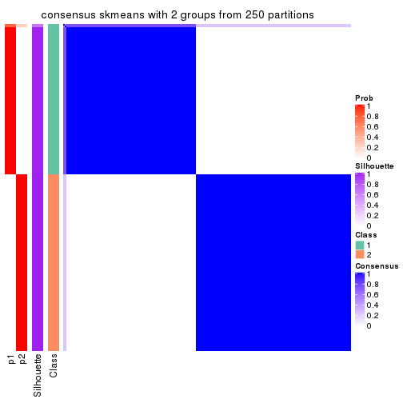</p>

</div>
<div id='tab-ATC-skmeans-consensus-heatmap-2'>
<pre><code class="r">consensus_heatmap(res, k = 3)
</code></pre>

<p>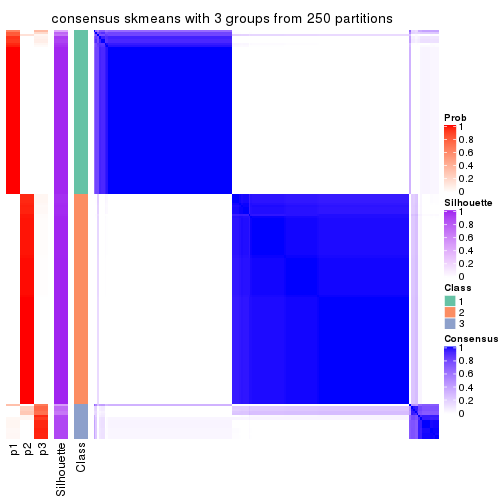</p>

</div>
<div id='tab-ATC-skmeans-consensus-heatmap-3'>
<pre><code class="r">consensus_heatmap(res, k = 4)
</code></pre>

<p>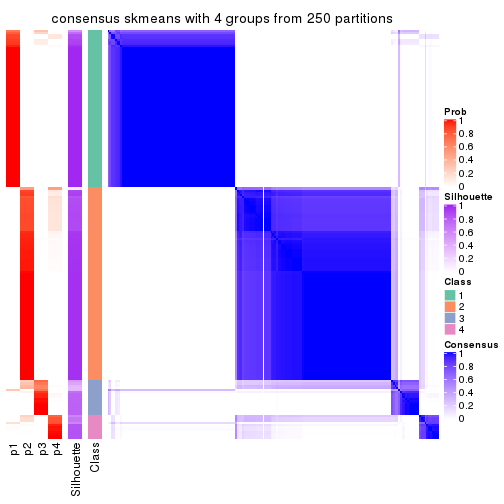</p>

</div>
<div id='tab-ATC-skmeans-consensus-heatmap-4'>
<pre><code class="r">consensus_heatmap(res, k = 5)
</code></pre>

<p>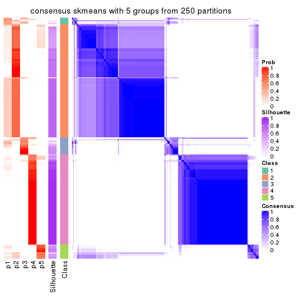</p>

</div>
<div id='tab-ATC-skmeans-consensus-heatmap-5'>
<pre><code class="r">consensus_heatmap(res, k = 6)
</code></pre>

<p>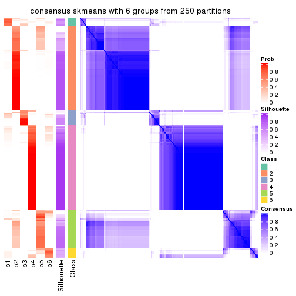</p>

</div>
</div>

Heatmaps for the membership of samples in all partitions to see how consistent they are:


<script>
$( function() {
	$( '#tabs-ATC-skmeans-membership-heatmap' ).tabs();
} );
</script>
<div id='tabs-ATC-skmeans-membership-heatmap'>
<ul>
<li><a href='#tab-ATC-skmeans-membership-heatmap-1'>k = 2</a></li>
<li><a href='#tab-ATC-skmeans-membership-heatmap-2'>k = 3</a></li>
<li><a href='#tab-ATC-skmeans-membership-heatmap-3'>k = 4</a></li>
<li><a href='#tab-ATC-skmeans-membership-heatmap-4'>k = 5</a></li>
<li><a href='#tab-ATC-skmeans-membership-heatmap-5'>k = 6</a></li>
</ul>
<div id='tab-ATC-skmeans-membership-heatmap-1'>
<pre><code class="r">membership_heatmap(res, k = 2)
</code></pre>

<p>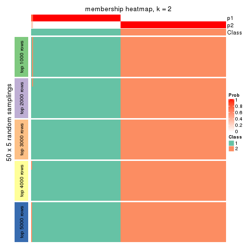</p>

</div>
<div id='tab-ATC-skmeans-membership-heatmap-2'>
<pre><code class="r">membership_heatmap(res, k = 3)
</code></pre>

<p>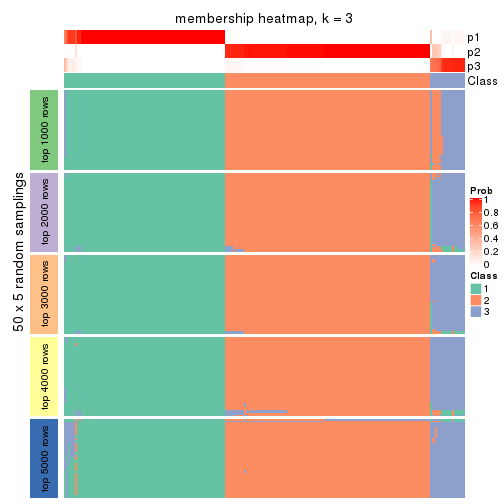</p>

</div>
<div id='tab-ATC-skmeans-membership-heatmap-3'>
<pre><code class="r">membership_heatmap(res, k = 4)
</code></pre>

<p>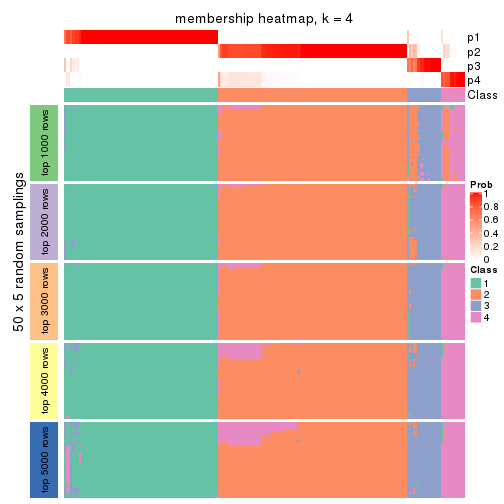</p>

</div>
<div id='tab-ATC-skmeans-membership-heatmap-4'>
<pre><code class="r">membership_heatmap(res, k = 5)
</code></pre>

<p>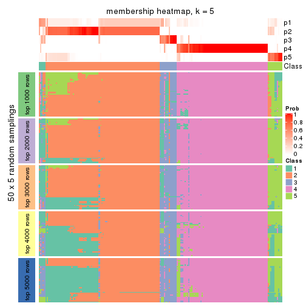</p>

</div>
<div id='tab-ATC-skmeans-membership-heatmap-5'>
<pre><code class="r">membership_heatmap(res, k = 6)
</code></pre>

<p>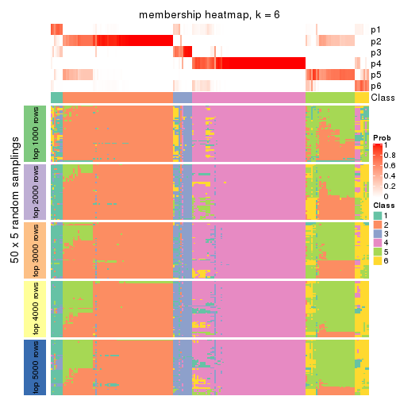</p>

</div>
</div>

As soon as we have had the classes for columns, we can look for signatures
which are significantly different between classes which can be candidate marks
for certain classes. Following are the heatmaps for signatures.


Signature heatmaps where rows are scaled:


<script>
$( function() {
	$( '#tabs-ATC-skmeans-get-signatures' ).tabs();
} );
</script>
<div id='tabs-ATC-skmeans-get-signatures'>
<ul>
<li><a href='#tab-ATC-skmeans-get-signatures-1'>k = 2</a></li>
<li><a href='#tab-ATC-skmeans-get-signatures-2'>k = 3</a></li>
<li><a href='#tab-ATC-skmeans-get-signatures-3'>k = 4</a></li>
<li><a href='#tab-ATC-skmeans-get-signatures-4'>k = 5</a></li>
<li><a href='#tab-ATC-skmeans-get-signatures-5'>k = 6</a></li>
</ul>
<div id='tab-ATC-skmeans-get-signatures-1'>
<pre><code class="r">get_signatures(res, k = 2)
</code></pre>

<p>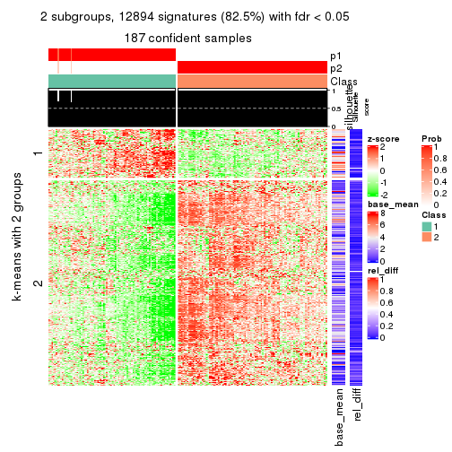</p>

</div>
<div id='tab-ATC-skmeans-get-signatures-2'>
<pre><code class="r">get_signatures(res, k = 3)
</code></pre>

<p>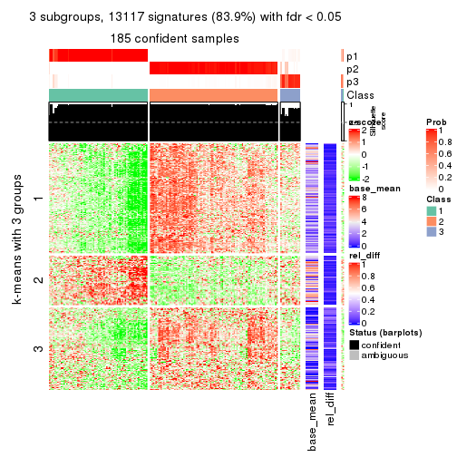</p>

</div>
<div id='tab-ATC-skmeans-get-signatures-3'>
<pre><code class="r">get_signatures(res, k = 4)
</code></pre>

<p>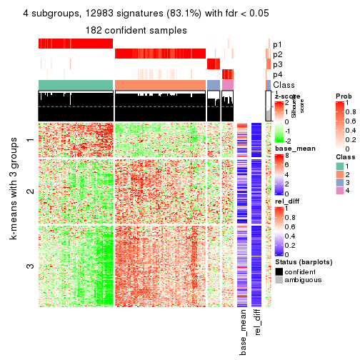</p>

</div>
<div id='tab-ATC-skmeans-get-signatures-4'>
<pre><code class="r">get_signatures(res, k = 5)
</code></pre>

<p>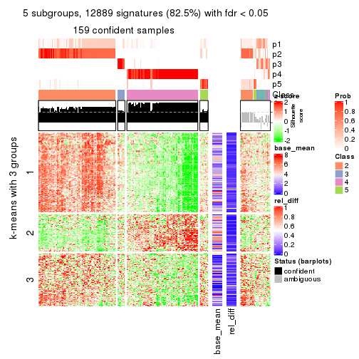</p>

</div>
<div id='tab-ATC-skmeans-get-signatures-5'>
<pre><code class="r">get_signatures(res, k = 6)
</code></pre>

<p>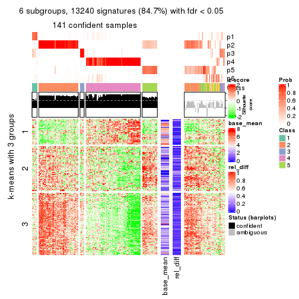</p>

</div>
</div>


Signature heatmaps where rows are not scaled:


<script>
$( function() {
	$( '#tabs-ATC-skmeans-get-signatures-no-scale' ).tabs();
} );
</script>
<div id='tabs-ATC-skmeans-get-signatures-no-scale'>
<ul>
<li><a href='#tab-ATC-skmeans-get-signatures-no-scale-1'>k = 2</a></li>
<li><a href='#tab-ATC-skmeans-get-signatures-no-scale-2'>k = 3</a></li>
<li><a href='#tab-ATC-skmeans-get-signatures-no-scale-3'>k = 4</a></li>
<li><a href='#tab-ATC-skmeans-get-signatures-no-scale-4'>k = 5</a></li>
<li><a href='#tab-ATC-skmeans-get-signatures-no-scale-5'>k = 6</a></li>
</ul>
<div id='tab-ATC-skmeans-get-signatures-no-scale-1'>
<pre><code class="r">get_signatures(res, k = 2, scale_rows = FALSE)
</code></pre>

<p>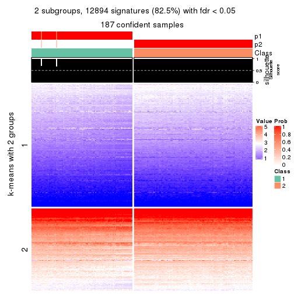</p>

</div>
<div id='tab-ATC-skmeans-get-signatures-no-scale-2'>
<pre><code class="r">get_signatures(res, k = 3, scale_rows = FALSE)
</code></pre>

<p>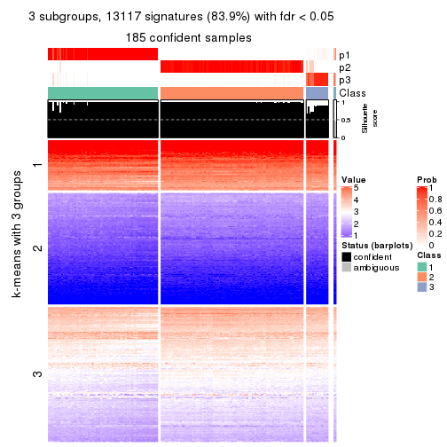</p>

</div>
<div id='tab-ATC-skmeans-get-signatures-no-scale-3'>
<pre><code class="r">get_signatures(res, k = 4, scale_rows = FALSE)
</code></pre>

<p>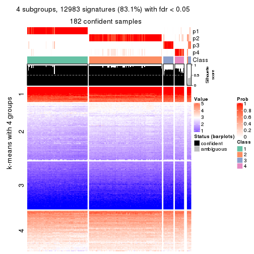</p>

</div>
<div id='tab-ATC-skmeans-get-signatures-no-scale-4'>
<pre><code class="r">get_signatures(res, k = 5, scale_rows = FALSE)
</code></pre>

<p>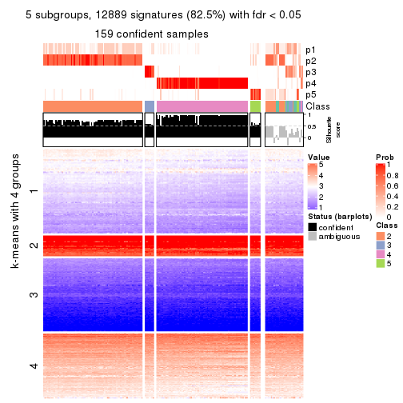</p>

</div>
<div id='tab-ATC-skmeans-get-signatures-no-scale-5'>
<pre><code class="r">get_signatures(res, k = 6, scale_rows = FALSE)
</code></pre>

<p>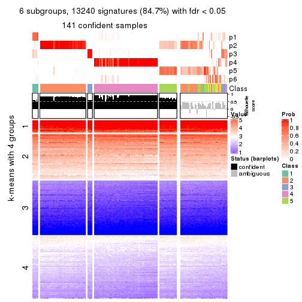</p>

</div>
</div>


Compare the overlap of signatures from different k:

```r
compare_signatures(res)
```

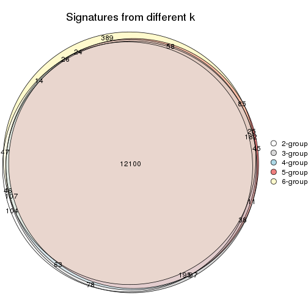

`get_signature()` returns a data frame invisibly. TO get the list of signatures, the function
call should be assigned to a variable explicitly. In following code, if `plot` argument is set
to `FALSE`, no heatmap is plotted while only the differential analysis is performed.

```r
# code only for demonstration
tb = get_signature(res, k = ..., plot = FALSE)
```

An example of the output of `tb` is:

```
#>   which_row         fdr    mean_1    mean_2 scaled_mean_1 scaled_mean_2 km
#> 1        38 0.042760348  8.373488  9.131774    -0.5533452     0.5164555  1
#> 2        40 0.018707592  7.106213  8.469186    -0.6173731     0.5762149  1
#> 3        55 0.019134737 10.221463 11.207825    -0.6159697     0.5749050  1
#> 4        59 0.006059896  5.921854  7.869574    -0.6899429     0.6439467  1
#> 5        60 0.018055526  8.928898 10.211722    -0.6204761     0.5791110  1
#> 6        98 0.009384629 15.714769 14.887706     0.6635654    -0.6193277  2
...
```

The columns in `tb` are:

1. `which_row`: row indices corresponding to the input matrix.
2. `fdr`: FDR for the differential test. 
3. `mean_x`: The mean value in group x.
4. `scaled_mean_x`: The mean value in group x after rows are scaled.
5. `km`: Row groups if k-means clustering is applied to rows.


UMAP plot which shows how samples are separated.


<script>
$( function() {
	$( '#tabs-ATC-skmeans-dimension-reduction' ).tabs();
} );
</script>
<div id='tabs-ATC-skmeans-dimension-reduction'>
<ul>
<li><a href='#tab-ATC-skmeans-dimension-reduction-1'>k = 2</a></li>
<li><a href='#tab-ATC-skmeans-dimension-reduction-2'>k = 3</a></li>
<li><a href='#tab-ATC-skmeans-dimension-reduction-3'>k = 4</a></li>
<li><a href='#tab-ATC-skmeans-dimension-reduction-4'>k = 5</a></li>
<li><a href='#tab-ATC-skmeans-dimension-reduction-5'>k = 6</a></li>
</ul>
<div id='tab-ATC-skmeans-dimension-reduction-1'>
<pre><code class="r">dimension_reduction(res, k = 2, method = &quot;UMAP&quot;)
</code></pre>

<p>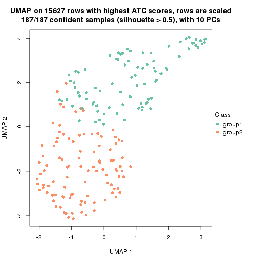</p>

</div>
<div id='tab-ATC-skmeans-dimension-reduction-2'>
<pre><code class="r">dimension_reduction(res, k = 3, method = &quot;UMAP&quot;)
</code></pre>

<p>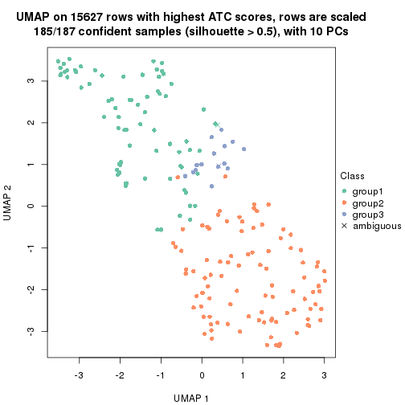</p>

</div>
<div id='tab-ATC-skmeans-dimension-reduction-3'>
<pre><code class="r">dimension_reduction(res, k = 4, method = &quot;UMAP&quot;)
</code></pre>

<p>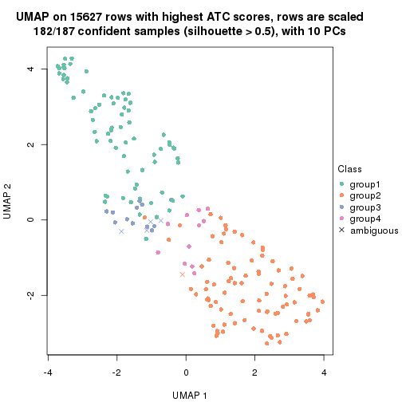</p>

</div>
<div id='tab-ATC-skmeans-dimension-reduction-4'>
<pre><code class="r">dimension_reduction(res, k = 5, method = &quot;UMAP&quot;)
</code></pre>

<p>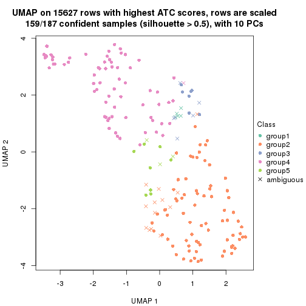</p>

</div>
<div id='tab-ATC-skmeans-dimension-reduction-5'>
<pre><code class="r">dimension_reduction(res, k = 6, method = &quot;UMAP&quot;)
</code></pre>

<p>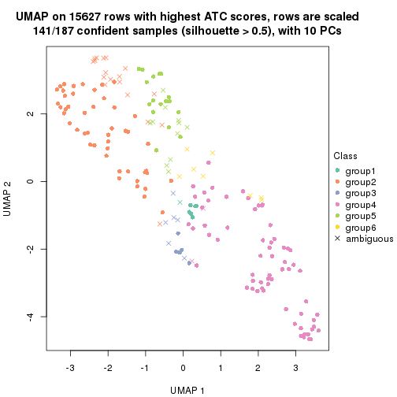</p>

</div>
</div>


Following heatmap shows how subgroups are split when increasing `k`:

```r
collect_classes(res)
```

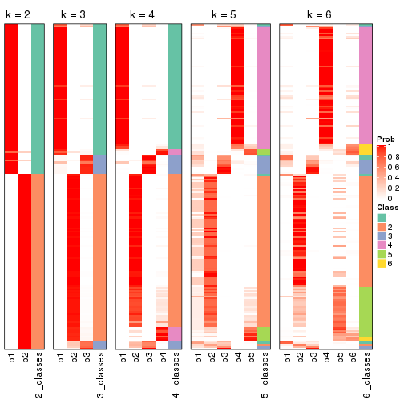


If matrix rows can be associated to genes, consider to use `GO_Enrichment(res,
...)` to perform function enrichment for the signature genes.


 

---------------------------------------------------


### ATC:pam**


The object with results only for a single top-value method and a single partition method 
can be extracted as:

```r
res = res_list["ATC", "pam"]
# you can also extract it by
# res = res_list["ATC:pam"]
```

A summary of `res` and all the functions that can be applied to it:

```r
res
```

```
#> A 'ConsensusPartition' object with k = 2, 3, 4, 5, 6.
#>   On a matrix with 15627 rows and 187 columns.
#>   Top rows (1000, 2000, 3000, 4000, 5000) are extracted by 'ATC' method.
#>   Subgroups are detected by 'pam' method.
#>   Performed in total 1250 partitions by row resampling.
#>   Best k for subgroups seems to be 4.
#> 
#> Following methods can be applied to this 'ConsensusPartition' object:
#>  [1] "cola_report"             "collect_classes"         "collect_plots"          
#>  [4] "collect_stats"           "colnames"                "compare_signatures"     
#>  [7] "consensus_heatmap"       "dimension_reduction"     "functional_enrichment"  
#> [10] "get_anno_col"            "get_anno"                "get_classes"            
#> [13] "get_consensus"           "get_matrix"              "get_membership"         
#> [16] "get_param"               "get_signatures"          "get_stats"              
#> [19] "is_best_k"               "is_stable_k"             "membership_heatmap"     
#> [22] "ncol"                    "nrow"                    "plot_ecdf"              
#> [25] "rownames"                "select_partition_number" "show"                   
#> [28] "suggest_best_k"          "test_to_known_factors"
```

`collect_plots()` function collects all the plots made from `res` for all `k` (number of partitions)
into one single page to provide an easy and fast comparison between different `k`.

```r
collect_plots(res)
```

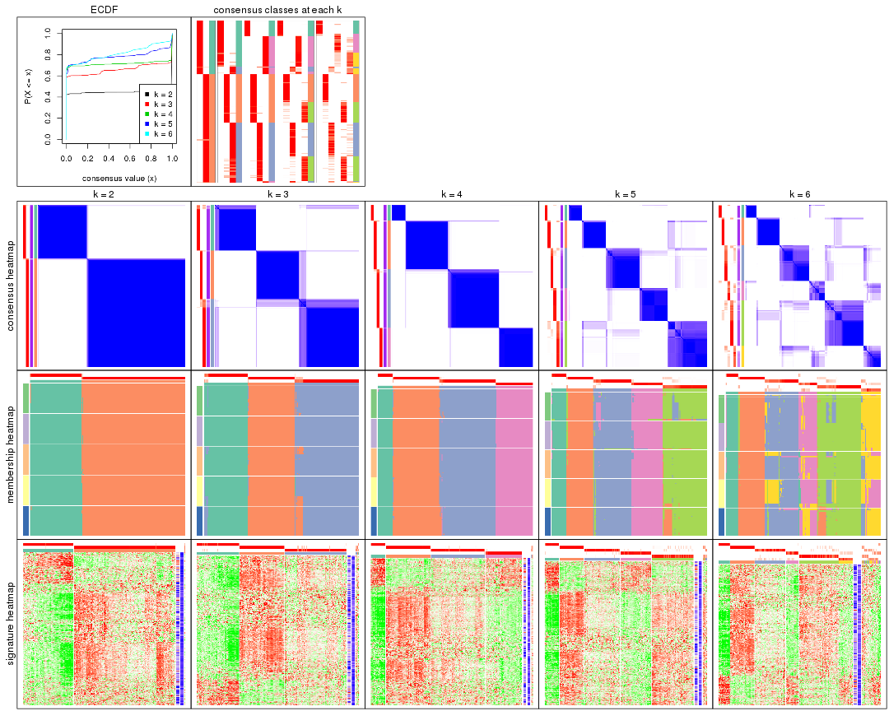

The plots are:

- The first row: a plot of the ECDF (Empirical cumulative distribution
  function) curves of the consensus matrix for each `k` and the heatmap of
  predicted classes for each `k`.
- The second row: heatmaps of the consensus matrix for each `k`.
- The third row: heatmaps of the membership matrix for each `k`.
- The fouth row: heatmaps of the signatures for each `k`.

All the plots in panels can be made by individual functions and they are
plotted later in this section.

`select_partition_number()` produces several plots showing different
statistics for choosing "optimized" `k`. There are following statistics:

- ECDF curves of the consensus matrix for each `k`;
- 1-PAC. [The PAC
  score](https://en.wikipedia.org/wiki/Consensus_clustering#Over-interpretation_potential_of_consensus_clustering)
  measures the proportion of the ambiguous subgrouping.
- Mean silhouette score.
- Concordance. The mean probability of fiting the consensus class ids in all
  partitions.
- Area increased. Denote $A_k$ as the area under the ECDF curve for current
  `k`, the area increased is defined as $A_k - A_{k-1}$.
- Rand index. The percent of pairs of samples that are both in a same cluster
  or both are not in a same cluster in the partition of k and k-1.
- Jaccard index. The ratio of pairs of samples are both in a same cluster in
  the partition of k and k-1 and the pairs of samples are both in a same
  cluster in the partition k or k-1.

The detailed explanations of these statistics can be found in [the cola
vignette](http://bioconductor.org/packages/devel/bioc/vignettes/cola/inst/doc/cola.html#toc_13).

Generally speaking, lower PAC score, higher mean silhouette score or higher
concordance corresponds to better partition. Rand index and Jaccard index
measure how similar the current partition is compared to partition with `k-1`.
If they are too similar, we won't accept `k` is better than `k-1`.

```r
select_partition_number(res)
```

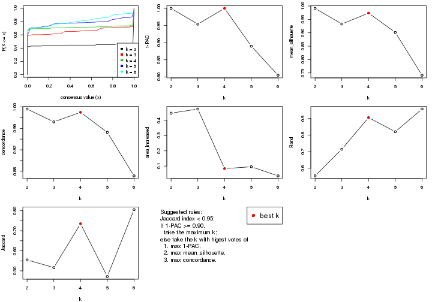

The numeric values for all these statistics can be obtained by `get_stats()`.

```r
get_stats(res)
```

```
#>   k 1-PAC mean_silhouette concordance area_increased  Rand Jaccard
#> 2 2 1.000           0.991       0.996         0.4475 0.554   0.554
#> 3 3 0.954           0.933       0.972         0.4745 0.715   0.516
#> 4 4 1.000           0.973       0.990         0.0837 0.905   0.735
#> 5 5 0.890           0.901       0.953         0.0957 0.820   0.472
#> 6 6 0.805           0.741       0.871         0.0358 0.956   0.805
```

`suggest_best_k()` suggests the best $k$ based on these statistics. The rules are as follows:

- All $k$ with Jaccard index larger than 0.95 are removed because the increase of
  the partition number does not provides enough extra information. If all $k$ are removed,
  the best $k$ is assigned by `NA`.
- For $k$ with 1-PAC larger than 0.9, the maximal $k$ is taken as the "best k". Other $k$ is called "optional k".
- If it does not fit the second rule. The $k$ with the highest vote of highest
  1-PAC, mean silhouette and concordance is taken as the "best k".

```r
suggest_best_k(res)
```

```
#> [1] 4
#> attr(,"optional")
#> [1] 2 3
```

There is also optional best $k$ = 2 3 that is worth to check.

Following shows the table of the partitions (You need to click the **show/hide
code output** link to see it). The membership matrix (columns with name `p*`)
is inferred by
[`clue::cl_consensus()`](https://www.rdocumentation.org/link/cl_consensus?package=clue)
function with the `SE` method. Basically the value in the membership matrix
represents the probability to belong to a certain group. The finall class
label for an item is determined with the group with highest probability it
belongs to.

In `get_classes()` function, the entropy is calculated from the membership
matrix and the silhouette score is calculated from the consensus matrix.


<script>
$( function() {
	$( '#tabs-ATC-pam-get-classes' ).tabs();
} );
</script>
<div id='tabs-ATC-pam-get-classes'>
<ul>
<li><a href='#tab-ATC-pam-get-classes-1'>k = 2</a></li>
<li><a href='#tab-ATC-pam-get-classes-2'>k = 3</a></li>
<li><a href='#tab-ATC-pam-get-classes-3'>k = 4</a></li>
<li><a href='#tab-ATC-pam-get-classes-4'>k = 5</a></li>
<li><a href='#tab-ATC-pam-get-classes-5'>k = 6</a></li>
</ul>

<div id='tab-ATC-pam-get-classes-1'>
<p><a id='tab-ATC-pam-get-classes-1-a' style='color:#0366d6' href='#'>show/hide code output</a></p>
<pre><code class="r">cbind(get_classes(res, k = 2), get_membership(res, k = 2))
</code></pre>

<pre><code>#&gt;            class entropy silhouette    p1    p2
#&gt; SRR1747213     1  0.0000      0.997 1.000 0.000
#&gt; SRR1747214     1  0.0000      0.997 1.000 0.000
#&gt; SRR1747215     2  0.0000      0.996 0.000 1.000
#&gt; SRR1747216     2  0.0000      0.996 0.000 1.000
#&gt; SRR1747217     2  0.0000      0.996 0.000 1.000
#&gt; SRR1747218     2  0.0000      0.996 0.000 1.000
#&gt; SRR1747219     2  0.0000      0.996 0.000 1.000
#&gt; SRR1747220     1  0.0000      0.997 1.000 0.000
#&gt; SRR1747221     1  0.0000      0.997 1.000 0.000
#&gt; SRR1747222     1  0.0000      0.997 1.000 0.000
#&gt; SRR1747223     1  0.0000      0.997 1.000 0.000
#&gt; SRR1747224     2  0.0000      0.996 0.000 1.000
#&gt; SRR1747225     2  0.0000      0.996 0.000 1.000
#&gt; SRR1747226     2  0.0000      0.996 0.000 1.000
#&gt; SRR1747227     2  0.0000      0.996 0.000 1.000
#&gt; SRR1747228     2  0.0000      0.996 0.000 1.000
#&gt; SRR1747229     2  0.0000      0.996 0.000 1.000
#&gt; SRR1747230     1  0.0000      0.997 1.000 0.000
#&gt; SRR1747231     1  0.0000      0.997 1.000 0.000
#&gt; SRR1747232     1  0.0000      0.997 1.000 0.000
#&gt; SRR1747233     1  0.0000      0.997 1.000 0.000
#&gt; SRR1747234     2  0.0000      0.996 0.000 1.000
#&gt; SRR1747235     1  0.0000      0.997 1.000 0.000
#&gt; SRR1747236     2  0.0000      0.996 0.000 1.000
#&gt; SRR1747237     2  0.0000      0.996 0.000 1.000
#&gt; SRR1747238     2  0.0000      0.996 0.000 1.000
#&gt; SRR1747239     2  0.0000      0.996 0.000 1.000
#&gt; SRR1747240     1  0.0000      0.997 1.000 0.000
#&gt; SRR1747241     2  0.0000      0.996 0.000 1.000
#&gt; SRR1747242     1  0.0000      0.997 1.000 0.000
#&gt; SRR1747243     1  0.0000      0.997 1.000 0.000
#&gt; SRR1747244     2  0.0000      0.996 0.000 1.000
#&gt; SRR1747245     2  0.0000      0.996 0.000 1.000
#&gt; SRR1747246     2  0.0000      0.996 0.000 1.000
#&gt; SRR1747247     1  0.0000      0.997 1.000 0.000
#&gt; SRR1747248     1  0.0000      0.997 1.000 0.000
#&gt; SRR1747249     1  0.0000      0.997 1.000 0.000
#&gt; SRR1747250     2  0.0000      0.996 0.000 1.000
#&gt; SRR1747252     1  0.0000      0.997 1.000 0.000
#&gt; SRR1747253     1  0.0000      0.997 1.000 0.000
#&gt; SRR1747254     2  0.0000      0.996 0.000 1.000
#&gt; SRR1747255     1  0.0000      0.997 1.000 0.000
#&gt; SRR1747256     1  0.0000      0.997 1.000 0.000
#&gt; SRR1747257     2  0.0000      0.996 0.000 1.000
#&gt; SRR1747258     2  0.0000      0.996 0.000 1.000
#&gt; SRR1747259     2  0.0000      0.996 0.000 1.000
#&gt; SRR1747260     2  0.0000      0.996 0.000 1.000
#&gt; SRR1747261     2  0.0000      0.996 0.000 1.000
#&gt; SRR1747262     2  0.0000      0.996 0.000 1.000
#&gt; SRR1747263     2  0.0000      0.996 0.000 1.000
#&gt; SRR1747264     1  0.0000      0.997 1.000 0.000
#&gt; SRR1747265     2  0.0000      0.996 0.000 1.000
#&gt; SRR1747266     2  0.0000      0.996 0.000 1.000
#&gt; SRR1747267     2  0.0000      0.996 0.000 1.000
#&gt; SRR1747268     2  0.0000      0.996 0.000 1.000
#&gt; SRR1747269     2  0.0000      0.996 0.000 1.000
#&gt; SRR1747270     2  0.0000      0.996 0.000 1.000
#&gt; SRR1747271     2  0.0000      0.996 0.000 1.000
#&gt; SRR1747272     1  0.1843      0.970 0.972 0.028
#&gt; SRR1747273     1  0.0000      0.997 1.000 0.000
#&gt; SRR1747274     2  0.0000      0.996 0.000 1.000
#&gt; SRR1747275     1  0.0000      0.997 1.000 0.000
#&gt; SRR1747276     1  0.0000      0.997 1.000 0.000
#&gt; SRR1747277     2  0.0000      0.996 0.000 1.000
#&gt; SRR1747278     2  0.0000      0.996 0.000 1.000
#&gt; SRR1747280     1  0.0000      0.997 1.000 0.000
#&gt; SRR1747279     1  0.0000      0.997 1.000 0.000
#&gt; SRR1747281     2  0.0000      0.996 0.000 1.000
#&gt; SRR1747282     1  0.0000      0.997 1.000 0.000
#&gt; SRR1747283     2  0.0000      0.996 0.000 1.000
#&gt; SRR1747284     1  0.0000      0.997 1.000 0.000
#&gt; SRR1747285     2  0.0000      0.996 0.000 1.000
#&gt; SRR1747286     2  0.0000      0.996 0.000 1.000
#&gt; SRR1747287     2  0.0000      0.996 0.000 1.000
#&gt; SRR1747288     1  0.0000      0.997 1.000 0.000
#&gt; SRR1747290     2  0.0000      0.996 0.000 1.000
#&gt; SRR1747289     2  0.0000      0.996 0.000 1.000
#&gt; SRR1747291     2  0.0000      0.996 0.000 1.000
#&gt; SRR1747293     2  0.0000      0.996 0.000 1.000
#&gt; SRR1747294     2  0.0000      0.996 0.000 1.000
#&gt; SRR1747292     1  0.0000      0.997 1.000 0.000
#&gt; SRR1747295     2  0.0000      0.996 0.000 1.000
#&gt; SRR1747296     2  0.0000      0.996 0.000 1.000
#&gt; SRR1747297     2  0.0000      0.996 0.000 1.000
#&gt; SRR1747298     2  0.0000      0.996 0.000 1.000
#&gt; SRR1747299     2  0.0000      0.996 0.000 1.000
#&gt; SRR1747300     2  0.0000      0.996 0.000 1.000
#&gt; SRR1747301     2  0.0000      0.996 0.000 1.000
#&gt; SRR1747302     2  0.0000      0.996 0.000 1.000
#&gt; SRR1747303     2  0.0000      0.996 0.000 1.000
#&gt; SRR1747304     1  0.0000      0.997 1.000 0.000
#&gt; SRR1747305     2  0.0000      0.996 0.000 1.000
#&gt; SRR1747306     2  0.0000      0.996 0.000 1.000
#&gt; SRR1747307     2  0.0000      0.996 0.000 1.000
#&gt; SRR1747308     2  0.0000      0.996 0.000 1.000
#&gt; SRR1747309     1  0.0000      0.997 1.000 0.000
#&gt; SRR1747310     1  0.0000      0.997 1.000 0.000
#&gt; SRR1747311     1  0.0000      0.997 1.000 0.000
#&gt; SRR1747313     1  0.0000      0.997 1.000 0.000
#&gt; SRR1747312     1  0.0000      0.997 1.000 0.000
#&gt; SRR1747314     1  0.0000      0.997 1.000 0.000
#&gt; SRR1747315     2  0.0000      0.996 0.000 1.000
#&gt; SRR1747316     2  0.0000      0.996 0.000 1.000
#&gt; SRR1747318     2  0.0000      0.996 0.000 1.000
#&gt; SRR1747317     2  0.0000      0.996 0.000 1.000
#&gt; SRR1747319     2  0.9393      0.446 0.356 0.644
#&gt; SRR1747320     1  0.0000      0.997 1.000 0.000
#&gt; SRR1747322     1  0.0000      0.997 1.000 0.000
#&gt; SRR1747321     1  0.0000      0.997 1.000 0.000
#&gt; SRR1747323     2  0.0000      0.996 0.000 1.000
#&gt; SRR1747324     2  0.0000      0.996 0.000 1.000
#&gt; SRR1747326     2  0.0000      0.996 0.000 1.000
#&gt; SRR1747325     2  0.0000      0.996 0.000 1.000
#&gt; SRR1747327     2  0.0000      0.996 0.000 1.000
#&gt; SRR1747328     2  0.0000      0.996 0.000 1.000
#&gt; SRR1747330     1  0.0000      0.997 1.000 0.000
#&gt; SRR1747329     2  0.0000      0.996 0.000 1.000
#&gt; SRR1747332     1  0.0000      0.997 1.000 0.000
#&gt; SRR1747331     2  0.0000      0.996 0.000 1.000
#&gt; SRR1747333     2  0.0000      0.996 0.000 1.000
#&gt; SRR1747334     2  0.0000      0.996 0.000 1.000
#&gt; SRR1747335     2  0.0000      0.996 0.000 1.000
#&gt; SRR1747336     1  0.0000      0.997 1.000 0.000
#&gt; SRR1747337     2  0.0000      0.996 0.000 1.000
#&gt; SRR1747338     2  0.0000      0.996 0.000 1.000
#&gt; SRR1747339     2  0.0000      0.996 0.000 1.000
#&gt; SRR1747340     2  0.0000      0.996 0.000 1.000
#&gt; SRR1747341     2  0.0000      0.996 0.000 1.000
#&gt; SRR1747342     2  0.0000      0.996 0.000 1.000
#&gt; SRR1747343     2  0.0000      0.996 0.000 1.000
#&gt; SRR1747344     2  0.0000      0.996 0.000 1.000
#&gt; SRR1747345     2  0.6801      0.780 0.180 0.820
#&gt; SRR1747346     2  0.0000      0.996 0.000 1.000
#&gt; SRR1747347     2  0.0000      0.996 0.000 1.000
#&gt; SRR1747348     1  0.0000      0.997 1.000 0.000
#&gt; SRR1747349     1  0.0000      0.997 1.000 0.000
#&gt; SRR1747351     2  0.0000      0.996 0.000 1.000
#&gt; SRR1747350     2  0.0000      0.996 0.000 1.000
#&gt; SRR1747352     1  0.0000      0.997 1.000 0.000
#&gt; SRR1747353     2  0.0000      0.996 0.000 1.000
#&gt; SRR1747354     2  0.0000      0.996 0.000 1.000
#&gt; SRR1747355     1  0.5629      0.847 0.868 0.132
#&gt; SRR1747356     2  0.0000      0.996 0.000 1.000
#&gt; SRR1747357     2  0.0000      0.996 0.000 1.000
#&gt; SRR1747358     2  0.0000      0.996 0.000 1.000
#&gt; SRR1747359     1  0.0000      0.997 1.000 0.000
#&gt; SRR1747360     2  0.0000      0.996 0.000 1.000
#&gt; SRR1747361     2  0.0376      0.992 0.004 0.996
#&gt; SRR1747362     2  0.0000      0.996 0.000 1.000
#&gt; SRR1747363     2  0.0000      0.996 0.000 1.000
#&gt; SRR1747364     1  0.0000      0.997 1.000 0.000
#&gt; SRR1747365     2  0.0000      0.996 0.000 1.000
#&gt; SRR1747366     2  0.0000      0.996 0.000 1.000
#&gt; SRR1747367     1  0.0000      0.997 1.000 0.000
#&gt; SRR1747369     2  0.0000      0.996 0.000 1.000
#&gt; SRR1747368     2  0.0000      0.996 0.000 1.000
#&gt; SRR1747370     2  0.0000      0.996 0.000 1.000
#&gt; SRR1747372     1  0.0000      0.997 1.000 0.000
#&gt; SRR1747371     1  0.0000      0.997 1.000 0.000
#&gt; SRR1747373     2  0.0000      0.996 0.000 1.000
#&gt; SRR1747374     2  0.0000      0.996 0.000 1.000
#&gt; SRR1747375     1  0.0000      0.997 1.000 0.000
#&gt; SRR1747376     2  0.0000      0.996 0.000 1.000
#&gt; SRR1747377     2  0.0000      0.996 0.000 1.000
#&gt; SRR1747378     2  0.0000      0.996 0.000 1.000
#&gt; SRR1747379     2  0.0000      0.996 0.000 1.000
#&gt; SRR1747380     2  0.0000      0.996 0.000 1.000
#&gt; SRR1747381     1  0.0000      0.997 1.000 0.000
#&gt; SRR1747382     1  0.0000      0.997 1.000 0.000
#&gt; SRR1747383     2  0.0000      0.996 0.000 1.000
#&gt; SRR1747384     2  0.0000      0.996 0.000 1.000
#&gt; SRR1747385     2  0.0000      0.996 0.000 1.000
#&gt; SRR1747386     1  0.0000      0.997 1.000 0.000
#&gt; SRR1747387     2  0.0000      0.996 0.000 1.000
#&gt; SRR1747388     2  0.0000      0.996 0.000 1.000
#&gt; SRR1747390     2  0.0000      0.996 0.000 1.000
#&gt; SRR1747389     2  0.0000      0.996 0.000 1.000
#&gt; SRR1747391     2  0.0000      0.996 0.000 1.000
#&gt; SRR1747392     2  0.0000      0.996 0.000 1.000
#&gt; SRR1747393     2  0.0000      0.996 0.000 1.000
#&gt; SRR1747394     1  0.0000      0.997 1.000 0.000
#&gt; SRR1747395     2  0.0000      0.996 0.000 1.000
#&gt; SRR1747396     2  0.0000      0.996 0.000 1.000
#&gt; SRR1747398     2  0.0000      0.996 0.000 1.000
#&gt; SRR1747397     1  0.0000      0.997 1.000 0.000
#&gt; SRR1747399     1  0.0000      0.997 1.000 0.000
#&gt; SRR1747400     1  0.0000      0.997 1.000 0.000
</code></pre>

<script>
$('#tab-ATC-pam-get-classes-1-a').parent().next().next().hide();
$('#tab-ATC-pam-get-classes-1-a').click(function(){
  $('#tab-ATC-pam-get-classes-1-a').parent().next().next().toggle();
  return(false);
});
</script>
</div>

<div id='tab-ATC-pam-get-classes-2'>
<p><a id='tab-ATC-pam-get-classes-2-a' style='color:#0366d6' href='#'>show/hide code output</a></p>
<pre><code class="r">cbind(get_classes(res, k = 3), get_membership(res, k = 3))
</code></pre>

<pre><code>#&gt;            class entropy silhouette    p1    p2    p3
#&gt; SRR1747213     1  0.5760      0.539 0.672 0.000 0.328
#&gt; SRR1747214     1  0.0000      0.965 1.000 0.000 0.000
#&gt; SRR1747215     2  0.0000      0.993 0.000 1.000 0.000
#&gt; SRR1747216     2  0.0000      0.993 0.000 1.000 0.000
#&gt; SRR1747217     3  0.0000      0.956 0.000 0.000 1.000
#&gt; SRR1747218     3  0.0000      0.956 0.000 0.000 1.000
#&gt; SRR1747219     3  0.0000      0.956 0.000 0.000 1.000
#&gt; SRR1747220     1  0.4842      0.721 0.776 0.000 0.224
#&gt; SRR1747221     1  0.0000      0.965 1.000 0.000 0.000
#&gt; SRR1747222     1  0.0000      0.965 1.000 0.000 0.000
#&gt; SRR1747223     1  0.0000      0.965 1.000 0.000 0.000
#&gt; SRR1747224     3  0.0000      0.956 0.000 0.000 1.000
#&gt; SRR1747225     3  0.0000      0.956 0.000 0.000 1.000
#&gt; SRR1747226     2  0.0000      0.993 0.000 1.000 0.000
#&gt; SRR1747227     2  0.0000      0.993 0.000 1.000 0.000
#&gt; SRR1747228     3  0.0000      0.956 0.000 0.000 1.000
#&gt; SRR1747229     2  0.0000      0.993 0.000 1.000 0.000
#&gt; SRR1747230     1  0.0000      0.965 1.000 0.000 0.000
#&gt; SRR1747231     3  0.0000      0.956 0.000 0.000 1.000
#&gt; SRR1747232     1  0.0000      0.965 1.000 0.000 0.000
#&gt; SRR1747233     1  0.0000      0.965 1.000 0.000 0.000
#&gt; SRR1747234     3  0.0000      0.956 0.000 0.000 1.000
#&gt; SRR1747235     1  0.0000      0.965 1.000 0.000 0.000
#&gt; SRR1747236     2  0.0000      0.993 0.000 1.000 0.000
#&gt; SRR1747237     2  0.0000      0.993 0.000 1.000 0.000
#&gt; SRR1747238     3  0.4605      0.742 0.000 0.204 0.796
#&gt; SRR1747239     2  0.0000      0.993 0.000 1.000 0.000
#&gt; SRR1747240     1  0.0000      0.965 1.000 0.000 0.000
#&gt; SRR1747241     3  0.0000      0.956 0.000 0.000 1.000
#&gt; SRR1747242     1  0.0000      0.965 1.000 0.000 0.000
#&gt; SRR1747243     3  0.3752      0.795 0.144 0.000 0.856
#&gt; SRR1747244     3  0.0000      0.956 0.000 0.000 1.000
#&gt; SRR1747245     3  0.0000      0.956 0.000 0.000 1.000
#&gt; SRR1747246     2  0.0000      0.993 0.000 1.000 0.000
#&gt; SRR1747247     1  0.0000      0.965 1.000 0.000 0.000
#&gt; SRR1747248     1  0.0000      0.965 1.000 0.000 0.000
#&gt; SRR1747249     1  0.0000      0.965 1.000 0.000 0.000
#&gt; SRR1747250     3  0.0000      0.956 0.000 0.000 1.000
#&gt; SRR1747252     1  0.0000      0.965 1.000 0.000 0.000
#&gt; SRR1747253     1  0.0000      0.965 1.000 0.000 0.000
#&gt; SRR1747254     2  0.0000      0.993 0.000 1.000 0.000
#&gt; SRR1747255     1  0.0000      0.965 1.000 0.000 0.000
#&gt; SRR1747256     1  0.0000      0.965 1.000 0.000 0.000
#&gt; SRR1747257     2  0.0000      0.993 0.000 1.000 0.000
#&gt; SRR1747258     3  0.0000      0.956 0.000 0.000 1.000
#&gt; SRR1747259     2  0.0000      0.993 0.000 1.000 0.000
#&gt; SRR1747260     3  0.0000      0.956 0.000 0.000 1.000
#&gt; SRR1747261     3  0.0000      0.956 0.000 0.000 1.000
#&gt; SRR1747262     3  0.5733      0.554 0.000 0.324 0.676
#&gt; SRR1747263     2  0.0000      0.993 0.000 1.000 0.000
#&gt; SRR1747264     1  0.0000      0.965 1.000 0.000 0.000
#&gt; SRR1747265     3  0.0000      0.956 0.000 0.000 1.000
#&gt; SRR1747266     3  0.0000      0.956 0.000 0.000 1.000
#&gt; SRR1747267     3  0.0000      0.956 0.000 0.000 1.000
#&gt; SRR1747268     3  0.0000      0.956 0.000 0.000 1.000
#&gt; SRR1747269     3  0.0000      0.956 0.000 0.000 1.000
#&gt; SRR1747270     2  0.0000      0.993 0.000 1.000 0.000
#&gt; SRR1747271     3  0.0000      0.956 0.000 0.000 1.000
#&gt; SRR1747272     3  0.0000      0.956 0.000 0.000 1.000
#&gt; SRR1747273     1  0.0000      0.965 1.000 0.000 0.000
#&gt; SRR1747274     3  0.0000      0.956 0.000 0.000 1.000
#&gt; SRR1747275     1  0.0000      0.965 1.000 0.000 0.000
#&gt; SRR1747276     1  0.0000      0.965 1.000 0.000 0.000
#&gt; SRR1747277     2  0.0592      0.980 0.000 0.988 0.012
#&gt; SRR1747278     3  0.0000      0.956 0.000 0.000 1.000
#&gt; SRR1747280     1  0.0000      0.965 1.000 0.000 0.000
#&gt; SRR1747279     1  0.0000      0.965 1.000 0.000 0.000
#&gt; SRR1747281     2  0.0000      0.993 0.000 1.000 0.000
#&gt; SRR1747282     1  0.0000      0.965 1.000 0.000 0.000
#&gt; SRR1747283     3  0.0000      0.956 0.000 0.000 1.000
#&gt; SRR1747284     1  0.0000      0.965 1.000 0.000 0.000
#&gt; SRR1747285     3  0.0000      0.956 0.000 0.000 1.000
#&gt; SRR1747286     3  0.0000      0.956 0.000 0.000 1.000
#&gt; SRR1747287     2  0.0000      0.993 0.000 1.000 0.000
#&gt; SRR1747288     3  0.0000      0.956 0.000 0.000 1.000
#&gt; SRR1747290     3  0.5810      0.531 0.000 0.336 0.664
#&gt; SRR1747289     2  0.0000      0.993 0.000 1.000 0.000
#&gt; SRR1747291     3  0.0000      0.956 0.000 0.000 1.000
#&gt; SRR1747293     3  0.0000      0.956 0.000 0.000 1.000
#&gt; SRR1747294     2  0.0000      0.993 0.000 1.000 0.000
#&gt; SRR1747292     1  0.0000      0.965 1.000 0.000 0.000
#&gt; SRR1747295     3  0.5465      0.617 0.000 0.288 0.712
#&gt; SRR1747296     3  0.5905      0.498 0.000 0.352 0.648
#&gt; SRR1747297     2  0.0000      0.993 0.000 1.000 0.000
#&gt; SRR1747298     2  0.0000      0.993 0.000 1.000 0.000
#&gt; SRR1747299     2  0.0000      0.993 0.000 1.000 0.000
#&gt; SRR1747300     2  0.0000      0.993 0.000 1.000 0.000
#&gt; SRR1747301     2  0.0000      0.993 0.000 1.000 0.000
#&gt; SRR1747302     2  0.0000      0.993 0.000 1.000 0.000
#&gt; SRR1747303     2  0.0000      0.993 0.000 1.000 0.000
#&gt; SRR1747304     1  0.0000      0.965 1.000 0.000 0.000
#&gt; SRR1747305     2  0.0000      0.993 0.000 1.000 0.000
#&gt; SRR1747306     2  0.0000      0.993 0.000 1.000 0.000
#&gt; SRR1747307     3  0.0000      0.956 0.000 0.000 1.000
#&gt; SRR1747308     3  0.0000      0.956 0.000 0.000 1.000
#&gt; SRR1747309     1  0.0000      0.965 1.000 0.000 0.000
#&gt; SRR1747310     1  0.0000      0.965 1.000 0.000 0.000
#&gt; SRR1747311     1  0.6308      0.106 0.508 0.000 0.492
#&gt; SRR1747313     3  0.0000      0.956 0.000 0.000 1.000
#&gt; SRR1747312     1  0.0000      0.965 1.000 0.000 0.000
#&gt; SRR1747314     1  0.0000      0.965 1.000 0.000 0.000
#&gt; SRR1747315     2  0.5785      0.460 0.000 0.668 0.332
#&gt; SRR1747316     3  0.0000      0.956 0.000 0.000 1.000
#&gt; SRR1747318     3  0.0000      0.956 0.000 0.000 1.000
#&gt; SRR1747317     3  0.0000      0.956 0.000 0.000 1.000
#&gt; SRR1747319     3  0.0000      0.956 0.000 0.000 1.000
#&gt; SRR1747320     1  0.0000      0.965 1.000 0.000 0.000
#&gt; SRR1747322     1  0.0000      0.965 1.000 0.000 0.000
#&gt; SRR1747321     1  0.0000      0.965 1.000 0.000 0.000
#&gt; SRR1747323     2  0.0000      0.993 0.000 1.000 0.000
#&gt; SRR1747324     3  0.5678      0.569 0.000 0.316 0.684
#&gt; SRR1747326     2  0.0000      0.993 0.000 1.000 0.000
#&gt; SRR1747325     2  0.0000      0.993 0.000 1.000 0.000
#&gt; SRR1747327     2  0.0000      0.993 0.000 1.000 0.000
#&gt; SRR1747328     3  0.0000      0.956 0.000 0.000 1.000
#&gt; SRR1747330     3  0.0000      0.956 0.000 0.000 1.000
#&gt; SRR1747329     3  0.0000      0.956 0.000 0.000 1.000
#&gt; SRR1747332     3  0.0000      0.956 0.000 0.000 1.000
#&gt; SRR1747331     3  0.0000      0.956 0.000 0.000 1.000
#&gt; SRR1747333     3  0.1529      0.922 0.000 0.040 0.960
#&gt; SRR1747334     2  0.0000      0.993 0.000 1.000 0.000
#&gt; SRR1747335     3  0.0000      0.956 0.000 0.000 1.000
#&gt; SRR1747336     1  0.0000      0.965 1.000 0.000 0.000
#&gt; SRR1747337     2  0.0000      0.993 0.000 1.000 0.000
#&gt; SRR1747338     2  0.0000      0.993 0.000 1.000 0.000
#&gt; SRR1747339     3  0.0000      0.956 0.000 0.000 1.000
#&gt; SRR1747340     3  0.0000      0.956 0.000 0.000 1.000
#&gt; SRR1747341     2  0.0000      0.993 0.000 1.000 0.000
#&gt; SRR1747342     2  0.0000      0.993 0.000 1.000 0.000
#&gt; SRR1747343     2  0.0000      0.993 0.000 1.000 0.000
#&gt; SRR1747344     2  0.0000      0.993 0.000 1.000 0.000
#&gt; SRR1747345     3  0.0000      0.956 0.000 0.000 1.000
#&gt; SRR1747346     3  0.0000      0.956 0.000 0.000 1.000
#&gt; SRR1747347     2  0.0000      0.993 0.000 1.000 0.000
#&gt; SRR1747348     1  0.0000      0.965 1.000 0.000 0.000
#&gt; SRR1747349     1  0.0000      0.965 1.000 0.000 0.000
#&gt; SRR1747351     2  0.0000      0.993 0.000 1.000 0.000
#&gt; SRR1747350     2  0.0000      0.993 0.000 1.000 0.000
#&gt; SRR1747352     1  0.0000      0.965 1.000 0.000 0.000
#&gt; SRR1747353     3  0.5882      0.507 0.000 0.348 0.652
#&gt; SRR1747354     3  0.0000      0.956 0.000 0.000 1.000
#&gt; SRR1747355     3  0.0000      0.956 0.000 0.000 1.000
#&gt; SRR1747356     3  0.0000      0.956 0.000 0.000 1.000
#&gt; SRR1747357     3  0.0000      0.956 0.000 0.000 1.000
#&gt; SRR1747358     3  0.0000      0.956 0.000 0.000 1.000
#&gt; SRR1747359     1  0.0000      0.965 1.000 0.000 0.000
#&gt; SRR1747360     2  0.0237      0.989 0.000 0.996 0.004
#&gt; SRR1747361     3  0.0000      0.956 0.000 0.000 1.000
#&gt; SRR1747362     3  0.5678      0.569 0.000 0.316 0.684
#&gt; SRR1747363     3  0.0000      0.956 0.000 0.000 1.000
#&gt; SRR1747364     1  0.0000      0.965 1.000 0.000 0.000
#&gt; SRR1747365     3  0.0000      0.956 0.000 0.000 1.000
#&gt; SRR1747366     3  0.6280      0.213 0.000 0.460 0.540
#&gt; SRR1747367     3  0.0000      0.956 0.000 0.000 1.000
#&gt; SRR1747369     2  0.0000      0.993 0.000 1.000 0.000
#&gt; SRR1747368     3  0.0000      0.956 0.000 0.000 1.000
#&gt; SRR1747370     3  0.0000      0.956 0.000 0.000 1.000
#&gt; SRR1747372     1  0.0000      0.965 1.000 0.000 0.000
#&gt; SRR1747371     1  0.0000      0.965 1.000 0.000 0.000
#&gt; SRR1747373     2  0.0000      0.993 0.000 1.000 0.000
#&gt; SRR1747374     2  0.0000      0.993 0.000 1.000 0.000
#&gt; SRR1747375     1  0.1289      0.937 0.968 0.000 0.032
#&gt; SRR1747376     2  0.0000      0.993 0.000 1.000 0.000
#&gt; SRR1747377     2  0.0000      0.993 0.000 1.000 0.000
#&gt; SRR1747378     3  0.0000      0.956 0.000 0.000 1.000
#&gt; SRR1747379     3  0.0000      0.956 0.000 0.000 1.000
#&gt; SRR1747380     3  0.0000      0.956 0.000 0.000 1.000
#&gt; SRR1747381     1  0.0000      0.965 1.000 0.000 0.000
#&gt; SRR1747382     1  0.0000      0.965 1.000 0.000 0.000
#&gt; SRR1747383     2  0.0000      0.993 0.000 1.000 0.000
#&gt; SRR1747384     3  0.0000      0.956 0.000 0.000 1.000
#&gt; SRR1747385     3  0.0000      0.956 0.000 0.000 1.000
#&gt; SRR1747386     1  0.0000      0.965 1.000 0.000 0.000
#&gt; SRR1747387     2  0.0000      0.993 0.000 1.000 0.000
#&gt; SRR1747388     2  0.0000      0.993 0.000 1.000 0.000
#&gt; SRR1747390     3  0.0000      0.956 0.000 0.000 1.000
#&gt; SRR1747389     3  0.0000      0.956 0.000 0.000 1.000
#&gt; SRR1747391     2  0.0000      0.993 0.000 1.000 0.000
#&gt; SRR1747392     2  0.0000      0.993 0.000 1.000 0.000
#&gt; SRR1747393     3  0.0000      0.956 0.000 0.000 1.000
#&gt; SRR1747394     1  0.5678      0.574 0.684 0.000 0.316
#&gt; SRR1747395     3  0.0000      0.956 0.000 0.000 1.000
#&gt; SRR1747396     2  0.0000      0.993 0.000 1.000 0.000
#&gt; SRR1747398     2  0.0000      0.993 0.000 1.000 0.000
#&gt; SRR1747397     1  0.5678      0.574 0.684 0.000 0.316
#&gt; SRR1747399     1  0.0000      0.965 1.000 0.000 0.000
#&gt; SRR1747400     1  0.0000      0.965 1.000 0.000 0.000
</code></pre>

<script>
$('#tab-ATC-pam-get-classes-2-a').parent().next().next().hide();
$('#tab-ATC-pam-get-classes-2-a').click(function(){
  $('#tab-ATC-pam-get-classes-2-a').parent().next().next().toggle();
  return(false);
});
</script>
</div>

<div id='tab-ATC-pam-get-classes-3'>
<p><a id='tab-ATC-pam-get-classes-3-a' style='color:#0366d6' href='#'>show/hide code output</a></p>
<pre><code class="r">cbind(get_classes(res, k = 4), get_membership(res, k = 4))
</code></pre>

<pre><code>#&gt;            class entropy silhouette   p1    p2    p3    p4
#&gt; SRR1747213     4  0.0000      0.992 0.00 0.000 0.000 1.000
#&gt; SRR1747214     4  0.0000      0.992 0.00 0.000 0.000 1.000
#&gt; SRR1747215     2  0.0000      0.989 0.00 1.000 0.000 0.000
#&gt; SRR1747216     2  0.0000      0.989 0.00 1.000 0.000 0.000
#&gt; SRR1747217     3  0.0000      0.980 0.00 0.000 1.000 0.000
#&gt; SRR1747218     3  0.0000      0.980 0.00 0.000 1.000 0.000
#&gt; SRR1747219     3  0.0000      0.980 0.00 0.000 1.000 0.000
#&gt; SRR1747220     4  0.0000      0.992 0.00 0.000 0.000 1.000
#&gt; SRR1747221     4  0.0000      0.992 0.00 0.000 0.000 1.000
#&gt; SRR1747222     4  0.0000      0.992 0.00 0.000 0.000 1.000
#&gt; SRR1747223     4  0.0000      0.992 0.00 0.000 0.000 1.000
#&gt; SRR1747224     3  0.0000      0.980 0.00 0.000 1.000 0.000
#&gt; SRR1747225     3  0.0000      0.980 0.00 0.000 1.000 0.000
#&gt; SRR1747226     2  0.0000      0.989 0.00 1.000 0.000 0.000
#&gt; SRR1747227     2  0.0000      0.989 0.00 1.000 0.000 0.000
#&gt; SRR1747228     3  0.0000      0.980 0.00 0.000 1.000 0.000
#&gt; SRR1747229     2  0.0000      0.989 0.00 1.000 0.000 0.000
#&gt; SRR1747230     1  0.0000      0.999 1.00 0.000 0.000 0.000
#&gt; SRR1747231     4  0.0000      0.992 0.00 0.000 0.000 1.000
#&gt; SRR1747232     1  0.0000      0.999 1.00 0.000 0.000 0.000
#&gt; SRR1747233     4  0.0000      0.992 0.00 0.000 0.000 1.000
#&gt; SRR1747234     3  0.0000      0.980 0.00 0.000 1.000 0.000
#&gt; SRR1747235     1  0.0000      0.999 1.00 0.000 0.000 0.000
#&gt; SRR1747236     2  0.0000      0.989 0.00 1.000 0.000 0.000
#&gt; SRR1747237     2  0.0000      0.989 0.00 1.000 0.000 0.000
#&gt; SRR1747238     3  0.0188      0.977 0.00 0.004 0.996 0.000
#&gt; SRR1747239     2  0.0000      0.989 0.00 1.000 0.000 0.000
#&gt; SRR1747240     1  0.0000      0.999 1.00 0.000 0.000 0.000
#&gt; SRR1747241     3  0.0000      0.980 0.00 0.000 1.000 0.000
#&gt; SRR1747242     1  0.0000      0.999 1.00 0.000 0.000 0.000
#&gt; SRR1747243     4  0.0000      0.992 0.00 0.000 0.000 1.000
#&gt; SRR1747244     3  0.0000      0.980 0.00 0.000 1.000 0.000
#&gt; SRR1747245     3  0.0000      0.980 0.00 0.000 1.000 0.000
#&gt; SRR1747246     2  0.0000      0.989 0.00 1.000 0.000 0.000
#&gt; SRR1747247     1  0.0000      0.999 1.00 0.000 0.000 0.000
#&gt; SRR1747248     1  0.0000      0.999 1.00 0.000 0.000 0.000
#&gt; SRR1747249     4  0.0000      0.992 0.00 0.000 0.000 1.000
#&gt; SRR1747250     3  0.0000      0.980 0.00 0.000 1.000 0.000
#&gt; SRR1747252     4  0.0000      0.992 0.00 0.000 0.000 1.000
#&gt; SRR1747253     4  0.0000      0.992 0.00 0.000 0.000 1.000
#&gt; SRR1747254     2  0.0000      0.989 0.00 1.000 0.000 0.000
#&gt; SRR1747255     4  0.0000      0.992 0.00 0.000 0.000 1.000
#&gt; SRR1747256     4  0.0000      0.992 0.00 0.000 0.000 1.000
#&gt; SRR1747257     2  0.0000      0.989 0.00 1.000 0.000 0.000
#&gt; SRR1747258     3  0.0000      0.980 0.00 0.000 1.000 0.000
#&gt; SRR1747259     2  0.0000      0.989 0.00 1.000 0.000 0.000
#&gt; SRR1747260     3  0.0000      0.980 0.00 0.000 1.000 0.000
#&gt; SRR1747261     3  0.0000      0.980 0.00 0.000 1.000 0.000
#&gt; SRR1747262     3  0.3311      0.772 0.00 0.172 0.828 0.000
#&gt; SRR1747263     2  0.0000      0.989 0.00 1.000 0.000 0.000
#&gt; SRR1747264     1  0.0000      0.999 1.00 0.000 0.000 0.000
#&gt; SRR1747265     3  0.0000      0.980 0.00 0.000 1.000 0.000
#&gt; SRR1747266     3  0.0000      0.980 0.00 0.000 1.000 0.000
#&gt; SRR1747267     3  0.0000      0.980 0.00 0.000 1.000 0.000
#&gt; SRR1747268     3  0.0000      0.980 0.00 0.000 1.000 0.000
#&gt; SRR1747269     3  0.0000      0.980 0.00 0.000 1.000 0.000
#&gt; SRR1747270     2  0.0000      0.989 0.00 1.000 0.000 0.000
#&gt; SRR1747271     3  0.0000      0.980 0.00 0.000 1.000 0.000
#&gt; SRR1747272     4  0.0188      0.989 0.00 0.000 0.004 0.996
#&gt; SRR1747273     4  0.0000      0.992 0.00 0.000 0.000 1.000
#&gt; SRR1747274     3  0.0000      0.980 0.00 0.000 1.000 0.000
#&gt; SRR1747275     4  0.0000      0.992 0.00 0.000 0.000 1.000
#&gt; SRR1747276     4  0.0000      0.992 0.00 0.000 0.000 1.000
#&gt; SRR1747277     2  0.1211      0.939 0.00 0.960 0.040 0.000
#&gt; SRR1747278     3  0.0000      0.980 0.00 0.000 1.000 0.000
#&gt; SRR1747280     1  0.0000      0.999 1.00 0.000 0.000 0.000
#&gt; SRR1747279     4  0.0000      0.992 0.00 0.000 0.000 1.000
#&gt; SRR1747281     2  0.0000      0.989 0.00 1.000 0.000 0.000
#&gt; SRR1747282     4  0.0000      0.992 0.00 0.000 0.000 1.000
#&gt; SRR1747283     3  0.0000      0.980 0.00 0.000 1.000 0.000
#&gt; SRR1747284     4  0.0000      0.992 0.00 0.000 0.000 1.000
#&gt; SRR1747285     3  0.0000      0.980 0.00 0.000 1.000 0.000
#&gt; SRR1747286     3  0.0000      0.980 0.00 0.000 1.000 0.000
#&gt; SRR1747287     2  0.0000      0.989 0.00 1.000 0.000 0.000
#&gt; SRR1747288     4  0.0188      0.989 0.00 0.000 0.004 0.996
#&gt; SRR1747290     3  0.1022      0.948 0.00 0.032 0.968 0.000
#&gt; SRR1747289     2  0.0000      0.989 0.00 1.000 0.000 0.000
#&gt; SRR1747291     3  0.0000      0.980 0.00 0.000 1.000 0.000
#&gt; SRR1747293     3  0.0000      0.980 0.00 0.000 1.000 0.000
#&gt; SRR1747294     2  0.0000      0.989 0.00 1.000 0.000 0.000
#&gt; SRR1747292     4  0.0000      0.992 0.00 0.000 0.000 1.000
#&gt; SRR1747295     3  0.0188      0.977 0.00 0.004 0.996 0.000
#&gt; SRR1747296     3  0.1211      0.939 0.00 0.040 0.960 0.000
#&gt; SRR1747297     2  0.0000      0.989 0.00 1.000 0.000 0.000
#&gt; SRR1747298     2  0.0000      0.989 0.00 1.000 0.000 0.000
#&gt; SRR1747299     2  0.0000      0.989 0.00 1.000 0.000 0.000
#&gt; SRR1747300     2  0.0000      0.989 0.00 1.000 0.000 0.000
#&gt; SRR1747301     2  0.0000      0.989 0.00 1.000 0.000 0.000
#&gt; SRR1747302     2  0.0000      0.989 0.00 1.000 0.000 0.000
#&gt; SRR1747303     2  0.0000      0.989 0.00 1.000 0.000 0.000
#&gt; SRR1747304     1  0.0000      0.999 1.00 0.000 0.000 0.000
#&gt; SRR1747305     2  0.0000      0.989 0.00 1.000 0.000 0.000
#&gt; SRR1747306     2  0.0000      0.989 0.00 1.000 0.000 0.000
#&gt; SRR1747307     3  0.0000      0.980 0.00 0.000 1.000 0.000
#&gt; SRR1747308     3  0.0000      0.980 0.00 0.000 1.000 0.000
#&gt; SRR1747309     4  0.0000      0.992 0.00 0.000 0.000 1.000
#&gt; SRR1747310     4  0.0000      0.992 0.00 0.000 0.000 1.000
#&gt; SRR1747311     4  0.0000      0.992 0.00 0.000 0.000 1.000
#&gt; SRR1747313     4  0.0188      0.989 0.00 0.000 0.004 0.996
#&gt; SRR1747312     1  0.0000      0.999 1.00 0.000 0.000 0.000
#&gt; SRR1747314     1  0.0000      0.999 1.00 0.000 0.000 0.000
#&gt; SRR1747315     2  0.4925      0.231 0.00 0.572 0.428 0.000
#&gt; SRR1747316     3  0.0000      0.980 0.00 0.000 1.000 0.000
#&gt; SRR1747318     4  0.3907      0.650 0.00 0.000 0.232 0.768
#&gt; SRR1747317     3  0.0000      0.980 0.00 0.000 1.000 0.000
#&gt; SRR1747319     3  0.0000      0.980 0.00 0.000 1.000 0.000
#&gt; SRR1747320     4  0.0000      0.992 0.00 0.000 0.000 1.000
#&gt; SRR1747322     1  0.0000      0.999 1.00 0.000 0.000 0.000
#&gt; SRR1747321     4  0.0000      0.992 0.00 0.000 0.000 1.000
#&gt; SRR1747323     2  0.0000      0.989 0.00 1.000 0.000 0.000
#&gt; SRR1747324     3  0.0188      0.977 0.00 0.004 0.996 0.000
#&gt; SRR1747326     2  0.0000      0.989 0.00 1.000 0.000 0.000
#&gt; SRR1747325     2  0.0000      0.989 0.00 1.000 0.000 0.000
#&gt; SRR1747327     2  0.0000      0.989 0.00 1.000 0.000 0.000
#&gt; SRR1747328     3  0.0000      0.980 0.00 0.000 1.000 0.000
#&gt; SRR1747330     4  0.0000      0.992 0.00 0.000 0.000 1.000
#&gt; SRR1747329     3  0.0000      0.980 0.00 0.000 1.000 0.000
#&gt; SRR1747332     4  0.0188      0.989 0.00 0.000 0.004 0.996
#&gt; SRR1747331     3  0.0000      0.980 0.00 0.000 1.000 0.000
#&gt; SRR1747333     3  0.0000      0.980 0.00 0.000 1.000 0.000
#&gt; SRR1747334     2  0.0000      0.989 0.00 1.000 0.000 0.000
#&gt; SRR1747335     3  0.0000      0.980 0.00 0.000 1.000 0.000
#&gt; SRR1747336     1  0.0000      0.999 1.00 0.000 0.000 0.000
#&gt; SRR1747337     2  0.0000      0.989 0.00 1.000 0.000 0.000
#&gt; SRR1747338     2  0.0000      0.989 0.00 1.000 0.000 0.000
#&gt; SRR1747339     3  0.0000      0.980 0.00 0.000 1.000 0.000
#&gt; SRR1747340     3  0.0000      0.980 0.00 0.000 1.000 0.000
#&gt; SRR1747341     2  0.0000      0.989 0.00 1.000 0.000 0.000
#&gt; SRR1747342     2  0.0000      0.989 0.00 1.000 0.000 0.000
#&gt; SRR1747343     2  0.0000      0.989 0.00 1.000 0.000 0.000
#&gt; SRR1747344     2  0.0000      0.989 0.00 1.000 0.000 0.000
#&gt; SRR1747345     4  0.0188      0.989 0.00 0.000 0.004 0.996
#&gt; SRR1747346     3  0.0000      0.980 0.00 0.000 1.000 0.000
#&gt; SRR1747347     2  0.0000      0.989 0.00 1.000 0.000 0.000
#&gt; SRR1747348     1  0.0000      0.999 1.00 0.000 0.000 0.000
#&gt; SRR1747349     4  0.0000      0.992 0.00 0.000 0.000 1.000
#&gt; SRR1747351     2  0.0000      0.989 0.00 1.000 0.000 0.000
#&gt; SRR1747350     2  0.0000      0.989 0.00 1.000 0.000 0.000
#&gt; SRR1747352     1  0.0707      0.980 0.98 0.000 0.000 0.020
#&gt; SRR1747353     3  0.3688      0.721 0.00 0.208 0.792 0.000
#&gt; SRR1747354     3  0.0000      0.980 0.00 0.000 1.000 0.000
#&gt; SRR1747355     3  0.4222      0.625 0.00 0.000 0.728 0.272
#&gt; SRR1747356     3  0.0000      0.980 0.00 0.000 1.000 0.000
#&gt; SRR1747357     3  0.0000      0.980 0.00 0.000 1.000 0.000
#&gt; SRR1747358     3  0.0000      0.980 0.00 0.000 1.000 0.000
#&gt; SRR1747359     4  0.0000      0.992 0.00 0.000 0.000 1.000
#&gt; SRR1747360     2  0.0188      0.984 0.00 0.996 0.004 0.000
#&gt; SRR1747361     3  0.0336      0.973 0.00 0.000 0.992 0.008
#&gt; SRR1747362     3  0.0188      0.977 0.00 0.004 0.996 0.000
#&gt; SRR1747363     3  0.0000      0.980 0.00 0.000 1.000 0.000
#&gt; SRR1747364     4  0.0000      0.992 0.00 0.000 0.000 1.000
#&gt; SRR1747365     3  0.0000      0.980 0.00 0.000 1.000 0.000
#&gt; SRR1747366     3  0.4713      0.450 0.00 0.360 0.640 0.000
#&gt; SRR1747367     4  0.0188      0.989 0.00 0.000 0.004 0.996
#&gt; SRR1747369     2  0.0000      0.989 0.00 1.000 0.000 0.000
#&gt; SRR1747368     3  0.0000      0.980 0.00 0.000 1.000 0.000
#&gt; SRR1747370     3  0.0000      0.980 0.00 0.000 1.000 0.000
#&gt; SRR1747372     1  0.0000      0.999 1.00 0.000 0.000 0.000
#&gt; SRR1747371     4  0.0000      0.992 0.00 0.000 0.000 1.000
#&gt; SRR1747373     2  0.0000      0.989 0.00 1.000 0.000 0.000
#&gt; SRR1747374     2  0.0000      0.989 0.00 1.000 0.000 0.000
#&gt; SRR1747375     4  0.0000      0.992 0.00 0.000 0.000 1.000
#&gt; SRR1747376     2  0.0000      0.989 0.00 1.000 0.000 0.000
#&gt; SRR1747377     2  0.0000      0.989 0.00 1.000 0.000 0.000
#&gt; SRR1747378     3  0.0000      0.980 0.00 0.000 1.000 0.000
#&gt; SRR1747379     3  0.0000      0.980 0.00 0.000 1.000 0.000
#&gt; SRR1747380     3  0.0000      0.980 0.00 0.000 1.000 0.000
#&gt; SRR1747381     4  0.0000      0.992 0.00 0.000 0.000 1.000
#&gt; SRR1747382     4  0.0000      0.992 0.00 0.000 0.000 1.000
#&gt; SRR1747383     2  0.0000      0.989 0.00 1.000 0.000 0.000
#&gt; SRR1747384     3  0.0000      0.980 0.00 0.000 1.000 0.000
#&gt; SRR1747385     3  0.0000      0.980 0.00 0.000 1.000 0.000
#&gt; SRR1747386     1  0.0000      0.999 1.00 0.000 0.000 0.000
#&gt; SRR1747387     2  0.0000      0.989 0.00 1.000 0.000 0.000
#&gt; SRR1747388     2  0.0000      0.989 0.00 1.000 0.000 0.000
#&gt; SRR1747390     3  0.0000      0.980 0.00 0.000 1.000 0.000
#&gt; SRR1747389     3  0.0000      0.980 0.00 0.000 1.000 0.000
#&gt; SRR1747391     2  0.0000      0.989 0.00 1.000 0.000 0.000
#&gt; SRR1747392     2  0.0000      0.989 0.00 1.000 0.000 0.000
#&gt; SRR1747393     3  0.0000      0.980 0.00 0.000 1.000 0.000
#&gt; SRR1747394     4  0.0000      0.992 0.00 0.000 0.000 1.000
#&gt; SRR1747395     3  0.0000      0.980 0.00 0.000 1.000 0.000
#&gt; SRR1747396     2  0.0000      0.989 0.00 1.000 0.000 0.000
#&gt; SRR1747398     2  0.0000      0.989 0.00 1.000 0.000 0.000
#&gt; SRR1747397     4  0.0000      0.992 0.00 0.000 0.000 1.000
#&gt; SRR1747399     4  0.0000      0.992 0.00 0.000 0.000 1.000
#&gt; SRR1747400     4  0.0000      0.992 0.00 0.000 0.000 1.000
</code></pre>

<script>
$('#tab-ATC-pam-get-classes-3-a').parent().next().next().hide();
$('#tab-ATC-pam-get-classes-3-a').click(function(){
  $('#tab-ATC-pam-get-classes-3-a').parent().next().next().toggle();
  return(false);
});
</script>
</div>

<div id='tab-ATC-pam-get-classes-4'>
<p><a id='tab-ATC-pam-get-classes-4-a' style='color:#0366d6' href='#'>show/hide code output</a></p>
<pre><code class="r">cbind(get_classes(res, k = 5), get_membership(res, k = 5))
</code></pre>

<pre><code>#&gt;            class entropy silhouette    p1    p2    p3    p4    p5
#&gt; SRR1747213     4  0.0404     0.9615 0.000 0.000 0.012 0.988 0.000
#&gt; SRR1747214     4  0.0510     0.9709 0.000 0.000 0.000 0.984 0.016
#&gt; SRR1747215     2  0.0000     0.9659 0.000 1.000 0.000 0.000 0.000
#&gt; SRR1747216     2  0.0000     0.9659 0.000 1.000 0.000 0.000 0.000
#&gt; SRR1747217     3  0.0000     0.9421 0.000 0.000 1.000 0.000 0.000
#&gt; SRR1747218     5  0.2891     0.7962 0.000 0.000 0.176 0.000 0.824
#&gt; SRR1747219     3  0.0000     0.9421 0.000 0.000 1.000 0.000 0.000
#&gt; SRR1747220     4  0.0000     0.9703 0.000 0.000 0.000 1.000 0.000
#&gt; SRR1747221     4  0.0000     0.9703 0.000 0.000 0.000 1.000 0.000
#&gt; SRR1747222     4  0.0000     0.9703 0.000 0.000 0.000 1.000 0.000
#&gt; SRR1747223     4  0.0000     0.9703 0.000 0.000 0.000 1.000 0.000
#&gt; SRR1747224     3  0.0000     0.9421 0.000 0.000 1.000 0.000 0.000
#&gt; SRR1747225     5  0.2424     0.8293 0.000 0.000 0.132 0.000 0.868
#&gt; SRR1747226     2  0.0000     0.9659 0.000 1.000 0.000 0.000 0.000
#&gt; SRR1747227     2  0.0000     0.9659 0.000 1.000 0.000 0.000 0.000
#&gt; SRR1747228     5  0.2377     0.8326 0.000 0.000 0.128 0.000 0.872
#&gt; SRR1747229     5  0.3274     0.7512 0.000 0.220 0.000 0.000 0.780
#&gt; SRR1747230     1  0.0000     0.9822 1.000 0.000 0.000 0.000 0.000
#&gt; SRR1747231     4  0.3336     0.6954 0.000 0.000 0.228 0.772 0.000
#&gt; SRR1747232     1  0.0000     0.9822 1.000 0.000 0.000 0.000 0.000
#&gt; SRR1747233     4  0.0510     0.9709 0.000 0.000 0.000 0.984 0.016
#&gt; SRR1747234     3  0.0000     0.9421 0.000 0.000 1.000 0.000 0.000
#&gt; SRR1747235     1  0.0510     0.9737 0.984 0.000 0.000 0.000 0.016
#&gt; SRR1747236     5  0.3336     0.7421 0.000 0.228 0.000 0.000 0.772
#&gt; SRR1747237     2  0.0000     0.9659 0.000 1.000 0.000 0.000 0.000
#&gt; SRR1747238     5  0.0510     0.9070 0.000 0.000 0.016 0.000 0.984
#&gt; SRR1747239     2  0.0000     0.9659 0.000 1.000 0.000 0.000 0.000
#&gt; SRR1747240     1  0.0000     0.9822 1.000 0.000 0.000 0.000 0.000
#&gt; SRR1747241     3  0.0162     0.9390 0.000 0.000 0.996 0.000 0.004
#&gt; SRR1747242     1  0.0000     0.9822 1.000 0.000 0.000 0.000 0.000
#&gt; SRR1747243     4  0.0404     0.9615 0.000 0.000 0.012 0.988 0.000
#&gt; SRR1747244     3  0.0000     0.9421 0.000 0.000 1.000 0.000 0.000
#&gt; SRR1747245     5  0.0794     0.9029 0.000 0.000 0.028 0.000 0.972
#&gt; SRR1747246     5  0.4060     0.4434 0.000 0.360 0.000 0.000 0.640
#&gt; SRR1747247     1  0.0510     0.9737 0.984 0.000 0.000 0.000 0.016
#&gt; SRR1747248     1  0.0000     0.9822 1.000 0.000 0.000 0.000 0.000
#&gt; SRR1747249     4  0.0510     0.9709 0.000 0.000 0.000 0.984 0.016
#&gt; SRR1747250     3  0.0000     0.9421 0.000 0.000 1.000 0.000 0.000
#&gt; SRR1747252     4  0.0000     0.9703 0.000 0.000 0.000 1.000 0.000
#&gt; SRR1747253     4  0.0000     0.9703 0.000 0.000 0.000 1.000 0.000
#&gt; SRR1747254     2  0.0000     0.9659 0.000 1.000 0.000 0.000 0.000
#&gt; SRR1747255     4  0.0000     0.9703 0.000 0.000 0.000 1.000 0.000
#&gt; SRR1747256     4  0.0510     0.9709 0.000 0.000 0.000 0.984 0.016
#&gt; SRR1747257     2  0.0000     0.9659 0.000 1.000 0.000 0.000 0.000
#&gt; SRR1747258     3  0.3966     0.4775 0.000 0.000 0.664 0.000 0.336
#&gt; SRR1747259     5  0.3336     0.7421 0.000 0.228 0.000 0.000 0.772
#&gt; SRR1747260     3  0.0000     0.9421 0.000 0.000 1.000 0.000 0.000
#&gt; SRR1747261     3  0.0880     0.9134 0.000 0.000 0.968 0.000 0.032
#&gt; SRR1747262     5  0.0566     0.9074 0.000 0.004 0.012 0.000 0.984
#&gt; SRR1747263     2  0.0000     0.9659 0.000 1.000 0.000 0.000 0.000
#&gt; SRR1747264     1  0.0510     0.9737 0.984 0.000 0.000 0.000 0.016
#&gt; SRR1747265     3  0.0000     0.9421 0.000 0.000 1.000 0.000 0.000
#&gt; SRR1747266     5  0.3177     0.7507 0.000 0.000 0.208 0.000 0.792
#&gt; SRR1747267     3  0.0000     0.9421 0.000 0.000 1.000 0.000 0.000
#&gt; SRR1747268     3  0.0000     0.9421 0.000 0.000 1.000 0.000 0.000
#&gt; SRR1747269     5  0.0510     0.9070 0.000 0.000 0.016 0.000 0.984
#&gt; SRR1747270     5  0.3366     0.7371 0.000 0.232 0.000 0.000 0.768
#&gt; SRR1747271     5  0.0510     0.9070 0.000 0.000 0.016 0.000 0.984
#&gt; SRR1747272     3  0.2424     0.8241 0.000 0.000 0.868 0.132 0.000
#&gt; SRR1747273     4  0.0000     0.9703 0.000 0.000 0.000 1.000 0.000
#&gt; SRR1747274     5  0.2424     0.8293 0.000 0.000 0.132 0.000 0.868
#&gt; SRR1747275     4  0.0510     0.9709 0.000 0.000 0.000 0.984 0.016
#&gt; SRR1747276     4  0.0510     0.9709 0.000 0.000 0.000 0.984 0.016
#&gt; SRR1747277     5  0.0609     0.9060 0.000 0.020 0.000 0.000 0.980
#&gt; SRR1747278     3  0.0000     0.9421 0.000 0.000 1.000 0.000 0.000
#&gt; SRR1747280     1  0.0000     0.9822 1.000 0.000 0.000 0.000 0.000
#&gt; SRR1747279     4  0.0510     0.9709 0.000 0.000 0.000 0.984 0.016
#&gt; SRR1747281     5  0.0510     0.9071 0.000 0.016 0.000 0.000 0.984
#&gt; SRR1747282     4  0.0510     0.9709 0.000 0.000 0.000 0.984 0.016
#&gt; SRR1747283     3  0.0000     0.9421 0.000 0.000 1.000 0.000 0.000
#&gt; SRR1747284     4  0.0510     0.9709 0.000 0.000 0.000 0.984 0.016
#&gt; SRR1747285     3  0.0000     0.9421 0.000 0.000 1.000 0.000 0.000
#&gt; SRR1747286     3  0.4278     0.0750 0.000 0.000 0.548 0.000 0.452
#&gt; SRR1747287     2  0.4101     0.3421 0.000 0.628 0.000 0.000 0.372
#&gt; SRR1747288     3  0.3177     0.7403 0.000 0.000 0.792 0.208 0.000
#&gt; SRR1747290     5  0.0566     0.9076 0.000 0.012 0.004 0.000 0.984
#&gt; SRR1747289     2  0.0162     0.9613 0.000 0.996 0.000 0.000 0.004
#&gt; SRR1747291     5  0.0510     0.9070 0.000 0.000 0.016 0.000 0.984
#&gt; SRR1747293     5  0.3039     0.7692 0.000 0.000 0.192 0.000 0.808
#&gt; SRR1747294     5  0.1792     0.8742 0.000 0.084 0.000 0.000 0.916
#&gt; SRR1747292     4  0.0510     0.9709 0.000 0.000 0.000 0.984 0.016
#&gt; SRR1747295     5  0.0510     0.9070 0.000 0.000 0.016 0.000 0.984
#&gt; SRR1747296     5  0.3696     0.7531 0.000 0.212 0.016 0.000 0.772
#&gt; SRR1747297     2  0.0000     0.9659 0.000 1.000 0.000 0.000 0.000
#&gt; SRR1747298     5  0.3508     0.7109 0.000 0.252 0.000 0.000 0.748
#&gt; SRR1747299     2  0.0000     0.9659 0.000 1.000 0.000 0.000 0.000
#&gt; SRR1747300     5  0.0510     0.9071 0.000 0.016 0.000 0.000 0.984
#&gt; SRR1747301     5  0.3366     0.7371 0.000 0.232 0.000 0.000 0.768
#&gt; SRR1747302     2  0.0000     0.9659 0.000 1.000 0.000 0.000 0.000
#&gt; SRR1747303     5  0.0510     0.9071 0.000 0.016 0.000 0.000 0.984
#&gt; SRR1747304     1  0.0000     0.9822 1.000 0.000 0.000 0.000 0.000
#&gt; SRR1747305     2  0.0000     0.9659 0.000 1.000 0.000 0.000 0.000
#&gt; SRR1747306     2  0.0000     0.9659 0.000 1.000 0.000 0.000 0.000
#&gt; SRR1747307     3  0.0000     0.9421 0.000 0.000 1.000 0.000 0.000
#&gt; SRR1747308     5  0.0609     0.9057 0.000 0.000 0.020 0.000 0.980
#&gt; SRR1747309     4  0.0000     0.9703 0.000 0.000 0.000 1.000 0.000
#&gt; SRR1747310     4  0.0510     0.9709 0.000 0.000 0.000 0.984 0.016
#&gt; SRR1747311     4  0.2773     0.7806 0.000 0.000 0.164 0.836 0.000
#&gt; SRR1747313     3  0.3177     0.7406 0.000 0.000 0.792 0.208 0.000
#&gt; SRR1747312     1  0.0000     0.9822 1.000 0.000 0.000 0.000 0.000
#&gt; SRR1747314     1  0.0000     0.9822 1.000 0.000 0.000 0.000 0.000
#&gt; SRR1747315     5  0.0510     0.9071 0.000 0.016 0.000 0.000 0.984
#&gt; SRR1747316     5  0.0510     0.9070 0.000 0.000 0.016 0.000 0.984
#&gt; SRR1747318     3  0.0510     0.9303 0.000 0.000 0.984 0.016 0.000
#&gt; SRR1747317     3  0.0000     0.9421 0.000 0.000 1.000 0.000 0.000
#&gt; SRR1747319     3  0.0000     0.9421 0.000 0.000 1.000 0.000 0.000
#&gt; SRR1747320     4  0.0510     0.9709 0.000 0.000 0.000 0.984 0.016
#&gt; SRR1747322     1  0.0000     0.9822 1.000 0.000 0.000 0.000 0.000
#&gt; SRR1747321     4  0.0510     0.9709 0.000 0.000 0.000 0.984 0.016
#&gt; SRR1747323     2  0.0000     0.9659 0.000 1.000 0.000 0.000 0.000
#&gt; SRR1747324     5  0.0510     0.9070 0.000 0.000 0.016 0.000 0.984
#&gt; SRR1747326     5  0.0510     0.9071 0.000 0.016 0.000 0.000 0.984
#&gt; SRR1747325     2  0.0000     0.9659 0.000 1.000 0.000 0.000 0.000
#&gt; SRR1747327     2  0.0000     0.9659 0.000 1.000 0.000 0.000 0.000
#&gt; SRR1747328     3  0.0000     0.9421 0.000 0.000 1.000 0.000 0.000
#&gt; SRR1747330     4  0.3336     0.6954 0.000 0.000 0.228 0.772 0.000
#&gt; SRR1747329     5  0.2516     0.8236 0.000 0.000 0.140 0.000 0.860
#&gt; SRR1747332     3  0.3305     0.7171 0.000 0.000 0.776 0.224 0.000
#&gt; SRR1747331     5  0.0510     0.9070 0.000 0.000 0.016 0.000 0.984
#&gt; SRR1747333     5  0.0510     0.9070 0.000 0.000 0.016 0.000 0.984
#&gt; SRR1747334     5  0.0510     0.9071 0.000 0.016 0.000 0.000 0.984
#&gt; SRR1747335     3  0.0000     0.9421 0.000 0.000 1.000 0.000 0.000
#&gt; SRR1747336     1  0.0000     0.9822 1.000 0.000 0.000 0.000 0.000
#&gt; SRR1747337     2  0.0000     0.9659 0.000 1.000 0.000 0.000 0.000
#&gt; SRR1747338     2  0.0000     0.9659 0.000 1.000 0.000 0.000 0.000
#&gt; SRR1747339     3  0.0000     0.9421 0.000 0.000 1.000 0.000 0.000
#&gt; SRR1747340     5  0.3534     0.6808 0.000 0.000 0.256 0.000 0.744
#&gt; SRR1747341     2  0.0000     0.9659 0.000 1.000 0.000 0.000 0.000
#&gt; SRR1747342     2  0.0000     0.9659 0.000 1.000 0.000 0.000 0.000
#&gt; SRR1747343     2  0.0000     0.9659 0.000 1.000 0.000 0.000 0.000
#&gt; SRR1747344     5  0.3336     0.7421 0.000 0.228 0.000 0.000 0.772
#&gt; SRR1747345     3  0.2424     0.8241 0.000 0.000 0.868 0.132 0.000
#&gt; SRR1747346     3  0.0000     0.9421 0.000 0.000 1.000 0.000 0.000
#&gt; SRR1747347     2  0.0000     0.9659 0.000 1.000 0.000 0.000 0.000
#&gt; SRR1747348     1  0.0000     0.9822 1.000 0.000 0.000 0.000 0.000
#&gt; SRR1747349     4  0.0510     0.9709 0.000 0.000 0.000 0.984 0.016
#&gt; SRR1747351     2  0.0000     0.9659 0.000 1.000 0.000 0.000 0.000
#&gt; SRR1747350     5  0.0510     0.9071 0.000 0.016 0.000 0.000 0.984
#&gt; SRR1747352     1  0.3906     0.6750 0.744 0.000 0.000 0.240 0.016
#&gt; SRR1747353     5  0.0566     0.9076 0.000 0.012 0.004 0.000 0.984
#&gt; SRR1747354     3  0.0000     0.9421 0.000 0.000 1.000 0.000 0.000
#&gt; SRR1747355     3  0.0404     0.9334 0.000 0.000 0.988 0.012 0.000
#&gt; SRR1747356     3  0.0000     0.9421 0.000 0.000 1.000 0.000 0.000
#&gt; SRR1747357     3  0.0000     0.9421 0.000 0.000 1.000 0.000 0.000
#&gt; SRR1747358     3  0.0000     0.9421 0.000 0.000 1.000 0.000 0.000
#&gt; SRR1747359     4  0.0510     0.9709 0.000 0.000 0.000 0.984 0.016
#&gt; SRR1747360     5  0.0510     0.9071 0.000 0.016 0.000 0.000 0.984
#&gt; SRR1747361     3  0.0000     0.9421 0.000 0.000 1.000 0.000 0.000
#&gt; SRR1747362     5  0.0510     0.9070 0.000 0.000 0.016 0.000 0.984
#&gt; SRR1747363     3  0.0000     0.9421 0.000 0.000 1.000 0.000 0.000
#&gt; SRR1747364     4  0.0000     0.9703 0.000 0.000 0.000 1.000 0.000
#&gt; SRR1747365     3  0.0000     0.9421 0.000 0.000 1.000 0.000 0.000
#&gt; SRR1747366     5  0.0566     0.9076 0.000 0.012 0.004 0.000 0.984
#&gt; SRR1747367     3  0.2424     0.8241 0.000 0.000 0.868 0.132 0.000
#&gt; SRR1747369     2  0.0000     0.9659 0.000 1.000 0.000 0.000 0.000
#&gt; SRR1747368     3  0.0000     0.9421 0.000 0.000 1.000 0.000 0.000
#&gt; SRR1747370     3  0.0000     0.9421 0.000 0.000 1.000 0.000 0.000
#&gt; SRR1747372     1  0.0000     0.9822 1.000 0.000 0.000 0.000 0.000
#&gt; SRR1747371     4  0.0000     0.9703 0.000 0.000 0.000 1.000 0.000
#&gt; SRR1747373     2  0.0000     0.9659 0.000 1.000 0.000 0.000 0.000
#&gt; SRR1747374     2  0.0000     0.9659 0.000 1.000 0.000 0.000 0.000
#&gt; SRR1747375     4  0.0000     0.9703 0.000 0.000 0.000 1.000 0.000
#&gt; SRR1747376     5  0.3336     0.7421 0.000 0.228 0.000 0.000 0.772
#&gt; SRR1747377     2  0.0000     0.9659 0.000 1.000 0.000 0.000 0.000
#&gt; SRR1747378     5  0.0510     0.9070 0.000 0.000 0.016 0.000 0.984
#&gt; SRR1747379     5  0.1608     0.8753 0.000 0.000 0.072 0.000 0.928
#&gt; SRR1747380     3  0.0000     0.9421 0.000 0.000 1.000 0.000 0.000
#&gt; SRR1747381     4  0.0510     0.9709 0.000 0.000 0.000 0.984 0.016
#&gt; SRR1747382     4  0.0510     0.9709 0.000 0.000 0.000 0.984 0.016
#&gt; SRR1747383     2  0.4273     0.0896 0.000 0.552 0.000 0.000 0.448
#&gt; SRR1747384     3  0.0000     0.9421 0.000 0.000 1.000 0.000 0.000
#&gt; SRR1747385     3  0.3508     0.6504 0.000 0.000 0.748 0.000 0.252
#&gt; SRR1747386     1  0.0000     0.9822 1.000 0.000 0.000 0.000 0.000
#&gt; SRR1747387     2  0.0000     0.9659 0.000 1.000 0.000 0.000 0.000
#&gt; SRR1747388     5  0.0510     0.9071 0.000 0.016 0.000 0.000 0.984
#&gt; SRR1747390     5  0.0510     0.9070 0.000 0.000 0.016 0.000 0.984
#&gt; SRR1747389     5  0.0510     0.9070 0.000 0.000 0.016 0.000 0.984
#&gt; SRR1747391     5  0.0510     0.9071 0.000 0.016 0.000 0.000 0.984
#&gt; SRR1747392     5  0.0510     0.9071 0.000 0.016 0.000 0.000 0.984
#&gt; SRR1747393     3  0.0162     0.9392 0.000 0.000 0.996 0.000 0.004
#&gt; SRR1747394     4  0.0000     0.9703 0.000 0.000 0.000 1.000 0.000
#&gt; SRR1747395     3  0.0510     0.9303 0.000 0.000 0.984 0.016 0.000
#&gt; SRR1747396     5  0.0510     0.9071 0.000 0.016 0.000 0.000 0.984
#&gt; SRR1747398     5  0.2471     0.8331 0.000 0.136 0.000 0.000 0.864
#&gt; SRR1747397     4  0.0000     0.9703 0.000 0.000 0.000 1.000 0.000
#&gt; SRR1747399     4  0.0510     0.9709 0.000 0.000 0.000 0.984 0.016
#&gt; SRR1747400     4  0.0162     0.9706 0.000 0.000 0.000 0.996 0.004
</code></pre>

<script>
$('#tab-ATC-pam-get-classes-4-a').parent().next().next().hide();
$('#tab-ATC-pam-get-classes-4-a').click(function(){
  $('#tab-ATC-pam-get-classes-4-a').parent().next().next().toggle();
  return(false);
});
</script>
</div>

<div id='tab-ATC-pam-get-classes-5'>
<p><a id='tab-ATC-pam-get-classes-5-a' style='color:#0366d6' href='#'>show/hide code output</a></p>
<pre><code class="r">cbind(get_classes(res, k = 6), get_membership(res, k = 6))
</code></pre>

<pre><code>#&gt;            class entropy silhouette    p1    p2    p3    p4    p5    p6
#&gt; SRR1747213     6  0.2941    0.61867 0.000 0.000 0.000 0.220 0.000 0.780
#&gt; SRR1747214     4  0.0000    0.74073 0.000 0.000 0.000 1.000 0.000 0.000
#&gt; SRR1747215     2  0.0000    0.96365 0.000 1.000 0.000 0.000 0.000 0.000
#&gt; SRR1747216     2  0.0000    0.96365 0.000 1.000 0.000 0.000 0.000 0.000
#&gt; SRR1747217     3  0.0000    0.84449 0.000 0.000 1.000 0.000 0.000 0.000
#&gt; SRR1747218     5  0.3797    0.45010 0.000 0.000 0.420 0.000 0.580 0.000
#&gt; SRR1747219     3  0.2996    0.79259 0.000 0.000 0.772 0.000 0.000 0.228
#&gt; SRR1747220     6  0.2969    0.61769 0.000 0.000 0.000 0.224 0.000 0.776
#&gt; SRR1747221     6  0.2996    0.61339 0.000 0.000 0.000 0.228 0.000 0.772
#&gt; SRR1747222     6  0.3175    0.57699 0.000 0.000 0.000 0.256 0.000 0.744
#&gt; SRR1747223     6  0.2996    0.61339 0.000 0.000 0.000 0.228 0.000 0.772
#&gt; SRR1747224     3  0.2996    0.79259 0.000 0.000 0.772 0.000 0.000 0.228
#&gt; SRR1747225     5  0.2378    0.76807 0.000 0.000 0.152 0.000 0.848 0.000
#&gt; SRR1747226     2  0.0000    0.96365 0.000 1.000 0.000 0.000 0.000 0.000
#&gt; SRR1747227     2  0.0000    0.96365 0.000 1.000 0.000 0.000 0.000 0.000
#&gt; SRR1747228     5  0.3684    0.53722 0.000 0.000 0.372 0.000 0.628 0.000
#&gt; SRR1747229     5  0.2762    0.74280 0.000 0.196 0.000 0.000 0.804 0.000
#&gt; SRR1747230     1  0.0000    0.96169 1.000 0.000 0.000 0.000 0.000 0.000
#&gt; SRR1747231     6  0.4996    0.44289 0.000 0.000 0.200 0.156 0.000 0.644
#&gt; SRR1747232     1  0.0000    0.96169 1.000 0.000 0.000 0.000 0.000 0.000
#&gt; SRR1747233     4  0.3151    0.51438 0.000 0.000 0.000 0.748 0.000 0.252
#&gt; SRR1747234     3  0.0000    0.84449 0.000 0.000 1.000 0.000 0.000 0.000
#&gt; SRR1747235     4  0.3101    0.44277 0.244 0.000 0.000 0.756 0.000 0.000
#&gt; SRR1747236     5  0.2793    0.73878 0.000 0.200 0.000 0.000 0.800 0.000
#&gt; SRR1747237     2  0.0000    0.96365 0.000 1.000 0.000 0.000 0.000 0.000
#&gt; SRR1747238     5  0.0000    0.86876 0.000 0.000 0.000 0.000 1.000 0.000
#&gt; SRR1747239     2  0.0000    0.96365 0.000 1.000 0.000 0.000 0.000 0.000
#&gt; SRR1747240     1  0.0000    0.96169 1.000 0.000 0.000 0.000 0.000 0.000
#&gt; SRR1747241     3  0.0146    0.84191 0.000 0.000 0.996 0.000 0.004 0.000
#&gt; SRR1747242     1  0.0000    0.96169 1.000 0.000 0.000 0.000 0.000 0.000
#&gt; SRR1747243     6  0.3774    0.27200 0.000 0.000 0.000 0.408 0.000 0.592
#&gt; SRR1747244     3  0.2969    0.79404 0.000 0.000 0.776 0.000 0.000 0.224
#&gt; SRR1747245     5  0.3101    0.71426 0.000 0.000 0.244 0.000 0.756 0.000
#&gt; SRR1747246     5  0.3607    0.46385 0.000 0.348 0.000 0.000 0.652 0.000
#&gt; SRR1747247     1  0.3866    0.04059 0.516 0.000 0.000 0.484 0.000 0.000
#&gt; SRR1747248     1  0.0000    0.96169 1.000 0.000 0.000 0.000 0.000 0.000
#&gt; SRR1747249     4  0.0000    0.74073 0.000 0.000 0.000 1.000 0.000 0.000
#&gt; SRR1747250     3  0.0000    0.84449 0.000 0.000 1.000 0.000 0.000 0.000
#&gt; SRR1747252     6  0.2996    0.61339 0.000 0.000 0.000 0.228 0.000 0.772
#&gt; SRR1747253     6  0.2969    0.61769 0.000 0.000 0.000 0.224 0.000 0.776
#&gt; SRR1747254     2  0.0000    0.96365 0.000 1.000 0.000 0.000 0.000 0.000
#&gt; SRR1747255     6  0.3023    0.60951 0.000 0.000 0.000 0.232 0.000 0.768
#&gt; SRR1747256     4  0.3867    0.17624 0.000 0.000 0.000 0.512 0.000 0.488
#&gt; SRR1747257     2  0.0000    0.96365 0.000 1.000 0.000 0.000 0.000 0.000
#&gt; SRR1747258     3  0.3737    0.40594 0.000 0.000 0.608 0.000 0.392 0.000
#&gt; SRR1747259     5  0.2793    0.73878 0.000 0.200 0.000 0.000 0.800 0.000
#&gt; SRR1747260     3  0.2996    0.79259 0.000 0.000 0.772 0.000 0.000 0.228
#&gt; SRR1747261     3  0.0713    0.82329 0.000 0.000 0.972 0.000 0.028 0.000
#&gt; SRR1747262     5  0.0000    0.86876 0.000 0.000 0.000 0.000 1.000 0.000
#&gt; SRR1747263     2  0.0000    0.96365 0.000 1.000 0.000 0.000 0.000 0.000
#&gt; SRR1747264     4  0.3854    0.01676 0.464 0.000 0.000 0.536 0.000 0.000
#&gt; SRR1747265     3  0.0000    0.84449 0.000 0.000 1.000 0.000 0.000 0.000
#&gt; SRR1747266     5  0.2823    0.71115 0.000 0.000 0.204 0.000 0.796 0.000
#&gt; SRR1747267     3  0.0632    0.84404 0.000 0.000 0.976 0.000 0.000 0.024
#&gt; SRR1747268     3  0.2996    0.79259 0.000 0.000 0.772 0.000 0.000 0.228
#&gt; SRR1747269     5  0.0000    0.86876 0.000 0.000 0.000 0.000 1.000 0.000
#&gt; SRR1747270     5  0.2823    0.73440 0.000 0.204 0.000 0.000 0.796 0.000
#&gt; SRR1747271     5  0.0000    0.86876 0.000 0.000 0.000 0.000 1.000 0.000
#&gt; SRR1747272     3  0.3695    0.60106 0.000 0.000 0.624 0.000 0.000 0.376
#&gt; SRR1747273     6  0.3198    0.57055 0.000 0.000 0.000 0.260 0.000 0.740
#&gt; SRR1747274     5  0.3695    0.53000 0.000 0.000 0.376 0.000 0.624 0.000
#&gt; SRR1747275     4  0.3023    0.65566 0.000 0.000 0.000 0.768 0.000 0.232
#&gt; SRR1747276     4  0.3823    0.34480 0.000 0.000 0.000 0.564 0.000 0.436
#&gt; SRR1747277     5  0.0146    0.86734 0.000 0.004 0.000 0.000 0.996 0.000
#&gt; SRR1747278     3  0.2969    0.79404 0.000 0.000 0.776 0.000 0.000 0.224
#&gt; SRR1747280     1  0.0000    0.96169 1.000 0.000 0.000 0.000 0.000 0.000
#&gt; SRR1747279     4  0.2912    0.66712 0.000 0.000 0.000 0.784 0.000 0.216
#&gt; SRR1747281     5  0.0000    0.86876 0.000 0.000 0.000 0.000 1.000 0.000
#&gt; SRR1747282     4  0.3175    0.63479 0.000 0.000 0.000 0.744 0.000 0.256
#&gt; SRR1747283     3  0.0000    0.84449 0.000 0.000 1.000 0.000 0.000 0.000
#&gt; SRR1747284     4  0.0000    0.74073 0.000 0.000 0.000 1.000 0.000 0.000
#&gt; SRR1747285     3  0.2135    0.82491 0.000 0.000 0.872 0.000 0.000 0.128
#&gt; SRR1747286     3  0.3782    0.24983 0.000 0.000 0.588 0.000 0.412 0.000
#&gt; SRR1747287     2  0.3727    0.27788 0.000 0.612 0.000 0.000 0.388 0.000
#&gt; SRR1747288     6  0.3737   -0.05281 0.000 0.000 0.392 0.000 0.000 0.608
#&gt; SRR1747290     5  0.0000    0.86876 0.000 0.000 0.000 0.000 1.000 0.000
#&gt; SRR1747289     2  0.0146    0.95914 0.000 0.996 0.000 0.000 0.004 0.000
#&gt; SRR1747291     5  0.0000    0.86876 0.000 0.000 0.000 0.000 1.000 0.000
#&gt; SRR1747293     5  0.5302    0.46112 0.000 0.000 0.192 0.000 0.600 0.208
#&gt; SRR1747294     5  0.1267    0.84429 0.000 0.060 0.000 0.000 0.940 0.000
#&gt; SRR1747292     4  0.0000    0.74073 0.000 0.000 0.000 1.000 0.000 0.000
#&gt; SRR1747295     5  0.0000    0.86876 0.000 0.000 0.000 0.000 1.000 0.000
#&gt; SRR1747296     5  0.3803    0.73260 0.000 0.184 0.056 0.000 0.760 0.000
#&gt; SRR1747297     2  0.0000    0.96365 0.000 1.000 0.000 0.000 0.000 0.000
#&gt; SRR1747298     5  0.2941    0.71595 0.000 0.220 0.000 0.000 0.780 0.000
#&gt; SRR1747299     2  0.0000    0.96365 0.000 1.000 0.000 0.000 0.000 0.000
#&gt; SRR1747300     5  0.0000    0.86876 0.000 0.000 0.000 0.000 1.000 0.000
#&gt; SRR1747301     5  0.2823    0.73440 0.000 0.204 0.000 0.000 0.796 0.000
#&gt; SRR1747302     2  0.0000    0.96365 0.000 1.000 0.000 0.000 0.000 0.000
#&gt; SRR1747303     5  0.0000    0.86876 0.000 0.000 0.000 0.000 1.000 0.000
#&gt; SRR1747304     1  0.0000    0.96169 1.000 0.000 0.000 0.000 0.000 0.000
#&gt; SRR1747305     2  0.0000    0.96365 0.000 1.000 0.000 0.000 0.000 0.000
#&gt; SRR1747306     2  0.0000    0.96365 0.000 1.000 0.000 0.000 0.000 0.000
#&gt; SRR1747307     3  0.2996    0.79259 0.000 0.000 0.772 0.000 0.000 0.228
#&gt; SRR1747308     5  0.2996    0.72639 0.000 0.000 0.228 0.000 0.772 0.000
#&gt; SRR1747309     6  0.2969    0.61769 0.000 0.000 0.000 0.224 0.000 0.776
#&gt; SRR1747310     4  0.2340    0.70295 0.000 0.000 0.000 0.852 0.000 0.148
#&gt; SRR1747311     6  0.0713    0.55777 0.000 0.000 0.000 0.028 0.000 0.972
#&gt; SRR1747313     6  0.3695   -0.00346 0.000 0.000 0.376 0.000 0.000 0.624
#&gt; SRR1747312     1  0.0000    0.96169 1.000 0.000 0.000 0.000 0.000 0.000
#&gt; SRR1747314     1  0.0000    0.96169 1.000 0.000 0.000 0.000 0.000 0.000
#&gt; SRR1747315     5  0.0000    0.86876 0.000 0.000 0.000 0.000 1.000 0.000
#&gt; SRR1747316     5  0.2762    0.75252 0.000 0.000 0.196 0.000 0.804 0.000
#&gt; SRR1747318     3  0.3515    0.68686 0.000 0.000 0.676 0.000 0.000 0.324
#&gt; SRR1747317     3  0.2996    0.79259 0.000 0.000 0.772 0.000 0.000 0.228
#&gt; SRR1747319     3  0.3221    0.76023 0.000 0.000 0.736 0.000 0.000 0.264
#&gt; SRR1747320     4  0.3288    0.46359 0.000 0.000 0.000 0.724 0.000 0.276
#&gt; SRR1747322     1  0.0000    0.96169 1.000 0.000 0.000 0.000 0.000 0.000
#&gt; SRR1747321     4  0.0000    0.74073 0.000 0.000 0.000 1.000 0.000 0.000
#&gt; SRR1747323     2  0.0000    0.96365 0.000 1.000 0.000 0.000 0.000 0.000
#&gt; SRR1747324     5  0.0000    0.86876 0.000 0.000 0.000 0.000 1.000 0.000
#&gt; SRR1747326     5  0.0000    0.86876 0.000 0.000 0.000 0.000 1.000 0.000
#&gt; SRR1747325     2  0.0000    0.96365 0.000 1.000 0.000 0.000 0.000 0.000
#&gt; SRR1747327     2  0.0000    0.96365 0.000 1.000 0.000 0.000 0.000 0.000
#&gt; SRR1747328     3  0.0000    0.84449 0.000 0.000 1.000 0.000 0.000 0.000
#&gt; SRR1747330     6  0.0146    0.53800 0.000 0.000 0.004 0.000 0.000 0.996
#&gt; SRR1747329     5  0.5138    0.53545 0.000 0.000 0.208 0.000 0.624 0.168
#&gt; SRR1747332     6  0.3684    0.01012 0.000 0.000 0.372 0.000 0.000 0.628
#&gt; SRR1747331     5  0.0000    0.86876 0.000 0.000 0.000 0.000 1.000 0.000
#&gt; SRR1747333     5  0.0000    0.86876 0.000 0.000 0.000 0.000 1.000 0.000
#&gt; SRR1747334     5  0.0000    0.86876 0.000 0.000 0.000 0.000 1.000 0.000
#&gt; SRR1747335     3  0.0000    0.84449 0.000 0.000 1.000 0.000 0.000 0.000
#&gt; SRR1747336     1  0.0000    0.96169 1.000 0.000 0.000 0.000 0.000 0.000
#&gt; SRR1747337     2  0.0000    0.96365 0.000 1.000 0.000 0.000 0.000 0.000
#&gt; SRR1747338     2  0.0000    0.96365 0.000 1.000 0.000 0.000 0.000 0.000
#&gt; SRR1747339     3  0.2996    0.79259 0.000 0.000 0.772 0.000 0.000 0.228
#&gt; SRR1747340     5  0.5488    0.39317 0.000 0.000 0.212 0.000 0.568 0.220
#&gt; SRR1747341     2  0.0000    0.96365 0.000 1.000 0.000 0.000 0.000 0.000
#&gt; SRR1747342     2  0.0000    0.96365 0.000 1.000 0.000 0.000 0.000 0.000
#&gt; SRR1747343     2  0.0000    0.96365 0.000 1.000 0.000 0.000 0.000 0.000
#&gt; SRR1747344     5  0.2793    0.73878 0.000 0.200 0.000 0.000 0.800 0.000
#&gt; SRR1747345     6  0.3851   -0.26896 0.000 0.000 0.460 0.000 0.000 0.540
#&gt; SRR1747346     3  0.0000    0.84449 0.000 0.000 1.000 0.000 0.000 0.000
#&gt; SRR1747347     2  0.0000    0.96365 0.000 1.000 0.000 0.000 0.000 0.000
#&gt; SRR1747348     1  0.0000    0.96169 1.000 0.000 0.000 0.000 0.000 0.000
#&gt; SRR1747349     4  0.0000    0.74073 0.000 0.000 0.000 1.000 0.000 0.000
#&gt; SRR1747351     2  0.0000    0.96365 0.000 1.000 0.000 0.000 0.000 0.000
#&gt; SRR1747350     5  0.0000    0.86876 0.000 0.000 0.000 0.000 1.000 0.000
#&gt; SRR1747352     4  0.2219    0.61897 0.136 0.000 0.000 0.864 0.000 0.000
#&gt; SRR1747353     5  0.0000    0.86876 0.000 0.000 0.000 0.000 1.000 0.000
#&gt; SRR1747354     3  0.0000    0.84449 0.000 0.000 1.000 0.000 0.000 0.000
#&gt; SRR1747355     3  0.2361    0.80737 0.000 0.000 0.884 0.028 0.000 0.088
#&gt; SRR1747356     3  0.1444    0.83768 0.000 0.000 0.928 0.000 0.000 0.072
#&gt; SRR1747357     3  0.0000    0.84449 0.000 0.000 1.000 0.000 0.000 0.000
#&gt; SRR1747358     3  0.0000    0.84449 0.000 0.000 1.000 0.000 0.000 0.000
#&gt; SRR1747359     4  0.0146    0.73976 0.000 0.000 0.000 0.996 0.000 0.004
#&gt; SRR1747360     5  0.0000    0.86876 0.000 0.000 0.000 0.000 1.000 0.000
#&gt; SRR1747361     3  0.2996    0.79259 0.000 0.000 0.772 0.000 0.000 0.228
#&gt; SRR1747362     5  0.0000    0.86876 0.000 0.000 0.000 0.000 1.000 0.000
#&gt; SRR1747363     3  0.0000    0.84449 0.000 0.000 1.000 0.000 0.000 0.000
#&gt; SRR1747364     6  0.2969    0.61769 0.000 0.000 0.000 0.224 0.000 0.776
#&gt; SRR1747365     3  0.0000    0.84449 0.000 0.000 1.000 0.000 0.000 0.000
#&gt; SRR1747366     5  0.0000    0.86876 0.000 0.000 0.000 0.000 1.000 0.000
#&gt; SRR1747367     6  0.3851   -0.26896 0.000 0.000 0.460 0.000 0.000 0.540
#&gt; SRR1747369     2  0.0000    0.96365 0.000 1.000 0.000 0.000 0.000 0.000
#&gt; SRR1747368     3  0.0000    0.84449 0.000 0.000 1.000 0.000 0.000 0.000
#&gt; SRR1747370     3  0.2969    0.79404 0.000 0.000 0.776 0.000 0.000 0.224
#&gt; SRR1747372     1  0.0000    0.96169 1.000 0.000 0.000 0.000 0.000 0.000
#&gt; SRR1747371     6  0.2969    0.61769 0.000 0.000 0.000 0.224 0.000 0.776
#&gt; SRR1747373     2  0.0000    0.96365 0.000 1.000 0.000 0.000 0.000 0.000
#&gt; SRR1747374     2  0.0000    0.96365 0.000 1.000 0.000 0.000 0.000 0.000
#&gt; SRR1747375     6  0.2178    0.61135 0.000 0.000 0.000 0.132 0.000 0.868
#&gt; SRR1747376     5  0.2793    0.73878 0.000 0.200 0.000 0.000 0.800 0.000
#&gt; SRR1747377     2  0.0000    0.96365 0.000 1.000 0.000 0.000 0.000 0.000
#&gt; SRR1747378     5  0.0000    0.86876 0.000 0.000 0.000 0.000 1.000 0.000
#&gt; SRR1747379     5  0.3409    0.64918 0.000 0.000 0.300 0.000 0.700 0.000
#&gt; SRR1747380     3  0.0000    0.84449 0.000 0.000 1.000 0.000 0.000 0.000
#&gt; SRR1747381     4  0.0000    0.74073 0.000 0.000 0.000 1.000 0.000 0.000
#&gt; SRR1747382     4  0.3198    0.63081 0.000 0.000 0.000 0.740 0.000 0.260
#&gt; SRR1747383     2  0.3854    0.00891 0.000 0.536 0.000 0.000 0.464 0.000
#&gt; SRR1747384     3  0.0000    0.84449 0.000 0.000 1.000 0.000 0.000 0.000
#&gt; SRR1747385     3  0.5571    0.55673 0.000 0.000 0.552 0.000 0.228 0.220
#&gt; SRR1747386     1  0.0000    0.96169 1.000 0.000 0.000 0.000 0.000 0.000
#&gt; SRR1747387     2  0.0000    0.96365 0.000 1.000 0.000 0.000 0.000 0.000
#&gt; SRR1747388     5  0.0000    0.86876 0.000 0.000 0.000 0.000 1.000 0.000
#&gt; SRR1747390     5  0.0458    0.86338 0.000 0.000 0.016 0.000 0.984 0.000
#&gt; SRR1747389     5  0.0000    0.86876 0.000 0.000 0.000 0.000 1.000 0.000
#&gt; SRR1747391     5  0.0000    0.86876 0.000 0.000 0.000 0.000 1.000 0.000
#&gt; SRR1747392     5  0.0000    0.86876 0.000 0.000 0.000 0.000 1.000 0.000
#&gt; SRR1747393     3  0.0692    0.84426 0.000 0.000 0.976 0.000 0.004 0.020
#&gt; SRR1747394     6  0.2260    0.61404 0.000 0.000 0.000 0.140 0.000 0.860
#&gt; SRR1747395     3  0.3833    0.48323 0.000 0.000 0.556 0.000 0.000 0.444
#&gt; SRR1747396     5  0.0000    0.86876 0.000 0.000 0.000 0.000 1.000 0.000
#&gt; SRR1747398     5  0.2003    0.80906 0.000 0.116 0.000 0.000 0.884 0.000
#&gt; SRR1747397     6  0.2454    0.61788 0.000 0.000 0.000 0.160 0.000 0.840
#&gt; SRR1747399     4  0.3198    0.63081 0.000 0.000 0.000 0.740 0.000 0.260
#&gt; SRR1747400     4  0.3857    0.20078 0.000 0.000 0.000 0.532 0.000 0.468
</code></pre>

<script>
$('#tab-ATC-pam-get-classes-5-a').parent().next().next().hide();
$('#tab-ATC-pam-get-classes-5-a').click(function(){
  $('#tab-ATC-pam-get-classes-5-a').parent().next().next().toggle();
  return(false);
});
</script>
</div>
</div>

Heatmaps for the consensus matrix. It visualizes the probability of two
samples to be in a same group.


<script>
$( function() {
	$( '#tabs-ATC-pam-consensus-heatmap' ).tabs();
} );
</script>
<div id='tabs-ATC-pam-consensus-heatmap'>
<ul>
<li><a href='#tab-ATC-pam-consensus-heatmap-1'>k = 2</a></li>
<li><a href='#tab-ATC-pam-consensus-heatmap-2'>k = 3</a></li>
<li><a href='#tab-ATC-pam-consensus-heatmap-3'>k = 4</a></li>
<li><a href='#tab-ATC-pam-consensus-heatmap-4'>k = 5</a></li>
<li><a href='#tab-ATC-pam-consensus-heatmap-5'>k = 6</a></li>
</ul>
<div id='tab-ATC-pam-consensus-heatmap-1'>
<pre><code class="r">consensus_heatmap(res, k = 2)
</code></pre>

<p>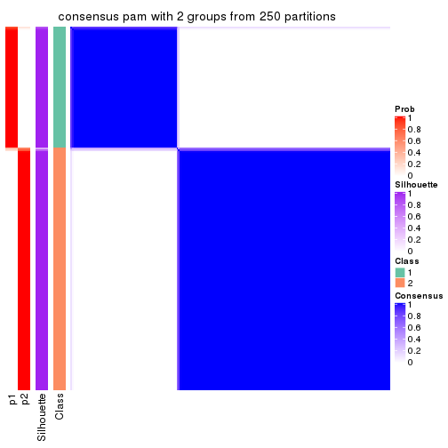</p>

</div>
<div id='tab-ATC-pam-consensus-heatmap-2'>
<pre><code class="r">consensus_heatmap(res, k = 3)
</code></pre>

<p>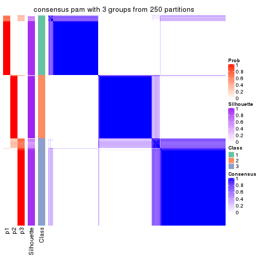</p>

</div>
<div id='tab-ATC-pam-consensus-heatmap-3'>
<pre><code class="r">consensus_heatmap(res, k = 4)
</code></pre>

<p>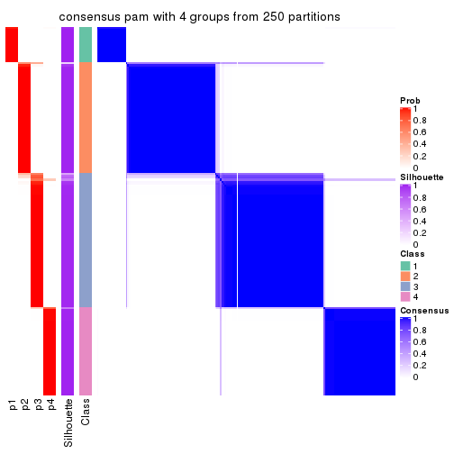</p>

</div>
<div id='tab-ATC-pam-consensus-heatmap-4'>
<pre><code class="r">consensus_heatmap(res, k = 5)
</code></pre>

<p>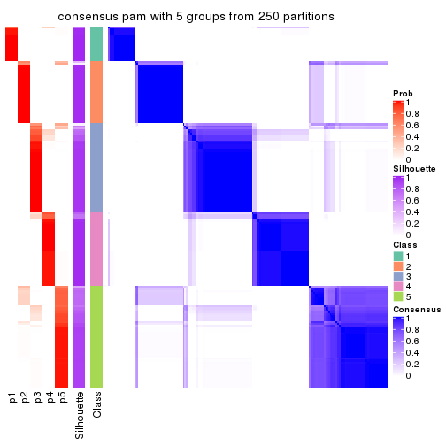</p>

</div>
<div id='tab-ATC-pam-consensus-heatmap-5'>
<pre><code class="r">consensus_heatmap(res, k = 6)
</code></pre>

<p>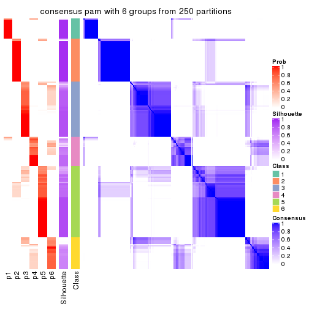</p>

</div>
</div>

Heatmaps for the membership of samples in all partitions to see how consistent they are:


<script>
$( function() {
	$( '#tabs-ATC-pam-membership-heatmap' ).tabs();
} );
</script>
<div id='tabs-ATC-pam-membership-heatmap'>
<ul>
<li><a href='#tab-ATC-pam-membership-heatmap-1'>k = 2</a></li>
<li><a href='#tab-ATC-pam-membership-heatmap-2'>k = 3</a></li>
<li><a href='#tab-ATC-pam-membership-heatmap-3'>k = 4</a></li>
<li><a href='#tab-ATC-pam-membership-heatmap-4'>k = 5</a></li>
<li><a href='#tab-ATC-pam-membership-heatmap-5'>k = 6</a></li>
</ul>
<div id='tab-ATC-pam-membership-heatmap-1'>
<pre><code class="r">membership_heatmap(res, k = 2)
</code></pre>

<p>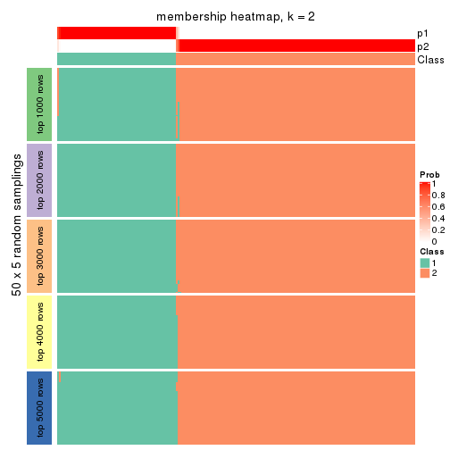</p>

</div>
<div id='tab-ATC-pam-membership-heatmap-2'>
<pre><code class="r">membership_heatmap(res, k = 3)
</code></pre>

<p>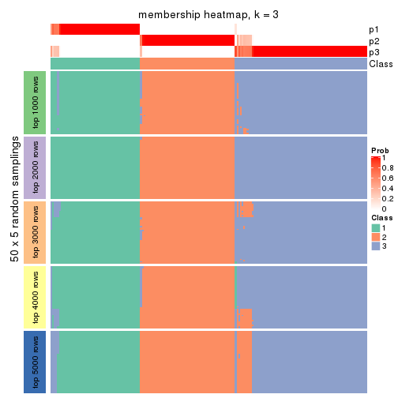</p>

</div>
<div id='tab-ATC-pam-membership-heatmap-3'>
<pre><code class="r">membership_heatmap(res, k = 4)
</code></pre>

<p>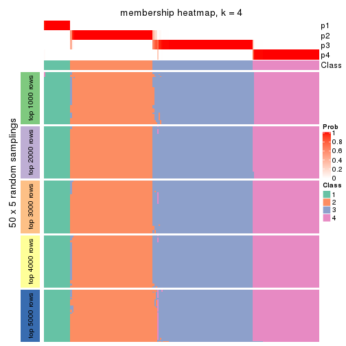</p>

</div>
<div id='tab-ATC-pam-membership-heatmap-4'>
<pre><code class="r">membership_heatmap(res, k = 5)
</code></pre>

<p>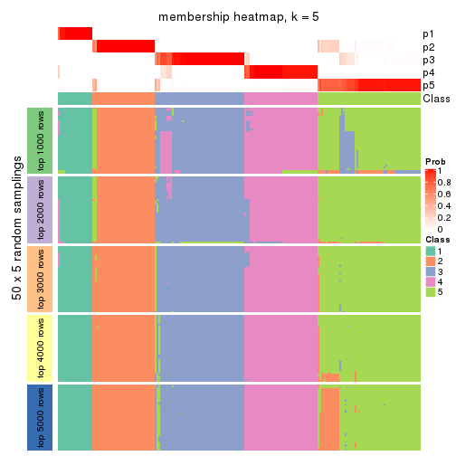</p>

</div>
<div id='tab-ATC-pam-membership-heatmap-5'>
<pre><code class="r">membership_heatmap(res, k = 6)
</code></pre>

<p>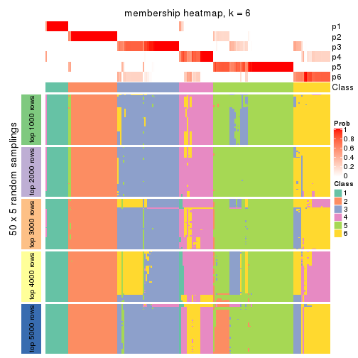</p>

</div>
</div>

As soon as we have had the classes for columns, we can look for signatures
which are significantly different between classes which can be candidate marks
for certain classes. Following are the heatmaps for signatures.


Signature heatmaps where rows are scaled:


<script>
$( function() {
	$( '#tabs-ATC-pam-get-signatures' ).tabs();
} );
</script>
<div id='tabs-ATC-pam-get-signatures'>
<ul>
<li><a href='#tab-ATC-pam-get-signatures-1'>k = 2</a></li>
<li><a href='#tab-ATC-pam-get-signatures-2'>k = 3</a></li>
<li><a href='#tab-ATC-pam-get-signatures-3'>k = 4</a></li>
<li><a href='#tab-ATC-pam-get-signatures-4'>k = 5</a></li>
<li><a href='#tab-ATC-pam-get-signatures-5'>k = 6</a></li>
</ul>
<div id='tab-ATC-pam-get-signatures-1'>
<pre><code class="r">get_signatures(res, k = 2)
</code></pre>

<p>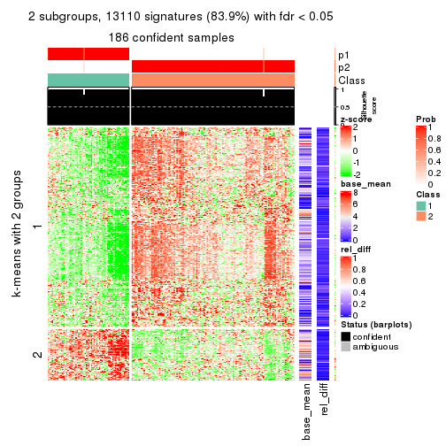</p>

</div>
<div id='tab-ATC-pam-get-signatures-2'>
<pre><code class="r">get_signatures(res, k = 3)
</code></pre>

<p>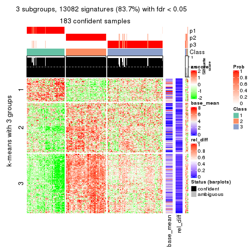</p>

</div>
<div id='tab-ATC-pam-get-signatures-3'>
<pre><code class="r">get_signatures(res, k = 4)
</code></pre>

<p>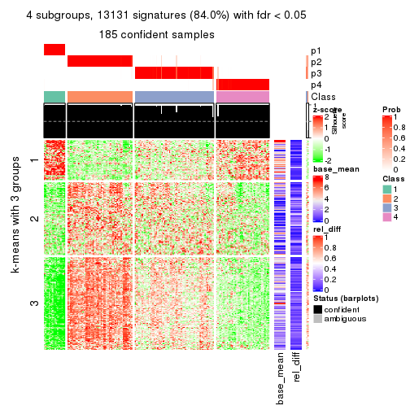</p>

</div>
<div id='tab-ATC-pam-get-signatures-4'>
<pre><code class="r">get_signatures(res, k = 5)
</code></pre>

<p>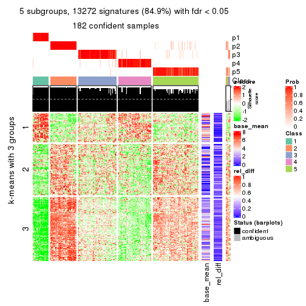</p>

</div>
<div id='tab-ATC-pam-get-signatures-5'>
<pre><code class="r">get_signatures(res, k = 6)
</code></pre>

<p>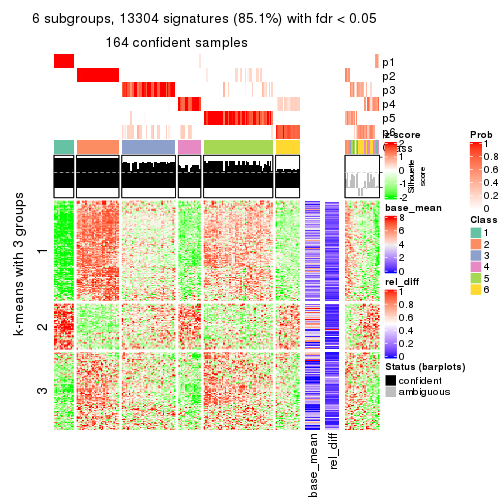</p>

</div>
</div>


Signature heatmaps where rows are not scaled:


<script>
$( function() {
	$( '#tabs-ATC-pam-get-signatures-no-scale' ).tabs();
} );
</script>
<div id='tabs-ATC-pam-get-signatures-no-scale'>
<ul>
<li><a href='#tab-ATC-pam-get-signatures-no-scale-1'>k = 2</a></li>
<li><a href='#tab-ATC-pam-get-signatures-no-scale-2'>k = 3</a></li>
<li><a href='#tab-ATC-pam-get-signatures-no-scale-3'>k = 4</a></li>
<li><a href='#tab-ATC-pam-get-signatures-no-scale-4'>k = 5</a></li>
<li><a href='#tab-ATC-pam-get-signatures-no-scale-5'>k = 6</a></li>
</ul>
<div id='tab-ATC-pam-get-signatures-no-scale-1'>
<pre><code class="r">get_signatures(res, k = 2, scale_rows = FALSE)
</code></pre>

<p>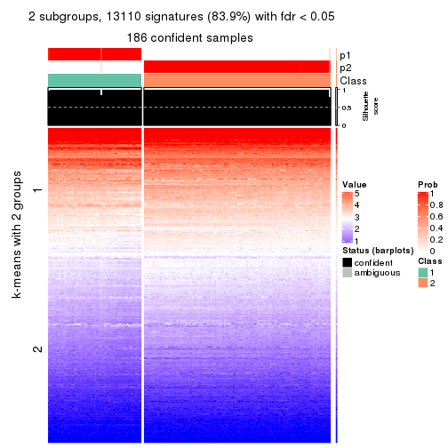</p>

</div>
<div id='tab-ATC-pam-get-signatures-no-scale-2'>
<pre><code class="r">get_signatures(res, k = 3, scale_rows = FALSE)
</code></pre>

<p>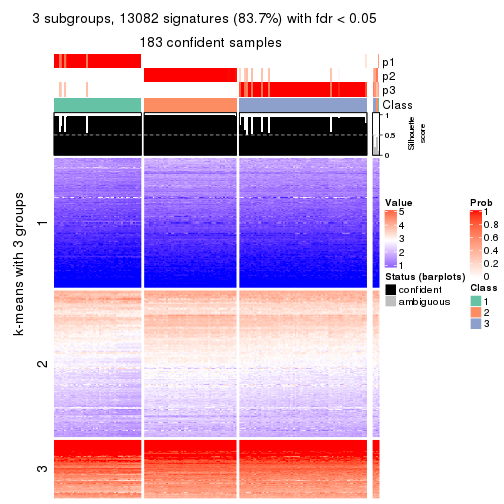</p>

</div>
<div id='tab-ATC-pam-get-signatures-no-scale-3'>
<pre><code class="r">get_signatures(res, k = 4, scale_rows = FALSE)
</code></pre>

<p>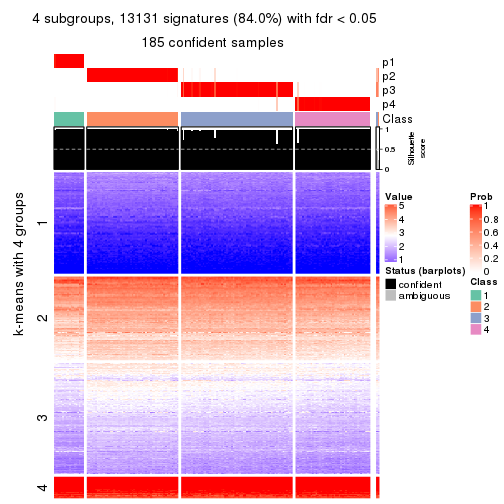</p>

</div>
<div id='tab-ATC-pam-get-signatures-no-scale-4'>
<pre><code class="r">get_signatures(res, k = 5, scale_rows = FALSE)
</code></pre>

<p>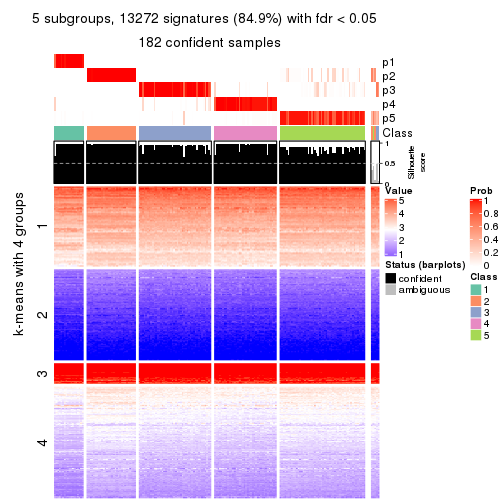</p>

</div>
<div id='tab-ATC-pam-get-signatures-no-scale-5'>
<pre><code class="r">get_signatures(res, k = 6, scale_rows = FALSE)
</code></pre>

<p>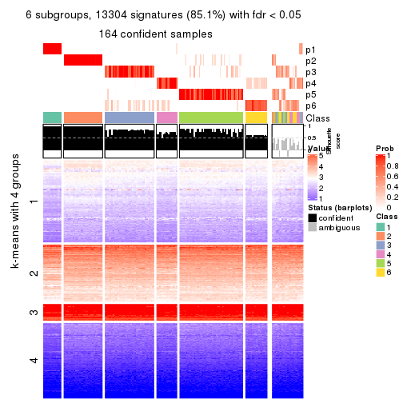</p>

</div>
</div>


Compare the overlap of signatures from different k:

```r
compare_signatures(res)
```

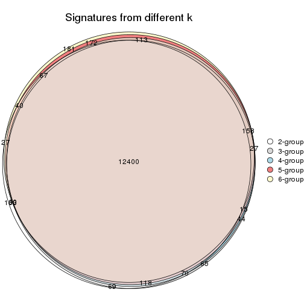

`get_signature()` returns a data frame invisibly. TO get the list of signatures, the function
call should be assigned to a variable explicitly. In following code, if `plot` argument is set
to `FALSE`, no heatmap is plotted while only the differential analysis is performed.

```r
# code only for demonstration
tb = get_signature(res, k = ..., plot = FALSE)
```

An example of the output of `tb` is:

```
#>   which_row         fdr    mean_1    mean_2 scaled_mean_1 scaled_mean_2 km
#> 1        38 0.042760348  8.373488  9.131774    -0.5533452     0.5164555  1
#> 2        40 0.018707592  7.106213  8.469186    -0.6173731     0.5762149  1
#> 3        55 0.019134737 10.221463 11.207825    -0.6159697     0.5749050  1
#> 4        59 0.006059896  5.921854  7.869574    -0.6899429     0.6439467  1
#> 5        60 0.018055526  8.928898 10.211722    -0.6204761     0.5791110  1
#> 6        98 0.009384629 15.714769 14.887706     0.6635654    -0.6193277  2
...
```

The columns in `tb` are:

1. `which_row`: row indices corresponding to the input matrix.
2. `fdr`: FDR for the differential test. 
3. `mean_x`: The mean value in group x.
4. `scaled_mean_x`: The mean value in group x after rows are scaled.
5. `km`: Row groups if k-means clustering is applied to rows.


UMAP plot which shows how samples are separated.


<script>
$( function() {
	$( '#tabs-ATC-pam-dimension-reduction' ).tabs();
} );
</script>
<div id='tabs-ATC-pam-dimension-reduction'>
<ul>
<li><a href='#tab-ATC-pam-dimension-reduction-1'>k = 2</a></li>
<li><a href='#tab-ATC-pam-dimension-reduction-2'>k = 3</a></li>
<li><a href='#tab-ATC-pam-dimension-reduction-3'>k = 4</a></li>
<li><a href='#tab-ATC-pam-dimension-reduction-4'>k = 5</a></li>
<li><a href='#tab-ATC-pam-dimension-reduction-5'>k = 6</a></li>
</ul>
<div id='tab-ATC-pam-dimension-reduction-1'>
<pre><code class="r">dimension_reduction(res, k = 2, method = &quot;UMAP&quot;)
</code></pre>

<p>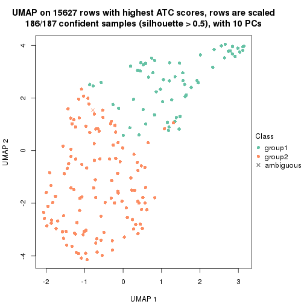</p>

</div>
<div id='tab-ATC-pam-dimension-reduction-2'>
<pre><code class="r">dimension_reduction(res, k = 3, method = &quot;UMAP&quot;)
</code></pre>

<p>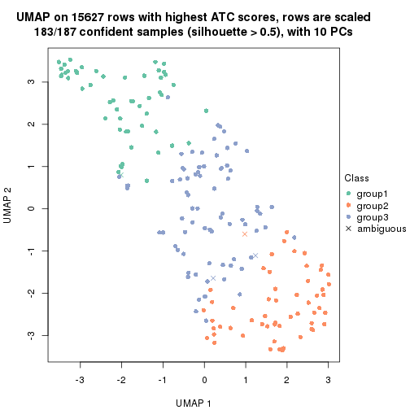</p>

</div>
<div id='tab-ATC-pam-dimension-reduction-3'>
<pre><code class="r">dimension_reduction(res, k = 4, method = &quot;UMAP&quot;)
</code></pre>

<p>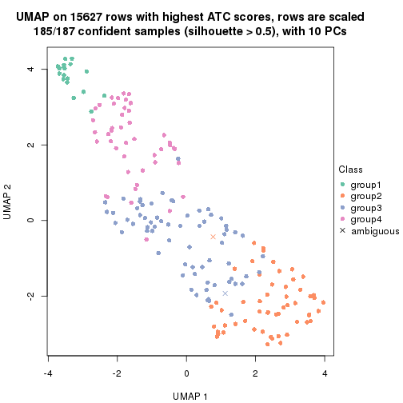</p>

</div>
<div id='tab-ATC-pam-dimension-reduction-4'>
<pre><code class="r">dimension_reduction(res, k = 5, method = &quot;UMAP&quot;)
</code></pre>

<p>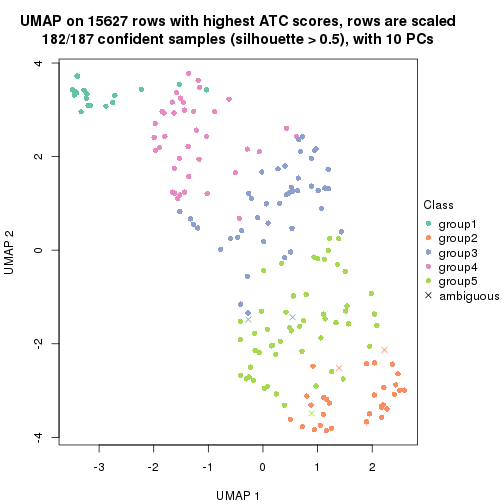</p>

</div>
<div id='tab-ATC-pam-dimension-reduction-5'>
<pre><code class="r">dimension_reduction(res, k = 6, method = &quot;UMAP&quot;)
</code></pre>

<p>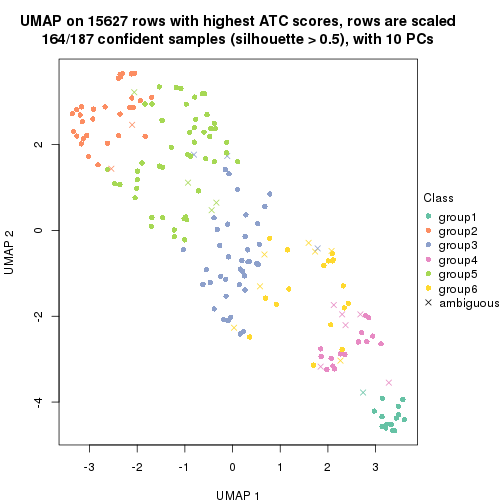</p>

</div>
</div>


Following heatmap shows how subgroups are split when increasing `k`:

```r
collect_classes(res)
```

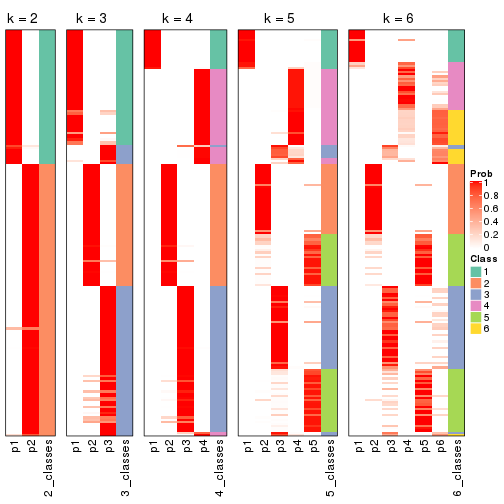


If matrix rows can be associated to genes, consider to use `GO_Enrichment(res,
...)` to perform function enrichment for the signature genes.


 

---------------------------------------------------


### ATC:mclust


The object with results only for a single top-value method and a single partition method 
can be extracted as:

```r
res = res_list["ATC", "mclust"]
# you can also extract it by
# res = res_list["ATC:mclust"]
```

A summary of `res` and all the functions that can be applied to it:

```r
res
```

```
#> A 'ConsensusPartition' object with k = 2, 3, 4, 5, 6.
#>   On a matrix with 15627 rows and 187 columns.
#>   Top rows (1000, 2000, 3000, 4000, 5000) are extracted by 'ATC' method.
#>   Subgroups are detected by 'mclust' method.
#>   Performed in total 1250 partitions by row resampling.
#>   Best k for subgroups seems to be 2.
#> 
#> Following methods can be applied to this 'ConsensusPartition' object:
#>  [1] "cola_report"             "collect_classes"         "collect_plots"          
#>  [4] "collect_stats"           "colnames"                "compare_signatures"     
#>  [7] "consensus_heatmap"       "dimension_reduction"     "functional_enrichment"  
#> [10] "get_anno_col"            "get_anno"                "get_classes"            
#> [13] "get_consensus"           "get_matrix"              "get_membership"         
#> [16] "get_param"               "get_signatures"          "get_stats"              
#> [19] "is_best_k"               "is_stable_k"             "membership_heatmap"     
#> [22] "ncol"                    "nrow"                    "plot_ecdf"              
#> [25] "rownames"                "select_partition_number" "show"                   
#> [28] "suggest_best_k"          "test_to_known_factors"
```

`collect_plots()` function collects all the plots made from `res` for all `k` (number of partitions)
into one single page to provide an easy and fast comparison between different `k`.

```r
collect_plots(res)
```

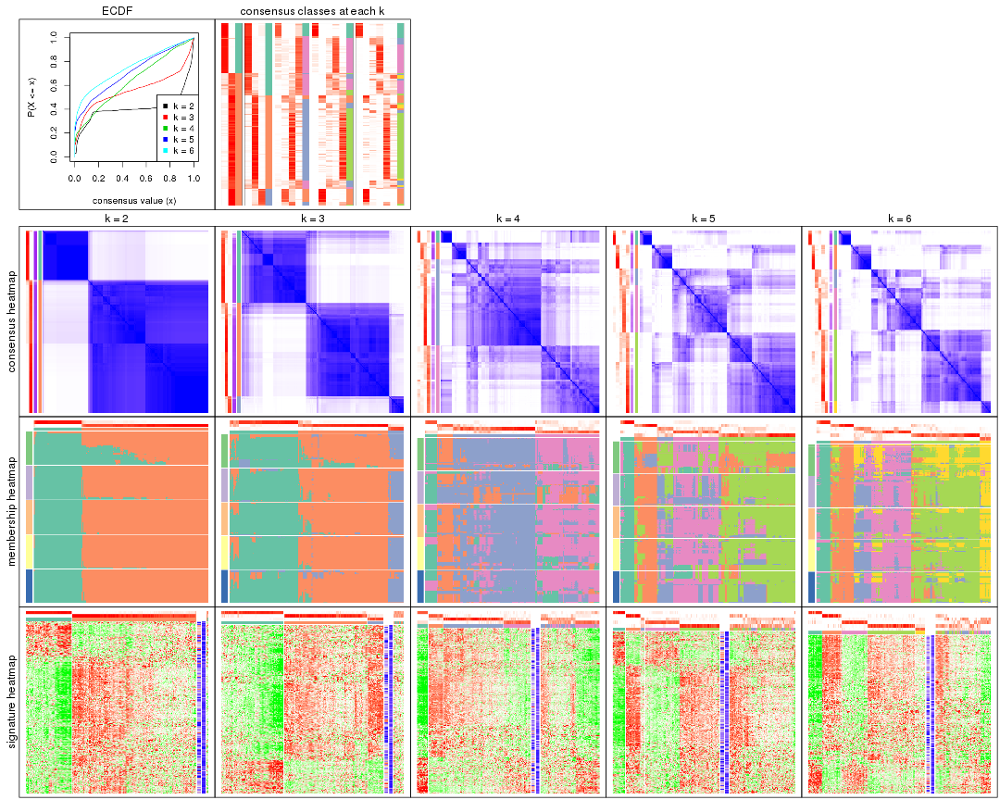

The plots are:

- The first row: a plot of the ECDF (Empirical cumulative distribution
  function) curves of the consensus matrix for each `k` and the heatmap of
  predicted classes for each `k`.
- The second row: heatmaps of the consensus matrix for each `k`.
- The third row: heatmaps of the membership matrix for each `k`.
- The fouth row: heatmaps of the signatures for each `k`.

All the plots in panels can be made by individual functions and they are
plotted later in this section.

`select_partition_number()` produces several plots showing different
statistics for choosing "optimized" `k`. There are following statistics:

- ECDF curves of the consensus matrix for each `k`;
- 1-PAC. [The PAC
  score](https://en.wikipedia.org/wiki/Consensus_clustering#Over-interpretation_potential_of_consensus_clustering)
  measures the proportion of the ambiguous subgrouping.
- Mean silhouette score.
- Concordance. The mean probability of fiting the consensus class ids in all
  partitions.
- Area increased. Denote $A_k$ as the area under the ECDF curve for current
  `k`, the area increased is defined as $A_k - A_{k-1}$.
- Rand index. The percent of pairs of samples that are both in a same cluster
  or both are not in a same cluster in the partition of k and k-1.
- Jaccard index. The ratio of pairs of samples are both in a same cluster in
  the partition of k and k-1 and the pairs of samples are both in a same
  cluster in the partition k or k-1.

The detailed explanations of these statistics can be found in [the cola
vignette](http://bioconductor.org/packages/devel/bioc/vignettes/cola/inst/doc/cola.html#toc_13).

Generally speaking, lower PAC score, higher mean silhouette score or higher
concordance corresponds to better partition. Rand index and Jaccard index
measure how similar the current partition is compared to partition with `k-1`.
If they are too similar, we won't accept `k` is better than `k-1`.

```r
select_partition_number(res)
```

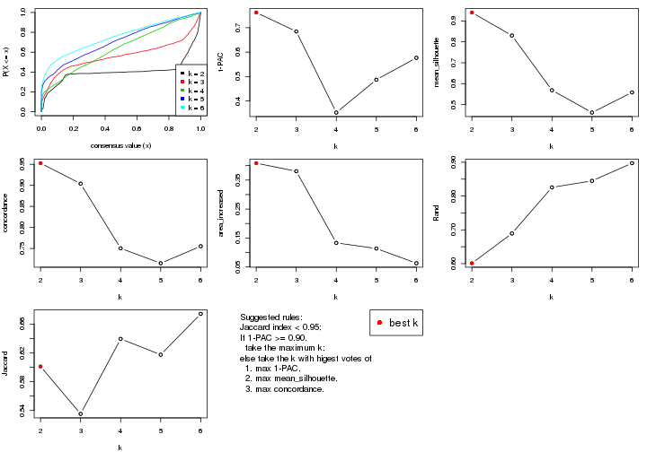

The numeric values for all these statistics can be obtained by `get_stats()`.

```r
get_stats(res)
```

```
#>   k 1-PAC mean_silhouette concordance area_increased  Rand Jaccard
#> 2 2 0.762           0.940       0.953          0.408 0.601   0.601
#> 3 3 0.685           0.830       0.904          0.380 0.689   0.535
#> 4 4 0.352           0.568       0.750          0.133 0.826   0.640
#> 5 5 0.487           0.462       0.715          0.114 0.845   0.618
#> 6 6 0.577           0.558       0.755          0.063 0.897   0.674
```

`suggest_best_k()` suggests the best $k$ based on these statistics. The rules are as follows:

- All $k$ with Jaccard index larger than 0.95 are removed because the increase of
  the partition number does not provides enough extra information. If all $k$ are removed,
  the best $k$ is assigned by `NA`.
- For $k$ with 1-PAC larger than 0.9, the maximal $k$ is taken as the "best k". Other $k$ is called "optional k".
- If it does not fit the second rule. The $k$ with the highest vote of highest
  1-PAC, mean silhouette and concordance is taken as the "best k".

```r
suggest_best_k(res)
```

```
#> [1] 2
```


Following shows the table of the partitions (You need to click the **show/hide
code output** link to see it). The membership matrix (columns with name `p*`)
is inferred by
[`clue::cl_consensus()`](https://www.rdocumentation.org/link/cl_consensus?package=clue)
function with the `SE` method. Basically the value in the membership matrix
represents the probability to belong to a certain group. The finall class
label for an item is determined with the group with highest probability it
belongs to.

In `get_classes()` function, the entropy is calculated from the membership
matrix and the silhouette score is calculated from the consensus matrix.


<script>
$( function() {
	$( '#tabs-ATC-mclust-get-classes' ).tabs();
} );
</script>
<div id='tabs-ATC-mclust-get-classes'>
<ul>
<li><a href='#tab-ATC-mclust-get-classes-1'>k = 2</a></li>
<li><a href='#tab-ATC-mclust-get-classes-2'>k = 3</a></li>
<li><a href='#tab-ATC-mclust-get-classes-3'>k = 4</a></li>
<li><a href='#tab-ATC-mclust-get-classes-4'>k = 5</a></li>
<li><a href='#tab-ATC-mclust-get-classes-5'>k = 6</a></li>
</ul>

<div id='tab-ATC-mclust-get-classes-1'>
<p><a id='tab-ATC-mclust-get-classes-1-a' style='color:#0366d6' href='#'>show/hide code output</a></p>
<pre><code class="r">cbind(get_classes(res, k = 2), get_membership(res, k = 2))
</code></pre>

<pre><code>#&gt;            class entropy silhouette    p1    p2
#&gt; SRR1747213     1  0.9000      0.478 0.684 0.316
#&gt; SRR1747214     1  0.0938      0.989 0.988 0.012
#&gt; SRR1747215     2  0.0000      0.942 0.000 1.000
#&gt; SRR1747216     2  0.0000      0.942 0.000 1.000
#&gt; SRR1747217     2  0.4939      0.926 0.108 0.892
#&gt; SRR1747218     2  0.3274      0.944 0.060 0.940
#&gt; SRR1747219     2  0.5629      0.911 0.132 0.868
#&gt; SRR1747220     1  0.0938      0.989 0.988 0.012
#&gt; SRR1747221     1  0.2043      0.969 0.968 0.032
#&gt; SRR1747222     1  0.0938      0.989 0.988 0.012
#&gt; SRR1747223     1  0.0938      0.989 0.988 0.012
#&gt; SRR1747224     2  0.4562      0.932 0.096 0.904
#&gt; SRR1747225     2  0.1414      0.946 0.020 0.980
#&gt; SRR1747226     2  0.0000      0.942 0.000 1.000
#&gt; SRR1747227     2  0.3584      0.937 0.068 0.932
#&gt; SRR1747228     2  0.3431      0.943 0.064 0.936
#&gt; SRR1747229     2  0.0000      0.942 0.000 1.000
#&gt; SRR1747230     1  0.0000      0.982 1.000 0.000
#&gt; SRR1747231     2  0.7528      0.819 0.216 0.784
#&gt; SRR1747232     1  0.0938      0.989 0.988 0.012
#&gt; SRR1747233     1  0.0938      0.989 0.988 0.012
#&gt; SRR1747234     2  0.3114      0.944 0.056 0.944
#&gt; SRR1747235     1  0.0938      0.989 0.988 0.012
#&gt; SRR1747236     2  0.3114      0.944 0.056 0.944
#&gt; SRR1747237     2  0.0000      0.942 0.000 1.000
#&gt; SRR1747238     2  0.0938      0.945 0.012 0.988
#&gt; SRR1747239     2  0.0000      0.942 0.000 1.000
#&gt; SRR1747240     1  0.0000      0.982 1.000 0.000
#&gt; SRR1747241     2  0.5408      0.917 0.124 0.876
#&gt; SRR1747242     1  0.0000      0.982 1.000 0.000
#&gt; SRR1747243     1  0.0938      0.989 0.988 0.012
#&gt; SRR1747244     2  0.4161      0.936 0.084 0.916
#&gt; SRR1747245     2  0.3879      0.936 0.076 0.924
#&gt; SRR1747246     2  0.0000      0.942 0.000 1.000
#&gt; SRR1747247     1  0.0938      0.989 0.988 0.012
#&gt; SRR1747248     1  0.0000      0.982 1.000 0.000
#&gt; SRR1747249     1  0.0938      0.989 0.988 0.012
#&gt; SRR1747250     2  0.2778      0.945 0.048 0.952
#&gt; SRR1747252     1  0.0938      0.989 0.988 0.012
#&gt; SRR1747253     1  0.0938      0.989 0.988 0.012
#&gt; SRR1747254     2  0.0000      0.942 0.000 1.000
#&gt; SRR1747255     1  0.0938      0.989 0.988 0.012
#&gt; SRR1747256     1  0.0938      0.989 0.988 0.012
#&gt; SRR1747257     2  0.0000      0.942 0.000 1.000
#&gt; SRR1747258     2  0.5059      0.924 0.112 0.888
#&gt; SRR1747259     2  0.1633      0.947 0.024 0.976
#&gt; SRR1747260     2  0.5408      0.917 0.124 0.876
#&gt; SRR1747261     2  0.2778      0.945 0.048 0.952
#&gt; SRR1747262     2  0.1414      0.946 0.020 0.980
#&gt; SRR1747263     2  0.0938      0.946 0.012 0.988
#&gt; SRR1747264     1  0.0938      0.989 0.988 0.012
#&gt; SRR1747265     2  0.5629      0.911 0.132 0.868
#&gt; SRR1747266     2  0.3733      0.941 0.072 0.928
#&gt; SRR1747267     2  0.5519      0.914 0.128 0.872
#&gt; SRR1747268     2  0.5408      0.917 0.124 0.876
#&gt; SRR1747269     2  0.4562      0.931 0.096 0.904
#&gt; SRR1747270     2  0.0000      0.942 0.000 1.000
#&gt; SRR1747271     2  0.1843      0.947 0.028 0.972
#&gt; SRR1747272     2  0.5629      0.911 0.132 0.868
#&gt; SRR1747273     1  0.0938      0.989 0.988 0.012
#&gt; SRR1747274     2  0.1843      0.947 0.028 0.972
#&gt; SRR1747275     1  0.0938      0.989 0.988 0.012
#&gt; SRR1747276     1  0.0938      0.989 0.988 0.012
#&gt; SRR1747277     2  0.2778      0.946 0.048 0.952
#&gt; SRR1747278     2  0.5408      0.917 0.124 0.876
#&gt; SRR1747280     1  0.0938      0.989 0.988 0.012
#&gt; SRR1747279     1  0.0938      0.989 0.988 0.012
#&gt; SRR1747281     2  0.0000      0.942 0.000 1.000
#&gt; SRR1747282     1  0.0938      0.989 0.988 0.012
#&gt; SRR1747283     2  0.5519      0.914 0.128 0.872
#&gt; SRR1747284     1  0.0938      0.989 0.988 0.012
#&gt; SRR1747285     2  0.5059      0.924 0.112 0.888
#&gt; SRR1747286     2  0.4022      0.938 0.080 0.920
#&gt; SRR1747287     2  0.0000      0.942 0.000 1.000
#&gt; SRR1747288     2  0.5629      0.911 0.132 0.868
#&gt; SRR1747290     2  0.0672      0.945 0.008 0.992
#&gt; SRR1747289     2  0.1414      0.947 0.020 0.980
#&gt; SRR1747291     2  0.1184      0.946 0.016 0.984
#&gt; SRR1747293     2  0.2423      0.946 0.040 0.960
#&gt; SRR1747294     2  0.0000      0.942 0.000 1.000
#&gt; SRR1747292     1  0.0938      0.989 0.988 0.012
#&gt; SRR1747295     2  0.1633      0.947 0.024 0.976
#&gt; SRR1747296     2  0.3879      0.938 0.076 0.924
#&gt; SRR1747297     2  0.0000      0.942 0.000 1.000
#&gt; SRR1747298     2  0.1184      0.946 0.016 0.984
#&gt; SRR1747299     2  0.0000      0.942 0.000 1.000
#&gt; SRR1747300     2  0.0376      0.944 0.004 0.996
#&gt; SRR1747301     2  0.0376      0.944 0.004 0.996
#&gt; SRR1747302     2  0.0000      0.942 0.000 1.000
#&gt; SRR1747303     2  0.0000      0.942 0.000 1.000
#&gt; SRR1747304     1  0.0000      0.982 1.000 0.000
#&gt; SRR1747305     2  0.0000      0.942 0.000 1.000
#&gt; SRR1747306     2  0.0000      0.942 0.000 1.000
#&gt; SRR1747307     2  0.5629      0.911 0.132 0.868
#&gt; SRR1747308     2  0.1633      0.947 0.024 0.976
#&gt; SRR1747309     1  0.0938      0.989 0.988 0.012
#&gt; SRR1747310     1  0.0938      0.989 0.988 0.012
#&gt; SRR1747311     2  0.6343      0.885 0.160 0.840
#&gt; SRR1747313     2  0.5842      0.905 0.140 0.860
#&gt; SRR1747312     1  0.0000      0.982 1.000 0.000
#&gt; SRR1747314     1  0.0000      0.982 1.000 0.000
#&gt; SRR1747315     2  0.0938      0.946 0.012 0.988
#&gt; SRR1747316     2  0.1633      0.947 0.024 0.976
#&gt; SRR1747318     2  0.5408      0.917 0.124 0.876
#&gt; SRR1747317     2  0.4298      0.935 0.088 0.912
#&gt; SRR1747319     2  0.5629      0.911 0.132 0.868
#&gt; SRR1747320     1  0.0938      0.989 0.988 0.012
#&gt; SRR1747322     1  0.0000      0.982 1.000 0.000
#&gt; SRR1747321     1  0.0938      0.989 0.988 0.012
#&gt; SRR1747323     2  0.0000      0.942 0.000 1.000
#&gt; SRR1747324     2  0.0938      0.945 0.012 0.988
#&gt; SRR1747326     2  0.2043      0.947 0.032 0.968
#&gt; SRR1747325     2  0.0000      0.942 0.000 1.000
#&gt; SRR1747327     2  0.0000      0.942 0.000 1.000
#&gt; SRR1747328     2  0.4022      0.938 0.080 0.920
#&gt; SRR1747330     2  0.9977      0.257 0.472 0.528
#&gt; SRR1747329     2  0.2236      0.947 0.036 0.964
#&gt; SRR1747332     2  0.5842      0.905 0.140 0.860
#&gt; SRR1747331     2  0.5059      0.924 0.112 0.888
#&gt; SRR1747333     2  0.4690      0.930 0.100 0.900
#&gt; SRR1747334     2  0.3584      0.940 0.068 0.932
#&gt; SRR1747335     2  0.5629      0.911 0.132 0.868
#&gt; SRR1747336     1  0.0000      0.982 1.000 0.000
#&gt; SRR1747337     2  0.0000      0.942 0.000 1.000
#&gt; SRR1747338     2  0.0000      0.942 0.000 1.000
#&gt; SRR1747339     2  0.4815      0.928 0.104 0.896
#&gt; SRR1747340     2  0.3733      0.941 0.072 0.928
#&gt; SRR1747341     2  0.0000      0.942 0.000 1.000
#&gt; SRR1747342     2  0.0000      0.942 0.000 1.000
#&gt; SRR1747343     2  0.0000      0.942 0.000 1.000
#&gt; SRR1747344     2  0.0000      0.942 0.000 1.000
#&gt; SRR1747345     2  0.5629      0.911 0.132 0.868
#&gt; SRR1747346     2  0.4298      0.935 0.088 0.912
#&gt; SRR1747347     2  0.0376      0.944 0.004 0.996
#&gt; SRR1747348     1  0.0000      0.982 1.000 0.000
#&gt; SRR1747349     1  0.0938      0.989 0.988 0.012
#&gt; SRR1747351     2  0.0000      0.942 0.000 1.000
#&gt; SRR1747350     2  0.0000      0.942 0.000 1.000
#&gt; SRR1747352     1  0.0938      0.989 0.988 0.012
#&gt; SRR1747353     2  0.0000      0.942 0.000 1.000
#&gt; SRR1747354     2  0.2948      0.944 0.052 0.948
#&gt; SRR1747355     2  0.5629      0.911 0.132 0.868
#&gt; SRR1747356     2  0.3274      0.943 0.060 0.940
#&gt; SRR1747357     2  0.5178      0.922 0.116 0.884
#&gt; SRR1747358     2  0.3431      0.942 0.064 0.936
#&gt; SRR1747359     1  0.0938      0.989 0.988 0.012
#&gt; SRR1747360     2  0.1633      0.947 0.024 0.976
#&gt; SRR1747361     2  0.5294      0.919 0.120 0.880
#&gt; SRR1747362     2  0.0938      0.945 0.012 0.988
#&gt; SRR1747363     2  0.5629      0.911 0.132 0.868
#&gt; SRR1747364     1  0.1184      0.985 0.984 0.016
#&gt; SRR1747365     2  0.5408      0.917 0.124 0.876
#&gt; SRR1747366     2  0.0672      0.945 0.008 0.992
#&gt; SRR1747367     2  0.5629      0.911 0.132 0.868
#&gt; SRR1747369     2  0.0000      0.942 0.000 1.000
#&gt; SRR1747368     2  0.4431      0.934 0.092 0.908
#&gt; SRR1747370     2  0.4815      0.928 0.104 0.896
#&gt; SRR1747372     1  0.0000      0.982 1.000 0.000
#&gt; SRR1747371     1  0.0938      0.989 0.988 0.012
#&gt; SRR1747373     2  0.0000      0.942 0.000 1.000
#&gt; SRR1747374     2  0.0000      0.942 0.000 1.000
#&gt; SRR1747375     1  0.1633      0.977 0.976 0.024
#&gt; SRR1747376     2  0.0000      0.942 0.000 1.000
#&gt; SRR1747377     2  0.0000      0.942 0.000 1.000
#&gt; SRR1747378     2  0.1633      0.947 0.024 0.976
#&gt; SRR1747379     2  0.1184      0.946 0.016 0.984
#&gt; SRR1747380     2  0.4939      0.926 0.108 0.892
#&gt; SRR1747381     1  0.0938      0.989 0.988 0.012
#&gt; SRR1747382     1  0.0938      0.989 0.988 0.012
#&gt; SRR1747383     2  0.0000      0.942 0.000 1.000
#&gt; SRR1747384     2  0.5294      0.919 0.120 0.880
#&gt; SRR1747385     2  0.5408      0.917 0.124 0.876
#&gt; SRR1747386     1  0.0000      0.982 1.000 0.000
#&gt; SRR1747387     2  0.0000      0.942 0.000 1.000
#&gt; SRR1747388     2  0.0376      0.944 0.004 0.996
#&gt; SRR1747390     2  0.1414      0.946 0.020 0.980
#&gt; SRR1747389     2  0.2043      0.947 0.032 0.968
#&gt; SRR1747391     2  0.1184      0.946 0.016 0.984
#&gt; SRR1747392     2  0.0938      0.946 0.012 0.988
#&gt; SRR1747393     2  0.2423      0.946 0.040 0.960
#&gt; SRR1747394     2  0.9427      0.564 0.360 0.640
#&gt; SRR1747395     2  0.5408      0.917 0.124 0.876
#&gt; SRR1747396     2  0.4298      0.934 0.088 0.912
#&gt; SRR1747398     2  0.3114      0.941 0.056 0.944
#&gt; SRR1747397     2  0.6887      0.859 0.184 0.816
#&gt; SRR1747399     1  0.0938      0.989 0.988 0.012
#&gt; SRR1747400     1  0.0938      0.989 0.988 0.012
</code></pre>

<script>
$('#tab-ATC-mclust-get-classes-1-a').parent().next().next().hide();
$('#tab-ATC-mclust-get-classes-1-a').click(function(){
  $('#tab-ATC-mclust-get-classes-1-a').parent().next().next().toggle();
  return(false);
});
</script>
</div>

<div id='tab-ATC-mclust-get-classes-2'>
<p><a id='tab-ATC-mclust-get-classes-2-a' style='color:#0366d6' href='#'>show/hide code output</a></p>
<pre><code class="r">cbind(get_classes(res, k = 3), get_membership(res, k = 3))
</code></pre>

<pre><code>#&gt;            class entropy silhouette    p1    p2    p3
#&gt; SRR1747213     1  0.2152     0.8857 0.948 0.036 0.016
#&gt; SRR1747214     1  0.1129     0.8884 0.976 0.020 0.004
#&gt; SRR1747215     3  0.3116     0.9322 0.000 0.108 0.892
#&gt; SRR1747216     3  0.4178     0.9204 0.000 0.172 0.828
#&gt; SRR1747217     2  0.5461     0.6718 0.244 0.748 0.008
#&gt; SRR1747218     2  0.1289     0.9027 0.032 0.968 0.000
#&gt; SRR1747219     1  0.6307     0.5342 0.660 0.328 0.012
#&gt; SRR1747220     1  0.1877     0.8862 0.956 0.032 0.012
#&gt; SRR1747221     1  0.1919     0.8877 0.956 0.020 0.024
#&gt; SRR1747222     1  0.1315     0.8884 0.972 0.020 0.008
#&gt; SRR1747223     1  0.1781     0.8887 0.960 0.020 0.020
#&gt; SRR1747224     2  0.6617     0.3472 0.388 0.600 0.012
#&gt; SRR1747225     2  0.1163     0.9033 0.028 0.972 0.000
#&gt; SRR1747226     2  0.0747     0.8884 0.000 0.984 0.016
#&gt; SRR1747227     2  0.3009     0.8661 0.028 0.920 0.052
#&gt; SRR1747228     2  0.3028     0.8877 0.048 0.920 0.032
#&gt; SRR1747229     2  0.0747     0.8947 0.000 0.984 0.016
#&gt; SRR1747230     1  0.2448     0.8336 0.924 0.000 0.076
#&gt; SRR1747231     1  0.2689     0.8786 0.932 0.036 0.032
#&gt; SRR1747232     1  0.1337     0.8851 0.972 0.016 0.012
#&gt; SRR1747233     1  0.1919     0.8885 0.956 0.020 0.024
#&gt; SRR1747234     2  0.2116     0.8955 0.040 0.948 0.012
#&gt; SRR1747235     1  0.1315     0.8886 0.972 0.020 0.008
#&gt; SRR1747236     2  0.1163     0.9033 0.028 0.972 0.000
#&gt; SRR1747237     2  0.3752     0.7775 0.000 0.856 0.144
#&gt; SRR1747238     2  0.0592     0.9032 0.012 0.988 0.000
#&gt; SRR1747239     2  0.5138     0.5674 0.000 0.748 0.252
#&gt; SRR1747240     1  0.2165     0.8410 0.936 0.000 0.064
#&gt; SRR1747241     2  0.4676     0.8310 0.112 0.848 0.040
#&gt; SRR1747242     1  0.2448     0.8336 0.924 0.000 0.076
#&gt; SRR1747243     1  0.2050     0.8888 0.952 0.020 0.028
#&gt; SRR1747244     2  0.2625     0.8722 0.084 0.916 0.000
#&gt; SRR1747245     2  0.3042     0.8805 0.040 0.920 0.040
#&gt; SRR1747246     2  0.0592     0.8916 0.000 0.988 0.012
#&gt; SRR1747247     1  0.1170     0.8860 0.976 0.016 0.008
#&gt; SRR1747248     1  0.2448     0.8336 0.924 0.000 0.076
#&gt; SRR1747249     1  0.1781     0.8887 0.960 0.020 0.020
#&gt; SRR1747250     2  0.1999     0.8975 0.036 0.952 0.012
#&gt; SRR1747252     1  0.2031     0.8850 0.952 0.032 0.016
#&gt; SRR1747253     1  0.1482     0.8881 0.968 0.020 0.012
#&gt; SRR1747254     3  0.5621     0.7366 0.000 0.308 0.692
#&gt; SRR1747255     1  0.1781     0.8887 0.960 0.020 0.020
#&gt; SRR1747256     1  0.1129     0.8890 0.976 0.020 0.004
#&gt; SRR1747257     2  0.2448     0.8509 0.000 0.924 0.076
#&gt; SRR1747258     2  0.2446     0.8867 0.052 0.936 0.012
#&gt; SRR1747259     2  0.1905     0.9025 0.028 0.956 0.016
#&gt; SRR1747260     2  0.6632     0.3421 0.392 0.596 0.012
#&gt; SRR1747261     2  0.1950     0.8983 0.040 0.952 0.008
#&gt; SRR1747262     2  0.0592     0.9032 0.012 0.988 0.000
#&gt; SRR1747263     2  0.2356     0.8555 0.000 0.928 0.072
#&gt; SRR1747264     1  0.1919     0.8885 0.956 0.020 0.024
#&gt; SRR1747265     1  0.6825     0.0179 0.496 0.492 0.012
#&gt; SRR1747266     2  0.1399     0.9029 0.028 0.968 0.004
#&gt; SRR1747267     2  0.6566     0.4041 0.376 0.612 0.012
#&gt; SRR1747268     1  0.6735     0.2889 0.564 0.424 0.012
#&gt; SRR1747269     2  0.1647     0.9007 0.036 0.960 0.004
#&gt; SRR1747270     2  0.1411     0.8822 0.000 0.964 0.036
#&gt; SRR1747271     2  0.1163     0.9033 0.028 0.972 0.000
#&gt; SRR1747272     1  0.4575     0.7845 0.828 0.160 0.012
#&gt; SRR1747273     1  0.1482     0.8881 0.968 0.020 0.012
#&gt; SRR1747274     2  0.1399     0.9029 0.028 0.968 0.004
#&gt; SRR1747275     1  0.1919     0.8885 0.956 0.020 0.024
#&gt; SRR1747276     1  0.1636     0.8892 0.964 0.020 0.016
#&gt; SRR1747277     2  0.1585     0.9040 0.028 0.964 0.008
#&gt; SRR1747278     2  0.2939     0.8717 0.072 0.916 0.012
#&gt; SRR1747280     1  0.1170     0.8864 0.976 0.016 0.008
#&gt; SRR1747279     1  0.1919     0.8885 0.956 0.020 0.024
#&gt; SRR1747281     2  0.0592     0.8916 0.000 0.988 0.012
#&gt; SRR1747282     1  0.1781     0.8887 0.960 0.020 0.020
#&gt; SRR1747283     2  0.5618     0.7727 0.156 0.796 0.048
#&gt; SRR1747284     1  0.1315     0.8886 0.972 0.020 0.008
#&gt; SRR1747285     2  0.2749     0.8788 0.064 0.924 0.012
#&gt; SRR1747286     2  0.6357     0.4867 0.336 0.652 0.012
#&gt; SRR1747287     2  0.2066     0.8642 0.000 0.940 0.060
#&gt; SRR1747288     1  0.3293     0.8539 0.900 0.088 0.012
#&gt; SRR1747290     2  0.0424     0.9023 0.008 0.992 0.000
#&gt; SRR1747289     2  0.0592     0.9032 0.012 0.988 0.000
#&gt; SRR1747291     2  0.1129     0.9047 0.020 0.976 0.004
#&gt; SRR1747293     2  0.1289     0.9027 0.032 0.968 0.000
#&gt; SRR1747294     2  0.1163     0.8877 0.000 0.972 0.028
#&gt; SRR1747292     1  0.1919     0.8885 0.956 0.020 0.024
#&gt; SRR1747295     2  0.1163     0.9033 0.028 0.972 0.000
#&gt; SRR1747296     2  0.3042     0.8781 0.040 0.920 0.040
#&gt; SRR1747297     3  0.3816     0.9318 0.000 0.148 0.852
#&gt; SRR1747298     2  0.0661     0.9027 0.008 0.988 0.004
#&gt; SRR1747299     2  0.0747     0.8884 0.000 0.984 0.016
#&gt; SRR1747300     2  0.0000     0.8992 0.000 1.000 0.000
#&gt; SRR1747301     2  0.2261     0.8601 0.000 0.932 0.068
#&gt; SRR1747302     3  0.4121     0.9225 0.000 0.168 0.832
#&gt; SRR1747303     2  0.0892     0.8918 0.000 0.980 0.020
#&gt; SRR1747304     1  0.2356     0.8356 0.928 0.000 0.072
#&gt; SRR1747305     3  0.3340     0.9368 0.000 0.120 0.880
#&gt; SRR1747306     3  0.5178     0.8383 0.000 0.256 0.744
#&gt; SRR1747307     1  0.3918     0.8244 0.868 0.120 0.012
#&gt; SRR1747308     2  0.2031     0.9020 0.032 0.952 0.016
#&gt; SRR1747309     1  0.1919     0.8879 0.956 0.024 0.020
#&gt; SRR1747310     1  0.1315     0.8886 0.972 0.020 0.008
#&gt; SRR1747311     1  0.4261     0.8053 0.848 0.140 0.012
#&gt; SRR1747313     1  0.3359     0.8573 0.900 0.084 0.016
#&gt; SRR1747312     1  0.2448     0.8336 0.924 0.000 0.076
#&gt; SRR1747314     1  0.2448     0.8336 0.924 0.000 0.076
#&gt; SRR1747315     2  0.0000     0.8992 0.000 1.000 0.000
#&gt; SRR1747316     2  0.1711     0.9034 0.032 0.960 0.008
#&gt; SRR1747318     1  0.5450     0.7001 0.760 0.228 0.012
#&gt; SRR1747317     1  0.6823     0.0813 0.504 0.484 0.012
#&gt; SRR1747319     1  0.3459     0.8465 0.892 0.096 0.012
#&gt; SRR1747320     1  0.1315     0.8881 0.972 0.020 0.008
#&gt; SRR1747322     1  0.2356     0.8356 0.928 0.000 0.072
#&gt; SRR1747321     1  0.1919     0.8885 0.956 0.020 0.024
#&gt; SRR1747323     3  0.3941     0.9289 0.000 0.156 0.844
#&gt; SRR1747324     2  0.0237     0.9009 0.004 0.996 0.000
#&gt; SRR1747326     2  0.0592     0.9032 0.012 0.988 0.000
#&gt; SRR1747325     3  0.3116     0.9322 0.000 0.108 0.892
#&gt; SRR1747327     3  0.3412     0.9336 0.000 0.124 0.876
#&gt; SRR1747328     2  0.3356     0.8805 0.056 0.908 0.036
#&gt; SRR1747330     1  0.3406     0.8668 0.904 0.068 0.028
#&gt; SRR1747329     2  0.2703     0.8915 0.056 0.928 0.016
#&gt; SRR1747332     1  0.3183     0.8613 0.908 0.076 0.016
#&gt; SRR1747331     2  0.1989     0.8958 0.048 0.948 0.004
#&gt; SRR1747333     2  0.1643     0.9001 0.044 0.956 0.000
#&gt; SRR1747334     2  0.0424     0.9023 0.008 0.992 0.000
#&gt; SRR1747335     2  0.6348     0.6982 0.212 0.740 0.048
#&gt; SRR1747336     1  0.2448     0.8336 0.924 0.000 0.076
#&gt; SRR1747337     2  0.3482     0.7779 0.000 0.872 0.128
#&gt; SRR1747338     2  0.0747     0.8884 0.000 0.984 0.016
#&gt; SRR1747339     1  0.6333     0.5418 0.656 0.332 0.012
#&gt; SRR1747340     2  0.1399     0.9029 0.028 0.968 0.004
#&gt; SRR1747341     3  0.3116     0.9322 0.000 0.108 0.892
#&gt; SRR1747342     3  0.3412     0.9376 0.000 0.124 0.876
#&gt; SRR1747343     3  0.3116     0.9322 0.000 0.108 0.892
#&gt; SRR1747344     2  0.0892     0.8931 0.000 0.980 0.020
#&gt; SRR1747345     2  0.6809     0.0870 0.464 0.524 0.012
#&gt; SRR1747346     2  0.5406     0.6975 0.224 0.764 0.012
#&gt; SRR1747347     3  0.3116     0.9322 0.000 0.108 0.892
#&gt; SRR1747348     1  0.2448     0.8336 0.924 0.000 0.076
#&gt; SRR1747349     1  0.1919     0.8885 0.956 0.020 0.024
#&gt; SRR1747351     2  0.0892     0.8896 0.000 0.980 0.020
#&gt; SRR1747350     2  0.0237     0.8969 0.000 0.996 0.004
#&gt; SRR1747352     1  0.1315     0.8881 0.972 0.020 0.008
#&gt; SRR1747353     2  0.0000     0.8992 0.000 1.000 0.000
#&gt; SRR1747354     2  0.1999     0.8975 0.036 0.952 0.012
#&gt; SRR1747355     1  0.3889     0.8464 0.884 0.084 0.032
#&gt; SRR1747356     2  0.2116     0.8950 0.040 0.948 0.012
#&gt; SRR1747357     2  0.2845     0.8738 0.068 0.920 0.012
#&gt; SRR1747358     2  0.2280     0.8917 0.052 0.940 0.008
#&gt; SRR1747359     1  0.1129     0.8884 0.976 0.020 0.004
#&gt; SRR1747360     2  0.0747     0.9037 0.016 0.984 0.000
#&gt; SRR1747361     1  0.5072     0.7437 0.792 0.196 0.012
#&gt; SRR1747362     2  0.0424     0.9023 0.008 0.992 0.000
#&gt; SRR1747363     1  0.7740     0.1167 0.508 0.444 0.048
#&gt; SRR1747364     1  0.1905     0.8862 0.956 0.028 0.016
#&gt; SRR1747365     2  0.6869     0.6196 0.264 0.688 0.048
#&gt; SRR1747366     2  0.0237     0.9009 0.004 0.996 0.000
#&gt; SRR1747367     1  0.4514     0.7904 0.832 0.156 0.012
#&gt; SRR1747369     2  0.0237     0.8969 0.000 0.996 0.004
#&gt; SRR1747368     2  0.5619     0.6640 0.244 0.744 0.012
#&gt; SRR1747370     2  0.2550     0.8835 0.056 0.932 0.012
#&gt; SRR1747372     1  0.2448     0.8336 0.924 0.000 0.076
#&gt; SRR1747371     1  0.1919     0.8879 0.956 0.024 0.020
#&gt; SRR1747373     2  0.0747     0.8884 0.000 0.984 0.016
#&gt; SRR1747374     3  0.6062     0.6259 0.000 0.384 0.616
#&gt; SRR1747375     1  0.2050     0.8880 0.952 0.020 0.028
#&gt; SRR1747376     2  0.0592     0.8916 0.000 0.988 0.012
#&gt; SRR1747377     3  0.3619     0.9365 0.000 0.136 0.864
#&gt; SRR1747378     2  0.0892     0.9039 0.020 0.980 0.000
#&gt; SRR1747379     2  0.0892     0.9042 0.020 0.980 0.000
#&gt; SRR1747380     2  0.5619     0.6695 0.244 0.744 0.012
#&gt; SRR1747381     1  0.1315     0.8886 0.972 0.020 0.008
#&gt; SRR1747382     1  0.0892     0.8889 0.980 0.020 0.000
#&gt; SRR1747383     2  0.2165     0.8613 0.000 0.936 0.064
#&gt; SRR1747384     2  0.6082     0.5923 0.296 0.692 0.012
#&gt; SRR1747385     1  0.6769     0.3912 0.592 0.392 0.016
#&gt; SRR1747386     1  0.2448     0.8336 0.924 0.000 0.076
#&gt; SRR1747387     3  0.3551     0.9374 0.000 0.132 0.868
#&gt; SRR1747388     2  0.0237     0.8969 0.000 0.996 0.004
#&gt; SRR1747390     2  0.1482     0.9037 0.020 0.968 0.012
#&gt; SRR1747389     2  0.1163     0.9033 0.028 0.972 0.000
#&gt; SRR1747391     2  0.0000     0.8992 0.000 1.000 0.000
#&gt; SRR1747392     2  0.0237     0.8969 0.000 0.996 0.004
#&gt; SRR1747393     2  0.1999     0.8975 0.036 0.952 0.012
#&gt; SRR1747394     1  0.3120     0.8589 0.908 0.080 0.012
#&gt; SRR1747395     1  0.6566     0.4340 0.612 0.376 0.012
#&gt; SRR1747396     2  0.1031     0.9038 0.024 0.976 0.000
#&gt; SRR1747398     2  0.0000     0.8992 0.000 1.000 0.000
#&gt; SRR1747397     1  0.3434     0.8680 0.904 0.064 0.032
#&gt; SRR1747399     1  0.1129     0.8884 0.976 0.020 0.004
#&gt; SRR1747400     1  0.2804     0.8707 0.924 0.060 0.016
</code></pre>

<script>
$('#tab-ATC-mclust-get-classes-2-a').parent().next().next().hide();
$('#tab-ATC-mclust-get-classes-2-a').click(function(){
  $('#tab-ATC-mclust-get-classes-2-a').parent().next().next().toggle();
  return(false);
});
</script>
</div>

<div id='tab-ATC-mclust-get-classes-3'>
<p><a id='tab-ATC-mclust-get-classes-3-a' style='color:#0366d6' href='#'>show/hide code output</a></p>
<pre><code class="r">cbind(get_classes(res, k = 4), get_membership(res, k = 4))
</code></pre>

<pre><code>#&gt;            class entropy silhouette    p1    p2    p3    p4
#&gt; SRR1747213     4  0.4485     0.5249 0.124 0.028 0.028 0.820
#&gt; SRR1747214     4  0.4655     0.3637 0.312 0.004 0.000 0.684
#&gt; SRR1747215     2  0.3356     0.8818 0.000 0.824 0.176 0.000
#&gt; SRR1747216     3  0.4663     0.4184 0.012 0.272 0.716 0.000
#&gt; SRR1747217     4  0.5535     0.2385 0.000 0.020 0.420 0.560
#&gt; SRR1747218     3  0.2861     0.7355 0.000 0.016 0.888 0.096
#&gt; SRR1747219     4  0.7255     0.4796 0.124 0.016 0.292 0.568
#&gt; SRR1747220     4  0.5037     0.5976 0.052 0.068 0.072 0.808
#&gt; SRR1747221     4  0.4274     0.6040 0.008 0.064 0.096 0.832
#&gt; SRR1747222     4  0.5282     0.4956 0.188 0.064 0.004 0.744
#&gt; SRR1747223     4  0.5475     0.5782 0.028 0.112 0.088 0.772
#&gt; SRR1747224     3  0.4917     0.4451 0.000 0.008 0.656 0.336
#&gt; SRR1747225     3  0.0524     0.7503 0.000 0.004 0.988 0.008
#&gt; SRR1747226     3  0.1940     0.7127 0.000 0.076 0.924 0.000
#&gt; SRR1747227     3  0.7600     0.0870 0.012 0.140 0.456 0.392
#&gt; SRR1747228     3  0.6367     0.4179 0.000 0.080 0.584 0.336
#&gt; SRR1747229     3  0.4262     0.5143 0.000 0.236 0.756 0.008
#&gt; SRR1747230     1  0.3400     0.9502 0.820 0.000 0.000 0.180
#&gt; SRR1747231     4  0.5474     0.5288 0.092 0.084 0.044 0.780
#&gt; SRR1747232     1  0.4977     0.4096 0.540 0.000 0.000 0.460
#&gt; SRR1747233     4  0.5706     0.4441 0.168 0.104 0.004 0.724
#&gt; SRR1747234     3  0.6458     0.5828 0.104 0.016 0.672 0.208
#&gt; SRR1747235     4  0.4267     0.4388 0.188 0.024 0.000 0.788
#&gt; SRR1747236     3  0.1743     0.7419 0.000 0.004 0.940 0.056
#&gt; SRR1747237     2  0.4697     0.7006 0.000 0.644 0.356 0.000
#&gt; SRR1747238     3  0.1151     0.7514 0.000 0.008 0.968 0.024
#&gt; SRR1747239     2  0.4585     0.7434 0.000 0.668 0.332 0.000
#&gt; SRR1747240     1  0.4072     0.8565 0.748 0.000 0.000 0.252
#&gt; SRR1747241     4  0.7967     0.4192 0.068 0.128 0.232 0.572
#&gt; SRR1747242     1  0.3400     0.9502 0.820 0.000 0.000 0.180
#&gt; SRR1747243     4  0.4801     0.4845 0.084 0.108 0.008 0.800
#&gt; SRR1747244     3  0.5783     0.4080 0.012 0.020 0.608 0.360
#&gt; SRR1747245     3  0.7472     0.0336 0.008 0.136 0.444 0.412
#&gt; SRR1747246     3  0.0921     0.7404 0.000 0.028 0.972 0.000
#&gt; SRR1747247     4  0.4996    -0.2828 0.484 0.000 0.000 0.516
#&gt; SRR1747248     1  0.3400     0.9502 0.820 0.000 0.000 0.180
#&gt; SRR1747249     4  0.5082     0.4722 0.112 0.108 0.004 0.776
#&gt; SRR1747250     3  0.3945     0.6673 0.004 0.000 0.780 0.216
#&gt; SRR1747252     4  0.3249     0.6168 0.000 0.008 0.140 0.852
#&gt; SRR1747253     4  0.4959     0.5820 0.060 0.076 0.052 0.812
#&gt; SRR1747254     2  0.3764     0.8741 0.000 0.784 0.216 0.000
#&gt; SRR1747255     4  0.5427     0.4714 0.148 0.100 0.004 0.748
#&gt; SRR1747256     4  0.5055     0.5032 0.180 0.056 0.004 0.760
#&gt; SRR1747257     2  0.4877     0.5918 0.000 0.592 0.408 0.000
#&gt; SRR1747258     3  0.1675     0.7479 0.004 0.004 0.948 0.044
#&gt; SRR1747259     3  0.3999     0.6556 0.000 0.140 0.824 0.036
#&gt; SRR1747260     3  0.5297     0.1507 0.004 0.004 0.548 0.444
#&gt; SRR1747261     3  0.3391     0.7120 0.004 0.004 0.844 0.148
#&gt; SRR1747262     3  0.0376     0.7479 0.000 0.004 0.992 0.004
#&gt; SRR1747263     3  0.7487    -0.1774 0.008 0.352 0.492 0.148
#&gt; SRR1747264     4  0.5803     0.4385 0.172 0.108 0.004 0.716
#&gt; SRR1747265     4  0.7488     0.4125 0.124 0.020 0.324 0.532
#&gt; SRR1747266     3  0.1617     0.7508 0.008 0.012 0.956 0.024
#&gt; SRR1747267     4  0.7749     0.3992 0.124 0.032 0.324 0.520
#&gt; SRR1747268     4  0.6177     0.1731 0.024 0.016 0.436 0.524
#&gt; SRR1747269     3  0.0779     0.7509 0.000 0.004 0.980 0.016
#&gt; SRR1747270     3  0.4522     0.3027 0.000 0.320 0.680 0.000
#&gt; SRR1747271     3  0.0657     0.7492 0.000 0.004 0.984 0.012
#&gt; SRR1747272     4  0.4995     0.5004 0.004 0.004 0.344 0.648
#&gt; SRR1747273     4  0.4234     0.4798 0.132 0.052 0.000 0.816
#&gt; SRR1747274     3  0.1824     0.7449 0.000 0.004 0.936 0.060
#&gt; SRR1747275     4  0.5843     0.4390 0.176 0.108 0.004 0.712
#&gt; SRR1747276     4  0.5260     0.4958 0.144 0.092 0.004 0.760
#&gt; SRR1747277     3  0.3999     0.7005 0.000 0.036 0.824 0.140
#&gt; SRR1747278     3  0.5800     0.5156 0.028 0.016 0.656 0.300
#&gt; SRR1747280     4  0.4999    -0.2699 0.492 0.000 0.000 0.508
#&gt; SRR1747279     4  0.5788     0.4385 0.176 0.104 0.004 0.716
#&gt; SRR1747281     3  0.1624     0.7396 0.028 0.020 0.952 0.000
#&gt; SRR1747282     4  0.6121     0.4294 0.212 0.104 0.004 0.680
#&gt; SRR1747283     4  0.6875     0.5156 0.068 0.128 0.116 0.688
#&gt; SRR1747284     4  0.4267     0.4388 0.188 0.024 0.000 0.788
#&gt; SRR1747285     3  0.4034     0.6680 0.004 0.008 0.796 0.192
#&gt; SRR1747286     3  0.5292    -0.0350 0.000 0.008 0.512 0.480
#&gt; SRR1747287     3  0.4999    -0.3301 0.000 0.492 0.508 0.000
#&gt; SRR1747288     4  0.4502     0.6003 0.000 0.016 0.236 0.748
#&gt; SRR1747290     3  0.0657     0.7463 0.000 0.012 0.984 0.004
#&gt; SRR1747289     3  0.0672     0.7477 0.000 0.008 0.984 0.008
#&gt; SRR1747291     3  0.4194     0.6421 0.000 0.172 0.800 0.028
#&gt; SRR1747293     3  0.3533     0.7239 0.024 0.008 0.864 0.104
#&gt; SRR1747294     3  0.5097    -0.1012 0.004 0.428 0.568 0.000
#&gt; SRR1747292     4  0.5747     0.4414 0.172 0.104 0.004 0.720
#&gt; SRR1747295     3  0.0376     0.7479 0.000 0.004 0.992 0.004
#&gt; SRR1747296     3  0.7719     0.1210 0.024 0.120 0.440 0.416
#&gt; SRR1747297     2  0.4088     0.8483 0.004 0.764 0.232 0.000
#&gt; SRR1747298     3  0.4213     0.6680 0.012 0.136 0.824 0.028
#&gt; SRR1747299     3  0.2081     0.7060 0.000 0.084 0.916 0.000
#&gt; SRR1747300     3  0.1821     0.7431 0.032 0.012 0.948 0.008
#&gt; SRR1747301     3  0.5295    -0.3151 0.000 0.488 0.504 0.008
#&gt; SRR1747302     3  0.4483     0.3870 0.004 0.284 0.712 0.000
#&gt; SRR1747303     3  0.4012     0.5901 0.004 0.204 0.788 0.004
#&gt; SRR1747304     1  0.3764     0.9101 0.784 0.000 0.000 0.216
#&gt; SRR1747305     2  0.3400     0.8857 0.000 0.820 0.180 0.000
#&gt; SRR1747306     3  0.4018     0.5209 0.004 0.224 0.772 0.000
#&gt; SRR1747307     4  0.7521     0.5088 0.124 0.032 0.272 0.572
#&gt; SRR1747308     3  0.4579     0.6756 0.000 0.032 0.768 0.200
#&gt; SRR1747309     4  0.3948     0.6194 0.000 0.036 0.136 0.828
#&gt; SRR1747310     4  0.4744     0.4167 0.240 0.024 0.000 0.736
#&gt; SRR1747311     4  0.4302     0.6028 0.004 0.004 0.236 0.756
#&gt; SRR1747313     4  0.5150     0.6036 0.012 0.028 0.224 0.736
#&gt; SRR1747312     1  0.3400     0.9502 0.820 0.000 0.000 0.180
#&gt; SRR1747314     1  0.3400     0.9502 0.820 0.000 0.000 0.180
#&gt; SRR1747315     3  0.1762     0.7460 0.020 0.016 0.952 0.012
#&gt; SRR1747316     3  0.4057     0.6653 0.000 0.152 0.816 0.032
#&gt; SRR1747318     4  0.5323     0.4030 0.004 0.008 0.396 0.592
#&gt; SRR1747317     3  0.5296    -0.0193 0.000 0.008 0.500 0.492
#&gt; SRR1747319     4  0.7130     0.5448 0.124 0.028 0.224 0.624
#&gt; SRR1747320     4  0.5539     0.4538 0.224 0.060 0.004 0.712
#&gt; SRR1747322     1  0.3400     0.9502 0.820 0.000 0.000 0.180
#&gt; SRR1747321     4  0.4787     0.4731 0.092 0.108 0.004 0.796
#&gt; SRR1747323     2  0.3801     0.8673 0.000 0.780 0.220 0.000
#&gt; SRR1747324     3  0.0672     0.7497 0.000 0.008 0.984 0.008
#&gt; SRR1747326     3  0.1590     0.7449 0.028 0.008 0.956 0.008
#&gt; SRR1747325     2  0.3356     0.8818 0.000 0.824 0.176 0.000
#&gt; SRR1747327     2  0.3356     0.8818 0.000 0.824 0.176 0.000
#&gt; SRR1747328     4  0.6965    -0.1363 0.004 0.096 0.440 0.460
#&gt; SRR1747330     4  0.5241     0.6055 0.024 0.064 0.132 0.780
#&gt; SRR1747329     3  0.6474     0.2799 0.000 0.076 0.536 0.388
#&gt; SRR1747332     4  0.4194     0.6077 0.000 0.008 0.228 0.764
#&gt; SRR1747331     3  0.0817     0.7512 0.000 0.000 0.976 0.024
#&gt; SRR1747333     3  0.4808     0.6605 0.020 0.016 0.768 0.196
#&gt; SRR1747334     3  0.1917     0.7415 0.036 0.012 0.944 0.008
#&gt; SRR1747335     4  0.7256     0.5110 0.068 0.140 0.136 0.656
#&gt; SRR1747336     1  0.3400     0.9502 0.820 0.000 0.000 0.180
#&gt; SRR1747337     3  0.2973     0.6380 0.000 0.144 0.856 0.000
#&gt; SRR1747338     3  0.0779     0.7447 0.004 0.016 0.980 0.000
#&gt; SRR1747339     4  0.5161     0.3467 0.000 0.008 0.400 0.592
#&gt; SRR1747340     3  0.3629     0.7290 0.028 0.016 0.868 0.088
#&gt; SRR1747341     2  0.3400     0.8857 0.000 0.820 0.180 0.000
#&gt; SRR1747342     2  0.3400     0.8857 0.000 0.820 0.180 0.000
#&gt; SRR1747343     2  0.3400     0.8857 0.000 0.820 0.180 0.000
#&gt; SRR1747344     3  0.4328     0.4940 0.000 0.244 0.748 0.008
#&gt; SRR1747345     4  0.5190     0.3952 0.004 0.004 0.396 0.596
#&gt; SRR1747346     3  0.7811     0.0481 0.124 0.028 0.464 0.384
#&gt; SRR1747347     2  0.6375     0.7288 0.004 0.668 0.176 0.152
#&gt; SRR1747348     1  0.3400     0.9502 0.820 0.000 0.000 0.180
#&gt; SRR1747349     4  0.5788     0.4385 0.176 0.104 0.004 0.716
#&gt; SRR1747351     3  0.4837     0.2553 0.004 0.348 0.648 0.000
#&gt; SRR1747350     3  0.0188     0.7474 0.000 0.004 0.996 0.000
#&gt; SRR1747352     4  0.5033     0.3470 0.324 0.008 0.004 0.664
#&gt; SRR1747353     3  0.1970     0.7306 0.000 0.060 0.932 0.008
#&gt; SRR1747354     3  0.5163     0.6767 0.080 0.008 0.772 0.140
#&gt; SRR1747355     4  0.4724     0.5977 0.012 0.044 0.148 0.796
#&gt; SRR1747356     3  0.2839     0.7214 0.004 0.004 0.884 0.108
#&gt; SRR1747357     3  0.4153     0.6600 0.004 0.008 0.784 0.204
#&gt; SRR1747358     3  0.6384     0.6162 0.124 0.016 0.688 0.172
#&gt; SRR1747359     4  0.4827     0.4797 0.124 0.092 0.000 0.784
#&gt; SRR1747360     3  0.0336     0.7491 0.000 0.000 0.992 0.008
#&gt; SRR1747361     4  0.4917     0.5016 0.000 0.008 0.336 0.656
#&gt; SRR1747362     3  0.1262     0.7480 0.016 0.008 0.968 0.008
#&gt; SRR1747363     4  0.7118     0.5171 0.068 0.136 0.128 0.668
#&gt; SRR1747364     4  0.3681     0.6150 0.024 0.004 0.124 0.848
#&gt; SRR1747365     4  0.7647     0.4858 0.068 0.132 0.184 0.616
#&gt; SRR1747366     3  0.0188     0.7474 0.000 0.004 0.996 0.000
#&gt; SRR1747367     4  0.5349     0.4513 0.004 0.012 0.368 0.616
#&gt; SRR1747369     3  0.0592     0.7445 0.000 0.016 0.984 0.000
#&gt; SRR1747368     3  0.6715     0.3719 0.076 0.012 0.580 0.332
#&gt; SRR1747370     3  0.3182     0.7132 0.004 0.004 0.860 0.132
#&gt; SRR1747372     1  0.3400     0.9502 0.820 0.000 0.000 0.180
#&gt; SRR1747371     4  0.5355     0.6047 0.028 0.084 0.108 0.780
#&gt; SRR1747373     3  0.1510     0.7384 0.016 0.028 0.956 0.000
#&gt; SRR1747374     3  0.3831     0.5562 0.004 0.204 0.792 0.000
#&gt; SRR1747375     4  0.4637     0.6145 0.020 0.032 0.144 0.804
#&gt; SRR1747376     3  0.0336     0.7465 0.000 0.008 0.992 0.000
#&gt; SRR1747377     2  0.3444     0.8858 0.000 0.816 0.184 0.000
#&gt; SRR1747378     3  0.1617     0.7452 0.024 0.012 0.956 0.008
#&gt; SRR1747379     3  0.4599     0.6872 0.000 0.088 0.800 0.112
#&gt; SRR1747380     3  0.7820     0.0134 0.124 0.028 0.456 0.392
#&gt; SRR1747381     4  0.4267     0.4419 0.188 0.024 0.000 0.788
#&gt; SRR1747382     4  0.5142     0.5049 0.168 0.060 0.008 0.764
#&gt; SRR1747383     2  0.5168     0.3213 0.004 0.500 0.496 0.000
#&gt; SRR1747384     4  0.7210     0.1721 0.068 0.028 0.428 0.476
#&gt; SRR1747385     4  0.6188     0.2847 0.024 0.020 0.392 0.564
#&gt; SRR1747386     1  0.3400     0.9502 0.820 0.000 0.000 0.180
#&gt; SRR1747387     2  0.3444     0.8858 0.000 0.816 0.184 0.000
#&gt; SRR1747388     3  0.1271     0.7477 0.012 0.012 0.968 0.008
#&gt; SRR1747390     3  0.4462     0.6908 0.000 0.044 0.792 0.164
#&gt; SRR1747389     3  0.0657     0.7492 0.000 0.004 0.984 0.012
#&gt; SRR1747391     3  0.1975     0.7461 0.028 0.016 0.944 0.012
#&gt; SRR1747392     3  0.1917     0.7415 0.036 0.012 0.944 0.008
#&gt; SRR1747393     3  0.3236     0.7092 0.004 0.004 0.856 0.136
#&gt; SRR1747394     4  0.3908     0.6085 0.000 0.004 0.212 0.784
#&gt; SRR1747395     4  0.5776     0.4026 0.012 0.016 0.388 0.584
#&gt; SRR1747396     3  0.2049     0.7433 0.036 0.012 0.940 0.012
#&gt; SRR1747398     3  0.0937     0.7499 0.000 0.012 0.976 0.012
#&gt; SRR1747397     4  0.5283     0.6102 0.012 0.044 0.200 0.744
#&gt; SRR1747399     4  0.5386     0.4202 0.236 0.056 0.000 0.708
#&gt; SRR1747400     4  0.4524     0.6121 0.052 0.012 0.120 0.816
</code></pre>

<script>
$('#tab-ATC-mclust-get-classes-3-a').parent().next().next().hide();
$('#tab-ATC-mclust-get-classes-3-a').click(function(){
  $('#tab-ATC-mclust-get-classes-3-a').parent().next().next().toggle();
  return(false);
});
</script>
</div>

<div id='tab-ATC-mclust-get-classes-4'>
<p><a id='tab-ATC-mclust-get-classes-4-a' style='color:#0366d6' href='#'>show/hide code output</a></p>
<pre><code class="r">cbind(get_classes(res, k = 5), get_membership(res, k = 5))
</code></pre>

<pre><code>#&gt;            class entropy silhouette    p1    p2    p3    p4    p5
#&gt; SRR1747213     4  0.3684     0.5214 0.000 0.000 0.280 0.720 0.000
#&gt; SRR1747214     4  0.4158     0.6800 0.124 0.000 0.092 0.784 0.000
#&gt; SRR1747215     2  0.0000     0.7403 0.000 1.000 0.000 0.000 0.000
#&gt; SRR1747216     2  0.5026     0.4240 0.000 0.588 0.040 0.000 0.372
#&gt; SRR1747217     4  0.7148    -0.5745 0.000 0.012 0.328 0.332 0.328
#&gt; SRR1747218     5  0.3519     0.5654 0.000 0.008 0.136 0.028 0.828
#&gt; SRR1747219     3  0.6150     0.5760 0.000 0.004 0.576 0.176 0.244
#&gt; SRR1747220     4  0.4428     0.6588 0.084 0.000 0.160 0.756 0.000
#&gt; SRR1747221     4  0.3002     0.6422 0.000 0.000 0.028 0.856 0.116
#&gt; SRR1747222     4  0.3946     0.6851 0.120 0.000 0.080 0.800 0.000
#&gt; SRR1747223     4  0.3282     0.6572 0.024 0.000 0.024 0.860 0.092
#&gt; SRR1747224     5  0.6354    -0.1086 0.000 0.000 0.264 0.216 0.520
#&gt; SRR1747225     5  0.3127     0.5575 0.000 0.004 0.128 0.020 0.848
#&gt; SRR1747226     5  0.4292     0.3082 0.000 0.272 0.024 0.000 0.704
#&gt; SRR1747227     5  0.7505    -0.1791 0.000 0.048 0.308 0.224 0.420
#&gt; SRR1747228     5  0.6753     0.0604 0.000 0.044 0.132 0.272 0.552
#&gt; SRR1747229     5  0.3292     0.5741 0.000 0.140 0.016 0.008 0.836
#&gt; SRR1747230     1  0.0000     0.8912 1.000 0.000 0.000 0.000 0.000
#&gt; SRR1747231     4  0.3913     0.4655 0.000 0.000 0.324 0.676 0.000
#&gt; SRR1747232     1  0.4009     0.6064 0.684 0.000 0.004 0.312 0.000
#&gt; SRR1747233     4  0.4104     0.6372 0.124 0.000 0.088 0.788 0.000
#&gt; SRR1747234     3  0.5440     0.2060 0.000 0.004 0.480 0.048 0.468
#&gt; SRR1747235     4  0.3659     0.5734 0.012 0.000 0.220 0.768 0.000
#&gt; SRR1747236     5  0.0932     0.6292 0.000 0.004 0.020 0.004 0.972
#&gt; SRR1747237     2  0.2605     0.7160 0.000 0.852 0.000 0.000 0.148
#&gt; SRR1747238     5  0.2122     0.6268 0.000 0.032 0.036 0.008 0.924
#&gt; SRR1747239     2  0.2536     0.7227 0.000 0.868 0.004 0.000 0.128
#&gt; SRR1747240     1  0.2424     0.8057 0.868 0.000 0.000 0.132 0.000
#&gt; SRR1747241     3  0.6775     0.3531 0.000 0.004 0.412 0.360 0.224
#&gt; SRR1747242     1  0.0000     0.8912 1.000 0.000 0.000 0.000 0.000
#&gt; SRR1747243     4  0.4623     0.5352 0.032 0.000 0.304 0.664 0.000
#&gt; SRR1747244     5  0.6592    -0.0548 0.000 0.008 0.276 0.204 0.512
#&gt; SRR1747245     5  0.7554    -0.3128 0.000 0.040 0.336 0.268 0.356
#&gt; SRR1747246     5  0.2927     0.5841 0.000 0.092 0.040 0.000 0.868
#&gt; SRR1747247     1  0.4350     0.3846 0.588 0.000 0.004 0.408 0.000
#&gt; SRR1747248     1  0.0000     0.8912 1.000 0.000 0.000 0.000 0.000
#&gt; SRR1747249     4  0.3847     0.6425 0.036 0.000 0.180 0.784 0.000
#&gt; SRR1747250     5  0.6096     0.1534 0.000 0.016 0.252 0.128 0.604
#&gt; SRR1747252     4  0.3507     0.6366 0.000 0.000 0.052 0.828 0.120
#&gt; SRR1747253     4  0.4612     0.6797 0.084 0.000 0.108 0.780 0.028
#&gt; SRR1747254     2  0.0510     0.7466 0.000 0.984 0.000 0.000 0.016
#&gt; SRR1747255     4  0.2856     0.6815 0.104 0.000 0.016 0.872 0.008
#&gt; SRR1747256     4  0.3170     0.6811 0.124 0.000 0.024 0.848 0.004
#&gt; SRR1747257     2  0.2929     0.7014 0.000 0.820 0.000 0.000 0.180
#&gt; SRR1747258     5  0.4224     0.4042 0.000 0.000 0.216 0.040 0.744
#&gt; SRR1747259     5  0.3728     0.5439 0.000 0.164 0.024 0.008 0.804
#&gt; SRR1747260     5  0.6292    -0.1157 0.000 0.000 0.260 0.208 0.532
#&gt; SRR1747261     5  0.4622     0.3568 0.000 0.004 0.240 0.044 0.712
#&gt; SRR1747262     5  0.0162     0.6301 0.000 0.000 0.004 0.000 0.996
#&gt; SRR1747263     2  0.6643     0.3334 0.000 0.440 0.036 0.096 0.428
#&gt; SRR1747264     4  0.3669     0.6550 0.128 0.000 0.056 0.816 0.000
#&gt; SRR1747265     3  0.5920     0.5189 0.000 0.004 0.560 0.108 0.328
#&gt; SRR1747266     5  0.4276     0.4072 0.000 0.000 0.256 0.028 0.716
#&gt; SRR1747267     3  0.5602     0.5527 0.000 0.004 0.612 0.092 0.292
#&gt; SRR1747268     5  0.6496    -0.1315 0.000 0.000 0.280 0.232 0.488
#&gt; SRR1747269     5  0.1106     0.6266 0.000 0.000 0.024 0.012 0.964
#&gt; SRR1747270     5  0.4538     0.2067 0.000 0.348 0.012 0.004 0.636
#&gt; SRR1747271     5  0.1329     0.6240 0.000 0.004 0.032 0.008 0.956
#&gt; SRR1747272     4  0.6775    -0.3796 0.000 0.000 0.276 0.376 0.348
#&gt; SRR1747273     4  0.3398     0.5811 0.004 0.000 0.216 0.780 0.000
#&gt; SRR1747274     5  0.4181     0.4034 0.000 0.004 0.244 0.020 0.732
#&gt; SRR1747275     4  0.4094     0.6363 0.128 0.000 0.084 0.788 0.000
#&gt; SRR1747276     4  0.3406     0.6798 0.084 0.000 0.020 0.856 0.040
#&gt; SRR1747277     5  0.2897     0.6087 0.000 0.072 0.024 0.020 0.884
#&gt; SRR1747278     5  0.6303    -0.0323 0.000 0.000 0.280 0.196 0.524
#&gt; SRR1747280     1  0.4416     0.5028 0.632 0.000 0.012 0.356 0.000
#&gt; SRR1747279     4  0.4049     0.6402 0.124 0.000 0.084 0.792 0.000
#&gt; SRR1747281     5  0.1787     0.6244 0.000 0.044 0.016 0.004 0.936
#&gt; SRR1747282     4  0.3218     0.6635 0.128 0.000 0.024 0.844 0.004
#&gt; SRR1747283     3  0.5794     0.3632 0.000 0.000 0.520 0.384 0.096
#&gt; SRR1747284     4  0.4066     0.6213 0.044 0.000 0.188 0.768 0.000
#&gt; SRR1747285     5  0.5535     0.1559 0.000 0.000 0.272 0.108 0.620
#&gt; SRR1747286     3  0.6593     0.4990 0.000 0.000 0.432 0.216 0.352
#&gt; SRR1747287     2  0.4664     0.4085 0.000 0.552 0.008 0.004 0.436
#&gt; SRR1747288     4  0.6220     0.0799 0.000 0.000 0.308 0.524 0.168
#&gt; SRR1747290     5  0.1651     0.6297 0.000 0.036 0.012 0.008 0.944
#&gt; SRR1747289     5  0.1106     0.6304 0.000 0.024 0.012 0.000 0.964
#&gt; SRR1747291     5  0.3693     0.5814 0.000 0.124 0.044 0.008 0.824
#&gt; SRR1747293     5  0.5167     0.2525 0.000 0.000 0.248 0.088 0.664
#&gt; SRR1747294     5  0.4874    -0.1637 0.000 0.452 0.016 0.004 0.528
#&gt; SRR1747292     4  0.4149     0.6362 0.128 0.000 0.088 0.784 0.000
#&gt; SRR1747295     5  0.0609     0.6288 0.000 0.000 0.020 0.000 0.980
#&gt; SRR1747296     5  0.7348    -0.1609 0.000 0.040 0.320 0.208 0.432
#&gt; SRR1747297     2  0.0898     0.7442 0.000 0.972 0.008 0.000 0.020
#&gt; SRR1747298     5  0.4380     0.4466 0.000 0.240 0.020 0.012 0.728
#&gt; SRR1747299     5  0.4622     0.2753 0.000 0.276 0.040 0.000 0.684
#&gt; SRR1747300     5  0.1571     0.6235 0.000 0.000 0.060 0.004 0.936
#&gt; SRR1747301     2  0.5242     0.3156 0.000 0.516 0.036 0.004 0.444
#&gt; SRR1747302     2  0.5014     0.4291 0.000 0.592 0.040 0.000 0.368
#&gt; SRR1747303     5  0.3861     0.4063 0.000 0.264 0.008 0.000 0.728
#&gt; SRR1747304     1  0.2011     0.8416 0.908 0.000 0.004 0.088 0.000
#&gt; SRR1747305     2  0.0000     0.7403 0.000 1.000 0.000 0.000 0.000
#&gt; SRR1747306     2  0.5175     0.3455 0.000 0.548 0.044 0.000 0.408
#&gt; SRR1747307     3  0.4866     0.4831 0.000 0.004 0.732 0.148 0.116
#&gt; SRR1747308     5  0.4110     0.5720 0.000 0.092 0.064 0.028 0.816
#&gt; SRR1747309     4  0.3110     0.6482 0.004 0.000 0.028 0.856 0.112
#&gt; SRR1747310     4  0.4768     0.6407 0.096 0.000 0.180 0.724 0.000
#&gt; SRR1747311     4  0.5681     0.3343 0.000 0.000 0.268 0.608 0.124
#&gt; SRR1747313     4  0.5748     0.2560 0.000 0.000 0.252 0.608 0.140
#&gt; SRR1747312     1  0.0000     0.8912 1.000 0.000 0.000 0.000 0.000
#&gt; SRR1747314     1  0.0000     0.8912 1.000 0.000 0.000 0.000 0.000
#&gt; SRR1747315     5  0.1948     0.6286 0.000 0.036 0.024 0.008 0.932
#&gt; SRR1747316     5  0.3272     0.5896 0.000 0.100 0.032 0.012 0.856
#&gt; SRR1747318     5  0.6626    -0.2624 0.000 0.000 0.272 0.272 0.456
#&gt; SRR1747317     5  0.6602    -0.1634 0.000 0.004 0.260 0.240 0.496
#&gt; SRR1747319     3  0.4799     0.3367 0.000 0.004 0.708 0.228 0.060
#&gt; SRR1747320     4  0.3921     0.6706 0.128 0.000 0.072 0.800 0.000
#&gt; SRR1747322     1  0.0000     0.8912 1.000 0.000 0.000 0.000 0.000
#&gt; SRR1747321     4  0.4679     0.5311 0.032 0.000 0.316 0.652 0.000
#&gt; SRR1747323     2  0.1251     0.7429 0.000 0.956 0.008 0.000 0.036
#&gt; SRR1747324     5  0.1012     0.6302 0.000 0.000 0.020 0.012 0.968
#&gt; SRR1747326     5  0.1357     0.6266 0.000 0.000 0.048 0.004 0.948
#&gt; SRR1747325     2  0.0000     0.7403 0.000 1.000 0.000 0.000 0.000
#&gt; SRR1747327     2  0.0290     0.7440 0.000 0.992 0.000 0.000 0.008
#&gt; SRR1747328     3  0.7628     0.4645 0.000 0.044 0.344 0.284 0.328
#&gt; SRR1747330     4  0.5838     0.2699 0.000 0.000 0.336 0.552 0.112
#&gt; SRR1747329     5  0.7569    -0.3344 0.000 0.048 0.272 0.268 0.412
#&gt; SRR1747332     4  0.6150     0.0437 0.000 0.000 0.404 0.464 0.132
#&gt; SRR1747331     5  0.1211     0.6248 0.000 0.000 0.024 0.016 0.960
#&gt; SRR1747333     5  0.3533     0.5703 0.000 0.004 0.104 0.056 0.836
#&gt; SRR1747334     5  0.1638     0.6227 0.000 0.000 0.064 0.004 0.932
#&gt; SRR1747335     3  0.6510     0.4003 0.000 0.032 0.520 0.348 0.100
#&gt; SRR1747336     1  0.0000     0.8912 1.000 0.000 0.000 0.000 0.000
#&gt; SRR1747337     5  0.4867    -0.0237 0.000 0.432 0.024 0.000 0.544
#&gt; SRR1747338     5  0.2234     0.6178 0.000 0.044 0.036 0.004 0.916
#&gt; SRR1747339     5  0.6584    -0.2278 0.000 0.000 0.260 0.272 0.468
#&gt; SRR1747340     5  0.5331     0.2770 0.000 0.000 0.268 0.092 0.640
#&gt; SRR1747341     2  0.0290     0.7449 0.000 0.992 0.000 0.000 0.008
#&gt; SRR1747342     2  0.0290     0.7449 0.000 0.992 0.000 0.000 0.008
#&gt; SRR1747343     2  0.0290     0.7449 0.000 0.992 0.000 0.000 0.008
#&gt; SRR1747344     5  0.3252     0.5646 0.000 0.156 0.008 0.008 0.828
#&gt; SRR1747345     4  0.6762    -0.3846 0.000 0.000 0.268 0.376 0.356
#&gt; SRR1747346     3  0.5353     0.4493 0.000 0.004 0.576 0.052 0.368
#&gt; SRR1747347     2  0.2305     0.6626 0.000 0.896 0.012 0.092 0.000
#&gt; SRR1747348     1  0.0000     0.8912 1.000 0.000 0.000 0.000 0.000
#&gt; SRR1747349     4  0.4149     0.6338 0.128 0.000 0.088 0.784 0.000
#&gt; SRR1747351     2  0.4537     0.4725 0.000 0.592 0.012 0.000 0.396
#&gt; SRR1747350     5  0.1106     0.6292 0.000 0.024 0.012 0.000 0.964
#&gt; SRR1747352     4  0.4764     0.6754 0.128 0.000 0.140 0.732 0.000
#&gt; SRR1747353     5  0.2952     0.6003 0.000 0.104 0.020 0.008 0.868
#&gt; SRR1747354     5  0.5388     0.0713 0.000 0.004 0.360 0.056 0.580
#&gt; SRR1747355     4  0.5322    -0.1245 0.000 0.004 0.476 0.480 0.040
#&gt; SRR1747356     5  0.5264     0.2271 0.000 0.000 0.256 0.092 0.652
#&gt; SRR1747357     5  0.5620     0.1543 0.000 0.000 0.264 0.120 0.616
#&gt; SRR1747358     3  0.5024     0.2615 0.000 0.004 0.532 0.024 0.440
#&gt; SRR1747359     4  0.3274     0.5833 0.000 0.000 0.220 0.780 0.000
#&gt; SRR1747360     5  0.0451     0.6302 0.000 0.000 0.008 0.004 0.988
#&gt; SRR1747361     5  0.6712    -0.3237 0.000 0.000 0.260 0.324 0.416
#&gt; SRR1747362     5  0.0613     0.6314 0.000 0.008 0.004 0.004 0.984
#&gt; SRR1747363     3  0.6464     0.3695 0.000 0.032 0.512 0.364 0.092
#&gt; SRR1747364     4  0.5018     0.5840 0.004 0.000 0.164 0.716 0.116
#&gt; SRR1747365     3  0.6590     0.4092 0.000 0.032 0.512 0.348 0.108
#&gt; SRR1747366     5  0.0162     0.6309 0.000 0.004 0.000 0.000 0.996
#&gt; SRR1747367     4  0.6673    -0.2580 0.000 0.000 0.276 0.440 0.284
#&gt; SRR1747369     5  0.3690     0.5211 0.000 0.200 0.020 0.000 0.780
#&gt; SRR1747368     5  0.5696    -0.1127 0.000 0.004 0.400 0.072 0.524
#&gt; SRR1747370     5  0.5554     0.1757 0.000 0.000 0.252 0.120 0.628
#&gt; SRR1747372     1  0.0000     0.8912 1.000 0.000 0.000 0.000 0.000
#&gt; SRR1747371     4  0.3319     0.6834 0.064 0.000 0.020 0.864 0.052
#&gt; SRR1747373     5  0.2871     0.5874 0.000 0.088 0.040 0.000 0.872
#&gt; SRR1747374     5  0.5227    -0.1071 0.000 0.448 0.044 0.000 0.508
#&gt; SRR1747375     4  0.3566     0.6570 0.032 0.000 0.032 0.848 0.088
#&gt; SRR1747376     5  0.1386     0.6254 0.000 0.032 0.016 0.000 0.952
#&gt; SRR1747377     2  0.0290     0.7449 0.000 0.992 0.000 0.000 0.008
#&gt; SRR1747378     5  0.1740     0.6256 0.000 0.000 0.056 0.012 0.932
#&gt; SRR1747379     5  0.4065     0.5781 0.000 0.120 0.056 0.016 0.808
#&gt; SRR1747380     3  0.5261     0.4259 0.000 0.004 0.572 0.044 0.380
#&gt; SRR1747381     4  0.3462     0.5929 0.012 0.000 0.196 0.792 0.000
#&gt; SRR1747382     4  0.3841     0.6810 0.060 0.000 0.032 0.836 0.072
#&gt; SRR1747383     2  0.4510     0.4262 0.000 0.560 0.008 0.000 0.432
#&gt; SRR1747384     3  0.6407     0.5709 0.000 0.004 0.516 0.176 0.304
#&gt; SRR1747385     5  0.6657    -0.3353 0.000 0.000 0.340 0.236 0.424
#&gt; SRR1747386     1  0.0000     0.8912 1.000 0.000 0.000 0.000 0.000
#&gt; SRR1747387     2  0.0290     0.7449 0.000 0.992 0.000 0.000 0.008
#&gt; SRR1747388     5  0.1502     0.6245 0.000 0.000 0.056 0.004 0.940
#&gt; SRR1747390     5  0.4011     0.5761 0.000 0.124 0.056 0.012 0.808
#&gt; SRR1747389     5  0.1267     0.6253 0.000 0.004 0.024 0.012 0.960
#&gt; SRR1747391     5  0.1484     0.6268 0.000 0.000 0.048 0.008 0.944
#&gt; SRR1747392     5  0.1638     0.6227 0.000 0.000 0.064 0.004 0.932
#&gt; SRR1747393     5  0.5162     0.2784 0.000 0.004 0.248 0.076 0.672
#&gt; SRR1747394     4  0.4364     0.5916 0.000 0.000 0.112 0.768 0.120
#&gt; SRR1747395     5  0.6661    -0.2298 0.000 0.000 0.284 0.272 0.444
#&gt; SRR1747396     5  0.1638     0.6227 0.000 0.000 0.064 0.004 0.932
#&gt; SRR1747398     5  0.0771     0.6292 0.000 0.000 0.020 0.004 0.976
#&gt; SRR1747397     4  0.3644     0.6321 0.000 0.000 0.080 0.824 0.096
#&gt; SRR1747399     4  0.2575     0.6822 0.100 0.000 0.012 0.884 0.004
#&gt; SRR1747400     4  0.5294     0.5534 0.004 0.000 0.244 0.664 0.088
</code></pre>

<script>
$('#tab-ATC-mclust-get-classes-4-a').parent().next().next().hide();
$('#tab-ATC-mclust-get-classes-4-a').click(function(){
  $('#tab-ATC-mclust-get-classes-4-a').parent().next().next().toggle();
  return(false);
});
</script>
</div>

<div id='tab-ATC-mclust-get-classes-5'>
<p><a id='tab-ATC-mclust-get-classes-5-a' style='color:#0366d6' href='#'>show/hide code output</a></p>
<pre><code class="r">cbind(get_classes(res, k = 6), get_membership(res, k = 6))
</code></pre>

<pre><code>#&gt;            class entropy silhouette    p1    p2    p3    p4    p5    p6
#&gt; SRR1747213     3  0.4620    0.35750 0.000 0.000 0.532 0.428 0.000 0.040
#&gt; SRR1747214     4  0.3384    0.48448 0.008 0.000 0.228 0.760 0.000 0.004
#&gt; SRR1747215     2  0.0260    0.77850 0.000 0.992 0.008 0.000 0.000 0.000
#&gt; SRR1747216     2  0.5845    0.08780 0.012 0.452 0.076 0.000 0.440 0.020
#&gt; SRR1747217     3  0.7236   -0.10761 0.000 0.004 0.360 0.076 0.304 0.256
#&gt; SRR1747218     5  0.3934    0.65241 0.000 0.004 0.060 0.016 0.792 0.128
#&gt; SRR1747219     6  0.4021    0.82082 0.000 0.000 0.044 0.032 0.144 0.780
#&gt; SRR1747220     4  0.3307    0.61119 0.000 0.000 0.148 0.808 0.000 0.044
#&gt; SRR1747221     4  0.1693    0.67885 0.000 0.000 0.020 0.932 0.044 0.004
#&gt; SRR1747222     4  0.1554    0.66864 0.008 0.000 0.044 0.940 0.004 0.004
#&gt; SRR1747223     4  0.1155    0.68035 0.004 0.000 0.000 0.956 0.036 0.004
#&gt; SRR1747224     5  0.5163    0.35244 0.000 0.000 0.016 0.088 0.628 0.268
#&gt; SRR1747225     5  0.3606    0.63541 0.000 0.000 0.052 0.008 0.800 0.140
#&gt; SRR1747226     5  0.4568    0.35734 0.000 0.300 0.028 0.000 0.652 0.020
#&gt; SRR1747227     3  0.5264    0.40354 0.000 0.032 0.676 0.048 0.220 0.024
#&gt; SRR1747228     5  0.6432    0.29573 0.000 0.028 0.300 0.044 0.536 0.092
#&gt; SRR1747229     5  0.3480    0.61425 0.000 0.196 0.016 0.004 0.780 0.004
#&gt; SRR1747230     1  0.0865    0.89261 0.964 0.000 0.000 0.036 0.000 0.000
#&gt; SRR1747231     3  0.5119    0.39124 0.000 0.000 0.552 0.372 0.008 0.068
#&gt; SRR1747232     1  0.4911    0.58945 0.624 0.000 0.100 0.276 0.000 0.000
#&gt; SRR1747233     4  0.1956    0.65343 0.004 0.000 0.080 0.908 0.000 0.008
#&gt; SRR1747234     6  0.3533    0.79914 0.000 0.000 0.004 0.012 0.236 0.748
#&gt; SRR1747235     3  0.3944    0.33429 0.000 0.000 0.568 0.428 0.000 0.004
#&gt; SRR1747236     5  0.0405    0.71886 0.000 0.000 0.004 0.000 0.988 0.008
#&gt; SRR1747237     2  0.1434    0.77731 0.000 0.940 0.012 0.000 0.048 0.000
#&gt; SRR1747238     5  0.1835    0.71857 0.000 0.016 0.036 0.008 0.932 0.008
#&gt; SRR1747239     2  0.0806    0.78234 0.000 0.972 0.008 0.000 0.020 0.000
#&gt; SRR1747240     1  0.3213    0.78561 0.808 0.000 0.032 0.160 0.000 0.000
#&gt; SRR1747241     3  0.4951    0.44617 0.000 0.000 0.720 0.056 0.124 0.100
#&gt; SRR1747242     1  0.0865    0.89261 0.964 0.000 0.000 0.036 0.000 0.000
#&gt; SRR1747243     3  0.4224    0.30492 0.004 0.000 0.512 0.476 0.000 0.008
#&gt; SRR1747244     5  0.5362    0.44597 0.000 0.000 0.052 0.068 0.644 0.236
#&gt; SRR1747245     3  0.5254    0.41346 0.000 0.016 0.684 0.052 0.204 0.044
#&gt; SRR1747246     5  0.3887    0.61832 0.012 0.124 0.036 0.000 0.804 0.024
#&gt; SRR1747247     1  0.5104    0.53359 0.588 0.000 0.108 0.304 0.000 0.000
#&gt; SRR1747248     1  0.0865    0.89261 0.964 0.000 0.000 0.036 0.000 0.000
#&gt; SRR1747249     4  0.4082   -0.10026 0.004 0.000 0.432 0.560 0.000 0.004
#&gt; SRR1747250     5  0.4487    0.46078 0.000 0.000 0.020 0.036 0.688 0.256
#&gt; SRR1747252     4  0.2278    0.67448 0.000 0.000 0.052 0.900 0.044 0.004
#&gt; SRR1747253     4  0.2089    0.66335 0.004 0.000 0.072 0.908 0.012 0.004
#&gt; SRR1747254     2  0.0146    0.78024 0.000 0.996 0.004 0.000 0.000 0.000
#&gt; SRR1747255     4  0.1121    0.67363 0.008 0.000 0.016 0.964 0.008 0.004
#&gt; SRR1747256     4  0.1413    0.67203 0.008 0.000 0.036 0.948 0.004 0.004
#&gt; SRR1747257     2  0.2149    0.75501 0.000 0.888 0.004 0.000 0.104 0.004
#&gt; SRR1747258     5  0.4000    0.57121 0.000 0.000 0.032 0.020 0.756 0.192
#&gt; SRR1747259     5  0.3869    0.55318 0.000 0.236 0.016 0.008 0.736 0.004
#&gt; SRR1747260     5  0.4648    0.41616 0.000 0.000 0.012 0.052 0.664 0.272
#&gt; SRR1747261     5  0.4280    0.52016 0.000 0.000 0.044 0.012 0.716 0.228
#&gt; SRR1747262     5  0.0260    0.71869 0.000 0.000 0.000 0.000 0.992 0.008
#&gt; SRR1747263     2  0.5772    0.54150 0.000 0.568 0.184 0.004 0.236 0.008
#&gt; SRR1747264     4  0.1707    0.66671 0.012 0.000 0.056 0.928 0.000 0.004
#&gt; SRR1747265     6  0.4022    0.82940 0.000 0.000 0.044 0.028 0.152 0.776
#&gt; SRR1747266     5  0.4145    0.58529 0.000 0.000 0.044 0.012 0.736 0.208
#&gt; SRR1747267     6  0.4085    0.82869 0.000 0.000 0.048 0.028 0.152 0.772
#&gt; SRR1747268     5  0.6141    0.17646 0.000 0.000 0.032 0.180 0.536 0.252
#&gt; SRR1747269     5  0.0862    0.71702 0.000 0.000 0.004 0.008 0.972 0.016
#&gt; SRR1747270     2  0.4446    0.33644 0.000 0.532 0.020 0.004 0.444 0.000
#&gt; SRR1747271     5  0.2078    0.70464 0.000 0.000 0.040 0.004 0.912 0.044
#&gt; SRR1747272     4  0.6371    0.09640 0.000 0.000 0.032 0.492 0.224 0.252
#&gt; SRR1747273     3  0.4057    0.33343 0.000 0.000 0.556 0.436 0.000 0.008
#&gt; SRR1747274     5  0.3837    0.59339 0.000 0.000 0.044 0.008 0.768 0.180
#&gt; SRR1747275     4  0.1841    0.65693 0.008 0.000 0.064 0.920 0.000 0.008
#&gt; SRR1747276     4  0.1282    0.67982 0.004 0.000 0.012 0.956 0.024 0.004
#&gt; SRR1747277     5  0.2928    0.68023 0.000 0.100 0.024 0.012 0.860 0.004
#&gt; SRR1747278     5  0.4884    0.47774 0.000 0.000 0.032 0.052 0.672 0.244
#&gt; SRR1747280     1  0.4955    0.55664 0.608 0.000 0.096 0.296 0.000 0.000
#&gt; SRR1747279     4  0.1590    0.66350 0.008 0.000 0.048 0.936 0.000 0.008
#&gt; SRR1747281     5  0.2224    0.69302 0.000 0.064 0.020 0.000 0.904 0.012
#&gt; SRR1747282     4  0.1096    0.67111 0.008 0.000 0.020 0.964 0.004 0.004
#&gt; SRR1747283     3  0.5196    0.42565 0.000 0.000 0.692 0.056 0.096 0.156
#&gt; SRR1747284     4  0.3982   -0.11892 0.000 0.000 0.460 0.536 0.000 0.004
#&gt; SRR1747285     5  0.3833    0.48153 0.000 0.000 0.016 0.004 0.708 0.272
#&gt; SRR1747286     5  0.6163    0.09990 0.000 0.000 0.292 0.032 0.516 0.160
#&gt; SRR1747287     2  0.3861    0.61814 0.000 0.672 0.008 0.000 0.316 0.004
#&gt; SRR1747288     4  0.5413    0.44308 0.000 0.000 0.044 0.644 0.088 0.224
#&gt; SRR1747290     5  0.0551    0.71762 0.000 0.000 0.004 0.008 0.984 0.004
#&gt; SRR1747289     5  0.1599    0.71405 0.000 0.024 0.028 0.000 0.940 0.008
#&gt; SRR1747291     5  0.4387    0.64948 0.000 0.136 0.052 0.008 0.768 0.036
#&gt; SRR1747293     5  0.4031    0.54301 0.000 0.000 0.048 0.004 0.736 0.212
#&gt; SRR1747294     2  0.4323    0.50457 0.000 0.600 0.020 0.000 0.376 0.004
#&gt; SRR1747292     4  0.1957    0.65510 0.008 0.000 0.072 0.912 0.000 0.008
#&gt; SRR1747295     5  0.0405    0.71890 0.000 0.000 0.004 0.000 0.988 0.008
#&gt; SRR1747296     3  0.5001    0.39592 0.000 0.016 0.680 0.044 0.236 0.024
#&gt; SRR1747297     2  0.0405    0.78121 0.000 0.988 0.004 0.000 0.008 0.000
#&gt; SRR1747298     5  0.4192    0.51322 0.000 0.256 0.008 0.012 0.708 0.016
#&gt; SRR1747299     5  0.5027    0.39117 0.012 0.256 0.044 0.000 0.664 0.024
#&gt; SRR1747300     5  0.1913    0.70037 0.000 0.000 0.012 0.000 0.908 0.080
#&gt; SRR1747301     2  0.5329    0.48423 0.000 0.560 0.096 0.000 0.336 0.008
#&gt; SRR1747302     2  0.5831    0.17589 0.012 0.480 0.076 0.000 0.412 0.020
#&gt; SRR1747303     5  0.4037    0.21254 0.000 0.380 0.012 0.000 0.608 0.000
#&gt; SRR1747304     1  0.1866    0.85864 0.908 0.000 0.008 0.084 0.000 0.000
#&gt; SRR1747305     2  0.0000    0.78017 0.000 1.000 0.000 0.000 0.000 0.000
#&gt; SRR1747306     5  0.5891    0.14573 0.012 0.360 0.076 0.000 0.524 0.028
#&gt; SRR1747307     6  0.3985    0.78381 0.000 0.000 0.044 0.044 0.120 0.792
#&gt; SRR1747308     5  0.5076    0.63028 0.000 0.088 0.084 0.016 0.736 0.076
#&gt; SRR1747309     4  0.1720    0.67914 0.000 0.000 0.032 0.928 0.040 0.000
#&gt; SRR1747310     4  0.3955   -0.02984 0.000 0.000 0.436 0.560 0.000 0.004
#&gt; SRR1747311     4  0.5459    0.53485 0.012 0.000 0.088 0.696 0.076 0.128
#&gt; SRR1747313     4  0.4790    0.50812 0.000 0.000 0.032 0.708 0.072 0.188
#&gt; SRR1747312     1  0.0865    0.89261 0.964 0.000 0.000 0.036 0.000 0.000
#&gt; SRR1747314     1  0.0865    0.89261 0.964 0.000 0.000 0.036 0.000 0.000
#&gt; SRR1747315     5  0.1065    0.71927 0.000 0.000 0.020 0.008 0.964 0.008
#&gt; SRR1747316     5  0.4294    0.65562 0.000 0.120 0.052 0.008 0.780 0.040
#&gt; SRR1747318     4  0.6337   -0.00146 0.000 0.000 0.020 0.460 0.248 0.272
#&gt; SRR1747317     5  0.6480   -0.23244 0.000 0.000 0.020 0.312 0.400 0.268
#&gt; SRR1747319     6  0.4729    0.69502 0.000 0.000 0.096 0.068 0.092 0.744
#&gt; SRR1747320     4  0.1845    0.66305 0.008 0.000 0.072 0.916 0.000 0.004
#&gt; SRR1747322     1  0.0937    0.89065 0.960 0.000 0.000 0.040 0.000 0.000
#&gt; SRR1747321     3  0.4217    0.30900 0.004 0.000 0.524 0.464 0.000 0.008
#&gt; SRR1747323     2  0.1086    0.77744 0.000 0.964 0.012 0.000 0.012 0.012
#&gt; SRR1747324     5  0.0520    0.71855 0.000 0.000 0.000 0.008 0.984 0.008
#&gt; SRR1747326     5  0.1265    0.71436 0.000 0.000 0.008 0.000 0.948 0.044
#&gt; SRR1747325     2  0.0260    0.77850 0.000 0.992 0.008 0.000 0.000 0.000
#&gt; SRR1747327     2  0.0806    0.78241 0.000 0.972 0.008 0.000 0.020 0.000
#&gt; SRR1747328     3  0.6909    0.08423 0.000 0.020 0.476 0.052 0.292 0.160
#&gt; SRR1747330     4  0.3771    0.61147 0.000 0.000 0.032 0.800 0.036 0.132
#&gt; SRR1747329     5  0.6766    0.16830 0.000 0.028 0.320 0.044 0.484 0.124
#&gt; SRR1747332     4  0.6333    0.37493 0.000 0.000 0.132 0.568 0.092 0.208
#&gt; SRR1747331     5  0.1148    0.71649 0.000 0.000 0.004 0.020 0.960 0.016
#&gt; SRR1747333     5  0.3777    0.67756 0.000 0.000 0.084 0.032 0.812 0.072
#&gt; SRR1747334     5  0.3025    0.65874 0.012 0.000 0.012 0.004 0.840 0.132
#&gt; SRR1747335     3  0.6404    0.35589 0.000 0.016 0.584 0.076 0.108 0.216
#&gt; SRR1747336     1  0.0865    0.89261 0.964 0.000 0.000 0.036 0.000 0.000
#&gt; SRR1747337     5  0.4986    0.00560 0.000 0.464 0.036 0.000 0.484 0.016
#&gt; SRR1747338     5  0.3707    0.64965 0.004 0.084 0.040 0.000 0.824 0.048
#&gt; SRR1747339     4  0.6470   -0.14435 0.000 0.000 0.020 0.408 0.300 0.272
#&gt; SRR1747340     5  0.4292    0.58321 0.000 0.000 0.048 0.020 0.736 0.196
#&gt; SRR1747341     2  0.0260    0.77850 0.000 0.992 0.008 0.000 0.000 0.000
#&gt; SRR1747342     2  0.0000    0.78017 0.000 1.000 0.000 0.000 0.000 0.000
#&gt; SRR1747343     2  0.0000    0.78017 0.000 1.000 0.000 0.000 0.000 0.000
#&gt; SRR1747344     5  0.3654    0.60041 0.000 0.208 0.020 0.004 0.764 0.004
#&gt; SRR1747345     4  0.6623    0.02051 0.000 0.000 0.044 0.456 0.272 0.228
#&gt; SRR1747346     6  0.3386    0.83536 0.000 0.000 0.016 0.012 0.176 0.796
#&gt; SRR1747347     2  0.2146    0.69892 0.000 0.880 0.116 0.004 0.000 0.000
#&gt; SRR1747348     1  0.0865    0.89261 0.964 0.000 0.000 0.036 0.000 0.000
#&gt; SRR1747349     4  0.1900    0.65505 0.008 0.000 0.068 0.916 0.000 0.008
#&gt; SRR1747351     2  0.3534    0.65933 0.000 0.716 0.008 0.000 0.276 0.000
#&gt; SRR1747350     5  0.0551    0.71781 0.000 0.000 0.008 0.004 0.984 0.004
#&gt; SRR1747352     4  0.3942    0.05961 0.004 0.000 0.368 0.624 0.000 0.004
#&gt; SRR1747353     5  0.2468    0.69776 0.000 0.092 0.012 0.008 0.884 0.004
#&gt; SRR1747354     6  0.4410    0.21242 0.000 0.000 0.008 0.012 0.472 0.508
#&gt; SRR1747355     3  0.6543    0.36835 0.000 0.000 0.516 0.152 0.076 0.256
#&gt; SRR1747356     5  0.3746    0.48662 0.000 0.000 0.012 0.004 0.712 0.272
#&gt; SRR1747357     5  0.4035    0.47548 0.000 0.000 0.012 0.016 0.700 0.272
#&gt; SRR1747358     6  0.3426    0.83075 0.000 0.000 0.012 0.012 0.192 0.784
#&gt; SRR1747359     3  0.3971    0.32169 0.000 0.000 0.548 0.448 0.000 0.004
#&gt; SRR1747360     5  0.0665    0.71763 0.000 0.000 0.008 0.004 0.980 0.008
#&gt; SRR1747361     4  0.6286    0.05976 0.000 0.000 0.024 0.488 0.224 0.264
#&gt; SRR1747362     5  0.0551    0.71934 0.000 0.000 0.004 0.004 0.984 0.008
#&gt; SRR1747363     3  0.6783    0.37440 0.000 0.016 0.540 0.120 0.096 0.228
#&gt; SRR1747364     4  0.3588    0.64827 0.000 0.000 0.092 0.824 0.052 0.032
#&gt; SRR1747365     3  0.6407    0.33738 0.000 0.016 0.580 0.068 0.116 0.220
#&gt; SRR1747366     5  0.0520    0.71726 0.000 0.000 0.008 0.000 0.984 0.008
#&gt; SRR1747367     4  0.6085    0.29994 0.000 0.000 0.044 0.568 0.164 0.224
#&gt; SRR1747369     5  0.3817    0.63473 0.000 0.140 0.048 0.000 0.792 0.020
#&gt; SRR1747368     6  0.3541    0.77684 0.000 0.000 0.000 0.012 0.260 0.728
#&gt; SRR1747370     5  0.4100    0.50238 0.000 0.000 0.024 0.016 0.720 0.240
#&gt; SRR1747372     1  0.0865    0.89261 0.964 0.000 0.000 0.036 0.000 0.000
#&gt; SRR1747371     4  0.1908    0.67470 0.000 0.000 0.056 0.916 0.028 0.000
#&gt; SRR1747373     5  0.3844    0.61655 0.012 0.136 0.036 0.000 0.800 0.016
#&gt; SRR1747374     5  0.5564    0.39251 0.012 0.264 0.076 0.000 0.620 0.028
#&gt; SRR1747375     4  0.1710    0.67921 0.004 0.000 0.028 0.936 0.028 0.004
#&gt; SRR1747376     5  0.1262    0.71401 0.000 0.016 0.020 0.000 0.956 0.008
#&gt; SRR1747377     2  0.0146    0.78024 0.000 0.996 0.004 0.000 0.000 0.000
#&gt; SRR1747378     5  0.1483    0.71867 0.000 0.000 0.012 0.008 0.944 0.036
#&gt; SRR1747379     5  0.5081    0.63395 0.000 0.120 0.064 0.012 0.728 0.076
#&gt; SRR1747380     6  0.3386    0.83536 0.000 0.000 0.016 0.012 0.176 0.796
#&gt; SRR1747381     3  0.3955    0.32729 0.000 0.000 0.560 0.436 0.000 0.004
#&gt; SRR1747382     4  0.2617    0.66584 0.000 0.000 0.080 0.876 0.040 0.004
#&gt; SRR1747383     2  0.4088    0.61844 0.000 0.668 0.020 0.000 0.308 0.004
#&gt; SRR1747384     6  0.5811    0.66616 0.000 0.000 0.144 0.040 0.212 0.604
#&gt; SRR1747385     5  0.6620    0.23482 0.000 0.000 0.232 0.088 0.520 0.160
#&gt; SRR1747386     1  0.0865    0.89261 0.964 0.000 0.000 0.036 0.000 0.000
#&gt; SRR1747387     2  0.0146    0.78024 0.000 0.996 0.004 0.000 0.000 0.000
#&gt; SRR1747388     5  0.1701    0.70376 0.000 0.000 0.008 0.000 0.920 0.072
#&gt; SRR1747390     5  0.4344    0.65175 0.000 0.120 0.060 0.008 0.776 0.036
#&gt; SRR1747389     5  0.1262    0.71688 0.000 0.000 0.020 0.008 0.956 0.016
#&gt; SRR1747391     5  0.1757    0.70915 0.000 0.000 0.008 0.000 0.916 0.076
#&gt; SRR1747392     5  0.2806    0.66127 0.004 0.000 0.016 0.000 0.844 0.136
#&gt; SRR1747393     5  0.4162    0.47959 0.000 0.000 0.020 0.016 0.700 0.264
#&gt; SRR1747394     4  0.3667    0.63709 0.000 0.000 0.064 0.824 0.064 0.048
#&gt; SRR1747395     4  0.6526   -0.15537 0.000 0.000 0.024 0.404 0.312 0.260
#&gt; SRR1747396     5  0.3025    0.65874 0.012 0.000 0.012 0.004 0.840 0.132
#&gt; SRR1747398     5  0.0458    0.71841 0.000 0.000 0.000 0.000 0.984 0.016
#&gt; SRR1747397     4  0.2816    0.66549 0.000 0.000 0.028 0.876 0.036 0.060
#&gt; SRR1747399     4  0.2101    0.64877 0.004 0.000 0.100 0.892 0.000 0.004
#&gt; SRR1747400     4  0.5094    0.40081 0.012 0.000 0.280 0.644 0.036 0.028
</code></pre>

<script>
$('#tab-ATC-mclust-get-classes-5-a').parent().next().next().hide();
$('#tab-ATC-mclust-get-classes-5-a').click(function(){
  $('#tab-ATC-mclust-get-classes-5-a').parent().next().next().toggle();
  return(false);
});
</script>
</div>
</div>

Heatmaps for the consensus matrix. It visualizes the probability of two
samples to be in a same group.


<script>
$( function() {
	$( '#tabs-ATC-mclust-consensus-heatmap' ).tabs();
} );
</script>
<div id='tabs-ATC-mclust-consensus-heatmap'>
<ul>
<li><a href='#tab-ATC-mclust-consensus-heatmap-1'>k = 2</a></li>
<li><a href='#tab-ATC-mclust-consensus-heatmap-2'>k = 3</a></li>
<li><a href='#tab-ATC-mclust-consensus-heatmap-3'>k = 4</a></li>
<li><a href='#tab-ATC-mclust-consensus-heatmap-4'>k = 5</a></li>
<li><a href='#tab-ATC-mclust-consensus-heatmap-5'>k = 6</a></li>
</ul>
<div id='tab-ATC-mclust-consensus-heatmap-1'>
<pre><code class="r">consensus_heatmap(res, k = 2)
</code></pre>

<p>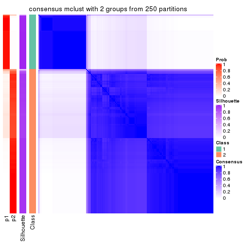</p>

</div>
<div id='tab-ATC-mclust-consensus-heatmap-2'>
<pre><code class="r">consensus_heatmap(res, k = 3)
</code></pre>

<p>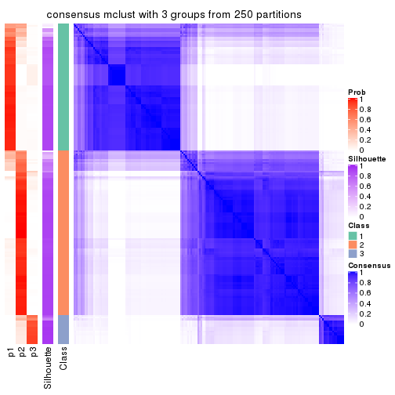</p>

</div>
<div id='tab-ATC-mclust-consensus-heatmap-3'>
<pre><code class="r">consensus_heatmap(res, k = 4)
</code></pre>

<p>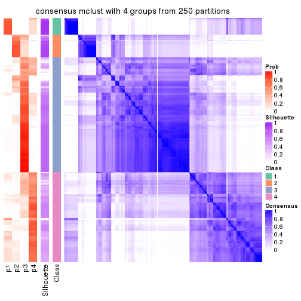</p>

</div>
<div id='tab-ATC-mclust-consensus-heatmap-4'>
<pre><code class="r">consensus_heatmap(res, k = 5)
</code></pre>

<p>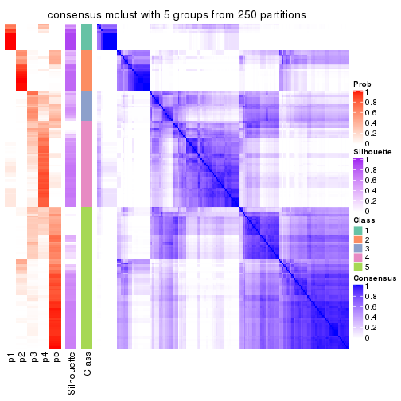</p>

</div>
<div id='tab-ATC-mclust-consensus-heatmap-5'>
<pre><code class="r">consensus_heatmap(res, k = 6)
</code></pre>

<p>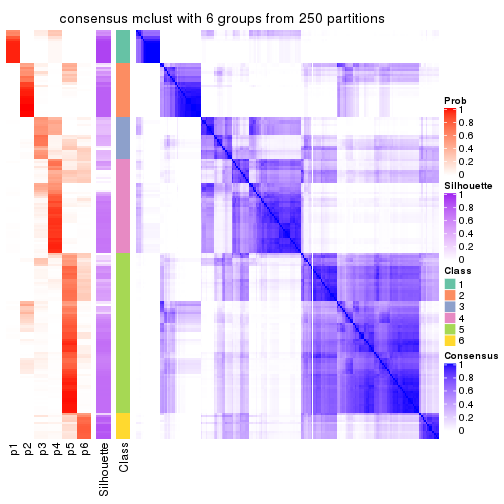</p>

</div>
</div>

Heatmaps for the membership of samples in all partitions to see how consistent they are:


<script>
$( function() {
	$( '#tabs-ATC-mclust-membership-heatmap' ).tabs();
} );
</script>
<div id='tabs-ATC-mclust-membership-heatmap'>
<ul>
<li><a href='#tab-ATC-mclust-membership-heatmap-1'>k = 2</a></li>
<li><a href='#tab-ATC-mclust-membership-heatmap-2'>k = 3</a></li>
<li><a href='#tab-ATC-mclust-membership-heatmap-3'>k = 4</a></li>
<li><a href='#tab-ATC-mclust-membership-heatmap-4'>k = 5</a></li>
<li><a href='#tab-ATC-mclust-membership-heatmap-5'>k = 6</a></li>
</ul>
<div id='tab-ATC-mclust-membership-heatmap-1'>
<pre><code class="r">membership_heatmap(res, k = 2)
</code></pre>

<p>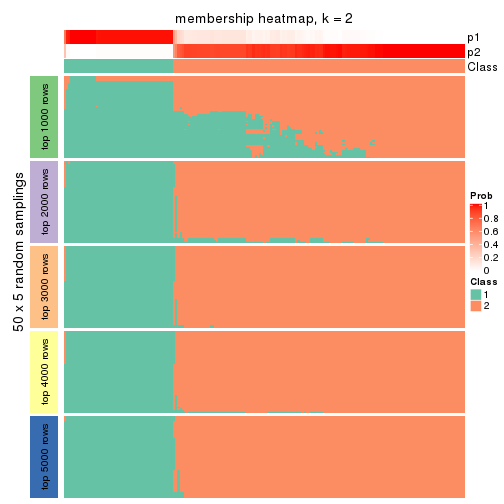</p>

</div>
<div id='tab-ATC-mclust-membership-heatmap-2'>
<pre><code class="r">membership_heatmap(res, k = 3)
</code></pre>

<p>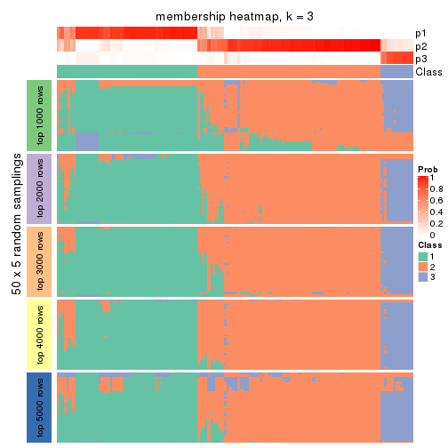</p>

</div>
<div id='tab-ATC-mclust-membership-heatmap-3'>
<pre><code class="r">membership_heatmap(res, k = 4)
</code></pre>

<p>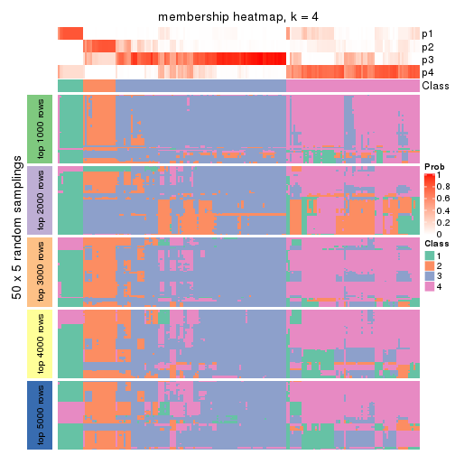</p>

</div>
<div id='tab-ATC-mclust-membership-heatmap-4'>
<pre><code class="r">membership_heatmap(res, k = 5)
</code></pre>

<p>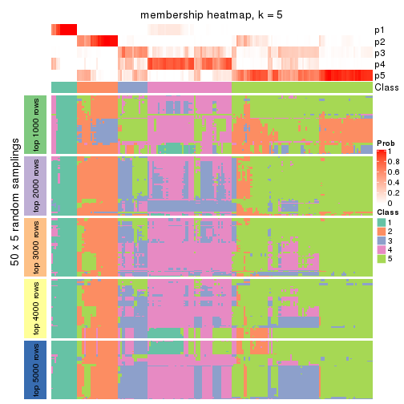</p>

</div>
<div id='tab-ATC-mclust-membership-heatmap-5'>
<pre><code class="r">membership_heatmap(res, k = 6)
</code></pre>

<p>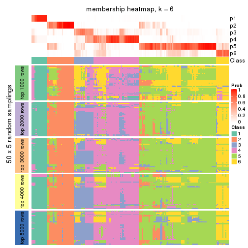</p>

</div>
</div>

As soon as we have had the classes for columns, we can look for signatures
which are significantly different between classes which can be candidate marks
for certain classes. Following are the heatmaps for signatures.


Signature heatmaps where rows are scaled:


<script>
$( function() {
	$( '#tabs-ATC-mclust-get-signatures' ).tabs();
} );
</script>
<div id='tabs-ATC-mclust-get-signatures'>
<ul>
<li><a href='#tab-ATC-mclust-get-signatures-1'>k = 2</a></li>
<li><a href='#tab-ATC-mclust-get-signatures-2'>k = 3</a></li>
<li><a href='#tab-ATC-mclust-get-signatures-3'>k = 4</a></li>
<li><a href='#tab-ATC-mclust-get-signatures-4'>k = 5</a></li>
<li><a href='#tab-ATC-mclust-get-signatures-5'>k = 6</a></li>
</ul>
<div id='tab-ATC-mclust-get-signatures-1'>
<pre><code class="r">get_signatures(res, k = 2)
</code></pre>

<p>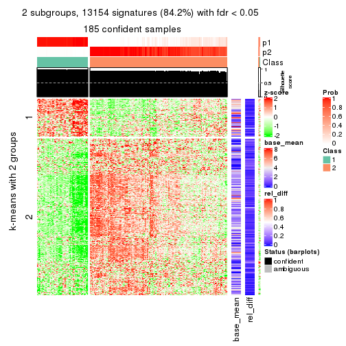</p>

</div>
<div id='tab-ATC-mclust-get-signatures-2'>
<pre><code class="r">get_signatures(res, k = 3)
</code></pre>

<p>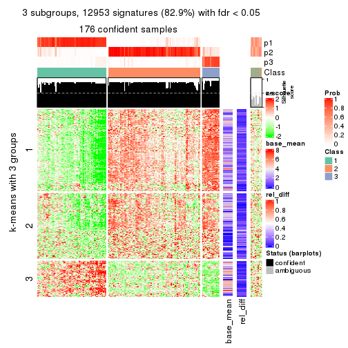</p>

</div>
<div id='tab-ATC-mclust-get-signatures-3'>
<pre><code class="r">get_signatures(res, k = 4)
</code></pre>

<p>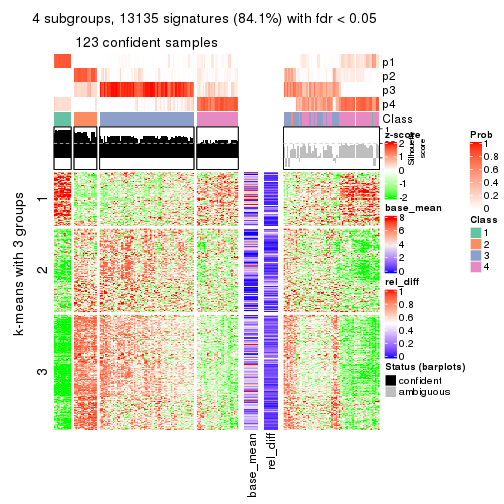</p>

</div>
<div id='tab-ATC-mclust-get-signatures-4'>
<pre><code class="r">get_signatures(res, k = 5)
</code></pre>

<p>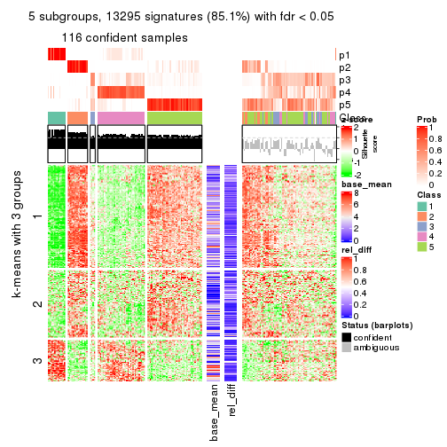</p>

</div>
<div id='tab-ATC-mclust-get-signatures-5'>
<pre><code class="r">get_signatures(res, k = 6)
</code></pre>

<p>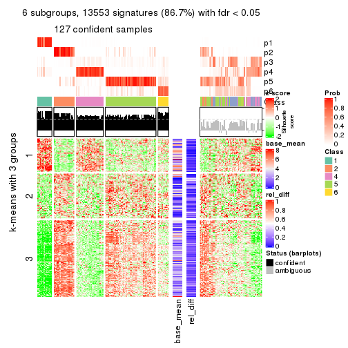</p>

</div>
</div>


Signature heatmaps where rows are not scaled:


<script>
$( function() {
	$( '#tabs-ATC-mclust-get-signatures-no-scale' ).tabs();
} );
</script>
<div id='tabs-ATC-mclust-get-signatures-no-scale'>
<ul>
<li><a href='#tab-ATC-mclust-get-signatures-no-scale-1'>k = 2</a></li>
<li><a href='#tab-ATC-mclust-get-signatures-no-scale-2'>k = 3</a></li>
<li><a href='#tab-ATC-mclust-get-signatures-no-scale-3'>k = 4</a></li>
<li><a href='#tab-ATC-mclust-get-signatures-no-scale-4'>k = 5</a></li>
<li><a href='#tab-ATC-mclust-get-signatures-no-scale-5'>k = 6</a></li>
</ul>
<div id='tab-ATC-mclust-get-signatures-no-scale-1'>
<pre><code class="r">get_signatures(res, k = 2, scale_rows = FALSE)
</code></pre>

<p>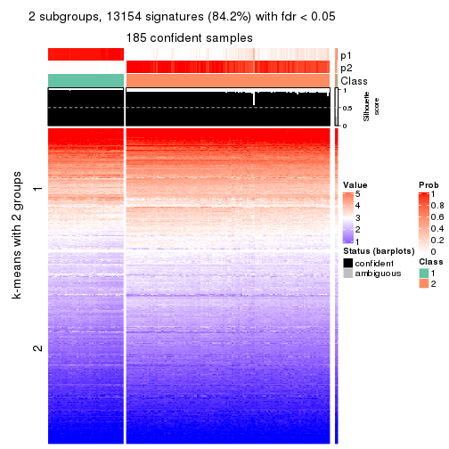</p>

</div>
<div id='tab-ATC-mclust-get-signatures-no-scale-2'>
<pre><code class="r">get_signatures(res, k = 3, scale_rows = FALSE)
</code></pre>

<p>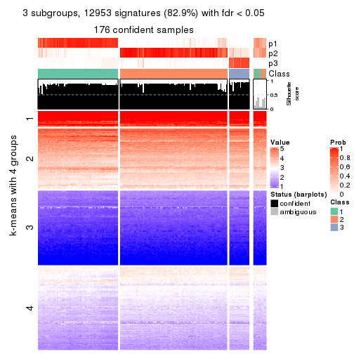</p>

</div>
<div id='tab-ATC-mclust-get-signatures-no-scale-3'>
<pre><code class="r">get_signatures(res, k = 4, scale_rows = FALSE)
</code></pre>

<p>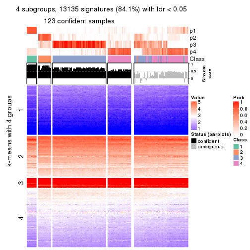</p>

</div>
<div id='tab-ATC-mclust-get-signatures-no-scale-4'>
<pre><code class="r">get_signatures(res, k = 5, scale_rows = FALSE)
</code></pre>

<p>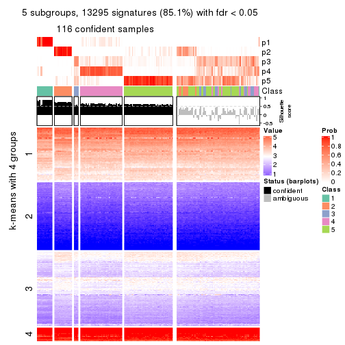</p>

</div>
<div id='tab-ATC-mclust-get-signatures-no-scale-5'>
<pre><code class="r">get_signatures(res, k = 6, scale_rows = FALSE)
</code></pre>

<p>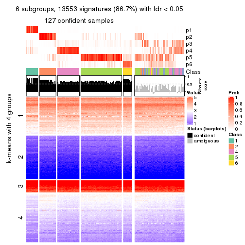</p>

</div>
</div>


Compare the overlap of signatures from different k:

```r
compare_signatures(res)
```

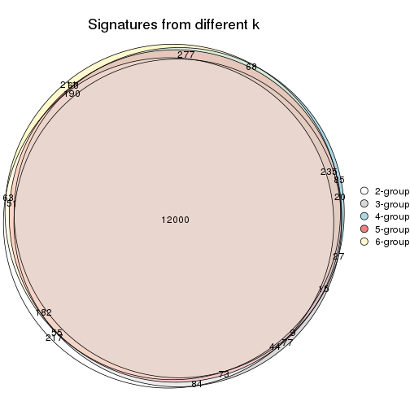

`get_signature()` returns a data frame invisibly. TO get the list of signatures, the function
call should be assigned to a variable explicitly. In following code, if `plot` argument is set
to `FALSE`, no heatmap is plotted while only the differential analysis is performed.

```r
# code only for demonstration
tb = get_signature(res, k = ..., plot = FALSE)
```

An example of the output of `tb` is:

```
#>   which_row         fdr    mean_1    mean_2 scaled_mean_1 scaled_mean_2 km
#> 1        38 0.042760348  8.373488  9.131774    -0.5533452     0.5164555  1
#> 2        40 0.018707592  7.106213  8.469186    -0.6173731     0.5762149  1
#> 3        55 0.019134737 10.221463 11.207825    -0.6159697     0.5749050  1
#> 4        59 0.006059896  5.921854  7.869574    -0.6899429     0.6439467  1
#> 5        60 0.018055526  8.928898 10.211722    -0.6204761     0.5791110  1
#> 6        98 0.009384629 15.714769 14.887706     0.6635654    -0.6193277  2
...
```

The columns in `tb` are:

1. `which_row`: row indices corresponding to the input matrix.
2. `fdr`: FDR for the differential test. 
3. `mean_x`: The mean value in group x.
4. `scaled_mean_x`: The mean value in group x after rows are scaled.
5. `km`: Row groups if k-means clustering is applied to rows.


UMAP plot which shows how samples are separated.


<script>
$( function() {
	$( '#tabs-ATC-mclust-dimension-reduction' ).tabs();
} );
</script>
<div id='tabs-ATC-mclust-dimension-reduction'>
<ul>
<li><a href='#tab-ATC-mclust-dimension-reduction-1'>k = 2</a></li>
<li><a href='#tab-ATC-mclust-dimension-reduction-2'>k = 3</a></li>
<li><a href='#tab-ATC-mclust-dimension-reduction-3'>k = 4</a></li>
<li><a href='#tab-ATC-mclust-dimension-reduction-4'>k = 5</a></li>
<li><a href='#tab-ATC-mclust-dimension-reduction-5'>k = 6</a></li>
</ul>
<div id='tab-ATC-mclust-dimension-reduction-1'>
<pre><code class="r">dimension_reduction(res, k = 2, method = &quot;UMAP&quot;)
</code></pre>

<p>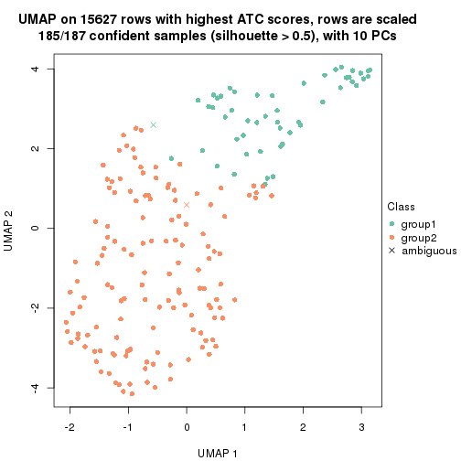</p>

</div>
<div id='tab-ATC-mclust-dimension-reduction-2'>
<pre><code class="r">dimension_reduction(res, k = 3, method = &quot;UMAP&quot;)
</code></pre>

<p>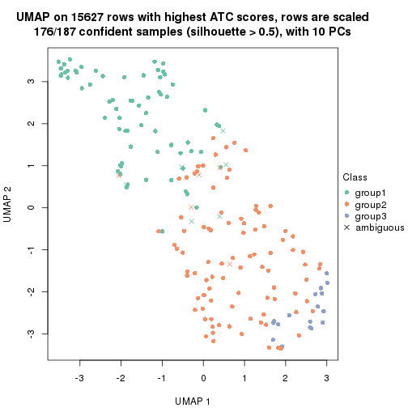</p>

</div>
<div id='tab-ATC-mclust-dimension-reduction-3'>
<pre><code class="r">dimension_reduction(res, k = 4, method = &quot;UMAP&quot;)
</code></pre>

<p>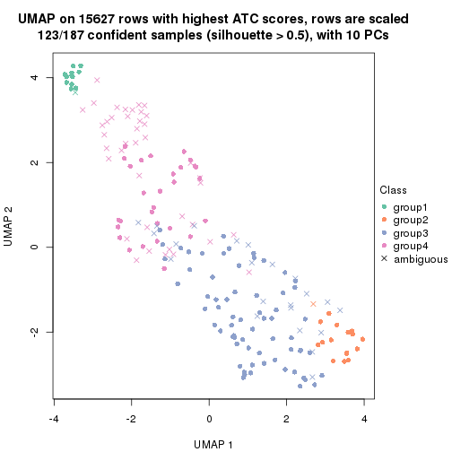</p>

</div>
<div id='tab-ATC-mclust-dimension-reduction-4'>
<pre><code class="r">dimension_reduction(res, k = 5, method = &quot;UMAP&quot;)
</code></pre>

<p>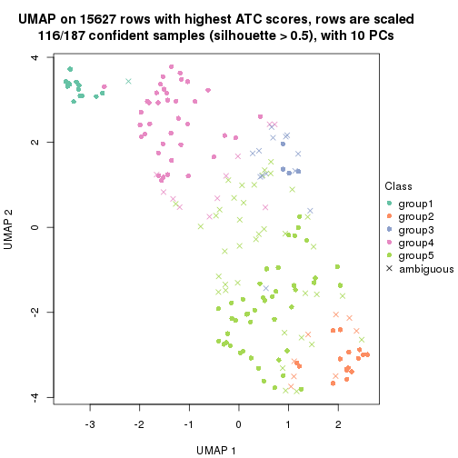</p>

</div>
<div id='tab-ATC-mclust-dimension-reduction-5'>
<pre><code class="r">dimension_reduction(res, k = 6, method = &quot;UMAP&quot;)
</code></pre>

<p>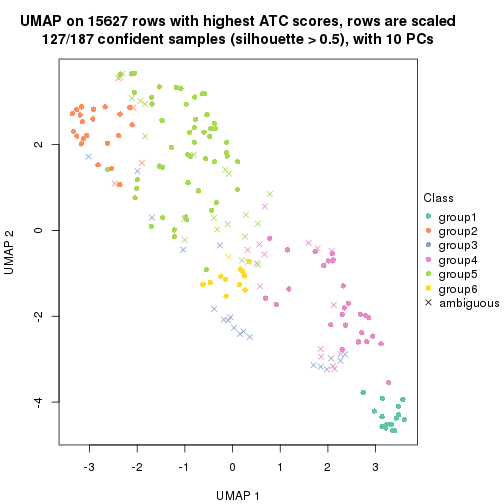</p>

</div>
</div>


Following heatmap shows how subgroups are split when increasing `k`:

```r
collect_classes(res)
```

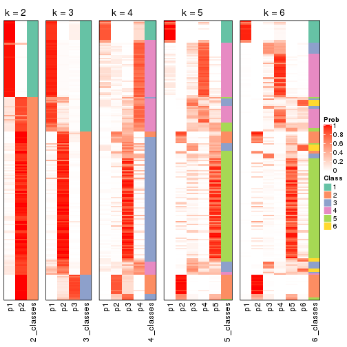


If matrix rows can be associated to genes, consider to use `GO_Enrichment(res,
...)` to perform function enrichment for the signature genes.


 

---------------------------------------------------


### ATC:NMF**


The object with results only for a single top-value method and a single partition method 
can be extracted as:

```r
res = res_list["ATC", "NMF"]
# you can also extract it by
# res = res_list["ATC:NMF"]
```

A summary of `res` and all the functions that can be applied to it:

```r
res
```

```
#> A 'ConsensusPartition' object with k = 2, 3, 4, 5, 6.
#>   On a matrix with 15627 rows and 187 columns.
#>   Top rows (1000, 2000, 3000, 4000, 5000) are extracted by 'ATC' method.
#>   Subgroups are detected by 'NMF' method.
#>   Performed in total 1250 partitions by row resampling.
#>   Best k for subgroups seems to be 2.
#> 
#> Following methods can be applied to this 'ConsensusPartition' object:
#>  [1] "cola_report"             "collect_classes"         "collect_plots"          
#>  [4] "collect_stats"           "colnames"                "compare_signatures"     
#>  [7] "consensus_heatmap"       "dimension_reduction"     "functional_enrichment"  
#> [10] "get_anno_col"            "get_anno"                "get_classes"            
#> [13] "get_consensus"           "get_matrix"              "get_membership"         
#> [16] "get_param"               "get_signatures"          "get_stats"              
#> [19] "is_best_k"               "is_stable_k"             "membership_heatmap"     
#> [22] "ncol"                    "nrow"                    "plot_ecdf"              
#> [25] "rownames"                "select_partition_number" "show"                   
#> [28] "suggest_best_k"          "test_to_known_factors"
```

`collect_plots()` function collects all the plots made from `res` for all `k` (number of partitions)
into one single page to provide an easy and fast comparison between different `k`.

```r
collect_plots(res)
```


The plots are:

- The first row: a plot of the ECDF (Empirical cumulative distribution
  function) curves of the consensus matrix for each `k` and the heatmap of
  predicted classes for each `k`.
- The second row: heatmaps of the consensus matrix for each `k`.
- The third row: heatmaps of the membership matrix for each `k`.
- The fouth row: heatmaps of the signatures for each `k`.

All the plots in panels can be made by individual functions and they are
plotted later in this section.

`select_partition_number()` produces several plots showing different
statistics for choosing "optimized" `k`. There are following statistics:

- ECDF curves of the consensus matrix for each `k`;
- 1-PAC. [The PAC
  score](https://en.wikipedia.org/wiki/Consensus_clustering#Over-interpretation_potential_of_consensus_clustering)
  measures the proportion of the ambiguous subgrouping.
- Mean silhouette score.
- Concordance. The mean probability of fiting the consensus class ids in all
  partitions.
- Area increased. Denote $A_k$ as the area under the ECDF curve for current
  `k`, the area increased is defined as $A_k - A_{k-1}$.
- Rand index. The percent of pairs of samples that are both in a same cluster
  or both are not in a same cluster in the partition of k and k-1.
- Jaccard index. The ratio of pairs of samples are both in a same cluster in
  the partition of k and k-1 and the pairs of samples are both in a same
  cluster in the partition k or k-1.

The detailed explanations of these statistics can be found in [the cola
vignette](http://bioconductor.org/packages/devel/bioc/vignettes/cola/inst/doc/cola.html#toc_13).

Generally speaking, lower PAC score, higher mean silhouette score or higher
concordance corresponds to better partition. Rand index and Jaccard index
measure how similar the current partition is compared to partition with `k-1`.
If they are too similar, we won't accept `k` is better than `k-1`.

```r
select_partition_number(res)
```

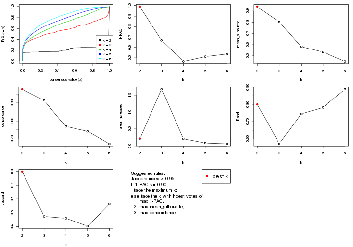

The numeric values for all these statistics can be obtained by `get_stats()`.

```r
get_stats(res)
```

```
#>   k 1-PAC mean_silhouette concordance area_increased  Rand Jaccard
#> 2 2 0.989           0.936       0.977         0.2180 0.800   0.800
#> 3 3 0.669           0.802       0.914         1.6723 0.571   0.475
#> 4 4 0.466           0.582       0.769         0.2094 0.744   0.461
#> 5 5 0.512           0.534       0.742         0.0856 0.782   0.404
#> 6 6 0.538           0.450       0.673         0.0608 0.888   0.564
```

`suggest_best_k()` suggests the best $k$ based on these statistics. The rules are as follows:

- All $k$ with Jaccard index larger than 0.95 are removed because the increase of
  the partition number does not provides enough extra information. If all $k$ are removed,
  the best $k$ is assigned by `NA`.
- For $k$ with 1-PAC larger than 0.9, the maximal $k$ is taken as the "best k". Other $k$ is called "optional k".
- If it does not fit the second rule. The $k$ with the highest vote of highest
  1-PAC, mean silhouette and concordance is taken as the "best k".

```r
suggest_best_k(res)
```

```
#> [1] 2
```


Following shows the table of the partitions (You need to click the **show/hide
code output** link to see it). The membership matrix (columns with name `p*`)
is inferred by
[`clue::cl_consensus()`](https://www.rdocumentation.org/link/cl_consensus?package=clue)
function with the `SE` method. Basically the value in the membership matrix
represents the probability to belong to a certain group. The finall class
label for an item is determined with the group with highest probability it
belongs to.

In `get_classes()` function, the entropy is calculated from the membership
matrix and the silhouette score is calculated from the consensus matrix.


<script>
$( function() {
	$( '#tabs-ATC-NMF-get-classes' ).tabs();
} );
</script>
<div id='tabs-ATC-NMF-get-classes'>
<ul>
<li><a href='#tab-ATC-NMF-get-classes-1'>k = 2</a></li>
<li><a href='#tab-ATC-NMF-get-classes-2'>k = 3</a></li>
<li><a href='#tab-ATC-NMF-get-classes-3'>k = 4</a></li>
<li><a href='#tab-ATC-NMF-get-classes-4'>k = 5</a></li>
<li><a href='#tab-ATC-NMF-get-classes-5'>k = 6</a></li>
</ul>

<div id='tab-ATC-NMF-get-classes-1'>
<p><a id='tab-ATC-NMF-get-classes-1-a' style='color:#0366d6' href='#'>show/hide code output</a></p>
<pre><code class="r">cbind(get_classes(res, k = 2), get_membership(res, k = 2))
</code></pre>

<pre><code>#&gt;            class entropy silhouette    p1    p2
#&gt; SRR1747213     2   0.000     0.9788 0.000 1.000
#&gt; SRR1747214     1   0.981     0.2880 0.580 0.420
#&gt; SRR1747215     2   0.000     0.9788 0.000 1.000
#&gt; SRR1747216     2   0.000     0.9788 0.000 1.000
#&gt; SRR1747217     2   0.000     0.9788 0.000 1.000
#&gt; SRR1747218     2   0.000     0.9788 0.000 1.000
#&gt; SRR1747219     2   0.000     0.9788 0.000 1.000
#&gt; SRR1747220     2   0.000     0.9788 0.000 1.000
#&gt; SRR1747221     2   0.000     0.9788 0.000 1.000
#&gt; SRR1747222     2   0.000     0.9788 0.000 1.000
#&gt; SRR1747223     2   0.000     0.9788 0.000 1.000
#&gt; SRR1747224     2   0.000     0.9788 0.000 1.000
#&gt; SRR1747225     2   0.000     0.9788 0.000 1.000
#&gt; SRR1747226     2   0.000     0.9788 0.000 1.000
#&gt; SRR1747227     2   0.000     0.9788 0.000 1.000
#&gt; SRR1747228     2   0.000     0.9788 0.000 1.000
#&gt; SRR1747229     2   0.000     0.9788 0.000 1.000
#&gt; SRR1747230     1   0.000     0.9447 1.000 0.000
#&gt; SRR1747231     2   0.000     0.9788 0.000 1.000
#&gt; SRR1747232     1   0.000     0.9447 1.000 0.000
#&gt; SRR1747233     2   0.430     0.8879 0.088 0.912
#&gt; SRR1747234     2   0.000     0.9788 0.000 1.000
#&gt; SRR1747235     1   0.000     0.9447 1.000 0.000
#&gt; SRR1747236     2   0.000     0.9788 0.000 1.000
#&gt; SRR1747237     2   0.000     0.9788 0.000 1.000
#&gt; SRR1747238     2   0.000     0.9788 0.000 1.000
#&gt; SRR1747239     2   0.000     0.9788 0.000 1.000
#&gt; SRR1747240     1   0.000     0.9447 1.000 0.000
#&gt; SRR1747241     2   0.000     0.9788 0.000 1.000
#&gt; SRR1747242     1   0.000     0.9447 1.000 0.000
#&gt; SRR1747243     2   0.000     0.9788 0.000 1.000
#&gt; SRR1747244     2   0.000     0.9788 0.000 1.000
#&gt; SRR1747245     2   0.000     0.9788 0.000 1.000
#&gt; SRR1747246     2   0.000     0.9788 0.000 1.000
#&gt; SRR1747247     1   0.000     0.9447 1.000 0.000
#&gt; SRR1747248     1   0.000     0.9447 1.000 0.000
#&gt; SRR1747249     2   0.482     0.8691 0.104 0.896
#&gt; SRR1747250     2   0.000     0.9788 0.000 1.000
#&gt; SRR1747252     2   0.000     0.9788 0.000 1.000
#&gt; SRR1747253     2   0.000     0.9788 0.000 1.000
#&gt; SRR1747254     2   0.000     0.9788 0.000 1.000
#&gt; SRR1747255     2   0.000     0.9788 0.000 1.000
#&gt; SRR1747256     2   0.163     0.9559 0.024 0.976
#&gt; SRR1747257     2   0.000     0.9788 0.000 1.000
#&gt; SRR1747258     2   0.000     0.9788 0.000 1.000
#&gt; SRR1747259     2   0.000     0.9788 0.000 1.000
#&gt; SRR1747260     2   0.000     0.9788 0.000 1.000
#&gt; SRR1747261     2   0.000     0.9788 0.000 1.000
#&gt; SRR1747262     2   0.000     0.9788 0.000 1.000
#&gt; SRR1747263     2   0.000     0.9788 0.000 1.000
#&gt; SRR1747264     1   0.000     0.9447 1.000 0.000
#&gt; SRR1747265     2   0.000     0.9788 0.000 1.000
#&gt; SRR1747266     2   0.000     0.9788 0.000 1.000
#&gt; SRR1747267     2   0.000     0.9788 0.000 1.000
#&gt; SRR1747268     2   0.000     0.9788 0.000 1.000
#&gt; SRR1747269     2   0.000     0.9788 0.000 1.000
#&gt; SRR1747270     2   0.000     0.9788 0.000 1.000
#&gt; SRR1747271     2   0.000     0.9788 0.000 1.000
#&gt; SRR1747272     2   0.000     0.9788 0.000 1.000
#&gt; SRR1747273     2   0.000     0.9788 0.000 1.000
#&gt; SRR1747274     2   0.000     0.9788 0.000 1.000
#&gt; SRR1747275     2   0.996     0.0864 0.464 0.536
#&gt; SRR1747276     2   0.204     0.9480 0.032 0.968
#&gt; SRR1747277     2   0.000     0.9788 0.000 1.000
#&gt; SRR1747278     2   0.000     0.9788 0.000 1.000
#&gt; SRR1747280     1   0.000     0.9447 1.000 0.000
#&gt; SRR1747279     2   0.430     0.8879 0.088 0.912
#&gt; SRR1747281     2   0.000     0.9788 0.000 1.000
#&gt; SRR1747282     2   0.995     0.1013 0.460 0.540
#&gt; SRR1747283     2   0.000     0.9788 0.000 1.000
#&gt; SRR1747284     2   0.456     0.8787 0.096 0.904
#&gt; SRR1747285     2   0.000     0.9788 0.000 1.000
#&gt; SRR1747286     2   0.000     0.9788 0.000 1.000
#&gt; SRR1747287     2   0.000     0.9788 0.000 1.000
#&gt; SRR1747288     2   0.000     0.9788 0.000 1.000
#&gt; SRR1747290     2   0.000     0.9788 0.000 1.000
#&gt; SRR1747289     2   0.000     0.9788 0.000 1.000
#&gt; SRR1747291     2   0.000     0.9788 0.000 1.000
#&gt; SRR1747293     2   0.000     0.9788 0.000 1.000
#&gt; SRR1747294     2   0.000     0.9788 0.000 1.000
#&gt; SRR1747292     2   0.469     0.8741 0.100 0.900
#&gt; SRR1747295     2   0.000     0.9788 0.000 1.000
#&gt; SRR1747296     2   0.000     0.9788 0.000 1.000
#&gt; SRR1747297     2   0.000     0.9788 0.000 1.000
#&gt; SRR1747298     2   0.000     0.9788 0.000 1.000
#&gt; SRR1747299     2   0.000     0.9788 0.000 1.000
#&gt; SRR1747300     2   0.000     0.9788 0.000 1.000
#&gt; SRR1747301     2   0.000     0.9788 0.000 1.000
#&gt; SRR1747302     2   0.000     0.9788 0.000 1.000
#&gt; SRR1747303     2   0.000     0.9788 0.000 1.000
#&gt; SRR1747304     1   0.000     0.9447 1.000 0.000
#&gt; SRR1747305     2   0.000     0.9788 0.000 1.000
#&gt; SRR1747306     2   0.000     0.9788 0.000 1.000
#&gt; SRR1747307     2   0.000     0.9788 0.000 1.000
#&gt; SRR1747308     2   0.000     0.9788 0.000 1.000
#&gt; SRR1747309     2   0.000     0.9788 0.000 1.000
#&gt; SRR1747310     1   0.689     0.7537 0.816 0.184
#&gt; SRR1747311     2   0.000     0.9788 0.000 1.000
#&gt; SRR1747313     2   0.000     0.9788 0.000 1.000
#&gt; SRR1747312     1   0.000     0.9447 1.000 0.000
#&gt; SRR1747314     1   0.000     0.9447 1.000 0.000
#&gt; SRR1747315     2   0.000     0.9788 0.000 1.000
#&gt; SRR1747316     2   0.000     0.9788 0.000 1.000
#&gt; SRR1747318     2   0.000     0.9788 0.000 1.000
#&gt; SRR1747317     2   0.000     0.9788 0.000 1.000
#&gt; SRR1747319     2   0.000     0.9788 0.000 1.000
#&gt; SRR1747320     2   0.000     0.9788 0.000 1.000
#&gt; SRR1747322     1   0.000     0.9447 1.000 0.000
#&gt; SRR1747321     2   0.917     0.4780 0.332 0.668
#&gt; SRR1747323     2   0.000     0.9788 0.000 1.000
#&gt; SRR1747324     2   0.000     0.9788 0.000 1.000
#&gt; SRR1747326     2   0.000     0.9788 0.000 1.000
#&gt; SRR1747325     2   0.000     0.9788 0.000 1.000
#&gt; SRR1747327     2   0.000     0.9788 0.000 1.000
#&gt; SRR1747328     2   0.000     0.9788 0.000 1.000
#&gt; SRR1747330     2   0.000     0.9788 0.000 1.000
#&gt; SRR1747329     2   0.000     0.9788 0.000 1.000
#&gt; SRR1747332     2   0.000     0.9788 0.000 1.000
#&gt; SRR1747331     2   0.000     0.9788 0.000 1.000
#&gt; SRR1747333     2   0.000     0.9788 0.000 1.000
#&gt; SRR1747334     2   0.000     0.9788 0.000 1.000
#&gt; SRR1747335     2   0.000     0.9788 0.000 1.000
#&gt; SRR1747336     1   0.000     0.9447 1.000 0.000
#&gt; SRR1747337     2   0.000     0.9788 0.000 1.000
#&gt; SRR1747338     2   0.000     0.9788 0.000 1.000
#&gt; SRR1747339     2   0.000     0.9788 0.000 1.000
#&gt; SRR1747340     2   0.000     0.9788 0.000 1.000
#&gt; SRR1747341     2   0.000     0.9788 0.000 1.000
#&gt; SRR1747342     2   0.000     0.9788 0.000 1.000
#&gt; SRR1747343     2   0.000     0.9788 0.000 1.000
#&gt; SRR1747344     2   0.000     0.9788 0.000 1.000
#&gt; SRR1747345     2   0.000     0.9788 0.000 1.000
#&gt; SRR1747346     2   0.000     0.9788 0.000 1.000
#&gt; SRR1747347     2   0.000     0.9788 0.000 1.000
#&gt; SRR1747348     1   0.000     0.9447 1.000 0.000
#&gt; SRR1747349     2   0.981     0.2381 0.420 0.580
#&gt; SRR1747351     2   0.000     0.9788 0.000 1.000
#&gt; SRR1747350     2   0.000     0.9788 0.000 1.000
#&gt; SRR1747352     1   0.000     0.9447 1.000 0.000
#&gt; SRR1747353     2   0.000     0.9788 0.000 1.000
#&gt; SRR1747354     2   0.000     0.9788 0.000 1.000
#&gt; SRR1747355     2   0.000     0.9788 0.000 1.000
#&gt; SRR1747356     2   0.000     0.9788 0.000 1.000
#&gt; SRR1747357     2   0.000     0.9788 0.000 1.000
#&gt; SRR1747358     2   0.000     0.9788 0.000 1.000
#&gt; SRR1747359     2   0.456     0.8787 0.096 0.904
#&gt; SRR1747360     2   0.000     0.9788 0.000 1.000
#&gt; SRR1747361     2   0.000     0.9788 0.000 1.000
#&gt; SRR1747362     2   0.000     0.9788 0.000 1.000
#&gt; SRR1747363     2   0.000     0.9788 0.000 1.000
#&gt; SRR1747364     2   0.000     0.9788 0.000 1.000
#&gt; SRR1747365     2   0.000     0.9788 0.000 1.000
#&gt; SRR1747366     2   0.000     0.9788 0.000 1.000
#&gt; SRR1747367     2   0.000     0.9788 0.000 1.000
#&gt; SRR1747369     2   0.000     0.9788 0.000 1.000
#&gt; SRR1747368     2   0.000     0.9788 0.000 1.000
#&gt; SRR1747370     2   0.000     0.9788 0.000 1.000
#&gt; SRR1747372     1   0.000     0.9447 1.000 0.000
#&gt; SRR1747371     2   0.000     0.9788 0.000 1.000
#&gt; SRR1747373     2   0.000     0.9788 0.000 1.000
#&gt; SRR1747374     2   0.000     0.9788 0.000 1.000
#&gt; SRR1747375     2   0.000     0.9788 0.000 1.000
#&gt; SRR1747376     2   0.000     0.9788 0.000 1.000
#&gt; SRR1747377     2   0.000     0.9788 0.000 1.000
#&gt; SRR1747378     2   0.000     0.9788 0.000 1.000
#&gt; SRR1747379     2   0.000     0.9788 0.000 1.000
#&gt; SRR1747380     2   0.000     0.9788 0.000 1.000
#&gt; SRR1747381     1   0.993     0.1883 0.548 0.452
#&gt; SRR1747382     2   1.000    -0.0420 0.496 0.504
#&gt; SRR1747383     2   0.000     0.9788 0.000 1.000
#&gt; SRR1747384     2   0.000     0.9788 0.000 1.000
#&gt; SRR1747385     2   0.000     0.9788 0.000 1.000
#&gt; SRR1747386     1   0.000     0.9447 1.000 0.000
#&gt; SRR1747387     2   0.000     0.9788 0.000 1.000
#&gt; SRR1747388     2   0.000     0.9788 0.000 1.000
#&gt; SRR1747390     2   0.000     0.9788 0.000 1.000
#&gt; SRR1747389     2   0.000     0.9788 0.000 1.000
#&gt; SRR1747391     2   0.000     0.9788 0.000 1.000
#&gt; SRR1747392     2   0.000     0.9788 0.000 1.000
#&gt; SRR1747393     2   0.000     0.9788 0.000 1.000
#&gt; SRR1747394     2   0.000     0.9788 0.000 1.000
#&gt; SRR1747395     2   0.000     0.9788 0.000 1.000
#&gt; SRR1747396     2   0.000     0.9788 0.000 1.000
#&gt; SRR1747398     2   0.000     0.9788 0.000 1.000
#&gt; SRR1747397     2   0.000     0.9788 0.000 1.000
#&gt; SRR1747399     2   0.998     0.0556 0.472 0.528
#&gt; SRR1747400     2   0.000     0.9788 0.000 1.000
</code></pre>

<script>
$('#tab-ATC-NMF-get-classes-1-a').parent().next().next().hide();
$('#tab-ATC-NMF-get-classes-1-a').click(function(){
  $('#tab-ATC-NMF-get-classes-1-a').parent().next().next().toggle();
  return(false);
});
</script>
</div>

<div id='tab-ATC-NMF-get-classes-2'>
<p><a id='tab-ATC-NMF-get-classes-2-a' style='color:#0366d6' href='#'>show/hide code output</a></p>
<pre><code class="r">cbind(get_classes(res, k = 3), get_membership(res, k = 3))
</code></pre>

<pre><code>#&gt;            class entropy silhouette    p1    p2    p3
#&gt; SRR1747213     3  0.0000     0.8642 0.000 0.000 1.000
#&gt; SRR1747214     3  0.5397     0.5448 0.280 0.000 0.720
#&gt; SRR1747215     3  0.0000     0.8642 0.000 0.000 1.000
#&gt; SRR1747216     2  0.1163     0.8998 0.000 0.972 0.028
#&gt; SRR1747217     3  0.0747     0.8636 0.000 0.016 0.984
#&gt; SRR1747218     2  0.6095     0.3769 0.000 0.608 0.392
#&gt; SRR1747219     2  0.6299     0.0719 0.000 0.524 0.476
#&gt; SRR1747220     3  0.0000     0.8642 0.000 0.000 1.000
#&gt; SRR1747221     2  0.0000     0.9051 0.000 1.000 0.000
#&gt; SRR1747222     3  0.6543     0.7018 0.176 0.076 0.748
#&gt; SRR1747223     2  0.0000     0.9051 0.000 1.000 0.000
#&gt; SRR1747224     2  0.0592     0.9054 0.000 0.988 0.012
#&gt; SRR1747225     2  0.0592     0.9054 0.000 0.988 0.012
#&gt; SRR1747226     2  0.4796     0.7165 0.000 0.780 0.220
#&gt; SRR1747227     3  0.0000     0.8642 0.000 0.000 1.000
#&gt; SRR1747228     3  0.0747     0.8635 0.000 0.016 0.984
#&gt; SRR1747229     3  0.6008     0.4386 0.000 0.372 0.628
#&gt; SRR1747230     1  0.0000     0.9100 1.000 0.000 0.000
#&gt; SRR1747231     3  0.0000     0.8642 0.000 0.000 1.000
#&gt; SRR1747232     1  0.0000     0.9100 1.000 0.000 0.000
#&gt; SRR1747233     1  0.8055     0.5221 0.612 0.292 0.096
#&gt; SRR1747234     3  0.6204     0.2947 0.000 0.424 0.576
#&gt; SRR1747235     3  0.3340     0.7673 0.120 0.000 0.880
#&gt; SRR1747236     2  0.0892     0.9029 0.000 0.980 0.020
#&gt; SRR1747237     3  0.0000     0.8642 0.000 0.000 1.000
#&gt; SRR1747238     2  0.5497     0.6001 0.000 0.708 0.292
#&gt; SRR1747239     3  0.6280     0.1633 0.000 0.460 0.540
#&gt; SRR1747240     1  0.0000     0.9100 1.000 0.000 0.000
#&gt; SRR1747241     3  0.0000     0.8642 0.000 0.000 1.000
#&gt; SRR1747242     1  0.0000     0.9100 1.000 0.000 0.000
#&gt; SRR1747243     3  0.0000     0.8642 0.000 0.000 1.000
#&gt; SRR1747244     2  0.5988     0.4389 0.000 0.632 0.368
#&gt; SRR1747245     3  0.0000     0.8642 0.000 0.000 1.000
#&gt; SRR1747246     2  0.1411     0.8959 0.000 0.964 0.036
#&gt; SRR1747247     1  0.0000     0.9100 1.000 0.000 0.000
#&gt; SRR1747248     1  0.0000     0.9100 1.000 0.000 0.000
#&gt; SRR1747249     3  0.0000     0.8642 0.000 0.000 1.000
#&gt; SRR1747250     2  0.5968     0.4489 0.000 0.636 0.364
#&gt; SRR1747252     2  0.0000     0.9051 0.000 1.000 0.000
#&gt; SRR1747253     3  0.0424     0.8640 0.000 0.008 0.992
#&gt; SRR1747254     3  0.5016     0.7031 0.000 0.240 0.760
#&gt; SRR1747255     3  0.4838     0.7948 0.076 0.076 0.848
#&gt; SRR1747256     2  0.8071     0.2345 0.380 0.548 0.072
#&gt; SRR1747257     3  0.0592     0.8638 0.000 0.012 0.988
#&gt; SRR1747258     2  0.0000     0.9051 0.000 1.000 0.000
#&gt; SRR1747259     3  0.2878     0.8313 0.000 0.096 0.904
#&gt; SRR1747260     2  0.0592     0.9051 0.000 0.988 0.012
#&gt; SRR1747261     2  0.6260     0.1943 0.000 0.552 0.448
#&gt; SRR1747262     2  0.0592     0.9056 0.000 0.988 0.012
#&gt; SRR1747263     3  0.0000     0.8642 0.000 0.000 1.000
#&gt; SRR1747264     1  0.0000     0.9100 1.000 0.000 0.000
#&gt; SRR1747265     3  0.3412     0.8164 0.000 0.124 0.876
#&gt; SRR1747266     2  0.0000     0.9051 0.000 1.000 0.000
#&gt; SRR1747267     3  0.0000     0.8642 0.000 0.000 1.000
#&gt; SRR1747268     2  0.0237     0.9062 0.000 0.996 0.004
#&gt; SRR1747269     2  0.0000     0.9051 0.000 1.000 0.000
#&gt; SRR1747270     3  0.4178     0.7747 0.000 0.172 0.828
#&gt; SRR1747271     2  0.0747     0.9040 0.000 0.984 0.016
#&gt; SRR1747272     2  0.0000     0.9051 0.000 1.000 0.000
#&gt; SRR1747273     3  0.0000     0.8642 0.000 0.000 1.000
#&gt; SRR1747274     2  0.0237     0.9062 0.000 0.996 0.004
#&gt; SRR1747275     1  0.5443     0.6517 0.736 0.260 0.004
#&gt; SRR1747276     2  0.0000     0.9051 0.000 1.000 0.000
#&gt; SRR1747277     3  0.1753     0.8541 0.000 0.048 0.952
#&gt; SRR1747278     2  0.0237     0.9062 0.000 0.996 0.004
#&gt; SRR1747280     1  0.0000     0.9100 1.000 0.000 0.000
#&gt; SRR1747279     1  0.6298     0.3193 0.608 0.004 0.388
#&gt; SRR1747281     2  0.0747     0.9044 0.000 0.984 0.016
#&gt; SRR1747282     1  0.4931     0.6960 0.768 0.232 0.000
#&gt; SRR1747283     3  0.0000     0.8642 0.000 0.000 1.000
#&gt; SRR1747284     3  0.2796     0.8044 0.092 0.000 0.908
#&gt; SRR1747285     2  0.0000     0.9051 0.000 1.000 0.000
#&gt; SRR1747286     2  0.1753     0.8888 0.000 0.952 0.048
#&gt; SRR1747287     3  0.3686     0.8007 0.000 0.140 0.860
#&gt; SRR1747288     2  0.0592     0.9054 0.000 0.988 0.012
#&gt; SRR1747290     2  0.5327     0.6351 0.000 0.728 0.272
#&gt; SRR1747289     2  0.0892     0.9033 0.000 0.980 0.020
#&gt; SRR1747291     3  0.4504     0.7514 0.000 0.196 0.804
#&gt; SRR1747293     2  0.0237     0.9062 0.000 0.996 0.004
#&gt; SRR1747294     3  0.5650     0.5759 0.000 0.312 0.688
#&gt; SRR1747292     3  0.6252     0.2132 0.444 0.000 0.556
#&gt; SRR1747295     2  0.0237     0.9058 0.000 0.996 0.004
#&gt; SRR1747296     3  0.0000     0.8642 0.000 0.000 1.000
#&gt; SRR1747297     2  0.5327     0.6350 0.000 0.728 0.272
#&gt; SRR1747298     2  0.5835     0.5033 0.000 0.660 0.340
#&gt; SRR1747299     2  0.2448     0.8687 0.000 0.924 0.076
#&gt; SRR1747300     2  0.0237     0.9062 0.000 0.996 0.004
#&gt; SRR1747301     3  0.0000     0.8642 0.000 0.000 1.000
#&gt; SRR1747302     2  0.1163     0.8998 0.000 0.972 0.028
#&gt; SRR1747303     2  0.6180     0.3047 0.000 0.584 0.416
#&gt; SRR1747304     1  0.0000     0.9100 1.000 0.000 0.000
#&gt; SRR1747305     3  0.5058     0.6977 0.000 0.244 0.756
#&gt; SRR1747306     2  0.0747     0.9044 0.000 0.984 0.016
#&gt; SRR1747307     3  0.4002     0.7872 0.000 0.160 0.840
#&gt; SRR1747308     3  0.0892     0.8628 0.000 0.020 0.980
#&gt; SRR1747309     2  0.0000     0.9051 0.000 1.000 0.000
#&gt; SRR1747310     1  0.3192     0.8170 0.888 0.000 0.112
#&gt; SRR1747311     2  0.0000     0.9051 0.000 1.000 0.000
#&gt; SRR1747313     2  0.0237     0.9062 0.000 0.996 0.004
#&gt; SRR1747312     1  0.0000     0.9100 1.000 0.000 0.000
#&gt; SRR1747314     1  0.0000     0.9100 1.000 0.000 0.000
#&gt; SRR1747315     2  0.2878     0.8533 0.000 0.904 0.096
#&gt; SRR1747316     3  0.2356     0.8441 0.000 0.072 0.928
#&gt; SRR1747318     2  0.0000     0.9051 0.000 1.000 0.000
#&gt; SRR1747317     2  0.2711     0.8606 0.000 0.912 0.088
#&gt; SRR1747319     3  0.0000     0.8642 0.000 0.000 1.000
#&gt; SRR1747320     3  0.5115     0.6695 0.228 0.004 0.768
#&gt; SRR1747322     1  0.0000     0.9100 1.000 0.000 0.000
#&gt; SRR1747321     3  0.0000     0.8642 0.000 0.000 1.000
#&gt; SRR1747323     2  0.4796     0.7163 0.000 0.780 0.220
#&gt; SRR1747324     2  0.0000     0.9051 0.000 1.000 0.000
#&gt; SRR1747326     2  0.0237     0.9062 0.000 0.996 0.004
#&gt; SRR1747325     3  0.0000     0.8642 0.000 0.000 1.000
#&gt; SRR1747327     3  0.0000     0.8642 0.000 0.000 1.000
#&gt; SRR1747328     3  0.0000     0.8642 0.000 0.000 1.000
#&gt; SRR1747330     2  0.0424     0.9058 0.000 0.992 0.008
#&gt; SRR1747329     3  0.1289     0.8600 0.000 0.032 0.968
#&gt; SRR1747332     2  0.1964     0.8825 0.000 0.944 0.056
#&gt; SRR1747331     2  0.0000     0.9051 0.000 1.000 0.000
#&gt; SRR1747333     2  0.3619     0.8159 0.000 0.864 0.136
#&gt; SRR1747334     2  0.0000     0.9051 0.000 1.000 0.000
#&gt; SRR1747335     3  0.0000     0.8642 0.000 0.000 1.000
#&gt; SRR1747336     1  0.0000     0.9100 1.000 0.000 0.000
#&gt; SRR1747337     2  0.4796     0.7158 0.000 0.780 0.220
#&gt; SRR1747338     2  0.0424     0.9060 0.000 0.992 0.008
#&gt; SRR1747339     2  0.1411     0.8960 0.000 0.964 0.036
#&gt; SRR1747340     2  0.0237     0.9062 0.000 0.996 0.004
#&gt; SRR1747341     3  0.1289     0.8597 0.000 0.032 0.968
#&gt; SRR1747342     3  0.6079     0.3966 0.000 0.388 0.612
#&gt; SRR1747343     3  0.4796     0.7264 0.000 0.220 0.780
#&gt; SRR1747344     3  0.4452     0.7557 0.000 0.192 0.808
#&gt; SRR1747345     2  0.0000     0.9051 0.000 1.000 0.000
#&gt; SRR1747346     3  0.2066     0.8491 0.000 0.060 0.940
#&gt; SRR1747347     3  0.0000     0.8642 0.000 0.000 1.000
#&gt; SRR1747348     1  0.0000     0.9100 1.000 0.000 0.000
#&gt; SRR1747349     1  0.1529     0.8834 0.960 0.000 0.040
#&gt; SRR1747351     2  0.4605     0.7378 0.000 0.796 0.204
#&gt; SRR1747350     2  0.0237     0.9062 0.000 0.996 0.004
#&gt; SRR1747352     1  0.6079     0.3884 0.612 0.000 0.388
#&gt; SRR1747353     2  0.6026     0.4188 0.000 0.624 0.376
#&gt; SRR1747354     2  0.6062     0.3973 0.000 0.616 0.384
#&gt; SRR1747355     3  0.0000     0.8642 0.000 0.000 1.000
#&gt; SRR1747356     2  0.0000     0.9051 0.000 1.000 0.000
#&gt; SRR1747357     2  0.0000     0.9051 0.000 1.000 0.000
#&gt; SRR1747358     3  0.3619     0.8039 0.000 0.136 0.864
#&gt; SRR1747359     3  0.0000     0.8642 0.000 0.000 1.000
#&gt; SRR1747360     2  0.0000     0.9051 0.000 1.000 0.000
#&gt; SRR1747361     2  0.0747     0.9047 0.000 0.984 0.016
#&gt; SRR1747362     2  0.0237     0.9062 0.000 0.996 0.004
#&gt; SRR1747363     3  0.0000     0.8642 0.000 0.000 1.000
#&gt; SRR1747364     2  0.0000     0.9051 0.000 1.000 0.000
#&gt; SRR1747365     3  0.0000     0.8642 0.000 0.000 1.000
#&gt; SRR1747366     2  0.0237     0.9062 0.000 0.996 0.004
#&gt; SRR1747367     2  0.0000     0.9051 0.000 1.000 0.000
#&gt; SRR1747369     2  0.0237     0.9062 0.000 0.996 0.004
#&gt; SRR1747368     2  0.4555     0.7418 0.000 0.800 0.200
#&gt; SRR1747370     2  0.0000     0.9051 0.000 1.000 0.000
#&gt; SRR1747372     1  0.0000     0.9100 1.000 0.000 0.000
#&gt; SRR1747371     2  0.3983     0.8048 0.004 0.852 0.144
#&gt; SRR1747373     2  0.1031     0.9015 0.000 0.976 0.024
#&gt; SRR1747374     2  0.0592     0.9054 0.000 0.988 0.012
#&gt; SRR1747375     2  0.1289     0.8982 0.000 0.968 0.032
#&gt; SRR1747376     2  0.0237     0.9062 0.000 0.996 0.004
#&gt; SRR1747377     3  0.6299     0.0996 0.000 0.476 0.524
#&gt; SRR1747378     2  0.0237     0.9062 0.000 0.996 0.004
#&gt; SRR1747379     3  0.4235     0.7705 0.000 0.176 0.824
#&gt; SRR1747380     3  0.2796     0.8325 0.000 0.092 0.908
#&gt; SRR1747381     3  0.0237     0.8616 0.004 0.000 0.996
#&gt; SRR1747382     2  0.1031     0.8870 0.024 0.976 0.000
#&gt; SRR1747383     3  0.3816     0.7958 0.000 0.148 0.852
#&gt; SRR1747384     3  0.0000     0.8642 0.000 0.000 1.000
#&gt; SRR1747385     2  0.0892     0.9035 0.000 0.980 0.020
#&gt; SRR1747386     1  0.0000     0.9100 1.000 0.000 0.000
#&gt; SRR1747387     2  0.6140     0.3421 0.000 0.596 0.404
#&gt; SRR1747388     2  0.0237     0.9062 0.000 0.996 0.004
#&gt; SRR1747390     3  0.0892     0.8628 0.000 0.020 0.980
#&gt; SRR1747389     2  0.1289     0.8982 0.000 0.968 0.032
#&gt; SRR1747391     2  0.0237     0.9062 0.000 0.996 0.004
#&gt; SRR1747392     2  0.0000     0.9051 0.000 1.000 0.000
#&gt; SRR1747393     2  0.1529     0.8932 0.000 0.960 0.040
#&gt; SRR1747394     2  0.0000     0.9051 0.000 1.000 0.000
#&gt; SRR1747395     2  0.0237     0.9062 0.000 0.996 0.004
#&gt; SRR1747396     2  0.0000     0.9051 0.000 1.000 0.000
#&gt; SRR1747398     2  0.0000     0.9051 0.000 1.000 0.000
#&gt; SRR1747397     2  0.0237     0.9062 0.000 0.996 0.004
#&gt; SRR1747399     1  0.1529     0.8835 0.960 0.000 0.040
#&gt; SRR1747400     2  0.0000     0.9051 0.000 1.000 0.000
</code></pre>

<script>
$('#tab-ATC-NMF-get-classes-2-a').parent().next().next().hide();
$('#tab-ATC-NMF-get-classes-2-a').click(function(){
  $('#tab-ATC-NMF-get-classes-2-a').parent().next().next().toggle();
  return(false);
});
</script>
</div>

<div id='tab-ATC-NMF-get-classes-3'>
<p><a id='tab-ATC-NMF-get-classes-3-a' style='color:#0366d6' href='#'>show/hide code output</a></p>
<pre><code class="r">cbind(get_classes(res, k = 4), get_membership(res, k = 4))
</code></pre>

<pre><code>#&gt;            class entropy silhouette    p1    p2    p3    p4
#&gt; SRR1747213     4  0.4830    0.53582 0.000 0.392 0.000 0.608
#&gt; SRR1747214     1  0.6031    0.21539 0.564 0.048 0.000 0.388
#&gt; SRR1747215     2  0.2814    0.59443 0.000 0.868 0.000 0.132
#&gt; SRR1747216     2  0.5353   -0.06614 0.000 0.556 0.432 0.012
#&gt; SRR1747217     2  0.1151    0.66998 0.000 0.968 0.008 0.024
#&gt; SRR1747218     2  0.2799    0.66624 0.000 0.884 0.108 0.008
#&gt; SRR1747219     4  0.1940    0.62338 0.000 0.000 0.076 0.924
#&gt; SRR1747220     4  0.0592    0.69608 0.000 0.016 0.000 0.984
#&gt; SRR1747221     3  0.1452    0.75671 0.000 0.036 0.956 0.008
#&gt; SRR1747222     1  0.7869    0.12335 0.444 0.376 0.016 0.164
#&gt; SRR1747223     3  0.2125    0.75939 0.012 0.052 0.932 0.004
#&gt; SRR1747224     3  0.3945    0.71441 0.000 0.216 0.780 0.004
#&gt; SRR1747225     3  0.4967    0.38795 0.000 0.452 0.548 0.000
#&gt; SRR1747226     2  0.4764    0.52732 0.000 0.748 0.220 0.032
#&gt; SRR1747227     2  0.4866   -0.02873 0.000 0.596 0.000 0.404
#&gt; SRR1747228     2  0.1022    0.66427 0.000 0.968 0.000 0.032
#&gt; SRR1747229     2  0.1004    0.67801 0.000 0.972 0.024 0.004
#&gt; SRR1747230     1  0.0000    0.88504 1.000 0.000 0.000 0.000
#&gt; SRR1747231     4  0.4103    0.68575 0.000 0.256 0.000 0.744
#&gt; SRR1747232     1  0.0000    0.88504 1.000 0.000 0.000 0.000
#&gt; SRR1747233     2  0.2860    0.67107 0.044 0.904 0.048 0.004
#&gt; SRR1747234     2  0.6148    0.17974 0.000 0.540 0.052 0.408
#&gt; SRR1747235     4  0.2675    0.65939 0.100 0.008 0.000 0.892
#&gt; SRR1747236     3  0.6039    0.44432 0.000 0.056 0.596 0.348
#&gt; SRR1747237     2  0.4961   -0.17183 0.000 0.552 0.000 0.448
#&gt; SRR1747238     2  0.5604    0.57022 0.000 0.724 0.160 0.116
#&gt; SRR1747239     2  0.2411    0.67713 0.000 0.920 0.040 0.040
#&gt; SRR1747240     1  0.0000    0.88504 1.000 0.000 0.000 0.000
#&gt; SRR1747241     4  0.4477    0.63536 0.000 0.312 0.000 0.688
#&gt; SRR1747242     1  0.0000    0.88504 1.000 0.000 0.000 0.000
#&gt; SRR1747243     2  0.1940    0.64037 0.000 0.924 0.000 0.076
#&gt; SRR1747244     2  0.2928    0.67126 0.000 0.880 0.108 0.012
#&gt; SRR1747245     2  0.4543    0.24362 0.000 0.676 0.000 0.324
#&gt; SRR1747246     3  0.5326    0.51114 0.000 0.380 0.604 0.016
#&gt; SRR1747247     1  0.0188    0.88267 0.996 0.000 0.000 0.004
#&gt; SRR1747248     1  0.0000    0.88504 1.000 0.000 0.000 0.000
#&gt; SRR1747249     2  0.5631    0.34782 0.072 0.696 0.000 0.232
#&gt; SRR1747250     2  0.4389    0.65291 0.000 0.812 0.116 0.072
#&gt; SRR1747252     3  0.1510    0.75532 0.000 0.028 0.956 0.016
#&gt; SRR1747253     4  0.5523    0.53015 0.024 0.380 0.000 0.596
#&gt; SRR1747254     2  0.2714    0.64389 0.000 0.884 0.004 0.112
#&gt; SRR1747255     2  0.7788    0.08615 0.264 0.520 0.016 0.200
#&gt; SRR1747256     1  0.6114    0.61831 0.708 0.148 0.132 0.012
#&gt; SRR1747257     2  0.4331    0.35387 0.000 0.712 0.000 0.288
#&gt; SRR1747258     3  0.1388    0.75033 0.000 0.012 0.960 0.028
#&gt; SRR1747259     4  0.5762    0.51657 0.000 0.352 0.040 0.608
#&gt; SRR1747260     3  0.5645    0.42811 0.000 0.032 0.604 0.364
#&gt; SRR1747261     4  0.7067    0.26016 0.000 0.288 0.160 0.552
#&gt; SRR1747262     3  0.3745    0.75969 0.000 0.088 0.852 0.060
#&gt; SRR1747263     2  0.3219    0.55213 0.000 0.836 0.000 0.164
#&gt; SRR1747264     1  0.0000    0.88504 1.000 0.000 0.000 0.000
#&gt; SRR1747265     4  0.0707    0.67104 0.000 0.000 0.020 0.980
#&gt; SRR1747266     3  0.3196    0.75953 0.000 0.136 0.856 0.008
#&gt; SRR1747267     4  0.0707    0.69854 0.000 0.020 0.000 0.980
#&gt; SRR1747268     3  0.4933    0.41543 0.000 0.432 0.568 0.000
#&gt; SRR1747269     3  0.1297    0.75419 0.000 0.020 0.964 0.016
#&gt; SRR1747270     2  0.1576    0.66941 0.000 0.948 0.004 0.048
#&gt; SRR1747271     3  0.3647    0.69318 0.000 0.016 0.832 0.152
#&gt; SRR1747272     3  0.3982    0.61705 0.000 0.004 0.776 0.220
#&gt; SRR1747273     4  0.3074    0.72928 0.000 0.152 0.000 0.848
#&gt; SRR1747274     3  0.4248    0.72913 0.000 0.220 0.768 0.012
#&gt; SRR1747275     1  0.6084    0.54295 0.656 0.252 0.092 0.000
#&gt; SRR1747276     3  0.3366    0.73672 0.096 0.028 0.872 0.004
#&gt; SRR1747277     4  0.2011    0.72862 0.000 0.080 0.000 0.920
#&gt; SRR1747278     3  0.4008    0.70646 0.000 0.244 0.756 0.000
#&gt; SRR1747280     1  0.0000    0.88504 1.000 0.000 0.000 0.000
#&gt; SRR1747279     2  0.5937    0.32357 0.340 0.608 0.000 0.052
#&gt; SRR1747281     3  0.4137    0.72078 0.000 0.208 0.780 0.012
#&gt; SRR1747282     1  0.0000    0.88504 1.000 0.000 0.000 0.000
#&gt; SRR1747283     4  0.4164    0.68012 0.000 0.264 0.000 0.736
#&gt; SRR1747284     4  0.1629    0.69804 0.024 0.024 0.000 0.952
#&gt; SRR1747285     3  0.2469    0.71154 0.000 0.000 0.892 0.108
#&gt; SRR1747286     3  0.7023    0.45394 0.000 0.144 0.544 0.312
#&gt; SRR1747287     2  0.4431    0.38190 0.000 0.696 0.000 0.304
#&gt; SRR1747288     3  0.4248    0.72715 0.000 0.220 0.768 0.012
#&gt; SRR1747290     2  0.7921   -0.10058 0.000 0.348 0.320 0.332
#&gt; SRR1747289     3  0.5825    0.57053 0.000 0.068 0.664 0.268
#&gt; SRR1747291     2  0.2654    0.62602 0.000 0.888 0.004 0.108
#&gt; SRR1747293     3  0.3668    0.72700 0.000 0.188 0.808 0.004
#&gt; SRR1747294     2  0.0779    0.67637 0.000 0.980 0.016 0.004
#&gt; SRR1747292     2  0.3052    0.60539 0.136 0.860 0.004 0.000
#&gt; SRR1747295     3  0.5169    0.55743 0.000 0.032 0.696 0.272
#&gt; SRR1747296     4  0.4933    0.46129 0.000 0.432 0.000 0.568
#&gt; SRR1747297     2  0.3972    0.58469 0.000 0.788 0.204 0.008
#&gt; SRR1747298     2  0.2868    0.65555 0.000 0.864 0.136 0.000
#&gt; SRR1747299     3  0.5506    0.30048 0.000 0.472 0.512 0.016
#&gt; SRR1747300     3  0.4220    0.71156 0.000 0.248 0.748 0.004
#&gt; SRR1747301     2  0.4008    0.43239 0.000 0.756 0.000 0.244
#&gt; SRR1747302     3  0.5388    0.37516 0.000 0.456 0.532 0.012
#&gt; SRR1747303     2  0.4174    0.66612 0.000 0.816 0.140 0.044
#&gt; SRR1747304     1  0.0000    0.88504 1.000 0.000 0.000 0.000
#&gt; SRR1747305     2  0.1743    0.66079 0.000 0.940 0.004 0.056
#&gt; SRR1747306     3  0.4910    0.67878 0.000 0.276 0.704 0.020
#&gt; SRR1747307     4  0.1406    0.68422 0.000 0.024 0.016 0.960
#&gt; SRR1747308     4  0.3636    0.72554 0.000 0.172 0.008 0.820
#&gt; SRR1747309     3  0.2610    0.76051 0.000 0.088 0.900 0.012
#&gt; SRR1747310     4  0.2814    0.58990 0.132 0.000 0.000 0.868
#&gt; SRR1747311     3  0.1118    0.74025 0.000 0.000 0.964 0.036
#&gt; SRR1747313     3  0.4898    0.45314 0.000 0.416 0.584 0.000
#&gt; SRR1747312     1  0.0000    0.88504 1.000 0.000 0.000 0.000
#&gt; SRR1747314     1  0.0000    0.88504 1.000 0.000 0.000 0.000
#&gt; SRR1747315     2  0.4855    0.36153 0.000 0.644 0.352 0.004
#&gt; SRR1747316     2  0.5364    0.15260 0.000 0.592 0.016 0.392
#&gt; SRR1747318     3  0.3081    0.76310 0.000 0.064 0.888 0.048
#&gt; SRR1747317     2  0.5508   -0.14606 0.000 0.508 0.476 0.016
#&gt; SRR1747319     4  0.2647    0.73214 0.000 0.120 0.000 0.880
#&gt; SRR1747320     2  0.2611    0.63997 0.096 0.896 0.008 0.000
#&gt; SRR1747322     1  0.0000    0.88504 1.000 0.000 0.000 0.000
#&gt; SRR1747321     2  0.5091    0.45414 0.068 0.752 0.000 0.180
#&gt; SRR1747323     2  0.3937    0.58389 0.000 0.800 0.188 0.012
#&gt; SRR1747324     3  0.3529    0.75676 0.000 0.152 0.836 0.012
#&gt; SRR1747326     2  0.4916    0.00401 0.000 0.576 0.424 0.000
#&gt; SRR1747325     2  0.3356    0.53882 0.000 0.824 0.000 0.176
#&gt; SRR1747327     2  0.4406    0.31885 0.000 0.700 0.000 0.300
#&gt; SRR1747328     2  0.3311    0.54839 0.000 0.828 0.000 0.172
#&gt; SRR1747330     2  0.4679    0.31514 0.000 0.648 0.352 0.000
#&gt; SRR1747329     2  0.2654    0.62111 0.000 0.888 0.004 0.108
#&gt; SRR1747332     4  0.5168   -0.16408 0.000 0.004 0.496 0.500
#&gt; SRR1747331     3  0.3942    0.59910 0.000 0.000 0.764 0.236
#&gt; SRR1747333     2  0.2973    0.64768 0.000 0.856 0.144 0.000
#&gt; SRR1747334     3  0.3219    0.75438 0.000 0.164 0.836 0.000
#&gt; SRR1747335     4  0.4985    0.38783 0.000 0.468 0.000 0.532
#&gt; SRR1747336     1  0.0000    0.88504 1.000 0.000 0.000 0.000
#&gt; SRR1747337     2  0.5309    0.44806 0.000 0.700 0.256 0.044
#&gt; SRR1747338     3  0.5279    0.50422 0.000 0.400 0.588 0.012
#&gt; SRR1747339     3  0.5460    0.52183 0.000 0.340 0.632 0.028
#&gt; SRR1747340     3  0.4250    0.67042 0.000 0.276 0.724 0.000
#&gt; SRR1747341     2  0.1389    0.65968 0.000 0.952 0.000 0.048
#&gt; SRR1747342     2  0.1452    0.67873 0.000 0.956 0.036 0.008
#&gt; SRR1747343     2  0.1297    0.67549 0.000 0.964 0.016 0.020
#&gt; SRR1747344     2  0.2737    0.64544 0.000 0.888 0.008 0.104
#&gt; SRR1747345     3  0.0779    0.74710 0.000 0.004 0.980 0.016
#&gt; SRR1747346     4  0.3801    0.68982 0.000 0.220 0.000 0.780
#&gt; SRR1747347     2  0.4877   -0.03080 0.000 0.592 0.000 0.408
#&gt; SRR1747348     1  0.0000    0.88504 1.000 0.000 0.000 0.000
#&gt; SRR1747349     1  0.4072    0.63133 0.748 0.252 0.000 0.000
#&gt; SRR1747351     2  0.3494    0.61110 0.000 0.824 0.172 0.004
#&gt; SRR1747350     3  0.3448    0.75210 0.000 0.168 0.828 0.004
#&gt; SRR1747352     1  0.5578    0.59433 0.728 0.128 0.000 0.144
#&gt; SRR1747353     2  0.3547    0.66308 0.000 0.840 0.144 0.016
#&gt; SRR1747354     4  0.7599    0.02250 0.000 0.376 0.200 0.424
#&gt; SRR1747355     4  0.3311    0.72319 0.000 0.172 0.000 0.828
#&gt; SRR1747356     3  0.1209    0.74832 0.000 0.004 0.964 0.032
#&gt; SRR1747357     3  0.1151    0.75078 0.000 0.008 0.968 0.024
#&gt; SRR1747358     4  0.2593    0.71796 0.000 0.104 0.004 0.892
#&gt; SRR1747359     4  0.5189    0.55935 0.012 0.372 0.000 0.616
#&gt; SRR1747360     3  0.1913    0.75888 0.000 0.040 0.940 0.020
#&gt; SRR1747361     3  0.5212    0.40554 0.000 0.420 0.572 0.008
#&gt; SRR1747362     3  0.3123    0.75232 0.000 0.156 0.844 0.000
#&gt; SRR1747363     4  0.4994    0.35966 0.000 0.480 0.000 0.520
#&gt; SRR1747364     3  0.5582    0.36493 0.000 0.024 0.576 0.400
#&gt; SRR1747365     2  0.4998   -0.30643 0.000 0.512 0.000 0.488
#&gt; SRR1747366     3  0.3217    0.76078 0.000 0.128 0.860 0.012
#&gt; SRR1747367     3  0.1059    0.75403 0.000 0.016 0.972 0.012
#&gt; SRR1747369     3  0.3523    0.76371 0.000 0.112 0.856 0.032
#&gt; SRR1747368     3  0.6079    0.20240 0.000 0.044 0.492 0.464
#&gt; SRR1747370     3  0.1807    0.76098 0.000 0.052 0.940 0.008
#&gt; SRR1747372     1  0.0000    0.88504 1.000 0.000 0.000 0.000
#&gt; SRR1747371     3  0.7451    0.44021 0.128 0.032 0.588 0.252
#&gt; SRR1747373     2  0.4992   -0.18555 0.000 0.524 0.476 0.000
#&gt; SRR1747374     3  0.4456    0.66893 0.000 0.280 0.716 0.004
#&gt; SRR1747375     2  0.4790    0.26127 0.000 0.620 0.380 0.000
#&gt; SRR1747376     3  0.4546    0.70543 0.000 0.256 0.732 0.012
#&gt; SRR1747377     2  0.2060    0.67770 0.000 0.932 0.052 0.016
#&gt; SRR1747378     3  0.4331    0.67489 0.000 0.288 0.712 0.000
#&gt; SRR1747379     2  0.1557    0.65943 0.000 0.944 0.000 0.056
#&gt; SRR1747380     4  0.3172    0.71006 0.000 0.160 0.000 0.840
#&gt; SRR1747381     4  0.5902    0.64862 0.140 0.160 0.000 0.700
#&gt; SRR1747382     3  0.5165    0.56025 0.168 0.000 0.752 0.080
#&gt; SRR1747383     2  0.2125    0.64615 0.000 0.920 0.004 0.076
#&gt; SRR1747384     4  0.3873    0.69961 0.000 0.228 0.000 0.772
#&gt; SRR1747385     2  0.4193    0.49296 0.000 0.732 0.268 0.000
#&gt; SRR1747386     1  0.0000    0.88504 1.000 0.000 0.000 0.000
#&gt; SRR1747387     2  0.2530    0.66736 0.000 0.888 0.112 0.000
#&gt; SRR1747388     3  0.4391    0.70899 0.000 0.252 0.740 0.008
#&gt; SRR1747390     4  0.4817    0.52087 0.000 0.388 0.000 0.612
#&gt; SRR1747389     3  0.4995    0.61082 0.000 0.032 0.720 0.248
#&gt; SRR1747391     3  0.3942    0.69805 0.000 0.236 0.764 0.000
#&gt; SRR1747392     3  0.2973    0.75667 0.000 0.144 0.856 0.000
#&gt; SRR1747393     3  0.5010    0.67931 0.000 0.276 0.700 0.024
#&gt; SRR1747394     3  0.2589    0.69900 0.000 0.000 0.884 0.116
#&gt; SRR1747395     3  0.3649    0.71856 0.000 0.204 0.796 0.000
#&gt; SRR1747396     3  0.3123    0.75627 0.000 0.156 0.844 0.000
#&gt; SRR1747398     3  0.2048    0.76204 0.000 0.064 0.928 0.008
#&gt; SRR1747397     3  0.4304    0.66903 0.000 0.284 0.716 0.000
#&gt; SRR1747399     1  0.3400    0.74458 0.820 0.000 0.000 0.180
#&gt; SRR1747400     3  0.4981    0.21631 0.000 0.000 0.536 0.464
</code></pre>

<script>
$('#tab-ATC-NMF-get-classes-3-a').parent().next().next().hide();
$('#tab-ATC-NMF-get-classes-3-a').click(function(){
  $('#tab-ATC-NMF-get-classes-3-a').parent().next().next().toggle();
  return(false);
});
</script>
</div>

<div id='tab-ATC-NMF-get-classes-4'>
<p><a id='tab-ATC-NMF-get-classes-4-a' style='color:#0366d6' href='#'>show/hide code output</a></p>
<pre><code class="r">cbind(get_classes(res, k = 5), get_membership(res, k = 5))
</code></pre>

<pre><code>#&gt;            class entropy silhouette    p1    p2    p3    p4    p5
#&gt; SRR1747213     5  0.4708   -0.07013 0.000 0.000 0.436 0.016 0.548
#&gt; SRR1747214     1  0.6282    0.09565 0.496 0.000 0.340 0.000 0.164
#&gt; SRR1747215     5  0.5182    0.41709 0.000 0.300 0.068 0.000 0.632
#&gt; SRR1747216     2  0.3909    0.70894 0.000 0.808 0.004 0.064 0.124
#&gt; SRR1747217     2  0.4880    0.45066 0.000 0.616 0.036 0.000 0.348
#&gt; SRR1747218     2  0.3574    0.68027 0.000 0.804 0.028 0.000 0.168
#&gt; SRR1747219     3  0.3750    0.50995 0.000 0.000 0.756 0.232 0.012
#&gt; SRR1747220     3  0.2304    0.62757 0.000 0.000 0.908 0.048 0.044
#&gt; SRR1747221     4  0.1630    0.70263 0.000 0.004 0.016 0.944 0.036
#&gt; SRR1747222     2  0.6695    0.50494 0.164 0.600 0.176 0.000 0.060
#&gt; SRR1747223     4  0.1805    0.70360 0.004 0.004 0.008 0.936 0.048
#&gt; SRR1747224     4  0.3601    0.72689 0.000 0.128 0.000 0.820 0.052
#&gt; SRR1747225     2  0.4316    0.68747 0.000 0.772 0.000 0.108 0.120
#&gt; SRR1747226     2  0.3390    0.70077 0.000 0.840 0.060 0.000 0.100
#&gt; SRR1747227     5  0.3081    0.51157 0.000 0.012 0.156 0.000 0.832
#&gt; SRR1747228     5  0.2280    0.59516 0.000 0.120 0.000 0.000 0.880
#&gt; SRR1747229     2  0.4597    0.59040 0.000 0.696 0.044 0.000 0.260
#&gt; SRR1747230     1  0.0000    0.85659 1.000 0.000 0.000 0.000 0.000
#&gt; SRR1747231     3  0.4262    0.28591 0.000 0.000 0.560 0.000 0.440
#&gt; SRR1747232     1  0.0510    0.84811 0.984 0.000 0.016 0.000 0.000
#&gt; SRR1747233     5  0.4006    0.53886 0.116 0.028 0.000 0.040 0.816
#&gt; SRR1747234     2  0.5013    0.58297 0.000 0.680 0.240 0.000 0.080
#&gt; SRR1747235     3  0.2844    0.63648 0.064 0.032 0.888 0.000 0.016
#&gt; SRR1747236     2  0.4268    0.55838 0.000 0.728 0.244 0.024 0.004
#&gt; SRR1747237     5  0.3934    0.41202 0.000 0.016 0.244 0.000 0.740
#&gt; SRR1747238     2  0.3291    0.69470 0.000 0.848 0.088 0.000 0.064
#&gt; SRR1747239     2  0.4226    0.66525 0.000 0.764 0.060 0.000 0.176
#&gt; SRR1747240     1  0.0000    0.85659 1.000 0.000 0.000 0.000 0.000
#&gt; SRR1747241     3  0.4294    0.22460 0.000 0.000 0.532 0.000 0.468
#&gt; SRR1747242     1  0.0000    0.85659 1.000 0.000 0.000 0.000 0.000
#&gt; SRR1747243     5  0.1173    0.59495 0.000 0.020 0.004 0.012 0.964
#&gt; SRR1747244     5  0.4064    0.55328 0.000 0.116 0.000 0.092 0.792
#&gt; SRR1747245     5  0.2833    0.52852 0.000 0.004 0.120 0.012 0.864
#&gt; SRR1747246     2  0.6554    0.34893 0.000 0.484 0.004 0.320 0.192
#&gt; SRR1747247     1  0.2381    0.80192 0.908 0.000 0.036 0.052 0.004
#&gt; SRR1747248     1  0.0000    0.85659 1.000 0.000 0.000 0.000 0.000
#&gt; SRR1747249     5  0.3337    0.54527 0.072 0.008 0.064 0.000 0.856
#&gt; SRR1747250     2  0.4910    0.64356 0.000 0.712 0.080 0.004 0.204
#&gt; SRR1747252     2  0.5223   -0.20713 0.008 0.504 0.020 0.464 0.004
#&gt; SRR1747253     3  0.7313   -0.05945 0.060 0.396 0.404 0.000 0.140
#&gt; SRR1747254     2  0.4406    0.67069 0.000 0.764 0.108 0.000 0.128
#&gt; SRR1747255     5  0.5419    0.28662 0.012 0.000 0.060 0.296 0.632
#&gt; SRR1747256     1  0.5490   -0.07526 0.484 0.464 0.044 0.000 0.008
#&gt; SRR1747257     5  0.6459    0.25502 0.000 0.244 0.256 0.000 0.500
#&gt; SRR1747258     4  0.5099    0.36984 0.000 0.440 0.028 0.528 0.004
#&gt; SRR1747259     3  0.5786    0.43094 0.000 0.112 0.600 0.004 0.284
#&gt; SRR1747260     2  0.5456    0.42979 0.000 0.608 0.316 0.072 0.004
#&gt; SRR1747261     3  0.6080    0.44109 0.000 0.000 0.568 0.248 0.184
#&gt; SRR1747262     2  0.3244    0.67460 0.000 0.860 0.048 0.084 0.008
#&gt; SRR1747263     5  0.1300    0.59096 0.000 0.016 0.028 0.000 0.956
#&gt; SRR1747264     1  0.0451    0.85081 0.988 0.000 0.000 0.008 0.004
#&gt; SRR1747265     3  0.2952    0.60468 0.000 0.008 0.868 0.104 0.020
#&gt; SRR1747266     2  0.2930    0.61291 0.000 0.832 0.000 0.164 0.004
#&gt; SRR1747267     3  0.3372    0.62362 0.000 0.008 0.852 0.052 0.088
#&gt; SRR1747268     4  0.5711    0.53839 0.000 0.252 0.000 0.612 0.136
#&gt; SRR1747269     4  0.4474    0.59334 0.000 0.332 0.012 0.652 0.004
#&gt; SRR1747270     2  0.4444    0.65518 0.000 0.748 0.072 0.000 0.180
#&gt; SRR1747271     4  0.5596    0.64539 0.000 0.216 0.120 0.656 0.008
#&gt; SRR1747272     4  0.5041    0.65442 0.000 0.148 0.132 0.716 0.004
#&gt; SRR1747273     3  0.3255    0.63751 0.000 0.052 0.848 0.000 0.100
#&gt; SRR1747274     2  0.1788    0.69960 0.000 0.932 0.004 0.056 0.008
#&gt; SRR1747275     1  0.6517    0.29548 0.468 0.000 0.000 0.212 0.320
#&gt; SRR1747276     4  0.3359    0.65569 0.164 0.020 0.000 0.816 0.000
#&gt; SRR1747277     3  0.3267    0.63752 0.000 0.044 0.844 0.000 0.112
#&gt; SRR1747278     4  0.5203    0.50390 0.000 0.332 0.000 0.608 0.060
#&gt; SRR1747280     1  0.0162    0.85470 0.996 0.000 0.004 0.000 0.000
#&gt; SRR1747279     5  0.4533    0.44563 0.060 0.000 0.020 0.148 0.772
#&gt; SRR1747281     4  0.4588    0.71251 0.000 0.128 0.012 0.768 0.092
#&gt; SRR1747282     1  0.0000    0.85659 1.000 0.000 0.000 0.000 0.000
#&gt; SRR1747283     3  0.4090    0.54503 0.000 0.016 0.716 0.000 0.268
#&gt; SRR1747284     3  0.3399    0.63238 0.080 0.048 0.856 0.000 0.016
#&gt; SRR1747285     4  0.1798    0.69158 0.000 0.004 0.064 0.928 0.004
#&gt; SRR1747286     2  0.3516    0.65325 0.000 0.812 0.164 0.004 0.020
#&gt; SRR1747287     5  0.6765    0.10508 0.000 0.304 0.296 0.000 0.400
#&gt; SRR1747288     2  0.1967    0.70554 0.000 0.932 0.020 0.036 0.012
#&gt; SRR1747290     2  0.4722    0.59632 0.000 0.716 0.232 0.012 0.040
#&gt; SRR1747289     2  0.3689    0.66470 0.000 0.816 0.144 0.032 0.008
#&gt; SRR1747291     5  0.1405    0.59061 0.000 0.016 0.008 0.020 0.956
#&gt; SRR1747293     4  0.2166    0.70651 0.000 0.012 0.004 0.912 0.072
#&gt; SRR1747294     5  0.4965   -0.02532 0.000 0.452 0.000 0.028 0.520
#&gt; SRR1747292     5  0.5461    0.29336 0.344 0.076 0.000 0.000 0.580
#&gt; SRR1747295     2  0.5213    0.56220 0.000 0.680 0.224 0.092 0.004
#&gt; SRR1747296     3  0.5484    0.31118 0.000 0.068 0.540 0.000 0.392
#&gt; SRR1747297     5  0.6282   -0.00752 0.000 0.368 0.000 0.156 0.476
#&gt; SRR1747298     2  0.4026    0.62649 0.000 0.736 0.000 0.020 0.244
#&gt; SRR1747299     2  0.5481    0.63037 0.000 0.668 0.004 0.184 0.144
#&gt; SRR1747300     2  0.2722    0.67123 0.000 0.872 0.000 0.108 0.020
#&gt; SRR1747301     5  0.2390    0.56982 0.000 0.020 0.084 0.000 0.896
#&gt; SRR1747302     2  0.3357    0.71916 0.000 0.852 0.008 0.048 0.092
#&gt; SRR1747303     5  0.3770    0.56801 0.000 0.040 0.024 0.104 0.832
#&gt; SRR1747304     1  0.0000    0.85659 1.000 0.000 0.000 0.000 0.000
#&gt; SRR1747305     5  0.3748    0.57381 0.000 0.164 0.012 0.020 0.804
#&gt; SRR1747306     2  0.4332    0.65968 0.000 0.768 0.004 0.164 0.064
#&gt; SRR1747307     3  0.3895    0.49433 0.000 0.264 0.728 0.004 0.004
#&gt; SRR1747308     3  0.4457    0.59292 0.000 0.116 0.760 0.000 0.124
#&gt; SRR1747309     4  0.2388    0.71673 0.004 0.028 0.012 0.916 0.040
#&gt; SRR1747310     3  0.2886    0.58252 0.148 0.008 0.844 0.000 0.000
#&gt; SRR1747311     4  0.1830    0.68758 0.000 0.000 0.068 0.924 0.008
#&gt; SRR1747313     2  0.5932    0.03194 0.000 0.456 0.000 0.440 0.104
#&gt; SRR1747312     1  0.0000    0.85659 1.000 0.000 0.000 0.000 0.000
#&gt; SRR1747314     1  0.0000    0.85659 1.000 0.000 0.000 0.000 0.000
#&gt; SRR1747315     4  0.4909    0.31929 0.000 0.028 0.000 0.560 0.412
#&gt; SRR1747316     5  0.5289    0.26434 0.000 0.072 0.312 0.000 0.616
#&gt; SRR1747318     4  0.5392    0.23985 0.000 0.456 0.032 0.500 0.012
#&gt; SRR1747317     2  0.6929    0.37062 0.000 0.472 0.016 0.284 0.228
#&gt; SRR1747319     3  0.3918    0.61175 0.000 0.100 0.804 0.000 0.096
#&gt; SRR1747320     2  0.5146    0.64236 0.080 0.724 0.024 0.000 0.172
#&gt; SRR1747322     1  0.0000    0.85659 1.000 0.000 0.000 0.000 0.000
#&gt; SRR1747321     5  0.2244    0.58098 0.040 0.016 0.024 0.000 0.920
#&gt; SRR1747323     2  0.3456    0.67419 0.000 0.800 0.016 0.000 0.184
#&gt; SRR1747324     2  0.2116    0.68135 0.000 0.912 0.008 0.076 0.004
#&gt; SRR1747326     2  0.5148    0.64289 0.000 0.688 0.000 0.120 0.192
#&gt; SRR1747325     5  0.5067    0.45849 0.000 0.288 0.064 0.000 0.648
#&gt; SRR1747327     5  0.4835    0.50711 0.000 0.120 0.156 0.000 0.724
#&gt; SRR1747328     5  0.5359    0.42686 0.000 0.304 0.080 0.000 0.616
#&gt; SRR1747330     4  0.5713    0.29133 0.000 0.084 0.000 0.500 0.416
#&gt; SRR1747329     5  0.2300    0.54634 0.000 0.000 0.024 0.072 0.904
#&gt; SRR1747332     3  0.5191    0.36224 0.000 0.080 0.672 0.244 0.004
#&gt; SRR1747331     4  0.5315    0.64179 0.000 0.160 0.148 0.688 0.004
#&gt; SRR1747333     5  0.5818   -0.13034 0.000 0.448 0.000 0.092 0.460
#&gt; SRR1747334     2  0.3355    0.60070 0.000 0.804 0.000 0.184 0.012
#&gt; SRR1747335     5  0.4663    0.12881 0.000 0.020 0.376 0.000 0.604
#&gt; SRR1747336     1  0.0000    0.85659 1.000 0.000 0.000 0.000 0.000
#&gt; SRR1747337     2  0.3476    0.69446 0.000 0.836 0.088 0.000 0.076
#&gt; SRR1747338     2  0.1670    0.72183 0.000 0.936 0.000 0.012 0.052
#&gt; SRR1747339     4  0.4663    0.68985 0.000 0.072 0.016 0.760 0.152
#&gt; SRR1747340     4  0.4898    0.62443 0.000 0.248 0.000 0.684 0.068
#&gt; SRR1747341     2  0.5068    0.41569 0.000 0.592 0.044 0.000 0.364
#&gt; SRR1747342     2  0.4453    0.62629 0.000 0.724 0.048 0.000 0.228
#&gt; SRR1747343     2  0.4885    0.56479 0.000 0.668 0.056 0.000 0.276
#&gt; SRR1747344     2  0.4630    0.65823 0.000 0.744 0.116 0.000 0.140
#&gt; SRR1747345     4  0.1365    0.70020 0.000 0.004 0.040 0.952 0.004
#&gt; SRR1747346     2  0.5378    0.31268 0.000 0.548 0.392 0.000 0.060
#&gt; SRR1747347     5  0.5307    0.46431 0.000 0.156 0.168 0.000 0.676
#&gt; SRR1747348     1  0.0000    0.85659 1.000 0.000 0.000 0.000 0.000
#&gt; SRR1747349     1  0.4537    0.38593 0.592 0.000 0.000 0.012 0.396
#&gt; SRR1747351     2  0.3909    0.65388 0.000 0.760 0.000 0.024 0.216
#&gt; SRR1747350     2  0.3999    0.54696 0.000 0.740 0.000 0.240 0.020
#&gt; SRR1747352     1  0.5492    0.15789 0.504 0.000 0.064 0.000 0.432
#&gt; SRR1747353     5  0.4883    0.50045 0.000 0.200 0.000 0.092 0.708
#&gt; SRR1747354     2  0.4548    0.58661 0.000 0.716 0.232 0.000 0.052
#&gt; SRR1747355     3  0.5550    0.30593 0.000 0.000 0.528 0.072 0.400
#&gt; SRR1747356     4  0.4001    0.70227 0.000 0.208 0.024 0.764 0.004
#&gt; SRR1747357     4  0.3435    0.72599 0.000 0.156 0.020 0.820 0.004
#&gt; SRR1747358     3  0.4677    0.41935 0.000 0.300 0.664 0.000 0.036
#&gt; SRR1747359     5  0.5157   -0.10162 0.016 0.000 0.436 0.016 0.532
#&gt; SRR1747360     2  0.3850    0.60121 0.000 0.792 0.032 0.172 0.004
#&gt; SRR1747361     4  0.6718    0.03754 0.000 0.368 0.000 0.384 0.248
#&gt; SRR1747362     4  0.4602    0.65157 0.000 0.240 0.000 0.708 0.052
#&gt; SRR1747363     5  0.4444    0.15884 0.000 0.012 0.364 0.000 0.624
#&gt; SRR1747364     2  0.6958    0.08028 0.032 0.420 0.420 0.124 0.004
#&gt; SRR1747365     5  0.3790    0.34964 0.000 0.004 0.272 0.000 0.724
#&gt; SRR1747366     2  0.2520    0.67006 0.000 0.888 0.012 0.096 0.004
#&gt; SRR1747367     4  0.3910    0.68519 0.000 0.248 0.008 0.740 0.004
#&gt; SRR1747369     2  0.3089    0.68508 0.000 0.872 0.040 0.076 0.012
#&gt; SRR1747368     2  0.5709    0.26435 0.000 0.524 0.408 0.056 0.012
#&gt; SRR1747370     2  0.4630   -0.00738 0.000 0.572 0.008 0.416 0.004
#&gt; SRR1747372     1  0.0000    0.85659 1.000 0.000 0.000 0.000 0.000
#&gt; SRR1747371     4  0.5067    0.54486 0.016 0.000 0.160 0.728 0.096
#&gt; SRR1747373     2  0.5460    0.62838 0.000 0.656 0.000 0.148 0.196
#&gt; SRR1747374     2  0.5379    0.56483 0.000 0.648 0.000 0.244 0.108
#&gt; SRR1747375     4  0.5080    0.45376 0.000 0.048 0.000 0.604 0.348
#&gt; SRR1747376     2  0.2193    0.71128 0.000 0.920 0.008 0.044 0.028
#&gt; SRR1747377     2  0.4364    0.64021 0.000 0.736 0.048 0.000 0.216
#&gt; SRR1747378     2  0.4234    0.62066 0.000 0.760 0.000 0.184 0.056
#&gt; SRR1747379     5  0.4526    0.43844 0.000 0.300 0.028 0.000 0.672
#&gt; SRR1747380     2  0.5284    0.34532 0.000 0.568 0.376 0.000 0.056
#&gt; SRR1747381     3  0.5841    0.29861 0.060 0.000 0.524 0.016 0.400
#&gt; SRR1747382     4  0.4252    0.61217 0.144 0.008 0.064 0.784 0.000
#&gt; SRR1747383     5  0.1605    0.59944 0.000 0.040 0.012 0.004 0.944
#&gt; SRR1747384     3  0.4206    0.52107 0.000 0.016 0.696 0.000 0.288
#&gt; SRR1747385     5  0.5404    0.31836 0.000 0.100 0.000 0.264 0.636
#&gt; SRR1747386     1  0.0000    0.85659 1.000 0.000 0.000 0.000 0.000
#&gt; SRR1747387     2  0.4339    0.56504 0.000 0.684 0.000 0.020 0.296
#&gt; SRR1747388     2  0.1701    0.70569 0.000 0.936 0.000 0.048 0.016
#&gt; SRR1747390     3  0.6204    0.30591 0.000 0.288 0.536 0.000 0.176
#&gt; SRR1747389     4  0.4453    0.66064 0.000 0.064 0.164 0.764 0.008
#&gt; SRR1747391     4  0.3119    0.72727 0.000 0.068 0.000 0.860 0.072
#&gt; SRR1747392     4  0.4761    0.53131 0.000 0.356 0.000 0.616 0.028
#&gt; SRR1747393     2  0.4088    0.67376 0.000 0.792 0.004 0.140 0.064
#&gt; SRR1747394     4  0.1965    0.67401 0.000 0.000 0.096 0.904 0.000
#&gt; SRR1747395     4  0.2853    0.72147 0.000 0.052 0.000 0.876 0.072
#&gt; SRR1747396     2  0.3242    0.61544 0.000 0.816 0.000 0.172 0.012
#&gt; SRR1747398     2  0.3289    0.60089 0.000 0.816 0.008 0.172 0.004
#&gt; SRR1747397     4  0.5304    0.55301 0.000 0.292 0.000 0.628 0.080
#&gt; SRR1747399     1  0.4747    0.64578 0.732 0.000 0.184 0.080 0.004
#&gt; SRR1747400     4  0.5854    0.30348 0.000 0.088 0.384 0.524 0.004
</code></pre>

<script>
$('#tab-ATC-NMF-get-classes-4-a').parent().next().next().hide();
$('#tab-ATC-NMF-get-classes-4-a').click(function(){
  $('#tab-ATC-NMF-get-classes-4-a').parent().next().next().toggle();
  return(false);
});
</script>
</div>

<div id='tab-ATC-NMF-get-classes-5'>
<p><a id='tab-ATC-NMF-get-classes-5-a' style='color:#0366d6' href='#'>show/hide code output</a></p>
<pre><code class="r">cbind(get_classes(res, k = 6), get_membership(res, k = 6))
</code></pre>

<pre><code>#&gt;            class entropy silhouette    p1    p2    p3    p4    p5    p6
#&gt; SRR1747213     4  0.4252     0.1171 0.000 0.008 0.344 0.632 0.000 0.016
#&gt; SRR1747214     1  0.6631    -0.0953 0.432 0.004 0.344 0.188 0.004 0.028
#&gt; SRR1747215     4  0.5081     0.3563 0.000 0.348 0.040 0.584 0.028 0.000
#&gt; SRR1747216     5  0.5371     0.3455 0.000 0.264 0.012 0.072 0.632 0.020
#&gt; SRR1747217     2  0.4411     0.4916 0.000 0.704 0.020 0.248 0.012 0.016
#&gt; SRR1747218     2  0.2662     0.6864 0.000 0.884 0.008 0.056 0.048 0.004
#&gt; SRR1747219     3  0.3564     0.4257 0.000 0.004 0.768 0.024 0.000 0.204
#&gt; SRR1747220     3  0.4260     0.5464 0.000 0.036 0.772 0.120 0.000 0.072
#&gt; SRR1747221     6  0.2939     0.6903 0.000 0.004 0.036 0.016 0.076 0.868
#&gt; SRR1747222     2  0.5266     0.5704 0.060 0.740 0.084 0.064 0.004 0.048
#&gt; SRR1747223     6  0.2960     0.6911 0.000 0.004 0.028 0.024 0.076 0.868
#&gt; SRR1747224     6  0.4004     0.6553 0.000 0.044 0.004 0.032 0.128 0.792
#&gt; SRR1747225     5  0.5896    -0.1008 0.000 0.416 0.000 0.048 0.464 0.072
#&gt; SRR1747226     2  0.3491     0.6755 0.000 0.820 0.012 0.040 0.124 0.004
#&gt; SRR1747227     4  0.3893     0.4151 0.000 0.080 0.156 0.764 0.000 0.000
#&gt; SRR1747228     4  0.3990     0.5243 0.000 0.128 0.000 0.784 0.068 0.020
#&gt; SRR1747229     2  0.3284     0.6506 0.000 0.844 0.016 0.100 0.008 0.032
#&gt; SRR1747230     1  0.0000     0.8214 1.000 0.000 0.000 0.000 0.000 0.000
#&gt; SRR1747231     3  0.4553     0.2196 0.000 0.020 0.520 0.452 0.000 0.008
#&gt; SRR1747232     1  0.1010     0.8053 0.960 0.000 0.036 0.000 0.004 0.000
#&gt; SRR1747233     4  0.6388     0.3222 0.192 0.060 0.000 0.580 0.012 0.156
#&gt; SRR1747234     2  0.3644     0.6499 0.000 0.832 0.076 0.048 0.008 0.036
#&gt; SRR1747235     3  0.3413     0.5563 0.052 0.104 0.828 0.016 0.000 0.000
#&gt; SRR1747236     2  0.3953     0.6501 0.000 0.800 0.080 0.000 0.084 0.036
#&gt; SRR1747237     4  0.5001     0.1695 0.000 0.096 0.308 0.596 0.000 0.000
#&gt; SRR1747238     2  0.2375     0.6848 0.000 0.904 0.008 0.036 0.044 0.008
#&gt; SRR1747239     2  0.3050     0.6793 0.000 0.860 0.008 0.080 0.044 0.008
#&gt; SRR1747240     1  0.0000     0.8214 1.000 0.000 0.000 0.000 0.000 0.000
#&gt; SRR1747241     3  0.4561     0.2136 0.000 0.020 0.508 0.464 0.000 0.008
#&gt; SRR1747242     1  0.0000     0.8214 1.000 0.000 0.000 0.000 0.000 0.000
#&gt; SRR1747243     4  0.1736     0.5277 0.000 0.032 0.004 0.936 0.008 0.020
#&gt; SRR1747244     4  0.4912     0.3157 0.000 0.028 0.000 0.632 0.300 0.040
#&gt; SRR1747245     4  0.1340     0.5124 0.000 0.004 0.040 0.948 0.000 0.008
#&gt; SRR1747246     5  0.4917     0.5745 0.000 0.052 0.016 0.112 0.744 0.076
#&gt; SRR1747247     1  0.3567     0.7259 0.824 0.004 0.104 0.008 0.004 0.056
#&gt; SRR1747248     1  0.0000     0.8214 1.000 0.000 0.000 0.000 0.000 0.000
#&gt; SRR1747249     4  0.3507     0.4873 0.072 0.052 0.028 0.840 0.000 0.008
#&gt; SRR1747250     2  0.6664     0.4292 0.000 0.500 0.084 0.124 0.288 0.004
#&gt; SRR1747252     5  0.6800     0.4203 0.048 0.152 0.020 0.004 0.524 0.252
#&gt; SRR1747253     2  0.6448     0.2251 0.036 0.572 0.220 0.148 0.004 0.020
#&gt; SRR1747254     2  0.2165     0.6753 0.000 0.912 0.024 0.052 0.004 0.008
#&gt; SRR1747255     4  0.5745     0.1876 0.008 0.004 0.092 0.548 0.012 0.336
#&gt; SRR1747256     1  0.4948     0.5423 0.700 0.108 0.028 0.000 0.164 0.000
#&gt; SRR1747257     4  0.6032     0.3012 0.000 0.164 0.236 0.568 0.028 0.004
#&gt; SRR1747258     5  0.5126     0.5356 0.000 0.100 0.036 0.000 0.684 0.180
#&gt; SRR1747259     3  0.7104     0.3166 0.000 0.152 0.420 0.320 0.004 0.104
#&gt; SRR1747260     2  0.4655     0.5950 0.000 0.732 0.100 0.000 0.028 0.140
#&gt; SRR1747261     3  0.6261     0.2774 0.000 0.008 0.436 0.220 0.004 0.332
#&gt; SRR1747262     2  0.6105     0.5128 0.000 0.596 0.068 0.008 0.232 0.096
#&gt; SRR1747263     4  0.1490     0.5294 0.000 0.024 0.004 0.948 0.016 0.008
#&gt; SRR1747264     1  0.2353     0.7649 0.896 0.004 0.000 0.024 0.072 0.004
#&gt; SRR1747265     3  0.4065     0.4226 0.000 0.008 0.776 0.032 0.160 0.024
#&gt; SRR1747266     5  0.3877     0.5464 0.000 0.208 0.000 0.004 0.748 0.040
#&gt; SRR1747267     3  0.4030     0.4896 0.000 0.016 0.800 0.104 0.064 0.016
#&gt; SRR1747268     5  0.5158     0.4939 0.000 0.032 0.000 0.140 0.684 0.144
#&gt; SRR1747269     6  0.3917     0.6116 0.000 0.132 0.008 0.000 0.080 0.780
#&gt; SRR1747270     2  0.3552     0.6749 0.000 0.832 0.024 0.076 0.064 0.004
#&gt; SRR1747271     5  0.7004     0.2310 0.000 0.064 0.236 0.004 0.428 0.268
#&gt; SRR1747272     5  0.6488     0.2473 0.000 0.036 0.280 0.000 0.468 0.216
#&gt; SRR1747273     3  0.4218     0.5361 0.000 0.108 0.736 0.156 0.000 0.000
#&gt; SRR1747274     2  0.4938     0.3501 0.000 0.528 0.012 0.012 0.428 0.020
#&gt; SRR1747275     1  0.7216     0.2141 0.424 0.008 0.000 0.292 0.184 0.092
#&gt; SRR1747276     6  0.6905     0.3199 0.296 0.004 0.036 0.004 0.252 0.408
#&gt; SRR1747277     3  0.3660     0.5574 0.000 0.100 0.800 0.096 0.004 0.000
#&gt; SRR1747278     5  0.5117     0.4728 0.000 0.096 0.000 0.020 0.656 0.228
#&gt; SRR1747280     1  0.0146     0.8195 0.996 0.000 0.004 0.000 0.000 0.000
#&gt; SRR1747279     4  0.4510     0.4543 0.056 0.004 0.000 0.768 0.088 0.084
#&gt; SRR1747281     5  0.4680     0.5140 0.000 0.004 0.052 0.084 0.752 0.108
#&gt; SRR1747282     1  0.5126     0.4148 0.588 0.000 0.012 0.036 0.348 0.016
#&gt; SRR1747283     3  0.4908     0.3898 0.000 0.064 0.584 0.348 0.000 0.004
#&gt; SRR1747284     3  0.4670     0.5403 0.112 0.088 0.756 0.028 0.016 0.000
#&gt; SRR1747285     6  0.5673     0.5834 0.000 0.024 0.188 0.016 0.128 0.644
#&gt; SRR1747286     2  0.3217     0.6675 0.000 0.848 0.020 0.008 0.100 0.024
#&gt; SRR1747287     4  0.7366     0.1647 0.000 0.104 0.248 0.416 0.224 0.008
#&gt; SRR1747288     5  0.4579    -0.2305 0.000 0.476 0.016 0.000 0.496 0.012
#&gt; SRR1747290     2  0.6498     0.2733 0.000 0.456 0.164 0.024 0.344 0.012
#&gt; SRR1747289     2  0.5418     0.5295 0.000 0.632 0.096 0.004 0.244 0.024
#&gt; SRR1747291     4  0.3581     0.5109 0.000 0.032 0.052 0.836 0.008 0.072
#&gt; SRR1747293     6  0.5184     0.5755 0.000 0.004 0.036 0.076 0.208 0.676
#&gt; SRR1747294     2  0.5469     0.1825 0.000 0.508 0.004 0.412 0.040 0.036
#&gt; SRR1747292     1  0.5792     0.1467 0.480 0.144 0.000 0.368 0.000 0.008
#&gt; SRR1747295     2  0.4913     0.5976 0.000 0.720 0.076 0.000 0.060 0.144
#&gt; SRR1747296     4  0.5737    -0.1166 0.000 0.168 0.392 0.440 0.000 0.000
#&gt; SRR1747297     5  0.5693     0.2057 0.000 0.056 0.008 0.392 0.512 0.032
#&gt; SRR1747298     2  0.6182     0.2907 0.000 0.456 0.000 0.220 0.312 0.012
#&gt; SRR1747299     5  0.3787     0.5913 0.000 0.052 0.012 0.080 0.824 0.032
#&gt; SRR1747300     2  0.5004     0.2527 0.000 0.516 0.000 0.004 0.420 0.060
#&gt; SRR1747301     4  0.2152     0.5197 0.000 0.040 0.036 0.912 0.012 0.000
#&gt; SRR1747302     2  0.4879     0.5110 0.000 0.644 0.004 0.024 0.292 0.036
#&gt; SRR1747303     4  0.5198     0.1471 0.000 0.012 0.024 0.540 0.400 0.024
#&gt; SRR1747304     1  0.0000     0.8214 1.000 0.000 0.000 0.000 0.000 0.000
#&gt; SRR1747305     4  0.5122     0.3538 0.000 0.056 0.008 0.628 0.292 0.016
#&gt; SRR1747306     5  0.6039     0.4617 0.000 0.232 0.020 0.044 0.608 0.096
#&gt; SRR1747307     3  0.5234     0.2653 0.000 0.396 0.532 0.048 0.000 0.024
#&gt; SRR1747308     3  0.7229     0.3457 0.000 0.212 0.424 0.260 0.004 0.100
#&gt; SRR1747309     6  0.2885     0.6876 0.004 0.024 0.024 0.028 0.032 0.888
#&gt; SRR1747310     3  0.2959     0.5248 0.124 0.024 0.844 0.000 0.008 0.000
#&gt; SRR1747311     6  0.3064     0.6866 0.000 0.004 0.056 0.012 0.068 0.860
#&gt; SRR1747313     6  0.4136     0.5373 0.000 0.232 0.008 0.016 0.016 0.728
#&gt; SRR1747312     1  0.0000     0.8214 1.000 0.000 0.000 0.000 0.000 0.000
#&gt; SRR1747314     1  0.0000     0.8214 1.000 0.000 0.000 0.000 0.000 0.000
#&gt; SRR1747315     6  0.5822     0.3618 0.000 0.008 0.004 0.344 0.136 0.508
#&gt; SRR1747316     4  0.6271     0.2958 0.000 0.084 0.288 0.552 0.064 0.012
#&gt; SRR1747318     6  0.4780     0.5539 0.000 0.180 0.024 0.000 0.088 0.708
#&gt; SRR1747317     6  0.5286     0.4999 0.000 0.232 0.020 0.072 0.016 0.660
#&gt; SRR1747319     3  0.6040     0.4304 0.000 0.212 0.556 0.208 0.004 0.020
#&gt; SRR1747320     2  0.3916     0.6673 0.068 0.820 0.008 0.072 0.024 0.008
#&gt; SRR1747322     1  0.0000     0.8214 1.000 0.000 0.000 0.000 0.000 0.000
#&gt; SRR1747321     4  0.1508     0.5229 0.004 0.048 0.004 0.940 0.000 0.004
#&gt; SRR1747323     2  0.3248     0.6750 0.000 0.848 0.004 0.048 0.084 0.016
#&gt; SRR1747324     2  0.4862     0.2251 0.000 0.484 0.016 0.004 0.476 0.020
#&gt; SRR1747326     2  0.6076     0.2468 0.000 0.512 0.000 0.072 0.344 0.072
#&gt; SRR1747325     4  0.5465     0.2640 0.000 0.376 0.112 0.508 0.004 0.000
#&gt; SRR1747327     4  0.5936     0.4051 0.000 0.180 0.160 0.616 0.032 0.012
#&gt; SRR1747328     4  0.6190     0.3837 0.000 0.272 0.024 0.552 0.136 0.016
#&gt; SRR1747330     6  0.6592     0.2313 0.000 0.024 0.004 0.276 0.264 0.432
#&gt; SRR1747329     4  0.3444     0.4879 0.000 0.008 0.024 0.828 0.020 0.120
#&gt; SRR1747332     3  0.5689     0.1099 0.000 0.028 0.604 0.004 0.252 0.112
#&gt; SRR1747331     5  0.5983     0.3425 0.000 0.020 0.256 0.004 0.556 0.164
#&gt; SRR1747333     4  0.7061    -0.0871 0.000 0.356 0.004 0.384 0.176 0.080
#&gt; SRR1747334     2  0.5788     0.1597 0.000 0.484 0.000 0.000 0.316 0.200
#&gt; SRR1747335     4  0.5162     0.1773 0.000 0.080 0.336 0.576 0.000 0.008
#&gt; SRR1747336     1  0.0000     0.8214 1.000 0.000 0.000 0.000 0.000 0.000
#&gt; SRR1747337     2  0.2731     0.6829 0.000 0.880 0.008 0.032 0.072 0.008
#&gt; SRR1747338     2  0.3393     0.6500 0.000 0.828 0.008 0.004 0.112 0.048
#&gt; SRR1747339     6  0.3540     0.6761 0.000 0.016 0.012 0.064 0.072 0.836
#&gt; SRR1747340     5  0.5869     0.2833 0.000 0.072 0.000 0.056 0.536 0.336
#&gt; SRR1747341     2  0.4867     0.4474 0.000 0.640 0.024 0.292 0.044 0.000
#&gt; SRR1747342     2  0.2882     0.6831 0.000 0.860 0.000 0.076 0.060 0.004
#&gt; SRR1747343     2  0.3075     0.6664 0.000 0.844 0.004 0.120 0.020 0.012
#&gt; SRR1747344     2  0.3830     0.6685 0.000 0.816 0.040 0.084 0.056 0.004
#&gt; SRR1747345     6  0.3207     0.6829 0.000 0.008 0.048 0.004 0.096 0.844
#&gt; SRR1747346     2  0.5462     0.3827 0.000 0.608 0.288 0.064 0.036 0.004
#&gt; SRR1747347     4  0.5850     0.1244 0.000 0.348 0.200 0.452 0.000 0.000
#&gt; SRR1747348     1  0.0000     0.8214 1.000 0.000 0.000 0.000 0.000 0.000
#&gt; SRR1747349     1  0.3798     0.6435 0.748 0.000 0.000 0.216 0.004 0.032
#&gt; SRR1747351     2  0.3590     0.6763 0.000 0.836 0.008 0.064 0.060 0.032
#&gt; SRR1747350     5  0.6118     0.1503 0.000 0.376 0.000 0.004 0.388 0.232
#&gt; SRR1747352     1  0.4361     0.2399 0.552 0.000 0.024 0.424 0.000 0.000
#&gt; SRR1747353     4  0.4637     0.4129 0.000 0.048 0.000 0.692 0.236 0.024
#&gt; SRR1747354     2  0.5456     0.6056 0.000 0.664 0.132 0.028 0.168 0.008
#&gt; SRR1747355     3  0.4807     0.2545 0.000 0.004 0.524 0.428 0.000 0.044
#&gt; SRR1747356     5  0.4046     0.5306 0.000 0.016 0.068 0.004 0.784 0.128
#&gt; SRR1747357     5  0.5373     0.2646 0.000 0.024 0.048 0.008 0.568 0.352
#&gt; SRR1747358     3  0.5362     0.4442 0.000 0.236 0.644 0.052 0.068 0.000
#&gt; SRR1747359     4  0.4560    -0.0108 0.004 0.004 0.388 0.580 0.000 0.024
#&gt; SRR1747360     5  0.4704     0.5463 0.000 0.172 0.060 0.000 0.724 0.044
#&gt; SRR1747361     5  0.5540     0.4541 0.000 0.024 0.004 0.200 0.636 0.136
#&gt; SRR1747362     5  0.3827     0.5455 0.000 0.032 0.004 0.016 0.784 0.164
#&gt; SRR1747363     4  0.5315     0.0598 0.000 0.104 0.340 0.552 0.000 0.004
#&gt; SRR1747364     5  0.5696     0.3667 0.028 0.032 0.340 0.004 0.568 0.028
#&gt; SRR1747365     4  0.4599     0.2125 0.000 0.056 0.292 0.648 0.000 0.004
#&gt; SRR1747366     2  0.5014     0.5006 0.000 0.636 0.020 0.000 0.280 0.064
#&gt; SRR1747367     6  0.4370     0.5191 0.000 0.048 0.004 0.000 0.268 0.680
#&gt; SRR1747369     2  0.4082     0.6309 0.000 0.780 0.012 0.004 0.084 0.120
#&gt; SRR1747368     5  0.5892     0.2320 0.000 0.124 0.388 0.012 0.472 0.004
#&gt; SRR1747370     5  0.4052     0.5760 0.000 0.076 0.016 0.000 0.776 0.132
#&gt; SRR1747372     1  0.0000     0.8214 1.000 0.000 0.000 0.000 0.000 0.000
#&gt; SRR1747371     6  0.8462     0.2015 0.040 0.004 0.252 0.212 0.232 0.260
#&gt; SRR1747373     5  0.6593     0.1901 0.000 0.352 0.000 0.092 0.452 0.104
#&gt; SRR1747374     5  0.5105     0.5943 0.000 0.152 0.004 0.052 0.708 0.084
#&gt; SRR1747375     4  0.6611    -0.2265 0.008 0.020 0.000 0.396 0.220 0.356
#&gt; SRR1747376     2  0.4787     0.3351 0.000 0.524 0.016 0.008 0.440 0.012
#&gt; SRR1747377     2  0.2641     0.6845 0.000 0.876 0.000 0.072 0.048 0.004
#&gt; SRR1747378     5  0.3730     0.5975 0.000 0.160 0.000 0.008 0.784 0.048
#&gt; SRR1747379     4  0.5469     0.4701 0.000 0.180 0.020 0.668 0.112 0.020
#&gt; SRR1747380     2  0.5374     0.4410 0.000 0.624 0.276 0.052 0.044 0.004
#&gt; SRR1747381     3  0.4973     0.3396 0.028 0.004 0.564 0.384 0.000 0.020
#&gt; SRR1747382     6  0.6634     0.4715 0.156 0.000 0.096 0.000 0.224 0.524
#&gt; SRR1747383     4  0.4407     0.5007 0.000 0.112 0.052 0.772 0.004 0.060
#&gt; SRR1747384     3  0.5455     0.4202 0.000 0.080 0.588 0.308 0.004 0.020
#&gt; SRR1747385     4  0.5928     0.1579 0.000 0.028 0.000 0.544 0.292 0.136
#&gt; SRR1747386     1  0.0000     0.8214 1.000 0.000 0.000 0.000 0.000 0.000
#&gt; SRR1747387     2  0.6477     0.2544 0.000 0.448 0.000 0.280 0.244 0.028
#&gt; SRR1747388     2  0.4477     0.4059 0.000 0.588 0.000 0.004 0.380 0.028
#&gt; SRR1747390     3  0.6320     0.2577 0.000 0.276 0.464 0.240 0.020 0.000
#&gt; SRR1747389     5  0.6104     0.3054 0.000 0.004 0.280 0.020 0.528 0.168
#&gt; SRR1747391     6  0.5381     0.3319 0.000 0.012 0.000 0.088 0.352 0.548
#&gt; SRR1747392     5  0.4226     0.5180 0.000 0.052 0.000 0.008 0.724 0.216
#&gt; SRR1747393     5  0.3944     0.6000 0.000 0.112 0.032 0.024 0.808 0.024
#&gt; SRR1747394     6  0.3982     0.6613 0.000 0.004 0.100 0.004 0.112 0.780
#&gt; SRR1747395     6  0.2271     0.6809 0.000 0.032 0.000 0.036 0.024 0.908
#&gt; SRR1747396     2  0.5032     0.4569 0.000 0.620 0.008 0.000 0.084 0.288
#&gt; SRR1747398     2  0.5503     0.4533 0.000 0.596 0.008 0.000 0.176 0.220
#&gt; SRR1747397     5  0.4823     0.5041 0.000 0.084 0.000 0.024 0.700 0.192
#&gt; SRR1747399     1  0.5955     0.5158 0.600 0.004 0.252 0.024 0.104 0.016
#&gt; SRR1747400     3  0.5506    -0.2069 0.000 0.008 0.480 0.000 0.412 0.100
</code></pre>

<script>
$('#tab-ATC-NMF-get-classes-5-a').parent().next().next().hide();
$('#tab-ATC-NMF-get-classes-5-a').click(function(){
  $('#tab-ATC-NMF-get-classes-5-a').parent().next().next().toggle();
  return(false);
});
</script>
</div>
</div>

Heatmaps for the consensus matrix. It visualizes the probability of two
samples to be in a same group.


<script>
$( function() {
	$( '#tabs-ATC-NMF-consensus-heatmap' ).tabs();
} );
</script>
<div id='tabs-ATC-NMF-consensus-heatmap'>
<ul>
<li><a href='#tab-ATC-NMF-consensus-heatmap-1'>k = 2</a></li>
<li><a href='#tab-ATC-NMF-consensus-heatmap-2'>k = 3</a></li>
<li><a href='#tab-ATC-NMF-consensus-heatmap-3'>k = 4</a></li>
<li><a href='#tab-ATC-NMF-consensus-heatmap-4'>k = 5</a></li>
<li><a href='#tab-ATC-NMF-consensus-heatmap-5'>k = 6</a></li>
</ul>
<div id='tab-ATC-NMF-consensus-heatmap-1'>
<pre><code class="r">consensus_heatmap(res, k = 2)
</code></pre>

<p>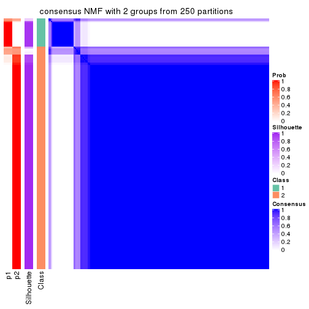</p>

</div>
<div id='tab-ATC-NMF-consensus-heatmap-2'>
<pre><code class="r">consensus_heatmap(res, k = 3)
</code></pre>

<p>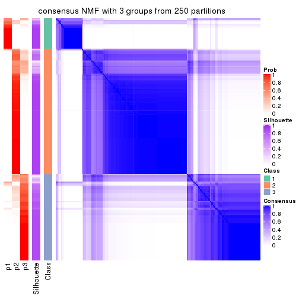</p>

</div>
<div id='tab-ATC-NMF-consensus-heatmap-3'>
<pre><code class="r">consensus_heatmap(res, k = 4)
</code></pre>

<p>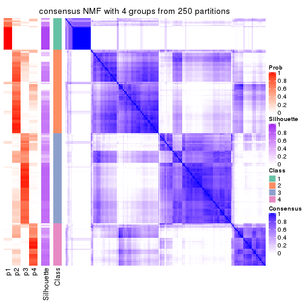</p>

</div>
<div id='tab-ATC-NMF-consensus-heatmap-4'>
<pre><code class="r">consensus_heatmap(res, k = 5)
</code></pre>

<p>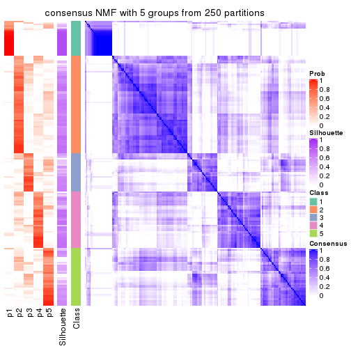</p>

</div>
<div id='tab-ATC-NMF-consensus-heatmap-5'>
<pre><code class="r">consensus_heatmap(res, k = 6)
</code></pre>

<p>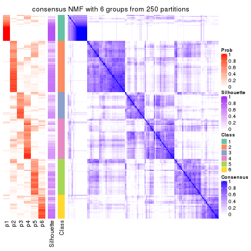</p>

</div>
</div>

Heatmaps for the membership of samples in all partitions to see how consistent they are:


<script>
$( function() {
	$( '#tabs-ATC-NMF-membership-heatmap' ).tabs();
} );
</script>
<div id='tabs-ATC-NMF-membership-heatmap'>
<ul>
<li><a href='#tab-ATC-NMF-membership-heatmap-1'>k = 2</a></li>
<li><a href='#tab-ATC-NMF-membership-heatmap-2'>k = 3</a></li>
<li><a href='#tab-ATC-NMF-membership-heatmap-3'>k = 4</a></li>
<li><a href='#tab-ATC-NMF-membership-heatmap-4'>k = 5</a></li>
<li><a href='#tab-ATC-NMF-membership-heatmap-5'>k = 6</a></li>
</ul>
<div id='tab-ATC-NMF-membership-heatmap-1'>
<pre><code class="r">membership_heatmap(res, k = 2)
</code></pre>

<p>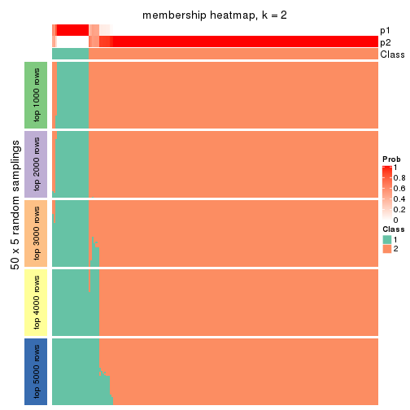</p>

</div>
<div id='tab-ATC-NMF-membership-heatmap-2'>
<pre><code class="r">membership_heatmap(res, k = 3)
</code></pre>

<p>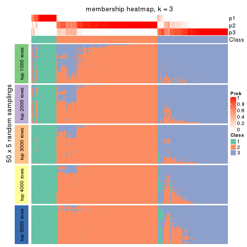</p>

</div>
<div id='tab-ATC-NMF-membership-heatmap-3'>
<pre><code class="r">membership_heatmap(res, k = 4)
</code></pre>

<p>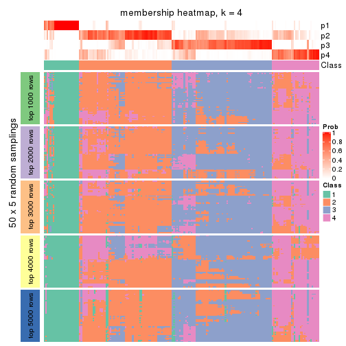</p>

</div>
<div id='tab-ATC-NMF-membership-heatmap-4'>
<pre><code class="r">membership_heatmap(res, k = 5)
</code></pre>

<p>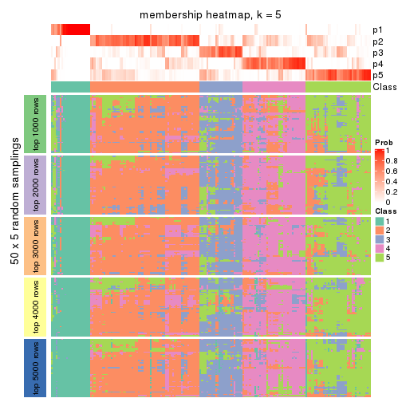</p>

</div>
<div id='tab-ATC-NMF-membership-heatmap-5'>
<pre><code class="r">membership_heatmap(res, k = 6)
</code></pre>

<p>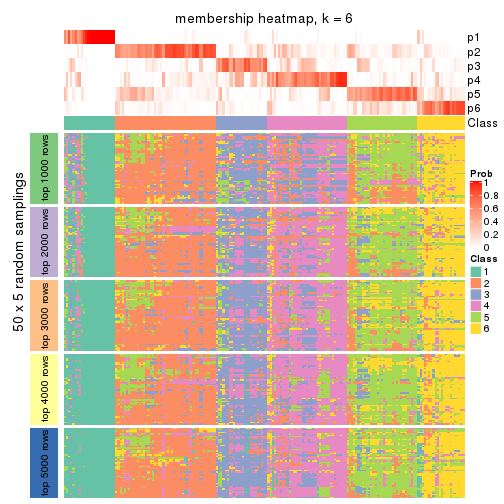</p>

</div>
</div>

As soon as we have had the classes for columns, we can look for signatures
which are significantly different between classes which can be candidate marks
for certain classes. Following are the heatmaps for signatures.


Signature heatmaps where rows are scaled:


<script>
$( function() {
	$( '#tabs-ATC-NMF-get-signatures' ).tabs();
} );
</script>
<div id='tabs-ATC-NMF-get-signatures'>
<ul>
<li><a href='#tab-ATC-NMF-get-signatures-1'>k = 2</a></li>
<li><a href='#tab-ATC-NMF-get-signatures-2'>k = 3</a></li>
<li><a href='#tab-ATC-NMF-get-signatures-3'>k = 4</a></li>
<li><a href='#tab-ATC-NMF-get-signatures-4'>k = 5</a></li>
<li><a href='#tab-ATC-NMF-get-signatures-5'>k = 6</a></li>
</ul>
<div id='tab-ATC-NMF-get-signatures-1'>
<pre><code class="r">get_signatures(res, k = 2)
</code></pre>

<p>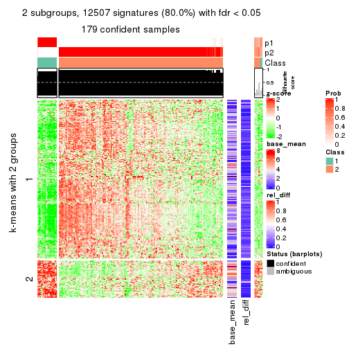</p>

</div>
<div id='tab-ATC-NMF-get-signatures-2'>
<pre><code class="r">get_signatures(res, k = 3)
</code></pre>

<p>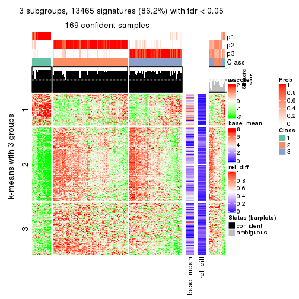</p>

</div>
<div id='tab-ATC-NMF-get-signatures-3'>
<pre><code class="r">get_signatures(res, k = 4)
</code></pre>

<p>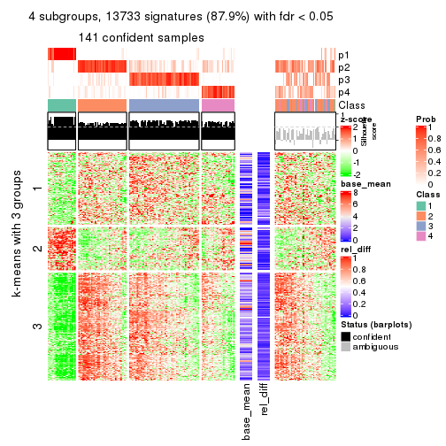</p>

</div>
<div id='tab-ATC-NMF-get-signatures-4'>
<pre><code class="r">get_signatures(res, k = 5)
</code></pre>

<p>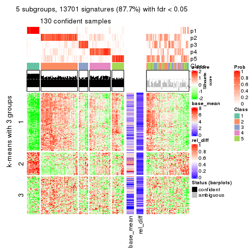</p>

</div>
<div id='tab-ATC-NMF-get-signatures-5'>
<pre><code class="r">get_signatures(res, k = 6)
</code></pre>

<p>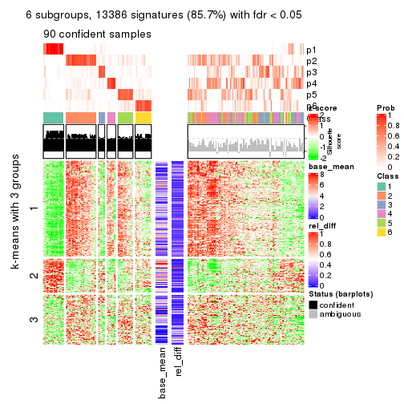</p>

</div>
</div>


Signature heatmaps where rows are not scaled:


<script>
$( function() {
	$( '#tabs-ATC-NMF-get-signatures-no-scale' ).tabs();
} );
</script>
<div id='tabs-ATC-NMF-get-signatures-no-scale'>
<ul>
<li><a href='#tab-ATC-NMF-get-signatures-no-scale-1'>k = 2</a></li>
<li><a href='#tab-ATC-NMF-get-signatures-no-scale-2'>k = 3</a></li>
<li><a href='#tab-ATC-NMF-get-signatures-no-scale-3'>k = 4</a></li>
<li><a href='#tab-ATC-NMF-get-signatures-no-scale-4'>k = 5</a></li>
<li><a href='#tab-ATC-NMF-get-signatures-no-scale-5'>k = 6</a></li>
</ul>
<div id='tab-ATC-NMF-get-signatures-no-scale-1'>
<pre><code class="r">get_signatures(res, k = 2, scale_rows = FALSE)
</code></pre>

<p>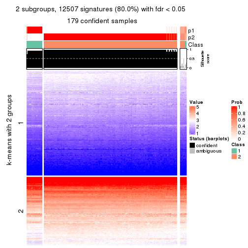</p>

</div>
<div id='tab-ATC-NMF-get-signatures-no-scale-2'>
<pre><code class="r">get_signatures(res, k = 3, scale_rows = FALSE)
</code></pre>

<p>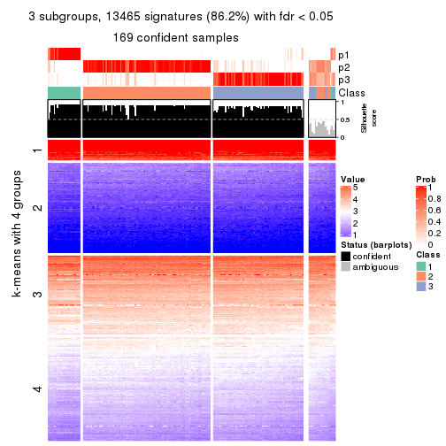</p>

</div>
<div id='tab-ATC-NMF-get-signatures-no-scale-3'>
<pre><code class="r">get_signatures(res, k = 4, scale_rows = FALSE)
</code></pre>

<p>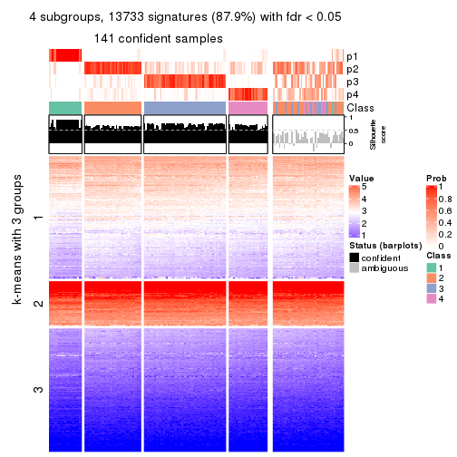</p>

</div>
<div id='tab-ATC-NMF-get-signatures-no-scale-4'>
<pre><code class="r">get_signatures(res, k = 5, scale_rows = FALSE)
</code></pre>

<p>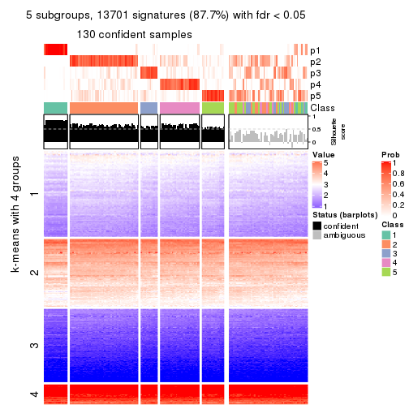</p>

</div>
<div id='tab-ATC-NMF-get-signatures-no-scale-5'>
<pre><code class="r">get_signatures(res, k = 6, scale_rows = FALSE)
</code></pre>

<p>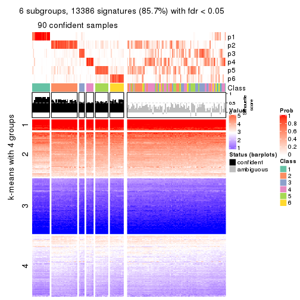</p>

</div>
</div>


Compare the overlap of signatures from different k:

```r
compare_signatures(res)
```

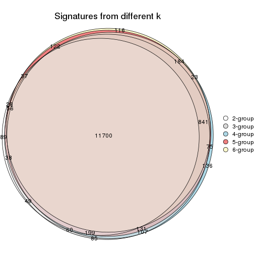

`get_signature()` returns a data frame invisibly. TO get the list of signatures, the function
call should be assigned to a variable explicitly. In following code, if `plot` argument is set
to `FALSE`, no heatmap is plotted while only the differential analysis is performed.

```r
# code only for demonstration
tb = get_signature(res, k = ..., plot = FALSE)
```

An example of the output of `tb` is:

```
#>   which_row         fdr    mean_1    mean_2 scaled_mean_1 scaled_mean_2 km
#> 1        38 0.042760348  8.373488  9.131774    -0.5533452     0.5164555  1
#> 2        40 0.018707592  7.106213  8.469186    -0.6173731     0.5762149  1
#> 3        55 0.019134737 10.221463 11.207825    -0.6159697     0.5749050  1
#> 4        59 0.006059896  5.921854  7.869574    -0.6899429     0.6439467  1
#> 5        60 0.018055526  8.928898 10.211722    -0.6204761     0.5791110  1
#> 6        98 0.009384629 15.714769 14.887706     0.6635654    -0.6193277  2
...
```

The columns in `tb` are:

1. `which_row`: row indices corresponding to the input matrix.
2. `fdr`: FDR for the differential test. 
3. `mean_x`: The mean value in group x.
4. `scaled_mean_x`: The mean value in group x after rows are scaled.
5. `km`: Row groups if k-means clustering is applied to rows.


UMAP plot which shows how samples are separated.


<script>
$( function() {
	$( '#tabs-ATC-NMF-dimension-reduction' ).tabs();
} );
</script>
<div id='tabs-ATC-NMF-dimension-reduction'>
<ul>
<li><a href='#tab-ATC-NMF-dimension-reduction-1'>k = 2</a></li>
<li><a href='#tab-ATC-NMF-dimension-reduction-2'>k = 3</a></li>
<li><a href='#tab-ATC-NMF-dimension-reduction-3'>k = 4</a></li>
<li><a href='#tab-ATC-NMF-dimension-reduction-4'>k = 5</a></li>
<li><a href='#tab-ATC-NMF-dimension-reduction-5'>k = 6</a></li>
</ul>
<div id='tab-ATC-NMF-dimension-reduction-1'>
<pre><code class="r">dimension_reduction(res, k = 2, method = &quot;UMAP&quot;)
</code></pre>

<p>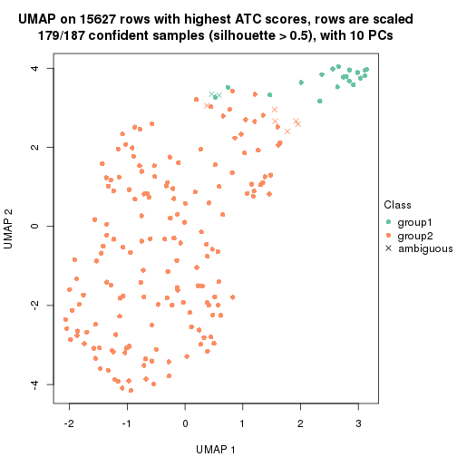</p>

</div>
<div id='tab-ATC-NMF-dimension-reduction-2'>
<pre><code class="r">dimension_reduction(res, k = 3, method = &quot;UMAP&quot;)
</code></pre>

<p>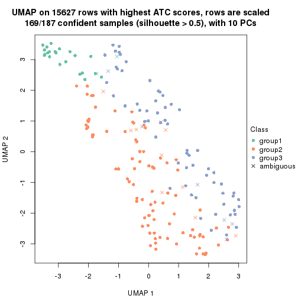</p>

</div>
<div id='tab-ATC-NMF-dimension-reduction-3'>
<pre><code class="r">dimension_reduction(res, k = 4, method = &quot;UMAP&quot;)
</code></pre>

<p>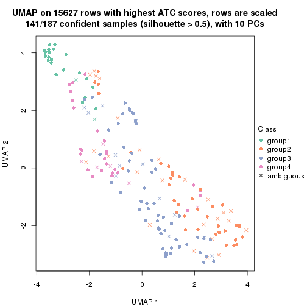</p>

</div>
<div id='tab-ATC-NMF-dimension-reduction-4'>
<pre><code class="r">dimension_reduction(res, k = 5, method = &quot;UMAP&quot;)
</code></pre>

<p>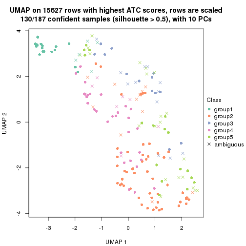</p>

</div>
<div id='tab-ATC-NMF-dimension-reduction-5'>
<pre><code class="r">dimension_reduction(res, k = 6, method = &quot;UMAP&quot;)
</code></pre>

<p>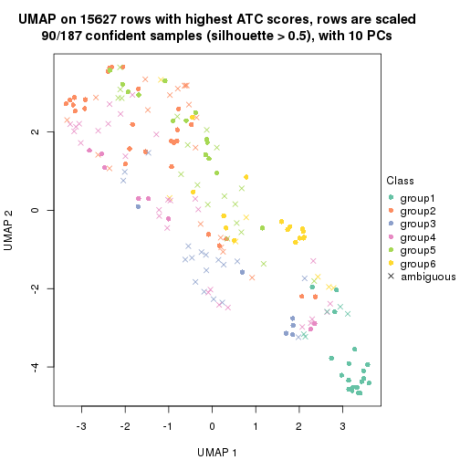</p>

</div>
</div>


Following heatmap shows how subgroups are split when increasing `k`:

```r
collect_classes(res)
```

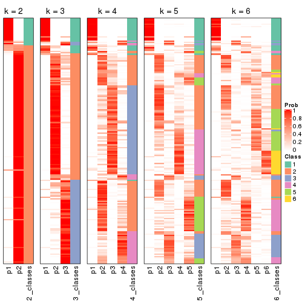


If matrix rows can be associated to genes, consider to use `GO_Enrichment(res,
...)` to perform function enrichment for the signature genes.


 

## Session info


```r
sessionInfo()
```

```
#> R version 3.6.0 (2019-04-26)
#> Platform: x86_64-pc-linux-gnu (64-bit)
#> Running under: CentOS Linux 7 (Core)
#> 
#> Matrix products: default
#> BLAS:   /usr/lib64/libblas.so.3.4.2
#> LAPACK: /usr/lib64/liblapack.so.3.4.2
#> 
#> locale:
#>  [1] LC_CTYPE=en_US.UTF-8       LC_NUMERIC=C               LC_TIME=en_US.UTF-8       
#>  [4] LC_COLLATE=en_US.UTF-8     LC_MONETARY=en_US.UTF-8    LC_MESSAGES=en_US.UTF-8   
#>  [7] LC_PAPER=en_US.UTF-8       LC_NAME=C                  LC_ADDRESS=C              
#> [10] LC_TELEPHONE=C             LC_MEASUREMENT=en_US.UTF-8 LC_IDENTIFICATION=C       
#> 
#> attached base packages:
#>  [1] grid      parallel  stats4    stats     graphics  grDevices utils     datasets  methods  
#> [10] base     
#> 
#> other attached packages:
#>  [1] genefilter_1.66.0           ComplexHeatmap_2.1.1        markdown_1.1               
#>  [4] knitr_1.26                  cola_1.3.2                  SummarizedExperiment_1.14.1
#>  [7] DelayedArray_0.10.0         BiocParallel_1.18.1         matrixStats_0.55.0         
#> [10] Biobase_2.44.0              GenomicRanges_1.36.1        GenomeInfoDb_1.20.0        
#> [13] IRanges_2.18.3              S4Vectors_0.22.1            BiocGenerics_0.30.0        
#> [16] GetoptLong_0.1.7           
#> 
#> loaded via a namespace (and not attached):
#>  [1] bitops_1.0-6           bit64_0.9-7            doParallel_1.0.15      RColorBrewer_1.1-2    
#>  [5] httr_1.4.1             backports_1.1.5        tools_3.6.0            R6_2.4.1              
#>  [9] DBI_1.0.0              lazyeval_0.2.2         colorspace_1.4-1       withr_2.1.2           
#> [13] tidyselect_0.2.5       gridExtra_2.3          bit_1.1-14             compiler_3.6.0        
#> [17] xml2_1.2.2             microbenchmark_1.4-7   pkgmaker_0.28          slam_0.1-46           
#> [21] scales_1.1.0           NMF_0.23.6             stringr_1.4.0          digest_0.6.23         
#> [25] XVector_0.24.0         pkgconfig_2.0.3        bibtex_0.4.2           highr_0.8             
#> [29] rlang_0.4.2            GlobalOptions_0.1.1    RSQLite_2.1.2          impute_1.58.0         
#> [33] shape_1.4.4            mclust_5.4.5           dendextend_1.12.0      dplyr_0.8.3           
#> [37] RCurl_1.95-4.12        magrittr_1.5           GenomeInfoDbData_1.2.1 Matrix_1.2-17         
#> [41] Rcpp_1.0.3             munsell_0.5.0          viridis_0.5.1          lifecycle_0.1.0       
#> [45] stringi_1.4.3          zlibbioc_1.30.0        plyr_1.8.4             blob_1.2.0            
#> [49] crayon_1.3.4           lattice_0.20-38        splines_3.6.0          annotate_1.62.0       
#> [53] circlize_0.4.9         zeallot_0.1.0          pillar_1.4.2           rjson_0.2.20          
#> [57] rngtools_1.4           reshape2_1.4.3         codetools_0.2-16       XML_3.98-1.20         
#> [61] glue_1.3.1             evaluate_0.14          vctrs_0.2.0            png_0.1-7             
#> [65] foreach_1.4.7          polyclip_1.10-0        gtable_0.3.0           purrr_0.3.3           
#> [69] clue_0.3-57            assertthat_0.2.1       ggplot2_3.2.1          xfun_0.11             
#> [73] gridBase_0.4-7         eulerr_6.0.0           xtable_1.8-4           skmeans_0.2-11        
#> [77] survival_2.44-1.1      viridisLite_0.3.0      tibble_2.1.3           iterators_1.0.12      
#> [81] memoise_1.1.0          AnnotationDbi_1.46.1   registry_0.5-1         GTF_0.0.1             
#> [85] cluster_2.1.0          brew_1.0-6
```


